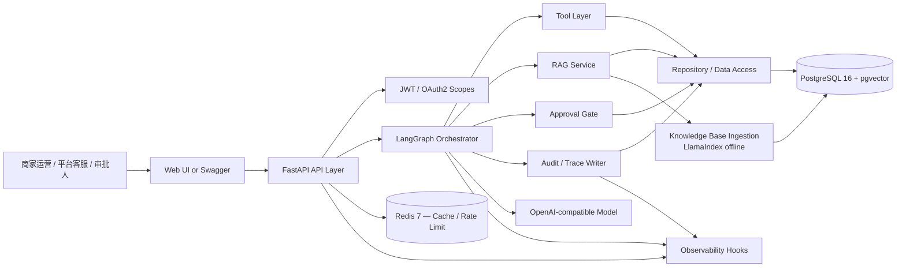
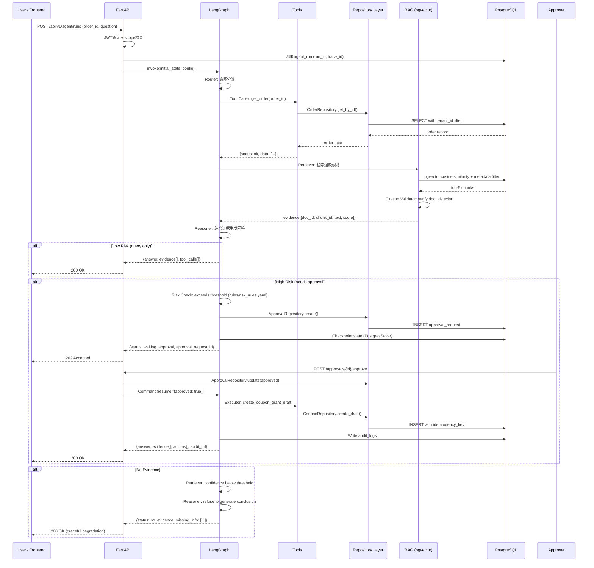
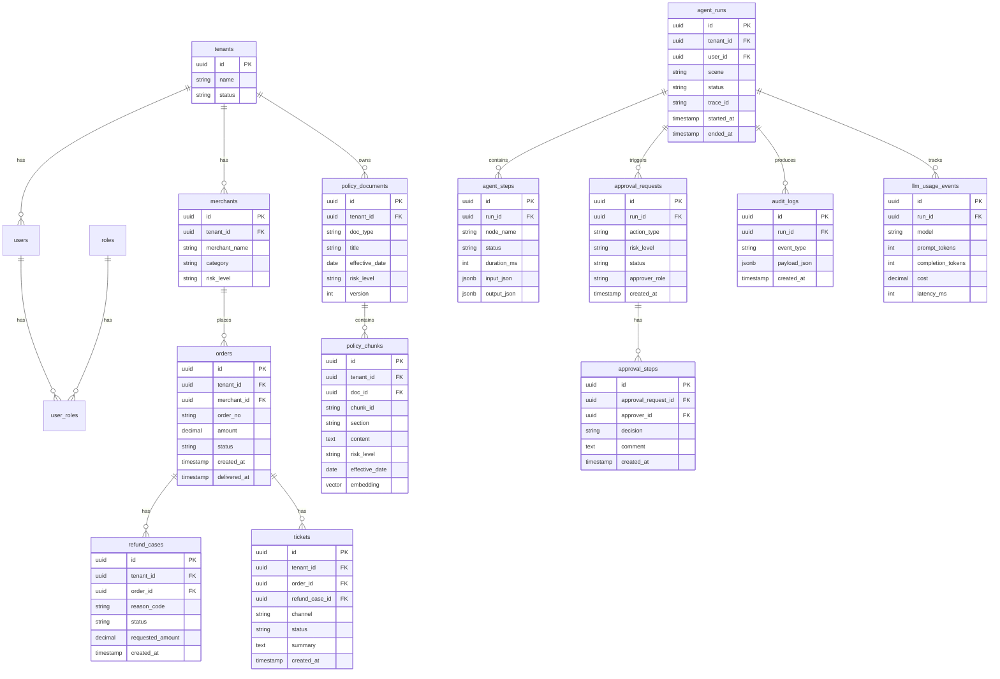
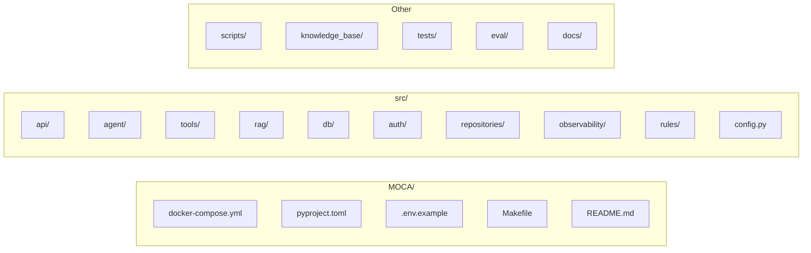
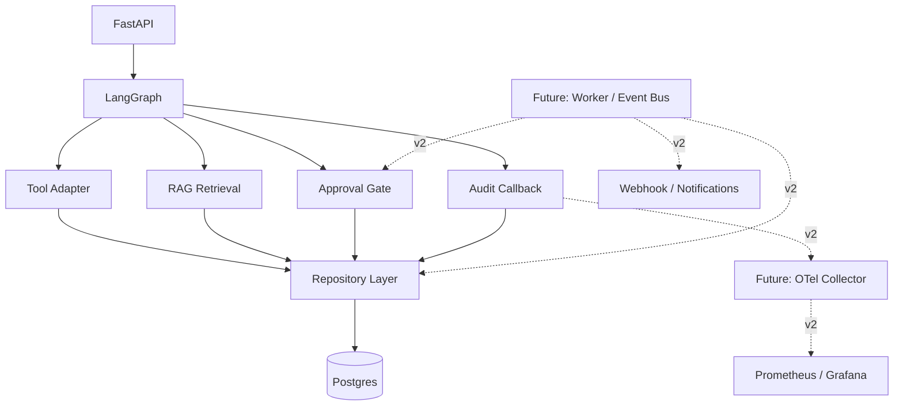
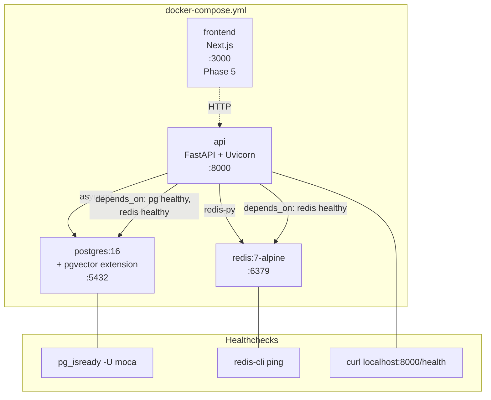
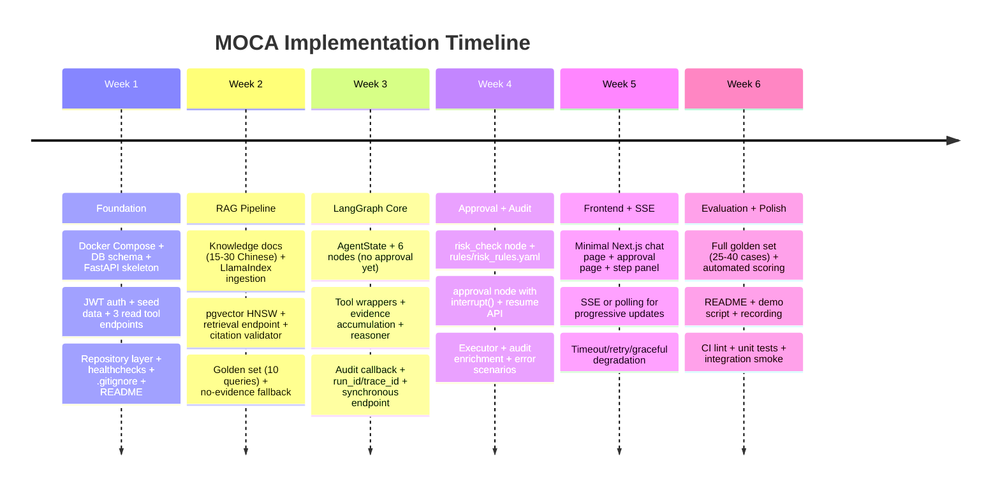

# MOCA System Architecture

> **Design Contract** — This document is the single source of truth for implementation decisions.
> All other planning docs defer to this file when there's a conflict.

## MVP Scope Contract

| Decision | Conclusion | Rationale |
|----------|-----------|-----------|
| Frontend | Minimal shell in Phase 5 (chat + approval + step panel) | Demo needs visual impact, but backend must work first |
| SSE | Phase 5; Phase 3 uses synchronous response | Avoid premature complexity while learning LangGraph |
| Session memory | Same-thread context via LangGraph checkpointer; no cross-session | Checkpointer gives this for free; cross-session is v2 |
| Directory | `src/` | Single convention, no ambiguity |
| Approval mechanism | `interrupt()` only | Newer API, cleaner than `interrupt_before` |
| Multi-tenant | `tenant_id` in all tables; app-layer filtering in MVP | Fields ready for RLS upgrade; README states this explicitly |
| High concurrency | Not promised; architecture supports scale-out path | MVP targets demo load only |

## System Architecture (Converged)



## LangGraph Execution Flow

```mermaid
graph TD
    START([User Question]) --> ROUTER

    ROUTER{Router Node<br/>LLM Intent Classification}
    ROUTER -->|query_only| RETRIEVER
    ROUTER -->|needs_tools| TOOL_CALLER
    ROUTER -->|needs_action| TOOL_CALLER

    TOOL_CALLER[Tool Caller<br/>get_order / get_refund / get_ticket]
    TOOL_CALLER --> RETRIEVER

    RETRIEVER[Retriever<br/>pgvector + Metadata Filter + Citation Validator]
    RETRIEVER --> REASONER

    REASONER{Reasoner<br/>LLM Evidence Synthesis}
    REASONER -->|no_action| RESPONSE
    REASONER -->|action_proposed| RISK_CHECK

    RISK_CHECK{Risk Check<br/>Rule-based — rules/risk_rules.yaml}
    RISK_CHECK -->|within_authority| EXECUTOR
    RISK_CHECK -->|needs_approval| APPROVAL_NODE

    APPROVAL_NODE[Approval Node<br/>interrupt&#40;&#41; — checkpoint to Postgres]
    APPROVAL_NODE -->|approved| EXECUTOR
    APPROVAL_NODE -->|rejected| RESPONSE

    EXECUTOR[Executor<br/>Write Tools + Rollback Info]
    EXECUTOR --> RESPONSE

    RESPONSE[Response Node<br/>Assemble Output + Write Audit]
    RESPONSE --> END_NODE([Return to User])

    style APPROVAL_NODE fill:#f9a825,stroke:#f57f17,color:#000
    style RISK_CHECK fill:#ffcc80,stroke:#ef6c00,color:#000
    style ROUTER fill:#81d4fa,stroke:#0277bd,color:#000
    style REASONER fill:#81d4fa,stroke:#0277bd,color:#000
```



## Data Flow — End to End



## Database Schema



## State Enumerations

| Table | Field | Allowed Values | Notes |
|-------|-------|---------------|-------|
| orders | status | `pending`, `paid`, `shipped`, `delivered`, `completed`, `cancelled`, `refunding` | `refunding` = refund in progress |
| refund_cases | status | `submitted`, `reviewing`, `approved`, `rejected`, `refunded`, `closed` | Terminal: `refunded`, `rejected`, `closed` |
| tickets | status | `open`, `in_progress`, `resolved`, `closed` | |
| approval_requests | status | `pending`, `approved`, `rejected`, `expired` | `expired` = timed out without decision |
| agent_runs | status | `running`, `waiting_approval`, `completed`, `failed`, `timeout` | |
| agent_steps | status | `running`, `completed`, `failed`, `skipped` | |
| tenants | status | `active`, `suspended` | |
| merchants | risk_level | `low`, `medium`, `high` | Affects approval threshold |
| policy_documents | doc_type | `refund_rule`, `compensation_sop`, `appeal_process`, `coupon_rule`, `high_risk_list` | |
| policy_documents | risk_level | `low`, `medium`, `high` | Indicates sensitivity of the rule |

**Amount precision:** All monetary fields use `DECIMAL(12,2)`, CNY assumed. Approval threshold defined in `rules/risk_rules.yaml`.

**Approval timeout:** Default 24h; configurable per action_type in `rules/risk_rules.yaml`. Expired approvals do not auto-resume — they require re-submission.

## Directory Structure (Converged)



```text
MOCA/
├── docker-compose.yml
├── pyproject.toml
├── .env.example
├── .gitignore
├── Makefile
├── README.md
├── alembic.ini
│
├── src/
│   ├── api/
│   │   ├── main.py                 # FastAPI app factory
│   │   ├── deps.py                 # DI: db session, auth, graph runner
│   │   ├── routers/
│   │   │   ├── agent.py            # POST /agent/runs
│   │   │   ├── approvals.py        # POST /approvals/{id}/approve|reject
│   │   │   ├── audit.py            # GET /audit-logs?run_id=
│   │   │   └── rag.py              # POST /rag/search (dev/test)
│   │   └── schemas/
│   │       ├── agent.py
│   │       └── approval.py
│   │
│   ├── agent/
│   │   ├── graph.py                # Graph definition + compilation
│   │   ├── state.py                # AgentState TypedDict
│   │   ├── nodes/
│   │   │   ├── router.py
│   │   │   ├── retriever.py
│   │   │   ├── tool_caller.py
│   │   │   ├── reasoner.py
│   │   │   ├── risk_check.py
│   │   │   ├── approval.py         # Uses interrupt() only
│   │   │   ├── executor.py
│   │   │   └── response.py
│   │   └── prompts/
│   │       ├── router.py
│   │       └── reasoner.py
│   │
│   ├── tools/
│   │   ├── base.py                 # ToolResult schema, error handling
│   │   ├── order.py
│   │   ├── refund.py
│   │   ├── ticket.py
│   │   ├── coupon.py
│   │   └── approval_tool.py
│   │
│   ├── repositories/               # Data access layer (tools -> repos -> db)
│   │   ├── base.py
│   │   ├── order_repo.py
│   │   ├── refund_repo.py
│   │   ├── ticket_repo.py
│   │   ├── approval_repo.py
│   │   └── audit_repo.py
│   │
│   ├── rag/
│   │   ├── ingest.py               # LlamaIndex offline pipeline
│   │   ├── retrieve.py             # Online: pgvector SQL via SQLAlchemy
│   │   ├── citation_validator.py   # Verify cited doc_ids exist in results
│   │   └── schemas.py
│   │
│   ├── db/
│   │   ├── models.py               # SQLAlchemy 2.0 async models
│   │   ├── session.py              # async engine + session factory
│   │   └── migrations/             # Alembic
│   │
│   ├── auth/
│   │   ├── jwt.py
│   │   └── permissions.py
│   │
│   ├── observability/              # Trace ID, metrics, logging hooks
│   │   ├── trace.py                # run_id / trace_id / step_id generation
│   │   ├── metrics.py              # latency, token, cost recording
│   │   └── audit_callback.py       # LangGraph callback for audit
│   │
│   ├── rules/                      # Externalized configuration
│   │   ├── risk_rules.yaml         # Thresholds per action type
│   │   └── permission_matrix.yaml  # Role -> scope mappings
│   │
│   └── config.py                   # pydantic-settings
│
├── scripts/
│   ├── seed_data.py
│   └── ingest_kb.py
│
├── knowledge_base/                 # Chinese policy documents (markdown)
│   ├── refund_rules.md
│   ├── compensation_sop.md
│   ├── merchant_faq.md
│   └── ...
│
├── tests/
│   ├── unit/
│   ├── integration/
│   ├── e2e/
│   └── conftest.py
│
├── eval/
│   ├── golden_set.yaml
│   └── reports/
│
└── docs/
    ├── architecture.md             # This file (symlink or copy)
    ├── adr/                        # Architecture Decision Records
    │   └── 001-single-graph.md
    └── demo-script.md              # 10-minute demo walkthrough
```

## Extensibility Architecture



## Deployment (MVP)



## Implementation Timeline (Converged — 6 weeks)



## Key Design Patterns

| Pattern | Description | Location |
|---------|-------------|----------|
| Tool as Thin Wrapper | validate → repo call → structured result (never raise) | `src/tools/` |
| Repository Layer | tools → repos → db; enables testing and future swap | `src/repositories/` |
| Evidence Accumulation | State collects evidence from tools + RAG; reasoner cites all | `agent/state.py` |
| Citation Validator | Post-process LLM output; verify cited IDs exist in retrieval | `src/rag/citation_validator.py` |
| Interrupt-Resume | `interrupt()` in approval node; resume via API + Command | `agent/nodes/approval.py` |
| Audit as Callback | LangGraph callback handler, not inline in nodes | `src/observability/audit_callback.py` |
| Layered Auth | API-level (JWT scopes) + Tool-level (tenant/role check) | `src/auth/` + tools |
| Configurable Rules | Risk thresholds in YAML, loaded at startup | `src/rules/risk_rules.yaml` |
| Graceful Degradation | LLM timeout → fallback; no evidence → refuse; tool error → structured error | All layers |
| Idempotent Writes | All write tools accept `idempotency_key` | `src/tools/` + `src/repositories/` |

---

*Architecture converged: 2026-05-09*
*This document resolves all prior conflicts between PROJECT.md, REQUIREMENTS.md, and research/ARCHITECTURE.md.*
