# contract-spec.md §9 Agentic 改造草案（第二版）

本文是 Phase 10 `gsd-discuss-phase` 的输入草案，仅用于讨论 `investigate` agentic 调查能力对 §8.4、§9.0-9.5、§10.1、§11.5、§12.4、§17.2、§17.3 的影响。本文 **非 normative**，尚未提升进 `docs/contract-spec.md`；任何规范变更均须经过后续讨论、裁决和正式 spec 更新。

## §8.4 BusinessContextV1

### **现状摘录**

> `BusinessContextV1` aggregates read-tool results under the same `TrustedContext`/tenant scope, must not include policy `EvidenceRefV1`, and its `status` drives `route_after_business_context`.

### **改写后（草案）**

`BusinessContextV1` aggregates read-tool results under the same `TrustedContext`/tenant scope, must not include policy `EvidenceRefV1`, and its `status` drives `route_after_investigate`.

`route_after_investigate` 必须联合判定 `BusinessContextV1.status`、`missing_required_facts`、tool errors、`retrieval_status`、`termination_reason`、`best_score` 和 intent。Business status 只表达业务事实调查结果；`retrieval_status` 只表达政策证据强度；tool errors 和 `termination_reason` 分别表达调用错误与 bounded-loop 终止原因，不得互相覆盖或混写。

### **改动理由**

合并调查节点后，`BusinessContextV1.status` 不再驱动已删除的 `route_after_business_context`，而是成为 `route_after_investigate` 的联合判定输入。保持不同 status 语义分离，避免业务事实不足、证据不足与 loop 截断被错误合并。

## §9.0 Canonical workflow vocabulary / 规范词汇

### **现状摘录**

> - **registered LangGraph node**：通过 `StateGraph.add_node(...)` 注册、可独立产生 node lifecycle event 的执行单元。Canonical node set 仅包含：`receive_request`、`normalize_input`、`intent_classification`、`clarification_gate`、`slot_extraction`、`session_memory_load`、`long_term_memory_retrieve`、`business_context_fetch`、`policy_evidence_retrieve`、`case_memory_retrieve`、`recommendation_generation`、`risk_gate`、`approval_gate`、`action_draft`、`action_execution`、`final_response`、`memory_write`、`trace_close`。
>
> - **router**：由 `add_conditional_edges(...)` 使用的 deterministic、side-effect-free 函数，只返回下一 registered node key。Canonical router set 仅包含：`route_after_intent`、`route_after_slots`、`route_after_business_context`、`route_after_policy_evidence`、`route_after_recommendation`、`route_after_risk`、`route_after_approval`、`route_after_action_draft`。
>
> - **service call / helper**：registered node 内部调用的 service 或 deterministic helper，例如 `KnowledgeService.search`、`BusinessToolService`、`resolve_slots`、`revalidate_edited_action`；它们不是 registered node，调用事件按 tool/service contract 记录。

### **改写后（草案）**

### 9.0 Canonical workflow vocabulary / 规范词汇

- **registered LangGraph node**：通过 `StateGraph.add_node(...)` 注册、可独立产生 node lifecycle event 的执行单元。Canonical node set 仅包含：`receive_request`、`normalize_input`、`intent_classification`、`clarification_gate`、`slot_extraction`、`session_memory_load`、`long_term_memory_retrieve`、`investigate`、`recommendation_generation`、`risk_gate`、`approval_gate`、`action_draft`、`action_execution`、`final_response`、`memory_write`、`trace_close`。
- **router**：由 `add_conditional_edges(...)` 使用的 deterministic、side-effect-free 函数，只返回下一 registered node key。Canonical router set 仅包含：`route_after_intent`、`route_after_slots`、`route_after_investigate`、`route_after_recommendation`、`route_after_risk`、`route_after_approval`、`route_after_action_draft`。`investigate` node 内部允许 bounded tool loop；这是 node-internal 行为，不改变 router 的确定性和 side-effect-free 契约。
- **bounded tool loop**：`investigate` registered node 内部的受控 tool 循环，由 LLM 在只读 allowlist 范围内决定下一次调查 tool / RAG call，并受 `max_iterations` 约束。该 loop 对外仍为 side-effect-free，不是 router，也不产生对外路由决策；loop 内每次 tool / RAG call 必须按 §17.2 发出独立 trace 事件。
- **path label**：图和路由表中的分支语义标签，例如 `policy_qa_path`、`action_request_path`、`direct_response`；它不执行、不注册，也不产生 node lifecycle event。
- **response mode**：`final_response.response_type` 的枚举值，用于选择安全模板或回复策略。`small_talk_response`、`unsupported_or_manual_review`、`business_fact_response`、`insufficient_evidence_response`、`direct_response` 均不是注册 node；它们只能作为 path label 或 response mode，并最终由 `final_response` 写出。
- **service call / helper**：registered node 内部调用的 service 或 deterministic helper，例如 `KnowledgeService.search`、`BusinessToolService`、`resolve_slots`、`revalidate_edited_action`；它们不是 registered node，调用事件按 tool/service contract 记录。
- **trusted context injection / API-auth boundary**：`security_context` 的默认语义。它由 API/auth dependency 和 graph config 注入，不能由用户或 LLM 覆盖；默认不注册为 LangGraph node。

### **改动理由**

将三类调查能力收敛为单个 canonical `investigate` node，同时明确 agentic loop 仅存在于 node 内部。这样既允许 LLM 受控选择只读工具，又不削弱 router 的确定性契约或扩大外部路由面。

## §9.1 Node list

### **现状摘录**

> 7. `long_term_memory_retrieve`
> 8. `business_context_fetch`
> 9. `policy_evidence_retrieve`
> 10. `case_memory_retrieve`
> 11. `recommendation_generation`
>
> 这份 node list 是概念能力清单，不表示执行顺序；实际执行顺序由 conditional routing 和 state contract 决定。

### **改写后（草案）**

### 9.1 Node list

目标 node list：

1. `receive_request`
2. `normalize_input`
3. `intent_classification`
4. `clarification_gate`
5. `slot_extraction`
6. `session_memory_load`
7. `long_term_memory_retrieve`
8. `investigate`（合并 business_context / policy_evidence / case_memory 三个概念子能力）
9. `recommendation_generation`
10. `risk_gate`
11. `approval_gate`
12. `action_draft`
13. `action_execution`
14. `final_response`
15. `memory_write`
16. `trace_close`

这份 node list 是概念能力清单，不表示执行顺序；实际执行顺序由 conditional routing 和 state contract 决定。

### **改动理由**

节点总数由 18 调整为 16，调查阶段的三个概念节点合并为一个 `investigate`。该合并不改变 node list 作为概念能力清单的定位。

## §9.2 State transition

### **现状摘录**

> 之后由 intent、confidence、slots、是否需要业务事实、是否需要政策证据、是否产生 proposed action 共同决定后续路径。需要 slots 的路径必须先加载 session memory，再做 slot extraction 和 slot completeness 判断：
>
> 图中的 `business + policy + case memory`、`business + required policy evidence` 是 intent-specific path label，不是注册 node；`confidence ok?`、`intent router`、`slots complete after merge?`、`proposed action?`、`approval/action route`、`human response`、`execution mode` 是 router decision 的图示标签，不新增 canonical router。
>
>     G -->|policy_qa| I[policy_evidence_retrieve]
>     U -->|order_status_inquiry| J[business_context_fetch]
>     U -->|refund / compensation / ticket draft| K[business + policy + case memory]
>     U -->|action_request| L[business + required policy evidence]

### **改写后（草案）**

### 9.2 State transition

目标 graph 不应被设计成所有节点强制线性执行。更准确的模型是：

```text
common entry -> intent router -> intent-specific path -> optional risk/approval/action -> final/memory/trace
```

公共入口通常执行以下 registered nodes；`security_context` 表示两者之间的 trusted context injection / API-auth boundary，不是默认注册 node：

```text
receive_request -> [security_context injection] -> normalize_input -> intent_classification
```

之后由 intent、confidence、slots、调查目标、是否需要业务事实、是否需要政策证据、是否需要案例记忆、是否产生 proposed action 共同决定后续路径。需要 slots 的路径必须先加载 session memory，再做 slot extraction 和 slot completeness 判断：

```text
intent_classification -> session_memory_load -> slot_extraction -> resolve_slots -> route_after_slots
```

`resolve_slots` 是 deterministic helper，不必注册成 LangGraph 节点。它把当前 turn 显式 slots 与允许继承的 session slots 合并，并应用 freshness、scope、intent compatibility 规则。

下图没有单独画出 `appeal_or_unban` / `complaint_escalation` 分支；它们仍按 `primary_intent + requested_operation` 进入对应 domain route，并且任何需要 slots 的路径都必须先经过 `session_memory_load`。

图中的 `policy investigation`、`business fact investigation`、`business + policy + case memory investigation`、`business + required policy evidence investigation` 是 intent-specific path label，均统一进入 registered `investigate` node；它们不是注册 node。`confidence ok?`、`intent router`、`slots complete after merge?`、`proposed action?`、`approval/action route`、`human response`、`execution mode` 是 router decision 的图示标签，不新增 canonical router。

`investigate` 内部可以执行 bounded tool loop，以只读方式获取 business context、policy evidence 和 case memory；该 loop 不在 graph 中展开成额外 registered nodes 或 routers。

图中多个带 `final_response: response_type=...` 或 `final_response` 的方框是同一个 registered `final_response` node 的不同入边/response mode 展示，不表示注册多个 final-response nodes。

```mermaid
graph LR
    A[receive_request] --> B[security_context injection / API-auth boundary]
    B --> C[normalize_input]
    C --> D[intent_classification]
    D --> E{confidence ok?}
    E -->|no| F[clarification_gate]
    E -->|yes| G{intent router}

    G -->|small_talk / unsupported| H[final_response: response_type=direct_response]
    G -->|policy_qa / policy investigation| I[investigate]
    G -->|needs slots| S[session_memory_load]
    S --> T[slot_extraction]
    T --> U{slots complete after merge?}
    U -->|no| F
    U -->|order_status_inquiry / business fact investigation| I
    U -->|refund / compensation / ticket draft / business + policy + case memory investigation| I
    U -->|action_request / business + required policy evidence investigation| I

    I --> R0{route_after_investigate}
    R0 -->|missing required facts| F
    R0 -->|permission denied| N0[final_response]
    R0 -->|fact-only intent| N[final_response: response_type=business_fact_response]
    R0 -->|no / insufficient evidence| N2[final_response: response_type=insufficient_evidence_response]
    R0 -->|sufficient investigation context| M[recommendation_generation]

    M --> O{proposed action?}
    O -->|no| P[final_response]
    O -->|yes| Q[risk_gate]
    Q --> R{approval/action route}
    R -->|approval required| S2[approval_gate]
    R -->|auto allowed| T2[action_draft]
    R -->|blocked| P

    S2 --> U2{human response}
    U2 -->|accept + request approved| T2
    U2 -->|accept + next level pending| S2
    U2 -->|edit| Q
    U2 -->|respond / needs_info| Y
    U2 -->|reject / ignore / expired| P

    T2 --> V{execution mode}
    V -->|demo| P
    V -->|external| W2[action_execution]
    W2 --> P
    H --> X[memory_write]
    N0 --> X
    N --> X
    N2 --> X
    P --> X
    F --> X
    X --> Y[trace_close / lifecycle finalizer]
```



### **改动理由**

这是低优先级的一致性改动：graph 图不再把已合并的调查子能力表现为独立节点或含混的调查段框，而是统一进入 `investigate`。图仍保留 intent-specific path label，以表达不同 intent 对调查结果的需求差异。

## §9.3 Conditional routing

### **现状摘录**

> | `policy_qa` | 政策检索 + 引用回复 | `policy_evidence_retrieve`, `recommendation_generation`, `final_response` | business context、approval、action；无 proposed action 时可跳过 `risk_gate` |
> | `order_status_inquiry` | 读取订单/退款/工单事实并回复 | `session_memory_load`, `slot_extraction`, `business_context_fetch`, `final_response` | RAG、risk、approval、action，除非用户追问规则或动作 |
>
> - `policy_evidence_retrieve -> final_response(response_type=insufficient_evidence_response)`：当 retrieval_status 为 `no_evidence`，或 best_score 低于阈值。

### **改写后（草案）**

### 9.3 Conditional routing

#### Intent-level routing

| Intent / condition | 目标路径 | 必须节点 | 可跳过节点 |
| --- | --- | --- | --- |
| `small_talk` | 直接回复 | `final_response`, `trace_close` | slots、investigation、risk、approval、action |
| `unsupported` | 不支持说明或转人工 | `final_response`, `trace_close` | investigation、risk、approval、action |
| `policy_qa` | 政策调查 + 引用回复 | `investigate`, `recommendation_generation`, `final_response` | business context、case memory、approval、action；无 proposed action 时可跳过 `risk_gate` |
| `order_status_inquiry` | 读取订单/退款/工单事实并回复 | `session_memory_load`, `slot_extraction`, `investigate`, `final_response` | policy evidence、case memory、risk、approval、action，除非用户追问规则或动作 |
| `refund_troubleshooting` | 事实 + 政策证据 + 建议 | slots、`investigate`（business context + policy evidence）、recommendation | approval/action 取决于是否有 proposed action；case memory 按需调查 |
| `compensation_suggestion` | 事实 + 政策证据 + 风险判断 | slots、`investigate`（business context + policy evidence）、recommendation、risk | approval/action 取决于 risk 和 policy；case memory 按需调查 |
| `ticket_reply_draft` | 事实 + 政策证据 + 回复草稿 | slots、`investigate`（business context + policy evidence）、recommendation | action execution，除非要关闭/升级工单；case memory 按需调查 |
| `appeal_or_unban` | 申诉/解封事实、商家风险、政策证据与建议 | slots、`investigate`（business/merchant risk context + policy evidence）、recommendation、risk/approval | 仅 `advise` 且无 proposed action 时可跳过 action；`draft_action` / `execute_action` 必须经过完整 action safety path |
| `complaint_escalation` | 投诉/工单上下文、升级政策证据与建议/回复草稿 | slots、`investigate`（business/ticket context + escalation policy evidence）、recommendation 或 draft_reply | 仅回复草稿且无 escalation action 时可跳过 risk/approval；任何 escalation action 必须经过 risk/approval |
| `action_request` | 强制证据 + 风险 + 审批/动作 | slots、`investigate`（business context + required policy evidence）、recommendation、risk | 不能跳过 `risk_gate` |

#### Gate-level routing

- `intent_classification -> session_memory_load`：当 intent 需要订单、退款、工单、金额或商家上下文时，必须先加载 session memory，再做 slot completeness 判断。
- `session_memory_load -> slot_extraction`：slot extraction 使用当前 query，并可读取 session memory 中允许继承的 active slots。
- `slot_extraction -> clarification_gate`：当 `resolve_slots(current_slots, session_slots)` 后仍缺 required slots，或继承 slot 不满足 freshness/scope/intent compatibility。
- `investigate -> route_after_investigate`：`investigate` 完成 bounded tool loop 或命中终止条件后，必须将累积的 business context、policy evidence、case memory、tool errors 和 retrieval status 交给单一 deterministic router。
- `route_after_investigate -> final_response`：当任一只读 tool 返回 permission denied；当 intent 为 fact-only 且所需事实已取得时，使用 `business_fact_response`；当 retrieval error、`no_evidence` 或 best_score 低于阈值时，使用 `insufficient_evidence_response`。⚠️【待 discuss 替换】当前为一刀切 permission denied -> final；裁决倾向 3 主张改为「仅阻断依赖被拒资源的回答，保留同一 loop 已合法获得的独立事实」，须在 discuss 定稿后替换本文本。TrustedContext scope 检查红线保持不变（contract-spec.md:935-937），被拒资源不得出现在回复中，也不得经推断泄露。
- `route_after_investigate -> clarification_gate`：当调查后仍缺 required facts。
- `route_after_investigate -> recommendation_generation`：当不满足上述更高优先级分支，且已有足够调查上下文进入建议生成。
- `recommendation_generation -> risk_gate`：仅当生成 `proposed_action` 或存在动作风险信号。
- `risk_gate -> approval_gate`：当 approval policy required。
- `risk_gate -> action_draft`：低风险且 action policy 允许自动草稿。
- `risk_gate -> final_response`：只读诊断、无 proposed action、或动作被 policy 阻断。
- `approval_gate -> action_draft`：仅当 accept/approve 后 request status 为 `approved`、所有 required levels 均完成时可进入草稿，并且只授权审批记录绑定的精确 action payload hash。`next_level_pending` / request status `pending` 不得进入 `action_draft`。
- `approval_gate -> approval_gate`：accept/approve 只完成当前 level、下一 required level 仍 pending 时，保持审批流程并为下一 level interrupt；也可由 lifecycle finalizer 以 `interrupted` 收束本次 invocation。
- `approval_gate -> risk_gate`：edit 后必须写入 edited action revision，并重新校验 risk/policy/evidence binding，不能直接执行。
- `approval_gate -> trace_close`：respond 表示审批人要求补充信息；ApprovalService 写入 `needs_info`、`clarification_request_id` 和可展示的 clarification message 后，原 interrupted run 由 lifecycle finalizer 保持 `interrupted`，不进入普通 `clarification_gate -> final_response -> memory_write` completed path。
- `approval_gate -> final_response`：reject/cancelled/expired。
- `action_draft -> action_execution`：仅 external mode 且 adapter 允许执行时进入；demo mode 创建 durable draft 后直接进入 final_response。

### **改动理由**

Intent-level 表把原三类调查节点统一映射到 `investigate`，但继续明确每类 intent 所需的调查子能力。Gate-level routing 用单一 `route_after_investigate` 固化结果优先级，下游 recommendation、risk、approval 和 action 路由保持不变。

## §9.4 Node contract table

### **现状摘录**

> V3 contract pass 将 18 个目标节点定义为“概念节点”。MVP 实现可以合并若干节点，但必须保留以下 contract 语义。节点数不是验收标准；节点输入/输出、状态写入、side effect 和路由确定性才是验收标准。
>
> | `business_context_fetch` | resolved slots, trusted tool context | `business_context`, `tool_results`, `last_business_context_refs` | BusinessToolService read tools | read-only DB/API calls | not_found/permission/timeout -> fallback or clarification | `route_after_business_context` |
> | `policy_evidence_retrieve` | query, intent, business context, tenant | `policy_evidence` / `retrieved_evidence`, `evidence_refs` | KnowledgeService / RAG | read-only vector search | no evidence -> insufficient evidence response | `route_after_policy_evidence` |
> | `case_memory_retrieve` | case summary/query, tenant/merchant | `case_memory` | MemoryService case search | read-only memory search | unavailable -> continue without case memory | fixed -> `recommendation_generation` |

### **改写后（草案）**

### 9.4 Node contract table

V3 contract pass 将 16 个目标节点定义为“概念节点”。MVP 实现可以合并若干节点，但必须保留以下 contract 语义。节点数不是验收标准；节点输入/输出、状态写入、side effect 和路由确定性才是验收标准。

| Node | Required inputs | State writes | Service / LLM | Side effects | Error / fallback | Next router |
| --- | --- | --- | --- | --- | --- | --- |
| `receive_request` | `user_query`, trusted config: tenant/user/role/thread/run | reset ephemeral fields, initialize target `run_id`, `trace_steps` | Run context helper | create in-memory run context only | invalid input -> error response | fixed -> `normalize_input` |
| `normalize_input` | `user_query` | `normalized_query`, `locale`, optional parse hints | deterministic helper | none | fallback to raw query | fixed -> `intent_classification` |
| `intent_classification` | `normalized_query`, trusted context | `primary_intent`, `requested_operation`, `intent_confidence`, `secondary_intents`, `required_slots: RequiredSlotExpression`, `routing_hints`, `candidate_slots`; calibrated confidence only to eval metadata / `llm_outputs` | LLM structured output + optional deterministic pre-router | none | low confidence -> clarification | `route_after_intent` |
| `clarification_gate` | ordinary chat `missing_info` or low confidence reason | `clarification_request`, `final_response` candidate | deterministic template or small LLM | none | fallback generic clarification | fixed -> `final_response`；不处理 approval `respond` lifecycle |
| `session_memory_load` | tenant/user/thread, current intent | `session_memory`, inheritable `active_slots` | MemoryService session read | none | unavailable -> continue with empty session memory | fixed -> `slot_extraction` |
| `slot_extraction` | `normalized_query`, `session_memory`, `required_slots` | `extracted_slots`, resolved `active_slots` | LLM structured output + `resolve_slots` helper | none | validation failure -> empty current slots, route may clarify | `route_after_slots` |
| `long_term_memory_retrieve` | tenant/user/merchant scope, intent | `long_term_memory` | MemoryService search | none | unavailable -> continue without long-term memory | fixed -> `investigate` |
| `investigate` | resolved slots, query, intent, tenant/trusted tool context | `business_context`, `policy_evidence` / `retrieved_evidence`, `case_memory`, `tool_results`, `last_business_context_refs` | BusinessToolService read tools + KnowledgeService / RAG + MemoryService case search + LLM 决策 next tool；bounded tool loop with `max_iterations` | read-only DB/API/vector/memory calls（无写） | not_found/permission/timeout -> fallback/clarification；no evidence -> insufficient evidence response | `route_after_investigate` |
| `recommendation_generation` | business context, policy evidence, memory context | `recommendation`, `proposed_action`, `missing_info` | LLM structured output + citation validation | none | validation/citation failure -> insufficient evidence/manual review | `route_after_recommendation` |
| `risk_gate` | proposed_action, evidence refs, business context | `risk_assessment`, `approval_plan` | RiskPolicy + ApprovalPolicy | none | policy evaluation failure -> manual review / approval required | `route_after_risk` |
| `approval_gate` | approval_plan, exact action payload, `ActionSafetySnapshot` | `approval_result`, approval revision refs | ApprovalService + LangGraph interrupt | creates approval records; interrupts graph | expired/rejected/cancelled -> final response；respond -> interrupted lifecycle finalizer | `route_after_approval` |
| `action_draft` | approved or auto-allowed proposed action, matching `ActionSafetySnapshot` | `action_draft`; demo mode also writes `draft_outcome={status:not_executed_demo, external_side_effect:false}` | ActionDraftService / ActionExecutor.prepare | writes durable draft; never writes external execution record | conflict/invalid hash -> final error/manual review | `route_after_action_draft` |
| `action_execution` | action_draft, execution_mode=external, adapter allowlist | `action_result`, compensation metadata | ActionExecutor.execute | external write side effect only in external mode | unknown/timeout -> reconciling/manual review | fixed -> `final_response` |
| `final_response` | current state, recommendation/action/approval results | `final_response` | deterministic template first; optional final prompt | none | fallback safe error response | fixed -> `memory_write` |
| `memory_write` | final state, outcome, memory candidates | `memory_write_result`, session summary | MemoryService write policy | writes session memory; may enqueue long-term/case candidates | write failure logged; does not block user response | fixed -> lifecycle finalizer |
| `trace_close` | run status, trace events | persisted run/step/timeline refs | Observability service | writes audit trace on normal path | API/lifecycle finalizer must cover skipped cases | graph invocation terminal；run status may remain `interrupted` |

`investigate` bounded-loop 契约：

1. `investigate` 必须配置并执行硬性 `max_iterations`；达到上限后必须终止 loop，lifecycle status 仍为 `completed`，但必须在 state / `redacted_payload` 写独立 `termination_reason=max_iterations_reached`。`retrieval_status` 仍只表达 `strong_evidence | partial_evidence | no_evidence | error`，并按真实累积证据计算，不因截断强标 insufficient。
2. loop 内仅允许调用 §12.4 为 `investigate` 定义的只读 allowlist；每次 tool / RAG call 必须按 §17.2 发出独立 trace 事件。
3. loop 不得触发任何写动作，不得调用 write tool，不得绕过 `risk_gate`、`approval_gate`、`action_draft` 或 `action_execution`。Write tool 不由 LLM 直接调用；需要 approval 时不可绕过人审，但低风险且 action policy 允许时，仍可由 deterministic `risk_gate -> action_draft` 走 auto-allowed 路径。
4. `investigate` 对外仅提交累积 state 和终止状态给 `route_after_investigate`；它不得产生对外路由决策，且不得改变 router 的 deterministic、side-effect-free 契约。
5. `evidence_refs` 仍由 `recommendation_generation` / citation validator 写入（依据 contract-spec.md:585,605）；`investigate` 不得写 `evidence_refs`，避免未经 citation validation 的引用进入 `risk_gate` / snapshot builder。
6. `business_context` / `policy_evidence` / `case_memory` 是 `investigate` 的产出，按 intent 与调查计划条件性获取；`policy_qa` 等 policy-only 入口不要求先有 business context。

### **改动理由**

三行调查节点被合并为一个拥有联合输入、输出和只读服务面的 `investigate` contract。新增 bounded-loop 规范护栏，把迭代上限、工具权限、trace、写动作隔离和外部确定性作为验收语义。

## §9.5 Router contract table

### **现状摘录**

> Router functions are deterministic and side-effect free. They must return a valid node key for every valid state shape and must not call LLMs, tools, repositories, external APIs, or services.
>
> | `route_after_business_context` | `business_context`, tool errors, intent | permission denied -> final; missing required facts -> clarify; fact-only intent -> final; policy needed -> RAG | `final_response`, `clarification_gate`, `policy_evidence_retrieve`, `recommendation_generation` | safe final response |
> | `route_after_policy_evidence` | `retrieval_status`, `best_score`, evidence count, intent | retrieval error/no evidence -> final insufficient; case memory needed -> case memory; else recommendation | `final_response`, `case_memory_retrieve`, `recommendation_generation` | final insufficient evidence |

### **改写后（草案）**

### 9.5 Router contract table

Router functions are deterministic and side-effect free. They must return a valid node key for every valid state shape and must not call LLMs, tools, repositories, external APIs, or services.

| Router | Reads | Decision precedence | Possible routes | Invalid state behavior |
| --- | --- | --- | --- | --- |
| `route_after_intent` | ordinary-chat `primary_intent`, `requested_operation`, `intent_confidence`, `required_slots`, `routing_hints` | low confidence -> domain-specific high-risk route -> requested write/escalation operation -> direct response/policy/slots path | `clarification_gate`, `final_response`, `investigate`, `session_memory_load` | route to `clarification_gate`；任何 `approval_decision` 值均视为 untrusted invalid state |
| `route_after_slots` | `required_slots: RequiredSlotExpression`, `extracted_slots`, `session_memory.active_slots` | resolve current explicit slots first; inherit session slots only if fresh/scope-compatible; every `all_of` member and at least one member of each `any_of` group must be present | `clarification_gate`, `investigate`, `long_term_memory_retrieve` | route to `clarification_gate` |
| `route_after_investigate` | `business_context`, `policy_evidence`, `case_memory`, tool errors, `retrieval_status`, `termination_reason`, `best_score`, intent | permission denied -> final；missing required facts -> `clarification_gate`；fact-only intent -> final；retrieval error/no/insufficient evidence -> final insufficient；else -> `recommendation_generation`。⚠️【待 discuss 替换】当前为一刀切 permission denied -> final；裁决倾向 3 主张改为「仅阻断依赖被拒资源的回答，保留同一 loop 已合法获得的独立事实」，须在 discuss 定稿后替换本文本。TrustedContext scope 检查红线保持不变（contract-spec.md:935-937），被拒资源不得出现在回复中，也不得经推断泄露。 | `final_response`, `clarification_gate`, `recommendation_generation` | safe final response；证据不足/检索失败时落 insufficient_evidence_response，不得在缺证据时进入 recommendation_generation |
| `route_after_recommendation` | `proposed_action`, `risk_signals`, `missing_info` | missing required evidence -> final; proposed action/risk signal -> risk; answer-only -> final | `risk_gate`, `final_response` | final safe response |
| `route_after_risk` | `risk_assessment`, `approval_plan`, action policy | blocked -> final; approval required -> approval; auto allowed -> draft | `final_response`, `approval_gate`, `action_draft` | approval required/manual review |
| `route_after_approval` | trusted `approval_result.type`, approval request status, next-level status, revision | accept/approve + request `approved` -> draft；accept/approve + next level pending / request `pending` -> approval gate or interrupted lifecycle finalizer；edit -> risk；respond/needs_info -> lifecycle finalizer；reject/ignore/expired/cancelled -> final | `action_draft`, `approval_gate`, `risk_gate`, `trace_close`, `final_response` | final safe response without action |
| `route_after_action_draft` | `execution_mode`, adapter allowlist, draft status | demo -> final; external allowed -> execution; draft failed -> final | `final_response`, `action_execution` | final safe response |

### **改动理由**

删除两个阶段式调查 router，改由 `route_after_investigate` 对调查累积状态执行单一、固定优先级判断。Router 总体契约保持原文不变，LLM 的 next-tool 决策不会进入 router。

## §10.1 AgentState lifecycle / field registry

### **现状摘录**

> | Business context | `business_context`, `last_business_context_refs` | turn + session refs | BusinessToolService | business_context_fetch | full context reset each turn; refs may persist | replace context; merge refs by type/id | AgentStep / session refs |
> | Evidence context | `policy_evidence`, `retrieved_evidence`, `evidence_refs`, `retrieval_status`, `best_score` | turn + audit | KnowledgeService | policy_evidence_retrieve / recommendation_generation | retrieval result reset each turn; audit refs persist per run; `best_score` is eval/routing-only and never snapshot-hashed | merge/dedupe refs by `evidence_id`（`evidence_id = {doc_key}/{chunk_id}@{policy_version}`，policy_version 变化即视为不同 identity）; replace retrieval status/score | AgentStep evidence refs / eval |
>
> | `business_context` | `dict[str, Any]` | business_context_fetch / BusinessToolService | `route_after_business_context`, evidence, recommendation, risk | reset each turn; replace | AgentStep |
> | `last_business_context_refs` | `list[dict[str, Any]]` | business_context_fetch / MemoryService | session_memory_load, replay | merge by trusted type/id; may persist across same session | session memory / checkpoint |
> | `policy_evidence` | `list[dict[str, Any]]` | policy_evidence_retrieve / KnowledgeService | recommendation_generation, citation validator | reset each turn; replace raw/structured retrieval payload | AgentStep / replay |
> | `retrieval_status` | enum or null | policy_evidence_retrieve | `route_after_policy_evidence` | reset each turn; replace | AgentStep / replay |
> | `best_score` | float or null | policy_evidence_retrieve | `route_after_policy_evidence`, eval | reset each turn; replace; never snapshot-hashed | AgentStep / eval |

### **改写后（草案）**

AgentState lifecycle matrix 的受影响行改为：

| Field group | Example fields | Scope | Trusted source | Writer | Reset rule | Merge rule | Persisted? |
| --- | --- | --- | --- | --- | --- | --- | --- |
| Business context | `business_context`, `last_business_context_refs` | turn + session refs | BusinessToolService | investigate | full context reset each turn; refs may persist | replace context; merge refs by type/id | AgentStep / session refs |
| Evidence context | `policy_evidence`, `retrieved_evidence`, `evidence_refs`, `retrieval_status`, `best_score` | turn + audit | KnowledgeService | investigate / recommendation_generation | retrieval result reset each turn; audit refs persist per run; `best_score` is eval/routing-only and never snapshot-hashed | merge/dedupe refs by `evidence_id`（`evidence_id = {doc_key}/{chunk_id}@{policy_version}`，policy_version 变化即视为不同 identity）; replace retrieval status/score | AgentStep evidence refs / eval |

Evidence context writer 边界：`investigate` 写 retrieval payload，即 `policy_evidence`、`retrieved_evidence`、`retrieval_status`、`best_score`；`evidence_refs` 仍仅由 `recommendation_generation` / citation validator 写入。`investigate` 不得把未经 citation validation 的 retrieval refs 提升为 `evidence_refs`。

AgentState canonical field registry 的受影响行改为：

| Field | Type | Writer | Readers / router | Reset / merge | Persisted target |
| --- | --- | --- | --- | --- | --- |
| `business_context` | `dict[str, Any]` | investigate / BusinessToolService | `route_after_investigate`, evidence, recommendation, risk | reset each turn; replace | AgentStep |
| `last_business_context_refs` | `list[dict[str, Any]]` | investigate / MemoryService | session_memory_load, replay | merge by trusted type/id; may persist across same session | session memory / checkpoint |
| `policy_evidence` | `list[dict[str, Any]]` | investigate / KnowledgeService | recommendation_generation, citation validator | reset each turn; replace raw/structured retrieval payload | AgentStep / replay |
| `retrieval_status` | enum or null | investigate | `route_after_investigate` | reset each turn; replace；只表达 `strong_evidence | partial_evidence | no_evidence | error`，与 `termination_reason` 分离 | AgentStep / replay |
| `best_score` | float or null | investigate | `route_after_investigate`, eval | reset each turn; replace; never snapshot-hashed | AgentStep / eval |

### **改动理由**

合并后的 `investigate` 接管 business context 和 retrieval payload 的写入责任，所有旧调查节点/router 引用同步到新 canonical node/router。`evidence_refs` 的 writer 边界保持不变，`retrieval_status` 与 bounded-loop `termination_reason` 保持语义分离。

## §11.5 Clarification path

### **现状摘录**

> ```json
> {
>   "reason": "missing_required_slots",
>   "clarification_request_id": "clarify_123",
>   "questions": ["请提供订单号或退款单号。"],
>   "blocked_nodes": ["business_context_fetch", "action_draft"],
>   "resume_policy": "same_thread_only"
> }
> ```

### **改写后（草案）**

```json
{
  "reason": "missing_required_slots",
  "clarification_request_id": "clarify_123",
  "questions": ["请提供订单号或退款单号。"],
  "blocked_nodes": ["investigate", "action_draft"],
  "resume_policy": "same_thread_only"
}
```

### **改动理由**

Clarification response 的 `blocked_nodes` 必须引用 canonical registered node。三类调查节点合并后，缺少 required slots 时阻断的是统一 `investigate` 节点。

## §12.4 Node-level tool allowlist

### **现状摘录**

> | `business_context_fetch` | `get_order`, `get_refund_case`, `get_ticket`, `get_logistics`, `get_merchant_risk` |
> | `policy_evidence_retrieve` | `search_policy`, `search_sop` |
> | `case_memory_retrieve` | `search_case_memory` |
> | `recommendation_generation` | 无直接工具调用，只消费 context/evidence/memory |

### **改写后（草案）**

### 12.4 Node-level tool allowlist

| Node | Allowlist |
| --- | --- |
| `investigate` | `get_order`, `get_refund_case`, `get_ticket`, `get_logistics`, `get_merchant_risk`, `search_policy`, `search_sop`, `search_case_memory` |
| `recommendation_generation` | 无直接工具调用，只消费 context/evidence/memory |
| `risk_gate` | `risk_policy.evaluate`, `approval_policy.plan` |
| `approval_gate` | `approval_service.create_interrupt`, `approval_service.resume` |
| `action_draft` | `action_executor.create_draft` |
| `action_execution` | `action_executor.execute` |

`investigate` bounded loop 内每次 tool call 仍受本 allowlist 约束；loop 不得调用 allowlist 外的 tool，也不得调用任何 write tool。

### **改动理由**

合并后的 `investigate` 获得原三个调查节点只读工具的并集。显式补充 loop 级约束，避免 agentic next-tool 决策扩大权限。

## §17.2 Replay event contract V3

### **现状摘录**

> Phase 15 在此 minimal envelope 之上拥有 full `ReplayEventV3` enrichment（新增 `parent_operation_id`、`attempt`、`error` 等字段，并整合/验证已注册的 event types）。Phase 10-14 发出的事件必须符合该 minimal envelope，并由 §17.2 per-run sequence allocator contract 分配 `sequence`。
>
> 所有可回放事件必须通过统一 V3 event contract 表达，避免只依赖松散 `metrics_json` 或由 API 临时拼接不可验证字段。当前 `AgentRun`、`AgentStep`、`ApprovalStep`、`ActionDraft` 可作为过渡数据源；目标 contract 是 `ReplayEventV3`，未来可以落到独立 `agent_trace_events` 表。
>
>   "operation_id": "uuid",
>   "parent_operation_id": null,
>   "attempt": 1,
>
>   "redacted_payload": {
>     "status": "completed",
>     "summary": "safe human-readable summary",
>     "latency_ms": 42,
>     "policy_version": "refund-policy@2026-06-01"
>   },

### **改写后（草案）**

在 `Full Replay Service (Phase 15)` 的 `ReplayEventV3` JSON 示例之后增加以下 normative 说明；现有 schema 字段和 JSON 示例不修改：

1. 同一 node operation（例如 `investigate`）下允许存在多个 tool / RAG operations。正常（首次 attempt）tool / RAG operation 使用独立 `operation_id`，其 `parent_operation_id` 指向所属 node operation（如 `investigate`），`attempt=1`。retry attempt 按 contract-spec.md:1681-1682 既有规则创建新 `operation_id`，其 `parent_operation_id` 指向前一 attempt（或共同父 operation），并递增 `attempt`。这两种情形不冲突；Phase 15 validator 据此对 loop 内 retry tool / RAG calls 做 started/terminal 配对和父子绑定。
2. bounded tool loop 内所有 tool 和 RAG lifecycle events（`tool_call_*` 与 `rag_retrieval_*`）都必须在 `redacted_payload` 中增加 `iteration`，其值为从 1 开始的正整数，表示该调用属于第几轮 loop。回放方必须能够据此识别 policy/SOP 等 RAG 检索在内的完整 loop 轮次以及是否达到 `max_iterations`，且不得在该字段中放入 raw tool input/output、secret 或 PII。
3. Phase 10（minimal envelope）使用 Phase 10-owned 的 `tool_call_*` / `rag_retrieval_*`（contract-spec.md:1612,1618）、per-run `sequence` 和 `redacted_payload.iteration` 表达 loop 内多次调查调用的顺序；Phase 10 阶段不要求保证 `parent_operation_id` / `attempt` parent hierarchy。
4. Phase 15（enrichment）负责 `parent_operation_id` / `attempt` 的父子绑定与 retry 语义，并按第 1 条执行 validator 配对。
5. bounded loop 达到 `max_iterations` 时不新增 event type；使用现有 `node_completed`，保持 `redacted_payload.status=completed`，并写入独立 `redacted_payload.termination_reason=max_iterations_reached`。

以上说明仅明确既有 event types、`sequence`、`operation_id`、`parent_operation_id`、`attempt` 和 `redacted_payload` 的分阶段使用语义，属于 non-schema-breaking contract clarification，不新增或修改 `ReplayEventV3` schema 字段。

### **改动理由**

Phase 10 可用事件类型、per-run sequence 和 `iteration` 重建 bounded loop 顺序；Phase 15 再富化 parent/child operation 与 retry 关系，无需 schema breaking change。独立 `termination_reason` 可表达撞上限原因而不污染 lifecycle status 或 `retrieval_status`。

## §17.3 Trace spans

### **现状摘录**

> - `agent.node.business_context_fetch`
> - `agent.tool.get_order`
> - `agent.rag.search_policy`
> - `agent.llm.generate_recommendation`

### **改写后（草案）**

建议 span：

- `agent.run`
- `agent.node.receive_request`
- `agent.node.intent_classification`
- `agent.node.investigate`
- `agent.tool.get_order`
- `agent.rag.search_policy`
- `agent.llm.generate_recommendation`
- `agent.approval.create`
- `agent.approval.resume`
- `agent.action.create_draft`
- `agent.action.execute`

`agent.tool.*` / `agent.rag.*` 子 span 保留，并作为 `agent.node.investigate` 节点下 bounded loop 内的调查调用子 span；tool 与 RAG span 仍按调用性质区分，不因处于 loop 内而合并。

### **改动理由**

Canonical node span 名称同步为 `agent.node.investigate`，同时保留原有 tool/RAG 粒度以支持 loop 内每轮调查调用的观测与回放关联。

## ⚠️ 待 Claude 裁决的开放问题

- `max_iterations` 应是全局固定值、按 intent 配置，还是由 trusted config 按 tenant/policy 配置？其默认值和硬上限尚未裁决。
- `investigate` 达到 `max_iterations` 但已获得部分可用事实/证据时，`retrieval_status` 应统一标记为 insufficient，还是允许 recommendation 在明确披露证据不完整的前提下继续？→ 见裁决倾向（已细化）
- `permission denied` 的最高优先级是否应覆盖已经取得的其他可安全展示事实，还是仅阻止依赖被拒资源的回答？
- `long_term_memory_retrieve` 是否保持独立节点并固定进入 `investigate`，还是未来也应纳入 `investigate` 的 bounded tool loop？
- bounded loop 中 RAG 调用应发 `rag_retrieval_*` 事件、`tool_call_*` 事件，还是两者都发并建立 parent/child 关系？
- `redacted_payload.iteration` 是否也需要进入 minimal envelope 阶段的 Phase 10 emitter contract，还是仅在 Phase 15 full ReplayEventV3 enrichment 后成为强制要求？
- 达到 `max_iterations` 时是否需要新增专门 event type，或仅通过现有 node/tool 事件与 `redacted_payload` 状态表达？→ 见裁决倾向（已细化）
- 采纳表要求 `investigate` 的 State writes 只包含 business/context/retrieval/memory/tool-result 字段，同时要求达到上限时在 state 写 `termination_reason`；`termination_reason` 是否应正式加入 §9.4 State writes 与 §10.1 canonical field registry，须由 discuss 裁决。

---

## Claude 初步裁决倾向（给 discuss 当弹药，非最终裁决）

> 以下是 Claude 对上述 7 个开放问题的初步裁决倾向，已用仓库现状核对。标注「可降级」的项倾向在 discuss 直接定为已决；标注「必须 discuss」的是实质设计点。

1. **max_iterations 配置方式** —— 倾向：按 intent 配置（GAD-02 已定为 intent 准入必填字段，`DEFERRED-DECISIONS.md:67`）+ 全局硬上限兜底。默认 3、硬上限 5 仅为讨论参数，非 normative 定稿（GAD-01 护栏建议 3–5）。不按 tenant-policy 配（MVP 过度设计，且污染回放）。【半降级：形态已定，默认值/上限留 discuss 调参】

2. **撞 max_iterations 且已有部分证据** —— 倾向：复用现有 `retrieval_status=partial_evidence` + `allow_partial_evidence` 标志（`contract-spec.md:81,90`），不新造 evidence-status 逻辑。撞上限时按真实累积证据算 retrieval_status，不因「被截断」就强标 insufficient；同时必须写独立 `termination_reason=max_iterations_reached`，不能只靠 retrieval_status，截断轮次由 trace iteration 标注。`no_evidence` 对 policy-required action 仍强制 insufficient/manual review（`contract-spec.md:146`）不变。【可降级：现有契约已覆盖】

3. **permission denied 优先级** —— 倾向：不一刀切覆盖。permission denied 只阻断「依赖被拒资源的回答」，不抹掉已合法取得的其他事实（企业 RBAC 下坐席可能有权看订单、无权看商家风险，不应 over-block）。被拒资源不得出现在回复、不得绕道推断泄露。此条改 router precedence 语义，比草案 §9.5「permission denied -> final」更细。【必须 discuss：实质设计点】

4. **long_term_memory_retrieve 是否并入 investigate** —— 倾向：保持独立节点，不并入。理由：①其 identity/scope 语义属 Phase 16（memory_identity.v1/tombstone），与只读调查 allowlist 是两套契约；②它是 `fixed -> investigate` 的前置加载，非「调查中按需取」；③Phase 16 deferred-beyond-MVP，并入会提前绑定未落地契约。【可降级：边界清晰】

5. **loop 内 RAG 调用的事件类型** —— 倾向：发 `rag_retrieval_*`，不发 `tool_call_*`，不重复。按工具性质分类（search_policy/search_sop 是 RAG 检索归 rag_retrieval_*；get_* 归 tool_call_*），不按「是否在 loop 里」分类。不「都发」——同一检索发两类事件会让 Phase 15 started/terminal pairing 出现配对歧义。待 discuss 细化：search_case_memory（向量检索但语义是 case memory）归哪类。【必须 discuss：Phase 15 真契约】

6. **iteration 落地阶段** —— 倾向：Phase 10 emitter 首次 emit 就带 iteration，不留到 Phase 15。理由：§17.2 原则是「首次 emit 就携带，Phase 15 不得事后编造」（`contract-spec.md:1607,1626`）；iteration 是运行时事实，backfill 无从还原。iteration 在 redacted_payload 内部、非 envelope 顶层，所以「Phase 10 就带」不违反 minimal envelope 不 retrofit 原则。【可降级：原则已定】

7. **撞 max_iterations 是否新增 event type** —— 倾向：不新增。用现有 `node_completed` 表达，lifecycle status 保持 `completed`，并写独立 `redacted_payload.termination_reason=max_iterations_reached` + 最后 iteration 值。为可用 payload 表达的状态开新 event type 不划算，且 enum 应保持克制。【可降级：形态与措辞已细化】

**净效果**：2、4、6、7 可直接降级为已决；1 半降级（形态定，留调参）；仅 3、5 是必须 discuss 的实质设计点。

---
