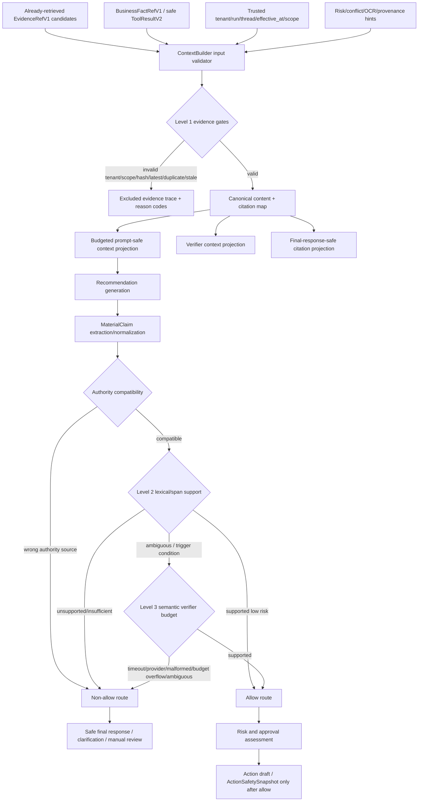

# Phase 22: RAG Context Builder + Hallucination Control - Research

**Researched:** 2026-06-19 [VERIFIED: environment current_date]  
**Domain:** RAG context construction, typed claim verification, deterministic hallucination-control routing, and action-boundary gating for MOCA's LangGraph/FastAPI backend [VERIFIED: .planning/phases/22-rag-context-builder-hallucination-control/22-CONTEXT.md] [VERIFIED: src/agent/graph.py]  
**Confidence:** HIGH for local architecture and phase constraints; MEDIUM for exact Level 2 heuristic thresholds because they are intentionally left to implementation discretion [VERIFIED: .planning/phases/22-rag-context-builder-hallucination-control/22-CONTEXT.md]

<user_constraints>
## User Constraints (from CONTEXT.md)

The following locked decisions, discretion areas, and deferred ideas are copied from `.planning/phases/22-rag-context-builder-hallucination-control/22-CONTEXT.md`; this block is the user decision source for the planner. [VERIFIED: .planning/phases/22-rag-context-builder-hallucination-control/22-CONTEXT.md]

### Locked Decisions

#### Scope / phase boundaries

1. **This phase owns a new RAG reasoning context layer, not prompt assembly in general.**
   - The phase should build a retrieval-after / reasoning-before `ContextBuilder` layer for RAG evidence grounding and claim verification.
   - It should be distinct from the existing `src/agent/context/ContextAssembler`, which remains the general prompt-safe block assembler.
   - The new layer owns evidence re-fetch/validation, citation map, risk labels, inclusion/exclusion traces, verifier projections, and final-answer-safe projections.
   - The planner should not collapse this into only adding more blocks to `ContextAssembler`.

2. **Inputs to the builder are already-retrieved evidence and current authority facts.**
   - Inputs include:
     - retrieved `EvidenceRefV1` candidates from existing retrieval,
     - current Tool System business fact refs / safe summaries,
     - trusted context such as `tenant_id`, `run_id`, `thread_id`, effective time, and scope,
     - risk/conflict hints from the graph.
   - User-authored or model-authored references must not be treated as authority refs.

3. **Output contract is a stable context bundle / reasoning context DTO.**
   - The implementation may name it `RagContextBundle`, `ReasoningContext`, or similar.
   - It must expose separate projections for:
     - prompt-safe model context,
     - verifier context,
     - debug/audit trace,
     - final-response-safe citations.
   - Raw verifier prompts, raw tool payloads, private reasoning, source-block raw metadata, OCR raw metadata, and unbounded policy text must not be exposed in ordinary prompts, memory, replay, action snapshots, or user-visible final answers.

#### Evidence / citation / context behavior

4. **Citation maps are required and must be stable.**
   - The bundle should maintain a citation map from model-facing citation IDs to canonical evidence refs.
   - It should record included, truncated, and excluded evidence with reason codes.
   - It should record budget decisions deterministically.
   - Protected citation metadata must not be dropped by trimming.

5. **Evidence validation must re-fetch canonical content and fail closed.**
   - Evidence refs are not trusted just because they came from a previous retrieval stage.
   - The builder/verifier must re-fetch canonical content through `PolicyKnowledgeService` or its repository-backed equivalent.
   - It must reject evidence that fails tenant/scope, duplicate-key, hash, freshness, or latest/current-version validation.
   - It must deduplicate duplicate evidence keys and record every exclusion reason.
   - The implementation should make latest/current policy version validity a visible acceptance point.

6. **Source-block / OCR / provenance data are not policy evidence identity.**
   - Phase 21 provenance and source-block metadata may be used to derive prompt-safe labels such as `ocr_low_confidence`, `table_extracted`, or `source_location_available`.
   - Raw source block IDs, bounding boxes, table cells, OCR text/confidence payloads, parser metadata, and provenance raw data must not be placed in ordinary prompts, final answers, memory, replay, business facts, or action snapshots.
   - This phase must not add source-block, OCR, provenance, business, or verifier fields to `EvidenceRefV1`.

#### Material claims / authority classes

7. **MVP claim types are exactly the minimum useful authority classes.**
   - Required classes:
     - `policy_claim`
     - `business_fact_claim`
     - `action_recommendation_claim`
   - Granular policy subtypes such as fee/deadline/eligibility/procedure are stretch only unless they fall out naturally as optional labels.

8. **Every material claim needs typed support metadata.**
   - Claim records should include:
     - stable `claim_id`,
     - `claim_text`,
     - authority class,
     - source node / generation stage,
     - risk level or risk hints,
     - cited policy evidence IDs where applicable,
     - business fact refs where applicable,
     - dependency claim IDs where applicable,
     - verifier status once checked.

9. **Policy claims can only be supported by current allowed policy evidence.**
   - A policy claim is supported only if backed by current, tenant/scope-allowed, hash-valid evidence from the active bundle.
   - Citation membership is necessary but not sufficient.
   - The verifier must distinguish "claim cited a known evidence ref" from "evidence actually supports the claim."

10. **Business fact claims can only be supported by Tool System authority.**
    - Current `BusinessFactRefV1`, safe `ToolResultV2`, or equivalent trusted Tool System output can support business facts.
    - Policy evidence cannot satisfy business facts.
    - Memory, case memory, prior summaries, and model knowledge cannot satisfy business facts.

11. **Action recommendation claims require both policy and business support.**
    - An action recommendation claim must depend on supported policy claims and supported current business fact claims.
    - Verification success must not bypass risk assessment, approval gates, action draft creation rules, or action snapshot binding.

12. **Existing `claim_dependency_map` semantics should be extended rather than bypassed.**
    - Permission denied / missing resource failures should block only dependent claims when dependencies are verifiable.
    - Unverifiable dependencies must fail closed.

#### Verification tiers

13. **Level 1 deterministic gates are mandatory and always on.**
    - Required gates:
      - bundle membership,
      - tenant/scope,
      - duplicate evidence key,
      - `text_hash`,
      - freshness / effective-at,
      - latest/current policy version,
      - authority-source compatibility,
      - required business fact presence.

14. **Level 2 is an ordinary low-cost support check.**
    - It should be deterministic or near-deterministic.
    - Use lexical/span/normalization support checks before any model verifier.
    - It should return typed outcomes such as `supported`, `unsupported`, `insufficient`, `ambiguous`, and `needs_semantic_review`.

15. **Level 3 semantic verification is conditional, not always-on.**
    - Trigger only for cases such as:
      - high-risk claims,
      - action recommendations,
      - conflict/stale evidence,
      - OCR-low-confidence evidence,
      - Level 2 ambiguous claims,
      - manual-review-sensitive outcomes.
    - Do not make live semantic verification required for every answer.

16. **Level 3 must have hard budgets and fail-closed behavior.**
    - Defaults to plan around:
      - max 6 claims per run,
      - max 3 evidence snippets per claim,
      - max 12,000 verifier chars per run,
      - 15s timeout,
      - 0 semantic-provider retries after provider/malformed output failure,
      - explicit config versioning for thresholds/budgets.
    - Provider timeout, malformed output, or budget overflow should route to manual review / insufficient evidence, not allow.

#### Routing / answer / action boundaries

17. **Non-allow outcomes route deterministically.**
    - Unsupported, missing citation, or cited-but-unsupported claims should route to regenerate only if bounded regeneration is separately accepted; otherwise to insufficient/refusal.
    - Conflicting, stale high-risk, OCR-low-confidence high-risk, semantic ambiguous, Level 3 timeout/provider error/malformed output should route to manual review for action/high-risk flows.
    - Unauthorized/scope-invalid/hash-mismatch/latest-version-invalid evidence must be excluded and cannot support claims.
    - Business fact missing should route to clarification/insufficient and block action recommendations.

18. **Any non-allow verification outcome blocks action creation.**
    - Non-allow means no proposed actions, no approvals, no action drafts, and no `ActionSafetySnapshot` evidence.
    - The model must never choose the route.

#### Evaluation / acceptance

19. **Hallucination-control acceptance is blocking.**
    - Safety golden cases must hit 100% pass before phase completion for:
      - unsupported claims,
      - cited-but-unsupported claims,
      - missing citations,
      - stale/conflicting evidence,
      - unauthorized/hash-mismatched evidence,
      - OCR low-confidence high-risk evidence,
      - business-data hallucination,
      - memory/evidence/action separation,
      - action recommendation missing policy or business support.

20. **Leakage tolerance is zero for unsafe internals.**
    - Tests should assert that ordinary prompts, final responses, memory, replay records, action snapshots, and user-visible answers do not include:
      - raw tool payloads,
      - retrieval debug traces,
      - verifier prompts/traces,
      - source-block raw metadata,
      - OCR raw metadata,
      - raw provenance,
      - private reasoning,
      - unbounded policy text.

21. **Metrics are required even if initial implementation is simple.**
    - Track at least:
      - claim support accuracy,
      - citation support accuracy,
      - refusal/manual-review route accuracy,
      - unsafe answer rate,
      - business-data hallucination rate,
      - leakage count,
      - Level 3 trigger rate,
      - timeout rate,
      - fail-closed rate.
    - Blocking defaults:
      - unsafe answer rate: 0,
      - business-data hallucination rate: 0,
      - leakage count: 0,
      - fail-closed rate on invalid/timeout/provider-error cases: 100%,
      - at least 95% claim/citation support accuracy on non-safety aggregate cases unless the planner justifies a different threshold.

22. **Default automated tests should not require live model calls.**
    - Semantic verifier behavior should be testable through deterministic fakes/mocks.
    - Live provider eval may be optional and separately gated, not part of the default phase test suite.

### Claude's Discretion

The implementation details below may be decided during planning/implementation:

- Exact module names and file split for `ContextBuilder`, material claims, verifier, and routing.
- DTO names and enum spellings, as long as semantics are stable and tests pin them.
- Exact Level 2 lexical/span support algorithm.
- Exact prompt wording for the verifier and final response templates, as long as leakage and routing constraints hold.
- Exact eval file names and command grouping.
- Whether low-cost optional labels such as `deadline`, `fee`, `eligibility`, `procedure` are included in the first implementation.

### Deferred Ideas (OUT OF SCOPE)

Do not plan these unless the user explicitly reopens scope:

- Bounded automatic regeneration implementation. The route enum may exist, but the actual retry/regeneration loop is stretch.
- Persisting a full long-term claim dependency graph beyond current state, unless implementation is trivial.
- A maintainer UI/CLI for inspecting verifier traces, beyond safe test/eval output.
- Granular policy-claim subtype taxonomy as a required MVP.
- Phase 23 query rewrite, reranking, retrieval planner, or search backend changes.
- Phase 17 external action execution, outbox dispatch, provider compensation, or delivery semantics.
- RAG-5 external `SearchBackend`, Vespa/OpenSearch/vector-DB abstraction work.
- Policy Source Operations UI or provenance editing UI.
</user_constraints>

<phase_requirements>
## Phase Requirements

Requirement descriptions in this section are sourced from `.planning/REQUIREMENTS.md`; the research support column maps each requirement to the verified planning guidance below. [VERIFIED: .planning/REQUIREMENTS.md]

| ID | Description | Research Support |
|----|-------------|------------------|
| CTX-01 | Build a `RagContextBundle`/equivalent prompt-safe context from candidate `EvidenceRefV1`, current business fact refs, trusted tenant/run/thread context, and risk/conflict hints. | Use a dedicated backend ContextBuilder that consumes existing retrieval outputs and Tool System refs, then emits prompt/verifier/debug/final projections. [VERIFIED: .planning/phases/22-rag-context-builder-hallucination-control/22-CONTEXT.md] |
| CTX-02 | Re-fetch canonical policy evidence content via `PolicyKnowledgeService` and exclude tenant/scope/duplicate-key/content/`text_hash`/freshness-invalid evidence. | Reuse and extend `PolicyKnowledgeService.get_verified_evidence_contents`; add latest/current and freshness checks without changing `EvidenceRefV1`. [VERIFIED: src/knowledge/service.py] |
| CTX-03 | Produce a stable citation map preserving canonical evidence identity while exposing prompt-safe citation IDs, snippets, display labels, and required metadata. | Build citation map over `EvidenceRefV1.evidence_id` plus prompt-safe labels/snippets; protected citation metadata must bypass trimming. [VERIFIED: src/knowledge/schemas.py] [VERIFIED: src/agent/context/budget.py] |
| CTX-04 | Deduplicate repeated evidence and merge adjacent same-document evidence without changing `EvidenceRefV1` identity or losing traceability. | Deduplicate by `(doc_key, chunk_id)` and record duplicate/merge traces; existing service already rejects duplicate keys for verified content. [VERIFIED: src/knowledge/service.py] |
| CTX-05 | Apply deterministic token/char budgeting that preserves protected citation metadata and records included/truncated/excluded entries with reason codes. | Extend existing protected-block budget behavior rather than using model-side trimming. [VERIFIED: src/agent/context/budget.py] |
| CTX-06 | Label freshness/authority/conflict/OCR/provenance-availability risks without making source-block/OCR/provenance part of evidence identity. | Use provenance only for prompt-safe risk labels; keep raw provenance/source-block/OCR out of projections and `EvidenceRefV1`. [VERIFIED: src/knowledge/provenance.py] [VERIFIED: tests/knowledge/test_phase21_boundaries.py] |
| CLM-01 | Create typed `MaterialClaim` records with at least `policy_claim`, `business_fact_claim`, and `action_recommendation_claim`. | Define Pydantic DTOs with `extra="forbid"` and pin enum values in tests. [CITED: https://pydantic.dev/docs/validation/latest/concepts/models/] |
| CLM-02 | Reject or invalidate a `policy_claim` that lacks current allowed `EvidenceRefV1` support from the active bundle. | Combine membership, re-fetch/hash/latest validation, and Level 2 support checks; existing membership alone is insufficient. [VERIFIED: src/knowledge/citation.py] [VERIFIED: tests/knowledge/test_citation_membership.py] |
| CLM-03 | Reject or invalidate a `business_fact_claim` that lacks current Tool System support via `BusinessFactRefV1`, safe `ToolResultV2`, or equivalent trusted source. | Treat Tool System refs as the only business authority; do not use policy evidence, memory, or model output as business support. [VERIFIED: src/tools/contracts.py] |
| CLM-04 | Reject or invalidate an `action_recommendation_claim` that lacks both supported policy and current business fact support; successful support never bypasses approval/action gates. | Make action recommendations dependent claims and route non-allow before `assess_risk_and_approval` can create proposed actions/snapshots. [VERIFIED: src/agent/nodes/assess_risk_and_approval.py] |
| CLM-05 | Prevent memory, prior summaries, case memory, parser/OCR provenance, or model knowledge from satisfying authority requirements. | Preserve current memory/context separation and test that contextual sources cannot become policy or business authority. [VERIFIED: src/agent/state.py] |
| VER-01 | Always run Level 1 deterministic gates for membership, tenant/scope, duplicate key, `text_hash`, freshness/effective-at, and authority compatibility. | Implement Level 1 as code-owned checks before model generation and before routing allow. [VERIFIED: src/knowledge/service.py] |
| VER-02 | Keep citation membership distinct from semantic support. | Existing `validate_membership` checks only known cited evidence IDs, so the verifier must add support checks. [VERIFIED: src/knowledge/citation.py] |
| VER-03 | Run a Level 2 lexical/span support check with typed outcomes. | Implement deterministic or near-deterministic support matching before optional semantic verification. [VERIFIED: .planning/phases/22-rag-context-builder-hallucination-control/22-CONTEXT.md] |
| VER-04 | Trigger Level 3 semantic verification only for configured high-risk/action/conflict/stale/OCR-low-confidence/Level 2 ambiguous cases. | Use a trigger policy and deterministic fake provider in default tests; avoid always-on live model verification. [VERIFIED: .planning/phases/22-rag-context-builder-hallucination-control/22-CONTEXT.md] |
| VER-05 | Enforce Level 3 budgets for claim count, evidence count, text/token budget, timeout, retries, and config version; fail closed on timeout/provider/malformed/budget overflow. | Pin default budgets from D-16 and route provider failures to manual review or insufficient evidence. [VERIFIED: .planning/phases/22-rag-context-builder-hallucination-control/22-CONTEXT.md] |
| VER-06 | Expose only redacted verifier status/reason codes/metrics/safe refs; keep raw verifier prompts/private reasoning/source-block/OCR/unbounded text out. | Use separate projections and existing prompt-safe projectors; never persist raw verifier prompts in ordinary state outputs. [VERIFIED: src/agent/context/projectors.py] |
| RTE-01 | Deterministically map verifier outcomes to allow, regenerate route, refusal, insufficient evidence, or manual review. | Add a backend route map and LangGraph conditional edge after recommendation generation; the model does not choose routes. [VERIFIED: src/agent/routing.py] [CITED: https://docs.langchain.com/oss/python/langgraph/graph-api] |
| RTE-02 | Handle unsupported, insufficient, conflict, stale, unauthorized, scope-invalid, hash-mismatch, OCR-low-confidence, business-fact-missing, and manual-review states. | Encode these as reason codes and route categories with golden tests. [VERIFIED: .planning/REQUIREMENTS.md] |
| RTE-03 | Integrate ContextBuilder/verification into recommendation generation so node-local logic does not diverge. | Replace local evidence re-fetch and membership-only checks in `generate_recommendation` with the shared ContextBuilder/verifier kernel. [VERIFIED: src/agent/nodes/generate_recommendation.py] |
| RTE-04 | Prevent non-allow outcomes from creating proposed actions, approvals, action drafts, or `ActionSafetySnapshot` evidence. | Gate before `assess_risk_and_approval`; current snapshot binding reads state evidence refs and must see only allow-verified refs. [VERIFIED: src/agent/nodes/assess_risk_and_approval.py] |
| RTE-05 | Produce safe final response language for insufficient/refusal/manual-review outcomes without dumping debug/provenance. | Extend deterministic final response templates with safe citations and reason categories only. [VERIFIED: src/agent/nodes/final_response.py] |
| BND-01 | Preserve `EvidenceRefV1` canonical identity and do not add `MaterialClaim`, source-block, OCR, provenance, business, or verifier fields to it. | Static tests already pin exact `EvidenceRefV1` fields; plan must add new DTOs separately. [VERIFIED: tests/knowledge/test_phase21_boundaries.py] |
| BND-02 | Preserve Phase 20 ranking behavior; do not add query rewrite, rerank, external API, or backend search changes. | ContextBuilder consumes already-retrieved candidates and must not alter retrieval scoring/ranking. [VERIFIED: .planning/ROADMAP.md] |
| BND-03 | Preserve Tool System authority boundaries; do not convert business facts into `EvidenceRefV1`. | Use `BusinessFactRefV1` and safe `ToolResultV2` for business claims. [VERIFIED: src/tools/contracts.py] |
| BND-04 | Preserve memory as contextual only, never authority. | Keep `case_memory` and summaries out of support sources and add negative tests. [VERIFIED: src/agent/state.py] |
| BND-05 | Preserve Phase 21 provenance boundaries; source-block/OCR/provenance remain internal/debug/maintainer lookup unless represented as prompt-safe risk labels. | Reuse `EvidenceProvenance` only for safe labels and maintainer/debug traces. [VERIFIED: src/knowledge/provenance.py] |
| EVAL-01 | Add golden cases for supported, cited-but-unsupported, missing citations, stale, conflict, unauthorized, hash-mismatch, OCR-low-confidence, and insufficient evidence. | Build a JSONL or pytest dataset and a deterministic harness with 100% blocking safety cases. [VERIFIED: .planning/REQUIREMENTS.md] |
| EVAL-02 | Add golden cases proving business facts cannot be inferred from policy, policy claims cannot be supported by business facts/memory, and action recommendations require both supports. | Include authority-class negative cases in verifier and route tests. [VERIFIED: .planning/REQUIREMENTS.md] |
| EVAL-03 | Add golden route cases for unsupported/conflict/stale/unauthorized/hash/OCR/business-missing outcomes. | Test route map directly and graph integration after recommendation generation. [VERIFIED: src/agent/routing.py] |
| EVAL-04 | Add leakage tests for raw tool payloads, retrieval debug, verifier traces, source-block/OCR/raw provenance, private reasoning, and unbounded policy text. | Extend existing prompt-safe projector and Phase 21 boundary tests. [VERIFIED: tests/agent/context/test_assembler.py] [VERIFIED: tests/knowledge/test_phase21_boundaries.py] |
| EVAL-05 | Report metrics for claim/citation support accuracy, route accuracy, unsafe answer rate, business hallucination rate, leakage count, Level 3 trigger rate, timeout rate, and fail-closed rate. | Add an eval script that summarizes golden-case outcomes and fails blocking thresholds. [VERIFIED: .planning/REQUIREMENTS.md] |
</phase_requirements>

## Summary

Phase 22 should be planned as a backend reasoning-safety kernel inserted after retrieval and before recommendation/action logic, not as a retrieval upgrade or a prompt-formatting-only change. [VERIFIED: .planning/phases/22-rag-context-builder-hallucination-control/22-CONTEXT.md] The current code already has `EvidenceRefV1`, `PolicyKnowledgeService` verified content lookup, prompt-safe projection utilities, citation membership checks, LangGraph routing, and action snapshot binding, but recommendation generation currently performs local re-fetching and membership-only claim validation that can pass a cited-but-unsupported claim. [VERIFIED: src/knowledge/schemas.py] [VERIFIED: src/knowledge/service.py] [VERIFIED: src/agent/nodes/generate_recommendation.py] [VERIFIED: tests/knowledge/test_citation_membership.py]

The implementation plan should create a separate ContextBuilder/verifier module that validates evidence, builds a stable citation map, emits separated prompt/verifier/debug/final projections, generates or normalizes typed material claims, runs Level 1/2 checks deterministically, conditionally invokes Level 3 through a budgeted provider abstraction, and maps every non-allow outcome to deterministic safe routes before action creation. [VERIFIED: .planning/ROADMAP.md] [VERIFIED: src/agent/graph.py] This respects the locked boundary that Phase 22 does not change Phase 20 ranking, Phase 23 query rewrite/rerank, Phase 17 external execution, or `EvidenceRefV1` identity. [VERIFIED: .planning/phases/22-rag-context-builder-hallucination-control/22-CONTEXT.md]

Default verification should use pytest, deterministic fakes, and golden safety datasets; live model calls should remain optional and separately gated. [VERIFIED: .planning/phases/22-rag-context-builder-hallucination-control/22-CONTEXT.md] The highest-risk planning areas are latest/current policy-version validation, separating citation membership from semantic support, preventing authority-source collapse between policy/business/memory/action, and keeping raw verifier/provenance/tool/debug payloads out of prompts, memory, replay, final answers, and action snapshots. [VERIFIED: src/knowledge/citation.py] [VERIFIED: src/agent/context/projectors.py] [VERIFIED: tests/knowledge/test_phase21_boundaries.py]

**Primary recommendation:** Plan a dedicated `src/agent/rag_context/` kernel with DTOs, builder, claim verifier, route map, metrics, and graph integration after `generate_recommendation`, backed by golden tests before touching optional semantic-provider behavior. [VERIFIED: .planning/ROADMAP.md] [VERIFIED: src/agent/graph.py]

## Project Constraints (from CLAUDE.md)

- Phase-level plans and large changes in MOCA use the GSD plan/review flow plus independent Codex cross-review; small bug fixes do not need this workflow. [VERIFIED: CLAUDE.md]
- Codex review or execution results must be verified against repository code, documents, and tests with `rg`/grep-first inspection; findings must distinguish confirmed facts from missing evidence. [VERIFIED: CLAUDE.md]
- `docs/contract-spec.md` is the only normative contract source for MOCA contract semantics, but phase scope controls implementation details and delivery boundaries. [VERIFIED: CLAUDE.md]
- If implementation diverges from `docs/contract-spec.md`, the plan must leave a trace by either fixing the spec or adding MVP/target-state annotation and recording the decision under `.planning/`. [VERIFIED: CLAUDE.md]
- Deferred items must name a target phase and must not use vague "later" language. [VERIFIED: CLAUDE.md]
- Learning-plan and planning-style documents under `study_plan/` default to Chinese, but this phase artifact is under `.planning/` and is not constrained to Chinese by that rule. [VERIFIED: CLAUDE.md]

## Architectural Responsibility Map

| Capability | Primary Tier | Secondary Tier | Rationale |
|------------|--------------|----------------|-----------|
| Evidence candidate validation and canonical content lookup | API / Backend | Database / Storage | `PolicyKnowledgeService` and repository-backed lookup own tenant/hash/content validation; the database stores policy documents/chunks. [VERIFIED: src/knowledge/service.py] [VERIFIED: src/db/models.py] |
| Prompt-safe context and citation projection | API / Backend | LLM prompt consumer | Existing `ContextAssembler`, `TokenBudgetPolicy`, and projectors run in backend code before model calls. [VERIFIED: src/agent/context/assembler.py] [VERIFIED: src/agent/context/budget.py] |
| MaterialClaim DTO normalization | API / Backend | LLM structured output | Claims should be backend-validated Pydantic DTOs; LLM output is an input to validate, not an authority. [CITED: https://pydantic.dev/docs/validation/latest/concepts/models/] |
| Level 1 and Level 2 verification | API / Backend | — | Deterministic membership, tenant/scope/hash/freshness/authority and lexical/span checks should run in code. [VERIFIED: .planning/phases/22-rag-context-builder-hallucination-control/22-CONTEXT.md] |
| Level 3 semantic verification | API / Backend | External LLM provider | Backend code decides triggers, budgets, timeout, and fail-closed routing; optional provider returns structured output only. [VERIFIED: .planning/phases/22-rag-context-builder-hallucination-control/22-CONTEXT.md] [CITED: https://developers.openai.com/api/docs/guides/structured-outputs] |
| Deterministic route selection | API / Backend | LangGraph graph topology | Existing routing functions are code-owned and total; Phase 22 should add a route after recommendation verification. [VERIFIED: src/agent/routing.py] [VERIFIED: src/agent/graph.py] |
| Action-boundary hardening | API / Backend | Database / Storage | `assess_risk_and_approval` creates proposed actions and snapshot bindings, so non-allow verification must block before this node. [VERIFIED: src/agent/nodes/assess_risk_and_approval.py] |
| Golden safety evaluation and metrics | Test / Eval Infrastructure | API / Backend fixtures | Default tests must use deterministic fakes and local fixtures; metrics can be produced by pytest/eval scripts. [VERIFIED: .planning/phases/22-rag-context-builder-hallucination-control/22-CONTEXT.md] |

## Standard Stack

### Core

Use the repository's locked dependency set rather than upgrading during Phase 22; the phase is a safety/integration change, not dependency maintenance. [VERIFIED: pyproject.toml] [VERIFIED: uv.lock] [VERIFIED: uv run importlib.metadata]

| Library | Version | Purpose | Why Standard |
|---------|---------|---------|--------------|
| Python | 3.12.13 via `uv run python` | Backend runtime and tests | Project requires Python `>=3.12`; current environment resolves 3.12.13. [VERIFIED: pyproject.toml] [VERIFIED: uv run python --version] |
| Pydantic | 2.13.4 | DTO validation for context bundles, claims, verifier results, and route outcomes | Pydantic `BaseModel` validates untrusted data and supports `extra="forbid"` for rejecting unexpected fields. [VERIFIED: uv run importlib.metadata] [CITED: https://pydantic.dev/docs/validation/latest/concepts/models/] |
| LangGraph | 1.1.10 | Agent state graph, conditional routing, and recommendation/action flow integration | The project already uses `StateGraph`; LangGraph graphs are built from state, nodes, and edges. [VERIFIED: uv run importlib.metadata] [VERIFIED: src/agent/graph.py] [CITED: https://docs.langchain.com/oss/python/langgraph/graph-api] |
| LangChain OpenAI / LangChain Core | 1.2.1 / 1.3.3 | Existing model wrapper and structured-output integration | Current recommendation node uses `ChatOpenAI.with_structured_output`. [VERIFIED: uv run importlib.metadata] [VERIFIED: src/agent/nodes/generate_recommendation.py] |
| OpenAI SDK | 2.36.0 | Optional semantic verifier provider if enabled | OpenAI Structured Outputs support schema-constrained model output with `strict: true`, but strict mode accepts only supported JSON Schema shapes. [VERIFIED: uv run importlib.metadata] [CITED: https://developers.openai.com/api/docs/guides/structured-outputs] |
| SQLAlchemy / asyncpg / psycopg | 2.0.49 / 0.31.0 / 3.3.4 | Policy content lookup, current-version validation, and graph checkpoint storage | Existing repositories and database models use SQLAlchemy async patterns. [VERIFIED: uv run importlib.metadata] [VERIFIED: src/repositories/policy_chunk_repo.py] |
| pytest / pytest-asyncio | 9.0.3 / 1.3.0 | Default golden tests and deterministic fakes | Current project test infrastructure uses pytest with asyncio auto mode. [VERIFIED: uv run pytest --version] [VERIFIED: pyproject.toml] |

### Supporting

| Library / Module | Version | Purpose | When to Use |
|------------------|---------|---------|-------------|
| FastAPI | 0.136.1 | Existing API tier | Only for API-facing DTO exposure or safe debug endpoints; core verifier can stay service-level. [VERIFIED: uv run importlib.metadata] |
| `src/knowledge/service.py` | project-owned | Verified policy content and provenance lookup | Use as the authority gate for re-fetch/hash/tenant checks. [VERIFIED: src/knowledge/service.py] |
| `src/agent/context/*` | project-owned | Prompt-safe assembly, projection, and budget behavior | Reuse for final prompt assembly after the RAG context bundle is built. [VERIFIED: src/agent/context/assembler.py] |
| `src/tools/contracts.py` | project-owned | `BusinessFactRefV1`, `ToolResultV2`, safe tool summaries | Use as business fact authority; never convert business facts into `EvidenceRefV1`. [VERIFIED: src/tools/contracts.py] |
| Ruff | 0.15.12 | Lint and formatting checks | Use existing repository commands for implementation verification. [VERIFIED: uv run ruff --version] |
| Docker Compose / Docker | Docker 29.4.2 available | DB-backed integration tests when local Postgres is needed | Use only for tests that require live database state. [VERIFIED: docker --version] |

### Alternatives Considered

| Instead of | Could Use | Tradeoff |
|------------|-----------|----------|
| Project-owned ContextBuilder/verifier | New RAG framework such as LlamaIndex query engine changes | Out of scope because Phase 22 consumes already-retrieved evidence and must not alter retrieval/reranking/search backend behavior. [VERIFIED: .planning/phases/22-rag-context-builder-hallucination-control/22-CONTEXT.md] |
| Deterministic pytest golden harness | RAGAS/DeepEval/TruLens as blocking framework | Additional eval frameworks are unnecessary for required deterministic safety gates and would add dependency risk; live/provider eval is optional. [ASSUMED] |
| Existing `PolicyKnowledgeService` | Direct repository access from graph nodes | Service reuse keeps tenant/hash/provenance validation centralized and avoids node-local divergence. [VERIFIED: src/knowledge/service.py] |
| Pydantic DTOs | Hand-written dict validation | Pydantic already validates fields and can reject extras; hand validation would duplicate error-prone behavior. [CITED: https://pydantic.dev/docs/validation/latest/concepts/models/] |

**Installation:**

```bash
uv sync --extra dev
```

No new package is required for the recommended MVP stack. [VERIFIED: pyproject.toml] [ASSUMED]

**Version verification:** The local locked versions below were verified with `uv run python -c 'import importlib.metadata...'`; latest package metadata was checked against PyPI JSON on 2026-06-19. [VERIFIED: uv run importlib.metadata] [VERIFIED: PyPI JSON API]

| Package | Local Locked | Latest PyPI | Latest Upload Time | Recommendation |
|---------|--------------|-------------|--------------------|----------------|
| pydantic | 2.13.4 | 2.13.4 | 2026-05-06T13:43:02Z | Use locked version. [VERIFIED: PyPI JSON API] |
| fastapi | 0.136.1 | 0.137.2 | 2026-06-18T06:58:24Z | Do not upgrade in Phase 22 unless separately planned. [VERIFIED: PyPI JSON API] |
| langgraph | 1.1.10 | 1.2.6 | 2026-06-18T20:58:20Z | Do not upgrade in Phase 22 unless separately planned. [VERIFIED: PyPI JSON API] |
| langchain-openai | 1.2.1 | 1.3.2 | 2026-06-13T05:42:11Z | Use locked version for existing graph behavior. [VERIFIED: PyPI JSON API] |
| langchain-core | 1.3.3 | 1.4.8 | 2026-06-18T19:39:21Z | Use locked version for existing graph behavior. [VERIFIED: PyPI JSON API] |
| openai | 2.36.0 | 2.43.0 | 2026-06-17T17:06:53Z | Use locked version for optional provider abstraction. [VERIFIED: PyPI JSON API] |
| sqlalchemy | 2.0.49 | 2.0.51 | 2026-06-15T15:41:20Z | Use locked version. [VERIFIED: PyPI JSON API] |
| pytest | 9.0.3 | 9.1.0 | 2026-06-13T18:52:44Z | Use locked version for default tests. [VERIFIED: PyPI JSON API] |
| pytest-asyncio | 1.3.0 | 1.4.0 | 2026-05-26T09:56:02Z | Use locked version. [VERIFIED: PyPI JSON API] |

## Architecture Patterns

### System Architecture Diagram



The diagram reflects the required data flow: retrieved evidence enters the builder, deterministic gates run before model-facing context and before claim support, semantic verification is conditional, and non-allow outcomes stop before proposed actions or snapshots. [VERIFIED: .planning/phases/22-rag-context-builder-hallucination-control/22-CONTEXT.md] [VERIFIED: src/agent/graph.py] [VERIFIED: src/agent/nodes/assess_risk_and_approval.py]

### Recommended Project Structure

```text
src/
├── agent/
│   ├── rag_context/
│   │   ├── __init__.py
│   │   ├── schemas.py          # RagContextBundle, MaterialClaim, verifier/result/route DTOs
│   │   ├── builder.py          # evidence re-fetch, citation map, budget/exclusion trace
│   │   ├── claims.py           # claim normalization and dependency helpers
│   │   ├── verifier.py         # Level 1/2 checks plus Level 3 provider interface
│   │   ├── routing.py          # deterministic verifier-outcome-to-route map
│   │   └── metrics.py          # eval/run metric aggregation
│   ├── nodes/
│   │   ├── generate_recommendation.py
│   │   └── final_response.py
│   └── graph.py
├── knowledge/
│   └── service.py              # extend verified lookup metadata, not EvidenceRefV1
tests/
├── agent/rag_context/
├── knowledge/
└── evaluation/
scripts/
└── eval_phase22_hallucination.py
evaluation/golden/
└── phase22_hallucination_cases.jsonl
```

This structure is recommended because the current graph already separates context assembly, graph routing, knowledge service, and recommendation nodes; adding a `rag_context` package keeps Phase 22 concerns separated from generic prompt assembly and from retrieval. [VERIFIED: src/agent/context/assembler.py] [VERIFIED: src/agent/graph.py] [VERIFIED: src/knowledge/service.py]

### Pattern 1: Dedicated Retrieval-After ContextBuilder

**What:** Build a backend `ContextBuilder` that accepts retrieved `EvidenceRefV1` candidates, trusted context, business fact refs, and risk hints; it returns a validated bundle with included/truncated/excluded evidence, citation map, prompt-safe projection, verifier projection, and final-response-safe projection. [VERIFIED: .planning/phases/22-rag-context-builder-hallucination-control/22-CONTEXT.md]

**When to use:** Use it inside recommendation generation before constructing model prompts or interpreting model outputs. [VERIFIED: src/agent/nodes/generate_recommendation.py]

**Example:**

```python
from pydantic import BaseModel, ConfigDict

class RagContextBundle(BaseModel):
    model_config = ConfigDict(extra="forbid")
    tenant_id: str
    prompt_context: dict
    verifier_context: dict
    final_citations: list[dict]
    included_evidence_ids: list[str]
    excluded: list[dict]
    budget_trace: list[dict]
```

Pydantic `BaseModel` supports validated model instances and `extra="forbid"` rejects unexpected fields. [CITED: https://pydantic.dev/docs/validation/latest/concepts/models/]

### Pattern 2: Separate Projections for Prompt, Verifier, Debug, and Final Answer

**What:** Store canonical safe references once, then derive separate projections for each consumer. [VERIFIED: .planning/phases/22-rag-context-builder-hallucination-control/22-CONTEXT.md]

**When to use:** Use prompt projection for LLM context, verifier projection for support checks, debug projection for tests/maintainers, and final projection for user-visible citations. [VERIFIED: src/agent/context/projectors.py]

**Example:**

```python
def build_safe_final_citation(citation_id: str, ref: EvidenceRefV1, label: str) -> dict[str, str]:
    return {
        "citation_id": citation_id,
        "doc_key": ref.doc_key,
        "chunk_id": ref.chunk_id,
        "policy_version": ref.policy_version,
        "label": label,
    }
```

Existing projectors already filter unsafe keys such as raw payloads, private reasoning, debug traces, hashes, and parser/OCR internals for prompt-safe context. [VERIFIED: src/agent/context/projectors.py]

### Pattern 3: Typed MaterialClaim Authority Classes

**What:** Represent each material claim with an authority class and support refs, then verify the claim against only the allowed authority source for that class. [VERIFIED: .planning/phases/22-rag-context-builder-hallucination-control/22-CONTEXT.md]

**When to use:** Use after recommendation generation or after deterministic claim extraction from a structured recommendation draft. [VERIFIED: src/agent/nodes/generate_recommendation.py]

**Example:**

```python
from enum import StrEnum
from pydantic import BaseModel, ConfigDict

class AuthorityClass(StrEnum):
    POLICY_CLAIM = "policy_claim"
    BUSINESS_FACT_CLAIM = "business_fact_claim"
    ACTION_RECOMMENDATION_CLAIM = "action_recommendation_claim"

class MaterialClaim(BaseModel):
    model_config = ConfigDict(extra="forbid")
    claim_id: str
    claim_text: str
    authority_class: AuthorityClass
    cited_evidence_ids: tuple[str, ...] = ()
    business_fact_refs: tuple[str, ...] = ()
    dependency_claim_ids: tuple[str, ...] = ()
```

The exact field names are discretionary, but the three authority classes and source separation are locked. [VERIFIED: .planning/phases/22-rag-context-builder-hallucination-control/22-CONTEXT.md]

### Pattern 4: Tiered Verifier With Fail-Closed Level 3

**What:** Run deterministic Level 1 gates and Level 2 lexical/span support for ordinary cases; trigger a budgeted Level 3 semantic verifier only for configured high-risk or ambiguous conditions. [VERIFIED: .planning/phases/22-rag-context-builder-hallucination-control/22-CONTEXT.md]

**When to use:** Use Level 3 only after Level 2 returns `ambiguous`/`needs_semantic_review` or when risk/action/conflict/stale/OCR-low-confidence triggers apply. [VERIFIED: .planning/phases/22-rag-context-builder-hallucination-control/22-CONTEXT.md]

**Example:**

```python
def route_level3_failure(reason: str) -> str:
    if reason in {"timeout", "provider_error", "malformed_output", "budget_overflow"}:
        return "manual_review"
    return "insufficient_evidence"
```

OpenAI Structured Outputs can enforce schema-shaped provider output when live Level 3 is enabled, but provider failure or unsupported schemas must still be handled by backend fail-closed code. [CITED: https://developers.openai.com/api/docs/guides/structured-outputs]

### Pattern 5: Deterministic Routing Before Action Boundary

**What:** Convert verifier outcomes to a fixed route enum in backend code and add a LangGraph conditional edge before risk/action creation. [VERIFIED: src/agent/routing.py] [VERIFIED: src/agent/graph.py]

**When to use:** Use after recommendation generation and claim verification, before `assess_risk_and_approval`. [VERIFIED: src/agent/nodes/assess_risk_and_approval.py]

**Example:**

```python
def route_verified_recommendation(outcome: str, high_risk: bool) -> str:
    if outcome == "allow":
        return "assess_risk_and_approval"
    if outcome in {"unsupported", "missing_citation", "business_fact_missing"}:
        return "final_response"
    if high_risk or outcome in {"conflict", "stale", "level3_timeout"}:
        return "final_response"
    return "final_response"
```

LangGraph supports conditional edges for choosing the next node from state; routing logic should remain backend-owned rather than model-owned. [CITED: https://docs.langchain.com/oss/python/langgraph/graph-api]

### Anti-Patterns to Avoid

- **Using citation membership as semantic support:** Existing membership validation only checks that cited IDs exist in the candidate refs, so a false claim can pass membership if it cites a real evidence ID. [VERIFIED: src/knowledge/citation.py] [VERIFIED: tests/knowledge/test_citation_membership.py]
- **Adding fields to `EvidenceRefV1`:** Static boundary tests pin canonical fields and forbid adding material-claim, provenance, OCR, business, or verifier state to evidence identity. [VERIFIED: tests/knowledge/test_phase21_boundaries.py]
- **Letting `generate_recommendation` keep local support logic:** Local re-fetch and pseudo-claim membership create divergence from the shared verifier kernel. [VERIFIED: src/agent/nodes/generate_recommendation.py]
- **Treating source-block/OCR/provenance as user-visible evidence:** Phase 21 provenance is for internal/debug/maintainer lookup or prompt-safe labels, not raw prompt/final/memory/action data. [VERIFIED: src/knowledge/provenance.py] [VERIFIED: tests/knowledge/test_phase21_boundaries.py]
- **Making live semantic verification required for default tests:** Locked decisions require deterministic fakes/mocks and no live model calls for default automation. [VERIFIED: .planning/phases/22-rag-context-builder-hallucination-control/22-CONTEXT.md]

## Don't Hand-Roll

| Problem | Don't Build | Use Instead | Why |
|---------|-------------|-------------|-----|
| DTO validation and strict field rejection | Ad hoc dict validation | Pydantic `BaseModel` with `ConfigDict(extra="forbid")` | Pydantic validates untrusted input and rejects extras when configured. [CITED: https://pydantic.dev/docs/validation/latest/concepts/models/] |
| Graph branching after verification | Model-selected route strings | Existing LangGraph conditional edges and backend routing functions | LangGraph graphs are code-defined state/nodes/edges; the model must not choose safety routes. [CITED: https://docs.langchain.com/oss/python/langgraph/graph-api] |
| Structured Level 3 verifier parsing | Regex parsing of model text | Pydantic/LangChain structured output or OpenAI JSON schema strict output behind a provider interface | Structured output constrains response shape; backend still owns fail-closed handling. [CITED: https://docs.langchain.com/oss/python/langchain/structured-output] [CITED: https://developers.openai.com/api/docs/guides/structured-outputs] |
| Prompt assembly and protected trimming | New prompt string concatenator | Existing `ContextAssembler`, `PromptBlock`, and `TokenBudgetPolicy` | Existing code already protects safety constraints, business IDs, policy refs, and current user message. [VERIFIED: src/agent/context/budget.py] |
| Evidence content validation | Directly trusting retrieved snippets | `PolicyKnowledgeService.get_verified_evidence_contents` plus new latest/freshness metadata checks | The service already handles tenant, duplicate key, content presence, and text hash validation. [VERIFIED: src/knowledge/service.py] |
| Citation membership checking | Custom list membership scattered in nodes | Existing `validate_membership` as Level 1 membership only | Reusing the helper prevents drift, but it must not be treated as semantic support. [VERIFIED: src/knowledge/citation.py] |
| Business fact authority | Model-inferred merchant facts or policy-derived facts | `BusinessFactRefV1`, safe `ToolResultV2`, and equivalent trusted Tool System output | Tool System contracts already separate business facts from policy evidence. [VERIFIED: src/tools/contracts.py] |
| Action safety binding | New action snapshot semantics | Existing `assess_risk_and_approval` and `ActionSafetySnapshot` flow | Current action creation and snapshot binding already exist and should be gated rather than duplicated. [VERIFIED: src/agent/nodes/assess_risk_and_approval.py] |
| Golden safety metrics | Manual spreadsheet or prose review | pytest fixtures plus a deterministic eval script | Requirements demand repeatable blocking safety cases and metrics. [VERIFIED: .planning/REQUIREMENTS.md] |

**Key insight:** The hard part in this phase is not retrieving more evidence; it is preserving authority boundaries and enforcing deterministic fail-closed routes after evidence has already been retrieved. [VERIFIED: .planning/phases/22-rag-context-builder-hallucination-control/22-CONTEXT.md]

## Runtime State Inventory

This phase is an integration/refactor of runtime reasoning state and action-boundary behavior, so runtime state was audited even though no rename is planned. [VERIFIED: .planning/ROADMAP.md]

| Category | Items Found | Action Required |
|----------|-------------|-----------------|
| Stored data | `PolicyDocument`, `PolicyChunk`, and `ActionSafetySnapshot` tables exist; `PolicyDocument` stores current `version`, `content`, `effective_date`, `risk_level`, source metadata, and one row per `(tenant_id, doc_key)` unique key. [VERIFIED: src/db/models.py] | No data migration required for MVP; add service/repository helper for latest/current version and freshness checks. [ASSUMED] |
| Stored data | `PolicyChunk` stores `source_block_refs_json` and `ocr_metadata_json`, and `DocumentBlock` stores source-block/parser/OCR metadata. [VERIFIED: src/db/models.py] | Use only for safe risk labels or maintainer/debug traces; do not copy raw payloads into prompts/final/memory/action snapshots. [VERIFIED: tests/knowledge/test_phase21_boundaries.py] |
| Live service config | No phase requirement depends on external live service config; optional live semantic provider can use existing model configuration but default tests must use fakes. [VERIFIED: .planning/phases/22-rag-context-builder-hallucination-control/22-CONTEXT.md] | Do not make live provider credentials blocking for Phase 22 tests. [VERIFIED: .planning/phases/22-rag-context-builder-hallucination-control/22-CONTEXT.md] |
| OS-registered state | No OS-level registrations are referenced by the phase scope or project code paths inspected. [VERIFIED: .planning/ROADMAP.md] | None. [ASSUMED] |
| Secrets/env vars | No new secret is required for default Phase 22 automation; live model eval is optional and separately gated. [VERIFIED: .planning/phases/22-rag-context-builder-hallucination-control/22-CONTEXT.md] | Keep tests and eval script runnable without live model keys. [VERIFIED: .planning/phases/22-rag-context-builder-hallucination-control/22-CONTEXT.md] |
| Build artifacts | No package rename is planned; existing dependency environment is managed by `uv`. [VERIFIED: pyproject.toml] | Run `uv sync --extra dev` if environment drift appears; no build artifact migration required. [ASSUMED] |

## Common Pitfalls

### Pitfall 1: Citation Membership Becomes "Support"

**What goes wrong:** A claim that cites a real evidence ID is treated as supported even when the evidence text does not say the claim. [VERIFIED: tests/knowledge/test_citation_membership.py]  
**Why it happens:** `validate_membership` is intentionally membership-only and only checks cited IDs against available evidence refs. [VERIFIED: src/knowledge/citation.py]  
**How to avoid:** Keep membership as Level 1 and require Level 2 support outcome before allow. [VERIFIED: .planning/phases/22-rag-context-builder-hallucination-control/22-CONTEXT.md]  
**Warning signs:** Tests pass with a claim like "merchant receives free vacation" when cited evidence is unrelated. [VERIFIED: tests/knowledge/test_citation_membership.py]

### Pitfall 2: Re-fetch Failure Fails Open

**What goes wrong:** Recommendation generation continues after verified content lookup fails or no DB session is available. [VERIFIED: src/agent/nodes/generate_recommendation.py]  
**Why it happens:** Current node-local logic logs a warning and can continue without central Level 1 outcome routing. [VERIFIED: src/agent/nodes/generate_recommendation.py]  
**How to avoid:** Move evidence validation into ContextBuilder and produce non-allow route reasons on lookup/session/hash/latest failure. [VERIFIED: .planning/ROADMAP.md]  
**Warning signs:** `policy_snippets` are empty while recommendation generation still attempts model output. [VERIFIED: src/agent/nodes/generate_recommendation.py]

### Pitfall 3: Latest/Current Policy Version Is Not Explicit

**What goes wrong:** Hash-valid stale refs from older policy versions can be treated as current. [VERIFIED: .planning/phases/22-rag-context-builder-hallucination-control/22-CONTEXT.md]  
**Why it happens:** Existing verified content lookup checks tenant, duplicate key, content presence, and `text_hash`, but does not visibly check latest/current policy version in the inspected method. [VERIFIED: src/knowledge/service.py]  
**How to avoid:** Add a service/repository metadata check that compares `EvidenceRefV1.policy_version` to current document version for the canonical `(tenant_id, doc_key, chunk_id)` row. [VERIFIED: src/db/models.py] [ASSUMED]  
**Warning signs:** Tests cover wrong hash and wrong tenant but not old-version acceptance. [VERIFIED: tests/knowledge/test_service.py]

### Pitfall 4: Authority-Source Collapse

**What goes wrong:** Policy evidence is used to infer business facts, or memory/case summaries are used as authority. [VERIFIED: .planning/REQUIREMENTS.md]  
**Why it happens:** Prompt context can include multiple contextual sources unless MaterialClaim authority class and verifier source compatibility are explicit. [VERIFIED: src/agent/state.py]  
**How to avoid:** Encode authority class on every claim and make source compatibility a Level 1 gate. [VERIFIED: .planning/phases/22-rag-context-builder-hallucination-control/22-CONTEXT.md]  
**Warning signs:** A `business_fact_claim` passes without a `BusinessFactRefV1` or safe `ToolResultV2`. [VERIFIED: src/tools/contracts.py]

### Pitfall 5: Provenance/OCR Leakage

**What goes wrong:** Raw source-block IDs, bounding boxes, OCR confidence payloads, parser metadata, or provenance traces leak into prompts/final answers/memory/replay/action snapshots. [VERIFIED: tests/knowledge/test_phase21_boundaries.py]  
**Why it happens:** Provenance data is available in the database and service layer, so it is easy to pass through too much debug data. [VERIFIED: src/db/models.py] [VERIFIED: src/knowledge/provenance.py]  
**How to avoid:** Convert raw provenance/OCR data only into prompt-safe labels and keep raw fields in maintainer/debug-only projections. [VERIFIED: .planning/phases/22-rag-context-builder-hallucination-control/22-CONTEXT.md]  
**Warning signs:** Prompt or final response contains `source_block_id`, `bbox`, parser metadata, raw OCR text, raw tool payload, or debug trace keys. [VERIFIED: tests/agent/context/test_assembler.py]

### Pitfall 6: LangGraph Streaming Leaks Private State

**What goes wrong:** Debug/verifier/private channels are assumed hidden but are streamed or persisted through graph outputs. [CITED: https://docs.langchain.com/oss/python/langgraph/graph-api]  
**Why it happens:** LangGraph private state channels are not automatically redacted when streaming full values; docs recommend output key restrictions or update-only streaming for control. [CITED: https://docs.langchain.com/oss/python/langgraph/graph-api]  
**How to avoid:** Keep raw verifier prompts/private reasoning out of ordinary state fields and only expose redacted verifier summaries. [VERIFIED: .planning/phases/22-rag-context-builder-hallucination-control/22-CONTEXT.md]  
**Warning signs:** `stream_mode="values"` output includes raw verifier context or debug-only fields. [CITED: https://docs.langchain.com/oss/python/langgraph/graph-api]

### Pitfall 7: Verifier Outcome Does Not Gate Actions

**What goes wrong:** Non-allow claims still result in `proposed_action`, approval, draft, or `ActionSafetySnapshot` creation. [VERIFIED: .planning/REQUIREMENTS.md]  
**Why it happens:** Current action assessment consumes recommendation state and evidence refs after generation. [VERIFIED: src/agent/nodes/assess_risk_and_approval.py]  
**How to avoid:** Insert deterministic route before `assess_risk_and_approval` and ensure non-allow clears action-producing state. [VERIFIED: src/agent/graph.py]  
**Warning signs:** Snapshot binding exists when verifier route is unsupported/insufficient/manual review. [VERIFIED: src/agent/nodes/assess_risk_and_approval.py]

### Pitfall 8: Level 3 Is Either Always-On or Fail-Open

**What goes wrong:** Live semantic verification becomes slow/flaky for ordinary answers, or provider failures become allow outcomes. [VERIFIED: .planning/phases/22-rag-context-builder-hallucination-control/22-CONTEXT.md]  
**Why it happens:** Model verifiers are tempting to treat as generic answer judges instead of bounded, conditional checks. [ASSUMED]  
**How to avoid:** Enforce trigger policy, budgets, 15s timeout, zero retries after malformed/provider failure, and fail-closed routes. [VERIFIED: .planning/phases/22-rag-context-builder-hallucination-control/22-CONTEXT.md]  
**Warning signs:** Default test suite needs API keys or a timeout/provider error is mapped to allow. [VERIFIED: .planning/phases/22-rag-context-builder-hallucination-control/22-CONTEXT.md]

### Pitfall 9: Phase 23 or Phase 17 Scope Creep

**What goes wrong:** Planner adds query rewrite/rerank/search backend work or external action dispatch work. [VERIFIED: .planning/phases/22-rag-context-builder-hallucination-control/22-CONTEXT.md]  
**Why it happens:** Hallucination control can be confused with retrieval quality work or action execution safety work. [ASSUMED]  
**How to avoid:** Scope tasks to post-retrieval context building, claim verification, deterministic routing, and action-boundary blocking only. [VERIFIED: .planning/ROADMAP.md]  
**Warning signs:** New search backend, reranker, query planner, outbox dispatch, compensation, or external provider execution appears in plan tasks. [VERIFIED: .planning/phases/22-rag-context-builder-hallucination-control/22-CONTEXT.md]

## Code Examples

Verified patterns from official sources and local code follow; names are illustrative unless the phase context locks semantics. [VERIFIED: .planning/phases/22-rag-context-builder-hallucination-control/22-CONTEXT.md]

### Strict DTOs for Claims and Routes

```python
from enum import StrEnum
from pydantic import BaseModel, ConfigDict

class VerificationStatus(StrEnum):
    SUPPORTED = "supported"
    UNSUPPORTED = "unsupported"
    INSUFFICIENT = "insufficient"
    AMBIGUOUS = "ambiguous"
    NEEDS_SEMANTIC_REVIEW = "needs_semantic_review"

class ClaimVerificationResult(BaseModel):
    model_config = ConfigDict(extra="forbid")
    claim_id: str
    status: VerificationStatus
    reason_codes: tuple[str, ...]
    safe_support_refs: tuple[str, ...] = ()
```

Pydantic supports model validation, serialization with `model_dump()`, and `extra="forbid"` to reject unexpected fields. [CITED: https://pydantic.dev/docs/validation/latest/concepts/models/]

### ContextBuilder Evidence Re-fetch Pattern

```python
async def verify_candidate_contents(
    service: PolicyKnowledgeService,
    tenant_id: str,
    refs: list[EvidenceRefV1],
) -> dict[str, str]:
    contents = await service.get_verified_evidence_contents(
        tenant_id=tenant_id,
        evidence_refs=refs,
    )
    return contents
```

`get_verified_evidence_contents` deduplicates evidence keys and returns content only when tenant, key, content presence, and `text_hash` checks pass. [VERIFIED: src/knowledge/service.py]

### Level 2 Membership-Then-Support Pattern

```python
def level2_support(claim_text: str, evidence_texts: list[str]) -> str:
    normalized_claim = " ".join(claim_text.lower().split())
    normalized_evidence = "\n".join(" ".join(text.lower().split()) for text in evidence_texts)
    if not evidence_texts:
        return "insufficient"
    if normalized_claim and normalized_claim in normalized_evidence:
        return "supported"
    return "needs_semantic_review"
```

The exact Level 2 algorithm is discretionary; the required planning point is that semantic support is separate from membership and returns typed outcomes before Level 3. [VERIFIED: .planning/phases/22-rag-context-builder-hallucination-control/22-CONTEXT.md]

### Deterministic Non-Allow Route Map

```python
def route_verification(status: str, reason_codes: set[str], high_risk: bool) -> str:
    if status == "supported" and not reason_codes:
        return "allow"
    if reason_codes & {"scope_invalid", "hash_mismatch", "latest_version_invalid"}:
        return "insufficient"
    if high_risk or reason_codes & {"conflict", "level3_timeout", "provider_error"}:
        return "manual_review"
    if reason_codes & {"business_fact_missing", "missing_citation", "unsupported"}:
        return "insufficient"
    return "refuse"
```

The route map must be deterministic and code-owned; model-generated route selection is out of bounds. [VERIFIED: .planning/phases/22-rag-context-builder-hallucination-control/22-CONTEXT.md] [VERIFIED: src/agent/routing.py]

### LangGraph Conditional Edge Integration

```python
workflow.add_conditional_edges(
    "generate_recommendation",
    route_after_recommendation_verification,
    {
        "assess_risk_and_approval": "assess_risk_and_approval",
        "final_response": "final_response",
    },
)
```

LangGraph `StateGraph` compiles state, nodes, and edges, and supports branching through conditional edges. [CITED: https://docs.langchain.com/oss/python/langgraph/graph-api]

## State of the Art

| Old Approach | Current Approach | When Changed | Impact |
|--------------|------------------|--------------|--------|
| Citation ID membership as grounding | Claim-level authority compatibility plus support verification | Phase 22 target scope, 2026-06-19 planning context | Prevents cited-but-unsupported hallucinations. [VERIFIED: .planning/phases/22-rag-context-builder-hallucination-control/22-CONTEXT.md] |
| Prompt-only safety instruction | Code-owned deterministic gates and routes | Phase 22 target scope, 2026-06-19 planning context | Makes unsafe routes testable without trusting model self-policing. [VERIFIED: .planning/REQUIREMENTS.md] |
| Node-local evidence validation | Shared ContextBuilder/verifier kernel | Phase 22 target scope, 2026-06-19 planning context | Avoids divergence between recommendation generation and final action gating. [VERIFIED: src/agent/nodes/generate_recommendation.py] |
| Always-on or unbounded model judge | Conditional Level 3 verifier with hard budgets and fail-closed outcomes | Phase 22 target scope, 2026-06-19 planning context | Keeps default tests deterministic and prevents provider failures from becoming allow. [VERIFIED: .planning/phases/22-rag-context-builder-hallucination-control/22-CONTEXT.md] |
| Monolithic context/debug object | Separate prompt/verifier/debug/final projections | Phase 22 target scope, 2026-06-19 planning context | Reduces leakage risk and keeps raw internals out of user-visible and replay surfaces. [VERIFIED: src/agent/context/projectors.py] |

**Deprecated/outdated for this phase:**

- Treating `validate_membership` as proof of support is obsolete for Phase 22 because requirements distinguish membership from semantic support. [VERIFIED: src/knowledge/citation.py] [VERIFIED: .planning/REQUIREMENTS.md]
- Adding retrieval rewrite/reranking/search-backend improvements is out of scope for Phase 22 and belongs to Phase 23 or RAG-5 work. [VERIFIED: .planning/phases/22-rag-context-builder-hallucination-control/22-CONTEXT.md]
- Placing source-block/OCR/provenance raw metadata in prompts or final responses is out of bounds after Phase 21 boundary tests. [VERIFIED: tests/knowledge/test_phase21_boundaries.py]

## Assumptions Log

| # | Claim | Section | Risk if Wrong |
|---|-------|---------|---------------|
| A1 | No new package is required for the recommended MVP stack. | Standard Stack | If a verifier/eval dependency is later required, planner must add dependency install, version checks, and CI impact. |
| A2 | A dedicated JSONL/pytest eval harness is sufficient instead of adding RAGAS/DeepEval/TruLens. | Standard Stack / Validation Architecture | If stakeholders require a named eval framework, scope and dependency plan must change. |
| A3 | No data migration is required for MVP; latest/current policy checks can be added through service/repository metadata reads. | Runtime State Inventory | If persistent verifier audit records are required, planner must add migration and retention/security review. |
| A4 | Exact Level 2 lexical/span thresholds can be calibrated during implementation without new user decisions. | Architecture Patterns / Common Pitfalls | If thresholds become policy-sensitive acceptance criteria, planner must lock them before execution. |
| A5 | No OS-level registered state affects this phase. | Runtime State Inventory | If deployment uses external process managers with embedded phase config, planner must add an operational update task. |

## Open Questions (RESOLVED)

1. **Should bounded regeneration be implemented or only represented as a route?**  
   What we know: route enum support is in scope, but the actual retry/regeneration loop is deferred/stretch. [VERIFIED: .planning/phases/22-rag-context-builder-hallucination-control/22-CONTEXT.md]  
   RESOLVED: Phase 22 plans only route plumbing and deterministic non-regeneration fallback. It does not add a disabled feature flag or retry loop. [VERIFIED: .planning/phases/22-rag-context-builder-hallucination-control/22-CONTEXT.md] [VERIFIED: .planning/phases/22-rag-context-builder-hallucination-control/22-05-PLAN.md]

2. **What exact Level 2 lexical/span thresholds should be used?**  
   What we know: Level 2 must be deterministic or near-deterministic and return typed outcomes. [VERIFIED: .planning/phases/22-rag-context-builder-hallucination-control/22-CONTEXT.md]  
   RESOLVED: Implement conservative deterministic lexical/span/normalization heuristics, pin behavior in Wave 0 and golden tests, and route ambiguity to Level 3 or manual review. Exact numeric thresholds are implementation-owned within those tests, not a new user decision. [VERIFIED: .planning/phases/22-rag-context-builder-hallucination-control/22-CONTEXT.md] [VERIFIED: .planning/phases/22-rag-context-builder-hallucination-control/22-04-PLAN.md]

3. **How visible should verifier metrics be at runtime?**  
   What we know: metrics are required and unsafe answer/business hallucination/leakage/fail-closed thresholds are blocking. [VERIFIED: .planning/phases/22-rag-context-builder-hallucination-control/22-CONTEXT.md]  
   RESOLVED: Phase 22 delivers eval-script metrics and redacted internal state metrics only. UI/API metrics exposure is outside Phase 22 and requires a separate post-Phase 22 roadmap/backlog item before implementation. [VERIFIED: .planning/phases/22-rag-context-builder-hallucination-control/22-CONTEXT.md] [VERIFIED: .planning/phases/22-rag-context-builder-hallucination-control/22-06-PLAN.md]

4. **What is the canonical current-version rule for policy documents?**  
   What we know: `PolicyDocument` has a unique `(tenant_id, doc_key)` row with `version`, while `EvidenceRefV1.policy_version` is `v{document.version}`. [VERIFIED: src/db/models.py] [VERIFIED: src/repositories/policy_chunk_repo.py]  
   RESOLVED: Phase 22 uses current-row version comparison: `EvidenceRefV1.policy_version` must equal `v{PolicyDocument.version}` for the current tenant/document row. More complex supersession semantics are outside Phase 22 and require a separate post-Phase 22 policy-lifecycle phase before implementation. [VERIFIED: src/db/models.py] [VERIFIED: src/repositories/policy_chunk_repo.py] [VERIFIED: .planning/phases/22-rag-context-builder-hallucination-control/22-03-PLAN.md]

## Environment Availability

| Dependency | Required By | Available | Version | Fallback |
|------------|-------------|-----------|---------|----------|
| `uv` | dependency sync and test commands | yes | 0.11.2 | none needed. [VERIFIED: uv --version] |
| Python via `uv` | backend/tests | yes | 3.12.13 | none needed. [VERIFIED: uv run python --version] |
| pytest | golden/unit/integration tests | yes | 9.0.3 | none needed. [VERIFIED: uv run pytest --version] |
| ruff | lint/format checks | yes | 0.15.12 | none needed. [VERIFIED: uv run ruff --version] |
| Docker | DB-backed tests if local services are needed | yes | 29.4.2 | unit tests can avoid DB; DB integration can use Docker Compose. [VERIFIED: docker --version] |
| PostgreSQL CLI `pg_isready` | direct local DB probe | no | — | use Docker Compose service health or SQLAlchemy test fixtures. [VERIFIED: command -v pg_isready] |
| `redis-cli` | optional cache/service probe | no | — | Redis is optional for this phase; do not require it in default tests. [VERIFIED: command -v redis-cli] |
| Tesseract | OCR-related fixtures from earlier phases | yes | 5.5.2 | not required for Phase 22 default tests unless OCR fixture regeneration is added. [VERIFIED: tesseract --version] |

**Missing dependencies with no fallback:**

- None identified for planning or default Phase 22 unit/golden tests. [VERIFIED: environment audit commands]

**Missing dependencies with fallback:**

- `pg_isready` is absent; DB-backed tests can rely on Docker Compose or repository test fixtures instead. [VERIFIED: command -v pg_isready]
- `redis-cli` is absent; Redis should not be required for Phase 22 default tests. [VERIFIED: command -v redis-cli] [ASSUMED]

## Validation Architecture

Nyquist validation is enabled because `.planning/config.json` sets `workflow.nyquist_validation` to `true`. [VERIFIED: .planning/config.json]

### Test Framework

| Property | Value |
|----------|-------|
| Framework | pytest 9.0.3 with pytest-asyncio 1.3.0. [VERIFIED: uv run pytest --version] [VERIFIED: uv run importlib.metadata] |
| Config file | `pyproject.toml` with `asyncio_mode = "auto"`. [VERIFIED: pyproject.toml] |
| Quick run command | `uv run pytest tests/agent/rag_context tests/knowledge/test_citation_membership.py tests/agent/context/test_budget.py -q` [ASSUMED] |
| Full suite command | `uv run pytest tests/ -x --ignore=tests/integration -q --tb=short` plus `uv run ruff check .` and `uv run ruff format --check .`. [VERIFIED: .github/workflows/ci.yml] |

### Phase Requirements -> Test Map

| Req ID | Behavior | Test Type | Automated Command | File Exists? |
|--------|----------|-----------|-------------------|--------------|
| CTX-01 | ContextBuilder creates bundle from evidence/business/trusted/risk inputs | unit | `uv run pytest tests/agent/rag_context/test_context_builder.py -q` | no, Wave 0. [VERIFIED: tests directory scan] |
| CTX-02 | Re-fetch and exclude invalid evidence | unit/integration | `uv run pytest tests/knowledge/test_phase22_evidence_validation.py -q` | no, Wave 0. [VERIFIED: tests directory scan] |
| CTX-03 | Stable citation map and prompt-safe citations | unit | `uv run pytest tests/agent/rag_context/test_context_builder.py -q` | no, Wave 0. [VERIFIED: tests directory scan] |
| CTX-04 | Dedup/merge trace without identity changes | unit | `uv run pytest tests/agent/rag_context/test_context_builder.py -q` | no, Wave 0. [VERIFIED: tests directory scan] |
| CTX-05 | Budget trace and protected citation metadata | unit | `uv run pytest tests/agent/rag_context/test_budgeting.py tests/agent/context/test_budget.py -q` | partial existing budget tests. [VERIFIED: tests/agent/context/test_budget.py] |
| CTX-06 | Safe risk labels without raw provenance identity | unit | `uv run pytest tests/agent/rag_context/test_context_builder.py tests/agent/rag_context/test_leakage.py tests/knowledge/test_phase21_boundaries.py -q` | no dedicated Phase 22 file yet; covered by Wave 0 context/leakage tests plus existing Phase 21 boundary tests. [VERIFIED: tests/knowledge/test_phase21_boundaries.py] [VERIFIED: .planning/phases/22-rag-context-builder-hallucination-control/22-VALIDATION.md] |
| CLM-01 | MaterialClaim DTOs and authority classes | unit | `uv run pytest tests/agent/rag_context/test_material_claims.py -q` | no, Wave 0. [VERIFIED: tests directory scan] |
| CLM-02 | Policy claim requires active bundle evidence support | unit | `uv run pytest tests/agent/rag_context/test_verifier.py -q` | no, Wave 0. [VERIFIED: tests directory scan] |
| CLM-03 | Business claim requires Tool System authority | unit | `uv run pytest tests/agent/rag_context/test_verifier.py -q` | no, Wave 0. [VERIFIED: tests directory scan] |
| CLM-04 | Action recommendation requires policy and business support | unit/integration | `uv run pytest tests/agent/rag_context/test_verifier.py tests/agent/test_phase22_action_boundary.py -q` | no, Wave 0. [VERIFIED: tests directory scan] |
| CLM-05 | Memory/provenance/model knowledge cannot support authority | unit | `uv run pytest tests/agent/rag_context/test_authority_boundaries.py -q` | no, Wave 0. [VERIFIED: tests directory scan] |
| VER-01 | Level 1 deterministic gates always run | unit | `uv run pytest tests/agent/rag_context/test_verifier.py -q` | no, Wave 0. [VERIFIED: tests directory scan] |
| VER-02 | Membership distinct from support | unit | `uv run pytest tests/knowledge/test_citation_membership.py tests/agent/rag_context/test_verifier.py -q` | partial existing membership tests. [VERIFIED: tests/knowledge/test_citation_membership.py] |
| VER-03 | Level 2 typed support outcomes | unit | `uv run pytest tests/agent/rag_context/test_verifier.py -q` | no, Wave 0. [VERIFIED: tests directory scan] |
| VER-04 | Level 3 trigger policy | unit | `uv run pytest tests/agent/rag_context/test_semantic_verifier.py -q` | no, Wave 0. [VERIFIED: tests directory scan] |
| VER-05 | Level 3 budgets and fail-closed outcomes | unit | `uv run pytest tests/agent/rag_context/test_semantic_verifier.py -q` | no, Wave 0. [VERIFIED: tests directory scan] |
| VER-06 | Redacted verifier exposure only | unit | `uv run pytest tests/agent/rag_context/test_leakage.py -q` | no, Wave 0. [VERIFIED: tests directory scan] |
| RTE-01 | Deterministic route map | unit | `uv run pytest tests/agent/rag_context/test_routing.py -q` | no, Wave 0. [VERIFIED: tests directory scan] |
| RTE-02 | Required non-allow states route safely | unit | `uv run pytest tests/agent/rag_context/test_routing.py -q` | no, Wave 0. [VERIFIED: tests directory scan] |
| RTE-03 | Recommendation node uses shared builder/verifier | integration | `uv run pytest tests/agent/test_phase22_recommendation_integration.py -q` | no, Wave 0. [VERIFIED: tests directory scan] |
| RTE-04 | Non-allow blocks actions/snapshots | integration | `uv run pytest tests/agent/test_phase22_action_boundary.py -q` | no, Wave 0. [VERIFIED: tests directory scan] |
| RTE-05 | Safe final responses | unit | `uv run pytest tests/agent/test_phase22_final_response.py -q` | no, Wave 0. [VERIFIED: tests directory scan] |
| BND-01 | `EvidenceRefV1` identity unchanged | static/unit | `uv run pytest tests/knowledge/test_phase21_boundaries.py -q` | yes. [VERIFIED: tests/knowledge/test_phase21_boundaries.py] |
| BND-02 | No rewrite/rerank/search backend changes | static/unit | `uv run pytest tests/knowledge/test_phase21_boundaries.py -q` plus `rg "rerank|query rewrite|SearchBackend"` | partial existing static guard. [VERIFIED: tests/knowledge/test_phase21_boundaries.py] |
| BND-03 | Business facts not converted to evidence refs | unit | `uv run pytest tests/agent/rag_context/test_authority_boundaries.py -q` | no, Wave 0. [VERIFIED: tests directory scan] |
| BND-04 | Memory contextual only | unit | `uv run pytest tests/agent/rag_context/test_authority_boundaries.py -q` | no, Wave 0. [VERIFIED: tests directory scan] |
| BND-05 | Provenance boundaries preserved | static/unit | `uv run pytest tests/knowledge/test_phase21_boundaries.py tests/agent/rag_context/test_leakage.py -q` | partial existing Phase 21 tests. [VERIFIED: tests/knowledge/test_phase21_boundaries.py] |
| EVAL-01 | Policy evidence golden cases | eval/unit | `uv run python scripts/eval_phase22_hallucination.py --dataset evaluation/golden/phase22_hallucination_cases.jsonl` | no, Wave 0. [VERIFIED: files scan] |
| EVAL-02 | Authority separation golden cases | eval/unit | `uv run python scripts/eval_phase22_hallucination.py --dataset evaluation/golden/phase22_hallucination_cases.jsonl` | no, Wave 0. [VERIFIED: files scan] |
| EVAL-03 | Route golden cases | eval/unit | `uv run python scripts/eval_phase22_hallucination.py --dataset evaluation/golden/phase22_hallucination_cases.jsonl` | no, Wave 0. [VERIFIED: files scan] |
| EVAL-04 | Leakage golden cases | eval/unit | `uv run pytest tests/agent/rag_context/test_leakage.py -q` | no, Wave 0. [VERIFIED: tests directory scan] |
| EVAL-05 | Metrics report and thresholds | eval | `uv run python scripts/eval_phase22_hallucination.py --dataset evaluation/golden/phase22_hallucination_cases.jsonl --fail-thresholds` | no, Wave 0. [VERIFIED: files scan] |

### Sampling Rate

- **Per task commit:** `uv run pytest tests/agent/rag_context tests/knowledge/test_citation_membership.py tests/agent/context/test_budget.py -q`. [ASSUMED]
- **Per wave merge:** `uv run pytest tests/ -x --ignore=tests/integration -q --tb=short` and `uv run ruff check .`. [VERIFIED: .github/workflows/ci.yml]
- **Phase gate:** Full suite green plus Phase 22 golden eval thresholds passing before `/gsd-verify-work`. [VERIFIED: .planning/phases/22-rag-context-builder-hallucination-control/22-CONTEXT.md]

### Wave 0 Gaps

- [ ] `tests/agent/rag_context/test_context_builder.py` — covers CTX-01 through CTX-05. [VERIFIED: tests directory scan]
- [ ] `tests/agent/rag_context/test_material_claims.py` — covers CLM-01. [VERIFIED: tests directory scan]
- [ ] `tests/agent/rag_context/test_verifier.py` — covers CLM-02 through CLM-05 and VER-01 through VER-03. [VERIFIED: tests directory scan]
- [ ] `tests/agent/rag_context/test_semantic_verifier.py` — covers VER-04 and VER-05 with deterministic fakes. [VERIFIED: tests directory scan]
- [ ] `tests/agent/rag_context/test_routing.py` — covers RTE-01 and RTE-02. [VERIFIED: tests directory scan]
- [ ] `tests/agent/test_phase22_recommendation_integration.py` — covers RTE-03. [VERIFIED: tests directory scan]
- [ ] `tests/agent/test_phase22_action_boundary.py` — covers RTE-04 and action snapshot blocking. [VERIFIED: tests directory scan]
- [ ] `tests/agent/test_phase22_final_response.py` — covers RTE-05. [VERIFIED: tests directory scan]
- [ ] `tests/agent/rag_context/test_authority_boundaries.py` — covers BND-03 and BND-04. [VERIFIED: tests directory scan]
- [ ] `tests/agent/rag_context/test_leakage.py` — covers VER-06, BND-05, and EVAL-04. [VERIFIED: tests directory scan]
- [ ] `evaluation/golden/phase22_hallucination_cases.jsonl` — covers EVAL-01 through EVAL-03 and EVAL-05. [VERIFIED: files scan]
- [ ] `scripts/eval_phase22_hallucination.py` — reports required metrics and thresholds. [VERIFIED: files scan]

## Security Domain

Security enforcement is enabled by default because `.planning/config.json` does not explicitly disable it. [VERIFIED: .planning/config.json]

### Applicable ASVS Categories

| ASVS Category | Applies | Standard Control |
|---------------|---------|------------------|
| V2 Authentication | yes, indirectly | Do not accept user/model-authored authority refs; use trusted runtime context established before ContextBuilder. [VERIFIED: .planning/phases/22-rag-context-builder-hallucination-control/22-CONTEXT.md] |
| V3 Session Management | yes | Keep `run_id`, `thread_id`, and ephemeral verifier state scoped to the current graph run; reset action/recommendation state through existing graph reset semantics. [VERIFIED: src/agent/state.py] |
| V4 Access Control | yes | Enforce tenant/scope/merchant permission compatibility in Level 1 and existing retrieval/tool authority layers. [VERIFIED: src/knowledge/service.py] [VERIFIED: src/tools/contracts.py] |
| V5 Input Validation | yes | Use Pydantic strict DTOs and prompt-safe projectors for claims, bundles, verifier output, and safe projections. [CITED: https://pydantic.dev/docs/validation/latest/concepts/models/] [VERIFIED: src/agent/context/projectors.py] |
| V6 Cryptography | yes | Reuse existing `text_hash` and action snapshot hash/canonicalization semantics; do not invent new hash identity fields. [VERIFIED: src/knowledge/schemas.py] [VERIFIED: src/approvals/snapshots.py] |
| V8 Data Protection | yes | Zero leakage tolerance for raw tool payloads, retrieval debug, verifier traces, source-block/OCR/raw provenance, private reasoning, and unbounded policy text. [VERIFIED: .planning/phases/22-rag-context-builder-hallucination-control/22-CONTEXT.md] |

### Known Threat Patterns for This Stack

| Pattern | STRIDE | Standard Mitigation |
|---------|--------|---------------------|
| Cross-tenant or scope-invalid evidence | Information Disclosure / Elevation of Privilege | Re-fetch through `PolicyKnowledgeService`, verify tenant/scope, and exclude invalid refs before support checks. [VERIFIED: src/knowledge/service.py] |
| Evidence tampering or stale ref replay | Tampering | Compare canonical content hash and latest/current policy version before a claim can be supported. [VERIFIED: src/knowledge/service.py] [VERIFIED: src/db/models.py] |
| Prompt injection through retrieved policy/OCR text | Tampering / Information Disclosure | Use bounded prompt-safe snippets, separate projections, and zero raw provenance/OCR leakage. [VERIFIED: src/agent/context/projectors.py] |
| Business-data hallucination | Spoofing / Tampering | Require `BusinessFactRefV1` or safe `ToolResultV2` support for business claims. [VERIFIED: src/tools/contracts.py] |
| Model-selected safety route | Elevation of Privilege | Backend deterministic route map and LangGraph conditional edge choose next node. [VERIFIED: src/agent/routing.py] [CITED: https://docs.langchain.com/oss/python/langgraph/graph-api] |
| Unsupported action creation | Tampering / Elevation of Privilege | Non-allow verifier outcomes block proposed actions, approvals, drafts, and `ActionSafetySnapshot` evidence. [VERIFIED: src/agent/nodes/assess_risk_and_approval.py] |
| Debug/private verifier leakage | Information Disclosure | Store only redacted status/reason codes/metrics/safe refs in ordinary graph state and final responses. [VERIFIED: src/agent/context/projectors.py] |

## Sources

### Primary (HIGH confidence)

- `.planning/phases/22-rag-context-builder-hallucination-control/22-CONTEXT.md` — locked decisions, phase scope, verifier tiers, routing, eval thresholds, and deferred items. [VERIFIED: .planning/phases/22-rag-context-builder-hallucination-control/22-CONTEXT.md]
- `.planning/REQUIREMENTS.md` — CTX/CLM/VER/RTE/BND/EVAL requirement definitions. [VERIFIED: .planning/REQUIREMENTS.md]
- `.planning/ROADMAP.md` — Phase 22 goal, scope guards, and suggested plan slices. [VERIFIED: .planning/ROADMAP.md]
- `.planning/STATE.md` — project decisions and current milestone state. [VERIFIED: .planning/STATE.md]
- `CLAUDE.md` and `AGENTS.md` — MOCA project workflow constraints. [VERIFIED: CLAUDE.md] [VERIFIED: AGENTS.md]
- `docs/contract-spec.md` — normative contract semantics for action/evidence/business boundaries. [VERIFIED: docs/contract-spec.md]
- `src/knowledge/schemas.py` — `EvidenceRefV1` schema, identity, hash, and canonical projection. [VERIFIED: src/knowledge/schemas.py]
- `src/knowledge/service.py` — verified content/provenance lookup behavior. [VERIFIED: src/knowledge/service.py]
- `src/knowledge/citation.py` — membership-only citation validation. [VERIFIED: src/knowledge/citation.py]
- `src/tools/contracts.py` — Tool System business fact and safe tool result contracts. [VERIFIED: src/tools/contracts.py]
- `src/agent/context/assembler.py`, `budget.py`, `projectors.py` — prompt-safe context assembly/projection/budget behavior. [VERIFIED: src/agent/context/assembler.py] [VERIFIED: src/agent/context/budget.py] [VERIFIED: src/agent/context/projectors.py]
- `src/agent/state.py`, `routing.py`, `graph.py` — state fields, routing, and graph integration points. [VERIFIED: src/agent/state.py] [VERIFIED: src/agent/routing.py] [VERIFIED: src/agent/graph.py]
- `src/agent/nodes/generate_recommendation.py`, `assess_risk_and_approval.py`, `final_response.py` — recommendation, action-boundary, and final-response integration points. [VERIFIED: src/agent/nodes/generate_recommendation.py] [VERIFIED: src/agent/nodes/assess_risk_and_approval.py] [VERIFIED: src/agent/nodes/final_response.py]
- `src/db/models.py` and `src/repositories/policy_chunk_repo.py` — policy document/chunk/action snapshot persistence and content/provenance repository behavior. [VERIFIED: src/db/models.py] [VERIFIED: src/repositories/policy_chunk_repo.py]
- Existing tests: `tests/knowledge/test_citation_membership.py`, `tests/knowledge/test_service.py`, `tests/knowledge/test_provenance_lookup.py`, `tests/knowledge/test_phase21_boundaries.py`, `tests/agent/context/test_assembler.py`, `tests/agent/context/test_budget.py`, `tests/test_graph_routing.py`. [VERIFIED: tests directory scan]
- Context7 `/pydantic/pydantic` docs — Pydantic `BaseModel`, `ConfigDict(extra="forbid")`, validation and serialization. [VERIFIED: Context7 CLI]
- Context7 `/websites/langchain_oss_python_langgraph` docs — LangGraph `StateGraph`, nodes, edges, conditional routing, and streaming/private state behavior. [VERIFIED: Context7 CLI]
- Context7 `/websites/langchain_oss_python_langchain` docs — structured output with Pydantic schemas and error handling. [VERIFIED: Context7 CLI]
- Context7 `/websites/developers_openai_api` docs — Structured Outputs, `strict: true`, and strict schema subset caveats. [VERIFIED: Context7 CLI]

### Secondary (MEDIUM confidence)

- `.planning/research/SUMMARY.md`, `STACK.md`, `ARCHITECTURE.md`, `PITFALLS.md`, `FEATURES.md` — project-level research summaries aligned with this phase's stack and RAG boundaries. [VERIFIED: .planning/research]
- PyPI JSON API responses for latest package versions and upload times on 2026-06-19. [VERIFIED: PyPI JSON API]

### Tertiary (LOW confidence)

- None used as authoritative sources; all low-confidence statements are isolated in the Assumptions Log. [VERIFIED: Assumptions Log]

## Metadata

**Confidence breakdown:**

- Standard stack: HIGH — local `pyproject.toml`, `uv.lock`, installed package metadata, and PyPI current versions were checked. [VERIFIED: pyproject.toml] [VERIFIED: uv.lock] [VERIFIED: PyPI JSON API]
- Architecture: HIGH — phase scope and local integration points were verified against roadmap, context, graph, nodes, services, DTOs, and tests. [VERIFIED: .planning/ROADMAP.md] [VERIFIED: src/agent/graph.py]
- Pitfalls: HIGH for local pitfalls, MEDIUM for heuristic-tuning details — membership/support, leakage, and action-boundary risks are verified in code/tests; exact Level 2 thresholds remain discretionary. [VERIFIED: tests/knowledge/test_citation_membership.py] [VERIFIED: tests/knowledge/test_phase21_boundaries.py] [ASSUMED]
- Evaluation strategy: HIGH for required golden categories and no-live-model default, MEDIUM for exact file naming/metric implementation details because those are planner discretion. [VERIFIED: .planning/REQUIREMENTS.md] [VERIFIED: .planning/phases/22-rag-context-builder-hallucination-control/22-CONTEXT.md]

**Research date:** 2026-06-19 [VERIFIED: environment current_date]  
**Valid until:** 2026-07-19 for local architecture; 2026-06-26 for package-version currency and provider structured-output details. [ASSUMED]
