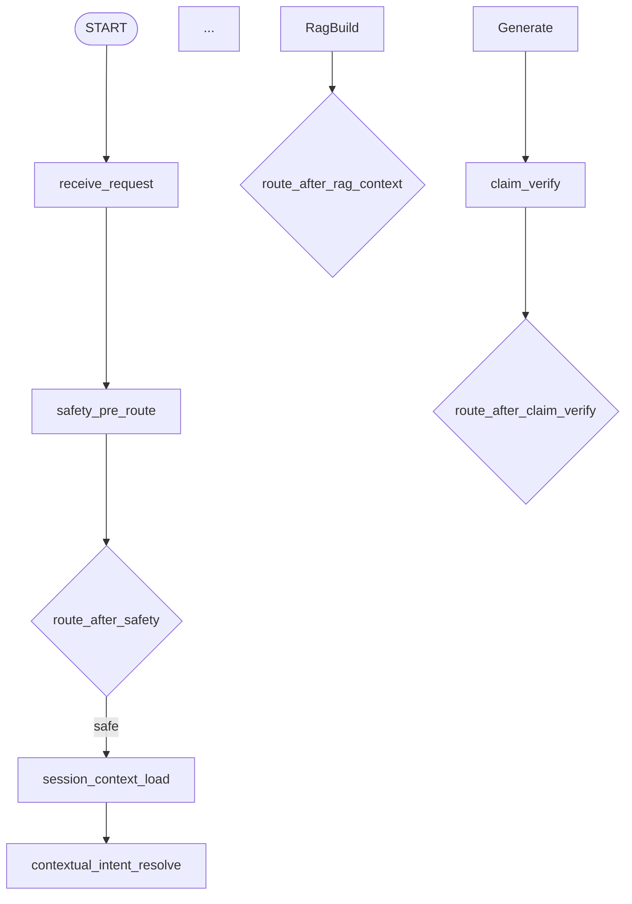

<!-- markdownlint-disable MD013 -->

# Phase 26: Architecture Contract Baseline - Pattern Map

**Mapped:** 2026-06-22
**Files analyzed:** 7 docs/planning targets
**Analogs found:** 7 / 7

## File Classification

| New/Modified File | Role | Data Flow | Closest Analog | Match Quality |
| --- | --- | --- | --- | --- |
| `docs/contract-spec.md` | model | transform | `docs/contract-spec.md` contract sections | exact |
| `docs/target-agent-platform-architecture-plan.md` | config | event-driven | `docs/target-agent-platform-architecture-plan.md` module/flow sections | exact |
| `docs/eval-test-plan.md` | test | batch | `docs/eval-test-plan.md` gate and matrix sections | exact |
| `.planning/phases/26-architecture-contract-baseline/26-BASELINE-CHECKLIST.md` | test | batch | `.planning/phases/26-architecture-contract-baseline/26-RESEARCH.md` examples + `26-VALIDATION.md` map | role-match |
| `.planning/ROADMAP.md` | config | batch | `.planning/ROADMAP.md` Phase 26 and v1.9 sections | exact |
| `.planning/REQUIREMENTS.md` | config | batch | `.planning/REQUIREMENTS.md` APF requirements and traceability | exact |
| `.planning/phases/26-architecture-contract-baseline/26-01-PLAN.md` | config | batch | `.planning/phases/25-intent-routing-safety-hardening/25-01-PLAN.md` + `26-VALIDATION.md` | role-match |

## Pattern Assignments

### `docs/contract-spec.md` (model, transform)

**Analog:** `docs/contract-spec.md`

**Header/authority pattern** (lines 1-11):

```markdown
NOTE: This file is the ONLY normative contract source for MOCA agent architecture. Other docs (architecture-overview / migration-plan / eval-test-plan) are illustrative or process docs; when they conflict with this file, this file wins.

## 0.1 Target architecture delta sync rule

- §9 accepts the target graph vocabulary for Phase 5 Intent Graph migration, while keeping current implementation node/router names as legacy aliases until that migration completes.
- §10 accepts AgentState registry fields for deterministic RAG context build and post-generation claim verification.
- §8.3 / §8.4 / §12.6 / §17.2 freeze minimal contracts for `VerifiedEvidencePackageV1`, `MaterialClaimV1`, `ClaimVerificationBundleV1`, `BusinessFactResultV1`, `ToolView`, `ToolPolicyDecision`, and `DecisionEventEnvelopeV1`.
```

**Graph vocabulary / legacy alias pattern** (lines 333-338):

```markdown
- **registered LangGraph node**: ... Target canonical node set contains `receive_request`, `normalize_input`, `safety_pre_route`, `session_context_load`, `contextual_intent_resolve`, ...
- **router**: ... Target canonical router set contains `route_after_safety`, `route_after_contextual_intent`, `route_after_slot_resolution`, ...
- **legacy graph alias**: ... `intent_classification -> contextual_intent_resolve`, `session_memory_load -> session_context_load`, ...
```

**AgentState registry pattern** (lines 808-812):

```markdown
| `rag_context_status` | enum or null | rag_context_build | `route_after_rag_context`, recommendation_generation, replay | reset each turn; replace; values follow `VerifiedEvidencePackageV1.status` | AgentStep / replay |
| `verified_evidence_package` | `VerifiedEvidencePackageV1` or null | rag_context_build | `route_after_rag_context`, recommendation_generation, claim_verify, risk/snapshot builder, final_response, replay | reset each turn; replace by package_id/version; prompt/verifier/replay projections must stay separated | AgentStep / evidence snapshot / replay |
| `claim_verification_bundle`, `blocked_claims`, `safe_support_refs` | `ClaimVerificationBundleV1` / list | claim_verify | `route_after_claim_verify`, risk_gate, final_response, approval/action path, replay | reset each turn; replace; unsupported high-risk/action claims fail closed | AgentStep / replay / approval |
```

**Business fact result pattern** (lines 272-303):

```python
class BusinessFactResultV1(BaseModel):
    schema_version: Literal["business_fact_result.v1"] = "business_fact_result.v1"
    tenant_id: str
    status: Literal[
        "ok",
        "partial",
        "not_found",
        "permission_denied",
        "stale",
        "unavailable",
        "invalid_request",
    ]
    fact: dict[str, Any] | None
    business_fact_refs: list[BusinessFactRefV1]
    resource_version: str | None = None
    data_freshness_at: datetime | None = None
    source_system: str
    scope_check_result: Literal["allowed", "denied", "not_applicable", "unknown"]
    missing_required_facts: list[str]
    safe_errors: list[ToolError]
```

Copy the follow-up rules at lines 297-303 when editing business fact text: `permission_denied` must not leak existence, stale/unavailable action-bound paths fail closed, and `business_fact_refs` are not `EvidenceRefV1`.

**Tool policy decision pattern** (lines 1238-1264):

```python
class ToolPolicyDecision(BaseModel):
    schema_version: Literal["tool_policy_decision.v1"] = "tool_policy_decision.v1"
    tool_name: str
    caller: str
    decision_stage: Literal["visibility", "runtime_auth"]
    decision: Literal["visible", "hidden", "allowed", "denied"]
    reason_codes: list[str]
    required_scopes: list[str]
    matched_scope: str | None = None
    policy_version: str
    data_classification: Literal["public", "internal", "sensitive", "restricted"]
    resource_scope_binding: dict[str, Any] | None = None
```

**Decision event envelope pattern** (lines 1948-1968):

```markdown
| Field | Required | Rule |
| --- | --- | --- |
| `schema_version` | yes | fixed `minimal_event_envelope.v1` |
| `event_id` | yes | globally unique |
| `sequence` | yes | strictly monotonic per `run_id`; resume continues sequence |
| `run_id` | yes | from trusted API/auth/run context |
| `tenant_id` | yes | from TrustedContext |
| `resource_refs` | yes | typed resource refs; no raw business payload |
| `redacted_payload` | yes | redacted summary; no complete prompt, raw tool response, secret, or PII |
```

**Use for Phase 26:** Update this file only for executable contract deltas or explicit MVP/deferred notes. Do not let architecture-plan prose become normative unless synchronized here.

---

### `docs/target-agent-platform-architecture-plan.md` (config, event-driven)

**Analog:** `docs/target-agent-platform-architecture-plan.md`

**Header/authority pattern** (lines 1-6):

```markdown
# MOCA Agent Platform 目标架构计划

> 状态：目标架构计划 + Phase 0 spec delta 决策记录，不表示当前已全部实现...
> 权威边界：`docs/contract-spec.md` 仍是 MOCA 唯一 normative 契约源...
```

**Module ownership matrix pattern** (lines 197-212):

```markdown
| 模块 | Owns | 允许调用 | 禁止依赖 / 禁止行为 |
| --- | --- | --- | --- |
| `ToolPlatform` | tool descriptor、planner view、runtime auth、tool result projection、tool decision events | `ToolPolicyEngine`、domain service public method、artifact store | graph/investigate 自建 allowlist；把 raw adapter payload 放进 prompt |
| `KnowledgeService` | policy/search/RAG contract、evidence validation、context projection、claim evidence support | policy/chunk repositories、retrieval engine、domain rule verifier plugins | 判断业务事实真实性；让 citation membership 代替 semantic support |
| `BusinessFactService` | 订单/退款/工单等业务事实读取 contract、resource freshness/scope check | 自己拥有的 business repositories/adapters | 被 graph node 或其他 service 绕过直接查业务表；用 memory/RAG/LLM 补业务事实 |
```

**Graph/routing shape pattern** (lines 264-360):



Copy the implementation judgments at lines 350-360 when preserving docs-only scope: routers are deterministic, platform services are not graph nodes, RAG is split into candidate retrieval / evidence validation / claim verification, and future `action_execution` is outside the current target runtime graph.

**Tool platform public API pattern** (lines 1095-1144):

```text
ToolPlatform.visible_tools(caller, context)
  -> ToolView[]

ToolPlatform.invoke(tool_name, args, context)
  -> ToolResultV2

ToolPolicyDecision
  tool_name
  caller
  decision_stage        # visibility | runtime_auth
  decision              # visible | hidden | allowed | denied
  reason_codes[]
  required_scopes[]
  matched_scope
  policy_version
  data_classification
  resource_scope_binding
```

**Business fact boundary pattern** (lines 1498-1567):

```text
Graph / ToolRuntime
  -> BusinessFactService public method
    -> tenant / merchant ownership / resource scope check
    -> domain repository / adapter
    -> stable BusinessFact schema
    -> trace/replay event

BusinessFactService.get_order(...)
  -> BusinessFactResult[OrderFact]
```

**Decision event coverage pattern** (lines 1695-1760):

```text
DecisionEventEnvelopeV1
schema_version
event_id
run_id
trace_id
tenant_id
thread_id
service_name
operation_name
decision_type
input_refs
output_refs
reason_codes
policy_version
...
```

**Use for Phase 26:** Expand or align the architecture plan's rationale and ownership matrices, but keep executable contracts either already present in `contract-spec.md` or explicitly marked as spec deltas/deferred items with a named phase.

---

### `docs/eval-test-plan.md` (test, batch)

**Analog:** `docs/eval-test-plan.md`

**Gate-level pattern** (lines 7-17):

```markdown
| Gate level | 用途 | 典型要求 | 不通过时 |
| --- | --- | --- | --- |
| Dev-contract gate | 每个 phase 合并前的最小契约保障 | schema、router totality、state writer、forbidden behavior、scope/permission negative cases | 不应合并该 phase |
| Release gate | 宣称生产级或开启高风险路径前的统计/覆盖门槛 | per-intent calibration、hard negatives、OOD、RAG groundedness、approval/action safety、Wilson/M6 等 | 能力只能保持 guarded/MVP path |
| Monitoring gate | 上线后的持续质量约束 | drift、false negative、tool deny reason、RAG no-evidence、memory write quality、replay completeness | 触发降级、review 或 policy/model 回滚 |
```

**Contract matrix pattern** (lines 21-39):

```markdown
| Contract | Test type | Required cases | Forbidden behavior |
| --- | --- | --- | --- |
| Tool policy decision contract | visibility/runtime auth tests | `ToolView` prompt-safe；visible/hidden/allowed/denied 都有 `ToolPolicyDecision`、reason codes、scope binding、policy version。 | planner 可见即 runtime 自动允许；deny 无 reason；raw descriptor/internal permission reason 进 prompt。 |
| Business fact contract | domain facade contract tests | `BusinessFactResultV1` 的 ok/partial/not_found/permission_denied/stale/unavailable/invalid_request；resource_version、scope_check_result、safe_errors。 | permission denied 泄露资源存在性；business fact ref 被当作 `EvidenceRefV1`；stale fact 进入 action-bound path。 |
| RAG context build contract | deterministic evidence package tests | `VerifiedEvidencePackageV1` status 枚举、hash/scope/effective-date validation、projection separation、rejected/stale/conflict refs、route_after_rag_context totality。 | candidate refs 直接进入 prompt/action；invalid_hash/invalid_scope 仍生成 action-bound recommendation；router 调 LLM/tool。 |
| Decision event / Replay contract | completeness/order/redaction tests | `DecisionEventEnvelopeV1` / minimal envelope、normal/interrupted/resumed/rejected/responded/expired/error/cancelled；shared per-run sequence allocator concurrent writers；started/terminal pair 共享 operation_id；retry parent/attempt；V3 shape。 | 空 timeline；sequence 重复/倒退/事后重排；不同 writer 绕过 allocator；prompt/raw tool/ticket PII/action raw payload 泄漏；服务自建并行 envelope。 |
```

**Golden-flow pattern** (lines 141-153, 312-398):

```json
{
  "input": "根据政策能不能给 RF-1001 额外赔 1000 元？",
  "retrieval_status": "no_evidence",
  "expected_route": "final_response",
  "expected_response_type": "insufficient_evidence_response",
  "forbidden": ["create_action_draft", "approval_requested", "state that policy allows compensation"]
}
```

**Use for Phase 26:** Add or align eval rows so each APF-01/APF-02 boundary has a gate level and forbidden behavior. Do not claim production readiness from docs checks alone.

---

### `.planning/phases/26-architecture-contract-baseline/26-BASELINE-CHECKLIST.md` (test, batch)

**Analog:** `.planning/phases/26-architecture-contract-baseline/26-RESEARCH.md` and `26-VALIDATION.md`

**Alignment matrix pattern** (`26-RESEARCH.md` lines 366-376):

```markdown
| Contract Area | contract-spec.md | architecture plan | eval-test-plan | Drift? | Phase 26 action |
| --- | --- | --- | --- | --- | --- |
| Graph vocabulary and legacy aliases | Section 9.0-9.5 | Sections 3.1 and 6 | Node/router rows in Section 20.1 | no/yes | verify or sync spec |
| AgentState RAG/claim fields | Section 10 | Sections 11.8-11.10 | RAG/claim rows in Section 20.1 | no/yes | verify writer/readers/reset text |
| Tool policy decisions | Section 12.6 | Section 10.6 | Tool policy row in Section 20.1 | no/yes | verify `ToolView` and `ToolPolicyDecision` names/enums |
```

**Ownership matrix pattern** (`26-RESEARCH.md` lines 380-388):

```markdown
| Module | Owned schemas/tables/events | Public methods | Allowed downstream dependencies | Forbidden imports/access | Decision events |
| --- | --- | --- | --- | --- | --- |
| `ToolPlatform` | `ToolDescriptor`, `ToolView`, `ToolPolicyDecision`, tool lifecycle events | `visible_tools`, `invoke` | `ToolPolicyEngine`, domain service public methods, artifact store | graph/investigate custom allowlists; raw adapter payload in prompt | visibility/runtime auth decisions |
| `KnowledgeService` | `EvidenceRefV1`, `VerifiedEvidencePackageV1`, claim verifier outputs | `search`, `build_verified_context`, `verify_claims` | policy/chunk repositories, retrieval engine, domain rule verifier plugins | judging current business facts; citation membership as semantic support | evidence validation and claim verification decisions |
| `BusinessFactService` | `BusinessFactResultV1`, `BusinessFactRefV1`, `BusinessContextV1` | `fetch_context`, `get_order`, `get_refund_case`, `get_ticket` | owned business repositories/adapters | graph direct repository access; memory/RAG/LLM substituted facts | business fact read decisions and safe errors |
```

**Validation map pattern** (`26-VALIDATION.md` lines 31-38):

```markdown
| Task ID | Plan | Wave | Requirement | Threat Ref | Secure Behavior | Test Type | Automated Command | File Exists | Status |
|---------|------|------|-------------|------------|-----------------|-----------|-------------------|-------------|--------|
| 26-01-01 | 01 | 1 | APF-01 | T26-01 | Normative contract names remain synchronized across spec, architecture plan, and eval plan | docs-contract | `rg -n "VerifiedEvidencePackageV1|ClaimVerificationBundleV1|ToolPolicyDecision|BusinessFactResultV1|DecisionEventEnvelopeV1|route_after_rag_context|route_after_claim_verify" docs/contract-spec.md docs/target-agent-platform-architecture-plan.md docs/eval-test-plan.md` | yes | pending |
```

**Use for Phase 26:** Create this file only if the planner needs a durable audit artifact outside the edited docs. Keep it as a checklist/matrix, not a parallel normative contract.

---

### `.planning/ROADMAP.md` (config, batch)

**Analog:** `.planning/ROADMAP.md`

**Requirement coverage pattern** (lines 72-93):

```markdown
| Requirement | Phase | Coverage |
|-------------|-------|----------|
| APF-01 | Phase 26 | Contract/spec/eval baseline alignment |
| APF-02 | Phase 26 | Module ownership and dependency boundaries |
| APF-03 | Phase 27 | Canonical TrustedContext factory |
...
| APF-18 | Phase 35 | Dev/release/monitoring eval gates |
```

**Phase entry pattern** (lines 167-183):

```markdown
### Phase 26: Architecture Contract Baseline

**Status:** Pending
**Milestone:** v1.9 Agent Platform Foundation
**Goal:** Close the architecture/spec/eval baseline so target service boundaries, graph vocabulary, RAG/claim state fields, tool policy decisions, business fact results, and decision events are aligned before implementation phases.
**Requirements**: APF-01, APF-02
**Depends on:** Phase 25
**Plans:** 0/1 plans complete

**Success Criteria**:

1. `docs/contract-spec.md`, `docs/target-agent-platform-architecture-plan.md`, and `docs/eval-test-plan.md` agree on target graph nodes/routers, AgentState fields, and platform schema names.
2. Module ownership boundaries identify schema/table/event ownership, allowed downstream calls, and forbidden imports for every platform/domain service in scope.
3. The phase records any remaining legacy alias mappings and confirms no implementation phase can introduce new fields/nodes without spec delta.
```

**Use for Phase 26:** Only update roadmap status/plan checkbox during closeout. Preserve the v1.9 implementation order at lines 185-345.

---

### `.planning/REQUIREMENTS.md` (config, batch)

**Analog:** `.planning/REQUIREMENTS.md`

**APF requirement pattern** (lines 16-19):

```markdown
### Architecture Contract Baseline

- [ ] **APF-01:** The target architecture plan, `contract-spec.md`, and eval plan define the same target graph vocabulary, service boundaries, AgentState RAG/claim fields, tool policy decisions, business fact results, and decision event foundation.
- [ ] **APF-02:** Each platform/domain module has explicit ownership over schemas, repositories/adapters, public methods, downstream dependencies, forbidden imports, and decision events.
```

**Out-of-scope pattern** (lines 66-75):

```markdown
| Feature | Reason |
|---------|--------|
| Full real external execution | This milestone preserves action/execution boundaries but does not implement outbox dispatch, reconciliation, or real side effects. |
| Physical microservice deployment | The target is a microservice-ready modular monolith; deployment split is a later operational decision. |
| Letting LLMs own routing, authorization, memory publication, or claim support | Violates deterministic policy and authority boundaries. |
```

**Traceability pattern** (lines 78-99):

```markdown
| Requirement | Phase | Status |
|-------------|-------|--------|
| APF-01 | Phase 26 | Pending |
| APF-02 | Phase 26 | Pending |
...
| APF-18 | Phase 35 | Pending |
```

**Use for Phase 26:** Do not add new APF requirements unless the phase explicitly changes milestone scope. Phase 26 should prove APF-01/APF-02 coverage, not move runtime APF-03 through APF-18 into this phase.

---

### `.planning/phases/26-architecture-contract-baseline/26-01-PLAN.md` (config, batch)

**Analog:** `.planning/phases/25-intent-routing-safety-hardening/25-01-PLAN.md` for plan structure; `26-VALIDATION.md` for Phase 26 commands.

**Plan frontmatter pattern** (`25-01-PLAN.md` lines 1-34):

```yaml
---
phase: 25
plan: 25-01
type: implementation
wave: 1
depends_on: []
files_modified:
  - src/agent/intent_policy.py
requirements:
  - IRS-01
---
```

For Phase 26, use docs/planning files only in `files_modified`; do not include runtime code unless the plan explicitly justifies a code-level helper or test.

**Task pattern** (`25-01-PLAN.md` lines 64-89):

```xml
<task id="25-01-T1" type="execute">
  <title>Add deterministic risk tiers and classification trace construction</title>
  <read_first>
  - src/agent/intent_policy.py
  </read_first>
  <action>
  ...
  </action>
  <acceptance_criteria>
  - ...
  </acceptance_criteria>
</task>
```

**Docs validation pattern** (`26-VALIDATION.md` lines 14-22, 48-54):

```markdown
| Framework | Markdown, `rg`, `gsd-sdk`, optional `markdownlint-cli2` |
| Quick run command | `gsd-sdk query init.plan-phase 26 && gsd-sdk query roadmap.get-phase 26` |
| Full suite command | `git diff --check -- docs/contract-spec.md docs/target-agent-platform-architecture-plan.md docs/eval-test-plan.md .planning/phases/26-architecture-contract-baseline .planning/ROADMAP.md .planning/STATE.md .planning/REQUIREMENTS.md && gsd-sdk query state.load && gsd-sdk query roadmap.analyze --pick next_phase` |
```

**Use for Phase 26:** Plan an explicit drift audit before edit tasks. Include final acceptance that no runtime code files changed and no physical microservice/full real execution scope was added.

## Shared Patterns

### Normative Contract First

**Source:** `docs/contract-spec.md` lines 1-11; `docs/target-agent-platform-architecture-plan.md` lines 3-6
**Apply to:** `docs/contract-spec.md`, `docs/target-agent-platform-architecture-plan.md`, `26-BASELINE-CHECKLIST.md`, `26-01-PLAN.md`

```markdown
Architecture plan content is target/rationale unless synchronized into `docs/contract-spec.md`.
Executable schema/node/router/AgentState/tool/business/event contract deltas must be added to the spec or recorded as explicit MVP/deferred scope with a named target phase.
```

### APF-01 Alignment Matrix

**Source:** `26-RESEARCH.md` lines 366-376
**Apply to:** `docs/contract-spec.md`, `docs/target-agent-platform-architecture-plan.md`, `docs/eval-test-plan.md`, optional `26-BASELINE-CHECKLIST.md`

```markdown
| Contract Area | contract-spec.md | architecture plan | eval-test-plan | Drift? | Phase 26 action |
| --- | --- | --- | --- | --- | --- |
| Graph vocabulary and legacy aliases | Section 9.0-9.5 | Sections 3.1 and 6 | Node/router rows in Section 20.1 | no/yes | verify or sync spec |
```

### APF-02 Ownership Expansion

**Source:** `docs/target-agent-platform-architecture-plan.md` lines 197-212; `26-RESEARCH.md` lines 380-388
**Apply to:** `docs/target-agent-platform-architecture-plan.md`, `docs/contract-spec.md`, optional `26-BASELINE-CHECKLIST.md`

```markdown
| Module | Owned schemas/tables/events | Public methods | Allowed downstream dependencies | Forbidden imports/access | Decision events |
| --- | --- | --- | --- | --- | --- |
```

Every module row should cover `RunOrchestrator`, `TrustedContextFactory`, `IntentService`, `MemoryContextService`, `ToolPlatform`, `KnowledgeService`, `BusinessFactService`, `ApprovalService`, `ActionDraftService / ExecutionBoundary`, and `Observability / Replay`.

### Eval Gate Classification

**Source:** `docs/eval-test-plan.md` lines 7-17 and 21-39
**Apply to:** `docs/eval-test-plan.md`, `26-BASELINE-CHECKLIST.md`, `26-01-PLAN.md`

```markdown
Each boundary gets a gate level: dev-contract before merge, release before production/high-risk claims, monitoring after launch.
Security, permissions, evidence, approval/action forbidden behavior defaults to at least Dev-contract gate.
```

### Scope Containment / No Runtime Code

**Source:** `26-CONTEXT.md` lines 10-31; `26-VALIDATION.md` lines 48-54; `.planning/REQUIREMENTS.md` lines 66-75
**Apply to:** all Phase 26 files

```markdown
Phase 26 may update architecture/spec/eval/planning documents and create verification artifacts.
It should not implement runtime code, physical microservices, or full real external execution.
Final validation must inspect changed files and confirm docs/planning scope unless PLAN.md explicitly justified otherwise.
```

### GSD Metadata Caveat

**Source:** `26-CONTEXT.md` lines 33-38; `26-RESEARCH.md` lines 352-360
**Apply to:** `26-01-PLAN.md`, `26-BASELINE-CHECKLIST.md`, validation notes

```markdown
`validate.health` old-phase/future-directory warnings are non-blocking for Phase 26.
Do not use `phases.clear --confirm`; old phase archival is a separate cleanup todo.
```

## No Analog Found

None. Every likely docs/planning target has an exact or role-match analog in the current docs/planning artifacts.

If the planner introduces a new Phase 26 file outside the targets above, it should first state why the existing docs and optional checklist cannot hold the information, then classify it as a docs/planning artifact. Runtime source files are out of scope for this pattern map.

## Metadata

**Analog search scope:** `docs/*.md`, `.planning/*.md`, `.planning/phases/**/*.md`
**Markdown files available in scope:** 369
**Focused files scanned:** 107
**Project-local skills:** none found under `.claude/skills/` or `.agents/skills/`
**Pattern extraction date:** 2026-06-22
