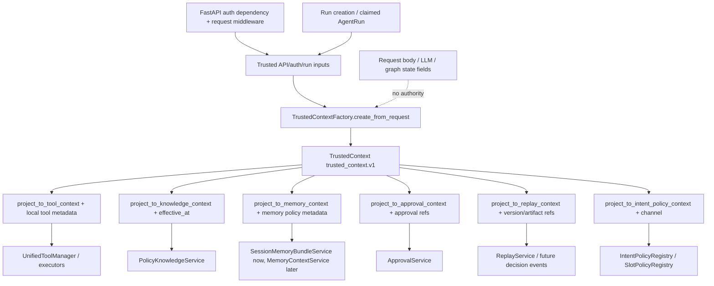

# Phase 27: TrustedContextFactory and Projections - Research

**Researched:** 2026-06-22
**Domain:** Trusted identity/scope context factory, service projection contracts, and narrow migration seams
**Confidence:** HIGH for contracts and current code inventory; MEDIUM for exact module path recommendation

<user_constraints>
## User Constraints (from CONTEXT.md)

Copied verbatim from `.planning/phases/27-trustedcontextfactory-and-projections/27-CONTEXT.md`. [VERIFIED: .planning/phases/27-trustedcontextfactory-and-projections/27-CONTEXT.md:19-156]

### Locked Decisions

## Implementation Decisions

### Canonical TrustedContext Source

- **D-01:** `TrustedContext` must match `docs/contract-spec.md` §8.0 exactly: `schema_version`, `tenant_id`, `user_id`, `role`, `permissions`, `merchant_scope`, `session_id`, `thread_id`, `run_id`, `trace_id`, and `locale`.
- **D-02:** The factory must only accept trusted API/auth/run inputs, such as authenticated user identity, verified token scopes, server-created thread/run/trace ids, session id, locale, and server-derived merchant scope. It must not accept LLM output, user payload fields, request body overrides, or graph state fields as authority for identity/scope.
- **D-03:** Canonical context must reject or ignore projection-local fields. `request_id`, `tool_call_id`, `caller_node`, `deadline_at`, `attempt`, `max_attempts`, `idempotency_key`, `approval_ref`, `safety_snapshot_ref`, `policy_snapshot_ref`, `effective_at`, `channel`, `policy_version`, `model_version`, `tool_version`, and artifact refs must not become canonical `TrustedContext` fields.
- **D-04:** `MerchantScopeV1` semantics from `contract-spec.md` §8.0 are in scope: deny-all for empty scope, wildcard only through explicit `"*"`, all-provided-dimensions matching, and no model/user widening.

### Projection APIs

- **D-05:** Expose projection methods for `ToolCallContext`, `KnowledgeContext`, `MemoryContext`, `ApprovalContext`, `ReplayContext`, and `IntentPolicyContext`. Projections may add consumer-local metadata, but all identity/scope fields must remain a direct subset/projection of canonical `TrustedContext`.
- **D-06:** `ToolCallContext` must preserve the existing `tool_context.v2` contract while moving trusted identity/scope/permission fields behind the factory. Tool-call-local fields remain caller-injected and projection-local.
- **D-07:** `KnowledgeContext` must keep `effective_at` as run-derived retrieval time, not trusted identity. Merchant filtering must use `merchant_scope` from trusted context, not user/model-provided filters.
- **D-08:** `MemoryContext` should carry tenant/user/thread/run identity plus memory-scope/retention inputs needed by later `MemoryContextService`, without making memory an authority for policy evidence, business facts, approval/action, or replay truth.
- **D-09:** `ApprovalContext` should carry actor/scope plus approval/action safety refs needed by `ApprovalService`, but ordinary chat and LLM output must still be unable to create approval truth.
- **D-10:** `ReplayContext` should carry run/thread/trace identity and version/artifact refs as replay metadata, without requiring Phase 27 to implement the Phase 28 decision event envelope.
- **D-11:** `IntentPolicyContext` should include tenant/role/locale/thread/run identity and projection-local `channel`; `channel` must not widen canonical identity.

### Integration Scope

- **D-12:** Prefer a dedicated shared context/factory module over adding more responsibilities to prompt projectors. Existing prompt projection code in `src/agent/context/projectors.py` stays focused on prompt-safe text projection.
- **D-13:** Keep integration minimal and compatibility-preserving: update the current API/search/tool/context construction seams enough to prove the factory is used, but do not migrate all graph nodes or split services in this phase.
- **D-14:** `AgentState` identity remains a projection and should not become the source for permissions or merchant scope. Service contexts that need permissions/scope must be built from trusted config/factory, not checkpointed state.
- **D-15:** Existing `ToolCallContext`, `KnowledgeContext`, `SessionMemoryBundleService`, `Approval*Command`, and replay schema tests should guide compatibility. Breaking public schema versions is out of scope unless `contract-spec.md` explicitly requires it.

### Intent and Slot Registry Freeze

- **D-16:** Freeze a read-only `IntentPolicyRegistry` / `SlotPolicyRegistry` catalog contract over the existing `INTENT_DEFINITIONS`, `REQUIRED_SLOT_POLICY`, route policy, and precedence data. Phase 27 should not change intent behavior or graph routing semantics beyond exposing stable read APIs.
- **D-17:** The registry must make it harder for Tool/Memory/RAG phases to invent temporary policy shape. It should be usable by later Phase 32 graph migration without forcing Phase 27 to split `IntentService`.

### Verification Strategy

- **D-18:** Add contract tests for exact canonical field set, `trusted_context.v1` schema version, no extra canonical fields, trusted-source construction, deny-all merchant scope, wildcard semantics, and model/user override rejection.
- **D-19:** Add projection tests proving `request_id`, `effective_at`, `channel`, and policy/model/tool versions stay projection-local or metadata and never appear in canonical `TrustedContext`.
- **D-20:** Add focused integration tests for the current seams that manually construct contexts today: search API `KnowledgeContext`, agent run trusted tool config / `ToolCallContext`, knowledge tool executor projection, and graph/run identity consistency.
- **D-21:** Add import/boundary checks or grep-verifiable tests proving prompt projectors and downstream modules consume projections rather than redefining trusted identity/scope contracts.

### Claude's Discretion

- Exact module path and class/function names are left to planning, as long as the design is a dedicated shared context/factory boundary and avoids circular imports.
- Exact migration ordering across call sites is left to planning; keep the first phase small enough to verify thoroughly.
- Exact test file split is left to planning, but tests must be focused and runnable with `uv run pytest`.

### Deferred Ideas (OUT OF SCOPE)

- Decision event envelope implementation belongs to Phase 28.
- Tool descriptor/policy runtime migration belongs to Phase 29.
- Business fact authority migration belongs to Phase 30.
- Full MemoryContextService platform migration belongs to Phase 31.
- Target graph vocabulary migration and `IntentService` split belong to Phase 32.
- RAG verified context build / claim verification belongs to Phase 33.
- Approval/action boundary hardening beyond context projection belongs to Phase 34.
- Replay/eval hardening belongs to Phase 35.
- Physical microservice extraction remains post-v1.9 / future scope.
</user_constraints>

<phase_requirements>
## Phase Requirements

| ID | Description | Research Support |
|----|-------------|------------------|
| APF-03 | `TrustedContextFactory` produces canonical `TrustedContext` from trusted API/auth/run boundaries without accepting LLM or user-payload overrides. [VERIFIED: .planning/REQUIREMENTS.md:21-25] | Use exact canonical `TrustedContext`/`MerchantScopeV1` models, strict extra-field rejection, factory inputs limited to authenticated `User`, verified token scopes, server-created run/thread/trace/session IDs, locale, and server-derived merchant scope. [VERIFIED: docs/contract-spec.md:34-77; src/auth/permissions.py:33-75; src/api/main.py:52-60; src/api/routers/agent_runs.py:68-82] |
| APF-04 | `TrustedContextFactory` derives prompt-safe and service-safe projections for tool calls, knowledge retrieval, memory loading, approval decisions, replay, and intent policy without widening canonical identity/scope fields. [VERIFIED: .planning/REQUIREMENTS.md:21-25] | Add projection methods that return existing `ToolCallContext`/`KnowledgeContext` plus new `MemoryContext`, `ApprovalContext`, `ReplayContext`, and `IntentPolicyContext` schemas, keeping local metadata out of canonical context. [VERIFIED: docs/contract-spec.md:67-75; docs/target-agent-platform-architecture-plan.md:522-535; src/tools/contracts.py:13-37; src/knowledge/schemas.py:18-29] |
</phase_requirements>

## Summary

Phase 27 should be planned as a foundation and seam-convergence phase, not as a broad graph or service rewrite. The normative contract already exists: `TrustedContextFactory` owns canonical `TrustedContext` and projection schemas, exposes `create_from_request` and projection methods, and forbids LLM/user-payload identity or scope overrides. [VERIFIED: docs/contract-spec.md:13-28; .planning/phases/27-trustedcontextfactory-and-projections/27-CONTEXT.md:8-16]

Current code has useful pieces but no shared runtime trusted-context type: `ToolCallContext` and `KnowledgeContext` exist, `/agent-runs` already derives permissions and merchant scope from trusted auth inputs, and API/router/graph code still constructs identity/scope contexts directly. [VERIFIED: src/tools/contracts.py:13-37; src/knowledge/schemas.py:18-29; src/api/routers/agent_runs.py:68-82; src/api/routers/search.py:21-44; src/agent/nodes/investigate.py:233-261; src/agent/nodes/action_draft.py:248-279]

**Primary recommendation:** create a low-level `src/platform/trusted_context.py` package for canonical models/factory and a companion projection module that returns existing consumer schemas, then migrate only `/search`, `/agent/chat`, `/agent-runs`, `investigate`, `action_draft`, and `KnowledgeToolExecutor` enough to prove one trusted source. [ASSUMED]

## Architectural Responsibility Map

| Capability | Primary Tier | Secondary Tier | Rationale |
|------------|--------------|----------------|-----------|
| Canonical trusted identity/scope/run context | API / Backend | Frontend Server (SSR): none | Auth dependencies, DB-backed user identity, run IDs, trace IDs, and graph config are backend concerns; browser/user payloads are explicitly forbidden as authority. [VERIFIED: docs/contract-spec.md:38-52; src/auth/permissions.py:33-75; src/api/main.py:52-60] |
| Merchant scope and permission derivation | API / Backend | Database / Storage | Current trusted derivation intersects token scopes with DB role scopes and derives merchant scope from the authenticated `User`; persisted graph state must not become authority for permissions or merchant scope. [VERIFIED: src/api/routers/agent_runs.py:68-82; docs/contract-spec.md:73-75] |
| Tool/knowledge/memory/approval/replay/intent projections | API / Backend | Database / Storage for persisted run/replay refs | Projection schemas are service-safe backend inputs; replay and approval refs may point at stored records, but projection metadata must not widen canonical identity. [VERIFIED: docs/contract-spec.md:67-75; docs/target-agent-platform-architecture-plan.md:522-535] |
| Prompt-safe text projection | API / Backend | Browser / Client: display only | Existing prompt projectors sanitize and bound text; they should not create or validate trusted identity/scope. [VERIFIED: .planning/phases/27-trustedcontextfactory-and-projections/27-CONTEXT.md:39-43; src/agent/context/projectors.py:99-178] |
| Intent/slot registry freeze | API / Backend | Agent Graph | Existing intent definitions, required slot policy, route policy, and precedence data already live in backend code and should be wrapped read-only without changing routing behavior. [VERIFIED: src/agent/intent_policy.py:15-132; .planning/phases/27-trustedcontextfactory-and-projections/27-CONTEXT.md:45-48] |

## Project Constraints (from CLAUDE.md and AGENTS.md)

- Local debugging, startup, validation, UI testing, API testing, RAG/agent/memory/tool-call investigation errors, environment pitfalls, and validation failures must be appended to `.planning/LOCAL-VALIDATION-ISSUES.md` after handling. [VERIFIED: CLAUDE.md:5-9; AGENTS.md:9-16]
- Phase-level plans and larger changes use the GSD plus Codex cross-review workflow; small bug fixes and single-file edits do not need that flow. [VERIFIED: CLAUDE.md:11-67; AGENTS.md:18-74]
- `docs/contract-spec.md` is MOCA's only normative contract source; implementation phases must not silently diverge from it, and MVP compromises require explicit spec/planning trace. [VERIFIED: CLAUDE.md:69-78; AGENTS.md:76-85]
- `docs/contract-spec.md` target-state text is not proof of current implementation; research and planning must distinguish implemented facts from target contracts. [VERIFIED: CLAUDE.md:69-78; AGENTS.md:76-85]
- `study_plan/` documents default to Chinese, but this phase research can stay in English because existing `.planning` phase artifacts are in English. [VERIFIED: AGENTS.md:5-8; .planning/phases/27-trustedcontextfactory-and-projections/27-CONTEXT.md:1-156]

## Standard Stack

### Core

| Library | Version | Purpose | Why Standard |
|---------|---------|---------|--------------|
| Pydantic | 2.13.4 installed; `pydantic-settings>=2.0` in project deps | Strict contract models with `ConfigDict(extra="forbid")`, literals, field validation, and model dumping. | Existing contracts use Pydantic models for strict API/tool/approval/replay shapes. [VERIFIED: uv run python version probe; pyproject.toml:6-13; src/tools/contracts.py:8-37; src/approvals/schemas.py:9-17; src/replay/schemas.py:9-40] |
| FastAPI | 0.136.1 installed; `fastapi>=0.115` in project deps | Trusted API/auth/run boundary and dependency injection. | Existing auth, request state, and routers are FastAPI-based. [VERIFIED: uv run python version probe; pyproject.toml:6-8; src/auth/permissions.py:6-38; src/api/main.py:49-60] |
| SQLAlchemy async + asyncpg | SQLAlchemy 2.0.49 and asyncpg 0.31.0 installed; `sqlalchemy[asyncio]>=2.0`, `asyncpg>=0.29` in deps | Existing DB-backed user/run/approval/replay records used as trusted server state. | Tests and services use async SQLAlchemy sessions and PostgreSQL test DB fixtures. [VERIFIED: uv run python version probe; pyproject.toml:8-11; tests/conftest.py:7-14; tests/conftest.py:30-76] |
| LangGraph | 1.1.10 installed; `langgraph>=0.4` in deps | Existing agent graph execution and checkpoint config path where trusted projections are consumed. | Current graph is built with LangGraph `StateGraph`; phase should not replace graph runtime. [VERIFIED: uv run python version probe; pyproject.toml:18-22; src/agent/graph.py:16-34; src/api/main.py:29-35] |

### Supporting

| Library / Tool | Version | Purpose | When to Use |
|----------------|---------|---------|-------------|
| pytest + pytest-asyncio | pytest 9.0.3, pytest-asyncio 1.3.0 installed; dev deps require pytest/pytest-asyncio | Contract, projection, integration, and API tests. | Use for all APF-03/APF-04 checks. [VERIFIED: uv run python version probe; pyproject.toml:34-40; pyproject.toml:54-55] |
| Ruff | 0.15.12 installed; dev dep `ruff>=0.5` | Formatting/lint sanity for touched Python files. | Run on changed implementation/test files if the plan includes code edits. [VERIFIED: uv run ruff --version; pyproject.toml:34-40; pyproject.toml:50-52] |
| `rg` | 14.1.1 installed | Boundary/import grep checks and current-seam discovery. | Use for no-redefinition/no-projector-authority static checks. [VERIFIED: command probe] |

### Alternatives Considered

| Instead of | Could Use | Tradeoff |
|------------|-----------|----------|
| Shared Pydantic contracts | Plain dataclasses or dict helpers | Would not match existing strict schema patterns and would make extra-field rejection harder to verify. [VERIFIED: src/tools/contracts.py:13-37; src/approvals/schemas.py:29-78; src/replay/schemas.py:37-59] |
| Dedicated context factory package | Add functions to `src/agent/context/projectors.py` | Projectors are prompt-safe text projection utilities, while Phase 27 requires trusted identity/scope authority. [VERIFIED: .planning/phases/27-trustedcontextfactory-and-projections/27-CONTEXT.md:39-43; src/agent/context/projectors.py:99-178] |
| Minimal seam migration | Full graph/service platform rewrite | The phase boundary explicitly excludes rewriting graph, tool, knowledge, memory, approval, replay, and business fact services. [VERIFIED: .planning/phases/27-trustedcontextfactory-and-projections/27-CONTEXT.md:8-16] |

**Installation:** No new package is needed for Phase 27; use existing project dependencies. [VERIFIED: pyproject.toml:1-55]

**Version verification commands used:**

```bash
uv run python -c "import pydantic, fastapi, pytest, sqlalchemy; ..."
uv run python -c "import importlib.metadata as m; ..."
uv run ruff --version
```

## Current Implementation Inventory

| Area | Current State | Planning Implication |
|------|---------------|----------------------|
| Canonical `TrustedContext` / `MerchantScopeV1` classes | No runtime `TrustedContext`, `TrustedContextFactory`, `MerchantScopeV1`, or `trusted_context.v1` implementation exists under `src/`; matches were docs/planning only. [VERIFIED: rg `TrustedContext|TrustedContextFactory|MerchantScopeV1|trusted_context.v1` src tests docs .planning] | Add canonical models first; do not let consumers keep redefining identity/scope. |
| `ToolCallContext` | Exists with `tool_context.v2`, strict extra forbid, identity/scope fields, projection-local fields, plus current compatibility extras `effective_at`, `approval_ref`, and `safety_snapshot_ref`. [VERIFIED: src/tools/contracts.py:13-37] | Preserve schema version and local fields; move identity/scope/permissions sourcing behind factory. |
| `KnowledgeContext` | Exists as lightweight projection with tenant/user/role/run/trace/locale/effective_at, but current `merchant_scope` type is `list[str] | None`. [VERIFIED: src/knowledge/schemas.py:18-29] | Plan explicit compatibility for projecting canonical `MerchantScopeV1` into existing knowledge retrieval behavior. |
| `/api/v1/search` | Constructs `KnowledgeContext` directly and hardcodes `merchant_scope=["*"]`, `run_id="api-search"`, and `effective_at=now`. [VERIFIED: src/api/routers/search.py:21-44] | Replace direct construction with factory projection using authenticated user/request state and run-derived effective time. |
| `/agent/chat` | Builds graph input state from authenticated user and merges `_trusted_tool_config` into graph config. [VERIFIED: src/api/routers/agent.py:39-70] | Keep compatibility but source config from `TrustedContextFactory`. |
| `/agent-runs` | `_trusted_tool_config` intersects verified token scopes with DB role scopes and maps OAuth scopes to tool permissions; merchant users get their `merchant_id`, other roles get explicit wildcard. [VERIFIED: src/api/routers/agent_runs.py:45-82] | This is the best current trusted input seam; move logic into factory or have factory call an equivalent helper. |
| `investigate` node | Builds `ToolCallContext` from state plus `configurable` values, including permissions and merchant scope from config. [VERIFIED: src/agent/nodes/investigate.py:233-261] | Replace with factory projection from canonical context in config; keep tool-call-local fields in the node. |
| `action_draft` node | Builds `ToolCallContext` with approval/safety/idempotency metadata local to action draft. [VERIFIED: src/agent/nodes/action_draft.py:248-279] | Use factory for identity/scope only; keep approval/safety/idempotency as projection-local. |
| `KnowledgeToolExecutor` | Converts `ToolCallContext` to `KnowledgeContext`, falls back to `datetime.now()` for `effective_at`, and maps `merchant_scope` to a list of merchant IDs. [VERIFIED: src/tools/executors/knowledge.py:29-66; src/tools/executors/knowledge.py:102-108] | Make this projection explicit and run-derived; avoid retrieval-time wall clock unless caller did not provide run time. |
| `AgentState` | Contains tenant/user/role/thread/current_run fields but not `permissions` or `merchant_scope`. [VERIFIED: src/agent/state.py:48-133] | Do not add permissions/merchant_scope to persisted state; project identity from trusted config only. |
| Session memory bundle | Loads by tenant/user/thread/run identity and current intent. [VERIFIED: src/agent/nodes/session_memory_load.py:54-70; src/memory/session_bundle.py:21-68] | Add `MemoryContext` projection as input shape for later Phase 31 without rewriting `SessionMemoryBundleService` now. |
| Approval schemas/API | Approval commands are strict, server-side inputs; API builds actor/tenant/role from authenticated user and service data. [VERIFIED: src/approvals/schemas.py:29-153; src/api/routers/approvals.py:47-120] | Add `ApprovalContext` projection to centralize actor/scope refs, but do not let ordinary chat create approval truth. |
| Replay schemas/service | `ReplayEventV3` has strict run/tenant/thread/trace identity; service projects stored events into replay shape. [VERIFIED: src/replay/schemas.py:37-77; src/replay/service.py:194-238] | Add `ReplayContext` as metadata projection; Phase 28 owns decision event envelope, so do not implement emitter here. |
| Intent policy data | Existing code has `INTENT_DEFINITIONS`, `REQUIRED_SLOT_POLICY`, `PRECEDENCE_INTENTS`, `INTENT_ROUTE_POLICY`, and safety channel constants. [VERIFIED: src/agent/intent_policy.py:15-132] | Wrap in read-only registries without changing behavior. |

## Architecture Patterns

### System Architecture Diagram



This flow follows the normative rule that canonical context originates at trusted API/auth/run boundaries and projections may add local metadata without widening identity/scope. [VERIFIED: docs/contract-spec.md:34-77; docs/target-agent-platform-architecture-plan.md:490-535]

### Recommended Project Structure

```text
src/
├── platform/
│   ├── __init__.py
│   ├── trusted_context.py      # TrustedContext, MerchantScopeV1, factory inputs, source validation
│   └── context_projections.py  # projection methods returning consumer schemas and local projection models
├── tools/contracts.py          # keep ToolCallContext/tool_result contracts
├── knowledge/schemas.py        # keep KnowledgeContext/evidence contracts, adjust only if planned
└── agent/intent_policy.py      # add read-only registry wrappers or re-export from new registry module
```

The `src/platform/` path is a recommendation to avoid coupling trusted context to prompt projectors or any single consumer package; exact path is still planner discretion. [ASSUMED]

### Pattern 1: Strict Canonical Models

**What:** Define `TrustedContext` and `MerchantScopeV1` as Pydantic models with `ConfigDict(extra="forbid")`, schema-version literals, and exact field sets. [VERIFIED: docs/contract-spec.md:40-65; src/tools/contracts.py:13-37]

**When to use:** Use for the canonical factory output and any test that asserts no projection-local metadata can enter canonical context. [VERIFIED: .planning/phases/27-trustedcontextfactory-and-projections/27-CONTEXT.md:21-24; .planning/phases/27-trustedcontextfactory-and-projections/27-CONTEXT.md:50-52]

**Example:**

```python
# Source: docs/contract-spec.md:40-65 and existing strict model style in src/tools/contracts.py:13-37
class MerchantScopeV1(BaseModel):
    model_config = ConfigDict(extra="forbid")

    schema_version: Literal["merchant_scope.v1"] = "merchant_scope.v1"
    merchant_ids: list[str]
    categories: list[str] | None = None
    risk_levels: list[str] | None = None
    match_rule: Literal["all_provided_dimensions"] = "all_provided_dimensions"
```

### Pattern 2: Trusted Inputs Before Projection

**What:** Build canonical context from authenticated user, verified token scopes, server run/thread/trace/session IDs, locale, and server-derived merchant scope, then derive all service contexts from that canonical object. [VERIFIED: docs/contract-spec.md:38-52; src/auth/permissions.py:33-75; src/api/main.py:52-60; src/api/routers/agent_runs.py:68-82]

**When to use:** Use at API/search/agent-run entry points and graph config construction before any node/executor creates consumer contexts. [VERIFIED: src/api/routers/search.py:21-44; src/api/routers/agent.py:39-70; src/api/routers/agent_runs.py:188-208]

**Example:**

```python
# Source: src/api/routers/agent_runs.py:68-82, moved behind a factory boundary
trusted = TrustedContextFactory.create_from_request(
    user=user,
    token_scopes=request.state.verified_token_scopes,
    thread_id=run.thread_id,
    run_id=str(run.id),
    trace_id=request.state.trace_id,
    session_id=None,
    locale=None,
)
config["configurable"]["trusted_context"] = trusted
```

### Pattern 3: Projection-Local Metadata Stays Local

**What:** `request_id`, `tool_call_id`, `caller_node`, `deadline_at`, `effective_at`, `channel`, approval refs, safety refs, version refs, and artifact refs belong to projection calls or metadata objects, not `TrustedContext`. [VERIFIED: .planning/phases/27-trustedcontextfactory-and-projections/27-CONTEXT.md:23-34; docs/target-agent-platform-architecture-plan.md:513-533]

**When to use:** Use whenever migrating `investigate`, `action_draft`, `KnowledgeToolExecutor`, approval API, and replay projection seams. [VERIFIED: src/agent/nodes/investigate.py:233-261; src/agent/nodes/action_draft.py:248-279; src/tools/executors/knowledge.py:39-66; src/api/routers/approvals.py:101-120; src/replay/service.py:194-238]

**Example:**

```python
# Source: docs/contract-spec.md:71-72 and src/agent/nodes/investigate.py:233-261
tool_context = projector.to_tool_context(
    trusted_context,
    request_id=request_id,
    tool_call_id=str(operation_id),
    caller_node="investigate",
    deadline_at=deadline_at,
    attempt=attempt,
    max_attempts=max_attempts,
    idempotency_key=idempotency_key,
)
```

### Pattern 4: Read-Only Policy Registries

**What:** Wrap existing intent/slot policy data in read-only query methods rather than changing effective routing. [VERIFIED: .planning/phases/27-trustedcontextfactory-and-projections/27-CONTEXT.md:45-48; src/agent/intent_policy.py:36-132]

**When to use:** Use to provide stable downstream APIs for later Tool/Memory/RAG phases and Phase 32 graph migration. [VERIFIED: docs/target-agent-platform-architecture-plan.md:1779-1785; .planning/ROADMAP.md:85-88]

**Example:**

```python
# Source: src/agent/intent_policy.py:36-132
class IntentPolicyRegistry:
    def get_definition(self, intent: str) -> IntentDefinition | None:
        return INTENT_DEFINITIONS.get(intent)

    def precedence_order(self) -> tuple[str, ...]:
        return PRECEDENCE_INTENTS
```

### Anti-Patterns to Avoid

- **Canonical context as a dict:** A dict will make exact field-set, schema-version, and no-extra-field tests weaker than existing strict Pydantic contracts. [VERIFIED: src/tools/contracts.py:13-37; src/replay/schemas.py:37-59]
- **Adding permissions or merchant scope to `AgentState`:** Contract says AgentState identity projection does not carry permissions/merchant_scope; service contexts must be built from trusted config/factory. [VERIFIED: docs/contract-spec.md:73-75; src/agent/state.py:48-133]
- **Making prompt projectors trusted authority:** `src/agent/context/projectors.py` sanitizes prompt text and refs; Phase 27 requires a separate trusted identity/scope boundary. [VERIFIED: src/agent/context/projectors.py:99-178; .planning/phases/27-trustedcontextfactory-and-projections/27-CONTEXT.md:39-43]
- **Letting `effective_at` leak into canonical context:** `effective_at` is run-derived retrieval time for `KnowledgeContext`, not a trusted identity field. [VERIFIED: docs/contract-spec.md:71-72; docs/contract-spec.md:88-88]
- **Implementing Phase 28 decision events now:** Phase 27 may define `ReplayContext`, but decision event envelope implementation is deferred. [VERIFIED: .planning/phases/27-trustedcontextfactory-and-projections/27-CONTEXT.md:33-34; .planning/phases/27-trustedcontextfactory-and-projections/27-CONTEXT.md:145-148]

## Don't Hand-Roll

| Problem | Don't Build | Use Instead | Why |
|---------|-------------|-------------|-----|
| Schema strictness | Custom dict validators | Pydantic models with `extra="forbid"` and literals | Existing tool, approval, and replay schemas already use strict Pydantic models. [VERIFIED: src/tools/contracts.py:13-37; src/approvals/schemas.py:29-153; src/replay/schemas.py:37-77] |
| Permission derivation | New ad hoc tool-permission mapping in graph nodes | Existing role-scope intersection and `SCOPE_TO_TOOL_PERMISSION`, moved behind factory | Current trusted seam already intersects token scopes with DB role scopes and maps OAuth scopes to tool permissions. [VERIFIED: src/api/routers/agent_runs.py:45-82] |
| Merchant-scope semantics | Per-consumer custom wildcard/deny rules | One `MerchantScopeV1` helper and tests based on §8.0 semantics | Spec requires deny-all empty scope, explicit `"*"` wildcard, all-provided-dimensions matching, and no model/user widening. [VERIFIED: docs/contract-spec.md:54-65] |
| Knowledge projection | Direct `KnowledgeContext(...)` construction in each caller | Factory/projector method | Current API and executor create `KnowledgeContext` directly, which repeats trust-source decisions. [VERIFIED: src/api/routers/search.py:21-44; src/tools/executors/knowledge.py:54-66] |
| Tool projection | Direct `ToolCallContext(...)` construction with state/config identity fields | Factory/projector for identity/scope plus caller-provided local metadata | Current `investigate` and `action_draft` duplicate context construction and mix trusted and local fields. [VERIFIED: src/agent/nodes/investigate.py:233-261; src/agent/nodes/action_draft.py:248-279] |
| Intent/slot policy catalog | Temporary dict shapes per phase | Read-only registry wrappers over existing `INTENT_DEFINITIONS`, `REQUIRED_SLOT_POLICY`, route policy, and precedence | Phase 27 decision explicitly freezes these wrappers without changing behavior. [VERIFIED: .planning/phases/27-trustedcontextfactory-and-projections/27-CONTEXT.md:45-48; src/agent/intent_policy.py:36-132] |

**Key insight:** the hard part is not constructing models; it is preventing future modules from reintroducing alternative trust roots through request bodies, graph state, prompt projectors, or service-local dicts. [VERIFIED: docs/contract-spec.md:15-20; docs/contract-spec.md:38-77]

## Runtime State Inventory

| Category | Items Found | Action Required |
|----------|-------------|-----------------|
| Stored data | Existing DB state already stores run/user/thread/tenant/trace identity through `AgentRun`, approval rows, and replay events; Phase 27 does not require renaming stored identifiers. [VERIFIED: src/api/routers/agent_runs.py:96-120; src/approvals/schemas.py:29-55; src/replay/schemas.py:37-59] | Code edit only: use stored IDs as trusted inputs; no data migration planned. |
| Live service config | No external live service configuration was identified in the requested Phase 27 seams; the trust source is app auth/request/run config. [VERIFIED: .planning/phases/27-trustedcontextfactory-and-projections/27-CONTEXT.md:8-16; src/auth/permissions.py:33-75] | None. |
| OS-registered state | No OS-level registration is involved in this phase scope. [VERIFIED: .planning/phases/27-trustedcontextfactory-and-projections/27-CONTEXT.md:8-16] | None. |
| Secrets/env vars | Auth uses JWT settings and token scopes; Phase 27 does not rename secret keys or env vars. [VERIFIED: src/auth/jwt.py:30-39; src/auth/permissions.py:45-75] | None; do not inspect or rewrite secrets. |
| Build artifacts | Existing project package is `moca`; Phase 27 adds code/tests only and does not rename packages or build artifacts. [VERIFIED: pyproject.toml:1-5; .planning/phases/27-trustedcontextfactory-and-projections/27-CONTEXT.md:8-16] | None. |

## Common Pitfalls

### Pitfall 1: AgentState Becomes a Trust Root

**What goes wrong:** A node reads `tenant_id`, `user_id`, `role`, `permissions`, or `merchant_scope` from checkpointed state and treats it as current authorization. [VERIFIED: docs/contract-spec.md:73-75; src/agent/state.py:48-133]

**Why it happens:** Current `investigate` already mixes state identity with configurable permissions/merchant scope while constructing `ToolCallContext`. [VERIFIED: src/agent/nodes/investigate.py:233-261]

**How to avoid:** Store canonical `TrustedContext` in trusted graph config and rebuild service contexts from it. [VERIFIED: docs/contract-spec.md:73-75; .planning/phases/27-trustedcontextfactory-and-projections/27-CONTEXT.md:39-44]

**Warning signs:** New `permissions` or `merchant_scope` fields appear in `src/agent/state.py` or are persisted in checkpoint state. [VERIFIED: docs/contract-spec.md:73-75]

### Pitfall 2: Projection-Local Fields Leak Into Canonical Context

**What goes wrong:** `request_id`, `effective_at`, `channel`, policy/model/tool version refs, approval refs, or artifact refs are added to `TrustedContext`. [VERIFIED: .planning/phases/27-trustedcontextfactory-and-projections/27-CONTEXT.md:23-34]

**Why it happens:** Current consumers need those fields, and direct constructors make it easy to put all values into one shared dict. [VERIFIED: src/tools/contracts.py:26-37; src/tools/executors/knowledge.py:39-66; src/agent/intent_policy.py:258-289]

**How to avoid:** Test exact canonical field set and assert projection-local fields are accepted only by projection methods or local metadata schemas. [VERIFIED: .planning/phases/27-trustedcontextfactory-and-projections/27-CONTEXT.md:50-54]

**Warning signs:** `TrustedContext.model_dump()` contains anything beyond the 11 canonical fields. [VERIFIED: docs/contract-spec.md:40-52]

### Pitfall 3: Merchant Scope Compatibility Breaks Knowledge Tests

**What goes wrong:** `KnowledgeContext` currently expects `merchant_scope` as a list of merchant IDs, while canonical `MerchantScopeV1` is an object. [VERIFIED: src/knowledge/schemas.py:18-29; docs/contract-spec.md:54-65; tests/agent/test_tools/test_unified_tool_manager.py:213-247]

**Why it happens:** Earlier phases deferred full runtime `MerchantScopeV1` convergence and tests assert list projection behavior. [VERIFIED: .planning/milestones/v1.1-phases/09-business-tool-facade/09-RESEARCH.md:73-86; tests/knowledge/test_tenant_scope.py:25-90]

**How to avoid:** Plan an explicit compatibility adapter: canonical context uses `MerchantScopeV1`; `project_to_knowledge_context` either returns current list projection or updates `KnowledgeContext` plus all tests in one focused task. [VERIFIED: src/tools/executors/knowledge.py:102-108; .planning/phases/27-trustedcontextfactory-and-projections/27-CONTEXT.md:35-44]

**Warning signs:** `PolicyKnowledgeService.search` starts trusting request filters rather than context scope. [VERIFIED: tests/knowledge/test_tenant_scope.py:75-90]

### Pitfall 4: Approval Truth Comes From Ordinary Chat

**What goes wrong:** Ordinary chat or LLM output creates approval decisions/resume payloads. [VERIFIED: docs/eval-test-plan.md:102-109]

**Why it happens:** Approval context carries actor/scope refs, so it can be confused with approval decision truth if not scoped. [VERIFIED: .planning/phases/27-trustedcontextfactory-and-projections/27-CONTEXT.md:31-32; src/approvals/schemas.py:75-153]

**How to avoid:** `ApprovalContext` should carry actor/scope and refs only; approval decisions remain strict server-side commands/results from `ApprovalService`. [VERIFIED: src/api/routers/approvals.py:47-120; src/approvals/service.py:737-790]

**Warning signs:** Tests or code let `approval_result` bypass `TrustedApprovalResultV1` validation in graph routing. [VERIFIED: src/agent/graph.py:83-128]

### Pitfall 5: Phase Scope Expands Into Later Platform Work

**What goes wrong:** Planner folds decision events, tool policy runtime, full memory platform, graph vocabulary migration, RAG verification, or approval/action hardening into Phase 27. [VERIFIED: .planning/phases/27-trustedcontextfactory-and-projections/27-CONTEXT.md:145-155]

**Why it happens:** All of those later phases consume trusted projections. [VERIFIED: .planning/ROADMAP.md:203-215; .planning/ROADMAP.md:216-294]

**How to avoid:** Make Phase 27 exit criteria about shared contracts, projections, narrow seam adoption, and no-widening tests. [VERIFIED: .planning/ROADMAP.md:185-201]

**Warning signs:** New event emitters, new tool policy engines, or broad graph router rewrites appear in the Phase 27 plan. [VERIFIED: docs/target-agent-platform-architecture-plan.md:1779-1785]

## Code Examples

Verified patterns from current code:

### Trusted Token Scopes Preserved on Request State

```python
# Source: src/auth/permissions.py:60-75
raw_scopes = payload.get("scopes", [])
if not isinstance(raw_scopes, list) or not all(isinstance(s, str) for s in raw_scopes):
    raise credentials_error

token_scopes = set(raw_scopes)
missing_scopes = [scope for scope in security_scopes.scopes if scope not in token_scopes]
if missing_scopes:
    raise HTTPException(...)

request.state.verified_token_scopes = frozenset(token_scopes)
```

### Current Role/Scope to Tool Permission Bridge

```python
# Source: src/api/routers/agent_runs.py:68-82
trusted_scopes = set(token_scopes) & set(ROLE_SCOPES.get(user.role, []))
permissions = [
    tool_permission for scope, tool_permission in SCOPE_TO_TOOL_PERMISSION.items() if scope in trusted_scopes
]
if user.role == "merchant":
    merchant_scope = {"merchant_ids": [str(user.merchant_id)] if user.merchant_id is not None else []}
else:
    merchant_scope = {"merchant_ids": ["*"]}
```

### Current Direct Tool Context Construction to Replace

```python
# Source: src/agent/nodes/investigate.py:242-260
return ToolCallContext(
    tenant_id=state["tenant_id"],
    user_id=state["user_id"],
    role=state["role"],
    permissions=list(configurable.get("permissions") or []),
    merchant_scope=configurable.get("merchant_scope") or {},
    thread_id=state["thread_id"],
    run_id=state.get("current_run_id") or str(uuid4()),
    trace_id=configurable.get("trace_id") or state.get("current_run_id") or "",
    request_id=configurable.get("request_id") or str(uuid4()),
    tool_call_id=str(operation_id),
    caller_node="investigate",
)
```

### Current Knowledge Projection to Centralize

```python
# Source: src/tools/executors/knowledge.py:54-66
KnowledgeContext(
    tenant_id=ctx.tenant_id,
    user_id=ctx.user_id,
    role=ctx.role,
    merchant_scope=_knowledge_merchant_scope(ctx.merchant_scope),
    run_id=ctx.run_id,
    trace_id=ctx.trace_id,
    locale=None,
    effective_at=effective_at,
)
```

## State of the Art

| Old Approach | Current Approach | When Changed | Impact |
|--------------|------------------|--------------|--------|
| Inline trusted identity/scope projection per consumer | Runtime code still uses inline `ToolCallContext` and `KnowledgeContext`; Phase 27 is the planned convergence point. [VERIFIED: src/tools/contracts.py:13-37; src/knowledge/schemas.py:18-29; .planning/ROADMAP.md:185-201] | Phase 27 pending as of 2026-06-22. [VERIFIED: .planning/STATE.md:26-31] | Planner should add shared canonical models/factory rather than continue consumer-local definitions. |
| `/agent-runs` helper owns trusted tool config | Move equivalent logic into `TrustedContextFactory` or call it through a factory seam. [VERIFIED: src/api/routers/agent_runs.py:68-82] | Phase 27. [VERIFIED: .planning/ROADMAP.md:185-201] | Reduces duplicate trust derivation in `/agent/chat`, `/agent-runs`, and nodes. |
| Knowledge merchant scope as list projection | Canonical `MerchantScopeV1` object with optional dimension matching is normative; current knowledge list projection needs compatibility handling. [VERIFIED: src/knowledge/schemas.py:18-29; docs/contract-spec.md:54-65] | Contract accepted before Phase 27; runtime convergence still pending. [VERIFIED: docs/contract-spec.md:34-77; .planning/STATE.md:26-31] | Planner must decide whether to preserve list projection behind adapter or migrate `KnowledgeContext` shape in this phase. |
| Intent policy constants only | Read-only registry wrappers over existing constants. [VERIFIED: src/agent/intent_policy.py:36-132; .planning/phases/27-trustedcontextfactory-and-projections/27-CONTEXT.md:45-48] | Phase 27. [VERIFIED: docs/target-agent-platform-architecture-plan.md:1779-1785] | Later phases consume stable read APIs without changing current routing semantics. |

**Deprecated/outdated:**

- Direct construction of trusted identity/scope contexts in API routes and graph nodes should be treated as a migration target for Phase 27. [VERIFIED: src/api/routers/search.py:21-44; src/agent/nodes/investigate.py:233-261; src/agent/nodes/action_draft.py:248-279]
- Treating `ToolCatalog` as executable is already rejected; `UnifiedToolManager` is the active execution boundary. [VERIFIED: src/tools/catalog.py:253-277; src/tools/manager.py:73-124; tests/agent/test_policy_retrieval_ownership.py:315-374]

## Assumptions Log

| # | Claim | Section | Risk if Wrong |
|---|-------|---------|---------------|
| A1 | Use `src/platform/trusted_context.py` and `src/platform/context_projections.py` as the recommended new package/module split. | Summary / Recommended Project Structure | Low-medium: exact path is planner discretion; a different low-level package path is acceptable if it avoids circular imports and keeps prompt projectors out of trusted authority. |
| A2 | Use `tests/platform/test_trusted_context.py` and `tests/agent/test_intent_policy_registry.py` as the quick-run command targets. | Validation Architecture | Low: planner can choose different test filenames if the same APF-03/APF-04 behavior is covered. |
| A3 | Run a touched-module narrow test plus `uv run pytest tests/platform -q` per task commit once platform tests exist. | Validation Architecture | Low: sampling cadence can be changed if the plan creates a different test split. |
| A4 | Run the focused integration command per wave merge. | Validation Architecture | Low: command should be adjusted if the plan touches fewer/more seams. |
| A5 | Create Wave 0 platform tests for canonical context, merchant scope, and projection contracts. | Validation Architecture | Low-medium: names are provisional, but the behaviors are required by D-18 and D-19. |
| A6 | Create Wave 0 registry and architecture-boundary tests for intent/slot registry freeze and no trusted-context redefinition. | Validation Architecture | Low-medium: filenames are provisional, but D-16, D-17, and D-21 require equivalent coverage. |

## Open Questions (RESOLVED)

1. **Should `KnowledgeContext.merchant_scope` migrate from list projection to `MerchantScopeV1` object in Phase 27?**
   - What we know: canonical `MerchantScopeV1` object semantics are in scope, but current `KnowledgeContext` and tests use list projection. [VERIFIED: docs/contract-spec.md:54-65; src/knowledge/schemas.py:18-29; tests/agent/test_tools/test_unified_tool_manager.py:213-247]
   - What's unclear: whether changing the public `KnowledgeContext` shape would be considered an allowed contract correction or a breaking public schema change. [VERIFIED: .planning/phases/27-trustedcontextfactory-and-projections/27-CONTEXT.md:35-44]
   - RESOLVED: preserve current `KnowledgeContext.merchant_scope` list projection through a central compatibility adapter in Phase 27. Do not change the public `KnowledgeContext` schema unless a later spec-delta phase explicitly requires it.

2. **Should Phase 27 add `project_to_agent_state_identity` even though APF-04 names service projections?**
   - What we know: `AgentState` identity is also a projection of canonical `TrustedContext`, and permissions/merchant scope must not be persisted there. [VERIFIED: docs/contract-spec.md:67-75; docs/contract-spec.md:671-790]
   - What's unclear: whether a helper is necessary for the narrow Phase 27 proof or can wait for Phase 32 graph migration. [VERIFIED: docs/target-agent-platform-architecture-plan.md:1779-1785]
   - RESOLVED: Phase 27 may add a small canonical helper only if it returns the target identity projection keys from `contract-spec.md` §10: `tenant_id`, `user_id`, `role`, `session_id`, `thread_id`, `run_id`, and `trace_id`. A separate legacy adapter may map `run_id` to current implementation `current_run_id`, but that adapter must be explicitly named as compatibility-only and must never carry `permissions` or `merchant_scope`.

## Environment Availability

| Dependency | Required By | Available | Version | Fallback |
|------------|-------------|-----------|---------|----------|
| `uv` | Running tests/commands | yes | 0.11.2 | Use project venv only if `uv` unavailable. [VERIFIED: command probe] |
| Python | Project runtime | yes | System Python 3.13.3; project requires `>=3.12` | Use `uv run` to ensure project environment. [VERIFIED: command probe; pyproject.toml:5] |
| pytest / pytest-asyncio | Contract and integration tests | yes | pytest 9.0.3, pytest-asyncio 1.3.0 | None needed. [VERIFIED: uv run python version probe] |
| PostgreSQL test DB | API/integration tests using `tests/conftest.py` | expected local service | `moca_test` fixture target | Prefer unit tests for fast factory contracts; integration tests need local PostgreSQL. [VERIFIED: tests/conftest.py:30-76] |
| Ruff | Lint/format checks | yes | 0.15.12 | Use targeted pytest if lint not required by plan. [VERIFIED: uv run ruff --version] |
| ripgrep | Static boundary checks | yes | 14.1.1 | Use Python/grep fallback only if unavailable. [VERIFIED: command probe] |

**Missing dependencies with no fallback:** None identified for research; PostgreSQL is required for existing DB-backed integration tests. [VERIFIED: tests/conftest.py:30-76]

**Missing dependencies with fallback:** None identified. [VERIFIED: command probes]

## Validation Architecture

### Test Framework

| Property | Value |
|----------|-------|
| Framework | pytest 9.0.3 + pytest-asyncio 1.3.0 [VERIFIED: uv run python version probe] |
| Config file | `pyproject.toml` with `asyncio_mode = "auto"` [VERIFIED: pyproject.toml:54-55] |
| Quick run command | `uv run pytest tests/platform/test_trusted_context.py tests/agent/test_intent_policy_registry.py -q` [ASSUMED] |
| Focused integration command | `uv run pytest tests/agent/test_nodes/test_investigate.py tests/agent/test_tools/test_unified_tool_manager.py tests/knowledge/test_tenant_scope.py tests/test_approval_api.py tests/replay/test_replay_service.py -q` [VERIFIED: listed test files exist] |
| Full suite command | `uv run pytest` [VERIFIED: pyproject.toml:34-40; tests/conftest.py:65-84] |

### Phase Requirements -> Test Map

| Req ID | Behavior | Test Type | Automated Command | File Exists? |
|--------|----------|-----------|-------------------|--------------|
| APF-03 | Canonical field set exactly equals §8.0; `schema_version` is `trusted_context.v1`; extra/projection-local fields rejected. [VERIFIED: docs/contract-spec.md:40-52; .planning/phases/27-trustedcontextfactory-and-projections/27-CONTEXT.md:50-52] | unit contract | `uv run pytest tests/platform/test_trusted_context.py::test_trusted_context_exact_field_set -q` | No - Wave 0 |
| APF-03 | Factory uses authenticated user, verified token scopes, server IDs, and server merchant scope; request-body/LLM/state overrides cannot widen identity/scope. [VERIFIED: src/auth/permissions.py:33-75; src/api/main.py:52-60; src/api/routers/agent_runs.py:68-82] | unit + API integration | `uv run pytest tests/platform/test_trusted_context_factory.py tests/test_agent_runs_api.py -q` | No for platform tests; existing API tests present |
| APF-03 | `MerchantScopeV1` deny-all, explicit wildcard, all-provided-dimensions, and unknown/empty permission denial. [VERIFIED: docs/contract-spec.md:54-65; src/business/service.py:62-90] | unit contract | `uv run pytest tests/platform/test_merchant_scope.py -q` | No - Wave 0 |
| APF-04 | `ToolCallContext` projection preserves `tool_context.v2` and keeps tool-call-local fields out of canonical context. [VERIFIED: src/tools/contracts.py:13-37; docs/contract-spec.md:1137-1226] | unit + node integration | `uv run pytest tests/platform/test_context_projections.py tests/agent/test_nodes/test_investigate.py -q` | No for platform tests; existing node tests present |
| APF-04 | `KnowledgeContext` projection keeps `effective_at` run-derived and validates merchant filtering through trusted scope. [VERIFIED: docs/contract-spec.md:88-88; tests/knowledge/test_effective_time.py:24-80; tests/knowledge/test_tenant_scope.py:75-90] | unit + knowledge integration | `uv run pytest tests/platform/test_context_projections.py tests/knowledge/test_effective_time.py tests/knowledge/test_tenant_scope.py -q` | No for platform tests; existing knowledge tests present |
| APF-04 | Memory, approval, replay, and intent projections exist, are strict, and do not become authority for policy evidence/business facts/approval truth/replay truth. [VERIFIED: .planning/phases/27-trustedcontextfactory-and-projections/27-CONTEXT.md:30-34; src/approvals/schemas.py:29-153; src/replay/schemas.py:37-77; src/agent/intent_policy.py:36-132] | unit contract | `uv run pytest tests/platform/test_context_projections.py tests/agent/test_intent_policy_registry.py -q` | No - Wave 0 |
| APF-04 | Prompt projectors and downstream modules do not redefine trusted identity/scope contracts. [VERIFIED: .planning/phases/27-trustedcontextfactory-and-projections/27-CONTEXT.md:55-56; src/agent/context/projectors.py:99-178] | static boundary | `uv run pytest tests/architecture/test_trusted_context_boundaries.py -q` | No - Wave 0 |

### Sampling Rate

- **Per task commit:** run the narrow test for the touched module plus `uv run pytest tests/platform -q` once platform tests exist. [ASSUMED]
- **Per wave merge:** run the focused integration command above. [ASSUMED]
- **Phase gate:** run `uv run pytest` or document PostgreSQL/environment blockers if the full suite cannot run. [VERIFIED: tests/conftest.py:30-76]

### Wave 0 Gaps

- [ ] `tests/platform/test_trusted_context.py` - canonical schema, exact field set, extra rejection, trusted-source construction. [ASSUMED]
- [ ] `tests/platform/test_merchant_scope.py` - deny-all, wildcard, all-provided-dimensions, no widening. [ASSUMED]
- [ ] `tests/platform/test_context_projections.py` - tool, knowledge, memory, approval, replay, intent projection-local metadata boundaries. [ASSUMED]
- [ ] `tests/agent/test_intent_policy_registry.py` - read-only registry wrappers over existing intent/slot policy constants. [ASSUMED]
- [ ] `tests/architecture/test_trusted_context_boundaries.py` - grep/import boundary checks for no prompt-projector authority and no duplicate trusted context models. [ASSUMED]

## Security Domain

ASVS source note: OWASP ASVS is an official application security verification standard, and the official GitHub page lists latest stable ASVS 5.0.0 dated May 2025. [CITED: https://github.com/OWASP/ASVS] [CITED: https://owasp.org/www-project-application-security-verification-standard/]

### Applicable ASVS Categories

| ASVS Category | Applies | Standard Control |
|---------------|---------|------------------|
| V2 Authentication | yes | Use FastAPI auth dependency and JWT validation as trusted user source; factory must not accept user-payload identity. [VERIFIED: src/auth/permissions.py:33-75; src/auth/jwt.py:30-39] |
| V3 Session Management | partial | `session_id`, `thread_id`, `run_id`, and `trace_id` are server/run identifiers; no browser session mechanism is changed in this phase. [VERIFIED: docs/contract-spec.md:48-52; src/api/main.py:52-60] |
| V4 Access Control | yes | Permission and merchant scope derivation must use verified token scopes, DB role scopes, and server-derived merchant scope. [VERIFIED: src/api/routers/agent_runs.py:68-82; docs/contract-spec.md:54-65] |
| V5 Input Validation | yes | Canonical and projection schemas should use Pydantic strict models and negative tests for extra/request override fields. [VERIFIED: src/tools/contracts.py:13-37; src/approvals/schemas.py:29-153; .planning/phases/27-trustedcontextfactory-and-projections/27-CONTEXT.md:50-56] |
| V6 Cryptography | indirect | Do not add cryptographic primitives; continue using existing JWT library/settings for token decode and bcrypt for password hashing. [VERIFIED: src/auth/jwt.py:6-47] |

### Known Threat Patterns for FastAPI/Pydantic Agent Context Boundary

| Pattern | STRIDE | Standard Mitigation |
|---------|--------|---------------------|
| User-payload identity spoofing | Spoofing / Elevation of Privilege | Factory input excludes request-body identity and uses authenticated `User` plus verified token scopes. [VERIFIED: docs/contract-spec.md:38-52; src/auth/permissions.py:33-75] |
| Scope widening through LLM/graph state | Elevation of Privilege | Canonical context rejects extra fields; graph state does not carry `permissions`/`merchant_scope`. [VERIFIED: docs/contract-spec.md:73-75; src/agent/state.py:48-133] |
| Unauthorized merchant filter in knowledge search | Information Disclosure | Knowledge service validates request merchant filter against context merchant scope before retrieval. [VERIFIED: tests/knowledge/test_tenant_scope.py:75-90] |
| Raw or sensitive projection leakage | Information Disclosure | Prompt projectors and replay service use redacted/prompt-safe projections; context factory must not add raw payload refs to canonical context. [VERIFIED: src/agent/context/projectors.py:83-178; src/replay/service.py:194-238] |
| Approval command forgery through chat | Tampering / Elevation of Privilege | Approval commands are server-side strict models and graph route validates `TrustedApprovalResultV1` against tenant/run/hash state. [VERIFIED: src/approvals/schemas.py:75-153; src/agent/graph.py:83-128] |

## Sources

### Primary (HIGH confidence)

- `.planning/phases/27-trustedcontextfactory-and-projections/27-CONTEXT.md` - phase boundary, locked decisions, verification requirements, and deferred scope. [VERIFIED: .planning/phases/27-trustedcontextfactory-and-projections/27-CONTEXT.md:1-156]
- `.planning/ROADMAP.md` - Phase 27 goal, APF mapping, success criteria, and v1.9 sequence. [VERIFIED: .planning/ROADMAP.md:68-93; .planning/ROADMAP.md:185-201]
- `.planning/REQUIREMENTS.md` - APF-03/APF-04 and out-of-scope milestone boundaries. [VERIFIED: .planning/REQUIREMENTS.md:21-31; .planning/REQUIREMENTS.md:66-75]
- `.planning/STATE.md` - current milestone state and Phase 27 readiness. [VERIFIED: .planning/STATE.md:26-31; .planning/STATE.md:46-53]
- `docs/contract-spec.md` - normative module ownership, TrustedContext, MerchantScopeV1, KnowledgeContext, AgentState identity, ToolCallContext, and replay event identity contracts. [VERIFIED: docs/contract-spec.md:13-28; docs/contract-spec.md:34-88; docs/contract-spec.md:671-790; docs/contract-spec.md:1137-1226; docs/contract-spec.md:1961-2006]
- `docs/target-agent-platform-architecture-plan.md` - target rationale, projection table, and Phase 27 implementation sequence. [VERIFIED: docs/target-agent-platform-architecture-plan.md:56-76; docs/target-agent-platform-architecture-plan.md:197-212; docs/target-agent-platform-architecture-plan.md:490-535; docs/target-agent-platform-architecture-plan.md:1779-1785]
- `docs/eval-test-plan.md` - dev-contract gate and platform boundary test matrix. [VERIFIED: docs/eval-test-plan.md:3-40; docs/eval-test-plan.md:102-109]
- Source files under `src/` and focused tests under `tests/` cited inline. [VERIFIED: rg and nl/sed source inspection]

### Secondary (MEDIUM confidence)

- OWASP ASVS official project page and GitHub repository for ASVS category framing. [CITED: https://owasp.org/www-project-application-security-verification-standard/] [CITED: https://github.com/OWASP/ASVS]

### Tertiary (LOW confidence)

- None.

## Metadata

**Confidence breakdown:**

- Standard stack: HIGH - versions were verified through the project environment and `pyproject.toml`. [VERIFIED: pyproject.toml:1-55; command probes]
- Architecture: HIGH for canonical fields/projection boundaries because they are locked in `contract-spec.md` and Phase 27 context; MEDIUM for exact new module path because path is planner discretion. [VERIFIED: docs/contract-spec.md:34-77; .planning/phases/27-trustedcontextfactory-and-projections/27-CONTEXT.md:58-61]
- Pitfalls: HIGH - each pitfall maps to current direct-construction seams or explicit locked no-go rules. [VERIFIED: src/api/routers/search.py:21-44; src/agent/nodes/investigate.py:233-261; src/agent/nodes/action_draft.py:248-279; .planning/phases/27-trustedcontextfactory-and-projections/27-CONTEXT.md:50-56]

**Research date:** 2026-06-22
**Valid until:** 2026-07-22 for codebase-local contracts; re-check installed versions and ASVS references if planning after that date.

## RESEARCH COMPLETE

**Phase:** 27 - TrustedContextFactory and Projections
**Confidence:** HIGH overall, with MEDIUM confidence only on exact module path.

### Key Findings

- Canonical `TrustedContext` and `MerchantScopeV1` are normative but not implemented in `src/`; Phase 27 should add them before migrating consumers. [VERIFIED: docs/contract-spec.md:34-65; rg source search]
- Current trusted input seam is strongest in `/agent-runs` via verified token scope intersection, role scope mapping, and server-derived merchant scope. [VERIFIED: src/api/routers/agent_runs.py:45-82]
- Main migration targets are direct context constructors in `/search`, `/agent/chat`, `/agent-runs`, `investigate`, `action_draft`, and `KnowledgeToolExecutor`. [VERIFIED: src/api/routers/search.py:21-44; src/api/routers/agent.py:39-70; src/api/routers/agent_runs.py:188-208; src/agent/nodes/investigate.py:233-261; src/agent/nodes/action_draft.py:248-279; src/tools/executors/knowledge.py:54-66]
- Knowledge merchant scope shape is the main compatibility risk because canonical scope is an object while current `KnowledgeContext` tests use a list projection. [VERIFIED: docs/contract-spec.md:54-65; src/knowledge/schemas.py:18-29; tests/agent/test_tools/test_unified_tool_manager.py:213-247]
- Validation should prioritize no-widening and projection-local metadata tests over broad behavior rewrites. [VERIFIED: .planning/phases/27-trustedcontextfactory-and-projections/27-CONTEXT.md:50-56]

### File Created

`.planning/phases/27-trustedcontextfactory-and-projections/27-RESEARCH.md`

### Ready for Planning

Research complete. Planner can now create `27-01-PLAN.md`.
