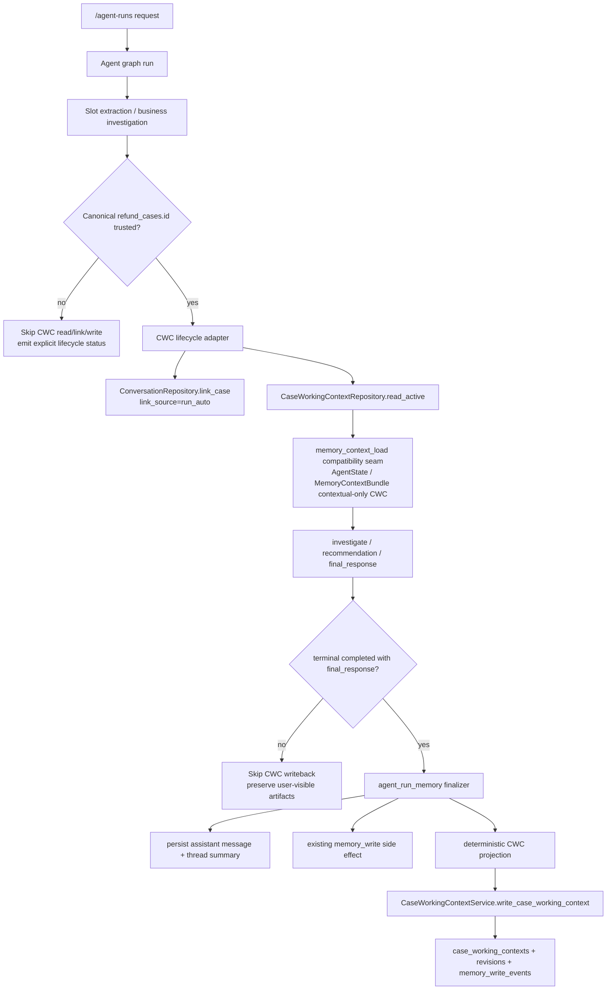

# Phase 45: Memory Lifecycle Wiring for Case Working Context - Research

**Researched:** 2026-07-03  
**Domain:** MOCA memory lifecycle wiring, agent-run finalization, Case Working Context read/write integration  
**Confidence:** HIGH for existing surfaces and constraints; MEDIUM for recommended adapter shape until planned and implemented

<user_constraints>
## User Constraints (from CONTEXT.md)

Source for this section: [VERIFIED: .planning/phases/45-memory-lifecycle-wiring-for-case-working-context/45-CONTEXT.md]

### Locked Decisions

#### A. GAD-01 qualification and boundary

1. **GAD-01 is acceptable for this phase as-is.**
   - Phase 45 must not wait for ReAct implementation.
   - Phase 45 must not attempt to solve general observation -> slot graph topology.

2. **Observation -> slot feedback is locked to GAD-01 option A / loop-local.**
   - `investigate` may keep discovered identifiers in its own future planner memory / loop-local state.
   - `investigate` must **not** write graph-global `active_slots`.
   - `investigate` must not become the canonical slot writer.

3. **Phase 45 memory lifecycle must be decoupled from future ReAct topology.**
   - Do not hard-code rules that only work because today's graph order is fixed.
   - Do not couple CWC lifecycle semantics to current node names beyond a small compatibility adapter.

4. **Introduce a stable memory lifecycle adapter/service boundary.**
   - Exact module/class names are the agent's discretion.
   - Core CWC repository/service should remain graph-agnostic.
   - Graph/API/finalizer code should call the lifecycle adapter rather than embedding CWC business rules inline.

#### B. Write hook / terminal lifecycle

5. **Prefer the existing terminal finalizer as the first production CWC write hook.**
   - Primary surface: `src/api/services/agent_run_memory.py`.
   - Rationale from codebase scout:
     - already runs after completed `/agent-runs`;
     - already persists assistant messages and thread summaries;
     - already invokes `memory_write`;
     - already isolates memory write effects and reports memory write status without blocking the response.

6. **Graph `memory_write` can be wired later/also if needed, but business rule belongs in the adapter.**
   - If planner decides spec alignment requires canonical `memory_write`, the adapter should still own the CWC projection/write rules.
   - Do not hide CWC writeback inside `final_response`.

#### C. Active CWC read hook

7. **Active CWC read should happen after slot/case identity resolution and before investigation/recommendation can use memory context.**
   - Natural compatibility seam in current implementation: `memory_context_load` alias path, currently represented by `long_term_memory_retrieve` / `reviewed_memory_context_retrieve`.
   - Extend that seam with CWC active-read projection rather than adding CWC logic inside recommendation templates only.

8. **No trusted case identity => skip active CWC read.**
   - Must produce explicit status/ref reason.
   - Must not backfill CWC from `case_memories`.
   - Must not guess a case from ambiguous text.

9. **Loaded CWC is contextual-only run state.**
   - It may be exposed through additive `AgentState` fields and/or `memory_context_bundle` extension.
   - Exact field names are planner discretion, but new fields must be registered/reset/tested if added.

#### D. Thread-case link lifecycle

10. **When canonical `case_id` is resolved, Phase 45 should link the current thread to the case.**
    - Use `ConversationRepository.link_case(...)`.
    - Use `link_source="run_auto"`.
    - Use `linked_by_run_id=current_run_id` when available.

11. **`append_message` remains non-linking.**
    - Do not restore implicit thread-case coupling there.

12. **Duplicate links should dedupe through Phase 44 repository/unique active index.**
    - Link failure should be surfaced in lifecycle status/trace.
    - Link failure must not silently create a CWC row anyway.

#### E. CWC writeback eligibility

13. **CWC writeback is eligible only for successful completed terminal runs with a final response and resolved canonical case id.**
    - Approval-pending, interrupted, cancelled, error, missing-final-response paths skip.
    - Clarification-only turns may link the thread if a canonical case id is resolved, but should skip CWC content update unless planner proves a safe deterministic update rule.

14. **Writeback must call the Phase 44 audited CWC service.**
    - Use `CaseWorkingContextService.write_case_working_context(...)`.
    - Preserve Phase 44 isolation, audit, conflict, version, and PII behavior.

15. **CWC write failure/conflict must not roll back terminal user-visible artifacts.**
    - Do not roll back final assistant message.
    - Do not roll back thread summary.
    - Do not roll back action/approval/user response.
    - Report status/trace.

#### F. Projection rules

16. **No LLM summarizer for Phase 45 CWC writeback.**
    - Use deterministic projection from final run state to `CaseWorkingContextContentV1`.

17. **Projection may use safe summaries/refs from current run state.**
    - Allowed inputs include:
      - user query;
      - active slots;
      - business_context;
      - tool_results;
      - rag_context_bundle / policy evidence refs;
      - claim_verification_bundle;
      - recommendation/proposed action;
      - approval/action draft state;
      - final response.
    - Must preserve Phase 44 boundaries:
      - claims and verified facts separate;
      - tool facts are refs/summaries with `observed_at`;
      - no policy body text;
      - no sensitive raw PII.

18. **Existing session/long-term/reviewed case memory remain compatible.**
    - Do not change those tables or behaviors as part of Phase 45.

#### G. Testing / verification expectations

19. **Plans must use MOCA test entrypoint.**
    - Use `UV_CACHE_DIR=/tmp/uv-cache uv run pytest ...`.
    - Bare `pytest` and bare `python -m pytest` are invalid verification in MOCA.

20. **Plan tests should cover at least:**
    - active CWC read success/skip;
    - thread-case link creation/dedupe/failure status;
    - terminal writeback success/skip/conflict/PII-block paths;
    - finalizer integration preserving assistant message/thread summary on CWC failure;
    - red-line preservation: no `case_memories` backfill, no `active_slots` global writer from `investigate`, no LLM summarizer.

### Claude's Discretion

The agent may decide:

- exact lifecycle adapter/module/class names;
- whether to extend `memory_write` node directly or add a dedicated CWC helper invoked by terminal finalizer first;
- exact additive state field names for loaded CWC/status;
- exact plan split, but first plan set should separate at least:
  1. contract/state boundary;
  2. active read + link wiring;
  3. terminal writeback/finalizer wiring;
  4. final verification/spec alignment if those touch different ownership surfaces.

### Deferred Ideas (OUT OF SCOPE)

- Implementing ReAct / LangGraph loop topology.
- Making `investigate` write canonical graph-global `active_slots`.
- Repositioning `case_memories` into closed-case precedent.
- Closed-case precedent extraction.
- Narrow long-term explicit-preference memory path.
- Session memory redesign.
- Renaming `case_memories` or `long_term_memories`.
- Destructive changes to `conversation_threads.case_id`.

</user_constraints>

## Summary

Phase 45 should wire the Phase 44 Case Working Context (CWC) foundation into the current run lifecycle through a small lifecycle adapter: resolve a canonical `refund_cases.id`, create the `thread_case_links` row with `link_source="run_auto"`, load active CWC at the existing memory context seam, and write a deterministic CWC projection from the terminal run finalizer after successful completion. [VERIFIED: .planning/phases/45-memory-lifecycle-wiring-for-case-working-context/45-CONTEXT.md] [VERIFIED: .planning/phases/44-memory-layering-case-working-context-thread-case-many-to-man/44-VERIFICATION.md]

The current production write hook to prefer is `finalize_completed_agent_run_memory(...)` in `src/api/services/agent_run_memory.py`; it runs after completed `/agent-runs`, persists the terminal assistant message and thread summary, calls the existing `memory_write` node in isolated memory side effects, and reports memory status without blocking the response. [VERIFIED: src/api/services/agent_run_memory.py] [VERIFIED: src/api/routers/agent_runs.py] The CWC write should call `CaseWorkingContextService.write_case_working_context(...)` so Phase 44 audit events, version checks, PII blocking, tenant/run/case ownership checks, and child-session isolation remain intact. [VERIFIED: src/memory/case_working_context_service.py] [VERIFIED: tests/memory/test_case_working_context_service.py]

The main planning risk is trusted case identity. The repository already has a canonical resolver for `refund_cases.id`, but the graph currently has multiple possible places where case references can appear: explicit slots, `business_context`, tool results, and legacy reviewed-memory retrieval scope. [VERIFIED: src/memory/case_identity.py] [VERIFIED: src/agent/nodes/investigate.py] [VERIFIED: src/memory/context_service.py] The plan should make the resolver contract explicit and fail closed when identity is missing or untrusted. [VERIFIED: .planning/phases/45-memory-lifecycle-wiring-for-case-working-context/45-CONTEXT.md]

**Primary recommendation:** build one CWC lifecycle adapter used by both the active-read seam and the terminal finalizer; keep CWC repository/service graph-agnostic, keep `investigate` from writing graph-global `active_slots`, and use deterministic projection only. [VERIFIED: .planning/phases/45-memory-lifecycle-wiring-for-case-working-context/45-CONTEXT.md] [VERIFIED: src/memory/case_working_context.py] [VERIFIED: src/agent/nodes/investigate.py]

## Architectural Responsibility Map

| Capability | Primary Tier | Secondary Tier | Rationale |
|------------|--------------|----------------|-----------|
| Canonical case identity resolution | API / Backend | Database / Storage | `resolve_case_id(...)` verifies `refund_cases.id` or case number against tenant-scoped persisted refund cases. [VERIFIED: src/memory/case_identity.py] |
| Thread-case link creation | API / Backend | Database / Storage | `ConversationRepository.link_case(...)` delegates to the Phase 44 thread-case link repository and preserves `append_message` as non-linking. [VERIFIED: src/conversation/repository.py] [VERIFIED: src/memory/thread_case_links.py] |
| Active CWC read | API / Backend | Database / Storage | The current memory context seam is `long_term_memory_retrieve` / `reviewed_memory_context_retrieve`, and CWC active read should extend that seam after identity resolution. [VERIFIED: src/agent/nodes/long_term_memory_retrieve.py] [VERIFIED: src/agent/nodes/reviewed_memory_context_retrieve.py] [VERIFIED: .planning/phases/45-memory-lifecycle-wiring-for-case-working-context/45-CONTEXT.md] |
| Contextual CWC exposure to agent state | API / Backend | — | AgentState already carries reset-per-run memory context fields; Phase 45 should add/reset/test CWC fields or extend `MemoryContextBundle`. [VERIFIED: src/agent/state.py] [VERIFIED: src/agent/nodes/receive_request.py] [VERIFIED: src/memory/context_refs.py] |
| Terminal CWC writeback | API / Backend | Database / Storage | `/agent-runs` calls `finalize_completed_agent_run_memory(...)` after completed runs; the Phase 44 CWC service owns durable write/audit/isolation behavior. [VERIFIED: src/api/routers/agent_runs.py] [VERIFIED: src/api/services/agent_run_memory.py] [VERIFIED: src/memory/case_working_context_service.py] |
| CWC projection from run state | API / Backend | — | Phase 45 locks deterministic projection from final run state and forbids an LLM summarizer. [VERIFIED: .planning/phases/45-memory-lifecycle-wiring-for-case-working-context/45-CONTEXT.md] |
| Validation and contract alignment | API / Backend | Documentation / Planning | MOCA treats `docs/contract-spec.md` as the normative contract source, and CWC AgentState/spec changes require traceable alignment. [VERIFIED: CLAUDE.md] [VERIFIED: docs/contract-spec.md] |

## Project Constraints (from CLAUDE.md and AGENTS.md)

- `docs/contract-spec.md` is MOCA's sole normative contract source; it defines target contract semantics, not automatically implemented facts. [VERIFIED: CLAUDE.md] [VERIFIED: docs/contract-spec.md]
- Phase implementation must not silently diverge from `docs/contract-spec.md`; spec errors require spec fixes, and intentional implementation compromises require an MVP scope or decision trace. [VERIFIED: CLAUDE.md]
- Phase-level planning must split work by ownership/service boundary/wave/verification gate; a single broad plan that covers contract, implementation, compatibility, caller rewiring, security, and final verification is a planning blocker. [VERIFIED: CLAUDE.md]
- MOCA tests in plans, reviews, and verification must use `UV_CACHE_DIR=/tmp/uv-cache uv run pytest ...`; bare `pytest` and bare `python -m pytest` are invalid verification. [VERIFIED: AGENTS.md]
- When implementation modifies memory, RAG, tool calling, or intent-recognition subsystems and finds or fixes subsystem-level debt, it should append a Chinese entry to `.planning/ARCHITECTURE-DEBT.md`. [VERIFIED: AGENTS.md]
- When local debugging/startup/validation/API/RAG/agent/memory/tool-call verification finds an error or environment pitfall, the handled incident should be appended in Chinese to `.planning/LOCAL-VALIDATION-ISSUES.md`. [VERIFIED: AGENTS.md]
- Project-local skills were checked under `.claude/skills` and `.agents/skills`; no project-local `SKILL.md` files were found. [VERIFIED: find .claude/skills .agents/skills -maxdepth 3 -type f -name SKILL.md]
- The planning graph file `.planning/graphs/graph.json` is absent, so semantic graph context was not available for this research. [VERIFIED: test -f .planning/graphs/graph.json]

## Requirement Trace

No new Phase 45 requirement IDs are currently mapped in `.planning/ROADMAP.md`; Phase 45 is the named follow-up for the MEM-01/MEM-02 lifecycle defers. [VERIFIED: .planning/ROADMAP.md] [VERIFIED: .planning/REQUIREMENTS.md]

| Requirement | Current Status | Phase 45 Planning Relevance |
|-------------|----------------|-----------------------------|
| MEM-01 Case Working Context | Phase 44 delivered schema, service, audit, and callable read/write surface; graph run-completion auto-update was deferred to Phase 45. [VERIFIED: .planning/REQUIREMENTS.md] [VERIFIED: .planning/phases/44-memory-layering-case-working-context-thread-case-many-to-man/44-VERIFICATION.md] | Plan terminal lifecycle writeback and active read wiring without changing Phase 44 persistence semantics. [VERIFIED: .planning/phases/45-memory-lifecycle-wiring-for-case-working-context/45-CONTEXT.md] |
| MEM-02 Thread-Case Many-to-Many Link | Phase 44 delivered additive `thread_case_links` and `ConversationRepository.link_case(...)`; no destructive legacy column change. [VERIFIED: .planning/REQUIREMENTS.md] [VERIFIED: src/conversation/repository.py] | Plan automatic `run_auto` linking once a canonical case id is resolved for the run. [VERIFIED: .planning/phases/45-memory-lifecycle-wiring-for-case-working-context/45-CONTEXT.md] |

## Standard Stack

### Core

| Library / Tool | Verified Version | Purpose | Why Standard for This Phase |
|----------------|------------------|---------|-----------------------------|
| Python | 3.12.13 through `uv run` | Runtime for API, agent graph, repositories, and tests | The project requires Python `>=3.12`, and MOCA validation must use the project environment rather than host Python. [VERIFIED: pyproject.toml] [VERIFIED: UV_CACHE_DIR=/tmp/uv-cache uv run python -c importlib.metadata] |
| FastAPI | 0.136.1 | API routing and `/agent-runs` integration surface | `/agent-runs` is the current production surface that invokes the terminal finalizer. [VERIFIED: UV_CACHE_DIR=/tmp/uv-cache uv run python -c importlib.metadata] [VERIFIED: src/api/routers/agent_runs.py] |
| SQLAlchemy async | 2.0.49 | Async DB sessions, repositories, transaction boundaries | Phase 44 CWC, thread links, conversations, and finalizer use `AsyncSession` repositories. [VERIFIED: UV_CACHE_DIR=/tmp/uv-cache uv run python -c importlib.metadata] [VERIFIED: src/memory/case_working_context.py] [VERIFIED: src/conversation/repository.py] |
| asyncpg | 0.31.0 | PostgreSQL async driver used by test DB fixtures | Test fixtures create and reset the PostgreSQL test DB through asyncpg/SQLAlchemy. [VERIFIED: UV_CACHE_DIR=/tmp/uv-cache uv run python -c importlib.metadata] [VERIFIED: tests/conftest.py] |
| Alembic | 1.18.4 through `uv run` | Migration status and schema verification | The current migration head is `022_case_working_context`. [VERIFIED: UV_CACHE_DIR=/tmp/uv-cache uv run alembic heads] |
| Pydantic | 2.13.4 | CWC schemas and context bundle validation | Phase 44 CWC content, candidate, and result schemas are Pydantic models. [VERIFIED: UV_CACHE_DIR=/tmp/uv-cache uv run python -c importlib.metadata] [VERIFIED: src/memory/case_working_context_schemas.py] |
| LangGraph | 1.1.10 | Current agent graph runtime | The graph currently registers deterministic nodes ending at `final_response`, and canonical `memory_write` exists in vocabulary but not the compiled graph. [VERIFIED: UV_CACHE_DIR=/tmp/uv-cache uv run python -c importlib.metadata] [VERIFIED: src/agent/graph.py] [VERIFIED: src/agent/graph_vocabulary.py] |
| pytest / pytest-asyncio | pytest 9.0.3 / pytest-asyncio 1.3.0 | Unit, integration, and async DB tests | Existing Phase 44 and finalizer tests use pytest fixtures and async tests. [VERIFIED: UV_CACHE_DIR=/tmp/uv-cache uv run pytest --version] [VERIFIED: UV_CACHE_DIR=/tmp/uv-cache uv run python -c importlib.metadata] [VERIFIED: tests/conftest.py] |

### Supporting

| Library / Tool | Verified Version | Purpose | When to Use |
|----------------|------------------|---------|-------------|
| Docker | 29.4.2 | Local PostgreSQL/Redis service startup | Use `docker compose up -d postgres` when localhost PostgreSQL is unavailable for DB-backed tests. [VERIFIED: docker --version] [VERIFIED: docker-compose.yml] |
| pgvector PostgreSQL image | `pgvector/pgvector:pg16` | Local PostgreSQL service with required extensions | Compose defines the local DB used by app/test workflows. [VERIFIED: docker-compose.yml] |
| gsd-sdk | 0.1.0 | GSD phase metadata and commit helper | Used to resolve phase context and project configuration. [VERIFIED: gsd-sdk --version] [VERIFIED: gsd-sdk query init.phase-op 45] |

### Alternatives Considered

| Instead of | Could Use | Tradeoff |
|------------|-----------|----------|
| Dedicated CWC lifecycle adapter calling Phase 44 service | Extend generic `MemoryWriteService` with a CWC candidate type | `MemoryWriteService` currently handles session, long-term, and reviewed case candidates; adding CWC there expands the generic reviewed-memory path and risks mixing active CWC with reviewed case memory. [VERIFIED: src/memory/write_service.py] [VERIFIED: docs/contract-spec.md] |
| Terminal finalizer hook first | Insert CWC write inside `final_response` | `final_response` should produce the user-visible response, while the current finalizer already handles post-terminal memory side effects and status reporting. [VERIFIED: src/agent/nodes/final_response.py] [VERIFIED: src/api/services/agent_run_memory.py] |
| Extend existing memory-context seam | Add CWC only inside recommendation prompt assembly | The locked decision says active CWC read belongs after identity resolution and before investigation/recommendation can use memory context. [VERIFIED: .planning/phases/45-memory-lifecycle-wiring-for-case-working-context/45-CONTEXT.md] |
| Deterministic projection | LLM-generated summary | Phase 45 explicitly forbids an LLM summarizer for CWC writeback. [VERIFIED: .planning/phases/45-memory-lifecycle-wiring-for-case-working-context/45-CONTEXT.md] |

**Installation:** no new runtime package is required for the recommended implementation. [VERIFIED: pyproject.toml] [VERIFIED: UV_CACHE_DIR=/tmp/uv-cache uv run python -c importlib.metadata]

**Version verification command used:**

```bash
UV_CACHE_DIR=/tmp/uv-cache uv run python -c "import importlib.metadata as m; ..."
UV_CACHE_DIR=/tmp/uv-cache uv run alembic heads
UV_CACHE_DIR=/tmp/uv-cache uv run pytest --version
```

## Architecture Patterns

### System Architecture Diagram



The diagram reflects the locked Phase 45 lifecycle boundary and the existing finalizer/service surfaces. [VERIFIED: .planning/phases/45-memory-lifecycle-wiring-for-case-working-context/45-CONTEXT.md] [VERIFIED: src/api/services/agent_run_memory.py] [VERIFIED: src/memory/case_working_context_service.py]

### Recommended Project Structure

```text
src/
├── memory/
│   ├── case_working_context_lifecycle.py     # recommended adapter boundary for resolve/link/read/project/write
│   ├── case_working_context.py               # existing graph-agnostic repository
│   ├── case_working_context_service.py       # existing audited write service
│   └── context_refs.py                       # existing MemoryContextBundle/status models to extend if needed
├── agent/
│   ├── state.py                              # existing AgentState registry to extend/reset for CWC fields
│   └── nodes/
│       ├── receive_request.py                # existing per-turn reset point
│       └── reviewed_memory_context_retrieve.py # existing memory_context_load compatibility seam
└── api/services/
    └── agent_run_memory.py                   # existing terminal finalizer hook
```

The new adapter file name is a recommendation; the underlying ownership boundary is locked by Phase 45 context and existing code structure. [VERIFIED: .planning/phases/45-memory-lifecycle-wiring-for-case-working-context/45-CONTEXT.md] [VERIFIED: src/memory/case_working_context_service.py] [VERIFIED: src/api/services/agent_run_memory.py]

### Pattern 1: Stable Lifecycle Adapter

**What:** place Phase 45 orchestration in one backend service/adapter that resolves identity, links thread to case, reads active CWC, projects terminal content, and calls the audited Phase 44 write service. [VERIFIED: .planning/phases/45-memory-lifecycle-wiring-for-case-working-context/45-CONTEXT.md]

**When to use:** use it from the memory-context load seam and the terminal finalizer; do not embed CWC rules directly in graph nodes or repositories. [VERIFIED: .planning/phases/45-memory-lifecycle-wiring-for-case-working-context/45-CONTEXT.md]

**Example:**

```python
# Source pattern: Phase 45 context + existing finalizer/service surfaces.
# [VERIFIED: .planning/phases/45-memory-lifecycle-wiring-for-case-working-context/45-CONTEXT.md]
# [VERIFIED: src/api/services/agent_run_memory.py]
# [VERIFIED: src/memory/case_working_context_service.py]

@dataclass(frozen=True)
class CaseWorkingContextLifecycleResult:
    status: str
    case_id: UUID | None = None
    link_status: str | None = None
    read_status: str | None = None
    write_status: str | None = None
    reason: str | None = None


class CaseWorkingContextLifecycleAdapter:
    async def link_and_load_active(self, *, session, state) -> CaseWorkingContextLifecycleResult:
        ...

    async def write_after_terminal_success(self, *, session, state, final_response) -> CaseWorkingContextLifecycleResult:
        ...
```

### Pattern 2: Fail-Closed Case Identity Contract

**What:** resolve CWC scope only to canonical `refund_cases.id`, using the Phase 44 resolver and tenant-scoped DB verification. [VERIFIED: src/memory/case_identity.py] [VERIFIED: .planning/phases/44-memory-layering-case-working-context-thread-case-many-to-man/44-CONTEXT.md]

**When to use:** before active CWC read, before thread-case link, and before terminal CWC writeback. [VERIFIED: .planning/phases/45-memory-lifecycle-wiring-for-case-working-context/45-CONTEXT.md]

**Planning rule:** candidate slots, reviewed memory items, and ambiguous text are not trusted enough to create a CWC scope. [VERIFIED: tests/agent/test_reviewed_memory_context_retrieve.py] [VERIFIED: .planning/phases/45-memory-lifecycle-wiring-for-case-working-context/45-CONTEXT.md]

**Example:**

```python
# Source pattern: case resolver + reviewed-memory fail-closed tests.
# [VERIFIED: src/memory/case_identity.py]
# [VERIFIED: tests/agent/test_reviewed_memory_context_retrieve.py]

async def resolve_cwc_case_scope(session, *, tenant_id, current_slots, business_context):
    raw_ref = current_slots.get("refund_case_id")
    if raw_ref:
        result = await resolve_case_id(session, tenant_id=tenant_id, raw_case_ref=raw_ref)
        if result.status == "resolved":
            return result

    raw_ref = refund_case_ref_from_current_business_fact(business_context)
    if raw_ref:
        return await resolve_case_id(session, tenant_id=tenant_id, raw_case_ref=raw_ref)

    return CaseIdentityResolution(status="skipped", reason="no_trusted_case_identity")
```

The helper `refund_case_ref_from_current_business_fact(...)` is a recommended adapter helper; the exact implementation should require current business fact evidence rather than stale memory-only context. [VERIFIED: src/agent/run_scope.py] [VERIFIED: tests/agent/test_reviewed_memory_context_retrieve.py]

### Pattern 3: CWC as Contextual-Only Memory Context

**What:** expose loaded CWC through additive AgentState fields and/or `MemoryContextBundle`, preserving `authority_class="contextual_only"`. [VERIFIED: src/agent/state.py] [VERIFIED: src/memory/context_refs.py] [VERIFIED: docs/contract-spec.md]

**When to use:** after canonical case identity resolution and before investigation/recommendation reads memory context. [VERIFIED: .planning/phases/45-memory-lifecycle-wiring-for-case-working-context/45-CONTEXT.md]

**Implementation note:** new fields must be reset in `receive_request`, registered in `AgentState`, and contract-aligned in `docs/contract-spec.md` if they become normative state. [VERIFIED: src/agent/nodes/receive_request.py] [VERIFIED: src/agent/state.py] [VERIFIED: docs/contract-spec.md]

### Pattern 4: Terminal Writeback After User-Visible Persistence

**What:** call the CWC write adapter from `finalize_completed_agent_run_memory(...)` after terminal message/summary persistence, and report CWC status in trace/finalizer metrics. [VERIFIED: src/api/services/agent_run_memory.py]

**When to use:** only when final status is `completed`, final response exists, and canonical case id is resolved. [VERIFIED: .planning/phases/45-memory-lifecycle-wiring-for-case-working-context/45-CONTEXT.md]

**Failure rule:** CWC conflicts, PII blocks, and write errors must not remove the assistant message, thread summary, action, approval, or user response. [VERIFIED: .planning/phases/45-memory-lifecycle-wiring-for-case-working-context/45-CONTEXT.md] [VERIFIED: tests/test_agent_runs_api.py] [VERIFIED: tests/memory/test_case_working_context_service.py]

### Pattern 5: Deterministic Projection into CWC Schemas

**What:** build `CaseWorkingContextWriteCandidate` and `CaseWorkingContextContentV1` from safe run-state summaries and refs, then let the Phase 44 service validate/audit/persist it. [VERIFIED: src/memory/case_working_context_schemas.py] [VERIFIED: src/memory/case_working_context_service.py]

**When to use:** terminal successful runs with canonical case id; skip clarification-only unless a deterministic safe content rule is proven. [VERIFIED: .planning/phases/45-memory-lifecycle-wiring-for-case-working-context/45-CONTEXT.md]

**Boundary:** claims and verified facts remain separate, tool facts must be refs/summaries with `observed_at`, policy body text is excluded, and sensitive raw PII is excluded or blocked. [VERIFIED: .planning/phases/45-memory-lifecycle-wiring-for-case-working-context/45-CONTEXT.md] [VERIFIED: docs/contract-spec.md] [VERIFIED: src/memory/case_working_context_schemas.py]

### Anti-Patterns to Avoid

- **Writing CWC from `final_response`:** `final_response` is the response-generation node; terminal memory side effects already live in the finalizer. [VERIFIED: src/agent/nodes/final_response.py] [VERIFIED: src/api/services/agent_run_memory.py]
- **Letting `investigate` mutate graph-global `active_slots`:** Phase 45 locks observation-to-slot feedback to loop-local GAD-01 option A. [VERIFIED: .planning/phases/45-memory-lifecycle-wiring-for-case-working-context/45-CONTEXT.md] [VERIFIED: .planning/DEFERRED-DECISIONS.md]
- **Backfilling CWC from `case_memories`:** `case_memories` are reviewed precedent/known-answer memory, not active case state. [VERIFIED: docs/contract-spec.md] [VERIFIED: .planning/MEMORY-REDESIGN-DECISIONS.md]
- **Using an LLM summarizer for writeback:** Phase 45 explicitly forbids LLM summarization for CWC projection. [VERIFIED: .planning/phases/45-memory-lifecycle-wiring-for-case-working-context/45-CONTEXT.md]
- **Creating a CWC row after link failure:** Phase 45 requires link failure to surface in lifecycle status/trace and not silently create a CWC row. [VERIFIED: .planning/phases/45-memory-lifecycle-wiring-for-case-working-context/45-CONTEXT.md]
- **Parallel DB-backed pytest during verification:** MOCA already recorded DB-backed pytest collisions against the shared `moca_test` database. [VERIFIED: .planning/ARCHITECTURE-DEBT.md] [VERIFIED: tests/conftest.py]

## Don't Hand-Roll

| Problem | Don't Build | Use Instead | Why |
|---------|-------------|-------------|-----|
| Canonical case identity | Ad hoc parsing of case numbers or UUID strings | `resolve_case_id(...)` | It verifies tenant-scoped `refund_cases.id` or case number and fails invalid/unknown inputs. [VERIFIED: src/memory/case_identity.py] [VERIFIED: tests/memory/test_case_identity.py] |
| Thread-case link dedupe and validation | Manual insert into `thread_case_links` | `ConversationRepository.link_case(...)` | It preserves `append_message` as non-linking and delegates active-link dedupe/tenant/run validation. [VERIFIED: src/conversation/repository.py] [VERIFIED: src/memory/thread_case_links.py] |
| CWC durable write/audit/isolation | Inline DB update in finalizer | `CaseWorkingContextService.write_case_working_context(...)` | It already handles validation, child-session isolation, PII block, conflict handling, candidate hashing, and memory write events. [VERIFIED: src/memory/case_working_context_service.py] [VERIFIED: tests/memory/test_case_working_context_service.py] |
| CWC content validation | Dicts with hand-checked fields | `CaseWorkingContextContentV1` and `CaseWorkingContextWriteCandidate` | The schemas encode contextual-only authority, source refs, facts, claims, evidence pointers, policy refs, and PII classification. [VERIFIED: src/memory/case_working_context_schemas.py] |
| Active CWC DB read | Raw SQL lookup | `CaseWorkingContextRepository.read_active(...)` | The repository already defines the active CWC persistence surface. [VERIFIED: src/memory/case_working_context.py] |
| Memory side-effect rollback safety | Shared parent transaction mutation | Existing isolated memory side-effect helper/service pattern | Existing tests verify memory rollback does not remove terminal rows, and Phase 44 CWC service uses isolated child sessions. [VERIFIED: src/memory/write_isolation.py] [VERIFIED: src/api/services/agent_run_memory.py] [VERIFIED: tests/test_agent_runs_api.py] |
| Reviewed memory retrieval semantics | Merge CWC into `case_memory` | Keep CWC separate from `case_memories` | The contract locks `case_memories` as reviewed precedent and CWC as active case working state. [VERIFIED: docs/contract-spec.md] [VERIFIED: .planning/MEMORY-REDESIGN-DECISIONS.md] |

**Key insight:** Phase 44 already built the hard persistence, audit, validation, and isolation surfaces; Phase 45 should wire lifecycle orchestration, not reimplement memory storage. [VERIFIED: .planning/phases/44-memory-layering-case-working-context-thread-case-many-to-man/44-VERIFICATION.md] [VERIFIED: src/memory/case_working_context_service.py]

## Common Pitfalls

### Pitfall 1: Treating Any Case-Looking Text as Trusted Scope

**What goes wrong:** a run reads or writes CWC for the wrong refund case because it trusted ambiguous text, stale memory, or candidate slots. [VERIFIED: .planning/phases/45-memory-lifecycle-wiring-for-case-working-context/45-CONTEXT.md]  
**Why it happens:** current graph state can contain extracted slots, reviewed memory context, business context, and tool results with different authority levels. [VERIFIED: src/agent/state.py] [VERIFIED: src/memory/context_service.py]  
**How to avoid:** require canonical `refund_cases.id` resolution through `resolve_case_id(...)` and fail closed with an explicit skip reason. [VERIFIED: src/memory/case_identity.py]  
**Warning signs:** CWC writes in tests where no current refund case fact or explicit trusted case ref exists. [VERIFIED: tests/agent/test_reviewed_memory_context_retrieve.py]

### Pitfall 2: Coupling CWC Semantics to Today's Graph Shape

**What goes wrong:** ReAct migration later breaks memory lifecycle because rules are hidden in current node order or names. [VERIFIED: .planning/phases/45-memory-lifecycle-wiring-for-case-working-context/45-CONTEXT.md]  
**Why it happens:** current compiled graph ends at `final_response` and does not include canonical `memory_write`, while the spec vocabulary includes it as a runtime node. [VERIFIED: src/agent/graph.py] [VERIFIED: src/agent/graph_vocabulary.py] [VERIFIED: docs/contract-spec.md]  
**How to avoid:** put CWC lifecycle rules behind a backend adapter callable from current and future graph/API seams. [VERIFIED: .planning/phases/45-memory-lifecycle-wiring-for-case-working-context/45-CONTEXT.md]  
**Warning signs:** CWC logic placed directly in `final_response`, `investigate`, or a route function. [VERIFIED: src/agent/nodes/final_response.py] [VERIFIED: src/agent/nodes/investigate.py]

### Pitfall 3: Mixing Active CWC with Reviewed Case Memory

**What goes wrong:** active working state becomes treated like reviewed precedent or policy/evidence authority. [VERIFIED: docs/contract-spec.md]  
**Why it happens:** existing `MemoryContextBundle` already has `case_items`, and generic write service supports `case` candidates. [VERIFIED: src/memory/context_refs.py] [VERIFIED: src/memory/write_service.py]  
**How to avoid:** add separate CWC fields/status or clearly separate CWC bundle fields with contextual-only authority. [VERIFIED: docs/contract-spec.md] [VERIFIED: .planning/phases/45-memory-lifecycle-wiring-for-case-working-context/45-CONTEXT.md]  
**Warning signs:** code copies CWC into `case_memory` or writes CWC through `CaseMemoryWriteCandidate`. [VERIFIED: src/memory/write_service.py]

### Pitfall 4: Terminal Memory Failure Rolls Back User-Visible Work

**What goes wrong:** final assistant message or thread summary disappears after a CWC conflict, PII block, or service error. [VERIFIED: .planning/phases/45-memory-lifecycle-wiring-for-case-working-context/45-CONTEXT.md]  
**Why it happens:** memory write is performed in the parent transaction or before terminal persistence is committed. [VERIFIED: src/api/services/agent_run_memory.py]  
**How to avoid:** keep terminal persistence and memory side effects isolated; use Phase 44 service isolation and finalizer status reporting. [VERIFIED: src/memory/case_working_context_service.py] [VERIFIED: src/memory/write_isolation.py]  
**Warning signs:** tests fail the existing rollback preservation case in `tests/test_agent_runs_api.py`. [VERIFIED: tests/test_agent_runs_api.py]

### Pitfall 5: Invalid MOCA Test Entrypoint

**What goes wrong:** tests appear to fail during collection because the host Python or wrong environment is used. [VERIFIED: AGENTS.md]  
**Why it happens:** bare `pytest` or bare `python -m pytest` can bypass the project `uv` environment. [VERIFIED: AGENTS.md]  
**How to avoid:** every plan/test command should use `UV_CACHE_DIR=/tmp/uv-cache uv run pytest ...`. [VERIFIED: AGENTS.md]  
**Warning signs:** verification output from bare `pytest` in plan, review, or final acceptance. [VERIFIED: AGENTS.md]

## Code Examples

Verified patterns from project sources:

### Active CWC Read and Link Adapter

```python
# Source: Phase 45 locked decisions + Phase 44 repositories.
# [VERIFIED: .planning/phases/45-memory-lifecycle-wiring-for-case-working-context/45-CONTEXT.md]
# [VERIFIED: src/conversation/repository.py]
# [VERIFIED: src/memory/case_working_context.py]

async def link_and_load_active_cwc(session, *, tenant_id, user_id, thread_id, run_id, state):
    identity = await resolve_cwc_case_scope(
        session,
        tenant_id=tenant_id,
        current_slots=state.get("active_slots") or {},
        business_context=state.get("business_context"),
    )
    if identity.status != "resolved":
        return {"case_working_context_status": {"status": "skipped", "reason": identity.reason}}

    await ConversationRepository(session).link_case(
        tenant_id=tenant_id,
        user_id=user_id,
        thread_id=thread_id,
        case_id=identity.case_id,
        link_source="run_auto",
        linked_by_run_id=run_id,
    )
    active = await CaseWorkingContextRepository(session).read_active(
        tenant_id=tenant_id,
        case_id=identity.case_id,
    )
    return project_cwc_read_to_context_bundle(active, identity)
```

### Terminal CWC Writeback from Finalizer

```python
# Source: existing finalizer + Phase 44 CWC service.
# [VERIFIED: src/api/services/agent_run_memory.py]
# [VERIFIED: src/memory/case_working_context_service.py]

async def finalize_completed_agent_run_memory(...):
    # Existing behavior persists assistant message, summary, and generic memory_write.
    result = await existing_terminal_memory_finalize(...)

    cwc_result = await cwc_lifecycle.write_after_terminal_success(
        session=session,
        tenant_id=tenant_id,
        user_id=user_id,
        thread_id=thread_id,
        run_id=current_run_id,
        state=final_state,
        final_response=final_response,
    )
    return result.with_cwc_status(cwc_result)
```

### Deterministic CWC Projection

```python
# Source: CWC schema + Phase 45 deterministic projection rule.
# [VERIFIED: src/memory/case_working_context_schemas.py]
# [VERIFIED: .planning/phases/45-memory-lifecycle-wiring-for-case-working-context/45-CONTEXT.md]

def project_case_working_context_content(state, *, case_id, run_id):
    return CaseWorkingContextContentV1(
        authority_class="contextual_only",
        open_claims=claims_from_claim_verification_bundle(state),
        verified_facts=facts_from_business_context_refs(state),
        evidence_pointers=evidence_pointers_from_tool_results(state),
        latest_recommendation=recommendation_from_draft_or_final_response(state),
        next_action=next_action_from_approval_or_action_draft(state),
    )
```

The projection helper names above are recommended implementation seams; each output must use the Phase 44 Pydantic schema and must not include policy body text or sensitive raw PII. [VERIFIED: src/memory/case_working_context_schemas.py] [VERIFIED: .planning/phases/45-memory-lifecycle-wiring-for-case-working-context/45-CONTEXT.md]

## State of the Art

| Old / Current Surface | Phase 45 Target Approach | When Changed / Locked | Impact |
|-----------------------|--------------------------|-----------------------|--------|
| `case_memories` can be confused with active case memory | CWC is a separate active working-state layer; reviewed `case_memories` remain precedent/known-answer memory. | Locked by memory redesign and Phase 44. [VERIFIED: .planning/MEMORY-REDESIGN-DECISIONS.md] [VERIFIED: docs/contract-spec.md] | Plan must not backfill active CWC from reviewed case memory. [VERIFIED: .planning/phases/45-memory-lifecycle-wiring-for-case-working-context/45-CONTEXT.md] |
| `conversation_threads.case_id` exists as legacy scalar state | `thread_case_links` is additive M:N association; legacy column is not destructively changed in Phase 45. | Delivered in Phase 44. [VERIFIED: .planning/phases/44-memory-layering-case-working-context-thread-case-many-to-man/44-VERIFICATION.md] | Plan automatic `run_auto` linking through repository, not implicit `append_message` coupling. [VERIFIED: src/conversation/repository.py] |
| Current compiled graph ends at `final_response` and omits canonical `memory_write` node | Use terminal finalizer first; optionally align canonical `memory_write` later without embedding business rules there. | Locked in Phase 45 context. [VERIFIED: src/agent/graph.py] [VERIFIED: docs/contract-spec.md] [VERIFIED: .planning/phases/45-memory-lifecycle-wiring-for-case-working-context/45-CONTEXT.md] | Planner should split finalizer wiring from any contract/spec graph alignment plan. [VERIFIED: .planning/phases/45-memory-lifecycle-wiring-for-case-working-context/45-CONTEXT.md] |
| Generic `MemoryWriteService` writes session/long-term/reviewed case candidates | CWC writeback should use Phase 44 CWC service unless a deliberate generic candidate expansion is planned. | Phase 44 delivered CWC service; Phase 45 prefers finalizer/adapter. [VERIFIED: src/memory/write_service.py] [VERIFIED: src/memory/case_working_context_service.py] | Avoid mixing active CWC with reviewed-memory candidate semantics. [VERIFIED: docs/contract-spec.md] |

**Deprecated/outdated for this phase:**

- Treating `conversation_threads.case_id` as the durable CWC association is outdated for Phase 45; `thread_case_links` is the additive association surface. [VERIFIED: src/memory/thread_case_links.py] [VERIFIED: .planning/phases/44-memory-layering-case-working-context-thread-case-many-to-man/44-VERIFICATION.md]
- Treating `long_term_memory_retrieve` as only long-term memory is incomplete; the vocabulary maps it to the canonical `memory_context_load` compatibility target. [VERIFIED: src/agent/graph_vocabulary.py] [VERIFIED: docs/contract-spec.md]
- Treating `case_memories` as active case state is forbidden by the memory contract. [VERIFIED: docs/contract-spec.md]

## Assumptions Log

| # | Claim | Section | Risk if Wrong |
|---|-------|---------|---------------|
| — | No `[ASSUMED]` factual claims are used in this research. Recommended names and helper shapes are explicitly marked as recommendations and are backed by existing code patterns. | All | Planner can proceed from verified surfaces; exact names still require plan-level design. |

## Open Questions (RESOLVED)

1. **What exact inputs count as trusted enough to resolve canonical CWC case identity?**
   - RESOLVED: Plan 45-01 defines the trusted case-ref order as `active_slots["refund_case_id"]`, then `extracted_slots["refund_case_id"]`, then, only for terminal writeback with `include_business_context=True`, `business_context["refund_case"]["refund_case_no"]`, `business_context["refund_case"]["refund_case_id"]`, and `business_context["refund_case"]["id"]`. Every raw ref must still resolve through tenant-scoped `resolve_case_id(...)` to canonical `refund_cases.id`. Candidate slots, session memory, reviewed `case_memory`, `case_memories`, and `memory_context` are explicitly untrusted and must not link/read/write CWC.

2. **Should CWC read output extend `MemoryContextBundle` or use separate AgentState fields plus a status ref?**
   - RESOLVED: Use both additive AgentState fields and a bundle extension. Plan 45-01 extends `MemoryContextBundle` with optional `case_working_context` and `case_working_context_status_ref`. Plan 45-02 adds/reset-tests AgentState fields `case_working_context` and `case_working_context_lifecycle_status`. Plan 45-04 aligns `docs/contract-spec.md` to those exact field names.

3. **Is legacy `/api/v1/agent` chat in scope for CWC writeback?**
   - RESOLVED: Phase 45 scopes production CWC writeback to the `/agent-runs` completed-run finalizer in `src/api/services/agent_run_memory.py`, per D-45-04. The legacy `/api/v1/agent` chat background memory-write path is not a Phase 45 CWC writeback target unless a later phase records an explicit parity requirement.

4. **How should clarification-only completed turns be represented?**
   - RESOLVED: Clarification-only completed turns may still perform `run_auto` thread-case linking if a canonical case id resolves, but they skip CWC content writes with explicit lifecycle status `status="skipped"`, `write_status="skipped"`, and `reason_code="clarification_only"`. They must not create a `CaseWorkingContextWriteCandidate` unless a later phase defines and tests a deterministic safe update rule.

## Environment Availability

| Dependency | Required By | Available | Version | Fallback |
|------------|-------------|-----------|---------|----------|
| `uv` | All MOCA test commands and package version probes | Yes | 0.11.2 | None needed. [VERIFIED: command -v uv && uv --version] |
| Python through `uv run` | Runtime/tests | Yes | 3.12.13 | None needed; do not use host bare Python for pytest. [VERIFIED: UV_CACHE_DIR=/tmp/uv-cache uv run python --version] [VERIFIED: AGENTS.md] |
| PostgreSQL on localhost:5432 | DB-backed memory/finalizer tests | Required; compose config exists | `pgvector/pgvector:pg16` image in compose | Start with `docker compose up -d postgres` if unavailable. [VERIFIED: docker-compose.yml] [VERIFIED: tests/conftest.py] |
| Docker | Local PostgreSQL fallback | Yes | 29.4.2 | None needed. [VERIFIED: docker --version] |
| Alembic through `uv run` | Migration head checks | Yes | 1.18.4 | Use `UV_CACHE_DIR=/tmp/uv-cache uv run alembic ...`; direct `alembic` command was not found. [VERIFIED: UV_CACHE_DIR=/tmp/uv-cache uv run alembic heads] [VERIFIED: command -v alembic] |
| pytest through `uv run` | Validation | Yes | 9.0.3 | Use `UV_CACHE_DIR=/tmp/uv-cache uv run pytest ...`; bare pytest is invalid in MOCA plans. [VERIFIED: UV_CACHE_DIR=/tmp/uv-cache uv run pytest --version] [VERIFIED: AGENTS.md] |
| `psql` CLI | Manual DB inspection only | No | — | Not required for tests; use app fixtures/SQLAlchemy or compose logs if needed. [VERIFIED: command -v psql] |

**Missing dependencies with no fallback:** none for planning; PostgreSQL must be running before DB-backed verification. [VERIFIED: docker-compose.yml] [VERIFIED: tests/conftest.py]

**Missing dependencies with fallback:**

- Direct `alembic` CLI is unavailable; use `UV_CACHE_DIR=/tmp/uv-cache uv run alembic ...`. [VERIFIED: command -v alembic] [VERIFIED: UV_CACHE_DIR=/tmp/uv-cache uv run alembic heads]
- Direct `psql` CLI is unavailable; Phase 45 tests can use existing SQLAlchemy/asyncpg fixtures. [VERIFIED: command -v psql] [VERIFIED: tests/conftest.py]

## Validation Architecture

### Test Framework

| Property | Value |
|----------|-------|
| Framework | pytest 9.0.3 + pytest-asyncio 1.3.0. [VERIFIED: UV_CACHE_DIR=/tmp/uv-cache uv run pytest --version] [VERIFIED: UV_CACHE_DIR=/tmp/uv-cache uv run python -c importlib.metadata] |
| Config file | `pyproject.toml` sets pytest `asyncio_mode = "auto"` and ruff `target-version = "py312"`. [VERIFIED: pyproject.toml] |
| Quick run command | `UV_CACHE_DIR=/tmp/uv-cache uv run pytest tests/memory/test_case_identity.py tests/memory/test_thread_case_links.py -q` [VERIFIED: tests/memory/test_case_identity.py] [VERIFIED: tests/memory/test_thread_case_links.py] |
| Full targeted suite command | `UV_CACHE_DIR=/tmp/uv-cache uv run pytest tests/memory/test_case_identity.py tests/memory/test_thread_case_links.py tests/memory/test_case_working_context_service.py tests/agent/test_reviewed_memory_context_retrieve.py tests/test_agent_runs_api.py tests/memory/test_phase44_contract_alignment.py -q` [VERIFIED: tests/memory/test_case_working_context_service.py] [VERIFIED: tests/agent/test_reviewed_memory_context_retrieve.py] [VERIFIED: tests/test_agent_runs_api.py] |

### Phase Requirements -> Test Map

| Behavior | Test Type | Automated Command | File Exists? |
|----------|-----------|-------------------|--------------|
| Canonical identity resolves to tenant-scoped `refund_cases.id` and fails closed for blank/unknown values | unit / DB integration | `UV_CACHE_DIR=/tmp/uv-cache uv run pytest tests/memory/test_case_identity.py -q` | Existing. [VERIFIED: tests/memory/test_case_identity.py] |
| Thread-case link uses `run_auto`, dedupes, and `append_message` stays non-linking | DB integration | `UV_CACHE_DIR=/tmp/uv-cache uv run pytest tests/memory/test_thread_case_links.py -q` | Existing; Phase 45 likely needs lifecycle-level additions. [VERIFIED: tests/memory/test_thread_case_links.py] |
| Active CWC read succeeds/skips at memory-context seam with explicit status | unit / DB integration | `UV_CACHE_DIR=/tmp/uv-cache uv run pytest tests/agent/test_case_working_context_lifecycle.py -q` | Missing; Wave 0 gap. [VERIFIED: src/agent/nodes/reviewed_memory_context_retrieve.py] |
| Loaded CWC is contextual-only and separate from `case_memory` / reviewed items | unit / contract | `UV_CACHE_DIR=/tmp/uv-cache uv run pytest tests/agent/test_case_working_context_lifecycle.py tests/memory/test_phase45_contract_alignment.py -q` | Missing; Wave 0 gap. [VERIFIED: docs/contract-spec.md] [VERIFIED: src/memory/context_refs.py] |
| Terminal finalizer writes CWC only for completed final-response runs | API integration / DB integration | `UV_CACHE_DIR=/tmp/uv-cache uv run pytest tests/test_agent_runs_api.py::test_completed_agent_run_finalizer_writes_case_working_context -q` | Missing; existing file has adjacent finalizer tests. [VERIFIED: tests/test_agent_runs_api.py] |
| CWC conflict/PII/failure does not roll back assistant message or thread summary | API integration / DB integration | `UV_CACHE_DIR=/tmp/uv-cache uv run pytest tests/test_agent_runs_api.py::test_agent_run_finalizer_cwc_failure_preserves_terminal_rows -q` | Missing; existing rollback pattern covers generic memory write. [VERIFIED: tests/test_agent_runs_api.py] [VERIFIED: tests/memory/test_case_working_context_service.py] |
| Red lines: no `case_memories` backfill, no `investigate` global active-slot writer, no LLM summarizer | unit / grep-backed contract | `UV_CACHE_DIR=/tmp/uv-cache uv run pytest tests/memory/test_phase45_contract_alignment.py tests/agent/test_investigate_case_slot_boundary.py -q` | Missing; Wave 0 gap. [VERIFIED: .planning/phases/45-memory-lifecycle-wiring-for-case-working-context/45-CONTEXT.md] [VERIFIED: src/agent/nodes/investigate.py] |

### Sampling Rate

- **Per task commit:** run the narrow test file touched by that task with `UV_CACHE_DIR=/tmp/uv-cache uv run pytest ...`. [VERIFIED: AGENTS.md]
- **Per wave merge:** run a serial DB-backed targeted suite; do not parallelize tests that drop/recreate the shared `moca_test` schema. [VERIFIED: .planning/ARCHITECTURE-DEBT.md] [VERIFIED: tests/conftest.py]
- **Phase gate:** run the full targeted suite listed above plus any new Phase 45 tests added by the plan. [VERIFIED: tests/test_agent_runs_api.py] [VERIFIED: tests/memory/test_case_working_context_service.py]

### Wave 0 Gaps

- [ ] `tests/agent/test_case_working_context_lifecycle.py` for adapter-level identity/link/read/write skip status. [VERIFIED: .planning/phases/45-memory-lifecycle-wiring-for-case-working-context/45-CONTEXT.md]
- [ ] Phase 45 additions to `tests/test_agent_runs_api.py` for terminal finalizer CWC writeback and failure preservation. [VERIFIED: tests/test_agent_runs_api.py]
- [ ] `tests/memory/test_phase45_contract_alignment.py` for AgentState/spec/bundle/CWC separation assertions if state fields or contract text changes. [VERIFIED: docs/contract-spec.md] [VERIFIED: src/agent/state.py]
- [ ] Optional `tests/agent/test_investigate_case_slot_boundary.py` or equivalent red-line test proving `investigate` does not become graph-global `active_slots` writer. [VERIFIED: src/agent/nodes/investigate.py] [VERIFIED: .planning/DEFERRED-DECISIONS.md]

## Security Domain

### Applicable ASVS Categories

| ASVS Category | Applies | Standard Control |
|---------------|---------|------------------|
| V2 Authentication | No new auth behavior | Continue using existing authenticated API/run context and trusted user/tenant state. [VERIFIED: src/api/routers/agent_runs.py] |
| V3 Session Management | No new browser session behavior | No session-cookie lifecycle change is in Phase 45 scope. [VERIFIED: .planning/phases/45-memory-lifecycle-wiring-for-case-working-context/45-CONTEXT.md] |
| V4 Access Control | Yes | Tenant-scoped `resolve_case_id`, thread/case/run ownership validation in link repo and CWC service. [VERIFIED: src/memory/case_identity.py] [VERIFIED: src/memory/thread_case_links.py] [VERIFIED: src/memory/case_working_context_service.py] |
| V5 Input Validation | Yes | Pydantic CWC candidate/content schemas, case identity resolver, and explicit skip statuses. [VERIFIED: src/memory/case_working_context_schemas.py] [VERIFIED: src/memory/case_identity.py] |
| V6 Cryptography | Limited | Use existing canonical hash utilities in memory policy/audit paths; do not introduce custom crypto. [VERIFIED: src/memory/case_working_context_service.py] |

### Known Threat Patterns for MOCA CWC Wiring

| Pattern | STRIDE | Standard Mitigation |
|---------|--------|---------------------|
| Cross-tenant CWC read/write | Information Disclosure / Elevation of Privilege | Resolve case identity tenant-scoped and validate thread/case/run ownership in repository/service. [VERIFIED: src/memory/case_identity.py] [VERIFIED: src/memory/thread_case_links.py] [VERIFIED: src/memory/case_working_context_service.py] |
| Authority escalation from contextual memory | Tampering / Elevation of Privilege | Preserve `authority_class="contextual_only"` and keep CWC out of policy/risk/approval/action authorization. [VERIFIED: docs/contract-spec.md] [VERIFIED: src/memory/case_working_context_schemas.py] |
| Sensitive raw PII persistence | Information Disclosure | Use Phase 44 PII classification and service blocking; projection must avoid sensitive raw PII. [VERIFIED: src/memory/policy.py] [VERIFIED: src/memory/case_working_context_service.py] |
| Audit/replay corruption | Repudiation | Use `CaseWorkingContextService.write_case_working_context(...)` and memory write events rather than inline writes. [VERIFIED: src/memory/case_working_context_service.py] [VERIFIED: docs/contract-spec.md] |
| Terminal response loss due to memory failure | Denial of Service | Keep CWC write as isolated finalizer side effect and preserve terminal assistant/summary rows on failure. [VERIFIED: src/api/services/agent_run_memory.py] [VERIFIED: tests/test_agent_runs_api.py] |
| Race/conflict overwriting CWC | Tampering | Use expected-version conflict behavior and repository row lock/update path. [VERIFIED: src/memory/case_working_context.py] [VERIFIED: tests/memory/test_case_working_context_service.py] |

## Sources

### Primary (HIGH confidence)

- `.planning/phases/45-memory-lifecycle-wiring-for-case-working-context/45-CONTEXT.md` - locked decisions, scope, tests, red lines. [VERIFIED]
- `.planning/phases/44-memory-layering-case-working-context-thread-case-many-to-man/44-CONTEXT.md` - Phase 44 CWC foundation decisions. [VERIFIED]
- `.planning/phases/44-memory-layering-case-working-context-thread-case-many-to-man/44-VERIFICATION.md` - Phase 44 delivered/deferred surfaces. [VERIFIED]
- `.planning/REQUIREMENTS.md` - MEM-01/MEM-02 status and Phase 45 defer trace. [VERIFIED]
- `.planning/STATE.md` and `.planning/ROADMAP.md` - current phase history and Phase 45 TBD status. [VERIFIED]
- `docs/contract-spec.md` - normative memory/graph/AgentState contract. [VERIFIED]
- `src/api/services/agent_run_memory.py` and `src/api/routers/agent_runs.py` - terminal finalizer and production run surface. [VERIFIED]
- `src/memory/case_identity.py`, `src/memory/thread_case_links.py`, `src/memory/case_working_context.py`, `src/memory/case_working_context_service.py`, `src/memory/case_working_context_schemas.py` - Phase 44 implementation surfaces. [VERIFIED]
- `src/agent/state.py`, `src/agent/nodes/receive_request.py`, `src/agent/nodes/reviewed_memory_context_retrieve.py`, `src/agent/nodes/long_term_memory_retrieve.py`, `src/agent/graph.py`, `src/agent/graph_vocabulary.py` - graph/state/memory context surfaces. [VERIFIED]
- `tests/memory/test_case_identity.py`, `tests/memory/test_thread_case_links.py`, `tests/memory/test_case_working_context_service.py`, `tests/agent/test_reviewed_memory_context_retrieve.py`, `tests/test_agent_runs_api.py` - existing validation patterns. [VERIFIED]
- `AGENTS.md` and `CLAUDE.md` - MOCA project workflow/test/spec constraints. [VERIFIED]

### Secondary (MEDIUM confidence)

- `.planning/MEMORY-REDESIGN-DECISIONS.md`, `.planning/DEFERRED-DECISIONS.md`, `.planning/AGENTIC-INVESTIGATION-DISCUSSION.md`, `.planning/ARCHITECTURE-DEBT.md` - historical architecture decisions and known validation pitfalls. [VERIFIED]

### Tertiary (LOW confidence)

- None. No unverified web or training-only claims were used. [VERIFIED: no web sources used]

## Metadata

**Confidence breakdown:**

- Standard stack: HIGH - package versions were verified through the project `uv` environment and current config files. [VERIFIED: UV_CACHE_DIR=/tmp/uv-cache uv run python -c importlib.metadata] [VERIFIED: pyproject.toml]
- Architecture: HIGH for existing finalizer/CWC/service surfaces, MEDIUM for exact adapter and state field names because those are implementation design choices. [VERIFIED: src/api/services/agent_run_memory.py] [VERIFIED: src/memory/case_working_context_service.py] [VERIFIED: .planning/phases/45-memory-lifecycle-wiring-for-case-working-context/45-CONTEXT.md]
- Pitfalls: HIGH for locked red lines and existing tests, MEDIUM for resolver trust-order details because the exact trusted identity algorithm still needs plan-level definition. [VERIFIED: tests/agent/test_reviewed_memory_context_retrieve.py] [VERIFIED: src/memory/case_identity.py]
- Validation: HIGH for test entrypoint and existing test surfaces, MEDIUM for new Phase 45 test file names because they are recommendations. [VERIFIED: AGENTS.md] [VERIFIED: tests/test_agent_runs_api.py]

**Research date:** 2026-07-03  
**Valid until:** 2026-08-02 for internal codebase findings; re-verify dependency versions before implementation if package lockfiles change.
