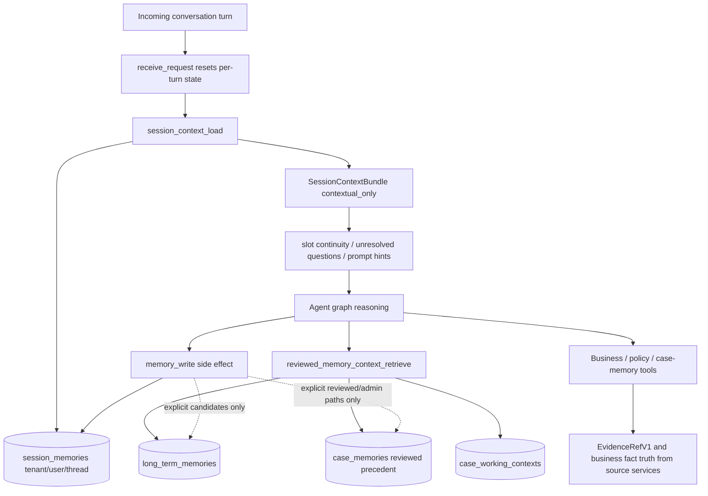

# Phase 46: Session Context Repositioning - Research

**Researched:** 2026-07-03 [VERIFIED: environment_context]
**Domain:** Backend memory contract, session-context authority boundary, and MEM-03 validation [VERIFIED: .planning/ROADMAP.md] [VERIFIED: .planning/REQUIREMENTS.md]
**Confidence:** HIGH for code/docs/test surface mapping; MEDIUM for runtime stored-content risk because this research verified schema and source behavior, not live production row contents. [VERIFIED: src/db/models.py] [VERIFIED: src/memory/service.py] [VERIFIED: src/memory/session_bundle.py]

<user_constraints>
## User Constraints (from CONTEXT.md)

Source for all copied constraints in this section: [VERIFIED: .planning/phases/46-session-context-repositioning/46-CONTEXT.md]

### Locked Decisions

### D-46-01 - Preserve `session_memories` table identity
- Phase 46 starts with no migration. Preserve the existing `session_memories` table and its tenant/user/thread identity.
- Planner may propose a migration only if research proves an existing implementation defect that cannot be fixed with docs/tests or migration-safe code narrowing.

### D-46-02 - Session context contents stay narrow
- Allowed session context contents: slot continuity, last intent, lightweight same-thread summary, unresolved questions, same-thread recent-message / rolling-summary prompt context, prompt-safe tool summaries, and prompt-safe refs/hints.
- Disallowed session context contents: CWC durable working state, closed-case precedent, durable tenant/user/merchant preference memory, policy body text, policy evidence authority, business fact authority, risk decisions, approval decisions, action authorization, action outcome truth, replay truth, and sensitive raw PII.

### D-46-03 - Prompt hints are not authority
- `policy_topic_hints`, `prior_policy_mention_refs`, `last_business_context_refs`, and tool summary refs may remain as contextual hints only.
- These hints must not produce `EvidenceRefV1`, must not satisfy policy/approval evidence requirements, must not replace fresh business tool reads, and must not be cited as current business facts.

### D-46-04 - Session memory is not a CWC fallback
- CWC identity/read/write remains owned by Phase 45 lifecycle logic and canonical `refund_cases.id` resolution.
- Raw `session_memory`, raw `session_context`, reviewed `case_memory`, `case_memories`, and `memory_context` must not backfill or guess a CWC row.
- Existing slot inheritance may continue to feed graph `active_slots` through the current slot/session path, but CWC must still resolve through the trusted canonical case resolver rather than treating session memory as case authority.

### D-46-05 - Session memory is not reviewed precedent
- `search_case_memory` must stay backed by reviewed `case_memories` / `CaseMemoryService`, not by `session_memories`.
- `LegacySessionPrecedentSearchService` may remain as a legacy/debug-only projection only if tests lock that it is not the planner-facing `search_case_memory` implementation.

### D-46-06 - Session memory is not long-term automatic sedimentation
- Phase 46 must not introduce generic automatic long-term extraction from normal runs.
- Durable explicit preference memory remains Phase 48. Any "remember this preference" semantics must stay out of this phase.

### D-46-07 - Keep Phase 45 boundaries intact
- Do not alter CWC terminal writeback eligibility, CWC deterministic projection, thread-case `run_auto` link lifecycle, or CWC read seam behavior except to add boundary tests that protect Phase 46 semantics.
- Do not re-open GAD-01 option B. Observation-to-slot feedback remains future ReAct loop-local behavior, not a graph-global `active_slots` writer.

### D-46-08 - Verification entrypoint
- Every automated test command in Phase 46 plans must use the MOCA-approved test entrypoint: `UV_CACHE_DIR=/tmp/uv-cache uv run pytest ...`.
- Bare `pytest` or bare `python -m pytest` is invalid verification.

### Claude's Discretion

- Exact plan split, as long as it follows the MOCA phase-level granularity rule.
- Whether Phase 46 is docs/static-tests only or includes small code narrowing, based on the audit evidence in the first plan.
- Exact names for any new static alignment tests.
- Whether to move legacy/debug session-precedent tests or keep them with stronger "not planner-facing" assertions.

### Deferred Ideas (OUT OF SCOPE)

- Phase 47: `case_memories` reviewed-precedent repositioning, metadata-first retrieval semantics, and closed-case candidate generation.
- Phase 48: narrow explicit tenant preference memory for "remember this preference" / admin-save / reviewed candidate paths.
- Future graph/agent phase: investigate ReAct implementation with loop-local discovered slot memory.
- Optional future cleanup: remove legacy session-derived precedent code only after Phase 47 provides enough reviewed precedent coverage and product owners accept the deletion.
</user_constraints>

## Summary

Phase 46 should be planned as a boundary-locking phase, not as a schema migration. The current `SessionMemory` model and `007_session_memories` migration key `session_memories` by `tenant_id`, `user_id`, and `thread_id`, and the model does not add a `case_id` column. [VERIFIED: src/db/models.py] [VERIFIED: src/db/migrations/versions/007_session_memories.py] The current service path loads and writes same-thread session continuity through `MemoryService`, while CWC, reviewed case memory, and long-term memory have separate DTOs/services and separate state fields. [VERIFIED: src/memory/service.py] [VERIFIED: src/memory/session_bundle.py] [VERIFIED: src/memory/context_service.py] [VERIFIED: src/agent/state.py]

The main planning risk is semantic drift, not table shape. Session context carries useful prompt hints such as `last_business_context_refs`, `tool_summaries.business_fact_refs`, `tool_summaries.policy_evidence_refs`, `policy_topic_hints`, and `prior_policy_mention_refs`; Phase 46 needs tests and docs that keep those values contextual hints only, not `EvidenceRefV1`, current business facts, policy evidence, approval/action authority, replay truth, reviewed precedent, or CWC fallback. [VERIFIED: src/memory/schemas.py] [VERIFIED: src/memory/session_bundle.py] [VERIFIED: tests/agent/test_memory_evidence_boundary.py]

Primary recommendation: split Phase 46 into three plans: contract/audit/doc reconciliation, static boundary tests, then behavioral validation plus any migration-safe code narrowing found by the audit. [VERIFIED: AGENTS.md] [VERIFIED: .planning/phases/46-session-context-repositioning/46-CONTEXT.md]

## Architectural Responsibility Map

| Capability | Primary Tier | Secondary Tier | Rationale |
|------------|--------------|----------------|-----------|
| Thread-scoped session context | API / Backend | Database / Storage | Backend services read/write `session_memories`; PostgreSQL stores the tenant/user/thread-scoped record. [VERIFIED: src/memory/service.py] [VERIFIED: src/memory/repository.py] [VERIFIED: src/db/models.py] |
| Prompt-safe session projection | API / Backend | Agent graph state | `SessionMemoryBundleService` and `session_context_load` project `session_context_bundle` and compatibility `session_memory` fields into `AgentState`. [VERIFIED: src/memory/session_bundle.py] [VERIFIED: src/agent/nodes/session_context_load.py] [VERIFIED: src/agent/state.py] |
| CWC identity/read/write | API / Backend | Database / Storage | CWC is loaded through reviewed memory context retrieval and Phase 45 lifecycle code, while `CaseWorkingContext` is a separate table from `session_memories`. [VERIFIED: src/agent/nodes/reviewed_memory_context_retrieve.py] [VERIFIED: src/db/models.py] [VERIFIED: .planning/phases/45-memory-lifecycle-wiring-for-case-working-context/45-CONTEXT.md] |
| Reviewed case precedent | API / Backend | Database / Storage | Production `search_case_memory` uses `MemoryToolExecutor -> CaseMemoryService`, not `LegacySessionPrecedentSearchService`. [VERIFIED: src/tools/executors/memory.py] [VERIFIED: src/memory/case_memory.py] [VERIFIED: src/memory/search.py] |
| Long-term preference memory | API / Backend | Database / Storage | Long-term memory has a distinct repository/service path and explicit candidate routing; generic session writes default to session only. [VERIFIED: src/memory/long_term.py] [VERIFIED: src/memory/write_service.py] [VERIFIED: src/memory/policy.py] |
| Replay, approval, and action truth | API / Backend | Audit/replay storage | Existing memory-boundary tests assert session/reviewed memory cannot satisfy evidence, approval, action, or replay-truth authority. [VERIFIED: tests/agent/test_memory_evidence_boundary.py] |
| Contract and static boundary enforcement | Test / Validation | Docs | Phase 45 already uses static alignment tests for memory/CWC boundaries; Phase 46 should add the analogous session-context alignment file. [VERIFIED: tests/memory/test_phase45_contract_alignment.py] [VERIFIED: .planning/phases/46-session-context-repositioning/46-CONTEXT.md] |

<phase_requirements>
## Phase Requirements

| ID | Description | Research Support |
|----|-------------|------------------|
| MEM-03 | Session context must be repositioned after CWC so `session_memories` remains thread-scoped short-lived conversational context only, with tests preventing cross-case durable state, reviewed precedent, long-term preference memory, policy evidence, business fact authority, approval/action authority, replay truth, or destructive table identity changes. [VERIFIED: .planning/REQUIREMENTS.md] | Current code already separates session, CWC, reviewed case, and long-term surfaces; Phase 46 should lock that separation through docs and static/behavioral tests. [VERIFIED: src/db/models.py] [VERIFIED: src/memory/service.py] [VERIFIED: src/memory/session_bundle.py] [VERIFIED: src/tools/executors/memory.py] [VERIFIED: tests/agent/test_memory_evidence_boundary.py] |
</phase_requirements>

## Project Constraints (from CLAUDE.md and AGENTS.md)

| Directive | Planning Impact |
|-----------|-----------------|
| Local debugging or verification failures must be appended to `.planning/LOCAL-VALIDATION-ISSUES.md` after handling. [VERIFIED: CLAUDE.md] [VERIFIED: AGENTS.md] | If Phase 46 validation finds a failing test, environment mismatch, or unexpected runtime behavior, the implementation plan must include issue-log maintenance. [VERIFIED: CLAUDE.md] [VERIFIED: AGENTS.md] |
| Changes to tool calling, RAG, memory, or intent-recognition subsystems that uncover or fix subsystem-level debt must update `.planning/ARCHITECTURE-DEBT.md`. [VERIFIED: CLAUDE.md] [VERIFIED: AGENTS.md] | If Phase 46 performs code narrowing in memory/tool surfaces, the plan must include an architecture-debt update or an explicit “no subsystem debt found” verification note. [VERIFIED: CLAUDE.md] [VERIFIED: AGENTS.md] |
| MOCA test commands must use `UV_CACHE_DIR=/tmp/uv-cache uv run pytest ...`; bare `pytest` and bare `python -m pytest` are invalid verification. [VERIFIED: AGENTS.md] | Every Phase 46 plan, review, and acceptance criterion must spell the approved test entrypoint. [VERIFIED: AGENTS.md] |
| Phase-level planning must split multiple ownership domains, waves, or verification gates into multiple numbered plans. [VERIFIED: AGENTS.md] | Phase 46 should not be one large plan because it spans contract docs, static tests, possible code narrowing, and final validation. [VERIFIED: AGENTS.md] |
| `docs/contract-spec.md` is the normative contract source, but it describes target contract semantics rather than automatically proving current implementation facts. [VERIFIED: CLAUDE.md] [VERIFIED: AGENTS.md] | Phase 46 must reconcile spec text with audited code and leave traceable notes for implementation compromises. [VERIFIED: CLAUDE.md] [VERIFIED: AGENTS.md] |

## Standard Stack

No new runtime library is recommended for Phase 46; use the existing Python, SQLAlchemy, Pydantic, pytest, and Ruff stack already configured in the repo. [VERIFIED: pyproject.toml] [VERIFIED: uv/importlib.metadata version audit]

### Core

| Library | Version | Purpose | Why Standard |
|---------|---------|---------|--------------|
| Python | 3.12.13 | Runtime for backend services and tests. | `pyproject.toml` requires Python `>=3.12`, and the local approved runner resolves Python 3.12.13. [VERIFIED: pyproject.toml] [VERIFIED: `UV_CACHE_DIR=/tmp/uv-cache uv run python --version`] |
| Pydantic | 2.13.4 | Memory DTO validation and authority-class shape validation. | Memory schemas are Pydantic models in `src/memory/schemas.py` and `src/memory/context_refs.py`. [VERIFIED: uv/importlib.metadata version audit] [VERIFIED: src/memory/schemas.py] [VERIFIED: src/memory/context_refs.py] |
| SQLAlchemy | 2.0.49 | ORM models and async database access. | Memory tables are SQLAlchemy ORM models in `src/db/models.py`. [VERIFIED: uv/importlib.metadata version audit] [VERIFIED: src/db/models.py] |
| asyncpg | 0.31.0 | Async PostgreSQL driver. | Test configuration and app database URLs use `postgresql+asyncpg`. [VERIFIED: uv/importlib.metadata version audit] [VERIFIED: tests/conftest.py] |
| Alembic | 1.18.4 | Database migrations. | Existing `session_memories` schema is owned by Alembic revision `007_session_memories`; Phase 46 should not add a migration unless audit proves a defect. [VERIFIED: uv/importlib.metadata version audit] [VERIFIED: src/db/migrations/versions/007_session_memories.py] [VERIFIED: .planning/phases/46-session-context-repositioning/46-CONTEXT.md] |
| pytest | 9.0.3 | Automated tests. | Existing memory/agent/static boundary tests are pytest tests, and local verification succeeded through `uv run pytest`. [VERIFIED: uv/importlib.metadata version audit] [VERIFIED: tests/memory/test_phase45_contract_alignment.py] [VERIFIED: validation command results] |
| pytest-asyncio | 1.3.0 | Async test support. | `pyproject.toml` configures `asyncio_mode = "auto"`, and memory/service tests use async fixtures. [VERIFIED: uv/importlib.metadata version audit] [VERIFIED: pyproject.toml] [VERIFIED: tests/memory/test_session_memory_repository.py] |
| Ruff | 0.15.12 | Linting and static Python checks. | `pyproject.toml` configures Ruff target `py312` and line length `120`. [VERIFIED: uv/importlib.metadata version audit] [VERIFIED: pyproject.toml] |

### Supporting

| Library / Tool | Version | Purpose | When to Use |
|----------------|---------|---------|-------------|
| LangGraph | 1.1.10 | Agent graph runtime. | Use only if Phase 46 needs to inspect node aliasing or graph state wiring; no graph architecture refactor is in scope. [VERIFIED: uv/importlib.metadata version audit] [VERIFIED: src/agent/graph_vocabulary.py] [VERIFIED: .planning/phases/46-session-context-repositioning/46-CONTEXT.md] |
| Docker | 29.4.2 client | Local Postgres/Redis service startup. | Use when DB-backed memory tests need local services from `docker-compose.yml`. [VERIFIED: `docker info`] [VERIFIED: docker-compose.yml] [VERIFIED: tests/conftest.py] |
| PostgreSQL with pgvector image | `pgvector/pgvector:pg16` | Local database for async DB-backed tests. | Use for repository/service tests that touch real Postgres state. [VERIFIED: docker-compose.yml] [VERIFIED: tests/conftest.py] |

### Alternatives Considered

| Instead of | Could Use | Tradeoff |
|------------|-----------|----------|
| Existing static pytest alignment tests | A new custom static-analysis CLI | A custom CLI would add tooling without improving Phase 46 scope; existing Phase 45 tests already demonstrate the local pattern. [VERIFIED: tests/memory/test_phase45_contract_alignment.py] |
| Existing SQLAlchemy/Alembic schema | New migration or table rename | Phase 46 decisions explicitly preserve `session_memories`, `case_memories`, `long_term_memories`, `case_working_contexts`, and `conversation_threads.case_id` unless a later plan proves migration need. [VERIFIED: .planning/phases/46-session-context-repositioning/46-CONTEXT.md] |
| Existing `CaseMemoryService` for `search_case_memory` | Legacy session-derived precedent search | Production executor already uses reviewed case memory; legacy session search is explicitly not the target reviewed case-memory store. [VERIFIED: src/tools/executors/memory.py] [VERIFIED: src/memory/search.py] |

**Installation:** No package installation is required for Phase 46. [VERIFIED: pyproject.toml] [VERIFIED: .planning/phases/46-session-context-repositioning/46-CONTEXT.md]

**Version verification:** Python package versions were verified from the local approved environment with `UV_CACHE_DIR=/tmp/uv-cache uv run python -c 'import importlib.metadata ...'`; this phase is not an npm phase. [VERIFIED: uv/importlib.metadata version audit]

## Architecture Patterns

### System Architecture Diagram



Diagram claim: session context feeds prompt continuity, while evidence/current business facts/approval/action/replay authority must come from source services or authority-specific stores, not from `session_memories`. [VERIFIED: src/agent/nodes/session_context_load.py] [VERIFIED: src/agent/nodes/reviewed_memory_context_retrieve.py] [VERIFIED: src/memory/write_service.py] [VERIFIED: tests/agent/test_memory_evidence_boundary.py]

### Recommended Project Structure

```text
docs/
├── contract-spec.md                  # Normative MEM-03 boundary text
├── memory-contract-delta.md           # Existing memory-layering delta, update only if needed
├── current-implementation-map.md      # Non-normative stale search_case_memory wording
└── architecture-overview.md           # Non-normative stale search_case_memory wording
tests/
├── memory/
│   ├── test_phase46_session_context_alignment.py  # New static/contract tests
│   ├── test_session_memory_bundle.py              # Existing prompt-safe bundle tests
│   ├── test_memory_context_bundle.py              # Existing session/reviewed/CWC separation tests
│   └── test_session_precedent_search.py           # Legacy/debug-only behavior to quarantine
├── agent/
│   ├── test_session_memory_load.py
│   ├── test_session_memory_integration.py
│   ├── test_reviewed_memory_context_retrieve.py
│   └── test_memory_evidence_boundary.py
└── tools/
    └── test_catalog.py
```

Structure claim: these are the existing files and the recommended new Phase 46 test file. [VERIFIED: repository file audit] [VERIFIED: tests/memory/test_phase45_contract_alignment.py]

### Recommended Plan Split

| Plan | Goal | Primary Files | Verification |
|------|------|---------------|--------------|
| `46-01` | Audit and reconcile contract/docs so `session_memories` is explicitly same-thread temporary context after CWC. [VERIFIED: .planning/phases/46-session-context-repositioning/46-CONTEXT.md] | `docs/contract-spec.md`, `docs/current-implementation-map.md`, `docs/architecture-overview.md`, optional `.planning/MEMORY-REDESIGN-DECISIONS.md`. [VERIFIED: docs/contract-spec.md] [VERIFIED: docs/current-implementation-map.md] [VERIFIED: docs/architecture-overview.md] | Static grep plus existing Phase 45 alignment tests. [VERIFIED: tests/memory/test_phase45_contract_alignment.py] |
| `46-02` | Add static/contract tests that lock no destructive schema change, no session-as-authority, no session-as-reviewed-precedent, no CWC fallback, and named DEFER-2/DEFER-3 carry-forward. [VERIFIED: .planning/REQUIREMENTS.md] | New `tests/memory/test_phase46_session_context_alignment.py`, targeted assertions in `tests/tools/test_catalog.py` or `tests/memory/test_session_precedent_search.py` if needed. [VERIFIED: tests/tools/test_catalog.py] [VERIFIED: tests/memory/test_session_precedent_search.py] | `UV_CACHE_DIR=/tmp/uv-cache uv run pytest tests/memory/test_phase46_session_context_alignment.py -x -q`. [VERIFIED: AGENTS.md] |
| `46-03` | Add only migration-safe code narrowing if tests expose a real violation, then run behavioral validation. [VERIFIED: .planning/phases/46-session-context-repositioning/46-CONTEXT.md] | Likely no code changes; possible surfaces are `src/memory/session_bundle.py`, `src/agent/nodes/session_context_load.py`, `src/tools/executors/memory.py`, or `src/memory/search.py` if tests prove drift. [VERIFIED: src/memory/session_bundle.py] [VERIFIED: src/agent/nodes/session_context_load.py] [VERIFIED: src/tools/executors/memory.py] [VERIFIED: src/memory/search.py] | Full Phase 46 command listed in Validation Architecture. [VERIFIED: test infrastructure audit] |

### Pattern 1: Preserve Storage, Reposition Contract

**What:** Keep `session_memories` storage identity and scope unchanged, then express the after-CWC boundary in docs/tests. [VERIFIED: src/db/models.py] [VERIFIED: src/db/migrations/versions/007_session_memories.py] [VERIFIED: .planning/phases/46-session-context-repositioning/46-CONTEXT.md]

**When to use:** Use this for Phase 46 unless the audit proves a concrete table-shape defect that cannot be fixed with docs/tests or compatibility-safe code narrowing. [VERIFIED: .planning/phases/46-session-context-repositioning/46-CONTEXT.md]

**Example:**
```python
# Source: tests/memory/test_phase45_contract_alignment.py
# Phase 46 should copy this static-test style, not create a new framework.
source = Path("src/db/models.py").read_text()
assert '__tablename__ = "session_memories"' in source
assert "case_id" not in source[source.index("class SessionMemory"):source.index("class LongTermMemory")]
```

### Pattern 2: Hints Stay Contextual

**What:** Permit prompt-safe refs/hints in session context, but assert they never become `EvidenceRefV1`, approval/action evidence, current business facts, or replay truth. [VERIFIED: src/memory/session_bundle.py] [VERIFIED: src/memory/schemas.py] [VERIFIED: tests/agent/test_memory_evidence_boundary.py]

**When to use:** Use this around `policy_topic_hints`, `prior_policy_mention_refs`, `last_business_context_refs`, and tool-summary refs. [VERIFIED: .planning/phases/46-session-context-repositioning/46-CONTEXT.md] [VERIFIED: src/memory/session_bundle.py]

**Example:**
```python
# Source: tests/agent/test_memory_evidence_boundary.py
memory_sources = [
    Path("src/memory/session_bundle.py").read_text(),
    Path("src/memory/schemas.py").read_text(),
]
assert all("EvidenceRefV1(" not in source for source in memory_sources)
```

### Pattern 3: Production Case-Memory Search Is Reviewed Case Memory

**What:** Keep `search_case_memory` wired to `CaseMemoryService`; treat `LegacySessionPrecedentSearchService` as legacy/debug-only. [VERIFIED: src/tools/executors/memory.py] [VERIFIED: src/memory/search.py]

**When to use:** Use this when writing tests that distinguish reviewed precedent from same-thread session context. [VERIFIED: tests/tools/test_catalog.py] [VERIFIED: tests/memory/test_session_precedent_search.py]

**Example:**
```python
# Source: src/tools/executors/memory.py and tests/tools/test_catalog.py
source = Path("src/tools/executors/memory.py").read_text()
assert "CaseMemoryService" in source
assert "LegacySessionPrecedentSearchService" not in source
```

### Anti-Patterns to Avoid

- **Schema migration without proved defect:** Phase 46 starts with no migration and preserves table identity. [VERIFIED: .planning/phases/46-session-context-repositioning/46-CONTEXT.md]
- **Treating prompt hints as evidence:** Session context hints can guide retrieval, but they must not produce `EvidenceRefV1` or satisfy evidence/approval gates. [VERIFIED: .planning/phases/46-session-context-repositioning/46-CONTEXT.md] [VERIFIED: tests/agent/test_memory_evidence_boundary.py]
- **Using session memory as CWC fallback:** CWC must resolve through Phase 45 lifecycle and canonical case identity, not from raw session/context memory. [VERIFIED: .planning/phases/46-session-context-repositioning/46-CONTEXT.md] [VERIFIED: tests/memory/test_phase45_contract_alignment.py]
- **One large PLAN.md:** The project requires splitting phase-level plans that cross ownership domains or verification gates. [VERIFIED: AGENTS.md]

## Don't Hand-Roll

| Problem | Don't Build | Use Instead | Why |
|---------|-------------|-------------|-----|
| Boundary enforcement | A bespoke static-analysis tool | Pytest static tests using `Path.read_text()` and focused assertions. [VERIFIED: tests/memory/test_phase45_contract_alignment.py] | Existing tests already enforce memory/CWC redlines with simple repository-source checks. [VERIFIED: tests/memory/test_phase45_contract_alignment.py] |
| Reviewed precedent retrieval | Session-derived precedent over `session_memories` | `CaseMemoryService` through `MemoryToolExecutor`. [VERIFIED: src/tools/executors/memory.py] | Current production executor already uses reviewed case memory; legacy session search is not planner-facing. [VERIFIED: src/tools/executors/memory.py] [VERIFIED: src/memory/search.py] |
| Policy or approval evidence | Session refs/hints as `EvidenceRefV1` | Knowledge/tool evidence refs and current source-service reads. [VERIFIED: tests/agent/test_memory_evidence_boundary.py] [VERIFIED: src/tools/executors/knowledge.py] | Existing tests assert memory surfaces cannot satisfy policy evidence or action authority. [VERIFIED: tests/agent/test_memory_evidence_boundary.py] |
| Long-term preference extraction | Generic automatic extraction from session runs | Phase 48 explicit preference path. [VERIFIED: .planning/phases/46-session-context-repositioning/46-CONTEXT.md] [VERIFIED: .planning/MEMORY-REDESIGN-DECISIONS.md] | Phase 46 explicitly defers durable preference memory to Phase 48. [VERIFIED: .planning/phases/46-session-context-repositioning/46-CONTEXT.md] |
| CWC repair/backfill | Guessing CWC rows from `session_memory`, `case_memory`, or ambiguous slots | Phase 45 canonical resolver and lifecycle path. [VERIFIED: .planning/phases/45-memory-lifecycle-wiring-for-case-working-context/45-CONTEXT.md] [VERIFIED: tests/memory/test_phase45_contract_alignment.py] | Phase 45 locks CWC identity/read/write and rejects raw memory fallback. [VERIFIED: tests/memory/test_phase45_contract_alignment.py] |
| Authoritative storage rewrite | Redis/cache as source of truth | Existing PostgreSQL models and CAS repository path. [VERIFIED: src/memory/repository.py] [VERIFIED: src/db/models.py] | `session_memories` currently has active-scope uniqueness and CAS semantics. [VERIFIED: src/memory/repository.py] [VERIFIED: tests/memory/test_session_memory_repository.py] |

**Key insight:** Phase 46 should remove ambiguity from contracts/tests; it should not invent a new memory subsystem. [VERIFIED: .planning/phases/46-session-context-repositioning/46-CONTEXT.md] [VERIFIED: code audit]

## Runtime State Inventory

| Category | Items Found | Action Required |
|----------|-------------|-----------------|
| Stored data | `session_memories`, `case_memories`, `long_term_memories`, `case_working_contexts`, and `conversation_threads.case_id` exist in ORM/migrations, and Phase 46 decisions prohibit destructive rename/drop/retype unless later planning proves migration need. [VERIFIED: src/db/models.py] [VERIFIED: src/db/migrations/versions/007_session_memories.py] [VERIFIED: .planning/phases/46-session-context-repositioning/46-CONTEXT.md] | No data migration in the default plan; add compatibility notes if audit finds stored disallowed content patterns that require non-destructive narrowing. [VERIFIED: .planning/phases/46-session-context-repositioning/46-CONTEXT.md] |
| Live service config | No Phase 46 requirement or context decision references live external service configuration as an implementation dependency. [VERIFIED: .planning/REQUIREMENTS.md] [VERIFIED: .planning/phases/46-session-context-repositioning/46-CONTEXT.md] | No live-service configuration task in Phase 46 unless implementation scope changes. [VERIFIED: .planning/phases/46-session-context-repositioning/46-CONTEXT.md] |
| OS-registered state | A targeted scan of `.env`, `.env.example`, `docker-compose.yml`, and study launchd plists found no matches for `session_memories`, `case_memories`, `long_term_memories`, `case_working_contexts`, or `search_case_memory`. [VERIFIED: targeted rg runtime-state scan] | No OS registration task for Phase 46. [VERIFIED: targeted rg runtime-state scan] |
| Secrets/env vars | A targeted scan of `.env`, `.env.example`, and `docker-compose.yml` found no memory-table or session-memory env-var names. [VERIFIED: targeted rg runtime-state scan] | No secret/env-var rename task. [VERIFIED: targeted rg runtime-state scan] |
| Build artifacts | Phase 46 does not rename installed packages or generated module paths; dirty working tree files before this research were unrelated planning/docs files. [VERIFIED: git status audit] [VERIFIED: .planning/phases/46-session-context-repositioning/46-CONTEXT.md] | No build artifact migration task. [VERIFIED: git status audit] |

## Common Pitfalls

### Pitfall 1: Treating Legacy Session Precedent as Production Case Memory

**What goes wrong:** `LegacySessionPrecedentSearchService` can search active session rows across a tenant/user, while production `search_case_memory` is supposed to use reviewed `case_memories`. [VERIFIED: src/memory/search.py] [VERIFIED: src/tools/executors/memory.py]

**Why it happens:** Older non-normative docs still say `search_case_memory` is session-derived even though current production code uses `CaseMemoryService`. [VERIFIED: docs/current-implementation-map.md] [VERIFIED: docs/architecture-overview.md] [VERIFIED: src/tools/executors/memory.py]

**How to avoid:** Add/keep static tests that assert `MemoryToolExecutor` does not import or instantiate `LegacySessionPrecedentSearchService`, and update stale docs or label them as historical. [VERIFIED: src/tools/executors/memory.py] [VERIFIED: docs/current-implementation-map.md] [VERIFIED: docs/architecture-overview.md]

**Warning signs:** A plan modifies `search_case_memory` to call `SessionMemoryRepository.search_active` or cites older docs as current implementation truth. [VERIFIED: src/memory/repository.py] [VERIFIED: docs/current-implementation-map.md]

### Pitfall 2: Letting Hints Become Authority

**What goes wrong:** Prompt hints such as policy topic refs or business context refs are misused as policy evidence, current business facts, or approval/action authority. [VERIFIED: .planning/phases/46-session-context-repositioning/46-CONTEXT.md] [VERIFIED: src/memory/session_bundle.py]

**Why it happens:** `SessionToolSummaryView` includes `business_fact_refs` and `policy_evidence_refs`, and `SessionContextMemory` includes policy hint fields for prompt continuity. [VERIFIED: src/memory/schemas.py]

**How to avoid:** Static tests should assert memory/session modules do not produce `EvidenceRefV1`, approval DTOs, action DTOs, or replay truth from session context. [VERIFIED: tests/agent/test_memory_evidence_boundary.py]

**Warning signs:** New code reads `session_context` and then populates `retrieved_evidence`, `policy_evidence`, `approval_decision`, `proposed_action`, or replay validation fields. [VERIFIED: tests/agent/test_memory_evidence_boundary.py] [VERIFIED: src/agent/state.py]

### Pitfall 3: Reopening CWC Fallback

**What goes wrong:** CWC is backfilled from raw session memory, reviewed memory, or ambiguous slot strings. [VERIFIED: .planning/phases/46-session-context-repositioning/46-CONTEXT.md]

**Why it happens:** Session memory can carry slot continuity, including case-like identifiers, but CWC identity must be canonical. [VERIFIED: src/memory/service.py] [VERIFIED: .planning/phases/45-memory-lifecycle-wiring-for-case-working-context/45-CONTEXT.md]

**How to avoid:** Keep Phase 45 alignment tests and add Phase 46 static tests that reject CWC writes/read fallback from raw `session_memory`, `session_context`, `case_memory`, or `memory_context`. [VERIFIED: tests/memory/test_phase45_contract_alignment.py]

**Warning signs:** A plan edits CWC lifecycle code while claiming to only reposition session memory. [VERIFIED: .planning/phases/46-session-context-repositioning/46-CONTEXT.md]

### Pitfall 4: Accidental Long-Term Sedimentation

**What goes wrong:** Normal runs begin generating durable `long_term_memories` or durable preference records from generic session summaries. [VERIFIED: .planning/phases/46-session-context-repositioning/46-CONTEXT.md]

**Why it happens:** `MemoryWriteService.propose_candidates` accepts explicit non-session candidates, even though its default candidate is session-only. [VERIFIED: src/memory/write_service.py]

**How to avoid:** Tests should prove default memory-write behavior remains session-only and that durable preference semantics remain deferred to Phase 48. [VERIFIED: src/memory/write_service.py] [VERIFIED: .planning/MEMORY-REDESIGN-DECISIONS.md]

**Warning signs:** Phase 46 plan adds generic preference extraction, admin-save semantics, or broad long-term candidate generation. [VERIFIED: .planning/phases/46-session-context-repositioning/46-CONTEXT.md]

### Pitfall 5: Invalid Verification Commands

**What goes wrong:** A plan reports bare `pytest` or bare `python -m pytest` results. [VERIFIED: AGENTS.md]

**Why it happens:** Project PATH can resolve an old non-project Python and create false collection failures. [VERIFIED: AGENTS.md]

**How to avoid:** Every command must use `UV_CACHE_DIR=/tmp/uv-cache uv run pytest ...`. [VERIFIED: AGENTS.md]

**Warning signs:** PLAN, REVIEW, or SUMMARY files contain `pytest` without `UV_CACHE_DIR=/tmp/uv-cache uv run`. [VERIFIED: AGENTS.md]

## Code Examples

### Static Schema Boundary Test

```python
from pathlib import Path


def test_session_memories_remains_thread_scoped_without_case_id() -> None:
    source = Path("src/db/models.py").read_text()
    session_block = source[source.index("class SessionMemory") : source.index("class LongTermMemory")]
    assert '__tablename__ = "session_memories"' in session_block
    assert "thread_id" in session_block
    assert "case_id" not in session_block
```

Source pattern and target schema claim: [VERIFIED: tests/memory/test_phase45_contract_alignment.py] [VERIFIED: src/db/models.py]

### Static Production Executor Boundary Test

```python
from pathlib import Path


def test_search_case_memory_does_not_use_legacy_session_precedent() -> None:
    source = Path("src/tools/executors/memory.py").read_text()
    assert "CaseMemoryService" in source
    assert "LegacySessionPrecedentSearchService" not in source
    assert "SessionMemoryRepository" not in source
```

Source pattern and production executor claim: [VERIFIED: src/tools/executors/memory.py] [VERIFIED: src/memory/search.py] [VERIFIED: tests/tools/test_catalog.py]

### Static Hints-Are-Not-Evidence Test

```python
from pathlib import Path


def test_session_context_modules_do_not_construct_authority_refs() -> None:
    checked = [
        Path("src/memory/session_bundle.py"),
        Path("src/memory/schemas.py"),
        Path("src/agent/nodes/session_context_load.py"),
    ]
    combined = "\n".join(path.read_text() for path in checked)
    forbidden = ["EvidenceRefV1(", "ApprovalDecision", "ActionDraft", "ReplayTruth"]
    assert not any(token in combined for token in forbidden)
```

Source pattern and authority-boundary claim: [VERIFIED: tests/agent/test_memory_evidence_boundary.py] [VERIFIED: src/memory/session_bundle.py] [VERIFIED: src/memory/schemas.py]

## State of the Art

| Old Approach | Current Approach | When Changed | Impact |
|--------------|------------------|--------------|--------|
| `search_case_memory` described in older docs as session-derived precedent. [VERIFIED: docs/current-implementation-map.md] [VERIFIED: docs/architecture-overview.md] | Current executor uses `CaseMemoryService` and reviewed case memory output. [VERIFIED: src/tools/executors/memory.py] [VERIFIED: src/memory/case_memory.py] | Already changed before Phase 46; exact implementation phase was not re-derived in this research. [VERIFIED: source audit] | Phase 46 should update stale docs/tests so older wording cannot drive planning. [VERIFIED: docs/current-implementation-map.md] [VERIFIED: src/tools/executors/memory.py] |
| Session memory before CWC carried conversational continuity without an explicit after-CWC boundary. [VERIFIED: docs/contract-spec.md] [VERIFIED: .planning/MEMORY-REDESIGN-DECISIONS.md] | After Phase 45, CWC is separate durable working context and Phase 46 locks session memory to short-lived thread context. [VERIFIED: .planning/phases/45-memory-lifecycle-wiring-for-case-working-context/45-CONTEXT.md] [VERIFIED: .planning/phases/46-session-context-repositioning/46-CONTEXT.md] | Phase 45 completed before Phase 46 planning. [VERIFIED: .planning/STATE.md] | Contract/spec language must distinguish session context, CWC, reviewed case memory, and long-term memory. [VERIFIED: docs/contract-spec.md] [VERIFIED: .planning/REQUIREMENTS.md] |
| Generic long-term preference sedimentation could be tempting from session summaries. [VERIFIED: .planning/MEMORY-REDESIGN-DECISIONS.md] | Explicit preference memory remains Phase 48, and default write candidates are session-only. [VERIFIED: .planning/phases/46-session-context-repositioning/46-CONTEXT.md] [VERIFIED: src/memory/write_service.py] | Deferred by memory-redesign decision DEFER-3. [VERIFIED: .planning/MEMORY-REDESIGN-DECISIONS.md] | Phase 46 tests should prevent generic long-term extraction. [VERIFIED: .planning/REQUIREMENTS.md] |

**Deprecated/outdated:** Non-normative docs that say production `search_case_memory` is session-derived are stale relative to current executor code. [VERIFIED: docs/current-implementation-map.md] [VERIFIED: docs/architecture-overview.md] [VERIFIED: src/tools/executors/memory.py]

## Assumptions Log

| # | Claim | Section | Risk if Wrong |
|---|-------|---------|---------------|
| — | No `[ASSUMED]` claims were used. | — | — |

## Open Questions (RESOLVED)

1. **Should stale non-normative docs be fully corrected in Phase 46 or merely annotated as historical?** [VERIFIED: docs/current-implementation-map.md] [VERIFIED: docs/architecture-overview.md]
   - What we know: Both stale docs still describe `search_case_memory` as session-derived, while current code uses `CaseMemoryService`. [VERIFIED: docs/current-implementation-map.md] [VERIFIED: docs/architecture-overview.md] [VERIFIED: src/tools/executors/memory.py]
   - What's unclear: Whether those docs are actively maintained planning inputs or historical references. [VERIFIED: docs/current-implementation-map.md] [VERIFIED: docs/architecture-overview.md]
   - Recommendation: Update or annotate them in `46-01` because leaving contradictory docs increases planner risk. [VERIFIED: AGENTS.md]
   - RESOLVED: Accepted outcome is that stale non-normative docs will be updated or annotated in `46-01`; leaving contradictory production wording is not accepted.
2. **Should Phase 46 inspect live `session_memories` rows for disallowed historical content?** [VERIFIED: .planning/phases/46-session-context-repositioning/46-CONTEXT.md]
   - What we know: The schema and write path do not require migration by default. [VERIFIED: src/db/models.py] [VERIFIED: src/memory/write_service.py]
   - What's unclear: This research did not sample a running production/staging database. [VERIFIED: environment audit]
   - Recommendation: Do not block planning on row sampling; add a compatibility note that migration requires separate proof and review. [VERIFIED: .planning/phases/46-session-context-repositioning/46-CONTEXT.md]
   - RESOLVED: Accepted outcome is that Phase 46 planning does not block on live `session_memories` row sampling; any migration or cleanup from live row content requires separate proof/review outside this phase unless execution uncovers a concrete local violation.

## Environment Availability

| Dependency | Required By | Available | Version | Fallback |
|------------|-------------|-----------|---------|----------|
| `uv` | Approved Python/test entrypoint | yes | 0.11.2 | None; project rules require `uv run` or verified `.venv`. [VERIFIED: `uv --version`] [VERIFIED: AGENTS.md] |
| Python | Backend tests | yes | 3.12.13 | None needed. [VERIFIED: `UV_CACHE_DIR=/tmp/uv-cache uv run python --version`] |
| pytest | Validation | yes | 9.0.3 | None; use approved `uv run pytest` entrypoint. [VERIFIED: uv/importlib.metadata version audit] [VERIFIED: AGENTS.md] |
| Ruff | Lint/static hygiene | yes | 0.15.12 | Use `UV_CACHE_DIR=/tmp/uv-cache uv run ruff ...`. [VERIFIED: uv/importlib.metadata version audit] [VERIFIED: AGENTS.md] |
| Alembic | Migration inspection only | yes | 1.18.4 | No migration planned by default. [VERIFIED: uv/importlib.metadata version audit] [VERIFIED: .planning/phases/46-session-context-repositioning/46-CONTEXT.md] |
| Docker | Optional local DB services | yes | 29.4.2 client | If Docker is unavailable in a future environment, limit to static tests or start a project-owned Postgres another way. [VERIFIED: `docker info`] [VERIFIED: docker-compose.yml] |
| `pg_isready` | Optional DB readiness probe | no | — | Use Docker health/status or run DB-backed tests after starting `docker compose up -d postgres`. [VERIFIED: environment command audit] [VERIFIED: docker-compose.yml] |
| `redis-cli` | Optional Redis probe | no | — | Redis is not a Phase 46 authority dependency; skip Redis-specific probes unless a plan expands scope. [VERIFIED: environment command audit] [VERIFIED: .planning/phases/46-session-context-repositioning/46-CONTEXT.md] |

**Missing dependencies with no fallback:** None for docs/static tests. [VERIFIED: environment audit] [VERIFIED: tests/memory/test_phase45_contract_alignment.py]

**Missing dependencies with fallback:** `pg_isready` and `redis-cli` are not in PATH; Docker and pytest are available for the relevant Phase 46 validation paths. [VERIFIED: environment command audit] [VERIFIED: docker-compose.yml]

## Validation Architecture

### Test Framework

| Property | Value |
|----------|-------|
| Framework | pytest 9.0.3 with pytest-asyncio 1.3.0. [VERIFIED: uv/importlib.metadata version audit] |
| Config file | `pyproject.toml` with `asyncio_mode = "auto"`. [VERIFIED: pyproject.toml] |
| Quick run command | `UV_CACHE_DIR=/tmp/uv-cache uv run pytest tests/memory/test_phase46_session_context_alignment.py -x -q`. [VERIFIED: AGENTS.md] |
| Existing smoke command verified during research | `UV_CACHE_DIR=/tmp/uv-cache uv run pytest tests/memory/test_phase45_contract_alignment.py -x -q` passed with 11 tests. [VERIFIED: validation command results] |
| Full phase command | `UV_CACHE_DIR=/tmp/uv-cache uv run pytest tests/memory/test_phase46_session_context_alignment.py tests/memory/test_session_memory_schema.py tests/memory/test_session_memory_service.py tests/memory/test_session_memory_repository.py tests/memory/test_session_memory_bundle.py tests/memory/test_memory_context_bundle.py tests/agent/test_session_memory_load.py tests/agent/test_session_memory_integration.py tests/agent/test_reviewed_memory_context_retrieve.py tests/agent/test_memory_evidence_boundary.py tests/tools/test_catalog.py tests/memory/test_phase45_contract_alignment.py -q`. [VERIFIED: test infrastructure audit] [VERIFIED: AGENTS.md] |

### Phase Requirements -> Test Map

| Req ID | Behavior | Test Type | Automated Command | File Exists? |
|--------|----------|-----------|-------------------|--------------|
| MEM-03 | `session_memories` remains tenant/user/thread-scoped and has no `case_id` or destructive rename/drop. [VERIFIED: .planning/REQUIREMENTS.md] | static contract | `UV_CACHE_DIR=/tmp/uv-cache uv run pytest tests/memory/test_phase46_session_context_alignment.py::test_session_memories_remains_thread_scoped_without_case_id -q` | no; Wave 0 creates it. [VERIFIED: repository file audit] |
| MEM-03 | Session context hints do not produce evidence/current-fact/approval/action/replay authority. [VERIFIED: .planning/REQUIREMENTS.md] | static + behavioral | `UV_CACHE_DIR=/tmp/uv-cache uv run pytest tests/agent/test_memory_evidence_boundary.py tests/memory/test_phase46_session_context_alignment.py -q` | partial; existing authority tests exist, new static alignment file needed. [VERIFIED: tests/agent/test_memory_evidence_boundary.py] |
| MEM-03 | `search_case_memory` stays reviewed case memory, not session-derived precedent. [VERIFIED: .planning/REQUIREMENTS.md] | static + unit | `UV_CACHE_DIR=/tmp/uv-cache uv run pytest tests/tools/test_catalog.py::test_search_case_memory_descriptor_names_reviewed_case_memory_store tests/memory/test_phase46_session_context_alignment.py::test_search_case_memory_uses_reviewed_case_memory_service -q` | partial; catalog test exists, new executor-wiring assertion needed. [VERIFIED: tests/tools/test_catalog.py] |
| MEM-03 | Session memory is not CWC fallback. [VERIFIED: .planning/REQUIREMENTS.md] | static + integration | `UV_CACHE_DIR=/tmp/uv-cache uv run pytest tests/memory/test_phase45_contract_alignment.py tests/agent/test_reviewed_memory_context_retrieve.py -q` | yes for Phase 45 coverage; add Phase 46 references if needed. [VERIFIED: tests/memory/test_phase45_contract_alignment.py] [VERIFIED: tests/agent/test_reviewed_memory_context_retrieve.py] |
| MEM-03 | DEFER-2 and DEFER-3 remain carried forward by name. [VERIFIED: .planning/REQUIREMENTS.md] | static docs | `UV_CACHE_DIR=/tmp/uv-cache uv run pytest tests/memory/test_phase46_session_context_alignment.py::test_phase47_and_phase48_defers_remain_named -q` | no; Wave 0 creates it. [VERIFIED: repository file audit] |

### Sampling Rate

- **Per task commit:** `UV_CACHE_DIR=/tmp/uv-cache uv run pytest tests/memory/test_phase46_session_context_alignment.py -x -q`. [VERIFIED: AGENTS.md]
- **Per wave merge:** `UV_CACHE_DIR=/tmp/uv-cache uv run pytest tests/memory/test_phase46_session_context_alignment.py tests/tools/test_catalog.py::test_search_case_memory_descriptor_names_reviewed_case_memory_store tests/agent/test_memory_evidence_boundary.py -q`. [VERIFIED: tests/tools/test_catalog.py] [VERIFIED: tests/agent/test_memory_evidence_boundary.py]
- **Phase gate:** Run the full phase command above, plus `UV_CACHE_DIR=/tmp/uv-cache uv run ruff check src tests`. [VERIFIED: pyproject.toml] [VERIFIED: AGENTS.md]

### Wave 0 Gaps

- [ ] `tests/memory/test_phase46_session_context_alignment.py` — static MEM-03 boundary checks for schema identity, authority separation, reviewed precedent separation, CWC fallback prevention, doc wording, and defer carry-forward. [VERIFIED: repository file audit] [VERIFIED: .planning/REQUIREMENTS.md]
- [ ] Optional doc update test names inside the new file — cover stale `search_case_memory` wording in `docs/current-implementation-map.md` and `docs/architecture-overview.md` if `46-01` edits those docs. [VERIFIED: docs/current-implementation-map.md] [VERIFIED: docs/architecture-overview.md]
- [ ] No test framework install gap; pytest and pytest-asyncio are available through the approved `uv` environment. [VERIFIED: uv/importlib.metadata version audit]

### Research-Time Validation Already Run

- `UV_CACHE_DIR=/tmp/uv-cache uv run pytest tests/memory/test_phase45_contract_alignment.py -x -q` passed with 11 tests. [VERIFIED: validation command results]
- `UV_CACHE_DIR=/tmp/uv-cache uv run pytest tests/tools/test_catalog.py::test_search_case_memory_descriptor_names_reviewed_case_memory_store tests/tools/test_catalog.py::test_output_schema_helper_accepts_current_tool_payloads tests/tools/test_catalog.py::test_output_schema_helper_rejects_invalid_tool_payloads -q` passed with 16 selected parametrized cases. [VERIFIED: validation command results]
- `UV_CACHE_DIR=/tmp/uv-cache uv run pytest tests/memory/test_memory_context_bundle.py tests/memory/test_session_memory_schema.py tests/architecture/test_memory_contract_delta.py::test_memory_graph_aliases_remain_compatibility_aliases -q` passed with 4 tests. [VERIFIED: validation command results]

## Security Domain

### Applicable ASVS Categories

| ASVS Category | Applies | Standard Control |
|---------------|---------|------------------|
| V2 Authentication | no direct Phase 46 auth changes | Do not derive identity from session memory; rely on existing trusted tenant/user/thread context. [VERIFIED: src/agent/nodes/session_context_load.py] [VERIFIED: tests/agent/test_session_memory_integration.py] |
| V3 Session Management | yes | Keep session context scoped to tenant/user/thread and short-lived semantics; do not make it durable case/session authority. [VERIFIED: src/db/models.py] [VERIFIED: src/memory/repository.py] [VERIFIED: .planning/REQUIREMENTS.md] |
| V4 Access Control | yes | Preserve tenant/user/thread filters and merchant-scope filtering in session context loading. [VERIFIED: src/memory/repository.py] [VERIFIED: src/agent/nodes/session_context_load.py] [VERIFIED: tests/agent/test_session_memory_integration.py] |
| V5 Input Validation | yes | Use existing Pydantic memory DTOs and existing policy checks; do not add raw or unvalidated authority payloads to session context. [VERIFIED: src/memory/schemas.py] [VERIFIED: src/memory/policy.py] |
| V6 Cryptography | no new crypto | Do not hand-roll hashes or cryptographic authority for Phase 46; keep existing memory identity behavior if touched. [VERIFIED: src/memory/service.py] [VERIFIED: .planning/phases/46-session-context-repositioning/46-CONTEXT.md] |

### Known Threat Patterns for Session Context

| Pattern | STRIDE | Standard Mitigation |
|---------|--------|---------------------|
| Cross-thread or cross-tenant session leakage | Information Disclosure | Repository filters by tenant/user/thread and integration tests cover wrong tenant/user/thread and different thread behavior. [VERIFIED: src/memory/repository.py] [VERIFIED: tests/agent/test_session_memory_integration.py] |
| Session hint promoted to policy evidence | Tampering / Elevation of Privilege | Static and behavioral tests must ensure session memory cannot instantiate `EvidenceRefV1` or satisfy policy/approval evidence. [VERIFIED: tests/agent/test_memory_evidence_boundary.py] |
| Session hint promoted to current business fact | Tampering | Keep fresh business tool reads as source of current facts; Phase 46 docs/tests must state hints are contextual pointers only. [VERIFIED: .planning/phases/46-session-context-repositioning/46-CONTEXT.md] [VERIFIED: tests/agent/test_memory_evidence_boundary.py] |
| Session memory used as CWC fallback | Tampering / Repudiation | Keep CWC canonical resolver and Phase 45 lifecycle tests; add Phase 46 redline tests against raw session/context backfill. [VERIFIED: .planning/phases/45-memory-lifecycle-wiring-for-case-working-context/45-CONTEXT.md] [VERIFIED: tests/memory/test_phase45_contract_alignment.py] |
| Session memory used as approval/action authority | Elevation of Privilege | Existing tests assert memory cannot produce approval/action/proposed action authority; Phase 46 should preserve and extend those checks. [VERIFIED: tests/agent/test_memory_evidence_boundary.py] |
| Session memory used as replay truth | Repudiation | Contract/static tests should prohibit session context from satisfying replay/audit truth. [VERIFIED: .planning/REQUIREMENTS.md] [VERIFIED: tests/agent/test_memory_evidence_boundary.py] |

## Sources

### Primary (HIGH confidence)

- `.planning/phases/46-session-context-repositioning/46-CONTEXT.md` — locked decisions, discretion, defers, canonical refs, current code-shape notes. [VERIFIED: file read]
- `.planning/REQUIREMENTS.md` — MEM-03 requirement text. [VERIFIED: file read]
- `.planning/ROADMAP.md` — Phase 46 goal, success criteria, dependencies. [VERIFIED: file read]
- `.planning/STATE.md` — Phase 45 completion and Phase 46 planning state. [VERIFIED: file read]
- `.planning/MEMORY-REDESIGN-DECISIONS.md` — DEFER-1, DEFER-2, DEFER-3, memory layering decisions. [VERIFIED: file read]
- `.planning/phases/44-memory-layering-case-working-context-thread-case-many-to-man/44-CONTEXT.md` — CWC/session boundary input. [VERIFIED: file read]
- `.planning/phases/45-memory-lifecycle-wiring-for-case-working-context/45-CONTEXT.md` and `45-VERIFICATION.md` — Phase 45 lifecycle boundary and delivered state. [VERIFIED: file read]
- `src/db/models.py` and `src/db/migrations/versions/007_session_memories.py` — session, long-term, case, CWC, and thread schema audit. [VERIFIED: code read]
- `src/memory/service.py`, `src/memory/repository.py`, `src/memory/session_bundle.py`, `src/memory/context_service.py`, `src/memory/write_service.py`, `src/memory/search.py` — memory read/write/projection/search audit. [VERIFIED: code read]
- `src/tools/executors/memory.py` and `src/tools/catalog.py` — production `search_case_memory` executor and descriptor. [VERIFIED: code read]
- `tests/memory/test_phase45_contract_alignment.py`, `tests/agent/test_memory_evidence_boundary.py`, `tests/tools/test_catalog.py`, `tests/agent/test_session_memory_integration.py` — existing validation anchors. [VERIFIED: tests read]
- `CLAUDE.md` and `AGENTS.md` — project constraints and MOCA test entrypoint rules. [VERIFIED: file read]

### Secondary (MEDIUM confidence)

- `docs/current-implementation-map.md` and `docs/architecture-overview.md` — stale non-normative wording that conflicts with current executor code. [VERIFIED: docs/code cross-check]
- Local environment audit commands for `uv`, Python, pytest, Ruff, Alembic, Docker, `pg_isready`, and `redis-cli`. [VERIFIED: command output]

### Tertiary (LOW confidence)

- None. [VERIFIED: no web or unverified source used]

## Metadata

**Confidence breakdown:**
- Standard stack: HIGH — package versions were verified from the local `uv` environment and `pyproject.toml`. [VERIFIED: uv/importlib.metadata version audit] [VERIFIED: pyproject.toml]
- Architecture: HIGH — session, CWC, reviewed case, and long-term surfaces were traced through models, services, graph nodes, and tests. [VERIFIED: src/db/models.py] [VERIFIED: src/memory/service.py] [VERIFIED: src/agent/nodes/session_context_load.py] [VERIFIED: src/agent/nodes/reviewed_memory_context_retrieve.py]
- Pitfalls: HIGH for code/doc drift and authority boundary; MEDIUM for live stored row contents because no production database row sampling was performed. [VERIFIED: docs/current-implementation-map.md] [VERIFIED: src/tools/executors/memory.py] [VERIFIED: tests/agent/test_memory_evidence_boundary.py]

**Graph context:** `.planning/graphs/graph.json` was absent and graphify status reported `NO_GRAPH`, so no semantic graph context was injected. [VERIFIED: graphify status audit]

**Research date:** 2026-07-03 [VERIFIED: environment_context]
**Valid until:** 2026-08-02 for internal source-map findings; re-run version and code-surface audit if memory/tooling code changes before planning. [VERIFIED: current repository audit]
