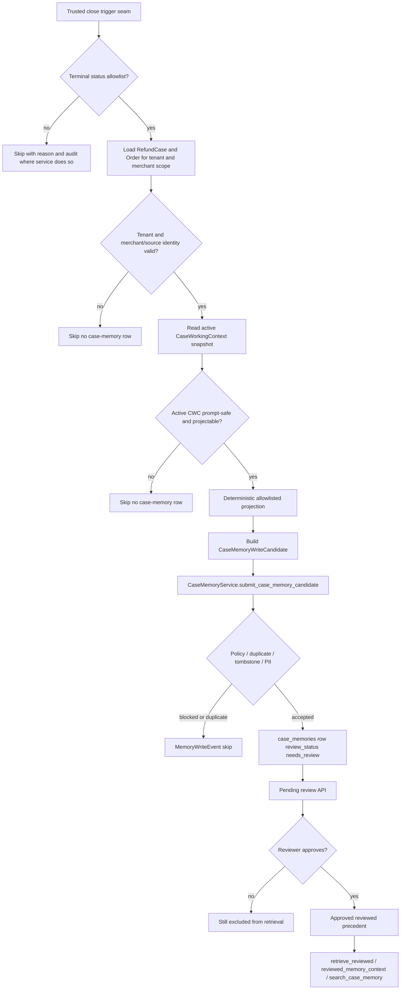

# Phase 47: Case Precedent Repositioning and Closed-Case Candidate Generation - Research

**Researched:** 2026-07-03 [VERIFIED: system date]
**Domain:** MOCA memory subsystem, reviewed case precedent, closed-case candidate generation [VERIFIED: .planning/phases/47-case-precedent-repositioning-and-closed-case-candidate-gener/47-CONTEXT.md]
**Confidence:** HIGH [VERIFIED: repository inspection and local environment probes]

<user_constraints>
## User Constraints (from CONTEXT.md)

The following locked decisions, discretion areas, and deferred ideas are copied from Phase 47 CONTEXT.md for planner enforcement. [VERIFIED: .planning/phases/47-case-precedent-repositioning-and-closed-case-candidate-gener/47-CONTEXT.md]

### Locked Decisions

## Implementation Decisions

### D-47-01 - Preserve table identity
- Phase 47 must not rename or replace `case_memories`; semantics are locked by docs/tests and small additive code only.
- `case_working_contexts` remains the current-case working-state table. `case_memories` remains reviewed precedent.

### D-47-02 - Candidate generation is automatic, publication is not
- Closed-case generation may be automatic only up to candidate creation.
- Generated candidates default to `needs_review` and must be excluded from `retrieve_reviewed(...)`, `reviewed_memory_context`, and `search_case_memory` until a reviewer approves them.
- `human_reviewed` / `explicit_admin_preference` may stay auto-approved under the existing policy; closed-case CWC candidates must not use those source types.

### D-47-03 - Use the existing case memory review pipeline
- Reuse `CaseMemoryWriteCandidate`, `CaseMemoryService.submit_case_memory_candidate(...)`, `CaseMemoryRepository.emit_write_event(...)`, `list_pending_review`, and approve/reject/delete/forget actions.
- Do not create a second review queue, second audit table, or parallel case-precedent store.
- Prefer an explicit additive source type such as `closed_case_cwc_candidate` and classify it as review-required. If planning chooses not to add a source type, it must explain why `summary_candidate` is sufficient and still preserve closed-case provenance in `source_ref_json`.

### D-47-04 - Close trigger must be trusted
- Current code has `RefundCase.status` but no dedicated close-transition service or public close endpoint. Phase 47 must not infer "closed case" from `AgentRun.final_status == "completed"`.
- The first implementation should expose a trusted internal trigger/service seam, for example `generate_closed_case_precedent_candidate(...)`, taking explicit tenant, case, run, close source, and closed-at inputs.
- If a real refund-case status transition hook exists by planning time, wire to that hook only. If it does not exist, deliver the seam and tests without inventing a public close API.
- The closure predicate/status allowlist must be explicit and test-covered; ambiguous or non-terminal states such as `open` / `reviewing` skip with a reason.

### D-47-05 - Source CWC is the finalized snapshot, not authority
- Source content comes from the active CWC row/revision at close time and any trusted close/outcome metadata passed to the trigger.
- CWC remains `contextual_only`; the generated case-memory candidate is a reviewed-precedent candidate, not policy evidence, current business fact authority, approval authorization, action authorization, action outcome truth, audit truth, or replay truth.
- If no active CWC exists, tenant/case identity is missing, CWC is PII-blocked, or content is not projectable, generation skips with an explicit reason and no `case_memories` row.

### D-47-06 - Projection is deterministic and allowlisted
- Projection may use CWC fields such as customer request, issue type, verified facts summaries, policy refs, actions taken summaries, recommendations, staff decisions, commitments, and final outcome metadata.
- Projection must keep claims and verified facts distinct in source processing; it must not silently promote claims to verified facts.
- Case-memory output may summarize historical outcome and applicability, but must store prompt-safe text and refs only.
- Forbidden payloads: policy body text, raw tool payloads, raw conversation/debug/replay blobs, approval authority bodies, action authority bodies, sensitive raw PII, and current-business-state truth presented as authoritative.

### D-47-07 - Retrieval scope is not source identity
- `CaseMemory.scope_type/scope_id` is the retrieval scope. `source_ref_json.business_object_type/business_object_id` is the source case identity.
- Closed-case precedents should be reusable where the product can safely retrieve them. Prefer merchant-scope storage when the closed refund case can resolve through `RefundCase -> Order.merchant_id`; fall back conservatively when the merchant cannot be resolved.
- Exact case-scoped retrieval must remain supported for audit/debug and tests, but planner-facing merchant retrieval must not miss all generated precedents merely because their source case id lives in `source_ref_json`.
- Do not widen `ToolCallContext` identity fields to carry case id; those fields are locked by the tool-platform contract.

### D-47-08 - Metadata-first retrieval remains the MVP path
- Retrieval must work without embeddings by using tenant + scope + case type + policy family/version + text filters/rerank.
- Optional vector similarity may remain as an additional ranking mode, but embeddings must not become mandatory for exact scoped retrieval.
- Needs-review, rejected, deleted, expired, tombstoned, cross-tenant, and non-prompt-safe PII rows must stay excluded.

### D-47-09 - Idempotency and audit
- Candidate writes must be idempotent for the same tenant/source case/CWC version/close event or equivalent source identity.
- Existing content/source identity hashes and duplicate/tombstone handling should be reused before adding new columns.
- Every write/skip/needs_review outcome must produce or preserve an observable `memory_write_events` record where the existing service already does so.

### D-47-10 - Verification entrypoint
- Every automated test command in Phase 47 plans must use the MOCA-approved test entrypoint: `UV_CACHE_DIR=/tmp/uv-cache uv run pytest ...`.
- Bare `pytest` or bare `python -m pytest` is invalid verification.

### Claude's Discretion

### Planner's Discretion
- Exact service/module names for closed-case projection.
- Whether the first plan adds `closed_case_cwc_candidate` as a source type or reuses an existing review-required source type with stronger source refs.
- Exact projection wording and truncation limits, provided it is deterministic and prompt-safe.
- Whether implementation needs a tiny repository helper for `RefundCase -> Order.merchant_id` resolution or keeps it inside the candidate service.
- Exact plan split, as long as docs/static tests, candidate service, retrieval/gate behavior, and final validation remain separate enough for bounded execution.

### Deferred Ideas (OUT OF SCOPE)

## Deferred Ideas

- Phase 48: narrow explicit tenant/user/merchant preference memory in `long_term_memories`.
- Future product/business phase: a real refund-case close/update workflow or public close endpoint, if product scope requires one.
- Future graph/agent phase: ReAct node architecture and loop-local discovered slot memory.
- Optional future cleanup: remove or further quarantine legacy session-derived precedent code only after reviewed case precedent coverage is sufficient.
- Optional future ranking work: embeddings or stronger semantic reranking for case precedents after metadata-first MVP has real data.
</user_constraints>

<phase_requirements>
## Phase Requirements

| ID | Description | Research Support |
|----|-------------|------------------|
| MEM-04 | Reposition `case_memories` as reviewed closed-case precedent, introduce governed candidate generation from finalized CWC into reviewed memory workflow, keep retrieval metadata-first, preserve audit/review/PII/tenant/source semantics, and avoid destructive table renames. [VERIFIED: .planning/REQUIREMENTS.md; .planning/ROADMAP.md] | Existing `CaseMemoryService.submit_case_memory_candidate(...)`, review actions, metadata filters, `MemoryWriteEvent`, CWC active read, and RefundCase-to-Order merchant linkage provide the implementation surfaces; gaps are the trusted close seam, dedicated source-type policy, deterministic projection, and Phase 47 tests. [VERIFIED: src/memory/case_memory.py; src/db/models.py; src/memory/case_working_context.py; src/memory/policy.py; src/repositories/refund_repo.py] |
</phase_requirements>

## Summary

Phase 47 should be implemented as an additive memory-layer phase: keep `case_memories` as the reviewed precedent store, keep `case_working_contexts` as active working state, and add a trusted closed-case candidate-generation seam that submits `CaseMemoryWriteCandidate` objects through the existing review workflow. [VERIFIED: .planning/phases/47-case-precedent-repositioning-and-closed-case-candidate-gener/47-CONTEXT.md; VERIFIED: src/memory/case_memory.py; CITED: docs/contract-spec.md]

The current code already has most governance primitives: `CaseMemory` review status, source identity hash, candidate hash, source refs, duplicate/tombstone checks, PII policy blocks, pending review listing, approve/reject/delete/forget actions, and `MemoryWriteEvent` audit rows. [VERIFIED: src/db/models.py; VERIFIED: src/memory/case_memory.py; VERIFIED: src/memory/policy.py] The main missing pieces are a closed-case-specific source type or equivalent provenance rule, an internal close-trigger service boundary, a deterministic CWC projection, and tests proving candidates remain invisible until reviewed. [VERIFIED: src/memory/schemas.py; VERIFIED: src/api/routers/refund_cases.py; VERIFIED: tests/memory/test_case_memory_retrieval.py]

**Primary recommendation:** Add a small closed-case precedent generation service that reads the active CWC snapshot, resolves merchant-scope retrieval through `RefundCase -> Order.merchant_id` when possible, builds a prompt-safe `CaseMemoryWriteCandidate` with `source_type="closed_case_cwc_candidate"`, submits it through `CaseMemoryService.submit_case_memory_candidate(...)`, and relies on the existing review API before retrieval exposure. [VERIFIED: src/db/models.py; VERIFIED: src/memory/case_memory.py; VERIFIED: src/memory/case_working_context.py; VERIFIED: src/memory/schemas.py]

## Architectural Responsibility Map

| Capability | Primary Tier | Secondary Tier | Rationale |
|------------|--------------|----------------|-----------|
| Case-memory semantic lock | Docs/tests | Backend | Contract docs and static tests should lock `case_memories` as reviewed precedent; backend changes must not rename the table or make it active state. [CITED: docs/contract-spec.md; VERIFIED: tests/memory/test_phase45_contract_alignment.py; VERIFIED: tests/memory/test_phase46_session_context_alignment.py] |
| Trusted close trigger seam | API / Backend | Database / Storage | Current refund-case API is read-only and no close-transition service exists, so Phase 47 should expose an internal service seam rather than a public endpoint. [VERIFIED: src/api/routers/refund_cases.py; VERIFIED: src/repositories/refund_repo.py; VERIFIED: src/db/models.py] |
| CWC source snapshot read | Database / Storage | Backend | `CaseWorkingContextRepository.read_active(...)` reads the active contextual-only CWC row by tenant and case id, and `hydrate_content(...)` returns typed CWC content. [VERIFIED: src/memory/case_working_context.py; VERIFIED: src/memory/case_working_context_schemas.py] |
| Closed-case projection | Backend | Database / Storage | Projection should transform allowlisted CWC fields plus trusted close metadata into a `CaseMemoryWriteCandidate`; it should not write authoritative business state or raw payloads. [VERIFIED: src/memory/case_working_context_schemas.py; VERIFIED: src/memory/schemas.py; VERIFIED: src/memory/case_working_context_lifecycle.py] |
| Review and audit workflow | Backend | Database / Storage | Existing `CaseMemoryService.submit_case_memory_candidate(...)` writes reviewed/pending case-memory rows and emits `MemoryWriteEvent` records for write, skip, duplicate, tombstone, and PII decisions. [VERIFIED: src/memory/case_memory.py; VERIFIED: src/db/models.py] |
| Pending review and reviewer decisions | API / Backend | Database / Storage | Existing memory review routes list pending case-memory candidates and call approve/reject/delete/forget service methods with reviewer roles. [VERIFIED: src/api/routers/memory.py; VERIFIED: tests/test_memory_review_api.py] |
| Reviewed retrieval | Backend | Tool executor | `CaseMemoryService.retrieve_reviewed(...)`, reviewed memory context, and `search_case_memory` already exclude unreviewed rows and support metadata/text retrieval without embeddings. [VERIFIED: src/memory/case_memory.py; VERIFIED: src/memory/context_service.py; VERIFIED: src/tools/executors/memory.py] |
| Tenant and merchant scope | Backend | Database / Storage | `RefundCase` links to `Order`, and `Order` carries `merchant_id`; reviewed memory context and tool executor already use merchant scope as a retrieval scope. [VERIFIED: src/db/models.py; VERIFIED: src/memory/context_service.py; VERIFIED: src/tools/executors/memory.py] |

## Project Constraints (from CLAUDE.md)

- Use GSD phase artifacts and preserve phase-level plan quality; phases with multiple ownership boundaries, waves, or verification gates must be split into bounded plans rather than one oversized plan. [VERIFIED: ./AGENTS.md; VERIFIED: ./CLAUDE.md]
- For MOCA local verification, automated test commands must use `UV_CACHE_DIR=/tmp/uv-cache uv run pytest ...`; bare `pytest` and bare `python -m pytest` are invalid verification. [VERIFIED: ./AGENTS.md]
- If Phase 47 implementation modifies memory, RAG, tool-call, or intent subsystems and discovers or fixes subsystem-level debt, append Chinese ledger entries to `.planning/ARCHITECTURE-DEBT.md`. [VERIFIED: ./AGENTS.md]
- If local debugging, startup, UI/API validation, RAG/agent/memory/tool-call testing, or verification reveals an error or environment pitfall, append a Chinese incident entry to `.planning/LOCAL-VALIDATION-ISSUES.md`. [VERIFIED: ./AGENTS.md]
- `study_plan/` documents default to Chinese, but this research artifact is a planning artifact outside `study_plan/`. [VERIFIED: ./AGENTS.md]
- Phase-level and larger changes use the Codex-GSD double-review workflow; small single-file fixes are exempt. [VERIFIED: ./AGENTS.md]
- `docs/contract-spec.md` is the normative memory contract source, but it describes target contract semantics rather than automatically proving current implementation. [VERIFIED: ./AGENTS.md; CITED: docs/contract-spec.md]

## Standard Stack

### Core

| Library / Component | Version | Purpose | Why Standard |
|---------------------|---------|---------|--------------|
| Python | `>=3.12` project requirement; local `python3` is 3.13.3 | Runtime for backend services and tests | The project declares Python 3.12+ and MOCA tests depend on Python 3.12+ behavior. [VERIFIED: pyproject.toml; VERIFIED: local command `python3 --version`] |
| FastAPI | 0.136.1 in the active uv environment | Existing API router framework | Memory review and refund-case routers are FastAPI routers. [VERIFIED: local command `UV_CACHE_DIR=/tmp/uv-cache uv run python ...`; VERIFIED: src/api/routers/memory.py; VERIFIED: src/api/routers/refund_cases.py] |
| SQLAlchemy | 2.0.49 in the active uv environment | ORM models, repositories, and async DB access | `CaseMemory`, `CaseWorkingContext`, `MemoryWriteEvent`, `RefundCase`, and `Order` are SQLAlchemy models. [VERIFIED: local command `UV_CACHE_DIR=/tmp/uv-cache uv run python ...`; VERIFIED: src/db/models.py] |
| asyncpg | 0.31.0 in the active uv environment | PostgreSQL async driver | The project test DB URL uses `postgresql+asyncpg`, and local probes used asyncpg successfully against the Docker database. [VERIFIED: pyproject.toml; VERIFIED: tests/conftest.py; VERIFIED: local asyncpg probe] |
| Pydantic | 2.13.4 in the active uv environment | Typed DTOs and schema validation | Memory source refs, candidates, search requests, and CWC content are Pydantic models or typed schema definitions. [VERIFIED: local command `UV_CACHE_DIR=/tmp/uv-cache uv run python ...`; VERIFIED: src/memory/schemas.py; VERIFIED: src/memory/case_working_context_schemas.py] |
| PostgreSQL + pgvector | PostgreSQL container `moca-postgres-1` is healthy; pgvector extension is required by tests | Durable storage, metadata filtering, optional embeddings | `CaseMemory.embedding` is optional and indexed with HNSW, while metadata filters remain the non-vector retrieval path. [VERIFIED: local command `docker ps`; VERIFIED: tests/conftest.py; VERIFIED: src/db/models.py; VERIFIED: src/memory/case_memory.py] |
| Alembic | Project migration CLI available through uv; head is `022_case_working_context` | Schema migration management | The current schema head includes CWC support and should not be destructively renamed in Phase 47. [VERIFIED: local command `UV_CACHE_DIR=/tmp/uv-cache uv run alembic heads`; VERIFIED: alembic/versions] |
| pytest + pytest-asyncio | pytest 9.0.3, pytest-asyncio 1.3.0 in the active uv environment | Phase 47 unit/integration/static tests | Existing memory and API tests use pytest async fixtures and the project requires the uv pytest entrypoint. [VERIFIED: local command `UV_CACHE_DIR=/tmp/uv-cache uv run python ...`; VERIFIED: pyproject.toml; VERIFIED: tests/conftest.py; VERIFIED: ./AGENTS.md] |

### Supporting

| Library / Tool | Version | Purpose | When to Use |
|----------------|---------|---------|-------------|
| uv | 0.11.2 local CLI | Project environment and command runner | Use for every Phase 47 test and dev-tool command. [VERIFIED: local command `uv --version`; VERIFIED: ./AGENTS.md] |
| Docker | 29.4.2 local CLI | Local PostgreSQL service for tests | Use when the local DB must be available; `moca-postgres-1` was healthy during research. [VERIFIED: local command `docker --version`; VERIFIED: local command `docker ps`] |
| Ruff | Available through project environment and global CLI | Linting touched Python files | Use through `UV_CACHE_DIR=/tmp/uv-cache uv run ruff ...` to avoid PATH contamination. [VERIFIED: ./AGENTS.md; VERIFIED: pyproject.toml] |

### Alternatives Considered

| Instead of | Could Use | Tradeoff |
|------------|-----------|----------|
| Existing case-memory review pipeline | A second review queue or case-precedent table | Rejected by Phase 47 decisions; existing candidate/review/audit services already cover pending review, reviewer actions, events, PII blocks, duplicate checks, and retrieval exclusion. [VERIFIED: .planning/phases/47-case-precedent-repositioning-and-closed-case-candidate-gener/47-CONTEXT.md; VERIFIED: src/memory/case_memory.py] |
| Dedicated `closed_case_cwc_candidate` source type | Existing `summary_candidate` source type | A dedicated source type gives clearer policy and provenance; `summary_candidate` is review-required but loses closed-case specificity unless source refs carry enough identity. [VERIFIED: src/memory/schemas.py; VERIFIED: src/memory/policy.py] |
| Internal generation seam | New public close endpoint | Current refund-case API has no close endpoint and Phase 47 explicitly forbids inventing one. [VERIFIED: src/api/routers/refund_cases.py; VERIFIED: .planning/phases/47-case-precedent-repositioning-and-closed-case-candidate-gener/47-CONTEXT.md] |
| Metadata/text retrieval | Mandatory vector embedding retrieval | Metadata/text retrieval already works without embeddings, and Phase 47 requires embeddings to stay optional. [VERIFIED: src/memory/case_memory.py; VERIFIED: tests/memory/test_case_memory_retrieval.py; VERIFIED: .planning/phases/47-case-precedent-repositioning-and-closed-case-candidate-gener/47-CONTEXT.md] |
| Table rename | Docs, tests, and additive service code | Destructive rename/drop of `case_memories`, `long_term_memories`, `case_working_contexts`, and `conversation_threads.case_id` is out of scope and explicitly forbidden. [VERIFIED: .planning/phases/47-case-precedent-repositioning-and-closed-case-candidate-gener/47-CONTEXT.md; VERIFIED: tests/memory/test_phase45_contract_alignment.py] |

**Installation:**

No new runtime dependency is recommended for Phase 47; use the existing uv-managed project environment. [VERIFIED: pyproject.toml; VERIFIED: src/memory/case_memory.py; VERIFIED: src/memory/case_working_context.py]

```bash
UV_CACHE_DIR=/tmp/uv-cache uv sync --extra dev
```

**Version verification:** Recommended stack versions above were verified with the active project environment using `UV_CACHE_DIR=/tmp/uv-cache uv run python ...`, `uv --version`, `docker --version`, and `UV_CACHE_DIR=/tmp/uv-cache uv run alembic heads`. [VERIFIED: local environment probes]

## Architecture Patterns

### System Architecture Diagram



The diagram reflects existing service boundaries: the close seam is new, while candidate submission, events, pending review, reviewer actions, and reviewed retrieval already exist. [VERIFIED: src/memory/case_memory.py; VERIFIED: src/api/routers/memory.py; VERIFIED: src/tools/executors/memory.py]

### Recommended Project Structure

```text
src/
├── memory/
│   ├── case_precedent.py                 # New closed-case CWC-to-case-memory projection service.
│   ├── schemas.py                        # Add or reuse review-required source type.
│   ├── policy.py                         # Classify closed-case source type as review-required.
│   └── case_memory.py                    # Reuse review/audit/retrieval service.
tests/
├── memory/
│   ├── test_case_precedent_generation.py # New behavioral tests for projection, skips, review gate, idempotency.
│   ├── test_phase47_case_precedent_alignment.py # Static semantic/destructive-schema guards.
│   └── test_memory_policy.py             # Add source-type policy test.
└── tools/
    └── test_catalog.py                   # Guard search_case_memory contract only if touched.
docs/
└── contract-spec.md                      # Small delta for Phase 47 semantics and DEFER-3 carry-forward.
```

This structure keeps the new responsibility out of CWC lifecycle writeback and out of public refund-case routes, while preserving existing review services. [VERIFIED: src/memory/case_working_context_lifecycle.py; VERIFIED: src/api/routers/refund_cases.py; VERIFIED: src/memory/case_memory.py]

### Pattern 1: Add a Review-Required Closed-Case Source Type

**What:** Add `closed_case_cwc_candidate` to `CaseMemorySourceType` and classify it in `REVIEW_REQUIRED_CASE_SOURCE_TYPES`. [VERIFIED: src/memory/schemas.py; VERIFIED: src/memory/policy.py]

**When to use:** Use this when the candidate source is a finalized CWC snapshot at a trusted case close, because it gives explicit provenance while still defaulting to `needs_review`. [VERIFIED: .planning/phases/47-case-precedent-repositioning-and-closed-case-candidate-gener/47-CONTEXT.md]

**Example:**

```python
# Source: src/memory/schemas.py and src/memory/policy.py
CaseMemorySourceType = Literal[
    "explicit_admin_preference",
    "human_reviewed",
    "deterministic_tool_result",
    "confirmed_business_outcome",
    "approved_approval_state",
    "llm_candidate",
    "semantic_episode_candidate",
    "summary_candidate",
    "cross_case_pattern_candidate",
    "behavior_inference",
    "closed_case_cwc_candidate",
]

REVIEW_REQUIRED_CASE_SOURCE_TYPES = frozenset(
    {
        "deterministic_tool_result",
        "confirmed_business_outcome",
        "approved_approval_state",
        "llm_candidate",
        "semantic_episode_candidate",
        "summary_candidate",
        "cross_case_pattern_candidate",
        "behavior_inference",
        "closed_case_cwc_candidate",
    }
)
```

`CaseMemoryService.submit_case_memory_candidate(...)` already converts review-required policy decisions into `review_status="needs_review"`. [VERIFIED: src/memory/case_memory.py; VERIFIED: src/memory/policy.py]

### Pattern 2: Closed-Case Generation Service Seam

**What:** Introduce an internal service method such as `generate_closed_case_precedent_candidate(...)` that accepts trusted tenant, case, run, close source, close event, terminal status, and closed-at inputs. [VERIFIED: .planning/phases/47-case-precedent-repositioning-and-closed-case-candidate-gener/47-CONTEXT.md]

**When to use:** Use this seam until a real refund-case close/update workflow exists; current API and repository surfaces only read refund cases. [VERIFIED: src/api/routers/refund_cases.py; VERIFIED: src/repositories/refund_repo.py]

**Example:**

```python
# Source: derived from existing CaseWorkingContextRepository and CaseMemoryService APIs.
async def generate_closed_case_precedent_candidate(
    *,
    tenant_id: str,
    case_id: str,
    run_id: str | None,
    closed_status: str,
    close_event_id: str,
    closed_at: datetime,
) -> ClosedCasePrecedentResult:
    if closed_status not in TERMINAL_REFUND_CASE_STATUSES:
        return ClosedCasePrecedentResult.skipped("non_terminal_status")

    case_row = await refund_case_repo.get_by_case_id_for_tenant(tenant_id, case_id)
    merchant_id = resolve_merchant_id(case_row)
    cwc_row = await cwc_repo.read_active(tenant_id=tenant_id, case_id=case_id)
    if cwc_row is None:
        return ClosedCasePrecedentResult.skipped("missing_active_cwc")

    content = cwc_repo.hydrate_content(cwc_row)
    candidate = project_closed_case_candidate(
        tenant_id=tenant_id,
        run_id=run_id,
        retrieval_scope=("merchant", merchant_id),
        source_case_id=case_id,
        close_event_id=close_event_id,
        closed_at=closed_at,
        cwc_row=cwc_row,
        cwc_content=content,
    )
    return await case_memory_service.submit_case_memory_candidate(candidate)
```

The exact repository method names are planner discretion, but the seam should call existing CWC read and case-memory submit APIs rather than writing `case_memories` directly. [VERIFIED: src/memory/case_working_context.py; VERIFIED: src/memory/case_memory.py]

### Pattern 3: Deterministic Allowlisted Projection

**What:** Project only prompt-safe, ref-only CWC content into summary/excerpt/applicability/outcome/caveats/policy refs, and keep claims separate from verified facts during source processing. [VERIFIED: src/memory/case_working_context_schemas.py; VERIFIED: src/memory/case_working_context_lifecycle.py]

**When to use:** Use this for every generated closed-case candidate; do not use an LLM summarizer for the first implementation. [VERIFIED: tests/memory/test_phase45_contract_alignment.py; VERIFIED: .planning/phases/47-case-precedent-repositioning-and-closed-case-candidate-gener/47-CONTEXT.md]

**Example:**

```python
# Source: CWC content fields and existing terminal projection style.
def project_policy_refs(cwc: CaseWorkingContextContentV1) -> list[dict[str, str]]:
    return [
        {
            "doc_key": ref.doc_key,
            "chunk_id": ref.chunk_id,
            "policy_version": ref.policy_version,
            "policy_family": ref.policy_family,
        }
        for ref in cwc.policy_refs
    ]
```

Existing terminal CWC projection already demonstrates safe tool-summary and policy-ref projection patterns that exclude raw tool payloads and policy body text. [VERIFIED: src/memory/case_working_context_lifecycle.py; VERIFIED: tests/agent/test_case_working_context_lifecycle.py]

### Pattern 4: Metadata-First Reviewed Retrieval

**What:** Keep exact tenant/scope/case_type/policy filters as the primary retrieval mechanism, with vector search optional when `query_embedding` is supplied. [VERIFIED: src/memory/case_memory.py; VERIFIED: src/memory/schemas.py]

**When to use:** Use service-level retrieval tests for exact case-scope and merchant-scope behavior, and use tool-executor tests only for planner-facing merchant retrieval because `ToolCallContext` intentionally does not carry case id. [VERIFIED: src/tools/executors/memory.py; VERIFIED: src/memory/context_service.py]

**Example:**

```python
# Source: src/memory/schemas.py and src/memory/case_memory.py
request = CaseMemorySearchRequest(
    tenant_id="tenant-1",
    scopes=[CaseMemoryScope(scope_type="merchant", scope_id="merchant-9")],
    case_type="refund",
    query="late shipment refund precedent",
    query_embedding=None,
    limit=5,
)
rows = await case_memory_service.retrieve_reviewed(request)
```

`retrieve_reviewed(...)` should continue to exclude `needs_review`, rejected, deleted, expired, tombstoned, cross-tenant, and non-prompt-safe PII rows. [VERIFIED: src/memory/case_memory.py; VERIFIED: tests/memory/test_case_memory_retrieval.py]

### Anti-Patterns to Avoid

- **Inferring close from `AgentRun.final_status == "completed"`:** Completed runs currently trigger CWC terminal writeback, not refund-case closure, and Phase 47 explicitly forbids this inference. [VERIFIED: src/api/services/agent_run_memory.py; VERIFIED: src/memory/case_working_context_lifecycle.py; VERIFIED: .planning/phases/47-case-precedent-repositioning-and-closed-case-candidate-gener/47-CONTEXT.md]
- **Direct inserts into `case_memories`:** Direct inserts would bypass policy, dedupe, tombstone, PII, and audit behavior already centralized in `CaseMemoryService.submit_case_memory_candidate(...)`. [VERIFIED: src/memory/case_memory.py]
- **Making generated candidates auto-approved:** Existing policy auto-approves only `explicit_admin_preference` and `human_reviewed`; closed-case candidates must be review-required. [VERIFIED: src/memory/policy.py; VERIFIED: .planning/phases/47-case-precedent-repositioning-and-closed-case-candidate-gener/47-CONTEXT.md]
- **Putting source case id in retrieval scope only:** Retrieval scope and source identity are separate; merchant-scope retrieval needs `scope_type="merchant"` while source case identity belongs in `source_ref_json`. [VERIFIED: src/db/models.py; VERIFIED: src/memory/identity.py; VERIFIED: src/tools/executors/memory.py]
- **Adding arbitrary `source_ref_json` keys without schema work:** `MemorySourceRefV1` and identity hashing currently allow a fixed key set; planners must either encode close/CWC identity using allowed discriminators or explicitly extend the schema and hash allowlist. [VERIFIED: src/memory/schemas.py; VERIFIED: src/memory/identity.py]
- **Vector-only retrieval:** Existing retrieval supports text/metadata search without embeddings, and Phase 47 requires that path to remain first-class. [VERIFIED: src/memory/case_memory.py; VERIFIED: tests/memory/test_case_memory_retrieval.py]
- **Broad destructive grep failures:** Existing old Alembic downgrades contain historical drop operations; Phase 47 destructive-schema static tests should target new Phase 47 migrations/plans or protected live model/table declarations to avoid false positives. [VERIFIED: alembic/versions; VERIFIED: tests/memory/test_phase45_contract_alignment.py]

## Don't Hand-Roll

| Problem | Don't Build | Use Instead | Why |
|---------|-------------|-------------|-----|
| Candidate review queue | A second review table or queue | `CaseMemoryService.submit_case_memory_candidate(...)`, `list_pending_review`, and memory review API actions | Existing code already records `needs_review`, reviewer actions, and audit events. [VERIFIED: src/memory/case_memory.py; VERIFIED: src/api/routers/memory.py] |
| Write audit | Custom audit table | `MemoryWriteEvent` via `CaseMemoryRepository.emit_write_event(...)` | Existing event schema records memory type, decision, run id, candidate hash, source refs, blocked reasons, and authority class. [VERIFIED: src/db/models.py; VERIFIED: src/memory/case_memory.py] |
| Deduplication | New columns before proving a gap | Existing content/source identity hashes and active duplicate/tombstone logic | Current service detects active duplicates by content hash or source identity across pending/approved rows and emits skip events. [VERIFIED: src/memory/case_memory.py; VERIFIED: src/memory/identity.py] |
| CWC parsing | Ad hoc JSON dict reads | `CaseWorkingContextRepository.read_active(...)` and `hydrate_content(...)` | Repository methods already load the active row and hydrate typed CWC content. [VERIFIED: src/memory/case_working_context.py] |
| PII gating | New unreviewed text sanitizer | Existing memory policy and prompt-safe PII classifications | Policy blocks sensitive/prohibited PII candidates and retrieval filters exclude non-prompt-safe PII rows. [VERIFIED: src/memory/policy.py; VERIFIED: src/memory/case_memory.py] |
| Reviewed retrieval | New SQL query path | `CaseMemoryService.retrieve_reviewed(...)` | Existing filters enforce tenant, scope, review status, expiration, tombstone, and PII guards. [VERIFIED: src/memory/case_memory.py] |
| Policy refs | Policy body copying | Existing ref-only projection shape: doc key, chunk id, policy version/family | Existing safe projection only preserves policy identifiers and tests forbid raw policy body leakage. [VERIFIED: src/memory/case_memory.py; VERIFIED: src/memory/case_working_context_lifecycle.py; VERIFIED: tests/agent/test_case_working_context_lifecycle.py] |

**Key insight:** Phase 47 is a provenance, projection, and governance phase, not a storage-system rewrite; custom stores, custom queues, custom dedupe, and direct SQL writes would bypass protections that already exist and are tested. [VERIFIED: .planning/phases/47-case-precedent-repositioning-and-closed-case-candidate-gener/47-CONTEXT.md; VERIFIED: src/memory/case_memory.py]

## Runtime State Inventory

This phase includes semantic repositioning and candidate-generation work, so runtime state was audited for cached/stored/registered names and data migration implications. [VERIFIED: execution_flow requirement; VERIFIED: local probes]

| Category | Items Found | Action Required |
|----------|-------------|-----------------|
| Stored data | Local `moca` database contained 0 `case_memories`, 0 `long_term_memories`, 0 `case_working_contexts`, 0 `memory_write_events`, 0 `memory_tombstones`, and 13 `session_memories` during research; local `moca_test` tables were absent because the test fixture manages schema lifecycle. [VERIFIED: local asyncpg probe; VERIFIED: tests/conftest.py] | No local data migration is required; production data was not inspected, so Phase 47 plans must avoid destructive migrations and should treat any production `case_memories` as preserve-in-place reviewed precedent candidates. [VERIFIED: local asyncpg probe; ASSUMED] |
| Live service config | Docker showed `moca-postgres-1` healthy and `moca-api-1`, `moca-frontend-1`, and `moca-redis-1` exited; no live service config with exact `case_memory`, `case_memories`, `case_working_context`, or `case_working_contexts` was found in checked repo env/config paths. [VERIFIED: local command `docker ps`; VERIFIED: local `rg` over `.env*`, Docker, GitHub, pyproject, and Alembic paths] | No live-service config migration is needed for Phase 47; start services only if later implementation tests require them. [VERIFIED: local probes] |
| OS-registered state | `launchctl list` contained unrelated `com.moca.study.*` agents and no exact case-memory/CWC registrations. [VERIFIED: local command `launchctl list`] | No OS registration change is required. [VERIFIED: local probe] |
| Secrets/env vars | No exact relevant env or secret key names for `case_memory`, `case_memories`, `case_working_context`, or `case_working_contexts` were found in checked env/config paths. [VERIFIED: local `rg` over `.env*`, Docker, GitHub, pyproject, and Alembic paths] | No secret/env rename is required; Phase 47 must not introduce new secrets for this workflow. [VERIFIED: local probe; ASSUMED] |
| Build artifacts | Existing `moca.egg-info`, `__pycache__`, frontend `node_modules`, and build outputs were present; no artifact rename is needed because Phase 47 must preserve table/model identity. [VERIFIED: local file scan; VERIFIED: .planning/phases/47-case-precedent-repositioning-and-closed-case-candidate-gener/47-CONTEXT.md] | No artifact cleanup is required for planning; normal test/lint commands may update caches. [VERIFIED: local file scan] |

## Common Pitfalls

### Pitfall 1: Treating AgentRun Completion as Case Closure

**What goes wrong:** A normal completed agent run creates closed-case precedent even when the refund case is still open or reviewing. [VERIFIED: src/api/services/agent_run_memory.py; VERIFIED: src/db/models.py]

**Why it happens:** The finalizer already runs terminal CWC writeback on `AgentRun.final_status == "completed"`, which can look like a convenient hook but is not a business close transition. [VERIFIED: src/api/services/agent_run_memory.py; VERIFIED: src/memory/case_working_context_lifecycle.py]

**How to avoid:** Add an explicit trusted internal close seam with a tested terminal status allowlist and skip `open`/`reviewing`. [VERIFIED: .planning/phases/47-case-precedent-repositioning-and-closed-case-candidate-gener/47-CONTEXT.md]

**Warning signs:** Code in `finalize_completed_agent_run_memory(...)` starts calling closed-case precedent generation, or tests create precedents from completed agent runs without a refund-case terminal status. [VERIFIED: src/api/services/agent_run_memory.py]

### Pitfall 2: Losing Review-Before-Retrieval

**What goes wrong:** Generated candidates appear in `retrieve_reviewed(...)`, reviewed memory context, or `search_case_memory` before reviewer approval. [VERIFIED: tests/memory/test_case_memory_retrieval.py; VERIFIED: tests/memory/test_reviewed_memory_context_boundary.py]

**Why it happens:** A new source type could be mistakenly auto-approved or inserted directly with `review_status="approved"`. [VERIFIED: src/memory/policy.py; VERIFIED: src/memory/case_memory.py]

**How to avoid:** Add `closed_case_cwc_candidate` only to `REVIEW_REQUIRED_CASE_SOURCE_TYPES`, route through `submit_case_memory_candidate(...)`, and add policy plus retrieval exclusion tests. [VERIFIED: src/memory/policy.py; VERIFIED: src/memory/case_memory.py]

**Warning signs:** `closed_case_cwc_candidate` appears in `AUTO_APPROVED_CASE_SOURCE_TYPES`, or tests pass without checking pending-review invisibility. [VERIFIED: src/memory/policy.py]

### Pitfall 3: Confusing Retrieval Scope with Source Case Identity

**What goes wrong:** Generated precedents are stored only under source case id and planner-facing merchant retrieval misses them. [VERIFIED: src/db/models.py; VERIFIED: src/tools/executors/memory.py]

**Why it happens:** `CaseMemory.scope_type/scope_id` drive retrieval, while `source_ref_json.business_object_type/business_object_id` record provenance; the same case id should not replace reusable merchant scope. [VERIFIED: src/db/models.py; VERIFIED: src/memory/identity.py]

**How to avoid:** Resolve `RefundCase -> Order.merchant_id` and store reusable precedents under merchant scope when safe; keep source case identity in source refs. [VERIFIED: src/db/models.py; VERIFIED: .planning/phases/47-case-precedent-repositioning-and-closed-case-candidate-gener/47-CONTEXT.md]

**Warning signs:** Tool executor or `ToolCallContext` is widened to include case id, or service tests only cover exact case scope and never merchant-scope retrieval. [VERIFIED: src/tools/executors/memory.py]

### Pitfall 4: Source-Ref Keys Do Not Affect Idempotency

**What goes wrong:** Planner puts CWC version or closed-at into arbitrary source-ref keys and expects duplicate detection to use them. [VERIFIED: src/memory/schemas.py; VERIFIED: src/memory/identity.py]

**Why it happens:** `MemorySourceRefV1` and `ALLOWED_SOURCE_REF_KEYS` restrict source-ref fields, and source identity hashing uses specific discriminator keys such as `event_id`, `tool_result_id`, `agent_run_id`, `business_object_id`, and `outcome_id`. [VERIFIED: src/memory/schemas.py; VERIFIED: src/memory/identity.py]

**How to avoid:** Either encode the trusted close event/CWC version into allowed identifiers such as `event_id` or `outcome_id`, or explicitly extend both the Pydantic schema and identity allowlist. [VERIFIED: src/memory/schemas.py; VERIFIED: src/memory/identity.py]

**Warning signs:** Tests assert dedupe based on `source_ref_json["cwc_version"]` without schema and identity-code changes. [VERIFIED: src/memory/identity.py]

### Pitfall 5: Leaking Raw Payloads or Authority Bodies

**What goes wrong:** Case-memory snippets store policy body text, raw tool payloads, replay/debug blobs, approval/action authority bodies, or sensitive raw PII. [VERIFIED: .planning/phases/47-case-precedent-repositioning-and-closed-case-candidate-gener/47-CONTEXT.md]

**Why it happens:** CWC contains structured fields and source refs; projection code can accidentally serialize rich objects instead of allowlisted summaries/refs. [VERIFIED: src/memory/case_working_context_schemas.py]

**How to avoid:** Follow the existing terminal CWC projection pattern: summaries and ref identifiers only, fixed caveat text, no raw payload fields. [VERIFIED: src/memory/case_working_context_lifecycle.py; VERIFIED: tests/agent/test_case_working_context_lifecycle.py]

**Warning signs:** New code imports `EvidenceRefV1`, approval/action authority DTOs, replay DTOs, or raw tool payload keys into the case-precedent projection module. [VERIFIED: tests/memory/test_phase45_contract_alignment.py; VERIFIED: tests/agent/test_case_working_context_lifecycle.py]

### Pitfall 6: Invalid Verification Entrypoint

**What goes wrong:** A plan or review reports passing tests from bare `pytest` or bare `python -m pytest`, which MOCA treats as invalid because it may use the wrong Python. [VERIFIED: ./AGENTS.md]

**Why it happens:** Local PATH can hit non-project Python versions and produce false collection failures or false confidence. [VERIFIED: ./AGENTS.md]

**How to avoid:** Every Phase 47 command must use `UV_CACHE_DIR=/tmp/uv-cache uv run pytest ...`, and static plan tests should reject forbidden command strings in Phase 47 artifacts. [VERIFIED: ./AGENTS.md; VERIFIED: tests/memory/test_phase45_contract_alignment.py; VERIFIED: tests/memory/test_phase46_session_context_alignment.py]

**Warning signs:** PLAN.md, VALIDATION.md, or review text contains ``pytest`` without the uv prefix. [VERIFIED: ./AGENTS.md]

## Code Examples

Verified patterns from existing sources:

### Candidate Submission Through Existing Review Policy

```python
# Source: src/memory/schemas.py and src/memory/case_memory.py
candidate = CaseMemoryWriteCandidate(
    tenant_id=tenant_id,
    run_id=run_id,
    scope_type="merchant",
    scope_id=merchant_id,
    case_type="refund",
    summary=summary,
    excerpt=excerpt,
    applicability=applicability,
    outcome=outcome,
    caveats=caveats,
    source_type="closed_case_cwc_candidate",
    source_ref=source_ref,
    policy_family=policy_family,
    policy_version=policy_version,
    policy_refs=policy_refs,
    pii_classification="none",
)
memory = await case_memory_service.submit_case_memory_candidate(candidate)
```

The service computes content/source identity, applies policy, checks tombstones/duplicates, inserts the row, and emits an event. [VERIFIED: src/memory/case_memory.py]

### Source Ref with Existing Allowed Identity Fields

```python
# Source: src/memory/schemas.py and src/memory/identity.py
source_ref = {
    "source_type": "closed_case_cwc_candidate",
    "run_id": run_id,
    "event_id": f"refund-case-close:{case_id}:{close_event_id}",
    "agent_run_id": run_id,
    "business_object_type": "refund_case",
    "business_object_id": case_id,
    "outcome_id": f"cwc:{cwc_row.id}:v{cwc_row.version}",
    "policy_version": policy_version,
}
```

This pattern uses existing allowed source-ref keys; if Phase 47 wants native `cwc_version` or `closed_at` keys, it must extend `MemorySourceRefV1` and `ALLOWED_SOURCE_REF_KEYS` together. [VERIFIED: src/memory/schemas.py; VERIFIED: src/memory/identity.py]

### Review Gate Test Shape

```python
# Source: tests/memory/test_case_memory_retrieval.py and tests/memory/test_reviewed_memory_context_boundary.py
created = await precedent_service.generate_closed_case_precedent_candidate(...)
assert created.review_status == "needs_review"

hidden = await case_memory_service.retrieve_reviewed(
    CaseMemorySearchRequest(
        tenant_id=tenant_id,
        scopes=[CaseMemoryScope(scope_type="merchant", scope_id=merchant_id)],
        query="refund precedent",
    )
)
assert hidden == []

await case_memory_service.approve_case_memory(
    tenant_id=tenant_id,
    memory_id=created.id,
    reviewer_id="manager-1",
    reason="validated precedent",
)
visible = await case_memory_service.retrieve_reviewed(...)
assert [row.id for row in visible] == [created.id]
```

Existing tests already prove unreviewed case-memory rows are pending-review visible and reviewed-retrieval invisible; Phase 47 should add the closed-case path on top. [VERIFIED: tests/memory/test_case_memory_retrieval.py; VERIFIED: tests/test_memory_review_api.py]

## State of the Art

| Old Approach | Current Approach | When Changed | Impact |
|--------------|------------------|--------------|--------|
| Legacy or debug session-derived precedent concepts | Reviewed `case_memories` are precedent; active case state is CWC; session context is same-thread context only | Phase 44-46 memory redesign and contract alignment | Phase 47 must not backfill active CWC from `case_memories` or use session memory as precedent authority. [VERIFIED: .planning/MEMORY-REDESIGN-DECISIONS.md; VERIFIED: tests/memory/test_phase45_contract_alignment.py; VERIFIED: tests/memory/test_phase46_session_context_alignment.py] |
| Agent run completion as a tempting lifecycle signal | CWC terminal writeback happens after completed runs, but case close requires a trusted business close seam | Phase 45 implementation and Phase 47 decisions | Candidate generation must not attach to `AgentRun.final_status == "completed"`. [VERIFIED: src/api/services/agent_run_memory.py; VERIFIED: .planning/phases/47-case-precedent-repositioning-and-closed-case-candidate-gener/47-CONTEXT.md] |
| Vector search as possible retrieval path | Metadata/text retrieval works without embeddings; vector mode is optional when query embeddings are supplied | Existing case-memory service tests | Phase 47 should prove exact tenant/scope retrieval without embeddings. [VERIFIED: src/memory/case_memory.py; VERIFIED: tests/memory/test_case_memory_retrieval.py] |
| Undifferentiated generated summary source | Review-required source types exist, but no dedicated closed-case CWC source type exists yet | Current code before Phase 47 | Add `closed_case_cwc_candidate` or justify `summary_candidate` with stronger source refs. [VERIFIED: src/memory/schemas.py; VERIFIED: src/memory/policy.py] |

**Deprecated/outdated:**
- Treating `case_memories` as active case state is contract-incompatible after CWC landing. [CITED: docs/contract-spec.md; VERIFIED: tests/memory/test_phase45_contract_alignment.py]
- Treating session context as cross-case precedent is out of scope after Phase 46 repositioning. [VERIFIED: tests/memory/test_phase46_session_context_alignment.py; VERIFIED: .planning/MEMORY-REDESIGN-DECISIONS.md]
- Adding public close endpoints in Phase 47 is out of scope because current code has no such endpoint and the phase asks for an internal trusted seam. [VERIFIED: src/api/routers/refund_cases.py; VERIFIED: .planning/phases/47-case-precedent-repositioning-and-closed-case-candidate-gener/47-CONTEXT.md]

## Assumptions Log

| # | Claim | Section | Risk if Wrong |
|---|-------|---------|---------------|
| A1 | Production database contents were not inspected; local `moca` had no case-memory/CWC rows during research, but deployed environments may have rows. [ASSUMED] | Runtime State Inventory | Planner could under-plan data-preservation validation if production has existing reviewed precedents. |
| A2 | Phase 47 should not introduce new secrets or env vars for candidate generation. [ASSUMED] | Runtime State Inventory | If a future close-event service requires signed event verification, security and env planning would need expansion. |
| A3 | Phase 47 fixes the MVP terminal status allowlist to `closed`, `refunded`, and `rejected`; expansion beyond those values requires future product confirmation. [RESOLVED; VERIFIED: src/repositories/order_repo.py; VERIFIED: .planning/phases/47-case-precedent-repositioning-and-closed-case-candidate-gener/47-02-PLAN.md] | Open Questions / Patterns | Wrong future allowlist expansion could generate candidates too early or skip valid closed cases. |

## Open Questions (RESOLVED)

1. **What exact refund-case statuses count as terminal for Phase 47?**
   - What we know: `RefundCase.status` is a free string, the phase context names `open` and `reviewing` as non-terminal, and one repository treats statuses outside `refunded`, `rejected`, and `closed` as active. [VERIFIED: src/db/models.py; VERIFIED: .planning/phases/47-case-precedent-repositioning-and-closed-case-candidate-gener/47-CONTEXT.md; VERIFIED: src/repositories/order_repo.py]
   - RESOLVED: Phase 47 MVP uses `TERMINAL_REFUND_CASE_STATUSES = frozenset({"closed", "refunded", "rejected"})`. `open`, `reviewing`, and unknown statuses skip with `reason_code="non_terminal_status"`. Expansion beyond these three statuses requires future product confirmation before changing the plan or implementation. [VERIFIED: .planning/phases/47-case-precedent-repositioning-and-closed-case-candidate-gener/47-02-PLAN.md]

2. **Should source-ref schema be extended for CWC version and closed-at?**
   - What we know: `MemorySourceRefV1` and `ALLOWED_SOURCE_REF_KEYS` do not include `cwc_version` or `closed_at`, and source identity hashing uses selected allowed discriminator fields. [VERIFIED: src/memory/schemas.py; VERIFIED: src/memory/identity.py]
   - RESOLVED: Phase 47 does not extend `MemorySourceRefV1` or `ALLOWED_SOURCE_REF_KEYS`. Close/CWC identity is encoded with existing keys: `event_id` for close-event identity, `outcome_id` for CWC row/version identity, and `business_object_type` / `business_object_id` for the source refund case identity. [VERIFIED: .planning/phases/47-case-precedent-repositioning-and-closed-case-candidate-gener/47-01-PLAN.md; VERIFIED: .planning/phases/47-case-precedent-repositioning-and-closed-case-candidate-gener/47-03-PLAN.md]

3. **How should generation behave if merchant scope cannot be resolved?**
   - What we know: `RefundCase` links to `Order`, and `Order` carries `merchant_id`; Phase 47 prefers merchant-scope storage when resolvable and conservative fallback otherwise. [VERIFIED: src/db/models.py; VERIFIED: .planning/phases/47-case-precedent-repositioning-and-closed-case-candidate-gener/47-CONTEXT.md]
   - RESOLVED: Phase 47 resolves reusable retrieval scope through `RefundCase -> Order.merchant_id`. If merchant identity cannot be resolved, generation falls back only to exact `case` scope for audit/debug retrieval. It must never use a tenant-wide reusable fallback. [VERIFIED: .planning/phases/47-case-precedent-repositioning-and-closed-case-candidate-gener/47-02-PLAN.md; VERIFIED: .planning/phases/47-case-precedent-repositioning-and-closed-case-candidate-gener/47-04-PLAN.md]

## Environment Availability

| Dependency | Required By | Available | Version | Fallback |
|------------|-------------|-----------|---------|----------|
| uv | Test and tool command entrypoint | Yes | 0.11.2 | None; project requires uv entrypoint for valid tests. [VERIFIED: local command `uv --version`; VERIFIED: ./AGENTS.md] |
| Python | Backend and tests | Yes | project `>=3.12`, local `python3` 3.13.3 | Use `UV_CACHE_DIR=/tmp/uv-cache uv run ...` rather than global Python. [VERIFIED: pyproject.toml; VERIFIED: local command `python3 --version`; VERIFIED: ./AGENTS.md] |
| PostgreSQL | DB-backed memory tests | Yes | Docker container `moca-postgres-1` healthy | Start Docker services if unavailable; tests require DB fixture setup. [VERIFIED: local command `docker ps`; VERIFIED: tests/conftest.py] |
| Docker | Local database service | Yes | 29.4.2 | Use an already-running Postgres with matching env only if Docker unavailable. [VERIFIED: local command `docker --version`; ASSUMED] |
| psql / pg_isready | Optional manual DB probes | No | Not found locally | Use asyncpg through `UV_CACHE_DIR=/tmp/uv-cache uv run python ...` for probes. [VERIFIED: local `command -v`; VERIFIED: local asyncpg probe] |
| Alembic CLI | Migration inspection | Yes through uv | head `022_case_working_context` | Use `UV_CACHE_DIR=/tmp/uv-cache uv run alembic ...`; global alembic not required. [VERIFIED: local command `UV_CACHE_DIR=/tmp/uv-cache uv run alembic heads`] |
| Ruff | Linting touched files | Yes through project env | Declared in pyproject | Use `UV_CACHE_DIR=/tmp/uv-cache uv run ruff ...`. [VERIFIED: pyproject.toml; VERIFIED: ./AGENTS.md] |

**Missing dependencies with no fallback:**
- None found for research and planning. [VERIFIED: local environment probes]

**Missing dependencies with fallback:**
- `psql` / `pg_isready` are missing, but asyncpg through uv can perform DB probes. [VERIFIED: local probes]

## Validation Architecture

### Test Framework

| Property | Value |
|----------|-------|
| Framework | pytest 9.0.3 with pytest-asyncio 1.3.0 in the active uv environment. [VERIFIED: local command `UV_CACHE_DIR=/tmp/uv-cache uv run python ...`] |
| Config file | `pyproject.toml` with `asyncio_mode = "auto"`. [VERIFIED: pyproject.toml] |
| Quick run command | `UV_CACHE_DIR=/tmp/uv-cache uv run pytest tests/memory/test_phase47_case_precedent_alignment.py tests/memory/test_memory_policy.py -x -q` [VERIFIED: ./AGENTS.md; VERIFIED: existing test layout] |
| Full suite command | `UV_CACHE_DIR=/tmp/uv-cache uv run pytest tests/memory/test_phase47_case_precedent_alignment.py tests/memory/test_case_precedent_generation.py tests/memory/test_case_memory_retrieval.py tests/memory/test_reviewed_memory_context_boundary.py tests/memory/test_memory_policy.py tests/test_memory_review_api.py tests/agent/test_case_working_context_lifecycle.py tests/agent/test_reviewed_memory_context_retrieve.py tests/tools/test_catalog.py -q` [VERIFIED: existing test files; VERIFIED: ./AGENTS.md] |

### Phase Requirements -> Test Map

| Req ID | Behavior | Test Type | Automated Command | File Exists? |
|--------|----------|-----------|-------------------|--------------|
| MEM-04 | `case_memories` documented and test-locked as reviewed precedent, not active state or CWC replacement. [VERIFIED: .planning/REQUIREMENTS.md; CITED: docs/contract-spec.md] | Static contract guard | `UV_CACHE_DIR=/tmp/uv-cache uv run pytest tests/memory/test_phase47_case_precedent_alignment.py -x -q` | No, Wave 0. [VERIFIED: local file scan] |
| MEM-04 | Closed-case source type is review-required and not auto-approved. [VERIFIED: src/memory/policy.py] | Unit | `UV_CACHE_DIR=/tmp/uv-cache uv run pytest tests/memory/test_memory_policy.py -x -q` | Existing file, add case. [VERIFIED: tests/memory/test_memory_policy.py] |
| MEM-04 | Non-terminal statuses skip and do not create `case_memories` rows. [VERIFIED: .planning/phases/47-case-precedent-repositioning-and-closed-case-candidate-gener/47-CONTEXT.md] | Unit/integration | `UV_CACHE_DIR=/tmp/uv-cache uv run pytest tests/memory/test_case_precedent_generation.py -x -q` | No, Wave 0. [VERIFIED: local file scan] |
| MEM-04 | Terminal close with active CWC creates one `needs_review` candidate and observable event. [VERIFIED: src/memory/case_memory.py; VERIFIED: src/db/models.py] | Integration | `UV_CACHE_DIR=/tmp/uv-cache uv run pytest tests/memory/test_case_precedent_generation.py -x -q` | No, Wave 0. [VERIFIED: local file scan] |
| MEM-04 | Duplicate close event or same CWC/source identity dedupes through existing duplicate handling. [VERIFIED: src/memory/case_memory.py; VERIFIED: src/memory/identity.py] | Integration | `UV_CACHE_DIR=/tmp/uv-cache uv run pytest tests/memory/test_case_precedent_generation.py -x -q` | No, Wave 0. [VERIFIED: local file scan] |
| MEM-04 | Sensitive/prohibited PII blocks candidate creation and emits/keeps service decision behavior. [VERIFIED: src/memory/policy.py; VERIFIED: src/memory/case_memory.py] | Integration | `UV_CACHE_DIR=/tmp/uv-cache uv run pytest tests/memory/test_case_precedent_generation.py -x -q` | No, Wave 0. [VERIFIED: local file scan] |
| MEM-04 | Generated candidates are pending-review visible but not reviewed-retrieval visible until approved. [VERIFIED: tests/memory/test_case_memory_retrieval.py; VERIFIED: tests/test_memory_review_api.py] | Integration | `UV_CACHE_DIR=/tmp/uv-cache uv run pytest tests/memory/test_case_precedent_generation.py tests/memory/test_case_memory_retrieval.py -x -q` | Partial existing, add closed-case path. [VERIFIED: tests/memory/test_case_memory_retrieval.py] |
| MEM-04 | Metadata/text retrieval works without embedding for tenant/merchant/case scope. [VERIFIED: src/memory/case_memory.py] | Integration | `UV_CACHE_DIR=/tmp/uv-cache uv run pytest tests/memory/test_case_precedent_generation.py tests/memory/test_case_memory_retrieval.py -x -q` | Partial existing, add generated-precedent merchant case. [VERIFIED: tests/memory/test_case_memory_retrieval.py] |
| MEM-04 | Projection never stores policy body text, raw tool payloads, authority bodies, replay/debug blobs, or sensitive raw PII. [VERIFIED: .planning/phases/47-case-precedent-repositioning-and-closed-case-candidate-gener/47-CONTEXT.md] | Static + unit | `UV_CACHE_DIR=/tmp/uv-cache uv run pytest tests/memory/test_phase47_case_precedent_alignment.py tests/memory/test_case_precedent_generation.py -x -q` | No, Wave 0. [VERIFIED: local file scan] |
| MEM-04 | No destructive rename/drop of protected memory tables/columns and DEFER-3 remains out of scope by name. [VERIFIED: .planning/ROADMAP.md; VERIFIED: .planning/MEMORY-REDESIGN-DECISIONS.md] | Static | `UV_CACHE_DIR=/tmp/uv-cache uv run pytest tests/memory/test_phase47_case_precedent_alignment.py -x -q` | No, Wave 0. [VERIFIED: local file scan] |

### Sampling Rate

- **Per task commit:** `UV_CACHE_DIR=/tmp/uv-cache uv run pytest tests/memory/test_phase47_case_precedent_alignment.py tests/memory/test_case_precedent_generation.py -x -q` once those files exist. [VERIFIED: ./AGENTS.md; VERIFIED: proposed Wave 0 gaps]
- **Per wave merge:** `UV_CACHE_DIR=/tmp/uv-cache uv run pytest tests/memory/test_phase47_case_precedent_alignment.py tests/memory/test_case_precedent_generation.py tests/memory/test_case_memory_retrieval.py tests/memory/test_reviewed_memory_context_boundary.py tests/memory/test_memory_policy.py tests/test_memory_review_api.py -q`. [VERIFIED: existing test files; VERIFIED: ./AGENTS.md]
- **Phase gate:** Run the full suite command above, plus `UV_CACHE_DIR=/tmp/uv-cache uv run ruff check` on touched Python/test files before `/gsd-verify-work`. [VERIFIED: ./AGENTS.md; VERIFIED: pyproject.toml]

### Wave 0 Gaps

- [ ] `tests/memory/test_phase47_case_precedent_alignment.py` - static semantic lock, destructive-schema guard, source-type policy guard, forbidden import/payload guard, approved pytest command guard, DEFER-3 carry-forward. [VERIFIED: existing Phase 45/46 static-test pattern]
- [ ] `tests/memory/test_case_precedent_generation.py` - behavioral tests for trusted close seam, CWC read, projection, skip reasons, idempotency, review gate, PII, and merchant-scope retrieval. [VERIFIED: existing memory test layout]
- [ ] Add `closed_case_cwc_candidate` cases to `tests/memory/test_memory_policy.py`. [VERIFIED: tests/memory/test_memory_policy.py]
- [ ] Add generated-precedent review/retrieval cases to existing retrieval/review tests only if the new file does not cover the behavior without duplication. [VERIFIED: tests/memory/test_case_memory_retrieval.py; VERIFIED: tests/test_memory_review_api.py]

## Security Domain

### Applicable ASVS Categories

| ASVS Category | Applies | Standard Control |
|---------------|---------|------------------|
| V2 Authentication | Yes for reviewer API surfaces, no new auth surface for internal generation seam | Existing memory review API user role checks for admin/manager; no public close endpoint should be added. [VERIFIED: src/api/routers/memory.py; VERIFIED: src/api/routers/refund_cases.py] |
| V3 Session Management | No direct session-management change | Phase 47 should not alter login/session mechanics; reviewed memory context uses trusted context passed through existing seams. [VERIFIED: src/memory/context_service.py; VERIFIED: src/agent/nodes/reviewed_memory_context_retrieve.py] |
| V4 Access Control | Yes | Preserve tenant filters, reviewer role checks, merchant-scope access, and no cross-tenant retrieval. [VERIFIED: src/memory/case_memory.py; VERIFIED: src/api/routers/memory.py; VERIFIED: src/tools/executors/memory.py] |
| V5 Input Validation | Yes | Use typed Pydantic memory schemas and explicit terminal status allowlist; do not accept arbitrary source-ref keys unless schema and identity allowlists are extended. [VERIFIED: src/memory/schemas.py; VERIFIED: src/memory/identity.py] |
| V6 Cryptography | Limited | Do not invent crypto; existing canonical hashes are identity/dedupe primitives, not authorization tokens. [VERIFIED: src/memory/identity.py] |
| V8 Data Protection | Yes | Keep PII classification blocks, prompt-safe retrieval filters, and raw-payload/policy-body exclusions. [VERIFIED: src/memory/policy.py; VERIFIED: src/memory/case_memory.py; VERIFIED: src/memory/case_working_context_lifecycle.py] |
| V10 Malicious Code | Yes for projection path | Use deterministic projection with no LLM/tool execution and no raw replay/debug payload ingestion. [VERIFIED: src/memory/case_working_context_lifecycle.py; VERIFIED: tests/agent/test_case_working_context_lifecycle.py] |

### Known Threat Patterns for MOCA Memory Stack

| Pattern | STRIDE | Standard Mitigation |
|---------|--------|---------------------|
| Spoofed close event creates precedent before real case closure | Spoofing / Elevation of privilege | Internal trusted seam, explicit terminal allowlist, tenant/case lookup, no public close endpoint. [VERIFIED: .planning/phases/47-case-precedent-repositioning-and-closed-case-candidate-gener/47-CONTEXT.md; VERIFIED: src/api/routers/refund_cases.py] |
| Cross-tenant or wrong-merchant precedent retrieval | Information disclosure | Preserve tenant filter and scope filters in `retrieve_reviewed(...)`; resolve merchant through `RefundCase -> Order`. [VERIFIED: src/memory/case_memory.py; VERIFIED: src/db/models.py] |
| Generated candidate bypasses review | Tampering / Information disclosure | Source type must be review-required; retrieval filters must exclude `needs_review`. [VERIFIED: src/memory/policy.py; VERIFIED: src/memory/case_memory.py] |
| Raw PII, raw tool payload, policy body, or authority body leaks into precedent | Information disclosure | Deterministic allowlist projection, PII policy block, prompt-safe retrieval guard, static forbidden payload tests. [VERIFIED: src/memory/policy.py; VERIFIED: src/memory/case_working_context_lifecycle.py; VERIFIED: tests/agent/test_case_working_context_lifecycle.py] |
| Duplicate close events create repeated precedents | Repudiation / Tampering | Reuse source/content identity hashes, duplicate checks, tombstone checks, and write events. [VERIFIED: src/memory/identity.py; VERIFIED: src/memory/case_memory.py] |
| CWC claims become verified facts or policy authority | Elevation of privilege / Tampering | Keep claims and verified facts separated during projection and add fixed caveats that precedent is not policy/action authority. [VERIFIED: src/memory/case_working_context_schemas.py; VERIFIED: .planning/phases/47-case-precedent-repositioning-and-closed-case-candidate-gener/47-CONTEXT.md] |

## Sources

### Primary (HIGH confidence)

- `.planning/phases/47-case-precedent-repositioning-and-closed-case-candidate-gener/47-CONTEXT.md` - locked Phase 47 decisions, discretion, scope, and suggested plan split. [VERIFIED: local file read]
- `.planning/REQUIREMENTS.md` - MEM-04 requirement. [VERIFIED: local file read]
- `.planning/ROADMAP.md` - Phase 47 roadmap, dependency, and success criteria. [VERIFIED: local file read]
- `.planning/MEMORY-REDESIGN-DECISIONS.md` - DEFER-2 and memory redesign context. [VERIFIED: local file read]
- `docs/contract-spec.md` - normative memory contract sections for case memory, CWC, storage, and write constraints. [CITED: docs/contract-spec.md]
- `src/db/models.py` - `Order`, `RefundCase`, `CaseMemory`, `CaseWorkingContext`, and `MemoryWriteEvent` models. [VERIFIED: local file read]
- `src/memory/case_memory.py` - case-memory review, audit, duplicate/tombstone, and retrieval service. [VERIFIED: local file read]
- `src/memory/schemas.py` - memory source refs, source types, write candidates, and search request DTOs. [VERIFIED: local file read]
- `src/memory/policy.py` - source-type policy and PII decisions. [VERIFIED: local file read]
- `src/memory/identity.py` - source-ref allowlist and identity hash behavior. [VERIFIED: local file read]
- `src/memory/case_working_context.py` and `src/memory/case_working_context_schemas.py` - active CWC read and typed content shape. [VERIFIED: local file read]
- `src/memory/case_working_context_lifecycle.py` - deterministic terminal CWC projection and safe source-ref patterns. [VERIFIED: local file read]
- `src/memory/context_service.py`, `src/agent/nodes/reviewed_memory_context_retrieve.py`, and `src/tools/executors/memory.py` - reviewed retrieval and planner-facing tool behavior. [VERIFIED: local file read]
- `src/api/routers/memory.py`, `src/api/routers/refund_cases.py`, and `src/repositories/refund_repo.py` - review API and current absence of close-transition endpoint. [VERIFIED: local file read]
- Existing tests under `tests/memory`, `tests/agent`, `tests/tools`, and `tests/test_memory_review_api.py` - current validation patterns and gaps. [VERIFIED: local file read]
- Local environment probes for uv, Docker, Alembic, package versions, database contents, and runtime state inventory. [VERIFIED: local commands]

### Secondary (MEDIUM confidence)

- `.planning/ARCHITECTURE-DEBT.md` - historical memory subsystem lessons and prior verification traces; used as supporting context because it is a ledger, not implementation truth. [VERIFIED: local file read]
- `.planning/phases/45-*` and `.planning/phases/46-*` validation/security artifacts - prior phase boundaries and defer traces. [VERIFIED: local file read]

### Tertiary (LOW confidence)

- Terminal status values beyond the currently implied `closed`, `refunded`, and `rejected` remain product-confirmation items. [ASSUMED; VERIFIED: src/repositories/order_repo.py]
- Production database row counts and deployed service configuration were not inspected. [ASSUMED]

## Metadata

**Confidence breakdown:**
- Standard stack: HIGH - versions and tools were verified from project files and active uv/local environment. [VERIFIED: pyproject.toml; VERIFIED: local commands]
- Architecture: HIGH - existing code surfaces for candidate submission, CWC read, review API, retrieval, and source identity were inspected directly. [VERIFIED: src/memory/case_memory.py; VERIFIED: src/memory/case_working_context.py; VERIFIED: src/api/routers/memory.py; VERIFIED: src/memory/identity.py]
- Pitfalls: HIGH for review/retrieval/PII/idempotency pitfalls because existing tests and services cover them; MEDIUM for terminal status allowlist because product semantics are not fully locked. [VERIFIED: tests/memory/test_case_memory_retrieval.py; VERIFIED: src/repositories/order_repo.py; ASSUMED]

**Research date:** 2026-07-03 [VERIFIED: system date]
**Valid until:** 2026-08-02 for local codebase findings unless Phase 47 or refund-case close workflow changes land earlier. [ASSUMED]
