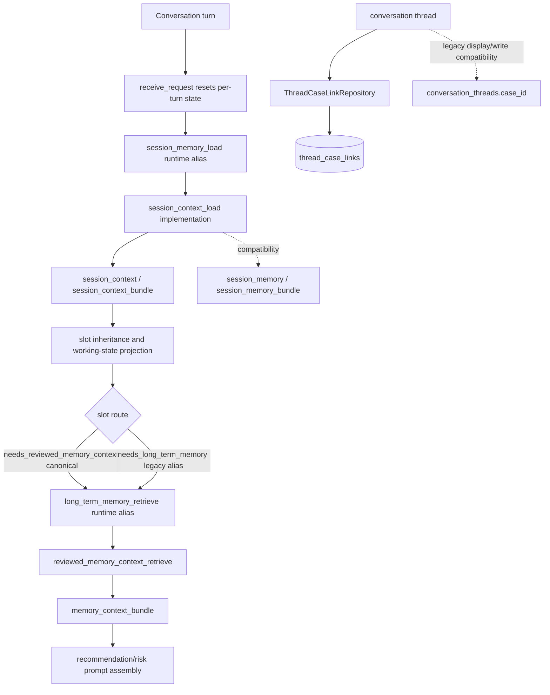

# Phase 48.1: Memory Context Compatibility Debt Cleanup - Research

**Researched:** 2026-07-04 [VERIFIED: environment_context]
**Domain:** MOCA backend memory compatibility cleanup across thread-case links, session context readers, and reviewed-memory routing hints. [VERIFIED: .planning/ROADMAP.md] [VERIFIED: .planning/ARCHITECTURE-DEBT.md]
**Confidence:** HIGH for source locations and test infrastructure; MEDIUM for runtime production data because this research inspected source and local connectivity, not production rows. [VERIFIED: source grep/read audit] [ASSUMED]

<user_constraints>
## User Constraints

### Phase-Specific Context

- No `48.1-CONTEXT.md` exists in `.planning/phases/48.1-memory-context-compatibility-debt-cleanup`; constraints below come from the user prompt, Phase 48.1 roadmap entry, and `.planning/ARCHITECTURE-DEBT.md`. [VERIFIED: phase directory audit] [VERIFIED: .planning/ROADMAP.md] [VERIFIED: .planning/ARCHITECTURE-DEBT.md]

### Locked Must-Do Scope

- Active thread-case relationship readers must move from `conversation_threads.case_id` to `thread_case_links` / `ThreadCaseLinkRepository`. [VERIFIED: user prompt] [VERIFIED: .planning/ROADMAP.md] [VERIFIED: .planning/ARCHITECTURE-DEBT.md]
- `conversation_threads.case_id` must remain only legacy storage/write compatibility or historical display in this phase. [VERIFIED: user prompt] [VERIFIED: .planning/ROADMAP.md]
- Agent routing, working-state projection, and prompt/session context helpers must read `session_context` / `session_context_bundle` as canonical. [VERIFIED: user prompt] [VERIFIED: .planning/ROADMAP.md]
- `session_memory` / `session_memory_bundle` must remain only compatibility projection for old traces/tests. [VERIFIED: user prompt] [VERIFIED: .planning/ROADMAP.md]
- Introduce canonical reviewed-memory routing hint `needs_reviewed_memory_context`. [VERIFIED: user prompt] [VERIFIED: .planning/ARCHITECTURE-DEBT.md]
- Keep `needs_long_term_memory` as a backward-compatible alias only. [VERIFIED: user prompt] [VERIFIED: .planning/ROADMAP.md]
- Record remaining deferred compatibility names in `.planning/ARCHITECTURE-DEBT.md` with explicit status. [VERIFIED: .planning/ROADMAP.md] [VERIFIED: ./AGENTS.md]

### Explicit Non-Goals

- Do not rename/drop memory tables, including `session_memories`, `long_term_memories`, `case_memories`, or `case_working_contexts`. [VERIFIED: user prompt] [VERIFIED: .planning/ROADMAP.md]
- Do not rename/drop `conversation_threads.case_id` or public memory API routes. [VERIFIED: user prompt] [VERIFIED: .planning/ROADMAP.md]
- Do not rename graph trace node names such as `session_memory_load` or `long_term_memory_retrieve`. [VERIFIED: user prompt] [VERIFIED: .planning/ARCHITECTURE-DEBT.md]
- Do not rename `long_term_fact` storage identity, `session_memory_enabled` config names, or the debug-only legacy precedent service in this phase. [VERIFIED: user prompt] [VERIFIED: .planning/ARCHITECTURE-DEBT.md]

### Project Rules

- MOCA tests must use `UV_CACHE_DIR=/tmp/uv-cache uv run pytest ...` or `.venv/bin/pytest ...`; bare `pytest` and bare `python -m pytest` are invalid verification. [VERIFIED: ./AGENTS.md]
- Memory subsystem fixes or discovered memory debt must update `.planning/ARCHITECTURE-DEBT.md`. [VERIFIED: ./AGENTS.md] [VERIFIED: ./CLAUDE.md]
- Phase-level planning must split multiple ownership domains, waves, or verification gates into multiple numbered plans. [VERIFIED: ./AGENTS.md]
- `docs/contract-spec.md` is the normative contract source, but implementation facts must still be verified against code. [VERIFIED: ./AGENTS.md] [VERIFIED: ./CLAUDE.md]
</user_constraints>

<phase_requirements>
## Phase Requirements

| ID | Description | Research Support |
|----|-------------|------------------|
| MEM-COMPAT-01 | Phase 48.1 must migrate active memory-context compatibility readers to canonical surfaces while retaining old names as aliases and deferred compatibility debt. [VERIFIED: .planning/ROADMAP.md] | Current source has active `thread.case_id`, `session_memory`, `session_memory_bundle`, and `needs_long_term_memory` readers, while canonical surfaces already exist as `ThreadCaseLinkRepository`, `session_context`, `session_context_bundle`, and reviewed-memory context retrieval. [VERIFIED: src/conversation/repository.py] [VERIFIED: src/memory/thread_case_links.py] [VERIFIED: src/agent/routing.py] [VERIFIED: src/agent/working_state.py] [VERIFIED: src/agent/context/session_memory_bundle.py] [VERIFIED: src/agent/nodes/reviewed_memory_context_retrieve.py] |
| MEM-COMPAT-01 traceability registration | `MEM-COMPAT-01` is now registered in `.planning/REQUIREMENTS.md` and referenced by `.planning/ROADMAP.md` / `.planning/STATE.md`. [VERIFIED: .planning/REQUIREMENTS.md] [VERIFIED: .planning/ROADMAP.md] [VERIFIED: .planning/STATE.md] | Resolved during planning; no runtime scope was added beyond the roadmap success criteria. [VERIFIED: .planning/REQUIREMENTS.md] [VERIFIED: .planning/phases/48.1-memory-context-compatibility-debt-cleanup/48.1-01-PLAN.md] |
</phase_requirements>

## Summary

Phase 48.1 should be planned as a compatibility cleanup, not a destructive memory migration. [VERIFIED: .planning/ROADMAP.md] The canonical storage/service surfaces already exist: `thread_case_links` is modeled as a many-to-many table and `ThreadCaseLinkRepository` exposes active reads in both directions, while `session_context` / `session_context_bundle` are already emitted by `session_context_load`. [VERIFIED: src/db/models.py] [VERIFIED: src/memory/thread_case_links.py] [VERIFIED: src/agent/nodes/session_context_load.py]

The current active debt is narrow and source-confirmed. `ConversationRepository.insert_thread_summary()` still copies `thread.case_id` into `ConversationSummary.case_id`; routing and working-state helpers still read `state["session_memory"]`; the prompt helper still prioritizes `session_memory_bundle`; and reviewed-memory routing still keys off `needs_long_term_memory`. [VERIFIED: src/conversation/repository.py] [VERIFIED: src/agent/routing.py] [VERIFIED: src/agent/working_state.py] [VERIFIED: src/agent/context/session_memory_bundle.py] [VERIFIED: src/agent/nodes/reviewed_memory_context_retrieve.py]

**Primary recommendation:** split Phase 48.1 into four plans: canonical thread-case reads, canonical session-context active readers, reviewed-memory hint aliasing, and static/final guardrails with `.planning/ARCHITECTURE-DEBT.md` update. [VERIFIED: ./AGENTS.md] [VERIFIED: .planning/ARCHITECTURE-DEBT.md] [VERIFIED: source audit]

## Architectural Responsibility Map

| Capability | Primary Tier | Secondary Tier | Rationale |
|------------|--------------|----------------|-----------|
| Thread-case relationship reads | API / Backend | Database / Storage | Backend repository code should read active thread-case relationships through `ThreadCaseLinkRepository`, while PostgreSQL stores `thread_case_links`. [VERIFIED: src/memory/thread_case_links.py] [VERIFIED: src/db/models.py] |
| Legacy thread case display | API / Backend | Database / Storage | `conversation_threads.case_id` and `summaries.case_id` remain persisted legacy string fields, but Phase 48.1 should not treat them as canonical active relationship sources. [VERIFIED: src/db/models.py] [VERIFIED: .planning/ROADMAP.md] |
| Session context slot continuity | API / Backend | Agent graph state | `session_context_load` already emits `session_context`, `session_context_bundle`, and legacy `session_memory` compatibility output; active readers should prefer the target fields. [VERIFIED: src/agent/nodes/session_context_load.py] [VERIFIED: src/agent/state.py] |
| Working-state projection | API / Backend | Agent prompt assembly | `project_working_state()` currently pulls open questions and business refs from `session_memory`; it should use canonical session context first and legacy state only as alias fallback. [VERIFIED: src/agent/working_state.py] |
| Prompt/session context helper | API / Backend | Agent prompt assembly | `load_session_memory_bundle_for_state()` currently validates `session_memory_bundle` from state before service fallback; it should prefer `session_context_bundle`. [VERIFIED: src/agent/context/session_memory_bundle.py] |
| Reviewed-memory routing | API / Backend | Agent graph state | `route_after_slots()` and `_uses_legacy_actor_merchant_scope()` currently inspect `needs_long_term_memory`; canonical semantics are reviewed memory context. [VERIFIED: src/agent/routing.py] [VERIFIED: src/agent/nodes/reviewed_memory_context_retrieve.py] |
| Graph trace compatibility | API / Backend | Trace/replay/eval | Runtime graph still registers `session_memory_load` and `long_term_memory_retrieve`, and graph vocabulary maps them to canonical targets as compatibility aliases. [VERIFIED: src/agent/graph.py] [VERIFIED: src/agent/graph_vocabulary.py] [VERIFIED: docs/contract-spec.md] |
| Static guardrails | Test / Validation | Docs | Existing Phase 46 and Phase 48 static tests show the repo pattern for locking memory semantic boundaries and approved pytest entrypoints. [VERIFIED: tests/memory/test_phase46_session_context_alignment.py] [VERIFIED: tests/memory/test_phase48_long_term_preference_alignment.py] |

## Project Constraints (from CLAUDE.md)

| Directive | Planning Impact |
|-----------|-----------------|
| Local validation failures must be appended to `.planning/LOCAL-VALIDATION-ISSUES.md` after handling. [VERIFIED: ./CLAUDE.md] [VERIFIED: ./AGENTS.md] | Any Phase 48.1 failing local debug or test incident must be recorded before completion. [VERIFIED: ./CLAUDE.md] |
| Memory subsystem debt fixes must update `.planning/ARCHITECTURE-DEBT.md`. [VERIFIED: ./CLAUDE.md] [VERIFIED: ./AGENTS.md] | Final plan should update the Phase 48.1 section from planned debt to fixed/deferred status. [VERIFIED: .planning/ARCHITECTURE-DEBT.md] |
| Bare pytest commands are invalid in MOCA. [VERIFIED: ./AGENTS.md] | Every acceptance command should use `UV_CACHE_DIR=/tmp/uv-cache uv run pytest ...`. [VERIFIED: ./AGENTS.md] |
| Multi-boundary phases must be split into bounded plans. [VERIFIED: ./AGENTS.md] | One large `48.1-01-PLAN.md` would violate the project planning rule because this phase spans repositories, graph routing, prompt helpers, static guards, and final validation. [VERIFIED: ./AGENTS.md] [VERIFIED: source audit] |

## Standard Stack

No new runtime library is recommended for Phase 48.1; use the existing Python backend, SQLAlchemy/Pydantic memory DTOs, pytest static/behavior tests, and Ruff. [VERIFIED: pyproject.toml] [VERIFIED: source audit]

### Core

| Library / Tool | Version | Purpose | Why Standard |
|----------------|---------|---------|--------------|
| Python | 3.12.13 local via uv | Backend runtime and test execution. | `pyproject.toml` requires Python `>=3.12`, and the approved local runner resolves Python 3.12.13. [VERIFIED: pyproject.toml] [VERIFIED: `uv run python --version`] |
| Pydantic | 2.13.4 | DTO validation for session context, reviewed memory context, and memory schemas. | Session and memory context DTOs are Pydantic models. [VERIFIED: `uv run python importlib.metadata`] [VERIFIED: src/memory/schemas.py] [VERIFIED: src/memory/context_refs.py] |
| SQLAlchemy | 2.0.49 | ORM model and repository layer. | `ConversationThread`, `ThreadCaseLink`, and `ConversationSummary` are SQLAlchemy ORM models. [VERIFIED: `uv run python importlib.metadata`] [VERIFIED: src/db/models.py] |
| asyncpg | 0.31.0 | Async PostgreSQL driver for DB-backed tests. | Test DB helpers connect through asyncpg and local PostgreSQL connectivity succeeded. [VERIFIED: tests/conftest.py] [VERIFIED: asyncpg connectivity probe] |
| Alembic | 1.18.4 | Migration inspection. | Current schema head includes `021_thread_case_links` and `022_case_working_context`; Phase 48.1 should not add a destructive migration. [VERIFIED: `uv run alembic --version`] [VERIFIED: src/db/migrations/versions] [VERIFIED: .planning/ROADMAP.md] |
| pytest | 9.0.3 | Automated tests and static guardrails. | Existing memory alignment tests are pytest files and the project mandates uv pytest entrypoints. [VERIFIED: `uv run pytest --version`] [VERIFIED: tests/memory/test_phase46_session_context_alignment.py] [VERIFIED: ./AGENTS.md] |
| pytest-asyncio | 1.3.0 | Async tests. | DB-backed repository tests use async pytest fixtures. [VERIFIED: `uv run python importlib.metadata`] [VERIFIED: tests/conftest.py] |
| Ruff | 0.15.12 | Python linting. | Project config sets Ruff line length and Python target. [VERIFIED: `uv run ruff --version`] [VERIFIED: pyproject.toml] |

### Supporting

| Library / Tool | Version | Purpose | When to Use |
|----------------|---------|---------|-------------|
| LangGraph | 1.1.10 | Runtime graph registration and alias preservation. | Use only for graph-edge/alias tests; do not rename runtime node names in this phase. [VERIFIED: `uv run python importlib.metadata`] [VERIFIED: src/agent/graph.py] [VERIFIED: .planning/ARCHITECTURE-DEBT.md] |
| PostgreSQL | 16.13 local reachable | DB-backed repository tests. | Required for tests using `tests/conftest.py` DB fixtures or `tests/memory/test_thread_case_links.py`. [VERIFIED: asyncpg connectivity probe] [VERIFIED: tests/conftest.py] |
| uv | 0.11.2 | Approved environment runner. | Use for pytest, Ruff, Alembic, and Python probes. [VERIFIED: `uv --version`] [VERIFIED: ./AGENTS.md] |

### Alternatives Considered

| Instead of | Could Use | Tradeoff |
|------------|-----------|----------|
| `ThreadCaseLinkRepository` | Direct SQL against `thread_case_links` | Direct SQL would bypass existing tenant/case validation, active-row filtering, and dedupe logic. [VERIFIED: src/memory/thread_case_links.py] |
| Canonical helper with alias fallback | Global string replace from `session_memory` to `session_context` | A blind rename would break compatibility outputs, tests, trace names, and config names that are explicitly retained. [VERIFIED: src/agent/nodes/session_context_load.py] [VERIFIED: tests/agent/test_session_memory_load.py] [VERIFIED: .planning/ARCHITECTURE-DEBT.md] |
| `needs_reviewed_memory_context` plus alias | Hard removal of `needs_long_term_memory` | Hard removal would break existing graph tests and old traces using the legacy hint. [VERIFIED: tests/agent/test_graph.py] [VERIFIED: tests/agent/test_intent_routing.py] [VERIFIED: .planning/ROADMAP.md] |
| Static pytest guards | New static-analysis tool | Existing Phase 46/48 pytest source scanners already enforce memory red lines and approved pytest entrypoints. [VERIFIED: tests/memory/test_phase46_session_context_alignment.py] [VERIFIED: tests/memory/test_phase48_long_term_preference_alignment.py] |

**Installation:** No new install command is required for Phase 48.1. [VERIFIED: pyproject.toml] [VERIFIED: .planning/ROADMAP.md]

**Version verification:** Versions above were verified with `uv --version`, `uv run python --version`, `uv run pytest --version`, `uv run ruff --version`, `uv run alembic --version`, and `uv run python -c "import importlib.metadata..."`. [VERIFIED: local environment probes]

## Architecture Patterns

### System Architecture Diagram



Diagram claim: canonical active reads should flow through `session_context` / `session_context_bundle`, reviewed memory context, and `ThreadCaseLinkRepository`, while old state names and graph nodes remain compatibility aliases. [VERIFIED: src/agent/nodes/session_context_load.py] [VERIFIED: src/agent/nodes/long_term_memory_retrieve.py] [VERIFIED: src/agent/routing.py] [VERIFIED: src/memory/thread_case_links.py] [VERIFIED: .planning/ROADMAP.md]

### Recommended Project Structure

```text
src/
├── conversation/
│   └── repository.py                 # Stop canonical active summary relationship reads from thread.case_id.
├── memory/
│   └── thread_case_links.py          # Use existing many-to-many repository.
├── agent/
│   ├── routing.py                    # Session-context reader helper and reviewed-memory hint alias.
│   ├── working_state.py              # Canonical session_context projection.
│   ├── context/session_memory_bundle.py # Prefer session_context_bundle, legacy fallback only.
│   └── nodes/reviewed_memory_context_retrieve.py # Canonical hint helper, legacy alias support.
tests/
├── memory/
│   ├── test_phase48_1_memory_compat_alignment.py # New static guard file.
│   └── test_thread_case_links.py       # Existing DB-backed many-to-many coverage.
├── agent/
│   ├── test_intent_routing.py
│   ├── test_working_state.py
│   ├── test_session_memory_load.py
│   └── test_graph.py
└── conversation/
    └── test_repository.py
```

Structure claim: listed source/test files are existing targets except the recommended new Phase 48.1 static guard file. [VERIFIED: repository file audit] [VERIFIED: tests file audit]

### Recommended Plan Split

| Plan | Goal | Primary Files | Verification Focus |
|------|------|---------------|--------------------|
| `48.1-01` | Migrate active thread-case readers from `conversation_threads.case_id` to `ThreadCaseLinkRepository` while preserving legacy storage/display. [VERIFIED: .planning/ROADMAP.md] | `src/conversation/repository.py`, `src/memory/thread_case_links.py`, `tests/conversation/test_repository.py`, `tests/memory/test_thread_case_links.py`. [VERIFIED: source audit] | Multi-case thread summary behavior, no destructive schema change, existing many-to-many tests. [VERIFIED: tests/memory/test_thread_case_links.py] |
| `48.1-02` | Migrate active session readers in routing, working state, and prompt helper to canonical `session_context` / `session_context_bundle`. [VERIFIED: .planning/ROADMAP.md] | `src/agent/routing.py`, `src/agent/working_state.py`, `src/agent/context/session_memory_bundle.py`, `tests/agent/test_working_state.py`, `tests/agent/test_nodes/test_generate_recommendation.py`, `tests/agent/context/test_assembler.py`. [VERIFIED: source audit] | Canonical fields win; legacy fields still work only as fallback for old traces/tests. [VERIFIED: tests/agent/test_session_memory_load.py] |
| `48.1-03` | Introduce `needs_reviewed_memory_context` and keep `needs_long_term_memory` as alias. [VERIFIED: .planning/ROADMAP.md] | `src/agent/routing.py`, `src/agent/nodes/reviewed_memory_context_retrieve.py`, `tests/agent/test_intent_routing.py`, `tests/agent/test_graph.py`, `tests/agent/test_memory_evidence_boundary.py`. [VERIFIED: source audit] | New hint routes to reviewed memory; old hint still routes; graph node names stay unchanged. [VERIFIED: tests/agent/test_graph.py] |
| `48.1-04` | Add static guardrails, update `.planning/ARCHITECTURE-DEBT.md`, and run the final phase gate. [VERIFIED: ./AGENTS.md] [VERIFIED: .planning/ARCHITECTURE-DEBT.md] | `tests/memory/test_phase48_1_memory_compat_alignment.py`, `.planning/ARCHITECTURE-DEBT.md`, optional docs if contract wording needs alias clarification. [VERIFIED: Phase 46/48 static test precedent] | Red-line guard against destructive renames, active legacy readers, bare pytest commands, graph alias removal, and deferred compatibility loss. [VERIFIED: tests/memory/test_phase46_session_context_alignment.py] [VERIFIED: tests/memory/test_phase48_long_term_preference_alignment.py] |

### Pattern 1: Canonical Reader Helper With Legacy Fallback

**What:** Implement small local helpers that read `session_context` / `session_context_bundle` first and fall back to `session_memory` / `session_memory_bundle` only when canonical fields are missing. [VERIFIED: src/agent/nodes/session_context_load.py] [VERIFIED: src/agent/context/session_memory_bundle.py]

**When to use:** Use this in routing, working-state projection, and prompt helper paths that currently read legacy state directly. [VERIFIED: src/agent/routing.py] [VERIFIED: src/agent/working_state.py] [VERIFIED: src/agent/context/session_memory_bundle.py]

**Example:**
```python
# Source pattern: session_context_load emits canonical and legacy fields together.
# Planner should task implementers to prefer canonical fields, with legacy fallback only.
session_context = state.get("session_context")
legacy_session_memory = state.get("session_memory")
```

### Pattern 2: Compatibility Alias Predicate

**What:** Centralize reviewed-memory hint checks behind a helper that returns true for canonical `needs_reviewed_memory_context` or legacy `needs_long_term_memory`. [VERIFIED: src/agent/routing.py] [VERIFIED: src/agent/nodes/reviewed_memory_context_retrieve.py]

**When to use:** Use in `route_after_slots()` and reviewed-memory helpers so alias behavior is consistent. [VERIFIED: src/agent/routing.py] [VERIFIED: src/agent/nodes/reviewed_memory_context_retrieve.py]

**Example:**
```python
# Source pattern: existing code reads routing_hints dict and routes to long_term_memory_retrieve.
routing_hints = state.get("routing_hints") if isinstance(state.get("routing_hints"), dict) else {}
```

### Anti-Patterns to Avoid

- **Blind string replacement:** It can remove compatibility state/trace/API names that Phase 48.1 explicitly preserves. [VERIFIED: .planning/ROADMAP.md] [VERIFIED: .planning/ARCHITECTURE-DEBT.md]
- **Destructive migration:** The roadmap forbids dropping/renaming the memory tables and `conversation_threads.case_id` in this phase. [VERIFIED: .planning/ROADMAP.md]
- **Graph node rename:** Runtime wrappers `session_memory_load` and `long_term_memory_retrieve` must remain compatibility aliases for trace/replay/eval. [VERIFIED: src/agent/graph.py] [VERIFIED: src/agent/graph_vocabulary.py] [VERIFIED: .planning/ARCHITECTURE-DEBT.md]
- **Treating reviewed memory as long-term-only:** The reviewed-memory boundary includes explicit preference rows, reviewed case memory, and active CWC bundle composition. [VERIFIED: src/agent/nodes/reviewed_memory_context_retrieve.py] [VERIFIED: src/memory/context_service.py] [VERIFIED: src/memory/context_refs.py]

## Don't Hand-Roll

| Problem | Don't Build | Use Instead | Why |
|---------|-------------|-------------|-----|
| Thread-case many-to-many reads | Raw SQL or new repository | `ThreadCaseLinkRepository.list_cases_for_thread(...)` and `.list_threads_for_case(...)` | Existing repository validates tenant/case scope and filters active links. [VERIFIED: src/memory/thread_case_links.py] |
| Session context parsing | Ad hoc dict parsing everywhere | A small canonical reader helper in each touched module or shared local helper if repetition appears | Existing state carries both canonical and legacy shapes, so helper-based precedence reduces drift. [VERIFIED: src/agent/state.py] [VERIFIED: src/agent/nodes/session_context_load.py] |
| Reviewed-memory routing semantics | Separate new graph node | Existing `long_term_memory_retrieve` compatibility wrapper forwarding to `reviewed_memory_context_retrieve` | Runtime graph names are explicitly retained while target semantic mapping already exists. [VERIFIED: src/agent/nodes/long_term_memory_retrieve.py] [VERIFIED: src/agent/graph_vocabulary.py] |
| Static source guardrails | New scanner tool | pytest static tests following Phase 46/48 style | Existing tests already scan source and planning artifacts for memory red lines and approved commands. [VERIFIED: tests/memory/test_phase46_session_context_alignment.py] [VERIFIED: tests/memory/test_phase48_long_term_preference_alignment.py] |

**Key insight:** This phase should remove active legacy reads, not compatibility surfaces. [VERIFIED: .planning/ROADMAP.md] [VERIFIED: .planning/ARCHITECTURE-DEBT.md]

## Runtime State Inventory

| Category | Items Found | Action Required |
|----------|-------------|-----------------|
| Stored data | `conversation_threads.case_id` and `summaries.case_id` are persisted legacy string columns; `thread_case_links` is the canonical many-to-many table; `session_memories`, `long_term_memories`, `case_memories`, and `case_working_contexts` remain storage identities. [VERIFIED: src/db/models.py] [VERIFIED: src/db/migrations/versions/021_thread_case_links.py] [VERIFIED: src/db/migrations/versions/022_case_working_context.py] | Code-reader migration only; no destructive data migration recommended for Phase 48.1. [VERIFIED: .planning/ROADMAP.md] |
| Live service config | `session_memory_enabled`, TTL, summary max chars, and write timeout settings exist in `src/config.py`; `.env*`/Docker/GitHub config scan found no exact additional `session_memory_*` env files in checked paths. [VERIFIED: src/config.py] [VERIFIED: rg over .env* docker-compose.yml .github pyproject.toml src/config.py] | Keep config names unchanged in this phase. [VERIFIED: .planning/ARCHITECTURE-DEBT.md] |
| OS-registered state | No OS-level registrations were inspected for this research. [ASSUMED] | No OS action should be planned unless implementation discovers a service manager/process registration that embeds a renamed string. [ASSUMED] |
| Secrets/env vars | `dashscope_api_key` and other settings exist in `src/config.py`, but Phase 48.1 does not require secret key renames; checked env/config paths did not show extra exact session-memory config files. [VERIFIED: src/config.py] [VERIFIED: rg over .env* docker-compose.yml .github pyproject.toml src/config.py] | No secret/env rename; preserve `session_memory_*` env compatibility names. [VERIFIED: .planning/ARCHITECTURE-DEBT.md] |
| Build artifacts | `__pycache__` files exist under tests from prior runs; no package rename is part of Phase 48.1. [VERIFIED: find tests output] [VERIFIED: .planning/ROADMAP.md] | No build artifact migration; ignore caches unless a test/lint step requires cleanup. [VERIFIED: .planning/ROADMAP.md] |

## Common Pitfalls

### Pitfall 1: Deleting Compatibility Outputs Instead Of Migrating Active Reads
**What goes wrong:** Removing `session_memory`, `session_memory_bundle`, `session_memory_load`, or `long_term_memory_retrieve` would violate explicit Phase 48.1 non-goals. [VERIFIED: .planning/ROADMAP.md] [VERIFIED: .planning/ARCHITECTURE-DEBT.md]
**Why it happens:** The names look stale, but they are still compatibility surfaces for old traces/tests/config. [VERIFIED: src/agent/nodes/session_context_load.py] [VERIFIED: src/agent/graph_vocabulary.py]
**How to avoid:** Prefer canonical reads while preserving alias output and wrapper nodes. [VERIFIED: source audit]
**Warning signs:** A plan proposes deleting `src/agent/nodes/session_memory_load.py`, `src/agent/nodes/long_term_memory_retrieve.py`, `session_memory_enabled`, or public memory API paths. [VERIFIED: .planning/ARCHITECTURE-DEBT.md]

### Pitfall 2: Reading `conversation_threads.case_id` For Current Relationship Logic
**What goes wrong:** Multi-case threads lose relationships because the legacy column can represent only one string case value. [VERIFIED: .planning/ARCHITECTURE-DEBT.md]
**Why it happens:** `ConversationRepository.insert_thread_summary()` still copies `thread.case_id` into `ConversationSummary.case_id`. [VERIFIED: src/conversation/repository.py]
**How to avoid:** Use `ThreadCaseLinkRepository` for active thread-case relationships and treat summary `case_id` as historical/legacy metadata. [VERIFIED: src/memory/thread_case_links.py] [VERIFIED: .planning/ROADMAP.md]
**Warning signs:** New code reads `ConversationThread.case_id` for active case lookup after Phase 48.1. [VERIFIED: source audit]

### Pitfall 3: Only Updating Tests To The New Hint
**What goes wrong:** `needs_reviewed_memory_context` appears in tests, but runtime still routes only on `needs_long_term_memory`. [VERIFIED: src/agent/routing.py] [VERIFIED: src/agent/nodes/reviewed_memory_context_retrieve.py]
**Why it happens:** Existing tests currently assert the old hint path. [VERIFIED: tests/agent/test_intent_routing.py] [VERIFIED: tests/agent/test_graph.py]
**How to avoid:** Add dual tests: canonical hint works, legacy alias still works. [VERIFIED: .planning/ROADMAP.md]
**Warning signs:** `rg "needs_long_term_memory" src/agent` still finds active-only checks without canonical helper support. [VERIFIED: source audit]

### Pitfall 4: Broad Static Greps Against Historical Migrations
**What goes wrong:** Static guards falsely fail on old Alembic downgrade code that legitimately drops historical tables. [VERIFIED: src/db/migrations/versions/007_session_memories.py] [VERIFIED: src/db/migrations/versions/021_thread_case_links.py]
**Why it happens:** Prior phase static tests already had to scope destructive-pattern scans to current phase plans/new migrations. [VERIFIED: tests/memory/test_phase46_session_context_alignment.py] [VERIFIED: tests/memory/test_phase48_long_term_preference_alignment.py]
**How to avoid:** Scan protected live model/table declarations and Phase 48.1 artifacts, not every historical downgrade. [VERIFIED: Phase 46/48 static test precedent]
**Warning signs:** A new guard fails before implementation because it matches `def downgrade()` in old migration files. [VERIFIED: src/db/migrations/versions]

## Code Examples

Verified patterns from current source:

### Existing Thread-Case Repository Read Pattern

```python
# Source: src/memory/thread_case_links.py
async def list_cases_for_thread(self, *, tenant_id, conversation_thread_id) -> list[uuid.UUID]:
    ...
```

Use this repository for active thread-to-case relationship reads rather than `ConversationThread.case_id`. [VERIFIED: src/memory/thread_case_links.py] [VERIFIED: src/conversation/repository.py]

### Existing Session Context Compatibility Projection

```python
# Source: src/agent/nodes/session_context_load.py
return {
    "session_context": session_context,
    "session_context_bundle": ...,
    "session_memory": session_memory,
}
```

Preserve this output shape while migrating active readers to the canonical fields first. [VERIFIED: src/agent/nodes/session_context_load.py] [VERIFIED: .planning/ROADMAP.md]

### Existing Graph Alias Wrapper

```python
# Source: src/agent/nodes/long_term_memory_retrieve.py
result = await reviewed_memory_context_retrieve(state, config, ...)
```

Keep the wrapper name for runtime/trace compatibility while moving routing semantics to reviewed-memory naming. [VERIFIED: src/agent/nodes/long_term_memory_retrieve.py] [VERIFIED: src/agent/graph_vocabulary.py]

## State of the Art

| Old Approach | Current Approach | When Changed | Impact |
|--------------|------------------|--------------|--------|
| `conversation_threads.case_id` as a single case association | `thread_case_links` many-to-many relationship | Phase 44 | Active readers should use repository-backed links; legacy column remains compatibility storage. [VERIFIED: .planning/STATE.md] [VERIFIED: src/db/migrations/versions/021_thread_case_links.py] |
| Session memory as broad same-thread memory surface | `session_context` as contextual-only target projection with legacy `session_memory` alias | Phase 46 | Active readers should prefer `session_context`; legacy fields remain old trace/test projection. [VERIFIED: .planning/phases/46-session-context-repositioning/46-RESEARCH.md] [VERIFIED: src/agent/nodes/session_context_load.py] |
| `case_memories` as ambiguous precedent/current-state idea | Reviewed case precedent with CWC as active state | Phase 47 | Reviewed-memory context should not be described as long-term-only. [VERIFIED: .planning/phases/47-case-precedent-repositioning-and-closed-case-candidate-gener/47-RESEARCH.md] [VERIFIED: src/memory/context_service.py] |
| Broad long-term memory | Explicit preference-only published long-term memory | Phase 48 | `needs_long_term_memory` is now misleading as the routing hint name. [VERIFIED: .planning/phases/48-narrow-long-term-explicit-preference-memory/48-RESEARCH.md] [VERIFIED: .planning/ARCHITECTURE-DEBT.md] |

**Deprecated/outdated:** Active reads of `state["session_memory"]`, `state["session_memory_bundle"]`, `ConversationThread.case_id`, and `routing_hints["needs_long_term_memory"]` are the cleanup targets; stored fields, wrappers, config names, API route names, and storage identities are not removal targets in Phase 48.1. [VERIFIED: source audit] [VERIFIED: .planning/ROADMAP.md] [VERIFIED: .planning/ARCHITECTURE-DEBT.md]

## Assumptions Log

| # | Claim | Section | Risk if Wrong |
|---|-------|---------|---------------|
| A1 | Production runtime data was not inspected; source and local environment probes are sufficient for planning a no-destructive-migration compatibility cleanup. | Metadata / Runtime State Inventory | If production has workflows depending on active legacy fields beyond source-visible paths, implementation may need an additional rollout/audit task. |
| A2 | No OS-level registrations embed renamed memory strings. | Runtime State Inventory | If process managers or scheduled jobs reference old names, future cleanup phases may need an operations task. |
| A3 | `MEM-COMPAT-01` was added to `.planning/REQUIREMENTS.md` during planning to keep the inserted decimal phase traceable. | Phase Requirements | Resolved; no remaining planning risk. |

## Open Questions (RESOLVED)

1. **RESOLVED — `MEM-COMPAT-01` is registered in `.planning/REQUIREMENTS.md`.** [VERIFIED: .planning/REQUIREMENTS.md]
   - Decision: The inserted decimal phase now has central requirement traceability via `MEM-COMPAT-01`; this did not broaden runtime scope. [VERIFIED: .planning/REQUIREMENTS.md] [VERIFIED: .planning/ROADMAP.md]
   - Plan impact: All four Phase 48.1 plans carry `requirements: [MEM-COMPAT-01]`. [VERIFIED: .planning/phases/48.1-memory-context-compatibility-debt-cleanup/48.1-01-PLAN.md] [VERIFIED: .planning/phases/48.1-memory-context-compatibility-debt-cleanup/48.1-02-PLAN.md] [VERIFIED: .planning/phases/48.1-memory-context-compatibility-debt-cleanup/48.1-03-PLAN.md] [VERIFIED: .planning/phases/48.1-memory-context-compatibility-debt-cleanup/48.1-04-PLAN.md]

2. **RESOLVED — `ConversationSummary.case_id` remains legacy/historical metadata, populated only from unambiguous canonical links.** [VERIFIED: .planning/phases/48.1-memory-context-compatibility-debt-cleanup/48.1-01-PLAN.md]
   - Decision: Do not add schema columns and do not copy from `ConversationThread.case_id` as current relationship truth. `insert_thread_summary(...)` should use `ThreadCaseLinkRepository.list_cases_for_thread(...)`; exactly one active canonical link may populate the legacy summary metadata field, while zero or multiple links should write `None`. [VERIFIED: .planning/phases/48.1-memory-context-compatibility-debt-cleanup/48.1-01-PLAN.md]
   - Compatibility boundary: `ConversationRepository.get_or_create_thread(..., case_id=...)` remains a legacy metadata compatibility input and is not removed in Phase 48.1. [VERIFIED: .planning/phases/48.1-memory-context-compatibility-debt-cleanup/48.1-01-PLAN.md]

## Environment Availability

| Dependency | Required By | Available | Version | Fallback |
|------------|-------------|-----------|---------|----------|
| uv | Approved command runner | yes | 0.11.2 | none needed. [VERIFIED: `uv --version`] |
| Python | Runtime/tests | yes | 3.12.13 via uv | none needed. [VERIFIED: `uv run python --version`] |
| pytest | Tests/static guards | yes | 9.0.3 | none; use approved uv entrypoint. [VERIFIED: `uv run pytest --version`] [VERIFIED: ./AGENTS.md] |
| Ruff | Linting touched Python files | yes | 0.15.12 | none; use `uv run ruff`. [VERIFIED: `uv run ruff --version`] |
| Alembic | Migration head/no-migration checks | yes | 1.18.4 | none; use `uv run alembic`. [VERIFIED: `uv run alembic --version`] |
| PostgreSQL | DB-backed thread-case tests | yes locally reachable | 16.13 | Existing tests use DB fixture helpers; if unavailable, DB-backed tests may skip or fail according to fixture behavior. [VERIFIED: asyncpg connectivity probe] [VERIFIED: tests/conftest.py] |
| `pg_isready` CLI | Optional DB status probe | no | command missing | Use asyncpg connectivity probe or existing pytest DB fixtures. [VERIFIED: `pg_isready` probe] |

**Missing dependencies with no fallback:** None found for planning research. [VERIFIED: environment probes]

**Missing dependencies with fallback:** `pg_isready` is missing; asyncpg and pytest DB fixtures are available. [VERIFIED: `pg_isready` probe] [VERIFIED: asyncpg connectivity probe] [VERIFIED: tests/conftest.py]

## Validation Architecture

### Test Framework

| Property | Value |
|----------|-------|
| Framework | pytest 9.0.3 with pytest-asyncio 1.3.0. [VERIFIED: environment probes] |
| Config file | `pyproject.toml` with `asyncio_mode = "auto"`. [VERIFIED: pyproject.toml] |
| Quick run command | `UV_CACHE_DIR=/tmp/uv-cache uv run pytest tests/memory/test_phase48_1_memory_compat_alignment.py -x -q` [VERIFIED: ./AGENTS.md] |
| Full suite command | `UV_CACHE_DIR=/tmp/uv-cache uv run pytest tests/memory/test_phase48_1_memory_compat_alignment.py tests/memory/test_thread_case_links.py tests/conversation/test_repository.py tests/agent/test_intent_routing.py tests/agent/test_working_state.py tests/agent/test_session_memory_load.py tests/agent/test_nodes/test_generate_recommendation.py tests/agent/context/test_assembler.py tests/agent/test_graph.py tests/agent/test_memory_evidence_boundary.py tests/agent/test_reviewed_memory_context_retrieve.py tests/memory/test_phase46_session_context_alignment.py tests/memory/test_phase48_long_term_preference_alignment.py -q` [VERIFIED: existing test files] [VERIFIED: ./AGENTS.md] |

### Phase Requirements -> Test Map

| Req ID | Behavior | Test Type | Automated Command | File Exists? |
|--------|----------|-----------|-------------------|--------------|
| MEM-COMPAT-01 | Active thread-case relationship readers use `thread_case_links` / `ThreadCaseLinkRepository`, not `ConversationThread.case_id`. [VERIFIED: .planning/ROADMAP.md] | unit/integration + static | `UV_CACHE_DIR=/tmp/uv-cache uv run pytest tests/memory/test_phase48_1_memory_compat_alignment.py tests/memory/test_thread_case_links.py tests/conversation/test_repository.py -x -q` | static file missing Wave 0; other files exist. [VERIFIED: file audit] |
| MEM-COMPAT-01 | Routing, working-state projection, and prompt helper prefer `session_context` / `session_context_bundle`; legacy fields remain fallback only. [VERIFIED: .planning/ROADMAP.md] | unit + static | `UV_CACHE_DIR=/tmp/uv-cache uv run pytest tests/memory/test_phase48_1_memory_compat_alignment.py tests/agent/test_intent_routing.py tests/agent/test_working_state.py tests/agent/test_nodes/test_generate_recommendation.py tests/agent/context/test_assembler.py -x -q` | static file missing Wave 0; other files exist. [VERIFIED: file audit] |
| MEM-COMPAT-01 | `needs_reviewed_memory_context` routes to reviewed memory context; `needs_long_term_memory` remains alias. [VERIFIED: .planning/ROADMAP.md] | unit/graph | `UV_CACHE_DIR=/tmp/uv-cache uv run pytest tests/agent/test_intent_routing.py tests/agent/test_graph.py tests/agent/test_memory_evidence_boundary.py tests/agent/test_reviewed_memory_context_retrieve.py -x -q` | yes. [VERIFIED: file audit] |
| MEM-COMPAT-01 | Deferred compatibility names remain recorded and not destructively removed. [VERIFIED: .planning/ROADMAP.md] [VERIFIED: .planning/ARCHITECTURE-DEBT.md] | static/docs | `UV_CACHE_DIR=/tmp/uv-cache uv run pytest tests/memory/test_phase48_1_memory_compat_alignment.py -x -q` | missing Wave 0. [VERIFIED: file audit] |

### Sampling Rate

- **Per task commit:** Run the focused command for the touched seam plus Ruff on changed Python files. [VERIFIED: Phase 46/48 validation precedent] [VERIFIED: ./AGENTS.md]
- **Per wave merge:** Run the related plan command listed above. [VERIFIED: Phase 46/48 validation precedent]
- **Phase gate:** Run the full suite command above and a focused Ruff command for touched Python/test files. [VERIFIED: ./AGENTS.md] [VERIFIED: source audit]

### Wave 0 Gaps

- [ ] `tests/memory/test_phase48_1_memory_compat_alignment.py` - static guard for active legacy readers, no destructive table/API/config/graph rename, canonical hint aliasing, and approved pytest commands. [VERIFIED: file audit]
- [ ] Add or update tests in `tests/agent/test_working_state.py` proving canonical `session_context` wins over legacy `session_memory`. [VERIFIED: tests/agent/test_working_state.py] [VERIFIED: src/agent/working_state.py]
- [ ] Add or update tests in `tests/agent/test_intent_routing.py` proving `needs_reviewed_memory_context` is canonical and `needs_long_term_memory` aliases. [VERIFIED: tests/agent/test_intent_routing.py] [VERIFIED: src/agent/routing.py]
- [ ] Add or update tests in `tests/agent/context/test_assembler.py` or `tests/agent/test_nodes/test_generate_recommendation.py` proving `session_context_bundle` is preferred over `session_memory_bundle`. [VERIFIED: tests/agent/context/test_assembler.py] [VERIFIED: tests/agent/test_nodes/test_generate_recommendation.py]

## Security Domain

### Applicable ASVS Categories

| ASVS Category | Applies | Standard Control |
|---------------|---------|------------------|
| V2 Authentication | no direct auth change | Preserve existing trusted context/auth surfaces; Phase 48.1 does not add endpoints. [VERIFIED: .planning/ROADMAP.md] |
| V3 Session Management | yes, semantic session context only | Keep `session_context` contextual-only and same-thread; preserve Phase 46 boundary tests. [VERIFIED: tests/memory/test_phase46_session_context_alignment.py] |
| V4 Access Control | yes | Use existing tenant-scoped repositories and trusted context; do not bypass `ThreadCaseLinkRepository` validation. [VERIFIED: src/memory/thread_case_links.py] |
| V5 Input Validation | yes | Use Pydantic DTOs for `SessionContextMemory`, `SessionContextBundle`, and reviewed memory context status refs. [VERIFIED: src/memory/schemas.py] [VERIFIED: src/memory/context_refs.py] |
| V6 Cryptography | no new crypto | No cryptographic primitive changes are in Phase 48.1 scope. [VERIFIED: .planning/ROADMAP.md] |

### Known Threat Patterns for MOCA Memory Compatibility

| Pattern | STRIDE | Standard Mitigation |
|---------|--------|---------------------|
| Cross-tenant/cross-case relationship leakage from ad hoc link queries | Information Disclosure / Elevation of Privilege | Use `ThreadCaseLinkRepository`, which validates tenant-owned thread, case, and run identity. [VERIFIED: src/memory/thread_case_links.py] |
| Legacy session hints promoted to authority | Elevation of Privilege / Tampering | Preserve Phase 46 tests that prevent session context from becoming policy evidence, business fact authority, approval/action authority, or replay truth. [VERIFIED: tests/memory/test_phase46_session_context_alignment.py] [VERIFIED: tests/agent/test_memory_evidence_boundary.py] |
| Misrouting reviewed memory as broad long-term fact memory | Tampering / Information Disclosure | Canonical hint should be `needs_reviewed_memory_context`; repository/service filters from Phase 48 keep long-term retrieval preference/source filtered. [VERIFIED: .planning/ARCHITECTURE-DEBT.md] [VERIFIED: tests/memory/test_phase48_long_term_preference_alignment.py] |

## Sources

### Primary (HIGH confidence)

- `.planning/ROADMAP.md` - Phase 48.1 goal, success criteria, non-goals, and requirement ID. [VERIFIED: local read]
- `.planning/STATE.md` - current phase position and Phase 48.1 inserted status. [VERIFIED: local read]
- `.planning/ARCHITECTURE-DEBT.md` - source-confirmed Phase 48.1 debt, evidence, planned scope, and defers. [VERIFIED: local read]
- `./AGENTS.md` and `./CLAUDE.md` - MOCA testing, debt-ledger, and plan-granularity rules. [VERIFIED: local read]
- `src/conversation/repository.py`, `src/memory/thread_case_links.py`, `src/agent/routing.py`, `src/agent/working_state.py`, `src/agent/context/session_memory_bundle.py`, `src/agent/nodes/session_context_load.py`, `src/agent/nodes/reviewed_memory_context_retrieve.py`, `src/agent/nodes/long_term_memory_retrieve.py`, `src/agent/graph.py`, `src/agent/graph_vocabulary.py`, `src/db/models.py` - current source seams. [VERIFIED: local read]
- `tests/memory/test_phase46_session_context_alignment.py`, `tests/memory/test_phase48_long_term_preference_alignment.py`, `tests/memory/test_thread_case_links.py`, `tests/agent/test_intent_routing.py`, `tests/agent/test_working_state.py`, `tests/agent/test_graph.py` - existing validation patterns and test targets. [VERIFIED: local read]

### Secondary (MEDIUM confidence)

- Prior Phase 46/47/48 research and plan/summary artifacts - implementation precedent for boundary locks, reviewed-memory/CWC separation, and explicit preference narrowing. [VERIFIED: local read]
- `docs/contract-spec.md`, `docs/architecture-overview.md`, `docs/memory-contract-delta.md` - current documented compatibility aliases and target memory vocabulary. [VERIFIED: local grep/read]

### Tertiary (LOW confidence)

- Production/runtime live data assumptions - production rows and OS registrations were not inspected in this research. [ASSUMED]

## Metadata

**Confidence breakdown:**
- Standard stack: HIGH - versions were verified through the local uv environment and pyproject. [VERIFIED: environment probes] [VERIFIED: pyproject.toml]
- Architecture: HIGH - target seams were verified in current source and prior phase artifacts. [VERIFIED: source audit] [VERIFIED: prior phase artifact audit]
- Pitfalls: HIGH for source-confirmed risks; MEDIUM for production rollout risks because production runtime data was not inspected. [VERIFIED: .planning/ARCHITECTURE-DEBT.md] [ASSUMED]

**Research date:** 2026-07-04 [VERIFIED: environment_context]
**Valid until:** 2026-08-03 for source planning if Phase 48.1 code is not implemented first. [ASSUMED]
