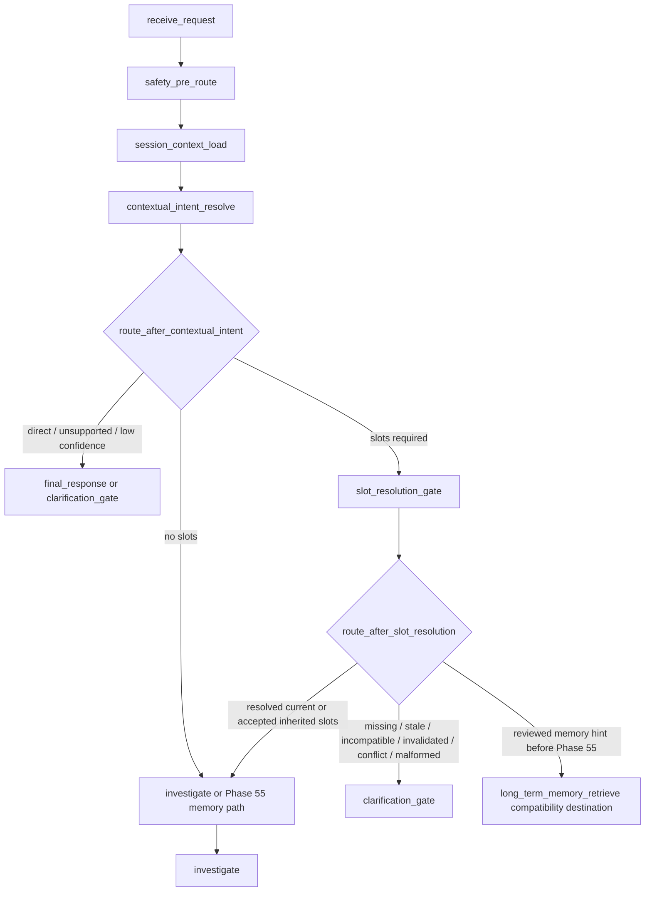

# Phase 54: slot-resolution-gate-cutover - Research

**Researched:** 2026-07-07  
**Domain:** MOCA LangGraph canonical graph migration / required-slot resolution gate  
**Confidence:** HIGH

<user_constraints>
## User Constraints (from CONTEXT.md)

本节逐字复制 Phase 54 CONTEXT 中的 locked decisions、discretion 与 deferred scope；本节所有约束来源同一文件。 [VERIFIED: .planning/phases/54-slot-resolution-gate-cutover/54-CONTEXT.md]

### Locked Decisions

#### Graph Boundary
- **D-01:** The active registered graph node must be `slot_resolution_gate`, not `extract_slots`.
- **D-02:** `contextual_intent_resolve` routes slot-required intents to `slot_resolution_gate`.
- **D-03:** The active graph uses a canonical `route_after_slot_resolution` router.
- **D-04:** `route_after_slots` may remain only as a compatibility delegate to `route_after_slot_resolution`; it must not be the active graph router after cutover.
- **D-05:** Until Phase 55, the canonical slot router may still route memory-needed paths to the current `long_term_memory_retrieve` compatibility destination. Do not introduce active `memory_context_load` in Phase 54.

#### Slot Extraction Versus Slot Resolution
- **D-06:** Slot candidate extraction is an internal capability of `contextual_intent_resolve` / `slot_resolution_gate`, not a registered graph node.
- **D-07:** The existing LLM-based `extract_slots` implementation can be reused internally or through a wrapper only if the registered node key and trace/eval/replay boundary are `slot_resolution_gate`.
- **D-08:** Deterministic slot resolution remains authoritative. LLM output can propose candidates but cannot mark required slots satisfied, inherit session slots, override invalidation, or choose graph routes.

#### Provenance Contract
- **D-09:** `slot_resolution_gate` must output trace-visible provenance for at least: explicit current-turn slots, inherited session slots, invalidated slots, stale slots, incompatible slots, resolved slots, missing required slots, and reason codes.
- **D-10:** Preserve downstream compatibility fields required by current consumers: `extracted_slots`, `active_slots`, `active_slot_metadata`, `missing_required_slots` / routing hints where applicable.
- **D-11:** Keep the Phase 53 WR-01 fix invariant: pre-intent inherited slots are not pre-authorized for incompatible actual intents, while intentional cross-intent business-ID compatibility remains valid for `order_id`, `refund_case_id`, and `ticket_id`.

#### Fail-Closed Routing
- **D-12:** Unknown intent, required-slot policy mismatch, stale inherited slots, incompatible inherited slots, invalidated slots, missing required slots, malformed state, or router exceptions must route to `clarification_gate`.
- **D-13:** The slot gate may route to `investigate` only when required slots are satisfied by current-turn slots or accepted trusted session slots.
- **D-14:** The slot gate may route to `long_term_memory_retrieve` only for the existing Phase 55-owned compatibility path when reviewed/long-term memory context is explicitly requested by routing hints.

#### Compatibility Ledger
- **D-15:** Record active `extract_slots` node deletion as closed by Phase 54 once the graph no longer registers it.
- **D-16:** Retain `src/agent/nodes/extract_slots.py` and `route_after_slots` only if needed for internal/import/test compatibility, with explicit owner, reason, trace projection, validation coverage, and delete phase no later than Phase 58.
- **D-17:** Promote `slot_resolution_gate` and `route_after_slot_resolution` to runtime graph vocabulary entries. `extract_slots` and `route_after_slots` become compatibility aliases only.

#### Planning Granularity
- **D-18:** Plan Phase 54 as multiple small plans, not one broad plan. Expected split: node/contract/unit work, graph/router/baseline cutover, and vocabulary/docs/validation closeout.
- **D-19:** The graph/router/policy path-map changes must be atomic in one plan so active route values and active graph destinations cannot drift.

### Claude's Discretion

- Exact schema name for the new provenance payload is left to the planner, as long as it is explicit, trace-visible, and covered by tests.
- Whether to factor deterministic slot resolution helpers from `src/agent/routing.py` into a dedicated module is left to the planner, provided public compatibility and route behavior stay stable.

### Deferred Ideas (OUT OF SCOPE)

- `memory_context_load` graph cutover remains Phase 55.
- `recommendation_generation` graph naming and RAG/claim status alignment remain Phase 56.
- `risk_gate` and approval canonicalization remain Phase 57.
- Final deletion of all retained compatibility aliases and exact 15-node no-debt gate remains Phase 58.
</user_constraints>

<phase_requirements>
## Phase Requirements

| ID | Description | Research Support |
|----|-------------|------------------|
| CAGM-05 | `slot_resolution_gate` replaces active `extract_slots` / `route_after_slots` as the registered graph boundary for required-slot satisfaction, slot inheritance, invalidation, stale/conflict handling, and clarification routing; `slot_extraction` remains internal, not a graph node. [VERIFIED: .planning/REQUIREMENTS.md] | The active graph currently registers `extract_slots` and routes slot-required intents there, while the target contract requires `slot_resolution_gate` and `route_after_slot_resolution`; planning must update node registration, router return values/path maps, deterministic slot provenance, tests, vocabulary, and docs together. [VERIFIED: src/agent/graph.py; VERIFIED: src/agent/routing.py; CITED: docs/contract-spec.md; VERIFIED: .planning/phases/54-slot-resolution-gate-cutover/54-CONTEXT.md] |
</phase_requirements>

## Project Constraints (from CLAUDE.md)

- 本地调试、启动、验证、UI 手测、API 测试、RAG/agent/记忆/工具调用排查中发现的问题需要追加到 `.planning/LOCAL-VALIDATION-ISSUES.md`，记录默认中文。 [VERIFIED: CLAUDE.md; VERIFIED: AGENTS.md]
- 修改工具调用、RAG、记忆、意图识别核心子系统时，发现或修复子系统级缺陷/妥协需要追加到 `.planning/ARCHITECTURE-DEBT.md` 对应章节。Phase 54 修改 intent/slot routing，因此计划应包含架构债务台账检查或更新任务。 [VERIFIED: CLAUDE.md; VERIFIED: AGENTS.md]
- Phase-level plan 和较大改动走 GSD 工具加 Codex 交叉审核；plan 粒度必须先检查，覆盖多个边界的大 plan 是 blocker。 [VERIFIED: CLAUDE.md; VERIFIED: AGENTS.md]
- `docs/contract-spec.md` 是目标契约主要参考，但它描述目标态而非已实现事实；实现与 spec 不一致时必须留痕，不得静默偏离。 [VERIFIED: CLAUDE.md; VERIFIED: AGENTS.md]
- MOCA 测试命令禁止裸 `pytest` 或裸 `python -m pytest`；计划和验证命令必须使用 `UV_CACHE_DIR=/tmp/uv-cache uv run pytest ...`、`uv run pytest ...` 或已确认的 `.venv/bin/pytest ...`。 [VERIFIED: AGENTS.md]
- `study_plan/` 下规划类文档默认中文；Phase 54 planning artifacts 也应保持中文正文并保留代码标识英文。 [VERIFIED: AGENTS.md]

## Summary

Phase 54 是一次 graph boundary cutover，而不是重新设计 slot 抽取能力：当前运行图仍注册 `extract_slots`，`route_after_contextual_intent` 对需要 slot 的 intent 返回 `extract_slots`，`extract_slots` 再通过 `route_after_slots` 路由到 clarification、`long_term_memory_retrieve` 或 `investigate`。 [VERIFIED: src/agent/graph.py; VERIFIED: src/agent/routing.py; VERIFIED: docs/current-langgraph-architecture.md] 目标契约要求 registered node 为 `slot_resolution_gate`，router 为 `route_after_slot_resolution`，并且 slot candidate extraction 只能作为 `contextual_intent_resolve` / `slot_resolution_gate` 内部能力。 [CITED: docs/contract-spec.md; CITED: docs/target-agent-platform-architecture-plan.md; VERIFIED: .planning/phases/50-canonical-agent-graph-migration-spec-and-guardrails/50-SPEC.md]

当前可复用资产已经足够：`src/agent/nodes/extract_slots.py` 有 LLM structured-output prompt 和 trace helper，`src/agent/routing.py` 有 `resolve_slots_with_metadata()`、`missing_required_slots()`、slot invalidation 与 fail-closed slot router，`src/agent/intent_policy.py` 有 `SlotPolicyRegistry.accepts_inherited_slot()` 和 `slot_intent_compatible()`。 [VERIFIED: src/agent/nodes/extract_slots.py; VERIFIED: src/agent/routing.py; VERIFIED: src/agent/intent_policy.py] Phase 54 的高风险点是不要把这些实现简单改名：planner 必须让 canonical gate 输出可审计 provenance，并继续写 `extracted_slots`、`active_slots`、`active_slot_metadata`、missing-slot hints 等兼容字段。 [VERIFIED: .planning/phases/54-slot-resolution-gate-cutover/54-CONTEXT.md; VERIFIED: src/agent/state.py; VERIFIED: src/agent/nodes/clarification_gate.py; VERIFIED: src/agent/nodes/investigate.py]

**Primary recommendation:** 按 3 个 plan 拆分是正确的：`54-01 node/contract/unit`、`54-02 graph/router/baseline atomic cutover`、`54-03 vocabulary/docs/validation/ledger closeout`；不要拆出一个单独只改 router 的 plan，因为 D-19 要求 route return values 与 active path maps 同步切换。 [VERIFIED: .planning/phases/54-slot-resolution-gate-cutover/54-CONTEXT.md; VERIFIED: src/agent/graph.py; VERIFIED: tests/architecture/graph_baseline.py]

## Architectural Responsibility Map

| Capability | Primary Tier | Secondary Tier | Rationale |
|------------|--------------|----------------|-----------|
| Slot-required intent routing | API / Backend LangGraph | Observability / Trace | `contextual_intent_resolve` 后的 conditional edge 当前由 backend router 决定，目标 route key 必须改为 `slot_resolution_gate`。 [VERIFIED: src/agent/graph.py; VERIFIED: src/agent/routing.py] |
| Current-turn slot candidate extraction | API / Backend node internals | LLM provider adapter | LLM 只能产出 candidates；slot satisfaction 不能由 LLM 决定。 [CITED: docs/contract-spec.md; VERIFIED: src/agent/nodes/extract_slots.py] |
| Slot inheritance / invalidation / stale / conflict decision | API / Backend policy | Database / Session memory | Session memory 提供 same-thread slot continuity，backend `SlotPolicyRegistry` 判定 tenant/user/thread/freshness/intent compatibility。 [VERIFIED: src/agent/intent_policy.py; VERIFIED: src/agent/routing.py; CITED: docs/contract-spec.md] |
| Clarification routing | API / Backend router | Final response node | Missing, stale, incompatible, malformed state, policy mismatch, or router exception must route to `clarification_gate`。 [VERIFIED: .planning/phases/54-slot-resolution-gate-cutover/54-CONTEXT.md; VERIFIED: src/agent/routing.py; VERIFIED: src/agent/nodes/clarification_gate.py] |
| Historical trace compatibility | Observability / Replay | Database / Storage | Persisted `AgentStep.node_name` and `AgentTraceEvent.node_name` can hold legacy node names, while projection maps implementation node to target node. [VERIFIED: src/db/models.py; VERIFIED: src/agent/trace.py; VERIFIED: src/agent/graph_vocabulary.py] |

## Standard Stack

### Core

| Library / Component | Version | Purpose | Why Standard |
|---------------------|---------|---------|--------------|
| Python | `>=3.12` in project config; local `python3` is 3.13.3 | Runtime language for backend graph and tests | Existing project runtime target and local availability. [VERIFIED: pyproject.toml; VERIFIED: `python3 --version`] |
| LangGraph | locked `1.1.10` in `uv.lock` | `StateGraph`, `START`, `END`, conditional edges, compiled graph | Existing active graph assembly uses `StateGraph.add_node()` and `add_conditional_edges()`. [VERIFIED: uv.lock; VERIFIED: src/agent/graph.py] |
| langgraph-checkpoint-postgres | locked `3.0.5` in `uv.lock` | Async Postgres checkpointer support | Existing graph build signature accepts `AsyncPostgresSaver`. [VERIFIED: uv.lock; VERIFIED: src/agent/graph.py] |
| langchain-openai | locked `1.2.1` in `uv.lock` | ChatOpenAI structured output for current LLM nodes | `contextual_intent_resolve` and legacy `extract_slots` use `ChatOpenAI(...).with_structured_output(...)`. [VERIFIED: uv.lock; VERIFIED: src/agent/nodes/contextual_intent_resolve.py; VERIFIED: src/agent/nodes/extract_slots.py] |
| Pydantic | locked `2.13.4` in `uv.lock` | Strict schemas such as `RequiredSlotExpression`, `IntentResultV3`, `SlotExtractionResult` | Existing state adapters validate required-slot and structured LLM payloads with Pydantic models. [VERIFIED: uv.lock; VERIFIED: src/agent/schemas.py; VERIFIED: src/agent/routing.py] |

### Supporting

| Library / Component | Version | Purpose | When to Use |
|---------------------|---------|---------|-------------|
| pytest | locked `9.0.3` in `uv.lock` | Unit, graph, architecture, API tests | Use via `UV_CACHE_DIR=/tmp/uv-cache uv run pytest ...`; no bare pytest. [VERIFIED: uv.lock; VERIFIED: AGENTS.md] |
| pytest-asyncio | locked `1.3.0` in `uv.lock` | Async graph node tests | Existing graph tests use `@pytest.mark.asyncio`. [VERIFIED: uv.lock; VERIFIED: tests/agent/test_graph.py] |
| ruff | locked `0.15.12` in `uv.lock` | Lint / formatting gate | Use via `UV_CACHE_DIR=/tmp/uv-cache uv run ruff ...` for changed Python files. [VERIFIED: uv.lock; VERIFIED: AGENTS.md] |
| `tests/architecture/graph_baseline.py` | internal | AST-based graph node/path-map baseline | Use for active node set and path-map checks rather than string-grep tests. [VERIFIED: tests/architecture/graph_baseline.py] |

### Alternatives Considered

| Instead of | Could Use | Tradeoff |
|------------|-----------|----------|
| Reusing existing `SlotPolicyRegistry` and routing helpers | New independent slot policy module | A new module may be acceptable only if it wraps/moves existing helpers without changing public behavior; duplicating tenant/user/thread/freshness/intent checks risks WR-01 regression. [VERIFIED: .planning/phases/54-slot-resolution-gate-cutover/54-CONTEXT.md; VERIFIED: src/agent/intent_policy.py; VERIFIED: tests/agent/test_required_slots.py] |
| Canonical `slot_resolution_gate` node wrapper | Rename `extract_slots.py` wholesale immediately | Immediate deletion can break import/test/API compatibility surfaces; D-16 allows retention only with owner, reason, trace projection, validation, and delete phase. [VERIFIED: .planning/phases/54-slot-resolution-gate-cutover/54-CONTEXT.md; VERIFIED: tests/agent/test_nodes/test_extract_slots.py; VERIFIED: tests/agent/test_session_memory_integration.py] |
| AST graph baseline tests | Ad hoc regex for graph source | Existing architecture tests parse `StateGraph.add_node()` and `add_conditional_edges()` structurally; regex-only tests would be less aligned with current guardrails. [VERIFIED: tests/architecture/graph_baseline.py; VERIFIED: tests/architecture/test_canonical_graph_baseline.py] |

**Installation:** no new package is recommended for Phase 54; use the existing locked environment. [VERIFIED: pyproject.toml; VERIFIED: uv.lock]

```bash
UV_CACHE_DIR=/tmp/uv-cache uv run pytest tests/agent/test_required_slots.py -q
```

**Version verification:** versions above are verified from `uv.lock`, not from a live package registry lookup, because Phase 54 should not introduce new third-party dependencies. [VERIFIED: uv.lock; VERIFIED: .planning/phases/54-slot-resolution-gate-cutover/54-CONTEXT.md]

## Architecture Patterns

### System Architecture Diagram



图中的 `slot_resolution_gate` 是 Phase 54 的 active registered node，`route_after_slot_resolution` 是 active router；`long_term_memory_retrieve` 只能作为 Phase 55 前的 compatibility destination。 [VERIFIED: .planning/phases/54-slot-resolution-gate-cutover/54-CONTEXT.md; CITED: docs/contract-spec.md]

### Recommended Project Structure

```text
src/agent/
├── nodes/
│   ├── slot_resolution_gate.py       # canonical registered node; may wrap legacy extraction internals
│   └── extract_slots.py              # retained only as internal/import compatibility if needed
├── routing.py                        # canonical route_after_slot_resolution + route_after_slots delegate
├── intent_policy.py                  # SlotPolicyRegistry / slot_intent_compatible remain authoritative
├── graph.py                          # active add_node/path-map cutover
└── graph_vocabulary.py               # runtime vs compatibility_alias projection

tests/
├── agent/test_required_slots.py
├── agent/test_nodes/test_slot_resolution_gate.py
├── agent/test_graph.py
├── agent/test_graph_vocabulary.py
├── test_graph_routing.py
└── architecture/test_canonical_graph_baseline.py
```

`tests/architecture/test_graph_baseline.py` was listed in the prompt but does not exist; the current architecture test file is `tests/architecture/test_canonical_graph_baseline.py`. [VERIFIED: `rg --files`]

### Recommended Plan Granularity

| Plan | Scope | Must Include | Why |
|------|-------|--------------|-----|
| `54-01` node / contract / unit | Create canonical `slot_resolution_gate` behavior and provenance payload while preserving legacy state fields. | New or adapted node tests for explicit, inherited, invalidated, conflicting, stale/incompatible, resolved, missing, and reason-code outputs. | This isolates semantic correctness before graph path maps change. [VERIFIED: .planning/phases/54-slot-resolution-gate-cutover/54-CONTEXT.md; VERIFIED: tests/agent/test_required_slots.py] |
| `54-02` graph / router / baseline cutover | Atomically update `graph.py`, `route_after_contextual_intent`, `route_after_slot_resolution`, path maps, route key sets, graph baseline, and graph smoke tests. | `extract_slots` no longer active `add_node`; slot-required route key becomes `slot_resolution_gate`; slot router key becomes `route_after_slot_resolution`; Phase 55 destination remains `long_term_memory_retrieve`. | D-19 requires active route values and active graph destinations not drift. [VERIFIED: .planning/phases/54-slot-resolution-gate-cutover/54-CONTEXT.md; VERIFIED: src/agent/graph.py; VERIFIED: tests/architecture/graph_baseline.py] |
| `54-03` vocabulary / docs / validation closeout | Promote canonical vocabulary status, record retained compatibility, update current architecture docs and ledgers, run focused validation. | `graph_vocabulary.py`, `docs/current-langgraph-architecture.md`, architecture debt entry, trace/API projection compatibility tests, final no-`slot_extraction` check. | This closes the migration ledger without mixing docs/test cleanup into the atomic graph cutover. [VERIFIED: src/agent/graph_vocabulary.py; VERIFIED: docs/current-langgraph-architecture.md; VERIFIED: CLAUDE.md] |

This split is correct; the only adjustment is that graph/router/path-map changes must stay together in `54-02`, not split across node and docs plans. [VERIFIED: .planning/phases/54-slot-resolution-gate-cutover/54-CONTEXT.md]

### Pattern 1: Canonical Node Owns Trace Boundary

**What:** The registered node should emit `node: "slot_resolution_gate"` and canonical trace metrics, even if it internally reuses legacy prompt/extraction helpers. [VERIFIED: .planning/phases/54-slot-resolution-gate-cutover/54-CONTEXT.md; VERIFIED: src/agent/nodes/extract_slots.py]

**When to use:** Use this pattern for Phase 54 if retaining `src/agent/nodes/extract_slots.py` as an implementation detail. [VERIFIED: .planning/phases/54-slot-resolution-gate-cutover/54-CONTEXT.md]

**Example:**

```python
# Source pattern: src/agent/nodes/extract_slots.py + src/agent/routing.py
async def slot_resolution_gate(state, config=None) -> dict:
    extracted_slots = await extract_current_turn_slot_candidates(state, config)
    active_slots, metadata = resolve_slots_with_metadata({**state, "extracted_slots": extracted_slots})
    missing = missing_required_slots(state.get("required_slots"), active_slots)
    return {
        "extracted_slots": extracted_slots,
        "active_slots": active_slots,
        "active_slot_metadata": metadata,
        "missing_required_slots": missing,
        "slot_resolution_trace": build_slot_resolution_trace(...),
        "trace_steps": [*state.get("trace_steps", []), {"node": "slot_resolution_gate", "status": "completed"}],
    }
```

### Pattern 2: Compatibility Delegate Router

**What:** `route_after_slot_resolution` should be the active router; `route_after_slots` may remain only as a delegate for imports/tests during migration. [VERIFIED: .planning/phases/54-slot-resolution-gate-cutover/54-CONTEXT.md; VERIFIED: src/agent/routing.py]

**Example:**

```python
# Source pattern: src/agent/routing.py wrapper allowlists.
def route_after_slot_resolution(state: AgentState) -> str:
    try:
        route = _route_after_slot_resolution(state)
    except Exception:
        return "clarification_gate"
    return route if route in SLOT_RESOLUTION_ROUTES else "clarification_gate"

def route_after_slots(state: AgentState) -> str:
    return route_after_slot_resolution(state)
```

### Pattern 3: Baseline Cutover Uses AST Guardrails

**What:** Update `CURRENT_ACTIVE_GRAPH_NODES_BASELINE` and `CURRENT_CONDITIONAL_EDGE_BASELINE` with structural expectations instead of relying on grep. [VERIFIED: tests/architecture/graph_baseline.py]

**Example:**

```python
# Source pattern: tests/architecture/graph_baseline.py
assert graph_add_node_names() == CURRENT_ACTIVE_GRAPH_NODES_BASELINE
assert graph_conditional_edge_mappings() == CURRENT_CONDITIONAL_EDGE_BASELINE
```

### Anti-Patterns to Avoid

- **Cosmetic rename only:** Renaming `extract_slots` to `slot_resolution_gate` without adding provenance fails D-09. [VERIFIED: .planning/phases/54-slot-resolution-gate-cutover/54-CONTEXT.md]
- **Candidate slots satisfy policy:** `candidate_slots` are hints and must not directly pass required-slot completeness. [CITED: docs/contract-spec.md; VERIFIED: tests/agent/test_required_slots.py]
- **Premature Phase 55:** Do not introduce active `memory_context_load`; Phase 54 may route reviewed-memory hints to `long_term_memory_retrieve` only as compatibility. [VERIFIED: .planning/phases/54-slot-resolution-gate-cutover/54-CONTEXT.md]
- **Deleting historical projection early:** Removing `extract_slots` / `route_after_slots` vocabulary aliases can break old trace/API projection tests before Phase 58. [VERIFIED: src/agent/graph_vocabulary.py; VERIFIED: tests/agent/test_trace.py; VERIFIED: tests/test_agent_runs_api.py]

## Don't Hand-Roll

| Problem | Don't Build | Use Instead | Why |
|---------|-------------|-------------|-----|
| Required-slot completeness | Custom any/all loop in the new node | `SLOT_POLICY_REGISTRY.missing_required_slots()` / `missing_required_slots()` | Existing helper preserves required-slot expression shape and current test expectations. [VERIFIED: src/agent/intent_policy.py; VERIFIED: src/agent/routing.py; VERIFIED: tests/agent/test_required_slots.py] |
| Session slot inheritance acceptance | Inline tenant/user/thread/freshness checks | `SlotPolicyRegistry.accepts_inherited_slot()` | Existing helper encodes source, scope, invalidation, stale, and intent compatibility reason codes. [VERIFIED: src/agent/intent_policy.py] |
| Cross-intent business ID compatibility | New intent-slot compatibility table | `slot_intent_compatible()` / `CROSS_INTENT_SLOT_GROUPS` | Phase 53 WR-01 invariant depends on these existing groups for `order_id`, `refund_case_id`, and `ticket_id`. [VERIFIED: src/agent/intent_policy.py; VERIFIED: tests/agent/test_required_slots.py] |
| Graph route totality | Runtime-only smoke checks | `tests/architecture/graph_baseline.py` AST helpers plus graph smoke tests | Existing guardrails verify registered node names, path maps, and router return sets. [VERIFIED: tests/architecture/graph_baseline.py; VERIFIED: tests/architecture/test_canonical_graph_baseline.py] |
| Trace target projection | Manual string mapping per API | `target_graph_name()` and `project_trace_step_for_contract()` | API trace projection and trace summary already use central vocabulary. [VERIFIED: src/agent/graph_vocabulary.py; VERIFIED: src/api/routers/agent_runs.py; VERIFIED: src/agent/trace.py] |

**Key insight:** the hard part is not extracting identifiers; it is deciding which candidate or inherited identifier is allowed to become `active_slots` and why that decision is replayable. [CITED: docs/target-agent-platform-architecture-plan.md; VERIFIED: tests/agent/test_required_slots.py]

## Runtime State Inventory

| Category | Items Found | Action Required |
|----------|-------------|-----------------|
| Stored data | `agent_steps.node_name` and `agent_trace_events.node_name` can persist node names; trace writers insert `step["node"]` directly, so historical rows may contain `extract_slots` / `route_after_slots`. [VERIFIED: src/db/models.py; VERIFIED: src/agent/trace.py; VERIFIED: src/replay/service.py] | No destructive data migration recommended for Phase 54; keep projection aliases for historical rows and make new runtime traces canonical. [VERIFIED: src/agent/graph_vocabulary.py; VERIFIED: tests/agent/test_trace.py] |
| Live service config | No external live-service config with exact slot node/router names was found in repo-scoped `.env*`, `docker-compose*`, `.github`, `src`, `tests`, `docs`, or `.planning` search; source/UI labels such as `src/api/routers/agent_runs.py` are code edits, not live UI config. [VERIFIED: repo-scoped rg audit; VERIFIED: src/api/routers/agent_runs.py] | Update code labels/messages if the active SSE node changes; no external API patch identified from local repo evidence. [VERIFIED: src/api/routers/agent_runs.py] |
| OS-registered state | No exact `extract_slots`, `slot_resolution_gate`, `route_after_slots`, or `route_after_slot_resolution` hits in `launchctl list` or `crontab -l`. [VERIFIED: launchctl/crontab audit] | None. |
| Secrets/env vars | No exact slot node/router names found in `pyproject.toml`, `uv.lock`, `scripts`, `.venv`, or local bin search; no secret/env key migration identified. [VERIFIED: rg audit over pyproject/uv.lock/scripts/.venv/bin] | None. |
| Build artifacts | `moca.egg-info/SOURCES.txt` lists `src/agent/nodes/extract_slots.py`; caches and build artifacts exist, but only `moca.egg-info` showed an exact retained source path hit. [VERIFIED: build-artifact find; VERIFIED: rg audit over moca.egg-info/.pytest_cache/__pycache__] | If the module is renamed or deleted, reinstall/regenerate package metadata; if retained as compatibility, no build-artifact action is required. [VERIFIED: moca.egg-info/SOURCES.txt; VERIFIED: .planning/phases/54-slot-resolution-gate-cutover/54-CONTEXT.md] |

## Threat Model / Risk

| Risk | STRIDE | Failure Mode | Standard Mitigation |
|------|--------|--------------|---------------------|
| Fail-open slot route | Elevation of privilege / Tampering | Unknown intent, malformed required-slot policy, router exception, or route-map mismatch reaches `investigate`. [VERIFIED: .planning/phases/54-slot-resolution-gate-cutover/54-CONTEXT.md; VERIFIED: src/agent/routing.py] | Wrapper router allowlists return only registered path keys and fallback to `clarification_gate`. [VERIFIED: src/agent/routing.py] |
| Stale or incompatible inheritance | Information disclosure / Tampering | Same-thread phrase like “那这个退款呢” inherits an expired, wrong-thread, or incompatible slot and reads the wrong order/refund/ticket. [VERIFIED: tests/agent/test_graph.py; VERIFIED: tests/agent/test_required_slots.py] | `SlotPolicyRegistry.accepts_inherited_slot()` checks source, tenant, user, thread, freshness, invalidation, and intent compatibility before inheritance. [VERIFIED: src/agent/intent_policy.py] |
| User invalidation ignored | Tampering | User says “不是这个订单” but the previous trusted session slot still satisfies policy. [VERIFIED: tests/agent/test_required_slots.py] | `detect_slot_invalidations()` plus slot metadata must mark invalidated slots and route to clarification unless a validated current-turn replacement exists. [VERIFIED: src/agent/routing.py; VERIFIED: tests/agent/test_required_slots.py] |
| Legacy compatibility hides active runtime debt | Repudiation / Audit gap | New runs still execute `extract_slots` but projection says `slot_resolution_gate`, making CAGM-05 look complete while active graph is not cut over. [VERIFIED: src/agent/graph.py; VERIFIED: src/agent/graph_vocabulary.py; VERIFIED: tests/architecture/graph_baseline.py] | Architecture baseline must assert no active `add_node("extract_slots", ...)`, while vocabulary can keep legacy aliases only as compatibility. [VERIFIED: tests/architecture/graph_baseline.py; VERIFIED: .planning/phases/54-slot-resolution-gate-cutover/54-CONTEXT.md] |
| Missing provenance weakens replay/eval | Repudiation | Trace can show a slot was resolved but not whether it was explicit, inherited, invalidated, stale, conflicting, or missing. [VERIFIED: .planning/phases/54-slot-resolution-gate-cutover/54-CONTEXT.md; CITED: docs/target-agent-platform-architecture-plan.md] | Add a canonical slot-resolution trace payload with explicit categories and reason codes; preserve legacy state fields for consumers. [VERIFIED: .planning/phases/54-slot-resolution-gate-cutover/54-CONTEXT.md] |

## Common Pitfalls

### Pitfall 1: Active Graph Still Registers `extract_slots`
**What goes wrong:** tests may pass through projection while runtime still executes the legacy node. [VERIFIED: src/agent/graph.py; VERIFIED: src/agent/graph_vocabulary.py]  
**Why it happens:** `target_graph_name("extract_slots")` already maps to `slot_resolution_gate`, so projection can hide active registration debt. [VERIFIED: src/agent/graph_vocabulary.py]  
**How to avoid:** require architecture baseline and graph smoke tests to assert `slot_resolution_gate` is registered and `extract_slots` is not. [VERIFIED: tests/architecture/graph_baseline.py; VERIFIED: tests/agent/test_graph.py]  
**Warning signs:** `builder.add_node("extract_slots", ...)` or path map destination `"extract_slots"` remains in `src/agent/graph.py`. [VERIFIED: src/agent/graph.py]

### Pitfall 2: Router Return Values Drift from Path Maps
**What goes wrong:** `route_after_contextual_intent()` returns `slot_resolution_gate`, but `graph.py` still maps only `extract_slots`, or the inverse. [VERIFIED: src/agent/graph.py; VERIFIED: src/agent/routing.py]  
**Why it happens:** active route constants, function return literals, and `add_conditional_edges()` path maps live in different files. [VERIFIED: src/agent/routing.py; VERIFIED: src/agent/graph.py]  
**How to avoid:** make graph/router/path-map changes atomic in one plan and update `tests/architecture/graph_baseline.py` in the same plan. [VERIFIED: .planning/phases/54-slot-resolution-gate-cutover/54-CONTEXT.md; VERIFIED: tests/architecture/graph_baseline.py]  
**Warning signs:** `CURRENT_CONDITIONAL_EDGE_BASELINE` and `CONTEXTUAL_INTENT_ROUTES` disagree. [VERIFIED: tests/architecture/graph_baseline.py; VERIFIED: src/agent/routing.py]

### Pitfall 3: Candidate Slots Become Resolved Slots
**What goes wrong:** `candidate_slots` from the intent LLM passes completeness without gate validation. [CITED: docs/contract-spec.md; VERIFIED: tests/agent/test_required_slots.py]  
**Why it happens:** existing prompts and test fakes often populate candidate slots and extracted slots in nearby code paths. [VERIFIED: src/agent/nodes/contextual_intent_resolve.py; VERIFIED: src/agent/nodes/extract_slots.py; VERIFIED: tests/agent/test_graph.py]  
**How to avoid:** canonical gate must explicitly convert current-turn validated candidates/extractions into `active_slots`; router completeness should read resolved slots only. [CITED: docs/contract-spec.md; VERIFIED: src/agent/routing.py]  
**Warning signs:** `resolve_slots_for_completeness()` starts reading `candidate_slots` directly. [VERIFIED: src/agent/routing.py]

### Pitfall 4: Breaking Downstream Legacy Fields
**What goes wrong:** `investigate`, memory writers, API tests, or fake graphs lose access to `extracted_slots`, `active_slots`, or `active_slot_metadata`. [VERIFIED: src/agent/nodes/investigate.py; VERIFIED: tests/test_agent_runs_api.py; VERIFIED: tests/memory/test_memory_write_service.py]  
**Why it happens:** canonical provenance is added but compatibility fields are removed too early. [VERIFIED: .planning/phases/54-slot-resolution-gate-cutover/54-CONTEXT.md]  
**How to avoid:** write canonical trace payload additively and keep legacy fields until Phase 58 cleanup or an explicit compatibility decision. [VERIFIED: .planning/phases/54-slot-resolution-gate-cutover/54-CONTEXT.md]  
**Warning signs:** test failures in `tests/test_agent_runs_api.py`, `tests/memory/test_memory_write_service.py`, or `tests/agent/test_graph.py` after node cutover. [VERIFIED: rg audit]

### Pitfall 5: Premature `memory_context_load`
**What goes wrong:** Phase 54 accidentally activates Phase 55 node naming or memory authority semantics. [VERIFIED: .planning/phases/54-slot-resolution-gate-cutover/54-CONTEXT.md]  
**Why it happens:** target contract says resolved slot route can go to `memory_context_load`, but Phase 54 decision D-05 explicitly keeps `long_term_memory_retrieve` as compatibility destination until Phase 55. [VERIFIED: .planning/phases/54-slot-resolution-gate-cutover/54-CONTEXT.md; CITED: docs/contract-spec.md]  
**How to avoid:** canonical slot router may return a canonical concept internally, but active graph path map for reviewed-memory hint must still target `long_term_memory_retrieve` in Phase 54. [VERIFIED: .planning/phases/54-slot-resolution-gate-cutover/54-CONTEXT.md; VERIFIED: src/agent/graph.py]  
**Warning signs:** `builder.add_node("memory_context_load", ...)` appears in Phase 54 diff. [VERIFIED: .planning/phases/54-slot-resolution-gate-cutover/54-CONTEXT.md]

## Code Examples

### Current Active Graph Shape to Replace

```python
# Source: src/agent/graph.py
builder.add_node("extract_slots", extract_slots, retry_policy=_llm_retry)
builder.add_conditional_edges(
    "contextual_intent_resolve",
    route_after_contextual_intent,
    {
        "clarification_gate": "clarification_gate",
        "final_response": "final_response",
        "investigate": "investigate",
        "extract_slots": "extract_slots",
    },
)
```

This is the active registration/path-map debt Phase 54 must remove. [VERIFIED: src/agent/graph.py]

### Current Deterministic Slot Resolution Asset

```python
# Source: src/agent/routing.py
def resolve_slots_for_completeness(state: AgentState) -> dict[str, Any]:
    resolved, _metadata = resolve_slots_with_metadata(state)
    return resolved
```

The canonical gate should preserve this deterministic completeness boundary or move it without duplicating semantics. [VERIFIED: src/agent/routing.py; VERIFIED: tests/agent/test_required_slots.py]

### Current Inheritance Policy Asset

```python
# Source: src/agent/intent_policy.py
def accepts_inherited_slot(
    self,
    slot: str,
    metadata: Mapping[str, Any] | None,
    context: SlotInheritanceContext,
    *,
    invalidation: Mapping[str, Any] | None = None,
) -> SlotInheritanceDecision:
    ...
```

This helper is the source of accepted/rejected inherited-slot reason codes and should remain the authoritative check. [VERIFIED: src/agent/intent_policy.py]

## State of the Art

| Old Approach | Current/Target Approach | When Changed | Impact |
|--------------|-------------------------|--------------|--------|
| `classify_intent` active node before session context | `session_context_load` before `contextual_intent_resolve` | Phase 53 completed 2026-07-06 | Phase 54 starts from contextual intent + session slot continuity already available. [VERIFIED: .planning/ROADMAP.md; VERIFIED: docs/current-langgraph-architecture.md] |
| `extract_slots` as active registered node | `slot_resolution_gate` as active registered node | Phase 54 target | Slot extraction becomes internal; route/eval/replay boundary becomes canonical gate. [VERIFIED: .planning/ROADMAP.md; VERIFIED: .planning/phases/54-slot-resolution-gate-cutover/54-CONTEXT.md] |
| `route_after_slots` active router | `route_after_slot_resolution` active router with `route_after_slots` delegate only if retained | Phase 54 target | Active router naming aligns with target graph while preserving temporary imports/tests. [VERIFIED: .planning/phases/54-slot-resolution-gate-cutover/54-CONTEXT.md] |
| `long_term_memory_retrieve` as post-slot destination | Still `long_term_memory_retrieve` compatibility destination in Phase 54; `memory_context_load` is Phase 55 | Phase 55 deferred | Prevents Phase 54 from mixing slot cutover with memory authority cutover. [VERIFIED: .planning/phases/54-slot-resolution-gate-cutover/54-CONTEXT.md] |

**Deprecated/outdated:**
- Treating `slot_extraction` as a registered graph node is explicitly forbidden for the final main chain. [VERIFIED: .planning/phases/50-canonical-agent-graph-migration-spec-and-guardrails/50-SPEC.md; CITED: docs/contract-spec.md]
- Treating `extract_slots` projection as equivalent to active cutover is insufficient after Phase 54, because active `StateGraph.add_node(...)` must use `slot_resolution_gate`. [VERIFIED: .planning/phases/54-slot-resolution-gate-cutover/54-CONTEXT.md; VERIFIED: tests/architecture/graph_baseline.py]

## Assumptions Log

| # | Claim | Section | Risk if Wrong |
|---|-------|---------|---------------|

All claims in this research are sourced from local project files, local command output, or project docs cited above; no `[ASSUMED]` claims are intentionally used. [VERIFIED: source audit in this research session]

## Open Questions (RESOLVED)

1. **RESOLVED — Should historical database rows be rewritten from `extract_slots` to `slot_resolution_gate`?**  
   - What we know: trace tables can store legacy node names, and projection can map them to target names. [VERIFIED: src/db/models.py; VERIFIED: src/agent/graph_vocabulary.py]  
   - What's unclear: product/audit policy for rewriting historical trace rows is not stated in Phase 54 context. [VERIFIED: .planning/phases/54-slot-resolution-gate-cutover/54-CONTEXT.md]  
   - Resolution for Phase 54 planning: do not rewrite historical DB rows in Phase 54; make new traces canonical and keep projection aliases for historical traces. [VERIFIED: src/agent/graph_vocabulary.py; VERIFIED: tests/agent/test_trace.py]
2. **RESOLVED — Should deterministic helpers move out of `routing.py`?**  
   - What we know: context leaves helper factoring to planner discretion if public compatibility and behavior remain stable. [VERIFIED: .planning/phases/54-slot-resolution-gate-cutover/54-CONTEXT.md]  
   - What's unclear: no dedicated slot-resolution module exists today. [VERIFIED: rg source audit]  
   - Resolution for Phase 54 planning: helper factoring remains executor discretion inside `54-01`, but public compatibility APIs must stay stable and the active graph/router cutover still occurs only in `54-02`. [VERIFIED: src/agent/routing.py; VERIFIED: tests/agent/test_required_slots.py; VERIFIED: .planning/phases/54-slot-resolution-gate-cutover/54-01-PLAN.md; VERIFIED: .planning/phases/54-slot-resolution-gate-cutover/54-02-PLAN.md]

## Environment Availability

| Dependency | Required By | Available | Version | Fallback |
|------------|-------------|-----------|---------|----------|
| `uv` | Approved test/lint commands | ✓ | `0.11.2` | None needed. [VERIFIED: `uv --version`] |
| Python | Backend tests/runtime | ✓ | `python3 3.13.3`; project requires `>=3.12` | Use `uv run` so project env controls interpreter. [VERIFIED: `python3 --version`; VERIFIED: pyproject.toml; VERIFIED: AGENTS.md] |
| `rg` | Source audits | ✓ | `14.1.1` | Use slower grep only if unavailable. [VERIFIED: `rg --version`] |
| Node | GSD graphify command | ✓ | `v25.9.0` | Graphify is disabled, so direct source audit is the fallback. [VERIFIED: `node --version`; VERIFIED: graphify status] |
| Docker | Optional DB-backed/API tests | ✓ | `29.4.2` | Focused non-DB tests can validate Phase 54 graph/router/node work. [VERIFIED: `docker --version`; VERIFIED: tests/agent/test_graph.py; VERIFIED: tests/architecture/test_canonical_graph_baseline.py] |
| PostgreSQL CLI `pg_isready` | Optional DB service probe | ✗ | — | Avoid DB-backed gates unless planner intentionally adds API integration; use existing focused tests first. [VERIFIED: `command -v pg_isready`] |

**Missing dependencies with no fallback:** none for the recommended focused Phase 54 validation path. [VERIFIED: environment audit]

**Missing dependencies with fallback:**
- GSD graphify is disabled; direct source/docs/test inspection supplied graph context. [VERIFIED: graphify status]
- `pg_isready` is unavailable; Phase 54 can use focused non-DB graph/router/node tests unless the planner adds API DB integration coverage. [VERIFIED: environment audit; VERIFIED: tests/agent/test_graph.py]

## Validation Architecture

### Test Framework

| Property | Value |
|----------|-------|
| Framework | pytest locked `9.0.3` + pytest-asyncio locked `1.3.0`. [VERIFIED: uv.lock] |
| Config file | `pyproject.toml` with `asyncio_mode = "auto"`. [VERIFIED: pyproject.toml] |
| Quick run command | `UV_CACHE_DIR=/tmp/uv-cache uv run pytest tests/agent/test_required_slots.py -q` |
| Full focused suite command | `UV_CACHE_DIR=/tmp/uv-cache uv run pytest tests/agent/test_required_slots.py tests/agent/test_graph.py tests/test_graph_routing.py tests/agent/test_graph_vocabulary.py tests/agent/test_trace.py tests/test_trace_api.py tests/architecture/test_canonical_graph_baseline.py -q` |

### Phase Requirements -> Test Map

| Req ID | Behavior | Test Type | Automated Command | File Exists? |
|--------|----------|-----------|-------------------|--------------|
| CAGM-05 | Canonical gate writes provenance for explicit, inherited, invalidated, conflicting, stale/incompatible, resolved, and missing slots. [VERIFIED: .planning/phases/54-slot-resolution-gate-cutover/54-CONTEXT.md] | unit | `UV_CACHE_DIR=/tmp/uv-cache uv run pytest tests/agent/test_required_slots.py tests/agent/test_nodes/test_slot_resolution_gate.py -q` | `tests/agent/test_required_slots.py` ✅; new `tests/agent/test_nodes/test_slot_resolution_gate.py` ❌ Wave 0 |
| CAGM-05 | Active graph registers `slot_resolution_gate`, not `extract_slots`; no `slot_extraction` node. [VERIFIED: .planning/REQUIREMENTS.md; VERIFIED: .planning/phases/50-canonical-agent-graph-migration-spec-and-guardrails/50-SPEC.md] | architecture/static | `UV_CACHE_DIR=/tmp/uv-cache uv run pytest tests/architecture/test_canonical_graph_baseline.py -q` | ✅ |
| CAGM-05 | `route_after_contextual_intent` returns `slot_resolution_gate` for slot-required intents and fails closed for invalid state. [VERIFIED: src/agent/routing.py; VERIFIED: tests/test_graph_routing.py] | unit/router | `UV_CACHE_DIR=/tmp/uv-cache uv run pytest tests/test_graph_routing.py tests/agent/test_intent_routing.py -q` | ✅ |
| CAGM-05 | Active slot router is `route_after_slot_resolution`; `route_after_slots` is delegate-only if retained. [VERIFIED: .planning/phases/54-slot-resolution-gate-cutover/54-CONTEXT.md] | unit/router + architecture | `UV_CACHE_DIR=/tmp/uv-cache uv run pytest tests/agent/test_required_slots.py tests/agent/test_graph.py::test_all_router_return_keys_have_edges tests/architecture/test_canonical_graph_baseline.py -q` | ✅ |
| CAGM-05 | Graph smoke preserves happy refund path, inherited slot path, stale/wrong-thread clarification, and reviewed-memory compatibility to `long_term_memory_retrieve`. [VERIFIED: tests/agent/test_graph.py] | graph integration | `UV_CACHE_DIR=/tmp/uv-cache uv run pytest tests/agent/test_graph.py::test_refund_path_preserves_business_context_facts tests/agent/test_graph.py::test_same_thread_session_memory_active_slots_feed_investigate tests/agent/test_graph.py::test_wrong_thread_or_stale_session_memory_routes_to_clarification tests/agent/test_graph.py::test_canonical_reviewed_memory_hint_reaches_existing_long_term_memory_node -q` | ✅ |
| CAGM-05 | Trace/API projection preserves historical legacy names while new runtime emits canonical names. [VERIFIED: src/agent/graph_vocabulary.py; VERIFIED: tests/agent/test_trace.py; VERIFIED: tests/test_agent_runs_api.py] | unit/API trace | `UV_CACHE_DIR=/tmp/uv-cache uv run pytest tests/agent/test_graph_vocabulary.py tests/agent/test_trace.py tests/test_trace_api.py tests/test_agent_runs_api.py::test_sse_event_projects_target_node_name_without_rewriting_legacy_node_name -q` | ✅ |

### Sampling Rate

- **Per task commit:** run the narrow command matching the touched surface; always use `UV_CACHE_DIR=/tmp/uv-cache uv run pytest ...`. [VERIFIED: AGENTS.md]
- **Per wave merge:** run the full focused suite command above. [VERIFIED: tests listed above]
- **Phase gate:** focused suite green plus `UV_CACHE_DIR=/tmp/uv-cache uv run ruff check src/agent tests/agent tests/architecture tests/test_graph_routing.py tests/test_trace_api.py`. [VERIFIED: pyproject.toml; VERIFIED: AGENTS.md]

### Wave 0 Gaps

- [ ] `tests/agent/test_nodes/test_slot_resolution_gate.py` — canonical node unit tests for provenance payload and trace node name. [VERIFIED: `rg --files`]
- [ ] Update `tests/agent/test_required_slots.py` imports/assertions to use `route_after_slot_resolution` while preserving delegate coverage for `route_after_slots` if retained. [VERIFIED: tests/agent/test_required_slots.py; VERIFIED: .planning/phases/54-slot-resolution-gate-cutover/54-CONTEXT.md]
- [ ] Update `tests/architecture/graph_baseline.py` and `tests/architecture/test_canonical_graph_baseline.py` to make `extract_slots` no longer an active legacy node owned by Phase 54. [VERIFIED: tests/architecture/graph_baseline.py; VERIFIED: tests/architecture/test_canonical_graph_baseline.py]
- [ ] Update `tests/agent/test_graph.py`, `tests/test_graph_routing.py`, `tests/agent/test_intent_routing.py`, and `tests/agent/test_nodes/test_contextual_intent_resolve.py` route expectations from `extract_slots` to `slot_resolution_gate`. [VERIFIED: rg audit]

## Security Domain

### Applicable ASVS Categories

| ASVS Category | Applies | Standard Control |
|---------------|---------|------------------|
| V2 Authentication | no direct new auth | Phase 54 does not change API authentication entrypoints. [VERIFIED: .planning/phases/54-slot-resolution-gate-cutover/54-CONTEXT.md] |
| V3 Session Management | yes | Session slot inheritance must require same tenant/user/thread and freshness before using session context. [VERIFIED: src/agent/intent_policy.py; CITED: docs/contract-spec.md] |
| V4 Access Control | yes | Slot inheritance cannot cross tenant/user/thread and cannot authorize business fact/risk/approval/action authority. [VERIFIED: src/agent/intent_policy.py; CITED: docs/contract-spec.md] |
| V5 Input Validation | yes | Validate `RequiredSlotExpression` and structured slot payloads with Pydantic / policy registry; malformed state fails closed. [VERIFIED: src/agent/schemas.py; VERIFIED: src/agent/routing.py] |
| V6 Cryptography | no new crypto | No cryptographic primitive changes are in Phase 54 scope. [VERIFIED: .planning/phases/54-slot-resolution-gate-cutover/54-CONTEXT.md] |

### Known Threat Patterns for Phase 54 Stack

| Pattern | STRIDE | Standard Mitigation |
|---------|--------|---------------------|
| Cross-thread slot reuse | Information disclosure | Require tenant/user/thread metadata match in `accepts_inherited_slot()`. [VERIFIED: src/agent/intent_policy.py; VERIFIED: tests/agent/test_required_slots.py] |
| Expired slot reuse | Tampering | Reject stale `expires_at` / freshness failures and route to clarification. [VERIFIED: src/agent/intent_policy.py; VERIFIED: tests/agent/test_graph.py] |
| LLM slot candidate over-trust | Elevation of privilege | Candidate slots remain hints; deterministic slot gate writes final `active_slots`. [CITED: docs/contract-spec.md; VERIFIED: src/agent/routing.py] |
| Legacy alias masking | Repudiation | Static architecture tests must inspect active graph registration, not only vocabulary projection. [VERIFIED: tests/architecture/graph_baseline.py; VERIFIED: src/agent/graph_vocabulary.py] |

## Sources

### Primary (HIGH confidence)

- `.planning/phases/54-slot-resolution-gate-cutover/54-CONTEXT.md` — locked Phase 54 decisions, boundaries, plan granularity, compatibility ledger.
- `.planning/REQUIREMENTS.md` — CAGM-05 requirement.
- `.planning/ROADMAP.md` and `.planning/STATE.md` — Phase 54 goal, sequence, status, and dependency context.
- `.planning/phases/50-canonical-agent-graph-migration-spec-and-guardrails/50-SPEC.md` — canonical graph charter, no `slot_extraction`, compatibility policy, authority matrix, validation matrix.
- `docs/contract-spec.md` — target graph/node/router/state contract for slot gate.
- `docs/target-agent-platform-architecture-plan.md` — readable target architecture and slot provenance expectations.
- `docs/current-langgraph-architecture.md` — current Phase 53 runtime graph snapshot.
- `src/agent/graph.py`, `src/agent/routing.py`, `src/agent/intent_policy.py`, `src/agent/nodes/extract_slots.py`, `src/agent/graph_vocabulary.py`, `src/agent/state.py`, `src/agent/schemas.py` — current implementation facts.
- `tests/architecture/graph_baseline.py`, `tests/architecture/test_canonical_graph_baseline.py`, `tests/agent/test_required_slots.py`, `tests/agent/test_graph.py`, `tests/test_graph_routing.py`, `tests/agent/test_graph_vocabulary.py`, `tests/agent/test_trace.py`, `tests/test_trace_api.py` — current validation surfaces.
- `CLAUDE.md`, `AGENTS.md` — project workflow, testing, documentation, and ledger constraints.

### Secondary (MEDIUM confidence)

- Local command outputs: `gsd-sdk query init.phase-op 54`, `graphify status`, `rg --files`, `rg` audits, `uv --version`, `python3 --version`, `rg --version`, `docker --version`, `launchctl list`, `crontab -l`. These verify local environment and source visibility, not deployed production state.

### Tertiary (LOW confidence)

- None used.

## Metadata

**Confidence breakdown:**
- Standard stack: HIGH — verified from `pyproject.toml`, `uv.lock`, and imports in current source.
- Architecture: HIGH — verified from Phase 50/54 planning artifacts, target/current docs, active graph source, and architecture tests.
- Pitfalls: HIGH — each pitfall maps to current source or existing tests.
- Runtime state inventory: MEDIUM — source and local OS/repo audits are verified, but no deployed production database or external service UI was queried.

**Research date:** 2026-07-07  
**Valid until:** 2026-07-14 for active graph migration planning; re-run source/test audit after any Phase 54 implementation diff.
