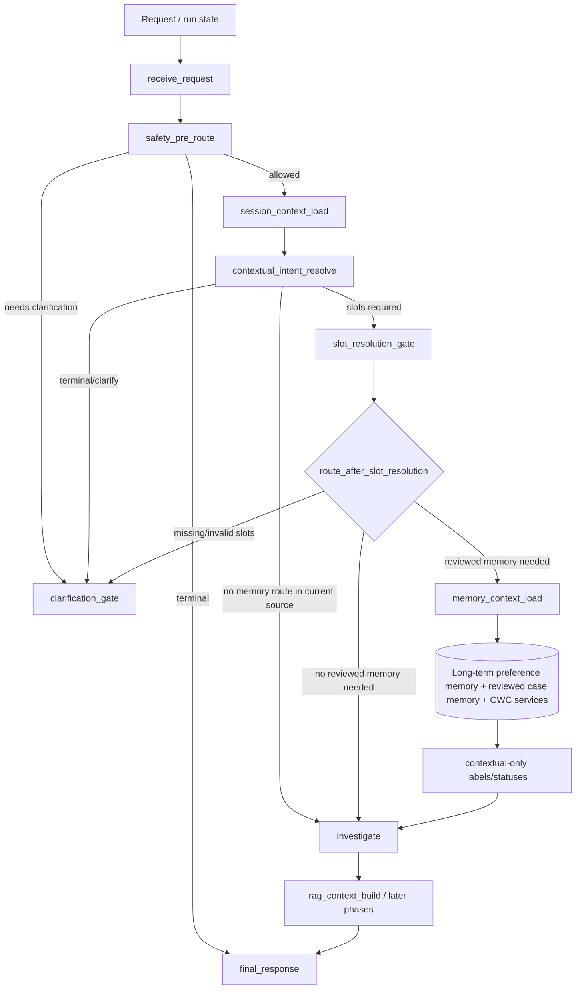

# Phase 55: memory-context-load-cutover - Research

**Researched:** 2026-07-07 [VERIFIED: system date]
**Domain:** LangGraph canonical runtime node cutover, memory authority boundaries, compatibility projection [VERIFIED: .planning/ROADMAP.md; .planning/phases/55-memory-context-load-cutover/55-CONTEXT.md]
**Confidence:** HIGH for repository-specific stack, source surfaces, tests, and phase scope; MEDIUM for production runtime-state absence because only local repo/runtime state was available [VERIFIED: rg/sed source audit; local command probes]

<user_constraints>
## User Constraints (from CONTEXT.md)

The following locked decisions, discretion areas, and deferred ideas are copied verbatim from `.planning/phases/55-memory-context-load-cutover/55-CONTEXT.md`. [VERIFIED: .planning/phases/55-memory-context-load-cutover/55-CONTEXT.md]

### Locked Decisions
## Implementation Decisions

### Active graph naming cutover
- **D-55-01:** Active `StateGraph.add_node(...)` registration must use `memory_context_load`, not `long_term_memory_retrieve`.
- **D-55-02:** `slot_resolution_gate -> route_after_slot_resolution` must map reviewed-memory-needed route values to `memory_context_load`; `memory_context_load` then flows directly to `investigate`.
- **D-55-03:** `long_term_memory_retrieve` may remain only as a non-active compatibility/import wrapper if tests or historical callers still require it; it must not remain an active graph registration or active route destination after Phase 55.
- **D-55-04:** Prefer implementing `memory_context_load` as the canonical node owner over blindly renaming `reviewed_memory_context_retrieve`; the existing reviewed-memory implementation already owns the real load semantics.

### Memory authority and usage labels
- **D-55-05:** All loaded memory surfaces remain `authority_class = "contextual_only"`.
- **D-55-06:** Outputs should carry explicit finite usage/source labels, at minimum distinguishing session continuity, explicit preference memory, reviewed case precedent/case hint, and case working context status where those surfaces are present.
- **D-55-07:** Reviewed memory may guide prompts, context, or `investigate` hints only. It must not create or satisfy `EvidenceRefV1`, `BusinessFactRefV1`, approval decisions, action drafts, action authorization, or replay truth.
- **D-55-08:** Unavailable, missing trusted context, missing scope, denied scope, or service-error memory loads must continue without long-term/case memory and expose explicit skipped/unavailable status rather than fail open.

### Memory layer separation
- **D-55-09:** Preserve Phase 46: `session_context` is same-thread temporary context; legacy `session_memory` may remain fallback/compatibility but cannot become policy/business/action/replay authority.
- **D-55-10:** Preserve Phase 47: reviewed `case_memory` is historical precedent; CWC is active case working state; neither replaces the other.
- **D-55-11:** Preserve Phase 48: published long-term memory is explicit preference-only; broad patterns, policy rules, current business state, and action/approval authority are not long-term memory.
- **D-55-12:** Preserve Phase 48.1: active readers should prefer canonical surfaces, but storage identities, config names, public memory API paths, and historical compatibility wrappers are not deletion targets in this phase.

### Compatibility and validation scope
- **D-55-13:** `graph_vocabulary.py` should make `memory_context_load` the runtime node entry and keep any `long_term_memory_retrieve -> memory_context_load` entry as `compatibility_alias` with Phase 55 reason codes and a named delete phase.
- **D-55-14:** If `llm_outputs["long_term_memory_retrieve"]` is retained for legacy tests/API readers, active canonical metrics must also be written under `llm_outputs["memory_context_load"]`, and the retained key must be documented as compatibility-only.
- **D-55-15:** Static graph baseline tests must change only the Phase 55-owned legacy row. `generate_recommendation` and `assess_risk_and_approval` remain Phase 56/57 active legacy rows until their phases.
- **D-55-16:** Plans must use approved MOCA command entrypoints only: `UV_CACHE_DIR=/tmp/uv-cache uv run pytest ...`, `uv run pytest ...`, or verified `.venv/bin/pytest ...`; bare `pytest` and bare `python -m pytest` are invalid.

### Claude's Discretion
### the agent's Discretion
- Exact module shape: a new `src/agent/nodes/memory_context_load.py` wrapper, alias import, or direct canonical export is acceptable if active graph identity and tests are correct.
- Exact usage label field name and enum values, provided labels are finite, test-covered, and do not blur authority boundaries.
- Exact test split, provided graph baseline, routing totality, vocabulary projection, memory boundary, graph smoke, docs/ledger sync, and artifact command scans are covered.

### Deferred Ideas (OUT OF SCOPE)
## Deferred Ideas

- Phase 56: `recommendation_generation` active graph name and RAG/claim fail-closed status alignment.
- Phase 57: `risk_gate` / `approval_gate` canonicalization and risk vs approval responsibility split.
- Phase 58: final no-debt cleanup of retained graph aliases, historical compatibility vocabulary rows, and active legacy route values.
- Future product phase: richer preference management UI and user-specific preference scope.
</user_constraints>

<phase_requirements>
## Phase Requirements

| ID | Description | Research Support |
|----|-------------|------------------|
| CAGM-06 | `memory_context_load` replaces active `long_term_memory_retrieve` graph naming and keeps all loaded memory contextual-only, after slot resolution and before `investigate`. [VERIFIED: .planning/REQUIREMENTS.md] | Active graph/router cutover surfaces are `src/agent/graph.py` and `src/agent/routing.py`; canonical projection surface is `src/agent/graph_vocabulary.py`; memory authority surfaces are `src/agent/nodes/reviewed_memory_context_retrieve.py`, `src/memory/context_refs.py`, and `src/memory/context_service.py`; validation anchors already exist under `tests/architecture`, `tests/agent`, and `tests/memory`. [VERIFIED: rg/sed source audit] |
</phase_requirements>

## Summary

Phase 55 is a graph-identity and authority-label cutover, not a destructive memory storage/API/config rename. [VERIFIED: .planning/phases/55-memory-context-load-cutover/55-CONTEXT.md] The current active runtime still registers `long_term_memory_retrieve`, maps `route_after_slot_resolution` to that key, and edges that node to `investigate`; the target is to register `memory_context_load`, route reviewed-memory-needed slot outcomes there, and edge it directly to `investigate`. [VERIFIED: src/agent/graph.py; src/agent/routing.py]

The safest implementation is a first-class `memory_context_load` node that delegates to the existing reviewed memory/CWC loader, adds canonical usage/source/authority labels, and optionally dual-writes legacy `llm_outputs["long_term_memory_retrieve"]` metrics only as documented compatibility. [VERIFIED: src/agent/nodes/long_term_memory_retrieve.py; src/agent/nodes/reviewed_memory_context_retrieve.py; .planning/phases/55-memory-context-load-cutover/55-CONTEXT.md] The existing DTO layer already uses `authority_class: Literal["contextual_only"]` for reviewed memory and CWC status objects, so planning should preserve and test that boundary instead of inventing a new authority model. [VERIFIED: src/memory/context_refs.py]

The phase should be split into three small plans: node contract/output labels, active graph/router/baseline cutover, then vocabulary/API/docs/architecture-debt closeout. [VERIFIED: .planning/phases/55-memory-context-load-cutover/55-CONTEXT.md] This split matches the project rule that phase-level planning must not bundle contract definition, implementation migration, compatibility, caller rewrites, security boundaries, and final verification into one large plan. [VERIFIED: ./AGENTS.md; ./CLAUDE.md]

**Primary recommendation:** Implement canonical `memory_context_load` as the active graph node and route destination, keep `long_term_memory_retrieve` only as a compatibility wrapper/vocabulary alias with Phase 55 reason/delete metadata, and validate memory remains contextual-only through graph, routing, trace/API, and memory-boundary tests. [VERIFIED: .planning/phases/55-memory-context-load-cutover/55-CONTEXT.md; src/agent/graph.py; tests/architecture/graph_baseline.py]

## Architectural Responsibility Map

| Capability | Primary Tier | Secondary Tier | Rationale |
|------------|-------------|----------------|-----------|
| Active node registration from `long_term_memory_retrieve` to `memory_context_load` | API / Backend | - | The runtime graph is built in backend Python code through LangGraph `StateGraph.add_node(...)` and edge definitions. [VERIFIED: src/agent/graph.py; CITED: docs.langchain.com/oss/python/langgraph/graph-api] |
| Reviewed-memory-needed route after slot resolution | API / Backend | - | `route_after_slot_resolution` is a deterministic backend router returning registered node keys from `SLOT_RESOLUTION_ROUTES`. [VERIFIED: src/agent/routing.py] |
| Memory usage/source/authority labels | API / Backend | Database / Storage | The node writes loaded run-state objects and metrics, while repositories/services fetch persisted reviewed long-term and case memory. [VERIFIED: src/agent/nodes/reviewed_memory_context_retrieve.py; src/memory/context_service.py] |
| Long-term preference memory retrieval | API / Backend | Database / Storage | `MemoryContextService.load_reviewed_memory_context(...)` uses memory services/repositories and writes contextual loaded state, not policy evidence or action authority. [VERIFIED: src/memory/context_service.py; src/memory/context_refs.py] |
| Reviewed case memory and CWC separation | API / Backend | Database / Storage | Reviewed case memory and active CWC are loaded as distinct fields/statuses and must remain separate. [VERIFIED: src/agent/nodes/reviewed_memory_context_retrieve.py; .planning/phases/47-case-precedent-repositioning-and-closed-case-candidate-gener/47-CONTEXT.md] |
| Trace/API target-name projection | API / Backend | Frontend / Client | Trace and SSE APIs preserve implementation node names and expose target projection metadata for consumers. [VERIFIED: src/agent/trace.py; src/api/routers/agent_runs.py; src/api/routers/traces.py] |
| Historical persisted trace compatibility | Database / Storage | API / Backend | `AgentStep.node_name` and `AgentTraceEvent.node_name` persist runtime names; Phase 55 should project historical names, not rewrite or drop stored rows. [VERIFIED: src/db/models.py; .planning/phases/55-memory-context-load-cutover/55-CONTEXT.md] |

## Project Constraints (from CLAUDE.md)

- Local debug, launch, verification, UI, API, RAG/agent/memory/tool-call failures must be appended to `.planning/LOCAL-VALIDATION-ISSUES.md` in Chinese with symptom, reproduction/detection, evidence/command, current root-cause judgment, handling, remaining gaps, and next entry point. [VERIFIED: ./CLAUDE.md]
- Tool-call, RAG, memory, and intent-recognition subsystem defects or fixes must be appended to `.planning/ARCHITECTURE-DEBT.md` in the relevant subsystem section, using verified code/test/planning evidence and clearly separating target contract from implemented fact. [VERIFIED: ./CLAUDE.md]
- Phase-level plans and larger changes use the GSD plus Codex cross-review workflow, and Codex review findings must be verified against repository code/docs/tests rather than trusted blindly. [VERIFIED: ./CLAUDE.md]
- Large plan revisions or code changes that add/reorder tasks, touch dependencies/wave structure, span at least three files, or require source rereads must be handled by Codex under the project workflow. [VERIFIED: ./CLAUDE.md]
- `docs/contract-spec.md` is the normative contract source for semantics, but it does not determine implementation detail/scope by itself; mismatches between spec and implementation must be recorded instead of silently ignored. [VERIFIED: ./CLAUDE.md]
- Deferred work must name a target phase, not a vague future bucket. [VERIFIED: ./CLAUDE.md]

## Project Constraints (from AGENTS.md)

- MOCA validation commands must not use bare `pytest` or bare `python -m pytest`; accepted forms are `UV_CACHE_DIR=/tmp/uv-cache uv run pytest ...`, `uv run pytest ...`, or a verified `.venv/bin/pytest ...`. [VERIFIED: ./AGENTS.md]
- `study_plan/` planning, portfolio, positioning, product, architecture, and retrospective documents default to Chinese unless the user asks otherwise. [VERIFIED: ./AGENTS.md]
- Phase-level planning must explicitly check plan granularity and split a phase if it spans multiple service boundaries, ownership domains, waves, or verification gates. [VERIFIED: ./AGENTS.md]
- `docs/contract-spec.md` is target contract, not implementation fact; phase implementation differences require either a spec correction or a documented MVP/target-state note. [VERIFIED: ./AGENTS.md]

## Standard Stack

### Core

| Library | Version | Purpose | Why Standard |
|---------|---------|---------|--------------|
| Python | 3.12.13 | Runtime for MOCA backend and tests. [VERIFIED: `UV_CACHE_DIR=/tmp/uv-cache uv run python -V`] | The project declares `requires-python = ">=3.12"` and Ruff target `py312`. [VERIFIED: pyproject.toml] |
| LangGraph | 1.1.10 | Backend state graph runtime for `StateGraph`, nodes, edges, and conditional routers. [VERIFIED: importlib.metadata probe] | Official LangGraph docs use `StateGraph`, `add_node`, `add_edge`, `add_conditional_edges`, and `compile()` for graph construction. [CITED: docs.langchain.com/oss/python/langgraph/graph-api] |
| Pydantic | 2.13.4 | DTO validation for memory refs/statuses with `BaseModel`, `ConfigDict`, `Field`, and `Literal` authority fields. [VERIFIED: importlib.metadata probe; src/memory/context_refs.py] | Current memory context refs are Pydantic models with forbidden extras and contextual-only literals. [VERIFIED: src/memory/context_refs.py] |
| pytest | 9.0.3 | Unit, integration, architecture, and memory-boundary validation. [VERIFIED: importlib.metadata probe] | Existing MOCA tests use pytest files under `tests/architecture`, `tests/agent`, and `tests/memory`. [VERIFIED: rg tests] |
| pytest-asyncio | 1.3.0 | Async node and graph tests. [VERIFIED: importlib.metadata probe] | `pyproject.toml` configures `asyncio_mode = "auto"`, and reviewed-memory tests are async. [VERIFIED: pyproject.toml; tests/agent/test_reviewed_memory_context_retrieve.py] |

### Supporting

| Library / Tool | Version | Purpose | When to Use |
|----------------|---------|---------|-------------|
| uv | 0.11.2 | Project command entrypoint and isolated Python environment runner. [VERIFIED: `uv --version`] | Use for all pytest/Ruff/local Python commands in plans and verification. [VERIFIED: ./AGENTS.md] |
| Ruff | 0.15.12 | Lint/format checks for touched Python files. [VERIFIED: importlib.metadata probe] | Use `UV_CACHE_DIR=/tmp/uv-cache uv run ruff check ...` for touched implementation/test files. [VERIFIED: pyproject.toml; ./AGENTS.md] |
| Docker | 29.4.2 | Available local container runtime. [VERIFIED: `docker --version`] | Not required for the core Phase 55 code/test path, but available if a planner needs service parity checks. [VERIFIED: local environment probe] |
| PostgreSQL client via psycopg | Available through project environment | Local runtime-state probe for trace tables. [VERIFIED: local async psycopg probe] | Use only for state inventory or integration checks; Phase 55 should not require a data migration. [VERIFIED: local DB probe; .planning/phases/55-memory-context-load-cutover/55-CONTEXT.md] |

### Alternatives Considered

| Instead of | Could Use | Tradeoff |
|------------|-----------|----------|
| New memory retrieval library | Existing `reviewed_memory_context_retrieve(...)` plus `MemoryContextService` | Use the existing implementation because it already loads reviewed long-term memory, reviewed case memory, CWC, fail-closed statuses, and contextual-only refs. [VERIFIED: src/agent/nodes/reviewed_memory_context_retrieve.py; src/memory/context_service.py] |
| Destructive rename of memory tables/API/config | Active graph/vocabulary cutover only | Destructive storage/API/config renames are explicitly out of scope and would violate Phase 48.1 compatibility boundaries. [VERIFIED: .planning/phases/55-memory-context-load-cutover/55-CONTEXT.md] |
| Rewriting historical trace rows | Trace/API target projection | Historical `AgentStep` and `AgentTraceEvent` rows can store node names, and the project already projects target names for trace/SSE consumers. [VERIFIED: src/db/models.py; src/agent/trace.py; src/api/routers/agent_runs.py] |
| Broad no-slot `route_after_contextual_intent` memory routing | Slot-resolution cutover first | The contract allows `route_after_contextual_intent` to route to `memory_context_load`, but Phase 55 locked decisions only require the slot-resolution reviewed-memory route; broadening should be a recorded scope decision. [VERIFIED: docs/contract-spec.md; .planning/phases/55-memory-context-load-cutover/55-CONTEXT.md] |

**Installation:**
```bash
# No new package install is required for Phase 55.
UV_CACHE_DIR=/tmp/uv-cache uv run python -V
```

**Version verification performed:**
```bash
uv --version
UV_CACHE_DIR=/tmp/uv-cache uv run python -V
UV_CACHE_DIR=/tmp/uv-cache uv run python -c 'import importlib.metadata as md; print(md.version("langgraph")); print(md.version("pydantic")); print(md.version("pytest")); print(md.version("pytest-asyncio")); print(md.version("ruff"))'
```
[VERIFIED: local command probes]

## Architecture Patterns

### System Architecture Diagram



This flow shows Phase 55's required path: slot resolution feeds a reviewed-memory-needed route into `memory_context_load`, `memory_context_load` loads contextual-only memory/CWC surfaces, and `investigate` consumes those surfaces as context/hints. [VERIFIED: .planning/ROADMAP.md; .planning/phases/55-memory-context-load-cutover/55-CONTEXT.md; docs/contract-spec.md]

### Recommended Project Structure

```text
src/
+-- agent/
|   +-- graph.py                         # active StateGraph registration and edges [VERIFIED: src/agent/graph.py]
|   +-- routing.py                       # deterministic route sets and route_after_slot_resolution [VERIFIED: src/agent/routing.py]
|   +-- graph_vocabulary.py              # runtime vs compatibility alias projection [VERIFIED: src/agent/graph_vocabulary.py]
|   +-- nodes/
|       +-- memory_context_load.py        # recommended canonical active node wrapper/owner [RECOMMENDED: Phase 55 research]
|       +-- long_term_memory_retrieve.py  # retained non-active compatibility wrapper only [VERIFIED: src/agent/nodes/long_term_memory_retrieve.py]
|       +-- reviewed_memory_context_retrieve.py # real reviewed memory/CWC loader [VERIFIED: src/agent/nodes/reviewed_memory_context_retrieve.py]
+-- memory/
    +-- context_refs.py                   # contextual-only DTOs and statuses [VERIFIED: src/memory/context_refs.py]
    +-- context_service.py                # reviewed memory scope filtering/loading [VERIFIED: src/memory/context_service.py]
```

### Pattern 1: Canonical Active Node Delegates to Existing Loader

**What:** Make `memory_context_load` the active graph node and have it call the existing reviewed-memory loader while writing canonical metrics/labels. [VERIFIED: .planning/phases/55-memory-context-load-cutover/55-CONTEXT.md; src/agent/nodes/reviewed_memory_context_retrieve.py]

**When to use:** Use this for Phase 55 because the current loader already owns reviewed long-term memory, reviewed case memory, CWC status, fail-closed behavior, and contextual-only refs. [VERIFIED: src/agent/nodes/reviewed_memory_context_retrieve.py; src/memory/context_service.py]

**Example:**
```python
# Source: src/agent/nodes/long_term_memory_retrieve.py and Phase 55 decision D-55-14
async def memory_context_load(state: AgentState, config: RunnableConfig) -> dict:
    result = await reviewed_memory_context_retrieve(...)
    canonical_metrics = _memory_context_metrics(result)
    result["llm_outputs"] = {
        **(state.get("llm_outputs") or {}),
        **(result.get("llm_outputs") or {}),
        "memory_context_load": canonical_metrics,
        # Keep legacy key only if a documented compatibility reader still needs it.
    }
    return result
```
[VERIFIED: src/agent/nodes/long_term_memory_retrieve.py; .planning/phases/55-memory-context-load-cutover/55-CONTEXT.md]

### Pattern 2: Deterministic Router Value Must Match Registered Node Key

**What:** Update the route set, route decision, graph conditional edge map, and graph edge target together. [VERIFIED: src/agent/routing.py; src/agent/graph.py]

**When to use:** Use this for any active graph node cutover because LangGraph conditional edge maps use router return values to choose destination node keys. [CITED: docs.langchain.com/oss/python/langgraph/graph-api]

**Example:**
```python
# Source: current src/agent/routing.py and src/agent/graph.py, updated for Phase 55 intent
SLOT_RESOLUTION_ROUTES = {"clarification_gate", "investigate", "memory_context_load"}

if _needs_reviewed_memory_context(state):
    return [], "memory_context_load", []

builder.add_conditional_edges(
    "slot_resolution_gate",
    route_after_slot_resolution,
    {
        "clarification_gate": "clarification_gate",
        "investigate": "investigate",
        "memory_context_load": "memory_context_load",
    },
)
builder.add_edge("memory_context_load", "investigate")
```
[VERIFIED: src/agent/routing.py; src/agent/graph.py]

### Pattern 3: Vocabulary Separates Runtime Nodes from Compatibility Aliases

**What:** Make `memory_context_load` status `runtime` and keep `long_term_memory_retrieve -> memory_context_load` as `compatibility_alias` with Phase 55 reason/delete metadata. [VERIFIED: .planning/phases/55-memory-context-load-cutover/55-CONTEXT.md; src/agent/graph_vocabulary.py]

**When to use:** Use this for traces, SSE, API responses, and tests that need canonical projection without losing historical readability. [VERIFIED: src/agent/trace.py; src/api/routers/agent_runs.py; src/api/routers/traces.py]

**Example:**
```python
# Source: src/agent/graph_vocabulary.py, updated for Phase 55 intent
_PHASE55_MEMORY_ALIAS_REASON_CODES = (
    "PHASE_55_COMPATIBILITY_ALIAS",
    "HISTORICAL_TRACE_PROJECTION",
    "IMPORT_TEST_COMPATIBILITY",
    "DELETE_BY_PHASE_58",
)

_entry("memory_context_load", "memory_context_load", "node", "runtime", True)
_entry(
    "long_term_memory_retrieve",
    "memory_context_load",
    "node",
    "compatibility_alias",
    True,
    _PHASE55_MEMORY_ALIAS_REASON_CODES,
)
```
[VERIFIED: src/agent/graph_vocabulary.py; .planning/phases/55-memory-context-load-cutover/55-CONTEXT.md]

### Anti-Patterns to Avoid

- **Vocabulary-only cutover:** Updating `graph_vocabulary.py` without changing `StateGraph.add_node(...)`, route sets, conditional edge maps, and graph baseline leaves the active runtime legacy-named. [VERIFIED: src/agent/graph.py; src/agent/routing.py; tests/architecture/graph_baseline.py]
- **Blind destructive rename:** Renaming storage identities, memory API paths, config keys, historical trace rows, or Phase 48.1 compatibility wrappers violates the explicit Phase 55 scope. [VERIFIED: .planning/phases/55-memory-context-load-cutover/55-CONTEXT.md]
- **Legacy metric only:** Leaving active metrics only under `llm_outputs["long_term_memory_retrieve"]` makes the canonical node harder to observe and violates D-55-14 if the legacy key is retained. [VERIFIED: src/agent/nodes/long_term_memory_retrieve.py; .planning/phases/55-memory-context-load-cutover/55-CONTEXT.md]
- **Memory-as-authority:** Treating reviewed memory or CWC as policy evidence, current business facts, approvals, action authority, or replay truth breaks CAGM-06 and the memory contract. [VERIFIED: .planning/REQUIREMENTS.md; docs/contract-spec.md; tests/agent/test_memory_evidence_boundary.py]
- **Phase creep into 56/57/58:** Changing `generate_recommendation`, `assess_risk_and_approval`, final alias cleanup, or RAG/claim fail-closed behavior is out of scope. [VERIFIED: .planning/phases/55-memory-context-load-cutover/55-CONTEXT.md; tests/architecture/graph_baseline.py]

## Don't Hand-Roll

| Problem | Don't Build | Use Instead | Why |
|---------|-------------|-------------|-----|
| Graph orchestration | A custom graph runner or ad hoc dispatcher | LangGraph `StateGraph` with `add_node`, `add_edge`, and `add_conditional_edges` | Current runtime already uses LangGraph, and official docs support this graph construction model. [VERIFIED: src/agent/graph.py; CITED: docs.langchain.com/oss/python/langgraph/graph-api] |
| Reviewed memory retrieval and CWC loading | A new memory query pipeline inside `memory_context_load` | Existing `reviewed_memory_context_retrieve(...)` and `MemoryContextService.load_reviewed_memory_context(...)` | Existing code already handles scope filters, service unavailability, reviewed long-term memory, reviewed case memory, and CWC lifecycle status. [VERIFIED: src/agent/nodes/reviewed_memory_context_retrieve.py; src/memory/context_service.py] |
| Memory authority schema | Free-form strings or implicit comments | Existing Pydantic refs/statuses with `authority_class="contextual_only"` plus finite usage/source labels | Current DTOs already enforce contextual-only authority literals for reviewed memory and CWC surfaces. [VERIFIED: src/memory/context_refs.py] |
| Trace migration | SQL rewrite of historical node names | `target_graph_name(...)`, `project_trace_step_for_contract(...)`, and API/SSE projection | Existing trace/API layers already project target names while preserving implementation names. [VERIFIED: src/agent/graph_vocabulary.py; src/agent/trace.py; src/api/routers/agent_runs.py; src/api/routers/traces.py] |
| Static graph validation | Broad grep-only scans | Existing AST-based architecture baseline helpers | `tests/architecture/graph_baseline.py` extracts `add_node`, `add_edge`, and `add_conditional_edges` from AST, which is less brittle for graph shape checks. [VERIFIED: tests/architecture/graph_baseline.py] |

**Key insight:** Phase 55 should move the active runtime identity and observable labels while preserving proven memory loading semantics and compatibility projection; custom replacements would add risk in scope, authority, and historical trace handling. [VERIFIED: .planning/phases/55-memory-context-load-cutover/55-CONTEXT.md; src/agent/nodes/reviewed_memory_context_retrieve.py]

## Runtime State Inventory

| Category | Items Found | Action Required |
|----------|-------------|-----------------|
| Stored data | `AgentStep.node_name` and `AgentTraceEvent.node_name` can store runtime node names; local DB probe found zero rows for `long_term_memory_retrieve`, `memory_context_load`, or `reviewed_memory_context_retrieve` in those tables. [VERIFIED: src/db/models.py; local async psycopg probe] | No data migration for local state; preserve historical projection for other environments and do not rewrite persisted traces. [VERIFIED: .planning/phases/55-memory-context-load-cutover/55-CONTEXT.md] |
| Stored data | Memory tables/config identities such as `session_memories`, `long_term_memories`, `case_memories`, and `case_working_contexts` are explicitly not deletion/rename targets. [VERIFIED: .planning/phases/55-memory-context-load-cutover/55-CONTEXT.md] | Code edit only: active graph/node naming changes; storage/API/config surfaces remain intact. [VERIFIED: .planning/phases/55-memory-context-load-cutover/55-CONTEXT.md] |
| Live service config | Exact graph strings were not found in `.env*`, `docker-compose*.yml`, `.github`, `src/config.py`, or `pyproject.toml` during the local audit. [VERIFIED: rg audit] | None locally; planner should not add config rename tasks. [VERIFIED: rg audit] |
| OS-registered state | `launchctl list` showed unrelated `com.moca.study.*` jobs only; `pm2` was not installed; `crontab -l` reported no crontab; `ps aux` found no running MOCA process containing the target graph strings beyond the audit command itself. [VERIFIED: local environment probes] | None locally; no OS re-registration task needed for Phase 55. [VERIFIED: local environment probes] |
| Secrets/env vars | Exact `long_term_memory_retrieve`, `memory_context_load`, and reviewed-memory graph strings were not found in `.env*`, Docker, GitHub workflow, or config surfaces scanned locally. [VERIFIED: rg audit] | None; do not rename secrets/env vars in this phase. [VERIFIED: .planning/phases/55-memory-context-load-cutover/55-CONTEXT.md] |
| Build artifacts | Python `__pycache__`/`.pyc` artifacts exist, but no installed package/build artifact was found that requires a graph-node rename. [VERIFIED: find/rg audit] | None; normal test/lint execution is enough. [VERIFIED: local artifact audit] |

## Common Pitfalls

### Pitfall 1: Active Runtime Still Uses Legacy Node
**What goes wrong:** The plan updates docs, vocabulary, or tests but leaves `builder.add_node("long_term_memory_retrieve", ...)`, the slot route map, or the edge to `investigate` unchanged. [VERIFIED: src/agent/graph.py; src/agent/routing.py]  
**Why it happens:** `long_term_memory_retrieve` is currently both a wrapper implementation and the active graph key. [VERIFIED: src/agent/nodes/long_term_memory_retrieve.py; src/agent/graph.py]  
**How to avoid:** Make the graph registration, route set, conditional edge map, and direct edge use `memory_context_load` in the same plan. [VERIFIED: .planning/phases/55-memory-context-load-cutover/55-CONTEXT.md]  
**Warning signs:** `rg -n 'add_node\\("long_term_memory_retrieve"|\"long_term_memory_retrieve\": \"long_term_memory_retrieve\"|add_edge\\("long_term_memory_retrieve"' src/agent/graph.py src/agent/routing.py` still reports active graph hits after implementation. [VERIFIED: local rg pattern]

### Pitfall 2: Compatibility Wrapper Becomes a Second Runtime Owner
**What goes wrong:** Both `reviewed_memory_context_retrieve` and `memory_context_load` are treated as runtime entries for the same target, or `long_term_memory_retrieve` remains runnable without reason/delete metadata. [VERIFIED: src/agent/graph_vocabulary.py]  
**Why it happens:** Current vocabulary marks `reviewed_memory_context_retrieve` as runtime and `memory_context_load` as compatibility_alias, which must be corrected for Phase 55. [VERIFIED: src/agent/graph_vocabulary.py]  
**How to avoid:** Make `memory_context_load` the runtime vocabulary entry, demote implementation wrappers to compatibility/import surfaces, and add Phase 55 reason codes. [VERIFIED: .planning/phases/55-memory-context-load-cutover/55-CONTEXT.md]  
**Warning signs:** `tests/agent/test_graph_vocabulary.py` still expects `reviewed_memory_context_retrieve` runtime or `memory_context_load` compatibility status after the cutover. [VERIFIED: tests/agent/test_graph_vocabulary.py]

### Pitfall 3: Memory Labels Are Present but Authority Is Ambiguous
**What goes wrong:** Outputs include counts or source text but do not make memory usage/source/authority finite and testable. [VERIFIED: src/agent/nodes/long_term_memory_retrieve.py; .planning/phases/55-memory-context-load-cutover/55-CONTEXT.md]  
**Why it happens:** Legacy metrics currently expose `source`, counts, and `continuity_claimed`, but not a canonical finite usage label set that distinguishes session continuity, explicit preference memory, reviewed case precedent/hint, and CWC status. [VERIFIED: src/agent/nodes/long_term_memory_retrieve.py; .planning/phases/55-memory-context-load-cutover/55-CONTEXT.md]  
**How to avoid:** Add canonical `memory_context_load` metrics/status labels and assert `authority_class == "contextual_only"` on loaded memory/CWC surfaces. [VERIFIED: src/memory/context_refs.py; .planning/phases/55-memory-context-load-cutover/55-CONTEXT.md]  
**Warning signs:** New tests only assert graph order and do not inspect `llm_outputs["memory_context_load"]`, `memory_context`, `memory_context_bundle`, or CWC status authority. [VERIFIED: tests/agent/test_graph.py; tests/agent/test_reviewed_memory_context_retrieve.py]

### Pitfall 4: Memory Starts Satisfying Evidence or Action Gates
**What goes wrong:** Reviewed memory or CWC is used as `EvidenceRefV1`, `BusinessFactRefV1`, approval/action authority, or replay truth. [VERIFIED: docs/contract-spec.md; .planning/REQUIREMENTS.md]  
**Why it happens:** Reviewed memory names may look semantically strong unless tests keep the boundary explicit. [VERIFIED: tests/agent/test_memory_evidence_boundary.py]  
**How to avoid:** Reuse and update memory evidence boundary tests, and keep memory outputs available only as context/investigate hints. [VERIFIED: tests/agent/test_memory_evidence_boundary.py; .planning/phases/55-memory-context-load-cutover/55-CONTEXT.md]  
**Warning signs:** Tests create policy evidence, current business fact refs, approval decisions, action drafts, or replay truth directly from memory refs. [VERIFIED: tests/agent/test_memory_evidence_boundary.py]

### Pitfall 5: Static Scans Confuse Historical References with Active Runtime
**What goes wrong:** A validation scan fails because `long_term_memory_retrieve` remains in historical docs, compatibility wrappers, or Phase 58 cleanup rows. [VERIFIED: .planning/phases/55-memory-context-load-cutover/55-CONTEXT.md; src/agent/graph_vocabulary.py]  
**Why it happens:** Phase 55 explicitly permits compatibility/import wrappers and historical projection, but forbids active graph registration/route destinations. [VERIFIED: .planning/phases/55-memory-context-load-cutover/55-CONTEXT.md]  
**How to avoid:** Use AST graph baseline checks and scoped grep patterns against `src/agent/graph.py`, `src/agent/routing.py`, and active test baselines. [VERIFIED: tests/architecture/graph_baseline.py]  
**Warning signs:** The plan demands zero repository-wide occurrences of `long_term_memory_retrieve`, which would contradict Phase 55 decisions. [VERIFIED: .planning/phases/55-memory-context-load-cutover/55-CONTEXT.md]

## Code Examples

Verified patterns from current source and official docs:

### Current Legacy Wrapper Pattern to Reuse Carefully

```python
# Source: src/agent/nodes/long_term_memory_retrieve.py
async def long_term_memory_retrieve(state: AgentState, config: RunnableConfig) -> dict:
    """Compatibility wrapper for the reviewed memory context boundary."""
    result = await reviewed_memory_context_retrieve(...)
    legacy_metrics = _legacy_metrics(result)
    result["llm_outputs"] = {
        **(state.get("llm_outputs") or {}),
        **(result.get("llm_outputs") or {}),
        "long_term_memory_retrieve": legacy_metrics,
    }
    return result
```
[VERIFIED: src/agent/nodes/long_term_memory_retrieve.py]

### Current Active Graph Surface to Cut Over

```python
# Source: src/agent/graph.py
builder.add_node("long_term_memory_retrieve", long_term_memory_retrieve)
builder.add_conditional_edges(
    "slot_resolution_gate",
    route_after_slot_resolution,
    {
        "clarification_gate": "clarification_gate",
        "investigate": "investigate",
        "long_term_memory_retrieve": "long_term_memory_retrieve",
    },
)
builder.add_edge("long_term_memory_retrieve", "investigate")
```
[VERIFIED: src/agent/graph.py]

### Current Router Surface to Cut Over

```python
# Source: src/agent/routing.py
SLOT_RESOLUTION_ROUTES = {"clarification_gate", "investigate", "long_term_memory_retrieve"}

if _needs_reviewed_memory_context(state):
    return [], "long_term_memory_retrieve", []
```
[VERIFIED: src/agent/routing.py]

### Current Contextual-Only DTO Pattern

```python
# Source: src/memory/context_refs.py
class ReviewedMemoryContextRetrieveStatusV1(BaseModel):
    model_config = ConfigDict(extra="forbid")

    schema_version: Literal["reviewed_memory_context_retrieve_status.v1"] = (
        "reviewed_memory_context_retrieve_status.v1"
    )
    status: str
    authority_class: Literal["contextual_only"] = "contextual_only"
```
[VERIFIED: src/memory/context_refs.py]

### Official LangGraph Graph Pattern

```python
# Source: LangGraph official graph API docs
builder = StateGraph(State)
builder.add_node("node_a", node_a)
builder.add_edge(START, "node_a")
builder.add_conditional_edges("node_a", routing_function, path_map)
graph = builder.compile()
```
[CITED: docs.langchain.com/oss/python/langgraph/graph-api]

## State of the Art

| Old / Current Approach | Current Recommended Approach | When Changed / Source | Impact |
|------------------------|------------------------------|-----------------------|--------|
| Active node key `long_term_memory_retrieve` after slot resolution. [VERIFIED: src/agent/graph.py] | Active node key `memory_context_load` after slot resolution, then direct edge to `investigate`. [VERIFIED: .planning/phases/55-memory-context-load-cutover/55-CONTEXT.md] | Phase 55 / CAGM-06. [VERIFIED: .planning/REQUIREMENTS.md; .planning/ROADMAP.md] | Removes the Phase 55-owned active legacy node while preserving memory semantics. [VERIFIED: .planning/phases/55-memory-context-load-cutover/55-CONTEXT.md] |
| Router returns `"long_term_memory_retrieve"` for reviewed-memory-needed slot outcomes. [VERIFIED: src/agent/routing.py] | Router returns `"memory_context_load"` for canonical and legacy reviewed-memory hints. [VERIFIED: .planning/phases/55-memory-context-load-cutover/55-CONTEXT.md] | Phase 55 / CAGM-06. [VERIFIED: .planning/REQUIREMENTS.md] | Aligns route vocabulary with registered canonical node key. [VERIFIED: tests/architecture/graph_baseline.py] |
| `memory_context_load` vocabulary entry currently has compatibility status while `reviewed_memory_context_retrieve` is runtime. [VERIFIED: src/agent/graph_vocabulary.py] | `memory_context_load` becomes runtime, and `long_term_memory_retrieve` remains compatibility alias with Phase 55 reason/delete metadata. [VERIFIED: .planning/phases/55-memory-context-load-cutover/55-CONTEXT.md] | Phase 55 / D-55-13. [VERIFIED: .planning/phases/55-memory-context-load-cutover/55-CONTEXT.md] | Trace/API target projection remains stable while current runs emit canonical runtime identity. [VERIFIED: src/agent/trace.py; src/api/routers/agent_runs.py] |
| Existing legacy metrics use `llm_outputs["long_term_memory_retrieve"]`. [VERIFIED: src/agent/nodes/long_term_memory_retrieve.py] | Active metrics should be written under `llm_outputs["memory_context_load"]`; legacy key is optional documented compatibility. [VERIFIED: .planning/phases/55-memory-context-load-cutover/55-CONTEXT.md] | Phase 55 / D-55-14. [VERIFIED: .planning/phases/55-memory-context-load-cutover/55-CONTEXT.md] | Observability matches canonical node while compatibility readers can be supported temporarily. [VERIFIED: src/agent/nodes/long_term_memory_retrieve.py] |

**Deprecated/outdated:**
- Active `StateGraph.add_node("long_term_memory_retrieve", ...)` is deprecated for Phase 55 execution after cutover. [VERIFIED: .planning/phases/55-memory-context-load-cutover/55-CONTEXT.md; src/agent/graph.py]
- Active route destinations pointing to `"long_term_memory_retrieve"` are deprecated for Phase 55 execution after cutover. [VERIFIED: .planning/phases/55-memory-context-load-cutover/55-CONTEXT.md; src/agent/routing.py]
- Repository-wide deletion of `long_term_memory_retrieve` references is not a Phase 55 target because compatibility wrappers, historical projection, and Phase 58 cleanup remain valid. [VERIFIED: .planning/phases/55-memory-context-load-cutover/55-CONTEXT.md]

## Assumptions Log

| # | Claim | Section | Risk if Wrong |
|---|-------|---------|---------------|
| A1 | Production or remote environments may contain historical `AgentStep` / `AgentTraceEvent` rows even though the local DB probe found zero matching rows. [ASSUMED] | Runtime State Inventory | A planner could incorrectly skip trace projection validation if they treat local empty tables as global proof. |
| A2 | The exact canonical usage-label field name can be chosen by implementation as long as labels are finite and tests cover them. [ASSUMED] | Architecture Patterns / Open Questions | A hidden external consumer might already expect a specific field name; planner should search API consumers before locking the name. |

## Open Questions (RESOLVED)

1. **Should no-slot `route_after_contextual_intent` route directly to `memory_context_load` in Phase 55?**  
   - What we know: `docs/contract-spec.md` allows `route_after_contextual_intent` to return `memory_context_load`, while Phase 55 locked decisions only require `slot_resolution_gate -> route_after_slot_resolution -> memory_context_load`. [VERIFIED: docs/contract-spec.md; .planning/phases/55-memory-context-load-cutover/55-CONTEXT.md]  
   - Prior uncertainty: Whether broad no-slot memory loading is intended for this phase or a later implementation refinement. [VERIFIED: current source audit; docs/contract-spec.md]
   - RESOLVED: Phase 55 keeps the cutover narrow to `slot_resolution_gate -> route_after_slot_resolution -> memory_context_load`. It does not add broad no-slot `route_after_contextual_intent -> memory_context_load` routing unless a later phase records that scope decision. [DECIDED: Phase 55 planning; VERIFIED: 55-02-PLAN.md]

2. **Should `llm_outputs["long_term_memory_retrieve"]` be retained after canonical metrics land?**  
   - What we know: D-55-14 permits retaining it only as compatibility, and current tests/API readers may still assert it. [VERIFIED: .planning/phases/55-memory-context-load-cutover/55-CONTEXT.md; tests/agent/test_graph.py]  
   - Prior uncertainty: Whether all downstream readers can move to `llm_outputs["memory_context_load"]` in one phase. [VERIFIED: rg audit]
   - RESOLVED: Active canonical metrics are written under `llm_outputs["memory_context_load"]`. `llm_outputs["long_term_memory_retrieve"]` is retained only by the direct compatibility wrapper/API-reader surface when tests prove the need, documented as compatibility-only, and targeted for Phase 58 cleanup. [DECIDED: Phase 55 planning; VERIFIED: 55-01-PLAN.md; 55-03-PLAN.md]

3. **What exact finite usage labels should be locked?**  
   - What we know: The phase requires at least session continuity, explicit preference memory, reviewed case precedent/case hint, and CWC status where present. [VERIFIED: .planning/phases/55-memory-context-load-cutover/55-CONTEXT.md]  
   - Prior uncertainty: Whether to include the architecture-plan examples `case_memory_summary`, `similar_case_hint`, `reviewed_memory`, and `unreviewed_memory` verbatim. [VERIFIED: docs/target-agent-platform-architecture-plan.md]
   - RESOLVED: Phase 55 locks the finite canonical usage label set to `session_continuity`, `explicit_preference_memory`, `reviewed_case_precedent`, `case_working_context_status`, `reviewed_memory_skipped`, and `reviewed_memory_unavailable`. It intentionally does not emit `unreviewed_memory` or a separate `reviewed_case_hint` label unless a later phase adds a tested semantic distinction. [DECIDED: Phase 55 planning; VERIFIED: 55-01-PLAN.md]

## Environment Availability

| Dependency | Required By | Available | Version | Fallback |
|------------|-------------|-----------|---------|----------|
| `rg` | Source/test audits and scoped validation scans | yes | `/opt/homebrew/bin/rg` | Use `grep` only if `rg` disappears. [VERIFIED: local command probe] |
| `git` | Diff/status and optional doc commit | yes | `/usr/bin/git` | None required. [VERIFIED: local command probe] |
| `uv` | All Python/test commands | yes | 0.11.2 | Verified `.venv/bin/pytest` only, but prefer uv. [VERIFIED: `uv --version`; ./AGENTS.md] |
| Python | Runtime/test execution | yes | 3.12.13 | None; Python 3.12+ required. [VERIFIED: `UV_CACHE_DIR=/tmp/uv-cache uv run python -V`; pyproject.toml] |
| pytest | Validation | yes | 9.0.3 | None. [VERIFIED: importlib.metadata probe] |
| pytest-asyncio | Async node tests | yes | 1.3.0 | None. [VERIFIED: importlib.metadata probe] |
| Ruff | Linting touched Python files | yes | 0.15.12 | Manual review only if lint unavailable. [VERIFIED: importlib.metadata probe] |
| PostgreSQL client/runtime DB | Runtime state inventory and optional integration probes | yes | psycopg available in uv env | Skip DB migration; use trace projection tests. [VERIFIED: local async psycopg probe] |
| `pg_isready` CLI | Postgres service readiness CLI probe | no | - | Use project Python/psycopg probe if DB check is needed. [VERIFIED: local command probe] |
| Redis CLI | Not required by Phase 55 | no | - | Not needed. [VERIFIED: local command probe] |
| Docker | Optional service parity | yes | 29.4.2 | Not required for focused tests. [VERIFIED: `docker --version`] |

**Missing dependencies with no fallback:**
- None for the core Phase 55 code/test path. [VERIFIED: local environment probes]

**Missing dependencies with fallback:**
- `pg_isready` is absent; use the project `uv` Python environment with psycopg for DB probes. [VERIFIED: local environment probes]

## Validation Architecture

### Test Framework

| Property | Value |
|----------|-------|
| Framework | pytest 9.0.3 with pytest-asyncio 1.3.0 [VERIFIED: importlib.metadata probe] |
| Config file | `pyproject.toml` with `asyncio_mode = "auto"` [VERIFIED: pyproject.toml] |
| Quick run command | `UV_CACHE_DIR=/tmp/uv-cache uv run pytest tests/architecture/test_canonical_graph_baseline.py tests/agent/test_intent_routing.py tests/agent/test_graph_vocabulary.py tests/agent/test_memory_evidence_boundary.py -q --tb=short` [VERIFIED: ./AGENTS.md; tests exist by rg audit] |
| Full focused suite command | `UV_CACHE_DIR=/tmp/uv-cache uv run pytest tests/architecture/test_canonical_graph_baseline.py tests/architecture/test_memory_contract_delta.py tests/architecture/test_phase32_static_contract.py tests/agent/test_graph.py tests/test_graph_routing.py tests/agent/test_intent_routing.py tests/agent/test_graph_vocabulary.py tests/agent/test_trace.py tests/test_trace_api.py tests/test_agent_runs_api.py tests/agent/test_reviewed_memory_context_retrieve.py tests/agent/test_memory_evidence_boundary.py tests/memory/test_reviewed_memory_context_boundary.py tests/memory/test_phase46_session_context_alignment.py tests/memory/test_phase47_case_precedent_alignment.py tests/memory/test_phase48_long_term_preference_alignment.py tests/memory/test_phase48_1_memory_compat_alignment.py -q --tb=short` [VERIFIED: rg audit; ./AGENTS.md] |
| Lint command | `UV_CACHE_DIR=/tmp/uv-cache uv run ruff check src/agent src/memory tests/architecture tests/agent tests/memory` [VERIFIED: Ruff availability; ./AGENTS.md] |

### Phase Requirements -> Test Map

| Req ID | Behavior | Test Type | Automated Command | File Exists? |
|--------|----------|-----------|-------------------|--------------|
| CAGM-06 | Active graph registers `memory_context_load`, does not register active `long_term_memory_retrieve`, and edges `memory_context_load -> investigate`. [VERIFIED: .planning/REQUIREMENTS.md; src/agent/graph.py] | architecture/static + graph smoke | `UV_CACHE_DIR=/tmp/uv-cache uv run pytest tests/architecture/test_canonical_graph_baseline.py tests/agent/test_graph.py -q --tb=short` | Yes, update existing files [VERIFIED: tests/architecture/test_canonical_graph_baseline.py; tests/agent/test_graph.py] |
| CAGM-06 | `route_after_slot_resolution` returns `memory_context_load` for canonical `needs_reviewed_memory_context` and legacy `needs_long_term_memory` hints after slots resolve. [VERIFIED: src/agent/routing.py; .planning/phases/55-memory-context-load-cutover/55-CONTEXT.md] | unit/router | `UV_CACHE_DIR=/tmp/uv-cache uv run pytest tests/agent/test_intent_routing.py tests/test_graph_routing.py -q --tb=short` | Yes, update existing files [VERIFIED: tests/agent/test_intent_routing.py; tests/test_graph_routing.py] |
| CAGM-06 | `graph_vocabulary.py` marks `memory_context_load` as runtime and `long_term_memory_retrieve` as compatibility alias with Phase 55 reason/delete metadata. [VERIFIED: .planning/phases/55-memory-context-load-cutover/55-CONTEXT.md; src/agent/graph_vocabulary.py] | unit/static | `UV_CACHE_DIR=/tmp/uv-cache uv run pytest tests/agent/test_graph_vocabulary.py tests/architecture/test_phase32_static_contract.py -q --tb=short` | Yes, update existing files [VERIFIED: tests/agent/test_graph_vocabulary.py; tests/architecture/test_phase32_static_contract.py] |
| CAGM-06 | Active `memory_context_load` outputs canonical metrics/labels and all memory/CWC surfaces remain `authority_class="contextual_only"`. [VERIFIED: .planning/phases/55-memory-context-load-cutover/55-CONTEXT.md; src/memory/context_refs.py] | unit/node + integration | `UV_CACHE_DIR=/tmp/uv-cache uv run pytest tests/agent/test_memory_context_load.py tests/agent/test_reviewed_memory_context_retrieve.py -q --tb=short` | No, `tests/agent/test_memory_context_load.py` is a Wave 0 gap; reviewed-memory tests exist [VERIFIED: tests/agent/test_reviewed_memory_context_retrieve.py] |
| CAGM-06 | Memory cannot satisfy policy evidence, current business facts, approval/action authority, or replay truth. [VERIFIED: .planning/REQUIREMENTS.md; docs/contract-spec.md] | boundary/security | `UV_CACHE_DIR=/tmp/uv-cache uv run pytest tests/agent/test_memory_evidence_boundary.py tests/memory/test_reviewed_memory_context_boundary.py -q --tb=short` | Yes, existing files [VERIFIED: tests/agent/test_memory_evidence_boundary.py; tests/memory/test_reviewed_memory_context_boundary.py] |
| CAGM-06 | Phase 46/47/48/48.1 memory layer separation remains intact. [VERIFIED: .planning/phases/55-memory-context-load-cutover/55-CONTEXT.md] | regression/static + unit | `UV_CACHE_DIR=/tmp/uv-cache uv run pytest tests/memory/test_phase46_session_context_alignment.py tests/memory/test_phase47_case_precedent_alignment.py tests/memory/test_phase48_long_term_preference_alignment.py tests/memory/test_phase48_1_memory_compat_alignment.py -q --tb=short` | Yes, existing files; Phase 48.1 expectations need Phase 55 updates [VERIFIED: rg audit] |
| CAGM-06 | Trace/SSE/API projection exposes canonical target names while preserving historical compatibility where needed. [VERIFIED: src/agent/trace.py; src/api/routers/agent_runs.py; src/api/routers/traces.py] | API/unit | `UV_CACHE_DIR=/tmp/uv-cache uv run pytest tests/agent/test_trace.py tests/test_trace_api.py tests/test_agent_runs_api.py -q --tb=short` | Yes, existing files [VERIFIED: rg audit] |

### Sampling Rate

- **Per task commit:** `UV_CACHE_DIR=/tmp/uv-cache uv run pytest tests/architecture/test_canonical_graph_baseline.py tests/agent/test_intent_routing.py tests/agent/test_graph_vocabulary.py -q --tb=short` [VERIFIED: ./AGENTS.md]
- **Per wave merge:** `UV_CACHE_DIR=/tmp/uv-cache uv run pytest tests/architecture/test_canonical_graph_baseline.py tests/agent/test_graph.py tests/test_graph_routing.py tests/agent/test_intent_routing.py tests/agent/test_graph_vocabulary.py tests/agent/test_reviewed_memory_context_retrieve.py tests/agent/test_memory_evidence_boundary.py -q --tb=short` [VERIFIED: ./AGENTS.md; rg audit]
- **Phase gate:** Run the full focused suite command above plus `UV_CACHE_DIR=/tmp/uv-cache uv run ruff check src/agent src/memory tests/architecture tests/agent tests/memory`; then run scoped grep checks for active legacy graph registrations/routes. [VERIFIED: ./AGENTS.md; rg audit]

### Wave 0 Gaps

- [ ] `tests/agent/test_memory_context_load.py` - covers canonical node metrics/usage labels, optional legacy dual-write, and contextual-only authority for CAGM-06. [VERIFIED: missing by rg/ls audit]
- [ ] Update `tests/architecture/graph_baseline.py` - remove Phase 55 `long_term_memory_retrieve` active baseline row while preserving Phase 56/57 rows. [VERIFIED: tests/architecture/graph_baseline.py]
- [ ] Update `tests/memory/test_phase48_1_memory_compat_alignment.py` - preserve storage/API/config compatibility checks but stop requiring active graph `long_term_memory_retrieve`. [VERIFIED: tests/memory/test_phase48_1_memory_compat_alignment.py]
- [ ] Add/adjust static scan for active legacy graph usage: `rg -n 'add_node\\("long_term_memory_retrieve"|\"long_term_memory_retrieve\": \"long_term_memory_retrieve\"|add_edge\\("long_term_memory_retrieve"' src/agent/graph.py src/agent/routing.py` should return no active graph usage after implementation. [VERIFIED: current source contains these patterns]

## Security Domain

### Applicable ASVS Categories

| ASVS Category | Applies | Standard Control |
|---------------|---------|------------------|
| V2 Authentication | No direct auth change | Preserve existing trusted context/authenticated run inputs; Phase 55 does not add login/session auth. [VERIFIED: phase scope; .planning/phases/55-memory-context-load-cutover/55-CONTEXT.md] |
| V3 Session Management | Limited | Preserve Phase 46 same-thread `session_context` as temporary context, not authority. [VERIFIED: .planning/phases/46-session-context-repositioning/46-CONTEXT.md; .planning/phases/55-memory-context-load-cutover/55-CONTEXT.md] |
| V4 Access Control | Yes | Use trusted tenant/user/merchant scope and deny/fail closed for missing or denied merchant scope. [VERIFIED: src/memory/context_service.py; src/agent/nodes/reviewed_memory_context_retrieve.py] |
| V5 Input Validation | Yes | Keep Pydantic DTOs and deterministic routing/slot validation; do not trust memory/candidate slots for authority. [VERIFIED: src/memory/context_refs.py; src/agent/routing.py; tests/agent/test_reviewed_memory_context_retrieve.py] |
| V6 Cryptography | No new crypto | Do not introduce custom cryptography; existing hash/ref checks are outside Phase 55 scope. [VERIFIED: phase scope; src/agent/graph.py] |

### Known Threat Patterns for MOCA Memory Context Cutover

| Pattern | STRIDE | Standard Mitigation |
|---------|--------|---------------------|
| Cross-merchant memory leakage through broad memory scope | Information Disclosure / Elevation of Privilege | Keep `MemoryContextService` trusted-scope filtering and tests for missing/denied actor merchant scope. [VERIFIED: src/memory/context_service.py; tests/agent/test_reviewed_memory_context_retrieve.py] |
| Memory promoted into policy evidence/current business fact | Tampering / Repudiation | Boundary tests must assert memory refs cannot satisfy `EvidenceRefV1` or `BusinessFactRefV1`. [VERIFIED: tests/agent/test_memory_evidence_boundary.py; docs/contract-spec.md] |
| Memory used to approve/draft/authorize actions | Elevation of Privilege | Preserve contextual-only labels and prohibit memory from creating approval decisions, action drafts, or action authorization. [VERIFIED: .planning/phases/55-memory-context-load-cutover/55-CONTEXT.md; docs/contract-spec.md] |
| Historical trace confusion after node-name cutover | Repudiation | Preserve implementation names where stored and expose target projection through vocabulary/API trace layers. [VERIFIED: src/agent/trace.py; src/api/routers/traces.py; src/agent/graph_vocabulary.py] |
| Fail-open memory load on unavailable services | Tampering / Information Disclosure | Continue without long-term/case memory and emit explicit skipped/unavailable status. [VERIFIED: src/memory/context_service.py; .planning/phases/55-memory-context-load-cutover/55-CONTEXT.md] |

## Sources

### Primary (HIGH confidence)
- `.planning/phases/55-memory-context-load-cutover/55-CONTEXT.md` - locked decisions, discretion, deferred boundaries, and suggested split. [VERIFIED: sed read]
- `.planning/REQUIREMENTS.md` - CAGM-06 requirement text and status. [VERIFIED: rg read]
- `.planning/ROADMAP.md` - Phase 55 goal, success criteria, neighboring phase boundaries. [VERIFIED: rg read]
- `.planning/STATE.md` - current project state and Phase 54 completion/Phase 55 planning status. [VERIFIED: rg read]
- `.planning/phases/50-canonical-agent-graph-migration-spec-and-guardrails/50-SPEC.md` - target graph, compatibility policy, validation matrix, Phase 55 sequence. [VERIFIED: rg/sed read]
- `.planning/phases/54-slot-resolution-gate-cutover/54-VERIFICATION.md` - Phase 54 left `long_term_memory_retrieve` as Phase 55-owned active compatibility destination. [VERIFIED: sed/rg read]
- `docs/contract-spec.md` - target memory_context_load contract, router routes, memory authority boundaries, and CWC contextual-only contract. [VERIFIED: rg read]
- `docs/current-langgraph-architecture.md` - current active graph snapshot and Phase 55-owned legacy row. [VERIFIED: rg read]
- `docs/target-agent-platform-architecture-plan.md` - target graph position and memory usage/trust label target. [VERIFIED: rg read]
- `src/agent/graph.py`, `src/agent/routing.py`, `src/agent/graph_vocabulary.py`, `src/agent/nodes/long_term_memory_retrieve.py`, `src/agent/nodes/reviewed_memory_context_retrieve.py`, `src/memory/context_refs.py`, `src/memory/context_service.py`, `src/db/models.py` - current implementation facts. [VERIFIED: rg/sed source audit]
- `tests/architecture/*`, `tests/agent/*`, `tests/memory/*`, `tests/test_agent_runs_api.py`, `tests/test_trace_api.py` - validation anchors and expected updates. [VERIFIED: rg source audit]
- LangGraph official docs via Context7: `StateGraph`, `add_node`, `add_edge`, `add_conditional_edges`, `compile`. [CITED: docs.langchain.com/oss/python/langgraph/graph-api]

### Secondary (MEDIUM confidence)
- Local environment probes for uv/Python/package versions, Docker, OS-registered state, DB rows, and config/env scans. [VERIFIED: local command probes]

### Tertiary (LOW confidence)
- None used as authoritative research input. [VERIFIED: source log]

## Metadata

**Confidence breakdown:**
- Standard stack: HIGH - versions were verified from the local `uv` environment and project config. [VERIFIED: local command probes; pyproject.toml]
- Architecture: HIGH - active graph, routing, vocabulary, node, memory service, and trace/API surfaces were inspected directly. [VERIFIED: rg/sed source audit]
- Pitfalls: HIGH - pitfalls map to current source mismatches, locked Phase 55 decisions, and existing tests. [VERIFIED: .planning/phases/55-memory-context-load-cutover/55-CONTEXT.md; rg/sed source audit]
- Runtime state: MEDIUM - local DB/config/OS probes were performed, but production/external service state was not available. [VERIFIED: local command probes; ASSUMED]

**Research date:** 2026-07-07 [VERIFIED: system date]
**Valid until:** 2026-08-06 for repository-specific source facts, or sooner if Phase 55 source/tests change. [ASSUMED]
