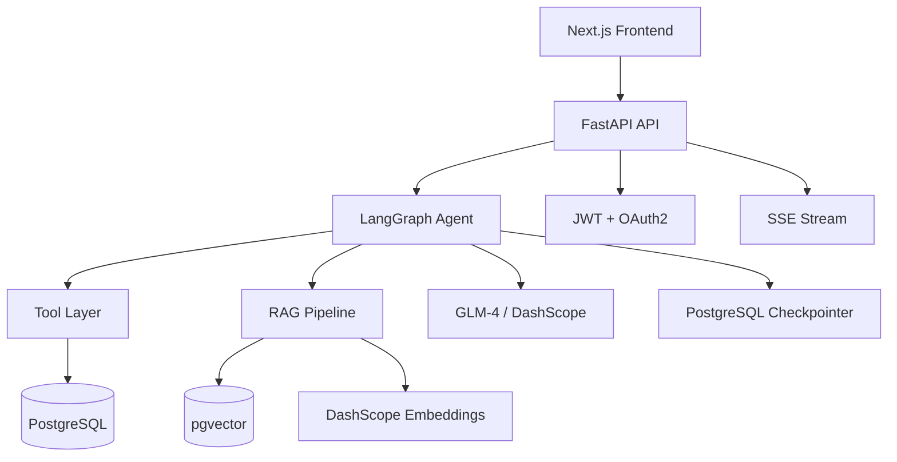
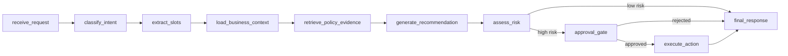

<objective>
Create CI workflow, demo execution script, and interview-ready README with architecture diagrams.

Purpose: Establishes CI baseline (INFR-08) with lint + unit tests, provides a reproducible 10-minute demo script, and produces a README that communicates project value to interviewers in under 2 minutes.

Output: `.github/workflows/ci.yml`, `scripts/demo_phase6.sh`, `README.md` (rewritten)
</objective>

<execution_context>
@$HOME/.claude/get-shit-done/workflows/execute-plan.md
@$HOME/.claude/get-shit-done/templates/summary.md
</execution_context>

<context>
@.planning/PROJECT.md
@.planning/ROADMAP.md
@.planning/STATE.md
@.planning/phases/06-evaluation-polish/06-CONTEXT.md
@.planning/phases/06-evaluation-polish/06-RESEARCH.md
@.planning/phases/06-evaluation-polish/06-PATTERNS.md
@.planning/phases/06-evaluation-polish/06-02-SUMMARY.md
</context>

<tasks>

<task type="auto">
  <name>Task 1: Create GitHub Actions CI workflow</name>
  <files>.github/workflows/ci.yml</files>
  <read_first>
    - Makefile
    - pyproject.toml
  </read_first>
  <action>
Create `.github/workflows/ci.yml` with the following configuration:

```yaml
name: CI

on:
  push:
    branches: [main]
  pull_request:
    branches: [main]

jobs:
  lint:
    runs-on: ubuntu-latest
    steps:
      - uses: actions/checkout@v4
      - uses: astral-sh/setup-uv@v4
        with:
          version: "latest"
      - run: uv sync --extra dev
      - run: uv run ruff check .
      - run: uv run ruff format --check .

  test:
    runs-on: ubuntu-latest
    steps:
      - uses: actions/checkout@v4
      - uses: astral-sh/setup-uv@v4
        with:
          version: "latest"
      - run: uv sync --extra dev
      - run: uv run pytest tests/ -x --ignore=tests/integration -q --tb=short
    env:
      UV_CACHE_DIR: /tmp/uv-cache
```

**Design decisions per D-07b and INFR-08:**
- CI runs lint (ruff check + format check) and unit tests only
- Integration tests and eval scripts are local-only (they need DB + potentially LLM)
- `--ignore=tests/integration` excludes DB-dependent tests
- Uses `astral-sh/setup-uv@v4` for fast Python/uv setup
- Python version determined by pyproject.toml (no explicit python-version step needed with uv)
- No secrets needed — CI path uses no external APIs
- Two separate jobs (lint, test) for parallel execution and clear failure signals
  </action>
  <verify>
    <automated>test -f .github/workflows/ci.yml && grep -q "uv run ruff check" .github/workflows/ci.yml && grep -q "uv run pytest" .github/workflows/ci.yml && grep -q "actions/checkout@v4" .github/workflows/ci.yml && grep -q "astral-sh/setup-uv" .github/workflows/ci.yml && python -c "import yaml; yaml.safe_load(open('.github/workflows/ci.yml')); print('valid YAML')" && echo "ALL CHECKS PASSED"</automated>
  </verify>
  <acceptance_criteria>
    - `.github/workflows/ci.yml` exists and is valid YAML
    - Triggers on push to main and pull_request to main
    - Has `lint` job with `uv run ruff check .` and `uv run ruff format --check .`
    - Has `test` job with `uv run pytest tests/ -x --ignore=tests/integration`
    - Uses `actions/checkout@v4` and `astral-sh/setup-uv@v4`
    - No secrets or API keys referenced
    - No eval script execution in CI (per D-07b)
  </acceptance_criteria>
  <done>CI workflow created with lint + unit test jobs, no external dependencies</done>
</task>

<task type="auto">
  <name>Task 2: Create demo execution shell script</name>
  <files>scripts/demo_phase6.sh</files>
  <read_first>
    - scripts/seed_demo.py
    - src/moca/api/routes/auth.py
    - src/moca/api/routes/agent.py
  </read_first>
  <action>
Create `scripts/demo_phase6.sh` — a reproducible bash script that demonstrates 7 scenarios via curl against the local API.

**Script structure:**

```bash
#!/usr/bin/env bash
# MOCA Demo Script — 7 scenarios demonstrating the agent workflow system
# Prerequisites: docker compose up, make seed
# Usage: bash scripts/demo_phase6.sh

set -euo pipefail

BASE_URL="${MOCA_BASE_URL:-http://localhost:8000}"
```

**7 scenarios (per D-06c):**

1. **Get auth tokens** — Obtain JWT for support_agent (cs_zhang) and manager (mgr_li):
```bash
# Login as support agent
AGENT_TOKEN=$(curl -s -X POST "$BASE_URL/api/v1/auth/token" \
  -H "Content-Type: application/x-www-form-urlencoded" \
  -d "username=cs_zhang&password=moca2024" | jq -r '.access_token')

# Login as manager
MANAGER_TOKEN=$(curl -s -X POST "$BASE_URL/api/v1/auth/token" \
  -H "Content-Type: application/x-www-form-urlencoded" \
  -d "username=mgr_li&password=moca2024" | jq -r '.access_token')
```

2. **Policy QA** — Ask about refund timeout rules:
```bash
curl -s -X POST "$BASE_URL/api/v1/agent/chat" \
  -H "Authorization: Bearer $AGENT_TOKEN" \
  -H "Content-Type: application/json" \
  -d '{"query": "平台的退款超时处理规则是什么？", "thread_id": "demo-thread-01"}' | jq .
```

3. **Refund troubleshooting** — Ask about a specific order's refund status (use a seeded order ID):
```bash
curl -s -X POST "$BASE_URL/api/v1/agent/chat" \
  -H "Authorization: Bearer $AGENT_TOKEN" \
  -H "Content-Type: application/json" \
  -d '{"query": "订单ORD-20240315-001的退款进度如何？", "thread_id": "demo-thread-02"}' | jq .
```

4. **Compensation suggestion (high-risk trigger)** — Request compensation above threshold:
```bash
CHAT_RESPONSE=$(curl -s -X POST "$BASE_URL/api/v1/agent/chat" \
  -H "Authorization: Bearer $AGENT_TOKEN" \
  -H "Content-Type: application/json" \
  -d '{"query": "客户投诉订单ORD-20240315-002延迟发货，要求补偿600元", "thread_id": "demo-thread-03"}')
echo "$CHAT_RESPONSE" | jq .
APPROVAL_ID=$(echo "$CHAT_RESPONSE" | jq -r '.approval_request_id // empty')
```

5. **Permission denied** — Try approval with wrong role:
```bash
curl -s -X POST "$BASE_URL/api/v1/approvals/${APPROVAL_ID:-placeholder}/decide" \
  -H "Authorization: Bearer $AGENT_TOKEN" \
  -H "Content-Type: application/json" \
  -d '{"decision": "approve", "reason": "测试"}' | jq .
# Expected: 403 Forbidden (support agent cannot approve)
```

6. **Approval rejected** — Manager rejects the approval:
```bash
curl -s -X POST "$BASE_URL/api/v1/approvals/${APPROVAL_ID:-placeholder}/decide" \
  -H "Authorization: Bearer $MANAGER_TOKEN" \
  -H "Content-Type: application/json" \
  -d '{"decision": "reject", "reason": "补偿金额超出合理范围，建议降至200元"}' | jq .
```

7. **Trace query** — Get execution trace for the last run:
```bash
curl -s "$BASE_URL/api/v1/agent-runs" \
  -H "Authorization: Bearer $AGENT_TOKEN" | jq '.[-1]'
```

**Script conventions:**
- Each scenario has a header comment with scenario number and description
- Use `echo` statements between scenarios for readability: `echo -e "\n=== Scenario N: [description] ===\n"`
- Use `jq .` for pretty-printing JSON responses
- Use `sleep 1` between scenarios to avoid rate limiting
- Script is executable (`chmod +x`)
- All order IDs must match what `scripts/seed_demo.py` produces (read seed_demo.py to confirm actual IDs)
- If an approval_id is not returned (e.g., in mock mode), use a fallback message instead of failing

**Per D-06f:** The script works against the real API but does not depend on real LLM responses. The API already handles FakeLLM/mock paths when DASHSCOPE_API_KEY is not set or when using the test configuration.
  </action>
  <verify>
    <automated>test -f scripts/demo_phase6.sh && test -x scripts/demo_phase6.sh && grep -q "api/v1/agent/chat" scripts/demo_phase6.sh && grep -q "api/v1/auth/token" scripts/demo_phase6.sh && grep -q "api/v1/approvals" scripts/demo_phase6.sh && grep -c "Scenario" scripts/demo_phase6.sh | grep -q "[67]" && bash -n scripts/demo_phase6.sh && echo "ALL CHECKS PASSED"</automated>
  </verify>
  <acceptance_criteria>
    - `scripts/demo_phase6.sh` exists and is executable
    - Passes `bash -n` syntax check
    - Contains 7 scenarios with curl commands
    - Authenticates as cs_zhang (support) and mgr_li (manager)
    - Hits endpoints: /api/v1/auth/token, /api/v1/agent/chat, /api/v1/approvals/{id}/decide, /api/v1/agent-runs
    - Uses `jq .` for output formatting
    - Has `set -euo pipefail` at top
    - Uses `BASE_URL` variable (configurable via MOCA_BASE_URL env)
  </acceptance_criteria>
  <done>Demo script with 7 scenarios covering happy path, approval, permission denied, rejection, and trace query</done>
</task>

<task type="auto">
  <name>Task 3: Rewrite README.md as interview-ready project showcase</name>
  <files>README.md</files>
  <read_first>
    - README.md
    - .planning/phases/06-evaluation-polish/06-CONTEXT.md
    - src/moca/agent/graph.py
    - docker-compose.yml
  </read_first>
  <action>
Rewrite `README.md` following D-04 structure. The README must communicate project value to an interviewer scanning for 1-2 minutes (upper half) while providing developer quick-start (lower half).

**Section structure (per D-04e):**

**1. Project Overview** (3-4 sentences):
- MOCA = Merchant Operations Copilot Agent
- Not a generic chatbot — a structured agent workflow system for merchant refund/compensation operations
- Built with LangGraph state machine, RAG evidence retrieval, human-in-the-loop approval, and full audit trail
- Tech stack one-liner: Python 3.12, FastAPI, LangGraph, PostgreSQL + pgvector, Redis, Next.js

**2. Key Capabilities** (bullet list, 6-8 items):
- Intent classification and multi-step workflow routing
- RAG-based policy evidence retrieval with citation validation
- Deterministic risk assessment with configurable rules
- Human-in-the-loop approval for high-risk actions (LangGraph interrupt/resume)
- Full execution trace and audit trail
- SSE streaming for progressive status updates
- Role-based access control with OAuth2 scopes
- Comprehensive evaluation framework with golden set scoring

**3. Architecture Diagram** — 2 Mermaid diagrams per D-04c:

Diagram 1 — System Architecture (show services and data flow):


Diagram 2 — Agent Workflow (show graph nodes and routing):


**4. 10-Minute Demo** (brief, links to docs/demo-walkthrough.md):
- Prerequisites: Docker, make
- Quick commands: `make up && make seed && bash scripts/demo_phase6.sh`
- Link: "See [docs/demo-walkthrough.md](docs/demo-walkthrough.md) for the full annotated walkthrough"

**5. Evaluation Summary** (per specifics: show actual metric numbers inline):
- Table with metrics: RAG Hit@5, Intent Accuracy, Tool Selection, Citation Rate, Safety Interception
- Note: "Run `make eval` to reproduce. See [docs/evaluation.md](docs/evaluation.md) for methodology."
- Placeholder values (to be filled after eval runs): use format like `>= 85%` for thresholds

**6. Quick Start:**
```bash
cp .env.example .env
docker compose up --build
make migrate
make seed
# API docs at http://localhost:8000/docs
# Frontend at http://localhost:3000
```

**7. Repository Structure** (tree-style, key directories only):
```
src/moca/
├── agent/          # LangGraph nodes, tools, graph assembly
├── api/            # FastAPI routes, auth, SSE
├── db/             # SQLAlchemy models, migrations
├── rag/            # Embedder, retriever, chunker
├── repositories/   # Data access layer
scripts/            # Eval, seed, demo, ingestion
evaluation/         # Golden sets and reports
frontend/           # Next.js chat + approval UI
docs/               # Architecture, demo, security docs
rules/              # Risk rules YAML configuration
```

**8. Technical Notes** (brief, link to docs/):
- Architecture details: [docs/architecture.md](docs/architecture.md)
- Security & permissions: [docs/security-and-permission.md](docs/security-and-permission.md)
- Evaluation methodology: [docs/evaluation.md](docs/evaluation.md)

**9. Current Scope and Limitations:**
- All tools are simulated (no real payment/refund execution)
- Single-tenant demo mode (multi-tenant architecture ready but not production-hardened)
- Chinese demo data, English documentation
- SSE streaming (no WebSocket)
- Same-thread memory only (no cross-session)

**Writing style:**
- Concise, factual, no marketing fluff
- Emphasize this is a workflow system, not a chatbot
- Show technical depth without being verbose
- No emojis
- English language (per project convention: Chinese demo data, English README)
  </action>
  <verify>
    <automated>grep -q "mermaid" README.md && grep -q "Project Overview\|## MOCA" README.md && grep -q "Key Capabilities" README.md && grep -q "Quick Start" README.md && grep -q "Repository Structure" README.md && grep -q "Evaluation Summary\|Evaluation" README.md && grep -q "demo-walkthrough" README.md && grep -q "architecture.md" README.md && grep -q "graph TB\|graph LR\|flowchart" README.md && wc -l < README.md | awk '{if ($1 > 80) print "OK: README has", $1, "lines"; else {print "FAIL: too short"; exit 1}}'</automated>
  </verify>
  <acceptance_criteria>
    - README.md has sections: Project Overview, Key Capabilities, Architecture (with mermaid), 10-Minute Demo, Evaluation Summary, Quick Start, Repository Structure, Technical Notes, Current Scope and Limitations
    - Contains 2 Mermaid diagrams (system architecture + agent workflow)
    - Links to docs/demo-walkthrough.md, docs/evaluation.md, docs/architecture.md, docs/security-and-permission.md
    - Quick Start section has docker compose + make commands
    - Repository Structure shows key directories
    - No emojis
    - English language
    - More than 80 lines (comprehensive but not bloated)
  </acceptance_criteria>
  <done>README rewritten as interview-ready showcase with architecture diagrams, eval summary, and developer quick-start</done>
</task>

</tasks>

<threat_model>
## Trust Boundaries

| Boundary | Description |
|----------|-------------|
| CI runner → repository code | CI executes code from PRs; lint+test only, no secrets exposed |
| demo script → local API | Demo script sends curl requests to localhost; no external exposure |

## STRIDE Threat Register

| Threat ID | Category | Component | Disposition | Mitigation Plan |
|-----------|----------|-----------|-------------|-----------------|
| T-06-07 | Information Disclosure | .github/workflows/ci.yml | mitigate | CI workflow uses no secrets. No eval scripts run in CI (per D-07b). No API keys referenced. |
| T-06-08 | Information Disclosure | scripts/demo_phase6.sh | mitigate | Demo script uses only local demo credentials (moca2024). No real API keys. BASE_URL defaults to localhost. |
| T-06-09 | Spoofing | .github/workflows/ci.yml | accept | Standard GitHub Actions security model. Uses pinned action versions (@v4). No third-party actions beyond actions/checkout and astral-sh/setup-uv. |
| T-06-10 | Injection | scripts/demo_phase6.sh | mitigate | All curl payloads are static JSON strings. No user input interpolation. MOCA_BASE_URL is the only external input and is used only as URL prefix. |
</threat_model>

<verification>
1. `.github/workflows/ci.yml` is valid YAML with lint + test jobs
2. `scripts/demo_phase6.sh` passes bash syntax check and has 7 scenarios
3. `README.md` has all D-04e sections and 2 Mermaid diagrams
4. No secrets or credentials in any file (only demo password moca2024 which is public)
5. CI does not run eval scripts (per D-07b)
</verification>

<success_criteria>
- CI workflow would pass on current codebase (lint + unit tests)
- Demo script is executable and covers all 7 scenarios from D-06c
- README communicates project value within 1-2 minute scan
- All cross-references to docs/ files are consistent
</success_criteria>

<output>
After completion, create `.planning/phases/06-evaluation-polish/06-03-SUMMARY.md`
</output>
