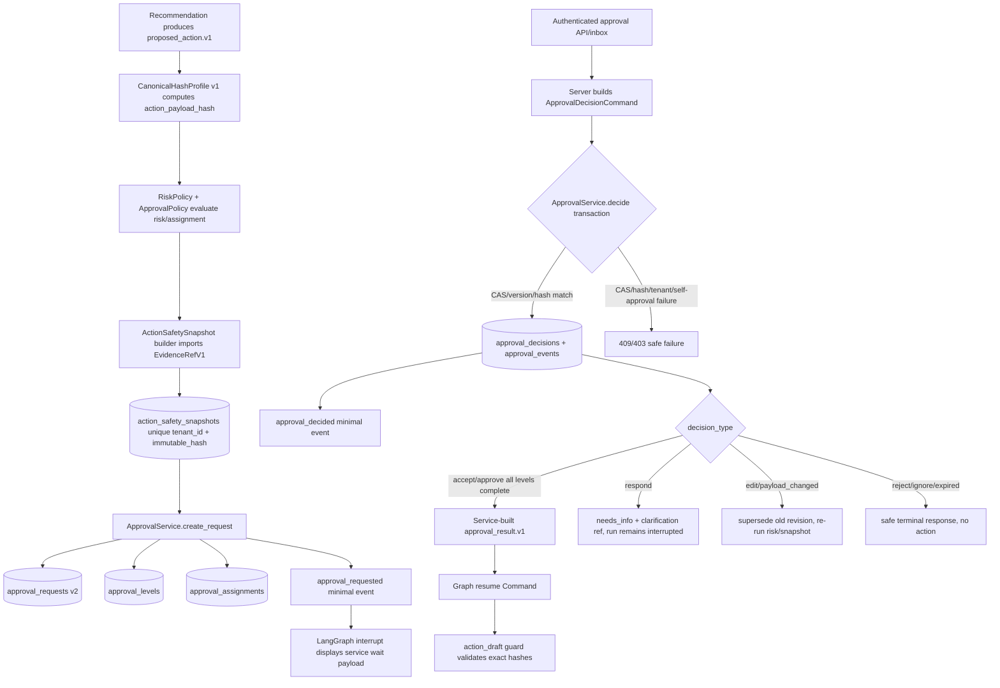

# Phase 13: Approval State Machine - Research

**Researched:** 2026-06-15
**Domain:** Approval lifecycle state machine, canonical hashing, action safety snapshots, schema migration, trusted resume boundaries
**Confidence:** HIGH for project contracts/current code; MEDIUM for exact implementation slice count because final task decomposition belongs to planning.

<user_constraints>
## User Constraints (from CONTEXT.md)

Copied verbatim from `.planning/phases/13-approval-state-machine/13-CONTEXT.md`. [VERIFIED: `.planning/phases/13-approval-state-machine/13-CONTEXT.md`]

### Locked Decisions

### Owner Package and Module Boundaries
- **D-01:** Add `src/approvals/` as the canonical approval/snapshot domain package. It owns `ApprovalService`, approval command/result schemas, `ApprovalPolicy`, approval state machine transitions, assignment resolution, approval repository access, `ActionSafetySnapshot` schema/builder, and approval event emission.
- **D-02:** `src/api/routers/approvals.py`, `src/api/routers/agent.py`, and `src/api/routers/agent_runs.py` must stop creating/updating approval truth directly. They may authenticate, parse HTTP/SSE inputs, construct trusted server-side command objects from authenticated actor context, call `ApprovalService`, and invoke graph resume only with a service-produced trusted resume payload.
- **D-03:** Implement `CanonicalHashProfile v1` in `src/common/canonical_hash.py`. Although Phase 13 produces the profile, it is shared by approvals, actions, replay, and future memory identity work. Consumers must import the shared module, not import approval internals or define their own serializer.
- **D-04:** Implement `ActionSafetySnapshot` schema and builder in `src/approvals/snapshots.py` or an equivalent `src/approvals/` module. The builder imports the canonical `EvidenceRefV1` from `src/knowledge/schemas.py`; it must not define a reduced snapshot-only evidence schema.
- **D-05:** Move or replace `src/repositories/approval_repo.py` with a package-owned repository such as `src/approvals/repository.py`. If a compatibility shim remains, it is owned by `src/approvals/`, forbidden for new imports, covered by a static import-boundary test, and removed in Phase 13 unless a concrete removal commit is recorded.
- **D-06:** `ApprovalPolicy` owns role/assignment resolution, self-approval policy, SLA due time calculation, and single-level default assignment behavior. Hard-coded router constants such as `APPROVAL_ROLES` are compatibility inputs, not the long-term policy source.

### Database Strategy
- **D-07:** Phase 13 creates the normalized `action_safety_snapshots` table now. Phase 14 must not invent snapshot/evidence hash fields independently. The table is the only canonical target snapshot store, with `unique (tenant_id, immutable_hash)`.
- **D-08:** Phase 13 directly introduces target approval tables: `approval_levels`, `approval_assignments`, `approval_decisions`, and `approval_events`, while extending `approval_requests` to `approval_request.v2`. Do not stop at only expanding the v1 single-row `approval_requests` shape.
- **D-09:** Runtime may remain single-level in Phase 13, but it must run through the new level/assignment/decision model. Multi-level behavior is schema-compatible and contract-tested; full multi-level UI/queue optimization can remain later.
- **D-10:** New active `approval_requests` records must be non-null for `schema_version`, `tenant_id`, `run_id`, `thread_id`, `status`, `approval_policy_id`, `policy_version`, `revision`, `version`, `action_payload_hash`, `safety_snapshot_ref`, `safety_snapshot_hash`, `risk_level`, `requested_by`, `created_at`, and `updated_at`.
- **D-11:** New active `approval_levels` records must be non-null for request FK, schema version, level number, version, status, required role, mode, and timestamps. New active `approval_assignments` must be non-null for level FK, schema version, assigned role, status, version, and timestamps; `assigned_to_user_id` may be nullable when assigned by role.
- **D-12:** `approval_decisions` and `approval_events` are append-only audit truth. They must carry redundant tenant/run/revision/version fields where needed to validate cross-table ownership in one transaction.
- **D-13:** Immutable after creation: request `tenant_id`, `run_id`, `thread_id`, `requested_by`, `revision`, `approval_policy_id`, `policy_version`, `action_payload_hash`, `safety_snapshot_ref`, `safety_snapshot_hash`; snapshot `snapshot_json`, `immutable_hash`, `action_payload_hash`, config versions, evidence refs; level identity fields; assignment identity fields; decision/event content. Status/version/timestamps may transition only through service CAS.
- **D-14:** Historical v1 approval rows may keep nullable hash/snapshot/version fields during migration, but they cannot authorize action. They may be displayed, rejected, cancelled, expired, or superseded. Approving a historical row requires revalidation into a new v2 revision with a fresh action payload hash and safety snapshot hash.
- **D-15:** Legacy aliases `policy_snapshot_ref` and `evidence_snapshot_ref`, if retained or added for migration, are nullable compatibility aliases only. They are never authorization guards and cannot replace `safety_snapshot_hash`.
- **D-16:** `approval_events.replay_event_id` is nullable. Since `agent_trace_events` already exists, Phase 13 may write it when available; unresolved historical/backfill refs stay null for Phase 15.

### ApprovalService Boundary
- **D-17:** `ApprovalService` is the only component allowed to perform approval state transitions. It owns transaction order: lock/CAS request -> current level -> assignment -> insert decision/event -> emit minimal approval event -> return typed result.
- **D-18:** Router code must not call `ApprovalRepository.decide(...)`, `mark_expired(...)`, or raw SQL transition helpers directly. Add a static boundary test proving approval routers and agent run routers do not import the repository compatibility path.
- **D-19:** `ApprovalDecisionCommand` is constructed server-side from authenticated user, tenant, request body, and expected versions. User text, LLM output, ordinary chat payload, or raw resume payload cannot set trusted markers, request versions, `approval_result`, or graph resume data.
- **D-20:** `ApprovalService.decide(command)` returns a typed `ApprovalDecisionResult` containing status, transition outcome, exact revision/version refs, hashes, event refs, and an optional service-built `approval_result.v1` resume payload. The router may wrap this in `Command(resume=...)`; it must not assemble the dict itself.
- **D-21:** Current router responsibilities for self-approval, expiration, stale decision idempotency, conflict handling, step/event writing, and post-resume trace/run persistence must move behind service/domain helpers. The router remains an HTTP boundary and trusted command invoker.
- **D-22:** `respond` writes request status `needs_info`, creates/returns a clarification reference, emits an approval decision event, and leaves the run interrupted. It must not resume the old approval into `action_draft`.
- **D-23:** `edit` marks the old request revision `superseded`, persists edited proposed action material as a new candidate/revision, and routes back through risk/snapshot validation. It cannot directly approve or draft an edited action.

### Snapshot and Hash Contract
- **D-24:** The first implementation slice should be `CanonicalHashProfile v1` plus golden tests, followed immediately by `ActionSafetySnapshot` schema/builder plus golden tests. Do not start API/router migration before golden bytes fix the serialization contract.
- **D-25:** `CanonicalHashProfile v1` follows `docs/contract-spec.md` exactly: SHA-256 output as `sha256:<lowercase hex>`, input bytes `hash_profile.v1\n<schema_version>\n<canonical_json>`, Unicode-code-point key ordering, no insignificant whitespace, UTF-8, no runtime default serializer dependency, no bare JSON float, normalized money strings, fixed-millisecond UTC datetimes, explicit nullable fields, and unknown fields rejected.
- **D-26:** `proposed_action.v1` canonical hash is the only `action_payload_hash`. ApprovalService, snapshot builder, ActionDraftService, and future ActionExecutor must compute the same value for the same proposed action.
- **D-27:** `ActionSafetySnapshot.immutable_hash` covers the canonical projection that excludes only `immutable_hash`, lifecycle fields, and `EvidenceRefV1.score`; it retains `rank` when present and uses rank-aware evidence sorting from `docs/contract-spec.md` Section 8.3.
- **D-28:** Runtime order: proposed action canonicalization -> `action_payload_hash` -> risk/approval policy -> `ActionSafetySnapshot` row -> approval request or auto-allowed action path. `approval_gate`, action draft, and future external execution validate snapshot/hash; they do not produce new snapshots except when `ApprovalService` creates a new revision from `edit` or `needs_info`.
- **D-29:** Approval authorization requires exact match of `action_payload_hash + safety_snapshot_hash`. Stale revision, changed payload, changed evidence text/hash/ref/rank, changed policy/risk/retrieval config version, missing snapshot, or mismatched hash all fail closed and must not enter action.
- **D-30:** Snapshot and replay/approval events must not contain raw prompt, raw tool args, raw action payload, raw tool output, secrets, credentials, or unredacted PII. They may contain IDs, refs, hashes, versions, safe summaries, status enums, and redacted audit metadata.

### Old Path Quarantine and Deletion
- **D-31:** `ApprovalRepository.decide(...)` is an obsolete v1 transition API. Prefer deleting it during Phase 13. If kept briefly for migration, make it package-private, route it only through `ApprovalService`, add a no-router-import test, and name Phase 13 as its removal phase.
- **D-32:** `ApprovalStep` is a compatibility audit row for current `/trace` timeline only. The final approval event model is `approval_events` plus minimal `agent_trace_events` approval additions. Do not add new target behavior to `ApprovalStep`.
- **D-33:** `TraceRepository.build_timeline` may continue to compose legacy `AgentStep` / `ApprovalStep` / `ActionDraft` rows as a read fallback until Phase 15. New Phase 13 approval events should be emitted to `approval_events` and the minimal event envelope first.
- **D-34:** `approval_gate` may retain LangGraph interrupt/resume orchestration and append node trace summaries. It may show a service-generated approval wait payload. It cannot be the source of approval truth, cannot compute hashes, cannot decide expiry/self-approval, cannot mutate request status directly, and cannot accept untrusted chat state as an approval result.
- **D-35:** Current agent chat and SSE interruption handlers must stop creating `ApprovalRequest` rows from raw interrupt payloads. If LangGraph mechanics still surface an interrupt payload at API time, the handler must pass typed payload data to `ApprovalService.create_request(...)` and persist only the service result.
- **D-36:** Phase 13 must not implement Phase 14/15/17 behavior under approval names. No `draft_outcome.v1`, no `action_executions`, no outbox, no external adapter, no full replay read API, no lifecycle finalizer, and no compensation records.

### Acceptance Test Floor
- **D-37:** `canonical_hash` golden bytes for `proposed_action.v1` must reproduce the `docs/contract-spec.md` sample exactly, including `canonical_json`, `hash_input`, and expected SHA-256.
- **D-38:** `action_safety_snapshot.v1` must have its own golden bytes test with fixed canonical JSON, hash input bytes, and expected SHA-256.
- **D-39:** Hash negative tests are blocking: unknown fields, null vs absent, money scale, datetime precision, evidence order, score stripping, key order stability, changed payload, changed snapshot hash, changed evidence hash/ref/rank, and changed config version.
- **D-40:** Approval transition tests are blocking: stale request version, stale level version, stale assignment version, stale revision, self-approval, expired approval, wrong tenant, wrong assignment-level/request binding, and CAS conflict all fail closed.
- **D-41:** `respond` -> `needs_info` tests must prove no action is drafted or resumed from the old approval, the clarification identity/scope/version is bound, and timeout/cancel/wrong tenant/wrong thread all fail closed.
- **D-42:** `edit` tests must prove old revision becomes `superseded`, the edited action gets a new payload hash, risk/snapshot validation reruns, and the old revision cannot execute.
- **D-43:** Event/redaction tests must prove approval event additions are registered in the minimal envelope and that snapshot/replay/approval event payloads contain no raw prompt, raw args, raw payload, raw tool output, or PII-heavy fields.
- **D-44:** Boundary tests must prove routers do not perform approval transitions directly and graph nodes do not import raw external/action/business adapters for approval decisions.
- **D-45:** `approval_decided` event tests must prove the minimal event payload/resource refs distinguish `accept|approve|edit|respond|reject|ignore`, carry old/new revision refs for `edit/respond` or hash/config changes, and never require Phase 15 to fabricate decision semantics during replay backfill.
- **D-46:** The Phase 13 plan must instantiate the migration rollout protocol: nullable expand/backfill where needed, migration report fields, v1 legacy approval rows marked non-executable unless revalidated into v2, read-switch owner/config/fallback telemetry, rollback behavior, and cleanup/deletion gates for compatibility paths.
- **D-47:** The Phase 13 plan must copy the relevant `docs/contract-spec.md` Section 18.2 cross-table enforcement row for `decision -> assignment -> level -> request` and list all required mismatch transaction tests; omitting the row blocks execution readiness.
- **D-48:** The active SLA scanner remains Phase 13-owned but feature-disabled at Phase 13 exit. Phase 15 owns the enablement gate after replay coverage exists; if Phase 15 does not pass that gate, it must explicitly keep the scanner disabled with rollback/telemetry noted.

### Claude's Discretion
- Exact file names inside `src/approvals/` may follow local conventions if ownership stays clear.
- Planner may decide whether to physically delete `src/repositories/approval_repo.py` or leave a temporary import shim, but the shim must be forbidden for new references and removed in Phase 13 unless an explicit exception is recorded.
- Planner may choose the exact Pydantic dataclass names for commands/results/snapshots, but schema versions and field semantics are fixed by `docs/contract-spec.md`.

### Deferred Ideas (OUT OF SCOPE)
- Phase 14 owns `draft_outcome.v1`, final response demo wording, `action_drafts` v2 completion, and draft-only action boundary.
- Phase 15 owns full replay read API, lifecycle finalizer, V3 enrichment, retention/backfill, and `/replay` read-switch.
- Phase 17 owns real external action execution, execution/outbox/reconciliation/compensation tables, worker claim semantics, and real side effects.
- Phase 16 owns long-term/case memory and must not be used for approval evidence or snapshot truth.
</user_constraints>

<phase_requirements>
## Phase Requirements

| ID | Description | Research Support |
|----|-------------|------------------|
| APPROVAL-01 | Approval transitions, request/level/assignment CAS, and revision invalidation are enforced. [VERIFIED: `.planning/REQUIREMENTS.md`] | Use `src/approvals/ApprovalService` as the only transition owner; implement request -> level -> assignment CAS in one transaction and add stale version/revision mismatch tests. [CITED: `docs/contract-spec.md` Sections 15.4 and 18.2; VERIFIED: `src/api/routers/approvals.py`, `src/repositories/approval_repo.py`] |
| APPROVAL-02 | Approval `needs_info` resume validates clarification identity, scope, versions, changed facts, and old-revision prohibition. [VERIFIED: `.planning/REQUIREMENTS.md`] | Add trusted `respond`/`attach_info` commands and tests for wrong clarification id, wrong tenant/thread, stale expected versions, payload/evidence changes, timeout/cancel, and old revision cannot execute. [CITED: `docs/contract-spec.md` Section 9.6 and Section 15.4] |
| APPROVAL-03 | Single-level runtime is complete and multi-level-compatible contracts are verified; active SLA scanner remains an owned gate. [VERIFIED: `.planning/REQUIREMENTS.md`] | Run single-level through target request/level/assignment/decision/event tables; implement scanner disabled-by-default with event-shape tests and Phase 15 enablement gate. [CITED: `docs/agent-architecture-phase-decomposition.md` Section 3 and Section 6] |
| SNAPSHOT-01 | `ActionSafetySnapshot` and `CanonicalHashProfile` bind approval, draft, and execution to exact payload/evidence/config hashes. [VERIFIED: `.planning/REQUIREMENTS.md`] | Start with canonical hash and snapshot golden tests, then enforce exact `action_payload_hash + safety_snapshot_hash` through ApprovalService and action guard handoff. [CITED: `docs/contract-spec.md` Sections 8.3, 15.3, and 18.2] |
</phase_requirements>

## Summary

Phase 13 should be planned as a domain migration, not an incremental router patch: the current code stores a single-row `ApprovalRequest` plus `ApprovalStep`, and the approval API currently owns role checks, expiry checks, transition mutation, graph resume payload construction, run status updates, and trace persistence. [VERIFIED: `src/db/models.py`, `src/repositories/approval_repo.py`, `src/api/routers/approvals.py`] The target architecture assigns approval truth to `src/approvals/ApprovalService`, normalized request/level/assignment/decision/event tables, and `ActionSafetySnapshot` plus `CanonicalHashProfile v1`. [CITED: `docs/phase-13-17-architecture-plan.md`; VERIFIED: `.planning/phases/13-approval-state-machine/13-CONTEXT.md`]

The first planning slice must freeze bytes before behavior: implement `src/common/canonical_hash.py` and golden tests for `proposed_action.v1`, then implement `src/approvals/snapshots.py` and golden tests for `action_safety_snapshot.v1`, because all later approval/action/replay consumers depend on the exact hash projection. [CITED: `docs/contract-spec.md` Section 15.3; VERIFIED: `.planning/phases/13-approval-state-machine/13-CONTEXT.md` D-24..D-30] After that, the plan should migrate schema and service boundaries, then cut API/graph callers over to trusted service commands and service-produced resume payloads. [CITED: `docs/phase-13-17-architecture-plan.md` Implementation Sequence; VERIFIED: `src/api/routers/agent_runs.py`, `src/agent/nodes/approval_gate.py`]

**Primary recommendation:** Plan Phase 13 in this order: canonical hash golden contract -> snapshot golden contract -> v2 approval/snapshot migrations -> ApprovalService transaction boundary -> API/SSE/graph cutover -> approval event emission -> boundary/static tests -> legacy test rewrite and migration report. [CITED: `docs/phase-13-17-architecture-plan.md`; VERIFIED: `.planning/phases/13-approval-state-machine/13-CONTEXT.md`]

## Project Constraints (from CLAUDE.md)

- `docs/contract-spec.md` is MOCA's normative contract source for contract semantics, but phase artifacts decide implementation scope and must not treat target-state spec text as implemented fact. [VERIFIED: `CLAUDE.md`]
- If implementation and spec diverge, the phase must record whether the spec is wrong or the implementation is an MVP compromise; silent divergence is forbidden. [VERIFIED: `CLAUDE.md`]
- Deferred items must name an owner phase rather than vague future work. [VERIFIED: `CLAUDE.md`]
- Phase-level plans and large changes use the dual-AI review workflow; Codex is expected to independently cross-check plans/results against repo code, docs, and tests. [VERIFIED: `CLAUDE.md`]
- Reviews should use `rg`/grep first, then read targeted snippets; claims must distinguish verified from unverified. [VERIFIED: `CLAUDE.md`]

## Architectural Responsibility Map

| Capability | Primary Tier | Secondary Tier | Rationale |
|------------|-------------|----------------|-----------|
| Canonical hash profile | Shared backend library | Approval/action/replay consumers | Hash bytes must be common across approvals, actions, replay, and future memory identity, so `src/common/canonical_hash.py` owns serialization and SHA-256 formatting. [CITED: `docs/contract-spec.md` Section 15.3; VERIFIED: `.planning/phases/13-approval-state-machine/13-CONTEXT.md` D-03] |
| Action safety snapshot | API / Backend domain service | Database / Storage | Snapshot construction is trusted backend logic and persistence is normalized in `action_safety_snapshots`; clients and graph payloads only receive refs/hashes. [CITED: `docs/contract-spec.md` Sections 15.3 and 18.2] |
| Approval transitions and CAS | API / Backend domain service | Database / Storage | Transitions require transaction-owned request/level/assignment version guards plus decision/event writes. [CITED: `docs/contract-spec.md` Sections 15.4 and 18.2] |
| Approval request/level/assignment storage | Database / Storage | API / Backend service | Tables hold immutable audit and CAS state; service validates cross-table ownership and state transitions. [CITED: `docs/contract-spec.md` Section 18.2] |
| Trusted approval command entry | API / Backend | Frontend / Inbox client | Authenticated API/inbox constructs `ApprovalDecisionCommand` from server-side actor/tenant/version context; ordinary chat cannot create approval decisions. [CITED: `docs/contract-spec.md` Section 9.6; VERIFIED: `src/auth/permissions.py`] |
| Graph interrupt/resume mechanics | API / Backend + LangGraph node | Database / Storage | `approval_gate` may interrupt and route, but persistent truth and trusted resume payloads come from `ApprovalService`. [CITED: `docs/phase-13-17-architecture-plan.md`; VERIFIED: `src/agent/nodes/approval_gate.py`] |
| Approval event emission | API / Backend event helper | Database / Storage | Phase 13 registers approval event types on the Phase 10 minimal envelope and writes `approval_events`; Phase 15 later enriches replay. [CITED: `docs/contract-spec.md` Section 17.2; VERIFIED: `src/agent/events.py`] |
| SLA scanner | API / Backend background/CLI owner | Database / Storage + Replay later | Phase 13 owns scanner implementation and disabled-by-default tests; Phase 15 owns enablement after replay coverage. [CITED: `docs/agent-architecture-phase-decomposition.md` Section 3 and Section 6] |

## Standard Stack

### Core

| Library | Version | Purpose | Why Standard |
|---------|---------|---------|--------------|
| Python | >=3.12 project target | Backend runtime | Project `pyproject.toml` requires Python >=3.12. [VERIFIED: `pyproject.toml`] |
| FastAPI | 0.136.1 local installed | Trusted approval HTTP boundary | Existing API routers use FastAPI dependencies and `Security(get_current_user, scopes=[...])`; keep router thin and service-backed. [VERIFIED: `uv run python`, `src/api/routers/approvals.py`, `src/auth/permissions.py`] |
| SQLAlchemy asyncio | 2.0.49 local installed | ORM and transactional repositories | Existing models/repositories use `AsyncSession`, ORM models, `select(...).with_for_update()`, and explicit flush/commit. [VERIFIED: `uv run python`, `src/db/models.py`, `src/repositories/approval_repo.py`] |
| Alembic | 1.18.4 local installed | Schema migration | Existing migrations live in `src/db/migrations/versions/`; Phase 13 must add migration after `007_session_memories`. [VERIFIED: `uv run python`, `uv run alembic heads`] |
| Pydantic | 2.13.4 local installed | Typed command/result/snapshot schemas | Existing contracts use Pydantic v2 `BaseModel`, `ConfigDict(extra="forbid")`, and `Literal` schema versions. [VERIFIED: `uv run python`, `src/tools/contracts.py`, `src/knowledge/schemas.py`] |
| LangGraph | installed through project deps | Interrupt/resume mechanics | Current graph uses `interrupt(payload)` and `Command(resume=...)`; Phase 13 keeps mechanics but removes truth ownership from graph payloads. [VERIFIED: `pyproject.toml`, `src/agent/nodes/approval_gate.py`, `src/api/routers/approvals.py`] |
| PostgreSQL / pgvector Docker service | pgvector/pgvector:pg16 service healthy | Authoritative approval/snapshot/event storage | Running project DB is PostgreSQL and existing schemas/migrations target PostgreSQL features such as JSONB, partial indexes, and advisory locks. [VERIFIED: `docker compose ps`, `src/db/models.py`, `src/agent/events.py`] |

### Supporting

| Library | Version | Purpose | When to Use |
|---------|---------|---------|-------------|
| pytest | 9.0.3 local installed | Unit/integration/contract tests | Use for canonical hash golden tests, service transaction tests, router/API tests, migration tests, static boundary tests, and event redaction tests. [VERIFIED: `uv run python`, `pyproject.toml`, `tests/`] |
| pytest-asyncio | 1.3.0 local installed | Async service/API tests | Existing tests run async DB/API fixtures and should be extended for ApprovalService CAS tests. [VERIFIED: `uv run python`, `tests/conftest.py`] |
| httpx | 0.28.1 local installed | ASGI API tests | Existing approval API tests use `AsyncClient` with `ASGITransport`; reuse for trusted command endpoint tests. [VERIFIED: `uv run python`, `tests/test_approval_api.py`, `tests/conftest.py`] |
| Docker Compose | Docker 29.4.2 local installed | Local Postgres/Redis dependencies | Existing dev DB and Redis are healthy, but DB migration version is behind head. [VERIFIED: `docker compose ps`, `uv run alembic current`] |
| Redis | redis:7-alpine service healthy | Non-authoritative cache only | Do not store approval/action/replay truth in Redis; current Redis DB size is 0. [VERIFIED: `docker compose ps`, `docker compose exec redis redis-cli DBSIZE`; CITED: `docs/agent-architecture-phase-decomposition.md` Section 6] |

### Alternatives Considered

| Instead of | Could Use | Tradeoff |
|------------|-----------|----------|
| Existing stack | New state-machine library | Do not add one: the contract requires DB-owned version CAS, immutable hashes, and cross-table mismatch tests; a generic in-memory state-machine library would not remove the core transactional work. [CITED: `docs/contract-spec.md` Sections 15.4 and 18.2] |
| Pydantic schemas | Dataclasses only | Use Pydantic for external/domain command validation because the repo already uses Pydantic extra-forbid contracts for tool and knowledge schemas. [VERIFIED: `src/tools/contracts.py`, `src/knowledge/schemas.py`] |
| Legacy `ApprovalRepository.decide(...)` | Keep and wrap router calls | Prefer delete/quarantine because current `decide(...)` updates a single row without version/hash/level/assignment guards. [VERIFIED: `src/repositories/approval_repo.py`; VERIFIED: `.planning/phases/13-approval-state-machine/13-CONTEXT.md` D-31] |

**Installation:**

```bash
uv sync --extra dev
```

**Version verification:** Local installed versions were verified with `uv run python -c "import fastapi, sqlalchemy, alembic, pydantic, pytest, pytest_asyncio, httpx; ..."`. Package publish dates were not researched because Phase 13 should use the repo's existing stack, not select new packages. [VERIFIED: command output 2026-06-15]

## Architecture Patterns

### System Architecture Diagram



This diagram follows the locked owner rule: API/graph are trusted command/display boundaries, while `ApprovalService` and storage own approval truth. [CITED: `docs/phase-13-17-architecture-plan.md`; VERIFIED: `.planning/phases/13-approval-state-machine/13-CONTEXT.md`]

### Recommended Project Structure

```text
src/
├── common/
│   └── canonical_hash.py          # CanonicalHashProfile v1 serialization and sha256 formatting.
├── approvals/
│   ├── __init__.py
│   ├── schemas.py                 # ApprovalDecisionCommand, ApprovalDecisionResult, status enums.
│   ├── snapshots.py               # ActionSafetySnapshot schema/builder and hash projection.
│   ├── policy.py                  # ApprovalPolicy assignment/self-approval/SLA logic.
│   ├── repository.py              # Package-owned SQL access for approval/snapshot tables.
│   ├── service.py                 # Only owner of create/decide/respond/edit/expire transitions.
│   └── events.py                  # approval_events + minimal envelope emission helpers.
├── db/
│   ├── models.py                  # Add snapshot + v2 approval ORM models.
│   └── migrations/versions/008_approval_state_machine.py
tests/
├── approvals/
│   ├── test_canonical_hash.py
│   ├── test_snapshots.py
│   ├── test_service_transitions.py
│   ├── test_needs_info_resume.py
│   ├── test_events.py
│   └── test_migration_contract.py
└── architecture/
    └── test_approval_boundaries.py
```

The exact file names may change inside `src/approvals/`, but the owner package and import direction are locked. [VERIFIED: `.planning/phases/13-approval-state-machine/13-CONTEXT.md` D-01 and Claude's Discretion]

### Pattern 1: Freeze Canonical Bytes Before Consumers

**What:** Implement `CanonicalHashProfile v1` and snapshot golden tests before router/API/service migration. [CITED: `docs/phase-13-17-architecture-plan.md` Implementation Sequence; CITED: `docs/contract-spec.md` Section 15.3]

**When to use:** First Phase 13 slice, before any ApprovalService or action path depends on `action_payload_hash`/`safety_snapshot_hash`. [VERIFIED: `.planning/phases/13-approval-state-machine/13-CONTEXT.md` D-24]

**Example:**

```python
# Source: docs/contract-spec.md Section 15.3
def hash_contract(schema_version: str, canonical_json: str) -> str:
    payload = f"hash_profile.v1\n{schema_version}\n{canonical_json}".encode("utf-8")
    return "sha256:" + hashlib.sha256(payload).hexdigest()
```

Planner must require tests that reproduce the spec's `proposed_action.v1` expected SHA-256 and add a separate `action_safety_snapshot.v1` golden sample. [CITED: `docs/contract-spec.md` Section 15.3; VERIFIED: `.planning/phases/13-approval-state-machine/13-CONTEXT.md` D-37 and D-38]

### Pattern 2: Transaction-Owned CAS State Machine

**What:** `ApprovalService.decide(...)` locks/CASes request, current level, and assignment in one transaction, inserts decision/event rows only after all ownership/version/hash guards pass, and returns typed results. [CITED: `docs/contract-spec.md` Sections 15.4 and 18.2]

**When to use:** All `accept|approve|edit|respond|reject|ignore|expire|payload_changed` transitions. [CITED: `docs/contract-spec.md` Section 15.4]

**Example:**

```python
# Source: docs/contract-spec.md Sections 15.4 and 18.2
async with session.begin_nested():
    request = await repo.get_request_for_update(command.approval_id, command.tenant_id)
    service.validate_versions_hashes_actor(request, command)
    level = await repo.cas_level(...)
    assignment = await repo.cas_assignment(...)
    decision = await repo.insert_decision(...)
    event = await repo.insert_approval_event(...)
```

The current `ApprovalRepository.decide(...)` is not enough because it only locks and mutates one request row and does not validate expected request/level/assignment versions or hashes. [VERIFIED: `src/repositories/approval_repo.py`]

### Pattern 3: API as Trusted Command Boundary

**What:** Routers authenticate, parse, and construct server-side trusted command objects, but never update approval state directly or assemble graph resume dictionaries. [CITED: `docs/contract-spec.md` Section 9.6; VERIFIED: `.planning/phases/13-approval-state-machine/13-CONTEXT.md` D-19 and D-20]

**When to use:** `POST /approvals/{id}/decide`, future inbox command endpoints, and approval `needs_info` reply attachment. [CITED: `docs/contract-spec.md` Section 9.6]

**Example:**

```python
# Source: docs/contract-spec.md Section 9.6
command = ApprovalDecisionCommand.from_request(
    approval_id=approval_uuid,
    body=body,
    actor_id=user.id,
    actor_role=user.role,
    tenant_id=user.tenant_id,
)
result = await approval_service.decide(command)
if result.resume_payload is not None:
    await graph.ainvoke(Command(resume=result.resume_payload), result.graph_config)
```

Current router code violates this target by checking role/self-approval/expiry, calling repository transitions, and building the resume payload itself. [VERIFIED: `src/api/routers/approvals.py`]

### Pattern 4: Minimal Event Additions Before Replay V3

**What:** Register `approval_requested`, `approval_decided`, `approval_expired`, and `approval_resumed` in the existing minimal envelope and emit redacted payloads with actor/resource refs. [CITED: `docs/contract-spec.md` Section 17.2]

**When to use:** Approval request creation, decision transitions, expiration, and trusted resume. [CITED: `docs/contract-spec.md` Section 17.2]

**Example:**

```python
# Source: src/agent/events.py and docs/contract-spec.md Section 17.2
APPROVAL_EVENT_TYPES = {
    "approval_requested",
    "approval_decided",
    "approval_expired",
    "approval_resumed",
}
MINIMAL_EVENT_TYPES.update(APPROVAL_EVENT_TYPES)
```

The existing redaction guard rejects keys such as `data`, `raw`, `arguments`, and `prompt`; Phase 13 must extend tests for raw action payload, raw tool output, secrets, credentials, and PII-heavy fields. [VERIFIED: `src/agent/events.py`, `tests/agent/test_events.py`; VERIFIED: `.planning/phases/13-approval-state-machine/13-CONTEXT.md` D-43]

### Anti-Patterns to Avoid

- **Router-owned approval truth:** The current router mutates approval status and resumes graph; Phase 13 must move this behind `ApprovalService`. [VERIFIED: `src/api/routers/approvals.py`; VERIFIED: `.planning/phases/13-approval-state-machine/13-CONTEXT.md` D-17..D-21]
- **Hashing with runtime default JSON serializer:** The contract forbids depending on default serializer behavior; use explicit canonical JSON rules and golden bytes. [CITED: `docs/contract-spec.md` Section 15.3]
- **Snapshot-only evidence schema:** The snapshot builder must import `EvidenceRefV1` and strip `score`; it must not define a reduced evidence variant. [CITED: `docs/contract-spec.md` Section 8.3; VERIFIED: `src/knowledge/schemas.py`]
- **Treating `ApprovalStep` as final event truth:** `ApprovalStep` remains a compatibility read row only; target event truth is `approval_events` plus minimal trace events. [VERIFIED: `.planning/phases/13-approval-state-machine/13-CONTEXT.md` D-32 and D-33]
- **SLA scanner enabled at exit:** Scanner implementation is Phase 13-owned but must remain feature-disabled until Phase 15 replay coverage passes. [CITED: `docs/agent-architecture-phase-decomposition.md` Section 3 and Section 6]

## Don't Hand-Roll

| Problem | Don't Build | Use Instead | Why |
|---------|-------------|-------------|-----|
| Canonical JSON by ad hoc `json.dumps` calls | Scattered serializer calls | `src/common/canonical_hash.py` with contract-owned serializer and golden tests | Default serializer choices can change key order, whitespace, floats, datetime, and absent/null behavior. [CITED: `docs/contract-spec.md` Section 15.3] |
| Approval transitions in routers | Inline `if status...` status updates | `ApprovalService` with commands/results and repository transaction helpers | Routers cannot safely own cross-table CAS, assignment closure, decisions, events, and trusted resume semantics. [CITED: `docs/contract-spec.md` Sections 9.6, 15.4, 18.2; VERIFIED: `src/api/routers/approvals.py`] |
| Reduced evidence schemas for snapshots | Dict subsets copied from retrieval | `EvidenceRefV1` plus `canonical_evidence_projection` rules | Snapshot and knowledge evidence identity must stay identical except `score` stripping and rank-aware sorting. [CITED: `docs/contract-spec.md` Section 8.3; VERIFIED: `src/knowledge/schemas.py`] |
| Custom replay/event store for approvals | Separate ad hoc event JSON | Existing `emit_event` and new `approval_events` table | Phase 10 already owns minimal envelope and per-run allocator; Phase 13 only registers approval additions. [CITED: `docs/contract-spec.md` Section 17.2; VERIFIED: `src/agent/events.py`] |
| Approval state in Redis or LangGraph checkpoint | Cache/checkpoint as source of truth | PostgreSQL approval/snapshot tables | Redis/checkpoint may assist runtime, but approval/action/replay correctness must persist in PostgreSQL audit tables. [CITED: `docs/agent-architecture-phase-decomposition.md` Section 6; VERIFIED: `docker compose exec redis redis-cli DBSIZE`] |
| Direct graph resume payloads from clients | User/LLM JSON setting `approval_result` | Service-produced `approval_result.v1` trusted resume payload | Ordinary chat and raw payloads cannot set trusted markers, versions, or resume commands. [CITED: `docs/contract-spec.md` Section 9.6; VERIFIED: tests in `tests/agent/test_intent_routing.py` and `tests/agent/test_clarification_gate.py`] |

**Key insight:** The complexity is not the enum transition table; it is binding a human decision to one immutable action/evidence/config revision under tenant/user authorization and then proving stale or forged state cannot resume into action. [CITED: `docs/contract-spec.md` Sections 9.6, 15.3, 15.4, and 18.2]

## Runtime State Inventory

| Category | Items Found | Action Required |
|----------|-------------|------------------|
| Stored data | Running local DB has `approval_requests`, `approval_steps`, and `action_drafts` tables with zero rows in each; `agent_trace_events`, `session_memories`, `action_safety_snapshots`, `approval_levels`, `approval_assignments`, `approval_decisions`, and `approval_events` are absent because the live DB is at Alembic revision `005_approval_tables` while repo head is `007_session_memories`. [VERIFIED: `docker compose exec postgres psql ...`; VERIFIED: `uv run alembic current`; VERIFIED: `uv run alembic heads`] | Plan must start with migration readiness: run/require `uv run alembic upgrade head` before Phase 13 migration testing, then add a Phase 13 migration and migration report. Historical v1 approval rows, if present in another environment, must be marked non-executable unless revalidated into v2. [CITED: `docs/migration-plan.md` Section 19; VERIFIED: `.planning/phases/13-approval-state-machine/13-CONTEXT.md` D-14 and D-46] |
| Live service config | Docker Compose runs PostgreSQL and Redis locally; Redis DB size is 0. No external approval workflow service config was found in repo context. [VERIFIED: `docker compose ps`; VERIFIED: `docker compose exec redis redis-cli DBSIZE`; VERIFIED: `rg --files`] | No live approval service config migration found. Keep Redis out of approval truth; scanner feature flag/config must be added disabled-by-default and documented. [CITED: `docs/agent-architecture-phase-decomposition.md` Section 6] |
| OS-registered state | No project graph was present at `.planning/graphs/graph.json`; no OS-level approval scheduler/launchd/systemd/pm2 registration was found through project files. [VERIFIED: `ls .planning/graphs/graph.json 2>/dev/null`; VERIFIED: `rg --files`] | If the plan adds a background SLA scanner, it must include disabled-by-default ownership and avoid OS registration unless explicitly planned and tested. [CITED: `docs/agent-architecture-phase-decomposition.md` Section 3] |
| Secrets/env vars | `.env.example` defines `DATABASE_URL`, `REDIS_URL`, `JWT_SECRET`, `ENABLE_DEMO_AUTH`, DashScope/LLM settings; `.env` contains a real `DASHSCOPE_API_KEY` value and no approval-specific env var names in visible output. [VERIFIED: `.env.example`; VERIFIED: `.env` inspected without reproducing secret value] | Do not print or commit secret values. If adding approval/SLA read-switch env vars, document names in `.env.example` and config, default disabled for scanner. [VERIFIED: `src/config.py`; CITED: `docs/agent-architecture-phase-decomposition.md` Section 6] |
| Build artifacts | `__pycache__`, `.pytest_cache`, and `.ruff_cache` directories exist; they are generated artifacts, not approval truth. [VERIFIED: `find . -maxdepth 3 ...`] | No migration needed; ignore unless cleanup is explicitly requested. [VERIFIED: local filesystem] |

## Common Pitfalls

### Pitfall 1: Treating Legacy Rows as Executable
**What goes wrong:** Historical `approval_requests` without action/snapshot hashes can be approved into action. [VERIFIED: `src/db/models.py`; VERIFIED: `.planning/phases/13-approval-state-machine/13-CONTEXT.md` D-14]  
**Why it happens:** Existing v1 rows store `proposed_action` JSON and status but no `action_payload_hash`, `safety_snapshot_hash`, revision, request version, level, or assignment. [VERIFIED: `src/db/models.py`]  
**How to avoid:** Migration must allow legacy display/reject/cancel/expire/supersede, but approving into action requires a new v2 revision and snapshot/hash recomputation. [VERIFIED: `.planning/phases/13-approval-state-machine/13-CONTEXT.md` D-14]  
**Warning signs:** Tests that approve rows with null hash/snapshot fields or keep old `ApprovalRepository.decide(...)` as a public path. [VERIFIED: `tests/test_approval_models.py`, `src/repositories/approval_repo.py`]

### Pitfall 2: Passing Hash Tests Without Testing Bytes
**What goes wrong:** Tests compare Python dict equality or recomputed hashes using the same buggy serializer. [CITED: `docs/contract-spec.md` Section 15.3]  
**Why it happens:** Canonicalization bugs hide when tests do not pin `canonical_json`, `hash_input`, and expected SHA-256. [CITED: `docs/contract-spec.md` Section 15.3]  
**How to avoid:** Golden tests must assert the exact contract sample for `proposed_action.v1` and a separate snapshot sample. [VERIFIED: `.planning/phases/13-approval-state-machine/13-CONTEXT.md` D-37 and D-38]  
**Warning signs:** Tests only assert hash prefix, non-empty hash, or equal hash for one object order. [CITED: `docs/contract-spec.md` Section 15.3]

### Pitfall 3: CAS Tests That Do Not Exercise Cross-Table Ownership
**What goes wrong:** Request version CAS passes, but a decision can point to the wrong assignment/level/request or wrong tenant/run. [CITED: `docs/contract-spec.md` Section 18.2]  
**Why it happens:** Service tests stop at status transition and do not use redundant tenant/run/revision/version mismatch cases. [CITED: `docs/contract-spec.md` Section 18.2]  
**How to avoid:** Copy the `decision -> assignment -> level -> request` enforcement row into the plan and test wrong assignment-level, wrong level-request, and tenant/run/revision/version mismatch rollback. [VERIFIED: `.planning/phases/13-approval-state-machine/13-CONTEXT.md` D-47; CITED: `docs/contract-spec.md` Section 18.2]  
**Warning signs:** No tests insert mismatched IDs or assert transaction rollback leaves no orphan decision/event. [CITED: `docs/contract-spec.md` Section 18.2]

### Pitfall 4: Treating `respond` as Ordinary Clarification
**What goes wrong:** Approval `respond` creates a normal completed final response or lets the next chat message execute the old approval revision. [CITED: `docs/contract-spec.md` Section 9.6]  
**Why it happens:** Existing ordinary clarification path is separate from approval `needs_info`; conflating them bypasses revision and snapshot revalidation. [CITED: `docs/contract-spec.md` Sections 9.4 and 9.6]  
**How to avoid:** `ApprovalService.respond` must write `needs_info`, bind `clarification_request_id`, keep the run interrupted, and require `attach_info` to create/revalidate a revision. [CITED: `docs/contract-spec.md` Section 9.6; VERIFIED: `.planning/phases/13-approval-state-machine/13-CONTEXT.md` D-22 and D-41]  
**Warning signs:** Any normal `clarification_gate -> final_response -> memory_write` completed path after approval `respond`. [CITED: `docs/eval-test-plan.md` Section 21.5]

### Pitfall 5: Event Redaction Drift
**What goes wrong:** Approval events leak raw prompt, raw tool args, raw proposed action payload, raw tool output, secrets, or PII. [VERIFIED: `.planning/phases/13-approval-state-machine/13-CONTEXT.md` D-30 and D-43]  
**Why it happens:** `approval_decided` needs useful audit refs, and developers may put full payloads into `redacted_payload`. [CITED: `docs/contract-spec.md` Section 17.2]  
**How to avoid:** Put IDs, refs, hashes, versions, enums, safe summaries, and redacted metadata only; extend redaction tests beyond the existing forbidden keys. [VERIFIED: `src/agent/events.py`, `tests/agent/test_events.py`; VERIFIED: `.planning/phases/13-approval-state-machine/13-CONTEXT.md` D-30]  
**Warning signs:** `redacted_payload` keys like `data`, `raw`, `arguments`, `prompt`, `proposed_action`, `tool_output`, or customer message text. [VERIFIED: `src/agent/events.py`; VERIFIED: `.planning/phases/13-approval-state-machine/13-CONTEXT.md` D-43]

### Pitfall 6: Live DB Behind Migration Head
**What goes wrong:** Local validation fails because runtime DB is at `005_approval_tables` while code metadata includes later models/migrations. [VERIFIED: `uv run alembic current`; VERIFIED: `uv run alembic heads`]  
**Why it happens:** Existing pytest fixtures create metadata directly, so tests can pass while the dev DB has not run migrations. [VERIFIED: `tests/conftest.py`]  
**How to avoid:** Phase 13 plan must include explicit migration commands and verification of current/head before migration tests. [CITED: `docs/migration-plan.md` Section 19]  
**Warning signs:** `alembic current` not equal to head, or psql reports missing `agent_trace_events` before approval event tests. [VERIFIED: command output 2026-06-15]

## Code Examples

Verified patterns from project sources and normative docs:

### Existing Evidence Projection To Reuse

```python
# Source: src/knowledge/schemas.py
def canonical_evidence_projection(refs: list[EvidenceRefV1]) -> list[dict]:
    items = []
    for ref in refs:
        item = ref.model_dump()
        item.pop("score", None)
        items.append(item)

    all_ranked = all(item.get("rank") is not None for item in items) and len(items) > 0
    if all_ranked:
        items.sort(key=lambda item: (item["rank"], item["evidence_id"], item["text_hash"]))
    else:
        items.sort(key=lambda item: (item["evidence_id"], item["text_hash"]))
    return items
```

Use this projection behavior inside `ActionSafetySnapshot`; do not define a new snapshot-only `EvidenceRef`. [VERIFIED: `src/knowledge/schemas.py`; CITED: `docs/contract-spec.md` Section 8.3]

### Existing Event Emission Shape To Extend

```python
# Source: src/agent/events.py
envelope = {
    "schema_version": SCHEMA_VERSION,
    "event_id": event_id,
    "sequence": sequence,
    "operation_id": operation_uuid,
    "run_id": run_uuid,
    "tenant_id": tenant_uuid,
    "thread_id": thread_id,
    "trace_id": trace_id,
    "event_type": event_type,
    "occurred_at": occurred_at,
    "actor": actor,
    "resource_refs": resource_refs,
    "redaction_policy_version": redaction_policy_version,
    "redacted_payload": safe_payload,
}
```

Approval event helpers should call the same `emit_event(...)` path after registering Phase 13 event types. [VERIFIED: `src/agent/events.py`; CITED: `docs/contract-spec.md` Section 17.2]

### Existing Static Boundary Test Style To Copy

```python
# Source: tests/architecture/test_tool_boundaries.py
for base in (ROOT / "src", ROOT / "tests", ROOT / "scripts"):
    for path in sorted(base.glob("**/*.py")):
        for module in _imports(path):
            if module.startswith("src.repositories.approval_repo"):
                violations.append((str(path.relative_to(ROOT)), module))
assert violations == []
```

The actual test should allow only package-owned compatibility shims or `src/approvals` imports, and should explicitly forbid routers/agent run routers from importing legacy transition paths. [VERIFIED: `tests/architecture/test_tool_boundaries.py`; VERIFIED: `.planning/phases/13-approval-state-machine/13-CONTEXT.md` D-18]

### Target Decision CAS Sketch

```python
# Source: docs/contract-spec.md Section 18.2
async def decide(command: ApprovalDecisionCommand) -> ApprovalDecisionResult:
    async with session.begin_nested():
        request = await repo.lock_request(command.approval_id, command.tenant_id)
        policy.validate_actor_assignment(request, command)
        repo.assert_exact_hashes(request, command.action_payload_hash, command.safety_snapshot_hash)
        repo.cas_request_version(request.id, command.expected_request_version)
        repo.cas_level_version(command.level_id, command.expected_level_version)
        repo.cas_assignment_version(command.assignment_id, command.expected_assignment_version)
        decision = await repo.insert_decision(command)
        event = await repo.insert_event(...)
    return ApprovalDecisionResult.from_transition(...)
```

The planner should require mismatch tests for every ownership/hashing assertion in this sketch. [CITED: `docs/contract-spec.md` Section 18.2]

## State of the Art

| Old Approach | Current Approach | When Changed | Impact |
|--------------|------------------|--------------|--------|
| Single `approval_requests` status row with `approve|reject` only. [VERIFIED: `src/db/models.py`, `src/api/schemas/approvals.py`] | Request/level/assignment/decision/event model with `accept|approve|edit|respond|reject|ignore|expire`, version CAS, and revision invalidation. [CITED: `docs/contract-spec.md` Sections 15.4 and 18.2] | Targeted for Phase 13. [VERIFIED: `.planning/ROADMAP.md`] | Planner must rewrite old approval tests around service transitions rather than preserve only v1 idempotency. [VERIFIED: `tests/test_approval_models.py`] |
| Router builds `Command(resume=...)` dict. [VERIFIED: `src/api/routers/approvals.py`] | `ApprovalService` returns typed `approval_result.v1` resume payload. [CITED: `docs/contract-spec.md` Section 9.6] | Targeted for Phase 13. [VERIFIED: `.planning/phases/13-approval-state-machine/13-CONTEXT.md` D-20] | Prevents untrusted chat/LLM/client payloads from setting trusted resume fields. [CITED: `docs/contract-spec.md` Section 9.6] |
| `ApprovalStep` as approval timeline row. [VERIFIED: `src/db/models.py`] | `approval_events` plus minimal `agent_trace_events` approval additions. [CITED: `docs/contract-spec.md` Section 17.2 and 18.2] | Minimal event foundation landed by Phase 10; approval additions targeted for Phase 13. [VERIFIED: `src/agent/events.py`; VERIFIED: `.planning/ROADMAP.md`] | Phase 15 replay can enrich first-emitted actor/resource refs instead of fabricating approval semantics. [CITED: `docs/contract-spec.md` Section 17.2] |
| Action draft idempotency key uses run/approval/action/target without payload/snapshot hash. [VERIFIED: `src/agent/nodes/execute_action.py`, `src/repositories/action_draft_repo.py`] | Phase 13 hands off exact action/snapshot hashes; Phase 14 completes action draft v2 binding. [CITED: `docs/phase-13-17-architecture-plan.md`] | Phase 13/14 split. [VERIFIED: `.planning/ROADMAP.md`] | Phase 13 should not fully implement Phase 14 draft outcome, but must provide hashes/refs for Phase 14. [VERIFIED: `.planning/phases/13-approval-state-machine/13-CONTEXT.md` Deferred Ideas] |
| ASVS 4.x-style category references are outdated for current ASVS. [CITED: OWASP ASVS project page] | Current OWASP ASVS stable release is 5.0.0, with categories such as V2 Validation and Business Logic, V6 Authentication, V7 Session Management, V8 Authorization, V11 Cryptography. [CITED: https://owasp.org/www-project-application-security-verification-standard/; CITED: https://raw.githubusercontent.com/OWASP/ASVS/v5.0.0/5.0/docs_en/OWASP_Application_Security_Verification_Standard_5.0.0_en.csv] | ASVS 5.0.0 was released on 2025-05-30 per OWASP page. [CITED: OWASP ASVS project page] | Security section should cite ASVS 5.0.0 category IDs, not older V2/V3/V4 labels from generic templates. [CITED: OWASP ASVS project page] |

**Deprecated/outdated:**
- Public `ApprovalRepository.decide(...)` as transition owner is obsolete for Phase 13 because it lacks level/assignment version CAS and hash binding. [VERIFIED: `src/repositories/approval_repo.py`; VERIFIED: `.planning/phases/13-approval-state-machine/13-CONTEXT.md` D-31]
- Treating `approval_gate` interrupt payload as approval truth is outdated because persistent request/revision/snapshot state must belong to `ApprovalService`. [VERIFIED: `src/agent/nodes/approval_gate.py`; CITED: `docs/phase-13-17-architecture-plan.md`]
- Treating `action_result.status=success` as external execution success remains Phase 14 cleanup, not Phase 13 scope. [VERIFIED: `.planning/phases/13-approval-state-machine/13-CONTEXT.md` Deferred Ideas; CITED: `docs/phase-13-17-architecture-plan.md` Phase 14]

## Assumptions Log

| # | Claim | Section | Risk if Wrong |
|---|-------|---------|---------------|

All claims in this research were verified from project files, command output, or cited primary docs/web sources; no `[ASSUMED]` claims are intentionally relied on. [VERIFIED: research source list]

## Open Questions

1. **Should the old `src/repositories/approval_repo.py` be physically deleted or kept as an import shim during the first Phase 13 commit?**
   - What we know: Deletion is preferred, but a temporary shim is allowed if owned by `src/approvals`, forbidden for new imports, tested, and removed in Phase 13 unless an explicit exception is recorded. [VERIFIED: `.planning/phases/13-approval-state-machine/13-CONTEXT.md` D-05, D-31, Claude's Discretion]
   - What's unclear: Final plan task granularity may decide whether deletion occurs in the schema/service slice or router cutover slice. [VERIFIED: `.planning/phases/13-approval-state-machine/13-CONTEXT.md` Claude's Discretion]
   - Recommendation: Plan default deletion after service cutover; if a shim remains, add a compatibility disposition table row naming owner, forbidden references, tests, and same-phase deletion gate. [VERIFIED: `.planning/phases/13-approval-state-machine/13-CONTEXT.md` D-31]

2. **What feature flag/config name should control the disabled SLA scanner?**
   - What we know: Scanner must be implemented feature-disabled in Phase 13 and enabled only after Phase 15 replay gate. [CITED: `docs/agent-architecture-phase-decomposition.md` Section 3 and Section 6]
   - What's unclear: No existing config key controls approval SLA scanning. [VERIFIED: `src/config.py`]
   - Recommendation: Planner should add an explicit disabled-by-default config field and tests for disabled no-op/event-shape behavior; exact name is a planning detail. [VERIFIED: `src/config.py`; CITED: `docs/agent-architecture-phase-decomposition.md` Section 6]

3. **How much migration backfill exists outside the local dev DB?**
   - What we know: Local dev DB has zero approval/action rows, but other environments may have historical v1 approval rows. [VERIFIED: `docker compose exec postgres psql ...`]
   - What's unclear: Production/staging row counts are not available in this workspace. [VERIFIED: local environment only]
   - Recommendation: Plan migration report fields and `non_executable_legacy` handling even though local dev counts are zero. [CITED: `docs/migration-plan.md` Section 19; VERIFIED: `.planning/phases/13-approval-state-machine/13-CONTEXT.md` D-46]

## Environment Availability

| Dependency | Required By | Available | Version | Fallback |
|------------|-------------|-----------|---------|----------|
| `uv` | Python deps, tests, alembic commands | yes | 0.11.2 | none needed [VERIFIED: `uv --version`] |
| Python project env | tests/import version checks | yes | Python >=3.12 required by project; package imports succeeded | none needed [VERIFIED: `pyproject.toml`; VERIFIED: `uv run python ...`] |
| Docker | Local Postgres/Redis services | yes | Docker 29.4.2 | Use external Postgres/Redis URLs if Docker unavailable [VERIFIED: `docker --version`] |
| Docker Compose Postgres | DB migrations/tests/dev runtime | yes | `pgvector/pgvector:pg16`, healthy | none for DB-backed tests [VERIFIED: `docker compose ps`] |
| Docker Compose Redis | Optional/non-authoritative runtime cache | yes | `redis:7-alpine`, healthy | Skip Redis for approval truth; not required for Phase 13 correctness [VERIFIED: `docker compose ps`; CITED: `docs/agent-architecture-phase-decomposition.md` Section 6] |
| `psql` host CLI | Manual DB inspection | no | unavailable on host path | Use `docker compose exec postgres psql ...` [VERIFIED: `command -v psql`; VERIFIED: `docker compose exec postgres psql ...`] |
| `redis-cli` host CLI | Manual Redis inspection | no | unavailable on host path | Use `docker compose exec redis redis-cli ...` [VERIFIED: `command -v redis-cli`; VERIFIED: `docker compose exec redis redis-cli DBSIZE`] |
| Alembic migration state | Migration readiness | partial | repo head `007_session_memories`; live DB current `005_approval_tables` | Run `uv run alembic upgrade head` before Phase 13 migration validation [VERIFIED: `uv run alembic heads`; VERIFIED: `uv run alembic current`] |

**Missing dependencies with no fallback:**
- None for research/planning. [VERIFIED: local environment audit]

**Missing dependencies with fallback:**
- Host `psql` and `redis-cli` are missing; Docker Compose exec provides working inspection fallback. [VERIFIED: command output]

## Validation Architecture

### Test Framework

| Property | Value |
|----------|-------|
| Framework | pytest 9.0.3 with pytest-asyncio 1.3.0 [VERIFIED: `uv run python ...`] |
| Config file | `pyproject.toml` sets `asyncio_mode = "auto"` [VERIFIED: `pyproject.toml`] |
| Quick run command | `uv run pytest tests/approvals tests/architecture/test_approval_boundaries.py -q --tb=short` [VERIFIED: existing pytest structure] |
| Baseline smoke command verified during research | `uv run pytest tests/test_approval_models.py tests/test_approval_gate.py tests/agent/test_events.py -q --tb=short` -> 24 passed, 1 LangGraph warning. [VERIFIED: command output 2026-06-15] |
| Full suite command | `uv run pytest -q --tb=short` [VERIFIED: `pyproject.toml`, existing test suite] |
| Migration command | `uv run alembic upgrade head` before Phase 13 migration tests; current live DB is behind head. [VERIFIED: `uv run alembic current`; VERIFIED: `uv run alembic heads`] |

### Phase Requirements -> Test Map

| Req ID | Behavior | Test Type | Automated Command | File Exists? |
|--------|----------|-----------|-------------------|-------------|
| APPROVAL-01 | Request/level/assignment CAS conflict returns 409 and writes no orphan decision/event. [CITED: `docs/contract-spec.md` Sections 15.4 and 18.2] | unit/integration DB | `uv run pytest tests/approvals/test_service_transitions.py -q --tb=short` | no, Wave 0 |
| APPROVAL-01 | Stale request/level/assignment versions, stale revision, expired request, wrong tenant, self-approval, wrong assignment-level/request binding fail closed. [VERIFIED: `.planning/phases/13-approval-state-machine/13-CONTEXT.md` D-40] | integration DB | `uv run pytest tests/approvals/test_service_transitions.py -q --tb=short` | no, Wave 0 |
| APPROVAL-01 | Single-level runtime uses new level/assignment/decision model and all-levels-complete only then approves. [CITED: `docs/contract-spec.md` Section 15.4] | integration DB/API | `uv run pytest tests/approvals/test_single_level_runtime.py -q --tb=short` | no, Wave 0 |
| APPROVAL-02 | `respond` writes `needs_info`, binds clarification id/scope/version, keeps run interrupted, and does not draft/resume old revision. [CITED: `docs/contract-spec.md` Section 9.6] | service/API/integration | `uv run pytest tests/approvals/test_needs_info_resume.py -q --tb=short` | no, Wave 0 |
| APPROVAL-02 | `attach_info` wrong id/tenant/thread/stale version/changed payload/evidence/timeout/cancel all fail closed. [CITED: `docs/contract-spec.md` Section 9.6] | service/API/integration | `uv run pytest tests/approvals/test_needs_info_resume.py -q --tb=short` | no, Wave 0 |
| APPROVAL-03 | Multi-level-compatible schema constraints/indexes and contract cases for `any_one` and `all` modes are verified even if runtime is single-level. [CITED: `docs/eval-test-plan.md` Section 21.5] | migration/service contract | `uv run pytest tests/approvals/test_multi_level_contract.py -q --tb=short` | no, Wave 0 |
| APPROVAL-03 | SLA scanner disabled-by-default; event shape tests exist; no active scheduling/side effect at Phase 13 exit. [CITED: `docs/agent-architecture-phase-decomposition.md` Section 3] | unit/integration | `uv run pytest tests/approvals/test_sla_scanner.py -q --tb=short` | no, Wave 0 |
| SNAPSHOT-01 | `proposed_action.v1` canonical bytes reproduce spec sample exactly. [CITED: `docs/contract-spec.md` Section 15.3] | golden unit | `uv run pytest tests/approvals/test_canonical_hash.py -q --tb=short` | no, Wave 0 |
| SNAPSHOT-01 | `action_safety_snapshot.v1` canonical bytes fixed, strips score, retains rank, sorts evidence, rejects unknown fields/float/money/datetime errors. [CITED: `docs/contract-spec.md` Sections 8.3 and 15.3] | golden/negative unit | `uv run pytest tests/approvals/test_snapshots.py -q --tb=short` | no, Wave 0 |
| SNAPSHOT-01 | Approval authorization rejects changed payload, snapshot hash, evidence hash/ref/rank, policy/risk/retrieval config version, or missing snapshot. [VERIFIED: `.planning/phases/13-approval-state-machine/13-CONTEXT.md` D-29 and D-39] | service integration | `uv run pytest tests/approvals/test_hash_binding.py -q --tb=short` | no, Wave 0 |
| ALL | Routers and agent run routers do not import legacy approval transition repository or perform direct mutations. [VERIFIED: `.planning/phases/13-approval-state-machine/13-CONTEXT.md` D-18 and D-44] | static architecture | `uv run pytest tests/architecture/test_approval_boundaries.py -q --tb=short` | no, Wave 0 |
| ALL | Approval event additions registered and redacted; no raw prompt/args/payload/tool output/secrets/PII. [CITED: `docs/contract-spec.md` Section 17.2; VERIFIED: `.planning/phases/13-approval-state-machine/13-CONTEXT.md` D-43] | event unit/integration | `uv run pytest tests/approvals/test_events.py tests/agent/test_events.py -q --tb=short` | partial: `tests/agent/test_events.py` exists; approval file no |

### Sampling Rate

- **Per task commit:** Run the focused test for the touched slice plus `uv run ruff check <touched paths>`. [VERIFIED: existing `pyproject.toml`/Ruff config]
- **Per wave merge:** Run `uv run pytest tests/approvals tests/architecture/test_approval_boundaries.py tests/test_approval_api.py tests/test_approval_integration.py tests/agent/test_events.py -q --tb=short`. [VERIFIED: existing test layout]
- **Phase gate:** Run `uv run alembic upgrade head`, Phase 13 focused suite, then full `uv run pytest -q --tb=short`; verify migration report and no `MISSING` coverage rows. [CITED: `docs/migration-plan.md` Section 19; VERIFIED: `.planning/REQUIREMENTS.md` planning requirements]

### Wave 0 Gaps

- [ ] `tests/approvals/test_canonical_hash.py` - covers SNAPSHOT-01 golden sample and negative canonicalization.
- [ ] `tests/approvals/test_snapshots.py` - covers SNAPSHOT-01 `ActionSafetySnapshot` builder/projection/golden bytes.
- [ ] `tests/approvals/test_service_transitions.py` - covers APPROVAL-01 CAS, stale revision, self-approval, wrong tenant, wrong binding.
- [ ] `tests/approvals/test_needs_info_resume.py` - covers APPROVAL-02 `respond` and `attach_info` behavior.
- [ ] `tests/approvals/test_multi_level_contract.py` - covers APPROVAL-03 schema-compatible `any_one`/`all` contract.
- [ ] `tests/approvals/test_sla_scanner.py` - covers disabled-by-default scanner and event shape.
- [ ] `tests/approvals/test_hash_binding.py` - covers payload/snapshot/evidence/config mismatch fail-closed behavior.
- [ ] `tests/approvals/test_events.py` - covers approval event registration, actor/resource refs, and redaction.
- [ ] `tests/approvals/test_migration_contract.py` - covers migration report, legacy non-executable rows, indexes/constraints, live DB current/head sanity.
- [ ] `tests/architecture/test_approval_boundaries.py` - covers no router direct transition imports and no graph/action adapter bypass. Existing architecture test patterns can be copied from `tests/architecture/test_tool_boundaries.py`. [VERIFIED: `tests/architecture/test_tool_boundaries.py`]

## Security Domain

OWASP ASVS references below use current ASVS 5.0.0 category labels; OWASP lists 5.0.0 as the latest stable release and provides machine-readable requirement files. [CITED: https://owasp.org/www-project-application-security-verification-standard/; CITED: https://raw.githubusercontent.com/OWASP/ASVS/v5.0.0/5.0/docs_en/OWASP_Application_Security_Verification_Standard_5.0.0_en.csv]

### Applicable ASVS Categories

| ASVS Category | Applies | Standard Control |
|---------------|---------|-----------------|
| V1 Encoding and Sanitization | yes | Redaction guard and event payload allowlisting prevent raw prompt/args/tool output/PII leakage; avoid dynamic SQL/string query construction. [CITED: ASVS 5.0.0 CSV; VERIFIED: `src/agent/events.py`] |
| V2 Validation and Business Logic | yes | ApprovalService enforces sequential business flow, transaction rollback, locking/CAS, and high-value multi-user approval semantics. [CITED: ASVS 5.0.0 CSV V2.2/V2.3; CITED: `docs/contract-spec.md` Sections 15.4 and 18.2] |
| V4 API and Web Service | yes | FastAPI endpoint validates schema/body, authenticated actor, content boundary, and response envelope; approval API must not trust client-supplied tenant/user/version markers. [CITED: ASVS 5.0.0 CSV; VERIFIED: `src/api/routers/approvals.py`, `src/auth/permissions.py`] |
| V6 Authentication | yes | Existing JWT dependency validates token and loads active user in tenant; Phase 13 relies on this for actor identity. [CITED: ASVS 5.0.0 CSV; VERIFIED: `src/auth/jwt.py`, `src/auth/permissions.py`] |
| V7 Session Management | yes | Approval resume must use trusted backend verification and should require fresh/current authenticated context for sensitive decisions; session/checkpoint state is not trusted approval truth. [CITED: ASVS 5.0.0 CSV; CITED: `docs/contract-spec.md` Section 9.6] |
| V8 Authorization | yes | Enforce scope, role, tenant isolation, self-approval block, assignment-role match, object-level approval ownership, and cross-tenant controls. [CITED: ASVS 5.0.0 CSV V8.2/V8.3/V8.4; VERIFIED: `src/auth/permissions.py`; CITED: `docs/contract-spec.md` Section 15.4] |
| V9 Self-contained Tokens | yes | JWT contents are self-contained and must be signature/MAC validated before trusting scopes/tenant; existing code decodes JWT with configured algorithm. [CITED: ASVS 5.0.0 CSV; VERIFIED: `src/auth/jwt.py`, `src/auth/permissions.py`] |
| V11 Cryptography | yes | Use standard `hashlib.sha256` for canonical hashes; do not hand-roll cryptographic primitives; SHA-256 output must be `sha256:<lowercase hex>`. [CITED: ASVS 5.0.0 CSV V11.2/V11.4; CITED: `docs/contract-spec.md` Section 15.3] |
| V12 Secure Communication | partial | Local dev uses database/Redis URLs; production transport/TLS is outside Phase 13, but do not add external approval callbacks or scanner dispatch without transport review. [CITED: ASVS 5.0.0 CSV; VERIFIED: `src/config.py`] |
| V13 Configuration | yes | Add scanner/read-switch config disabled-by-default, document `.env.example`, and avoid live secrets in docs/events. [CITED: ASVS 5.0.0 CSV; VERIFIED: `.env.example`, `src/config.py`] |
| V14 Data Protection and Privacy | yes | Snapshot/events must store refs/hashes/safe summaries, not raw payloads or PII-heavy values; audit retention uses soft-delete/archive fields. [CITED: `docs/contract-spec.md` Sections 15.3, 15.7, 17.2, 18.2] |

### Known Threat Patterns for Approval State Machine

| Pattern | STRIDE | Standard Mitigation |
|---------|--------|---------------------|
| Forged approval decision through ordinary chat or LLM output | Spoofing / Elevation of Privilege | Only authenticated API/inbox constructs `ApprovalDecisionCommand`; route ordinary approval text to clarification and strip untrusted `approval_result`. [CITED: `docs/contract-spec.md` Section 9.6; VERIFIED: `tests/agent/test_intent_routing.py`] |
| Stale/replay approval executes changed action | Tampering / Elevation of Privilege | Exact `action_payload_hash + safety_snapshot_hash`, expected request/level/assignment versions, and revision invalidation; stale/version mismatch returns conflict. [CITED: `docs/contract-spec.md` Sections 15.3, 15.4, 18.2] |
| Cross-tenant approval access or decision | Information Disclosure / Elevation of Privilege | Tenant-scoped query, redundant tenant/run fields, service mismatch transaction tests, and API auth tenant context. [VERIFIED: `src/repositories/approval_repo.py`; CITED: `docs/contract-spec.md` Section 18.2] |
| Self-approval | Elevation of Privilege | `ApprovalPolicy` blocks `requested_by == actor_id` unless explicit audited break-glass policy exists. [CITED: `docs/contract-spec.md` Section 15.6; VERIFIED: current router blocks self-approval in `src/api/routers/approvals.py`] |
| Raw payload/PII leakage in snapshot or replay event | Information Disclosure | Store hashes/IDs/refs/versions/safe summaries only; redaction tests reject raw prompt/args/payload/tool output/secrets/PII. [VERIFIED: `.planning/phases/13-approval-state-machine/13-CONTEXT.md` D-30 and D-43; VERIFIED: `src/agent/events.py`] |
| Assignment/level mismatch creates invalid approval decision | Tampering | FKs plus service transaction validation for decision -> assignment -> level -> request; rollback on any mismatch. [CITED: `docs/contract-spec.md` Section 18.2] |
| Double approval / concurrent accept wins twice | Tampering / Repudiation | Version CAS, partial unique active/winning decision constraints, and transaction order request -> level -> assignment -> decision/event. [CITED: `docs/contract-spec.md` Sections 15.4 and 18.2] |
| Trusted command boundary bypasses write/action tool guard | Elevation of Privilege | `execute_action` remains node-only; Phase 13 supplies hash/snapshot refs but Phase 14 owns draft binding completion; graph nodes must not import raw adapters. [VERIFIED: `src/tools/catalog.py`, `src/tools/manager.py`; CITED: `docs/phase-13-17-architecture-plan.md`] |
| Scanner expires/resumes without replay visibility | Repudiation | Scanner remains disabled at Phase 13 exit; event-shape tests exist; Phase 15 enablement gate verifies replay coverage and allocator concurrency. [CITED: `docs/agent-architecture-phase-decomposition.md` Section 3 and Section 6] |

## Sources

### Primary (HIGH confidence)
- `.planning/phases/13-approval-state-machine/13-CONTEXT.md` - locked decisions D-01..D-48, scope/deferred boundaries, acceptance test floor. [VERIFIED]
- `.planning/REQUIREMENTS.md` - APPROVAL-01, APPROVAL-02, APPROVAL-03, SNAPSHOT-01 and planning requirements. [VERIFIED]
- `.planning/ROADMAP.md` - Phase 13 goal, dependency, mandatory architecture input, success criteria. [VERIFIED]
- `.planning/STATE.md` - current focus and SLA scanner blocker note. [VERIFIED]
- `docs/phase-13-17-architecture-plan.md` - owner/contract-first operating rule, Phase 13 target, implementation sequence, non-negotiable architecture tests. [VERIFIED]
- `docs/contract-spec.md` Sections 8.3, 9.3-9.6, 10.1, 15.3, 15.4, 15.7, 17.2, 18.2, 18.3 - normative approval/snapshot/hash/event/storage contracts. [VERIFIED]
- `docs/agent-architecture-phase-decomposition.md` - Phase 13 internal slices, scanner disabled gate, follow-up register, coverage matrix. [VERIFIED]
- `docs/migration-plan.md` Section 19 - migration rollout protocol and plan traceability requirements. [VERIFIED]
- `docs/eval-test-plan.md` Sections 20-21 - approval contract test matrix and golden flow requirements. [VERIFIED]
- `CLAUDE.md` - project planning/spec divergence workflow constraints. [VERIFIED]
- Source code: `src/db/models.py`, `src/repositories/approval_repo.py`, `src/api/routers/approvals.py`, `src/api/routers/agent_runs.py`, `src/agent/nodes/approval_gate.py`, `src/agent/graph.py`, `src/agent/events.py`, `src/knowledge/schemas.py`, `src/tools/*`. [VERIFIED]
- Tests: `tests/test_approval_api.py`, `tests/test_approval_integration.py`, `tests/test_approval_models.py`, `tests/test_approval_gate.py`, `tests/agent/test_events.py`, `tests/architecture/test_tool_boundaries.py`, `tests/conftest.py`. [VERIFIED]
- Command outputs on 2026-06-15: `uv run python` package versions; `docker compose ps`; `uv run alembic current`; `uv run alembic heads`; psql table/count checks; focused pytest smoke. [VERIFIED]

### Secondary (MEDIUM confidence)
- OWASP ASVS project page - current stable ASVS 5.0.0 release and reference guidance. https://owasp.org/www-project-application-security-verification-standard/ [CITED]
- OWASP ASVS 5.0.0 CSV - current category labels and requirement rows for validation/business logic, auth, session, authorization, cryptography, secure communication, configuration, data/privacy. https://raw.githubusercontent.com/OWASP/ASVS/v5.0.0/5.0/docs_en/OWASP_Application_Security_Verification_Standard_5.0.0_en.csv [CITED]

### Tertiary (LOW confidence)
- None used.

## Metadata

**Confidence breakdown:**
- Standard stack: HIGH - verified from `pyproject.toml`, local imports, and existing code/test patterns. [VERIFIED]
- Architecture: HIGH - Phase 13 owner/package/schema/service boundaries are locked by CONTEXT.md and corroborated by architecture/spec docs. [VERIFIED]
- Current code gap analysis: HIGH - verified from source and tests. [VERIFIED]
- Runtime state inventory: MEDIUM - local Docker DB/Redis inspected, but staging/production data is unavailable. [VERIFIED: local only]
- Security category mapping: MEDIUM - ASVS version/category labels verified from OWASP, but exact requirement-level mapping should be refined during plan/security review. [CITED: OWASP ASVS 5.0.0]

**Research date:** 2026-06-15
**Valid until:** 2026-07-15 for project-contract guidance; 2026-06-22 for local dependency/runtime status because live DB and package versions can change quickly.
