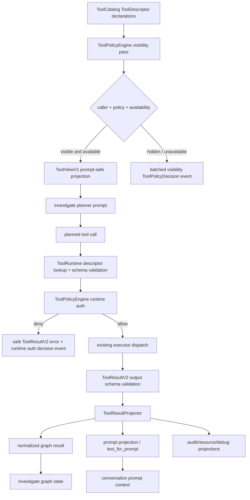

# Phase 29: Tool Platform Boundary - Research

**Researched:** 2026-06-23
**Domain:** MOCA tool platform boundary, planner tool projections, runtime tool authorization, result projection, replay decision events
**Confidence:** HIGH

<user_constraints>
## User Constraints (from CONTEXT.md)

### Locked Decisions

#### D-01: Minimal `ToolViewV1` Fields
Planner-visible `ToolView` MUST expose only:
- `name`
- `description`
- prompt-safe `input_schema`
- `safe_usage_notes`
- `result_contract_version`

No cost/latency hints, risk class, side-effect class, executor metadata, permissions, policy reason text, resource policy, adapter details, or descriptor internals belong in `ToolViewV1`.

#### D-02: `ToolView.input_schema` Is Prompt-Safe Projection
`ToolView.input_schema` MUST be derived from `ToolDescriptor.input_schema`, but MUST strip:
- defaults/examples/internal validation notes
- permission/resource policy details
- adapter/upstream service details
- side-effect/risk metadata
- descriptor/policy metadata

Planner prompt schema should describe valid input shape only.

#### D-03: ToolView Is NOT an Authorization Result
`ToolView` existence means only "planner may mention/select this tool".
Runtime invocation MUST still generate and enforce a fresh `ToolPolicyDecision(decision_stage="runtime_auth")`.

#### D-04: Planner Visibility = Policy Visibility AND Runtime Availability
Planner-visible tools are:
`ToolCatalog` descriptors filtered by:
1. caller allowlist / exposure
2. current policy visibility
3. runtime availability

Runtime unavailable tools include:
- executor not registered
- executor dependency missing
- feature flag disabled, if introduced later
- target placeholder not implemented

Unavailable tools MUST NOT appear in planner prompts.

#### D-05: Hidden vs Denied vs Unavailable Are Distinct
Phase 29 MUST distinguish:
- hidden from planner: not exposed in prompt
- denied at runtime: visible/selected but current context fails auth
- unavailable: descriptor exists but executor/runtime cannot serve it

These distinctions MUST be reflected in `ToolPolicyDecision.reason_code`.

#### D-06: Visibility Decisions Are Batched and Low-Payload
`visible_tools(...)` SHOULD record one batched visibility decision event per caller/context, covering all catalog tools.
This event MUST contain only low-payload fields:
- tool names
- decision stage
- allow/deny/hide boolean or enum
- reason codes
- policy version
- data classification
- availability summary

It MUST NOT contain schemas, prompts, raw args, adapter payloads, or descriptor internals.

#### D-07: Prompt Receives Only Visible, Available `ToolView`s
Planner prompt assembly MUST consume only the returned `ToolViewV1` list, not:
- `ToolDescriptor`
- `ToolPolicyDecision`
- `ToolResultV2.data`
- executor metadata
- internal policy fields

#### D-08: Visibility Event Covers Hidden Tools Too
The batched visibility decision event MUST include hidden/unavailable catalog tools for auditability, but this full decision set MUST NOT be fed to the planner prompt.

#### D-09: `ToolPolicyDecision` Is a Domain Object, Not an Event Envelope
`ToolPolicyDecision` MUST NOT duplicate event envelope fields:
- no `event_id`
- no `sequence`
- no `occurred_at`
- no `run_id`
- no `tenant_id`

Those belong to Phase 28 `DecisionEventEnvelopeV1`.

#### D-10: Use Phase 28 Event Path
Tool policy decisions MUST be emitted through:
- `DecisionEventEnvelopeV1`
- `emit_decision_event(...)`
- existing replay redaction/resource-ref validators

Do NOT create a parallel event envelope or table.

#### D-11: Runtime Auth Decisions Are Per Invocation
Every runtime invocation attempt MUST create one runtime authorization `ToolPolicyDecision`, including denied attempts.

Denied attempts MUST emit a decision event and return a safe `ToolResultV2` error when the denial is a normal policy outcome.

#### D-12: Core Reason Code Set
Core reason codes for Phase 29:
- `visible`
- `hidden_by_policy`
- `caller_not_allowed`
- `missing_permission`
- `scope_denied`
- `side_effect_blocked`
- `schema_invalid`
- `approval_required`
- `safety_snapshot_required`
- `idempotency_required`
- `tool_unavailable`

#### D-13: Reason Code Extensibility
Custom/extension reason codes MAY exist but MUST use a namespaced format:
`<namespace>.<snake_case>`

Freeform unknown reason strings are forbidden in contract paths.

#### D-14: Visibility Stage Must Not Emit Runtime-Only Codes
Visibility decisions MUST NOT use runtime-only reason codes such as:
- `schema_invalid`
- `approval_required`
- `safety_snapshot_required`
- `idempotency_required`

Those belong to runtime auth only.

#### D-15: `policy_version` Is Supplied by `ToolPolicyEngine`
`policy_version` MUST come from `ToolPolicyEngine`, not from callers or planner prompts.

Phase 29 MAY use a simple static version string if policy storage is not introduced yet.

#### D-16: `data_classification` Comes From Descriptor/Default
`ToolPolicyDecision.data_classification` MUST be derived from:
- `ToolDescriptor`, if field is added
- otherwise a conservative ToolPlatform default

It MUST NOT be inferred from LLM text or caller-supplied args.

#### D-17: `resource_scope_binding` Is Runtime-Produced
`resource_scope_binding` MUST be generated by runtime policy logic from:
- validated tool args
- trusted context
- descriptor resource type

It MUST NOT be provided by planner prompt or caller-controlled fields.

#### D-18: Denial Return Shape
Normal policy denials SHOULD return safe `ToolResultV2` errors with:
- `success=false`
- `error.code` matching high-level category
- `source_system="tool_policy"`
- no raw args
- no sensitive policy internals

Programmer/configuration/contract failures MAY still raise exceptions.

#### D-19: Establish Tool Platform Components
Phase 29 MUST introduce/establish these conceptual components:
- `ToolPlatform`
- `ToolPolicyEngine`
- `ToolRuntime`
- `ToolResultProjector`

Exact module path and class signatures are Claude's discretion.

#### D-20: ToolPlatform Is Graph-Facing Public Facade
Graph/investigate code SHOULD call `ToolPlatform`, not directly call:
- catalog filtering
- policy engine
- executors
- raw adapter services

#### D-21: ToolPolicyEngine Owns Policy Decisions
`ToolPolicyEngine` owns:
- planner visibility decisions
- runtime authorization decisions
- reason code assignment
- policy version
- resource scope binding

It does NOT execute tools, write graph state, or build prompts.

#### D-22: ToolPlatform Public Methods Target
Post-Phase 29 integration target:
- `visible_tools(caller, context) -> list[ToolViewV1]`
- `invoke(tool_name, args, context) -> ToolResultV2` or equivalent safe runtime result path

Exact context type and return wrappers are Claude's discretion if tests encode the contract.

#### D-23: ToolRuntime Owns Runtime Invocation Flow
Runtime flow SHOULD be centralized in `ToolRuntime`:
1. descriptor lookup
2. schema validation
3. runtime auth decision
4. side-effect / approval / safety / idempotency gates
5. executor dispatch
6. output validation
7. result projection
8. safe error conversion
9. decision event emission

#### D-24: Keep Existing `deadline_at` / `max_attempts`
Phase 29 MUST reuse existing `ToolCallContext.deadline_at`, `attempt`, and `max_attempts`.
Do NOT introduce a generic retry/rate-limit/timeout framework in this phase.

#### D-25: No Generic Feature Flag or Artifact Store
Phase 29 must not grow into:
- feature flag system
- rate limiter
- artifact/blob store
- external execution runtime
- MCP/dynamic discovery framework

#### D-26: `UnifiedToolManager` Becomes Compatibility Adapter
Existing `UnifiedToolManager` SHOULD be kept only as compatibility adapter if needed, delegating to `ToolPlatform`.
New policy/projection/runtime logic should not be added there.

#### D-27: Investigate Migration Scope Is Limited
`src/agent/nodes/investigate.py` migration for Phase 29 is limited to:
- planner tool views via `ToolPlatform.visible_tools(...)`
- runtime invocation via `ToolPlatform.invoke(...)`
- using projected result surfaces instead of raw adapter payloads for graph state

Do NOT rewrite the whole graph loop.

#### D-28: Preserve Existing Investigate Behavior Unless Boundary-Related
The investigate node should keep compatible behavior for:
- loop structure
- `plan_next_step`
- termination behavior
- tool call event lifecycle
- business/retrieval executor behavior

Only boundary/policy/projection changes are in scope.

#### D-29: Explicit Merchant IDs Outside Scope Deny Before Executor
If validated args contain an explicit merchant identifier and it is outside `TrustedContext.merchant_scope`, runtime auth MUST deny before executor dispatch.

#### D-30: Domain Lookup Ownership Checks Deferred to Phase 30
For identifiers like `order_no`, `refund_case_no`, and `ticket_id`, Phase 29 MUST NOT pretend it can prove merchant ownership unless existing service already does so.

Runtime policy may bind the requested resource ID, but if ownership requires domain lookup, the binding MUST mark the check as incomplete / requires domain authority.

BusinessFactService authority belongs to Phase 30.

#### D-31: Resource Binding Covers Known Tool Arg Shapes
Phase 29 resource binding MUST cover current catalog identifiers:
- `tenant_id`
- `merchant_id`
- `order_id` / `order_no`
- `refund_id` / `refund_case_no`
- `ticket_id`

If an identifier is absent, binding may state "none".

#### D-32: Result Projection Has Four Layers
`ToolResultProjector` MUST define separate layers:
1. normalized result for graph/business logic
2. structured prompt projection plus `text_for_prompt`
3. audit/resource refs
4. debug projection

These layers must not be collapsed into raw `ToolResultV2.data` passthrough.

#### D-33: ToolResultV2.data Is Not Automatically Graph-Safe
All `ToolResultV2.data` must be treated as untrusted/raw-ish regardless of executor class:
- business adapter results
- retrieval results
- action draft results
- error payloads

Graph state and prompts must consume projector outputs, not raw data.

#### D-34: Graph State Must Not Receive Unprojected Adapter Payloads
Investigate/business/retrieval graph state writes MUST use projected/normalized fields only.

Known risk area:
- `_accumulate_tool_result(...)`
- conversation tool result persistence/projection paths
- `context["facts"]`
- `context["retrieved_policy_refs"]`
- prompt context assembly

#### D-35: Prompt Must Not Consume Normalized/Raw Results
Prompt input should consume only prompt projection fields:
- `tool_name`
- `success`
- short summary/text
- safe refs
- bounded error code/category
- no raw payload

#### D-36: Artifact/Blob Storage Out of Scope
Large raw payload storage is not part of Phase 29.

If raw/debug payload needs future storage, it should be represented as optional ref fields only, with actual artifact store deferred.

#### D-37: `ToolResultProjector` Does Not Emit Events
Projector creates projections.
Policy/runtime components write tool decision events.
Projection-specific events are deferred.

#### D-38: Existing Conversation Projection May Be Reused Only If Safe
Existing `ToolResultPromptSummary`, conversation service projection, and context projector code MAY be reused if they satisfy Phase 29 projection separation.

If they currently pass through raw-ish `ToolResultV2.data`, Phase 29 must adjust them or bypass them.

#### D-39: Keep Tool Descriptors Single-Source
`ToolCatalog` / `ToolDescriptor` remains the declaration source.
Do not introduce a second hand-maintained planner allowlist.

#### D-40: Hidden/Write Tools Must Not Leak into Planner Prompts
Especially `create_coupon_grant_draft` and any write/node-only tool MUST stay out of investigate planner prompts unless a future phase explicitly exposes it to an appropriate caller.

#### D-41: Do Not Reclassify Tool Results as Business Facts
Tool policy decisions, runtime denials, and projection metadata are not business facts.
They may produce audit/resource refs, but not authoritative domain fact records.

#### D-42: Projection Events Deferred
Decision events for policy visibility/runtime auth are in scope.
Separate projection lifecycle events are deferred to post-Phase 29 / Phase 35 if needed.

### Claude's Discretion

#### Discretion Area A: Module Paths / Class Boundaries
Claude may choose exact implementation layout, e.g.:
- `src/tools/platform.py`
- `src/tools/policy.py`
- `src/tools/projection.py`
- or package-style `src/tools/platform/...`

Must preserve conceptual ownership from decisions above.

#### Discretion Area B: Exact Pydantic Model Fields Beyond Locked Minimum
Claude may define internal policy/projection models as needed, as long as:
- `ToolViewV1` prompt-visible fields remain minimal
- `ToolPolicyDecision` does not duplicate event envelope fields
- no raw fields leak to prompts/graph state

#### Discretion Area C: Event Type Names
Claude may choose exact event type names for visibility/runtime auth decisions, but they must:
- use Phase 28 decision event path
- be registered/valid under existing replay validation
- carry policy decision data in controlled `redacted_payload`

#### Discretion Area D: Projection Debug Shape
Claude may decide `debug_projection` shape.
Constraints:
- not prompt input
- no raw adapter payload
- no secrets/PII
- useful for tests/logging

#### Discretion Area E: Test Organization
Claude may split tests across existing/new files.
Must cover APF-06/APF-07 success criteria and regression risks listed below.

### Deferred Ideas (OUT OF SCOPE)

#### Deferred-01: Full Graph Migration
Migrating all graph nodes to ToolPlatform beyond investigate is deferred to Phase 32 unless required by APF-06/APF-07 tests.

#### Deferred-02: BusinessFactService Authority
Authoritative domain ownership/fact extraction service is Phase 30.

#### Deferred-03: Retry / Rate Limit / Timeout Framework
Use existing context fields only. Generic framework deferred beyond Phase 29.

#### Deferred-04: Feature Flag System
Do not build generic feature flags. Availability can be represented by executor presence/health only.

#### Deferred-05: Artifact Store
No new blob/raw payload store in Phase 29.

#### Deferred-06: Projection Lifecycle Events
Separate projection events are Phase 35/post-Phase 29.

#### Deferred-07: Dynamic MCP / External Tool Discovery
Out of scope for v1.9/APF-06/APF-07 unless separately planned under APF-FUT-03.
</user_constraints>

<phase_requirements>
## Phase Requirements

| ID | Description | Research Support |
|----|-------------|------------------|
| APF-06 | ToolDescriptor/ToolView boundary: planner sees prompt-safe ToolView, not raw descriptors or scattered allowlists. | Current planner path passes `ToolDescriptor` objects from `UnifiedToolManager.descriptors("investigate")`; Phase 29 must introduce `ToolViewV1`, prompt-safe schema projection, and `ToolPlatform.visible_tools(...)` as the graph-facing source. [VERIFIED: src/tools/manager.py] [VERIFIED: src/agent/nodes/investigate.py] [VERIFIED: .planning/phases/29-tool-platform-boundary/29-CONTEXT.md] |
| APF-07 | ToolPolicyDecision runtime authorization: invocation rechecks caller, permission, scope, side effect, and schema, then emits decision events. | Current manager performs some gates but does not produce a domain policy decision or Phase 28 decision event; Phase 29 should centralize gates in `ToolPolicyEngine`/`ToolRuntime` and emit via `emit_decision_event(...)`. [VERIFIED: src/tools/manager.py] [VERIFIED: src/replay/decision_events.py] [VERIFIED: .planning/phases/29-tool-platform-boundary/29-CONTEXT.md] |
</phase_requirements>

## Project Constraints (from CLAUDE.md)

- Phase-level plan and larger changes use the Codex/GSD cross-review workflow; research output should be concrete enough for `gsd-plan-phase`, `gsd-plan-checker`, and independent review. [VERIFIED: CLAUDE.md]
- The Codex-side reviewer must validate claims against real repository code/docs/tests and distinguish confirmed facts from missing evidence. [VERIFIED: CLAUDE.md]
- `docs/contract-spec.md` is the normative contract source for MOCA contract semantics, but phase scope decides implementation details; spec/implementation mismatches must be recorded rather than silently ignored. [VERIFIED: CLAUDE.md]
- Deferred implementation compromises must name a target phase, not vague future work. [VERIFIED: CLAUDE.md]
- Any local debugging/startup/API/UI/RAG/agent/validation failure discovered during implementation or verification must be appended to `.planning/LOCAL-VALIDATION-ISSUES.md` in Chinese after handling. [VERIFIED: CLAUDE.md]
- Documentation under `study_plan/` defaults to Chinese; this Phase 29 research file is outside `study_plan/`, so English technical research is acceptable. [VERIFIED: CLAUDE.md]

## Summary

Phase 29 is a boundary refactor, not a new external tool runtime. The repository already has a declaration source in `ToolCatalog`/`ToolDescriptor`, a strict `ToolCallContext`, existing manager-side gates, prompt projection helpers, and Phase 28 decision-event infrastructure. The gap is that planner visibility is still driven by hard-coded allowlists and raw descriptors, while runtime authorization is procedural logic inside `UnifiedToolManager` with no `ToolPolicyDecision` domain object or dedicated decision events. [VERIFIED: src/tools/catalog.py] [VERIFIED: src/tools/manager.py] [VERIFIED: src/tools/contracts.py] [VERIFIED: src/agent/nodes/investigate.py] [VERIFIED: src/replay/decision_events.py]

The plan should establish `ToolPlatform`, `ToolPolicyEngine`, `ToolRuntime`, and `ToolResultProjector` around the existing catalog/executor/event seams. `UnifiedToolManager` should become a compatibility adapter rather than the home for new policy logic. The investigate node should switch from `manager.descriptors("investigate")` to planner-safe `ToolViewV1` results and from direct manager invocation to the platform runtime path, while keeping the loop and planner behavior stable. [VERIFIED: .planning/phases/29-tool-platform-boundary/29-CONTEXT.md] [INFERRED: src/tools/manager.py + src/agent/nodes/investigate.py]

**Primary recommendation:** Build a catalog-derived `ToolPlatform` that emits prompt-safe `ToolViewV1` for planners, rechecks runtime authorization through `ToolPolicyEngine`, executes through existing executors, projects every `ToolResultV2.data` before graph/prompt use, and writes low-payload policy decisions through Phase 28 `emit_decision_event(...)`. [VERIFIED: .planning/phases/29-tool-platform-boundary/29-CONTEXT.md] [INFERRED: docs/contract-spec.md + src/replay/decision_events.py]

## Architectural Responsibility Map

| Capability | Primary Tier | Secondary Tier | Rationale |
|------------|-------------|----------------|-----------|
| Tool declarations | Tool Platform | Executors | `ToolCatalog` is declaration-only today and should remain the descriptor source; executors provide availability/execution but not prompt policy. [VERIFIED: src/tools/catalog.py] |
| Planner-visible tools | Tool Platform | Agent graph | `ToolPlatform.visible_tools(...)` should produce prompt-safe `ToolViewV1`; investigate should only pass those views into planner prompts. [VERIFIED: .planning/phases/29-tool-platform-boundary/29-CONTEXT.md] |
| Runtime authorization | Tool Platform | Trusted context | `ToolPolicyEngine` should own caller, permission, resource-scope, side-effect, approval, safety, idempotency, and schema decision reasons using trusted context inputs. [VERIFIED: .planning/phases/29-tool-platform-boundary/29-CONTEXT.md] [VERIFIED: src/platform/trusted_context.py] |
| Tool execution | Tool Platform Runtime | Existing executors | Existing business/knowledge/memory/action executors already implement adapter dispatch; `ToolRuntime` should orchestrate them after policy checks. [VERIFIED: src/tools/manager.py] |
| Result projection | Tool Platform | Conversation/context projectors | `ToolResultProjector` should produce graph-safe normalized data and prompt-safe summaries before investigate or conversation state consume outputs. [VERIFIED: .planning/phases/29-tool-platform-boundary/29-CONTEXT.md] [VERIFIED: src/conversation/service.py] |
| Decision event persistence | Replay/Observability | Tool Platform | Tool policy decisions should be emitted through `DecisionEventEnvelopeV1`/`emit_decision_event(...)`, not stored in a new event system. [VERIFIED: src/replay/decision_events.py] [VERIFIED: .planning/phases/29-tool-platform-boundary/29-CONTEXT.md] |
| Domain ownership proof | Domain/BusinessFactService | Tool Platform | Explicit merchant IDs can be scope-checked in ToolPlatform, but order/refund/ticket ownership lookup is deferred to Phase 30. [VERIFIED: .planning/phases/29-tool-platform-boundary/29-CONTEXT.md] |

## Standard Stack

### Core

| Library / Module | Version | Purpose | Why Standard |
|------------------|---------|---------|--------------|
| Python | 3.12.13 under `uv run` | Runtime and tests for backend code. | Project `pyproject.toml` requires Python `>=3.12`, and the active project environment is Python 3.12.13. [VERIFIED: pyproject.toml] [VERIFIED: uv run python --version] |
| Pydantic | 2.13.4 | Strict contract models such as `ToolDescriptor`, `ToolCallContext`, `ToolResultV2`, and new `ToolViewV1`/`ToolPolicyDecision`. | Existing tool/replay contracts use `BaseModel` with `ConfigDict(extra="forbid")`; reuse this pattern for boundary contracts. [VERIFIED: uv run python importlib.metadata] [VERIFIED: src/tools/contracts.py] [VERIFIED: src/tools/catalog.py] |
| Existing MOCA `ToolCatalog` / `ToolDescriptor` | Internal | Single declaration source for tool metadata. | Phase context locks `ToolCatalog`/`ToolDescriptor` as source and forbids a second planner allowlist. [VERIFIED: src/tools/catalog.py] [VERIFIED: .planning/phases/29-tool-platform-boundary/29-CONTEXT.md] |
| Existing MOCA `ToolCallContext` / `ToolResultV2` | Internal | Runtime context and tool result contract. | Existing manager/executors/investigate already use these objects; Phase 29 should route through them rather than replacing executor contracts. [VERIFIED: src/tools/contracts.py] [VERIFIED: src/tools/manager.py] |
| Existing MOCA `DecisionEventEnvelopeV1` / `emit_decision_event(...)` | Internal | Policy decision event persistence. | Phase 28 event path is locked for tool policy decisions and already performs replay validation/redaction/resource-ref guarding. [VERIFIED: src/replay/decision_events.py] [VERIFIED: .planning/phases/29-tool-platform-boundary/29-CONTEXT.md] |
| SQLAlchemy / Alembic | SQLAlchemy 2.0.49, Alembic 1.18.4 | Replay event model and migration if new tool-policy event types are registered. | `AgentTraceEvent.event_type` has a DB check constraint that must track `REPLAY_EVENT_TYPES`; new event types require model and migration updates. [VERIFIED: uv run python importlib.metadata] [VERIFIED: src/db/models.py] [VERIFIED: migrations/versions/010_replay_event_v3.py] |
| pytest / pytest-asyncio | pytest 9.0.3, pytest-asyncio 1.3.0 | Nyquist validation and regression tests. | Project tests are pytest-based with async support configured in `pyproject.toml`. [VERIFIED: uv run pytest --version] [VERIFIED: uv run python importlib.metadata] [VERIFIED: pyproject.toml] |

### Supporting

| Library / Tool | Version | Purpose | When to Use |
|----------------|---------|---------|-------------|
| `uv` | 0.11.2 | Dependency-managed test and command runner. | Use `uv run ...` for project Python commands to avoid host Python 3.13/package drift. [VERIFIED: uv --version] |
| Ruff | 0.15.12 | Python lint/format checks. | Use for fast syntax/style checks after contract/module edits. [VERIFIED: uv run ruff --version] |
| Docker Compose | Docker 29.4.2, Compose v5.1.3 | Local Postgres/Redis for DB-backed replay tests. | Use `docker compose up -d postgres redis` if replay migration/service tests need a database. [VERIFIED: docker --version] [VERIFIED: docker compose version] [VERIFIED: docker-compose.yml] |

### Alternatives Considered

| Instead of | Could Use | Tradeoff |
|------------|-----------|----------|
| New `ToolPlatform` facade | Add more logic to `UnifiedToolManager` | Rejected by locked decision D-26; manager should become compatibility adapter, not accumulate new policy/projection responsibilities. [VERIFIED: .planning/phases/29-tool-platform-boundary/29-CONTEXT.md] |
| New policy event table/envelope | Persist decisions outside replay | Rejected by locked decision D-10; Phase 29 must use Phase 28 replay event path. [VERIFIED: .planning/phases/29-tool-platform-boundary/29-CONTEXT.md] |
| Hand-maintained investigate allowlist | Derive visible tools from catalog + policy + availability | Rejected by APF-06/D-39; the current hard-coded allowlists are the thing Phase 29 replaces. [VERIFIED: src/tools/manager.py] [VERIFIED: src/agent/nodes/investigate.py] |
| Prompt consuming raw/normalized tool output | Prompt-only projection from `ToolResultProjector` | Rejected by D-33 through D-35; `ToolResultV2.data` is raw-ish for every executor class. [VERIFIED: .planning/phases/29-tool-platform-boundary/29-CONTEXT.md] |

**Installation:** No new third-party package is recommended for Phase 29. Use existing dependencies:

```bash
uv sync --extra dev
```

**Version verification performed:**

```bash
uv run python --version
uv run python - <<'PY'
from importlib.metadata import version
for package in ["pydantic", "pytest", "pytest-asyncio", "SQLAlchemy", "fastapi", "langgraph", "langchain-core", "ruff", "alembic"]:
    print(package, version(package))
PY
```

## Architecture Patterns

### System Architecture Diagram



### Recommended Project Structure

```text
src/tools/
├── catalog.py              # existing ToolDescriptor/ToolCatalog single declaration source
├── contracts.py            # existing ToolCallContext/ToolResultV2; add ToolViewV1 and projection contracts if preferred
├── platform.py             # ToolPlatform graph-facing facade
├── policy.py               # ToolPolicyEngine, ToolPolicyDecision, reason-code validation/resource binding
├── runtime.py              # ToolRuntime orchestration and safe error conversion
├── projection.py           # ToolResultProjector and projection models
└── manager.py              # legacy compatibility adapter delegating to ToolPlatform
```

This split matches the locked conceptual ownership while keeping edits inside the existing `src/tools` package. [INFERRED: .planning/phases/29-tool-platform-boundary/29-CONTEXT.md + src/tools]

### Pattern 1: Prompt-Safe ToolView Projection

**What:** Convert each visible and available `ToolDescriptor` into a minimal `ToolViewV1`. The view contains only the five locked fields, and its schema projection whitelists input-shape data instead of passing descriptor schema through wholesale. [VERIFIED: .planning/phases/29-tool-platform-boundary/29-CONTEXT.md]

**When to use:** Every planner prompt assembly path that currently receives tool descriptors or name allowlists. The immediate Phase 29 target is `investigate`. [VERIFIED: src/agent/nodes/investigate.py]

**Example:**

```python
from pydantic import BaseModel, ConfigDict, Field


class ToolViewV1(BaseModel):
    model_config = ConfigDict(extra="forbid")

    name: str
    description: str
    input_schema: dict[str, object]
    safe_usage_notes: list[str] = Field(default_factory=list)
    result_contract_version: str = "tool_result.v2"


PROMPT_SAFE_SCHEMA_KEYS = {
    "type",
    "properties",
    "required",
    "description",
    "items",
    "enum",
    "minLength",
    "maxLength",
    "minimum",
    "maximum",
    "additionalProperties",
}


def project_input_schema_for_prompt(schema: dict[str, object]) -> dict[str, object]:
    # Whitelist the shape recursively; do not copy defaults/examples/policy metadata.
    ...
```

Source pattern: existing Pydantic strict contracts use `extra="forbid"` in tool models. [VERIFIED: src/tools/contracts.py] [VERIFIED: src/tools/catalog.py]

### Pattern 2: Policy Decisions Are Domain Objects, Then Event Payloads

**What:** Build `ToolPolicyDecision` as a strict domain object without replay envelope fields, then serialize it into `emit_decision_event(..., redacted_payload=...)`. [VERIFIED: .planning/phases/29-tool-platform-boundary/29-CONTEXT.md] [VERIFIED: src/replay/decision_events.py]

**When to use:** One batched visibility decision per caller/context, and one runtime authorization decision per invocation attempt. [VERIFIED: .planning/phases/29-tool-platform-boundary/29-CONTEXT.md]

**Example:**

```python
class ToolPolicyDecision(BaseModel):
    model_config = ConfigDict(extra="forbid")

    tool_name: str
    caller: str
    decision_stage: Literal["visibility", "runtime_auth"]
    allowed: bool
    reason_code: ToolPolicyReasonCode
    policy_version: str
    data_classification: str
    resource_scope_binding: dict[str, object] | None = None
    availability: dict[str, object] | None = None
```

Implementation note: the current replay reason-code normalizer accepts snake_case values and rejects dotted namespace values, so Phase 29 must either update replay validation for `<namespace>.<snake_case>` or restrict emitted event reason codes to the core snake_case set. The locked context permits namespaced extensions, so updating validation is the cleaner plan task. [VERIFIED: src/replay/decision_events.py] [VERIFIED: .planning/phases/29-tool-platform-boundary/29-CONTEXT.md]

### Pattern 3: Runtime Auth Rechecks Everything

**What:** Runtime authorization should not trust planner visibility. `ToolRuntime` should validate args, ask `ToolPolicyEngine` for a fresh runtime decision, enforce side-effect/approval/safety/idempotency gates, dispatch to the executor only on allow, then validate/project output. [VERIFIED: .planning/phases/29-tool-platform-boundary/29-CONTEXT.md]

**When to use:** Every `ToolPlatform.invoke(...)` path, including legacy `UnifiedToolManager.invoke(...)` delegation. [INFERRED: src/tools/manager.py + .planning/phases/29-tool-platform-boundary/29-CONTEXT.md]

**Example:**

```python
async def invoke(self, tool_name: str, args: dict[str, object], context: ToolCallContext) -> ToolInvocationOutcome:
    descriptor = self._catalog.get(tool_name)
    validation_error = validate_json_value(args, descriptor.input_schema)
    decision = self._policy.authorize_runtime(
        descriptor=descriptor,
        args=args,
        context=context,
        validation_error=validation_error,
    )
    await self._events.emit_runtime_auth_decision(decision, context=context)
    if not decision.allowed:
        return self._denied_outcome(descriptor, decision)

    result = await self._executors.dispatch(descriptor, args, context)
    validate_json_value(result.model_dump(mode="json"), descriptor.output_schema)
    projection = self._projector.project(descriptor=descriptor, result=result, decision=decision)
    return ToolInvocationOutcome(tool_result=result, projection=projection, policy_decision=decision)
```

Source pattern: existing manager already performs descriptor lookup, schema validation, permission/side-effect checks, executor dispatch, `ToolResultV2` type check, and output schema validation; Phase 29 should move this flow into ToolRuntime with policy decisions/events. [VERIFIED: src/tools/manager.py]

### Pattern 4: Resource Scope Binding

**What:** Bind resource scope from validated args and trusted context, not planner-provided fields. Explicit merchant IDs outside `TrustedContext.merchant_scope` deny before executor; order/refund/ticket IDs should be recorded as incomplete bindings requiring domain scope checks in Phase 30. [VERIFIED: .planning/phases/29-tool-platform-boundary/29-CONTEXT.md] [VERIFIED: src/platform/trusted_context.py]

**When to use:** Runtime authorization decisions for all current catalog arg shapes. [VERIFIED: src/tools/catalog.py]

**Example:**

```python
def bind_resource_scope(args: Mapping[str, object], context: ToolCallContext, descriptor: ToolDescriptor) -> ResourceScopeBinding:
    merchant_id = args.get("merchant_id")
    if isinstance(merchant_id, str) and merchant_id:
        scope = MerchantScopeV1.from_tool_context(context.merchant_scope)
        if not scope.allows(merchant_id):
            return ResourceScopeBinding(kind="merchant", resource_id=merchant_id, allowed=False, complete=True)

    for key in ("order_no", "order_id", "refund_case_no", "refund_id", "ticket_id"):
        value = args.get(key)
        if isinstance(value, str) and value:
            return ResourceScopeBinding(
                kind=descriptor.resource_type,
                resource_id=value,
                allowed=True,
                complete=False,
                requires_domain_scope_check=True,
            )

    return ResourceScopeBinding(kind=descriptor.resource_type, resource_id=None, allowed=True, complete=True)
```

Source pattern: existing `BusinessToolService` already denies explicit `merchant_id` outside merchant scope, but order/refund/ticket ownership is not proven at the tool-platform layer. [VERIFIED: src/business/service.py] [VERIFIED: .planning/phases/29-tool-platform-boundary/29-CONTEXT.md]

### Pattern 5: Result Projection Before Graph State

**What:** Treat `ToolResultV2.data` as raw-ish and always pass it through `ToolResultProjector` before graph state or prompt use. [VERIFIED: .planning/phases/29-tool-platform-boundary/29-CONTEXT.md]

**When to use:** `investigate._accumulate_tool_result(...)`, `_project_tool_result(...)`, and `ConversationService.append_tool_result(...)` currently need review because they either consume or store `result.data`. [VERIFIED: src/agent/nodes/investigate.py] [VERIFIED: src/conversation/service.py]

**Example:**

```python
class ToolResultProjectionV1(BaseModel):
    model_config = ConfigDict(extra="forbid")

    normalized_result: dict[str, object]
    prompt_projection: dict[str, object]
    text_for_prompt: str
    audit_refs: list[str] = Field(default_factory=list)
    resource_refs: list[ResourceRefV1] = Field(default_factory=list)
    debug_projection: dict[str, object] = Field(default_factory=dict)
```

Source pattern: existing prompt/context projectors already strip unsafe keys and build prompt summaries, but Phase 29 requires a clearer normalized-vs-prompt split before graph state writes. [VERIFIED: src/agent/context/projectors.py] [VERIFIED: src/agent/working_state.py] [VERIFIED: .planning/phases/29-tool-platform-boundary/29-CONTEXT.md]

### Anti-Patterns to Avoid

- **Passing `ToolDescriptor` to planner prompts:** Descriptors include permissions, side-effect class, executor metadata, and resource metadata; planners should only see `ToolViewV1`. [VERIFIED: src/tools/catalog.py] [VERIFIED: .planning/phases/29-tool-platform-boundary/29-CONTEXT.md]
- **Assuming visible means allowed:** Runtime authorization must recheck context and emit a runtime decision even if a tool was visible. [VERIFIED: .planning/phases/29-tool-platform-boundary/29-CONTEXT.md]
- **Adding another allowlist:** Existing hard-coded investigate allowlists are the target of the refactor; derive visibility from descriptors, policy, and availability instead. [VERIFIED: src/tools/manager.py] [VERIFIED: src/agent/nodes/investigate.py]
- **Persisting raw adapter data as normalized graph state:** `ConversationService.append_tool_result(...)` currently initializes `normalized_result_json` from `result.data`; Phase 29 should route projected normalized data instead. [VERIFIED: src/conversation/service.py]
- **Creating a parallel event system:** Tool policy events must use `emit_decision_event(...)` and replay validators. [VERIFIED: src/replay/decision_events.py] [VERIFIED: .planning/phases/29-tool-platform-boundary/29-CONTEXT.md]

## Don't Hand-Roll

| Problem | Don't Build | Use Instead | Why |
|---------|-------------|-------------|-----|
| Tool declaration source | A new planner-specific registry or copied tool list | Existing `ToolCatalog`/`ToolDescriptor` | Catalog already holds name, schema, executor, caller allowlist, side-effect, approval/safety/idempotency metadata. [VERIFIED: src/tools/catalog.py] |
| Runtime context authority | Caller-supplied permissions or LLM-provided scope fields | `TrustedContextFactory` and `project_to_tool_context(...)` | Existing projection prevents model/user payload from widening role, permissions, or merchant scope. [VERIFIED: src/platform/trusted_context.py] [VERIFIED: src/platform/context_projections.py] |
| JSON schema validation | A second ad hoc validator | Existing `validate_json_value(...)` plus focused tests | Current manager and catalog tests already depend on this validation helper. [VERIFIED: src/tools/validation.py] [VERIFIED: tests/agent/test_tools/test_unified_tool_manager.py] |
| Decision event persistence | New event envelope/table/logger | `DecisionEventEnvelopeV1` and `emit_decision_event(...)` | Phase 28 replay path already validates redaction, resource refs, sequence, and schema version. [VERIFIED: src/replay/decision_events.py] |
| Prompt projection safety | Direct `result.data` prompt snippets | Existing context/conversation projection helpers plus new `ToolResultProjector` | Existing prompt projection tests cover raw-key leakage; Phase 29 should extend them rather than bypass them. [VERIFIED: tests/agent/context/test_assembler.py] [VERIFIED: tests/conversation/test_service.py] |
| Domain ownership lookup | Fake merchant ownership from order/refund/ticket IDs | Mark incomplete binding and defer authority to Phase 30 | Locked decisions defer BusinessFactService/domain proof to Phase 30. [VERIFIED: .planning/phases/29-tool-platform-boundary/29-CONTEXT.md] |

**Key insight:** Phase 29 should assemble existing primitives into a stable platform boundary; custom replacements for catalog, context, validation, eventing, or prompt redaction would duplicate already-tested project contracts. [INFERRED: src/tools + src/platform + src/replay + tests]

## Runtime State Inventory

| Category | Items Found | Action Required |
|----------|-------------|-----------------|
| Stored data | Replay event rows are constrained by `AgentTraceEvent.event_type` DB check and `REPLAY_EVENT_TYPES`; current registry does not include tool-policy event types. [VERIFIED: src/db/models.py] [VERIFIED: src/replay/validators.py] [VERIFIED: migrations/versions/010_replay_event_v3.py] | If Phase 29 adds `tool_policy_visibility_recorded` / `tool_policy_runtime_auth_recorded` or similar, include code registry, retention classification, ORM check, Alembic migration, and migration-contract tests. This is a schema migration, not a data backfill. [INFERRED: src/db/models.py + tests/replay/test_replay_migration_contract.py] |
| Stored data | Conversation tool result storage currently sets `normalized_result_json = result.data or {}` when appending tool results. [VERIFIED: src/conversation/service.py] | Code edit required so new writes use `ToolResultProjector.normalized_result`. Existing rows need no Phase 29 backfill unless tests require historical replay normalization. [INFERRED: .planning/phases/29-tool-platform-boundary/29-CONTEXT.md + src/conversation/service.py] |
| Live service config | No external service configuration for tool allowlists or tool policy was found in repository-owned config; local services are declared in `docker-compose.yml`. [VERIFIED: docker-compose.yml] [VERIFIED: rg results] | None for Phase 29. Runtime availability should use executor registration/health in code, not UI-managed config. [INFERRED: src/tools/manager.py] |
| OS-registered state | No OS-level tool registrations, launch agents, systemd units, pm2 processes, or scheduled tasks are part of the repository phase scope. [VERIFIED: rg results] | None. |
| Secrets/env vars | `.env.example` defines database, Redis, JWT, DashScope, and LLM settings; no tool-policy-specific secret names or allowlist env vars were found. Actual `.env` key names inspected showed no tool-platform keys. [VERIFIED: .env.example] [VERIFIED: local .env key-name audit] | None unless planner introduces new feature-flag/env config, which D-25 forbids for Phase 29. [VERIFIED: .planning/phases/29-tool-platform-boundary/29-CONTEXT.md] |
| Build artifacts | Local caches/artifacts such as `.pytest_cache`, `.ruff_cache`, `__pycache__`, and `moca.egg-info` may exist but do not carry tool-policy runtime state. [VERIFIED: rg --files / filesystem inspection] | None beyond normal test/cache refresh. |

## Common Pitfalls

### Pitfall 1: ToolView Accidentally Becomes a Policy Leak

**What goes wrong:** The planner sees permission names, side-effect class, caller allowlists, risk class, executor names, or policy reason text in prompt-visible tool data. [VERIFIED: src/tools/catalog.py] [VERIFIED: .planning/phases/29-tool-platform-boundary/29-CONTEXT.md]

**Why it happens:** The current descriptor object already contains all metadata, so a shallow projection or `model_dump()` is unsafe. [VERIFIED: src/tools/catalog.py]

**How to avoid:** Implement a whitelisted `ToolViewV1` constructor and a recursive prompt-safe schema projection. Add tests that forbidden fields never appear in planner prompt/context. [INFERRED: .planning/phases/29-tool-platform-boundary/29-CONTEXT.md + tests/agent/test_nodes/test_investigate.py]

**Warning signs:** Tests assert against `descriptor.model_dump()` or planner fixtures include `required_permission`, `side_effect`, `executor`, `caller_allowlist`, or `requires_safety_snapshot`. [INFERRED: src/tools/catalog.py]

### Pitfall 2: Visibility Uses Availability But Audit Drops Hidden Tools

**What goes wrong:** The prompt correctly hides unavailable tools, but the audit event only records visible tools, making hidden/unavailable decisions invisible later. [VERIFIED: .planning/phases/29-tool-platform-boundary/29-CONTEXT.md]

**Why it happens:** It is tempting to emit events from the same list returned to the planner. [INFERRED: .planning/phases/29-tool-platform-boundary/29-CONTEXT.md]

**How to avoid:** Have `ToolPolicyEngine.visibility_decisions(...)` return the full decision set plus a filtered `ToolViewV1` list; prompt code only receives the views, event code receives the full low-payload decisions. [INFERRED: .planning/phases/29-tool-platform-boundary/29-CONTEXT.md]

**Warning signs:** A hidden/write tool such as `create_coupon_grant_draft` is absent from both prompt and visibility event. [VERIFIED: src/tools/catalog.py]

### Pitfall 3: Runtime Auth Reuses Visibility Decision

**What goes wrong:** A tool allowed during visibility remains executable even after args, side effect, approval, safety snapshot, idempotency, or merchant scope fail. [VERIFIED: .planning/phases/29-tool-platform-boundary/29-CONTEXT.md]

**Why it happens:** Current code mixes descriptor filtering and runtime gates in the manager; a refactor could collapse them into one decision. [VERIFIED: src/tools/manager.py]

**How to avoid:** Separate `decision_stage="visibility"` and `decision_stage="runtime_auth"` paths, and test visible-but-denied cases. [VERIFIED: .planning/phases/29-tool-platform-boundary/29-CONTEXT.md]

**Warning signs:** Runtime denial tests do not assert a fresh `ToolPolicyDecision` event, or denial returns occur before event emission. [INFERRED: tests/agent/test_tools/test_unified_tool_manager.py + src/replay/decision_events.py]

### Pitfall 4: Reason Code Validation Conflicts With Namespaced Extensions

**What goes wrong:** ToolPolicyDecision allows `namespace.reason_code`, but `emit_decision_event(...)` rejects it because current replay reason-code regex only permits snake_case. [VERIFIED: src/replay/decision_events.py] [VERIFIED: .planning/phases/29-tool-platform-boundary/29-CONTEXT.md]

**Why it happens:** Phase 28 replay reason codes predate Phase 29 namespaced extensions. [INFERRED: src/replay/decision_events.py + .planning/phases/29-tool-platform-boundary/29-CONTEXT.md]

**How to avoid:** Add a plan task to update reason-code validation and tests, or constrain emitted Phase 29 codes to the core snake_case set. The locked context permits extensions, so validation update is recommended. [INFERRED: .planning/phases/29-tool-platform-boundary/29-CONTEXT.md]

**Warning signs:** New policy tests pass at model level but fail when calling `emit_decision_event(...)`. [INFERRED: src/replay/decision_events.py]

### Pitfall 5: New Event Type Without Migration

**What goes wrong:** A new `tool_policy_*` event type passes Python validation but fails database insertion due to the `AgentTraceEvent.event_type` check constraint, or migration contract tests fail. [VERIFIED: src/db/models.py] [VERIFIED: tests/replay/test_replay_migration_contract.py]

**Why it happens:** Replay event type registry is mirrored in both Python validation and DB schema. [VERIFIED: src/replay/validators.py] [VERIFIED: migrations/versions/010_replay_event_v3.py]

**How to avoid:** If new event types are used, update `REPLAY_EVENT_TYPES`, `EVENT_RETENTION_CLASSIFICATION`, ORM constraint, Alembic migration, and migration tests in the same wave. [INFERRED: src/replay/validators.py + src/db/models.py + tests/replay/test_replay_migration_contract.py]

**Warning signs:** Only `src/replay/validators.py` changes, with no migration/model test update. [INFERRED: src/db/models.py]

### Pitfall 6: Conversation Storage Keeps Raw-ish `result.data`

**What goes wrong:** Planner prompts become safe, but graph/conversation persistence still stores raw adapter output as normalized result. [VERIFIED: src/conversation/service.py] [VERIFIED: .planning/phases/29-tool-platform-boundary/29-CONTEXT.md]

**Why it happens:** Existing `append_tool_result(...)` predates the four-layer projector and treats `ToolResultV2.data` as normalized. [VERIFIED: src/conversation/service.py]

**How to avoid:** Change call sites to pass projector-normalized data or move projection into conversation storage service with explicit input. [INFERRED: src/conversation/service.py + .planning/phases/29-tool-platform-boundary/29-CONTEXT.md]

**Warning signs:** Tests still assert `normalized_result_json == result.data`. [INFERRED: tests/conversation/test_service.py]

## Code Examples

Verified patterns from repository sources:

### Strict Contract Model Pattern

```python
class ToolResultV2(BaseModel):
    model_config = ConfigDict(extra="forbid")
    schema_version: Literal["tool_result.v2"] = "tool_result.v2"
    tool_name: str
    success: bool
```

Source: existing tool contracts use strict Pydantic models with literal schema versions. [VERIFIED: src/tools/contracts.py]

### Existing Runtime Gate Sequence to Preserve in ToolRuntime

```python
validation_error = validate_json_value(args, descriptor.input_schema)
if validation_error:
    return ToolResultV2(..., success=False, source_system="tool_manager", error=...)
if not self._side_effect_allowed(caller, descriptor):
    return ToolResultV2(..., success=False, source_system="tool_manager", error=...)
```

Source: `UnifiedToolManager.invoke(...)` already performs descriptor lookup, input validation, caller/permission/side-effect gates, approval/safety/idempotency checks, executor dispatch, result type check, and output validation. [VERIFIED: src/tools/manager.py]

### Existing Trusted Context Projection Pattern

```python
def project_to_tool_context(
    trusted: TrustedContextV1,
    *,
    request_id: str,
    tool_call_id: str,
    caller_node: str,
    deadline_at: datetime | None = None,
    effective_at: datetime | None = None,
) -> ToolCallContext:
    ...
```

Source: Tool context is derived from trusted context plus projection-local runtime fields; model/user state must not widen permissions or merchant scope. [VERIFIED: src/platform/context_projections.py] [VERIFIED: src/platform/trusted_context.py]

### Existing Decision Event Emission Pattern

```python
event = emit_decision_event(
    session,
    replay_context=replay_context,
    event_type="tool_policy_runtime_auth_recorded",
    actor="tool_platform",
    resource_refs=[...],
    redacted_payload={
        "tool_name": decision.tool_name,
        "decision_stage": decision.decision_stage,
        "allowed": decision.allowed,
        "reason_code": decision.reason_code,
    },
    reason_codes=[decision.reason_code],
    versions={"tool_policy": decision.policy_version},
)
```

Source: `emit_decision_event(...)` owns envelope creation, redaction guarding, resource-ref validation, reason-code normalization, and version payload normalization. Event type names shown here are recommended Phase 29 names and require registry/migration if adopted. [VERIFIED: src/replay/decision_events.py] [INFERRED: src/replay/validators.py + src/db/models.py]

### Existing Prompt-Safe Tool Result Projection Pattern

```python
ToolResultPromptSummary(
    tool_name=result.tool_name,
    success=result.success,
    summary=result.summary,
    source_system=result.source_system,
    policy_evidence_refs=list(result.policy_evidence_refs),
    business_fact_refs=list(result.business_fact_refs),
    error_code=result.error.code if result.error else None,
)
```

Source: investigate already builds a prompt summary object and strips raw payload keys before graph accumulation; Phase 29 should make this projector-owned and prevent `result.data` passthrough. [VERIFIED: src/agent/nodes/investigate.py] [VERIFIED: src/tools/contracts.py]

## State of the Art

| Old Approach | Current Approach | When Changed | Impact |
|--------------|------------------|--------------|--------|
| Graph nodes call scattered allowlists and raw descriptors. | Graph calls `ToolPlatform.visible_tools(...)` and sees only `ToolViewV1`. | Phase 29 target. [VERIFIED: .planning/phases/29-tool-platform-boundary/29-CONTEXT.md] | Removes descriptor/policy leakage from planner prompts and gives one visibility audit path. [INFERRED] |
| `UnifiedToolManager` owns descriptor filtering and runtime gates. | `ToolRuntime`/`ToolPolicyEngine` own boundary logic; manager delegates for compatibility. | Phase 29 target. [VERIFIED: .planning/phases/29-tool-platform-boundary/29-CONTEXT.md] | Keeps old call sites working while preventing new policy logic from accumulating in manager. [INFERRED] |
| `ToolResultV2.data` treated as graph/persistence-normalized in some paths. | `ToolResultProjector` emits normalized, prompt, audit/resource, and debug layers. | Phase 29 target. [VERIFIED: .planning/phases/29-tool-platform-boundary/29-CONTEXT.md] | Prevents raw adapter payloads from becoming graph state or prompt context. [INFERRED] |
| Tool policy outcomes are implicit return branches. | `ToolPolicyDecision` is explicit and persisted through Phase 28 decision events. | Phase 29 target, Phase 28 infrastructure complete. [VERIFIED: src/replay/decision_events.py] [VERIFIED: .planning/STATE.md] | Makes visible/hidden/denied/unavailable auditable without a parallel event store. [INFERRED] |

**Deprecated/outdated for Phase 29:**
- `src/agent/nodes/investigate.py` module-level `ALLOWLIST = TOOL_CALL_TOOLS | RAG_RETRIEVAL_TOOLS` as planner authorization source; keep only if converted to compatibility/test fixture, not the prompt boundary. [VERIFIED: src/agent/nodes/investigate.py] [VERIFIED: .planning/phases/29-tool-platform-boundary/29-CONTEXT.md]
- `UnifiedToolManager.descriptors("investigate")` returning raw descriptors for prompt planning. [VERIFIED: src/tools/manager.py] [VERIFIED: .planning/phases/29-tool-platform-boundary/29-CONTEXT.md]
- Direct `result.data` graph/prompt/conversation persistence usage outside `ToolResultProjector`. [VERIFIED: src/agent/nodes/investigate.py] [VERIFIED: src/conversation/service.py] [VERIFIED: .planning/phases/29-tool-platform-boundary/29-CONTEXT.md]

## Assumptions Log

| # | Claim | Section | Risk if Wrong |
|---|-------|---------|---------------|
| None | All material claims in this research are tagged as `[VERIFIED]`, `[CITED]`, or `[INFERRED]` from repository code/docs read during this session. | All | No user confirmation needed for assumed facts; planner still needs to decide the few open design details below. |

## Open Questions

1. **Exact `ToolPlatform.invoke(...)` return shape**
   - What we know: Phase context allows "`ToolResultV2` or equivalent safe runtime result path"; contract docs historically show `invoke -> ToolResultV2`. [VERIFIED: .planning/phases/29-tool-platform-boundary/29-CONTEXT.md] [CITED: docs/contract-spec.md]
   - What's unclear: Whether the new graph integration should receive a wrapper containing `tool_result`, `projection`, and `policy_decision_ref`, or call a separate projection method after `ToolResultV2`. [INFERRED: .planning/phases/29-tool-platform-boundary/29-CONTEXT.md + docs/contract-spec.md]
   - Recommendation: Use a `ToolInvocationOutcome(tool_result, projection, policy_decision)` internally and keep `UnifiedToolManager.invoke(...) -> ToolResultV2` for compatibility. Encode the boundary in tests so planner and implementation stay aligned. [INFERRED: src/tools/manager.py + .planning/phases/29-tool-platform-boundary/29-CONTEXT.md]

2. **New replay event types versus existing lifecycle event payloads**
   - What we know: Exact event type names are discretionary, but must be registered/valid and use the Phase 28 decision event path. [VERIFIED: .planning/phases/29-tool-platform-boundary/29-CONTEXT.md]
   - What's unclear: Whether planner wants to pay the migration/test cost for clearer `tool_policy_visibility_recorded` and `tool_policy_runtime_auth_recorded` event types. [INFERRED: src/replay/validators.py + src/db/models.py]
   - Recommendation: Add the two explicit event types with registry, retention classification, ORM check, Alembic migration, and migration-contract tests. This is clearer than overloading lifecycle events and still respects "no parallel event table/envelope." [INFERRED: src/replay/decision_events.py + src/db/models.py]

3. **Namespaced reason code validation**
   - What we know: Phase context permits `<namespace>.<snake_case>` extension reason codes, while current replay normalizer only accepts snake_case. [VERIFIED: .planning/phases/29-tool-platform-boundary/29-CONTEXT.md] [VERIFIED: src/replay/decision_events.py]
   - What's unclear: Whether Phase 29 will actually emit extension codes or only define the model validation. [INFERRED]
   - Recommendation: Update replay reason-code validation to accept core snake_case codes and namespaced extension codes, with tests forbidding freeform strings. [INFERRED: .planning/phases/29-tool-platform-boundary/29-CONTEXT.md + src/replay/decision_events.py]

## Environment Availability

| Dependency | Required By | Available | Version | Fallback |
|------------|-------------|-----------|---------|----------|
| `uv` | Project command/test runner | Yes | 0.11.2 | Use project lock/env through `uv run`; do not use host Python for final validation. [VERIFIED: uv --version] |
| Python in project env | Backend/test runtime | Yes | 3.12.13 | None needed. [VERIFIED: uv run python --version] |
| pytest | Nyquist validation | Yes | 9.0.3 | None needed. [VERIFIED: uv run pytest --version] |
| pytest-asyncio | Async tests | Yes | 1.3.0 | None needed. [VERIFIED: uv run python importlib.metadata] |
| Pydantic | Contract models | Yes | 2.13.4 | None needed. [VERIFIED: uv run python importlib.metadata] |
| SQLAlchemy | Replay ORM | Yes | 2.0.49 | None needed. [VERIFIED: uv run python importlib.metadata] |
| Alembic | Replay event-type migration if new event types are used | Yes | 1.18.4 | Avoid new event types only if migration is explicitly rejected. [VERIFIED: uv run alembic --version] |
| Ruff | Lint/format smoke checks | Yes | 0.15.12 | `uv run python -m py_compile` for minimal syntax fallback. [VERIFIED: uv run ruff --version] |
| Docker | Local service startup | Yes | 29.4.2 | If unavailable in another environment, run only non-DB tests or use a managed Postgres URL. [VERIFIED: docker --version] |
| Docker Compose | Postgres/Redis services | Yes | v5.1.3 | Same as Docker fallback. [VERIFIED: docker compose version] |
| `pg_isready` | Direct Postgres readiness probe | No | Not installed | Use `docker compose up -d postgres redis` plus test connection through `uv run pytest`; tests already know `TEST_DATABASE_URL`. [VERIFIED: command -v pg_isready] [VERIFIED: tests/conftest.py] |

**Missing dependencies with no fallback:** None found for planning. [VERIFIED: environment audit]

**Missing dependencies with fallback:**
- `pg_isready` is missing; use Docker Compose and project tests as readiness signal. [VERIFIED: command -v pg_isready] [INFERRED: docker-compose.yml + tests/conftest.py]

## Validation Architecture

### Test Framework

| Property | Value |
|----------|-------|
| Framework | pytest 9.0.3 with pytest-asyncio 1.3.0. [VERIFIED: uv run pytest --version] [VERIFIED: uv run python importlib.metadata] |
| Config file | `pyproject.toml` with pytest options including async auto mode. [VERIFIED: pyproject.toml] |
| Quick run command | `uv run pytest tests/tools/test_catalog.py tests/agent/test_tools/test_unified_tool_manager.py tests/agent/test_nodes/test_investigate.py tests/replay/test_decision_events.py tests/platform/test_context_projections.py -q` [INFERRED: tests present] |
| Full suite command | `uv run pytest` [VERIFIED: pyproject.toml] |

### Phase Requirements -> Test Map

| Req ID | Behavior | Test Type | Automated Command | File Exists? |
|--------|----------|-----------|-------------------|--------------|
| APF-06 | Planner receives `ToolViewV1` only; raw descriptor fields and write/node-only tools do not appear in investigate prompt. | unit/integration | `uv run pytest tests/tools/test_tool_platform.py tests/agent/test_nodes/test_investigate.py -q` | Partial: existing investigate tests; new tool-platform tests needed. [VERIFIED: tests/agent/test_nodes/test_investigate.py] |
| APF-06 | Visibility filters by caller, policy, and runtime availability while recording hidden/unavailable decisions outside prompt. | unit | `uv run pytest tests/tools/test_tool_platform.py -q` | Missing: create in Wave 0. [INFERRED] |
| APF-07 | Runtime invocation rechecks caller allowlist, permission, side effect, schema, merchant scope, approval, safety snapshot, idempotency, and availability. | unit | `uv run pytest tests/tools/test_tool_platform.py tests/agent/test_tools/test_unified_tool_manager.py -q` | Partial: existing manager tests cover many gates; new ToolPolicyDecision assertions needed. [VERIFIED: tests/agent/test_tools/test_unified_tool_manager.py] |
| APF-07 | Denied runtime calls emit Phase 28 decision events and return safe `ToolResultV2` errors without raw args. | integration | `uv run pytest tests/replay/test_tool_policy_events.py tests/tools/test_tool_platform.py -q` | Missing: create event tests if new event types are added. [INFERRED] |
| APF-07 | Graph/conversation state stores projector outputs, not raw `ToolResultV2.data` or adapter payloads. | integration | `uv run pytest tests/agent/test_nodes/test_investigate.py tests/conversation/test_service.py tests/agent/context/test_assembler.py -q` | Partial: existing raw-leak tests; projector-specific assertions needed. [VERIFIED: tests/agent/test_nodes/test_investigate.py] [VERIFIED: tests/conversation/test_service.py] [VERIFIED: tests/agent/context/test_assembler.py] |

### Sampling Rate

- **Per task commit:** Run the narrow file touched plus `uv run pytest tests/tools/test_tool_platform.py -q` once it exists. [INFERRED]
- **Per wave merge:** Run the quick command above and any new replay migration tests if event types change. [INFERRED]
- **Phase gate:** `uv run pytest` should be green before `/gsd-verify-work`. [VERIFIED: .planning/config.json]

### Wave 0 Gaps

- [ ] `tests/tools/test_tool_platform.py` - covers `ToolViewV1`, visibility decisions, runtime auth decisions, availability filtering, reason-code validation, and projection contract for APF-06/APF-07. [INFERRED]
- [ ] `tests/replay/test_tool_policy_events.py` - covers policy decision event emission/redaction/resource refs if new event types are introduced. [INFERRED]
- [ ] `tests/architecture/test_tool_platform_boundaries.py` or extensions to `tests/architecture/test_tool_boundaries.py` - ensures graph nodes import `ToolPlatform` facade and do not import executors/adapters/raw domain services. [VERIFIED: tests/architecture/test_tool_boundaries.py] [INFERRED]
- [ ] `tests/agent/test_nodes/test_investigate.py` additions - proves investigate planner prompt sees ToolViews only and graph state consumes projector outputs. [VERIFIED: tests/agent/test_nodes/test_investigate.py] [INFERRED]
- [ ] Replay migration test update - required only if the plan adds new event types to the DB check constraint. [VERIFIED: tests/replay/test_replay_migration_contract.py] [INFERRED]

## Security Domain

### Applicable ASVS Categories

| ASVS Category | Applies | Standard Control |
|---------------|---------|------------------|
| V2 Authentication | Yes, indirectly | Tool runtime identity must come from `TrustedContextFactory`/trusted config, not LLM/user state. [VERIFIED: src/platform/trusted_context.py] |
| V3 Session Management | No direct new session surface | Phase 29 does not introduce web sessions or cookies; preserve existing request/session IDs in trusted context and replay envelope. [VERIFIED: src/tools/contracts.py] [VERIFIED: src/replay/decision_events.py] |
| V4 Access Control | Yes | `ToolPolicyEngine` runtime auth rechecks caller allowlist, permission, merchant scope, side-effect class, approval, safety, idempotency, and availability. [VERIFIED: .planning/phases/29-tool-platform-boundary/29-CONTEXT.md] |
| V5 Input Validation | Yes | Use strict Pydantic models and existing `validate_json_value(...)` for tool args/results; deny schema-invalid runtime calls safely. [VERIFIED: src/tools/validation.py] [VERIFIED: src/tools/contracts.py] |
| V6 Cryptography | No new crypto | Do not hand-roll cryptography; Phase 29 has no new encryption/signing requirement. [VERIFIED: .planning/phases/29-tool-platform-boundary/29-CONTEXT.md] |

### Known Threat Patterns for Tool Platform Boundary

| Pattern | STRIDE | Standard Mitigation |
|---------|--------|---------------------|
| Planner prompt leaks internal tool policy/permissions | Information Disclosure | `ToolViewV1` whitelist and prompt-safe schema projection; tests assert forbidden descriptor fields are absent. [VERIFIED: .planning/phases/29-tool-platform-boundary/29-CONTEXT.md] |
| Visible tool used as authorization bypass | Elevation of Privilege | Runtime `ToolPolicyDecision(decision_stage="runtime_auth")` per invocation before executor dispatch. [VERIFIED: .planning/phases/29-tool-platform-boundary/29-CONTEXT.md] |
| LLM/user state widens permissions or merchant scope | Spoofing / Elevation of Privilege | Derive `ToolCallContext` from `TrustedContextV1`; do not accept permission/scope from planner args. [VERIFIED: src/platform/trusted_context.py] [VERIFIED: src/platform/context_projections.py] |
| Explicit `merchant_id` outside scope reaches executor | Tampering / Elevation of Privilege | Deny in runtime auth before executor dispatch using `MerchantScopeV1`. [VERIFIED: src/platform/trusted_context.py] [VERIFIED: .planning/phases/29-tool-platform-boundary/29-CONTEXT.md] |
| Raw adapter payload enters graph state or prompt | Information Disclosure / Tampering | `ToolResultProjector` four-layer output; graph uses normalized result and prompt uses prompt projection only. [VERIFIED: .planning/phases/29-tool-platform-boundary/29-CONTEXT.md] |
| Replay event payload contains raw args/prompts/tool output | Information Disclosure | Use `emit_decision_event(...)` and replay redaction guards; add tests for policy payloads. [VERIFIED: src/replay/decision_events.py] [VERIFIED: src/replay/validators.py] |

## Sources

### Primary (HIGH confidence)

- `.planning/phases/29-tool-platform-boundary/29-CONTEXT.md` - locked decisions, scope, deferred items, and anchors for Phase 29. [VERIFIED]
- `.planning/REQUIREMENTS.md` - APF-06/APF-07 requirement IDs and milestone boundaries. [VERIFIED]
- `.planning/STATE.md` - Phase 28 complete and Phase 29 ready-to-plan status. [VERIFIED]
- `CLAUDE.md` / `AGENTS.md` - project workflow and documentation constraints. [VERIFIED]
- `src/tools/catalog.py` - current `ToolDescriptor`, catalog descriptors, declaration-only `ToolCatalog`. [VERIFIED]
- `src/tools/manager.py` - current `UnifiedToolManager` descriptor filtering and runtime gate sequence. [VERIFIED]
- `src/tools/contracts.py` - `ToolCallContext`, `ToolResultV2`, prompt/storage summary contracts. [VERIFIED]
- `src/tools/validation.py` - existing JSON schema validation helper. [VERIFIED]
- `src/platform/trusted_context.py` and `src/platform/context_projections.py` - trusted permissions/merchant-scope projection. [VERIFIED]
- `src/replay/decision_events.py`, `src/replay/validators.py`, `src/replay/service.py`, `src/db/models.py`, `migrations/versions/010_replay_event_v3.py` - Phase 28 replay event path, validation, and DB event-type constraints. [VERIFIED]
- `src/agent/nodes/investigate.py`, `src/agent/events.py`, `src/conversation/service.py`, `src/agent/context/projectors.py`, `src/agent/working_state.py` - graph integration and prompt/result projection paths. [VERIFIED]
- Existing tests under `tests/tools`, `tests/agent`, `tests/replay`, `tests/platform`, `tests/conversation`, and `tests/architecture` - validation anchors and gaps. [VERIFIED]

### Secondary (MEDIUM confidence)

- `docs/contract-spec.md` - normative target semantics for ToolPlatform, TrustedContext, ToolCallContext/ToolResultV2, ToolDescriptor/ToolView/ToolPolicyDecision, and DecisionEventEnvelope. [CITED]
- `docs/target-agent-platform-architecture-plan.md` - target architecture for ToolPlatform, ToolRuntime, ToolResultProjector, and executor boundary. [CITED]
- `docs/eval-test-plan.md` - expected tests for ToolView prompt safety, visible/hidden/allowed/denied decisions, and raw payload exclusion. [CITED]
- `pyproject.toml`, `docker-compose.yml`, `.env.example`, local tool version commands - stack and environment availability. [VERIFIED]

### Tertiary (LOW confidence)

- None. No web or Context7 lookup was needed because Phase 29 is constrained to internal MOCA contracts and existing dependency versions, with no new third-party APIs recommended. [INFERRED: .planning/phases/29-tool-platform-boundary/29-CONTEXT.md]

## Metadata

**Confidence breakdown:**
- Standard stack: HIGH - versions were verified from the local `uv` environment and project files; no new packages are recommended. [VERIFIED: uv run python importlib.metadata] [VERIFIED: pyproject.toml]
- Architecture: HIGH - major component boundaries are locked in Phase 29 context and reinforced by current code anchors. [VERIFIED: .planning/phases/29-tool-platform-boundary/29-CONTEXT.md] [VERIFIED: src/tools]
- Pitfalls: HIGH - major risks map directly to existing code paths and locked success criteria. [VERIFIED: src/tools/manager.py] [VERIFIED: src/agent/nodes/investigate.py] [VERIFIED: src/conversation/service.py]
- Event migration details: MEDIUM - the need for registry/DB updates is verified, but exact event type names remain a planner decision. [VERIFIED: src/replay/validators.py] [VERIFIED: src/db/models.py] [INFERRED]

**Research date:** 2026-06-23
**Valid until:** 2026-07-23 for internal architecture facts; reverify dependency versions and replay event registry before implementation if planning is delayed.
