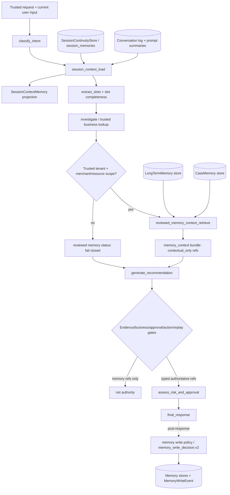

# Phase 31: Memory Platform Boundary - Research

**Researched:** 2026-06-28  
**Domain:** Python/LangGraph modular-monolith memory platform boundary  
**Confidence:** HIGH for repository facts; MEDIUM for recommended implementation split

<user_constraints>
## User Constraints (from CONTEXT.md)

> The following locked decisions, discretion areas, and deferred ideas are copied from `.planning/phases/31-memory-platform-boundary/31-CONTEXT.md`. [VERIFIED: .planning/phases/31-memory-platform-boundary/31-CONTEXT.md]

### Locked Decisions

#### Graph-Facing Boundary Vocabulary

- **D-01:** Phase 31 adopts graph-facing target-boundary vocabulary, not adapter-only and not whole-repo mechanical rename.
  - Same-thread continuity and prompt context should move from `session_memory` wording toward `session_context` / `SessionContextMemory`.
  - Reviewed long-term and case memory prompt inputs should be grouped under non-authoritative `reviewed_memory_context` / `memory_context` vocabulary.
  - A service/facade may be introduced where useful, but the public graph-facing boundary should not remain a thick adapter over old names.
- **D-02:** Target graph-facing renames should be real where they clarify architecture.
  - `session_memory_load` should become or be wrapped by `session_context_load`.
  - `long_term_memory_retrieve` should become or be wrapped by `reviewed_memory_context_retrieve` or `memory_context_retrieve`.
  - `session_memory_bundle` should become or be wrapped by `session_context_bundle`.
  - `long_term_memory` / `case_memory` state projections should converge under `memory_context.long_term_items` / `memory_context.case_items` or an equivalent structured bundle.
- **D-03:** Preserve persistence-layer and historical contract names unless a specific compatibility or spec requirement demands a change.
  - Do not rename DB tables, migrations, repository classes, or existing storage schema versions solely for wording.
  - `SessionMemory`, `LongTermMemory`, `CaseMemory`, `MemoryWriteEvent`, and `session_memory.v2` may remain as storage/history names.

#### Two-Stage Context Loading

- **D-04:** Use two-stage context loading: early session context for same-thread continuity; late reviewed memory context after scope/business context is explicit or trusted.
- **D-05:** `session_context_load` runs after initial safety/basic intent classification and before slot completeness checks.
  - It may provide same-thread rolling summary, recent messages, prompt-safe tool summaries, and trusted/compatible session slot continuity.
  - It must not override explicit current-turn input.
  - It must not provide business, evidence, action, approval, or replay authority.
- **D-06:** `reviewed_memory_context_retrieve` runs only after explicit slots, merchant/resource identifiers, or trusted business context are available.
  - It may provide reviewed long-term and case memory as contextual assistance only.
  - It must not create merchant scope, business facts, evidence claims, action payload fields, approval snapshot inputs, or replay truth.
- **D-07:** Target order for planning is:
  1. `receive_request`
  2. `classify_intent`
  3. `session_context_load`
  4. `extract_slots`
  5. slot completeness / clarification routing
  6. investigate / trusted business lookup
  7. `reviewed_memory_context_retrieve`
  8. `generate_recommendation`
  9. `assess_risk_and_approval`
- **D-08:** If the current graph cannot place reviewed memory retrieval after trusted investigation yet, the plan must explicitly guard the MVP path: late retrieval can only use explicit slots and trusted context to form scopes; memory cannot infer or supply merchant scope.

#### Authority And Reference Boundaries

- **D-09:** Add typed contextual memory refs at the source, with downstream verifier deny-lists as defense-in-depth.
  - Session context and reviewed memory context may only produce contextual-only memory refs.
  - Target refs should carry memory-owned schema versions, source metadata, scope metadata, review metadata where applicable, and `authority_class="contextual_only"`.
- **D-10:** Target memory ref shapes are `SessionContextRef` for same-thread continuity references and `ReviewedMemoryRef` for reviewed long-term/case memory references.
  - Exact file names and model names are agent discretion, but the semantic split is not optional.
- **D-11:** Memory refs must intentionally remain incompatible with:
  - `EvidenceRefV1`
  - `BusinessFactRefV1`
  - approval evidence refs
  - action safety snapshot refs
  - authoritative action payload fields
  - replay truth refs
  - `MaterialClaim.business_fact_refs`
  - citation/evidence maps
- **D-12:** Prompt labels remain required for model hygiene, but prompt text is not the normative boundary.
  - Downstream evidence, business fact, approval, action, and replay verifiers must reject contextual-only memory refs as a second line of defense.

#### Merchant Scope And Visibility

- **D-13:** Use deny-first trusted scope with explicit scoped sharing.
  - Memory retrieval scope must be derived only from `TrustedContext`, `MerchantScopeV1`, explicit current-turn input after trusted validation, or trusted business/resource context.
  - No trusted scope means no reviewed long-term or case memory retrieval.
  - Memory content, session summaries, long-term memory, and case memory must never create or widen merchant scope.
- **D-14:** Global memory is unsupported in Phase 31.
  - Tenant-wide memory remains disabled unless the plan adds a very explicit allowlist and proof; default is no tenant/global retrieval.
- **D-15:** Merchant-level memory sharing is allowed only when the memory record is explicitly merchant-scoped and passes actor trusted merchant scope, review, visibility, privacy, PII, deleted, and expiry gates.
- **D-16:** Session context remains thread/user scoped and does not cross thread or user by default.
  - User preference or user-specific constraint memory remains user-scoped and does not cross user by default.
  - Case memory may be case- or merchant-scoped only after case identity or merchant scope is confirmed by trusted business context.
- **D-17:** Retrieval must fail closed for missing `TrustedContext`, missing tenant, missing required actor merchant scope, merchant not allowed by `MerchantScopeV1`, unverified case merchant, deleted/expired memory, non-approved memory, non-prompt-safe PII, and unallowed tenant/global scope.

#### Write Policy Boundary

- **D-18:** Implement write policy boundary and fail-closed lifecycle coverage; do not build the full memory operations product in Phase 31.
- **D-19:** Phase 31 should standardize the write decision boundary around `memory_write_decision.v2`-compatible metadata or an equivalent DTO.
  - Required metadata: decision, status, reason_code, memory_type, scope, source identity, candidate hash, PII classification, review status, and failure/fallback reason.
- **D-20:** Existing long-term/case lifecycle capabilities should be unified under the target boundary rather than reimplemented.
  - Current code already has tombstone, PII block, needs_review, supersede, write event, and retrieval exclusion behavior in long-term/case memory paths.
- **D-21:** Critical fail-closed cases must be test-pinned:
  - Sensitive/prohibited PII candidates are skipped or write-blocked and do not write session, long-term, or case memory.
  - Deleted or tombstoned memory is not revived by a later candidate with the same content or source identity.
  - Correction/supersede cannot create two current memories for the same identity/scope.
  - Deleted, rejected, superseded, tombstoned, expired, needs_review, or non-prompt-safe PII memory is excluded from reviewed memory context retrieval.
  - Memory write timeout/error records explicit error/skipped/fallback status and does not roll back final response, action, or approval main path.
  - Missing or untrusted tenant/user/thread/merchant/case scope fails closed.
  - Auto-approved source can be stored when eligible; unreviewed source can be persisted only as needs_review and must not surface in prompt-facing retrieval.
- **D-22:** Do not implement review queue UI, full redaction workflow, full operator workflow, every memory API, full RLS redesign, large DB/table renames, or a complete memory operations backend in Phase 31.

#### Audit And Replay Handoff

- **D-23:** Add audit-ready memory status refs now; leave replay-authoritative event coverage to Phase 35.
  - Phase 31 should stabilize status/ref metadata for session context load, reviewed memory context retrieval, and memory write decisions.
  - These records are audit/replay-adjacent handoff points for Phase 35, not replay truth.
- **D-24:** Memory status refs can prove what contextual memory was loaded, retrieved, skipped, written, or rejected by the memory subsystem at runtime.
  - They must not be consumed as evidence, business facts, approval/action inputs, or deterministic replay inputs.
- **D-25:** Target status refs:
  - `session_context_load_status.v1`: status, source, `authority_class="contextual_only"`, tenant/user/thread/run identity, loaded `SessionContextRef` entries, fallback_reason, slot_count, recent_message_count, tool_summary_count.
  - `reviewed_memory_context_retrieve_status.v1`: status, `authority_class="contextual_only"`, trusted scope inputs, effective scopes, retrieved `ReviewedMemoryRef` entries, filter reasons, fallback_reason.
  - `memory_write_decision.v2`: status, decision, `authority_class="contextual_only"`, memory_type, memory_id, candidate_hash, source_identity_hash, scope, pii_classification, review_status, reason_code, fallback_reason.
- **D-26:** Full replay event coverage for memory load/retrieve/write/filter/scope/review/tombstone lifecycle decisions is deferred to Phase 35.

#### Verification Strategy

- **D-27:** Start planning from RED tests that prove the graph-facing target boundary, authority boundaries, scope isolation, write-policy lifecycle, and audit-ready status refs.
- **D-28:** Tests should explicitly prove memory cannot satisfy policy evidence, current business fact, approval/action snapshot, or replay truth requirements.
- **D-29:** Merchant isolation tests must prove one merchant's conversation, case memory, or long-term memory cannot contaminate another merchant's prompt context.
- **D-30:** If implementation must diverge from `docs/contract-spec.md`, do not silently drift. Either correct the spec through the project review workflow or annotate MVP scope/target-state differences in spec and `.planning/`.

### Claude's Discretion

- Exact module split is left to planning. Likely targets include `src/memory/schemas.py`, a new memory context/ref module, current memory services, graph nodes under `src/agent/nodes/`, and prompt projectors under `src/agent/context/`.
- Exact final node names may be `reviewed_memory_context_retrieve` or `memory_context_load`, but the plan must preserve the early session context / late reviewed memory context distinction.
- Exact compatibility shims are left to planning. Preserve legacy state fields long enough to keep existing tests/routes stable where needed.
- Exact reason code names are flexible, but they must be deterministic, stable, and test-pinned.
- Prefer a staged compatibility migration: add target graph-facing names and structured outputs first, then keep legacy fields as aliases until affected tests and downstream graph code are migrated.
- Consider a small `src/memory/context_refs.py` or equivalent schema area for `SessionContextRef`, `ReviewedMemoryRef`, and memory status refs.
- Consider a `MemoryContextService` facade only if it clarifies the public service boundary; avoid a thick adapter that simply preserves old names as the main public API.
- The late reviewed memory retrieval node should return both a structured `memory_context` bundle and legacy `long_term_memory` / `case_memory` aliases where needed during the transition.
- Scope derivation should be explicit and observable: trusted inputs, effective scopes, filter reasons, and fallback reasons should all be traceable without exposing raw memory content or raw private payloads.

### Deferred Ideas (OUT OF SCOPE)

- Full canonical graph migration and router vocabulary belong to Phase 32.
- RAG claim verification for memory-contaminated or unsupported claims belongs to Phase 33.
- Approval/action binding to evidence, business fact refs, risk decisions, and safety snapshots belongs to Phase 34.
- Full replay/audit event coverage for memory lifecycle decisions belongs to Phase 35.
- Release/monitoring eval gates for broad memory scope leakage belong to Phase 35.
- Review queue UI, redaction workflow, operator memory management, full memory API productization, DB/RLS redesign, and microservice extraction belong to future hardening phases.
- Tenant-wide memory policy is not enabled by default in Phase 31; if needed, it requires a later explicit product/security decision.
</user_constraints>

<phase_requirements>
## Phase Requirements

| ID | Description | Research Support |
|----|-------------|------------------|
| APF-09 | Session context loading exposes agent-facing `SessionContextMemory` for same-thread continuity while keeping `SessionContinuityStore` as an internal storage concern. [VERIFIED: .planning/REQUIREMENTS.md] | Current `SessionMemoryBundleService` already composes conversation prompt context and slot continuity; graph-facing node/state still use `session_memory` naming and need target aliases/schemas. [VERIFIED: src/memory/session_bundle.py] [VERIFIED: src/agent/nodes/session_memory_load.py] |
| APF-10 | Memory context APIs separate session context, long-term memory, case memory, conversation log, workflow checkpoint, working state, and memory write candidates, with explicit authority tags that prevent memory from satisfying policy evidence, current business fact, approval, action, or replay truth. [VERIFIED: .planning/REQUIREMENTS.md] | Existing code has separate storage/services for session, long-term, case, conversation, checkpointer state, and memory write results, but agent state lacks `session_context`, `memory_context_bundle`, contextual-only refs, and target status refs. [VERIFIED: src/agent/state.py] [VERIFIED: src/memory/schemas.py] [VERIFIED: src/db/models.py] |
</phase_requirements>

## Summary

Phase 31 should be planned as a boundary-stabilization phase, not a storage rewrite. The storage layer already has `SessionMemory`, `LongTermMemory`, `CaseMemory`, `MemoryTombstone`, and `MemoryWriteEvent` models and migrations; the phase decision explicitly preserves those names where they are persistence/history concerns. [VERIFIED: src/db/models.py] [VERIFIED: src/db/migrations/versions/007_session_memories.py] [VERIFIED: src/db/migrations/versions/013_long_term_case_memory.py] [VERIFIED: .planning/phases/31-memory-platform-boundary/31-CONTEXT.md]

The current graph-facing API is the problem surface: `session_memory_load` returns `session_memory` and `session_memory_bundle`, while `long_term_memory_retrieve` returns `long_term_memory` and `case_memory` directly from scopes derived from merged state slots. [VERIFIED: src/agent/nodes/session_memory_load.py] [VERIFIED: src/agent/nodes/long_term_memory_retrieve.py] Phase 31 should introduce target vocabulary and structured outputs: `SessionContextMemory`, `session_context_load_status.v1`, `ReviewedMemoryRef`, `reviewed_memory_context_retrieve_status.v1`, and `memory_write_decision.v2`, while keeping legacy fields as compatibility aliases during migration. [VERIFIED: .planning/phases/31-memory-platform-boundary/31-CONTEXT.md] [CITED: docs/contract-spec.md]

The highest-risk gap is scope authority. `TrustedContextFactory` and `MerchantScopeV1` already implement deny-first merchant scope semantics, but current reviewed memory retrieval does not consume `TrustedContext` or `MerchantScopeV1`; it builds tenant/user/thread/merchant/case scopes from state and merged slots. [VERIFIED: src/platform/trusted_context.py] [VERIFIED: src/agent/nodes/long_term_memory_retrieve.py] The plan should make reviewed retrieval fail closed unless trusted tenant/actor merchant scope and explicit/trusted resource scope are available. [VERIFIED: .planning/phases/31-memory-platform-boundary/31-CONTEXT.md]

**Primary recommendation:** split planning into at least three numbered plans: contract/schemas + service facade, graph-facing aliases/state/prompt projection, and trusted-scope/write-policy/authority validation. A single `31-01-PLAN.md` covering all domains would violate the project plan-granularity rule for service-boundary phases. [VERIFIED: AGENTS.md] [VERIFIED: CLAUDE.md]

## Architectural Responsibility Map

| Capability | Primary Tier | Secondary Tier | Rationale |
|------------|--------------|----------------|-----------|
| Same-thread `SessionContextMemory` projection | API / Backend | Database / Storage | Backend memory service owns the agent-facing projection; storage remains `SessionMemory`/`session_memories` internal continuity state. [VERIFIED: src/memory/session_bundle.py] [VERIFIED: src/db/models.py] |
| Conversation log context | Database / Storage | API / Backend | Conversation rows and prompt summaries are persisted separately, then projected into the session context bundle by backend services. [VERIFIED: src/memory/session_bundle.py] |
| Reviewed long-term memory | API / Backend | Database / Storage | Backend retrieval must apply review, PII, tombstone, expiry, scope, and tenant filters before prompt exposure. [VERIFIED: src/memory/long_term.py] [VERIFIED: src/memory/repository.py] |
| Reviewed case memory | API / Backend | Database / Storage | Backend retrieval must only expose reviewed prompt-safe case memories and keep them contextual-only. [VERIFIED: src/memory/case_memory.py] [VERIFIED: tests/memory/test_case_memory_retrieval.py] |
| Workflow checkpoint | API / Backend | Database / Storage | LangGraph checkpointer state is graph runtime state, not a semantic memory store. [VERIFIED: src/agent/graph.py] [CITED: docs/contract-spec.md] |
| Working state | API / Backend | - | `AgentState` is the per-run/turn orchestration projection; it should reset loaded memory context each turn. [VERIFIED: src/agent/state.py] [CITED: docs/contract-spec.md] |
| Memory write policy | API / Backend | Database / Storage | The memory services already enforce PII/tombstone/review/write-event behavior; Phase 31 should expose one decision boundary. [VERIFIED: src/memory/service.py] [VERIFIED: src/memory/long_term.py] [VERIFIED: src/memory/case_memory.py] |
| Merchant scope for memory | API / Backend | Platform trusted context | Memory must consume trusted scope from `TrustedContextFactory`/`MerchantScopeV1`; memory must not infer or widen merchant scope. [VERIFIED: src/platform/trusted_context.py] [VERIFIED: .planning/phases/31-memory-platform-boundary/31-CONTEXT.md] |
| Policy evidence/current business fact/approval/action/replay authority | API / Backend | Knowledge, Tool/Business, Approval, Action, Replay services | Memory refs must remain incompatible with `EvidenceRefV1`, `BusinessFactRefV1`, action safety snapshot refs, and replay truth refs. [VERIFIED: src/knowledge/schemas.py] [VERIFIED: src/tools/contracts.py] [VERIFIED: src/approvals/schemas.py] [VERIFIED: tests/agent/test_memory_evidence_boundary.py] |

## Project Constraints (from CLAUDE.md)

- Local debug/validation issues found during MOCA testing must be appended to `.planning/LOCAL-VALIDATION-ISSUES.md` in Chinese with phenomenon, reproduction, evidence, root-cause judgment, handling, remaining issue, and next entry point. [VERIFIED: CLAUDE.md] [VERIFIED: AGENTS.md]
- MOCA tests must use `uv run pytest ...` or a verified repo `.venv/bin/...`; bare `pytest` and bare `python -m pytest` are invalid validation entries. [VERIFIED: AGENTS.md]
- Ruff, temporary Python scripts, and development tools should prefer `uv run ...` or `.venv/bin/...` to avoid PATH pollution. [VERIFIED: AGENTS.md]
- Phase-level plans and larger changes must use the GSD review workflow plus independent Codex cross-check. [VERIFIED: CLAUDE.md] [VERIFIED: AGENTS.md]
- Service-boundary/platform-foundation phases must be split into multiple numbered plans when they span multiple ownership domains, waves, or verification gates; one broad plan covering contracts, implementation, compatibility, callers, security, and verification is a planning blocker. [VERIFIED: AGENTS.md]
- `docs/contract-spec.md` is normative for contract semantics but not proof of implementation fact; implementation/spec divergence must be recorded by updating spec or annotating MVP scope and `.planning/` decisions. [VERIFIED: CLAUDE.md] [VERIFIED: AGENTS.md]
- Project-local skill files were not found under `.claude/skills` or `.agents/skills`. [VERIFIED: rg --files .claude .agents]

## Standard Stack

### Core

| Library | Version | Purpose | Why Standard |
|---------|---------|---------|--------------|
| Python | `>=3.12` | Runtime and type features for the backend. | Project declares Python 3.12+ and tests rely on 3.12 APIs. [VERIFIED: pyproject.toml] [VERIFIED: AGENTS.md] |
| Pydantic | 2.13.4 | Strict DTO/ref/status schemas. | Existing memory, trusted context, approval, and tool contracts use Pydantic models with `extra="forbid"`. [VERIFIED: uv run python importlib.metadata] [VERIFIED: src/memory/schemas.py] [VERIFIED: src/platform/trusted_context.py] |
| SQLAlchemy async | 2.0.49 | ORM/repository layer for memory and platform records. | Existing repositories and tests use async sessions and SQLAlchemy models. [VERIFIED: uv run python importlib.metadata] [VERIFIED: src/memory/repository.py] [VERIFIED: tests/conftest.py] |
| asyncpg | 0.31.0 | PostgreSQL async driver for app/test database access. | Test fixture and connection URL use `postgresql+asyncpg`. [VERIFIED: uv run python importlib.metadata] [VERIFIED: tests/conftest.py] |
| Alembic | 1.18.4 | Schema migrations. | Memory tables are already managed by Alembic migration files. [VERIFIED: uv run python importlib.metadata] [VERIFIED: src/db/migrations/versions/007_session_memories.py] |
| pgvector | 0.4.2 | Case memory embedding column/index support. | `case_memories.embedding` uses pgvector `Vector(1024)` and HNSW index migration. [VERIFIED: uv run python importlib.metadata] [VERIFIED: src/db/migrations/versions/013_long_term_case_memory.py] |
| LangGraph | 1.1.10 | Agent graph runtime and node orchestration. | Current graph registers memory nodes in LangGraph `StateGraph`. [VERIFIED: uv run python importlib.metadata] [VERIFIED: src/agent/graph.py] |

### Supporting

| Library | Version | Purpose | When to Use |
|---------|---------|---------|-------------|
| pytest | 9.0.3 | Unit/integration test runner. | Use via `uv run pytest ...` only. [VERIFIED: uv run python importlib.metadata] [VERIFIED: AGENTS.md] |
| pytest-asyncio | 1.3.0 | Async test support. | Existing async DB/service tests rely on it; `asyncio_mode = "auto"`. [VERIFIED: uv run python importlib.metadata] [VERIFIED: pyproject.toml] |
| Ruff | 0.15.12 | Lint/format checks. | Project sets line length 120 and target py312. [VERIFIED: uv run python importlib.metadata] [VERIFIED: pyproject.toml] |
| FastAPI | 0.136.1 | API runtime. | Not central to Phase 31 unless memory APIs are touched; current test app imports FastAPI. [VERIFIED: uv run python importlib.metadata] [VERIFIED: tests/conftest.py] |

### Alternatives Considered

| Instead of | Could Use | Tradeoff |
|------------|-----------|----------|
| In-repo modular monolith memory boundary | New memory microservice | Physical service extraction is explicitly out of scope for v1.9 and Phase 31. [VERIFIED: .planning/REQUIREMENTS.md] |
| Existing PostgreSQL memory tables | New vector database / new persistence names | Storage/table renames and external backend replacement are out of scope; case memory already uses PostgreSQL/pgvector. [VERIFIED: .planning/phases/31-memory-platform-boundary/31-CONTEXT.md] [VERIFIED: src/db/migrations/versions/013_long_term_case_memory.py] |
| Existing lifecycle services | Rebuild custom write/review/tombstone engine | Long-term/case services already implement PII, tombstone, review, supersede, duplicate, and write-event behavior. [VERIFIED: src/memory/long_term.py] [VERIFIED: src/memory/case_memory.py] |

**Installation:**
```bash
# No new package is recommended for Phase 31.
uv sync
```
[VERIFIED: pyproject.toml]

**Version verification:**
```bash
uv run python - <<'PY'
import importlib.metadata as m
for pkg in ["pydantic", "sqlalchemy", "asyncpg", "alembic", "pytest", "pytest-asyncio", "langgraph", "pgvector", "ruff", "fastapi"]:
    print(pkg, m.version(pkg))
PY
```
[VERIFIED: uv run python importlib.metadata]

## Architecture Patterns

### System Architecture Diagram

This recommended flow is derived from the Phase 31 decisions, the target contract, and current graph registration/order. [VERIFIED: .planning/phases/31-memory-platform-boundary/31-CONTEXT.md] [CITED: docs/contract-spec.md] [VERIFIED: src/agent/graph.py]



### Recommended Project Structure

```text
src/
├── memory/
│   ├── schemas.py              # existing storage/write DTOs; keep compatible
│   ├── context_refs.py         # new contextual-only refs/status DTOs
│   ├── context_service.py      # MemoryContextService facade
│   ├── service.py              # existing SessionContinuityStore behavior
│   ├── session_bundle.py       # source for SessionContextMemory projection
│   ├── long_term.py            # existing long-term lifecycle
│   └── case_memory.py          # existing case memory lifecycle
├── agent/
│   ├── nodes/
│   │   ├── session_context_load.py
│   │   ├── reviewed_memory_context_retrieve.py
│   │   └── memory_write.py
│   ├── state.py                # add target fields, preserve legacy aliases
│   └── context/
│       └── session_memory_bundle.py
└── platform/
    ├── trusted_context.py
    └── context_projections.py
```
[VERIFIED: src/memory/schemas.py] [VERIFIED: src/agent/state.py] [VERIFIED: src/platform/trusted_context.py] [VERIFIED: .planning/phases/31-memory-platform-boundary/31-CONTEXT.md]

### Pattern 1: Target DTOs First, Legacy Fields As Aliases

**What:** Add target `session_context`, `session_context_bundle`, `memory_context_bundle`, and status/ref DTOs while continuing to populate `session_memory`, `session_memory_bundle`, `long_term_memory`, and `case_memory` for compatibility. [VERIFIED: .planning/phases/31-memory-platform-boundary/31-CONTEXT.md] [VERIFIED: src/agent/state.py]

**When to use:** Use this whenever graph-facing vocabulary changes but existing routes/tests still read legacy fields. [VERIFIED: src/agent/routing.py] [VERIFIED: tests/agent/test_session_memory_load.py]

**Example:**
```python
# Source pattern: current node returns legacy state fields plus trace metrics.
# Add target fields next to existing fields, then migrate callers.
return {
    "session_context": session_context.model_dump(mode="json"),
    "session_context_load_status": status.model_dump(mode="json"),
    "session_memory": session_context.slot_continuity.model_dump(mode="json"),
    "session_memory_bundle": legacy_bundle,
}
```
[VERIFIED: src/agent/nodes/session_memory_load.py]

### Pattern 2: Contextual-Only Refs Are Source Schemas, Not Prompt Text

**What:** Define `SessionContextRef` and `ReviewedMemoryRef` as Pydantic schemas with `authority_class="contextual_only"` and no structural compatibility with `EvidenceRefV1`, `BusinessFactRefV1`, approval evidence refs, action safety refs, action payload fields, or replay truth refs. [VERIFIED: .planning/phases/31-memory-platform-boundary/31-CONTEXT.md] [VERIFIED: src/knowledge/schemas.py] [VERIFIED: src/tools/contracts.py]

**When to use:** Use for every memory item/status that crosses from memory services into graph state or prompts. [CITED: docs/contract-spec.md]

**Example:**
```python
from typing import Literal
from pydantic import BaseModel, ConfigDict


class SessionContextRef(BaseModel):
    model_config = ConfigDict(extra="forbid")

    schema_version: Literal["session_context_ref.v1"] = "session_context_ref.v1"
    authority_class: Literal["contextual_only"] = "contextual_only"
    tenant_id: str
    user_id: str
    thread_id: str
    run_id: str
    source: Literal["conversation_log", "session_continuity_store", "tool_summary"]
    ref_id: str
```
[VERIFIED: src/memory/schemas.py] [VERIFIED: .planning/phases/31-memory-platform-boundary/31-CONTEXT.md]

### Pattern 3: Reviewed Memory Scope Is Derived From Trusted Inputs

**What:** Reviewed retrieval should fail closed unless tenant, actor merchant scope, and explicit/trusted resource scope can be established from `TrustedContext`/`MerchantScopeV1` plus current explicit slots or trusted business context. [VERIFIED: .planning/phases/31-memory-platform-boundary/31-CONTEXT.md] [VERIFIED: src/platform/trusted_context.py]

**Current gap:** `_memory_scopes` currently derives tenant/user/thread/merchant/case scopes from merged state slots rather than from `TrustedContext`/`MerchantScopeV1`. [VERIFIED: src/agent/nodes/long_term_memory_retrieve.py]

**Example:**
```python
trusted = configurable.get("trusted_context")
if trusted is None or not trusted.merchant_scope.merchant_ids:
    return fail_closed_status("missing_trusted_scope")

explicit_merchant_id = state.get("extracted_slots", {}).get("merchant_id")
if explicit_merchant_id and not trusted.merchant_scope.allows(merchant_id=explicit_merchant_id):
    return fail_closed_status("merchant_scope_denied")
```
[VERIFIED: src/platform/trusted_context.py] [VERIFIED: src/agent/nodes/long_term_memory_retrieve.py]

### Pattern 4: Write Decision Boundary Wraps Existing Lifecycle

**What:** Build a `memory_write_decision.v2`-compatible projection over existing session/long-term/case write results and events instead of replacing lifecycle services. [VERIFIED: .planning/phases/31-memory-platform-boundary/31-CONTEXT.md] [VERIFIED: src/memory/service.py] [VERIFIED: src/memory/long_term.py] [VERIFIED: src/memory/case_memory.py]

**When to use:** Use for graph-facing status, trace metrics, and tests that need deterministic reason codes across memory types. [VERIFIED: src/agent/nodes/memory_write.py] [VERIFIED: src/db/models.py]

### Anti-Patterns to Avoid

- **Renaming storage to match graph vocabulary:** DB tables and schema versions are explicitly preserved; rename/wrapper work belongs at service/graph boundary. [VERIFIED: .planning/phases/31-memory-platform-boundary/31-CONTEXT.md] [VERIFIED: src/db/models.py]
- **Letting memory supply merchant scope:** Current memory content, summaries, and previous slots must not create or widen merchant scope. [VERIFIED: .planning/phases/31-memory-platform-boundary/31-CONTEXT.md]
- **Using prompt labels as authority boundaries:** Verifiers must reject contextual-only refs even if prompt text labels them correctly. [VERIFIED: tests/agent/rag_context/test_authority_boundaries.py]
- **Parallel DB-backed pytest groups:** Current fixture uses one shared `moca_test` database and drops/recreates all metadata, so parallel DB test processes race. [VERIFIED: tests/conftest.py] [VERIFIED: .planning/LOCAL-VALIDATION-ISSUES.md]

## Don't Hand-Roll

| Problem | Don't Build | Use Instead | Why |
|---------|-------------|-------------|-----|
| Session continuity persistence | New custom store/table | Existing `SessionMemoryRepository`/`MemoryService` | Existing code handles tenant/user/thread scope, TTL, CAS, slot compatibility, PII skip, and fallback states. [VERIFIED: src/memory/repository.py] [VERIFIED: src/memory/service.py] |
| Conversation prompt context | New ad hoc history loader | Existing `ConversationService.load_prompt_context` through `SessionMemoryBundleService` | Existing facade already composes rolling summary, recent messages, tool summaries, and slot continuity. [VERIFIED: src/memory/session_bundle.py] |
| Long-term lifecycle | New review/tombstone/duplicate engine | Existing `LongTermMemoryService` | Existing service has auto-approval, needs-review, PII skip, tombstone, delete, supersede, duplicate, and event behavior. [VERIFIED: src/memory/long_term.py] |
| Case memory lifecycle | New case-memory retrieval/write engine | Existing `CaseMemoryService`/`CaseMemoryRepository` | Existing retrieval excludes unapproved, expired, deleted, non-prompt-safe PII, and tombstoned entries. [VERIFIED: src/memory/case_memory.py] [VERIFIED: tests/memory/test_case_memory_retrieval.py] |
| Scope authorization | Prompt rules or AgentState guesses | `TrustedContextFactory` and `MerchantScopeV1` | Trusted scope is produced from API/auth/run boundaries and is deny-first. [VERIFIED: src/platform/trusted_context.py] |
| Hash identity | New hash format | Existing `src/memory/identity.py` helpers | Current services and tests already use canonical content/source/candidate hashes. [VERIFIED: src/memory/identity.py] |

**Key insight:** The hard part is not storing memory; it is preventing memory from becoming an implicit authority channel or scope widening channel. [VERIFIED: .planning/phases/31-memory-platform-boundary/31-CONTEXT.md] [VERIFIED: tests/agent/test_memory_evidence_boundary.py]

## Runtime State Inventory

| Category | Items Found | Action Required |
|----------|-------------|-----------------|
| Stored data | `session_memories`, `long_term_memories`, `case_memories`, `memory_tombstones`, and `memory_write_events` exist with storage schema versions such as `session_memory.v2`, `long_term_memory.v2`, `case_memory.v2`, and `memory_write_event.v2`. [VERIFIED: src/db/models.py] [VERIFIED: src/db/migrations/versions/007_session_memories.py] [VERIFIED: src/db/migrations/versions/013_long_term_case_memory.py] | No table/schema-version rename for Phase 31; implement target graph-facing DTOs and aliases. [VERIFIED: .planning/phases/31-memory-platform-boundary/31-CONTEXT.md] |
| Live service config | No in-repo live service config containing memory boundary names was found; off-repo dashboards/services were not inspected. [VERIFIED: rg --files] [VERIFIED: rg session_memory/long_term_memory/case_memory/memory_write] | Planner should avoid any task that assumes off-repo config is absent; Phase 31 can proceed as repo/code boundary work. [VERIFIED: .planning/phases/31-memory-platform-boundary/31-CONTEXT.md] |
| OS-registered state | `launchctl list` showed `com.moca.study.reminders-advance` and `com.moca.study.audit-day`, but no `session_memory`, `long_term_memory`, `case_memory`, or `memory_write` registered state was found by the search. [VERIFIED: launchctl list \| rg] | No memory-boundary OS re-registration action identified. [VERIFIED: launchctl list \| rg] |
| Secrets/env vars | Runtime settings include `session_memory_enabled`, `session_memory_ttl_seconds`, `session_memory_summary_max_chars`, and `session_memory_write_timeout_seconds`; `.env.example` defines `DATABASE_URL` and `REDIS_URL`, with no memory-specific env var names found there. [VERIFIED: src/config.py] [VERIFIED: .env.example] | Preserve existing settings names unless an explicit compatibility shim is planned; do not rename secret/env keys in Phase 31. [VERIFIED: .planning/phases/31-memory-platform-boundary/31-CONTEXT.md] |
| Build artifacts | `moca.egg-info/SOURCES.txt` contains old graph file names such as `session_memory_load.py`, `long_term_memory_retrieve.py`, and `memory_write.py`. [VERIFIED: moca.egg-info/SOURCES.txt] | If graph-facing files are added/renamed, refresh packaging metadata through the normal `uv`/editable install path before final validation. [VERIFIED: moca.egg-info/SOURCES.txt] |

**Nothing found in category:** No project-local `.claude/skills` or `.agents/skills` `SKILL.md` files were found. [VERIFIED: rg --files .claude .agents]

## Common Pitfalls

### Pitfall 1: Treating Phase 31 As A Mechanical Rename

**What goes wrong:** The plan renames every storage symbol and migration name, causing unnecessary churn and compatibility risk. [VERIFIED: .planning/phases/31-memory-platform-boundary/31-CONTEXT.md]

**Why it happens:** Graph-facing vocabulary and persistence vocabulary currently share words like `session_memory`. [VERIFIED: src/agent/nodes/session_memory_load.py] [VERIFIED: src/db/models.py]

**How to avoid:** Keep persistence names stable and introduce agent-facing target DTOs/nodes/status refs at the service/graph boundary. [VERIFIED: .planning/phases/31-memory-platform-boundary/31-CONTEXT.md]

**Warning signs:** A plan edits migrations, DB table names, repository class names, or schema versions without a concrete compatibility need. [VERIFIED: src/db/migrations/versions/007_session_memories.py] [VERIFIED: src/db/migrations/versions/013_long_term_case_memory.py]

### Pitfall 2: Reviewed Memory Retrieval Before Trusted Scope

**What goes wrong:** Long-term/case memory can enter prompts using merchant or case scope inferred from prior memory or merged state slots. [VERIFIED: src/agent/nodes/long_term_memory_retrieve.py]

**Why it happens:** Current graph routes `extract_slots -> long_term_memory_retrieve -> investigate` when routing hints request long-term memory. [VERIFIED: src/agent/graph.py] [VERIFIED: src/agent/routing.py]

**How to avoid:** Move reviewed retrieval after trusted business lookup when feasible; if not feasible in MVP, fail closed unless explicit current slots and trusted `MerchantScopeV1` allow the effective scope. [VERIFIED: .planning/phases/31-memory-platform-boundary/31-CONTEXT.md] [VERIFIED: src/platform/trusted_context.py]

**Warning signs:** `_memory_scopes` continues to accept merchant/case scope from `active_slots` or old `session_memory` without trusted validation. [VERIFIED: src/agent/nodes/long_term_memory_retrieve.py]

### Pitfall 3: Memory Refs Accidentally Become Authority Refs

**What goes wrong:** A memory item carries forged `EvidenceRefV1`, `BusinessFactRefV1`, approval/action snapshot, or replay-looking fields into state or prompts. [VERIFIED: tests/agent/test_memory_evidence_boundary.py]

**Why it happens:** Sanitized prompt projection and typed authority refs are separate mechanisms; prompt sanitation alone does not prove authority separation. [VERIFIED: tests/agent/test_memory_evidence_boundary.py] [VERIFIED: tests/agent/rag_context/test_authority_boundaries.py]

**How to avoid:** Add source-level contextual-only memory refs and keep downstream verifier deny-lists. [VERIFIED: .planning/phases/31-memory-platform-boundary/31-CONTEXT.md] [VERIFIED: src/agent/rag_context/verifier.py]

**Warning signs:** Memory DTOs import `EvidenceRefV1`, `BusinessFactRefV1`, approval snapshot DTOs, or replay DTOs. [VERIFIED: tests/agent/test_memory_evidence_boundary.py]

### Pitfall 4: DB Test Runs Racing Each Other

**What goes wrong:** Parallel DB-backed `uv run pytest` groups fail with duplicate pg types, dropped tables, or deadlocks. [VERIFIED: .planning/LOCAL-VALIDATION-ISSUES.md]

**Why it happens:** `tests/conftest.py` uses one `moca_test` database and each test engine drops/recreates all metadata. [VERIFIED: tests/conftest.py]

**How to avoid:** Run DB-backed Phase 31 test groups serially unless the fixture is changed to use per-process databases. [VERIFIED: tests/conftest.py] [VERIFIED: .planning/LOCAL-VALIDATION-ISSUES.md]

**Warning signs:** `asyncpg.exceptions.UniqueViolationError` on pg type names, `UndefinedTableError` for `tenants`, or `DeadlockDetectedError` during collection/setup. [VERIFIED: .planning/LOCAL-VALIDATION-ISSUES.md]

## Code Examples

### Session Context Status DTO

```python
from typing import Literal
from pydantic import BaseModel, ConfigDict, Field


class SessionContextLoadStatusV1(BaseModel):
    model_config = ConfigDict(extra="forbid")

    schema_version: Literal["session_context_load_status.v1"] = "session_context_load_status.v1"
    authority_class: Literal["contextual_only"] = "contextual_only"
    status: Literal["loaded", "empty", "fallback", "unavailable", "disabled"]
    source: str
    tenant_id: str
    user_id: str
    thread_id: str
    run_id: str
    loaded_refs: list[SessionContextRef] = Field(default_factory=list)
    fallback_reason: str | None = None
    slot_count: int = 0
    recent_message_count: int = 0
    tool_summary_count: int = 0
```
[VERIFIED: .planning/phases/31-memory-platform-boundary/31-CONTEXT.md] [VERIFIED: src/memory/schemas.py]

### Reviewed Memory Context Bundle

```python
class ReviewedMemoryContextBundle(BaseModel):
    model_config = ConfigDict(extra="forbid")

    schema_version: Literal["reviewed_memory_context_bundle.v1"] = "reviewed_memory_context_bundle.v1"
    authority_class: Literal["contextual_only"] = "contextual_only"
    status_ref: ReviewedMemoryContextRetrieveStatusV1
    long_term_items: list[dict[str, object]] = Field(default_factory=list)
    case_items: list[dict[str, object]] = Field(default_factory=list)
```
[VERIFIED: .planning/phases/31-memory-platform-boundary/31-CONTEXT.md] [VERIFIED: src/agent/nodes/long_term_memory_retrieve.py]

### Fail-Closed Scope Guard

```python
def _effective_reviewed_memory_scopes(trusted: TrustedContext, slots: dict[str, str]) -> list[tuple[str, str]]:
    merchant_id = slots.get("merchant_id")
    if not merchant_id:
        return []
    if not trusted.merchant_scope.allows(merchant_id=merchant_id):
        return []
    return [("merchant", merchant_id)]
```
[VERIFIED: src/platform/trusted_context.py] [VERIFIED: .planning/phases/31-memory-platform-boundary/31-CONTEXT.md]

## State of the Art

| Old Approach | Current/Target Approach | When Changed | Impact |
|--------------|-------------------------|--------------|--------|
| Agent-facing `session_memory` means both store and prompt context | Target `SessionContextMemory` as agent-facing same-thread projection; storage remains `SessionContinuityStore`/`SessionMemory` internally | Phase 31 target [VERIFIED: .planning/phases/31-memory-platform-boundary/31-CONTEXT.md] | Planner should add target schemas/nodes without renaming DB tables. |
| `long_term_memory_retrieve` before `investigate` based on routing hint | Target late reviewed memory retrieval after trusted business/scope context, or MVP fail-closed guard if graph move is too large | Phase 31 target; Phase 32 full graph migration deferred [VERIFIED: .planning/phases/31-memory-platform-boundary/31-CONTEXT.md] [VERIFIED: src/agent/graph.py] | Planner must choose guarded MVP or post-investigate placement explicitly. |
| Memory write result is session-specific `SessionMemoryWriteResult` | Target graph-facing `memory_write_decision.v2`-compatible metadata across memory types | Phase 31 target [VERIFIED: .planning/phases/31-memory-platform-boundary/31-CONTEXT.md] [CITED: docs/contract-spec.md] | Planner should wrap existing lifecycle outputs instead of rewriting services. |
| Merchant-bound roles had wildcard/broad risk before Phase 29.5 | `support`/`manager`/`merchant` scope to their merchant or deny-all; admin may have wildcard | Phase 29.5 [VERIFIED: src/platform/trusted_context.py] [VERIFIED: .planning/todos/deferred/2026-06-27-merchant-scope-memory.md] | Memory must preserve merchant boundary and fail closed for missing merchant scope. |

**Deprecated/outdated:**
- `session_memory_load` and `long_term_memory_retrieve` as the only public graph vocabulary are target-deprecated for Phase 31, but can remain as compatibility aliases. [VERIFIED: .planning/phases/31-memory-platform-boundary/31-CONTEXT.md] [CITED: docs/contract-spec.md]
- Treating `search_case_memory` or case memory snippets as policy evidence/current facts is forbidden; case memory is contextual precedent only. [VERIFIED: tests/agent/test_memory_evidence_boundary.py] [VERIFIED: tests/agent/rag_context/test_authority_boundaries.py]

## Assumptions Log

All claims in this research were verified against repository files, local command output, project docs, or local validation logs; no `[ASSUMED]` claims are intentionally used.

## Open Questions

1. **Should Phase 31 move reviewed retrieval after `investigate`, or implement the guarded MVP first?**  
   What we know: The target order places reviewed retrieval after trusted business lookup; current graph places `long_term_memory_retrieve` before `investigate`. [VERIFIED: .planning/phases/31-memory-platform-boundary/31-CONTEXT.md] [VERIFIED: src/agent/graph.py]  
   What's unclear: Whether moving the graph edge now is within Phase 31 or spills into Phase 32 graph migration. [VERIFIED: .planning/phases/31-memory-platform-boundary/31-CONTEXT.md]  
   Recommendation: Prefer post-investigate placement if bounded; otherwise explicitly guard the existing path with trusted scope and no memory-inferred merchant/case scopes. [VERIFIED: .planning/phases/31-memory-platform-boundary/31-CONTEXT.md]

2. **How should the existing memory-authority outcome drift be classified?**  
   What we know: `uv run pytest tests/agent/test_memory_evidence_boundary.py::test_agent_runs_memory_context_is_not_policy_business_action_or_replay_authority -q` currently fails because the test expects `UNSUPPORTED` while verifier returns `INSUFFICIENT` for a memory-supported action dependency. [VERIFIED: .planning/LOCAL-VALIDATION-ISSUES.md] [VERIFIED: tests/agent/test_memory_evidence_boundary.py] [VERIFIED: src/agent/rag_context/verifier.py]  
   What's unclear: Whether project semantics prefer `UNSUPPORTED` or `INSUFFICIENT` for this exact action-claim case. [VERIFIED: .planning/LOCAL-VALIDATION-ISSUES.md]  
   Recommendation: Treat as a Wave 0 RED/repair item; update verifier or test wording explicitly, not silently. [VERIFIED: .planning/LOCAL-VALIDATION-ISSUES.md]

3. **Should `MemoryContext` projection include merchant scope directly?**  
   What we know: `project_to_memory_context` currently returns tenant/user/role/session/thread/run/trace/locale, while tool/approval contexts include merchant scope. [VERIFIED: src/platform/context_projections.py]  
   What's unclear: Whether Phase 31 should extend `MemoryContext` itself or define a retrieval-specific scope DTO/status ref. [VERIFIED: .planning/phases/31-memory-platform-boundary/31-CONTEXT.md]  
   Recommendation: Add a reviewed-memory retrieval status/scope DTO that records trusted inputs/effective scopes without widening canonical trusted context. [VERIFIED: src/platform/trusted_context.py] [VERIFIED: .planning/phases/31-memory-platform-boundary/31-CONTEXT.md]

## Environment Availability

| Dependency | Required By | Available | Version | Fallback |
|------------|-------------|-----------|---------|----------|
| `uv` | All validation commands | yes | 0.11.2 | None needed. [VERIFIED: uv --version] |
| Python packages | Tests and app import graph | yes | Pydantic 2.13.4, SQLAlchemy 2.0.49, asyncpg 0.31.0, LangGraph 1.1.10, pytest 9.0.3 | Use `uv sync` if missing. [VERIFIED: uv run python importlib.metadata] |
| PostgreSQL test DB | DB-backed memory tests | partial | `moca_test` reachable through asyncpg during test runs; `psql` CLI not on PATH | Use existing asyncpg fixture; do not require `psql` in plan. [VERIFIED: tests/conftest.py] [VERIFIED: psql --version] |
| Docker | Optional local DB/service setup | yes | 29.4.2 | Existing local PostgreSQL fixture already reached DB; Docker setup only if DB missing. [VERIFIED: docker --version] |
| Ruff | Optional lint/format validation | yes | 0.15.12 via `uv run`; CLI reports 0.15.8 | Prefer `uv run ruff ...` for consistency. [VERIFIED: uv run python importlib.metadata] [VERIFIED: ruff --version] |

**Missing dependencies with no fallback:**
- None identified for research/planning. [VERIFIED: environment availability commands]

**Missing dependencies with fallback:**
- `psql` CLI is not on PATH; existing test infrastructure uses asyncpg directly. [VERIFIED: psql --version] [VERIFIED: tests/conftest.py]

## Validation Architecture

### Test Framework

| Property | Value |
|----------|-------|
| Framework | pytest 9.0.3 + pytest-asyncio 1.3.0 [VERIFIED: uv run python importlib.metadata] |
| Config file | `pyproject.toml` with `asyncio_mode = "auto"` [VERIFIED: pyproject.toml] |
| Quick run command | `uv run pytest tests/agent/test_session_memory_load.py -q` [VERIFIED: AGENTS.md] |
| Full focused suite command | `uv run pytest tests/agent/test_session_memory_load.py tests/memory/test_session_memory_bundle.py tests/memory/test_session_memory_isolation.py tests/memory/test_long_term_memory_repository.py tests/memory/test_long_term_memory_service.py tests/memory/test_case_memory_retrieval.py tests/agent/test_memory_write_node.py tests/agent/test_memory_evidence_boundary.py tests/agent/rag_context/test_authority_boundaries.py tests/tools/test_merchant_scope_static.py -q` [VERIFIED: rg --files tests] |

### Phase Requirements -> Test Map

| Req ID | Behavior | Test Type | Automated Command | File Exists? |
|--------|----------|-----------|-------------------|--------------|
| APF-09 | `SessionContextMemory` graph-facing projection exists while legacy `session_memory` remains compatibility alias. | unit/integration | `uv run pytest tests/agent/test_session_memory_load.py tests/memory/test_session_memory_bundle.py -q` | Existing files yes; target-name assertions need Wave 0 additions. [VERIFIED: tests/agent/test_session_memory_load.py] [VERIFIED: tests/memory/test_session_memory_bundle.py] |
| APF-09 | Same-thread session context cannot cross user/thread and explicit current-turn input overrides inherited memory. | integration | `uv run pytest tests/memory/test_session_memory_isolation.py tests/agent/test_session_memory_integration.py -q` | Existing files yes; merchant-context cases need Wave 0 additions. [VERIFIED: tests/memory/test_session_memory_isolation.py] [VERIFIED: tests/agent/test_session_memory_integration.py] |
| APF-10 | Reviewed long-term/case memory is contextual-only and sanitized. | unit/integration | `uv run pytest tests/memory/test_long_term_memory_repository.py tests/memory/test_case_memory_retrieval.py tests/agent/test_memory_evidence_boundary.py -q` | Existing files yes; target `ReviewedMemoryRef`/bundle assertions need Wave 0 additions. [VERIFIED: tests/memory/test_long_term_memory_repository.py] [VERIFIED: tests/memory/test_case_memory_retrieval.py] [VERIFIED: tests/agent/test_memory_evidence_boundary.py] |
| APF-10 | Memory cannot satisfy policy evidence/current business facts/action authority. | unit | `uv run pytest tests/agent/rag_context/test_authority_boundaries.py tests/agent/test_memory_evidence_boundary.py -q` | Existing files yes; one current assertion drift must be repaired. [VERIFIED: tests/agent/rag_context/test_authority_boundaries.py] [VERIFIED: .planning/LOCAL-VALIDATION-ISSUES.md] |
| APF-10 | Merchant memory isolation fails closed for missing/untrusted/wrong merchant scope. | unit/integration | `uv run pytest tests/tools/test_merchant_scope_static.py tests/memory/test_session_memory_isolation.py -q` plus new Phase 31 tests | Existing guard files yes; explicit Phase 31 cross-merchant memory tests missing. [VERIFIED: tests/tools/test_merchant_scope_static.py] [VERIFIED: .planning/todos/deferred/2026-06-27-merchant-scope-memory.md] |
| APF-10 | Write policy emits `memory_write_decision.v2`-compatible status and does not roll back main path on timeout/error. | unit/integration | `uv run pytest tests/agent/test_memory_write_node.py tests/memory/test_long_term_memory_service.py tests/memory/test_case_memory_retrieval.py -q` | Existing files yes; unified decision DTO assertions need Wave 0 additions. [VERIFIED: tests/agent/test_memory_write_node.py] [VERIFIED: tests/memory/test_long_term_memory_service.py] |

### Sampling Rate

- **Per task commit:** `uv run pytest tests/agent/test_session_memory_load.py -q` plus the touched module's nearest test file. [VERIFIED: AGENTS.md]
- **Per wave merge:** run the serial focused suite above; do not parallelize DB-backed groups with the current fixture. [VERIFIED: tests/conftest.py] [VERIFIED: .planning/LOCAL-VALIDATION-ISSUES.md]
- **Phase gate:** full focused suite green plus any new Phase 31 RED tests, then broader agent/memory suite if time allows. [VERIFIED: .planning/phases/31-memory-platform-boundary/31-CONTEXT.md]

### Wave 0 Gaps

- [ ] Add tests for `SessionContextMemory`, `SessionContextRef`, and `session_context_load_status.v1` while preserving legacy `session_memory` alias. [VERIFIED: .planning/phases/31-memory-platform-boundary/31-CONTEXT.md]
- [ ] Add tests for `ReviewedMemoryRef`, `reviewed_memory_context_retrieve_status.v1`, and structured `memory_context_bundle.long_term_items` / `case_items` aliases. [VERIFIED: .planning/phases/31-memory-platform-boundary/31-CONTEXT.md]
- [ ] Add cross-merchant negative tests proving merchant A session summaries, tool summaries, long-term memory, and case memory cannot enter merchant B prompt context. [VERIFIED: .planning/todos/deferred/2026-06-27-merchant-scope-memory.md]
- [ ] Add tests that missing `TrustedContext`, missing actor merchant scope, denied merchant, unverified case merchant, tenant/global scope, deleted/expired/unreviewed/non-prompt-safe memory all fail closed for reviewed retrieval. [VERIFIED: .planning/phases/31-memory-platform-boundary/31-CONTEXT.md]
- [ ] Add `memory_write_decision.v2` projection tests across session write skip/write/error and long-term/case needs-review/write-blocked/tombstone/supersede paths. [VERIFIED: .planning/phases/31-memory-platform-boundary/31-CONTEXT.md] [VERIFIED: src/memory/long_term.py] [VERIFIED: src/memory/case_memory.py]
- [ ] Repair or explicitly reclassify the existing authority outcome drift in `tests/agent/test_memory_evidence_boundary.py::test_agent_runs_memory_context_is_not_policy_business_action_or_replay_authority`. [VERIFIED: .planning/LOCAL-VALIDATION-ISSUES.md]

### Validation Already Run During Research

- `uv run pytest tests/agent/test_session_memory_load.py -q` passed with `6 passed, 1 warning`. [VERIFIED: command output]
- `uv run pytest tests/agent/test_memory_evidence_boundary.py::test_agent_runs_memory_context_is_not_policy_business_action_or_replay_authority -q` failed with expected `UNSUPPORTED` vs actual `INSUFFICIENT`; the issue was logged to `.planning/LOCAL-VALIDATION-ISSUES.md`. [VERIFIED: .planning/LOCAL-VALIDATION-ISSUES.md]
- Parallel DB-backed pytest commands produced shared-database setup races; the issue was logged to `.planning/LOCAL-VALIDATION-ISSUES.md`. [VERIFIED: tests/conftest.py] [VERIFIED: .planning/LOCAL-VALIDATION-ISSUES.md]

## Security Domain

### Applicable ASVS Categories

| ASVS Category | Applies | Standard Control |
|---------------|---------|------------------|
| V2 Authentication | no direct new auth | Consume existing `TrustedContextFactory`; do not accept user/LLM identity overrides in memory APIs. [VERIFIED: src/platform/trusted_context.py] |
| V3 Session Management | yes | Session context remains tenant/user/thread scoped and does not cross thread/user by default. [VERIFIED: src/memory/repository.py] [VERIFIED: .planning/phases/31-memory-platform-boundary/31-CONTEXT.md] |
| V4 Access Control | yes | Use deny-first `MerchantScopeV1`; reviewed memory retrieval fails closed for missing/denied scope. [VERIFIED: src/platform/trusted_context.py] [VERIFIED: .planning/phases/31-memory-platform-boundary/31-CONTEXT.md] |
| V5 Input Validation | yes | Pydantic DTOs with `extra="forbid"` for memory refs/statuses; sanitize prompt projections. [VERIFIED: src/memory/schemas.py] [VERIFIED: tests/memory/test_session_memory_bundle.py] |
| V6 Cryptography | yes for integrity hashes | Use existing canonical memory content/source/candidate hash helpers; do not invent new hash formats. [VERIFIED: src/memory/identity.py] |

### Known Threat Patterns for MOCA Memory Stack

| Pattern | STRIDE | Standard Mitigation |
|---------|--------|---------------------|
| Cross-merchant prompt contamination | Information Disclosure | Derive reviewed memory scopes from trusted merchant scope and fail closed for missing/denied/unverified scopes. [VERIFIED: src/platform/trusted_context.py] [VERIFIED: .planning/todos/deferred/2026-06-27-merchant-scope-memory.md] |
| Memory-forged evidence/business refs | Tampering / Elevation of Privilege | Contextual-only memory refs remain schema-incompatible with `EvidenceRefV1` and `BusinessFactRefV1`; verifiers reject memory as authority. [VERIFIED: tests/agent/test_memory_evidence_boundary.py] [VERIFIED: tests/agent/rag_context/test_authority_boundaries.py] |
| PII leakage through memory | Information Disclosure | Existing policy blocks sensitive/prohibited writes and retrieval excludes non-prompt-safe PII; add target status refs without raw content. [VERIFIED: src/memory/policy.py] [VERIFIED: tests/memory/test_long_term_memory_repository.py] |
| Tombstone revival | Tampering / Repudiation | Use existing tombstone matching and write-event lifecycle; test no revival by content/source identity. [VERIFIED: src/memory/tombstones.py] [VERIFIED: tests/memory/test_memory_tombstones.py] |
| Replay confusion | Repudiation | Phase 31 status refs are audit-adjacent only and must not become replay truth; full replay event coverage is deferred Phase 35. [VERIFIED: .planning/phases/31-memory-platform-boundary/31-CONTEXT.md] |

## Sources

### Primary (HIGH confidence)

- `.planning/phases/31-memory-platform-boundary/31-CONTEXT.md` - locked phase decisions, discretion, deferred scope. [VERIFIED]
- `.planning/REQUIREMENTS.md` - APF-09/APF-10 and v1.9 out-of-scope constraints. [VERIFIED]
- `.planning/STATE.md` - current milestone state and memory contextual-only decision history. [VERIFIED]
- `AGENTS.md` and `CLAUDE.md` - validation, planning, and spec-divergence project rules. [VERIFIED]
- `src/memory/*.py`, `src/agent/nodes/*memory*.py`, `src/agent/state.py`, `src/agent/graph.py`, `src/platform/*.py`, `src/db/models.py` - current implementation facts. [VERIFIED]
- Existing tests under `tests/memory`, `tests/agent`, `tests/agent/rag_context`, and `tests/tools`. [VERIFIED]
- Local environment/version commands using `uv run python importlib.metadata`, `uv --version`, `docker --version`, `launchctl list`, and `rg`. [VERIFIED]

### Secondary (MEDIUM confidence)

- `docs/contract-spec.md` - normative target contract semantics, not implementation fact. [CITED]
- `docs/target-agent-platform-architecture-plan.md` - target architecture and Phase 31 target vocabulary. [CITED]
- `.planning/todos/deferred/2026-06-27-merchant-scope-memory.md` - Phase 29.5 deferred memory scope requirements. [VERIFIED]

### Tertiary (LOW confidence)

- None used.

## Metadata

**Confidence breakdown:**
- Standard stack: HIGH - versions verified from local `uv` environment and `pyproject.toml`. [VERIFIED: uv run python importlib.metadata] [VERIFIED: pyproject.toml]
- Architecture: HIGH for current implementation facts; MEDIUM for recommended split because final plan must choose exact graph movement vs guarded MVP. [VERIFIED: src/agent/graph.py] [VERIFIED: .planning/phases/31-memory-platform-boundary/31-CONTEXT.md]
- Pitfalls: HIGH - grounded in existing tests, code gaps, and validation logs. [VERIFIED: tests/conftest.py] [VERIFIED: .planning/LOCAL-VALIDATION-ISSUES.md]

**Graph context:** `.planning/graphs/graph.json` was absent, so no graphify semantic context was available. [VERIFIED: ls .planning/graphs/graph.json]

**Research date:** 2026-06-28  
**Valid until:** 2026-07-05 for code/test facts; revisit after Phase 31 plan edits or dependency updates.
