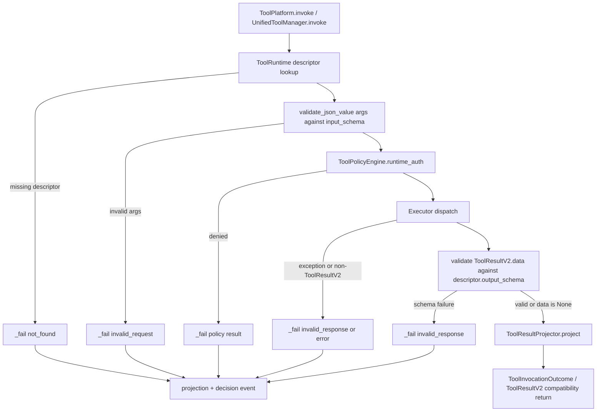

# Phase 38: output-schema-declaration-runtime-output-validation-enforcem - Research

**Researched:** 2026-07-02 [VERIFIED: system current_date]  
**Domain:** MOCA tool platform catalog/runtime output validation [VERIFIED: .planning/ROADMAP.md]  
**Confidence:** HIGH for implemented tool shapes and runtime path; MEDIUM for currently unavailable tool schemas [VERIFIED: src/tools/catalog.py] [VERIFIED: src/business/service.py]

## User Constraints

No phase `CONTEXT.md` exists for Phase 38. [VERIFIED: gsd-sdk query init.phase-op "38"]

User-provided constraints for this research: testing commands must use `uv run pytest ...`, `uv run ruff ...`, or `.venv/bin/...`; bare `pytest` and bare `python -m pytest` are invalid in MOCA. [VERIFIED: user prompt] [VERIFIED: AGENTS.md]

User-provided constraints for Phase 38: do not edit `docs/contract-spec.md` unless research finds a hard blocker; preserve the `ToolResultV2` envelope shape and `ToolCallContext` identity fields; account for the Phase 37 post-review fix where manager investigate discovery uses `catalog.investigate_tool_names(...)`. [VERIFIED: user prompt] [VERIFIED: .planning/phases/37-tool-declaration-runtime-policy-internal-consolidation/37-01-SUMMARY.md]

<phase_requirements>

## Phase Requirements

| ID | Description | Research Support |
|----|-------------|------------------|
| TPH-01 | Each of the eight registered read/retrieval tools declares a real `output_schema` for `ToolResultV2.data`, and `ToolRuntime` maps schema-failing executor data to `invalid_response` instead of passing it through. [VERIFIED: .planning/REQUIREMENTS.md] | The current catalog still injects `_GENERIC_OBJECT_SCHEMA`, the runtime already calls `validate_json_value(tool_result.data, descriptor.output_schema)`, and failures already return through `_fail(... status="invalid_response" ...)`. [VERIFIED: src/tools/catalog.py] [VERIFIED: src/tools/runtime.py] |

</phase_requirements>

## Project Constraints (from CLAUDE.md)

- Record any local debug/startup/validation/UI/API/RAG/agent/memory/tool-call error after handling it in `.planning/LOCAL-VALIDATION-ISSUES.md`, in Chinese by default, with symptom, reproduction, evidence, root-cause judgment, handling, remaining issue, and next entry point. [VERIFIED: CLAUDE.md]
- Phase-level plans and larger changes use the dual-AI workflow: GSD-native review first, then Codex cross-check/adjudication; small bug fixes do not require this workflow. [VERIFIED: CLAUDE.md] [VERIFIED: AGENTS.md]
- Phase-level planning must check plan granularity and split a phase that spans multiple ownership domains, waves, or verification gates into multiple numbered plans before execution. [VERIFIED: AGENTS.md]
- `docs/contract-spec.md` is MOCA's normative contract source, but phase implementation decides landing scope; target-state spec text must not be treated as already implemented fact. [VERIFIED: CLAUDE.md] [VERIFIED: AGENTS.md]
- If implementation and spec diverge, the project requires a recorded decision: either fix spec through dual-AI review or annotate MVP scope/target-state delta; Phase 38 should avoid spec edits unless blocked because Phase 39 owns spec reconciliation. [VERIFIED: CLAUDE.md] [VERIFIED: user prompt]

## Summary

Phase 38 is a catalog/runtime hardening phase, not a new executor phase: Phase 37 created `_TOOL_DECLARATIONS`, derived investigate visibility through `investigate_tool_names(...)`, and routed runtime failures through `_fail(...)`; Phase 38 should build on those surfaces. [VERIFIED: .planning/phases/37-tool-declaration-runtime-policy-internal-consolidation/37-01-SUMMARY.md] [VERIFIED: .planning/phases/37-tool-declaration-runtime-policy-internal-consolidation/37-02-SUMMARY.md]

The current blocker is declaration quality, not runtime placement: `ToolRuntime.invoke` already validates non-`None` `ToolResultV2.data` against `descriptor.output_schema`, but every descriptor still receives `_GENERIC_OBJECT_SCHEMA = {"type": "object"}` from `_descriptor(...)`. [VERIFIED: src/tools/runtime.py] [VERIFIED: src/tools/catalog.py]

The safest implementation path is to add `output_schema` to each `_ToolDeclaration`, extend the existing local `validate_json_value` helper only for schema features needed by current outputs (`null`/type unions), and add focused tests proving bad executor data becomes `invalid_response` through `_fail` while valid executor results and model field sets remain unchanged. [VERIFIED: src/tools/catalog.py] [VERIFIED: src/tools/validation.py] [VERIFIED: src/tools/runtime.py]

**Primary recommendation:** Use the consolidated catalog as the single source of per-tool `output_schema`; do not add a new validation library, do not change `ToolResultV2`, and use strict no-data schemas for currently unavailable tools instead of inventing future success payloads. [VERIFIED: src/tools/catalog.py] [VERIFIED: src/tools/contracts.py] [VERIFIED: uv run python -c importlib.util.find_spec('jsonschema')] [ASSUMED]

## Architectural Responsibility Map

| Capability | Primary Tier | Secondary Tier | Rationale |
|------------|--------------|----------------|-----------|
| Per-tool `output_schema` declaration | API / Backend | — | `ToolCatalog` owns `ToolDescriptor` creation and now derives descriptors from `_TOOL_DECLARATIONS`. [VERIFIED: src/tools/catalog.py] |
| Output validation gate | API / Backend | — | `ToolRuntime.invoke` performs executor dispatch, output schema validation, projection, and decision event emission. [VERIFIED: src/tools/runtime.py] |
| Schema-failure error mapping | API / Backend | Replay/Audit event boundary | `_fail(...)` assembles safe `ToolResultV2`, projection, and decision-event return tuple. [VERIFIED: src/tools/runtime.py] [VERIFIED: .planning/phases/37-tool-declaration-runtime-policy-internal-consolidation/37-02-SUMMARY.md] |
| Consumer contract protection | API / Backend | Agent graph / Conversation / Memory | Consumers use `ToolResultV2` envelope fields and projected surfaces, so Phase 38 must not add/remove/rename envelope fields. [VERIFIED: src/tools/contracts.py] [VERIFIED: src/tools/projection.py] |
| DB-backed business read verification | Database / Storage | API / Backend | Business read integration tests use PostgreSQL fixtures in `tests/conftest.py`; local PostgreSQL is not available in this environment. [VERIFIED: tests/conftest.py] [VERIFIED: pg_isready command] [VERIFIED: nc -z localhost 5432] |

## Standard Stack

### Core

| Library / Module | Version | Purpose | Why Standard |
|------------------|---------|---------|--------------|
| Python | 3.12.13 | Runtime and test execution. [VERIFIED: uv run python --version] | Project requires Python `>=3.12`. [VERIFIED: pyproject.toml] |
| Pydantic | 2.13.4 | Defines `ToolResultV2`, `ToolCallContext`, `ToolDescriptor`, business/memory/knowledge models. [VERIFIED: uv run python -c import pydantic] [VERIFIED: src/tools/contracts.py] [VERIFIED: src/tools/catalog.py] | Existing contracts use Pydantic `BaseModel` with `extra="forbid"` for envelope and DTO shapes. [VERIFIED: src/tools/contracts.py] |
| `src.tools.validation.validate_json_value` | internal | Validates descriptor input/output schema dictionaries at runtime. [VERIFIED: src/tools/validation.py] | `ToolRuntime` already uses this helper for input and output validation. [VERIFIED: src/tools/runtime.py] |
| `ToolRuntime._fail(...)` | internal | Shared failure assembly for safe result, projection, decision event, and outcome tuple. [VERIFIED: src/tools/runtime.py] | Phase 37 established `_fail(...)` as the required shared failure path. [VERIFIED: .planning/phases/37-tool-declaration-runtime-policy-internal-consolidation/37-02-SUMMARY.md] |

### Supporting

| Library / Tool | Version | Purpose | When to Use |
|----------------|---------|---------|-------------|
| `uv` | 0.11.2 | Project command entrypoint. [VERIFIED: uv --version] | Use for every pytest/ruff/Python command in plans. [VERIFIED: AGENTS.md] |
| `pytest` | 9.0.3 | Unit and integration validation. [VERIFIED: uv run pytest --version] | Use focused non-DB tests during implementation and DB-backed suites only when PostgreSQL is available. [VERIFIED: tests/conftest.py] |
| `ruff` | 0.15.12 | Linting. [VERIFIED: uv run ruff --version] | Use `uv run ruff check ...` for changed Python files. [VERIFIED: AGENTS.md] |
| PostgreSQL | unavailable locally | DB-backed tool/business/conversation tests. [VERIFIED: tests/conftest.py] [VERIFIED: pg_isready command] | Required for broad DB-backed gates; not required for catalog/runtime fake-executor tests. [VERIFIED: tests/tools/test_tool_platform.py] |

### Alternatives Considered

| Instead of | Could Use | Tradeoff |
|------------|-----------|----------|
| Existing `validate_json_value` | `jsonschema` package | `jsonschema` is not installed, adding it expands dependencies, and Phase 38 only needs a small extension for nullable/type-union handling. [VERIFIED: pyproject.toml] [VERIFIED: uv run python -c importlib.util.find_spec('jsonschema')] [ASSUMED] |
| Descriptor `output_schema` dictionaries | Pydantic models only | Pydantic models are useful as shape sources, but `ToolDescriptor.output_schema` is explicitly a `dict[str, Any]` consumed by `ToolRuntime`. [VERIFIED: src/tools/catalog.py] [VERIFIED: src/tools/runtime.py] |
| Per-tool runtime checks | Shared runtime gate | Per-tool checks would duplicate the Phase 37 consolidation and risk bypassing `_fail(...)`. [VERIFIED: src/tools/runtime.py] [VERIFIED: .planning/phases/37-tool-declaration-runtime-policy-internal-consolidation/37-02-SUMMARY.md] |

**Installation:**

```bash
# No new package installation is recommended for Phase 38.
uv run python --version
uv run pytest --version
uv run ruff --version
```

**Version verification:** The researched versions were verified with `uv --version`, `uv run python --version`, `uv run pytest --version`, `uv run ruff --version`, and `uv run python -c "import pydantic; print(pydantic.__version__)"`. [VERIFIED: command outputs]

## Current Output Shape Inventory

| Tool | Runtime output creator | Current success `ToolResultV2.data` shape | Recommended Phase 38 schema stance |
|------|------------------------|-------------------------------------------|------------------------------------|
| `get_order` | `BusinessToolExecutor.execute -> BusinessToolService.invoke_tool -> BusinessFactService._read_tool -> get_order_adapter -> _OrderData`. [VERIFIED: src/tools/executors/business.py] [VERIFIED: src/business/service.py] [VERIFIED: src/business/adapters.py] | Object with `order_no`, `merchant_id`, `status`, `amount`, `currency`, `buyer_name`, `item_name`, nullable `paid_at`, nullable `delivered_at`, and `relation_hints` containing boolean refund/ticket hints plus nullable latest IDs. [VERIFIED: src/business/adapters.py] | Strict object with required fields, nested `relation_hints`, `additionalProperties: false`, and nullable string support. [VERIFIED: src/business/adapters.py] |
| `get_refund_case` | `BusinessToolExecutor.execute -> BusinessToolService.invoke_tool -> get_refund_case_adapter -> _RefundCaseData`. [VERIFIED: src/tools/executors/business.py] [VERIFIED: src/business/service.py] [VERIFIED: src/business/adapters.py] | Object with `refund_case_no`, `merchant_id`, `status`, `reason_code`, `reason_text`, `requested_amount`, and nullable `approved_amount`. [VERIFIED: src/business/adapters.py] | Strict object with required fields, `additionalProperties: false`, and nullable string support for `approved_amount`. [VERIFIED: src/business/adapters.py] |
| `get_ticket` | `BusinessToolExecutor.execute -> BusinessToolService.invoke_tool -> get_ticket_adapter -> _TicketData`. [VERIFIED: src/tools/executors/business.py] [VERIFIED: src/business/service.py] [VERIFIED: src/business/adapters.py] | Object with `ticket_no`, `merchant_id`, `status`, `channel`, and `summary`. [VERIFIED: src/business/adapters.py] | Strict object with all five fields required and `additionalProperties: false`. [VERIFIED: src/business/adapters.py] |
| `get_logistics` | `BusinessFactService.get_logistics` returns a safe unavailable `BusinessFactResultV1`; default dispatch wraps it into `ToolResultV2` with `data=None`. [VERIFIED: src/business/service.py] | No current success data shape exists. [VERIFIED: src/business/service.py] | Use a strict no-data schema such as empty object plus `additionalProperties: false` so accidental non-empty executor data fails closed until a real logistics executor is implemented. [ASSUMED] |
| `get_merchant_risk` | `BusinessFactService.get_merchant_risk` returns a safe unavailable `BusinessFactResultV1`; default dispatch wraps it into `ToolResultV2` with `data=None`. [VERIFIED: src/business/service.py] | No current success data shape exists. [VERIFIED: src/business/service.py] | Use a strict no-data schema such as empty object plus `additionalProperties: false` so accidental non-empty executor data fails closed until a real risk executor is implemented. [ASSUMED] |
| `search_policy` | `KnowledgeToolExecutor.execute -> PolicyKnowledgeService.search`. [VERIFIED: src/tools/executors/knowledge.py] | Object with `retrieval_status`, `best_score`, `threshold`, and nullable `summary`; authoritative policy refs live in the `policy_evidence_refs` envelope field, not in `data`. [VERIFIED: src/tools/executors/knowledge.py] [VERIFIED: src/knowledge/schemas.py] | Strict object with `retrieval_status` enum (`strong_evidence`, `partial_evidence`, `no_evidence`, `error`), numbers for score/threshold, nullable summary, and `additionalProperties: false`. [VERIFIED: src/tools/executors/knowledge.py] |
| `search_sop` | Catalog declares the tool with executor `knowledge`, but `KnowledgeToolExecutor.has_tool()` returns true only for `search_policy`, so default runtime marks `search_sop` unavailable before executor dispatch. [VERIFIED: src/tools/catalog.py] [VERIFIED: src/tools/executors/knowledge.py] [VERIFIED: tests/agent/test_tools/test_unified_tool_manager.py] | No current success data shape exists. [VERIFIED: src/tools/executors/knowledge.py] | Use the same strict no-data schema pattern as other declared-but-unavailable tools, and test a fake `knowledge` executor returning non-empty `search_sop` data fails closed. [ASSUMED] |
| `search_case_memory` | `MemoryToolExecutor.execute -> CaseMemoryService.retrieve_reviewed -> _case_memory_result`. [VERIFIED: src/tools/executors/memory.py] [VERIFIED: src/memory/case_memory.py] | Object with `items`, where each item has `case_memory_id`, `excerpt`, nullable `applicability`, nullable `outcome`, nullable `caveats`, numeric `score`, `policy_refs[]`, and `source_refs[]`. [VERIFIED: src/tools/executors/memory.py] [VERIFIED: src/memory/schemas.py] | Strict object with required `items` array, strict item objects, nullable string support for optional text fields, and generic safe-ref object arrays for `policy_refs` and `source_refs`. [VERIFIED: src/memory/schemas.py] |

## Architecture Patterns

### System Architecture Diagram



The diagram matches the current `ToolRuntime.invoke` flow and Phase 37 `_fail(...)` consolidation. [VERIFIED: src/tools/runtime.py] [VERIFIED: .planning/phases/37-tool-declaration-runtime-policy-internal-consolidation/37-02-SUMMARY.md]

### Recommended Project Structure

```text
src/tools/
├── catalog.py       # add per-tool output schema constants and output_schema field on _ToolDeclaration [VERIFIED: src/tools/catalog.py]
├── validation.py    # extend existing schema subset for null/type unions [VERIFIED: src/tools/validation.py]
└── runtime.py       # keep existing output-validation gate and _fail mapping [VERIFIED: src/tools/runtime.py]

tests/tools/
├── test_catalog.py        # declaration/schema drift and schema helper coverage [VERIFIED: tests/tools/test_catalog.py]
└── test_tool_platform.py  # runtime valid/invalid output behavior and envelope field-set coverage [VERIFIED: tests/tools/test_tool_platform.py]
```

### Pattern 1: Catalog Row Owns Output Schema

**What:** Add `output_schema: dict[str, Any]` to `_ToolDeclaration`, define named schema constants near input schemas, and pass `declaration.output_schema` into `ToolDescriptor`. [VERIFIED: src/tools/catalog.py]

**When to use:** Use for all eight Phase 38 read/retrieval tools, while leaving `ToolDescriptor` public fields unchanged. [VERIFIED: .planning/REQUIREMENTS.md] [VERIFIED: src/tools/catalog.py]

**Example:**

```python
# Source: src/tools/catalog.py current registry pattern [VERIFIED: src/tools/catalog.py]
_NULLABLE_STRING_SCHEMA = {"type": ["string", "null"]}

_ORDER_OUTPUT_SCHEMA = {
    "type": "object",
    "properties": {
        "order_no": {"type": "string", "minLength": 1},
        "merchant_id": {"type": "string", "minLength": 1},
        "status": {"type": "string", "minLength": 1},
        "paid_at": _NULLABLE_STRING_SCHEMA,
        "delivered_at": _NULLABLE_STRING_SCHEMA,
        "relation_hints": {
            "type": "object",
            "properties": {
                "has_active_refund": {"type": "boolean"},
                "latest_refund_case_id": _NULLABLE_STRING_SCHEMA,
                "has_open_ticket": {"type": "boolean"},
                "latest_ticket_id": _NULLABLE_STRING_SCHEMA,
            },
            "required": [
                "has_active_refund",
                "latest_refund_case_id",
                "has_open_ticket",
                "latest_ticket_id",
            ],
            "additionalProperties": False,
        },
    },
    "required": [
        "order_no",
        "merchant_id",
        "status",
        "amount",
        "currency",
        "buyer_name",
        "item_name",
        "paid_at",
        "delivered_at",
        "relation_hints",
    ],
    "additionalProperties": False,
}
```

### Pattern 2: Extend the Existing Schema Subset, Do Not Add a Parallel Validator

**What:** Extend `validate_json_value` to treat `schema["type"]` lists as unions and support `"null"`. [VERIFIED: src/tools/validation.py]

**When to use:** Use before declaring schemas for current outputs containing explicit `None` values, including business timestamps, refund approved amount, policy summary, and case-memory optional text fields. [VERIFIED: src/business/adapters.py] [VERIFIED: src/tools/executors/knowledge.py] [VERIFIED: src/memory/schemas.py]

**Example:**

```python
# Source: src/tools/validation.py current helper [VERIFIED: src/tools/validation.py]
def validate_json_value(value: Any, schema: dict[str, Any]) -> None:
    expected_type = schema.get("type")
    if isinstance(expected_type, list):
        errors = []
        for candidate_type in expected_type:
            try:
                validate_json_value(value, {**schema, "type": candidate_type})
                return
            except (TypeError, ValueError) as exc:
                errors.append(exc)
        raise ValueError("Value did not match any allowed type") from errors[0]
    if expected_type == "null":
        if value is not None:
            raise TypeError("Expected null")
        return
    ...
```

### Pattern 3: Runtime Tests Should Use Fake Executors

**What:** Use fake executors that return `ToolResultV2` instances to test runtime output validation without PostgreSQL. [VERIFIED: tests/tools/test_tool_platform.py]

**When to use:** Use for invalid-output and conforming-output tests because Phase 38 is runtime/catalog behavior and default DB-backed executors add unrelated database setup risk. [VERIFIED: tests/conftest.py] [VERIFIED: tests/tools/test_tool_platform.py]

**Example:**

```python
# Source: tests/tools/test_tool_platform.py fake executor pattern [VERIFIED: tests/tools/test_tool_platform.py]
executor = _RecordingExecutor({"get_order"}, invalid_order_result)
platform = ToolPlatform(executors={"business": executor})
outcome = await platform.invoke(
    "get_order",
    {"order_no": "ORD-1"},
    _ctx(permissions=["tool:get_order"]),
    session=None,
)
assert outcome.tool_result.status == "invalid_response"
assert outcome.tool_result.data is None
```

### Anti-Patterns to Avoid

- **Leaving `additionalProperties` open everywhere:** this can turn "real" output schemas back into broad object checks. [VERIFIED: src/tools/validation.py] [ASSUMED]
- **Inventing future data shapes for unavailable tools:** current code has no success payload for `get_logistics`, `get_merchant_risk`, or `search_sop`, so invented fields would create undocumented product contracts. [VERIFIED: src/business/service.py] [VERIFIED: src/tools/executors/knowledge.py] [ASSUMED]
- **Changing `ToolResultV2` fields to satisfy schema validation:** Phase 38 is data-shape enforcement only and `ToolResultV2` is a HIGH-blast-radius envelope. [VERIFIED: .planning/ROADMAP.md] [VERIFIED: src/tools/contracts.py]
- **Routing schema failures outside `_fail(...)`:** Phase 37 specifically consolidated runtime failures through `_fail(...)`; bypassing it regresses shared projection/event behavior. [VERIFIED: .planning/phases/37-tool-declaration-runtime-policy-internal-consolidation/37-02-SUMMARY.md] [VERIFIED: src/tools/runtime.py]

## Don't Hand-Roll

| Problem | Don't Build | Use Instead | Why |
|---------|-------------|-------------|-----|
| Output failure mapping | Per-tool `if tool_name == ...` validators in runtime. | `validate_json_value(tool_result.data, descriptor.output_schema)` plus `_fail(status="invalid_response", ...)`. [VERIFIED: src/tools/runtime.py] | Shared gate preserves uniform status, projection, and decision-event behavior. [VERIFIED: src/tools/runtime.py] |
| Declaration source | Separate hardcoded output schema map outside catalog rows. | `_ToolDeclaration.output_schema` and derived `ToolDescriptor`. [VERIFIED: src/tools/catalog.py] | Phase 37 made catalog declarations the single source and manager visibility derived from catalog helpers. [VERIFIED: .planning/phases/37-tool-declaration-runtime-policy-internal-consolidation/37-01-SUMMARY.md] |
| Nullable handling | Ad hoc "skip None" checks in individual schemas/tests. | One schema-helper extension for `{"type": ["string", "null"]}` and `"null"`. [VERIFIED: src/tools/validation.py] | Current outputs include explicit `None` values; centralized support keeps schemas strict without per-tool hacks. [VERIFIED: src/business/adapters.py] [VERIFIED: src/memory/schemas.py] |
| Consumer compatibility checks | Manual eyeballing of envelope changes. | Field-set tests or `uv run python -c` checks against `ToolResultV2.model_fields`. [VERIFIED: src/tools/contracts.py] [VERIFIED: .planning/phases/37-tool-declaration-runtime-policy-internal-consolidation/37-03-SUMMARY.md] | The phase success criteria explicitly protect seven high-blast-radius consumers. [VERIFIED: .planning/ROADMAP.md] |

**Key insight:** Phase 38 should harden the existing runtime boundary; it should not create a second output-validation system or change consumer-facing envelopes. [VERIFIED: src/tools/runtime.py] [VERIFIED: src/tools/contracts.py]

## Common Pitfalls

### Pitfall 1: Nullable Fields Break Strict Schemas

**What goes wrong:** Existing successful outputs include `None` for fields such as `paid_at`, `delivered_at`, `approved_amount`, `summary`, `applicability`, `outcome`, and `caveats`, but the current validator does not support JSON Schema `null`. [VERIFIED: src/business/adapters.py] [VERIFIED: src/tools/executors/knowledge.py] [VERIFIED: src/memory/schemas.py] [VERIFIED: src/tools/validation.py]

**Why it happens:** `validate_json_value` currently branches on scalar string `schema["type"]` values and has no `"null"` or type-list path. [VERIFIED: src/tools/validation.py]

**How to avoid:** Add null/type-union support first, then use nullable schemas for fields that current producers emit as `None`. [VERIFIED: src/tools/validation.py] [ASSUMED]

**Warning signs:** A valid business read or case-memory item maps to `invalid_response` after adding `additionalProperties: false`. [VERIFIED: src/tools/runtime.py] [ASSUMED]

### Pitfall 2: `search_sop`, `get_logistics`, and `get_merchant_risk` Have No Success Data Today

**What goes wrong:** A planner might invent rich output schemas for tools that currently only return unavailable/no-data paths. [VERIFIED: src/business/service.py] [VERIFIED: src/tools/executors/knowledge.py]

**Why it happens:** These tools are catalog-visible, but their current default executors do not produce success `data` payloads. [VERIFIED: src/tools/catalog.py] [VERIFIED: src/business/service.py] [VERIFIED: src/tools/executors/knowledge.py]

**How to avoid:** Declare strict no-data schemas for these tools and test accidental non-empty data as `invalid_response`, unless the user explicitly expands Phase 38 to implement their executors. [ASSUMED]

**Warning signs:** Phase 38 tasks start adding logistics/risk/SOP executor implementations instead of only schema declarations and runtime validation. [VERIFIED: .planning/ROADMAP.md] [ASSUMED]

### Pitfall 3: Protecting `data` Shape by Changing the Envelope

**What goes wrong:** Adding/removing/renaming `ToolResultV2` fields would break high-blast-radius consumers. [VERIFIED: .planning/ROADMAP.md] [VERIFIED: src/tools/contracts.py]

**Why it happens:** `output_schema` is for `ToolResultV2.data`, but model changes can look tempting when writing stronger schemas. [VERIFIED: docs/contract-spec.md] [VERIFIED: src/tools/contracts.py]

**How to avoid:** Add a field-set regression for `ToolResultV2`, and keep `ToolCallContext` identity fields unchanged. [VERIFIED: src/tools/contracts.py] [VERIFIED: AGENTS.md]

**Warning signs:** Diffs in `src/tools/contracts.py` or `docs/contract-spec.md` during Phase 38. [VERIFIED: user prompt] [VERIFIED: .planning/ROADMAP.md]

### Pitfall 4: Consumer Regressions Hidden by Projection

**What goes wrong:** Runtime validation can pass, but `investigate`, conversation storage, RAG verifier, or action draft consumers can still break if projected surfaces change. [VERIFIED: src/agent/nodes/investigate.py] [VERIFIED: src/conversation/service.py] [VERIFIED: src/agent/rag_context/verifier.py] [VERIFIED: src/agent/nodes/action_draft.py]

**Why it happens:** Downstream consumers often read `ToolResultProjectionV1.normalized_result` or envelope refs instead of raw `data`. [VERIFIED: src/tools/projection.py] [VERIFIED: src/agent/nodes/investigate.py] [VERIFIED: src/conversation/service.py]

**How to avoid:** Run focused regression tests for projector, investigate accumulation, conversation append, verifier business refs, and action draft invalid-result handling. [VERIFIED: tests/tools/test_tool_platform.py] [VERIFIED: tests/agent/test_nodes/test_investigate.py] [VERIFIED: tests/conversation/test_service.py] [VERIFIED: tests/agent/rag_context/test_verifier.py] [VERIFIED: tests/test_execute_action.py]

**Warning signs:** `normalized_result` no longer carries `retrieval_status`, `best_score`, `business_fact_refs`, or `_case_memory_items` for valid results. [VERIFIED: src/tools/projection.py] [VERIFIED: src/agent/nodes/investigate.py]

## Code Examples

### Output Schema Declaration Row

```python
# Source: src/tools/catalog.py registry pattern [VERIFIED: src/tools/catalog.py]
@dataclass(frozen=True)
class _ToolDeclaration:
    name: str
    kind: Literal["read", "retrieval", "write"]
    input_schema: dict[str, Any]
    output_schema: dict[str, Any]
    side_effect: Literal["read_only", "retrieval", "write"]
    ...

def _descriptor(declaration: _ToolDeclaration) -> ToolDescriptor:
    return ToolDescriptor(
        name=declaration.name,
        input_schema=declaration.input_schema,
        output_schema=declaration.output_schema,
        ...
    )
```

### Runtime Invalid Output Test

```python
# Source: tests/tools/test_tool_platform.py fake-executor pattern [VERIFIED: tests/tools/test_tool_platform.py]
@pytest.mark.asyncio
async def test_output_schema_failure_returns_invalid_response_without_raw_data() -> None:
    invalid = ToolResultV2(
        status="success",
        data={"order_no": "ORD-1", "raw_payload": "must-not-pass"},
        summary="bad order",
        source_system="fake",
        data_freshness_at=None,
        policy_evidence_refs=[],
        business_fact_refs=[],
        error=None,
        retryable=False,
        retry_after_ms=None,
        latency_ms=1,
        audit_ref=None,
    )
    platform = ToolPlatform(executors={"business": _RecordingExecutor("get_order", invalid)})
    outcome = await platform.invoke("get_order", {"order_no": "ORD-1"}, _ctx(permissions=["tool:get_order"]))

    assert outcome.tool_result.status == "invalid_response"
    assert outcome.tool_result.data is None
    assert "raw_payload" not in outcome.model_dump_json()
```

### Envelope Field-Set Guard

```python
# Source: src/tools/contracts.py model fields [VERIFIED: src/tools/contracts.py]
def test_tool_result_v2_envelope_fields_are_unchanged() -> None:
    assert set(ToolResultV2.model_fields) == {
        "schema_version",
        "status",
        "data",
        "summary",
        "source_system",
        "data_freshness_at",
        "policy_evidence_refs",
        "business_fact_refs",
        "error",
        "retryable",
        "retry_after_ms",
        "latency_ms",
        "audit_ref",
    }
```

## State of the Art

| Old Approach | Current Approach | When Changed | Impact |
|--------------|------------------|--------------|--------|
| Tool declarations duplicated manager/catalog lists. [VERIFIED: .planning/phases/37-tool-declaration-runtime-policy-internal-consolidation/37-01-SUMMARY.md] | `_TOOL_DECLARATIONS` is the catalog declaration source, and investigate names are derived with `investigate_tool_names(...)`. [VERIFIED: src/tools/catalog.py] | Phase 37, 2026-07-02. [VERIFIED: .planning/STATE.md] | Phase 38 should edit catalog declarations, not manager lists. [VERIFIED: src/tools/manager.py] |
| Runtime failure exits duplicated tuple assembly. [VERIFIED: .planning/phases/37-tool-declaration-runtime-policy-internal-consolidation/37-02-SUMMARY.md] | `_fail(...)` is the shared failure helper. [VERIFIED: src/tools/runtime.py] | Phase 37, 2026-07-02. [VERIFIED: .planning/STATE.md] | Output schema failures should continue through `_fail(...)`. [VERIFIED: src/tools/runtime.py] |
| Output schemas are generic `{"type":"object"}`. [VERIFIED: src/tools/catalog.py] | Phase 38 should replace generic schemas for the eight read/retrieval tools with per-tool schemas. [VERIFIED: .planning/REQUIREMENTS.md] | Pending Phase 38. [VERIFIED: .planning/ROADMAP.md] | Invalid executor `data` becomes `invalid_response`; valid data passes unchanged. [VERIFIED: src/tools/runtime.py] |

**Deprecated/outdated:**

- The Phase 37 generic-output assertion in `tests/tools/test_catalog.py` is now intentionally outdated for Phase 38 and must be replaced with real-schema assertions for the eight scoped tools. [VERIFIED: tests/tools/test_catalog.py] [VERIFIED: .planning/REQUIREMENTS.md]
- Older docs saying `search_case_memory` is session-derived are stale relative to current `MemoryToolExecutor -> CaseMemoryService.retrieve_reviewed`. [VERIFIED: docs/tool-system-unification-plan.md] [VERIFIED: src/tools/executors/memory.py]

## Assumptions Log

| # | Claim | Section | Risk if Wrong |
|---|-------|---------|---------------|
| A1 | Strict empty-object `output_schema` with `additionalProperties: false` is acceptable as a "real" schema for `get_logistics`, `get_merchant_risk`, and `search_sop`, because current production paths have no success `data` shape. | Summary, Current Output Shape Inventory, Common Pitfalls | If reviewers require future semantic success payloads for all eight tools, Phase 38 needs user/product decisions or executor implementation scope. |
| A2 | Extending the local validator for null/type-unions is lower risk than adding `jsonschema`. | Standard Stack, Architecture Patterns | If Phase 38 schemas require broader JSON Schema behavior, the local helper could become underpowered and a vetted dependency decision may be needed. |

## Open Questions

1. **Should unavailable tools get future semantic schemas now?**
   - What we know: `get_logistics`, `get_merchant_risk`, and `search_sop` have no current success `data` payload through default execution. [VERIFIED: src/business/service.py] [VERIFIED: src/tools/executors/knowledge.py]
   - What's unclear: Product may intend specific future logistics/risk/SOP payloads, but they are not implemented in this phase's current code. [ASSUMED]
   - Recommendation: Use strict no-data schemas for Phase 38 and defer semantic payload schemas to the future executor phase. [ASSUMED]

2. **Should `create_coupon_grant_draft` output schema change too?**
   - What we know: The catalog has nine entries, but TPH-01 names eight read/retrieval tools. [VERIFIED: src/tools/catalog.py] [VERIFIED: .planning/REQUIREMENTS.md]
   - What's unclear: A future phase may want action-tool output schema hardening. [ASSUMED]
   - Recommendation: Leave action output schema unchanged unless Phase 38 scope is explicitly broadened. [VERIFIED: .planning/REQUIREMENTS.md] [ASSUMED]

## Environment Availability

| Dependency | Required By | Available | Version | Fallback |
|------------|-------------|-----------|---------|----------|
| `uv` | All test/lint commands | yes | 0.11.2 | None needed. [VERIFIED: uv --version] |
| Python | Runtime/tests | yes | 3.12.13 | None needed. [VERIFIED: uv run python --version] |
| pytest | Validation | yes | 9.0.3 | None needed. [VERIFIED: uv run pytest --version] |
| ruff | Lint | yes | 0.15.12 | None needed. [VERIFIED: uv run ruff --version] |
| Pydantic | Contract models | yes | 2.13.4 | None needed. [VERIFIED: uv run python -c import pydantic] |
| `jsonschema` | Not recommended | no | — | Extend local helper for Phase 38 needs. [VERIFIED: uv run python -c importlib.util.find_spec('jsonschema')] [ASSUMED] |
| PostgreSQL / `pg_isready` | Broad DB-backed tests | no | — | Use non-DB fake-executor tests for implementation; run DB-backed suite only after local PostgreSQL is installed/running. [VERIFIED: pg_isready command] [VERIFIED: nc -z localhost 5432] [VERIFIED: tests/conftest.py] |

**Missing dependencies with no fallback:**

- PostgreSQL is required for DB-backed integration gates that use `tests/conftest.py::test_engine`; it is not required for the core Phase 38 catalog/runtime fake-executor tests. [VERIFIED: tests/conftest.py] [VERIFIED: tests/tools/test_tool_platform.py]

**Missing dependencies with fallback:**

- `jsonschema` is missing; the fallback is to extend `src.tools.validation.validate_json_value` for the narrow schema subset Phase 38 requires. [VERIFIED: src/tools/validation.py] [VERIFIED: uv run python -c importlib.util.find_spec('jsonschema')] [ASSUMED]

## Validation Architecture

### Test Framework

| Property | Value |
|----------|-------|
| Framework | pytest 9.0.3 with `asyncio_mode = "auto"`. [VERIFIED: uv run pytest --version] [VERIFIED: pyproject.toml] |
| Config file | `pyproject.toml`. [VERIFIED: pyproject.toml] |
| Quick run command | `uv run pytest tests/tools/test_catalog.py tests/tools/test_tool_platform.py -q` [VERIFIED: tests/tools/test_catalog.py] [VERIFIED: tests/tools/test_tool_platform.py] |
| Full suite command | `uv run pytest tests/tools/test_catalog.py tests/tools/test_tool_platform.py tests/agent/test_tools/test_unified_tool_manager.py tests/agent/test_nodes/test_investigate.py tests/agent/rag_context/test_verifier.py tests/conversation/test_service.py tests/test_execute_action.py tests/architecture/test_trusted_context_boundaries.py -q` with PostgreSQL caveat for DB-backed tests. [VERIFIED: tests/conftest.py] |

### Phase Requirements -> Test Map

| Req ID | Behavior | Test Type | Automated Command | File Exists? |
|--------|----------|-----------|-------------------|--------------|
| TPH-01 | Eight scoped tools no longer use no-op `{"type":"object"}` output schemas. [VERIFIED: .planning/REQUIREMENTS.md] | unit | `uv run pytest tests/tools/test_catalog.py -q` | yes; update needed. [VERIFIED: tests/tools/test_catalog.py] |
| TPH-01 | Nullable current success payloads validate successfully. [VERIFIED: src/business/adapters.py] [VERIFIED: src/memory/schemas.py] | unit | `uv run pytest tests/tools/test_catalog.py::test_output_schema_helper_accepts_current_tool_payloads -q` | no; Wave 0 gap. [VERIFIED: tests/tools/test_catalog.py] |
| TPH-01 | Invalid executor `data` maps to `invalid_response` and drops raw invalid data. [VERIFIED: src/tools/runtime.py] | unit/integration | `uv run pytest tests/tools/test_tool_platform.py::test_output_schema_failure_returns_invalid_response_without_raw_data -q` | no; Wave 0 gap. [VERIFIED: tests/tools/test_tool_platform.py] |
| TPH-01 | Conforming executor result passes unchanged. [VERIFIED: src/tools/runtime.py] | unit/integration | `uv run pytest tests/tools/test_tool_platform.py::test_output_schema_success_passes_tool_result_unchanged -q` | no; Wave 0 gap. [VERIFIED: tests/tools/test_tool_platform.py] |
| TPH-01 | Envelope field sets do not change. [VERIFIED: src/tools/contracts.py] | unit | `uv run pytest tests/tools/test_tool_platform.py::test_tool_result_v2_envelope_fields_are_unchanged -q` | no; Wave 0 gap. [VERIFIED: tests/tools/test_tool_platform.py] |
| TPH-01 | High-blast consumers still use projected/envelope surfaces. [VERIFIED: .planning/ROADMAP.md] | regression | `uv run pytest tests/agent/test_nodes/test_investigate.py::test_search_case_memory_tool_result_accumulates_contextual_case_memory tests/agent/rag_context/test_verifier.py::test_business_fact_claim_requires_current_tool_system_refs tests/test_execute_action.py::test_action_draft_tool_success_invalid_draft_outcome_fails_closed -q` | yes. [VERIFIED: tests/agent/test_nodes/test_investigate.py] [VERIFIED: tests/agent/rag_context/test_verifier.py] [VERIFIED: tests/test_execute_action.py] |

### Sampling Rate

- **Per task commit:** `uv run pytest tests/tools/test_catalog.py tests/tools/test_tool_platform.py -q` plus `uv run ruff check src/tools/catalog.py src/tools/validation.py src/tools/runtime.py tests/tools/test_catalog.py tests/tools/test_tool_platform.py`. [VERIFIED: AGENTS.md]
- **Per wave merge:** Add `uv run pytest tests/agent/test_tools/test_unified_tool_manager.py tests/agent/test_nodes/test_investigate.py::test_search_case_memory_tool_result_accumulates_contextual_case_memory tests/agent/rag_context/test_verifier.py::test_business_fact_claim_requires_current_tool_system_refs tests/test_execute_action.py::test_action_draft_tool_success_invalid_draft_outcome_fails_closed -q`. [VERIFIED: tests/agent/test_tools/test_unified_tool_manager.py] [VERIFIED: tests/agent/test_nodes/test_investigate.py] [VERIFIED: tests/agent/rag_context/test_verifier.py] [VERIFIED: tests/test_execute_action.py]
- **Phase gate:** Run the full relevant suite above; if PostgreSQL is still unavailable, record the environment blocker in `.planning/LOCAL-VALIDATION-ISSUES.md` and report non-DB gates separately. [VERIFIED: AGENTS.md] [VERIFIED: tests/conftest.py]

### Wave 0 Gaps

- [ ] `tests/tools/test_catalog.py` - replace Phase 37 generic output-schema assertion and add real schema validation/rejection coverage for all eight scoped tools. [VERIFIED: tests/tools/test_catalog.py]
- [ ] `tests/tools/test_tool_platform.py` - add fake-executor runtime tests for valid data, invalid data, raw invalid data redaction, and envelope field-set preservation. [VERIFIED: tests/tools/test_tool_platform.py]
- [ ] `src/tools/validation.py` tests - add null/type-union coverage before strict schemas rely on nullable fields. [VERIFIED: src/tools/validation.py] [VERIFIED: tests/tools/test_catalog.py]
- [ ] High-blast regression command - include focused existing tests for investigate, verifier, action draft, conversation storage if DB is available. [VERIFIED: .planning/ROADMAP.md] [VERIFIED: tests/conftest.py]

## Security Domain

### Applicable ASVS Categories

| ASVS Category | Applies | Standard Control |
|---------------|---------|------------------|
| V2 Authentication | no | Phase 38 does not change authn. [VERIFIED: .planning/ROADMAP.md] |
| V3 Session Management | no | Phase 38 does not change session lifecycle. [VERIFIED: .planning/ROADMAP.md] |
| V4 Access Control | yes | Preserve `ToolPolicyEngine.runtime_auth` and `ToolCallContext` identity fields. [VERIFIED: src/tools/policy.py] [VERIFIED: src/tools/contracts.py] |
| V5 Input Validation | yes | Use descriptor schemas and `validate_json_value` for runtime input/output validation. [VERIFIED: src/tools/runtime.py] [VERIFIED: src/tools/validation.py] |
| V6 Cryptography | no | Phase 38 does not change hash/crypto behavior. [VERIFIED: .planning/ROADMAP.md] |

### Known Threat Patterns for Tool Runtime

| Pattern | STRIDE | Standard Mitigation |
|---------|--------|---------------------|
| Malformed executor data reaches graph state | Tampering | Validate `ToolResultV2.data` against per-tool `output_schema`; map failures to `invalid_response` through `_fail`. [VERIFIED: src/tools/runtime.py] |
| Raw invalid data leaks through error/projection | Information Disclosure | `_fail(...)` creates safe error results with `data=None`, then projects the safe result. [VERIFIED: src/tools/runtime.py] [VERIFIED: src/tools/manager_results.py] |
| Business fact refs forged in `data` | Elevation of Privilege | Projector uses `business_fact_refs` envelope refs, not data-only identifiers, for resource refs. [VERIFIED: src/tools/projection.py] [VERIFIED: tests/agent/test_nodes/test_investigate.py] |
| Overly permissive output schema accepts arbitrary object | Tampering | Use `additionalProperties: false` for implemented success shapes and strict empty-object schemas for unavailable tools. [VERIFIED: src/tools/validation.py] [ASSUMED] |

## Sources

### Primary (HIGH Confidence)

- `.planning/REQUIREMENTS.md` - TPH-01 scope and out-of-scope constraints. [VERIFIED]
- `.planning/ROADMAP.md` - Phase 38 goal, dependency on Phase 37, success criteria, high-blast-radius consumers. [VERIFIED]
- `.planning/STATE.md` - Phase 37 completion state and PostgreSQL validation blocker. [VERIFIED]
- `.planning/phases/37-tool-declaration-runtime-policy-internal-consolidation/37-01-SUMMARY.md` - catalog consolidation and `investigate_tool_names(...)` post-review fix. [VERIFIED]
- `.planning/phases/37-tool-declaration-runtime-policy-internal-consolidation/37-02-SUMMARY.md` - `_fail(...)` failure helper consolidation. [VERIFIED]
- `.planning/phases/37-tool-declaration-runtime-policy-internal-consolidation/37-03-SUMMARY.md` - final Phase 37 contract sweep and generic output schema preservation. [VERIFIED]
- `.planning/phases/37-tool-declaration-runtime-policy-internal-consolidation/37-REVIEW.md` - clean Phase 37 code review. [VERIFIED]
- `src/tools/catalog.py` - descriptor declaration source and current generic output schema injection. [VERIFIED]
- `src/tools/runtime.py` - current runtime output validation and `_fail(...)` mapping. [VERIFIED]
- `src/tools/validation.py` - current JSON schema subset behavior. [VERIFIED]
- `src/tools/contracts.py` - `ToolResultV2`, `ToolCallContext`, and related envelope fields. [VERIFIED]
- `src/business/adapters.py`, `src/business/service.py`, `src/tools/executors/knowledge.py`, `src/tools/executors/memory.py`, `src/memory/schemas.py` - current producer output shapes. [VERIFIED]
- `AGENTS.md` and `CLAUDE.md` - MOCA workflow and testing constraints. [VERIFIED]

### Secondary (MEDIUM Confidence)

- `docs/contract-spec.md` - target contract semantics for output validation and tool platform; Phase 39 owns reconciliation, so this research treats it as target/normative context rather than proof of current implementation. [CITED: docs/contract-spec.md]
- `docs/tool-system-unification-plan.md` - historical architecture context; parts are stale relative to current reviewed case-memory implementation. [CITED: docs/tool-system-unification-plan.md] [VERIFIED: src/tools/executors/memory.py]

### Tertiary (LOW Confidence)

- Assumption that strict no-data schemas satisfy "real output_schema" for currently unavailable tools. [ASSUMED]

## Metadata

**Confidence breakdown:**

- Standard stack: HIGH - versions and dependencies were verified locally with `uv` commands and `pyproject.toml`. [VERIFIED: command outputs] [VERIFIED: pyproject.toml]
- Architecture: HIGH - catalog/runtime/projection paths are current repository code and Phase 37 summaries. [VERIFIED: src/tools/catalog.py] [VERIFIED: src/tools/runtime.py] [VERIFIED: src/tools/projection.py]
- Output shapes: HIGH for `get_order`, `get_refund_case`, `get_ticket`, `search_policy`, and `search_case_memory`; MEDIUM for no-data schemas on `get_logistics`, `get_merchant_risk`, and `search_sop`. [VERIFIED: src/business/adapters.py] [VERIFIED: src/tools/executors/knowledge.py] [VERIFIED: src/tools/executors/memory.py] [ASSUMED]
- Pitfalls: HIGH for nullable validator limitation and envelope blast radius; MEDIUM for unavailable-tool schema stance. [VERIFIED: src/tools/validation.py] [VERIFIED: src/tools/contracts.py] [ASSUMED]

**Research date:** 2026-07-02 [VERIFIED: system current_date]  
**Valid until:** 2026-08-01, assuming no new tool executors or catalog contract changes land before planning. [ASSUMED]
