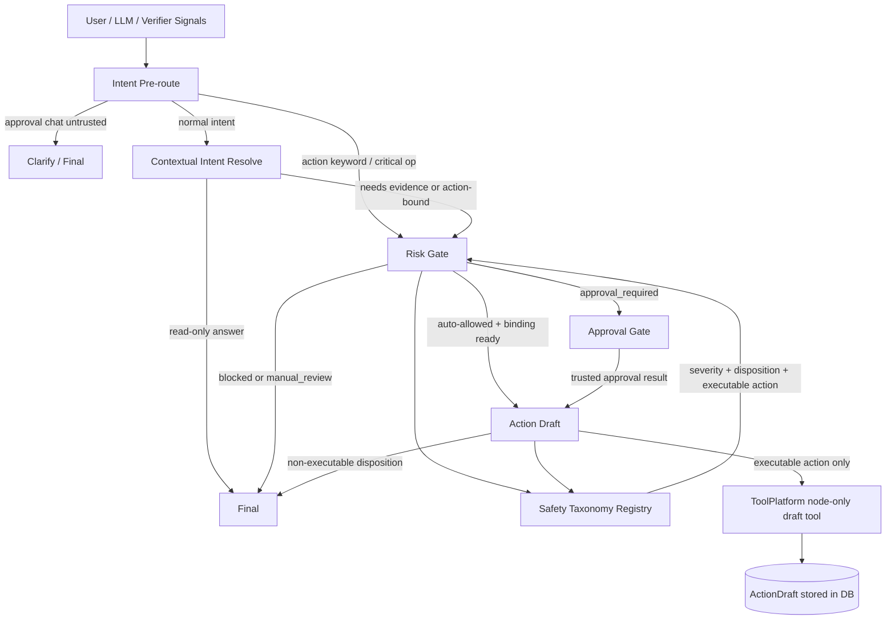

# Phase 63: Safety Taxonomy And Risk Vocabulary - Research

**Researched:** 2026-07-10 [VERIFIED: repo .planning/phases/63-safety-taxonomy-and-risk-vocabulary/63-CONTEXT.md:3]
**Domain:** Internal Python/LangGraph safety taxonomy, risk vocabulary, action draft, approval compatibility, and intent routing migration [VERIFIED: repo .planning/phases/63-safety-taxonomy-and-risk-vocabulary/63-CONTEXT.md:9]
**Confidence:** HIGH for repository behavior and test targets; MEDIUM for runtime state outside the repository because the runtime inventory used repository/local-file checks and did not query external service UIs/databases. [VERIFIED: repo .planning/phases/63-safety-taxonomy-and-risk-vocabulary/63-CONTEXT.md:84] [VERIFIED: command `rg -n "risk_level|action_type|manual_review|blocked|canonical_action|ACTIONABLE_ACTIONS|FULL_REFUND_TERMS" .env .env.example`]

<user_constraints>
## User Constraints (from CONTEXT.md)

All bullets in this section are copied from Phase 63 context and constrain planning scope. [VERIFIED: repo .planning/phases/63-safety-taxonomy-and-risk-vocabulary/63-CONTEXT.md:20]

### Locked Decisions

#### Taxonomy Ownership

- **D-63-01:** Create one canonical owner for action taxonomy and risk vocabulary. `risk_gate.py`, `action_draft.py`, and `intent_policy.py` should consume it rather than keeping duplicate local sets or `_canonical_action_type` functions.
- **D-63-02:** Split executable actions from dispositions. `manual_review` is a safety disposition/routing outcome, not an executable external action type.
- **D-63-03:** Keep current executable-action coverage conservative. Phase 63 should model the currently used action types and compatibility aliases, but should not introduce new write tools or real external execution.
- **D-63-04:** The taxonomy owner should expose stable helpers for canonicalization, alias matching, keyword classification, and allowed-action checks. Callers should not hand-roll keyword sets after the migration.

#### Risk Severity And Disposition

- **D-63-05:** Risk severity and risk disposition must be modeled separately. The current `RiskAssessment.risk_level` schema allows `low|medium|high`, while runtime code also writes `manual_review` and `blocked`; Phase 63 should stop expanding severity strings to carry routing decisions.
- **D-63-06:** Preserve backward compatibility where existing persisted or API-facing payloads still contain `risk_level`, but introduce explicit fields or normalization helpers for disposition/routing semantics.
- **D-63-07:** Approval/action contracts should continue accepting existing `RiskDecisionV1.risk_level` strings during compatibility, but new code should not rely on `risk_level == "manual_review"` or `risk_level == "blocked"` as a severity check.

#### Safety Routing And Intent Policy

- **D-63-08:** Evidence-required/action-bound intent routing should derive from `INTENT_DEFINITIONS` or a safety policy registry. Runtime routing must not maintain a separate hand-written fallback set that can drift from `intent_policy.py`.
- **D-63-09:** Deterministic pre-route action keyword detection should consume the shared taxonomy/alias data. The current English/Chinese action terms in `intent_policy.py` should not remain a separate source of truth.
- **D-63-10:** Existing critical safety behavior must stay fail-closed: ordinary chat approval decisions remain untrusted, action/execute/escalate requests continue routing through risk/approval gates, and non-allow verification continues blocking action drafts.

#### Extraction Boundaries

- **D-63-11:** Money/risk extraction assumptions in `risk_gate.py` should be named and tested. Phase 63 may centralize extraction helpers if it reduces drift, but should not invent broad natural-language action execution.
- **D-63-12:** LLM risk assessment output remains advisory/structured input. Backend deterministic policy remains responsible for action canonicalization, rule matching, approval requirement, blocking, and proposal/draft safety binding.

#### Tests And Migration

- **D-63-13:** Start with failing parity tests that prove the duplicated `risk_gate` and `action_draft` action canonicalization behavior is captured before migration.
- **D-63-14:** Add tests for severity/disposition separation, including manual-review and blocked verifier routes, so the system no longer depends on invalid `risk_level` values.
- **D-63-15:** Add drift tests for action aliases, executable action allowlists, non-executable dispositions, evidence-required intents, and pre-route action keyword classification.
- **D-63-16:** Keep migration scoped. If a DB CHECK/status-machine hardening issue appears, record it for the suggested Phase 67/state-machine phase unless it is directly required to make Phase 63 safe.

### Claude's Discretion

- Exact module name is implementation discretion, but the plan should name one owner, likely under `src/agent/safety/`, `src/agent/taxonomy/`, or another existing codebase-consistent package.
- Exact Pydantic model names are planner discretion. The important boundary is semantic separation, caller migration, and compatibility tests.
- The plan may split into multiple small plans if needed: taxonomy foundation, risk vocabulary migration, intent/routing migration, and final parity/eval/documentation.

### Deferred Ideas (OUT OF SCOPE)

- Phase 64 owns RAG risk label registry and labels such as `manual_review_sensitive`, `conflict`, and `stale_evidence`.
- Phase 65 owns trace event type, response-kind, node label, tool label, and console label registry work.
- Phase 66 owns dev/test/config/demo constants and settings hygiene.
- Suggested future Phase 67 owns broader run/action/approval/memory/replay state-machine registry and DB/API/frontend status constraints.
</user_constraints>

## Project Constraints (from CLAUDE.md / AGENTS.md)

| Directive | Planning Impact | Source |
|-----------|-----------------|--------|
| MOCA test commands must not use bare `pytest` or bare `python -m pytest`; validation commands should use `UV_CACHE_DIR=/tmp/uv-cache uv run pytest ...`. | Every PLAN.md task and acceptance command for this phase must use the `uv` entrypoint. | [VERIFIED: repo AGENTS.md:24] |
| Ruff and temporary Python tooling should prefer `uv run ...` or `.venv/bin/...`. | Lint commands should use `UV_CACHE_DIR=/tmp/uv-cache uv run ruff ...`. | [VERIFIED: repo AGENTS.md:29] |
| Phase-level planning must split work when a phase crosses service boundaries, ownership domains, waves, or verification gates. | Phase 63 should be multiple small plans, not one broad plan. | [VERIFIED: repo AGENTS.md:55] |
| Modifications to tool calling, RAG, memory, or intent recognition require architecture-debt updates when subsystem-level bugs, design defects, compromises, or fixes are found. | Implementation plans touching tool calling or intent recognition should include `.planning/ARCHITECTURE-DEBT.md` update tasks when they confirm or fix debt. | [VERIFIED: repo AGENTS.md:16] |
| Local debugging, startup, validation, UI, API, RAG, agent, memory, or tool-call failures must be appended to `.planning/LOCAL-VALIDATION-ISSUES.md` after handling. | PLAN.md verification tasks should record any validation failure found during execution. | [VERIFIED: repo AGENTS.md:12] |
| `docs/contract-spec.md` is a contract semantics source, not a guarantee of current implementation facts. | Planner must verify code behavior before treating spec text as implemented behavior. | [VERIFIED: repo AGENTS.md:94] |

## Summary

Phase 63 should introduce one backend-owned safety taxonomy module consumed by `risk_gate`, `action_draft`, `intent_policy`, and `routing`; current code duplicates action keywords and canonicalization in those areas. [VERIFIED: repo .planning/phases/63-safety-taxonomy-and-risk-vocabulary/63-CONTEXT.md:25] [VERIFIED: repo src/agent/nodes/risk_gate.py:37] [VERIFIED: repo src/agent/nodes/action_draft.py:19] [VERIFIED: repo src/agent/intent_policy.py:678] [VERIFIED: repo src/agent/routing.py:22]

The critical safety correction is semantic separation: `risk_severity` is `low|medium|high`, while `risk_disposition` is a routing outcome such as allow, approval required, manual review, or blocked. [VERIFIED: repo .planning/phases/63-safety-taxonomy-and-risk-vocabulary/63-CONTEXT.md:32] Existing compatibility fields such as `RiskDecisionV1.risk_level`, `ApprovalRequest.risk_level`, and `ActionDraft.action_type` must remain readable during migration. [VERIFIED: repo src/approvals/schemas.py:32] [VERIFIED: repo src/db/models.py:900] [VERIFIED: repo src/db/models.py:1164]

The safest plan is additive and test-first: capture current duplicate behavior with parity tests, introduce a registry/helper layer, migrate one caller family at a time, and add drift tests that forbid reintroducing local action keyword sets or local `_canonical_action_type` functions. [VERIFIED: repo .planning/phases/63-safety-taxonomy-and-risk-vocabulary/63-CONTEXT.md:49] [VERIFIED: repo .planning/phases/63-safety-taxonomy-and-risk-vocabulary/63-CONTEXT.md:129]

**Primary recommendation:** Create `src/agent/safety/taxonomy.py` or `src/agent/safety/registry.py` as the one owner for executable actions, dispositions, risk severity normalization, action aliases, pre-route action keywords, and compatibility helpers; split implementation into five small plans. [VERIFIED: repo .planning/phases/63-safety-taxonomy-and-risk-vocabulary/63-CONTEXT.md:56] [VERIFIED: repo AGENTS.md:55]

## Architectural Responsibility Map

| Capability | Primary Tier | Secondary Tier | Rationale |
|------------|--------------|----------------|-----------|
| Safety taxonomy and risk vocabulary | API / Backend | Frontend Server: none | The current graph nodes, policy registry, approval schemas, and action draft code are Python backend modules, and the contract says backend deterministic policy controls canonical action, rule matching, approval, blocking, and binding. [VERIFIED: repo src/agent/nodes/risk_gate.py:1112] [VERIFIED: repo src/agent/nodes/action_draft.py:445] [VERIFIED: repo .planning/phases/63-safety-taxonomy-and-risk-vocabulary/63-CONTEXT.md:45] |
| Executable action classification | API / Backend | ToolPlatform boundary | `action_draft` invokes the node-only `create_coupon_grant_draft` tool through ToolPlatform, and the tool catalog allowlists only the `action_draft` caller. [VERIFIED: repo src/agent/nodes/action_draft.py:445] [VERIFIED: repo src/tools/catalog.py:723] [VERIFIED: repo tests/architecture/test_action_draft_boundaries.py:98] |
| Risk severity and disposition routing | API / Backend | Approval service | `risk_gate` produces risk decisions and graph routing sends approval-required actions to `approval_gate` or auto-allowed actions to `action_draft`. [VERIFIED: repo src/agent/graph.py:71] |
| Intent/routing parity | API / Backend | Browser / Client: none | `INTENT_DEFINITIONS`, `IntentPolicyRegistry`, `detect_pre_route`, and routing functions live in backend modules. [VERIFIED: repo src/agent/intent_policy.py:134] [VERIFIED: repo src/agent/intent_policy.py:293] [VERIFIED: repo src/agent/routing.py:355] |
| Persisted compatibility surfaces | Database / Storage | API / Backend | Approval requests store `risk_level` and `risk_decision` JSON, and action drafts store `action_type` plus `risk_decision` JSON. [VERIFIED: repo src/db/models.py:889] [VERIFIED: repo src/db/models.py:900] [VERIFIED: repo src/db/models.py:1161] [VERIFIED: repo src/db/models.py:1164] |

## Current Duplication Map

| Area | File / Function | Current Semantics | Migration Risk |
|------|-----------------|-------------------|----------------|
| Action terms | `src/agent/nodes/risk_gate.py` constants `FULL_REFUND_TERMS` and `ACTIONABLE_ACTIONS` | `risk_gate` owns local refund/action vocab and includes `manual_review` in the actionable action set. [VERIFIED: repo src/agent/nodes/risk_gate.py:37] | Duplicates `action_draft` and can classify a safety disposition as an executable proposal. [VERIFIED: repo src/agent/nodes/action_draft.py:19] [VERIFIED: repo .planning/phases/63-safety-taxonomy-and-risk-vocabulary/63-CONTEXT.md:26] |
| Action terms | `src/agent/nodes/action_draft.py` constants `FULL_REFUND_TERMS` and `ACTIONABLE_ACTIONS` | `action_draft` keeps its own refund/action vocab and includes `manual_review` in the actionable action set. [VERIFIED: repo src/agent/nodes/action_draft.py:19] | Draft-time classification can drift from risk-time classification and may pass a disposition-shaped `action_type` toward ToolPlatform. [VERIFIED: repo src/agent/nodes/action_draft.py:445] |
| Action canonicalization | `risk_gate._canonical_action_type` | Maps reject/no support/default to `manual_review`, coupon/compensation to `issue_coupon`, full refund terms to `full_refund`, partial refund to `partial_refund`, and generic refund to `approve_refund`. [VERIFIED: repo src/agent/nodes/risk_gate.py:281] | Conflates fallback disposition with executable action canonicalization. [VERIFIED: repo .planning/phases/63-safety-taxonomy-and-risk-vocabulary/63-CONTEXT.md:32] |
| Action canonicalization | `action_draft._canonical_action_type` | Duplicates the same canonicalization shape as `risk_gate`. [VERIFIED: repo src/agent/nodes/action_draft.py:65] | A future alias added to one node can silently break approval/hash/draft parity. [VERIFIED: repo .planning/ARCHITECTURE-DEBT.md:1681] |
| Actionability | `risk_gate._is_actionable_recommendation` | Checks whether any item in local `ACTIONABLE_ACTIONS` is a substring of the recommendation text. [VERIFIED: repo src/agent/nodes/risk_gate.py:156] | `manual_review` currently participates in actionability unless explicitly separated. [VERIFIED: repo src/agent/nodes/risk_gate.py:37] |
| Pre-route action keywords | `intent_policy.detect_pre_route` | Uses local English/Chinese action terms such as execute/refund/override and direct refund/create phrases to force `action_request` and `execute_action`. [VERIFIED: repo src/agent/intent_policy.py:678] | Pre-route safety can drift from action canonicalization and action aliases. [VERIFIED: repo .planning/phases/63-safety-taxonomy-and-risk-vocabulary/63-CONTEXT.md:39] |
| Intent action cues | `intent_policy._has_compensation_action_cue` | Uses separate coupon/compensation/action cue terms to detect action-bound compensation asks. [VERIFIED: repo src/agent/intent_policy.py:1197] | Intent policy can disagree with `risk_gate` about whether compensation text is action-bound. [VERIFIED: repo .planning/phases/63-safety-taxonomy-and-risk-vocabulary/63-CONTEXT.md:38] |
| Evidence/action-bound routing | `routing._ACTION_BOUND_INTENTS`, `_policy_evidence_required`, `_action_bound_or_high_risk` | Routing keeps local action-bound and evidence-required fallback checks instead of relying only on `INTENT_DEFINITIONS`/registry. [VERIFIED: repo src/agent/routing.py:22] [VERIFIED: repo src/agent/routing.py:1116] [VERIFIED: repo src/agent/routing.py:1177] | Runtime routing can drift from `IntentDefinition.evidence_required` and `IntentPolicyRegistry`. [VERIFIED: repo src/agent/intent_policy.py:19] [VERIFIED: repo tests/agent/test_intent_policy_registry.py:34] |
| Severity/disposition mix | `risk_gate._blocked_verifier_risk`, `_phase34_fail_closed_result`, snapshot exception paths | Runtime code writes `manual_review` or `blocked` into `risk_assessment.risk_level` in some fail-closed paths. [VERIFIED: repo src/agent/nodes/risk_gate.py:236] [VERIFIED: repo src/agent/nodes/risk_gate.py:762] [VERIFIED: repo src/agent/nodes/risk_gate.py:1024] | `RiskAssessment.risk_level` only allows `low|medium|high`, so routing outcomes are currently being carried in a severity field. [VERIFIED: repo src/agent/schemas.py:151] [VERIFIED: repo .planning/phases/63-safety-taxonomy-and-risk-vocabulary/63-CONTEXT.md:32] |
| Approval compatibility | `RiskDecisionV1.risk_level` and `ApprovalRequestCreateCommand.risk_level` | Approval schema accepts `risk_level` as an arbitrary non-empty string for compatibility. [VERIFIED: repo src/approvals/schemas.py:32] [VERIFIED: repo src/approvals/schemas.py:83] | New code must not reinterpret all legacy `risk_level` strings as severity. [VERIFIED: repo .planning/phases/63-safety-taxonomy-and-risk-vocabulary/63-CONTEXT.md:34] |
| Tool input boundary | `src/tools/catalog.py` and `src/actions/service.py` | Tool schema accepts any non-empty string `action_type`, and ActionService verifies payload/hash/snapshot binding rather than an action-type enum. [VERIFIED: repo src/tools/catalog.py:723] [VERIFIED: repo src/actions/service.py:97] | `action_draft` must reject non-executable dispositions before invoking ToolPlatform, unless the plan deliberately adds a service-level allowlist with compatibility tests. [VERIFIED: repo .planning/phases/63-safety-taxonomy-and-risk-vocabulary/63-CONTEXT.md:120] |

## Recommended Module Ownership

| Ownership Decision | Recommendation | Evidence |
|--------------------|----------------|----------|
| Canonical module | Put the owner under `src/agent/safety/`, preferably `src/agent/safety/taxonomy.py` or `src/agent/safety/registry.py`. | Phase context names `src/agent/safety/` and `src/agent/taxonomy/` as acceptable discretion points, and current consumers are graph/safety policy modules. [VERIFIED: repo .planning/phases/63-safety-taxonomy-and-risk-vocabulary/63-CONTEXT.md:56] |
| Registry pattern | Use immutable descriptors and read-only accessors like the existing intent/business registry pattern, not mutable module-level sets copied into callers. | `IntentDefinition` is frozen and `IntentPolicyRegistry` exposes read-only policy APIs; registry tests assert derived constants and read-only behavior. [VERIFIED: repo src/agent/intent_policy.py:19] [VERIFIED: repo src/agent/intent_policy.py:293] [VERIFIED: repo tests/agent/test_intent_policy_registry.py:127] |
| Executable action owner | The taxonomy owner should define executable action IDs, compatibility aliases, textual aliases, and `is_executable_action_type`. | Phase decisions require one owner and stable helpers for canonicalization, alias matching, keyword classification, and allowed-action checks. [VERIFIED: repo .planning/phases/63-safety-taxonomy-and-risk-vocabulary/63-CONTEXT.md:25] [VERIFIED: repo .planning/phases/63-safety-taxonomy-and-risk-vocabulary/63-CONTEXT.md:28] |
| Disposition owner | The same owner should define non-executable dispositions, including `manual_review` and `blocked`, and keep them out of executable action IDs. | Phase context explicitly separates executable actions from non-executable dispositions. [VERIFIED: repo .planning/phases/63-safety-taxonomy-and-risk-vocabulary/63-CONTEXT.md:11] |
| Risk vocabulary owner | The same owner should expose severity/disposition normalization helpers because risk vocabulary and action taxonomy must stay coherent at the risk/action boundary. | Phase 63 scope explicitly combines safety/action taxonomy and risk vocabulary across `risk_gate`, `action_draft`, `intent_policy`, and approval schemas. [VERIFIED: repo .planning/phases/63-safety-taxonomy-and-risk-vocabulary/63-CONTEXT.md:9] |
| Not owned by actions service | Do not make `src/actions/` the canonical owner in Phase 63. | The taxonomy feeds pre-route intent policy and risk routing before action drafts exist, so `src/actions/` would be too late in the graph. [VERIFIED: repo docs/current-langgraph-architecture.md:10] [VERIFIED: repo src/agent/intent_policy.py:678] |
| Not owned by approvals | Do not make `src/approvals/` the canonical owner in Phase 63. | Approval schemas are compatibility surfaces and current `RiskDecisionV1.risk_level` remains a loose string, while Phase 63 needs caller-side normalization before approvals. [VERIFIED: repo src/approvals/schemas.py:32] [VERIFIED: repo .planning/phases/63-safety-taxonomy-and-risk-vocabulary/63-CONTEXT.md:33] |

### Recommended Helper Surface

| Helper | Purpose | Required Semantics |
|--------|---------|--------------------|
| `resolve_action_text(value: str) -> ActionResolution` | Normalize user/LLM/recommendation text into executable action or disposition. | Must distinguish executable canonical action IDs from `manual_review`/`blocked` dispositions. [VERIFIED: repo .planning/phases/63-safety-taxonomy-and-risk-vocabulary/63-CONTEXT.md:26] |
| `canonical_executable_action_type(value: str) -> str | None` | Return only executable action IDs. | Must not return `manual_review` or `blocked`. [VERIFIED: repo .planning/phases/63-safety-taxonomy-and-risk-vocabulary/63-CONTEXT.md:131] |
| `is_executable_action_type(value: str) -> bool` | Gate proposed action and ToolPlatform invocation. | `action_draft` should reject non-executable dispositions before the write-tool boundary. [VERIFIED: repo .planning/phases/63-safety-taxonomy-and-risk-vocabulary/63-CONTEXT.md:120] |
| `is_actionable_recommendation(value: str) -> bool` | Replace `risk_gate._is_actionable_recommendation`. | Should share aliases with draft canonicalization and exclude dispositions. [VERIFIED: repo src/agent/nodes/risk_gate.py:156] [VERIFIED: repo .planning/phases/63-safety-taxonomy-and-risk-vocabulary/63-CONTEXT.md:129] |
| `action_pre_route_match(text: str) -> PreRouteActionMatch | None` | Replace local English/Chinese pre-route action keyword tuples. | Must keep current fail-closed action/execute/escalate routing behavior. [VERIFIED: repo src/agent/intent_policy.py:678] [VERIFIED: repo .planning/phases/63-safety-taxonomy-and-risk-vocabulary/63-CONTEXT.md:40] |
| `normalize_risk_vocabulary(legacy_risk_level, blocked, approval_required, verifier_route)` | Produce explicit `risk_severity` and `risk_disposition` while preserving `risk_level` compatibility. | New code should not check `risk_level == "manual_review"` or `risk_level == "blocked"`. [VERIFIED: repo .planning/phases/63-safety-taxonomy-and-risk-vocabulary/63-CONTEXT.md:34] |

## Risk Severity vs Disposition Target Semantics

| Concept | Target Values | Meaning | Compatibility Rule |
|---------|---------------|---------|--------------------|
| `risk_severity` | `low`, `medium`, `high` | Business/safety severity used for deterministic risk and approval policy decisions. [VERIFIED: repo src/agent/schemas.py:151] | Derive from existing LLM `RiskAssessment.risk_level` only when it is one of `low|medium|high`. [VERIFIED: repo src/agent/schemas.py:151] |
| `risk_disposition` | `allow`, `approval_required`, `manual_review`, `blocked` | Routing outcome for whether the graph can continue, must request approval, must request human review, or must stop. [VERIFIED: repo .planning/phases/63-safety-taxonomy-and-risk-vocabulary/63-CONTEXT.md:14] | Keep legacy `risk_level` populated for persisted/API payloads, but do not use it as the source of routing truth. [VERIFIED: repo .planning/phases/63-safety-taxonomy-and-risk-vocabulary/63-CONTEXT.md:33] |
| `approval_required` | Boolean | Existing graph routing contract that sends approved actions to `approval_gate` or auto-allowed actions to `action_draft`. [VERIFIED: repo src/agent/graph.py:71] | Keep boolean behavior stable while adding explicit disposition. [VERIFIED: repo .planning/phases/63-safety-taxonomy-and-risk-vocabulary/63-CONTEXT.md:40] |
| `blocked` | Boolean | Existing fail-closed stop signal used in risk decisions and graph routing. [VERIFIED: repo src/approvals/schemas.py:32] [VERIFIED: repo src/agent/graph.py:71] | Map `blocked=True` to `risk_disposition="blocked"` and preserve current final-response behavior. [VERIFIED: repo src/agent/nodes/risk_gate.py:762] |
| Legacy `risk_level` | Any non-empty string in approval compatibility models | Existing persisted/API-facing field. [VERIFIED: repo src/approvals/schemas.py:32] [VERIFIED: repo src/db/models.py:900] | Continue accepting existing strings, including historical `manual_review` or `blocked`, while new logic consumes normalized severity/disposition helpers. [VERIFIED: repo .planning/phases/63-safety-taxonomy-and-risk-vocabulary/63-CONTEXT.md:34] |

## Action Taxonomy Target Semantics

| Term | Target Meaning | Must Not Mean |
|------|----------------|---------------|
| Executable action type | A canonical action ID that can appear in `proposed_action.action_type`, `ActionDraft.action_type`, and the ToolPlatform payload after safety checks. [VERIFIED: repo src/db/models.py:1164] [VERIFIED: repo src/tools/catalog.py:723] | It must not include `manual_review` or `blocked`. [VERIFIED: repo .planning/phases/63-safety-taxonomy-and-risk-vocabulary/63-CONTEXT.md:26] |
| Compatibility alias | A legacy action string or natural-language cue that resolves to a canonical executable action or an explicit disposition. [VERIFIED: repo src/agent/nodes/risk_gate.py:281] [VERIFIED: repo src/agent/nodes/action_draft.py:65] | It must not be copied into each caller as a private keyword set. [VERIFIED: repo .planning/phases/63-safety-taxonomy-and-risk-vocabulary/63-CONTEXT.md:28] |
| `manual_review` | A non-executable disposition/routing outcome. [VERIFIED: repo .planning/phases/63-safety-taxonomy-and-risk-vocabulary/63-CONTEXT.md:12] | It must not be a callable write tool or action draft action type for new records. [VERIFIED: repo .planning/phases/63-safety-taxonomy-and-risk-vocabulary/63-CONTEXT.md:131] |
| `blocked` | A non-executable disposition that stops automatic draft/action flow. [VERIFIED: repo .planning/phases/63-safety-taxonomy-and-risk-vocabulary/63-CONTEXT.md:12] | It must not be interpreted as severity. [VERIFIED: repo .planning/phases/63-safety-taxonomy-and-risk-vocabulary/63-CONTEXT.md:32] |
| Current executable coverage | Start with current code behavior: coupon/compensation, generic refund, full refund, partial refund, and compatibility strings already used by `risk_gate` and `action_draft`. [VERIFIED: repo src/agent/nodes/risk_gate.py:37] [VERIFIED: repo src/agent/nodes/action_draft.py:19] | Do not introduce new write tools or real external execution in Phase 63. [VERIFIED: repo .planning/phases/63-safety-taxonomy-and-risk-vocabulary/63-CONTEXT.md:27] |

## Migration Strategy Preserving Compatibility

1. Add RED parity tests before changing call sites. The tests should pin the current `risk_gate` and `action_draft` canonicalization matrix, actionability behavior, pre-route keyword behavior, and severity/disposition failures that Phase 63 intends to fix. [VERIFIED: repo .planning/phases/63-safety-taxonomy-and-risk-vocabulary/63-CONTEXT.md:49]
2. Introduce the taxonomy owner with immutable descriptors and helper functions, but do not remove compatibility fields in the same step. [VERIFIED: repo .planning/phases/63-safety-taxonomy-and-risk-vocabulary/63-CONTEXT.md:33]
3. Migrate `risk_gate` to the taxonomy owner first because it is the producer of proposed actions, risk decisions, approval plans, and auto-allowed bindings. [VERIFIED: repo src/agent/nodes/risk_gate.py:301] [VERIFIED: repo src/agent/nodes/risk_gate.py:409] [VERIFIED: repo src/agent/nodes/risk_gate.py:513]
4. Add explicit `risk_severity` and `risk_disposition` to internal risk outputs or use normalization helpers at call sites; keep `risk_level` populated for compatibility. [VERIFIED: repo .planning/phases/63-safety-taxonomy-and-risk-vocabulary/63-CONTEXT.md:33] [VERIFIED: repo src/approvals/schemas.py:32]
5. Migrate `action_draft` to the same canonicalization helper and reject non-executable dispositions before ToolPlatform invocation. [VERIFIED: repo .planning/phases/63-safety-taxonomy-and-risk-vocabulary/63-CONTEXT.md:120]
6. Migrate `intent_policy` pre-route action keyword detection to shared taxonomy aliases while preserving ordinary-chat approval fail-closed behavior. [VERIFIED: repo docs/contract-spec.md:993] [VERIFIED: repo src/agent/intent_policy.py:678]
7. Migrate `routing` evidence-required and action-bound checks to `IntentPolicyRegistry` and safety taxonomy helpers; remove or guard local fallback sets that can drift. [VERIFIED: repo .planning/phases/63-safety-taxonomy-and-risk-vocabulary/63-CONTEXT.md:38] [VERIFIED: repo src/agent/routing.py:1116]
8. Add static drift tests that fail if `FULL_REFUND_TERMS`, `ACTIONABLE_ACTIONS`, local `_canonical_action_type`, or duplicated pre-route action keyword tuples reappear outside the taxonomy owner. [VERIFIED: repo .planning/phases/63-safety-taxonomy-and-risk-vocabulary/63-CONTEXT.md:132]
9. Avoid DB CHECK/status-machine hardening unless directly required for safety; Phase 63 context defers broader state-machine and DB/API/frontend status constraints to a suggested Phase 67. [VERIFIED: repo .planning/phases/63-safety-taxonomy-and-risk-vocabulary/63-CONTEXT.md:52] [VERIFIED: repo .planning/phases/63-safety-taxonomy-and-risk-vocabulary/63-CONTEXT.md:142]

## Intent / Routing Parity Strategy

| Drift Point | Current Evidence | Target Strategy |
|-------------|------------------|-----------------|
| Evidence-required intent checks | `IntentDefinition` already carries `evidence_required`, and registry tests assert policy views derived from definitions. [VERIFIED: repo src/agent/intent_policy.py:19] [VERIFIED: repo tests/agent/test_intent_policy_registry.py:34] | Route code should call `IntentPolicyRegistry.requires_evidence` or derived policy APIs instead of maintaining separate fallback sets. [VERIFIED: repo .planning/phases/63-safety-taxonomy-and-risk-vocabulary/63-CONTEXT.md:38] |
| Action-bound/high-risk checks | `routing._ACTION_BOUND_INTENTS` and `_action_bound_or_high_risk` currently hold local policy logic. [VERIFIED: repo src/agent/routing.py:22] [VERIFIED: repo src/agent/routing.py:1177] | Replace local intent sets with `IntentDefinition.high_risk`, `critical_route_class`, and taxonomy action categories. [VERIFIED: repo src/agent/intent_policy.py:19] |
| Pre-route keyword action detection | `detect_pre_route` holds local English/Chinese action terms. [VERIFIED: repo src/agent/intent_policy.py:678] | Shared taxonomy aliases should be the source for pre-route action classification and action canonicalization. [VERIFIED: repo .planning/phases/63-safety-taxonomy-and-risk-vocabulary/63-CONTEXT.md:39] |
| Approval chat trust boundary | Ordinary chat approval commands are not trusted approval decisions. [VERIFIED: repo docs/contract-spec.md:993] [VERIFIED: repo tests/agent/test_intent_routing.py:379] | Keep approval chat hard-clarification tests while moving action keywords to the taxonomy owner. [VERIFIED: repo .planning/phases/63-safety-taxonomy-and-risk-vocabulary/63-CONTEXT.md:40] |
| Drift tests | Existing tests already cover registry parity, pre-route approval chat, safety-sensitive pre-route, and routing consumers. [VERIFIED: repo tests/agent/test_intent_policy_registry.py:34] [VERIFIED: repo tests/agent/test_intent_routing.py:410] | Add tests proving `intent_policy`, `routing`, `risk_gate`, and `action_draft` consume shared taxonomy data for aliases and action-bound classification. [VERIFIED: repo .planning/phases/63-safety-taxonomy-and-risk-vocabulary/63-CONTEXT.md:51] |

## Standard Stack

### Core

| Library / Tool | Version | Purpose | Why Standard |
|----------------|---------|---------|--------------|
| Python | `>=3.12` | Runtime language. | Project metadata requires Python 3.12 or newer. [VERIFIED: repo pyproject.toml:5] |
| Pydantic | 2.13.4 | Boundary schemas and validation for agent, approval, and action payloads. | Existing schemas use Pydantic models, and the installed project environment reports 2.13.4. [VERIFIED: repo src/agent/schemas.py:151] [VERIFIED: command `UV_CACHE_DIR=/tmp/uv-cache uv run python - <<'PY' ...`] |
| LangGraph | 1.1.10 | Agent graph routing and node execution. | Current architecture is LangGraph-based, and the installed project environment reports 1.1.10. [VERIFIED: repo docs/current-langgraph-architecture.md:5] [VERIFIED: command `UV_CACHE_DIR=/tmp/uv-cache uv run python - <<'PY' ...`] |
| pytest | 9.0.3 | Unit and integration tests. | Project config defines pytest behavior, and the installed project environment reports 9.0.3. [VERIFIED: repo pyproject.toml:49] [VERIFIED: command `UV_CACHE_DIR=/tmp/uv-cache uv run python - <<'PY' ...`] |
| Ruff | 0.15.12 | Python linting. | Project config contains Ruff settings, and the installed project environment reports 0.15.12. [VERIFIED: repo pyproject.toml:33] [VERIFIED: command `UV_CACHE_DIR=/tmp/uv-cache uv run python - <<'PY' ...`] |

### Supporting

| Library / Tool | Version | Purpose | When to Use |
|----------------|---------|---------|-------------|
| SQLAlchemy | 2.0.49 | ORM models and persisted compatibility surfaces. | Use when a plan changes persisted `risk_level`, `risk_decision`, or `action_type` surfaces. [VERIFIED: repo src/db/models.py:900] [VERIFIED: repo src/db/models.py:1164] [VERIFIED: command `UV_CACHE_DIR=/tmp/uv-cache uv run python - <<'PY' ...`] |
| pytest-asyncio | 1.3.0 | Async tests. | Existing pytest config enables `asyncio_mode = auto`. [VERIFIED: repo pyproject.toml:49] [VERIFIED: command `UV_CACHE_DIR=/tmp/uv-cache uv run python - <<'PY' ...`] |

### Alternatives Considered

| Instead of | Could Use | Tradeoff |
|------------|-----------|----------|
| Immutable Python registry module | DB-backed registry | DB-backed taxonomy would increase migration and runtime-state scope, while Phase 63 explicitly defers broad state-machine/DB constraint hardening. [VERIFIED: repo .planning/phases/63-safety-taxonomy-and-risk-vocabulary/63-CONTEXT.md:52] |
| Pydantic enum changes in public schemas | Compatibility helpers around existing string fields | Immediate enum tightening can break persisted/API-facing `risk_level` strings; Phase 63 requires compatibility acceptance. [VERIFIED: repo src/approvals/schemas.py:32] [VERIFIED: repo .planning/phases/63-safety-taxonomy-and-risk-vocabulary/63-CONTEXT.md:33] |
| Tool schema `action_type` enum as first step | Caller-side executable action guard first | The current tool schema accepts any non-empty string, and Phase 63's minimum safety requirement is to stop dispositions before ToolPlatform invocation. [VERIFIED: repo src/tools/catalog.py:723] [VERIFIED: repo .planning/phases/63-safety-taxonomy-and-risk-vocabulary/63-CONTEXT.md:120] |

**Installation:**

No new package installation is recommended for Phase 63. [VERIFIED: repo pyproject.toml:1]

**Version verification command used:**

```bash
UV_CACHE_DIR=/tmp/uv-cache uv run python - <<'PY'
import importlib.metadata as m
for pkg in ['pydantic','pytest','pytest-asyncio','SQLAlchemy','langgraph','langchain-core','ruff']:
    print(pkg, m.version(pkg))
PY
```

## Architecture Patterns

### System Architecture Diagram



This diagram reflects the current backend graph shape and the recommended registry insertion point. [VERIFIED: repo docs/current-langgraph-architecture.md:10] [VERIFIED: repo src/agent/graph.py:71]

### Recommended Project Structure

```text
src/
  agent/
    safety/
      __init__.py
      taxonomy.py          # executable actions, dispositions, aliases, normalization helpers
tests/
  agent/
    test_safety_taxonomy.py
  architecture/
    test_safety_taxonomy_boundaries.py
```

The exact module name is discretionary, but one owner under `src/agent/safety/` is consistent with Phase 63 context. [VERIFIED: repo .planning/phases/63-safety-taxonomy-and-risk-vocabulary/63-CONTEXT.md:56]

### Pattern 1: Immutable Registry + Read-Only Accessors

**What:** Define canonical descriptors once and expose functions returning tuples/frozensets/mappings rather than mutable global sets. [VERIFIED: repo tests/agent/test_intent_policy_registry.py:127]

**When to use:** Use for executable action descriptors, disposition descriptors, alias groups, and policy-derived action keyword views. [VERIFIED: repo .planning/phases/63-safety-taxonomy-and-risk-vocabulary/63-CONTEXT.md:28]

**Example sketch:**

```python
# Proposed pattern; exact names are planner discretion. [VERIFIED: repo .planning/phases/63-safety-taxonomy-and-risk-vocabulary/63-CONTEXT.md:57]
@dataclass(frozen=True, slots=True)
class ExecutableAction:
    action_type: str
    aliases: frozenset[str]
    pre_route_keywords: frozenset[str]
```

### Pattern 2: Compatibility Normalizer at Boundaries

**What:** Normalize legacy strings into explicit semantic fields at the boundary where a caller needs routing/action decisions. [VERIFIED: repo .planning/phases/63-safety-taxonomy-and-risk-vocabulary/63-CONTEXT.md:33]

**When to use:** Use where `risk_gate`, `action_draft`, `routing`, or tests currently compare `risk_level` to routing outcomes. [VERIFIED: repo src/agent/nodes/risk_gate.py:236] [VERIFIED: repo src/agent/routing.py:1177]

**Example sketch:**

```python
# Proposed pattern; preserve legacy risk_level while using explicit semantics. [VERIFIED: repo src/approvals/schemas.py:32]
normalized = normalize_risk_vocabulary(risk_decision)
if normalized.disposition == "blocked":
    return final_response
```

### Pattern 3: Static Drift Guard

**What:** Add architecture tests that scan source for duplicate taxonomy constants/functions outside the canonical owner. [VERIFIED: repo .planning/phases/63-safety-taxonomy-and-risk-vocabulary/63-CONTEXT.md:132]

**When to use:** Use after callers migrate so future action aliases, dispositions, and pre-route action keywords cannot be reintroduced locally. [VERIFIED: repo .planning/phases/63-safety-taxonomy-and-risk-vocabulary/63-CONTEXT.md:51]

### Anti-Patterns to Avoid

- **Making `manual_review` an executable action type:** This contradicts the locked phase decision and can let a routing disposition cross into draft/tool payloads. [VERIFIED: repo .planning/phases/63-safety-taxonomy-and-risk-vocabulary/63-CONTEXT.md:26]
- **Expanding severity literals to include routing outcomes:** `RiskAssessment.risk_level` currently models `low|medium|high`, and Phase 63 exists because runtime code has mixed dispositions into that field. [VERIFIED: repo src/agent/schemas.py:151] [VERIFIED: repo .planning/phases/63-safety-taxonomy-and-risk-vocabulary/63-CONTEXT.md:32]
- **Editing approval/action public schemas before adding compatibility tests:** `RiskDecisionV1.risk_level` and persisted DB columns are compatibility surfaces. [VERIFIED: repo src/approvals/schemas.py:32] [VERIFIED: repo src/db/models.py:900]
- **Creating one large all-in plan:** Project instructions classify broad cross-boundary plans as blockers when they cover contracts, implementation migration, compatibility, security, and validation in one plan. [VERIFIED: repo AGENTS.md:55]

## Don't Hand-Roll

| Problem | Don't Build | Use Instead | Why |
|---------|-------------|-------------|-----|
| Action canonicalization | Separate `_canonical_action_type` functions in every node | One taxonomy helper | Current duplicate functions already exist in `risk_gate` and `action_draft`. [VERIFIED: repo src/agent/nodes/risk_gate.py:281] [VERIFIED: repo src/agent/nodes/action_draft.py:65] |
| Action keyword detection | Local English/Chinese tuple checks in `intent_policy` | Shared taxonomy aliases and pre-route matcher | Phase decision requires pre-route action keyword detection to consume shared alias data. [VERIFIED: repo .planning/phases/63-safety-taxonomy-and-risk-vocabulary/63-CONTEXT.md:39] |
| Evidence-required routing | Hand-written fallback sets in `routing` | `IntentPolicyRegistry` / `INTENT_DEFINITIONS` | `IntentDefinition` already carries `evidence_required`. [VERIFIED: repo src/agent/intent_policy.py:19] |
| Approval/hash binding | New custom draft authorization checks | Existing `RiskDecisionV1`, `AutoAllowedActionBindingV1`, approval hash/snapshot binding tests | Existing tests cover hash/snapshot mismatch and auto-allowed binding validation. [VERIFIED: repo tests/approvals/test_hash_binding.py:80] [VERIFIED: repo tests/actions/test_phase34_action_draft_bindings.py:286] |
| Tool boundary | Direct action execution path | Existing node-only ToolPlatform draft tool | Contract and architecture say demo mode creates action drafts, not real external side effects. [VERIFIED: repo docs/contract-spec.md:1983] [VERIFIED: repo docs/architecture-overview.md:546] |

**Key insight:** This phase is a semantics migration, not a new execution phase; the planner should move classification logic to one owner while preserving approval/draft/hash compatibility. [VERIFIED: repo .planning/phases/63-safety-taxonomy-and-risk-vocabulary/63-CONTEXT.md:16]

## Runtime State Inventory

| Category | Items Found | Action Required |
|----------|-------------|-----------------|
| Stored data | `approval_requests.risk_level`, `approval_requests.risk_decision` JSON, `action_drafts.risk_decision` JSON, and `action_drafts.action_type` persist the vocabulary under migration. [VERIFIED: repo src/db/models.py:889] [VERIFIED: repo src/db/models.py:900] [VERIFIED: repo src/db/models.py:1161] [VERIFIED: repo src/db/models.py:1164] | Preserve legacy reads/writes during Phase 63; avoid historical backfill unless PLAN.md deliberately adds persisted fields and migration tests. [VERIFIED: repo .planning/phases/63-safety-taxonomy-and-risk-vocabulary/63-CONTEXT.md:33] |
| Live service config | No repo-owned live service config file was found for this taxonomy in the required source set; external service UIs/databases were not queried. [VERIFIED: command `rg -n "risk_level|action_type|manual_review|blocked|canonical_action|ACTIONABLE_ACTIONS|FULL_REFUND_TERMS" .env .env.example`] | No live-service migration task is recommended from repository evidence; add one only if the implementer discovers non-git runtime configuration. [VERIFIED: command `rg -n "risk_level|action_type|manual_review|blocked|canonical_action|ACTIONABLE_ACTIONS|FULL_REFUND_TERMS" .env .env.example`] |
| OS-registered state | Study-plan launchd plist files exist, but no Phase 63 safety-taxonomy OS registration was found by the launchd/systemd/pm2 search. [VERIFIED: command `find . -maxdepth 5 \\( -iname '*.plist' -o -iname '*systemd*' -o -iname '*launchd*' -o -iname 'ecosystem.config.*' -o -iname 'pm2*.json' \\) -print`] | No OS re-registration task is needed for Phase 63. [VERIFIED: command `find . -maxdepth 5 \\( -iname '*.plist' -o -iname '*systemd*' -o -iname '*launchd*' -o -iname 'ecosystem.config.*' -o -iname 'pm2*.json' \\) -print`] |
| Secrets/env vars | `.env` and `.env.example` did not contain the searched safety vocabulary strings. [VERIFIED: command `rg -n "risk_level|action_type|manual_review|blocked|canonical_action|ACTIONABLE_ACTIONS|FULL_REFUND_TERMS" .env .env.example`] | No secret/env rename task is needed for Phase 63. [VERIFIED: command `rg -n "risk_level|action_type|manual_review|blocked|canonical_action|ACTIONABLE_ACTIONS|FULL_REFUND_TERMS" .env .env.example`] |
| Build artifacts | `.pytest_cache`, `moca.egg-info`, Python `__pycache__`, and frontend `dist` / `node_modules` artifacts exist. [VERIFIED: command `find . -maxdepth 4 \\( -name '*egg-info' -o -name 'dist' -o -name 'build' -o -name '.pytest_cache' -o -name '__pycache__' \\) -print`] | No artifact migration is needed because the phase changes source taxonomy semantics, but implementers may ignore or regenerate caches during normal test runs. [VERIFIED: command `find . -maxdepth 4 \\( -name '*egg-info' -o -name 'dist' -o -name 'build' -o -name '.pytest_cache' -o -name '__pycache__' \\) -print`] |

## Common Pitfalls

### Pitfall 1: Treating `manual_review` As Both Action And Disposition

**What goes wrong:** `manual_review` can enter proposed action or draft payloads instead of stopping as a routing disposition. [VERIFIED: repo src/agent/nodes/risk_gate.py:281] [VERIFIED: repo src/agent/nodes/action_draft.py:65]

**Why it happens:** Current local `ACTIONABLE_ACTIONS` includes `manual_review`, and local canonicalizers return `manual_review` for reject/no-support/default cases. [VERIFIED: repo src/agent/nodes/risk_gate.py:37] [VERIFIED: repo src/agent/nodes/action_draft.py:19]

**How to avoid:** Make `manual_review` a disposition-only value and add tests proving `action_draft` rejects it before ToolPlatform invocation. [VERIFIED: repo .planning/phases/63-safety-taxonomy-and-risk-vocabulary/63-CONTEXT.md:131]

**Warning signs:** A new action draft row or ToolPlatform input has `action_type == "manual_review"`. [VERIFIED: repo src/db/models.py:1164] [VERIFIED: repo src/tools/catalog.py:723]

### Pitfall 2: Using `risk_level` As A Routing Enum

**What goes wrong:** Code compares `risk_level` to `manual_review` or `blocked`, even though severity should be `low|medium|high`. [VERIFIED: repo .planning/phases/63-safety-taxonomy-and-risk-vocabulary/63-CONTEXT.md:34]

**Why it happens:** Current fail-closed and verifier paths write routing outcomes into `risk_level`. [VERIFIED: repo src/agent/nodes/risk_gate.py:236] [VERIFIED: repo src/agent/nodes/risk_gate.py:762]

**How to avoid:** Normalize to explicit `risk_severity` and `risk_disposition` helpers while preserving legacy `risk_level` fields. [VERIFIED: repo .planning/phases/63-safety-taxonomy-and-risk-vocabulary/63-CONTEXT.md:33]

**Warning signs:** Tests assert `risk_assessment.risk_level in {"manual_review", "blocked", "low"}` instead of checking disposition. [VERIFIED: repo tests/agent/test_phase22_action_boundary.py:200]

### Pitfall 3: Migrating Draft Classification Without Risk-Gate Parity

**What goes wrong:** Risk approval/hash material can be generated for one canonical action while action draft normalizes to another. [VERIFIED: repo docs/contract-spec.md:1791]

**Why it happens:** `risk_gate` and `action_draft` currently canonicalize independently. [VERIFIED: repo src/agent/nodes/risk_gate.py:281] [VERIFIED: repo src/agent/nodes/action_draft.py:65]

**How to avoid:** Start with parity tests and migrate both call sites to the same helper. [VERIFIED: repo .planning/phases/63-safety-taxonomy-and-risk-vocabulary/63-CONTEXT.md:49]

**Warning signs:** Approval binding or auto-allowed binding mismatch tests fail after taxonomy changes. [VERIFIED: repo tests/actions/test_phase34_action_draft_bindings.py:224]

### Pitfall 4: Broadening Scope Into DB State-Machine Hardening

**What goes wrong:** The plan grows into run/action/approval DB status registry work. [VERIFIED: repo .planning/phases/63-safety-taxonomy-and-risk-vocabulary/63-CONTEXT.md:52]

**Why it happens:** `action_drafts.status`, approval status, and event type constraints are nearby but explicitly deferred. [VERIFIED: repo .planning/ARCHITECTURE-DEBT.md:1685]

**How to avoid:** Record DB CHECK/status-machine gaps for the suggested Phase 67 unless a change is directly required for Phase 63 safety. [VERIFIED: repo .planning/phases/63-safety-taxonomy-and-risk-vocabulary/63-CONTEXT.md:142]

**Warning signs:** PLAN.md adds migrations for broad `ActionDraft.status` or `AgentRun.final_status` constraints. [VERIFIED: repo .planning/ARCHITECTURE-DEBT.md:1694]

## Code Examples

Verified patterns from existing sources:

### Existing Intent Registry Pattern

```python
# Existing pattern: IntentDefinition carries evidence_required/high_risk metadata. [VERIFIED: repo src/agent/intent_policy.py:19]
# Existing tests assert registry parity and read-only behavior. [VERIFIED: repo tests/agent/test_intent_policy_registry.py:34]
```

### Existing Tool Boundary Pattern

```python
# Existing pattern: create_coupon_grant_draft is node-only and caller-allowlisted to action_draft. [VERIFIED: repo src/tools/catalog.py:723]
# Existing architecture tests assert action_draft is allowed and execute_action is not. [VERIFIED: repo tests/architecture/test_action_draft_boundaries.py:98]
```

### Proposed Taxonomy Helper Shape

```python
# Proposed shape; exact names are planner discretion. [VERIFIED: repo .planning/phases/63-safety-taxonomy-and-risk-vocabulary/63-CONTEXT.md:57]
result = resolve_action_text(raw_action)
if result.disposition in {"manual_review", "blocked"}:
    return safe_final_response
if result.executable_action_type is None:
    return safe_final_response
```

## State of the Art

| Old Approach | Current Approach For Phase 63 | When Changed / Why | Impact |
|--------------|--------------------------------|--------------------|--------|
| Local action sets in `risk_gate`, `action_draft`, and `intent_policy` | One safety taxonomy owner with caller imports | Phase 63 context locks one canonical owner. [VERIFIED: repo .planning/phases/63-safety-taxonomy-and-risk-vocabulary/63-CONTEXT.md:25] | Prevents action alias/canonicalization drift. [VERIFIED: repo .planning/ARCHITECTURE-DEBT.md:1681] |
| `risk_level` carries severity and sometimes routing outcome | Explicit severity/disposition normalization | Phase 63 context locks severity/disposition separation. [VERIFIED: repo .planning/phases/63-safety-taxonomy-and-risk-vocabulary/63-CONTEXT.md:32] | Prevents invalid severity values from driving routing. [VERIFIED: repo src/agent/schemas.py:151] |
| `manual_review` appears as action-like string | `manual_review` disposition-only for new code | Phase 63 context locks executable action vs disposition separation. [VERIFIED: repo .planning/phases/63-safety-taxonomy-and-risk-vocabulary/63-CONTEXT.md:26] | Blocks disposition from reaching ToolPlatform action payloads. [VERIFIED: repo .planning/phases/63-safety-taxonomy-and-risk-vocabulary/63-CONTEXT.md:120] |
| Routing fallback sets duplicate policy definitions | Routing derives from `INTENT_DEFINITIONS` / registry | Phase 63 context locks routing parity. [VERIFIED: repo .planning/phases/63-safety-taxonomy-and-risk-vocabulary/63-CONTEXT.md:38] | Reduces intent-policy/routing drift. [VERIFIED: repo tests/agent/test_intent_policy_registry.py:34] |

**Deprecated/outdated for Phase 63:**

- Local `FULL_REFUND_TERMS`, `ACTIONABLE_ACTIONS`, and `_canonical_action_type` outside the taxonomy owner should be removed after migration. [VERIFIED: repo .planning/phases/63-safety-taxonomy-and-risk-vocabulary/63-CONTEXT.md:129]
- New code should not compare `risk_level` to `manual_review` or `blocked` as severity checks. [VERIFIED: repo .planning/phases/63-safety-taxonomy-and-risk-vocabulary/63-CONTEXT.md:34]
- Broad state-machine DB constraint hardening is deferred to the suggested Phase 67 unless directly required for safety. [VERIFIED: repo .planning/phases/63-safety-taxonomy-and-risk-vocabulary/63-CONTEXT.md:142]

## Plan Split Recommendation

| Plan | Boundary | Primary Files | Verification Focus |
|------|----------|---------------|--------------------|
| `63-01` Taxonomy Registry Foundation + RED Parity | Create the canonical owner and tests that capture current behavior before callers migrate. [VERIFIED: repo .planning/phases/63-safety-taxonomy-and-risk-vocabulary/63-CONTEXT.md:49] | New `src/agent/safety/taxonomy.py`, new `tests/agent/test_safety_taxonomy.py`. [VERIFIED: repo .planning/phases/63-safety-taxonomy-and-risk-vocabulary/63-CONTEXT.md:56] | Action canonicalization matrix, aliases, executable vs disposition split, severity/disposition normalizer. |
| `63-02` Risk Gate Vocabulary Migration | Migrate `risk_gate` to shared helpers and explicit severity/disposition. [VERIFIED: repo .planning/phases/63-safety-taxonomy-and-risk-vocabulary/63-CONTEXT.md:119] | `src/agent/nodes/risk_gate.py`, `tests/agent/test_nodes/test_risk_gate.py`, `tests/agent/test_phase22_action_boundary.py`. [VERIFIED: repo .planning/phases/63-safety-taxonomy-and-risk-vocabulary/63-CONTEXT.md:96] | Fail-closed verifier routes, money/risk extraction assumptions, proposed action canonicalization, binding preservation. |
| `63-03` Action Draft / Tool Boundary Migration | Migrate `action_draft` to shared helpers and reject non-executable dispositions before ToolPlatform. [VERIFIED: repo .planning/phases/63-safety-taxonomy-and-risk-vocabulary/63-CONTEXT.md:120] | `src/agent/nodes/action_draft.py`, `tests/actions/test_action_draft_v2.py`, `tests/actions/test_phase34_action_draft_bindings.py`, `tests/test_execute_action.py`. [VERIFIED: repo .planning/phases/63-safety-taxonomy-and-risk-vocabulary/63-CONTEXT.md:97] | No `manual_review` draft/action payload, approval and auto-allowed binding compatibility, demo-only draft behavior. |
| `63-04` Intent / Routing Parity Migration | Migrate pre-route action keywords and evidence/action-bound routing to registry-derived APIs. [VERIFIED: repo .planning/phases/63-safety-taxonomy-and-risk-vocabulary/63-CONTEXT.md:121] | `src/agent/intent_policy.py`, `src/agent/routing.py`, `tests/agent/test_intent_routing.py`, `tests/agent/test_intent_policy_registry.py`. [VERIFIED: repo .planning/phases/63-safety-taxonomy-and-risk-vocabulary/63-CONTEXT.md:94] | Approval chat untrusted, action/execute/escalate fail-closed, no duplicate evidence/action-bound sets. |
| `63-05` Drift Guards / Docs / Closeout | Add static drift tests and update planning/docs records for confirmed debt/fixes. [VERIFIED: repo .planning/phases/63-safety-taxonomy-and-risk-vocabulary/63-CONTEXT.md:132] | `tests/architecture/test_safety_taxonomy_boundaries.py`, docs/planning files as needed. [VERIFIED: repo AGENTS.md:16] | Source scans forbid duplicate taxonomy constants/functions; full phase gate green. |

This split is recommended because Phase 63 crosses safety policy, action draft, approval compatibility, intent routing, and validation gates. [VERIFIED: repo AGENTS.md:55]

## Assumptions Log

| # | Claim | Section | Risk if Wrong |
|---|-------|---------|---------------|
| A1 | No live external service configuration was queried; repository evidence did not identify Phase 63 live-service state. | Runtime State Inventory | If production-like external config stores action/risk strings, the plan would need an additional migration/audit task. |
| A2 | The research is valid until 2026-08-09 unless Phase 63 source anchors change first. | Metadata | If the codebase changes earlier, planner should re-check source anchors before using this research. |

## Open Questions (RESOLVED)

1. **RESOLVED: Should `RiskDecisionV1` gain optional `risk_severity` / `risk_disposition` fields in Phase 63, or should Phase 63 keep those as internal normalized helpers only?**
   - What we know: `RiskDecisionV1.risk_level` is a compatibility string today. [VERIFIED: repo src/approvals/schemas.py:32]
   - What's unclear: Whether public/persisted schema expansion is desired before Phase 67-style broader contract hardening. [VERIFIED: repo .planning/phases/63-safety-taxonomy-and-risk-vocabulary/63-CONTEXT.md:52]
   - Recommendation: Keep Phase 63 schema changes additive and minimal; prefer internal helpers unless tests show persisted fields are required. [VERIFIED: repo .planning/phases/63-safety-taxonomy-and-risk-vocabulary/63-CONTEXT.md:33]
   - Resolution for planning: Phase 63 keeps `RiskDecisionV1.risk_level` compatible and requires new risk-gate logic to emit severity-only `risk_level` plus explicit normalized `risk_severity` / `risk_disposition` where Phase 63 tests require it. Broad persisted/API schema hardening remains deferred to the suggested Phase 67 unless execution finds a directly required compatibility fix. [VERIFIED: repo .planning/phases/63-safety-taxonomy-and-risk-vocabulary/63-02-PLAN.md:149]

2. **RESOLVED: Should `compensation` remain a compatibility action ID or be remapped to `issue_coupon`?**
   - What we know: Current local action sets include `compensation`, and canonicalizers also map coupon/compensation terms to `issue_coupon` in some branches. [VERIFIED: repo src/agent/nodes/risk_gate.py:37] [VERIFIED: repo src/agent/nodes/risk_gate.py:281]
   - What's unclear: Whether existing persisted or test fixtures depend on exact `action_type="compensation"`. [VERIFIED: repo src/db/models.py:1164]
   - Recommendation: Pin current behavior in `63-01` parity tests before changing this mapping. [VERIFIED: repo .planning/phases/63-safety-taxonomy-and-risk-vocabulary/63-CONTEXT.md:49]
   - Resolution for planning: Phase 63 treats `compensation` as a compatibility alias that resolves to executable action `issue_coupon`; it does not introduce `compensation` as a new external write tool. Parity tests in `63-01` must capture the current alias behavior before caller migration. [VERIFIED: repo .planning/phases/63-safety-taxonomy-and-risk-vocabulary/63-01-PLAN.md:135]

3. **RESOLVED: Should ActionService enforce executable action allowlists in Phase 63?**
   - What we know: Tool schema accepts any non-empty string action type, and ActionService validates payload/hash/snapshot binding. [VERIFIED: repo src/tools/catalog.py:723] [VERIFIED: repo src/actions/service.py:97]
   - What's unclear: Whether adding service-level allowlist now would break compatibility rows or widen phase scope. [VERIFIED: repo .planning/phases/63-safety-taxonomy-and-risk-vocabulary/63-CONTEXT.md:33]
   - Recommendation: Require `action_draft` to block dispositions before ToolPlatform in Phase 63; add service-level allowlist only if scoped tests prove compatibility. [VERIFIED: repo .planning/phases/63-safety-taxonomy-and-risk-vocabulary/63-CONTEXT.md:120]
   - Resolution for planning: Phase 63 enforces executable/disposition separation at `action_draft` before ToolPlatform invocation. It does not add a broad ActionService allowlist or ToolCatalog schema enum unless a focused Phase 63 test proves it is directly required; otherwise that broader hardening is recorded as Phase 67 scope. [VERIFIED: repo .planning/phases/63-safety-taxonomy-and-risk-vocabulary/63-03-PLAN.md:138]

## Environment Availability

| Dependency | Required By | Available | Version | Fallback |
|------------|-------------|-----------|---------|----------|
| `uv` | All test/lint commands | Yes | 0.11.2 | `.venv/bin/...` only after confirming the venv belongs to this repo. [VERIFIED: repo AGENTS.md:27] |
| Python | Project runtime | Yes through `uv run` | Project requires `>=3.12`; local `uv run` resolved package environment. [VERIFIED: repo pyproject.toml:5] | Use `UV_CACHE_DIR=/tmp/uv-cache uv run ...`. [VERIFIED: repo AGENTS.md:27] |
| pytest | Validation | Yes | 9.0.3 | No bare fallback; use `UV_CACHE_DIR=/tmp/uv-cache uv run pytest ...`. [VERIFIED: command `UV_CACHE_DIR=/tmp/uv-cache uv run python - <<'PY' ...`] [VERIFIED: repo AGENTS.md:26] |
| Ruff | Lint | Yes | 0.15.12 | Use `UV_CACHE_DIR=/tmp/uv-cache uv run ruff ...`. [VERIFIED: command `UV_CACHE_DIR=/tmp/uv-cache uv run python - <<'PY' ...`] [VERIFIED: repo AGENTS.md:29] |
| Database service | Phase 63 focused unit tests | Not required for recommended unit/static tests | N/A | Existing tests use repository fixtures for action/approval stores. [VERIFIED: repo tests/actions/test_action_draft_v2.py:331] |

**Missing dependencies with no fallback:**

- None identified for the recommended planning/test scope. [VERIFIED: command `UV_CACHE_DIR=/tmp/uv-cache uv run python - <<'PY' ...`]

**Missing dependencies with fallback:**

- None identified for the recommended planning/test scope. [VERIFIED: command `UV_CACHE_DIR=/tmp/uv-cache uv run python - <<'PY' ...`]

## Validation Architecture

Validation is enabled because `.planning/config.json` has `workflow.nyquist_validation: true`. [VERIFIED: repo .planning/config.json:15]

### Test Framework

| Property | Value |
|----------|-------|
| Framework | pytest 9.0.3 with pytest-asyncio 1.3.0. [VERIFIED: command `UV_CACHE_DIR=/tmp/uv-cache uv run python - <<'PY' ...`] |
| Config file | `pyproject.toml` sets pytest asyncio mode and Ruff settings. [VERIFIED: repo pyproject.toml:49] |
| Quick run command | `UV_CACHE_DIR=/tmp/uv-cache uv run pytest tests/agent/test_safety_taxonomy.py -q --tb=short` [VERIFIED: repo AGENTS.md:27] |
| Full phase command | `UV_CACHE_DIR=/tmp/uv-cache uv run pytest tests/agent/test_safety_taxonomy.py tests/agent/test_nodes/test_risk_gate.py tests/agent/test_phase22_action_boundary.py tests/test_execute_action.py tests/actions/test_action_draft_v2.py tests/actions/test_phase34_action_draft_bindings.py tests/agent/test_intent_routing.py tests/agent/test_intent_policy_registry.py tests/approvals/test_hash_binding.py tests/architecture/test_action_draft_boundaries.py tests/architecture/test_safety_taxonomy_boundaries.py -q --tb=short` [VERIFIED: repo AGENTS.md:27] |
| Lint command | `UV_CACHE_DIR=/tmp/uv-cache uv run ruff check src/agent src/actions src/approvals tests/agent tests/actions tests/approvals tests/architecture` [VERIFIED: repo AGENTS.md:29] |

### Phase Requirements / Success Criteria -> Test Map

| Req ID | Behavior | Test Type | Automated Command | File Exists? |
|--------|----------|-----------|-------------------|--------------|
| SC-63-1 | Canonical action type/action keyword taxonomy has one owner. [VERIFIED: repo .planning/ROADMAP.md:104] | Unit + architecture/static | `UV_CACHE_DIR=/tmp/uv-cache uv run pytest tests/agent/test_safety_taxonomy.py tests/architecture/test_safety_taxonomy_boundaries.py -q --tb=short` | `tests/agent/test_safety_taxonomy.py` no; `tests/architecture/test_safety_taxonomy_boundaries.py` no. [VERIFIED: command `test -e tests/agent/test_safety_taxonomy.py; echo $?`] |
| SC-63-2 | Risk severity and disposition are separate semantics. [VERIFIED: repo .planning/ROADMAP.md:105] | Unit/integration | `UV_CACHE_DIR=/tmp/uv-cache uv run pytest tests/agent/test_nodes/test_risk_gate.py tests/agent/test_phase22_action_boundary.py -q --tb=short` | Existing files. [VERIFIED: repo tests/agent/test_nodes/test_risk_gate.py:200] [VERIFIED: repo tests/agent/test_phase22_action_boundary.py:200] |
| SC-63-3 | Route checks and action execution checks use same taxonomy/parity tests. [VERIFIED: repo .planning/ROADMAP.md:106] | Unit/integration/static | `UV_CACHE_DIR=/tmp/uv-cache uv run pytest tests/agent/test_intent_routing.py tests/agent/test_intent_policy_registry.py tests/actions/test_phase34_action_draft_bindings.py tests/test_execute_action.py -q --tb=short` | Existing files. [VERIFIED: repo tests/agent/test_intent_routing.py:410] [VERIFIED: repo tests/agent/test_intent_policy_registry.py:34] [VERIFIED: repo tests/actions/test_phase34_action_draft_bindings.py:224] |
| D-63-10 | Ordinary chat approval remains untrusted and action/execute/escalate stays fail-closed. [VERIFIED: repo .planning/phases/63-safety-taxonomy-and-risk-vocabulary/63-CONTEXT.md:40] | Unit/integration | `UV_CACHE_DIR=/tmp/uv-cache uv run pytest tests/agent/test_intent_routing.py -q --tb=short` | Existing file. [VERIFIED: repo tests/agent/test_intent_routing.py:379] |
| D-63-13 | Start with failing parity tests for duplicated canonicalization. [VERIFIED: repo .planning/phases/63-safety-taxonomy-and-risk-vocabulary/63-CONTEXT.md:49] | Unit | `UV_CACHE_DIR=/tmp/uv-cache uv run pytest tests/agent/test_safety_taxonomy.py -q --tb=short` | New Wave 0 gap. [VERIFIED: command `test -e tests/agent/test_safety_taxonomy.py; echo $?`] |
| D-63-15 | Drift tests cover aliases, executable allowlists, dispositions, evidence-required intents, and pre-route action classification. [VERIFIED: repo .planning/phases/63-safety-taxonomy-and-risk-vocabulary/63-CONTEXT.md:51] | Architecture/static | `UV_CACHE_DIR=/tmp/uv-cache uv run pytest tests/architecture/test_safety_taxonomy_boundaries.py -q --tb=short` | New Wave 0 gap. [VERIFIED: command `test -e tests/architecture/test_safety_taxonomy_boundaries.py; echo $?`] |

### Sampling Rate

- **Per task commit:** Run the narrow test file(s) for the touched caller plus `UV_CACHE_DIR=/tmp/uv-cache uv run pytest tests/agent/test_safety_taxonomy.py -q --tb=short`. [VERIFIED: repo AGENTS.md:27]
- **Per wave merge:** Run the caller bundle for that plan boundary and `UV_CACHE_DIR=/tmp/uv-cache uv run ruff check src/agent src/actions src/approvals tests/agent tests/actions tests/approvals tests/architecture`. [VERIFIED: repo AGENTS.md:29]
- **Phase gate:** Run the full phase command listed above before `/gsd-verify-work`. [VERIFIED: repo .planning/config.json:17]

### Wave 0 Gaps

- [ ] `tests/agent/test_safety_taxonomy.py` - canonical taxonomy owner, alias resolution, executable vs disposition split, severity/disposition normalizer, parity matrix for existing `risk_gate`/`action_draft` behavior. [VERIFIED: repo .planning/phases/63-safety-taxonomy-and-risk-vocabulary/63-CONTEXT.md:49]
- [ ] `tests/architecture/test_safety_taxonomy_boundaries.py` - static drift guard for duplicate `FULL_REFUND_TERMS`, `ACTIONABLE_ACTIONS`, local `_canonical_action_type`, and pre-route action keyword tuples outside the canonical owner. [VERIFIED: repo .planning/phases/63-safety-taxonomy-and-risk-vocabulary/63-CONTEXT.md:132]
- [ ] Extend `tests/agent/test_nodes/test_risk_gate.py` for explicit `risk_severity` / `risk_disposition` and no new dependency on invalid `risk_level` values. [VERIFIED: repo tests/agent/test_nodes/test_risk_gate.py:476]
- [ ] Extend `tests/agent/test_phase22_action_boundary.py` so verifier manual-review/blocked routes assert disposition instead of `risk_level in {"manual_review","blocked"}`. [VERIFIED: repo tests/agent/test_phase22_action_boundary.py:200]
- [ ] Extend `tests/test_execute_action.py` or action-draft tests to prove non-executable dispositions are rejected before ToolPlatform. [VERIFIED: repo tests/test_execute_action.py:295]
- [ ] Extend `tests/agent/test_intent_routing.py` and `tests/agent/test_intent_policy_registry.py` for taxonomy-sourced pre-route action aliases and evidence/action-bound routing parity. [VERIFIED: repo tests/agent/test_intent_routing.py:410] [VERIFIED: repo tests/agent/test_intent_policy_registry.py:34]

## Security Domain

### Applicable ASVS Categories

| ASVS Category | Applies | Standard Control |
|---------------|---------|------------------|
| V2 Authentication | Indirectly yes | Ordinary chat approval commands remain untrusted; only authenticated/trusted approval paths can produce approval decisions. [VERIFIED: repo docs/contract-spec.md:993] |
| V3 Session Management | No direct Phase 63 change | No session-management code is in the Phase 63 source anchors. [VERIFIED: repo .planning/phases/63-safety-taxonomy-and-risk-vocabulary/63-CONTEXT.md:84] |
| V4 Access Control | Yes | Preserve ToolPlatform caller allowlist and node-only action draft tool boundary. [VERIFIED: repo src/tools/catalog.py:723] [VERIFIED: repo tests/architecture/test_action_draft_boundaries.py:98] |
| V5 Input Validation | Yes | Normalize LLM/user strings through taxonomy helpers before they become action IDs or routing decisions. [VERIFIED: repo .planning/phases/63-safety-taxonomy-and-risk-vocabulary/63-CONTEXT.md:28] |
| V6 Cryptography | Yes, existing binding only | Do not weaken action payload hash and safety snapshot binding. [VERIFIED: repo docs/contract-spec.md:1791] [VERIFIED: repo tests/approvals/test_hash_binding.py:80] |

### Known Threat Patterns for Phase 63

| Pattern | STRIDE | Standard Mitigation |
|---------|--------|---------------------|
| Natural-language approval spoofing | Spoofing / Elevation of privilege | Keep ordinary chat approval untrusted and preserve approval-chat hard-clarification routing. [VERIFIED: repo docs/contract-spec.md:993] [VERIFIED: repo tests/agent/test_intent_routing.py:379] |
| Taxonomy drift between risk and draft nodes | Tampering | Single taxonomy owner plus parity tests for `risk_gate` and `action_draft`. [VERIFIED: repo .planning/ARCHITECTURE-DEBT.md:1681] |
| Disposition confused as executable action | Elevation of privilege | `manual_review` and `blocked` must be disposition-only and rejected before ToolPlatform. [VERIFIED: repo .planning/phases/63-safety-taxonomy-and-risk-vocabulary/63-CONTEXT.md:26] |
| LLM output treated as policy authority | Tampering | Backend deterministic policy remains responsible for canonical action, approval requirement, blocking, and binding. [VERIFIED: repo .planning/phases/63-safety-taxonomy-and-risk-vocabulary/63-CONTEXT.md:45] |
| Hash/binding mismatch after canonicalization change | Tampering / Repudiation | Preserve exact action payload hash and safety snapshot checks. [VERIFIED: repo docs/contract-spec.md:1791] [VERIFIED: repo tests/actions/test_phase34_action_draft_bindings.py:224] |
| Pre-route keyword drift bypasses risk gate | Elevation of privilege | Pre-route action keywords must use shared taxonomy/alias data and keep fail-closed critical-write routing. [VERIFIED: repo .planning/phases/63-safety-taxonomy-and-risk-vocabulary/63-CONTEXT.md:39] |

## Sources

### Primary (HIGH confidence)

- `.planning/phases/63-safety-taxonomy-and-risk-vocabulary/63-CONTEXT.md` - locked decisions, scope, deferrals, test strategy, and source anchors. [VERIFIED: repo .planning/phases/63-safety-taxonomy-and-risk-vocabulary/63-CONTEXT.md:1]
- `.planning/ROADMAP.md` - Phase 63 goal and success criteria. [VERIFIED: repo .planning/ROADMAP.md:99]
- `.planning/STATE.md` - current phase state and Phase 62 completion context. [VERIFIED: repo .planning/STATE.md:27]
- `.planning/REQUIREMENTS.md` - milestone safety requirement that risky actions require approval before execution. [VERIFIED: repo .planning/REQUIREMENTS.md:3]
- `.planning/ARCHITECTURE-DEBT.md` - hardcoding debt motivating Phase 63. [VERIFIED: repo .planning/ARCHITECTURE-DEBT.md:1681]
- `docs/contract-spec.md` - intent taxonomy, action/write tool contract, approval/hash binding, and action execution boundary. [VERIFIED: repo docs/contract-spec.md:993]
- `docs/architecture-overview.md` - backend safety boundaries and demo action-draft target. [VERIFIED: repo docs/architecture-overview.md:546]
- `docs/current-langgraph-architecture.md` - graph routing and node responsibilities. [VERIFIED: repo docs/current-langgraph-architecture.md:10]
- `src/agent/nodes/risk_gate.py` - current risk/action producer and duplicate canonicalization. [VERIFIED: repo src/agent/nodes/risk_gate.py:37]
- `src/agent/nodes/action_draft.py` - current draft boundary and duplicate canonicalization. [VERIFIED: repo src/agent/nodes/action_draft.py:19]
- `src/agent/intent_policy.py` - intent registry and pre-route action keywords. [VERIFIED: repo src/agent/intent_policy.py:19]
- `src/agent/routing.py` - route decisions and duplicate policy fallback sets. [VERIFIED: repo src/agent/routing.py:22]
- `src/agent/schemas.py`, `src/approvals/schemas.py`, `src/actions/schemas.py` - risk/action/approval schema compatibility surfaces. [VERIFIED: repo src/agent/schemas.py:151] [VERIFIED: repo src/approvals/schemas.py:32] [VERIFIED: repo src/actions/schemas.py:25]
- Required test files named by the user and Phase context. [VERIFIED: repo .planning/phases/63-safety-taxonomy-and-risk-vocabulary/63-CONTEXT.md:92]

### Secondary (MEDIUM confidence)

- Runtime-state command checks for env vars, launchd/systemd/pm2 files, and build artifacts. [VERIFIED: command `rg -n "risk_level|action_type|manual_review|blocked|canonical_action|ACTIONABLE_ACTIONS|FULL_REFUND_TERMS" .env .env.example`] [VERIFIED: command `find . -maxdepth 5 \\( -iname '*.plist' -o -iname '*systemd*' -o -iname '*launchd*' -o -iname 'ecosystem.config.*' -o -iname 'pm2*.json' \\) -print`] [VERIFIED: command `find . -maxdepth 4 \\( -name '*egg-info' -o -name 'dist' -o -name 'build' -o -name '.pytest_cache' -o -name '__pycache__' \\) -print`]

### Tertiary (LOW confidence)

- None. All implementation recommendations are based on repository evidence or explicitly listed as open questions. [VERIFIED: repo .planning/phases/63-safety-taxonomy-and-risk-vocabulary/63-CONTEXT.md:1]

## Metadata

**Confidence breakdown:**

- Standard stack: HIGH - verified from `pyproject.toml` and `uv run` package metadata. [VERIFIED: repo pyproject.toml:5] [VERIFIED: command `UV_CACHE_DIR=/tmp/uv-cache uv run python - <<'PY' ...`]
- Architecture: HIGH - verified from current architecture docs and source anchors. [VERIFIED: repo docs/current-langgraph-architecture.md:5] [VERIFIED: repo docs/architecture-overview.md:546]
- Pitfalls: HIGH - verified from current duplicate code, context decisions, and architecture debt records. [VERIFIED: repo .planning/ARCHITECTURE-DEBT.md:1681]
- Runtime state: MEDIUM - repository and local file checks were performed, but external live services were not queried. [VERIFIED: command `rg -n "risk_level|action_type|manual_review|blocked|canonical_action|ACTIONABLE_ACTIONS|FULL_REFUND_TERMS" .env .env.example`]

**Research date:** 2026-07-10 [VERIFIED: repo .planning/phases/63-safety-taxonomy-and-risk-vocabulary/63-CONTEXT.md:3]
**Valid until:** 2026-08-09 for source-level planning unless Phase 63 source anchors change first. [ASSUMED]
