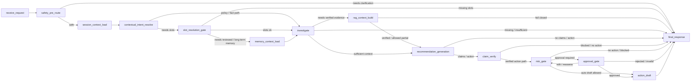

# MOCA — Merchant Operations Copilot Agent

**English** | [简体中文](README.md)

> An open-source reference implementation for trustworthy merchant-operations agents, demonstrating safety boundaries, auditability, and verifiable workflows.
>
> **Project scope:** MOCA uses a simulated merchant operations scenario and synthetic data. It is not a commercial deployment; the project is open source under the [Apache License 2.0](LICENSE).

[Architecture](#system-architecture) · [Agent Workflow](#agent-workflow) · [Safety](#safety-boundaries) · [Evaluation](#evaluation) · [Local Demo](#local-run-and-demo) · [Documentation](#project-documentation) · [License](#license)

## Project Positioning

MOCA is a runnable AI Agent project for merchant support and operations scenarios. It demonstrates how refund inquiries, policy questions, compensation suggestions, high-risk approvals, and traceable case reviews can share one engineered workflow.

The project is not primarily about attaching an LLM to a chat interface. It establishes verifiable authority boundaries: business facts, policy evidence, memory, approval authority, and action authority are owned by explicit services and contracts, while the Agent may investigate, generate, verify, and resume only within those boundaries.

## What It Does

| User Task | What MOCA Executes | What the User Sees |
| --- | --- | --- |
| “What is the refund status of order ORD-2024-001?” | Reads order and refund facts within the caller's authorized scope | A status explanation grounded in current business data rather than model guesses |
| “What is the platform policy for refund timeouts?” | Retrieves policy material, builds verified evidence, and validates citations | An answer with policy sources, or a safe fallback when evidence is insufficient |
| “Can we compensate a customer for delayed shipping?” | Combines order facts, policy evidence, and risk rules | A compensation recommendation with supporting reasons and risk context |
| “Refund this order and issue a coupon now.” | Creates an action proposal and evaluates risk; high-risk requests interrupt for manager approval | A reviewable pending-approval state rather than direct execution |
| A manager approves or rejects the request | Resumes the original Agent run through the trusted approval API | The decision, a simulated action draft when allowed, and a complete trace/replay record |

## System Architecture

MOCA is currently a modular monolith. FastAPI ingress, the LangGraph runtime, and domain services share one backend deployment boundary; PostgreSQL/pgvector stores business, conversation, approval, trace, replay, and knowledge data; the React/Vite frontend renders runs through APIs and SSE.

`ToolPlatform` governs tool calls only. Memory, approval, and replay retain direct service boundaries from the Agent runtime. The current layered architecture and verified call boundaries are documented in [System Overview](docs/architecture/system-overview.md). The visual architecture diagram is available in the [Chinese README](README.md#系统架构).

## Agent Workflow

Product-level flow:

```text
User request
  -> safety pre-route
  -> intent and slot resolution
  -> business fact and policy retrieval
  -> evidence validation
  -> recommendation generation
  -> claim verification
  -> risk gate
  -> approval or action draft
  -> final response and trace
```

Current source graph snapshot:



For the source-level graph map, see [docs/architecture/agent-workflow.md](docs/architecture/agent-workflow.md).

For concrete inputs, expected signals, and approval-resume steps, see the [10-Minute Demo Walkthrough](docs/guides/demo.md).

## Safety Boundaries

MOCA is designed so the model can assist with reasoning and drafting but cannot silently replace facts, policy, approval, or execution authority.

- LLM output is not business truth.
- Memory is contextual only, not policy evidence or approval authority.
- Policy answers should be grounded in verified evidence.
- Refund, compensation, and coupon actions are drafts only.
- Approval decisions must come from trusted approval APIs, not ordinary chat text.
- Tenant, role, and merchant scope are checked at API and service boundaries.

See [docs/architecture/security-approval-and-actions.md](docs/architecture/security-approval-and-actions.md).

## Evaluation

MOCA evaluates whether the Agent behaves correctly, not only whether responses sound fluent.

| Metric | Target | Evaluation Path |
| --- | ---: | --- |
| RAG Hit@5 | ≥ 85% | `scripts/eval_rag.py` over `evaluation/golden/rag_cases.jsonl` |
| Intent and route accuracy | ≥ 90% | `scripts/eval_agent.py` deterministic mode |
| Tool selection | ≥ 85% | Expected business tools contained in the graph run |
| Citation rate | ≥ 85% | Evidence document keys and response grounding checks |
| Safety-critical pass rate | 100% | Approval, permission-denied, rejection, and no-evidence cases |

These values are evaluation gates, not current measured scores. Deterministic, live, and release-scale statistical evidence are reported separately. See [Evaluation Methodology and Current Gate Status](docs/quality/evaluation.md).

## Project Documentation

- [Documentation Portal](docs/README.md)
- [10-Minute Demo Walkthrough](docs/guides/demo.md)
- [Evaluation Methodology](docs/quality/evaluation.md)
- [Security, Approval, and Action Boundaries](docs/architecture/security-approval-and-actions.md)
- [Current Agent Workflow](docs/architecture/agent-workflow.md)

## Current Status

- **Current main branch:** continued product-experience work on direct responses, clarification quality, business metric queries, frontend timeline behavior, and UX regression cases.
- **Runtime graph:** the current canonical workflow has 15 registered nodes.
- **Action boundary:** simulated action drafts only; no real payment, refund, coupon, or external fulfillment execution.

## Local Run and Demo

Prerequisites: Docker Compose. Running seed, tests, and evaluations on the host also requires Python 3.12, `uv`, and `jq`. The live Agent demo requires a valid DashScope API key.

```bash
cp .env.example .env
# Edit .env and replace the DASHSCOPE_API_KEY placeholder with a valid local key
docker compose up --build -d
curl --retry 20 --retry-delay 2 --retry-connrefused -sf \
  http://localhost:8000/health | jq .
make seed
```

The API container runs Alembic migrations during startup, so a separate `make migrate` is unnecessary. If `uv` is unavailable on the host, seed through the container instead:

```bash
docker compose exec api python scripts/seed_demo.py --reset
```

API documentation:

```text
http://localhost:8000/docs
```

Frontend:

```text
http://localhost:3000
```

Command-line demo:

```bash
bash scripts/demo_phase6.sh
```

For the five UI scenarios, expected signals, and approval recovery flow, see the [10-Minute Demo Walkthrough](docs/guides/demo.md).

Useful local commands:

```bash
UV_CACHE_DIR=/tmp/uv-cache uv run pytest tests/ -q --tb=short
uv run ruff check src/ tests/
uv run python scripts/eval_agent.py
uv run python scripts/eval_all.py
```

All demo accounts use the password `moca2024`:

| Username | Role | Typical Use |
| --- | --- | --- |
| `cs_zhang` | support | Submit Agent questions |
| `mgr_li` | manager | Review approvals |
| `admin_user` | admin | Run admin-level API checks |
| `merchant_wang` | merchant | Test merchant-scoped access |

## Tech Stack

- Backend: Python 3.12, FastAPI, SQLAlchemy, and Alembic.
- Agent runtime: LangGraph and Pydantic structured outputs.
- Data: PostgreSQL and pgvector.
- Retrieval: hybrid policy retrieval, embeddings, and evidence validation.
- Frontend: React, Vite, and Server-Sent Events.
- Evaluation: deterministic FakeLLM mode, golden sets, and local reports.

## Repository Map

```text
src/
├── agent/          # LangGraph nodes, routing, state, and trace helpers
├── api/            # FastAPI routers, auth dependencies, and SSE endpoints
├── auth/           # JWT, OAuth2 scopes, and role checks
├── business/       # Business fact service and adapters
├── knowledge/      # Policy retrieval, evidence, and claim verification
├── memory/         # Session context, CWC, and preference/case memory boundaries
├── tools/          # ToolPlatform, catalog, runtime, policy, and validation
├── actions/        # Simulated action drafts and action boundary
└── db/             # SQLAlchemy models, migrations, and sessions

frontend/           # React and Vite console
evaluation/         # Golden sets and reports
scripts/            # Seed, demo, evaluation, and utility CLIs
rules/              # Risk rules
docs/               # Curated CURRENT, NORMATIVE, and GUIDE documentation
tests/              # Unit, integration, Agent, approval, trace, and API tests
```

## Scope and Limitations

- All business data is synthetic.
- The demo is a simulated merchant operations scenario, not a real platform deployment.
- All write actions are simulated action drafts.
- Live LLM evaluation is optional local validation; deterministic tests avoid provider dependency.
- Database-backed integration tests and live provider checks are local commands, not lightweight CI defaults.

## License

MOCA is open source under the [Apache License 2.0](LICENSE). You may use, modify, and distribute the project subject to the license terms.

## One-Line Summary

MOCA demonstrates how to design an AI Agent product that is evidence-grounded, approval-aware, traceable, and constrained by real business boundaries.
