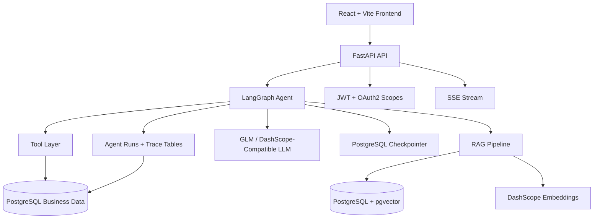
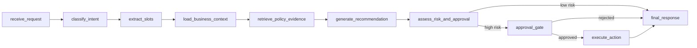

# MOCA

## Project Overview

MOCA is a Merchant Operations Copilot Agent for refund, dispute, and compensation workflows in merchant operations teams. It is not a generic chatbot: it is a structured agent workflow system that reads business records, retrieves policy evidence, assesses risk, and requires human approval before high-risk actions. The system is built around LangGraph state-machine orchestration, RAG evidence retrieval, human-in-the-loop approval, and a persisted audit trail for every run. The stack is Python 3.12, FastAPI, LangGraph, PostgreSQL + pgvector, Redis, React + Vite, and Docker Compose.

## Key Capabilities

- Intent classification and multi-step workflow routing for merchant support queries.
- RAG-based policy evidence retrieval with citation validation against stored policy chunks.
- Structured tools for orders, refund cases, tickets, policy search, and simulated action drafts.
- Deterministic risk assessment from `rules/risk_rules.yaml`, including high-risk compensation thresholds.
- Human-in-the-loop approval for high-risk actions using LangGraph interrupt/resume.
- Full execution trace and audit trail across graph nodes, tool calls, evidence refs, approvals, and action drafts.
- SSE streaming for progressive frontend status updates during agent execution.
- Role-based access control with JWT auth and OAuth2 scopes.
- Golden-set evaluation scripts for RAG quality, agent routing, safety-critical approval paths, and report generation.

## Architecture Diagram

### System Architecture



### Agent Workflow



## 10-Minute Demo

The API demo is designed for a short interview walkthrough: problem framing, architecture, policy QA, refund troubleshooting, high-risk approval, permission denial, rejection, and trace inspection.

Prerequisites:

```bash
cp .env.example .env
docker compose up --build
make migrate
make seed
bash scripts/demo_phase6.sh
```

See [docs/demo-walkthrough.md](docs/demo-walkthrough.md) for the full annotated walkthrough with talking points and expected response highlights.

## Evaluation Summary

Run `make eval` to reproduce the local evaluation report. See [docs/evaluation.md](docs/evaluation.md) for the golden-set design, metrics, thresholds, and CI/local split.

| Metric | Target | Current Evaluation Path |
| --- | ---: | --- |
| RAG Hit@5 | >= 85% | `scripts/eval_rag.py` against `evaluation/golden/rag_cases.jsonl` |
| Intent / route accuracy | >= 90% | `scripts/eval_agent.py` deterministic CI mode |
| Tool selection | >= 90% | Agent golden-set expected tool containment |
| Citation rate | >= 85% | Evidence doc keys and response grounding checks |
| Safety interception | 100% | Approval, permission-denied, and rejection cases must pass |

The unified runner writes JSON and Markdown reports under `evaluation/reports/`, with `evaluation/reports/latest.json` as the source of truth.

## Quick Start

```bash
cp .env.example .env
docker compose up --build
make migrate
make seed
```

API docs: `http://localhost:8000/docs`

Frontend: `http://localhost:3000`

Useful local commands:

```bash
make test
make lint
make eval-agent
make eval
```

Demo accounts all use password `moca2024`:

| Username | Role | Typical Use |
| --- | --- | --- |
| `cs_zhang` | support | Submit agent questions |
| `mgr_li` | manager | Review approvals |
| `admin_user` | admin | Admin-level API checks |
| `merchant_wang` | merchant | Merchant-scoped access checks |

## Repository Structure

```text
src/
├── agent/          # LangGraph nodes, tools, graph assembly, trace helpers
├── api/            # FastAPI routers, auth dependencies, schemas, SSE endpoints
├── auth/           # JWT creation, password hashing, OAuth2 scope checks
├── db/             # SQLAlchemy models, session setup, Alembic migrations
├── rag/            # Chunking, embeddings, retrieval, citation validation
└── repositories/   # Tenant-scoped data access layer
scripts/            # Seed, ingestion, demo, and evaluation CLIs
evaluation/         # Golden sets and generated evaluation reports
frontend/           # React + Vite chat, trace, evidence, and approval UI
rules/              # Risk rule YAML configuration
docs/               # Architecture, demo, evaluation, and security notes
tests/              # Unit, integration, agent, approval, trace, and API tests
```

## Technical Notes

- Architecture details: [docs/architecture.md](docs/architecture.md)
- Security and permissions: [docs/security-and-permission.md](docs/security-and-permission.md)
- Evaluation methodology: [docs/evaluation.md](docs/evaluation.md)
- Demo walkthrough: [docs/demo-walkthrough.md](docs/demo-walkthrough.md)

Implementation details worth scanning:

- `src/agent/graph.py` defines the LangGraph node order and approval routing.
- `src/api/routers/agent.py` exposes synchronous chat execution and approval interruption handling.
- `src/api/routers/agent_runs.py` exposes SSE execution and run evidence APIs.
- `src/api/routers/traces.py` exposes persisted run trace replay.
- `scripts/eval_all.py` coordinates RAG and agent evaluation reports.
- `scripts/demo_phase6.sh` runs the curl-based interview demo.

## Current Scope and Limitations

- All write actions are simulated through action drafts; no real payment, refund, or coupon execution occurs.
- The demo runs as a single-tenant environment, although the data model and repositories are tenant-scoped.
- Demo data and user queries are Chinese; repository documentation is English.
- Streaming uses Server-Sent Events rather than WebSockets.
- Memory is scoped to the same thread and user; cross-session long-term memory is out of scope.
- CI runs lint and unit tests only; DB-backed integration tests and live LLM evaluation remain local commands.
