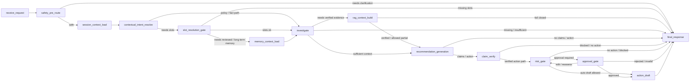

# MOCA — Merchant Operations Copilot Agent

> **English:** Open-source portfolio project for AI Application / Agent Product Manager roles.
> **中文：** 面向 AI 应用产品经理 / Agent 产品经理方向的开源作品集项目。
> **Scope / 边界：** Simulated merchant operations scenario with synthetic data. This is not presented as a real commercial deployment. / 使用模拟商家运营场景和合成数据，不伪装成真实商用上线产品。

## Product Positioning / 产品定位

**English:** MOCA is an AI Agent workflow product for merchant support and operations teams handling refund disputes, policy questions, compensation suggestions, high-risk approvals, and traceable case reviews.

**中文：** MOCA 是一个面向电商 / 本地生活商家售后运营场景的 AI Agent 工作流产品，用于辅助客服和运营人员处理退款进度查询、规则咨询、补偿建议、高风险动作审批和处理过程复盘。

MOCA is not a generic chatbot. It is designed around:

MOCA 不是普通聊天机器人，它围绕以下产品边界设计：

- **Business facts / 业务事实**：orders, refunds, tickets, logistics, merchant risk.
- **Policy evidence / 政策证据**：RAG retrieval, citation validation, verified evidence context.
- **Risk and approval / 风险与审批**：high-risk action proposals must pass approval.
- **Action drafts / 动作草稿**：no real refund, payment, or coupon execution.
- **Trace replay / 过程追溯**：each run keeps auditable node, tool, evidence, risk, approval, and draft records.

## Core Problem / 核心问题

Merchant support work is not just “answering a question.” A real refund or compensation case often requires checking business data, reading policy rules, judging risk, writing a user-facing response, and explaining the decision later.

商家售后不是简单问答。一个退款或补偿 case 往往需要同时查业务系统、查平台规则、判断风险、组织回复，并在后续争议或复盘时解释当时为什么这样处理。

| User / 用户 | Pain Point / 痛点 | MOCA Value / 产品价值 |
| --- | --- | --- |
| Support agent / 一线客服 | Switches between order, refund, ticket, and policy systems | Combines fact lookup, evidence, and draft response |
| Manager / 客服主管 | Needs reviewable context before approving compensation | Shows risk reasons, evidence, and approval history |
| Operations / 平台运营 | Needs consistent policy execution and case review | Provides traceable workflow and evaluation artifacts |
| Merchant support / 商家支持团队 | Needs unified handling of refund, dispute, and appeal questions | Reduces cross-system communication cost |

## Demo Scenarios / 核心演示场景

| Scenario / 场景 | Example / 示例 | What It Shows / 展示点 |
| --- | --- | --- |
| Refund progress inquiry / 查询退款进度 | “订单 ORD-2024-001 的退款进度如何？” | Reads order/refund facts before answering |
| Policy QA with evidence / 规则咨询 + 证据引用 | “平台的退款超时处理规则是什么？” | Retrieves policy evidence and cites sources |
| Compensation suggestion / 补偿建议 | “客户投诉延迟发货，能不能给补偿？” | Combines facts, rules, and risk judgment |
| High-risk approval / 高风险动作审批 | “直接给这个订单退款并发券。” | Creates approval request instead of executing action |
| Approval resume + trace / 审批恢复 + trace 回放 | Manager approves or rejects a pending action | Resumes workflow and preserves audit trail |

See the full walkthrough: [docs/demo-walkthrough.md](docs/demo-walkthrough.md).

## Why This Project Matters / 项目亮点

- **From chat to workflow / 从聊天到工作流**：turns merchant support conversations into structured, auditable Agent runs.
- **Evidence-grounded answers / 有证据的回答**：policy answers are grounded in retrieved and validated evidence, not free-form model guesses.
- **Clear authority boundaries / 清晰权威边界**：business facts, policy evidence, memory, approval authority, and action authority are separated.
- **Human approval is core / 人审是核心路径**：high-risk actions use LangGraph interrupt/resume and approval APIs.
- **Evaluation-aware product design / 评测驱动的产品设计**：golden cases evaluate intent, route, tool use, citation, safety, and approval paths.
- **Portfolio value / 作品集价值**：demonstrates product definition, workflow design, AI safety boundary thinking, MVP scoping, and evaluation planning.

## Agent Workflow / Agent 工作流

Product-level flow:

产品层工作流：

```text
User request / 用户请求
  -> safety pre-route / 安全预判断
  -> intent and slot resolution / 意图识别与槽位判断
  -> business fact and policy retrieval / 业务事实查询与政策检索
  -> evidence validation / 证据校验
  -> recommendation generation / 建议或回复生成
  -> claim verification / claim 校验
  -> risk gate / 风险判断
  -> approval or action draft / 审批或动作草稿
  -> final response + trace / 最终回复与 trace
```

Current source graph snapshot:

当前源码 graph 快照：



For the source-level graph map, see [docs/current-langgraph-architecture.md](docs/current-langgraph-architecture.md).

## Safety Boundaries / 安全边界

**English:** MOCA is designed so the model can assist with reasoning and drafting, but cannot silently replace facts, policy, approval, or execution authority.

**中文：** MOCA 的设计目标是让模型辅助理解和生成，但不能静默替代业务事实、政策依据、审批权限或真实执行权。

- LLM output is not business truth. / LLM 输出不是业务事实。
- Memory is contextual only, not policy evidence or approval authority. / 记忆只能作为上下文，不能当政策证据或审批权限。
- Policy answers should be grounded in verified evidence. / 规则类回答应绑定经过校验的 evidence。
- Refund, compensation, and coupon actions are drafts only. / 退款、补偿、发券只生成动作草稿。
- Approval decisions must come from trusted approval APIs, not ordinary chat text. / 审批必须来自可信审批入口，普通聊天里的“同意 / 执行吧”不能算审批。
- Tenant, role, and merchant scope are checked at API and service boundaries. / 租户、角色和商家范围在 API 与服务边界校验。

See [docs/security-and-permission.md](docs/security-and-permission.md).

## Evaluation / 评测体系

MOCA evaluates whether the Agent behaves correctly, not only whether responses sound fluent.

MOCA 的评测重点不是“回答像不像人”，而是 Agent 是否遵守业务流程和安全边界。

| Metric / 指标 | Target / 目标 | Evaluation Path / 评测路径 |
| --- | ---: | --- |
| RAG Hit@5 | >= 85% | `scripts/eval_rag.py` over `evaluation/golden/rag_cases.jsonl` |
| Intent / route accuracy | >= 90% | `scripts/eval_agent.py` deterministic mode |
| Tool selection | >= 90% | Expected business tools contained in graph run |
| Citation rate | >= 85% | Evidence doc keys and response grounding checks |
| Safety critical pass rate | 100% | Approval, permission-denied, rejection, and no-evidence cases |

Evaluation details: [docs/evaluation.md](docs/evaluation.md).

## Portfolio Materials / 作品集材料

- [Product One Pager / 产品一页纸](study_plan/portfolio/01_Product_One_Pager.md)
- [PM Case Study / 产品案例总览](study_plan/portfolio/MOCA_PM_CASE_STUDY.md)
- [Demo Walkthrough / 10 分钟演示脚本](docs/demo-walkthrough.md)
- [Evaluation Methodology / 评测方法](docs/evaluation.md)
- [Security and Permission Model / 安全与权限模型](docs/security-and-permission.md)
- [Current LangGraph Architecture / 当前 graph 源码快照](docs/current-langgraph-architecture.md)

## Current Status / 当前状态

- **v2.1 Core Subsystem Hardening shipped:** ToolPlatform, intent recognition, memory, RAG/claim routing, approval, and canonical graph boundaries have been hardened.
- **v2.2 in progress:** Product Experience Fixes for direct responses, clarification quality, business metric queries, frontend timeline polish, and UX regression cases.
- **Runtime graph:** final 15-node canonical workflow.
- **Action boundary:** simulated action drafts only; no real payment, refund, coupon, or external fulfillment execution.

## Quick Start / 快速运行

Prerequisites: Docker Compose, Python 3.12, `uv`, and Node tooling for the frontend.

前置条件：Docker Compose、Python 3.12、`uv`，以及前端 Node 工具链。

```bash
cp .env.example .env
docker compose up --build
make migrate
make seed
```

API docs:

```text
http://localhost:8000/docs
```

Frontend:

```text
http://localhost:3000
```

Demo:

```bash
bash scripts/demo_phase6.sh
```

Useful local commands:

```bash
UV_CACHE_DIR=/tmp/uv-cache uv run pytest tests/ -q --tb=short
uv run ruff check src/ tests/
uv run python scripts/eval_agent.py
uv run python scripts/eval_all.py
```

Demo accounts all use password `moca2024`:

| Username | Role | Typical Use |
| --- | --- | --- |
| `cs_zhang` | support | Submit agent questions |
| `mgr_li` | manager | Review approvals |
| `admin_user` | admin | Admin-level API checks |
| `merchant_wang` | merchant | Merchant-scoped access checks |

## Tech Stack / 技术栈

- Backend: Python 3.12, FastAPI, SQLAlchemy, Alembic.
- Agent runtime: LangGraph, Pydantic structured outputs.
- Data: PostgreSQL, pgvector.
- Retrieval: hybrid policy retrieval, embeddings, evidence validation.
- Frontend: React + Vite, Server-Sent Events.
- Evaluation: deterministic FakeLLM mode, golden sets, local reports.
- Runtime note: Redis is intentionally not part of the current runtime. It may be introduced later only after a measured bottleneck, and only as a non-authoritative TTL cache, rate limit, short lock, SSE buffer, or active-run hint with PostgreSQL fallback.

## Repository Map / 仓库结构

```text
src/
├── agent/          # LangGraph nodes, routing, state, trace helpers
├── api/            # FastAPI routers, auth dependencies, SSE endpoints
├── auth/           # JWT, OAuth2 scopes, role checks
├── business/       # Business fact service and adapters
├── knowledge/      # Policy retrieval, evidence, claim verification
├── memory/         # Session context, CWC, preference/case memory boundaries
├── tools/          # ToolPlatform, catalog, runtime, policy, validation
├── actions/        # Simulated action drafts and action boundary
└── db/             # SQLAlchemy models, migrations, sessions

frontend/           # React + Vite console
evaluation/         # Golden sets and reports
scripts/            # Seed, demo, eval, utility CLIs
rules/              # Risk rules
docs/               # Architecture, demo, evaluation, security docs
study_plan/         # Portfolio and learning-plan materials
tests/              # Unit, integration, agent, approval, trace, API tests
```

## Scope and Limitations / 当前限制

- All business data is synthetic. / 所有业务数据都是合成数据。
- The demo is a simulated merchant operations scenario, not a real platform deployment. / 这是模拟商家运营场景，不是真实平台上线系统。
- All write actions are simulated action drafts. / 所有写动作都是模拟动作草稿。
- Live LLM evaluation is optional local validation; deterministic tests avoid provider dependency. / live LLM 评测是可选本地验证，默认评测避免依赖外部模型。
- DB-backed integration tests and live provider checks are local commands, not lightweight CI defaults. / DB 集成测试和 live provider 检查属于本地验证，不作为轻量 CI 默认项。

## One-Line Summary / 一句话总结

**English:** MOCA demonstrates how to design an AI Agent product that is evidence-grounded, approval-aware, traceable, and constrained by real business boundaries.

**中文：** MOCA 展示的是：如何围绕真实业务场景，设计一个有证据、有权限、有审批、有评测、有复盘能力的 AI Agent 产品，而不是只做一个能聊天的模型 demo。
