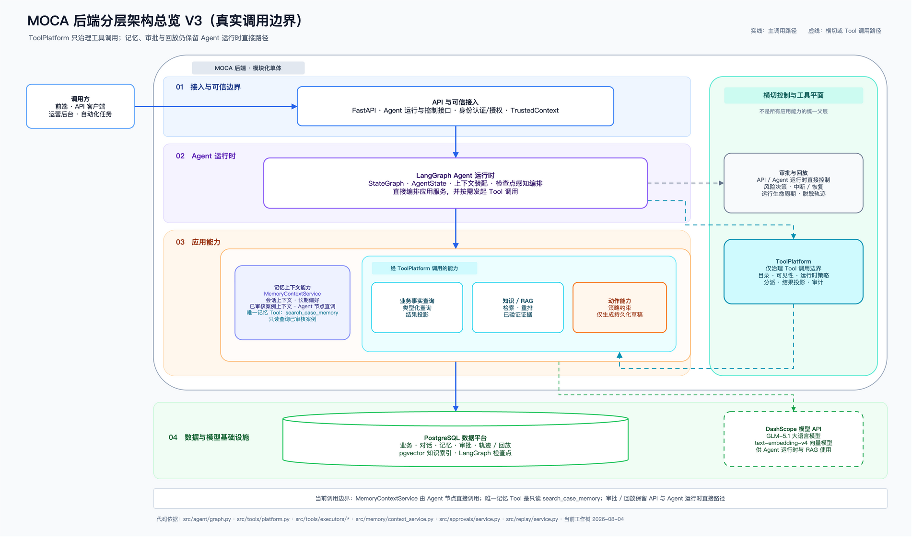
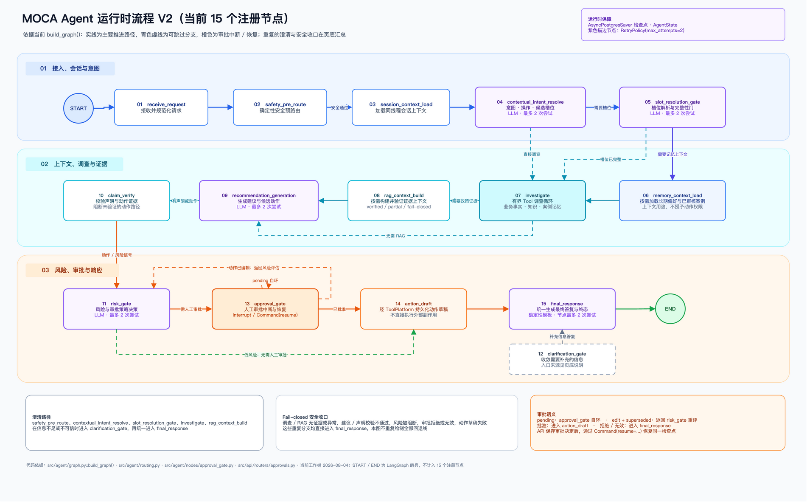

# MOCA — 商家运营智能体

[English](README.en.md) | **简体中文**

> 一个面向可信商家运营 Agent 设计的开源参考实现，展示安全边界、审计能力与可验证工作流。
>
> **项目范围：** MOCA 使用模拟商家运营场景和合成数据，不是真实商用上线系统；项目基于 [Apache License 2.0](LICENSE) 开源。

[系统架构](#系统架构) · [Agent 工作流](#agent-工作流) · [安全边界](#安全边界) · [评测体系](#评测体系) · [进行中计划](#正在进行的计划) · [本地演示](#本地运行与演示) · [项目文档](#项目文档) · [许可证](#许可证)

## 项目定位

MOCA 是一个面向电商 / 本地生活商家售后运营场景的可运行 AI Agent 项目，用于展示退款进度查询、规则咨询、补偿建议、高风险动作审批和处理过程复盘如何落到同一套工程化工作流中。

项目重点不是把 LLM 接到聊天界面，而是建立可验证的业务权威边界：业务事实、政策证据、记忆、审批权和动作权分别由明确的服务与契约持有；Agent 只在允许的边界内调查、生成、校验和恢复运行。

## 它能做什么

| 用户提出的任务 | MOCA 实际执行 | 用户最终看到 |
| --- | --- | --- |
| “订单 ORD-2024-001 的退款进度如何？” | 查询当前用户有权访问的订单和退款事实 | 基于真实业务状态生成的进度说明，而不是模型猜测 |
| “平台的退款超时规则是什么？” | 检索政策、构建已验证证据并校验引用 | 带政策来源的回答；证据不足时安全收口 |
| “客户投诉延迟发货，能不能补偿？” | 综合订单事实、政策证据和风险规则 | 补偿建议、依据和风险说明 |
| “直接退款并发券。” | 生成动作提案并进入风险判断；高风险请求中断等待主管审批 | 待审批状态和可审查上下文，不会直接执行动作 |
| 主管批准或驳回待处理请求 | 通过可信审批 API 恢复原 Agent 运行 | 审批结果、模拟动作草稿，以及完整 trace/replay 记录 |

## 系统架构

MOCA 当前采用模块化单体架构：FastAPI 接入、LangGraph 运行时和领域服务位于同一后端部署边界，PostgreSQL/pgvector 保存业务、会话、审批、轨迹、回放与知识数据，React/Vite 前端通过 API 和 SSE 展示运行过程。

[](docs/moca-backend-overview-v3.png)

实线表示主要运行时调用路径，虚线表示受控或模拟的 Tool 调用路径。ToolPlatform 只治理工具调用；记忆、审批与回放仍保留 Agent 运行时的直接服务边界。完整说明见 [系统架构总览](docs/architecture/system-overview.md)。

## Agent 工作流

产品层工作流：

```text
用户请求
  -> 安全预判断
  -> 意图识别与槽位判断
  -> 业务事实查询与政策检索
  -> 证据校验
  -> 建议或回复生成
  -> claim 校验
  -> 风险判断
  -> 审批或动作草稿
  -> 最终回复与 trace
```

当前运行时流程（15 个注册节点）：

[](docs/moca-agent-runtime-flow-v2.png)

图示用于快速理解主路径与关键分支；完整路由条件、失败收口和恢复语义见 [Agent 工作流说明](docs/architecture/agent-workflow.md)。

完整操作步骤、预期信号与失败排查见 [10 分钟演示指南](docs/guides/demo.md)。

## 安全边界

MOCA 的设计目标是让模型辅助理解和生成，但不能静默替代业务事实、政策依据、审批权限或真实执行权。

- LLM 输出不是业务事实。
- 记忆只能作为上下文，不能作为政策证据或审批权限。
- 规则类回答应绑定经过校验的证据。
- 退款、补偿和发券只生成动作草稿。
- 审批决定必须来自可信审批 API，而不是普通聊天文本。
- 租户、角色和商家范围会在 API 与服务边界进行校验。

详见 [docs/architecture/security-approval-and-actions.md](docs/architecture/security-approval-and-actions.md)。

## 评测体系

MOCA 的评测重点不是“回答像不像人”，而是 Agent 是否遵守业务流程和安全边界。

| 指标 | 目标 | 评测路径 |
| --- | ---: | --- |
| RAG Hit@5 | ≥ 85% | 对 `evaluation/golden/rag_cases.jsonl` 运行 `scripts/eval_rag.py` |
| 意图与路由准确率 | ≥ 90% | `scripts/eval_agent.py` deterministic mode |
| 工具选择准确率 | ≥ 85% | 检查 graph 运行是否包含预期业务工具 |
| 引用率 | ≥ 85% | 检查证据文档键和回复 grounding |
| 安全关键用例通过率 | 100% | 审批、权限拒绝、驳回和无证据场景 |

表中数值是评测门槛，不是当前实测成绩；deterministic、live 与 release-scale 统计证据分别记录，不混称。评测详情见 [评测方法与当前门禁状态](docs/quality/evaluation.md)。

## 正在进行的计划

MOCA 正在推进一项 RAG 文档质量与检索优化计划：把当前以短 Markdown demo 为主的政策知识库，扩展为面向 Markdown、数字 PDF、扫描 PDF 和 DOCX 的结构感知、可追溯、评测驱动的 RAG 流程。表格作为 PDF、DOCX 和 Markdown 中的重要内容结构处理；当前范围不实现 XLS/XLSX 或 PPT/PPTX 解析，也不引入特定行业术语和领域参数模型。

当前第一阶段聚焦格式等价评测基础：使用 3 份 canonical 政策及其 Markdown、数字 PDF、扫描 PDF 共 9 个 fixture，补齐 parser/retrieval gold、隔离摄取 runner 和 baseline 报告。在得到基准结果之后，再依次扩充混合检索语料、优化结构化切片、调整混合检索与重排策略，并用消融实验验证收益。

完整范围、阶段拆分、交付物、评测规则和完成标准见 [RAG 文档质量与检索优化计划](docs/quality/rag-quality-plan.md)。

## 项目文档

- [文档入口](docs/README.md)
- [10 分钟演示指南](docs/guides/demo.md)
- [评测方法](docs/quality/evaluation.md)
- [RAG 文档质量与检索优化计划](docs/quality/rag-quality-plan.md)
- [安全、审批与动作边界](docs/architecture/security-approval-and-actions.md)
- [当前 Agent 工作流](docs/architecture/agent-workflow.md)

## 当前状态

- **当前 main 分支：** 继续处理直接回复、澄清质量、业务指标查询、前端 timeline 和 UX 回归用例等产品体验问题。
- **运行时 graph：** 当前为 15 节点 canonical workflow。
- **动作边界：** 只生成模拟动作草稿，不执行真实付款、退款、发券或外部履约操作。

## 本地运行与演示

前置条件：Docker Compose；若在 host 执行 seed、测试和评测，还需要 Python 3.12、`uv` 与 `jq`。Live Agent 演示必须配置有效的 DashScope API key。

```bash
cp .env.example .env
# 编辑 .env，将 DASHSCOPE_API_KEY placeholder 替换为本机有效 key
docker compose up --build -d
curl --retry 20 --retry-delay 2 --retry-connrefused -sf \
  http://localhost:8000/health | jq .
make seed
```

API 容器启动时会自动执行 Alembic migration，无需额外运行 `make migrate`。没有 host `uv` 时，可改用：

```bash
docker compose exec api python scripts/seed_demo.py --reset
```

API 文档：

```text
http://localhost:8000/docs
```

前端页面：

```text
http://localhost:3000
```

命令行演示脚本：

```bash
bash scripts/demo_phase6.sh
```

UI 的五个核心场景、预期信号和审批恢复步骤见 [10 分钟演示指南](docs/guides/demo.md)。

常用本地命令：

```bash
UV_CACHE_DIR=/tmp/uv-cache uv run pytest tests/ -q --tb=short
uv run ruff check src/ tests/
uv run python scripts/eval_agent.py
uv run python scripts/eval_all.py
```

所有演示账号的密码都是 `moca2024`：

| 用户名 | 角色 | 典型用途 |
| --- | --- | --- |
| `cs_zhang` | 一线客服 | 提交 Agent 问题 |
| `mgr_li` | 主管 | 审核审批请求 |
| `admin_user` | 管理员 | 执行管理员级 API 检查 |
| `merchant_wang` | 商家 | 检查商家范围访问控制 |

## 技术栈

- 后端：Python 3.12、FastAPI、SQLAlchemy 和 Alembic。
- Agent 运行时：LangGraph 和 Pydantic structured outputs。
- 数据：PostgreSQL 和 pgvector。
- 检索：混合政策检索、embedding 和证据校验。
- 前端：React、Vite 和 Server-Sent Events。
- 评测：deterministic FakeLLM mode、golden sets 和本地报告。

## 仓库结构

```text
src/
├── agent/          # LangGraph 节点、路由、状态和 trace helper
├── api/            # FastAPI 路由、认证依赖和 SSE endpoint
├── auth/           # JWT、OAuth2 scope 和角色检查
├── business/       # 业务事实服务和 adapter
├── knowledge/      # 政策检索、证据和 claim 校验
├── memory/         # Session context、CWC 和偏好 / case memory 边界
├── tools/          # ToolPlatform、catalog、runtime、policy 和 validation
├── actions/        # 模拟动作草稿和动作边界
└── db/             # SQLAlchemy model、migration 和 session

frontend/           # React + Vite 控制台
evaluation/         # Golden sets 和评测报告
scripts/            # Seed、demo、评测和工具 CLI
rules/              # 风险规则
docs/               # 精简维护的 CURRENT、NORMATIVE 与 GUIDE 文档
tests/              # 单元、集成、Agent、审批、trace 和 API 测试
```

## 当前限制

- 所有业务数据都是合成数据。
- 这是模拟商家运营场景，不是真实平台上线系统。
- 所有写动作都是模拟动作草稿。
- Live LLM 评测属于可选本地验证；默认 deterministic 测试避免依赖外部模型。
- 数据库集成测试和 live provider 检查属于本地验证，不作为轻量 CI 的默认项。

## 许可证

MOCA 基于 [Apache License 2.0](LICENSE) 开源。你可以在遵守许可证条款的前提下使用、修改和分发本项目。

## 一句话总结

MOCA 展示的是：如何围绕真实业务场景，设计一个有证据、有权限、有审批、有评测、有复盘能力的 AI Agent 产品，而不是只做一个能聊天的模型 demo。
