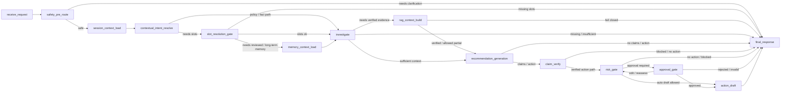

# MOCA — Merchant Operations Copilot Agent

**English** | [简体中文](README.zh-CN.md)

> Open-source reference implementation of a safety-bounded, auditable AI Agent workflow.
>
> **Scope:** MOCA uses a simulated merchant operations scenario and synthetic data. It is not presented as a real commercial deployment.

Documentation portal: [docs/README.md](docs/README.md).

## Product Positioning

MOCA is an AI Agent workflow product for merchant support and operations teams handling refund disputes, policy questions, compensation suggestions, high-risk approvals, and traceable case reviews.

MOCA is not a generic chatbot. It is designed around:

- **Business facts:** orders, refunds, tickets, logistics, and merchant risk.
- **Policy evidence:** RAG retrieval, citation validation, and verified evidence context.
- **Risk and approval:** high-risk action proposals must pass approval.
- **Action drafts:** no real refund, payment, or coupon execution.
- **Trace replay:** each run keeps auditable node, tool, evidence, risk, approval, and draft records.

## Core Problem

Merchant support work is not just “answering a question.” A real refund or compensation case often requires checking business data, reading policy rules, judging risk, writing a user-facing response, and explaining the decision later.

| User | Pain Point | MOCA Value |
| --- | --- | --- |
| Support agent | Switches between order, refund, ticket, and policy systems | Combines fact lookup, evidence, and draft responses |
| Manager | Needs reviewable context before approving compensation | Shows risk reasons, evidence, and approval history |
| Operations | Needs consistent policy execution and case review | Provides traceable workflows and evaluation artifacts |
| Merchant support | Needs unified handling of refund, dispute, and appeal questions | Reduces cross-system communication cost |

## Demo Scenarios

| Scenario | Example | What It Shows |
| --- | --- | --- |
| Refund progress inquiry | “What is the refund status of order ORD-2024-001?” | Reads order and refund facts before answering |
| Policy QA with evidence | “What is the platform policy for refund timeouts?” | Retrieves policy evidence and cites sources |
| Compensation suggestion | “A customer complained about delayed shipping. Can we offer compensation?” | Combines facts, rules, and risk judgment |
| High-risk approval | “Refund this order and issue a coupon now.” | Creates an approval request instead of executing the action |
| Approval resume and trace | A manager approves or rejects a pending action | Resumes the workflow and preserves the audit trail |

See the current walkthrough: [docs/guides/demo.md](docs/guides/demo.md).

## Why This Project Matters

- **From chat to workflow:** turns merchant support conversations into structured, auditable Agent runs.
- **Evidence-grounded answers:** grounds policy answers in retrieved and validated evidence instead of free-form model guesses.
- **Clear authority boundaries:** separates business facts, policy evidence, memory, approval authority, and action authority.
- **Human approval is core:** uses LangGraph interrupt/resume and approval APIs for high-risk actions.
- **Evaluation-aware product design:** evaluates intent, route, tool use, citation, safety, and approval paths with golden cases.
- **Engineering reference value:** demonstrates workflow contracts, authority isolation, human approval, replayability, and evaluation gates.

## Agent Workflow

Product-level flow:

```text
User request
  -> safety pre-route
  -> intent and slot resolution
  -> business fact and policy retrieval
  -> evidence validation
  -> recommendation generation
  -> claim verification
  -> risk gate
  -> approval or action draft
  -> final response and trace
```

Current source graph snapshot:



For the source-level graph map, see [docs/architecture/agent-workflow.md](docs/architecture/agent-workflow.md).

## Safety Boundaries

MOCA is designed so the model can assist with reasoning and drafting but cannot silently replace facts, policy, approval, or execution authority.

- LLM output is not business truth.
- Memory is contextual only, not policy evidence or approval authority.
- Policy answers should be grounded in verified evidence.
- Refund, compensation, and coupon actions are drafts only.
- Approval decisions must come from trusted approval APIs, not ordinary chat text.
- Tenant, role, and merchant scope are checked at API and service boundaries.

See [docs/architecture/security-approval-and-actions.md](docs/architecture/security-approval-and-actions.md).

## Evaluation

MOCA evaluates whether the Agent behaves correctly, not only whether responses sound fluent.

| Metric | Target | Evaluation Path |
| --- | ---: | --- |
| RAG Hit@5 | ≥ 85% | `scripts/eval_rag.py` over `evaluation/golden/rag_cases.jsonl` |
| Intent and route accuracy | ≥ 90% | `scripts/eval_agent.py` deterministic mode |
| Tool selection | ≥ 85% | Expected business tools contained in the graph run |
| Citation rate | ≥ 85% | Evidence document keys and response grounding checks |
| Safety-critical pass rate | 100% | Approval, permission-denied, rejection, and no-evidence cases |

Evaluation details: [docs/quality/evaluation.md](docs/quality/evaluation.md).

## Project Documentation

- [Documentation Portal](docs/README.md)
- [10-Minute Demo Walkthrough](docs/guides/demo.md)
- [Evaluation Methodology](docs/quality/evaluation.md)
- [Security, Approval, and Action Boundaries](docs/architecture/security-approval-and-actions.md)
- [Current Agent Workflow](docs/architecture/agent-workflow.md)

## Current Status

- **v2.1 Core Subsystem Hardening shipped:** ToolPlatform, intent recognition, memory, RAG and claim routing, approval, and canonical graph boundaries have been hardened.
- **v2.2 in progress:** product experience fixes for direct responses, clarification quality, business metric queries, frontend timeline polish, and UX regression cases.
- **Runtime graph:** final 15-node canonical workflow.
- **Action boundary:** simulated action drafts only; no real payment, refund, coupon, or external fulfillment execution.

## Quick Start

Prerequisites: Docker Compose, Python 3.12, `uv`, and Node tooling for the frontend.

```bash
cp .env.example .env
docker compose up --build
make migrate
make seed
```

API documentation:

```text
http://localhost:8000/docs
```

Frontend:

```text
http://localhost:3000
```

Demo:

```bash
bash scripts/demo_phase6.sh
```

Useful local commands:

```bash
UV_CACHE_DIR=/tmp/uv-cache uv run pytest tests/ -q --tb=short
uv run ruff check src/ tests/
uv run python scripts/eval_agent.py
uv run python scripts/eval_all.py
```

All demo accounts use the password `moca2024`:

| Username | Role | Typical Use |
| --- | --- | --- |
| `cs_zhang` | support | Submit Agent questions |
| `mgr_li` | manager | Review approvals |
| `admin_user` | admin | Run admin-level API checks |
| `merchant_wang` | merchant | Test merchant-scoped access |

## Tech Stack

- Backend: Python 3.12, FastAPI, SQLAlchemy, and Alembic.
- Agent runtime: LangGraph and Pydantic structured outputs.
- Data: PostgreSQL and pgvector.
- Retrieval: hybrid policy retrieval, embeddings, and evidence validation.
- Frontend: React, Vite, and Server-Sent Events.
- Evaluation: deterministic FakeLLM mode, golden sets, and local reports.
- Runtime note: Redis is intentionally not part of the current runtime. It may be introduced later only after a measured bottleneck, and only as a non-authoritative TTL cache, rate limiter, short lock, SSE buffer, or active-run hint with PostgreSQL fallback.

## Repository Map

```text
src/
├── agent/          # LangGraph nodes, routing, state, and trace helpers
├── api/            # FastAPI routers, auth dependencies, and SSE endpoints
├── auth/           # JWT, OAuth2 scopes, and role checks
├── business/       # Business fact service and adapters
├── knowledge/      # Policy retrieval, evidence, and claim verification
├── memory/         # Session context, CWC, and preference/case memory boundaries
├── tools/          # ToolPlatform, catalog, runtime, policy, and validation
├── actions/        # Simulated action drafts and action boundary
└── db/             # SQLAlchemy models, migrations, and sessions

frontend/           # React and Vite console
evaluation/         # Golden sets and reports
scripts/            # Seed, demo, evaluation, and utility CLIs
rules/              # Risk rules
docs/               # Curated CURRENT, NORMATIVE, and GUIDE documentation
tests/              # Unit, integration, Agent, approval, trace, and API tests
```

## Scope and Limitations

- All business data is synthetic.
- The demo is a simulated merchant operations scenario, not a real platform deployment.
- All write actions are simulated action drafts.
- Live LLM evaluation is optional local validation; deterministic tests avoid provider dependency.
- Database-backed integration tests and live provider checks are local commands, not lightweight CI defaults.

## One-Line Summary

MOCA demonstrates how to design an AI Agent product that is evidence-grounded, approval-aware, traceable, and constrained by real business boundaries.
