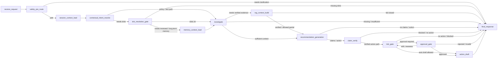

# MOCA — 商家运营智能体

[English](README.md) | **简体中文**

> 一个强调安全边界、审计能力与可验证工作流的开源 AI Agent 参考实现。
>
> **范围说明：** MOCA 使用模拟商家运营场景和合成数据，不将其描述为真实商用上线系统。

文档入口：[docs/README.md](docs/README.md)。

## 产品定位

MOCA 是一个面向电商 / 本地生活商家售后运营场景的 AI Agent 工作流产品，用于辅助客服和运营人员处理退款进度查询、规则咨询、补偿建议、高风险动作审批和处理过程复盘。

MOCA 不是普通聊天机器人，它围绕以下产品边界设计：

- **业务事实：** 订单、退款、工单、物流和商家风险。
- **政策证据：** RAG 检索、引用校验和经过验证的证据上下文。
- **风险与审批：** 高风险动作提案必须通过审批。
- **动作草稿：** 不执行真实退款、付款或发券操作。
- **过程追溯：** 每次运行都保留可审计的节点、工具、证据、风险、审批和草稿记录。

## 核心问题

商家售后不是简单问答。一个退款或补偿 case 往往需要同时查询业务系统、阅读平台规则、判断风险、组织面向用户的回复，并在后续争议或复盘时解释当时为什么这样处理。

| 用户 | 痛点 | MOCA 的产品价值 |
| --- | --- | --- |
| 一线客服 | 需要在订单、退款、工单和政策系统之间切换 | 统一业务事实查询、证据检索和回复草拟 |
| 客服主管 | 批准补偿前需要可审查的完整上下文 | 展示风险原因、证据和审批历史 |
| 平台运营 | 需要一致地执行政策并复盘案例 | 提供可追溯工作流和评测产物 |
| 商家支持团队 | 需要统一处理退款、争议和申诉问题 | 降低跨系统沟通成本 |

## 核心演示场景

| 场景 | 示例 | 展示点 |
| --- | --- | --- |
| 查询退款进度 | “订单 ORD-2024-001 的退款进度如何？” | 回答前先读取订单和退款事实 |
| 规则咨询与证据引用 | “平台的退款超时处理规则是什么？” | 检索政策证据并引用来源 |
| 补偿建议 | “客户投诉延迟发货，能不能给补偿？” | 综合业务事实、规则和风险判断 |
| 高风险动作审批 | “直接给这个订单退款并发券。” | 创建审批请求，而不是直接执行动作 |
| 审批恢复与 trace 回放 | 主管批准或拒绝待处理动作 | 恢复工作流并保留完整审计轨迹 |

当前演示指南：[docs/guides/demo.md](docs/guides/demo.md)。

## 项目亮点

- **从聊天到工作流：** 将商家售后对话转化为结构化、可审计的 Agent 运行。
- **有证据的回答：** 规则类回答基于经过检索和验证的证据，而不是模型自由猜测。
- **清晰权威边界：** 分离业务事实、政策证据、记忆、审批权和动作执行权。
- **人审是核心路径：** 高风险动作通过 LangGraph interrupt/resume 和审批 API 处理。
- **评测驱动的产品设计：** 使用 golden cases 评测意图、路由、工具调用、引用、安全和审批路径。
- **工程参考价值：** 展示工作流契约、权威隔离、人审、可回放性与评测门禁的实现方式。

## Agent 工作流

产品层工作流：

```text
用户请求
  -> 安全预判断
  -> 意图识别与槽位判断
  -> 业务事实查询与政策检索
  -> 证据校验
  -> 建议或回复生成
  -> claim 校验
  -> 风险判断
  -> 审批或动作草稿
  -> 最终回复与 trace
```

当前源码 graph 快照：



源码层 graph 说明见 [docs/architecture/agent-workflow.md](docs/architecture/agent-workflow.md)。

## 安全边界

MOCA 的设计目标是让模型辅助理解和生成，但不能静默替代业务事实、政策依据、审批权限或真实执行权。

- LLM 输出不是业务事实。
- 记忆只能作为上下文，不能作为政策证据或审批权限。
- 规则类回答应绑定经过校验的证据。
- 退款、补偿和发券只生成动作草稿。
- 审批决定必须来自可信审批 API，而不是普通聊天文本。
- 租户、角色和商家范围会在 API 与服务边界进行校验。

详见 [docs/architecture/security-approval-and-actions.md](docs/architecture/security-approval-and-actions.md)。

## 评测体系

MOCA 的评测重点不是“回答像不像人”，而是 Agent 是否遵守业务流程和安全边界。

| 指标 | 目标 | 评测路径 |
| --- | ---: | --- |
| RAG Hit@5 | ≥ 85% | 对 `evaluation/golden/rag_cases.jsonl` 运行 `scripts/eval_rag.py` |
| 意图与路由准确率 | ≥ 90% | `scripts/eval_agent.py` deterministic mode |
| 工具选择准确率 | ≥ 85% | 检查 graph 运行是否包含预期业务工具 |
| 引用率 | ≥ 85% | 检查证据文档键和回复 grounding |
| 安全关键用例通过率 | 100% | 审批、权限拒绝、驳回和无证据场景 |

评测详情：[docs/quality/evaluation.md](docs/quality/evaluation.md)。

## 项目文档

- [文档入口](docs/README.md)
- [10 分钟演示指南](docs/guides/demo.md)
- [评测方法](docs/quality/evaluation.md)
- [安全、审批与动作边界](docs/architecture/security-approval-and-actions.md)
- [当前 Agent 工作流](docs/architecture/agent-workflow.md)

## 当前状态

- **v2.1 核心子系统强化已交付：** ToolPlatform、意图识别、记忆、RAG / claim 路由、审批和 canonical graph 边界已经完成强化。
- **v2.2 正在进行：** 处理直接回复、澄清质量、业务指标查询、前端 timeline 打磨和 UX 回归用例等产品体验问题。
- **运行时 graph：** 最终为 15 节点 canonical workflow。
- **动作边界：** 只生成模拟动作草稿，不执行真实付款、退款、发券或外部履约操作。

## 快速运行

前置条件：Docker Compose、Python 3.12、`uv`，以及前端 Node 工具链。

```bash
cp .env.example .env
docker compose up --build
make migrate
make seed
```

API 文档：

```text
http://localhost:8000/docs
```

前端页面：

```text
http://localhost:3000
```

演示脚本：

```bash
bash scripts/demo_phase6.sh
```

常用本地命令：

```bash
UV_CACHE_DIR=/tmp/uv-cache uv run pytest tests/ -q --tb=short
uv run ruff check src/ tests/
uv run python scripts/eval_agent.py
uv run python scripts/eval_all.py
```

所有演示账号的密码都是 `moca2024`：

| 用户名 | 角色 | 典型用途 |
| --- | --- | --- |
| `cs_zhang` | 一线客服 | 提交 Agent 问题 |
| `mgr_li` | 主管 | 审核审批请求 |
| `admin_user` | 管理员 | 执行管理员级 API 检查 |
| `merchant_wang` | 商家 | 检查商家范围访问控制 |

## 技术栈

- 后端：Python 3.12、FastAPI、SQLAlchemy 和 Alembic。
- Agent 运行时：LangGraph 和 Pydantic structured outputs。
- 数据：PostgreSQL 和 pgvector。
- 检索：混合政策检索、embedding 和证据校验。
- 前端：React、Vite 和 Server-Sent Events。
- 评测：deterministic FakeLLM mode、golden sets 和本地报告。
- 运行时说明：Redis 当前有意不纳入运行时。只有在发现可量化瓶颈后，才会考虑将其用作非权威 TTL 缓存、限流器、短锁、SSE buffer 或带 PostgreSQL fallback 的 active-run hint。

## 仓库结构

```text
src/
├── agent/          # LangGraph 节点、路由、状态和 trace helper
├── api/            # FastAPI 路由、认证依赖和 SSE endpoint
├── auth/           # JWT、OAuth2 scope 和角色检查
├── business/       # 业务事实服务和 adapter
├── knowledge/      # 政策检索、证据和 claim 校验
├── memory/         # Session context、CWC 和偏好 / case memory 边界
├── tools/          # ToolPlatform、catalog、runtime、policy 和 validation
├── actions/        # 模拟动作草稿和动作边界
└── db/             # SQLAlchemy model、migration 和 session

frontend/           # React + Vite 控制台
evaluation/         # Golden sets 和评测报告
scripts/            # Seed、demo、评测和工具 CLI
rules/              # 风险规则
docs/               # 精简维护的 CURRENT、NORMATIVE 与 GUIDE 文档
tests/              # 单元、集成、Agent、审批、trace 和 API 测试
```

## 当前限制

- 所有业务数据都是合成数据。
- 这是模拟商家运营场景，不是真实平台上线系统。
- 所有写动作都是模拟动作草稿。
- Live LLM 评测属于可选本地验证；默认 deterministic 测试避免依赖外部模型。
- 数据库集成测试和 live provider 检查属于本地验证，不作为轻量 CI 的默认项。

## 一句话总结

MOCA 展示的是：如何围绕真实业务场景，设计一个有证据、有权限、有审批、有评测、有复盘能力的 AI Agent 产品，而不是只做一个能聊天的模型 demo。
