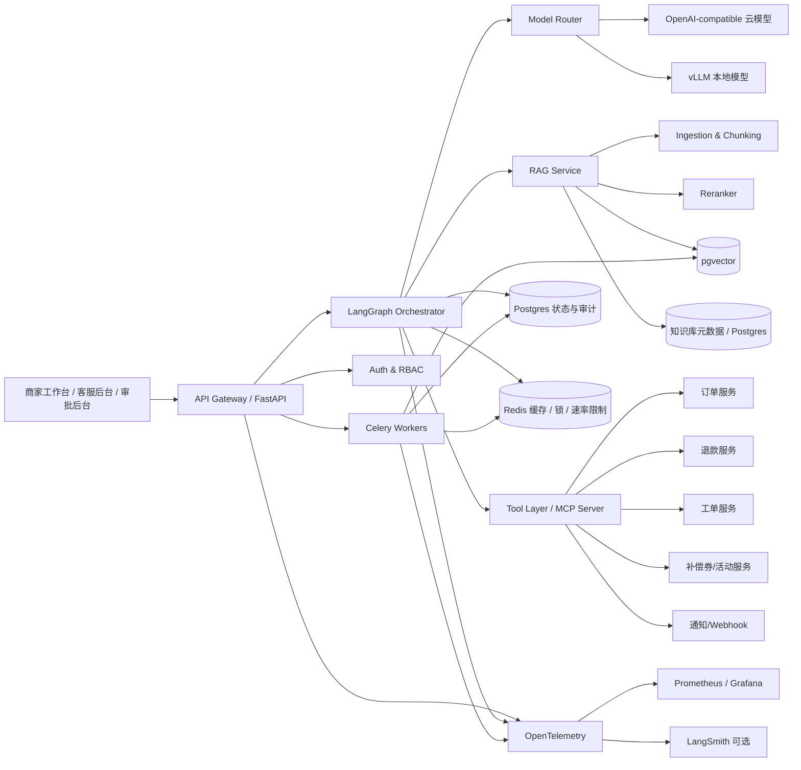
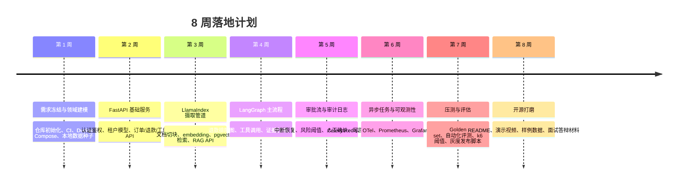

# 面向互联网大厂岗位的企业级 Agent 开源项目设计报告

## 执行摘要

这份方案只聚焦**互联网产品场景**，不走园区、工业控制、重资产设备运维那条线。最推荐你落地成开源项目的主线，是一个面向电商/本地生活平台的 **“商家运营与售后协同 Agent”**：它同时覆盖知识问答、订单排障、退款处理、优惠补偿、人工审批、审计追踪、可观测性与部署运维，能非常直接地证明你不是只会“接模型做聊天”，而是能把 Agent 嵌进真实业务系统、状态机、权限体系和线上工程链路里。作为第二场景，可以保留一个轻量扩展模块：**“内容平台创作者申诉与规则咨询 Agent”**，用于展示你对内容安全、申诉复核、规则引用与人机协同流程的理解。citeturn16view0turn16view1turn16view3turn17view6turn17view7turn17view8

技术上，建议把项目做成“**LangGraph 主编排 + LangChain 辅助集成 + LlamaIndex 做离线摄取/索引 + pgvector 默认向量检索 + FastAPI 服务层 + Postgres/Redis 状态与缓存 + Celery/Redis 异步任务 + Docker Compose 本地复现 + Kubernetes 生产部署 + OpenTelemetry/Prometheus/Grafana 可观测性 + LangSmith 可选增强**”。这样选，不是因为组件越多越好，而是因为这些组件的职责边界清晰：LangGraph擅长长任务、持久化执行与人工介入；LangChain 负责模型/工具封装；LlamaIndex 对 RAG 的加载、索引、存储分层很清楚；pgvector 让“业务数据 + 权限 + 向量检索”能在一个可复现仓库里闭环；FastAPI 自带依赖注入、安全与 OAuth2 scopes，适合做工程化 API。citeturn16view0turn16view1turn16view2turn16view3turn21view0turn16view7turn16view8turn16view9

如果只做 MVP，我建议你把目标压缩为一句话：**“让商家或客服输入一个订单/工单问题，Agent 能拉业务数据、查规则文档、给出带证据的处理建议；一旦涉及退款覆盖、补偿券发放、封禁解除等高风险动作，自动进入审批流，最终所有操作可追踪、可回放、可回滚。”** 这条主线天然覆盖了大厂 JD 里最常出现的关键词：RAG、工具调用、记忆、审批、人机协同、可观测性、安全、部署、评估。citeturn16view0turn16view2turn17view6turn17view7turn19view8turn20view1

## 场景与业务流程

我建议你在仓库里明确写出两个互联网场景，但**只把第一个做深**，第二个作为“同一底座上的扩展模块”。这样既显得思路发散，又不会把精力分散到两个半成品上。

| 场景 | 是否作为主线 | 目标用户 | 为什么适合面试展示 |
|---|---|---|---|
| 商家运营与售后协同 Agent | 是 | 商家运营、平台客服、风险审核、运营主管 | 业务系统集成最丰富，能展示订单/退款/优惠券/工单/知识库/审批/审计的闭环 |
| 创作者申诉与规则咨询 Agent | 作为扩展模块 | 创作者服务、内容审核、申诉复核、法务/安全 | 更强调规则引用、证据链、人机复核与合规设计 |

主线场景建议定义为：**平台商家工作台中的 AI 助手**。典型入口包括订单详情页、退款工单页、商家规则中心和运营后台工单面板。用户不是来“闲聊”的，而是带着明确任务进来：查询异常订单、判断退款是否符合规则、生成补偿方案草稿、解释处罚规则、发起审批、同步站内信/短信/Webhook 通知。这样的入口符合 LangGraph 强调的长流程、状态化与 human-in-the-loop，也符合 LangChain 工具调用与 RAG 在在线系统中的常见用法。citeturn16view0turn16view1turn16view2turn16view3

权限建议至少分成五组，并把它们同时映射到**API scopes、业务权限和数据行级隔离**：

| 角色 | 权限组 | 可读范围 | 可执行动作 | 是否可越权执行高风险动作 |
|---|---|---|---|---|
| 商家运营 | merchant_user | 本商家订单、工单、活动、知识库子集 | 查询、生成草稿、提交申请 | 否 |
| 平台客服 | support_agent | 分配给自己的商家/工单 | 查询、答复、发起补偿建议 | 否 |
| 风险审核员 | risk_reviewer | 风险工单、处罚规则、申诉证据 | 审批/驳回、要求补充材料 | 是 |
| 运营主管 | ops_manager | 全团队业务看板 | 审批高额度补偿、覆写部分规则 | 是 |
| 系统管理员 | admin | 全局 | 配置工具、策略、模型、索引、租户 | 是 |

这里建议把**API 层用 FastAPI OAuth2 scopes** 实现粗粒度控制，再把**租户/商家/工单级的数据权限下沉到 Postgres Row-Level Security**。FastAPI 官方文档明确支持 OAuth2 与 scopes；PostgreSQL 官方文档则说明 RLS 可以按用户限制哪些行可被查询、修改，并在无策略时走默认拒绝。对面试官来说，这会比“我在代码里 if/else 判断权限”更成熟。citeturn16view8turn16view9turn19view8

主线业务流程建议固定为下面这一条，因为它能把绝大多数工程能力都串起来：

**退款异常处理流程**：
商家或客服在订单/工单页发起提问 → Agent 先读取订单、退款单、物流轨迹、历史会话与规则知识库 → 生成任务计划 → 若只需解释规则，则直接给出带证据答案；若需要执行补偿、退款覆盖或状态回写，则生成执行草稿并进入审批节点 → 审批通过后调用业务工具 → 写审计日志 → 通过 webhook/站内消息回写结果 → 对话中返回“处理结论 + 证据引用 + 已执行动作 + 可回滚动作”。LangGraph 的 durable execution 与 human-in-the-loop 非常适合把“审批前中断—审批后恢复”建成显式状态流，而不是藏在业务代码里。citeturn16view0turn17view6turn17view7

你需要在 README 里提前声明成功指标，避免项目看起来像 demo。建议首批指标设成：

| 指标 | MVP 建议值 | 扩展版建议值 |
|---|---|---|
| 任务完成率 | ≥ 75% | ≥ 85% |
| 工具调用成功率 | ≥ 95% | ≥ 98% |
| 检索命中率 Hit@5 | ≥ 80% | ≥ 88% |
| 证据引用准确率 | ≥ 85% | ≥ 92% |
| 平均首字响应延迟 | ≤ 1.5s | ≤ 1.0s |
| 端到端处理时延 | 读操作 ≤ 3s；审批流按 SLA 统计 | 读操作 ≤ 2s |
| 人工接管率 | 知识问答 ≤ 30%；执行类 ≤ 60% | 知识问答 ≤ 20%；执行类 ≤ 45% |

这些阈值不是法规要求，而是工程上**可测、可答辩、可迭代**的目标。后续压测与 CI 里可以直接把它们写成阈值断言。k6 官方文档明确支持把性能目标写成 pass/fail thresholds；Prometheus 官方文档也建议优先围绕用户可见的高延迟和错误率告警。citeturn18view9turn18view4

## 功能清单与交互用例

建议你把功能拆成“**默认单图多节点**”而不是一上来就做复杂多 Agent。只有当任务跨越规则判断、数据归因、执行决策三个明显不同的子目标时，才启用多 Agent 协作。LangChain 文档说明其 agent 实现本身就是基于 LangGraph 图运行时；因此你完全可以把“单 Agent + 多节点状态流”作为默认解，再把多 Agent 做成可选模式。citeturn16view1turn16view0

| 功能 | 交互流程 | 示例 API |
|---|---|---|
| Agent 编排 | 用户提交任务 → Graph 识别意图 → 路由到 Q&A / 排障 / 执行 / 审批 | `POST /api/v1/agent/runs` |
| RAG 检索 | 查询改写 → 元数据过滤 → dense+sparse 混检 → rerank → 证据拼装 | `POST /api/v1/rag/search` |
| 工具调用 | 订单、退款、工单、优惠券、通知等工具按 schema 暴露给模型 | `POST /api/v1/tools/orders/get` |
| 记忆机制 | 会话短期摘要 + 商家长期画像 + 工单上下文 | `PUT /api/v1/memory/sessions/{id}` |
| MCP | 把内部工具与资源标准化暴露为 MCP Server，便于多客户端接入 | `POST /mcp` |
| 多 Agent 协作 | Planner 生成计划 → Retriever 找证据 → Executor 产出执行草稿 | `POST /api/v1/agent/runs?mode=multi` |
| 审批流 | 高风险动作生成 approval request → 人工批准/驳回 → 恢复图执行 | `POST /api/v1/approvals` |
| 审计日志 | 记录输入、证据、模型版本、工具参数、审批结果、回滚链路 | `GET /api/v1/audit-logs?run_id=...` |

上面这张表不是“功能大杂烩”，而是一条完整闭环：LangChain tools 用来标准化外部动作，MCP 用来把 tools/resources 进一步协议化，LangGraph 负责状态机与中断恢复，RAG 负责证据，审批与审计负责风险控制。citeturn16view0turn16view2turn17view6turn17view7turn17view8

下面给出三段最值得放进仓库的 API 示例。它们不需要太多，但一定要“像真系统”。

```http
POST /api/v1/agent/runs
Content-Type: application/json
Authorization: Bearer <token>

{
  "tenant_id": "merchant_demo",
  "user_id": "support_1024",
  "scene": "refund_triage",
  "input": {
    "order_id": "ORD_202605080001",
    "question": "这个退款单为什么卡住？我能不能给 20 元补偿券？"
  },
  "options": {
    "mode": "single_graph",
    "require_citations": true
  }
}
```

```json
{
  "run_id": "run_8f4c",
  "status": "waiting_approval",
  "summary": "订单已签收，规则允许退款解释但 20 元补偿券超过客服权限阈值，已生成审批单。",
  "evidence": [
    {"doc_id": "kb_refund_rule_12", "chunk_id": "c_44"},
    {"tool": "get_order", "record_id": "ORD_202605080001"},
    {"tool": "get_refund_case", "record_id": "RF_9981"}
  ],
  "approval_request_id": "apr_2219"
}
```

```http
POST /api/v1/approvals/apr_2219/approve
Content-Type: application/json
Authorization: Bearer <manager-token>

{
  "comment": "允许一次性补偿，不改退款主单结论",
  "risk_level": "medium"
}
```

```http
POST /mcp
Content-Type: application/json

{
  "jsonrpc": "2.0",
  "id": "1",
  "method": "tools/list"
}
```

这些接口风格的重点，不是语法，而是**接口语义**：一切高风险动作都要经过“生成草稿—审批—恢复执行—审计记录”四段式；一切回答都要有 evidence；一切工具都要 schema 化，便于模型调用和前端回放。FastAPI、MCP 与 LangChain/LangGraph 的官方文档都支持这种“强结构化 + 明确权限边界”的做法。citeturn16view7turn16view8turn16view9turn16view2turn17view7turn17view8

## 技术架构与组件选型

### 系统架构图



这张图对应的是“在线请求 + 异步任务 + 状态化编排 + 工具执行 + RAG + 可观测性”的典型企业级互联网 Agent 形态。LangGraph 强调 durable execution、human-in-the-loop、memory；FastAPI 适合做依赖注入、安全与 API 文档；vLLM 可用 OpenAI-compatible server 对接本地模型；OTel 用 traces/metrics/logs 做统一埋点；Prometheus 用 histogram 和用户可见错误告警；Kubernetes 用 Deployment、探针与 HPA 承接生产发布。citeturn16view0turn16view7turn17view5turn18view1turn18view2turn18view3turn18view4turn17view0turn17view1turn17view2

### 默认选型与替代方案

| 组件 | 默认选型 | 替代方案 | 为什么这样选 |
|---|---|---|---|
| 后端服务 | FastAPI | Django Ninja、Go + gRPC/BFF | 依赖注入、安全、OpenAPI、异步接口都成熟，适合 Python Agent 栈 |
| Agent 编排 | LangGraph | Dify Workflow、n8n、CrewAI | 最能体现状态机、审批中断恢复、长任务执行和工程控制力 |
| Agent 辅助封装 | LangChain | 纯自研封装 | 用于 model/tool 抽象与快速组装，但不把主状态机藏起来 |
| RAG | LlamaIndex 做摄取/索引；在线检索链路自研 | 纯 LangChain Retrieval、全自研 ingestion | 离线摄取快，在线链路可控，方便做混检、重排、评估 |
| 向量数据库 | pgvector | Milvus、Weaviate | 最适合一仓库复现与交易/权限数据同库协同 |
| 主数据库 | PostgreSQL | MySQL + 向量库分离 | 事务、RLS、逻辑复制、JSON 结构都适合业务系统 |
| 缓存/锁/限流 | Redis | KeyDB、Dragonfly | 生态成熟 |
| 异步任务 | Celery + Redis | Redis Streams、Kafka | MVP 实现成本最低；后续可上 Kafka 做事件总线 |
| 模型接入 | OpenAI-compatible + vLLM 本地选项 | 纯云 API、TGI/llama.cpp | 同一 SDK 兼容云上与本地 |
| 监控 | OTel + Prometheus + Grafana | 纯 LangSmith、SaaS APM | 默认尽量 OSS，LangSmith 作为可选增强 |
| 安全 | OAuth2 scopes + OIDC/JWT + 审批流 + RLS | 自定义 token | 面试时更容易讲清楚权限边界 |
| 部署 | Docker Compose 本地；K8s 生产 | 纯 VM/systemd | 本地复现和生产路径一致性更好 |

这个选型表背后的核心判断是：**你的项目要优先展示“工程判断力”而不是组件炫技**。FastAPI 官方文档明确强调依赖注入与 OAuth2/scopes；LangGraph 文档强调 durable execution、human-in-the-loop、memory；LangChain agent 文档说明其 runtime 建在 LangGraph 之上；LlamaIndex 文档把 RAG 分成 loading/indexing/storing 等阶段；Kubernetes 文档则说明 Deployment 的 RollingUpdate、探针与 HPA。这些合在一起，构成了一个非常自然的“大厂岗位向”技术故事。citeturn16view7turn16view8turn16view9turn16view0turn16view1turn16view3turn17view0turn17view1turn17view2

### 向量数据库对比

| 对比维度 | pgvector | Milvus | Weaviate |
|---|---|---|---|
| 部署复杂度 | 最低；直接挂在 Postgres 体系内 | 中；独立向量数据库 | 中；独立 AI 数据库 |
| 检索索引 | HNSW、IVFFlat，可调 recall/speed | 面向大规模向量检索 | 向量检索 + BM25 hybrid |
| 混合检索 | 需要自己在 SQL/应用层组合 | dense+sparse 可在同集合存储并重排 | 原生 hybrid，将 vector 与 BM25 并行融合 |
| 权限与认证 | 复用 Postgres 权限/RLS | 文档提供认证、TLS、RBAC | API key / OIDC / RBAC |
| 与业务数据耦合 | 最强 | 中 | 中 |
| 本项目适配度 | **最高** | 规模扩大后的优先迁移路径 | 更偏“开箱即用 AI 数据库” |

选择 `pgvector` 作为默认值，不是因为它在所有规模都最强，而是因为这个项目的第一目标是：**让面试官一键跑起来，并看到你如何把向量检索和业务事务、权限、审计结合起来**。pgvector 官方文档明确提供 HNSW/IVFFlat；PostgreSQL 官方文档提供 RLS 与逻辑复制；Milvus 和 Weaviate 则各自更适合在 corpus/QPS 再上一个量级时扩展为独立检索层。citeturn21view0turn16view5turn19view8turn19view9turn16view4turn16view6turn19view5turn19view6turn19view7

### Agent 框架对比

| 对比维度 | LangGraph | LangChain Agents | Dify |
|---|---|---|---|
| 控制粒度 | 最高，图级节点与状态可控 | 中，适合快速搭代理 | 可视化强，代码控制相对弱 |
| 长流程/中断恢复 | 强 | 中到强，底层依赖 LangGraph | 适合标准流程，但复杂状态机不如代码图灵活 |
| Human-in-the-loop | 原生强项 | 可做，但推荐下沉到 LangGraph | 可做审批式流程，但细节控制不如代码 |
| 多 Agent | 适合严肃拆分与编排 | 适合快速原型 | 适合搭平台演示 |
| 面试展示价值 | **最高** | 高 | 中高，偏平台产品思维 |

LangGraph 官方文档把 durable execution、human-in-the-loop、memory 作为核心能力；LangChain 文档说明 `create_agent` 本身就是 graph runtime；Dify 文档强调其是 visual workflow/agent 平台，knowledge 与 agent 都很容易集成。我的建议是：**主仓库必须用 LangGraph；如果你有余力，再额外做一个 Dify/n8n demo 作为“平台化补充”**。citeturn16view0turn16view1turn19view0turn19view1turn19view2turn19view3turn19view4

需要明确标注“未指定/开放选项”的部分有：**前端框架、对象存储、云厂商、身份提供商、具体基础模型**。建议开放写法如下：前端未指定，推荐 React/Next.js；对象存储未指定，推荐 MinIO/S3 兼容接口；身份提供商未指定，开放 OIDC；基础模型未指定，开放接入任意 OpenAI-compatible 云端模型或本地 vLLM 服务。vLLM 官方文档明确说明其 Completions / Chat / Responses API 与 OpenAI 兼容，可直接复用官方 OpenAI Python 客户端。citeturn17view5

## 数据方案与迭代计划

### 数据来源与模拟方案

要让项目看起来像“企业级互联网系统”，数据不能只是一堆 PDF。建议你同时准备四类数据：

**业务数据库**
至少包含这些表：`tenants`、`users`、`roles`、`merchants`、`orders`、`refund_cases`、`tickets`、`campaigns`、`coupon_grants`、`approval_requests`、`approval_steps`、`agent_runs`、`agent_steps`、`audit_logs`、`llm_usage_events`。其中 `orders/refund_cases/tickets` 是在线工具的主读表；`approval_*`、`agent_*`、`audit_logs` 是流程核心；`llm_usage_events` 用于成本追踪。若要做租户隔离，`tenant_id` 必须出现在所有业务主表里，并通过 Postgres RLS 控制访问。citeturn19view8

**文档知识库**
建议初始放 50–100 份中短文档，不追求量大，追求“结构真实”。包括：退款规则、发券权限 SOP、客服话术、平台处罚规则、活动配置说明、商家帮助中心 FAQ、风控复核标准、Webhook 对接文档。LlamaIndex 文档对 RAG 的 loading/indexing/storing 划分非常适合这种设计：文档摄取层负责解析与切块，在线层只关心检索与引用。citeturn16view3

**用户行为日志**
建议模拟 `page_view`、`button_click`、`search_query`、`tool_invocation`、`approval_action`、`webhook_event` 六类事件。每条日志最少包含 `event_id、tenant_id、user_id、session_id、trace_id、ts、payload`。如果后续你想演示“Agent 记住该商家经常碰到哪些问题”“某类客服对某类策略的二次解释率更高”，这些日志会非常有用。Redis Streams 官方文档把 stream 描述为 append-only log，并支持 consumer groups，很适合扮演轻量事件流水。citeturn17view9

**API 与 Webhook**
至少要模拟以下端点：
`GET /orders/{id}`、`GET /refunds/{id}`、`GET /tickets/{id}`、`POST /coupon-grants/draft`、`POST /coupon-grants/commit`、`POST /approvals`、`POST /notifications/send`、`POST /webhooks/order-status-changed`。
如果想让项目更像互联网系统，可以再加两个“异步回写” webhook：`refund.status.updated` 和 `approval.completed`。这样 Agent 的执行结果不只是返回到聊天框，还会真实改变系统状态并触发二次回调。

### 向量化、Embedding 与脱敏

我建议把知识库向量化分成离线两段：

第一段是**解析与切块**：按文档类型做 parser，例如“规则文档按标题层级切块”“FAQ 按问答对切块”“SOP 按步骤切块”。每个 chunk 存 `doc_id、section_id、title_path、text、tags、effective_date、audience_scope、risk_level`。第二段是**检索构建**：默认用 dense embedding 做语义召回，再补一个简易 sparse/BM25 路径用于规则编号、金额、SKU、活动 ID 这类精确词。LlamaIndex 文档明确指出，RAG 的关键阶段包括 loading、indexing、storing；Milvus 与 Weaviate 文档都强调 hybrid search 对“语义 + 关键词”检索更稳健，因此即便你默认选 pgvector，也应该在应用层保留 hybrid 接口。citeturn16view3turn16view4turn16view6

合规方面要把“**训练/测试数据不是随便伪造**”写清楚。中国《个人信息保护法》要求个人信息处理遵循合法、正当、必要和诚信原则，并且限于最小范围；《生成式人工智能服务管理暂行办法》要求提供者保护用户输入与使用记录，不得收集非必要个人信息，不得非法留存可识别身份的输入或使用记录，同时要提升生成内容的准确性和可靠性。基于这个要求，项目中的模拟数据必须默认做**假名化/匿名化**：姓名、手机号、地址、银行卡号、证件号全部使用不可逆占位符；若要保留统计相关性，用 hash 或映射表，但映射表不进入公开仓库。citeturn10search8turn20view1turn9search2turn9search5

### 迭代时间线



这条时间线对应的 MVP 截点，我建议放在**第 4 周末**：那时系统应至少完成“一个场景、一条图、一套证据检索、三到五个工具、可运行 API”。第 5–8 周的内容，才是把它从“可跑”升级成“可答辩”的关键。Docker Compose 文档说明它适合用一个 YAML 管全栈本地服务，而 Kubernetes 文档提供了生产侧滚动更新、探针与 HPA 的路径，所以这条“本地到生产”的演进是自然的。citeturn17view4turn17view3turn17view0turn17view1turn17view2

下面给一个更适合放到 README/Projects 的迭代表：

| 周次 | 目标 | 交付物 | 验收标准 |
|---|---|---|---|
| 第 1 周 | 定义领域与仓库骨架 | ER 图、接口草案、Compose 文件、基础 CI | `docker compose up` 可启动核心依赖 |
| 第 2 周 | 做出可调 API | FastAPI、鉴权、租户/角色、模拟数据生成器 | Swagger 可调，权限校验通过 |
| 第 3 周 | 打通 RAG | 文档入库、切块、检索 API、引用返回 | 指定问题能返回正确 chunk |
| 第 4 周 | 跑通主流程 | LangGraph 图、订单/退款工具、对话入口 | 单次任务可得到带证据答案 |
| 第 5 周 | 加上安全闭环 | 审批流、审计日志、回滚接口 | 高风险动作不能绕过审批 |
| 第 6 周 | 上可观测性 | Trace、metrics、logs、token/cost 统计 | 能按 run_id 回放一次执行链 |
| 第 7 周 | 做评估与压测 | Golden set、k6、阈值、告警规则 | CI 内可自动判定 pass/fail |
| 第 8 周 | 开源展示 | README、视频脚本、FAQ、Demo 账户 | 面试时 10 分钟之内可完整演示 |

## 性能、稳定性与安全合规

### 高并发与稳定性设计

并发层面不要把所有逻辑都塞进一次 HTTP 请求里。建议分成三类：

**同步短链路**：知识问答、规则解释、订单状态查询，目标是 p95 控制在 2–3 秒内。
**异步长链路**：文档摄取、批量评估、Webhook 回放、对账、重建向量索引。
**中断恢复链路**：审批等待、人工补证、风控复核，这类链路天生适合 LangGraph 的 durable execution。citeturn16view0turn18view0

异步执行建议默认用 **Celery + Redis**。Celery 官方文档明确提到：如果任务是幂等的，可以使用 `acks_late` 在任务返回后确认消息；同时它也提醒在进程被杀、OOM 或高频失败时要注意重复执行与消息风暴风险。所以在你的项目里，所有会改变业务状态的任务必须带 **idempotency key**，并依赖 Postgres 唯一约束或状态表防重。对于更像事件流水的场景，例如订单状态变更、审批通过后的多消费者广播，可把 Redis Streams 当轻量事件总线；当吞吐和回放需求显著增大时，再切 Kafka。Redis Streams 官方文档说明它是 append-only log，并支持 consumer groups；Kafka 官方文档则把自己定义为 event streaming platform。citeturn18view0turn17view9turn15search0turn15search2

部署与发布策略建议分两层写：
本地开发用 Docker Compose；生产环境用 Kubernetes。Docker Compose 文档说明其适用于开发、测试、CI；`depends_on + healthchecks` 可控制启动顺序。Kubernetes 文档则说明 Deployment 默认支持 RollingUpdate，可用 `maxUnavailable` 与 `maxSurge` 控制节奏，探针负责存活/就绪检查，HPA 负责按指标扩缩容。基于这些能力，建议你的灰度方案是：**新版本双 Deployment 并存，先给内部租户或测试商家放量，再逐步扩租户比例；出现问题时回滚到上一 ReplicaSet。**citeturn17view3turn17view4turn17view0turn17view1turn17view2

建议的压测与稳定性阈值可以直接写成 k6 阈值：

- 只读问答：`p95 < 2.5s`，错误率 `< 1%`
- 带一个工具调用：`p95 < 3.5s`，错误率 `< 2%`
- 审批流首响应：`p95 < 1.2s`
- RAG 检索层：`p95 < 150ms`
- 队列等待时间：`p95 < 500ms`
- 工具执行幂等失败率：`< 0.5%`

k6 官方文档明确把 thresholds 作为 pass/fail 标准，并支持把 SLO 写进测试脚本；Prometheus 官方文档则建议优先监控用户可见延迟和失败率，而不是在底层每个组件都乱报。citeturn18view9turn18view4

### 安全、审批与审计设计

安全控制建议做成四层：

**第一层：身份认证**
开放选项为 JWT/OIDC，未指定具体身份提供商。FastAPI 官方文档支持 OAuth2 与 scopes；Weaviate 与很多向量系统也把 API key/OIDC 作为常见认证方式，你可以据此在 README 中明确“公共 API 仅允许 OIDC/JWT，开发环境可用 demo token”。citeturn16view8turn16view9turn19view7

**第二层：授权与数据隔离**
API 层用 scopes 控粗粒度，比如 `ticket.read`、`refund.propose`、`compensation.approve`；数据层用 Postgres RLS 做租户/商家隔离。这样即使工具实现写错，也不至于把其他租户的数据读出来。Postgres 官方文档明确说明启用 RLS 后，若没有策略则默认拒绝。citeturn16view9turn19view8

**第三层：审批与人机确认**
把高风险动作统一分级：
低风险：纯查询、话术生成、规则解释；
中风险：创建草稿、发起申请、建议补偿；
高风险：直接退款覆盖、发放大额补偿券、解除处罚、修改关键状态。
其中中高风险动作都要走审批。LangGraph 的 human-in-the-loop 能在图执行中检查、修改状态并恢复执行，所以审批节点不要写成“外围 if/else”，而要让它成为图中的正式节点。citeturn16view0

**第四层：审计与回滚**
每次运行至少记录八样东西：`run_id、tenant_id、user_id、model、prompt_version、evidence_set、tool_calls、approval_chain`。对可回滚动作，必须记录“补偿动作”定义，例如 `revoke_coupon`、`reopen_ticket`；对不可回滚动作，必须实行 dry-run 预览 + 双重确认。对于审计日志的设计，建议采用“业务日志 + Agent 日志分表，统一 trace_id 关联”的方式；OpenTelemetry 的 context propagation 可以把 traces、metrics、logs 相关联，方便追踪一次请求跨越 API、Worker、模型、数据库的完整路径。citeturn18view2turn18view1

合规说明必须出现在仓库首页。应明确写明：
这个项目的公开示例数据是**模拟数据**；
默认不保存真实用户输入，或仅保存经过脱敏和访问控制的最小必要信息；
若把项目用于真实公众服务，需要结合《个人信息保护法》《数据安全法》《网络安全法》和《生成式人工智能服务管理暂行办法》进一步做数据分级、留存规则、内容治理和必要备案/登记。中国网信办的暂行办法已经明确要求保护输入信息与使用记录、提升内容准确性可靠性，并在特定场景下进行安全评估与相关备案手续。citeturn20view1turn10search8turn9search2turn9search5

## 评估体系与开源展示

### 评估与监控指标

评估必须拆成三层，否则很容易出现“答案看起来还行，但不知道问题出在哪”的情况。

**RAG 层指标**：`Hit@5`、`MRR@10`、`nDCG@10`、证据引用准确率、检索延迟。
**Agent 层指标**：任务成功率、工具调用成功率、审批命中率、计划偏差率、人工接管率、平均步骤数。
**系统层指标**：p50/p95/p99 延迟、队列等待、超时率、token 成本/请求、错误率、回滚率。

OTel 官方文档把 traces、metrics、logs 作为统一 telemetry 信号；Prometheus 文档建议用 histogram 记录延迟分布；LangSmith 则可以提供 agent trace 与 evaluation 的更高层视图。因此默认实现建议是：**OTel + Prometheus/Grafana 为基础，LangSmith 作为可选增强，而不是强依赖。**citeturn18view1turn18view2turn18view3turn18view5turn18view6

自动化评估的实现方式建议非常务实：
准备一个 `eval/golden_set.yaml`，每个样本包含 `query、expected_docs、expected_tools、approval_expected、expected_outcome`；
CI 每晚跑一次离线评测；
输出三种产物：Markdown 报告、JSON 指标、trace 链接。
如果你想再上一个台阶，可以增加“故障注入样本”，比如工具超时、权限不足、知识库缺页、审批驳回，验证 Agent 是否能优雅降级。LangSmith 官方文档支持 observability 与 evaluation；k6 文档则适合把性能阈值一起纳入 CI。citeturn18view6turn18view5turn18view9turn18view7turn18view8

### GitHub 仓库结构建议

```text
commerce-ops-agent/
├── apps/
│   ├── api/                    # FastAPI 服务
│   ├── web/                    # 商家/客服前端（未指定，可选）
│   └── admin/                  # 审批与运维后台（可选）
├── agent/
│   ├── graphs/                 # LangGraph 定义
│   ├── nodes/                  # planner/retriever/executor/approval
│   ├── memory/
│   ├── policies/
│   └── prompts/
├── rag/
│   ├── ingestion/              # LlamaIndex 摄取
│   ├── chunking/
│   ├── retrieval/
│   ├── rerank/
│   └── eval/
├── tools/
│   ├── order_tool/
│   ├── refund_tool/
│   ├── ticket_tool/
│   ├── coupon_tool/
│   └── notification_tool/
├── mcp/
│   ├── server/
│   ├── tools/
│   └── resources/
├── workers/
│   ├── celery_app.py
│   ├── jobs/
│   └── webhooks/
├── infra/
│   ├── compose/
│   ├── k8s/
│   ├── grafana/
│   ├── prometheus/
│   └── otel/
├── scripts/
│   ├── seed_demo_data.py
│   ├── load_kb.py
│   ├── replay_webhooks.py
│   └── generate_eval_report.py
├── tests/
│   ├── unit/
│   ├── integration/
│   ├── contract/
│   └── performance/
├── eval/
│   ├── golden_set.yaml
│   └── reports/
├── .github/workflows/
│   ├── ci.yml
│   ├── docker.yml
│   └── nightly-eval.yml
├── README.md
├── LICENSE
└── Makefile
```

这个结构的重点，是把“Agent 逻辑、RAG、业务工具、基础设施、评估、演示数据”明确分开。GitHub Actions 文档支持 Python 构建测试与 Docker 镜像发布，因此你的 CI/CD 最少应该做到：`lint + pytest + contract test + seed data smoke test + image build`，发布分支再执行镜像推送。citeturn18view7turn18view8

### README 模板、演示视频与面试展示

README 建议按这个顺序组织：

1. 项目一句话介绍
2. 目标岗位映射
3. 场景与用户角色
4. 系统架构图
5. 快速开始
6. 示例数据与 Demo 账号
7. 核心流程演示
8. 评估指标与当前结果
9. 安全与合规说明
10. Roadmap
11. FAQ
12. 参考资料与官方文档链接

如果你要在 README 里放“官方参考”，建议直接给出这些跳转：urlLangGraph 官方文档turn0search4、urlLangChain Agents 文档turn0search13、urlLlamaIndex RAG 文档turn0search2、urlFastAPI 中文文档turn3search0、urlKubernetes 中文文档turn4search0、urlDocker Compose 文档turn13search12、urlMCP 规范turn7search2。这些链接全部来自官方文档或官方维护页面。citeturn0search4turn0search13turn0search2turn3search0turn4search0turn13search12turn7search2

演示视频建议控制在 5–7 分钟，脚本如下：

**第一段：业务问题进入**
打开商家/客服后台，输入订单号和问题：“这单为什么退款被卡住？能否发 20 元补偿券？”

**第二段：Agent 执行过程**
展示 Agent trace：读订单工具、读退款工具、查规则知识库、输出带证据结论。

**第三段：审批中断与恢复**
因为补偿超权限，系统生成审批单；切换到审批后台，主管点击批准；回到 trace 展示图恢复执行。

**第四段：结果回写**
展示补偿券创建成功、工单状态更新、审计日志写入、Webhook 已送达。

**第五段：工程能力展示**
打开 Grafana/trace 页面，展示 p95 延迟、token 成本、工具成功率与一次完整 run 的上下游链路。

这个脚本能在很短时间里同时讲清楚产品价值、工程链路、安全边界和线上可运维性。citeturn16view0turn18view1turn18view5turn18view9

面试答辩时，最常见的四个问题，你可以提前准备成仓库 FAQ：

- **为什么不用纯 Dify / 纯 n8n？**
  因为这个项目的核心卖点是状态机、审批中断恢复、可测试性与代码级控制；Dify/n8n 更适合作为平台补充，而不是唯一主线。citeturn19view0turn19view3turn19view4turn16view0
- **为什么默认选 pgvector，不选 Milvus？**
  因为面试项目优先强调一键复现、事务耦合、权限与业务状态闭环；Milvus 是更高规模阶段的自然迁移路径。citeturn21view0turn16view4turn19view8
- **为什么不是一个聊天机器人？**
  因为系统要服务业务流程，必须能查系统、走审批、执行动作、写审计并可恢复。citeturn16view2turn16view0turn17view7
- **如何证明它可上线？**
  因为它有权限模型、审批阈值、审计日志、压测阈值、CI 自动评估、回滚策略和可观测性。citeturn16view9turn19view8turn18view1turn18view4turn18view9

## 风险与替代方案

这个项目最大的风险不是“不会写代码”，而是**做得太大、太散、太像实验室玩具**。我建议你在仓库里坦白写出主要风险和缓解措施。

**模型偏差与错误执行**
风险在于模型会引用错规则、误判退款条件，甚至错误调用工具。缓解方式是：默认所有执行类动作都必须经过 schema 化工具层；高风险动作必须审批；回答必须带证据；如果证据不足，系统优先降级为“仅生成建议，不执行”。《生成式人工智能服务管理暂行办法》也明确提出应提升生成内容的准确性和可靠性，并对违法内容和违法使用采取处置。citeturn16view2turn17view7turn20view1

**数据泄露与越权访问**
风险在于跨租户取数、日志残留敏感信息、把真实输入直接送入评估集。缓解方式是：OIDC/JWT + scopes、Postgres RLS、最小化字段脱敏、默认不保存原文输入、审计日志与业务日志分离。个人信息保护法强调最小必要原则，FastAPI 与 Postgres 都提供了支撑这些控制的基础能力。citeturn10search8turn16view9turn19view8

**成本过高**
风险在于每次任务都多轮推理、检索和工具调用，导致成本失控。缓解方式是：把简单问答与复杂执行分流；先做 query classification；缓存规则检索结果；对长历史做摘要；用本地 vLLM 替代部分云模型请求；把 token/cost 作为一等指标展示在 dashboard。vLLM 的 OpenAI-compatible server 很适合做“同接口、双后端”切换。citeturn17view5turn18view1turn18view5

**系统复杂度失控**
风险在于你一开始就做多 Agent、Kafka、Milvus、复杂前端，结果八周后没有一个流程打透。缓解方式是：
先做单图多节点；
先做一个场景；
先选 pgvector；
先把审批、审计、证据和可观测性做完；
只有在主链路稳定后，再引入第二场景、Kafka、独立向量库或可视化工作流平台。LangGraph、Kubernetes、Prometheus 这些组件本身都不反对复杂系统，但它们真正价值在于**控制复杂度**，不是制造复杂度。citeturn16view0turn17view0turn18view4

**开放问题与边界**
目前仍属于“未指定/开放选项”的有：前端框架、身份提供商、具体基础模型、对象存储、是否上独立消息总线、是否引入 LangSmith 作为默认依赖。这些并不影响项目成立，但你应在 README 中明确：**仓库默认关注 API、Agent、RAG、审批与评估，不强制绑定某一家云厂商或模型供应商。** 这种边界写得越清楚，项目越像真正的大厂工程，而不是“为了堆概念而堆概念”。