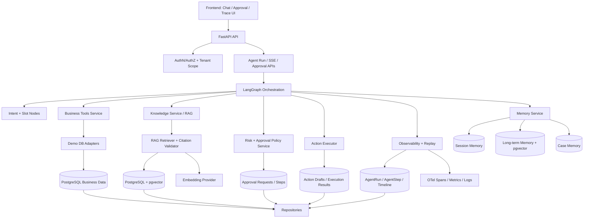
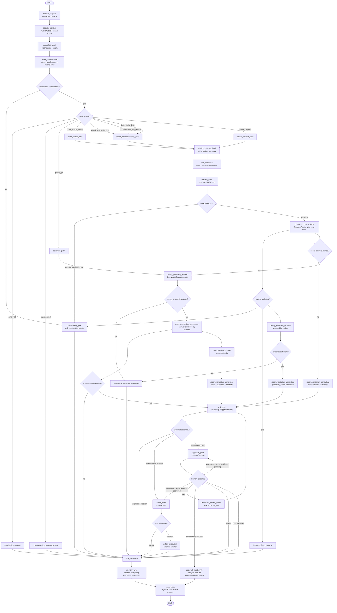
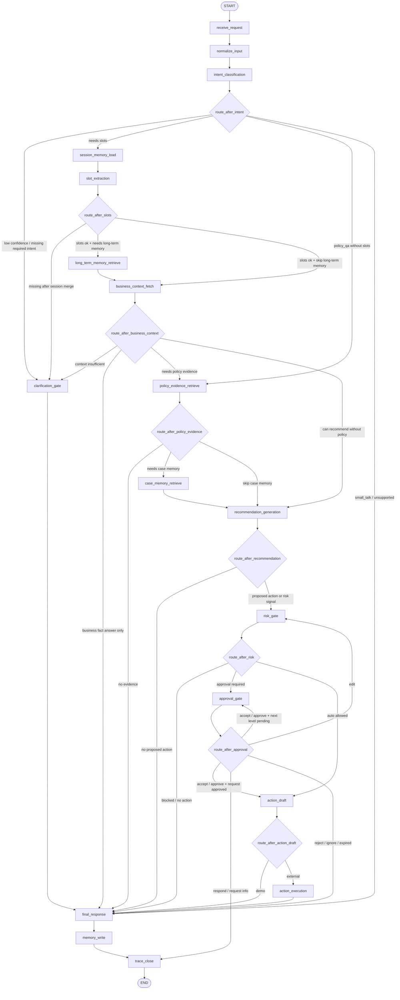

# MOCA Agent 架构 Spec

> 状态：实现规划基线 spec。本文定义目标架构/contract，不表示目标已实现，也不要求立即实现代码。
>
> 依据来源：当前 MOCA 仓库代码与文档、`docs/agent-architecture-reference-draft.md`、本地参考仓库代码级检查。
>
> 重要边界：本文不会把参考仓库能力写成 MOCA 已实现；不会把目标架构写成当前事实；不会建议照抄参考仓库目录、代码或业务假设。

---

## 1. Title 和目标说明

MOCA 的目标架构是：面向商家运营与售后协同的企业级 Agent 原型。

它不是通用聊天机器人，也不是只为演示 LangGraph 的 demo。目标是把当前“能跑的 LangGraph Agent demo”升级为架构边界清晰、可解释、可扩展、可评估的商家售后 Agent：围绕订单/退款/工单事实、政策证据、处理建议、高风险审批、动作草稿、审计追踪和可回放 timeline 展开。

核心架构判断来自 `docs/agent-architecture-reference-draft.md`：

- LangGraph 只负责状态机编排、节点调度、条件路由、interrupt/resume。
- Knowledge / RAG、Business Tools、Memory、Approvals / SLA / Policy、Actions / Executor / Compensation、Observability / Replay 都应是独立能力层。
- 当前可以继续单 FastAPI app、单 Python 进程、单 repo，但代码边界要向 service contract 靠拢，未来可替换真实系统 API 或拆服务。
- Prompt 不能替代代码层控制。审批、工具权限、租户隔离、动作执行、记忆写入必须由代码和数据 contract 约束。

---

## 2. Scope / Non-goals

### Scope

本文覆盖：

- 当前 MOCA 架构事实。
- 参考仓库代码级分析和可借鉴性判断。
- 目标分层架构。
- LangGraph workflow、AgentState 目标 schema、intent classification、tool calling、memory、prompt、approval/SLA/risk policy、action execution、observability/replay、数据模型建议。
- 分阶段迁移路线和测试/eval 计划。

### Non-goals

本文不做以下事情：

- 不修改 `src/` 代码。
- 不更换 MOCA 技术栈。
- 不把 MOCA 拆成微服务。
- 不接真实支付、退款、优惠券、封禁、物流或商家系统 API。
- 不照抄参考仓库目录、代码、prompt 或业务假设。
- 不把自由 ReAct 作为默认执行模型。
- 不让 LLM 直接执行高风险写动作。

---

## 3. 设计依据矩阵

| 设计主题 | 当前 MOCA 依据 | 参考仓库依据 | 是否采用 | 采用方式 | 不采用内容 |
| --- | --- | --- | --- | --- | --- |
| LangGraph workflow | `src/agent/graph.py` 已有 10 节点 workflow：`receive_request`、`classify_intent`、`extract_slots`、`load_business_context`、`retrieve_policy_evidence`、`generate_recommendation`、`assess_risk_and_approval`、`approval_gate`、`execute_action`、`final_response`。 | `memory-agent/src/memory_agent/graph.py` 展示 tool call 条件分支；`agents-from-scratch-ts/src/email_assistant.ts` 展示 triage -> subgraph；`Human-in-the-Loop-Workflow-LangGraph/src/graph.py` 展示 Command 路由。 | 采用 | 保留 MOCA 主 workflow，增加目标节点：memory load/retrieve/write、clarification、action draft/executor、trace close。 | 不采用完全自由循环 agent，也不把参考仓库 email/news workflow 搬入 MOCA。 |
| Intent classification | `src/agent/schemas.py` 当前 intent 只有 `policy_qa`、`refund_troubleshooting`、`compensation_suggestion`、`approval_request`、`unknown`；`src/agent/nodes/classify_intent.py` 用 structured output。 | `agents-from-scratch-ts/src/email_assistant.ts` triage 把 email 分成 ignore/respond/notify，用于路由。 | 部分采用 | 扩展 MOCA intent taxonomy，并引入 confidence threshold、clarification path、routing hints。 | 不采用 email 领域的 ignore/respond/notify 作为业务 intent。 |
| Tool calling | `src/agent/nodes/load_business_context.py` 直接调用 read tools；`src/agent/nodes/retrieve_policy_evidence.py` 直接调用 `search_policy`；`src/agent/tools/registry.py` 已有 typed registry 和 caller allowlist，但主流程未完全通过 registry/service。 | `memory-agent/src/memory_agent/tools.py` 使用 InjectedToolArg；`agents-from-scratch-ts/src/tools/base.ts` 有中央 tool registry；`agent-inbox` 和 HITL examples 在工具执行前中断。 | 采用 | 采用 graph-controlled tool calling + node-level allowlist + service facade。 | 不采用模型自由选择任意工具并直接写业务系统。 |
| Memory read/write | 当前 `AgentState` 有 checkpointer thread、`active_slots`、`last_intent`、`evidence_refs`、`last_business_context_refs`，README 明确 cross-session long-term memory out of scope。 | `memory-agent/src/memory_agent/graph.py` 读取最近 memory 注入 prompt；`langgraph-memory/memory_service/graph.py` 有 delayed extraction、patch/insert 双路径、schema fan-out；`agents-from-scratch-ts/src/email_assistant_hitl_memory.ts` 根据 HITL feedback 更新 memory。 | 采用 | 区分 working/session/long-term/case memory；先实现 session memory，长期和 case memory 作为独立服务目标。 | 不采用自由 ReAct 写长期记忆；不采用 Pinecone/Fireworks 默认栈；不把历史 case 当政策。 |
| Human-in-the-loop approval | `src/agent/nodes/approval_gate.py` 已有 LangGraph `interrupt`；`src/api/routers/approvals.py` 支持 approve/reject resume；`ApprovalRequest`、`ApprovalStep` 已持久化。 | `agent-inbox/README.md` 定义 HumanInterrupt/HumanResponse schema，支持 accept/edit/respond/ignore；`agent-inbox-langgraph-example/src/agent/graph.py` 有 Python 最小示例；`Human-in-the-Loop-Workflow-LangGraph/src/nodes/human_review_node.py` 支持编辑内容后 approve。 | 采用 | 把 MOCA 审批从 approve/reject 扩展到 accept/edit/reject/respond/ignore，并支持多级审批和 SLA。 | 不采用通用 inbox UI 的全部部署假设；不采用布鲁斯天空发布业务。 |
| Action execution | `src/agent/nodes/execute_action.py` 当前创建 durable action draft；`src/agent/tools/create_coupon_grant_draft.py` 写 `ActionDraft`，有 idempotency key；README 明确无真实支付/退款/券执行。 | `Human-in-the-Loop-Workflow-LangGraph/src/tools.py` 在 publish 前再次 interrupt；`agent-inbox` 支持 edit/accept action args。 | 采用 | 目标为 ActionExecutor facade，demo adapter 仍创建 draft，但 contract 包含 execution result、idempotency、rollback/compensation metadata。 | 不采用在 tool 内直接发布/执行外部动作；真实动作前双确认只作为未来高风险场景。 |
| RAG / Knowledge | `src/rag/retriever.py` 使用 DashScope embedding、pgvector、hybrid rerank、threshold/no-evidence；`src/rag/citation_validator.py` 做 deterministic citation validation；`search_policy` 仍位于 `src/agent/tools`。 | `docs/agent-architecture-reference-draft.md` 要求 Knowledge / RAG 是独立能力层。 | 采用 | 增加 KnowledgeService facade，Agent 节点只看 evidence contract，不直接接触 embedding/repo/pgvector。 | 不采用把 RAG 当 Agent 内部普通 tool 的长期形态。 |
| Observability / Replay | `src/agent/trace.py`、`src/repositories/trace_repo.py`、`src/api/routers/traces.py` 已有 AgentRun/AgentStep、approval/action timeline；`src/api/main.py` 有 request trace_id。 | `fastapi-observability/fastapi_app/main.py`、`utils.py`、`docker-compose.yaml` 展示 FastAPI metrics、OTLP、Tempo、Loki、Prometheus、Grafana 和日志 trace 关联。 | 采用 | 先做 in-process spans/metrics/log correlation，再考虑完整 Grafana stack。 | 不直接搬三 app compose 和 Loki logging driver 到 MOCA。 |
| Prompt organization | 当前 `src/agent/prompts.py` 单文件存 intent、slots、recommendation、risk、final prompts。 | `agents-from-scratch-ts/src/prompts.ts` 按 triage/agent/HITL/memory prompt 拆分；参考草稿要求按节点拆。 | 采用 | 拆成 `src/agent/prompts/intent.py`、`slots.py`、`recommendation.py`、`final_response.py`，memory prompt 放 `src/memory/prompts.py`。 | 不采用超长单 system prompt；不让 prompt 替代 policy/approval/tool 控制。 |
| Service boundary | 当前 repo 有 `src/repositories`、`src/rag`、`src/agent/tools`，但 graph nodes 仍直接依赖 tools/repositories 间接实现。 | `full-stack-fastapi-template/backend/app/api/deps.py`、`core/config.py`、`tests/conftest.py` 展示工程组织、依赖注入、settings、tests；参考草稿强调 in-process service modules。 | 采用 | 在单 app 内新增 service facade：knowledge、business_tools、memory、approvals、actions、observability。 | 不换 SQLAlchemy 为 SQLModel；不照搬模板业务模型或用户 CRUD。 |

---

## 4. 当前 MOCA 架构事实

### 4.1 已实现

当前 MOCA 已实现以下能力：

- FastAPI API 层：`src/api/routers/agent.py` 提供同步 chat；`src/api/routers/agent_runs.py` 提供 run 创建、SSE streaming 和 evidence 查询；`src/api/routers/approvals.py` 提供审批决策；`src/api/routers/traces.py` 提供 run trace。
- LangGraph workflow：`src/agent/graph.py` 定义 10 个节点和两个条件路由函数。
- AgentState：`src/agent/state.py` 区分 persistent memory 与 ephemeral context，包含 thread/user/tenant/role、active slots、last intent、evidence refs、business context、risk、approval、action、trace 等字段。
- Intent / slots / recommendation / risk structured output：`src/agent/schemas.py` 和 `src/agent/nodes/*.py` 使用 Pydantic schema 约束 LLM 输出。
- RAG：`src/rag/retriever.py` 使用 DashScope embedding、pgvector 检索、hybrid rerank、threshold gate；`src/rag/citation_validator.py` 做 citation deterministic validation。
- Business read tools：`get_order`、`get_refund_case`、`get_ticket` 读取 tenant-scoped 本地 demo DB，并对 merchant role 做访问控制。
- Approval interrupt/resume：`approval_gate` 使用 LangGraph `interrupt`；审批 API 用 `Command(resume=...)` 恢复 graph。
- Action draft：`execute_action` 创建 action draft，`ActionDraftRepository.create_or_get` 用 idempotency key 防重复。
- Trace / replay：`AgentRun`、`AgentStep`、`ApprovalRequest`、`ApprovalStep`、`ActionDraft` 持久化；`TraceRepository.build_timeline` 组合 agent step、approval、action draft timeline。
- 测试覆盖：graph happy path/no-evidence/cross-turn reset、routing、approval gate、approval integration、execute_action、trace persistence、tool contract、RAG/eval 等测试已存在。

### 4.2 部分实现

当前 MOCA 部分实现但边界仍不完整：

- Tool contract：`src/agent/tools/contracts.py` 和 `registry.py` 已有 typed registry、risk metadata、caller allowlist，但主 graph nodes 仍直接调用具体 tool 函数，没有统一走 BusinessToolService / KnowledgeService。
- Memory：`AgentState` 和 checkpointer 已支持同 thread 的 active slots、last intent、evidence refs；README 明确 cross-session long-term memory out of scope。尚未有独立 `src/memory` service、长期记忆、case memory、memory write policy。
- Approval：已有 approve/reject、过期处理、自审批限制、resume、审批 step 记录；尚未有 policy-driven multi-level approval、SLA escalation、accept/edit/respond/ignore。
- Observability：已有 DB trace 和 API request trace_id；尚未有 OpenTelemetry spans、Prometheus metrics、LLM token/cost 完整记录、RAG/tool/action 细粒度 metrics。
- Actions：已有 action draft 和幂等；尚未有 ActionExecutor contract、demo adapter/external adapter 分离、compensation/rollback metadata。
- Prompt：已有 `src/agent/prompts.py` 单文件；尚未按节点和能力层拆分。

### 4.3 未实现

当前仓库中没有找到以下已实现依据：

- 独立 KnowledgeService facade。
- 独立 BusinessToolService facade。
- 独立 MemoryService、Long-term Memory、Case Memory。
- 多级审批 policy 和 SLA escalation engine。
- accept/edit/respond/ignore 审批响应模型。
- 真实外部 action executor。
- compensation / rollback 执行记录。
- OpenTelemetry graph node spans / tool spans / LLM spans。
- 可重新执行 LLM 的 replay。当前是审计 timeline replay，不是 deterministic rerun。

### 4.4 Current-vs-target evidence

| Capability | Current evidence | Current limitation | Target contract | Migration phase |
| --- | --- | --- | --- | --- |
| AgentState lifecycle | `src/agent/state.py` 定义字段约定；`receive_request` 主动 reset 部分 ephemeral 字段。 | 当前不是 schema-level enforcement；writer、scope、reset/merge 规则未被统一验证。 | 第 10.1 节 lifecycle matrix；trusted fields 不可被 LLM 覆盖；router/state property tests。 | AAM-P4 |
| Slot routing | 当前 graph 有 intent、slot extraction 和跨 turn active slots。 | session memory load/slot merge 尚未形成统一目标顺序；`A or B` required slot 无结构化表达。 | `intent -> session_memory_load -> slot_extraction -> resolve_slots -> route_after_slots`；`RequiredSlotExpression`。 | AAM-P4, AAM-P6 |
| Approval | 已有 interrupt/resume、approve/reject、审批持久化。 | 无 request/level/assignment version CAS、multi-level 聚合和 exact revision execution guard。 | 第 15 节 versioned approval state machine 和 optimistic locking。 | AAM-P7 |
| Action | 已有 durable `ActionDraft` 和 idempotency key。 | demo/external outcome contract 未完全分离；无 external executor/reconciliation。 | demo 只写 draft + `draft_outcome`；external 原子校验后执行。 | AAM-P8, AAM-P11 |
| Replay | 已有 AgentRun/AgentStep 和组合 timeline。 | 事件枚举和 lifecycle coverage 不完整；不是统一 V3 event store。 | ReplayEventV3、稳定 sequence、完整 lifecycle enum 和 retention。 | AAM-P9 |

---

## 5. 参考仓库分析结论

| 仓库 | 已检查文件 | 实际实现模式 | 可借鉴点 | 不适合 MOCA 的点 | 是否纳入最终 spec | 纳入方式 |
| --- | --- | --- | --- | --- | --- | --- |
| `langgraph` | `examples/customer-support/customer-support.ipynb`；并搜索 `docs/`、`libs/` 中 customer support 相关实现 | 指定 notebook 当前只有迁移说明：“This file has been moved”，没有 state/routing/tool/HITL 代码。本地 repo 未找到同名 customer support 实现。 | 只能确认：指定文件不能作为代码级模式依据。LangGraph repo README/docs 可作为 StateGraph、interrupt、checkpoint 基础背景，但不是本次 customer-support 代码依据。 | 不能编造 customer support graph 的 state、routing、tool/handoff 细节；不能把已迁移占位文件当实现。 | 不纳入 customer-support 代码级模式 | 在 spec 中明确排除：指定文件未提供代码级参考。 |
| `memory-agent` | `src/memory_agent/graph.py`、`tools.py`、`prompts.py`、`state.py` | ReAct-style memory agent：从 store namespace `("memories", user_id)` 搜索最近 memory，注入 system prompt；LLM bind `upsert_memory` tool；有 tool_calls 则路由 `store_memory`，再回到 `call_model`。`user_id` 和 `store` 用 InjectedToolArg 隐藏。 | memory read/write 作为 graph 节点；namespace 隔离；安全上下文由系统注入；tool call -> dedicated node -> audit/store -> route back。 | 自由 ReAct 写长期记忆不适合 MOCA；scope 只有 user，不足以表达 tenant/merchant/thread/case；无 TTL/source/confidence/review。 | 纳入 | 只借鉴 memory node、namespace、安全注入和 tool-call 条件分支。 |
| `langgraph-memory` | `memory_service/graph.py`、`_schemas.py` | 独立 memory service：`schedule` 延迟抽取；`scatter_schemas` 按 schema fan-out；patch memory 先 fetch existing state，再抽 JSON patch/upsert；semantic memory 抽取 embeddable event 后 insert。 | patch 型适合 user/merchant profile；insert 型适合 case/event memory；memory extraction 可异步/延迟；schema fan-out 支持多记忆类型。 | 默认 Pinecone/Fireworks，不适合直接迁移；抽取所有聊天可能带来隐私/成本风险；不能把 memory 当 policy。 | 纳入 | 采用 patch/insert 概念，存储优先 Postgres + pgvector。 |
| `agents-from-scratch-ts` | `src/email_assistant.ts`、`email_assistant_hitl.ts`、`email_assistant_hitl_memory.ts`、`schemas.ts`、`tools/base.ts`、`tools/default/memory-tools.ts`、`prompts.ts` | TS LangGraph email assistant：triage_router 分类 ignore/respond/notify；response_agent subgraph 通过 ToolNode 或 interrupt_handler 执行工具；HITL 支持 accept/edit/response/ignore；memory 版本按 namespace 读取/更新偏好。 | triage 先分类再路由；response subgraph；工具 registry；HITL 每次处理一个 tool call；基于人工反馈更新 memory。 | email domain 不适合 MOCA；示例里有 `toolChoice: required` 和自由工具循环，不适合高风险售后动作；memory 更新偏好过于个人助理化。 | 部分纳入 | 借鉴 triage/subgraph/HITL response handling/memory feedback 模式，不迁移代码和业务 prompt。 |
| `agent-inbox` | `README.md`、`src/components/agent-inbox/types.ts`、`hooks/use-interrupted-actions.tsx`、`components/interrupt-details-view.tsx` | 前端 inbox 和 LangGraph interrupted threads 管理。核心 schema：HumanInterrupt 包含 `action_request`、`config`、`description`；HumanResponse 类型为 `accept`、`ignore`、`response`、`edit`。UI 根据 config 决定可用动作，并把 response 发送回 graph。 | MOCA 审批流应从 approve/reject 扩到 accept/edit/respond/ignore；description 可用 markdown 解释风险、证据和建议动作；edit 可修改 proposed action args。 | 这是 LangGraph deployment UI，不应直接替换 MOCA frontend/API；不应照搬 local storage/deployment config。 | 纳入 | 采用 schema 概念映射到 MOCA approval API 和 UI。 |
| `agent-inbox-langgraph-example` | `src/agent/graph.py`、`state.py`、README | Python 最小示例：构造 HumanInterruptConfig，`interrupt([request])[0]`，按 response type 写回 state。 | Python 端 accept/edit/respond/ignore 的最小实现方式。 | 示例是 joke，不含权限、审批、SLA、action risk。 | 补充纳入 | 作为 MOCA interrupt payload schema 的 Python 参考。 |
| `Human-in-the-Loop-Workflow-LangGraph` | `src/graph.py`、`state.py`、`nodes/human_review_node.py`、`nodes/content_generation_node.py`、`prompts.py`、`tools.py` | 搜索 -> 内容生成 -> human review -> approve/reject；review node 可接受编辑字符串并自动 approve；`publish_post` tool 内在发布前再次 interrupt 确认。 | two-stage interrupt：草稿 review 和执行前 confirm；Command(goto=...) 路由；编辑后继续 approve。 | 新闻/Bluesky 发布业务不适合；tool 内直接 publish 外部服务不适合当前 MOCA；OpenAI/Tavily 栈不迁移。 | 部分纳入 | 借鉴二阶段审批/确认控制流，未来用于真实高风险动作。 |
| `full-stack-fastapi-template` | `backend/app/main.py`、`api/main.py`、`api/deps.py`、`core/config.py`、`core/db.py`、`models.py`、`tests/conftest.py`、Dockerfile、pyproject | FastAPI 工程模板：settings、CORS、router aggregation、JWT dependencies、DB session deps、Alembic、Docker、tests fixture、lint/type config。 | API deps/settings/tests/Docker/CI 组织可参考；安全依赖注入清晰。 | 使用 SQLModel，同 MOCA 当前 SQLAlchemy 不一致；业务是 users/items，不指导 Agent 架构。 | 部分纳入 | 只借鉴工程组织和测试结构，不换 ORM/模型。 |
| `fastapi-observability` | `fastapi_app/main.py`、`utils.py`、`docker-compose.yaml`、`etc/prometheus/prometheus.yml`、`etc/grafana/datasource.yml`、`etc/tempo/tempo.yml` | FastAPI metrics middleware；OpenTelemetry FastAPI instrumentation；OTLP -> Tempo；Prometheus scrape `/metrics`；Grafana datasource 关联 Prometheus/Tempo/Loki；日志带 trace_id/span_id。 | MOCA 应对 API、graph node、tool call、RAG、LLM、approval、action 建 spans/metrics/log correlation；metrics exemplar 关联 trace。 | 不直接搬多 app compose、Loki docker logging driver；不把部署栈作为 AAM-P1。 | 纳入 | 先定义观测 contract，后续逐步接 OTel/Grafana。 |

---

## 6. 目标架构总览

MOCA 目标架构：一个 FastAPI app 内的分层 Agent 系统。

当前阶段不拆微服务，但内部必须按能力层组织：

- API / Frontend：负责认证、会话、审批 UI、trace UI、SSE。
- LangGraph Agent Orchestration：只做状态流转、节点编排、条件路由、interrupt/resume。
- Knowledge / RAG：负责政策知识、检索、证据、citation validation。
- Business Tools：负责订单、退款、工单、物流、商家风险等业务事实读取，当前通过本地 demo DB adapter。
- Memory：负责 working/session/long-term/case memory 的读写策略和存储。
- Approvals / SLA / Policy：负责风险规则、审批策略、多级审批、SLA、升级。
- Actions / Executor / Compensation：负责 action draft、demo adapter、idempotency、execution result、compensation metadata。
- Observability / Replay：负责 spans、metrics、logs、AgentRun/AgentStep、timeline replay。
- Persistence：负责 SQLAlchemy models、repositories、Postgres/pgvector、migrations。

---

## 7. 架构图

### 7.1 V1 分层能力图

这张图表达的是 MOCA 的目标能力边界，不表达每个 Agent run 的节点顺序。`AuthN/AuthZ + Tenant Scope` 是横切安全上下文：API 在进入 Agent、tools、approval、trace 前先确认用户身份、OAuth2 scope、role、tenant_id 和 merchant scope，并把这些字段注入后续 `AgentState`、tool context、repository query 和 checkpoint thread。



### 7.2 V2 细粒度流程路由图

这张图表达目标 graph 的流程分支、intent routing、gate 和 service 调用关系。它不是严格的 `StateGraph.add_node(...)` 节点图，因为里面混合了节点、条件 router、path label 和 service 调用说明。当前 `src/agent/graph.py` 仍是较线性的 10 节点主链。V2 设计的目标是：先按 intent 做粗路由，再按是否需要业务事实、政策证据、记忆、审批和动作执行决定是否进入对应节点。

第 7 节图仅是 illustrative view。第 9.4 节 node contract table 和第 9.5 节 router contract table 是 normative source；图中不得引入与其冲突的 edge。

图中的 `security_context` 是 trusted context injection / API-auth boundary；`resolve_slots`、`revalidate_edited_action` 是 deterministic helper；`*_path` 是 path label；`small_talk_response`、`unsupported_or_manual_review`、`business_fact_response`、`insufficient_evidence_response` 是由 `final_response.response_type` 表达的 response mode。它们均不是额外注册的 LangGraph node。

严格的 LangGraph node-only 图见下一节 `7.3 V2 严格 LangGraph 节点图`。

设计来源：

- 当前 MOCA：保留 `receive_request -> classify/extract/context/RAG/recommend/risk/approval/action/final` 的可运行主干。
- `agents-from-scratch-ts`：借鉴 triage router 先分类再进入 response subgraph 的模式。
- `agent-inbox` / `agent-inbox-langgraph-example`：借鉴 interrupt payload 和 accept/edit/respond/ignore 分支。
- `memory-agent` / `langgraph-memory`：借鉴 memory read/write 作为独立节点，并把长期记忆写入放到后置策略控制。
- `Human-in-the-Loop-Workflow-LangGraph`：借鉴 review 后 approve/reject/edit 分支，以及真实高风险执行前可二次确认的思想。



### 7.3 V2 严格 LangGraph 节点图

这张图只展示建议在目标实现中通过 `StateGraph.add_node(...)` 注册的 LangGraph 节点。菱形 router 不是节点，而是 `add_conditional_edges(...)` 使用的路由函数。KnowledgeService、BusinessToolService、MemoryService、ApprovalPolicy、ActionExecutor、Observability 也不是 LangGraph 节点，而是节点内部调用的分层 service。

目标 V2 建议注册 **18 个 LangGraph 节点**：

1. `receive_request`
2. `normalize_input`
3. `intent_classification`
4. `clarification_gate`
5. `slot_extraction`
6. `session_memory_load`
7. `long_term_memory_retrieve`
8. `business_context_fetch`
9. `policy_evidence_retrieve`
10. `case_memory_retrieve`
11. `recommendation_generation`
12. `risk_gate`
13. `approval_gate`
14. `action_draft`
15. `action_execution`
16. `final_response`
17. `memory_write`
18. `trace_close`

这份 node list 是概念能力清单，不表示执行顺序；实际顺序由 intent-specific path 和 deterministic routers 决定。

`security_context` 不建议作为独立 LangGraph 节点注册。它应由 API/auth dependency 和 graph input/config 注入，作为 `ToolCallContext`、`AgentState` 和 checkpoint thread scope 的一部分。如果后续要把 tenant/role/scope 校验放入 graph，也可以新增 `security_context` 节点，但那会把目标节点数从 18 增加到 19。



#### 节点与 service 边界

| LangGraph 节点 | 节点职责 | 调用的 service / contract |
| --- | --- | --- |
| `receive_request` | 初始化 run、thread、ephemeral state、trace step | Run context / trace helper |
| `normalize_input` | 清洗 query、语言/渠道标准化 | 无或 InputNormalizer |
| `intent_classification` | 输出 primary_intent、requested_operation、confidence、routing hints | LLM structured output / IntentPrompt |
| `clarification_gate` | 生成澄清问题或缺失信息说明 | Clarification policy / Final response template |
| `slot_extraction` | 提取订单、退款、工单、金额、商家等 slots | LLM structured output / SlotPrompt |
| `session_memory_load` | 读取同 thread active slots、summary、unresolved questions | MemoryService session read |
| `long_term_memory_retrieve` | 读取稳定偏好或商家长期模式 | MemoryService long-term search |
| `business_context_fetch` | 拉取订单/退款/工单/物流/商家风险事实 | BusinessToolService read tools |
| `policy_evidence_retrieve` | 检索政策/SOP 证据并做 no-evidence gate | KnowledgeService / RAG / citation validator |
| `case_memory_retrieve` | 检索历史类似 case，作为 precedent | MemoryService case search |
| `recommendation_generation` | 生成处理建议和 proposed_action candidate | LLM structured output / RecommendationPrompt |
| `risk_gate` | 评估风险、审批需求、动作是否可自动草稿 | RiskPolicy + ApprovalPolicy |
| `approval_gate` | 创建 interrupt，等待 accept/edit/respond/reject/ignore | ApprovalService / LangGraph interrupt |
| `action_draft` | 持久化动作草稿；demo mode 同时写非执行 outcome | ActionExecutor.create_draft |
| `action_execution` | 仅 external adapter 执行 | ActionExecutor.execute |
| `final_response` | 生成面向用户的最终回复 | Deterministic template or FinalResponsePrompt |
| `memory_write` | 写 session memory，生成 long-term/case candidates | MemoryService write policy |
| `trace_close` | 关闭 run，补全 timeline、metrics、audit | Observability / Replay service |

#### Router 函数不计入节点数

Canonical router 函数包括：

- `route_after_intent`
- `route_after_slots`
- `route_after_business_context`
- `route_after_policy_evidence`
- `route_after_recommendation`
- `route_after_risk`
- `route_after_approval`
- `route_after_action_draft`

这些函数只读取 `AgentState` 并返回下一个 node key，不应调用 LLM、tools、repositories 或外部 API。

### 7.4 V2 读法和可回退边界

- V1 分层能力图用于说明模块边界。
- V2 节点路由图用于说明一个 Agent run 如何按 intent 和风险条件流转。
- 第 7 节图是 illustrative；第 9.5/9.6 节 contract table 是 normative source，任何实现和 review 冲突均以第 9 节为准。
- V2 是目标设计，不要求一次性实现全部节点。
- 若需要回退第二版，只删除 `7.2 V2 细粒度流程路由图`、`7.3 V2 严格 LangGraph 节点图`、`7.4 V2 读法和可回退边界`，以及第 9 节中的 V2 routing 表，不影响 V1 spec 主体。

---

## 8. 模块分层设计

### 8.1 API / Frontend

当前依据：`src/api/routers/agent.py`、`agent_runs.py`、`approvals.py`、`traces.py`、README。

目标职责：

- 接收 chat/run 请求，创建或执行 AgentRun。
- 提供 SSE node-level progress。
- 提供 approval list/detail/decision API。
- 提供 trace timeline/replay API。
- 统一处理 auth、OAuth2 scopes、tenant/user/role 注入。
- 前端展示 chat、evidence、approval、action draft、timeline。

边界：

- API 层不做 Agent 推理。
- API 层不直接执行 action。
- API 层可以调用 ApprovalService/RunService，但不直接拼装复杂 graph state。

### 8.2 LangGraph Agent Orchestration

当前依据：`src/agent/graph.py` 和 `src/agent/nodes/*`。

目标职责：

- 定义节点顺序和条件路由。
- 维护 `AgentState`。
- 调用 service contract。
- 管理 interrupt/resume。
- 收集 node outputs 和 trace events。

边界：

- 不直接访问 repository、pgvector、embedding、SQL 查询。
- 不直接执行真实写动作。
- 不把 Memory/Knowledge/Business Tools 的内部实现塞进节点。

### 8.3 Knowledge / RAG

当前依据：`src/rag/retriever.py`、`schemas.py`、`citation_validator.py`、`ingestion.py`、`search_policy.py`。

目标职责：

- `PolicyKnowledgeService.search(request: KnowledgeSearchRequest, context: ToolCallContext) -> KnowledgeSearchResult`。
- 管理 query rewrite、embedding、hybrid rerank、threshold、no-evidence fallback。
- 管理 EvidenceRef、claim/evidence binding 和 citation validation。
- 对 Agent 只暴露 evidence contract，不暴露 pgvector/repo 细节。

Knowledge request contract：

```json
{
  "schema_version": "knowledge_search_request.v2",
  "query": "退款超过承诺时效怎么办",
  "primary_intent": "refund_troubleshooting",
  "business_context_refs": [{"type": "refund_case", "id": "RF-1001"}],
  "filters": {
    "tenant_id": "uuid",
    "merchant_id": "uuid-or-null",
    "policy_types": ["refund", "compensation"],
    "effective_at": "2026-06-05T00:00:00Z",
    "locale": "zh-CN"
  },
  "retrieval_config_version": "retrieval.v3",
  "rerank_config_version": "rerank.v2",
  "max_results": 5,
  "allow_partial_evidence": true
}
```

Knowledge result contract：

```json
{
  "schema_version": "knowledge_search_result.v2",
  "status": "strong_evidence | partial_evidence | no_evidence | error",
  "query_rewrite": "退款超时 补偿 政策",
  "retrieval_config_version": "retrieval.v3",
  "rerank_config_version": "rerank.v2",
  "best_score": 0.82,
  "threshold": 0.72,
  "evidence_refs": [
    {
      "schema_version": "evidence_ref.v1",
      "evidence_id": "policy_refund_timeout/chunk_001@v3",
      "tenant_id": "uuid",
      "doc_key": "policy_refund_timeout",
      "chunk_id": "chunk_001",
      "policy_version": "2026-06-01",
      "text_hash": "sha256:...",
      "score": 0.82,
      "rank": 1,
      "retrieved_at": "2026-06-05T00:00:00.000Z",
      "retrieval_config_version": "retrieval.v3"
    }
  ],
  "citation_validation": {
    "validator_version": "citation_validator.v2",
    "claim_results": []
  },
  "summary": "找到退款超时处理政策。",
  "error": null
}
```

#### Canonical EvidenceRefV1

Knowledge result、AgentState evidence refs、`ActionSafetySnapshot.evidence` 和所有 hashable `evidence_ref.v1` 字段必须使用同一个 canonical `EvidenceRefV1`；不得为 snapshot 或 replay 定义字段较少的变体。

| Field | Type | Rule |
| --- | --- | --- |
| `schema_version` | literal | 固定 `evidence_ref.v1` |
| `tenant_id` | string/uuid | 必填，来自 trusted scope |
| `evidence_id` | string | 必填，稳定 evidence identity |
| `doc_key` / `chunk_id` | string | 必填 |
| `policy_version` | string | 必填 |
| `text_hash` | string | 必填，`sha256:<lowercase hex>` |
| `retrieved_at` | RFC3339 UTC datetime | 必填 |
| `retrieval_config_version` | string | 必填 |
| `score` | number, optional | 仅用于 retrieval/eval，不改变 identity；Knowledge result 可保留，但 snapshot/hash builder 必须剔除 |
| `rank` | integer, optional | retrieval 排名，若存在必须为正整数；可保留并进入 snapshot/hash material |

Snapshot/hash 使用同一 canonical `EvidenceRefV1` schema，但使用其明确的 hash projection：剔除 retrieval/eval-only `score`，保留存在的 `rank`。`EvidenceRefV1[]` 排序优先使用 `rank`；所有元素都有 rank 时按 `(rank, evidence_id, text_hash)`，任一元素缺 rank 时按 `(evidence_id, text_hash)`，不得依赖 retrieval 返回顺序。Knowledge result 和 AgentState 可以保留裸 float `score`，但任何 snapshot/hash builder 都必须先剔除 `score`，不得把裸 float 送入 CanonicalHashProfile v1。

Knowledge rules：

- Tenant-scoped policy wins over global/default policy when both apply; global policy is fallback only.
- `effective_at` must be explicit and defaults to run start time, not wall-clock query time inside the adapter.
- Partial evidence may support explanatory recommendations, but cannot authorize write actions unless risk/action policy explicitly allows partial evidence.
- `no_evidence` for policy-required actions routes to insufficient evidence or manual review, not action draft.
- Citation validation must evolve from chunk membership validation to claim support validation: each material claim maps to one or more `evidence_id` values and a support verdict.
- Retrieval/rerank config versions must be persisted into replay events for audit and later eval comparison.

### 8.4 Business Tools

当前依据：`get_order.py`、`get_refund_case.py`、`get_ticket.py`、`authz.py`、`registry.py`。

目标职责：

- `BusinessToolService.fetch_context(slots, intent, ToolCallContext) -> BusinessContext`。
- 读工具：order/refund/ticket/logistics/merchant risk。
- 当前 adapter：本地 demo DB。
- 未来 adapter：真实订单、工单、退款、物流、商家系统。

边界：

- 只读工具可以自动调用。
- 写工具不能由 business tool read node 执行。
- tenant/user/role/idempotency/trace context 必须由系统注入，不由模型生成。

### 8.5 Memory

当前依据：`AgentState` thread memory；参考 `memory-agent`、`langgraph-memory`。

目标职责：

- Working memory：当前 run/checkpoint state。
- Session memory：同一 thread 的 active slots、last intent、case summary、unresolved questions。
- Long-term memory：跨会话稳定偏好/商家模式，带 scope/source/confidence/TTL/review。
- Case memory：历史类似 case、处理结果、审批结果、outcome。

边界：

- Memory 是辅助上下文，不是政策依据。
- Long-term memory 不应每轮写入。
- Case memory 只能作为 precedent，不能覆盖当前 policy evidence。

### 8.6 Approvals / SLA / Policy

当前依据：`approval_gate.py`、`approvals.py`、`ApprovalRepository`、`rules/risk_rules.yaml`、`ApprovalRequest`/`ApprovalStep`。

目标职责：

- RiskPolicy：判断风险等级和 rule refs。
- ApprovalPolicy：判断是否审批、审批级别、审批角色、SLA。
- SLAService：审批超时、升级、提醒、自动转人工。
- ApprovalService：创建审批、处理 accept/edit/reject/respond/ignore、多级状态流转。

### 8.7 Actions / Executor / Compensation

当前依据：`execute_action.py`、`create_coupon_grant_draft.py`、`ActionDraftRepository`、`ActionDraft`。

目标职责：

- 生成 action draft。
- 校验 approval result。
- 根据 action type 选择 demo adapter 或 future external adapter。
- external mode 写 `ActionExecutionResult`；demo mode 只写 `draft_outcome`。
- 生成 rollback/compensation metadata。

当前只能创建 demo draft：创建草稿，不创建 `ActionExecutionResult`，也不真实发券/退款。

### 8.8 Observability / Replay

当前依据：`trace.py`、`trace_repo.py`、`traces.py`、`fastapi-observability`。

目标职责：

- 每个 graph node 建 span。
- 每次 tool/RAG/LLM/approval/action 建 span 或 event。
- 记录 run_id/thread_id/trace_id/tenant_id/user_id。
- Prometheus metrics：latency、error rate、no-evidence rate、approval interception rate、tool error rate、action draft success rate。
- Timeline replay：基于 persisted events 展示审计回放。

### 8.9 Persistence

当前依据：`src/db/models.py`、`src/repositories/*`。

目标职责：

- SQLAlchemy models。
- Tenant-scoped repositories。
- Postgres business data。
- pgvector policy chunks。
- AgentRun/AgentStep/Approval/Action audit data。
- 后续新增 Memory、ActionExecution、SLA event models。

---

## 9. LangGraph workflow 设计

第 9.4 节 node contract table 和第 9.5 节 router contract table 是目标 workflow 的 normative source。第 7 节图只用于说明，不能定义额外或冲突 edge。

### 9.0 Canonical workflow vocabulary / 规范词汇

- **registered LangGraph node**：通过 `StateGraph.add_node(...)` 注册、可独立产生 node lifecycle event 的执行单元。Canonical node set 仅包含：`receive_request`、`normalize_input`、`intent_classification`、`clarification_gate`、`slot_extraction`、`session_memory_load`、`long_term_memory_retrieve`、`business_context_fetch`、`policy_evidence_retrieve`、`case_memory_retrieve`、`recommendation_generation`、`risk_gate`、`approval_gate`、`action_draft`、`action_execution`、`final_response`、`memory_write`、`trace_close`。
- **router**：由 `add_conditional_edges(...)` 使用的 deterministic、side-effect-free 函数，只返回下一 registered node key。Canonical router set 仅包含：`route_after_intent`、`route_after_slots`、`route_after_business_context`、`route_after_policy_evidence`、`route_after_recommendation`、`route_after_risk`、`route_after_approval`、`route_after_action_draft`。
- **path label**：图和路由表中的分支语义标签，例如 `policy_qa_path`、`action_request_path`、`direct_response`；它不执行、不注册，也不产生 node lifecycle event。
- **response mode**：`final_response.response_type` 的枚举值，用于选择安全模板或回复策略。`small_talk_response`、`unsupported_or_manual_review`、`business_fact_response`、`insufficient_evidence_response`、`direct_response` 均不是注册 node；它们只能作为 path label 或 response mode，并最终由 `final_response` 写出。
- **service call / helper**：registered node 内部调用的 service 或 deterministic helper，例如 `KnowledgeService.search`、`BusinessToolService`、`resolve_slots`、`revalidate_edited_action`；它们不是 registered node，调用事件按 tool/service contract 记录。
- **trusted context injection / API-auth boundary**：`security_context` 的默认语义。它由 API/auth dependency 和 graph config 注入，不能由用户或 LLM 覆盖；默认不注册为 LangGraph node。

### 9.1 Node list

目标 node list：

1. `receive_request`
2. `normalize_input`
3. `intent_classification`
4. `clarification_gate`
5. `slot_extraction`
6. `session_memory_load`
7. `long_term_memory_retrieve`
8. `business_context_fetch`
9. `policy_evidence_retrieve`
10. `case_memory_retrieve`
11. `recommendation_generation`
12. `risk_gate`
13. `approval_gate`
14. `action_draft`
15. `action_execution`
16. `final_response`
17. `memory_write`
18. `trace_close`

这份 node list 是概念能力清单，不表示执行顺序；实际执行顺序由 conditional routing 和 state contract 决定。

### 9.2 State transition

目标 graph 不应被设计成所有节点强制线性执行。更准确的模型是：

```text
common entry -> intent router -> intent-specific path -> optional risk/approval/action -> final/memory/trace
```

公共入口通常执行以下 registered nodes；`security_context` 表示两者之间的 trusted context injection / API-auth boundary，不是默认注册 node：

```text
receive_request -> [security_context injection] -> normalize_input -> intent_classification
```

之后由 intent、confidence、slots、是否需要业务事实、是否需要政策证据、是否产生 proposed action 共同决定后续路径。需要 slots 的路径必须先加载 session memory，再做 slot extraction 和 slot completeness 判断：

```text
intent_classification -> session_memory_load -> slot_extraction -> resolve_slots -> route_after_slots
```

`resolve_slots` 是 deterministic helper，不必注册成 LangGraph 节点。它把当前 turn 显式 slots 与允许继承的 session slots 合并，并应用 freshness、scope、intent compatibility 规则。

下图没有单独画出 `appeal_or_unban` / `complaint_escalation` 分支；它们仍按 `primary_intent + requested_operation` 进入对应 domain route，并且任何需要 slots 的路径都必须先经过 `session_memory_load`。

图中的 `business + policy + case memory`、`business + required policy evidence` 是 intent-specific path label，不是注册 node；`confidence ok?`、`intent router`、`slots complete after merge?`、`proposed action?`、`approval/action route`、`human response`、`execution mode` 是 router decision 的图示标签，不新增 canonical router。

图中多个带 `final_response: response_type=...` 或 `final_response` 的方框是同一个 registered `final_response` node 的不同入边/response mode 展示，不表示注册多个 final-response nodes。

```mermaid
graph LR
    A[receive_request] --> B[security_context injection / API-auth boundary]
    B --> C[normalize_input]
    C --> D[intent_classification]
    D --> E{confidence ok?}
    E -->|no| F[clarification_gate]
    E -->|yes| G{intent router}

    G -->|small_talk / unsupported| H[final_response: response_type=direct_response]
    G -->|policy_qa| I[policy_evidence_retrieve]
    G -->|needs slots| S[session_memory_load]
    S --> T[slot_extraction]
    T --> U{slots complete after merge?}
    U -->|no| F
    U -->|order_status_inquiry| J[business_context_fetch]
    U -->|refund / compensation / ticket draft| K[business + policy + case memory]
    U -->|action_request| L[business + required policy evidence]

    I --> M[recommendation_generation]
    J --> N[final_response: response_type=business_fact_response]
    K --> M
    L --> M

    M --> O{proposed action?}
    O -->|no| P[final_response]
    O -->|yes| Q[risk_gate]
    Q --> R{approval/action route}
    R -->|approval required| S2[approval_gate]
    R -->|auto allowed| T2[action_draft]
    R -->|blocked| P

    S2 --> U2{human response}
    U2 -->|accept + request approved| T2
    U2 -->|accept + next level pending| S2
    U2 -->|edit| Q
    U2 -->|respond / needs_info| Y
    U2 -->|reject / ignore / expired| P

    T2 --> V{execution mode}
    V -->|demo| P
    V -->|external| W2[action_execution]
    W2 --> P
    H --> X[memory_write]
    N --> X
    P --> X
    F --> X
    X --> Y[trace_close / lifecycle finalizer]
```



### 9.3 Conditional routing

#### Intent-level routing

| Intent / condition | 目标路径 | 必须节点 | 可跳过节点 |
| --- | --- | --- | --- |
| `small_talk` | 直接回复 | `final_response`, `trace_close` | slots、business tools、RAG、risk、approval、action |
| `unsupported` | 不支持说明或转人工 | `final_response`, `trace_close` | business tools、RAG、risk、approval、action |
| `policy_qa` | 政策检索 + 引用回复 | `policy_evidence_retrieve`, `recommendation_generation`, `final_response` | business context、approval、action；无 proposed action 时可跳过 `risk_gate` |
| `order_status_inquiry` | 读取订单/退款/工单事实并回复 | `session_memory_load`, `slot_extraction`, `business_context_fetch`, `final_response` | RAG、risk、approval、action，除非用户追问规则或动作 |
| `refund_troubleshooting` | 事实 + 政策证据 + 建议 | slots、business context、policy evidence、recommendation | approval/action 取决于是否有 proposed action |
| `compensation_suggestion` | 事实 + 政策证据 + 风险判断 | slots、business context、policy evidence、recommendation、risk | approval/action 取决于 risk 和 policy |
| `ticket_reply_draft` | 事实 + 政策证据 + 回复草稿 | slots、business context、policy evidence、recommendation | action execution，除非要关闭/升级工单 |
| `appeal_or_unban` | 申诉/解封事实、商家风险、政策证据与建议 | slots、business/merchant risk context、policy evidence、recommendation、risk/approval | 仅 `advise` 且无 proposed action 时可跳过 action；`draft_action` / `execute_action` 必须经过完整 action safety path |
| `complaint_escalation` | 投诉/工单上下文、升级政策证据与建议/回复草稿 | slots、business/ticket context、escalation policy evidence、recommendation 或 draft_reply | 仅回复草稿且无 escalation action 时可跳过 risk/approval；任何 escalation action 必须经过 risk/approval |
| `action_request` | 强制证据 + 风险 + 审批/动作 | slots、business context、policy evidence、recommendation、risk | 不能跳过 `risk_gate` |

#### Gate-level routing

- `intent_classification -> session_memory_load`：当 intent 需要订单、退款、工单、金额或商家上下文时，必须先加载 session memory，再做 slot completeness 判断。
- `session_memory_load -> slot_extraction`：slot extraction 使用当前 query，并可读取 session memory 中允许继承的 active slots。
- `slot_extraction -> clarification_gate`：当 `resolve_slots(current_slots, session_slots)` 后仍缺 required slots，或继承 slot 不满足 freshness/scope/intent compatibility。
- `policy_evidence_retrieve -> final_response(response_type=insufficient_evidence_response)`：当 retrieval_status 为 `no_evidence`，或 best_score 低于阈值。
- `recommendation_generation -> risk_gate`：仅当生成 `proposed_action` 或存在动作风险信号。
- `risk_gate -> approval_gate`：当 approval policy required。
- `risk_gate -> action_draft`：低风险且 action policy 允许自动草稿。
- `risk_gate -> final_response`：只读诊断、无 proposed action、或动作被 policy 阻断。
- `approval_gate -> action_draft`：仅当 accept/approve 后 request status 为 `approved`、所有 required levels 均完成时可进入草稿，并且只授权审批记录绑定的精确 action payload hash。`next_level_pending` / request status `pending` 不得进入 `action_draft`。
- `approval_gate -> approval_gate`：accept/approve 只完成当前 level、下一 required level 仍 pending 时，保持审批流程并为下一 level interrupt；也可由 lifecycle finalizer 以 `interrupted` 收束本次 invocation。
- `approval_gate -> risk_gate`：edit 后必须写入 edited action revision，并重新校验 risk/policy/evidence binding，不能直接执行。
- `approval_gate -> trace_close`：respond 表示审批人要求补充信息；ApprovalService 写入 `needs_info`、`clarification_request_id` 和可展示的 clarification message 后，原 interrupted run 由 lifecycle finalizer 保持 `interrupted`，不进入普通 `clarification_gate -> final_response -> memory_write` completed path。
- `approval_gate -> final_response`：reject/cancelled/expired。
- `action_draft -> action_execution`：仅 external mode 且 adapter 允许执行时进入；demo mode 创建 durable draft 后直接进入 final_response。


### 9.4 Node contract table

V3 contract pass 将 18 个目标节点定义为“概念节点”。MVP 实现可以合并若干节点，但必须保留以下 contract 语义。节点数不是验收标准；节点输入/输出、状态写入、side effect 和路由确定性才是验收标准。

| Node | Required inputs | State writes | Service / LLM | Side effects | Error / fallback | Next router |
| --- | --- | --- | --- | --- | --- | --- |
| `receive_request` | `user_query`, trusted config: tenant/user/role/thread/run | reset ephemeral fields, initialize target `run_id`, `trace_steps` | Run context helper | create in-memory run context only | invalid input -> error response | fixed -> `normalize_input` |
| `normalize_input` | `user_query` | `normalized_query`, `locale`, optional parse hints | deterministic helper | none | fallback to raw query | fixed -> `intent_classification` |
| `intent_classification` | `normalized_query`, trusted context | `primary_intent`, `requested_operation`, `intent_confidence`, `secondary_intents`, `required_slots: RequiredSlotExpression`, `routing_hints`, `candidate_slots`; calibrated confidence only to eval metadata / `llm_outputs` | LLM structured output + optional deterministic pre-router | none | low confidence -> clarification | `route_after_intent` |
| `clarification_gate` | ordinary chat `missing_info` or low confidence reason | `clarification_request`, `final_response` candidate | deterministic template or small LLM | none | fallback generic clarification | fixed -> `final_response`；不处理 approval `respond` lifecycle |
| `session_memory_load` | tenant/user/thread, current intent | `session_memory`, inheritable `active_slots` | MemoryService session read | none | unavailable -> continue with empty session memory | fixed -> `slot_extraction` |
| `slot_extraction` | `normalized_query`, `session_memory`, `required_slots` | `extracted_slots`, resolved `active_slots` | LLM structured output + `resolve_slots` helper | none | validation failure -> empty current slots, route may clarify | `route_after_slots` |
| `long_term_memory_retrieve` | tenant/user/merchant scope, intent | `long_term_memory` | MemoryService search | none | unavailable -> continue without long-term memory | fixed -> `business_context_fetch` |
| `business_context_fetch` | resolved slots, trusted tool context | `business_context`, `tool_results`, `last_business_context_refs` | BusinessToolService read tools | read-only DB/API calls | not_found/permission/timeout -> fallback or clarification | `route_after_business_context` |
| `policy_evidence_retrieve` | query, intent, business context, tenant | `policy_evidence` / `retrieved_evidence`, `evidence_refs` | KnowledgeService / RAG | read-only vector search | no evidence -> insufficient evidence response | `route_after_policy_evidence` |
| `case_memory_retrieve` | case summary/query, tenant/merchant | `case_memory` | MemoryService case search | read-only memory search | unavailable -> continue without case memory | fixed -> `recommendation_generation` |
| `recommendation_generation` | business context, policy evidence, memory context | `recommendation`, `proposed_action`, `missing_info` | LLM structured output + citation validation | none | validation/citation failure -> insufficient evidence/manual review | `route_after_recommendation` |
| `risk_gate` | proposed_action, evidence refs, business context | `risk_assessment`, `approval_plan` | RiskPolicy + ApprovalPolicy | none | policy evaluation failure -> manual review / approval required | `route_after_risk` |
| `approval_gate` | approval_plan, exact action payload, `ActionSafetySnapshot` | `approval_result`, approval revision refs | ApprovalService + LangGraph interrupt | creates approval records; interrupts graph | expired/rejected/cancelled -> final response；respond -> interrupted lifecycle finalizer | `route_after_approval` |
| `action_draft` | approved or auto-allowed proposed action, matching `ActionSafetySnapshot` | `action_draft`; demo mode also writes `draft_outcome={status:not_executed_demo, external_side_effect:false}` | ActionDraftService / ActionExecutor.prepare | writes durable draft; never writes external execution record | conflict/invalid hash -> final error/manual review | `route_after_action_draft` |
| `action_execution` | action_draft, execution_mode=external, adapter allowlist | `action_result`, compensation metadata | ActionExecutor.execute | external write side effect only in external mode | unknown/timeout -> reconciling/manual review | fixed -> `final_response` |
| `final_response` | current state, recommendation/action/approval results | `final_response` | deterministic template first; optional final prompt | none | fallback safe error response | fixed -> `memory_write` |
| `memory_write` | final state, outcome, memory candidates | `memory_write_result`, session summary | MemoryService write policy | writes session memory; may enqueue long-term/case candidates | write failure logged; does not block user response | fixed -> lifecycle finalizer |
| `trace_close` | run status, trace events | persisted run/step/timeline refs | Observability service | writes audit trace on normal path | API/lifecycle finalizer must cover skipped cases | graph invocation terminal；run status may remain `interrupted` |

### 9.5 Router contract table

Router functions are deterministic and side-effect free. They must return a valid node key for every valid state shape and must not call LLMs, tools, repositories, external APIs, or services.

| Router | Reads | Decision precedence | Possible routes | Invalid state behavior |
| --- | --- | --- | --- | --- |
| `route_after_intent` | ordinary-chat `primary_intent`, `requested_operation`, `intent_confidence`, `required_slots`, `routing_hints` | low confidence -> domain-specific high-risk route -> requested write/escalation operation -> direct response/policy/slots path | `clarification_gate`, `final_response`, `policy_evidence_retrieve`, `session_memory_load` | route to `clarification_gate`；任何 `approval_decision` 值均视为 untrusted invalid state |
| `route_after_slots` | `required_slots: RequiredSlotExpression`, `extracted_slots`, `session_memory.active_slots` | resolve current explicit slots first; inherit session slots only if fresh/scope-compatible; every `all_of` member and at least one member of each `any_of` group must be present | `clarification_gate`, `business_context_fetch`, `long_term_memory_retrieve` | route to `clarification_gate` |
| `route_after_business_context` | `business_context`, tool errors, intent | permission denied -> final; missing required facts -> clarify; fact-only intent -> final; policy needed -> RAG | `final_response`, `clarification_gate`, `policy_evidence_retrieve`, `recommendation_generation` | safe final response |
| `route_after_policy_evidence` | `retrieval_status`, `best_score`, evidence count, intent | retrieval error/no evidence -> final insufficient; case memory needed -> case memory; else recommendation | `final_response`, `case_memory_retrieve`, `recommendation_generation` | final insufficient evidence |
| `route_after_recommendation` | `proposed_action`, `risk_signals`, `missing_info` | missing required evidence -> final; proposed action/risk signal -> risk; answer-only -> final | `risk_gate`, `final_response` | final safe response |
| `route_after_risk` | `risk_assessment`, `approval_plan`, action policy | blocked -> final; approval required -> approval; auto allowed -> draft | `final_response`, `approval_gate`, `action_draft` | approval required/manual review |
| `route_after_approval` | trusted `approval_result.type`, approval request status, next-level status, revision | accept/approve + request `approved` -> draft；accept/approve + next level pending / request `pending` -> approval gate or interrupted lifecycle finalizer；edit -> risk；respond/needs_info -> lifecycle finalizer；reject/ignore/expired/cancelled -> final | `action_draft`, `approval_gate`, `risk_gate`, `trace_close`, `final_response` | final safe response without action |
| `route_after_action_draft` | `execution_mode`, adapter allowlist, draft status | demo -> final; external allowed -> execution; draft failed -> final | `final_response`, `action_execution` | final safe response |


### 9.6 Interrupt / resume

当前 MOCA 已有 `interrupt(payload)` 和 `Command(resume=...)`。目标 payload 应向 Agent Inbox schema 靠近：

```json
{
  "action_request": {
    "action": "review_proposed_action",
    "args": {
      "action_type": "issue_coupon",
      "target_id": "refund_case_id",
      "amount": "100.00",
      "currency": "CNY",
      "reason": "...",
      "evidence_refs": []
    }
  },
  "config": {
    "allow_accept": true,
    "allow_edit": true,
    "allow_respond": true,
    "allow_ignore": true
  },
  "description": "Markdown risk/evidence/approval context"
}
```

Resume response：

```json
{
  "type": "accept | edit | response | reject | ignore",
  "args": null,
  "approval_id": "...",
  "decided_by": "...",
  "reason": "..."
}
```

MOCA 可以在 API 语义上保留 `approve/reject`，并兼容 Agent Inbox external `type=response`；server-side adapter 必须把 external `response` 映射为 internal `decision_type=respond`。内部 state machine、router、tests 和 persistence 只使用 `respond`。

Canonical approval decision entry 只有 trusted approval API / inbox command，不经过 ordinary chat 的 `receive_request -> intent_classification -> route_after_intent`：

```text
approval API / inbox command
-> authenticate + validate tenant + actor role + approval_id + expected request/level/assignment versions
-> ApprovalService.decide(ApprovalDecisionCommand)
-> graph.resume(Command(resume=trusted_approval_result), interrupted_run_id)
-> route_after_approval
```

`ApprovalDecisionCommand` 和 `trusted_approval_result` 必须由 server-side adapter 构造并带 trusted-origin marker；用户文本、LLM output 或 ordinary chat payload 不能设置该 marker、`approval_result`、resume command 或 approval versions。`approval_review` 仅是 API/inbox command type 或 audit disposition，不是 ordinary chat graph 的 primary intent。`respond` 决策写入 `needs_info` 后可以向用户/agent 投递 clarification message，但该消息不是 normal completed `final_response`；原 run 保持 `interrupted`，直到新 revision 被验证并恢复，或被取消/过期。

Approval `needs_info` resume protocol：

```text
user clarification reply API / inbox reply
-> authenticate + validate tenant/thread/user + clarification_request_id + approval_id
-> ApprovalService.attach_info(approval_id, clarification_request_id, info_payload, actor)
-> create new approval revision or revalidated revision; mark old `needs_info` revision superseded only after new revision is durable
-> resume original interrupted run with trusted `info_supplied` result
-> rerun slot/business/evidence/risk nodes required by changed facts
-> route back to approval_gate with pending revision, or final_response if validation blocks
```

普通 chat 可以收集用户文字，但不能直接写 `approval_result` 或恢复旧 approval；API adapter 必须把补充信息绑定到 `clarification_request_id`、`approval_id`、expected request/level/assignment versions 和 actor。若补充信息改变 action payload、policy/evidence snapshot、risk config 或 required slots，旧 revision 必须进入 `superseded`，新 revision 重新计算 `action_payload_hash` / `safety_snapshot_hash` 并重新走 approval policy。若用户补充超时、审批取消或 SLA 过期，原 interrupted run 只能进入 `cancelled` / `expired` / safe final response，不得进入 action path。Contract tests 必须覆盖 wrong clarification id、wrong tenant/thread、stale expected version、payload-changed、evidence-changed、timeout/cancelled，以及 old revision cannot execute。

---

## 10. AgentState 目标 schema

```python
class AgentState(TypedDict, total=False):
    # Identity and run scope
    tenant_id: str
    user_id: str
    role: str
    session_id: str
    thread_id: str
    run_id: str
    trace_id: str

    # Input
    user_query: str
    normalized_query: str | None
    locale: str | None

    # Intent and slots
    primary_intent: str | None
    requested_operation: str | None
    intent_confidence: float | None
    secondary_intents: list[str]
    routing_hints: dict[str, Any]
    required_slots: RequiredSlotExpression
    candidate_slots: dict[str, Any]
    extracted_slots: dict[str, Any]
    active_slots: dict[str, Any]
    clarification_request: dict[str, Any] | None
    missing_info: list[dict[str, Any]]

    # Context
    session_memory: dict[str, Any]
    long_term_memory: list[dict[str, Any]]
    business_context: dict[str, Any]
    last_business_context_refs: list[dict[str, Any]]
    policy_evidence: list[dict[str, Any]]
    retrieved_evidence: list[EvidenceRefV1]
    evidence_refs: list[EvidenceRefV1]
    retrieval_status: str | None
    best_score: float | None
    case_memory: list[dict[str, Any]]

    # Reasoning outputs
    recommendation: dict[str, Any] | None
    proposed_action: dict[str, Any] | None
    risk_assessment: dict[str, Any] | None
    risk_signals: list[dict[str, Any]]
    approval_plan: dict[str, Any] | None
    approval_result: dict[str, Any] | None
    approval_revision_refs: list[dict[str, Any]]
    safety_snapshot_ref: str | None
    safety_snapshot_hash: str | None

    # Actions
    action_draft: dict[str, Any] | None
    draft_outcome: dict[str, Any] | None
    action_result: dict[str, Any] | None
    compensation_metadata: dict[str, Any] | None
    execution_mode: str | None

    # Response and memory write
    final_response: dict[str, Any] | None  # response_type + content + safe refs
    memory_write_candidates: list[dict[str, Any]]
    memory_write_result: dict[str, Any] | None

    # Observability
    tool_results: list[dict[str, Any]]
    llm_outputs: dict[str, Any]
    node_errors: list[dict[str, Any]]
    trace_steps: list[dict[str, Any]]
    run_status: str
```

当前 `AgentState` 已有其中一部分字段；新增字段应分阶段引入，避免一次性破坏现有 tests。

```python
class RequiredSlotExpression(TypedDict):
    all_of: list[str]
    any_of: list[list[str]]
    optional: list[str]
```

Completeness 规则：`all_of` 中每个 slot 必须存在；`any_of` 中每个 group 至少存在一个 slot；`optional` 不影响 completeness。缺失信息必须按 group 表达，不能把一个 `A or B` group 错报成同时缺少 A 和 B。


### 10.1 AgentState lifecycle matrix

AgentState 字段必须按生命周期分层。身份和权限上下文来自 API/auth dependency 与 graph config，是 trusted context；LLM 或用户输入不能覆盖这些字段。`receive_request` 负责重置 turn/run 级 ephemeral 字段，但这只是当前实现方式，目标 contract 应明确 reset 和 merge 规则。

| Field group | Example fields | Scope | Trusted source | Writer | Reset rule | Merge rule | Persisted? |
| --- | --- | --- | --- | --- | --- | --- | --- |
| Identity context | `tenant_id`, `user_id`, `role`, `session_id`, `thread_id`, `run_id`, `trace_id` | request/run/thread | API auth + run service | API/receive_request | never overwritten by LLM; new run gets new `run_id` | replace from trusted config only | run metadata / checkpoint |
| Raw input | `user_query`, `normalized_query`, `locale` | turn | user request + normalizer | receive/normalize | reset each turn | replace | AgentRun input |
| Intent state | `primary_intent`, `requested_operation`, `intent_confidence`, `secondary_intents`, `routing_hints`, `required_slots`, `candidate_slots` | turn | intent node | intent_classification | reset each turn | replace；`candidate_slots` 仅供 slot node 提示 | AgentStep / optional eval record |
| Slots | `extracted_slots`, `active_slots` | current turn + session | slot node + session memory | slot_extraction / MemoryService | `extracted_slots` reset each turn; `active_slots` may persist in session | explicit current slots override inherited slots; stale/incompatible slots dropped | session memory/checkpoint |
| Business context | `business_context`, `last_business_context_refs` | turn + session refs | BusinessToolService | business_context_fetch | full context reset each turn; refs may persist | replace context; merge refs by type/id | AgentStep / session refs |
| Evidence context | `policy_evidence`, `retrieved_evidence`, `evidence_refs`, `retrieval_status`, `best_score` | turn + audit | KnowledgeService | policy_evidence_retrieve / recommendation_generation | retrieval result reset each turn; audit refs persist per run; `best_score` is eval/routing-only and never snapshot-hashed | merge refs by `doc_key/chunk_id/policy_version`; replace retrieval status/score | AgentStep evidence refs / eval |
| Memory context | `session_memory`, `long_term_memory`, `case_memory` | turn read context | MemoryService | memory load/retrieve nodes | reset loaded context each turn | replace loaded context; memory store owns persistence | memory tables |
| Recommendation | `recommendation`, `proposed_action`, `missing_info` | turn | recommendation node | recommendation_generation | reset each turn | replace | AgentStep / approval snapshot |
| Risk / approval | `risk_assessment`, `risk_signals`, `approval_plan`, `approval_result`, `approval_revision_refs`, `safety_snapshot_ref`, `safety_snapshot_hash` | run/revision | RiskPolicy / ApprovalService | risk_gate / approval_gate | reset each new turn unless resuming same interrupted run | replace by revision; stale revision invalid | approval/snapshot tables |
| Action | `action_draft`, `draft_outcome`, `action_result`, `compensation_metadata`, `execution_mode` | run/revision | Action service + trusted config | action_draft / action_execution | reset each new run; never inherited across unrelated turns | demo writes `draft_outcome` only；external execution writes `action_result`；idempotency handles duplicates | action tables |
| Response | `final_response`, `clarification_request` | turn/run | final/clarification nodes | final_response / clarification_gate | reset each turn | replace | AgentRun final response |
| Memory write | `memory_write_candidates`, `memory_write_result` | run | memory_write node / MemoryService | memory_write | reset each new run | candidates replace; result replace | memory write events |
| Observability | `tool_results`, `llm_outputs`, `node_errors`, `trace_steps`, `run_status` | run | nodes/services | all nodes via trace helper / RunLifecycleService | reset at run start; interrupted run persists snapshot | append-only with sequence numbers；run status uses CAS | AgentStep / trace events / AgentRun |

#### AgentState canonical field registry

下表是 node/router 可读写字段的 canonical registry；字段集合必须与 `AgentState` TypedDict 和 lifecycle matrix 一致。实现可以分阶段增加字段，但不得使用未登记的同义字段绕过 lifecycle/reset contract。为保持 registry 可审阅，相同 lifecycle contract 的字段可以同列登记；列内每个字段都继承该行的 type、writer、readers/router、reset/merge 和 persisted target。

| Field | Type | Writer | Readers / router | Reset / merge | Persisted target |
| --- | --- | --- | --- | --- | --- |
| `tenant_id`, `user_id`, `role`, `session_id`, `thread_id` | string | trusted API/auth/run config | all nodes/services; routers needing scope | trusted replace only; never LLM-merged | AgentRun / checkpoint |
| `run_id`, `trace_id` | string | RunService / receive_request | all nodes/services, API, replay | new run trusted replace only | AgentRun / trace events |
| `user_query` | string | receive_request | normalize_input, intent_classification, slot_extraction | reset each turn; replace | AgentRun input |
| `normalized_query`, `locale` | string or null | normalize_input / trusted request locale | intent, slots, retrieval, recommendation, response | reset each turn; replace | AgentRun / AgentStep |
| `primary_intent`, `requested_operation` | string or null | intent_classification adapter | intent/slot/business/evidence/recommendation routers and nodes | reset each turn; replace | AgentStep / eval |
| `intent_confidence` | float or null | intent_classification adapter | `route_after_intent`, eval | reset each turn; replace | AgentStep / eval |
| `secondary_intents` | `list[str]` | intent_classification adapter | recommendation, routing, eval | reset each turn; replace | AgentStep / eval |
| `routing_hints` | `dict[str, Any]` | intent_classification adapter | routers, slot/business/evidence nodes | reset each turn; validated replace | AgentStep |
| `required_slots` | `RequiredSlotExpression` | intent_classification adapter | slot_extraction, `route_after_slots`, clarification | reset each turn; replace | AgentStep |
| `candidate_slots`, `extracted_slots` | `dict[str, Any]` | intent adapter / slot_extraction | slot_extraction, `route_after_slots`, memory_write | reset each turn; validated replace | AgentStep |
| `active_slots` | `dict[str, Any]` | slot_extraction / MemoryService | slot/business/evidence/recommendation nodes and routers | current explicit slots override compatible session slots | session memory / checkpoint |
| `clarification_request` | dict or null | clarification_gate / ApprovalService respond adapter | final/clarification delivery, replay | reset each turn; replace; preserve for same interrupted run | AgentRun / approval event |
| `missing_info` | `list[MissingInfo]` | recommendation / clarification adapter | `route_after_recommendation`, clarification | reset each turn; replace by validated groups | checkpoint / AgentStep |
| `session_memory` | `dict[str, Any]` | session_memory_load / MemoryService | slot_extraction, recommendation, memory_write | reset loaded view each turn; replace | session memory table |
| `long_term_memory`, `case_memory` | `list[dict[str, Any]]` | memory retrieve nodes / MemoryService | recommendation_generation | reset loaded view each turn; replace | memory tables / AgentStep refs |
| `business_context` | `dict[str, Any]` | business_context_fetch / BusinessToolService | `route_after_business_context`, evidence, recommendation, risk | reset each turn; replace | AgentStep |
| `last_business_context_refs` | `list[dict[str, Any]]` | business_context_fetch / MemoryService | session_memory_load, replay | merge by trusted type/id; may persist across same session | session memory / checkpoint |
| `policy_evidence` | `list[dict[str, Any]]` | policy_evidence_retrieve / KnowledgeService | recommendation_generation, citation validator | reset each turn; replace raw/structured retrieval payload | AgentStep / replay |
| `retrieved_evidence` | `list[EvidenceRefV1]` | KnowledgeService adapter | recommendation, risk, snapshot builder | reset each turn; canonical sort/replace; may retain score outside hash | AgentStep / eval |
| `evidence_refs` | `list[EvidenceRefV1]` | recommendation_generation / citation validator | final_response, memory_write, replay, snapshot builder | merge/dedupe by evidence identity; score removed by hash projection | AgentStep evidence refs / checkpoint |
| `retrieval_status` | enum or null | policy_evidence_retrieve | `route_after_policy_evidence` | reset each turn; replace | AgentStep / replay |
| `best_score` | float or null | policy_evidence_retrieve | `route_after_policy_evidence`, eval | reset each turn; replace; never snapshot-hashed | AgentStep / eval |
| `recommendation`, `proposed_action` | dict or null | recommendation_generation | `route_after_recommendation`, risk_gate, approval/action path, response | reset each turn; validated replace | AgentStep / approval/action |
| `risk_assessment` | dict or null | risk_gate / RiskPolicy | `route_after_risk`, approval_gate, response | reset unless same validated revision; replace | risk audit / approval |
| `risk_signals` | `list[RiskSignal]` | deterministic risk helpers / recommendation | `route_after_recommendation`, risk_gate | reset each turn; dedupe by signal code | checkpoint / risk audit |
| `approval_plan` | dict or null | risk_gate / ApprovalService plan | `route_after_risk`, approval_gate | replace by validated revision | approval tables |
| `approval_result` | dict or null | trusted ApprovalService resume adapter | `route_after_approval`, action guard, response | preserve only on same interrupted run; replace by revision | approval tables / checkpoint |
| `approval_revision_refs` | list of trusted revision refs | ApprovalService | `route_after_approval`, action guard, replay | append revision; never inherit to unrelated run | approval tables / checkpoint |
| `safety_snapshot_ref`, `safety_snapshot_hash` | string or null | snapshot builder / ApprovalService | risk, approval, draft, execution guard | immutable per revision; replace only with new validated revision | snapshot/approval/action tables |
| `action_draft`, `draft_outcome`, `action_result`, `compensation_metadata` | dict or null | ActionDraftService / ActionExecutor | `route_after_action_draft`, response, replay | reset each new run; replace by idempotent service result | action tables / AgentRun |
| `execution_mode` | `demo \| external` or null | trusted config / ActionDraftService | `route_after_action_draft`, executor | new run trusted replace only | AgentRun / action draft |
| `final_response` | dict or null | final_response | API, memory_write, trace_close | reset each turn; replace | AgentRun final response |
| `memory_write_candidates` | `list[dict[str, Any]]` | memory_write candidate adapter | MemoryService | reset each run; validated replace | memory write events |
| `memory_write_result` | dict or null | MemoryService | trace_close, replay | reset each run; replace | memory write events / AgentStep |
| `tool_results` | `list[dict[str, Any]]` | tool service adapters | downstream nodes, trace_close, replay | reset run; append by operation id | AgentStep / trace events |
| `llm_outputs` | `dict[str, Any]` | LLM adapters | downstream validated adapters, replay | reset run; merge by node/operation id | AgentStep / redacted trace |
| `node_errors`, `trace_steps` | `list[dict[str, Any]]` | all nodes via trace helper | routers only where specified, trace_close, replay | reset run; append-only with sequence | AgentStep / trace events |
| `run_status` | run lifecycle enum | RunLifecycleService / finalizer | routers, API, replay | CAS lifecycle transition; same run only | AgentRun / replay event |

`policy_evidence`、`retrieved_evidence` 和 `evidence_refs` 不得作为同义字段分叉：`policy_evidence` 是 KnowledgeService 的完整 retrieval/citation payload，允许包含 query-level metadata；`retrieved_evidence` 是该 payload 经 adapter 规范化后的本轮 canonical `EvidenceRefV1[]`，允许保留 retrieval/eval-only `score`；`evidence_refs` 是 recommendation/response/action 实际消费并通过 citation validation 的引用子集。Snapshot builder 只能从已验证的 `evidence_refs` 构建 evidence，并按第 8.3 节剔除 `score`、保留可选 `rank` 后参与 hash。

### 10.2 Slot inheritance rules

Session slots may be inherited only when all conditions are true:

- Same `tenant_id`, `user_id`, and `thread_id`.
- Slot is compatible with current primary intent.
- Slot freshness is within configured TTL or explicitly confirmed by the user.
- Current turn did not provide a conflicting explicit slot.
- The inherited slot source is recorded in `active_slots` metadata, for example `{value, source, inherited_from_turn, freshness}`.

If any required slot remains missing after `resolve_slots`, route to `clarification_gate`.

### 10.3 Identifier semantics

| Identifier | Meaning | Source | Notes |
| --- | --- | --- | --- |
| `thread_id` | Conversation/checkpointer scope visible to user/API | API request | Current code scopes checkpoint as `tenant_id:user_id:thread_id`. |
| `session_id` | Optional product/session grouping | API/session layer | Not currently a first-class implementation primitive; do not require until product needs it. |
| `run_id` | One graph execution/audit run | Run service / receive_request | Supersedes current implementation's `current_run_id` naming in target contract. |
| `trace_id` | Request/distributed tracing correlation id | API middleware / OTel | May differ from run_id; used for logs/spans correlation. |
| `approval_revision` | Exact approval validation revision | ApprovalService | Binds decision to action payload hash, policy version, and evidence snapshot. |

### 10.4 IntentResultV3 -> AgentState mapping

`intent_classification` 必须通过显式 adapter 写 AgentState，不能把 structured output 整体 merge 进 state：

| IntentResultV3 field | AgentState target | Rule |
| --- | --- | --- |
| `primary_intent` | `primary_intent` | validated enum 后 replace。 |
| `requested_operation` | `requested_operation` | validated enum 后 replace；安全 route 仍受 deterministic precedence 约束。 |
| `confidence` | `intent_confidence` | 保存 model-reported confidence；不得被 calibrated value 覆盖。 |
| `calibrated_confidence` | `llm_outputs.intent_classification.eval_metadata.calibrated_confidence` | 可为空；同时记录 classifier/calibration version。它用于 eval/calibrated routing evidence，不覆盖 `intent_confidence`。 |
| `secondary_intents` / `required_slots` / `routing_hints` | 同名字段 | schema validation 后 replace。 |
| `candidate_slots` | `candidate_slots` | 仅作为 `slot_extraction` hint；不参与 required-slot completeness，不得写入或覆盖 `extracted_slots` / `active_slots`。 |

Intent node 不写最终 `extracted_slots` 或 `active_slots`。只有 `slot_extraction` 与 `resolve_slots` 可以写这两个字段；即使 candidate 与 slot node 输出冲突，也以当前显式 slot node 输出及合法 session inheritance 为准。


---

## 11. Intent classification 设计

### 11.1 Taxonomy

建议 MVP ordinary-chat taxonomy 控制在 10 个以内；`manual_review` 和 `approval_review` 是 trusted disposition/command type，不是用户 intent：

```python
Intent = Literal[
    "policy_qa",
    "order_status_inquiry",
    "refund_troubleshooting",
    "compensation_suggestion",
    "ticket_reply_draft",
    "appeal_or_unban",
    "complaint_escalation",
    "action_request",
    "small_talk",
    "unsupported",
]
```

`approval_review` 只允许出现在 authenticated approval API/inbox command、ApprovalService audit event 或 trusted pre-router disposition 中。LLM classifier schema 不允许输出它；普通聊天中即使出现“approve APR-1”等文本，也只能被视为 unsupported/clarification 或普通领域请求，不能形成审批决定。如果必须严格控制到 10 个，`complaint_escalation` 可作为 `ticket_reply_draft` 的 `routing_hint`，而不是独立 primary intent。

### 11.2 Intent precedence and multi-intent policy

Intent router 必须先执行 deterministic pre-routing，再使用 LLM structured output。分类结果必须分离领域语义和用户要求的操作：

- `primary_intent` 保留最具体的领域 intent；generic `action_request` 不得覆盖 `appeal_or_unban`、`complaint_escalation`、`compensation_suggestion`、`ticket_reply_draft` 等专用 intent。
- ordinary-chat `requested_operation` 表示用户要求系统做什么，允许值为 `read_status | advise | draft_reply | draft_action | execute_action | escalate`；`approval_decision` 仅属于 trusted command envelope，不属于 IntentResultV3。
- `requested_operation in (draft_action, execute_action, escalate)` 触发相应安全路径，但不改变 `primary_intent`。其中 write/escalation operation 必须进入 risk/approval/action contract。

重叠 intent 按下表确定 primary intent 和 requested operation：

| Precedence | Condition | Primary intent | Requested operation | Secondary/routing hints | Reason |
| --- | --- | --- | --- | --- | --- |
| 1 | 涉及封禁、解封、申诉 | `appeal_or_unban` | `advise`, `draft_action`, or `execute_action` | action safety hint when write requested | 申诉/解封必须保留专用政策和风险 route，不能被 generic action 吞掉。 |
| 2 | 投诉升级或需要主管介入 | `complaint_escalation` | `escalate` or `draft_reply` | ticket/action safety hint | 升级必须保留专用领域 route，并按操作进入审批/action path。 |
| 3 | 要求补偿建议、草稿或执行 | `compensation_suggestion` | `advise`, `draft_action`, or `execute_action` | refund/action hints | 建议和执行分离，同时保留补偿政策语义。 |
| 4 | 要写给用户/客服的话术 | `ticket_reply_draft` | `draft_reply` | policy/refund hints | 话术生成优先消费事实和政策证据。 |
| 5 | 查询退款/订单事实和原因 | `refund_troubleshooting` or `order_status_inquiry` | `read_status` or `advise` | policy_qa if policy asked | 事实排查优先于纯政策问答。 |
| 6 | 只问政策/SOP，不涉及具体订单事实 | `policy_qa` | `advise` | none | 可绕过 business context。 |
| 7 | 其他没有更具体领域 intent 的写动作请求 | `action_request` | `draft_action` or `execute_action` | action type/target hints | generic action 仅作为无专用领域 intent 时的 fallback。 |
| 8 | 闲聊或不支持请求 | `small_talk` / `unsupported` | `advise` | none | 不进入工具/动作路径。 |

Multi-intent handling：

- 如果一个请求同时包含事实查询和动作请求，保留最具体领域 `primary_intent`，并设置 `requested_operation=draft_action|execute_action`；必须先完成 business context + policy evidence + risk/approval。
- 如果一个请求包含多个独立业务目标，例如“查 ORD-1 状态并给 RF-2 发券”，MVP 应澄清或拆分为两个 runs；不得在一个 action draft 中混合多个 target。
- Secondary intents 只能影响 retrieval/query/context，不得绕过 primary route 的安全要求。
- Trusted command pre-router 可以在 ordinary graph 之外识别 `approval_review/approval_decision`，但必须先完成 auth、tenant、actor role、approval id 和 expected versions 校验，再调用 ApprovalService；它不能复用 ordinary intent precedence 或 `route_after_intent`。

### 11.3 Required-slot policy

| Intent | Required-slot expression | Inheritable slots | Freshness |
| --- | --- | --- | --- |
| `policy_qa` | `{"all_of":[],"any_of":[],"optional":["policy_type","locale"]}` | locale | current thread default |
| `order_status_inquiry` | `{"all_of":[],"any_of":[["order_id","order_no"]],"optional":["merchant_id"]}` | order_id, merchant_id | current thread, not contradicted |
| `refund_troubleshooting` | `{"all_of":[],"any_of":[["refund_case_id","order_id"]],"optional":["ticket_id","merchant_id"]}` | refund_case_id, order_id, ticket_id | current thread, must match same case context |
| `compensation_suggestion` | `{"all_of":[],"any_of":[["order_id","refund_case_id"]],"optional":["amount","issue_type"]}` | order_id, refund_case_id | current thread, policy evidence required |
| `ticket_reply_draft` | `{"all_of":[],"any_of":[["ticket_id","order_id"]],"optional":["tone","channel"]}` | ticket_id, order_id | current thread, latest ticket status required |
| `appeal_or_unban` | `{"all_of":[],"any_of":[["merchant_id","appeal_id"]],"optional":["order_id","ticket_id"]}` | merchant_id | current thread, high-risk policy evidence required |
| `complaint_escalation` | `{"all_of":[],"any_of":[["ticket_id","complaint_id"]],"optional":["order_id","refund_case_id"]}` | ticket_id, order_id | current thread, escalation policy required |
| `action_request` | `{"all_of":["action_type"],"any_of":[["order_id","refund_case_id","ticket_id","merchant_id"]],"optional":["amount","currency","reason"]}` | target id only if same action context | current run/revision only for approvals |
Approval command required fields 不属于 intent slots；`ApprovalDecisionCommand` 必须由 trusted endpoint 校验 `approval_id`、`decision_type`、`expected_request_version`、`expected_level_version`、`expected_assignment_version`，以及 decision-specific `response_text` 或 `edited_action`。

Slot completeness is evaluated after `session_memory_load` and `resolve_slots`. Inherited slots must record source, age, and compatibility; current explicit slots override inherited slots.

### 11.4 Confidence threshold and calibration

Static thresholds are defaults, not proof of correctness：

- `confidence >= 0.80`：normal route if no deterministic safety rule blocks it。
- `0.65 <= confidence < 0.80`：normal route for read-only intents, but record uncertainty and prefer clarification for ambiguous slots。
- `< 0.65`：enter clarification。
- action-related, approval-related, appeal/unban, refund/write intents require either `confidence >= 0.85` or deterministic trigger confirmation before any proposed action is drafted。
- If deterministic pre-router and LLM intent disagree on a safety-sensitive ordinary-chat route, preserve the most specific domain `primary_intent` and choose the safer `requested_operation` route: clarification or risk/approval/action path. Approval commands are rejected from this path and handled only by the trusted command entry.

Calibration plan：

- Maintain an intent golden set with at least one positive and one negative case for every precedence conflict.
- Evaluate primary intent accuracy, secondary intent recall, required-slot correctness, and safe-route correctness separately.
- Use a risk-weighted confusion matrix: confusing `policy_qa` as `action_request` is less dangerous than confusing `action_request` as `policy_qa`.
- Tune thresholds per intent family only after golden-set results justify the change; document threshold version in replay/eval reports.
- Confidence is model-reported unless calibrated; calibrated confidence must record `classifier_version` and `calibration_version`.
- 未经校准的 model-reported confidence 只能辅助 read-only routing 或触发更安全路径，不能单独授权 `action_draft`、跳过 `risk_gate` 或跳过 approval。

Calibration acceptance gate：

| dataset_version | metric | minimum | risk/action false-negative max | fallback rule | release gate |
| --- | --- | --- | --- | --- | --- |
| `intent-golden.v1` or newer, immutable hash recorded | primary intent accuracy | `>= 0.90` | `<= 0.01` | 不达标时 action/risk intents 进入 clarification 或 deterministic safe route | M6 release blocked |
| same dataset/version | required-slot expression exact match | `>= 0.95` | `0` for missing action target groups | 不达标时 deterministic slot policy 覆盖模型输出 | M6 release blocked |
| same dataset/version | safe-route recall for action/approval/appeal | `>= 0.99` | `<= 0.01` | action path 强制 risk/approval；禁止 confidence-only auto route | M6 release blocked |

M6 是启用 safety-sensitive confidence-assisted routing 的 **release milestone**，不是 `AAM-P6` migration phase；如果项目 roadmap 使用不同 milestone 名称，release checklist 必须显式映射到该 gate。M6 的 `<= 0.01` false-negative gate 不得用小样本点估计宣称通过。High-risk/action validation set 必须至少包含 200 个独立、去重样例，并覆盖 critical write、approval decision、appeal/unban、complaint escalation classes；200 是覆盖下限，不自动证明 1% gate。

Wilson gate 固定使用 **one-sided 95% Wilson upper confidence bound for false-negative rate**，`z = 1.6448536269514722`，不使用 continuity correction。对每个 critical class 单独计算：`phat = false_negatives / n`；`denominator = 1 + z^2 / n`；`center = phat + z^2 / (2n)`；`margin = z * sqrt((phat * (1 - phat) / n) + (z^2 / (4n^2)))`；`upper = (center + margin) / denominator`。critical write、approval decision、appeal/unban、complaint escalation 必须逐 class 计算；每个 class 都必须 zero false negatives 且 `wilson_upper_95_one_sided <= 0.01`。Pooled metric 可以报告但不能替代 per-class gate；任一 class 样本不足时结论必须是 `statistical_gate_not_demonstrated` 并阻断 M6。

M6 coverage manifest 必须是 machine-readable immutable artifact：

```json
{"dataset_version":"intent-golden.v1","dataset_hash":"sha256:...","required_classes":["critical_write","approval_decision","appeal_or_unban","complaint_escalation"],"per_class_expected_min_n":{"critical_write":300,"approval_decision":300,"appeal_or_unban":300,"complaint_escalation":300},"dedupe_key":"stable_case_id","coverage_status":"complete | incomplete | invalid"}
```

Gate status precedence 固定且逐 class 应用：1) coverage manifest missing/incomplete/invalid -> `statistical_gate_not_demonstrated`；2) `n` below `per_class_expected_min_n` -> `statistical_gate_not_demonstrated`；3) `false_negatives > 0` -> `fail`；4) Wilson upper `> 0.01` -> `fail`；5) otherwise -> `pass`。`gate_reason` 必须记录命中的第一条 precedence reason，后续条件不得覆盖。

### 11.5 Clarification path

`clarification_gate` 输出：

```json
{
  "reason": "missing_required_slots",
  "clarification_request_id": "clarify_123",
  "questions": ["请提供订单号或退款单号。"],
  "blocked_nodes": ["business_context_fetch", "action_draft"],
  "resume_policy": "same_thread_only"
}
```

下一 turn 必须用 `clarification_request_id` 或 thread-local unresolved question 关联原任务；用户补充信息后仍要重新执行 slot resolution、business context、policy evidence 和 risk checks。

### 11.6 Structured output schema

```json
{
  "schema_version": "intent_result.v3",
  "primary_intent": "refund_troubleshooting",
  "requested_operation": "advise",
  "confidence": 0.86,
  "calibrated_confidence": null,
  "secondary_intents": ["compensation_suggestion"],
  "required_slots": {
    "all_of": [],
    "any_of": [["refund_case_id", "order_id"]],
    "optional": ["ticket_id", "merchant_id"]
  },
  "candidate_slots": {
    "order_id": "ORD-1001",
    "refund_case_id": null,
    "ticket_id": null,
    "merchant_id": null,
    "amount": null
  },
  "risk_signals": ["refund_related"],
  "routing_hints": {
    "needs_business_context": true,
    "needs_policy_retrieval": true,
    "approval_hint": "unknown"
  },
  "classifier_version": "intent_classifier.v2",
  "calibration_version": null,
  "reason_codes": ["refund_keywords", "order_id_present"]
}
```

约束：intent node 不生成最终答案，不决定审批，不执行工具，也不写最终 `extracted_slots` / `active_slots`。`candidate_slots` 只作为后续 `slot_extraction` 的 hint，不参与 completeness，不能覆盖 slot node 输出。

---

## 12. Tool calling 设计

### 12.1 Read tools

- `get_order`
- `get_refund_case`
- `get_ticket`
- `get_logistics`，目标新增
- `get_merchant_risk`，目标新增

### 12.2 Retrieval tools

- `search_policy`
- `search_sop`，目标新增
- `search_case_memory`，目标新增

### 12.3 Write/action tools

- `issue_coupon`
- `partial_refund`
- `full_refund`
- `close_ticket`
- `escalate_ticket`
- `manual_review`

目标设计中，write/action tools 不由 LLM 直接调用，而由 ActionExecutor 接收已审批/允许的 `ActionDraft`。

### 12.4 Node-level tool allowlist

| Node | Allowlist |
| --- | --- |
| `business_context_fetch` | `get_order`, `get_refund_case`, `get_ticket`, `get_logistics`, `get_merchant_risk` |
| `policy_evidence_retrieve` | `search_policy`, `search_sop` |
| `case_memory_retrieve` | `search_case_memory` |
| `recommendation_generation` | 无直接工具调用，只消费 context/evidence/memory |
| `risk_gate` | `risk_policy.evaluate`, `approval_policy.plan` |
| `approval_gate` | `approval_service.create_interrupt`, `approval_service.resume` |
| `action_draft` | `action_executor.create_draft` |
| `action_execution` | `action_executor.execute` |

### 12.5 Tool contract

Tool contract 必须区分 system-injected context、tool request、tool result 和 audit obligations。LLM 或用户输入不得生成或覆盖 tenant/user/permission/run/trace context。

```python
class ToolCallContext(BaseModel):
    schema_version: Literal["tool_context.v2"] = "tool_context.v2"
    tenant_id: str
    user_id: str
    role: str
    permissions: list[str]
    merchant_scope: dict[str, Any]  # allowed merchant ids/categories/risk levels
    session_id: str | None = None
    thread_id: str
    run_id: str
    trace_id: str
    request_id: str
    tool_call_id: str
    caller_node: str
    deadline_at: datetime | None = None
    attempt: int = 1
    idempotency_key: str | None = None
    policy_snapshot_ref: str | None = None

class ToolRequest(BaseModel):
    schema_version: Literal["tool_request.v2"] = "tool_request.v2"
    tool_name: str
    arguments: dict[str, Any]
    argument_hash: str
    redaction_policy_version: str

class ToolResult(BaseModel):
    schema_version: Literal["tool_result.v2"] = "tool_result.v2"
    status: Literal[
        "success",
        "partial_success",
        "not_found",
        "permission_denied",
        "timeout",
        "unavailable",
        "conflict",
        "invalid_request",
        "invalid_response",
        "error",
    ]
    data: dict[str, Any] | None
    summary: str
    source_system: str
    data_freshness_at: datetime | None
    evidence_refs: list[EvidenceRefV1] = []
    error: ToolError | None = None
    retryable: bool = False
    retry_after_ms: int | None = None
    latency_ms: int
    audit_ref: str | None = None

class ToolError(BaseModel):
    code: str
    safe_message: str
    retryable: bool
    source: Literal["caller", "tool", "adapter", "upstream", "policy"]
```

Contract rules：

- Every tool call must have a unique `tool_call_id` and must write either a replay event or an audit ref.
- `merchant_scope` and `permissions` are evaluated before adapter execution; adapters must not trust model-provided IDs without scope checks.
- `deadline_at` and `attempt` bound retries; repeated attempts keep the same logical `tool_call_id` plus increment attempt in emitted events.
- `partial_success` is allowed only when the result explicitly lists missing/failed subresources in `summary` or `error`.
- `invalid_response` means adapter/upstream returned data that failed schema validation; the graph should not use raw invalid data.
- Raw upstream payloads are not exposed to graph nodes; graph nodes consume typed `data`, safe `summary`, refs, freshness, and status.
- Write/action tools are not called through this read-tool contract; they go through `ActionExecutor` after approval/action policy checks.

---

## 13. Memory 设计

Memory architecture decision：MOCA memory is contextual assistance, not authority. Policy evidence, approval authorization, action safety snapshots, and replay truth must come from their own authoritative services, not memory. Memory cannot produce `EvidenceRefV1`, cannot authorize actions, cannot satisfy approval evidence requirements, and cannot replace current business facts or persisted audit/replay records.

Memory layers are retained, but their implementation boundaries are different:

- Working memory remains AgentState/checkpoint state and is not a separate MemoryService persistence layer.
- Session memory is deterministic same-thread context continuity for active slots, unresolved questions, and lightweight conversation summary.
- Long-term memory is reviewed durable scoped fact/preference memory, deferred to AAM-P10.
- Case memory is reviewed precedent retrieval for analyst/recommendation context only, deferred to AAM-P10.
- Policy evidence is not memory; only KnowledgeService may produce policy `EvidenceRefV1`.

### 13.1 Working memory

当前 run/checkpoint state。当前 MOCA 已有。

内容：active slots、business context、evidence refs、risk、approval、action result、trace steps。

Working memory is a per-run working copy. After AAM-P6, `session_memories` is the authoritative source for cross-turn session continuity; `AgentState.active_slots` is derived from current-turn explicit slots plus allowed session memory inheritance. The LangGraph checkpointer may persist working state, but it must not be treated as the authoritative session memory store.

### 13.2 Session memory

同一 tenant + user + thread 内保留短期上下文，用于回答“继续刚才那个退款单”“这个订单呢”等 same-thread continuity。AAM-P6 session memory scope is intentionally narrow: slot continuity with safety constraints, unresolved questions, and lightweight session summary.

AAM-P6 session memory MUST NOT implement long-term memory, case memory, memory embeddings, `memory_identity.v1`, tombstones, asynchronous memory extraction, or review workflow. Those belong to AAM-P10.

同一 thread/session 内保留：

```json
{
  "active_slots": {
    "schema_version": "session_slots.v1",
    "slots": {
      "order_id": {
        "value": "ORD-1001",
        "source": "explicit_user",
        "source_run_id": "uuid",
        "updated_at": "2026-06-06T10:00:00.000Z",
        "expires_at": "2026-06-06T10:30:00.000Z",
        "confirmed_at": "2026-06-06T10:00:00.000Z",
        "compatible_intents": ["order_status_inquiry", "refund_troubleshooting", "compensation_suggestion"]
      }
    }
  },
  "last_intent": "refund_troubleshooting",
  "session_summary": "用户正在排查 ORD-1001 退款未到账。",
  "unresolved_questions": ["需要确认退款通道状态"],
  "last_business_context_refs": {"order_id": "ORD-1001"}
}
```

`active_slots_json` must use a typed `session_slots.v1` envelope. Each slot must record at least `value`, `source`, `source_run_id`, `updated_at`, `expires_at`, and `compatible_intents`; optional fields include `confirmed_at`, `confidence`, `source_turn_index`, `business_object_type`, `business_object_id`, and `display_label`. Inherited slots must remain distinguishable from current-turn explicit slots.

Session slot inheritance rules are deterministic:

1. Current-turn explicit validated slots win.
2. Existing session slots may be inherited only when tenant/user/thread match, the slot is not expired, it is compatible with the current intent, and the current turn did not provide a conflicting explicit slot.
3. Inherited slots can help pass the slot gate, but they cannot satisfy policy evidence, risk, approval, or action safety requirements.
4. High-risk action targets cannot execute from stale or unconfirmed inherited slots alone; the flow must reload current business context and policy evidence and may require clarification.
5. CAS misses reload the latest session memory and rerun deterministic merge; last-write-wins is forbidden.

The `summary` column has session-summary semantics only. It may describe conversation continuity, missing information, or the current troubleshooting context. It must not store policy conclusions, risk determinations, approval decisions, action authorization, durable merchant preferences, or case precedent.

### 13.3 Long-term memory

跨会话稳定事实：商家偏好、长期风险模式、运营约束。

必须包含：

- `scope_type`: tenant/user/merchant/thread/case; `global` is not supported because it risks cross-tenant leakage
- `scope_id`
- `content`
- `source_type`: user/tool/human_review/admin_label
- `source_ref`
- `confidence`
- `expires_at`
- `review_status`

Long-term memory stores durable, reviewed, scoped facts that may improve future assistance but cannot authorize policy, risk, approval, or action decisions. It must not store policy rules, single-order facts, single-refund outcomes, unreviewed model guesses, sensitive PII, or approval/action state. Initial AAM-P10 write paths should prefer explicit user preference, admin label, human-review approval, or deterministic tool facts marked durable; automatic extraction from model guesses is not allowed.

### 13.4 Case memory

历史售后案例：case summary、policy refs、business facts、action taken、approval outcome、customer/merchant outcome。

Case memory is precedent retrieval for analyst assistance and recommendation context. It never substitutes current business facts, current policy evidence, approval policy, or action safety snapshots. Case memory must not be used as citation, automatic compensation amount authority, approval authorization, current order fact source, or policy evidence.

### 13.5 Memory write policy

写入长期/案例记忆必须满足：

- 来自明确用户陈述、工具事实、审批反馈或最终 outcome。
- 对未来任务有跨会话价值。
- 不包含未脱敏敏感信息。
- 有 source/ref/confidence/scope。
- 不把临时聊天、模型猜测、过期政策写入长期记忆。

Memory write decision contract：

```json
{
  "schema_version": "memory_write_decision.v2",
  "candidate": {
    "type": "session_slot | long_term_fact | case_memory",
    "content": "商家 A 偏好先补发券再升级人工。",
    "scope": {"type": "merchant", "id": "merchant_id"},
    "source_ref": {"run_id": "uuid", "event_id": "uuid"},
    "confidence": 0.86
  },
  "pii_classification": "none | low | sensitive | prohibited",
  "decision": "write | skip | needs_review | delete | supersede",
  "reason_code": "durable_preference | temporary_chat | pii_blocked | stale_policy | user_correction | low_confidence",
  "review_required": false,
  "written_memory_id": "uuid-or-null",
  "supersedes": "memory_id-or-null"
}
```

Memory lifecycle rules：

- PII classification happens before write. `sensitive` requires redaction or review; `prohibited` is never written.
- User correction creates a new memory version and marks the old memory as `superseded`; callers must prefer the newest non-expired version.
- User deletion/forget request marks matching memories as `deleted` or `tombstoned`; retrieval must exclude them immediately.
- Tombstone identity/match contract 固定为 `{tenant_id, memory_type, scope_type, scope_id, content_hash or source_ref}`。精确 `content_hash` 或规范化 `source_ref` 任一匹配即视为 tombstone match；不得只按自由文本相似度判断。
- MemoryService 在插入 delayed/asynchronous long-term 或 case candidate 前，必须在同一 write transaction 中查询 tombstone identity。命中时不得重写该 memory，decision 为 `skip` / `write_blocked`，并 emit `memory_write_event(reason_code=tombstone_match)`。
- Stale memory is detected by TTL, policy version mismatch, source object status change, or explicit user correction.
- `global` scope is not supported in MVP because it risks cross-tenant leakage; use tenant/merchant/user/thread/case scopes.
- Same merchant but different user visibility must be controlled by scope and role; user-scoped memories are not visible to other users by default.
- Long-term/case memory candidates can be delayed/asynchronous, but write failures must emit audit/replay events and must not block final response.
- Long-term memory review owner is product/admin/human-review role, not the LLM.

Memory canonical identity profile：

- `content_hash` 和 `candidate_hash` 必须由 `memory_identity.v1` 生成：先按 memory type 规范化 content（trim、Unicode NFC、collapse internal whitespace、lowercase only for configured enum-like fields, preserve user/business proper nouns），再序列化 `{schema_version, tenant_id, memory_type, scope_type, scope_id, normalized_content, source_identity?}`，最后计算 `sha256:<lowercase hex>`。
- `source_ref_json` 必须规范化为 typed source identity，不保存任意调用方 JSON 作为匹配键；允许的 key 至少包括 `source_type`, `run_id`, `event_id`, `business_object_type`, `business_object_id`, `policy_version`, `outcome_id`，未知 key 不参与 identity hash。
- Long-term memory 的 duplicate/tombstone identity 使用 `(tenant_id, memory_type='long_term_fact', scope_type, scope_id, content_hash)`；case memory 使用 `(tenant_id, memory_type='case_memory', scope_type, scope_id, content_hash)`，其中 `scope_type` 必须来自 stable case/merchant identity。
- Contract tests 必须固定 content normalization、source_ref normalization、candidate_hash、content_hash 和 tombstone match golden cases；异步 writer 不得用自由文本相似度替代 canonical identity。

Long-term correction/supersede 必须是单事务操作：

1. Lock old current memory，并验证 `is_current=true`、tenant/scope ownership。
2. 预分配 new memory id；将 old row 更新为 `is_current=false`、`review_status='superseded'`、`superseded_at=now`、`superseded_by=new_id`。
3. Insert new row，设置 `is_current=true`、`version=old.version+1`、`supersedes=old.id`。
4. Emit `memory_write_event`；任一步失败则整笔回滚。

Case memory 在目标模型中保持 append-only + `review_status`，不复用 long-term memory 的 current-version unique model；如果未来引入 case correction，必须另行版本化。

### 13.6 Storage model

PostgreSQL is the authoritative memory store. Redis may be used only for non-authoritative runtime coordination.

Authoritative memory storage uses PostgreSQL:

- `session_memories`
- `long_term_memories`
- `case_memories`
- `memory_tombstones`
- `memory_write_events`

Redis MUST NOT be used for authoritative session memory, long-term memory, case memory, tombstones, policy evidence, approval/action state, or replay events. Redis MAY be introduced later only for non-authoritative short TTL locks, rate limits, debounce, SSE buffers, worker hints, or temporary caches.

AAM-P6 does not use Redis. If a later phase adds Redis to a memory path, it must satisfy all of these conditions:

- PostgreSQL remains the source of truth.
- Redis keys are scoped by tenant/user/thread or a stricter authorized scope.
- TTL is mandatory for every Redis key.
- Cache miss or Redis unavailability falls back to PostgreSQL.
- Redis loss does not affect correctness, auditability, approval/action safety, or replay.
- PostgreSQL CAS remains the correctness boundary for session memory writes.

向量存储优先复用 Postgres + pgvector，避免引入 Pinecone。Memory embeddings are optional and deferred to AAM-P10 for long-term/case memory; AAM-P6 session memory has no embedding requirement.

### 13.7 Retrieval policy

- Intent/slot 前可读取 session memory。
- Recommendation 前读取 long-term/case memory。
- Policy answer 必须优先 policy evidence。
- Memory retrieval 结果要在 final response 中谨慎使用，不作为引用政策依据。
- MemoryService results must use memory/session/case reference schemas that are not assignable to `EvidenceRefV1`. KnowledgeService is the only producer of policy `EvidenceRefV1` used for policy grounding, approval/action evidence, and `ActionSafetySnapshot.evidence`.
- Session memory can help slot continuity only. It cannot satisfy policy evidence, approval evidence, risk evidence, action safety snapshot evidence, or replay/audit truth.
- Long-term retrieval predicate：必须要求 `is_current=true`、`deleted_at is null`、`review_status in ('auto_approved','approved')`、not tombstoned/rejected/superseded/prohibited/expired。
- Case retrieval predicate：case memory 没有 `is_current`；必须按 append-only contract 要求 `deleted_at is null`、`review_status in ('auto_approved','approved')`、not tombstoned/rejected/prohibited/expired。
- 两类 predicate、tombstone match 阻止异步候选重写、以及 `memory_write_event(reason_code=tombstone_match)` 都必须有 golden/contract tests，不得只依赖调用方 prompt。

---

## 14. Prompt 设计

### 14.1 Global policy prompt

作用：事实优先级、安全边界、禁止编造。

事实优先级：

1. 当前 business tools 返回的事实。
2. 当前 policy evidence。
3. Session memory。
4. Long-term memory。
5. Case memory。

### 14.2 Intent prompt

只做分类、confidence、slots/routing hints，不生成答案，不决定审批。

### 14.3 Slot prompt

只提取显式出现的 order/refund/ticket/merchant/customer/amount/issue_type，不补猜。

### 14.4 Recommendation prompt

输入：business context、policy evidence、memory context、case memory。

输出：recommendation + proposed_action candidate + missing_info + evidence_refs。

### 14.5 Final response prompt

当前 MOCA final response 是 deterministic template。目标可以保留 deterministic 优先，必要时使用 LLM 生成更自然回复，但必须引用 evidence refs，且不得暴露内部 tool payload。

### 14.6 Memory write prompt

只生成 memory candidates，不直接写库。MemoryService 根据 write policy 过滤后写入。

### 14.7 Prompt 不可替代代码控制的边界

以下必须由代码控制：

- 高风险审批。
- 工具 allowlist。
- 租户隔离。
- action idempotency。
- long-term memory write policy。
- citation validation。
- SLA escalation。

---

## 15. Approval / SLA / Risk policy 设计

### 15.1 Risk rules

风险判断来自 deterministic rules + LLM structured assessment，但审批结论不能只靠 LLM。当前 MOCA 已有 `rules/risk_rules.yaml` 和 deterministic override。目标拆分：

- `risk_rules.yaml`：风险等级、风险原因、rule refs。
- `approval_policies.yaml`：是否需要审批、审批级别、角色、SLA。
- `sla_policies.yaml`：超时、提醒、升级。

RiskPolicy 输出必须包含 policy/rule version，便于审计和 replay。

### 15.2 Approval policies

示例：

```yaml
approval_policies:
  - id: coupon_low_value_v1
    match:
      action_type: issue_coupon
      amount_lte: 50
    approval:
      required: false

  - id: coupon_medium_value_v1
    match:
      action_type: issue_coupon
      amount_gt: 50
      amount_lte: 200
    approval:
      required: true
      levels:
        - level: 1
          role: manager
          mode: any_one
          sla_hours: 4

  - id: refund_high_value_v1
    match:
      action_type: full_refund
      amount_gt: 500
    approval:
      required: true
      levels:
        - level: 1
          role: manager
          mode: any_one
          sla_hours: 4
        - level: 2
          role: finance
          mode: any_one
          sla_hours: 8
```

### 15.3 Approval plan contract

```json
{
  "approval_required": true,
  "policy_id": "refund_high_value_v1",
  "policy_version": "2026-06-05",
  "action_payload_hash": "sha256:...",
  "safety_snapshot_ref": "action_safety_snapshot/uuid",
  "safety_snapshot_hash": "sha256:...",
  "revision": 1,
  "request_version": 3,
  "levels": [
    {"level": 1, "level_version": 1, "required_role": "manager", "mode": "any_one", "sla_hours": 4},
    {"level": 2, "level_version": 1, "required_role": "finance", "mode": "any_one", "sla_hours": 8}
  ]
}
```

Approval accept 仅授权审批记录绑定的精确 `action_payload_hash`。任何 action args、target、amount、currency、evidence refs、policy version 或 risk rule version 变化都会使既有授权失效，并创建新的 validation revision。只有所有 required approval levels 均完成后，ActionExecutor 才能执行 external action。

#### ActionSafetySnapshot contract

审批、action draft 和 external execution 必须绑定同一份不可变 `ActionSafetySnapshot`。这是目标 contract；AAM-P7 owns `action_safety_snapshots` schema、canonical snapshot/hash contract、approval-side immutable JSON/hash 过渡字段和 contract tests；AAM-P8 只能在 action draft 中增加引用/冗余 hash fields 并验证与 AAM-P7 snapshot 匹配；AAM-P9 只负责 replay FK/backfill。每个字段和失效规则必须可由 contract tests 验证。

```json
{
  "schema_version": "action_safety_snapshot.v1",
  "tenant_id": "uuid",
  "run_id": "uuid",
  "snapshot_id": "uuid",
  "snapshot_ref": "action_safety_snapshot/uuid",
  "policy_config_version": "approval-policy@v3",
  "risk_config_version": "risk-rules@v5",
  "retrieval_config_version": "knowledge-search@v2",
  "evidence_ids": ["policy_refund_timeout/chunk_001@v3"],
  "evidence": [
    {
      "schema_version": "evidence_ref.v1",
      "tenant_id": "uuid",
      "evidence_id": "policy_refund_timeout/chunk_001@v3",
      "text_hash": "sha256:...",
      "doc_key": "policy_refund_timeout",
      "chunk_id": "chunk_001",
      "policy_version": "v3",
      "retrieved_at": "2026-06-05T00:00:00.000Z",
      "retrieval_config_version": "knowledge-search@v2",
      "rank": 1
    }
  ],
  "action_payload_hash": "sha256:...",
  "created_at": "2026-06-05T00:00:00Z",
  "immutable_hash": "sha256:...",
  "archived_at": null,
  "retention_until": null,
  "deleted_at": null
}
```

`immutable_hash` 必须覆盖除 retention/archive/deleted lifecycle fields 和 `EvidenceRefV1.score` 外的 canonical serialized content；snapshot builder 必须在 serialization 前从每个 evidence ref 剔除 retrieval/eval-only `score`，并保留存在的 `rank`。Approval decision 和 action execution guard 必须同时匹配 exact `action_payload_hash` 与 snapshot `immutable_hash`；任一 action payload、evidence text/hash/ref/rank、policy/risk/retrieval config version 或 snapshot content 变化，都使旧 approval 进入 `superseded`，并要求新 snapshot、新 revision 和重新校验。审计保留期内 snapshot 只允许 archive/soft-delete，不允许原地修改不可变内容。

`ActionSafetySnapshot` 是 approval/action safety 的唯一规范化 target snapshot。旧字段 `evidence_snapshot_ref`、`policy_snapshot_ref` 若为迁移兼容而保留，只能是 nullable legacy alias，指向或描述 `ActionSafetySnapshot` 内已有 evidence/policy 内容，不能作为独立 required target object、独立授权来源或替代 `safety_snapshot_hash`。ApprovalService 与 ActionExecutor 的 guard 必须比较 `action_payload_hash + safety_snapshot_hash`，并读取 snapshot content 验证 evidence hashes/refs、policy/risk/retrieval config versions。

#### Canonical schemas and hash profile

所有跨 ApprovalService、ActionDraftService、ActionExecutor 和 replay 的 hashable contract 使用 `CanonicalHashProfile v1`，其 serialization 子规范为 **MOCA Canonical JSON v1**：

- Hash algorithm 为 SHA-256；输出格式统一为 `sha256:<lowercase hex>`。
- Hash input bytes 为 UTF-8 编码的 `hash_profile.v1\n<schema_version>\n<canonical_json>`。
- MOCA Canonical JSON v1 不依赖 runtime 默认 serializer：object keys 按 Unicode code point 升序排序，输出无 insignificant whitespace，字符串按 RFC 8259 escaping，编码为 UTF-8，不做 Unicode normalization。需要大小写、空白或 Unicode normalization 的业务字段必须在 schema validation 阶段完成后再 hash。
- JSON number：hashable contract 禁止裸 JSON float；业务 decimal/money 必须是 normalized string。非金额整数可使用 JSON integer，但禁止 `-0`，禁止 exponent notation。
- Unknown fields forbidden。Schema-defined nullable fields 必须显式写 `null`；optional fields 只有在 schema 声明 `omit_when_absent` 时才可省略。
- Money `amount` 使用 decimal string，按 ISO-4217 currency minor unit 固定 scale 并做 `ROUND_HALF_EVEN`；CNY 固定 2 位，因此 `100.00` 是 canonical。禁止指数形式、少于或多于该 currency scale 的小数位；`currency` 使用 uppercase ISO-4217。无法映射 currency scale 时拒绝 hash。
- Datetime 使用 RFC3339 UTC、固定毫秒精度 `YYYY-MM-DDTHH:MM:SS.sssZ`。
- Arrays 默认保留 semantic order；只有 schema 明确声明 sorted-by key 才排序。`EvidenceRefV1[]` 使用第 8.3 节的 rank-aware canonical 排序规则，不得使用不稳定 retrieval order。
- `immutable_hash` 排除的字段仅限 schema 明确列出的 `archived_at`、`retention_until`、`deleted_at` lifecycle fields，以及 `EvidenceRefV1` 的 retrieval/eval-only `score`；可选 `rank` 若存在则保留并参与 hash。Knowledge result 可保留裸 float score，但 snapshot/hash builder 必须剔除后再执行禁止裸 JSON float 的 CanonicalHashProfile v1。

最低 hashable schema contract：

| Schema | Required fields / enums | Hash / reference rules |
| --- | --- | --- |
| `proposed_action.v1` | `schema_version`, `tenant_id`, `run_id`, `action_id`, `action_type`, `target_type`, `target_id`, nullable normalized `amount`, nullable `currency`, `args`, `reason`, sorted `evidence_refs` | 其 canonical hash 即 `action_payload_hash`；unknown args fields 由 action-type schema 拒绝 |
| `risk_decision.v1` | `schema_version`, `tenant_id`, `run_id`, `action_id`, `action_payload_hash`, `risk_level`, `reason_codes`, `policy_config_version`, `risk_config_version`, `approval_required`, `evaluated_at` | reason codes 按字典序；必须引用 exact action hash |
| `approval_decision_command.v1` | `schema_version`, `tenant_id`, `approval_id`, `decision_type=accept|edit|respond|reject|ignore`, expected request/level/assignment versions, `actor_id`, nullable `response_text`, nullable `edited_action`, `submitted_at` | trusted endpoint 构造；command hash 不等于授权 hash |
| `approval_result.v1` | `schema_version`, `tenant_id`, `run_id`, `approval_id`, `revision`, `decision_type`, `status`, `action_payload_hash`, `safety_snapshot_ref`, `safety_snapshot_hash`, `decided_by`, `decided_at` | resume 只接受 ApprovalService 产生的 trusted result |
| `action_draft.v2` | `schema_version`, `tenant_id`, `run_id`, `draft_id`, `proposed_action`, `action_payload_hash`, nullable `approval_ref`, `safety_snapshot_ref`, `safety_snapshot_hash`, `idempotency_key`, `status`, `created_at` | proposed action 重算 hash 必须等于 stored action hash |
| `draft_outcome.v1` | `schema_version`, `tenant_id`, `run_id`, `draft_id`, `status=not_executed_demo`, `external_side_effect=false`, `created_at` | demo-only；不得包含 execution success |
| `action_execution_result.v2` | `schema_version`, `tenant_id`, `run_id`, `execution_id`, `draft_id`, `action_payload_hash`, `safety_snapshot_hash`, `status`, `attempt`, `external_idempotency_key`, nullable `external_ref`, nullable `error`, timestamps | status enum 使用第 16.5 节；unknown/reconciling 不等于 failed/executed |
| `action_safety_snapshot.v1` | `schema_version`, `tenant_id`, `run_id`, `snapshot_id`, `snapshot_ref`, policy/risk/retrieval config versions, sorted `evidence: EvidenceRefV1[]`, `action_payload_hash`, `created_at` | `immutable_hash` 使用 CanonicalHashProfile v1；排除 lifecycle fields 和每个 evidence ref 的 `score`，保留存在的 `rank` |
| `evidence_ref.v1` / `EvidenceRefV1` | 第 8.3 节定义的 required fields；optional `score`, optional `rank` | Knowledge result 可保留 `score`；snapshot/hash projection 必须剔除 `score`、保留存在的 `rank`，并使用 rank-aware canonical 排序 |

Canonical hash golden sample：

```text
canonical_json={"action_id":"act-1","action_type":"issue_coupon","amount":"100.00","args":{"coupon_type":"cash"},"currency":"CNY","evidence_refs":[{"chunk_id":"chunk_001","doc_key":"policy_refund_timeout","evidence_id":"policy_refund_timeout/chunk_001@v3","policy_version":"v3","rank":1,"retrieval_config_version":"knowledge-search@v2","retrieved_at":"2026-06-05T00:00:00.000Z","schema_version":"evidence_ref.v1","tenant_id":"tenant-1","text_hash":"sha256:aaaaaaaaaaaaaaaaaaaaaaaaaaaaaaaaaaaaaaaaaaaaaaaaaaaaaaaaaaaaaaaa"}],"reason":"refund delay compensation","run_id":"run-1","schema_version":"proposed_action.v1","target_id":"RF-1","target_type":"refund_case","tenant_id":"tenant-1"}
hash_input=hash_profile.v1\nproposed_action.v1\n{"action_id":"act-1","action_type":"issue_coupon","amount":"100.00","args":{"coupon_type":"cash"},"currency":"CNY","evidence_refs":[{"chunk_id":"chunk_001","doc_key":"policy_refund_timeout","evidence_id":"policy_refund_timeout/chunk_001@v3","policy_version":"v3","rank":1,"retrieval_config_version":"knowledge-search@v2","retrieved_at":"2026-06-05T00:00:00.000Z","schema_version":"evidence_ref.v1","tenant_id":"tenant-1","text_hash":"sha256:aaaaaaaaaaaaaaaaaaaaaaaaaaaaaaaaaaaaaaaaaaaaaaaaaaaaaaaaaaaaaaaa"}],"reason":"refund delay compensation","run_id":"run-1","schema_version":"proposed_action.v1","target_id":"RF-1","target_type":"refund_case","tenant_id":"tenant-1"}
expected_sha256=sha256:508e649e1b169a9520f7eb76403b0e00c90c1b1c52e17a499fd7bcdce2473094
```

Contract tests 必须按 UTF-8 bytes 复现该值，并为 key order、unknown fields、money normalization 和 evidence sorting 各提供至少一个反例。

ApprovalService 和 ActionExecutor 必须对同一个 `ProposedAction` 计算出完全相同的 `action_payload_hash`。Contract tests 必须固定至少一个完整 canonical JSON、hash input bytes 和 golden SHA-256 output，并覆盖 key order、null/absent、money scale、datetime precision、unknown field 与 evidence order 的正反例。

### 15.4 Approval state machine

Approval 应按 request、level、decision/event 三层理解。MVP 可以先实现 single-level request，但 spec 必须保留 multi-level 扩展边界。

所有 decision command 必须携带 `expected_request_version`、`expected_level_version`、`expected_assignment_version`。ApprovalService 在单个数据库事务内锁定或 CAS 更新 request、current level、assignment，写 decision/event，并推进 level/request 状态：

- optimistic guard 为 `UPDATE ... WHERE id=? AND version=? AND status='pending'`；每次成功 transition 将对应 version 加一。
- 任一 CAS 更新影响行数为 0 时，整个事务回滚，返回 `409 approval_conflict`，调用方重新读取 latest state；不得自动重放旧 decision。
- `any_one`：同 level 多个 assignment 可并发 accept，但仅第一个成功 CAS 的 decision 获胜；同一事务关闭 sibling assignments，数据库约束保证该 level 只有一个 active winning decision。
- `all`：每个 assignment 最多一个 active decision；accept 只关闭自身 assignment，所有 required assignments 均 accepted 后才以 CAS 推进 level。任一 reject 按 policy 终止或升级，不得被其余 accept 覆盖。
- `edit`、`payload_changed`、`respond`、`reject`、`ignore`、`expire` 同样使用 version guard；旧 revision/version 永远不能恢复为 active。

Request-level 状态：

| Status | Meaning | Terminal? | Resume allowed? |
| --- | --- | --- | --- |
| `pending` | 已创建，等待当前 level 决策 | no | yes |
| `needs_info` | 审批人要求补充信息，等待用户/Agent 补充 | no | yes, only through a new/revalidated revision after info supplied |
| `approved` | 所有 required levels 已通过 | yes for approval | yes, to action path only |
| `rejected` | 明确拒绝 | yes | no |
| `cancelled` | 用户/系统取消或 ignore 后取消 | yes | no |
| `expired` | SLA 到期且未升级/未决策 | yes unless policy creates escalation | no |
| `superseded` | edit 或 payload/policy/evidence 变化后被新 revision 替代 | yes | no |

Transition table：

| From | Event | Guard | To | Side effect |
| --- | --- | --- | --- | --- |
| `pending` | `accept` / `approve`, current level complete but later required level exists | actor role/current assignment/payload hash match | request remains `pending`; next level becomes `pending` | write decision event; activate next level; remain approval/interrupted；must not route to `action_draft` |
| `pending` | `accept` / `approve`, all required levels complete | actor role/current assignment/payload hash match | request `approved` | write decision event; only this transition may route to `action_draft` |
| `pending` | `edit` | edit fields allowed | `superseded` | create new proposed action revision; route to `risk_gate` |
| `pending` | `respond` | response text present | `needs_info` | create clarification request; preserve approval context |
| `pending` | `reject` | actor role allowed | `rejected` | write rejection event; no action execution |
| `pending` | `ignore` | ignore allowed by policy | `cancelled` | write cancellation event; no action execution |
| `pending` | `expire` | `now >= sla_due_at` | `expired` or escalation-created `pending` | write SLA event; optional new assignment |
| `needs_info` | `info_supplied` | missing facts supplied | new revision `pending` | re-run evidence/risk if relevant |
| any non-terminal | `payload_changed` | hash mismatch | `superseded` | old approval cannot authorize execution |

唯一性要求：每个 request 仅一个 active revision；每个 level/assignment 仅一个 active terminal decision；`any_one` 每个 level 最多一个 winning accept。物理实现可使用 partial unique index 或等价事务约束。

### 15.5 Response type semantics

- `accept` / `approve`：接受 exact proposed action revision。不得修改 payload。
- `edit`：审批人修改 action args。旧 approval revision 变为 `superseded`，edited action 必须重新执行 risk/policy 校验；必要时重新检索 evidence。
- `reject`：拒绝动作，进入终态 `rejected`，final response 解释原因。
- `respond`：要求补充信息，进入 `needs_info`，关联 `clarification_request_id`。用户补充后不能直接执行旧 approval，必须创建或恢复可验证 revision。
- `ignore`：目标语义统一为 `cancelled`，不是保持 pending。若业务需要“暂不处理但保持队列”，应另设 `defer`，不要复用 `ignore`。
- `expired`：SLA 到期终态或触发 escalation；expired approval 不允许 resume 执行动作。

### 15.6 SLA and escalation

- Pending approval 到期前提醒。
- 到期后写 SLA event。
- 如果 policy 配置 escalation，则创建新的 assignment 或 level event；否则 request 进入 `expired`。
- SLA event 必须进入 timeline replay。
- 当前 MOCA 只在审批决策到达时检查过期，不等于主动 SLA engine；主动扫描、提醒和升级属于目标能力。

Assignment / escalation contract：

- ApprovalPolicy resolves assignments from `required_role`, tenant/user/merchant scope, and policy version before interrupt payload is emitted; unresolved assignment returns `manual_review_unavailable` / safe final response and must not create executable approval.
- Self-approval is forbidden: `requested_by`, action actor, and approver actor cannot be the same principal unless an explicit break-glass policy exists; break-glass requires audit reason and higher-risk route.
- Reassignment and SLA escalation never mutate old assignment identity in place. They create a new assignment or next level, mark old pending assignment `skipped` / `expired`, and write an approval event bound to request revision/version.
- Escalation keeps the same approval request revision only when action payload, policy/evidence snapshot, risk config and required facts are unchanged; otherwise old revision becomes `superseded` and a new revision is created.

### 15.7 Approval storage target

MVP 可在现有 `ApprovalRequest` / `ApprovalStep` 上扩展 revision/hash 字段，但多级审批目标模型建议拆分为：

- `approval_requests`
- `approval_levels`
- `approval_assignments`
- `approval_decisions`
- `approval_events`

无论物理表是否拆分，API 和 service contract 必须表达 level、assignment、decision、revision 和 action hash。

Approval retention：request/level/assignment/decision/event 均带 `schema_version`、`version`、`archived_at`、`retention_until`、`deleted_at`。审计保留期内只允许 archive/soft-delete；删除必须保留不可逆 payload hash、terminal status、actor/ref 的合规审计索引。

---

## 16. Action execution 设计

### 16.1 Action draft

Action draft 是 proposed action 的 durable record，不等于真实执行。当前 MOCA 的写动作是创建草稿；没有真实支付、退款、发券或外部系统副作用。

```json
{
  "action_type": "issue_coupon",
  "target_type": "refund_case",
  "target_id": "...",
  "amount": "100.00",
  "currency": "CNY",
  "reason": "...",
  "evidence_refs": [],
  "approval_ref": "...",
  "action_payload_hash": "sha256:...",
  "safety_snapshot_ref": "action_safety_snapshot/uuid",
  "safety_snapshot_hash": "sha256:..."
}
```

### 16.2 Execution modes

Action path 必须区分 demo mode 和 external mode：

```text
demo mode:     approved/auto_allowed -> action_draft -> final_response
external mode: approved/auto_allowed -> action_draft -> action_execution -> final_response
```

Demo 模式的终点是 durable action draft，不执行外部副作用。`action_execution` 仅在配置了允许的 external adapter，且 action draft、approval binding、`ActionSafetySnapshot` content/hash 和 idempotency 校验全部通过时运行。Legacy `policy_snapshot_ref` / `evidence_snapshot_ref` aliases 不能替代该 guard。

### 16.3 Demo adapter

当前 demo adapter 继续写 `ActionDraft`。`action_draft` 节点同时写 `draft_outcome`，但不创建 `action_executions` 记录，不写 `executed`，也不写 `action_result`：

```json
{
  "execution_mode": "demo",
  "status": "not_executed_demo",
  "draft_id": "...",
  "external_side_effect": false
}
```

Demo final response 应说“草稿已创建”，不能说“已发券/已退款/已关闭工单”。

### 16.4 Idempotency

每个 action 使用稳定 idempotency key：

```text
{tenant_id}:{run_id}:{approval_revision_or_auto}:{action_type}:{target_id}:{action_payload_hash}
```

当前 MOCA 已有 `run_id_approval_id_action_type_target_id` 方向的逻辑；目标应加入 tenant scope 和 action payload hash，避免同 target 不同 amount 冲突。

ActionExecutor external guard：在单个数据库事务内读取并锁定 latest active draft revision，校验 latest approved approval revision、`action_payload_hash`、policy/evidence snapshot 和 idempotency key；随后以 CAS 将 draft 从 `approved_for_execution` 变为 `execution_claimed` 并创建唯一 execution attempt。CAS/唯一约束失败返回已有 execution 或 `409 action_conflict`，不得产生第二个 draft 或第二次 dispatch。

External dispatch 必须发生在成功 claim 之后：每个 `draft_id` 最多存在一个 active execution，且非空 external idempotency key 在 tenant 内唯一。Executor 必须先成功 CAS claim draft 并持久化 execution attempt/outbox，再允许 adapter dispatch；CAS 或唯一约束失败不得 dispatch。

### 16.5 Action execution result

```json
{
  "schema_version": "action_execution_result.v2",
  "tenant_id": "tenant-123",
  "run_id": "run-123",
  "execution_id": "act_exec_123",
  "draft_id": "draft_123",
  "action_type": "issue_coupon",
  "execution_mode": "external",
  "status": "queued | executing | executed | failed | unknown | reconciling | cancelled",
  "attempt": 1,
  "action_payload_hash": "sha256:...",
  "safety_snapshot_hash": "sha256:...",
  "external_idempotency_key": "...",
  "external_ref": null,
  "rollback_supported": false,
  "compensation_action": null,
  "started_at": null,
  "completed_at": null,
  "error": null
}
```

### 16.6 Unknown external result and reconciliation

外部系统 timeout 后可能已经执行成功。External mode 必须支持：

- dispatch attempt 记录；
- `unknown` / `reconciling` 状态；
- external idempotency key；
- reconciliation query；
- outbox/transaction boundary；
- compensation 状态机。

这些属于 future external adapter 能力，MVP demo mode 不要求实现，但 spec 必须保留 contract。

Dispatch 前必须在 claim draft / create execution 的同一事务中持久化 `action_outbox_events`。External adapter 只能消费已成功 claimed/locked 的 outbox event，不能直接从 graph node 或未提交 execution row dispatch。

Retry / reconciliation 状态规则：

- `unknown` / `reconciling` 只能执行 reconciliation 或 external status check，默认不得生成新的 external idempotency key 或再次 dispatch。
- 使用相同 external idempotency key 的 adapter-safe retry 也必须由 reconciliation policy 明确允许并记录，不得绕过 active execution claim。
- 只有人工确认并审计记录 previous dispatch never happened 后，才可结束原 execution、创建新的 attempt 和新的 external idempotency key；该人工确认必须绑定 actor、reason 和 replay event。

### 16.7 Compensation / rollback metadata

- 可撤销动作：记录 rollback action。
- 不可撤销动作：记录 compensation plan 或 manual review requirement。
- Demo 阶段只记录 metadata，不实际调用外部系统。

### 16.8 Action allowlist

ActionExecutor 必须只接受 allowlist 内动作类型。`manual_review` 更适合作为 disposition/routing result，不应与 `issue_coupon`、`partial_refund`、`close_ticket` 等外部动作完全同类。

---

## 17. Observability / Replay 设计

### 17.1 Run lifecycle

Run lifecycle 不能只依赖 graph 正常到达 `trace_close` 节点。interrupt、error、cancelled、expired、进程退出都可能绕过正常尾部节点。因此目标架构需要 RunLifecycleService / finalizer 兜底。

Run 状态机：

```text
pending -> running -> completed
                  -> interrupted -> running -> completed
                                -> interrupted (approval needs_info; waiting for validated revision)
                                -> expired
                                -> cancelled
                  -> error
                  -> cancelled
```

| Status | Meaning | Terminal | Resume allowed | Finalizer responsibility |
| --- | --- | --- | --- | --- |
| `pending` | run 已创建但未开始 | no | no | ensure created_at |
| `running` | graph 正在执行 | no | no | heartbeat / timeout tracking |
| `interrupted` | graph 等待审批决定或 approval `needs_info` 的新验证 revision | no | yes, only through trusted resume/revision flow | persist interrupt payload, clarification message/ref, and pre-interrupt trace |
| `completed` | 正常完成 | yes | no | persist final response and all trace events |
| `error` | graph/API/provider/tool fatal error | yes | no | persist error summary and partial trace |
| `cancelled` | 用户/API/system 取消 | yes | no | persist cancellation event |
| `expired` | interrupted approval/SLA 到期 | yes unless escalation creates new run/revision | no | persist expiry event |

`trace_close` 可以作为正常 graph path 的最后节点，但 API layer / RunLifecycleService 必须覆盖所有非正常路径。

Approval `respond` 是 lifecycle exception：ApprovalService 将 approval request 置为 `needs_info`，写 clarification request/message，并让原 run 保持 `interrupted`。该路径不写 normal completed `final_response`，不运行 normal `memory_write`，不把 run 标记为 `completed`。用户补充信息后必须创建新 approval revision，或恢复一份可验证的新 revision，并重新执行 slot/business/evidence/risk 校验；旧 approval revision 不得直接恢复到 action path。

### 17.2 Replay event contract V3

所有可回放事件必须通过统一 V3 event contract 表达，避免只依赖松散 `metrics_json` 或由 API 临时拼接不可验证字段。当前 `AgentRun`、`AgentStep`、`ApprovalStep`、`ActionDraft` 可作为过渡数据源；目标 contract 是 `ReplayEventV3`，未来可以落到独立 `agent_trace_events` 表。

```json
{
  "event_id": "uuid",
  "sequence": 12,
  "operation_id": "uuid",
  "parent_operation_id": null,
  "attempt": 1,
  "schema_version": "replay_event.v3",
  "event_type": "node_started | node_completed | node_failed | tool_call_started | tool_call_completed | tool_call_failed | rag_retrieval_started | rag_retrieval_completed | rag_retrieval_failed | llm_call_started | llm_call_completed | llm_call_failed | memory_write_started | memory_write_completed | memory_write_failed | approval_requested | approval_decided | approval_expired | approval_resumed | action_draft_created | action_execution_started | action_execution_completed | action_execution_failed | action_execution_unknown | reconciliation_started | reconciliation_completed | reconciliation_failed | action_status_changed | run_status_changed",
  "occurred_at": "2026-06-05T00:00:00Z",
  "run_id": "uuid",
  "thread_id": "thread-123",
  "trace_id": "request-trace-id",
  "tenant_id": "uuid",
  "node_name": "policy_evidence_retrieve",
  "actor": {"type": "agent | user | approver | system", "id": "uuid-or-null"},
  "resource_refs": {
    "approval_id": null,
    "draft_id": null,
    "execution_id": null,
    "tool_call_id": null,
    "evidence_ids": ["policy_refund_timeout/chunk_001@v3"]
  },
  "redacted_payload": {
    "status": "completed",
    "summary": "safe human-readable summary",
    "latency_ms": 42,
    "policy_version": "refund-policy@2026-06-01"
  },
  "error": null
}
```

字段规则：

| Field | Required | Rule |
| --- | --- | --- |
| `event_id` | yes | 全局唯一；建议 UUIDv7 或由 `(run_id, sequence)` 派生的稳定 UUID。 |
| `sequence` | yes | 同一 `run_id` 内严格单调递增；resume 后继续递增，不能从 1 重置。 |
| `operation_id` | conditional | 每个 node/tool/RAG/LLM/memory/action execution operation 必填；对应 `*_started` 与唯一 terminal `*_completed` / `*_failed` / `*_unknown` 必须共享同一 `operation_id`。纯 run status/approval lifecycle 事件可为空。 |
| `parent_operation_id` | conditional | 子调用指向父 node/service operation；retry 创建新 `operation_id` 时必须指向前一 attempt 或共同父 operation。 |
| `attempt` | conditional | operation event 必须为正整数。首次为 1；retry 使用新 `operation_id`、`parent_operation_id` 指向被重试 operation，并将 `attempt` 递增。 |
| `schema_version` | yes | 固定为 `replay_event.v3`；任何 breaking change 必须升版本。 |
| `event_type` | yes | 必须来自枚举；禁止自由字符串。 |
| `occurred_at` | yes | 事件实际发生时间，不是 API 查询时间。 |
| `run_id` / `thread_id` / `tenant_id` | yes | 来自可信 API/auth/run context，不能由 LLM 或用户 payload 覆盖。 |
| `trace_id` | conditional | API 请求内事件必填；后台 finalizer 事件可为空但必须有 `run_id`。 |
| `node_name` | conditional | graph/node/tool/RAG/LLM/action 事件必填；纯 run status 事件可为空。 |
| `actor` | yes | `agent` 表示 graph/node/service；`approver` 表示审批人；`system` 表示 SLA/finalizer。 |
| `resource_refs` | yes | 只放 ID、hash、version、refs；不放完整业务对象或 raw payload。 |
| `redacted_payload` | yes | 已脱敏摘要；禁止完整 prompt、完整 LLM output、完整 ticket messages、secret、credential、原始 tool response。 |
| `error` | conditional | 失败事件必填，至少包含 stable `code`、safe `message`、`retryable`。 |

事件覆盖要求：

- 每个 run 至少包含 `run_status_changed: running` 和一个 current lifecycle status event；normal/error/cancelled/expired paths 必须有 terminal status，等待审批或 `needs_info` 的 run 必须以 current `interrupted` status 收束本次 replay。
- 每个实际执行的 graph node 必须产生 `node_completed` 或 `node_failed`。
- 每个 tool/RAG/LLM 调用必须产生对应事件；跳过的 node 不需要伪造 tool event，但 node event 的 payload 应说明 skip reason。
- approval 生命周期必须覆盖 requested、decided、expired、resumed；edit/respond 会产生新的 approval/action revision，并通过 refs 关联旧 revision。
- demo mode action 只产生 `action_draft_created`，不产生 `action_execution_*`；external mode 才产生 execution 事件。
- cancelled/error/expired/interrupted run 必须保留 partial timeline，不能只写 terminal status。
- Tool、RAG、LLM 和 memory write 调用统一使用 `*_started` 后接且仅接一个 `*_completed` 或 `*_failed` terminal event；禁止使用单一 `rag_retrieval` / `llm_call` 事件。Memory write failure 不阻断已生成的用户响应。
- started/terminal pair 必须共享 `operation_id`；retry 不复用旧 `operation_id`，而是创建新 operation，以 `parent_operation_id` 关联被重试 operation 并递增 `attempt`。无论 retry/resume，`sequence` 仍在同一 run 内严格单调递增。
- external dispatch timeout 或结果不确定必须写 `action_execution_unknown`，随后写 `action_status_changed` 和 `reconciliation_started`；只有确认失败后才写 `action_execution_failed` 或 `reconciliation_failed`。

#### Per-run sequence allocator contract

每个 run 必须有唯一 sequence allocator；counter 可保存在 `AgentRun.next_event_sequence` 或 dedicated `run_event_sequences` table。Append event 必须在同一数据库事务内 lock/CAS counter、分配 next sequence、再插入事件。`unique(run_id, sequence)` 冲突必须 retry allocation；不得手工补洞、复用 sequence 或事后重排。Graph node、approval API、SLA finalizer、action worker 和 replay/backfill writer 都必须调用同一 allocator contract。Contract tests 必须并发启动这些 writer，验证 sequence 唯一且严格递增、冲突重试有效、resume 后继续分配。

脱敏要求：

- prompt、tool raw output、PII-heavy ticket messages、buyer name、credential、API key 默认不进入 `redacted_payload`。
- Evidence 只能保存 `evidence_id`、`doc_key/chunk_id`、`policy_version`、`text_hash`、score、retrieved_at；chunk text 是否保存由 retention policy 单独控制。
- `redacted_payload.summary` 面向审计人员阅读，不得包含链路思考、隐藏 prompt 或模型内部推理。
- 任何新增事件类型必须同时定义 redaction rule、retention rule 和 contract test。

### 17.3 Trace spans

建议 span：

- `agent.run`
- `agent.node.receive_request`
- `agent.node.intent_classification`
- `agent.node.business_context_fetch`
- `agent.tool.get_order`
- `agent.rag.search_policy`
- `agent.llm.generate_recommendation`
- `agent.approval.create`
- `agent.approval.resume`
- `agent.action.create_draft`
- `agent.action.execute`

Span attributes：

- `run_id`
- `thread_id`
- `trace_id`
- `node_name`
- `tool_name`
- `primary_intent`
- `risk_level`
- `approval_required`
- `retrieval_status`
- `best_score`

Avoid high-cardinality labels/attributes in metrics. `tenant_id` and `user_id` may be included in logs/traces with redaction/access control, but should not become Prometheus labels.

### 17.4 Metrics

- `moca_agent_runs_total{status,primary_intent}`
- `moca_agent_node_latency_seconds{node}`
- `moca_tool_calls_total{tool,status}`
- `moca_rag_no_evidence_total`
- `moca_rag_best_score_bucket`
- `moca_approval_requests_total{risk_level,status}`
- `moca_approval_interception_rate`
- `moca_action_drafts_total{action_type,status}`
- `moca_llm_latency_seconds{node,model}`
- `moca_llm_tokens_total{node,model,type}`

Metrics 需要定义计算公式。例如 `approval_interception_rate = approval_required_runs / action_candidate_runs`。

### 17.5 Logs

Logs 应包含：

- `trace_id`
- `run_id`
- `thread_id`
- `node_name`
- `tool_name`
- `error_code`

参考 `fastapi-observability`：日志格式中带 `trace_id`/`span_id`，Grafana 可从 logs 跳 traces。敏感 payload 必须 redacted。

### 17.6 Run timeline replay

当前已有 `GET /api/v1/agent-runs/{run_id}/trace`，它返回现有 trace/debug 视图。目标新增：

```text
GET /api/v1/agent-runs/{run_id}/replay
```

`/replay` 返回 V3 审计回放 contract，不重新执行 graph、LLM、tool、RAG 或 action：

```json
{
  "run_id": "uuid",
  "thread_id": "thread-123",
  "schema_version": "replay_response.v3",
  "final_status": "completed",
  "started_at": "2026-06-05T00:00:00Z",
  "completed_at": "2026-06-05T00:00:03Z",
  "timeline": [
    {
      "event_id": "uuid",
      "sequence": 1,
      "operation_id": null,
      "parent_operation_id": null,
      "attempt": null,
      "schema_version": "replay_event.v3",
      "event_type": "run_status_changed",
      "occurred_at": "2026-06-05T00:00:00Z",
      "run_id": "uuid",
      "thread_id": "thread-123",
      "trace_id": "request-trace-id",
      "tenant_id": "uuid",
      "node_name": null,
      "actor": {"type": "system", "id": null},
      "resource_refs": {"approval_id": null, "draft_id": null, "execution_id": null, "tool_call_id": null, "evidence_ids": []},
      "redacted_payload": {"from_status": "pending", "to_status": "running"},
      "error": null
    }
  ]
}
```

Replay ordering and completeness rules：

- `timeline` 必须按 `(sequence asc)` 返回；如果从过渡表组合事件，必须在服务层生成稳定 sequence，并通过测试固定顺序。
- 同一 run 内 `sequence` 不允许重复或倒退；resume、approval decision、SLA finalizer 追加事件时继续递增。
- normal run 至少包含：run running、各 node terminal event、tool/RAG/LLM events、final response node、run completed。
- interrupted run 至少包含：pre-interrupt node/tool/RAG/LLM events、approval_requested、run interrupted。
- resumed run 必须包含：approval_decided 或 approval_resumed、post-resume node/action events、run terminal status。
- rejected/expired/cancelled/error run 必须包含对应 lifecycle event 和 terminal run status；responded run 必须包含 `approval_decided`、clarification ref 和 `run_status_changed: interrupted`，不得伪造 completed terminal status 或返回空 timeline。
- demo draft run 必须显示 `action_draft_created`，但不能显示 `action_execution_completed`，避免把“草稿创建”误读成真实外部执行。

API 安全和权限：

- `/replay` 使用与 `/trace` 相同或更严格的 tenant/user/supervisor 权限。
- 非 owner 且非 supervisor/admin 不能读取同 tenant 其他用户 run。
- cross-tenant run 返回 404，不暴露存在性。
- response 中默认不包含 `input_query`、完整 `final_response`、完整 prompt、raw tool payload 或 ActionDraft raw payload。

Replay 不是重新执行 LLM。第一阶段只做审计回放。Replay 必须覆盖 normal、interrupted、resumed、rejected、responded、expired、error 和 cancelled run。

### 17.7 Redaction and retention

| Data class | Replay payload rule | Retention default |
| --- | --- | --- |
| Prompt / system instruction | 不保存完整内容；只保存 prompt template/version/hash、model name、token counts。 | 与 trace event 同期保留 hash/version；完整 prompt 不进入 replay store。 |
| LLM output | 不保存完整自然语言输出；保存 safe summary、status、token/cost、citation refs。 | 与 trace event 同期保留 summary；完整 final response 只在业务表按产品规则保留。 |
| Tool raw payload | 不保存 raw request/response；保存 tool name、status、latency、source_system、resource refs、safe summary。 | 与 trace event 同期保留摘要；raw payload 由业务系统自身 retention 管理。 |
| Ticket/order/refund PII | 不进入 replay payload；仅保存 business object id/hash 和必要状态枚举。 | replay store 不保存 PII。 |
| Evidence | 保存 refs、text hash、doc_key/chunk_id/policy_version、score、retrieved_at。 | refs 随 trace event；chunk text 由 knowledge retention policy 控制。 |
| Approval/action | 保存 approval/draft/execution id、payload hash、policy snapshot ref、status、safe action summary。 | 审计期内保留；raw action payload 按 ActionDraft/Execution policy 管理；表级 `retention_until/archived_at/deleted_at` 必须一致。 |
| Error | 保存 stable code、safe message、retryable、source stage；不保存 stack trace 中的 secret。 | 与 trace event 同期；debug stack 只进受控日志。 |

Trace retention 应按 tenant 和 environment 配置。默认建议：dev/test 7-30 天，demo/staging 30-90 天，生产按合规要求配置。删除或压缩 trace 时必须保持 audit index 可解释：至少保留 run_id、terminal status、event count、first/last occurred_at 和 redaction policy version。

---

## 18. 数据模型建议

当前已有：

- `Tenant`, `Merchant`, `User`
- `Order`, `RefundCase`, `Ticket`
- `PolicyDocument`, `PolicyChunk`
- `AgentRun`, `AgentStep`
- `ApprovalRequest`, `ApprovalStep`
- `ActionDraft`
- `AuditLog`

建议新增或扩展：

### 18.1 Memory

```text
session_memories
- id uuid primary key
- tenant_id uuid not null references tenants(id)
- user_id uuid not null references users(id)
- thread_id varchar not null
- schema_version varchar not null default 'session_memory.v2'
- active_slots_json jsonb not null default '{}'
- session_summary text null
- unresolved_questions_json jsonb not null default '[]'
- last_intent varchar null
- last_business_context_refs_json jsonb not null default '{}'
- last_run_id uuid null references agent_runs(id)
- version int not null default 1
- expires_at timestamptz null
- created_at timestamptz not null
- updated_at timestamptz not null
- deleted_at timestamptz null

long_term_memories
- id uuid primary key
- tenant_id uuid not null references tenants(id)
- scope_type varchar not null
- scope_id varchar not null
- schema_version varchar not null default 'long_term_memory.v2'
- content text not null
- content_hash varchar not null
- embedding vector null
- source_type varchar not null
- source_ref_json jsonb not null default '{}'
- confidence numeric not null
- pii_classification varchar not null
- review_status varchar not null
- version int not null default 1
- supersedes uuid null references long_term_memories(id)
- superseded_by uuid null references long_term_memories(id)
- superseded_at timestamptz null
- is_current bool not null default true
- valid_from timestamptz not null
- expires_at timestamptz null
- created_by_run_id uuid null references agent_runs(id)
- created_at timestamptz not null
- updated_at timestamptz not null
- deleted_at timestamptz null

case_memories
- id uuid primary key
- tenant_id uuid not null references tenants(id)
- merchant_id uuid null references merchants(id)
- schema_version varchar not null default 'case_memory.v2'
- case_type varchar not null
- summary text not null
- policy_refs_json jsonb not null default '[]'
- action_taken_json jsonb not null default '{}'
- approval_outcome_json jsonb not null default '{}'
- outcome_label varchar not null
- review_status varchar not null
- source_run_id uuid null references agent_runs(id)
- embedding vector null
- expires_at timestamptz null
- created_at timestamptz not null
- updated_at timestamptz not null
- deleted_at timestamptz null

memory_tombstones
- id uuid primary key
- tenant_id uuid not null references tenants(id)
- memory_type varchar not null
- scope_type varchar not null
- scope_id varchar not null
- content_hash varchar null
- source_ref_json jsonb not null default '{}'
- reason_code varchar not null
- created_by_user_id uuid null references users(id)
- created_by_run_id uuid null references agent_runs(id)
- created_at timestamptz not null
- expires_at timestamptz null
- deleted_at timestamptz null

memory_write_events
- id uuid primary key
- tenant_id uuid not null references tenants(id)
- run_id uuid not null references agent_runs(id)
- memory_type varchar not null
- memory_id uuid null
- schema_version varchar not null default 'memory_write_event.v2'
- decision varchar not null
- reason_code varchar not null
- pii_classification varchar not null
- candidate_hash varchar not null
- audit_event_id uuid null
- created_at timestamptz not null
```

Memory constraints / indexes：

- `session_memories`: unique `(tenant_id, user_id, thread_id)` where `deleted_at is null`; add `version int not null default 1` and update with lock/CAS on `(id, version)` so concurrent runs cannot silently lose `active_slots_json`, `session_summary`, `unresolved_questions_json`, `last_intent`, or `last_business_context_refs_json`. Merge precedence is current-turn explicit slots > compatible non-expired existing session slots > no inherited value; CAS miss reloads and retries deterministic merge or returns conflict, never last-write-wins. `active_slots_json` must use `session_slots.v1`; inherited slots must retain source/freshness metadata and cannot be treated as current-turn explicit input. `session_summary` must not store policy conclusions, risk decisions, approval decisions, action authorization, durable preferences, or case precedent.
- `long_term_memories`: unique `(tenant_id, scope_type, scope_id, content_hash)` where `deleted_at is null and is_current = true`；不得使用 `supersedes is null` 作为 active predicate。
- `case_memories`: index `(tenant_id, merchant_id, case_type, created_at)`；case memory 目标采用 append-only + `review_status` 过滤，不复用 long-term memory 的 same-content active unique version model。
- `memory_tombstones`: partial unique/index active tombstone `(tenant_id, memory_type, scope_type, scope_id, content_hash)` where `content_hash is not null and deleted_at is null`；另建 `(tenant_id, memory_type, scope_type, scope_id)` active lookup index。`source_ref_json` 的 target identity/tenant matching 不能靠 JSONB FK，必须由 MemoryService transaction validation 保证。
- check `scope_type in ('tenant', 'merchant', 'user', 'thread', 'case')`; MVP excludes `global`.
- `scope_type` / `scope_id` 保持 polymorphic varchar；DB check 只能保证 `scope_type` 枚举，tenant ownership 必须由 MemoryService 在同一事务内验证，并以 cross-tenant/scope mismatch service tests 保证。
- check `confidence >= 0 and confidence <= 1`.
- check `pii_classification in ('none', 'low', 'sensitive', 'prohibited')`; `prohibited` memories must not be inserted.
- check `review_status in ('auto_approved', 'needs_review', 'approved', 'rejected', 'superseded', 'tombstoned', 'deleted')`.
- check `memory_write_events.memory_type in ('session_slot', 'long_term_fact', 'case_memory', 'none')`；`memory_id` 是 application-level polymorphic reference，`memory_type=none` 时必须为空，其余类型由 MemoryService tests 验证 ID 指向同 tenant 的合法目标对象。
- long-term retrieval 使用 `deleted_at is null`、`is_current=true`、approved、not tombstoned/rejected/superseded/prohibited/expired；case retrieval 不使用 `is_current`，使用 append-only + approved、not deleted/tombstoned/rejected/prohibited/expired。Service contract tests 必须分别覆盖每种 exclusion。
- long-term/case retrieval 与 candidate insert 前必须按第 13.5 节 tombstone identity 查询；命中则从 retrieval 排除或 skip/write_blocked，并写 `memory_write_event(reason_code=tombstone_match)`，异步 writer 不得重建已删除内容。
- Long-term memory tombstone 按 `(tenant_id, memory_type='long_term_fact', scope_type, scope_id, content_hash)` 精确匹配；`content_hash is null` 时按 validated `source_ref_json` 匹配来源对象/事件并阻止其派生候选。
- Case memory tombstone 按 `(tenant_id, memory_type='case_memory', scope_type='case' 或 'merchant', scope_id, content_hash)` 匹配稳定 summary/content hash；`content_hash is null` 时按 validated `source_ref_json` 中的 case/source run identity 匹配。Case memory 保持 append-only，但匹配 tombstone 的历史项不可检索，同来源候选不可重写。
- correction/supersede 必须在单个事务内执行：lock old current memory -> mark old `is_current=false`, `review_status='superseded'`, `superseded_at=now` -> insert new memory with `is_current=true`, `version=old.version+1`, `supersedes=old.id` -> update old `superseded_by=new.id` -> emit `memory_write_event`。任一步失败必须回滚，避免两个 current versions。

#### Action safety snapshot persistence

`action_safety_snapshots` 是唯一规范化目标 snapshot 表；不新建独立 target evidence/policy snapshot tables。AAM-P7 owns this schema and the canonical snapshot/hash contract. AAM-P7 可先在 `approval_requests` 增加 `safety_snapshot_json jsonb` 与 `safety_snapshot_hash varchar` 并创建规范化表；AAM-P8 只能在 `action_drafts` 增加引用/冗余 hash fields 并验证与 AAM-P7 snapshot 匹配；AAM-P9 只负责 replay FK/backfill。跨 phase 引用保持 nullable，待数据 backfill 后再添加 deferred nullable FK。

```text
action_safety_snapshots
- id uuid primary key
- tenant_id uuid not null references tenants(id)
- run_id uuid not null references agent_runs(id)
- schema_version varchar not null
- snapshot_json jsonb not null
- immutable_hash varchar not null
- action_payload_hash varchar null
- created_at timestamptz not null
- archived_at timestamptz null
- retention_until timestamptz null
- deleted_at timestamptz null
```

最低约束是 unique `(tenant_id, immutable_hash)`、snapshot JSON 满足第 15.3 节 contract、approval/action 同时校验 exact payload hash + snapshot hash。即使尚未规范化为独立表，这些 contract tests 也不能延后。`action_safety_snapshots.action_payload_hash` 仅在 no-action/read-only snapshot 中允许为空；任何 approval/action-bound snapshot 必须 non-null，并且必须匹配对应 approval/action record。

迁移时新 snapshot columns / refs 可先 nullable 以完成 backfill；AAM-P7/AAM-P8 exit 后新建 active approval/action revision 必须 non-null，历史无法回填的记录不得授权 action execution。独立 snapshot FK 只在规范化表存在且 backfill 可验证后 deferred 添加。

### 18.2 Approval

MVP 可在现有 `approval_requests` / `approval_steps` 上扩展；目标模型建议拆分为 request、level、assignment、decision、event：

```text
approval_requests
- id uuid primary key
- tenant_id uuid not null references tenants(id)
- run_id uuid not null references agent_runs(id)
- thread_id varchar not null
- schema_version varchar not null default 'approval_request.v2'
- status varchar not null
- approval_policy_id varchar not null
- policy_version varchar not null
- revision int not null
- version int not null default 1
- action_payload_hash varchar not null
- evidence_snapshot_ref varchar null  # legacy/compat alias only
- safety_snapshot_ref varchar null
- safety_snapshot_hash varchar not null
- safety_snapshot_json jsonb null
- risk_level varchar not null
- risk_rule_ref varchar null
- requested_by uuid not null references users(id)
- created_at timestamptz not null
- updated_at timestamptz not null
- archived_at timestamptz null
- retention_until timestamptz null
- deleted_at timestamptz null

approval_levels
- id uuid primary key
- approval_request_id uuid not null references approval_requests(id)
- schema_version varchar not null default 'approval_level.v2'
- level int not null
- version int not null default 1
- status varchar not null
- required_role varchar not null
- mode varchar not null
- sla_due_at timestamptz null
- escalated_to_level int null
- created_at timestamptz not null
- updated_at timestamptz not null
- archived_at timestamptz null
- retention_until timestamptz null
- deleted_at timestamptz null

approval_assignments
- id uuid primary key
- approval_level_id uuid not null references approval_levels(id)
- schema_version varchar not null default 'approval_assignment.v2'
- assigned_to_user_id uuid null references users(id)
- assigned_to_role varchar not null
- status varchar not null
- version int not null default 1
- created_at timestamptz not null
- updated_at timestamptz not null
- archived_at timestamptz null
- retention_until timestamptz null
- deleted_at timestamptz null

approval_decisions
- id uuid primary key
- tenant_id uuid not null references tenants(id)
- run_id uuid not null references agent_runs(id)
- approval_assignment_id uuid not null references approval_assignments(id)
- approval_level_id uuid not null references approval_levels(id)
- schema_version varchar not null default 'approval_decision.v2'
- version int not null default 1
- request_revision int not null
- request_version int not null
- level_version int not null
- assignment_version int not null
- actor_id uuid not null references users(id)
- decision_type varchar not null
- response_text text null
- edited_action_json jsonb null
- decided_at timestamptz not null
- archived_at timestamptz null
- retention_until timestamptz null
- deleted_at timestamptz null

approval_events
- id uuid primary key
- approval_request_id uuid not null references approval_requests(id)
- schema_version varchar not null default 'approval_event.v2'
- version int not null default 1
- event_type varchar not null
- actor_id uuid null references users(id)
- metadata_json jsonb not null default '{}'
- replay_event_id uuid null references agent_trace_events(id)
- created_at timestamptz not null
- archived_at timestamptz null
- retention_until timestamptz null
- deleted_at timestamptz null
```

Approval constraints / indexes：

- unique `(approval_request_id, level)` on `approval_levels`.
- unique `(tenant_id, run_id, revision)` on `approval_requests`.
- partial unique active revision per `(tenant_id, run_id)` where request status is non-terminal and `deleted_at is null`.
- partial unique active decision per assignment；`any_one` level 另有 partial unique winning accept per `approval_level_id`.
- index `(tenant_id, status, created_at)` for pending queues.
- index `(tenant_id, action_payload_hash)` for audit/revision lookup.
- check request status in `pending, needs_info, approved, rejected, cancelled, expired, superseded`.
- check level/assignment status in `pending, approved, rejected, cancelled, expired, skipped`.
- check decision type in `accept, approve, edit, reject, respond, ignore, expire`.
- `action_payload_hash`, `policy_version`, `revision`, and `safety_snapshot_hash` are immutable after creation；legacy `evidence_snapshot_ref` alias 若存在也不可原地修改；snapshot/payload 变化创建新 revision，并将旧 approval 标为 `superseded`。
- decision transition 必须在事务内 CAS request/level/assignment `version`；CAS miss 返回 conflict，不写孤立 decision/event。
- `approval_events.replay_event_id` 是 nullable FK to `agent_trace_events(id)`；若 AAM-P7 创建 approval schema 时 trace table 尚不存在，则先保留 nullable column，AAM-P9 backfill 可解析引用后再添加 deferred nullable FK，无法解析的历史行保持 null。

Cross-table consistency：

- DB 应优先用 composite FK 或 redundant immutable `tenant_id` / `run_id` / hash columns 保证可表达的一致性；暂不能加 composite FK 的迁移阶段，由 ApprovalService / ActionDraftService / ActionExecutor 在同一事务中 lock rows 并验证。
- `approval_decisions.approval_assignment_id` 必须属于其 `approval_level_id`；该 level 必须属于 decision 所关联的 request；request 的 tenant/run 必须与 decision 的 redundant tenant/run 完全匹配。
- `action_drafts.approval_request_id` 非空时，draft tenant/run、`payload_hash`、`safety_snapshot_hash` 必须匹配已 `approved` request，且所有 required levels complete。
- `action_executions` 必须与 draft tenant/run 一致；`action_outbox_events` 必须与 execution/draft tenant、payload hash、safety snapshot hash 一致。任何 mismatch 必须整笔回滚且禁止 dispatch。
- 每一种 assignment/level/request tenant-run mismatch、draft/approval hash mismatch、execution/draft mismatch、outbox/execution mismatch 都必须有 transaction contract test。

#### Cross-table enforcement matrix

| Relationship | DB constraint | Service transaction validation | Lock / CAS order | Required mismatch tests |
| --- | --- | --- | --- | --- |
| decision -> assignment -> level -> request | FKs from decision to assignment/level and assignment to level；优先增加 composite/redundant request, tenant, run columns + composite FK/unique keys | ApprovalService 验证 assignment 属于 level、level 属于 request，且 redundant tenant/run/revision/version 全匹配 | lock/CAS request -> current level -> assignment -> insert decision/event | wrong assignment-level；wrong level-request；tenant/run/revision/version mismatch；任一 mismatch 全回滚 |
| action_draft -> approval_request | nullable FK；draft 使用 redundant tenant/run/payload_hash/safety_snapshot_hash，目标 schema 可增加 composite FK 到 approved request revision | ActionDraftService 在同一事务验证 request=`approved`、所有 required levels complete、exact payload/snapshot hash 和 active revision | lock approved request/current revision -> validate levels -> insert or CAS draft | pending/expired/superseded request；incomplete level；tenant/run/payload/snapshot mismatch |
| action_execution -> draft | FK to draft；redundant tenant/run/payload_hash/safety_snapshot_hash；unique `(draft_id, attempt)` 和 active execution partial unique | ActionExecutor 验证 draft active、approved/auto-allowed、exact hashes、external key，并禁止 demo row | lock/CAS draft `approved_for_execution -> execution_claimed` -> insert execution + outbox | wrong tenant/run/hash；stale draft version；duplicate active execution/attempt/key；demo execution row |
| outbox/reconciliation/compensation -> execution/draft | FKs to execution/draft；redundant tenant/run/payload_hash/safety_snapshot_hash/external key；active partial unique indexes | Worker/service 验证 execution belongs to draft 且所有 redundant bindings 相同；reconciliation/compensation 状态允许后才创建/claim | lock execution -> lock/CAS draft when needed -> CAS claim child row；dispatch only after committed outbox claim | wrong execution-draft；tenant/hash/key mismatch；unclaimed dispatch；duplicate active job/compensation；mismatch 必须禁止 dispatch/compensation |

DB FK/composite FK/redundant immutable columns负责可静态表达的 ownership/binding；状态完整性、latest active revision、all-levels-complete、hash content validation 和允许的 transition 由对应 service 在单个 transaction 内保证。迁移阶段缺少 composite FK 时，不能省略 redundant columns 或 service mismatch tests。

### 18.3 Actions

新增：

```text
action_drafts
- id uuid primary key
- tenant_id uuid not null references tenants(id)
- run_id uuid not null references agent_runs(id)
- approval_request_id uuid null references approval_requests(id)
- schema_version varchar not null default 'action_draft.v2'
- action_type varchar not null
- payload_json jsonb not null
- payload_hash varchar not null
- policy_snapshot_ref varchar null  # legacy/compat alias; target guard uses safety_snapshot_hash
- evidence_snapshot_ref varchar null # legacy/compat alias; target guard uses safety_snapshot_hash
- safety_snapshot_ref varchar null
- safety_snapshot_hash varchar not null
- safety_snapshot_json jsonb null
- idempotency_key varchar not null
- status varchar not null
- version int not null default 1
- expires_at timestamptz null
- created_by_run_id uuid not null references agent_runs(id)
- created_at timestamptz not null
- updated_at timestamptz not null
- archived_at timestamptz null
- retention_until timestamptz null
- deleted_at timestamptz null

action_executions
- id uuid primary key
- draft_id uuid not null references action_drafts(id)
- tenant_id uuid not null references tenants(id)
- run_id uuid not null references agent_runs(id)
- payload_hash varchar not null
- safety_snapshot_hash varchar not null
- schema_version varchar not null default 'action_execution.v2'
- execution_mode varchar not null
- status varchar not null
- version int not null default 1
- attempt int not null
- external_ref varchar null
- external_idempotency_key varchar null
- rollback_supported bool not null default false
- compensation_action_json jsonb null
- reconciliation_status varchar null
- error_json jsonb null
- started_at timestamptz null
- completed_at timestamptz null
- created_at timestamptz not null
- updated_at timestamptz not null
- archived_at timestamptz null
- retention_until timestamptz null
- deleted_at timestamptz null

action_outbox_events  # AAM-P11 external-only; AAM-P8 demo must not write rows
- id uuid primary key
- tenant_id uuid not null references tenants(id)
- run_id uuid not null references agent_runs(id)
- draft_id uuid not null references action_drafts(id)
- execution_id uuid null references action_executions(id)
- external_idempotency_key varchar not null
- status varchar not null
- attempt int not null default 1
- payload_hash varchar not null
- safety_snapshot_hash varchar not null
- next_attempt_at timestamptz null
- claim_token varchar null
- claimed_by varchar null
- claimed_at timestamptz null
- locked_until timestamptz null
- error_json jsonb null
- created_at timestamptz not null
- updated_at timestamptz not null
- archived_at timestamptz null
- retention_until timestamptz null
- deleted_at timestamptz null

action_reconciliation_jobs  # AAM-P11 external-only
- id uuid primary key
- tenant_id uuid not null references tenants(id)
- draft_id uuid not null references action_drafts(id)
- execution_id uuid not null references action_executions(id)
- external_idempotency_key varchar not null
- status varchar not null
- attempt int not null default 1
- payload_hash varchar not null
- safety_snapshot_hash varchar not null
- next_attempt_at timestamptz null
- claim_token varchar null
- claimed_by varchar null
- claimed_at timestamptz null
- locked_until timestamptz null
- error_json jsonb null
- created_at timestamptz not null
- updated_at timestamptz not null
- archived_at timestamptz null
- retention_until timestamptz null
- deleted_at timestamptz null

action_compensation_records  # AAM-P11 external-only
- id uuid primary key
- tenant_id uuid not null references tenants(id)
- draft_id uuid not null references action_drafts(id)
- execution_id uuid not null references action_executions(id)
- compensation_type varchar not null
- status varchar not null
- attempt int not null default 1
- payload_hash varchar not null
- safety_snapshot_hash varchar not null
- external_idempotency_key varchar null
- next_attempt_at timestamptz null
- claim_token varchar null
- claimed_by varchar null
- claimed_at timestamptz null
- locked_until timestamptz null
- error_json jsonb null
- created_at timestamptz not null
- updated_at timestamptz not null
- archived_at timestamptz null
- retention_until timestamptz null
- deleted_at timestamptz null
```

Action constraints / indexes：

- unique `(tenant_id, idempotency_key)` on action drafts.
- unique `(draft_id, attempt)` on action executions.
- partial unique active execution per `draft_id` where execution status in `queued, executing, unknown, reconciling` and `deleted_at is null`.
- unique `(tenant_id, external_idempotency_key)` where `external_idempotency_key is not null`.
- index `(tenant_id, run_id, created_at)` for audit lookup.
- check draft status in `draft_created, approved_for_execution, execution_claimed, expired, cancelled, superseded`.
- check execution mode in `external`; demo mode 不创建 action execution row.
- check execution status in `queued, executing, executed, failed, unknown, reconciling, cancelled`.
- external execution requires approved or auto-allowed draft plus matching exact payload hash, `ActionSafetySnapshot` hash/content, and idempotency key；legacy policy/evidence aliases are not authorization guards.
- external execution claim uses draft version CAS plus unique active execution/idempotency constraint，防止双 draft/双 execution；dispatch 前必须成功 CAS claim draft 并持久化 execution attempt/outbox，CAS/unique constraint 失败不得 dispatch。
- `unknown` / `reconciling` executions 只能 reconciliation/status check，默认不得用新 external idempotency key 再 dispatch；只有人工确认并审计 previous dispatch never happened 后，才可创建新 attempt/key。
- demo mode must not create `action_executions`, must not produce external side effects, and must not write `executed` status.
- action draft/execution 在审计保留期内只允许 archive/soft-delete；retention job 必须保留 id/hash/status 审计索引。
- AAM-P11 external dispatch 前必须先持久化 `action_outbox_events` row；adapter dispatch 只能消费已 claim 的 outbox event。`unknown` / `reconciling` 只能创建/推进 reconciliation job 或 status check，默认不得用新 external idempotency key retry；compensation 只能在 reconciliation 或人工确认后创建 compensation record。
- AAM-P11 external 状态机：
  - `action_outbox_events.status`: `pending -> claimed -> dispatched -> acknowledged | unknown | failed | cancelled`。Active statuses 为 `pending, claimed, dispatched, unknown`；terminal statuses 为 `acknowledged, failed, cancelled`。Worker 只能通过 CAS claim `pending` 且 `locked_until is null or locked_until < now()` 的 row，写入 `claim_token`, `claimed_by`, `claimed_at`, `locked_until` 后才可 dispatch；lease 过期可被重新 claim，但必须复用同一 `external_idempotency_key`。
  - `action_reconciliation_jobs.status`: `pending -> claimed -> checking -> resolved | unresolved | failed | cancelled`。Active statuses 为 `pending, claimed, checking, unresolved`；terminal statuses 为 `resolved, failed, cancelled`。`unresolved` 只能再次排队 status check，不得生成新 external idempotency key。
  - `action_compensation_records.status`: `planned -> approved -> claimed -> executed | failed | cancelled`。Compensation 不得在 reconciliation 前自动执行；除非人工确认并写 audit event，否则只能停留在 `planned` 或 `approved`。
  - Required indexes/constraints：partial unique active outbox per `execution_id`，partial unique active reconciliation per `execution_id`，partial unique active compensation per `(execution_id, compensation_type)`，以及 `(status, locked_until, next_attempt_at)` claim lease indexes。
- AAM-P11 migrations own all three external-only tables and their tenant/idempotency/status indexes；outbox claim、execution creation、draft CAS 必须有 transaction tests，reconciliation/compensation records 必须保持 payload/snapshot hash binding。

### 18.4 Observability

当前 `AgentStep.metrics_json` 可继续作为过渡。目标新增统一事件表，优先不要把核心可查询状态全部塞进 JSONB：

```text
agent_trace_events
- id uuid primary key
- run_id uuid not null references agent_runs(id)
- tenant_id uuid not null references tenants(id)
- thread_id varchar not null
- trace_id varchar null
- sequence int not null
- operation_id uuid null
- parent_operation_id uuid null
- attempt int null
- schema_version varchar not null default 'replay_event.v3'
- version int not null default 1
- event_type varchar not null
- occurred_at timestamptz not null
- node_name varchar null
- actor_type varchar not null
- actor_id uuid null
- approval_id uuid null references approval_requests(id)
- draft_id uuid null references action_drafts(id)
- execution_id uuid null references action_executions(id)
- tool_call_id varchar null
- evidence_refs_json jsonb not null default '[]'
- redacted_payload_json jsonb not null default '{}'
- error_json jsonb null
- redaction_policy_version varchar not null
- created_at timestamptz not null
- updated_at timestamptz not null
- archived_at timestamptz null
- retention_until timestamptz null
- deleted_at timestamptz null
```

Required constraints / indexes：

- unique `(run_id, sequence)`。
- index `(tenant_id, run_id, sequence)` for replay query。
- index `(tenant_id, run_id, operation_id)` for operation correlation。
- index `(tenant_id, occurred_at)` for retention/export。
- index `(event_type, occurred_at)` for ops/debug queries。
- check `sequence > 0`。
- check `attempt is null or attempt > 0`；operation lifecycle events 必须有非空 `operation_id` 和 `attempt`，started/terminal pairing 与 parent/retry 规则由 service contract test 验证。
- check `schema_version in ('replay_event.v3')` until next migration。
- check `event_type` belongs to V3 enum。
- FK refs must be nullable because early node/tool events may not have approval/action resources.
- 所有 event writer 使用第 17.2 节 per-run sequence allocator；可在 `agent_runs.next_event_sequence` 或 dedicated counter table 上 lock/CAS。并发 allocation、unique conflict retry、approval/SLA/action worker 与 graph 共用 allocator 必须有 transaction tests。

过渡策略：

- AAM-P9 前可以继续由 `TraceRepository.build_timeline` 从 `AgentStep`、`ApprovalRequest`、`ApprovalStep`、`ActionDraft` 组合 timeline。
- AAM-P9 退出时，`ReplayService` 应优先读取 `agent_trace_events`；旧表只作为 migration/backfill source。
- Backfill 必须生成稳定 sequence、可验证的 operation pairing，并记录 `schema_version` 与 `redaction_policy_version`。无法可靠配对的历史事件必须分配独立 `operation_id` 并在 redacted metadata 标记 `pairing_status=unresolved`，不得伪造 completed pair。

---

## 19. 迁移路线

迁移路线拆成 11 个 Agent Architecture Migration workstream phases，统一使用 `AAM-P1` 到 `AAM-P11` 作为 phase ID。这些 ID 只属于本 agent architecture migration workstream，不重编号、不替换、不覆盖历史 MOCA roadmap/demo phases。GSD planning、execution、review 和 commit/report 引用本路线时必须使用 `AAM-Px`，不能只写裸 `Phase x`。

每个 AAM phase 必须有依赖、输出、测试、退出条件和回滚点；MVP 不依赖 long-term memory、多级 SLA 或真实外部执行。

| Phase | Name | Dependencies | Outputs | Required tests | Exit criteria | Rollback point / non-goals |
| --- | --- | --- | --- | --- | --- | --- |
| AAM-P1 | Contract baseline | none | spec contract tables；current-vs-target evidence；identifier semantics；Boris/GSD phase notes | docs lint/manual review；review checklist | 每条“当前已实现”有代码依据和限制说明；graph path 终点/resume 语义明确 | docs-only；不改 `src/`；不宣称目标已实现 |
| AAM-P2 | Knowledge facade | AAM-P1 | `src/knowledge/service.py`、schemas；`KnowledgeSearchRequest/Result`；Evidence/Citation contracts | strong/partial/no evidence；tenant-over-global；effective-time；claim support validation | `policy_evidence_retrieve` 通过 facade 读 evidence；旧 `src/rag` 保持 adapter | 可回滚 node 到旧 `search_policy`；不换 pgvector/embedding 栈 |
| AAM-P3 | Business tool facade | AAM-P1 | `src/business_tools/service.py`、contracts、demo adapters；ToolCallContext/ToolResult v2 | permission/scope；not_found；timeout；partial_success；invalid_response | read tools 统一走 BusinessToolService；node 不直接访问 repo/tool internals | 可回滚单个 node 调用；不实现写动作 |
| AAM-P4 | State lifecycle + routing migration | AAM-P2-3 | AgentState lifecycle enforcement；router totality；security context injection；slot resolution helper；empty session adapter routing seam | state reset/property tests；router totality/determinism；cross-thread/tenant isolation；empty adapter contract | routing seam 可在 slot completeness 前调用 empty session adapter；state reset 明确；routers side-effect free | 可回滚具体 router；不验收真实 session memory continuity；不引入自由 ReAct |
| AAM-P5 | Intent / clarification | AAM-P4 | intent precedence table；confidence calibration hooks；clarification_request_id；prompt/schema split | intent golden set；risk-weighted confusion matrix；missing slot clarification | M5/M6 conflicts 有确定 primary intent；low confidence 进入 safe route | 可回滚 classifier prompt；不让 intent node 决定审批/动作 |
| AAM-P6 | Session memory | AAM-P4-5 | `src/memory` session memory；active slot TTL/freshness；memory write decision v2 for session | same-thread continuity；cross-thread isolation；stale slot exclusion；PII blocked | session slots 可安全补齐 required slots；memory 不作为政策依据 | 可关闭 session memory fallback empty；不实现 long-term/case write path as required MVP |
| AAM-P7 | Approval state machine | AAM-P5 | approval policy/SLA schema；request/level/assignment/decision/events；revision + exact payload/snapshot hash binding；immutable snapshot JSON/hash 过渡字段 | single-level transition table；edit/payload/evidence/config revision invalidates old approval；snapshot hash mismatch supersedes approval；expired no resume；self approval block；multi-level-compatible schema/contract planning | accept/edit/respond/reject/ignore/expired 语义唯一；single-level runtime 可执行；multi-level request/level/assignment contract 可验证但不要求 MVP runtime 聚合；approved action 绑定 exact payload hash + snapshot hash | 可回滚到 single-level approval；主动 SLA scanner 延后到 AAM-P7 SLA scanner follow-up slice，owner=AAM-P7，gate=scanner 可产生 reminder/escalation/expire events 并进入 replay 后才允许开启主动 SLA automation；snapshot 独立表/FK 可 nullable + backfill 后 deferred 添加 |
| AAM-P8 | Demo action executor boundary | AAM-P7 | `src/actions/executor.py`；ActionDraftService/prepare；`DraftOutcome` / `draft_outcome` demo status；idempotency hash；action safety snapshot binding | not approved block；demo no side effect；payload/snapshot hash conflict；snapshot revision invalidation；unknown external contract unit tests | demo mode 只创建 durable draft 和 `draft_outcome`，并绑定 exact payload/snapshot hash；不创建 `ActionExecutionResult`、不写 `action_result`、不创建 `action_executions` row；final response 不说真实执行完成 | 可回滚到 existing draft path；external adapter、external outbox 和 dispatch 均非 AAM-P8 MVP demo goal；跨 phase FK nullable/backfill/deferred |
| AAM-P9 | Replay event contract | AAM-P4, AAM-P6, AAM-P7, AAM-P8 | `src/observability/tracing.py`、`metrics.py`、`replay.py`；ReplayEventV3；operation_id/parent/attempt correlation；`agent_trace_events` migration/backfill；`/replay` API | V3 shape；timeline order；started/terminal operation pairing；retry parent/attempt；backfill stable sequence + unresolved pairing metadata；terminal status completeness；memory write failure；redaction；metrics labels；access control | `/trace` 兼容；`/replay` 返回 V3；normal/interrupted/resumed/responded/rejected/expired/error/cancelled 均可回放；新事件 operation pairing 可验证 | 可回滚到旧 `/trace` timeline；不接完整 Grafana/Loki/Tempo stack；approval/action replay FK 保持 nullable，backfill 后再 deferred 添加 |
| AAM-P10 | Long-term/case memory | AAM-P6, AAM-P9 | long-term/case memory service；review workflow；memory canonical identity；tombstone enforcement；case outcome/source-run idempotency | memory precision/PII/deletion；canonical content/source hash；tombstone no-rewrite；review workflow；case candidate dedupe | 后续 milestone，独立验收；不阻塞 MVP；memory 不作为政策依据 | 可按 memory type 独立回滚；不得影响 session memory fallback |
| AAM-P11 | External action execution | AAM-P8, AAM-P9 | external action adapters；`action_executions` write path；`action_outbox_events`、`action_reconciliation_jobs`、`action_compensation_records` migrations；external dispatch transaction boundary | external timeout unknown/reconciling；outbox claim-before-dispatch；reconciliation no-new-key retry guard；compensation authorization/state；duplicate active execution/key | 后续 milestone，独立验收；external adapter 只能消费 claimed outbox event；生产外部动作需单独安全评审 | 可按 adapter 独立回滚；demo draft path 保持可用 |

Phase sequencing rules：

- AAM-P2 和 AAM-P3 可并行，但 AAM-P4 必须等两者的 service boundary 明确。
- AAM-P5 依赖 AAM-P4 的 deterministic routing，否则 intent precedence 无法落地。
- AAM-P7/AAM-P8 必须先于 AAM-P9，否则 replay 无法完整覆盖 approval/action lifecycle。
- AAM-P9 依赖 AAM-P6，因为 ReplayEventV3 的 MVP lifecycle 包含 `memory_write_failed`。
- AAM-P10 和 AAM-P11 不属于 MVP completion gate；两者互不依赖，除非具体 adapter 明确需要 case-memory outcome.

Schema migration ownership：

- AAM-P6：session memory tables/migrations，包括 `session_memories.version` CAS。
- AAM-P7：approval request/level/assignment/decision/event versioning、`action_safety_snapshots` schema、snapshot JSON/hash 过渡字段、约束和 backfill。
- AAM-P8：`action_drafts` version/retention/snapshot binding fields；demo path 不创建或写入 `action_executions` row。
- AAM-P9：`agent_trace_events` operation correlation migration/backfill、nullable/deferred FK 和 retention indexes。
- AAM-P10：long-term/case memory tables、`memory_tombstones`、memory canonical identity indexes、review workflow indexes。
- AAM-P11：`action_executions` external write path、`action_outbox_events`、`action_reconciliation_jobs`、`action_compensation_records` migrations；external dispatch claim/lock indexes；outbox/reconciliation/compensation retention indexes。
- 跨 AAM phase FK 统一采用 nullable column -> deterministic backfill -> deferred nullable FK 策略；无法解析的历史引用保持 null 并记录 migration report，避免 AAM-P7/AAM-P8/AAM-P9 循环依赖。

Migration rollout protocol：

1. Expand：新增 nullable columns/tables/indexes，不改变旧读写路径。
2. Dual-write or adapter-write：新 active records 写入新 contract；旧记录保持只读兼容。若不能 dual-write，必须写 migration report 说明缺口。
3. Backfill：用 deterministic key 回填，记录 `{table, row_count, matched_count, unresolved_count, hash/version}`；无法回填的 approval/action 历史记录必须标记 `non_executable_legacy` 或等价审计状态。
4. Verify：运行 row-count、hash equality、tenant/run ownership、cross-table mismatch negative tests；失败不得进入 read-switch。
5. Read-switch：service 优先读新 contract，旧字段只作为 fallback/source；fallback 命中必须可观测。
6. Enforce：新增 non-null、composite FK、partial unique 或 service-level hard guard；审计保留期内 immutable hash/status 不可原地修改。
7. Cleanup/rollback：cleanup 只能在 fallback 命中为 0 且 migration report 归档后执行；rollback 必须说明新数据是否仍可读、哪些新 records 会保留为 inert/audit-only，且不得删除用户/审批/action 审计事实。

Phase planning traceability requirements：

后续任何 phase planning 都必须先从本 spec 做 coverage extraction，再写 phase plan，最后做 coverage verification。不得只按功能直觉拆分。

本 Section 19 是默认 planning source of truth，但不是免审真理。AAM phase planning 必须把 spec、phase decomposition、当前源码事实和已生成 planning artifacts 做一致性检查；如果发现 Section 19 的 owner、phase boundary、exit criteria、migration/read-switch、eval gate 或命名与其他依据不一致，必须在 phase plan 或 baseline artifact 中显式记录为 `Spec Consistency Findings` / `Planning Deviations`，说明原要求、冲突证据、建议处理、readiness impact 和 owner。不得为了通过检查把不合理或未证实的 target contract 强行标为 `COVERED`；找不到依据写 `MISSING`，只能部分确认写 `PARTIAL`，明确属于后续 owner 写 `DEFERRED_WITH_OWNER`。

每个 phase plan 必须包含：

- `Spec sections covered`：引用章节号/标题，覆盖对应 node、router、state、schema、migration、test、golden case、non-goal。
- `Spec consistency findings`：列出 Section 19、phase decomposition、当前源码事实和 planning artifacts 之间的不一致；无发现时写 `None found after checking <files>`，不能省略。
- `Schema/migration owner`：列出 owned tables/columns/indexes/FKs/backfill reports；无 schema 变更时写 `N/A` 和原因；有 read-switch 时必须列出 owner、config/feature flag、fallback telemetry 和 rollback behavior。
- `Service/API owner`：列出 service facade、API/inbox entry、worker 或 adapter；无 API/service 变更时写 `N/A` 和原因。
- `State/router impact`：列出 AgentState fields、router decisions、interrupt/resume path；不适用时写 `N/A`。
- `Required tests`：contract、integration/golden、migration verification、eval gate 中哪些必须随 phase 落地；每个 eval gate 必须标明 `blocking` / `non_blocking`、dataset/version owner 和未通过时的 phase readiness 影响。
- `Acceptance criteria`：必须能被测试或 migration report 验证，不能只写“支持/完成”。
- `Rollback/non-goals/deferred items`：deferred item 必须有 owner phase、why deferred、blocking dependency 和 acceptance gate。

全局 phase plan 必须输出 coverage matrix：

| Spec area | Covered by phase | Required tests | Migration owner | Gap / owner gate | Read-switch / rollback owner | Eval gate | Status |
| --- | --- | --- | --- | --- | --- | --- | --- |

`Status` 只能是：

- `COVERED`：本次 phase plan 已覆盖并有验收/测试。
- `PARTIAL`：本次只覆盖一部分，缺口明确且不阻塞当前 phase；必须在 `Gap / owner gate` 写明 non-blocking rationale、owner phase 和 acceptance gate。
- `DEFERRED_WITH_OWNER`：明确延后到某个 owner phase，并写出 gate。
- `MISSING`：没有 owner 或验收；phase plan 不得进入执行，必须先修 plan 或 spec。

Coverage matrix field rules：`Status` 只能使用上述四个枚举；`N/A` 只能出现在 `Migration owner`、`Read-switch / rollback owner`、`Eval gate` 或其他 impact/owner 字段，并且必须说明原因。不得把 `N/A` 当作 `Status`。

Coverage matrix 至少覆盖这些 spec areas：AgentState lifecycle、router totality、intent/slot/ordinary clarification、approval `needs_info` resume、EvidenceRefV1/citation/canonical hash、ToolCallContext/ToolResultV2、session memory CAS、long-term/case memory + `memory_identity.v1` + tombstone、approval assignment/SLA/revision invalidation、`action_safety_snapshots` owner、demo action boundary、external action/outbox/reconciliation/compensation、ReplayEventV3/finalizer/redaction/retention、cross-table enforcement matrix、migration rollout protocol、contract tests、integration golden flows、eval gates、explicit non-goals、phase planning follow-up register.

Phase decomposition follow-up register：

后续正式 phase decomposition 必须把下列 planning hygiene items 当作 coverage extraction 输入；不得只依赖本次审阅对话记忆。若某项不适用于当前 phase，coverage matrix 的 owner/impact/eval/read-switch 字段可写 `N/A` 并说明原因，但 `Status` 仍必须使用 `COVERED`、`PARTIAL`、`DEFERRED_WITH_OWNER` 或 `MISSING`。

| Follow-up item | Required handling during phase decomposition | Owner / gate |
| --- | --- | --- |
| AAM-P1 baseline artifact names | AAM-P1 plan 必须把 `Contract baseline` 输出细化为 contract inventory、current-vs-target evidence checklist、initial coverage matrix 和 review checklist；不能只写流程性 notes。 | AAM-P1 acceptance gate |
| Read-switch owner/config visibility | 任何 schema/service migration phase 必须列出 read-switch owner、config/feature flag、fallback telemetry 和 rollback behavior；无 read-switch 时写 `N/A` 和原因。 | Relevant schema owner phase |
| AAM-P7 internal slices | AAM-P7 plan 必须拆出 approval schema/CAS、snapshot builder/hash golden tests、`needs_info` resume、SLA/assignment semantics 等 internal slices，避免把 approval state machine 和 snapshot work 混成单一任务。 | AAM-P7 acceptance gate |
| Cross-table enforcement row mapping | 涉及 approval/action/external tables 的 AAM phase plan 必须复制第 18.2 节 relevant relationship rows 和 mismatch tests；不能只引用 “cross-table enforcement matrix” 标题。 | AAM-P7/AAM-P8/AAM-P11 acceptance gates |
| PARTIAL/deferred status discipline | 所有 `PARTIAL` / `DEFERRED_WITH_OWNER` rows 必须写 owner phase、why non-blocking、blocking dependency 和 acceptance gate；否则视为 `MISSING`。 | Each phase readiness verdict |
| Eval gate blocking status | 每个 relevant eval gate 必须标明 blocking/non_blocking、dataset owner/version/hash 和未通过时是否阻断 phase exit。 | Relevant phase exit criteria |

Readiness verdict for each phase plan：

- `PASS`：所有 relevant spec areas 为 `COVERED` 或 `DEFERRED_WITH_OWNER`，无 `MISSING`。
- `PARTIAL`：可执行但存在 named gaps，且每个 gap 有 owner phase 和 gate。
- `BLOCKED`：存在 `MISSING` 或 blocker gap；不得执行该 phase。

---

## 20. 测试和 eval 计划

测试计划必须从功能清单升级为 contract matrix：每个 contract 都有正例、反例、边界条件和禁止行为。

### 20.1 Contract test matrix

| Contract | Test type | Required cases | Forbidden behavior |
| --- | --- | --- | --- |
| Node contract | input/output contract tests | 每个 node 缺 required input、合法输出、error output、state writes。 | node 写不属于自己的 state 字段；node 直接越权调用 repository/external API。 |
| Router contract | totality + determinism tests | 每个合法 state shape 返回合法 next node；同 input 多次同 output；invalid state 走 safe fallback。 | router 调 LLM/tool/service；router 返回未知 node；安全相关状态走低风险路径。 |
| State lifecycle | reset/property-based tests | 新 turn reset run/turn fields；same interrupted run resume 保留 snapshot；跨 thread/tenant 不继承。 | stale approval/action/evidence/business context 泄漏到新 run。 |
| Intent precedence | golden-set tests | M5 所有 ordinary-chat precedence conflict 至少一正一反；multi-intent 拆分或澄清；trusted approval command 与 chat entry 隔离。 | action request 被误路由成纯 policy QA；ordinary chat 形成 approval decision 或 trusted resume。 |
| Confidence calibration | eval threshold tests | 低置信澄清、高风险 intent 更高阈值、risk-weighted confusion matrix。 | 未校准 confidence 直接授权动作。 |
| Tool contract | adapter contract tests | success/partial/not_found/permission_denied/timeout/unavailable/conflict/invalid_response。 | raw upstream payload 进入 graph；缺 `tool_call_id`/scope 仍执行。 |
| Knowledge contract | retrieval contract tests | strong/partial/no evidence、effective time filtering、tenant over global、claim support validation。 | no evidence 或 unsupported claim 仍生成确定动作建议。 |
| Memory contract | lifecycle tests | write/skip/review/delete/supersede；PII blocked；long-term/case predicates 分离；tombstone match 阻止异步重写并 emit event；scope isolation；supersede transaction rollback。 | case memory 使用 `is_current`；deleted/tombstoned/prohibited/superseded/non-current long-term memory 被检索；异步候选重建 tombstoned memory；模型直接写库。 |
| Approval contract | transition table tests | accept/edit/respond/reject/ignore/expire/payload_changed；multi-level any_one/all；next-level pending 不进入 draft；canonical hash golden sample；payload/snapshot hash mismatch；cross-table mismatch transaction rollback。 | `next_level_pending -> action_draft`；expired/superseded approval 可执行；edit 沿用旧 payload hash；并发双执行；ordinary chat 伪造 approval decision。 |
| Action contract | safety/idempotency tests | demo draft only；external execution allowlist；unknown/reconciling；outbox claim-before-dispatch；reconciliation no-new-key retry guard；compensation metadata。 | demo mode 产生 external side effect；未审批高风险动作执行；timeout 被当作成功；未持久化 outbox 就 dispatch。 |
| Replay contract | completeness/order/redaction tests | normal/interrupted/resumed/rejected/responded/expired/error/cancelled；shared per-run sequence allocator concurrent writers；started/terminal pair 共享 operation_id；retry parent/attempt；V3 shape。 | 空 timeline；sequence 重复/倒退/事后重排；不同 writer 绕过 allocator；prompt/raw tool/ticket PII/action raw payload 泄漏。 |
| Metrics/logging | observability tests | low-cardinality labels；trace_id/run_id log correlation；error counters。 | tenant_id/user_id/run_id/thread_id 成为 Prometheus label。 |

### 20.2 Integration golden flows

- policy QA bypasses business tools and approval。
- refund troubleshooting loads business context + policy evidence。
- no-evidence returns insufficient evidence and does not draft action。
- compensation suggestion creates approval when policy requires。
- appeal/unban execute or draft request loads merchant risk + policy evidence and passes risk/approval before action safety path。
- complaint escalation loads ticket context + escalation policy evidence；escalation action passes risk/approval。
- approval accept creates action draft bound to exact payload hash only when request is approved/all required levels complete；next-level pending remains approval/interrupted。
- approval edit invalidates old revision and revalidates action。
- approval respond writes a clarification message/ref, leaves the run interrupted, and does not execute old approval or mark the run completed。
- approval reject/ignore/expired does not execute action。
- demo action creates durable draft but no external side effect。
- external action timeout enters `unknown` or `reconciling`。
- trace/replay includes node/tool/RAG/approval/action timeline, terminal status or current interrupted status as applicable, and no sensitive payload leakage。

### 20.3 Eval

当前 README 已有 RAG Hit@5、intent/route accuracy、tool selection、citation rate、safety interception。目标新增：

- Intent confusion matrix with risk-weighted penalties。
- Clarification precision：低置信度或缺 slot 是否正确澄清。
- Required-slot accuracy：required slots 是否符合 intent policy。
- RAG groundedness：回答引用是否来自 retrieved evidence and supports material claims。
- Approval policy accuracy：高风险是否拦截，低风险是否不过度拦截。
- Action safety：未审批高风险动作执行率必须为 0。
- Memory write quality：长期记忆写入 precision、PII leakage、过期记忆过滤。
- Replay completeness：每个 run 是否覆盖 node/tool/RAG/approval/action events。

### 20.4 Reference dataset requirements

- 每个 intent 至少 5 个 positive cases 和 3 个 hard negatives；M6 high-risk/action validation set 总计至少 200 个独立去重样例，并覆盖 critical write/approval/appeal classes。
- M6 critical write、approval decision、appeal/unban、complaint escalation classes 要求逐 class zero false negatives，并记录 one-sided 95% Wilson upper bound；每个 class 只有 `wilson_upper_95_one_sided <= 0.01` 才能通过，pooled metric 不可替代，200 个样例只是覆盖下限。样本不足时结论必须为 `statistical_gate_not_demonstrated`。
- 每个 precedence conflict 至少 1 个 primary/secondary 对照样例。
- 每个 approval transition 至少 1 个正例和 1 个 forbidden 反例。
- 每个 replay terminal status 至少 1 个 golden timeline。
- 数据集必须标注 expected route、required slots、expected evidence policy、approval/action expectation、forbidden behavior。
- M6 eval result 必须至少输出 `{dataset_version, dataset_hash, coverage_manifest_hash, coverage_status, class_name, required_min_n, n, false_negatives, wilson_upper_95_one_sided, formula_version, confidence_level, gate_status, gate_reason}`；`formula_version` 固定为 `wilson_one_sided_95_v1`，`confidence_level=0.95`，`gate_status` 取值为 `pass | fail | statistical_gate_not_demonstrated`，并且 per-class gate 不可被 pooled metric 覆盖。`gate_reason` 必须是第一条命中的 precedence code：`coverage_missing | coverage_incomplete | coverage_invalid | below_per_class_min_n | false_negatives_present | wilson_upper_exceeded | passed`。

---

## 21. Golden cases

Golden cases 是 spec 的最终自洽检查。每个 case 都必须能映射到 intent、state writes、routes、approval/action/replay contract 和 forbidden behavior。

### 21.1 Intent routing examples

| Case | Input | Expected primary intent | Requested operation | Secondary / hints | Expected route | Forbidden behavior |
| --- | --- | --- | --- | --- | --- | --- |
| Policy-only refund question | “退款超过 48 小时有什么政策？” | `policy_qa` | `advise` | refund policy | policy evidence -> recommendation/final | 调 business tools 或创建 action draft。 |
| Refund troubleshooting | “ORD-1001 退款为什么还没到账？” | `refund_troubleshooting` | `read_status` | policy_qa | session memory -> slots -> business context -> policy evidence -> recommendation | 没有订单/退款事实就给确定结论。 |
| Compensation advice, no execution | “这个退款拖太久，建议怎么补偿？” | `compensation_suggestion` | `advise` | refund_troubleshooting | session memory -> slots -> business context -> policy evidence -> recommendation -> risk gate | 直接发券或创建 action draft。 |
| Explicit compensation write | “给 RF-1001 发 100 元券。” | `compensation_suggestion` | `execute_action` | action safety hint | session memory -> slots -> business context -> policy evidence -> recommendation -> risk/approval -> action draft | 把领域 intent 降级为 generic action_request，或绕过政策证据/审批直接执行。 |
| Appeal/unban high-risk action | “解除商家 M-1001 的封禁。” | `appeal_or_unban` | `execute_action` | merchant risk + action safety hint | session memory -> slots -> business/merchant risk context -> policy evidence -> recommendation -> risk/approval -> action safety path | 缺政策证据或商家风险上下文就 draft/execute；降级为 generic action_request。 |
| Complaint escalation | “把投诉 TKT-1001 升级给主管并起草回复。” | `complaint_escalation` | `escalate` | ticket/escalation hint | session memory -> slots -> business/ticket context -> escalation policy evidence -> recommendation/draft_reply -> risk/approval -> action draft | 没有 escalation policy evidence 就升级；把回复草稿误当已执行升级。 |
| Generic write action | “对 TKT-1001 执行 allowlist 中的 custom action。” | `action_request` | `execute_action` | action type/target hint | session memory -> slots -> business context -> policy evidence -> recommendation -> risk/approval -> action draft | 在可识别专用领域 intent 时仍使用 generic action_request。 |
| Multi-target request | “查 ORD-1，同时给 RF-2 发券。” | clarification or split runs | clarification/split | order/action | ask to split or confirm target | 在一个 action draft 混合多个 target。 |

### 21.2 Trusted approval command examples

Trusted approval commands are not ordinary chat intent-routing cases. They enter through authenticated approval API / inbox command handling and never through LLM intent classification.

| Case | Trusted input | Expected command type | Expected flow | Required guards | Forbidden behavior |
| --- | --- | --- | --- | --- | --- |
| Approval inbox accept | `approval_id=APR-1`, `decision=accept`, `expected_request_version`, `expected_level_version`, `expected_assignment_version` | `approval_review` / `approval_decision` trusted command | approval API/inbox -> ApprovalService.decide -> graph.resume trusted result -> route_after_approval -> action_draft if all levels approved | tenant/user/role injected by server；actor role matches；CAS expected versions；payload/snapshot hash match | ordinary chat text creates approval decision；LLM outputs trusted marker；skip expected version/CAS；use untrusted tenant/user/role |
| Approval inbox respond | `approval_id=APR-1`, `decision=response` external type, `response_text`, expected versions | external `response` mapped by server adapter to internal `respond` | ApprovalService.decide -> approval `needs_info` -> run remains interrupted with clarification message/ref | response text present；trusted adapter maps to `respond`；old approval revision cannot execute | treat as completed run；normal memory_write/final_response completed path；execute old approval after user reply without revalidation |

### 21.3 Missing slot cross-turn example

Turn 1：

```json
{
  "input": "帮我看看这笔退款为什么没到账",
  "expected_intent": "refund_troubleshooting",
  "expected_missing_slot_groups": [["refund_case_id", "order_id"]],
  "expected_route": "clarification_gate",
  "state_writes": {
    "clarification_request": {"reason": "missing_required_slots"},
    "session_memory.unresolved_questions": [{"any_of": ["refund_case_id", "order_id"]}]
  }
}
```

Turn 2：

```json
{
  "input": "订单是 ORD-1001",
  "same_thread": true,
  "expected_resolution": {
    "active_slots.order_id": {"value": "ORD-1001", "source": "current_turn"}
  },
  "expected_route": "business_context_fetch",
  "forbidden": ["reuse unrelated thread slots", "skip business context", "reuse stale approval"]
}
```

### 21.4 No-evidence examples

Positive no-evidence handling：

```json
{
  "input": "根据政策能不能给 RF-1001 额外赔 1000 元？",
  "retrieval_status": "no_evidence",
  "expected_route": "final_response",
  "expected_response_type": "insufficient_evidence_response",
  "expected_replay_events": ["rag_retrieval_started", "rag_retrieval_completed", "node_completed", "run_status_changed"],
  "forbidden": ["create_action_draft", "approval_requested", "state that policy allows compensation"]
}
```

Strong evidence handling：

```json
{
  "input": "RF-1001 超过承诺时效，政策建议是什么？",
  "retrieval_status": "strong_evidence",
  "expected_route": "recommendation_generation",
  "expected_evidence_refs": ["policy_refund_timeout/chunk_001@v3"],
  "forbidden": ["cite chunks not retrieved", "hide no-evidence uncertainty"]
}
```

### 21.5 Approval lifecycle examples

Accept, all required levels approved：

```json
{
  "approval_id": "APR-1",
  "decision": "accept",
  "trusted_context": "authenticated approval inbox/API; tenant, actor, role and approval_id injected by server",
  "guard": "actor role, action_payload_hash and expected request/level/assignment versions match",
  "expected_status": "approved",
  "expected_route": "action_draft",
  "forbidden": ["modify payload", "execute external action before all levels approved", "route with request status pending"]
}
```

Accept, next level pending：

```json
{
  "approval_id": "APR-1",
  "decision": "accept",
  "trusted_context": "authenticated approval inbox/API",
  "expected_status": "next_level_pending",
  "expected_request_status": "pending",
  "expected_route": "approval_gate or lifecycle_finalizer_preserving_interrupted",
  "forbidden": ["next_level_pending -> action_draft", "action_draft", "action_execution"]
}
```

Reject / ignore：

```json
[
  {"decision":"reject","expected_status":"rejected","expected_route":"final_response","forbidden":["action_draft","resume"]},
  {"decision":"ignore","expected_status":"cancelled","expected_route":"final_response","forbidden":["remain_pending","action_draft"]}
]
```

Edit：

```json
{
  "approval_id": "APR-1",
  "decision": "edit",
  "edited_action": {"amount": "80", "currency": "CNY"},
  "expected_old_status": "superseded",
  "expected_route": "risk_gate",
  "expected_new_revision": 2,
  "forbidden": ["reuse old action_payload_hash", "go directly to action_draft"]
}
```

Payload changed：

```json
{
  "event": "payload_changed",
  "expected_old_status": "superseded",
  "expected_new_revision": 2,
  "expected_route": "risk_gate",
  "forbidden": ["reuse old approval", "execute mismatched payload hash"]
}
```

Multi-level concurrency：

```json
[
  {"mode":"any_one","concurrent_accepts":2,"expected_winners":1,"loser_result":"409 approval_conflict"},
  {"mode":"all","required_assignments":2,"accepted":1,"expected_level_status":"pending"},
  {"mode":"all","required_assignments":2,"accepted":2,"later_required_level_exists":true,"expected_level_status":"approved","expected_request_status":"pending","expected_route":"approval_gate or interrupted"},
  {"mode":"all","all_required_levels_complete":true,"expected_request_status":"approved","expected_route":"action_draft"}
]
```

Respond：

```json
{
  "approval_id": "APR-1",
  "decision": "respond",
  "response_text": "请补充退款通道失败原因。",
  "expected_status": "needs_info",
  "expected_route": "lifecycle_finalizer_preserving_interrupted",
  "expected_message": "approval_needs_info clarification message/ref, not normal completed final_response",
  "next_user_info_rule": "create or resume a new verifiable revision and rerun slot/business/evidence/risk checks",
  "forbidden": ["treat as rejected", "mark run completed", "normal clarification_gate -> final_response -> memory_write path", "execute old approval after user response without revalidation"]
}
```

Expired：

```json
{
  "approval_id": "APR-1",
  "event": "expire",
  "guard": "now >= sla_due_at",
  "expected_status": "expired or escalation-created pending",
  "expected_replay_event": "approval_expired",
  "forbidden": ["resume to action_draft", "silently remove from timeline"]
}
```

### 21.6 Demo draft golden flow

```json
{
  "input": "给 RF-1001 发 100 元券",
  "execution_mode": "demo",
  "expected_route": [
    "intent_classification",
    "session_memory_load",
    "slot_extraction",
    "business_context_fetch",
    "policy_evidence_retrieve",
    "recommendation_generation",
    "risk_gate",
    "approval_gate",
    "action_draft",
    "final_response"
  ],
  "expected_draft_outcome": {
    "status": "not_executed_demo",
    "external_side_effect": false
  },
  "expected_final_response_rule": "say draft created, not coupon issued",
  "forbidden": ["action_execution_completed", "external_ref", "已发券"]
}
```

### 21.7 External unknown-result example

```json
{
  "input": "执行已审批的退款动作 ACT-1",
  "execution_mode": "external",
  "upstream_result": "timeout_after_dispatch",
  "expected_action_execution_status": "unknown or reconciling",
  "expected_replay_events": ["action_execution_started", "action_execution_unknown", "action_status_changed", "reconciliation_started"],
  "required_followup": "reconciliation query using external idempotency key",
  "forbidden": ["mark executed without confirmation", "retry with different idempotency key", "auto compensation before reconciliation"]
}
```

### 21.8 Replay timeline examples

Normal completed run with action draft：

```json
{
  "final_status": "completed",
  "timeline_event_types": [
    "run_status_changed",
    "node_started",
    "node_completed",
    "tool_call_started",
    "tool_call_completed",
    "rag_retrieval_started",
    "rag_retrieval_completed",
    "llm_call_started",
    "llm_call_completed",
    "action_draft_created",
    "memory_write_started",
    "memory_write_completed",
    "run_status_changed"
  ],
  "required": ["started/completed_pairs_share_operation_id", "retry_uses_parent_operation_id_and_incremented_attempt", "sequence_monotonic", "schema_version=replay_event.v3", "redacted_payload_only"]
}
```

Interrupted and resumed run：

```json
{
  "final_status": "completed",
  "timeline_event_types": [
    "run_status_changed",
    "node_completed",
    "approval_requested",
    "run_status_changed",
    "approval_decided",
    "approval_resumed",
    "action_draft_created",
    "run_status_changed"
  ],
  "required": ["sequence_continues_after_resume", "approval_id_refs_present"]
}
```

Error run：

```json
{
  "final_status": "error",
  "timeline_event_types": ["run_status_changed", "node_failed", "run_status_changed"],
  "required": ["safe_error_code", "partial_timeline_preserved"],
  "forbidden": ["empty_timeline", "raw_stack_with_secret"]
}
```

Cancelled run：

```json
{
  "final_status": "cancelled",
  "timeline_event_types": ["run_status_changed", "run_status_changed"],
  "required": ["cancellation_actor", "occurred_at"],
  "forbidden": ["resume_allowed", "action_execution_after_cancel"]
}
```

Responded replay：

```json
{
  "final_status": "interrupted",
  "timeline_event_types": ["approval_decided", "run_status_changed"],
  "required": ["decision_type=respond", "approval_status=needs_info", "clarification_request_id"],
  "forbidden": ["run_status_changed:completed", "normal_final_response_completed", "action_draft_created", "action_execution_started"]
}
```

Expired replay：

```json
{
  "final_status": "expired",
  "timeline_event_types": ["approval_expired", "run_status_changed"],
  "required": ["approval_id_ref", "sla_due_at", "terminal_status"],
  "forbidden": ["approval_resumed", "action_draft_created"]
}
```

---

## 22. 风险和取舍

- 分层会增加文件和 contract，但可以降低 graph node 直接耦合 repository/pgvector/demo DB 的风险。
- Memory 增强会带来隐私、成本和错误记忆风险，所以先做 session memory，再做长期/case memory。
- 多级审批和 SLA 会增加状态复杂度，但对企业售后场景必要。
- OTel/Grafana 全量部署会增加本地环境复杂度，所以先做 spans/metrics contract 和 DB timeline。
- Action executor 先保持 demo adapter，避免误接真实外部动作。
- Intent taxonomy 不宜过大，先 10 个以内，避免 eval 不稳定。

---

## 23. 明确不采用的参考模式和原因

1. 不采用 `langgraph/examples/customer-support/customer-support.ipynb` 的代码模式。

   原因：当前本地指定文件只有迁移说明，没有实现代码。不能编造 state/routing/tool/HITL 模式。

2. 不采用完全开放 ReAct 作为 MOCA 默认执行模式。

   原因：商家售后涉及退款、补偿、封禁/解封、工单关闭等高风险动作，必须 graph-controlled、node-level allowlist、approval/action executor 控制。

3. 不采用 `memory-agent` 的自由 memory upsert 策略。

   原因：MOCA 需要 tenant/user/merchant/thread/case scope、source refs、confidence、TTL、review/audit；不能让模型每轮自由写长期记忆。

4. 不采用 `langgraph-memory` 的 Pinecone/Fireworks 默认存储和模型栈。

   原因：MOCA 当前是 PostgreSQL + pgvector + DashScope/兼容接口，直接迁移会增加技术栈和部署复杂度。

5. 不采用 `agents-from-scratch-ts` 的 email domain prompt、tool set 和 `toolChoice: required` 执行假设。

   原因：MOCA 业务主线是商家运营与售后协同，不是个人 email assistant；高风险动作不能要求模型每轮必须调用工具。

6. 不直接采用 `agent-inbox` 的前端部署和 LangGraph Platform 假设。

   原因：MOCA 已有 FastAPI/React demo 和审批 API，应借鉴 HumanInterrupt/HumanResponse schema，而不是替换系统。

7. 不采用 `Human-in-the-Loop-Workflow-LangGraph` 的发布工具业务。

   原因：Bluesky 发布与 MOCA 业务无关。只借鉴 two-stage interrupt，不迁移 Tavily/OpenAI/publish flow。

8. 不采用 `full-stack-fastapi-template` 的 SQLModel/Users/Items 模型。

   原因：MOCA 已使用 SQLAlchemy、现有 tenant/business/agent models。只借鉴工程组织、deps、settings、tests、Docker 思路。

9. 不直接采用 `fastapi-observability` 的完整 Docker Compose 和 Loki logging driver。

   原因：MOCA 当前应先做观测 contract 和最小 instrumentation，避免把部署复杂度提前引入。

---

## 24. 结论

MOCA 应保留当前 LangGraph 主流程和 FastAPI/Postgres/pgvector 技术栈，以最小破坏方式推进架构边界：先把 Knowledge 和 Business Tools 从 `agent/tools` 语义中抬成 service facade，再补 Memory、Approval/SLA、ActionExecutor、Observability/Replay。

最终架构不是“更多节点”本身，而是让每个节点只编排独立能力层：

```text
Input -> Intent -> Memory -> Business Context -> Knowledge Evidence -> Recommendation -> Risk/Approval -> Action -> Response -> Memory Write -> Replay
```

这条线能服务 MOCA 的业务主线：商家运营与售后协同 Agent，既能安全演示，也为真实企业系统接入保留清晰替换边界。
