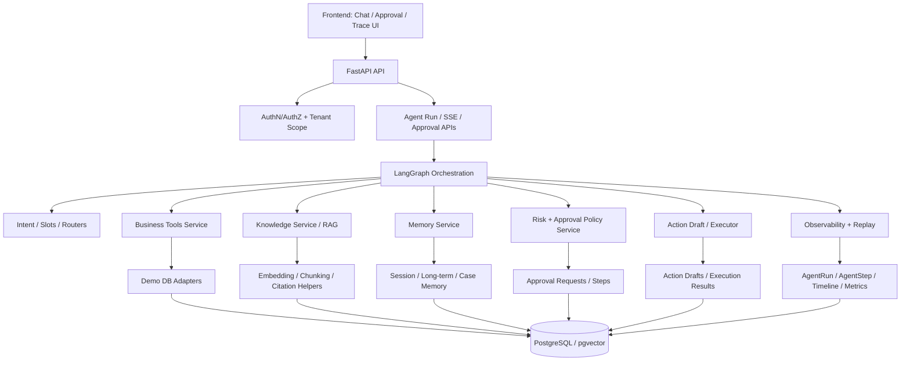
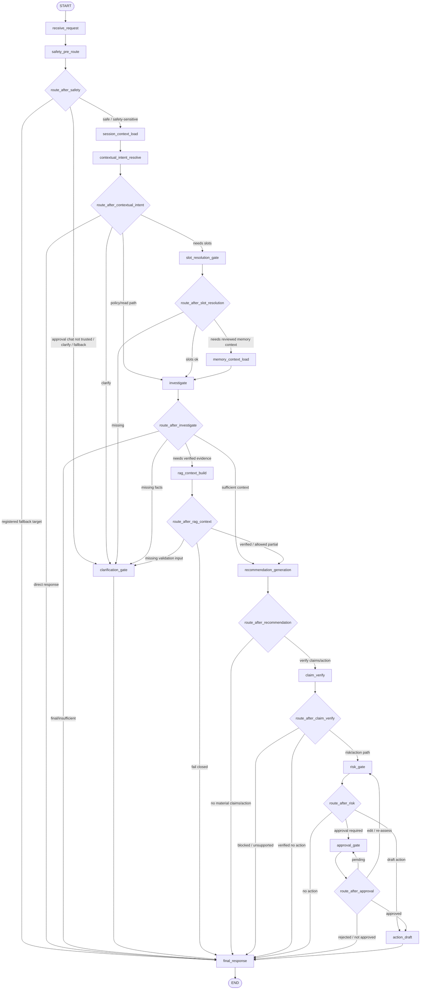
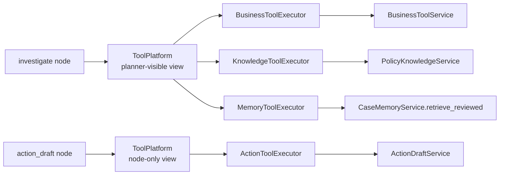
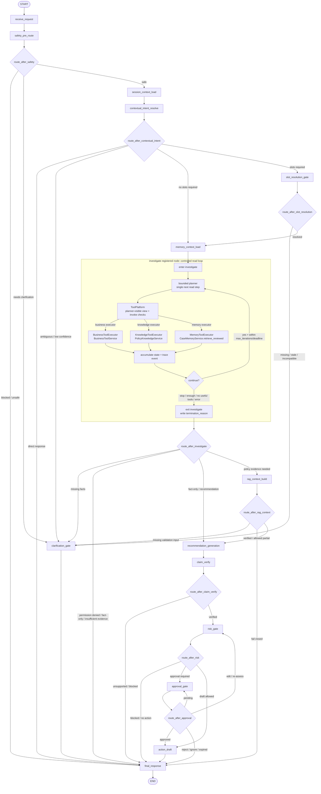

NOTE: This file is ILLUSTRATIVE. For the current target runtime graph, use `docs/target-agent-platform-architecture-plan.md` §6.1 and `docs/contract-spec.md` §9 as the primary contract references. For the current source-code graph snapshot, use `docs/current-langgraph-architecture.md` and `src/agent/graph.py`.

## 1. Title 和目标说明

MOCA 的目标架构是：面向商家运营与售后协同的企业级 Agent 原型。

它不是通用聊天机器人，也不是只为演示 LangGraph 的 demo。目标是把当前“能跑的 LangGraph Agent demo”升级为架构边界清晰、可解释、可扩展、可评估的商家售后 Agent：围绕订单/退款/工单事实、政策证据、处理建议、高风险审批、动作草稿、审计追踪和可回放 timeline 展开。

核心架构判断来自 `docs/agent-architecture-reference-draft.md`：

- LangGraph 只负责状态机编排、节点调度、条件路由、interrupt/resume。
- Knowledge / RAG、Business Tools、Memory、Approvals / SLA / Policy、Actions / Executor / Compensation、Observability / Replay 都应是独立能力层。
- 当前可以继续单 FastAPI app、单 Python 进程、单 repo，但代码边界要向 service contract 靠拢，未来可替换真实系统 API 或拆服务。
- Prompt 不能替代代码层控制。审批、工具权限、租户隔离、动作执行、记忆写入必须由代码和数据 contract 约束。

---

## Refactor Principles

1. F1: AAM is a target-architecture refactor, not a minimal-patch migration.
2. F2: Legacy implementation is adapter/rollback fallback, not a first-class target path.
3. F3: Runtime read-switch required only when persistence/online-safety requires it; service-only refactors default to direct cutover with git-revert + retained-adapter rollback.
4. F4: Shared trusted context is a single canonical contract; ToolCallContext / KnowledgeContext / AgentState identity are projections of it.
5. F5: Canonical schema is owned by its producer; consumers project, never redefine.
6. F6: A minimal observability envelope precedes the phases that emit events; full replay service may be deferred.
7. F7: Foundation contracts (state lifecycle, router seam, trusted context) precede capability facades.
8. F8: Contract tests are mandatory for every new boundary (positive/negative/boundary/forbidden).
9. F9: Deferred capabilities must still reserve a read interface early.
10. F10: Service facade ownership determines schema ownership unless explicitly delegated (e.g. snapshot/hash delegated to Phase 13).

---

## 2. Scope / Non-goals

### Scope

本文覆盖：

- 当前 MOCA 架构事实。
- 参考仓库代码级分析和可借鉴性判断。
- 目标分层架构。
- LangGraph workflow、AgentState 目标 schema、intent classification、tool calling、memory、prompt、approval/SLA/risk policy、action execution、observability/replay、数据模型建议。
- 分阶段迁移路线和测试/eval 计划。

### Non-goals

本文不做以下事情：

- 不修改 `src/` 代码。
- 不更换 MOCA 技术栈。
- 不把 MOCA 拆成微服务。
- 不接真实支付、退款、优惠券、封禁、物流或商家系统 API。
- 不照抄参考仓库目录、代码、prompt 或业务假设。
- 不把自由 ReAct 作为默认执行模型。
- 不让 LLM 直接执行高风险写动作。

---

## 3. 设计依据矩阵

| 设计主题 | 当前 MOCA 依据 | 参考仓库依据 | 是否采用 | 采用方式 | 不采用内容 |
| --- | --- | --- | --- | --- | --- |
| LangGraph workflow | `src/agent/graph.py` 当前主 workflow 已收敛到 canonical risk 命名：`receive_request`、`safety_pre_route`、`session_context_load`、`contextual_intent_resolve`、`slot_resolution_gate`、`memory_context_load`、`investigate`、`rag_context_build`、`recommendation_generation`、`claim_verify`、`risk_gate`、`clarification_gate`、`approval_gate`、`action_draft`、`final_response`。历史 `assess_risk_and_approval` 只保留为 trace/import/test/persisted retry 兼容面。 | `memory-agent/src/memory_agent/graph.py` 展示 tool call 条件分支；`agents-from-scratch-ts/src/email_assistant.ts` 展示 triage -> subgraph；`Human-in-the-Loop-Workflow-LangGraph/src/graph.py` 展示 Command 路由。 | 采用 | 保留 deterministic LangGraph shell；只读调查统一由 `investigate` bounded loop 承担；当前 graph 已使用 `risk_gate` 承担 action-risk gate。 | 不采用完全自由循环 agent，也不把参考仓库 email/news workflow 搬入 MOCA。 |
| Intent classification | `src/agent/intent_policy.py` 使用 `INTENT_DEFINITIONS` 统一声明 ordinary intent taxonomy、required slots、initial route、precedence 和 risk/evidence flags；`src/agent/schemas.py` 定义 `IntentResultV3`；active graph 使用 `src/agent/nodes/contextual_intent_resolve.py` 做 structured output，`classify_intent` 仅保留为兼容 wrapper/import 面。 | `agents-from-scratch-ts/src/email_assistant.ts` triage 把 email 分成 ignore/respond/notify，用于路由。 | 部分采用 | 继续校准 intent precedence、confidence threshold 和 clarification path。 | 不采用 email 领域的 ignore/respond/notify 作为业务 intent。 |
| Tool calling | `src/agent/nodes/investigate.py` 通过 `ToolPlatform` 调用 business read、policy retrieval、case memory search；`ToolCatalog` 是 descriptor/permission/schema/caller allowlist 的单一入口。 | `memory-agent/src/memory_agent/tools.py` 使用 InjectedToolArg；`agents-from-scratch-ts/src/tools/base.ts` 有中央 tool registry；`agent-inbox` 和 HITL examples 在工具执行前中断。 | 采用 | 采用 graph-controlled bounded tool loop + platform-level allowlist + service facade。 | 不采用模型自由选择任意工具并直接写业务系统。 |
| Memory read/write | `session_context_load` 已通过 `src/memory/service.py` + `SessionMemoryRepository` 读取 PostgreSQL-authoritative same-thread session context；`memory_context_load` 是 active reviewed memory / long-term preference / case precedent / active CWC 读取节点；planner-facing `search_case_memory` 通过 `MemoryToolExecutor -> CaseMemoryService.retrieve_reviewed(...)` 检索 reviewed case memory；`ClosedCasePrecedentService -> CaseMemoryService.submit_case_memory_candidate(...)` 生成 `closed_case_cwc_candidate` review candidate；`LegacySessionPrecedentSearchService` 仅是 legacy/debug-only session-derived projection；`long_term_memory_retrieve` 只保留为 `memory_context_load` compatibility wrapper。 | `memory-agent/src/memory_agent/graph.py` 读取最近 memory 注入 prompt；`langgraph-memory/memory_service/graph.py` 有 delayed extraction、patch/insert 双路径、schema fan-out；`agents-from-scratch-ts/src/email_assistant_hitl_memory.ts` 根据 HITL feedback 更新 memory。 | 采用 | 区分 working memory、workflow checkpoint、session memory、Case Working Context、long-term explicit preference memory、case memory、audit/replay；已先实现 Postgres-authoritative session memory，Redis 只可作为可选热缓存。 | 不采用自由 ReAct 写长期记忆；不采用 Pinecone/Fireworks 默认栈；不把历史 case 当政策；不让 Redis 成为权威记忆或 checkpoint。 |
| Human-in-the-loop approval | `src/agent/nodes/approval_gate.py` 已有 LangGraph `interrupt`；`src/api/routers/approvals.py` 支持 approve/reject resume；`ApprovalRequest`、`ApprovalStep` 已持久化。 | `agent-inbox/README.md` 定义 HumanInterrupt/HumanResponse schema，支持 accept/edit/respond/ignore；`agent-inbox-langgraph-example/src/agent/graph.py` 有 Python 最小示例；`Human-in-the-Loop-Workflow-LangGraph/src/nodes/human_review_node.py` 支持编辑内容后 approve。 | 采用 | 把 MOCA 审批从 approve/reject 扩展到 accept/edit/reject/respond/ignore，并支持多级审批和 SLA。 | 不采用通用 inbox UI 的全部部署假设；不采用布鲁斯天空发布业务。 |
| Action execution | `src/agent/nodes/action_draft.py` 通过 `ToolPlatform` 调用 node-only `create_coupon_grant_draft`；`src/actions/service.py` / `drafts.py` 创建 durable `ActionDraft`，有 idempotency key；README 明确无真实支付/退款/券执行。 | `Human-in-the-Loop-Workflow-LangGraph/src/tools.py` 在 publish 前再次 interrupt；`agent-inbox` 支持 edit/accept action args。 | 采用 | demo action 仍只创建 draft；后续真实外部动作需补 execution/compensation metadata。 | 不采用在 tool 内直接发布/执行外部动作；真实动作前双确认只作为未来高风险场景。 |
| RAG / Knowledge | `src/knowledge/retrieval.py` 使用 DashScope embedding、pgvector、hybrid rerank、threshold/no-evidence；`src/rag` 只保留 embed/chunk/ingest 等底层 infra。 | `docs/agent-architecture-reference-draft.md` 要求 Knowledge / RAG 是独立能力层。 | 采用 | KnowledgeService facade 管理 evidence contract；Agent 节点不直接接触 embedding/repo/pgvector。 | 不采用把 RAG 当 Agent 内部普通 tool 的长期形态。 |
| Observability / Replay | `src/agent/trace.py`、`src/repositories/trace_repo.py`、`src/api/routers/traces.py` 已有 AgentRun/AgentStep、approval/action timeline；`src/api/main.py` 有 request trace_id。 | `fastapi-observability/fastapi_app/main.py`、`utils.py`、`docker-compose.yaml` 展示 FastAPI metrics、OTLP、Tempo、Loki、Prometheus、Grafana 和日志 trace 关联。 | 采用 | 先做 in-process spans/metrics/log correlation，再考虑完整 Grafana stack。 | 不直接搬三 app compose 和 Loki logging driver 到 MOCA。 |
| Prompt organization | 当前 `src/agent/prompts.py` 单文件存 intent、slots、recommendation、risk、final prompts。 | `agents-from-scratch-ts/src/prompts.ts` 按 triage/agent/HITL/memory prompt 拆分；参考草稿要求按节点拆。 | 采用 | 拆成 `src/agent/prompts/intent.py`、`slots.py`、`recommendation.py`、`final_response.py`，memory prompt 放 `src/memory/prompts.py`。 | 不采用超长单 system prompt；不让 prompt 替代 policy/approval/tool 控制。 |
| Service boundary | 当前 repo 有 `src/tools`、`src/business`、`src/knowledge`、`src/memory`、`src/actions` 等 service/domain boundary。 | `full-stack-fastapi-template/backend/app/api/deps.py`、`core/config.py`、`tests/conftest.py` 展示工程组织、依赖注入、settings、tests；参考草稿强调 in-process service modules。 | 采用 | 在单 app 内通过 service facade 组织：knowledge、business、memory、approvals、actions、observability。 | 不换 SQLAlchemy 为 SQLModel；不照搬模板业务模型或用户 CRUD。 |

---

## 4. 当前 MOCA 架构事实

### 4.1 已实现

当前 MOCA 已实现以下能力：

- FastAPI API 层：`src/api/routers/agent.py` 提供同步 chat；`src/api/routers/agent_runs.py` 提供 run 创建、SSE streaming 和 evidence 查询；`src/api/routers/approvals.py` 提供审批决策；`src/api/routers/traces.py` 提供 run trace。
- LangGraph workflow：`src/agent/graph.py` 定义 deterministic shell；当前 active 入口链路为 `receive_request -> safety_pre_route -> session_context_load -> contextual_intent_resolve`，slot/memory 路径使用 `slot_resolution_gate` 和 `memory_context_load`，只读调查统一在 `investigate` bounded loop 内执行；`route_after_intent` / `route_after_slots` 仅保留为兼容委托。
- AgentState：`src/agent/state.py` 区分 persistent memory 与 ephemeral context，包含 thread/user/tenant/role、active slots、last intent、evidence refs、business context、risk、approval、action、trace 等字段。
- Intent / slots / recommendation / risk structured output：`src/agent/schemas.py` 和 `src/agent/nodes/*.py` 使用 Pydantic schema 约束 LLM 输出。
- RAG / Knowledge：`src/knowledge/retrieval.py` 使用 DashScope embedding、pgvector 检索、hybrid rerank、threshold gate；`src/rag` 只保留 embed/chunk/ingest 等底层 infra，legacy HTTP search DTO 位于 `src/api/schemas/search.py`。
- Business read tools：`src/business/service.py` 通过 `src/business/adapters.py` 调用 demo business integrations；`get_order`、`get_refund_case`、`get_ticket` 读取 tenant-scoped 本地 demo DB，并保留 merchant ownership 防护。
- Approval interrupt/resume：`approval_gate` 使用 LangGraph `interrupt`；审批 API 用 `Command(resume=...)` 恢复 graph。
- Action draft：`action_draft` 创建 action draft，`ActionDraftRepository.create_or_get` 用 idempotency key 防重复。
- Trace / replay：`AgentRun`、`AgentStep`、`ApprovalRequest`、`ApprovalStep`、`ActionDraft` 持久化；`TraceRepository.build_timeline` 组合 agent step、approval、action draft timeline。
- 测试覆盖：graph happy path/no-evidence/cross-turn reset、routing、approval gate、approval integration、action draft、trace persistence、tool contract、RAG/eval 等测试已存在。

### 4.2 部分实现

当前 MOCA 部分实现但边界仍不完整：

- Tool contract：`src/tools/{contracts,catalog,platform,policy,validation}.py` 是当前 agent-facing 工具契约和统一分发层；`investigate` 与 `action_draft` 已通过 `ToolPlatform` 调用 read/retrieval/action capability。
- Memory：`src/memory/service.py`、`repository.py`、`schemas.py` 已实现 PostgreSQL-authoritative session memory load/write；`case_working_contexts` 承担 active case working state；active graph 使用 `session_context_load` 读取 same-thread session context，并使用 `memory_context_load` 读取 reviewed memory / long-term preference / case precedent / active CWC；planner-facing `search_case_memory` 当前通过 `MemoryToolExecutor -> CaseMemoryService.retrieve_reviewed(...)` 读取 reviewed case memory；`src/memory/case_precedent.py` 通过 `ClosedCasePrecedentService -> CaseMemoryService.submit_case_memory_candidate(...)` 生成 `closed_case_cwc_candidate` review candidate；`src/memory/search.py` 的 `LegacySessionPrecedentSearchService` 仅保留为 legacy/debug-only session-derived projection。`long_term_memory_retrieve` 只是 `memory_context_load` 的 compatibility wrapper；Phase 48 explicit preference memory 窄版写入已接入 deterministic explicit user preference capture、管理员保存 API 和人审发布，但仍只支持显式软偏好，不是完整 profile / rule / run-summary memory-write pipeline；Redis hot cache 尚未实现。
- Approval：已有 approve/reject、过期处理、自审批限制、resume、审批 step 记录；尚未有 policy-driven multi-level approval、SLA escalation、accept/edit/respond/ignore。
- Observability：已有 DB trace 和 API request trace_id；尚未有 OpenTelemetry spans、Prometheus metrics、LLM token/cost 完整记录、RAG/tool/action 细粒度 metrics。
- Actions：已有 `src/actions/service.py`、`src/actions/drafts.py`、`ActionToolExecutor` 和 node-only action descriptor；尚未有真实 external adapter、compensation/rollback metadata。
- Prompt：已有 `src/agent/prompts.py` 单文件；尚未按节点和能力层拆分。

### 4.3 未实现

当前仓库中没有找到以下已实现依据：

- Long-term profile memory。
- 多级审批 policy 和 SLA escalation engine。
- accept/edit/respond/ignore 审批响应模型。
- 真实外部 action executor。
- compensation / rollback 执行记录。
- OpenTelemetry graph node spans / tool spans / LLM spans。
- 可重新执行 LLM 的 replay。当前是审计 timeline replay，不是 deterministic rerun。

### 4.4 Current-vs-target evidence

| Capability | Current evidence | Current limitation | Target contract | Migration phase |
| --- | --- | --- | --- | --- |
| AgentState lifecycle | `src/agent/state.py` 定义字段约定；`receive_request` 主动 reset 部分 ephemeral 字段。 | 当前不是 schema-level enforcement；writer、scope、reset/merge 规则未被统一验证。 | 第 10.1 节 lifecycle matrix；trusted fields 不可被 LLM 覆盖；router/state property tests。 | Phase 10 |
| Slot routing | 当前 graph 使用 `contextual_intent_resolve -> slot_resolution_gate -> memory_context_load`；`RequiredSlotExpression` 表达 all-of / any-of slots，`slot_resolution_gate` 承担 current-turn candidate slots 与 same-thread session slots 的 provenance、invalidation、inheritance、missing-required 裁决；`extract_slots` / `route_after_slots` 仅是兼容 wrapper/helper。 | long-term memory 仅支持 Phase 48 narrow explicit preference retrieval；slot freshness / inheritance eval 仍需随真实案例校准；完整 profile/rule/run-summary memory-write pipeline 尚未实现。 | 保持 canonical `contextual_intent_resolve -> slot_resolution_gate -> memory_context_load`，后续只删除 Phase 58 compatibility surfaces。 | Phase 54/55 已完成 active cutover；compat cleanup no later than Phase 58 |
| Approval | 已有 interrupt/resume、approve/reject、审批持久化。 | 无 request/level/assignment version CAS、multi-level 聚合和 exact revision execution guard。 | 第 15 节 versioned approval state machine 和 optimistic locking。 | Phase 13 |
| Action | 已有 durable `ActionDraft` 和 idempotency key。 | demo/external outcome contract 未完全分离；无 external executor/reconciliation。 | demo 只写 draft + `draft_outcome`；external 原子校验后执行。 | Phase 14, Phase 17 |
| Replay | 已有 AgentRun/AgentStep 和组合 timeline。 | 事件枚举和 lifecycle coverage 不完整；不是统一 V3 event store。 | ReplayEventV3、稳定 sequence、完整 lifecycle enum 和 retention。 | Phase 15 |
| 调查段节点图（investigation segment） | 旧设计把只读取证拆成 business_context_fetch / policy_evidence_retrieve / case_memory_retrieve 三个独立节点 + route_after_business_context / route_after_policy_evidence。 | 三节点固定串联在 router 层无法表达跨数据源动态调查（如先查物流再决定是否查政策）。 | 合并为单一 investigate bounded-loop 节点（§9.1 第 8 节点）+ 单一 route_after_investigate（§9.5）；内部 bounded tool loop 受 max_iterations 等三护栏约束。 | Phase 10 |

---

## 5. 参考仓库分析结论

| 仓库 | 已检查文件 | 实际实现模式 | 可借鉴点 | 不适合 MOCA 的点 | 是否纳入最终 spec | 纳入方式 |
| --- | --- | --- | --- | --- | --- | --- |
| `langgraph` | `examples/customer-support/customer-support.ipynb`；并搜索 `docs/`、`libs/` 中 customer support 相关实现 | 指定 notebook 当前只有迁移说明：“This file has been moved”，没有 state/routing/tool/HITL 代码。本地 repo 未找到同名 customer support 实现。 | 只能确认：指定文件不能作为代码级模式依据。LangGraph repo README/docs 可作为 StateGraph、interrupt、checkpoint 基础背景，但不是本次 customer-support 代码依据。 | 不能编造 customer support graph 的 state、routing、tool/handoff 细节；不能把已迁移占位文件当实现。 | 不纳入 customer-support 代码级模式 | 在 spec 中明确排除：指定文件未提供代码级参考。 |
| `memory-agent` | `src/memory_agent/graph.py`、`tools.py`、`prompts.py`、`state.py` | ReAct-style memory agent：从 store namespace `("memories", user_id)` 搜索最近 memory，注入 system prompt；LLM bind `upsert_memory` tool；有 tool_calls 则路由 `store_memory`，再回到 `call_model`。`user_id` 和 `store` 用 InjectedToolArg 隐藏。 | memory read/write 作为 graph 节点；namespace 隔离；安全上下文由系统注入；tool call -> dedicated node -> audit/store -> route back。 | 自由 ReAct 写长期记忆不适合 MOCA；scope 只有 user，不足以表达 tenant/merchant/thread/case；无 TTL/source/confidence/review。 | 纳入 | 只借鉴 memory node、namespace、安全注入和 tool-call 条件分支。 |
| `langgraph-memory` | `memory_service/graph.py`、`_schemas.py` | 独立 memory service：`schedule` 延迟抽取；`scatter_schemas` 按 schema fan-out；patch memory 先 fetch existing state，再抽 JSON patch/upsert；semantic memory 抽取 embeddable event 后 insert。 | patch 型适合 user/merchant profile；insert 型适合 case/event memory；memory extraction 可异步/延迟；schema fan-out 支持多记忆类型。 | 默认 Pinecone/Fireworks，不适合直接迁移；抽取所有聊天可能带来隐私/成本风险；不能把 memory 当 policy。 | 纳入 | 采用 patch/insert 概念，存储优先 Postgres + pgvector。 |
| `agents-from-scratch-ts` | `src/email_assistant.ts`、`email_assistant_hitl.ts`、`email_assistant_hitl_memory.ts`、`schemas.ts`、`tools/base.ts`、`tools/default/memory-tools.ts`、`prompts.ts` | TS LangGraph email assistant：triage_router 分类 ignore/respond/notify；response_agent subgraph 通过 ToolNode 或 interrupt_handler 执行工具；HITL 支持 accept/edit/response/ignore；memory 版本按 namespace 读取/更新偏好。 | triage 先分类再路由；response subgraph；工具 registry；HITL 每次处理一个 tool call；基于人工反馈更新 memory。 | email domain 不适合 MOCA；示例里有 `toolChoice: required` 和自由工具循环，不适合高风险售后动作；memory 更新偏好过于个人助理化。 | 部分纳入 | 借鉴 triage/subgraph/HITL response handling/memory feedback 模式，不迁移代码和业务 prompt。 |
| `agent-inbox` | `README.md`、`src/components/agent-inbox/types.ts`、`hooks/use-interrupted-actions.tsx`、`components/interrupt-details-view.tsx` | 前端 inbox 和 LangGraph interrupted threads 管理。核心 schema：HumanInterrupt 包含 `action_request`、`config`、`description`；HumanResponse 类型为 `accept`、`ignore`、`response`、`edit`。UI 根据 config 决定可用动作，并把 response 发送回 graph。 | MOCA 审批流应从 approve/reject 扩到 accept/edit/respond/ignore；description 可用 markdown 解释风险、证据和建议动作；edit 可修改 proposed action args。 | 这是 LangGraph deployment UI，不应直接替换 MOCA frontend/API；不应照搬 local storage/deployment config。 | 纳入 | 采用 schema 概念映射到 MOCA approval API 和 UI。 |
| `agent-inbox-langgraph-example` | `src/agent/graph.py`、`state.py`、README | Python 最小示例：构造 HumanInterruptConfig，`interrupt([request])[0]`，按 response type 写回 state。 | Python 端 accept/edit/respond/ignore 的最小实现方式。 | 示例是 joke，不含权限、审批、SLA、action risk。 | 补充纳入 | 作为 MOCA interrupt payload schema 的 Python 参考。 |
| `Human-in-the-Loop-Workflow-LangGraph` | `src/graph.py`、`state.py`、`nodes/human_review_node.py`、`nodes/content_generation_node.py`、`prompts.py`、`tools.py` | 搜索 -> 内容生成 -> human review -> approve/reject；review node 可接受编辑字符串并自动 approve；`publish_post` tool 内在发布前再次 interrupt 确认。 | two-stage interrupt：草稿 review 和执行前 confirm；Command(goto=...) 路由；编辑后继续 approve。 | 新闻/Bluesky 发布业务不适合；tool 内直接 publish 外部服务不适合当前 MOCA；OpenAI/Tavily 栈不迁移。 | 部分纳入 | 借鉴二阶段审批/确认控制流，未来用于真实高风险动作。 |
| `full-stack-fastapi-template` | `backend/app/main.py`、`api/main.py`、`api/deps.py`、`core/config.py`、`core/db.py`、`models.py`、`tests/conftest.py`、Dockerfile、pyproject | FastAPI 工程模板：settings、CORS、router aggregation、JWT dependencies、DB session deps、Alembic、Docker、tests fixture、lint/type config。 | API deps/settings/tests/Docker/CI 组织可参考；安全依赖注入清晰。 | 使用 SQLModel，同 MOCA 当前 SQLAlchemy 不一致；业务是 users/items，不指导 Agent 架构。 | 部分纳入 | 只借鉴工程组织和测试结构，不换 ORM/模型。 |
| `fastapi-observability` | `fastapi_app/main.py`、`utils.py`、`docker-compose.yaml`、`etc/prometheus/prometheus.yml`、`etc/grafana/datasource.yml`、`etc/tempo/tempo.yml` | FastAPI metrics middleware；OpenTelemetry FastAPI instrumentation；OTLP -> Tempo；Prometheus scrape `/metrics`；Grafana datasource 关联 Prometheus/Tempo/Loki；日志带 trace_id/span_id。 | MOCA 应对 API、graph node、tool call、RAG、LLM、approval、action 建 spans/metrics/log correlation；metrics exemplar 关联 trace。 | 不直接搬多 app compose、Loki docker logging driver；不把部署栈作为 Phase 7。 | 纳入 | 先定义观测 contract，后续逐步接 OTel/Grafana。 |

---

## 6. 目标架构总览

MOCA 目标架构：一个 FastAPI app 内的分层 Agent 系统。

当前阶段不拆微服务，但内部必须按能力层组织：

- API / Frontend：负责认证、会话、审批 UI、trace UI、SSE。
- LangGraph Agent Orchestration：只做状态流转、节点编排、条件路由、interrupt/resume。
- Knowledge / RAG：负责政策知识、检索、证据、citation validation。
- Business Tools：负责订单、退款、工单、物流、商家风险等业务事实读取，当前通过本地 demo DB adapter。
- Memory：语义记忆 domain，只负责 session memory、未来 long-term profile memory、未来 reviewed case memory，以及 memory-specific read/write policy、PII、identity、tombstone、review rules；working memory 与 workflow checkpoint 属于 graph/runtime recovery 边界，audit/replay 属于 observability 边界。
- Approvals / SLA / Policy：负责风险规则、审批策略、多级审批、SLA、升级。
- Actions / Executor / Compensation：负责 action draft、demo adapter、idempotency、execution result、compensation metadata。
- Observability / Replay：负责 spans、metrics、logs、AgentRun/AgentStep、timeline replay。
- Persistence：负责 SQLAlchemy models、repositories、Postgres/pgvector、migrations。

### Canonical Schema Ownership

> ILLUSTRATIVE mirror. The normative producer/consumer ownership is defined in `docs/contract-spec.md` (§8.0 TrustedContext, §8.3 EvidenceRefV1, §15.3 CanonicalHashProfile, §17.2 Minimal Event Envelope). On any conflict, contract-spec wins; this table is a reading aid, not an independent source.

| Schema | Producer phase | Consumers | Rule |
| --- | --- | --- | --- |
| EvidenceRefV1 | Phase 8 | Phase 13 snapshot, Phase 15 replay | consumers project, never redefine |
| CanonicalHashProfile v1 | Phase 13 | Phase 14 / 15 / 16 | interface may be specified early, implementation deferred |
| TrustedContext | Phase 7 shared contract | Phase 8 KnowledgeContext, Phase 9 ToolCallContext, Phase 10 AgentState identity | all consumers are projections |
| Minimal Event Envelope | Phase 7/10 shared contract | Phase 12/13/14; full service Phase 15 | Phase 15 owns full replay; earlier phases conform to minimal envelope |

Canonical `TrustedContext` 至少包含 `tenant_id`、`user_id`、`role`、`merchant_scope` 和 correlation identifiers；这些字段来自 trusted API/auth/run boundary，不可由 LLM 或用户 payload 覆盖。

### Module Responsibility & Non-Overlap Matrix

> ILLUSTRATIVE mirror of the layer responsibilities; the current accepted service/schema contracts are in `docs/contract-spec.md` §8-§18. Use this as a non-overlap reading aid, not an independent contract source.

| Layer | Owns | Does NOT own | Exposes | Forbidden |
| --- | --- | --- | --- | --- |
| Knowledge/RAG | retrieval, chunk ranking, KnowledgeContext | policy decisions, identity fields | EvidenceRefV1 (producer) | producing CanonicalHashProfile; overriding trusted context |
| Memory (session/long-term/case) | session state persistence, long-term/case read seam | policy evidence | session load/write, reviewed case memory search, explicit preference retrieval seam | producing EvidenceRefV1; acting as policy evidence |
| Approval/Snapshot | approval state machine, ActionSafetySnapshot, CanonicalHashProfile (Phase 13) | replay storage, routing | CanonicalHashProfile v1 (producer) | storing business objects in replay; score in snapshot |
| Replay/Observability | event log, redaction, retention, /replay API | business logic | replay read API | storing business objects; redefining minimal envelope fields |
| Action executor | executing actions, draft_outcome in demo-mode | approval logic | action result | writing non-draft outcomes in demo-mode |

---

## 7. 架构图

### 7.1 能力边界图

这张图只表达 MOCA 的目标能力边界，不表达每个 Agent run 的节点顺序，也不表达部署拓扑。`AuthN/AuthZ + Tenant Scope` 是横切安全上下文：API 在进入 Agent、tools、approval、trace 前先确认用户身份、OAuth2 scope、role、tenant_id 和 merchant scope，并把这些字段注入后续 `AgentState`、tool context、repository query 和 checkpoint thread。



### 7.2 当前实现图

这张图按当前 `src/agent/graph.py` 的 registered nodes 和 conditional edges 表达真实运行链路。它不是目标架构；目标 canonical runtime graph 见 `docs/target-agent-platform-architecture-plan.md` §6.1 与 `docs/contract-spec.md` §9。当前实现已切到 `safety_pre_route`、`session_context_load`、`contextual_intent_resolve`、`slot_resolution_gate`、`memory_context_load`、`recommendation_generation` 和 `risk_gate`。`classify_intent`、`session_memory_load`、`extract_slots`、`long_term_memory_retrieve`、`generate_recommendation` 和 `assess_risk_and_approval` 只保留为历史 trace / import / test / persisted metadata compatibility surface。



当前实现的关键约束：

- `investigate` 通过 `ToolPlatform` 获取 planner-visible read/retrieval capability view，并调用 business / knowledge / memory executors；bounded planner 不能触达 write/action/routing/approval 权限。
- `action_draft` 通过 node-only `create_coupon_grant_draft` capability 创建 durable action draft；当前 demo path 不执行真实外部退款、发券或封禁动作；当存在 `proposed_action` 时，最终写边界还要求 canonical claim bundle 内有 positive `action_recommendation` claim。
- `memory_context_load` 是当前 active reviewed memory / long-term preference / case precedent / active CWC 读取节点；`long_term_memory_retrieve` 是 compatibility wrapper。planner-facing `search_case_memory` 当前读取 reviewed case memory，不再是 session-derived precedent 过渡实现；legacy session-derived projection 仅保留为 debug-only。
- `memory_write` 不是当前主 graph 的 registered node；session memory write 属于 response 后续/运行时边界。

当前工具调用边界如下。`ToolPlatform` 不是 LangGraph registered node，但它必须在架构图中显式出现，因为它是 agent-facing descriptor、caller allowlist、permission、schema 和 side-effect 检查入口。



#### 当前 registered node 边界

| 当前 LangGraph 节点 | 节点职责 | 调用的 service / contract |
| --- | --- | --- |
| `receive_request` | 初始化 run、thread、ephemeral state、trace step | Run context / trace helper |
| `safety_pre_route` | 在进入 intent 前处理 approval-like chat、多目标和安全敏感预路由 | Deterministic safety pre-route policy |
| `session_context_load` | 在 intent 前读取同 thread active slots、summary、unresolved questions 的 prompt-safe context | MemoryService session read |
| `contextual_intent_resolve` | 输出 primary_intent、requested_operation、confidence、routing hints 和 current-turn candidate slots | LLM structured output / IntentPrompt + `INTENT_DEFINITIONS` policy |
| `slot_resolution_gate` | 裁决 current-turn candidate slots 与 inherited session slots，输出 active slots / missing slots / provenance | Slot policy / `RequiredSlotExpression` |
| `memory_context_load` | 读取 reviewed memory、long-term explicit preference、reviewed case precedent 与 active CWC contextual state | Memory context service / CWC lifecycle |
| `investigate` | 在 bounded loop 内通过统一工具层只读拉取 business context / policy evidence / reviewed case memory precedent | `ToolPlatform` planner-visible view -> business / knowledge / memory executors |
| `rag_context_build` | 将候选 evidence refs 升级为 verified evidence package，并执行 fail-closed 证据上下文构建 | RAG ContextBuilder / evidence package contract |
| `recommendation_generation` | 生成处理建议和 proposed_action candidate | LLM structured output / RecommendationPrompt + KnowledgeService citation verification |
| `claim_verify` | 校验 material claims / proposed action claim 是否被 verified evidence 支持 | Claim verification bundle / verifier policy |
| `risk_gate` | 评估风险、审批需求、动作是否可自动草稿 | RiskPolicy / ApprovalPolicy semantics |
| `clarification_gate` | 生成澄清问题或缺失信息说明 | Clarification policy / Final response template |
| `approval_gate` | 创建 interrupt，等待 approve/reject resume | ApprovalService / LangGraph interrupt |
| `action_draft` | 在审批/风险路由后创建 durable action draft | `ToolPlatform` node-only view -> ActionToolExecutor |
| `final_response` | 生成面向用户的最终回复 | Deterministic template or FinalResponsePrompt |

当前 router 函数包括：

- `route_after_safety`
- `route_after_contextual_intent`
- `route_after_slot_resolution`
- `route_after_investigate`
- `route_after_rag_context`
- `route_after_recommendation`
- `route_after_claim_verify`
- `route_after_risk`
- `route_after_approval`

其中 `route_after_intent` / `route_after_slots` 仅是 compatibility delegate；active graph 使用 `route_after_contextual_intent` / `route_after_slot_resolution`。

这些函数只读取 `AgentState` 并返回下一个 node key，不应调用 LLM、tools、repositories 或外部 API。

### 7.3 目标受控工作流图

这张图是目标 graph 的 compact overview。彩色主图和 `investigate` 展开视图见 `docs/target-agent-platform-architecture-plan.md` §6.1；registered node / router contract 见 `docs/contract-spec.md` §9。这里不再重复旧草稿里的 `slot_extraction`、`normalize_input`、`memory_write`、`trace_close` 或 `action_execution` 作为主链 node。

目标迁移不是追求更多节点，而是把“可自由推理的只读调查”和“必须代码控制的动作路径”分开：

- 目标主链 registered runtime node 是 15 个：`receive_request`、`safety_pre_route`、`session_context_load`、`contextual_intent_resolve`、`slot_resolution_gate`、`memory_context_load`、`investigate`、`rag_context_build`、`recommendation_generation`、`claim_verify`、`risk_gate`、`approval_gate`、`action_draft`、`clarification_gate`、`final_response`。
- `slot_extraction` 不作为最终 registered node；slot candidate extraction 是 `contextual_intent_resolve` / `slot_resolution_gate` 的内部能力。
- ReAct 只存在于 `investigate` 内部；`investigate` 只能通过 `ToolPlatform` 调用 planner-visible read/retrieval tools。
- 所有 graph-level route 都由 deterministic router 完成；LLM 不输出 next graph node。
- `risk_gate -> approval_gate -> action_draft` 永远不在 ReAct loop 内；当前目标 runtime 到 durable draft 为止，future `action_execution` 是外部执行扩展。
- `memory_write_pipeline` 和 `trace_close` 是 post-response / lifecycle concern；除非后续需要 checkpoint、retry 或 eval，不注册为主链 graph node。

本图是 overview，不替代 target plan §6.1 和 contract-spec §9；若后续 phase 发现冲突，必须显式提出 spec delta、MVP scope 或 defer 决策，不能静默偏离。



目标-only / optional concepts：

- `normalize_input`：可以保持为 `receive_request` 内 helper；只有需要独立 trace/eval 时才注册成节点。
- `slot_extraction`：不作为最终 registered node；slot candidate extraction 是 intent/slot gate 内部能力。
- `route_after_recommendation`：可在 recommendation/risk path 变复杂后拆出，但必须保持 deterministic。
- `action_execution`：真实外部执行前再作为 external execution extension 规划；当前目标 runtime 到 `action_draft` 为止。
- `memory_write`：可以作为 post-response async side effect，不应阻塞用户最终回复。
- `trace_close`：更像 API/runtime/observability 收尾，不一定属于 LangGraph 主链。

### 7.4 读法和可回退边界

- 能力边界图用于说明模块边界。
- 当前实现图用于说明 `src/agent/graph.py` 已注册的真实节点和 edge。
- 目标受控工作流图用于说明一个 Agent run 如何按 intent、只读调查、风险和审批条件流转。
- 第 7 节图是 illustrative；第 9.4/9.5 节 contract table 是当前主要契约参考，任何实现和 review 冲突都必须显式提出 spec delta、MVP scope 或 defer 决策。
- 所有 Mermaid 图均为 illustrative；第 9-18 节 contract tables 是当前已接受契约参考。
- 目标设计不要求一次性实现全部节点；节点数不是验收标准，节点输入/输出、状态写入、side effect 和路由确定性才是验收标准。
- 文档中的 target-only 节点不表示当前已经实现；当前实现以 `src/agent/graph.py` 和本节 7.2 为准。

---

## 8. 模块分层设计

### 8.1 API / Frontend

当前依据：`src/api/routers/agent.py`、`agent_runs.py`、`approvals.py`、`traces.py`、README。

目标职责：

- 接收 chat/run 请求，创建或执行 AgentRun。
- 提供 SSE node-level progress。
- 提供 approval list/detail/decision API。
- 提供 trace timeline/replay API。
- 统一处理 auth、OAuth2 scopes、tenant/user/role 注入。
- 前端展示 chat、evidence、approval、action draft、timeline。

边界：

- API 层不做 Agent 推理。
- API 层不直接执行 action。
- API 层可以调用 ApprovalService/RunService，但不直接拼装复杂 graph state。

### 8.2 LangGraph Agent Orchestration

当前依据：`src/agent/graph.py` 和 `src/agent/nodes/*`。

目标职责：

- 定义节点顺序和条件路由。
- 维护 `AgentState`。
- 调用 service contract。
- 管理 interrupt/resume。
- 收集 node outputs 和 trace events。

边界：

- 不直接访问 repository、pgvector、embedding、SQL 查询。
- 不直接执行真实写动作。
- 不把 Memory/Knowledge/Business Tools 的内部实现塞进节点。

### 8.3 Knowledge / RAG

当前依据：`src/knowledge/retrieval.py`、`src/knowledge/service.py`、`src/knowledge/schemas.py`、`src/knowledge/citation.py`、`src/rag/embedder.py`、`src/rag/ingestion.py`、`src/api/schemas/search.py`。

目标职责（叙述性）：

- KnowledgeService facade 管理 query rewrite、embedding、hybrid rerank、threshold、no-evidence fallback、EvidenceRef、claim/evidence binding 和 citation validation。
- 对 Agent 只暴露 evidence contract，不暴露 pgvector/repo 细节。
- KnowledgeService 只看 `KnowledgeContext`（canonical `TrustedContext` 的最小投影），Phase 8 不直接依赖 Phase 9 `ToolCallContext`。

> Normative 接口契约（`PolicyKnowledgeService.search` 签名、`knowledge_search_request.v2` / `knowledge_search_result.v2`、canonical EvidenceRefV1 字段表与 hash projection、Knowledge rules）见 `docs/contract-spec.md` §8.3。本小节仅为叙述性概览。

### 8.4 Business Tools

当前依据：`src/business/service.py`、`src/business/adapters.py`、`src/business/schemas.py`、`src/integrations/demo_business/*`、`src/tools/executors/business.py`。

目标职责（叙述性）：

- BusinessToolService 只保留 business scope、merchant ownership、retry、fact projection / `fetch_context` 聚合和 adapter 调用。
- `BUSINESS_READ_TOOLS` 是 business domain 内部 implementation map，统一维护 input model、adapter、slot/resource/argument 映射；它不是 agent-facing registry。
- agent-facing descriptor、caller allowlist、permission、input/output schema 由 `ToolCatalog` / `ToolPlatform` 统一负责。
- tenant/user/role/idempotency/trace context 必须由系统注入，不由模型生成。

> Normative 接口契约（`BusinessToolService.fetch_context` 签名、`ToolCallContext` / `ToolResultV2`）见 `docs/contract-spec.md` §8.4 与 §12.5。本小节仅为叙述性概览。

### 8.5 Memory

当前依据：`AgentState`、PostgreSQL checkpointer、`src/memory/service.py`、`src/memory/repository.py`、`src/memory/search.py`、`src/memory/long_term.py`、`src/memory/preference_capture.py`、active graph `session_context_load` / `memory_context_load`、`memory_write`、`reviewed_memory_context_retrieve` / `long_term_memory_retrieve` compatibility wrapper；参考 `memory-agent`、`langgraph-memory`。其中 `src/memory` 是语义记忆 domain；`AgentState`、checkpointer 和 trace/replay 不属于 `src/memory`。

目标职责：

- Working memory：当前 run 的工作副本，包含当前输入、临时计划、工具结果、候选答案和节点状态；由 `AgentState`/checkpoint 承载，不是独立 MemoryService 存储。
- Workflow checkpoint：图执行恢复层，回答“当前 run 从哪里恢复”，包含当前节点、interrupt/approval wait、幂等状态和副作用边界快照；Postgres 是事实源，Redis 只能作为 active-run 热缓存。
- Session memory：同一 tenant/user/thread 的连续对话，包含 active slots、last intent、轻量 same-thread summary、unresolved questions、prompt-safe refs/hints；Postgres `session_memories` + CAS 是事实源，Redis 可选做带 TTL 的 hot cache。它只是 same-thread temporary context，不是 CWC fallback、reviewed precedent、业务事实、政策证据、审批/动作或 replay truth。
- Case Working Context：一个 active refund case 的 working state，存于 `case_working_contexts`，跨 thread/handoff 延续，但仍是 `contextual_only`，不能替代业务事实、政策证据、审批/动作或 replay truth。
- Case memory：历史类似 case、处理结果、审批结果、outcome；只能作为 reviewed closed-case precedent；planner-facing `search_case_memory` 使用 `MemoryToolExecutor -> CaseMemoryService.retrieve_reviewed(...)` 读取 reviewed case memory，不使用 active Case Working Context，也不使用 legacy session-derived precedent。`ClosedCasePrecedentService -> CaseMemoryService.submit_case_memory_candidate(...)` 只把 finalized CWC 投影为 `closed_case_cwc_candidate` review candidate；`LegacySessionPrecedentSearchService` 的 session-derived projection 仅是 legacy/debug-only，不等于 reviewed case memory。
- Long-term profile memory：Phase 48 explicit preference memory only；只接显式“记住这个偏好”/管理员保存/人审通过的软偏好，不存订单、退款、工单、政策规则、审批/动作授权或普通 run summary。
- Audit / replay log：输入、证据、工具调用、审批链、模型版本和 memory write events 的 append-only 解释层；不是 memory，不可由 Redis 替代。

边界：

- Memory 是辅助上下文，不是政策依据。
- Session memory 只负责同 thread 连续性，不等于 workflow checkpoint；workflow checkpoint 只负责 run 恢复，不等于下一轮对话记忆。
- Long-term memory 不应每轮写入；Phase 48 已落地 explicit preference soft-memory 窄版写入/检索，但仍不覆盖一般 profile facts、policy rules、run summaries 或完整 memory-write pipeline。
- Case memory 只能作为 precedent，不能覆盖当前 policy evidence，也不能替代当前 case 的 Case Working Context。
- 当前实现状态：`src/agent/graph.py` 已用 `AsyncPostgresSaver` 编译 graph；`session_context_load` 通过 `MemoryService` 读取 `session_memories` 的 same-thread prompt-safe context，`memory_context_load` 读取 reviewed memory / long-term preference / case precedent / active CWC contextual state，`memory_write` 写入同一权威 session memory 表；CWC read/write 已接入 active case working state；planner-facing `search_case_memory` 通过 `MemoryToolExecutor -> CaseMemoryService.retrieve_reviewed(...)` 检索 reviewed case memory；closed-case candidate generation 使用 `ClosedCasePrecedentService -> CaseMemoryService.submit_case_memory_candidate(...)`，`closed_case_cwc_candidate` 默认 `needs_review`；metadata/text retrieval 是一等路径，embedding 仅在提供 `query_embedding` 时作为可选排序信号；legacy session-derived projection 仅保留为 debug-only；`long_term_memory_retrieve` 当前是 `memory_context_load` 的 compatibility wrapper，检索 published reviewed explicit preference rows；Phase 48 explicit preference memory 窄版写入已接入 deterministic explicit user preference capture、管理员保存 API 和人审发布；Redis hot cache 与完整 profile/rule/run-summary memory-write pipeline 尚未实现。

### 8.6 Approvals / SLA / Policy

当前依据：`approval_gate.py`、`approvals.py`、`ApprovalRepository`、`rules/risk_rules.yaml`、`ApprovalRequest`/`ApprovalStep`。

目标职责：

- RiskPolicy：判断风险等级和 rule refs。
- ApprovalPolicy：判断是否审批、审批级别、审批角色、SLA。
- SLAService：审批超时、升级、提醒、自动转人工。
- ApprovalService：创建审批、处理 accept/edit/reject/respond/ignore、多级状态流转。

### 8.7 Actions / Executor / Compensation

当前依据：`src/agent/nodes/action_draft.py`、`src/tools/executors/action.py`、`src/actions/service.py`、`src/actions/drafts.py`、`ActionDraftRepository`、`ActionDraft`。

目标职责：

- 生成 action draft。
- 校验 approval result。
- 根据 action type 选择 demo adapter 或 future external adapter。
- external mode 写 `ActionExecutionResult`；demo mode 只写 `draft_outcome`。
- 生成 rollback/compensation metadata。

当前只能创建 demo draft：创建草稿，不创建 `ActionExecutionResult`，也不真实发券/退款。

### 8.8 Observability / Replay

当前依据：`trace.py`、`trace_repo.py`、`traces.py`、`fastapi-observability`。

目标职责：

- 每个 graph node 建 span。
- 每次 tool/RAG/LLM/approval/action 建 span 或 event。
- 记录 run_id/thread_id/trace_id/tenant_id/user_id。
- Prometheus metrics：latency、error rate、no-evidence rate、approval interception rate、tool error rate、action draft success rate。
- Timeline replay：基于 persisted events 展示审计回放。

### 8.9 Persistence

当前依据：`src/db/models.py`、`src/repositories/*`。

目标职责：

- SQLAlchemy models。
- Tenant-scoped repositories。
- Postgres business data。
- pgvector policy chunks。
- AgentRun/AgentStep/Approval/Action audit data。
- 后续新增 Memory、ActionExecution、SLA event models。

---

## 22. 风险和取舍

- 分层会增加文件和 contract，但可以降低 graph node 直接耦合 repository/pgvector/demo DB 的风险。
- Memory 增强会带来隐私、成本和错误记忆风险，所以先做 session memory，再做长期/case memory。
- 多级审批和 SLA 会增加状态复杂度，但对企业售后场景必要。
- OTel/Grafana 全量部署会增加本地环境复杂度，所以先做 spans/metrics contract 和 DB timeline。
- Action executor 先保持 demo adapter，避免误接真实外部动作。
- Intent taxonomy 不宜过大，先 10 个以内，避免 eval 不稳定。

---

## 23. 明确不采用的参考模式和原因

1. 不采用 `langgraph/examples/customer-support/customer-support.ipynb` 的代码模式。

   原因：当前本地指定文件只有迁移说明，没有实现代码。不能编造 state/routing/tool/HITL 模式。

2. 不采用完全开放 ReAct 作为 MOCA 默认执行模式。

   原因：商家售后涉及退款、补偿、封禁/解封、工单关闭等高风险动作，必须 graph-controlled、node-level allowlist、approval/action executor 控制。

3. 不采用 `memory-agent` 的自由 memory upsert 策略。

   原因：MOCA 需要 tenant/user/merchant/thread/case scope、source refs、confidence、TTL、review/audit；不能让模型每轮自由写长期记忆。

4. 不采用 `langgraph-memory` 的 Pinecone/Fireworks 默认存储和模型栈。

   原因：MOCA 当前是 PostgreSQL + pgvector + DashScope/兼容接口，直接迁移会增加技术栈和部署复杂度。

5. 不采用 `agents-from-scratch-ts` 的 email domain prompt、tool set 和 `toolChoice: required` 执行假设。

   原因：MOCA 业务主线是商家运营与售后协同，不是个人 email assistant；高风险动作不能要求模型每轮必须调用工具。

6. 不直接采用 `agent-inbox` 的前端部署和 LangGraph Platform 假设。

   原因：MOCA 已有 FastAPI/React demo 和审批 API，应借鉴 HumanInterrupt/HumanResponse schema，而不是替换系统。

7. 不采用 `Human-in-the-Loop-Workflow-LangGraph` 的发布工具业务。

   原因：Bluesky 发布与 MOCA 业务无关。只借鉴 two-stage interrupt，不迁移 Tavily/OpenAI/publish flow。

8. 不采用 `full-stack-fastapi-template` 的 SQLModel/Users/Items 模型。

   原因：MOCA 已使用 SQLAlchemy、现有 tenant/business/agent models。只借鉴工程组织、deps、settings、tests、Docker 思路。

9. 不直接采用 `fastapi-observability` 的完整 Docker Compose 和 Loki logging driver。

   原因：MOCA 当前应先做观测 contract 和最小 instrumentation，避免把部署复杂度提前引入。

---

## 24. 结论

MOCA 应保留当前 LangGraph 主流程和 FastAPI/Postgres/pgvector 技术栈，以目标架构边界为优先、并保留可验证 rollback 的方式推进架构边界（不是 minimal-patch migration，见 Refactor Principle F1）：先把 Knowledge 和 Business Tools 从 `agent/tools` 语义中抬成 service facade，再补 Memory、Approval/SLA、ActionExecutor、Observability/Replay。

最终架构不是“更多节点”本身，而是让每个节点只编排独立能力层：

```text
Input -> Intent -> Memory -> Business Context -> Knowledge Evidence -> Recommendation -> Risk/Approval -> Action -> Response -> Memory Write -> Replay
```

这条线能服务 MOCA 的业务主线：商家运营与售后协同 Agent，既能安全演示，也为真实企业系统接入保留清晰替换边界。
