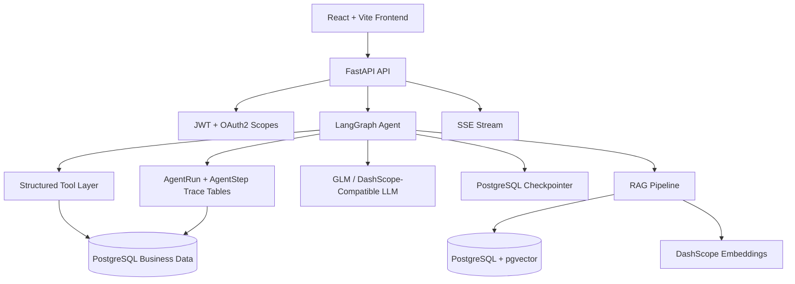
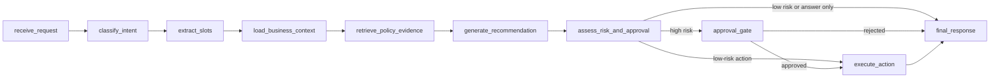

# MOCA Architecture

## System Overview

MOCA is a business-process agent for merchant refund and compensation workflows. It combines FastAPI endpoints, LangGraph orchestration, tenant-scoped repositories, PostgreSQL business data, pgvector policy retrieval, Redis-backed infrastructure, and a React/Vite frontend.

## Technology Stack

| Layer | Technology | Purpose |
| --- | --- | --- |
| API | FastAPI | Authenticated REST APIs, OpenAPI docs, dependency injection |
| Auth | JWT + OAuth2 scopes | Role/scoped access for chat, tools, approvals, and trace access |
| Agent orchestration | LangGraph | Stateful workflow graph, conditional routing, interrupt/resume |
| LLM | GLM-4 / DashScope-compatible API | Structured classification, extraction, recommendation, and response generation |
| Database | PostgreSQL | Tenants, users, orders, refunds, tickets, approvals, actions, runs, and steps |
| Vector search | PostgreSQL + pgvector | Policy chunk retrieval for RAG evidence |
| Cache/infrastructure | Redis | Local service dependency and future cache/rate-limit surface |
| Frontend | React + Vite | Chat, trace, evidence, and approval demo UI |
| Embeddings | DashScope `text-embedding-v4` | 1024-dimensional policy document embeddings for pgvector retrieval |
| Evaluation | Python scripts + JSONL golden sets | RAG and agent scoring with JSON/Markdown reports |

## Agent Workflow

The graph has ten nodes:

| Node | Responsibility |
| --- | --- |
| `receive_request` | Initializes run state, request metadata, and trace context. |
| `classify_intent` | Classifies the user query into workflow intent categories such as policy QA, refund troubleshooting, or compensation suggestion. |
| `extract_slots` | Extracts structured slots such as order number, refund case number, ticket ID, amount, and issue type. |
| `load_business_context` | Calls tenant-scoped read tools for order, refund, and ticket data when identifiers are present. |
| `retrieve_policy_evidence` | Searches the policy knowledge base and returns top evidence chunks or a no-evidence status. |
| `generate_recommendation` | Combines business context and policy evidence into a recommended answer or proposed action. |
| `assess_risk_and_approval` | Applies deterministic risk logic and decides whether approval is required. |
| `approval_gate` | Interrupts high-risk flows and waits for a human approval decision. |
| `execute_action` | Creates simulated durable action drafts after approval or for low-risk executable actions. |
| `final_response` | Produces the final user-facing response and closes the graph path. |

### Routing Logic

`route_after_risk` checks the risk assessment and proposed action:

- If `approval_required` is true, route to `approval_gate`.
- If a low-risk `proposed_action` exists, route to `execute_action`.
- Otherwise route directly to `final_response`.

`route_after_approval` checks the resumed approval result:

- `approve` routes to `execute_action`.
- `reject` routes to `final_response`.

## Data Flow

1. A user submits a query through `POST /api/v1/agent/chat` or creates a streamed run under `/api/v1/agent-runs`.
2. FastAPI validates the JWT, loads the current user, and enforces required OAuth2 scopes.
3. LangGraph receives tenant, user, role, query, and thread identifiers.
4. The graph classifies intent, extracts slots, loads business records, retrieves policy evidence, and generates a recommendation.
5. Deterministic risk assessment decides whether the flow can continue or must interrupt for approval.
6. High-risk flows create an approval request and persist the interrupted run.
7. A manager or admin decides the approval through `POST /api/v1/approvals/{approval_id}/decide`.
8. The approval API resumes the graph with `Command(resume=...)`.
9. The final response, trace steps, approvals, and action drafts are persisted for review.

## Trace Persistence

Each run creates an `AgentRun` record with run-level metadata such as tenant, user, thread, input, final status, final response, latency, and token count where available.

Each graph step creates an `AgentStep` record with node name, status, latency, tool name or tool calls, evidence refs, and node metrics. Trace replay is exposed through `GET /api/v1/agent-runs/{run_id}/trace`.

## Key Design Decisions

- **Deterministic risk assessment:** Approval requirements are derived from `rules/risk_rules.yaml`, not from LLM-only judgment.
- **Citation validation:** Evidence grounding uses stored document/chunk references and deterministic matching rather than an LLM judge.
- **FakeLLM for CI isolation:** Agent evaluation can validate graph contracts without provider keys, latency, or token cost.
- **Scoped checkpointer threads:** Thread IDs are scoped as `tenant_id:user_id:thread_id` to avoid cross-user or cross-tenant memory bleed.
- **No-evidence fallback:** When retrieval lacks sufficient evidence, the graph can skip definitive answers and return an insufficient-evidence path.
- **Simulated execution:** Write actions create action drafts for auditability; no real refund, payment, or coupon execution occurs.
