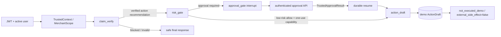

<!-- generated-by: gsd-doc-writer -->
# 安全、审批与动作边界

| 元数据 | 值 |
| --- | --- |
| 文档类型 | CURRENT |
| 描述范围 | 当前身份、作用域、风险、审批恢复与动作草稿安全边界 |
| 最后核验 | 2026-08-04（当前工作区） |
| 权威来源 | 当前源码、迁移、配置和测试 |
| 更新触发 | 身份/权限、risk/approval schema、resume、capability 或 action boundary 变化 |

## 概览

MOCA 的安全路径是“可信身份逐层投影、事实与风险材料逐层绑定、只有持久化授权可进入动作草稿”。当前动作链为 `claim_verify → risk_gate → approval_gate → action_draft`；确定性低风险分支可由 `risk_gate` 签发短期一次性 capability 后直接进入 `action_draft`。两条路径最终都只能生成持久化 demo draft，不会退款、发券、付款，也不会触发其他外部 side effect。[图路由](../../src/agent/graph.py) [动作结果 schema](../../src/actions/schemas.py#L13)



## 身份、OAuth2 scope 与 RBAC

- OAuth2 password bearer token 入口是 `/api/v1/auth/token`。本系统签发的 JWT 会写入字符串数组 `scopes`；鉴权边界强制要求 `sub` 与 `tenant_id`，缺失 `scopes` 当前按空集合处理，非数组或含非字符串元素则拒绝。API 还会查询同 tenant 的 active user，再校验 endpoint scope。[权限依赖](../../src/auth/permissions.py#L18)
- JWT 的 scope 不是可独立扩权的最终权限。`TrustedContextFactory` 取“已验证 token scopes ∩ 当前 role 的 `ROLE_SCOPES`”，再映射为工具权限；服务端额外权限也必须是 `tool:*`。[角色 scope](../../src/auth/jwt.py#L13) [可信上下文工厂](../../src/platform/trusted_context.py#L123)
- `support`、`manager` 和兼容角色 `merchant` 都是 merchant-bound；缺少 `merchant_id` 时得到空 scope，默认拒绝。只有 `admin` 可获得 `merchant_ids=["*"]`；非 admin 的 server override 当前只对 `merchant_ids` 强制子集收窄和禁止 wildcard，尚未对 `categories` / `risk_levels` 实现相对基础 scope 的单调性校验。[MerchantScopeV1](../../src/platform/trusted_context.py#L42)
- `MerchantScopeV1` 对请求中实际提供的 merchant/category/risk 维度执行 `all_provided_dimensions` 匹配；任一维度缺失授权、值不匹配或 merchant 集为空即拒绝。

| 角色 | 关键 scope | 审批权限 | merchant 边界 |
| --- | --- | --- | --- |
| `support` | 读订单/退款/工单/知识、chat、metrics、business query | 无 | 仅自身 merchant |
| `manager` | `support` 能力 + `approvals:review` | 可审核 | 仅自身 merchant |
| `merchant` | 读与 chat/metrics；兼容角色 | 无 | 仅自身 merchant |
| `admin` | 全部已声明 scope，包括审批与管理能力 | 可审核 | tenant 内平台管理员范围 |

审批 API 同时要求 `approvals:review` 和 `admin|manager`；manager 只能访问目标 merchant 与自身绑定一致的请求，越界审批按未找到处理，避免资源存在性泄露。[审批路由](../../src/api/routers/approvals.py#L88)

## 权威层级

| 层级 | 可作为权威的材料 | 不能替代它的材料 |
| --- | --- | --- |
| 身份与可见性 | 已验证 JWT、active DB user、`TrustedContext`、`MerchantScopeV1` | request body、LLM、memory、RAG 文本 |
| 事实与主张 | `BusinessFactRefV1`、verified evidence、claim verification bundle | 自由文本结论、未验证检索片段 |
| 风险 | 与 action hash 绑定的 `RiskDecisionV1`、持久化 `ActionSafetySnapshot` | LLM 的低风险判断、旧 graph state |
| 审批 | `ApprovalService` 持久化状态和 `TrustedApprovalResultV1` | chat 文本、前端自行构造的 approval result |
| 自动草稿授权 | 服务端持久化、短期且一次性的 opaque capability | graph 中的普通 dict、客户端声明 `auto_allowed` |

`ApprovalContext`、`ToolCallContext` 等都是从 `TrustedContext` 派生的最小投影，不重新定义身份，也不能扩大 permission 或 merchant scope。[上下文投影](../../src/platform/context_projections.py#L39)

## Claim、risk decision 与 safety snapshot

1. `claim_verify` 调用政策知识验证服务；只有 `verified`/`not_required` 且未阻断的 action recommendation 才能进入 `risk_gate`。验证异常、malformed 或 blocked 均转安全终态。[claim_verify](../../src/agent/nodes/claim_verify.py)
2. `risk_gate` 对 canonical action 做确定性规则评估；LLM 结果只能提升安全等级，不能降低确定性判断。未知动作、配置无效或规则不匹配进入 `manual_review`，不会进入审批或动作路径。[risk_gate](../../src/agent/nodes/risk_gate.py)
3. `RiskDecisionV1` 固定 `tenant_id`、`run_id`、canonical action、`action_payload_hash`、risk config/version、rule ref 与 `approval_required`。[审批 schema](../../src/approvals/schemas.py#L71)
4. `ActionSafetySnapshot` 把 action hash、target merchant、business facts、verified evidence 与配置版本纳入 immutable hash；构建时计算 hash，持久化后按 ref/hash 重载并复核 target merchant 与 business-fact binding。当前普通读取路径不会从 `snapshot_json` 重新计算 immutable hash。动作型 snapshot 缺 target merchant binding 时拒绝。[snapshot](../../src/approvals/snapshots.py#L48) [snapshot service](../../src/approvals/snapshot_service.py#L45)
5. 后续审批、resume 和 draft 会复核 action/snapshot/fact/evidence/claim/risk binding。Action、snapshot、fact 与 evidence 使用精确绑定；claim 当前允许 opaque ref 或 canonical summary 任一相同，risk 允许 ref 或 canonical payload 任一相同，因此不能概括为所有 ref 漂移都会拒绝。

## 审批模型与接口

| 对象 | 当前职责 |
| --- | --- |
| `ApprovalRequest` | tenant/run/thread、revision、action/snapshot hash、事实与风险绑定、状态与过期时间 |
| `ApprovalLevel` | 当前 revision 的审核层；模型保留 level/mode 结构 |
| `ApprovalAssignment` | required/assigned role、状态、SLA 与 version |
| `ApprovalDecision` | actor、decision type、reason 与决定时绑定的版本 |
| `ApprovalDecisionContextV1` | 给 reviewer 的安全视图，以及必须回传的 request/level/assignment version、revision 和 hashes |

当前 runtime 固定创建一个 level 和一个 assignment，默认由 `manager` 的 `any_one` 规则审核；`admin` 可越过 assigned role，但任何人都不能审核自己发起的请求。[策略](../../src/approvals/policy.py#L28) [单层运行测试](../../tests/approvals/test_single_level_runtime.py)

已实现接口位于 `/api/v1/approvals`：`GET /`、`GET /{approval_id}`、`POST /{approval_id}/decide`、`POST /{approval_id}/info`。`decide` 接受 `accept|approve|edit|respond|reject|ignore`，并要求客户端回传当前 request/level/assignment versions、revision、action hash 和 snapshot hash；server adapter 再构造 `ApprovalDecisionCommand`。[API schema](../../src/api/schemas/approvals.py#L10)

## Interrupt、决策与 Resume

```text
risk_gate persists snapshot + approval plan
  -> approval_gate creates/loads request and interrupts
  -> reviewer reads safe decision context via authenticated API
  -> ApprovalService locks and records a bound decision
  -> API commits decision, acquires durable resume lease
  -> graph resumes with TrustedApprovalResultV1
  -> bindings are rechecked before action_draft
```

- 生产 resume API 从 `ApprovalService` 构造 `TrustedApprovalResultV1`；`approval_gate` 对输入执行 Pydantic 结构校验，并复核 tenant/run/action/snapshot binding，失配时转安全错误。节点本身会接受结构与这些 binding 均匹配的 dict，并不会独立回查其生产者 provenance。[approval_gate](../../src/agent/nodes/approval_gate.py)
- `accept|approve` 可恢复到草稿路径；`edit` 使旧 revision superseded，建立新 snapshot 后回 `risk_gate`；`respond` 写入 `needs_info` 且当次没有 resume payload；`reject|ignore` 不会进入动作草稿。[ApprovalService](../../src/approvals/service.py#L226)
- `info` 必须绑定 `approval_id`、`clarification_request_id`、thread 和全部 expected versions；material 变化会 supersede 旧 revision、持久化新 snapshot 并记录 `pending_rebind`。当前路径尚未创建新的 `ApprovalRequest` / revision，也不生成 resume payload；后续重绑与重新验证仍是未完成边界。
- Resume 使用持久化 attempt/decision/status 和 15 分钟 lease 做 single-flight。活跃 lease 冲突返回错误；已完成 attempt 可幂等读取；过期或失败 attempt 只能在重建并验证持久化 trusted result 后重试。[resume lifecycle](../../src/api/routers/approvals.py#L587)

**普通 chat 文本不是审批决定。** 即使用户输入 `approve APR-1` 或“同意”，普通 agent graph 也只会进入 `approval_chat_not_trusted` 的澄清/拒绝路径；它不能设置 decision versions、`TrustedApprovalResultV1` 或 `Command(resume=...)`。[当前测试](../../tests/agent/test_nodes/test_contextual_intent_resolve.py#L572) [跨边界契约](../reference/contracts.md)

## 防 stale、并发、重放与越权

| 风险 | 当前防护 |
| --- | --- |
| 跨 tenant/run/thread | 先按 tenant 锁定根 `ApprovalRequest`，再以父子 FK 查询 level/assignment；service/command 层另行校验 run/thread 与版本。子查询并非每条 SQL 都显式携带全部维度 |
| 自审批 | router 和 `ApprovalPolicy.assert_not_self_approval` 双层拒绝 |
| stale 决策 | request、level、assignment version 与 revision 使用 optimistic checks；失配不写孤儿 decision |
| 并发审批 | transition 前 `SELECT ... FOR UPDATE` 锁 request、current level 和 assignment |
| snapshot/action 替换 | canonical action hash、snapshot ref/hash 和事实/证据/risk binding 全链复核 |
| 重复建 draft | 服务端从 tenant/run/revision/action/target/action hash 派生 key；DB 对 `(tenant_id, idempotency_key)` 唯一，复用时要求完整 binding 相同 |
| 重复 resume | durable lease + attempt ownership + completion/failure evidence |
| capability replay | 行锁、TTL、`issued→consumed` 状态和 resulting draft/idempotency 绑定 |

注意：`approval_idempotency_key` 当前作为 `approval_plan`/interrupt 绑定材料持久化，但未形成 approval request 的数据库唯一约束；不要把它描述成“重复创建审批请求一定去重”。草稿 idempotency 与 resume single-flight 是已实现且有唯一性/状态约束的边界。[ApprovalRequest 模型](../../src/db/models.py#L861) [草稿 repository](../../src/repositories/action_draft_repo.py#L12)

## Auto-action capability

当前 auto path 不是通用自动执行：它只允许 canonical action `issue_coupon`、risk disposition `allow`、`risk_level=low`、`approval_required=false`，且 handler 固定为 `create_coupon_grant_draft`。capability 最长有效 5 分钟；graph 只携带 opaque bearer ref，数据库保存其摘要及 actor/run/merchant scope/action/snapshot/risk/handler 绑定。[capability service](../../src/actions/capabilities.py#L23)

`ActionService` 在行锁内验证 capability；首次成功后将其绑定到 draft id 与服务端 idempotency key。后续只有“同 capability、同完整 binding、同 draft”可获得幂等结果，其余重放、过期、撤销或错绑均拒绝。

## Action draft：明确不执行

- `action_draft` 是图中的唯一 canonical 动作节点；唯一允许的 action tool 是 node-only 的 `create_coupon_grant_draft`。[action_draft](../../src/agent/nodes/action_draft.py) [tool catalog](../../src/tools/catalog.py)
- 有审批路径必须带可信 approval result；无审批路径必须带 opaque capability。两者都要再次验证 claim、facts、evidence、risk、merchant scope、action hash 和 snapshot hash。
- `ActionService` 只写 `ActionDraft` 与安全审计事件。结果固定为 `execution_mode="demo"`、`status="not_executed_demo"`、`external_side_effect=false`。[ActionService](../../src/actions/service.py#L66)
- 当前源码边界测试禁止 demo action 模块导入 external adapter、outbox worker、reconciliation 或 compensation 路径；因此文档、API 和 UI 都不得把 draft 表述为真实退款、发券或付款成功。[动作边界测试](../../tests/architecture/test_action_draft_boundaries.py)

## Redaction 与 fail-closed

- Snapshot 构建会递归拒绝 `raw_prompt`、`raw_args`、`raw_payload`、`raw_tool_output`、secret、credentials、PII 等字段；事件只写 safe refs、hashes 和 redacted payload。[snapshot 禁止字段](../../src/approvals/snapshots.py#L35) [审批事件](../../src/approvals/events.py)
- Approval decision context 仅暴露安全化 proposed action；working-state projection 不携带 approval request/decision body、snapshot body/hash 等 authority body。[审批边界测试](../../tests/architecture/test_approval_boundaries.py)
- 无 TrustedContext、空/越界 merchant scope、claim 未通过、risk/snapshot 持久化失败、版本冲突、binding 漂移、resume 不可信或 capability 无效时，系统均停止在 manual review、澄清或安全错误，不降级为动作执行。

## 当前实现与目标契约的差异

| 主题 | 当前实现 | 目标契约/不可推断事项 |
| --- | --- | --- |
| 审批层级 | schema 有 level/mode，runtime 仅一个 level + assignment | 不可宣称已实现多层聚合审批 |
| 决策入口 | 本文确认 authenticated approval API；ordinary chat 已硬拒绝 | 目标契约还允许 trusted inbox command；不能由此推断当前已有独立 inbox adapter |
| 请求幂等 | `approval_plan` 中有 `approval_idempotency_key`，但 request 无对应唯一约束 | 不能宣称重复 request 已被数据库去重 |
| 自动动作 | 仅低风险 `issue_coupon` 的一次性 demo-draft capability | 不是通用 auto-action，也不授权其他 handler |
| 动作结果 | 只生成 durable demo draft | 没有真实外部执行、outbox、reconciliation 或 compensation 语义 |

历史设计稿中的旧节点名称或“执行动作”措辞不代表当前实现。当前行为以本页引用的源码、迁移、测试和[跨边界契约](../reference/contracts.md)为准。

## 关键模块与验证入口

| 模块 | 入口 |
| --- | --- |
| 身份与 scope | [`src/auth/`](../../src/auth/)；[`TrustedContext`](../../src/platform/trusted_context.py) |
| 风险与审批 | [`src/approvals/`](../../src/approvals/)；[`risk_gate`](../../src/agent/nodes/risk_gate.py) |
| 决策 API 与恢复 | [`approvals.py`](../../src/api/routers/approvals.py) |
| capability 与草稿 | [`src/actions/`](../../src/actions/)；[`action_draft.py`](../../src/agent/nodes/action_draft.py) |
| 边界测试 | [`tests/approvals/`](../../tests/approvals/)；[`tests/actions/`](../../tests/actions/)；[`tests/architecture/test_approval_boundaries.py`](../../tests/architecture/test_approval_boundaries.py)；[`tests/architecture/test_action_draft_boundaries.py`](../../tests/architecture/test_action_draft_boundaries.py) |

本次核验命令：

```bash
PYTHONDONTWRITEBYTECODE=1 UV_CACHE_DIR=/tmp/uv-cache uv run pytest -p no:cacheprovider tests/architecture/test_approval_boundaries.py tests/architecture/test_action_draft_boundaries.py tests/agent/test_nodes/test_contextual_intent_resolve.py::test_approval_chat_pre_route_overrides_llm -q --tb=short
```

结果：`19 passed`。该结果覆盖架构边界与普通 chat 拒绝，不等同于全量回归测试。
