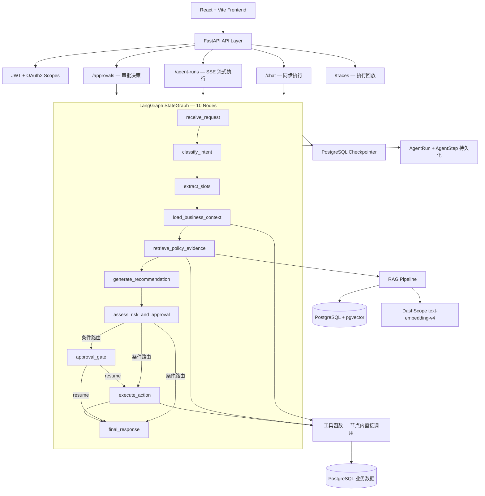
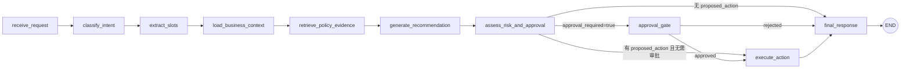
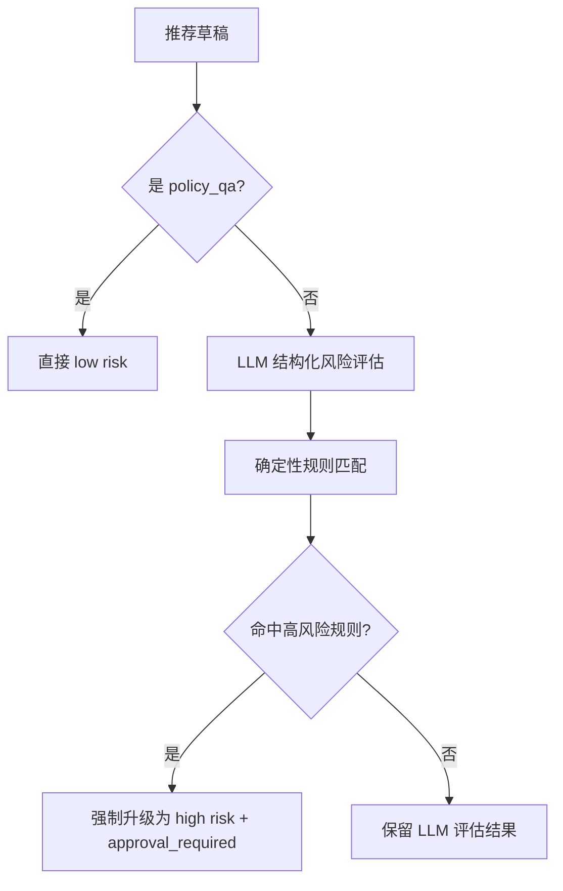
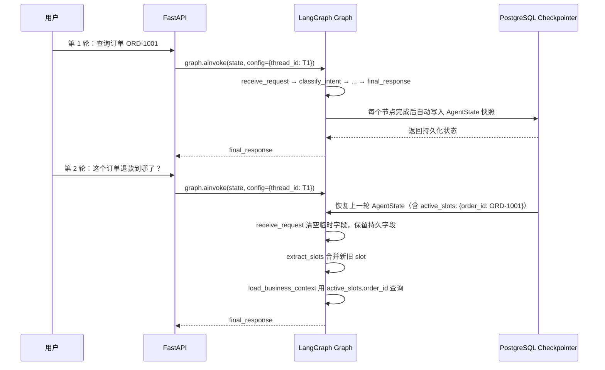

# MOCA Architecture Review

> 基于源码逐文件审查生成，反映代码实际实现而非设计意图。
> 审查日期：2026-05-23

## System Overview

MOCA 是一个面向电商商家运营团队的结构化 Agent 工作流系统，处理退款、争议、补偿等售后场景。核心特征：**固定流水线编排、确定性工具调用、双轨风险评估、人工审批门控、全链路审计**。



## Technology Stack

| Layer | Technology | Purpose |
| --- | --- | --- |
| API | FastAPI | REST API、OpenAPI docs、依赖注入 |
| Auth | JWT + OAuth2 scopes | 角色/权限粒度的端点访问控制 |
| Agent 编排 | LangGraph StateGraph | 有状态工作流图、条件路由、interrupt/resume 审批 |
| LLM | glm-5.1 via DashScope-compatible API | 结构化意图分类、slot 提取、推荐生成、风险评估 |
| Database | PostgreSQL 16 | 租户、用户、订单、退款、工单、审批、动作草稿、执行 trace |
| Vector search | PostgreSQL + pgvector (HNSW, cosine) | 政策文档 chunk 检索 |
| Embeddings | DashScope `text-embedding-v4` | 1024 维政策文档向量 |
| Infrastructure | Redis 7 | 配置已定义，代码中暂未使用 |
| Frontend | React + Vite | Chat、trace、evidence、approval UI |
| Evaluation | Python scripts + JSONL golden sets | RAG/agent 评分，JSON/Markdown 报告 |

## Agent Workflow

### Graph 拓扑



### 节点职责

| Node | LLM? | 职责 |
| --- | --- | --- |
| `receive_request` | No | 重置临时状态（防止 checkpointer 泄漏上一轮上下文），生成 `run_id` |
| `classify_intent` | Yes | 将用户查询分类为 `policy_qa` / `refund_troubleshooting` / `compensation_suggestion` / `approval_request` / `unknown` |
| `extract_slots` | Yes | 提取 `order_id`, `refund_case_id`, `ticket_id`, `merchant_id`, `customer_id`, `issue_type`，跨 turn 合并到 `active_slots` |
| `load_business_context` | No | 根据 intent 和 slots 确定性调用 `get_order` / `get_refund_case` / `get_ticket` |
| `retrieve_policy_evidence` | No | 调用 `search_policy` 工具，拼接 intent + query + 业务上下文作为检索 query |
| `generate_recommendation` | Yes | 综合业务上下文 + 政策证据，生成结构化推荐（含引用校验） |
| `assess_risk_and_approval` | Yes + Rules | LLM 评估风险 + 确定性规则覆盖（`rules/risk_rules.yaml`） |
| `approval_gate` | No | `interrupt()` 暂停图执行，等待人工审批（24h 超时） |
| `execute_action` | No | 创建动作草稿（模拟执行，无真实支付/退款） |
| `final_response` | No | **确定性模板拼接**，不调用 LLM |

### LLM 使用方式

所有 LLM 调用通过 `langchain_openai.ChatOpenAI` + `with_structured_output()` 实现结构化输出：

- **模型**：`glm-5.1`（DashScope-compatible endpoint）
- **温度**：0.0
- **超时**：90 秒
- **重试**：每个节点内 2 次结构化输出重试 + LangGraph `RetryPolicy(max_attempts=2)` = 最多 4 次
- **Pydantic schema**：`IntentResult`, `SlotExtractionResult`, `RecommendationDraft`, `RiskAssessment`
- **错误兜底**：LLM 调用失败时返回保守默认值（`unknown` intent, `insufficient_evidence` 等）

### 条件路由逻辑

`route_after_risk`（`assess_risk_and_approval` 之后）：

```python
if risk.approval_required:
    → approval_gate
elif proposed_action:
    → execute_action
else:
    → final_response
```

`route_after_approval`（`approval_gate` 之后）：

```python
if decision == "approve":
    → execute_action
else:
    → final_response
```

## Intent Recognition & Slot Extraction

意图识别和 slot 提取是 graph 中最先执行的两个 LLM 节点，它们的结果决定后续所有节点的行为。

### 意图分类（`classify_intent`）

**实现**：`src/agent/nodes/classify_intent.py` + `src/agent/prompts.py`（`CLASSIFY_INTENT_SYSTEM`）

使用 LLM 结构化输出（`with_structured_output(IntentResult)`），将用户查询分为 5 类：

| Intent | 含义 | 下游影响 |
| --- | --- | --- |
| `policy_qa` | 询问平台退款/退货/补偿/客服规则 | 跳过业务数据加载；风险评估直接标记 low |
| `refund_troubleshooting` | 问为什么某个订单/退款卡住/失败/延迟 | 触发 `get_order` / `get_refund_case` / `get_ticket` |
| `compensation_suggestion` | 问应该给多少补偿/优惠券/退款覆盖 | 触发业务数据加载；风险评估走 LLM + 规则双轨 |
| `approval_request` | 要求审批/拒绝/升级某个高风险操作 | 触发业务数据加载；风险评估走 LLM + 规则双轨 |
| `unknown` | 超出退款/订单/客服政策范围，或上下文不足 | 兜底路径，最终可能返回 insufficient_evidence |

**输出 schema**：

```python
class IntentResult(BaseModel):
    intent: Literal["policy_qa", "refund_troubleshooting", "compensation_suggestion", "approval_request", "unknown"]
    confidence: float = Field(ge=0.0, le=1.0)
    reasoning: str
```

**Prompt 设计**（`src/agent/prompts.py`）：
- 纯英文 system prompt，定义 5 种 intent 的边界
- 包含 4 个 few-shot 示例（中文输入 + JSON 输出）
- 要求只返回 JSON

**重试机制**：
- LLM 结构化输出校验失败时，追加错误信息重试，最多 2 次
- 2 次都失败则兜底返回 `intent: "unknown"`
- LangGraph 层面还有 `RetryPolicy(max_attempts=2)`，总共最多 4 次尝试

**意图对下游节点的影响**：

```python
# load_business_context.py:45
if intent in {"refund_troubleshooting", "compensation_suggestion"}:
    # 才会调用 get_order / get_refund_case / get_ticket

# assess_risk_and_approval.py:208
if state.get("current_intent") == "policy_qa":
    # 直接标记 low risk，跳过 LLM 风险评估

# retrieve_policy_evidence.py:40
# query 拼接时加入 intent 作为检索上下文
```

### Slot 提取（`extract_slots`）

**实现**：`src/agent/nodes/extract_slots.py` + `src/agent/prompts.py`（`EXTRACT_SLOTS_SYSTEM`）

紧接在意图分类之后执行，从用户查询中提取结构化标识符。

**输出 schema**：

```python
class SlotExtractionResult(BaseModel):
    order_id: str | None = None
    refund_case_id: str | None = None
    ticket_id: str | None = None
    merchant_id: str | None = None
    customer_id: str | None = None
    issue_type: str | None = None
```

**Prompt 设计**：
- 要求只返回 JSON，缺失字段用 null
- 强调"不要编造标识符"（Do not invent identifiers）
- 保留用户原文中的标识符文本

**跨 turn 合并**：

```python
# src/agent/nodes/extract_slots.py:76-77
new_slots = {key: value for key, value in extracted.items() if value is not None}
merged = {**(state.get("active_slots") or {}), **new_slots}
```

新提取的 slot 与 `active_slots` 合并，非空值覆盖，空值不覆盖。用户第 1 轮说"订单 ORD-1001"，第 2 轮说"退款单 RF-2002"，两轮的 slot 都保留在 `active_slots` 中。

**Slot 的下游消费**：
- `load_business_context` 读取 `active_slots` 决定调用哪些业务工具
- `retrieve_policy_evidence` 将 slot 信息拼入检索 query
- `assess_risk_and_approval` 从 `business_context` 中读取金额等信息做风险判断

### 意图识别的局限

- **无置信度阈值**：代码中不检查 `confidence` 值，即使低置信度也会直接使用分类结果
- **无意图修正**：如果分类错误，后续节点无法纠正，只能靠 `unknown` 兜底
- **无多意图**：每次只返回一个 intent，不支持"查订单 + 问规则"的复合查询
- **纯 LLM**：没有规则引擎或关键词匹配作为 fallback

## Tool Layer

**工具不是 LLM 通过 tool_use/function_calling 协议调用的。** 工具是节点内直接调用的 Python 函数，调用逻辑由节点代码确定性决定。

| 工具函数 | 调用节点 | 功能 | 权限检查 |
| --- | --- | --- | --- |
| `get_order` | `load_business_context` | 查询订单 + 关联 hints | merchant 角色只能查自己订单 |
| `get_refund_case` | `load_business_context` | 查询退款案例 | merchant 角色只能查自己退款 |
| `get_ticket` | `load_business_context` | 查询工单 | — |
| `search_policy` | `retrieve_policy_evidence` | RAG 政策检索 | 租户隔离 |
| `create_coupon_grant_draft` | `execute_action` | 创建动作草稿（幂等） | — |

所有工具遵循统一模式：
- 输入验证 → 业务查询 → 结构化返回（`{status, data, error}`）
- 超时保护（10-15 秒 `asyncio.wait_for`）
- 不抛异常，返回结构化错误

### 工具调用决策逻辑

**`load_business_context`**（`src/agent/nodes/load_business_context.py`）：
- 仅当 intent 为 `refund_troubleshooting` 或 `compensation_suggestion` 时调用业务工具
- 根据 `active_slots` 中是否有 `order_id` / `refund_case_id` / `ticket_id` 决定调用哪些工具

**`retrieve_policy_evidence`**（`src/agent/nodes/retrieve_policy_evidence.py`）：
- 始终调用 `search_policy`
- query 由 intent + user_query + order_status + refund_reason 拼接而成

## RAG Pipeline

### 文档入库

```
Markdown 政策文档
  → chunker（按 ##/### 标题切分，大段落按 800 字符目标二次切分，100 字符 overlap）
  → DashScope text-embedding-v4（1024 维，批量 ≤10 条/批）
  → PolicyChunk 表（pgvector 向量列 + HNSW 索引）
```

- 分块 ID 稳定：`{doc_key}_{chunk_index:03d}` 或 `{doc_key}_{chunk_index:03d}_part_{part_index}`
- 入库函数：`src/rag/ingestion.py` → `IngestionService.ingest_document()`

### 在线检索

```
用户 query
  → 前缀增强："电商售后政策查询: " + query
  → pgvector cosine 检索（过采样 4x，内部阈值 0.40）
  → Hybrid Rerank：
      score = vector_similarity
            + 0.12 × title_section_ngram_overlap
            + 0.08 × content_ngram_overlap
  → 领域锚点门控：
      含领域词（退款/补偿/订单等 17 个）→ 直接取 top_k
      不含领域词 → 要求 score ≥ 0.70 且有内容 overlap
  → 结果状态：strong_evidence (≥0.70) / partial_evidence (≥0.55) / no_evidence (<0.55)
```

检索函数：`src/rag/retriever.py` → `Retriever.search()`

### 引用校验

`src/rag/citation_validator.py`：
- 纯字段匹配（不使用 LLM judge）
- 校验 LLM 输出的 `chunk_id` 是否在检索结果中存在
- 无效引用被剔除；全部无效时标记 `citation_invalid`

## Risk Assessment（双轨评估）

`src/agent/nodes/assess_risk_and_approval.py`：



### 确定性规则（`rules/risk_rules.yaml`）

| Rule ID | 条件 | 风险等级 |
| --- | --- | --- |
| HR-01 | 补偿金额 > 500 CNY | high |
| HR-02 | 已发货订单全额退款 | high |
| HR-03 | 高风险商户 | high |
| MR-01 | 部分退款 | medium |
| MR-02 | 补偿 100-500 CNY | medium |
| MR-03 | 退款案例超 30 天 | medium |
| LR-01 | 默认 | low |

确定性规则有最终否决权——即使 LLM 评估为 low risk，只要命中 HR 规则就强制升级。

## Approval Workflow

### 中断

`src/agent/nodes/approval_gate.py` 使用 LangGraph `interrupt()` 原语：
- 暂停图执行，状态通过 PostgreSQL Checkpointer 持久化
- 中断数据：`proposed_action`, `risk_level`, `risk_rule_ref`, `expires_at`（24h）

### API 侧处理

两种执行路径都会捕获 `GraphInterrupt`：

1. **同步路径**（`POST /chat`）：`src/api/routers/agent.py` → `_handle_interrupt()`
2. **SSE 路径**（`GET /agent-runs/{id}/events`）：`src/api/routers/agent_runs.py` → `_handle_approval_required()`

两者都会：
- 创建 `ApprovalRequest` 记录
- 记录中断前的 trace steps
- 返回 `approval_id` 给前端

### 审批决策

`POST /approvals/{id}/decide`（`src/api/routers/approvals.py`）：
- 角色限制：仅 `admin` / `manager`
- 禁止自审批（`requested_by == decided_by` 检查）
- 过期检查（24h 超时自动 `expired`）
- 审批后通过 `graph.ainvoke(Command(resume=resume_payload), config)` 恢复图执行
- 恢复后追加 post-interrupt trace steps，更新 AgentRun 最终状态

## API Layer

### 路由结构

| Router | 端点 | 功能 |
| --- | --- | --- |
| `agent.py` | `POST /chat` | 同步 agent 执行（含 interrupt 处理） |
| `agent_runs.py` | `POST /agent-runs` | 创建 pending run |
| `agent_runs.py` | `GET /agent-runs/{id}` | 查询 run 状态 |
| `agent_runs.py` | `GET /agent-runs/{id}/events` | SSE 流式执行 + 实时节点事件 |
| `agent_runs.py` | `GET /agent-runs/{id}/evidence` | 去重后的 evidence 引用 |
| `approvals.py` | `GET /approvals` | 列出待审批 |
| `approvals.py` | `GET /approvals/{id}` | 查询审批详情 |
| `approvals.py` | `POST /approvals/{id}/decide` | 审批决策 + 恢复图执行 |
| `traces.py` | `GET /agent-runs/{id}/trace` | 执行 trace 回放 |
| `orders.py` | 订单查询 | 业务数据 API |
| `refund_cases.py` | 退款案例查询 | 业务数据 API |
| `tickets.py` | 工单查询 | 业务数据 API |
| `search.py` | 政策检索 | RAG 直接查询（测试用） |
| `auth.py` | 登录/token | 认证 |

### SSE 事件流

`agent_runs.py` 的 SSE 实现：
- 使用 `sse-starlette` 的 `EventSourceResponse`
- 15 秒心跳保活
- 事件类型：`run_started`, `step_started`, `step_completed`, `approval_required`, `final_response`, `error`
- 每个节点完成时推送 `step_completed` 事件，含节点特定 payload（evidence_count, risk_level 等）

### 权限模型

- JWT 认证 + OAuth2 scopes（`agent:chat`, `approvals:review` 等）
- 角色：`support`（客服）, `merchant`（商家）, `manager`（经理）, `admin`
- 商户角色在工具层做数据访问隔离（只能查自己 merchant_id 的订单/退款）
- 审批禁止自审批

## State 设计

`src/agent/state.py` — `AgentState(TypedDict)`：

### 持久字段（跨 turn 保留，checkpointer 管理）

| Field | Type | 说明 |
| --- | --- | --- |
| `thread_id` | str | 对话线程 ID |
| `tenant_id` | str | 租户隔离 |
| `user_id` | str | 用户 ID |
| `role` | str | 用户角色 |
| `active_slots` | ActiveSlots | 跨 turn 合并的 slot（order_id, refund_case_id 等） |
| `last_intent` | str \| None | 上一轮意图 |
| `last_recommendation_summary` | dict \| None | 上一轮推荐摘要 |
| `evidence_refs` | list[EvidenceRef] | 跨 turn 累积的证据引用 |
| `last_business_context_refs` | dict \| None | 上一轮业务上下文引用 |

### 临时字段（每 turn 由 `receive_request` 重置）

| Field | Type | 说明 |
| --- | --- | --- |
| `user_query` | str | 当前用户查询 |
| `current_intent` | str | 当前意图 |
| `extracted_slots` | dict | 当前提取的 slot |
| `business_context` | dict | 当前业务上下文（订单/退款/工单数据） |
| `retrieved_evidence` | dict | 当前 RAG 检索结果 |
| `recommendation_draft` | dict | 当前推荐草稿 |
| `risk_assessment` | dict | 当前风险评估 |
| `proposed_action` | dict | 当前提议动作 |
| `approval_result` | dict | 当前审批结果 |
| `action_result` | dict | 当前执行结果 |
| `final_response` | str | 最终回复文本 |
| `trace_steps` | list[dict] | 当前 turn 的执行 trace |

Thread ID 格式：`{tenant_id}:{user_id}:{thread_id}`（跨用户/租户隔离）。

## Memory / State Persistence

MOCA 没有传统意义上的"记忆模块"（无 mem0、Zep、LangChain ConversationBufferMemory 等）。它的跨 turn 记忆完全依赖 **LangGraph Checkpointer 对 AgentState 的自动持久化**。

### 机制



### 初始化

```python
# src/api/main.py:30-34
async with AsyncPostgresSaver.from_conn_string(settings.checkpointer_database_url) as checkpointer:
    await checkpointer.setup()  # 创建 checkpoints 表
    app.state.agent_graph = build_graph(checkpointer)
```

`AsyncPostgresSaver` 在应用启动时创建一次，生命周期跟随 FastAPI app。LangGraph 在每个节点完成后自动序列化整个 `AgentState` 写入 PostgreSQL 的 `checkpoints` 表。

### Thread 隔离

```python
# src/api/routers/agent.py:149
def _checkpoint_thread_id(*, user: User, thread_id: str) -> str:
    return f"{user.tenant_id}:{user.id}:{thread_id}"
```

Thread key = `{tenant_id}:{user_id}:{thread_id}`。同一 thread 的多次调用共享状态，不同用户/租户完全隔离。

### 选择性清空

`receive_request` 节点负责每 turn 的状态清洗：

```python
# src/agent/nodes/receive_request.py
async def receive_request(state: AgentState) -> dict:
    return {
        "user_query": state.get("user_query"),   # 保留当前输入
        "current_intent": None,                    # 清空
        "business_context": None,                  # 清空
        "recommendation_draft": None,              # 清空
        "risk_assessment": None,                   # 清空
        # ... 所有临时字段置空
        # 持久字段（active_slots, last_intent, evidence_refs 等）不返回 → 保留
    }
```

LangGraph checkpointer 的合并逻辑：只更新返回的 key，不返回的 key 保留原值。所以 `receive_request` 只返回要清空的字段，持久字段自然保留。

### 跨 turn 合并

两个持久字段有**合并**逻辑（非简单覆盖）：

**`active_slots`** — 用户逐步提供标识符：

```python
# src/agent/nodes/extract_slots.py:76-77
new_slots = {key: value for key, value in extracted.items() if value is not None}
merged = {**(state.get("active_slots") or {}), **new_slots}
```

第 1 轮用户提供 order_id，第 2 轮提供 refund_case_id，两轮的 slot 都保留。

**`evidence_refs`** — 政策证据跨 turn 累积：

```python
# src/agent/nodes/retrieve_policy_evidence.py:92-104
def _merge_evidence_refs(existing, new):
    seen = set()
    for ref in [*existing, *new]:
        key = (ref["doc_key"], ref["chunk_id"])
        if key not in seen:
            seen.add(key)
            merged.append(ref)
```

同一 chunk 不重复，不同 turn 检索到的新 chunk 追加。

### 范围边界

| 通常记忆模块有的 | MOCA 有没有 |
| --- | --- |
| 对话历史（messages list） | **没有** — State 里没有 `messages` 字段，不用 `add_messages` |
| 记忆摘要/压缩 | **没有** — 没有 summarization 逻辑 |
| 向量记忆检索 | **没有** — 没有 MemoryVectorStore 或类似机制 |
| 跨 session 长期记忆 | **没有** — thread 结束后状态不再访问 |
| 用户偏好记忆 | **没有** — 不记忆用户的历史行为模式 |

**本质**：MOCA 的记忆是**任务状态持久化**（"用户之前查过哪个订单"），不是**对话记忆**（"用户上次问了什么问题"）。

## Trace Persistence

### 持久化结构

- `AgentRun`：run 级元数据（tenant, user, thread, input, final_status, final_response, latency, tokens）
- `AgentStep`：每个 graph 步骤（node_name, status, latency, tool_name, evidence_refs, metrics_json）

### Trace 写入

- `src/agent/trace.py` 提供 `write_agent_run()`, `write_agent_steps()`, `append_agent_steps()`, `update_agent_run_status()`
- 各节点内 `_trace_step()` 函数生成 trace 数据
- 中断后恢复时，通过 `append_agent_steps()` 追加 post-interrupt 步骤（不重复写入）

### Trace API

- `GET /agent-runs/{id}/trace`：完整 trace 回放
- `GET /agent-runs/{id}/evidence`：去重后的 evidence 引用

## Key Design Decisions

| Decision | Rationale |
| --- | --- |
| 固定流水线（非 ReAct） | 确定性和可审计性优先于灵活性 |
| 工具节点内直接调用（非 LLM tool_use） | 避免 LLM 幻觉调用，工具选择由代码逻辑决定 |
| `final_response` 用模板（非 LLM 生成） | 避免最终回复出现幻觉，代价是回复不够自然 |
| 双轨风险评估（LLM + 确定性规则覆盖） | LLM 做初判，规则做终审，安全边界硬 |
| 引用校验纯字段匹配（非 LLM judge） | 简单可靠，避免 LLM judge 引入新的幻觉 |
| `active_slots` 跨 turn 合并 | 用户在多轮对话中逐步提供信息，无需一次性说清 |
| `receive_request` 选择性清空 | 清空临时执行上下文，保留跨 turn 有用的业务状态 |
| 动作草稿模拟执行 | 无真实支付/退款，审计完整但不产生副作用 |
| HNSW + hybrid rerank | 对中文短 query 的向量检索效果优化 |
| `interrupt()` 而非 `interrupt_before` | 更新的 API，状态管理更干净 |

## Known Limitations

- **Redis 未使用**：`redis_url` 仅在 config 中定义，代码中无实际 Redis 调用
- **无跨 session 记忆**：记忆范围限于同一 thread，无长期记忆
- **单租户 demo**：数据模型和 repository 层有 tenant_id 隔离，但 demo 为单租户
- **模拟执行**：所有写操作创建 action draft，不产生真实业务副作用
- **CI 仅跑 lint + unit**：DB-backed 集成测试和 LLM 评估为本地命令

## Repository Structure

```text
src/
├── agent/                  # LangGraph 编排层
│   ├── graph.py            # StateGraph 组装、条件路由函数
│   ├── state.py            # AgentState TypedDict（持久/临时字段分离）
│   ├── prompts.py          # LLM 系统提示词
│   ├── schemas.py          # Pydantic 结构化输出 schema
│   ├── trace.py            # Trace 持久化、trace summary 构建
│   ├── nodes/              # 10 个 graph 节点
│   │   ├── receive_request.py
│   │   ├── classify_intent.py
│   │   ├── extract_slots.py
│   │   ├── load_business_context.py
│   │   ├── retrieve_policy_evidence.py
│   │   ├── generate_recommendation.py
│   │   ├── assess_risk_and_approval.py
│   │   ├── approval_gate.py
│   │   ├── execute_action.py
│   │   └── final_response.py
│   └── tools/              # 工具函数（节点内直接调用）
│       ├── get_order.py
│       ├── get_refund_case.py
│       ├── get_ticket.py
│       ├── search_policy.py
│       ├── create_coupon_grant_draft.py
│       └── authz.py        # 商户数据访问权限检查
├── api/                    # FastAPI 层
│   ├── main.py             # App factory
│   ├── deps.py             # 依赖注入
│   └── routers/            # 路由
│       ├── agent.py        # POST /chat（同步）
│       ├── agent_runs.py   # POST/GET /agent-runs（SSE 流式）
│       ├── approvals.py    # 审批决策 + 图恢复
│       ├── traces.py       # Trace 回放
│       ├── orders.py       # 订单 API
│       ├── refund_cases.py # 退款案例 API
│       ├── tickets.py      # 工单 API
│       ├── search.py       # RAG 直接查询
│       └── auth.py         # 登录/token
├── rag/                    # RAG 管线
│   ├── chunker.py          # Markdown 分块（标题切分 + 滑动窗口）
│   ├── embedder.py         # DashScope embedding 封装
│   ├── retriever.py        # 检索 + hybrid rerank
│   ├── citation_validator.py # 引用校验
│   ├── ingestion.py        # 文档入库
│   └── schemas.py          # EvidenceItem, RetrievalResult, CitationValidation
├── repositories/           # 数据访问层
│   ├── base.py
│   ├── order_repo.py
│   ├── refund_repo.py
│   ├── ticket_repo.py
│   ├── approval_repo.py
│   ├── action_draft_repo.py
│   ├── policy_chunk_repo.py
│   ├── policy_document_repo.py
│   ├── audit_repo.py
│   └── trace_repo.py
├── auth/                   # 认证
│   ├── jwt.py
│   └── permissions.py
├── db/                     # 数据库
│   ├── models.py           # SQLAlchemy 2.0 async models
│   ├── session.py          # async engine + session factory
│   └── migrations/         # Alembic
└── config.py               # pydantic-settings
```

---

*审查基于源码逐文件比对，2026-05-23*
