# MOCA Agent Contract Specification

> 文档类型：NORMATIVE
> 描述范围：MOCA Agent 架构的详细已接受契约、目标语义与兼容边界
> 最后核验：2026-08-04（文档入口与当前事实索引）
> 权威来源：已接受契约、具名实现决策与 canonical schema owner
> 更新触发：schema、owner、authority、状态语义、兼容策略或目标契约变化

本文是 MOCA Agent 架构的主要详细契约参考。[公开文档入口](README.md)列出的 CURRENT、NORMATIVE 与 GUIDE 文档用于概括当前实现、已接受语义和可执行操作，但不能静默替换本文的详细契约。

This file is also a living contract, not an immutable authority. Older sections may describe target contracts that were not fully implemented yet, or semantics that a later phase intentionally replaces. A phase must not treat historical text here as proof that the current code already behaves that way. When a new phase discovers conflict between this contract, the codebase, tests, and the accepted product model, the phase must surface the conflict, then amend this file or record an explicit MVP scope/deferral before implementation proceeds.

## 0.1 Target architecture delta sync rule

Design discussions, phase plans, and implementation proposals do not become normative until this file is amended or a named implementation decision records an explicit mapping to the canonical contracts below. In particular, proposed registered nodes/routers, `TrustedContext` fields, AgentState fields, RAG/claim verification bundles, tool policy decisions, business fact refs, and decision event envelopes must not silently widen or rename the canonical contracts in this file.

Phase 0 target architecture delta accepted here:

- §9 accepts the target graph vocabulary for Phase 5 Intent Graph migration, while keeping current implementation node/router names as legacy aliases until that migration completes.
- §10 accepts AgentState registry fields for deterministic RAG context build and post-generation claim verification.
- §8.3 / §8.4 / §12.6 / §17.2 freeze minimal contracts for `VerifiedEvidencePackageV1`, `MaterialClaimV1`, `ClaimVerificationBundleV1`, `BusinessFactResultV1`, `ToolView`, `ToolPolicyDecision`, and `DecisionEventEnvelopeV1`.
- §8.0.1 accepts Phase 29.5 role-to-merchant-scope policy for the single-tenant MVP: `support`, `manager`, and legacy `merchant` are merchant-bound business users; `admin` is the only human platform-wide business-data role; tenant public policy scope is separate from business merchant scope.

## 0.2 Module ownership boundary registry

This registry is the normative APF-02 ownership contract for the v1.9 agent platform foundation. Runtime graph nodes and routers may orchestrate these modules only through their public methods. A dependency that does not fit this registry requires a spec delta or a named phase decision before implementation.

| Module | Owned schemas/tables/events | Public methods | Allowed downstream dependencies | Forbidden imports/access | Decision events |
| --- | --- | --- | --- | --- | --- |
| `RunOrchestrator` | run entry/lifecycle orchestration refs, graph invocation refs, finalize/schedule refs | `start_run`, `invoke_graph`, `finalize_run`, `schedule_post_response_jobs` | `TrustedContextFactory`, Agent Graph, `RunLifecycleService`, Observability | Direct business/memory/RAG repository access; business rules | run lifecycle and orchestration decision events |
| `TrustedContextFactory` | canonical `TrustedContext`, projection schemas | `create_from_request`, `project_to_tool_context`, `project_to_knowledge_context`, `project_to_memory_context`, `project_to_approval_context`, `project_to_replay_context` | trusted auth/session/run metadata sources | LLM/user payload identity or scope overrides; projection-local fields widened into canonical context | trusted context projection decision events |
| `IntentService` | `IntentCandidate`, `ResolvedIntent`, intent policy decision, slot policy decision | `resolve_contextual_intent`, `resolve_required_slots`, `route_after_contextual_intent` adapter | `SessionContextMemory`, `IntentPolicyRegistry`, `SlotPolicyRegistry` | tool/repository calls; model confidence as authorization | intent policy and slot policy decision events |
| `MemoryContextService` | session/long-term/case memory projections, write candidates, review queue refs | `load_session_context_for_intent`, `load_memory_bundle_after_slot_resolution`, `propose_memory_writes` | memory repositories, redaction policy, review queue | satisfying policy evidence, current business fact, approval/action, or replay truth | memory load/write policy decision events |
| `ToolPlatform` | `ToolDescriptor`, `ToolView`, `ToolPolicyDecision`, runtime auth, tool result projection, tool decision events | `visible_tools`, `invoke` | `ToolPolicyEngine`, domain service public methods, artifact store | graph/investigate custom allowlists; raw adapter payloads in prompts | tool visibility and runtime auth decision events; projection outputs carry decision/event refs |
| `KnowledgeService` | `EvidenceRefV1`, `VerifiedEvidencePackageV1`, `MaterialClaimV1`, `ClaimVerificationBundleV1`, evidence validation, claim verification decisions | `search`, `build_verified_context`, `verify_claims` | policy/chunk repositories, retrieval engine, domain rule verifier plugins | judging current business facts; citation membership as semantic support | retrieval, evidence validation, and claim verification decision events |
| `BusinessFactService` | `BusinessFactResultV1`, `BusinessFactRefV1`, `BusinessContextV1`, resource freshness/scope checks | `fetch_context`, `get_order`, `get_refund_case`, `get_ticket` | owned business repositories/adapters | graph/tool direct repository access; memory/RAG/LLM-substituted facts | business fact read, scope, and freshness decision events |
| `ApprovalService` | approval request/revision/interrupt/resume state machine, approval records/events | `create_request`, `record_decision`, `resume_with_trusted_decision`, `request_more_info` | risk/approval policy, snapshot refs, trusted resume adapter | risk auto/block ownership; ordinary chat as approval truth | approval request, decision, resume, and lifecycle decision events |
| `ActionDraftService / ExecutionBoundary` | action proposal/draft records, payload hashes, draft safety binding | `create_draft`, `bind_safety_snapshot`, `prepare_execution_boundary` | trusted approval result, risk policy output, snapshot store | real external side effects in v1.9; approval/snapshot/action policy bypass | action draft and safety binding decision events |
| `Observability / Replay` | `DecisionEventEnvelopeV1`, minimal event envelope, replay artifacts, redaction policy, eval artifact refs | `emit_decision_event`, `append_trace_event`, `build_replay_view`, `record_eval_artifact_ref` | service decision events, artifact stores, sequence allocator | replay by rerunning LLMs; raw prompt/tool/PII/action payload persistence | decision event envelope and replay lifecycle events |

## 8. Service contracts (Knowledge / Business Tools)

> Producer phase + schema_version annotation: Canonical `TrustedContext` (`trusted_context.v1`) — Phase 7 shared contract (§8.0). KnowledgeService facade and `evidence_ref.v1` / `knowledge_search_request.v2` / `knowledge_search_result.v2` — Phase 8. BusinessToolService facade and `ToolCallContext` / `ToolResultV2` — Phase 9. EvidenceRefV1 is the canonical schema owned by Phase 8; Phase 13 (snapshot) and Phase 15 (replay) must import it and must not define reduced variants. The current module narrative lives in `docs/architecture/system-overview.md`, `docs/architecture/tools-and-business-facts.md`, and `docs/architecture/rag-and-grounding.md`; the normative contracts are here.

### 8.0 Canonical TrustedContext (normative)

> Producer phase + schema_version annotation: Phase 7 shared foundation contract; schema_version literal is `trusted_context.v1`. This is the single canonical trusted-identity/scope contract. `KnowledgeContext` (§8.3), `ToolCallContext` (§12.5), and `AgentState` identity fields (§10) are projections of it and MUST NOT redefine, widen, or rename these fields. Per F4/F5, the producer owns the schema; consumers project and never redefine a divergent variant.

`TrustedContext` 是 canonical trusted identity/scope 契约。它来自 trusted API/auth/run boundary，**不可由 LLM 输出或用户 payload 覆盖、伪造或扩展**。Phase 8 与 Phase 9 在本节冻结后可并行（B1）；Phase 9 business tool 结果不复用 policy `EvidenceRefV1`，因此 Phase 9 不依赖 Phase 8 的 EvidenceRefV1 schema。

| Field | Type | Required | Trusted source | Rule |
| --- | --- | --- | --- | --- |
| `schema_version` | literal | yes | n/a | 固定 `trusted_context.v1` |
| `tenant_id` | string/uuid | yes | API auth | 租户隔离根；所有下游 scope 校验以此为准 |
| `user_id` | string/uuid | yes | API auth | 发起 principal；用于 self-approval/可见性判断 |
| `role` | string | yes | API auth | RBAC 角色；不可由模型推断 |
| `permissions` | list[string] | yes | API auth | 已授权的 permission/scope tokens；adapter/facade 在执行前校验，不可由模型扩展 |
| `merchant_scope` | object | yes | API auth / run config | allowed merchant ids/categories/risk levels；adapter 在执行前校验 |
| `session_id` | string \| null | optional | API/session layer | optional product/session grouping（见 §10.3）；缺省可为 null |
| `thread_id` | string | yes | API request | conversation/checkpointer scope |
| `run_id` | string | yes | RunService / receive_request | one graph execution/audit run |
| `trace_id` | string | conditional | API middleware / OTel | request/distributed trace correlation；后台 finalizer 事件可为空 |
| `locale` | string \| null | optional | API request | UI/检索语言；仅 KnowledgeContext 等需要本地化的投影使用 |

`merchant_scope` 使用 normative `MerchantScopeV1`：

```python
class MerchantScopeV1(BaseModel):
    schema_version: Literal["merchant_scope.v1"] = "merchant_scope.v1"
    merchant_ids: list[str]
    categories: list[str] | None = None
    risk_levels: list[str] | None = None
    match_rule: Literal["all_provided_dimensions"] = "all_provided_dimensions"
```

`MerchantScopeV1` 的 match rule 是所有已提供维度均必须匹配。空或缺失 scope 表示 deny-all，不表示 unrestricted；只有显式 `"*"` token 才表示对应维度 wildcard；deny 先于 allow。该 scope 是 trusted context，不可由模型或用户输入设置、覆盖或扩展。`permissions` 是 namespaced tokens（例如 `tool:get_order`、`knowledge:search`），必须在 adapter execution 前校验；unknown token 或空 permissions 均表示 deny。Phase 8/Phase 9 contract tests 必须包含 deny-all、unknown-category 和 no-widening negative cases。

### 8.0.1 Role-to-MerchantScope Policy (normative)

Phase 29.5 冻结 MOCA 单 tenant MVP 的 role-to-merchant-scope 规则。本节只定义 business data scope；tenant public policy scope 见 §8.0.2 / §8.3。

Role registry：

```python
merchant_bound_roles = {"support", "manager", "merchant"}
platform_admin_roles = {"admin"}
```

Role semantics：

- `support` 是商家客服 / customer support。
- `manager` 是商家客服主管 / support manager；它不是 tenant-wide supervisor。
- `merchant` 是 legacy 商家用户 role；兼容期按 `support` 处理，不作为推荐新增 role。
- Phase 36 implementation target: `merchant` remains enabled only as a deprecated compatibility role,
  is support-equivalent for merchant-bound business data, is not a recommended new role in seeds/examples,
  and never grants platform-wide or tenant-wide business scope.
- `admin` 是 platform admin，是唯一 human platform-wide business-data role。
- 任何新增或未知 role 在未显式归类前按 merchant-bound deny-all 处理；不得因为名称包含 `supervisor`、`approval_manager`、`agent` 等词而自动获得 tenant-wide scope。

Merchant scope derivation：

- `support` / `manager` / legacy `merchant`：
  - `user.merchant_id` 存在时，`merchant_scope = {"merchant_ids": [str(user.merchant_id)]}`。
  - `user.merchant_id` 缺失时，`merchant_scope = {"merchant_ids": []}`，表示 deny-all for business data。
- `admin`：
  - `merchant_scope = {"merchant_ids": ["*"]}`。
- `merchant_scope=["*"]` 只能来自可信服务端对 `admin` role 的判断，不得来自 LLM、request body、frontend payload、checkpoint state、memory、RAG、tool args 或 ordinary approval chat。
- Phase 61 metric reads add trusted OAuth scope `metrics:read`, mapped by `TrustedContextFactory` to `tool:query_business_metric`. For legacy `merchant`, this scope is compatibility-only and remains own-bound to the derived merchant scope; it does not create a broader analytics role.

Server override rules：

- `server_merchant_scope` 是 trusted narrowing input，只能收窄 human actor 从 role/merchant binding 推导出的 scope，不能扩大。
- Non-admin human actor 的 `server_merchant_scope={"merchant_ids":["*"]}` 必须被拒绝；不得静默采用，也不得静默收窄后继续执行。
- `server_tool_permissions` 只影响 tool permission，例如 action draft resume 所需的服务端工具权限；它不得扩大 `merchant_scope`。
- System-owned internal job wildcard scope 不由 `TrustedContextFactory.create_from_request(user=...)` 授权。未来若需要 system wildcard，必须先定义单独 `TrustedSystemContext` / actor type / job identity / reason code / decision event contract。

Business data access rules：

- `support` / `manager` / legacy `merchant` 只能访问自己 merchant 的 business data。
- `admin` 可以跨 merchant 访问 business data。
- Business data 包括 order、refund case、ticket、business facts、approval/action objects、agent runs/traces/evidence tied to business objects、business-scoped memory/replay artifacts。
- Cross-tenant resources must not leak existence. API paths return 404 for cross-tenant not-found/no-leak cases.
- Same-tenant out-of-merchant-scope business resources must return 403 at API layer.
- Service/tool paths such as `BusinessFactResultV1.permission_denied` must not reveal whether the underlying resource exists.
- Phase 61 no-existence-leak metric scope rule: `business_metric_query` / `query_business_metric` may only use trusted `ToolCallContext.tenant_id` and `merchant_scope`; tool args such as `tenant_id`, `merchant_scope`, or wildcard scope must not widen authority. Unauthorized merchant metric requests return a safe denial without confirming whether that merchant exists.

Required interim guards until target merchant binding lands in later phases：

- `manager` must not be treated as a tenant-wide supervisor for business-data run, evidence, trace, approval, or action visibility.
- Business-data AgentRun status/evidence/trace access is limited to run owner and `admin` unless a later phase proves same-merchant access through target merchant or scoped `BusinessFactRefV1`.
- Phase 29.5 manager approval list/get/decide is admin-only / fail-closed until Phase 34 target merchant / `BusinessFactRefV1` binding exists. Phase 29.5 must not use `requested_by -> user.merchant_id` as a temporary authorization approximation.
- Approval resume must not use wildcard `server_merchant_scope` for non-admin human actors.
- Business-data wildcard merchant scope must not be constructed outside `TrustedContextFactory` / trusted system context. Fallback paths in graph nodes, tool executors, checkpoint recovery, memory, RAG, or approval resume must fail closed instead of fabricating `{"merchant_ids":["*"]}`.

### 8.0.2 Business Scope vs Tenant Public Policy Scope (normative)

Business merchant scope and tenant public policy scope are separate.

Tenant public policy retrieval：

- Requires trusted `tenant_id` and `knowledge:read` / `tool:search_policy` permission.
- Does not require wildcard merchant scope.
- Must not be denied solely because a merchant-bound user has `merchant_scope=[merchant_id]` or deny-all business scope `merchant_scope=[]`.
- Must ignore user, request body, frontend, memory, checkpoint, tool args, or LLM attempts to widen tenant/policy/merchant scope.
- An empty business merchant scope may still perform policy-only tenant public policy retrieval when authenticated and authorized. The same scope remains deny-all for business data and for merchant-specific/business-scoped policy filters.

Business data reads：

- Require trusted `tenant_id`, appropriate business read permission, and merchant scope authorization.
- Must use BusinessFactService domain ownership proof before returning facts or emitting `BusinessFactRefV1`.
- Must not use tenant public policy evidence, memory, or LLM inference to prove current order/refund/ticket facts.
- For service/tool paths, `permission_denied` must not reveal whether the underlying resource exists.

Future merchant-specific policy：

- Merchant-specific policy is not part of Phase 29.5.
- If introduced later, it must define an explicit policy scope and must not silently reuse business data merchant access rules as retrieval filters for tenant public policies.

Projection 规则（消费者只取子集，字段语义与本表一致，不得重命名或放宽 trusted-source）：

| Projection | Section | Subset fields | Notes |
| --- | --- | --- | --- |
| `KnowledgeContext` | §8.3 | `tenant_id`, `user_id`, `role`, `merchant_scope`, `run_id`, `trace_id`, `locale`, `effective_at` | `effective_at` 不是 TrustedContext 字段，而是 run-derived 检索时间（默认 run start，见 §8.3）；其余字段是 TrustedContext 投影。`merchant_scope` 必填，使 KnowledgeService 能校验 request 的 `merchant_id` filter 是否在授权范围内 |
| `ToolCallContext` | §12.5 | `tenant_id`, `user_id`, `role`, `permissions`, `merchant_scope`, `session_id`, `thread_id`, `run_id`, `trace_id` + tool-call-local fields | tool-call-local fields（`request_id`/`tool_call_id`/`caller_node`/`deadline_at`/`effective_at`/`attempt`/`idempotency_key`/`approval_ref`/`safety_snapshot_ref`/`policy_snapshot_ref`）由调用方注入，不属于 TrustedContext |
| `AgentState` identity | §10 | `tenant_id`, `user_id`, `role`, `session_id`, `thread_id`, `run_id`, `trace_id` | §10.1 lifecycle matrix 的 Identity context 行；`replace from trusted config only` |

AgentState identity 投影不携带 `permissions` / `merchant_scope`；需要它们的 service context（ToolCallContext / KnowledgeContext）必须在 node 内从 trusted graph/run config 构造，不从持久化的 AgentState 读取，避免过期权限随 checkpoint 泄漏。

Phase 10 负责把这三个投影在实现层收敛到同一 `TrustedContext` 来源；Phase 8 不得直接依赖 Phase 9 `ToolCallContext`，但两者的 identity 字段必须都来自本节同一 canonical 定义。

### 8.3 Knowledge / RAG (normative)

KnowledgeService facade signature:

- `PolicyKnowledgeService.search(request: KnowledgeSearchRequest, context: KnowledgeContext) -> KnowledgeSearchResult`。
- 管理 query rewrite、embedding、hybrid rerank、threshold、no-evidence fallback。
- 管理 EvidenceRef、claim/evidence binding 和 citation validation。
- 对 Agent 只暴露 evidence contract，不暴露 pgvector/repo 细节。

`KnowledgeContext` 是 canonical `TrustedContext`（§8.0）的 lightweight projection，字段为 `tenant_id`、`user_id`、`role`、`merchant_scope`、`run_id`、`trace_id`、`locale`（均为 §8.0 TrustedContext 投影）加上 run-derived `effective_at`（默认 run start time，不是 TrustedContext 字段）。它不得引入未在 §8.0 定义的 identity/scope 字段，并在 Phase 10 与 Phase 9 `ToolCallContext` 收敛到同一 `TrustedContext` 来源；Phase 8 不得直接依赖 `ToolCallContext`。Knowledge request 的 `filters.merchant_id` 必须由 KnowledgeService 用 `merchant_scope` 校验后才可作为检索过滤条件，不得信任模型/用户提供的未授权 merchant id。

Knowledge request contract：

```json
{
  "schema_version": "knowledge_search_request.v2",
  "query": "退款超过承诺时效怎么办",
  "primary_intent": "refund_troubleshooting",
  "business_context_refs": [{"type": "refund_case", "id": "RF-1001"}],
  "filters": {
    "tenant_id": "uuid",
    "merchant_id": "uuid-or-null",
    "policy_types": ["refund", "compensation"],
    "effective_at": "2026-06-05T00:00:00Z",
    "locale": "zh-CN"
  },
  "retrieval_config_version": "retrieval.v3",
  "rerank_config_version": "rerank.v2",
  "max_results": 5,
  "allow_partial_evidence": true
}
```

Knowledge result contract：

```json
{
  "schema_version": "knowledge_search_result.v2",
  "status": "strong_evidence | partial_evidence | no_evidence | error",
  "query_rewrite": "退款超时 补偿 政策",
  "retrieval_config_version": "retrieval.v3",
  "rerank_config_version": "rerank.v2",
  "best_score": 0.82,
  "threshold": 0.72,
  "evidence_refs": [
    {
      "schema_version": "evidence_ref.v1",
      "evidence_id": "policy_refund_timeout/chunk_001@v3",
      "tenant_id": "uuid",
      "doc_key": "policy_refund_timeout",
      "chunk_id": "chunk_001",
      "policy_version": "2026-06-01",
      "text_hash": "sha256:...",
      "score": 0.82,
      "rank": 1,
      "retrieved_at": "2026-06-05T00:00:00.000Z",
      "retrieval_config_version": "retrieval.v3"
    }
  ],
  "citation_validation": {
    "validator_version": "citation_validator.v2",
    "claim_results": []
  },
  "summary": "找到退款超时处理政策。",
  "error": null
}
```

#### Canonical EvidenceRefV1

Knowledge result、AgentState evidence refs、`ActionSafetySnapshot.evidence` 和所有 hashable `evidence_ref.v1` 字段必须使用同一个 canonical `EvidenceRefV1`；不得为 snapshot、replay 或 tool result 定义字段较少的变体。

| Field | Type | Rule |
| --- | --- | --- |
| `schema_version` | literal | 固定 `evidence_ref.v1` |
| `tenant_id` | string/uuid | 必填，来自 trusted scope |
| `evidence_id` | string | 必填，稳定 evidence identity |
| `doc_key` / `chunk_id` | string | 必填 |
| `policy_version` | string | 必填 |
| `text_hash` | string | 必填，`sha256:<lowercase hex>` |
| `retrieved_at` | RFC3339 UTC datetime | 必填 |
| `retrieval_config_version` | string | 必填 |
| `score` | number, optional | 仅用于 retrieval/eval，不改变 identity；Knowledge result 可保留，但 snapshot/hash builder 必须剔除 |
| `rank` | integer, optional | retrieval 排名，若存在必须为正整数；可保留并进入 snapshot/hash material |

`evidence_text_hash.v1` normalization 子规范：对 policy/chunk text 先做 Unicode NFC，strip leading/trailing whitespace，将内部 newline 统一为 `\n`，且不得对 policy text 做 case-folding；随后对规范化文本的 UTF-8 bytes 计算 SHA-256，并输出 `sha256:<lowercase hex>`。Phase 8 contract tests 必须固定该规范的 golden cases。

Snapshot/hash 使用同一 canonical `EvidenceRefV1` schema，但使用其明确的 hash projection：剔除 retrieval/eval-only `score`，保留存在的 `rank`。`EvidenceRefV1[]` 排序优先使用 `rank`；所有元素都有 rank 时按 `(rank, evidence_id, text_hash)`，任一元素缺 rank 时按 `(evidence_id, text_hash)`，不得依赖 retrieval 返回顺序。Knowledge result 和 AgentState 可以保留裸 float `score`，但任何 snapshot/hash builder 都必须先剔除 `score`，不得把裸 float 送入 CanonicalHashProfile v1。

Knowledge rules：

- Tenant-scoped policy wins over global/default policy when both apply; global policy is fallback only. 当前 MVP 只实现 tenant-scoped policy 检索与评估；global/default policy fallback 与 tenant-over-global 优先级合并属于目标态，由 post-Phase 17 `Policy Scope` phase 落地，本条 normative 描述目标语义。
- `effective_at` must be explicit and defaults to run start time, not wall-clock query time inside the adapter.
- Partial evidence may support explanatory recommendations, but cannot authorize write actions unless risk/action policy explicitly allows partial evidence.
- `no_evidence` for policy-required actions routes to insufficient evidence or manual review, not action draft.
- Phase 8 deterministic citation membership validation checks only that each cited `evidence_id` is present in the retrieval result; membership is not semantic claim support.
- Semantic/support validation is a separate deferred contract requiring its own eval or reviewed rule-based claim-to-evidence mapping; it must not be inferred from citation membership.
- Retrieval/rerank config versions must be persisted into replay events for audit and later eval comparison.

#### Verified evidence package and claim verification contracts

`rag_context_build` 把 `investigate` 返回的 candidate evidence refs 升级为 verified evidence package。Candidate refs、verified evidence package 和 claim support 不是同义字段：

- Candidate refs 只能说明 retrieval 找到了可能相关内容。
- `VerifiedEvidencePackageV1` 只说明这些 evidence 当前 identity/scope/hash/version/effective date 可用。
- `ClaimVerificationBundleV1` 才说明生成出的 material claims 是否被 evidence/business facts 支持。

```python
class EvidenceItemV1(BaseModel):
    schema_version: Literal["evidence_item.v1"] = "evidence_item.v1"
    ref: EvidenceRefV1
    snippet: str
    text_hash: str
    doc_version: str | None = None
    policy_version: str
    effective_date_result: Literal["valid", "expired", "not_yet_effective", "unknown"]
    tenant_scope_result: Literal["valid", "invalid", "unknown"]
    authority_level: Literal["tenant_policy", "global_policy", "sop", "faq", "unknown"]
    source_locator: dict[str, Any]
    captured_at: datetime

class VerifiedEvidencePackageV1(BaseModel):
    schema_version: Literal["verified_evidence_package.v1"] = "verified_evidence_package.v1"
    package_id: str
    status: Literal[
        "not_required",
        "verified",
        "partial",
        "no_evidence",
        "unauthorized",
        "stale",
        "conflict",
        "invalid_hash",
        "invalid_scope",
        "build_error",
    ]
    evidence_items: list[EvidenceItemV1]
    citation_map: dict[str, list[str]]
    evidence_map: dict[str, EvidenceRefV1]
    prompt_projection: dict[str, Any]
    verifier_projection: dict[str, Any]
    replay_snapshot_refs: list[str]
    debug_projection: dict[str, Any]
    stale_refs: list[EvidenceRefV1]
    conflict_refs: list[EvidenceRefV1]
    rejected_candidate_refs: list[EvidenceRefV1]
    reason_codes: list[str]
    policy_version: str
    retrieval_config_version: str

class MaterialClaimV1(BaseModel):
    schema_version: Literal["material_claim.v1"] = "material_claim.v1"
    claim_id: str
    claim_text: str
    claim_type: Literal["policy", "business_fact", "action_recommendation"]
    cited_evidence_ids: list[str]
    business_fact_refs: list[BusinessFactRefV1]
    risk_hints: list[str]
    generated_from_step: str

class ClaimVerificationResultV1(BaseModel):
    schema_version: Literal["claim_verification_result.v1"] = "claim_verification_result.v1"
    claim_id: str
    claim_type: Literal["policy", "business_fact", "action_recommendation"]
    support_status: Literal["supported", "unsupported", "partial", "ambiguous", "not_applicable", "error"]
    supporting_evidence_refs: list[EvidenceRefV1]
    business_fact_refs: list[BusinessFactRefV1]
    rule_checks: list[dict[str, Any]]
    semantic_review_status: Literal["not_needed", "passed", "failed", "ambiguous", "timeout"]
    allows_user_visible_claim: bool
    allows_action_recommendation: bool

class ClaimVerificationBundleV1(BaseModel):
    schema_version: Literal["claim_verification_bundle.v1"] = "claim_verification_bundle.v1"
    overall_status: Literal["verified", "blocked", "manual_review", "not_required", "error"]
    route: Literal["continue", "final_response", "manual_review"]
    claim_results: list[ClaimVerificationResultV1]
    blocked_claims: list[str]
    safe_support_refs: list[EvidenceRefV1]
    reason_codes: list[str]
    verifier_policy_version: str
```

Claim verification rules：

- `ClaimVerifier` is rules-first. LLM semantic review may be used only for ambiguous low-risk support review and cannot override tenant/scope/hash/effective-date/authority gates.
- Unsupported policy claims must not be user-visible.
- Unsupported action recommendations must not enter risk/approval/action path.
- Business-fact claims must cite `BusinessFactRefV1`; RAG evidence or memory cannot prove current order/refund/ticket facts.
- Verifier timeout, malformed bundle, invalid hash/scope, or missing required business facts fail closed for high-risk/action-bound paths.

### 8.4 Business Tools (normative)

BusinessToolService facade signature:

- `BusinessToolService.fetch_context(slots, intent, ToolCallContext) -> BusinessContextV1`。
- `BusinessToolService.get_order(...) -> BusinessFactResultV1`、`get_refund_case(...) -> BusinessFactResultV1`、`get_ticket(...) -> BusinessFactResultV1` 等 per-resource reads may sit behind `invoke_tool` but must project to the same result contract.
- `BusinessToolService.invoke_tool(name: str, args: dict, ctx: ToolCallContext) -> ToolResultV2`。
- 读工具：order/refund/ticket/logistics/merchant risk/business metric。
- 当前 adapter：本地 demo DB。
- 未来 adapter：真实订单、工单、退款、物流、商家系统。

边界：

- `invoke_tool` 是 business domain read dispatch 接口。Agent-facing descriptor lookup、`ctx.caller_node` allowlist、required permission、input schema、side-effect 和 output schema 校验由 §12.6 `ToolPlatform` / `ToolCatalog` 统一负责；`ToolPlatform` 是唯一 graph-facing dispatch 与契约校验入口；`BusinessToolService` 只保留 merchant scope/ownership、retry、business fact projection、fetch_context aggregation 和 adapter 调用。
- `fetch_context` 保留用于非-loop 的一次性聚合场景；`investigate` bounded loop 必须通过 `invoke_tool` 逐个调用只读工具，并遵守 §9.4 loop 契约。
- 只读工具可以自动调用。
- 写工具不能由 business tool read node 执行。
- tenant/user/role/idempotency/trace context 必须由系统注入，不由模型生成。

Normative `BusinessFactResultV1` schema：

```python
class BusinessFactResultV1(BaseModel):
    schema_version: Literal["business_fact_result.v1"] = "business_fact_result.v1"
    tenant_id: str
    status: Literal[
        "ok",
        "partial",
        "not_found",
        "permission_denied",
        "stale",
        "unavailable",
        "invalid_request",
    ]
    fact: dict[str, Any] | None
    business_fact_refs: list[BusinessFactRefV1]
    resource_version: str | None = None
    data_freshness_at: datetime | None = None
    source_system: str
    scope_check_result: Literal["allowed", "denied", "not_applicable", "unknown"]
    missing_required_facts: list[str]
    safe_errors: list[ToolError]
```

Business fact result rules：

- `BusinessFactResultV1` is the stable per-resource fact contract for order/refund/ticket/logistics/merchant risk/business metric reads.
- Metric reads return typed `business_metric` facts for the locked Phase 61 MVP metric set and must include formula, time range, freshness, scope, filters, numerator/denominator when relevant, and caveats. Coupon counts are MOCA demo `issue_coupon` action draft/record counts, not verified external coupon-delivery success.
- `permission_denied` must not reveal whether the underlying resource exists.
- `stale` / `unavailable` in approval/action-bound paths must route to fail-closed or manual review.
- `business_fact_refs` are not policy `EvidenceRefV1` and cannot satisfy policy evidence requirements.
- `BusinessContextV1` is an aggregation of one or more `BusinessFactResultV1` / `ToolResultV2` read results.

Normative `BusinessContextV1` schema：

```python
class BusinessContextV1(BaseModel):
    schema_version: Literal["business_context.v1"] = "business_context.v1"
    tenant_id: str
    status: Literal["complete", "partial", "insufficient", "error"]
    facts: dict[str, Any]
    business_fact_refs: list[BusinessFactRefV1]
    tool_results: list[ToolResultV2]
    missing_required_facts: list[str]
    errors: list[ToolError]
    data_freshness_at: datetime | None = None
```

`BusinessContextV1` aggregates read-tool results under the same `TrustedContext`/tenant scope, must not include policy `EvidenceRefV1`, and its `status` drives `route_after_investigate`.

`route_after_investigate` 必须联合判定 `BusinessContextV1.status`、`missing_required_facts`、tool errors、`retrieval_status`、`termination_reason`、`best_score` 和 intent。Business status 只表达业务事实调查结果；`retrieval_status` 只表达政策证据强度；tool errors 和 `termination_reason` 分别表达调用错误与 bounded-loop 终止原因，不得互相覆盖或混写。

### 8.4.1 Business Query target contract (Phase 62)

本节记录 Phase 62 接受的 `business_query` 目标契约语义；它不是 runtime 已完成证明。Phase 62 的当前实现范围按计划逐步落地：Plan 62-01 已提供 registry source of truth，Plan 62-02 提供 strict `BusinessQuerySpec` schema 与 `business_metric_query` compatibility mapping；ToolPlatform 注册、runtime executor、drilldown state、projection/API/eval 和 Console UI 由后续 Phase 62 plans 继续实现。

`business_query` 是长期 primary business read contract。`business_metric_query` / `query_business_metric` 保留为 Phase 61 compatibility entry，只能映射为 `BusinessQuerySpec(operation="aggregate", ...)` 后进入同一 schema/service path；不得成为永久并行 runtime branch。

目标 `BusinessQuerySpec` 只允许以下 read operation taxonomy：`aggregate`、`list`、`detail`、`breakdown`、`compare`。`draft` 与 `execute` 属于 action path，不得混入 business read query。初始 resource taxonomy 为 `order`、`refund_case`、`ticket`、`coupon_record`、`merchant_metric`。operation/resource/time/status/field/sort/limit compatibility 由 `BUSINESS_QUERY_REGISTRY` / `BusinessQueryRegistry` descriptor 拥有；schema、ToolCatalog、parser、service、projection 和 eval 应从该 registry 派生或以 parity tests 防漂移。

`BusinessFactService` owns the `business_query` compiler/executor. Agent nodes、ToolCatalog、ToolPlatform、final response、API、frontend 不得生成 raw SQL、ad hoc where clause、generic repository list-all 调用或任意 database exploration。Repositories 只暴露 controlled query methods；BusinessFactService 负责把 `BusinessQuerySpec` 编译为 scope-safe aggregate/list/detail/breakdown/compare execution。

No-existence-leak rule：permission and merchant-scope checks happen before existence disclosure. Out-of-scope merchant/resource/id/list/detail inputs must return the same safe denied or empty-safe shape without confirming whether the underlying object exists. User/LLM/tool args must not supply `tenant_id`、`merchant_scope`、trusted permission、draft/execute authority、raw cursor string、raw SQL、arbitrary filters or wildcard merchant filters. Cursor values are typed `BusinessQueryCursor` / `BusinessQueryResultCursor` envelopes, not free-form strings.

Descriptor compatibility gates include `current_snapshot`: only descriptors that accept snapshot time, such as the Phase 62 `pending_ticket_count` example, may validate `current_snapshot`; event-count/rate metrics such as order count, refund count, coupon count, and merchant refund rate must reject it unless a future descriptor explicitly changes that policy. `breakdown` requires descriptor-approved `group_by`; `compare` requires descriptor-approved `compare_to` such as `previous_period`; field, sort, status, and limit values are checked against resource descriptors.

Answer context constraints：`last_query_spec`、`last_answer_context` 和 `result_cursor` may store replayable query spec, safe projection metadata, result ids/refs, allowed drilldowns, fields shown, cursor, scope/time/filter summary, and freshness. They must not store raw rows, tenant internals, unauthorized scope details, policy evidence, memory authority, or frontend-only labels. Follow-up drilldown derives a new `BusinessQuerySpec` from prior safe context and re-enters ToolPlatform + BusinessFactService with fresh permission/scope/field/cursor validation.

Safe projection responsibilities：backend projection owns prompt-safe and UI-safe payloads for aggregate/list/detail/breakdown/compare. Each resource defines displayable field allowlists, PII/redaction rules, prompt payload bounds, UI payload bounds, and resource refs. Frontend Timeline/Details render typed `business_query_answer` payloads; they do not parse localized final text, synthesize authority, show raw rows, expose merchant-scope internals, or convert business facts into policy evidence.

Business facts versus RAG authority separation remains unchanged：`business_query` returns current business facts and `BusinessFactRefV1`; RAG/KnowledgeService returns policy evidence through `EvidenceRefV1`. RAG evidence or memory cannot prove current order/refund/ticket/coupon/metric facts, and `business_query` cannot satisfy policy evidence requirements.

Named deferrals remain out of Phase 62 implementation scope unless a later plan explicitly changes this file：Phase 63 owns risk/action taxonomy and canonical action-type vocabulary; Phase 64 owns RAG risk label unification; Phase 65 owns global event/response-kind/node/tool/console label registry and parity; Phase 66 owns unified operation contract and tool gateway migration; Phase 67 owns demo/config/test hygiene; Phase 68 owns state-machine registry and DB constraint hardening per D-62-17 through D-62-20.

完整的 `ToolCallContext` / `ToolRequest` / `ToolResultV2` / `ToolError` 类型见本文件 §12.5 Tool contract。

## 9. LangGraph workflow 设计

> Producer phase + schema_version annotation: Phase 7/10 — Minimal Event Envelope foundation (schema_version `minimal_event_envelope.v1`)


第 9.4 节 node contract table 和第 9.5 节 router contract table 是目标 workflow 的当前已接受契约参考。第 7 节图只用于说明，不能定义额外或冲突 edge；若 phase plan 发现冲突，必须显式提出 spec delta、MVP scope 或 defer 决策。

### 9.0 Canonical workflow vocabulary / 规范词汇

- **registered LangGraph node**：通过 `StateGraph.add_node(...)` 注册、可独立产生 node lifecycle event 的执行单元。Current target runtime canonical node set 包含：`receive_request`、`safety_pre_route`、`session_context_load`、`contextual_intent_resolve`、`clarification_gate`、`slot_resolution_gate`、`memory_context_load`、`investigate`、`rag_context_build`、`recommendation_generation`、`claim_verify`、`risk_gate`、`approval_gate`、`action_draft`、`final_response`。
- **router**：由 `add_conditional_edges(...)` 使用的 deterministic、side-effect-free 函数，只返回下一 registered node key。Current target runtime canonical router set 包含：`route_after_safety`、`route_after_contextual_intent`、`route_after_slot_resolution`、`route_after_investigate`、`route_after_rag_context`、`route_after_recommendation`、`route_after_claim_verify`、`route_after_risk`、`route_after_approval`。`investigate` node 内部允许 bounded tool loop；这是 node-internal 行为，不改变 router 的确定性和 side-effect-free 契约。
- **node-internal capability / lifecycle concern**：`normalize_input`、slot candidate extraction、`memory_write`、`trace_close` 不属于当前目标主链 registered node set；它们分别是 `receive_request` / `contextual_intent_resolve` / `slot_resolution_gate` / RunLifecycleService 内部能力或 post-response lifecycle concern。`action_execution` 是 future external execution extension，不属于当前只到 `action_draft` 的 runtime graph。
- **legacy graph alias**：Phase 5 Intent Graph migration 完成前，当前实现名可作为 legacy alias 存在：`intent_classification -> contextual_intent_resolve`、`session_memory_load -> session_context_load`、`extract_slots -> slot_resolution_gate`、`long_term_memory_retrieve -> memory_context_load`、`route_after_intent -> route_after_contextual_intent`、`route_after_slots -> route_after_slot_resolution`。legacy alias 不得引入不同语义；trace/replay/eval 可记录 legacy implementation name，但 contract/event projection 必须能映射到 target canonical name。
- **bounded tool loop**：`investigate` registered node 内部的受控 tool 循环，由 LLM 在只读 allowlist 范围内决定下一次调查 tool / RAG call，并受 `max_iterations` 约束。该 loop 对外仍为 side-effect-free，不是 router，也不产生对外路由决策；loop 内每次 tool / RAG call 必须按 §17.2 发出独立 trace 事件。
- **path label**：图和路由表中的分支语义标签，例如 `policy_qa_path`、`action_request_path`、`direct_response`；它不执行、不注册，也不产生 node lifecycle event。
- **response mode**：`final_response.response_type` 的枚举值，用于选择安全模板或回复策略。`small_talk_response`、`unsupported_or_manual_review`、`business_fact_response`、`insufficient_evidence_response`、`direct_response` 均不是注册 node；它们只能作为 path label 或 response mode，并最终由 `final_response` 写出。
- **service call / helper**：registered node 内部调用的 service 或 deterministic helper，例如 `KnowledgeService.search`、`BusinessToolService`、`resolve_slots`、`revalidate_edited_action`；它们不是 registered node，调用事件按 tool/service contract 记录。
- **trusted context injection / API-auth boundary**：`security_context` 的默认语义。它由 API/auth dependency 和 graph config 注入，不能由用户或 LLM 覆盖；默认不注册为 LangGraph node。

### 9.1 Node list

Target canonical node list：

1. `receive_request`
2. `safety_pre_route`
3. `session_context_load`
4. `contextual_intent_resolve`
5. `clarification_gate`
6. `slot_resolution_gate`
7. `memory_context_load`
8. `investigate`（合并 business_context / policy candidate retrieval / case memory retrieval 三个概念子能力）
9. `rag_context_build`
10. `recommendation_generation`
11. `claim_verify`
12. `risk_gate`
13. `approval_gate`
14. `action_draft`
15. `final_response`

这份 node list 是当前目标 runtime 主链清单，不表示所有平台能力都必须注册成 graph node。`normalize_input` 是 `receive_request` 内部 normalization 能力；slot candidate extraction 是 `contextual_intent_resolve` / `slot_resolution_gate` 内部能力；`memory_write` 与 `trace_close` 是 post-response / lifecycle concern；`action_execution` 是 future external execution extension。实际执行顺序由 conditional routing 和 state contract 决定。

### 9.2 State transition

目标 graph 不应被设计成所有节点强制线性执行。更准确的模型是：

```text
common entry -> intent router -> intent-specific path -> optional risk/approval/action -> final/memory/trace
```

Phase 5 目标 runtime order 必须先做安全预路由，再加载同 thread session context，再做上下文化意图解析：

```text
receive_request
  -> safety_pre_route
  -> session_context_load
  -> contextual_intent_resolve
```

`security_context` 表示 trusted context injection / API-auth boundary，不是默认注册 node。`normalize_input` 是 `receive_request` 内部能力，不作为当前目标 runtime graph node。之后由 intent、confidence、slots、调查目标、是否需要业务事实、是否需要政策证据、是否需要案例记忆、是否产生 proposed action 共同决定后续路径。需要 slots 的路径必须经过 slot resolution gate：

```text
contextual_intent_resolve -> slot_resolution_gate -> route_after_slot_resolution
```

`slot_resolution_gate` 是 registered node。它消费 `contextual_intent_resolve` 产出的 current-turn candidate slots 与允许继承的 session context slots，并应用 freshness、scope、intent compatibility 规则。Phase 5 迁移前，当前实现可以继续把该语义合并在 legacy `extract_slots` + `route_after_slots` 中，但不得绕过本节规则；`extract_slots` 不得成为最终 target graph node。

RAG 目标运行时拆为三段：

```text
investigate bounded read loop
  -> rag_context_build
  -> recommendation_generation
  -> claim_verify
```

`KnowledgeService.search` / `search_policy` / `search_sop` 属于 `investigate` 内部 read capability；`rag_context_build` 是 deterministic evidence validation/context projection node；`claim_verify` 是 post-generation material claim verifier。

下图是 legacy compatibility diagram，用于解释当前实现如何映射到 target canonical contract；Phase 5 目标图以 target node/router table 为准。图中 `normalize_input`、legacy `extract_slots`、post-response `memory_write` / `trace_close` 和 future `action_execution` 只是 internal/future/lifecycle labels，不属于当前 target runtime registered node set。图没有单独画出 `appeal_or_unban` / `complaint_escalation` 分支；它们仍按 `primary_intent + requested_operation` 进入对应 domain route，并且任何需要 slots 的路径都必须先经过 `session_context_load` 与 slot resolution 语义。

图中的 `policy investigation`、`business fact investigation`、`business + policy + case memory investigation`、`business + required policy evidence investigation` 是 intent-specific path label，均统一进入 registered `investigate` node；它们不是注册 node。`confidence ok?`、`intent router`、`slots complete after merge?`、`proposed action?`、`approval/action route`、`human response`、`execution mode` 是 router decision 的图示标签，不新增 canonical router。

`investigate` 内部可以执行 bounded tool loop，以只读方式获取 business context、policy evidence 和 case memory；该 loop 不在 graph 中展开成额外 registered nodes 或 routers。

图中多个带 `final_response: response_type=...` 或 `final_response` 的方框是同一个 registered `final_response` node 的不同入边/response mode 展示，不表示注册多个 final-response nodes。

```mermaid
graph LR
    A[receive_request] --> B[security_context injection / API-auth boundary]
    B --> C[normalize_input<br/>receive_request internal]
    C --> D[intent_classification]
    D --> E{confidence ok?}
    E -->|no| F[clarification_gate]
    E -->|yes| G{intent router}

    G -->|small_talk / unsupported| H[final_response: response_type=direct_response]
    G -->|policy_qa / policy investigation| I[investigate]
    G -->|needs slots| S[session_context_load]
    S --> T[legacy extract_slots<br/>implementation detail]
    T --> U{slot_resolution_gate semantics<br/>complete after merge?}
    U -->|no| F
    U -->|order_status_inquiry / business fact investigation| I
    U -->|refund / compensation / ticket draft / business + policy + case memory investigation| I
    U -->|action_request / business + required policy evidence investigation| I

    I --> R0{route_after_investigate}
    R0 -->|missing required facts| F
    R0 -->|permission denied| N0[final_response]
    R0 -->|fact-only intent| N[final_response: response_type=business_fact_response]
    R0 -->|no / insufficient evidence| N2[final_response: response_type=insufficient_evidence_response]
    R0 -->|sufficient investigation context| M[recommendation_generation]

    M --> O{proposed action?}
    O -->|no| P[final_response]
    O -->|yes| Q[risk_gate]
    Q --> R{approval/action route}
    R -->|approval required| S2[approval_gate]
    R -->|auto allowed| T2[action_draft]
    R -->|blocked| P

    S2 --> U2{human response}
    U2 -->|accept + request approved| T2
    U2 -->|accept + next level pending| S2
    U2 -->|edit| Q
    U2 -->|respond / needs_info| Y
    U2 -->|reject / ignore / expired| P

    T2 --> V{execution mode}
    V -->|demo| P
    V -->|external future extension| W2[action_execution]
    W2 --> P
    H --> X[memory_write]
    N0 --> X
    N --> X
    N2 --> X
    P --> X
    F --> X
    X --> Y[trace_close / lifecycle finalizer]
```



### 9.3 Conditional routing

#### Intent-level routing

| Intent / condition | 目标路径 | 必须节点 | 可跳过节点 |
| --- | --- | --- | --- |
| `small_talk` | 直接回复 | `final_response` | slots、investigation、risk、approval、action；post-response lifecycle 可异步处理 trace/memory |
| `unsupported` | 不支持说明或转人工 | `final_response` | investigation、risk、approval、action；post-response lifecycle 可异步处理 trace/memory |
| `policy_qa` | 政策调查 + 引用回复 | `investigate`, `recommendation_generation`, `final_response` | business context、case memory、approval、action；无 proposed action 时可跳过 `risk_gate` |
| `order_status_inquiry` | 读取订单/退款/工单事实并回复 | `session_context_load`, `slot_resolution_gate`, `investigate`, `final_response` | policy evidence、case memory、risk、approval、action，除非用户追问规则或动作 |
| `refund_troubleshooting` | 事实 + 政策证据 + 建议 | slots、`investigate`（business context + policy evidence）、recommendation | approval/action 取决于是否有 proposed action；case memory 按需调查 |
| `compensation_suggestion` | 事实 + 政策证据 + 风险判断 | slots、`investigate`（business context + policy evidence）、recommendation、risk | approval/action 取决于 risk 和 policy；case memory 按需调查 |
| `ticket_reply_draft` | 事实 + 政策证据 + 回复草稿 | slots、`investigate`（business context + policy evidence）、recommendation | current runtime 不执行 external action；case memory 按需调查 |
| `appeal_or_unban` | 申诉/解封事实、商家风险、政策证据与建议 | slots、`investigate`（business/merchant risk context + policy evidence）、recommendation、risk/approval | 仅 `advise` 且无 proposed action 时可跳过 action；`draft_action` / `execute_action` 必须经过完整 action safety path |
| `complaint_escalation` | 投诉/工单上下文、升级政策证据与建议/回复草稿 | slots、`investigate`（business/ticket context + escalation policy evidence）、recommendation 或 draft_reply | 仅回复草稿且无 escalation action 时可跳过 risk/approval；任何 escalation action 必须经过 risk/approval |
| `action_request` | 强制证据 + 风险 + 审批/动作 | slots、`investigate`（business context + required policy evidence）、recommendation、risk | 不能跳过 `risk_gate` |

#### Gate-level routing

- `safety_pre_route -> session_context_load`：safe ordinary request 才进入 session context 加载；unsafe / unsupported / untrusted approval chat 必须先拒绝或澄清。
- `session_context_load -> contextual_intent_resolve`：上下文化意图解析可以读取 same-thread `SessionContextMemory`，但不能读取 LongTerm/Case memory。
- `contextual_intent_resolve -> slot_resolution_gate`：当 intent 需要订单、退款、工单、金额或商家上下文时，必须进入 slot resolution gate。`contextual_intent_resolve` 可产出 current-turn candidate slots，但不自行决定 slot 是否满足 required policy。
- `slot_resolution_gate -> clarification_gate`：当 current slots + allowed session slots 后仍缺 required slots，或继承 slot 不满足 freshness/scope/intent compatibility。
- `investigate -> route_after_investigate`：`investigate` 完成 bounded tool loop 或命中终止条件后，必须将累积的 business context、policy evidence、case memory、tool errors 和 retrieval status 交给单一 deterministic router。
- `route_after_investigate -> final_response`：permission denied 仅阻断依赖被拒资源的回答，保留同一 `investigate` loop 已合法取得的其他事实；被拒资源不得出现在回复、不得经推断泄露，TrustedContext scope 检查保持（contract-spec.md:935-937）。当 intent 为 fact-only 且所需事实已取得时，使用 `business_fact_response`；当 retrieval error、`no_evidence` 或 best_score 低于阈值时，使用 `insufficient_evidence_response`。
- `route_after_investigate -> clarification_gate`：当调查后仍缺 required facts。
- `route_after_investigate -> rag_context_build`：当当前路径需要 policy evidence 或候选 evidence 必须升级为 verified package。
- `route_after_investigate -> recommendation_generation`：当不满足上述更高优先级分支，且已有足够调查上下文进入建议生成；如果需要 policy evidence，必须先经过 `rag_context_build`。
- `recommendation_generation -> claim_verify`：当产生 `material_claims`、`proposed_action` 或 user-visible policy/business/action recommendation claims。
- `claim_verify -> risk_gate`：仅当 claim verification 通过且生成 `proposed_action` 或存在动作风险信号。
- `risk_gate -> approval_gate`：当 approval policy required。
- `risk_gate -> action_draft`：低风险且 action policy 允许自动草稿。
- `risk_gate -> final_response`：只读诊断、无 proposed action、或动作被 policy 阻断。
- `approval_gate -> action_draft`：仅当 accept/approve 后 request status 为 `approved`、所有 required levels 均完成时可进入草稿，并且只授权审批记录绑定的精确 action payload hash。`next_level_pending` / request status `pending` 不得进入 `action_draft`。
- `approval_gate -> approval_gate`：accept/approve 只完成当前 level、下一 required level 仍 pending 时，保持审批流程并为下一 level interrupt；也可由 lifecycle finalizer 以 `interrupted` 收束本次 invocation。
- `approval_gate -> risk_gate`：edit 后必须写入 edited action revision，并重新校验 risk/policy/evidence binding，不能直接执行。
- `approval_gate -> lifecycle finalizer`：respond 表示审批人要求补充信息；ApprovalService 写入 `needs_info`、`clarification_request_id` 和可展示的 clarification message 后，原 interrupted run 由 lifecycle finalizer 保持 `interrupted`，不进入普通 `clarification_gate -> final_response` completed path。
- `approval_gate -> final_response`：reject/cancelled/expired。
- `action_draft -> final_response`：当前 runtime 到 durable draft 为止，不执行真实外部副作用；future external execution extension 才可在 adapter 允许时进入 `action_execution`。

#### Evidence sufficiency decision table

下表是 `route_after_investigate` 的 normative evidence sufficiency 默认决策。These are conservative defaults; thresholds to be calibrated by eval, see §11.4。`Min evidence strength` 使用 §9.4 的 `strong_evidence` / `partial_evidence` 语义，`best_score threshold` 对应 state `best_score`；`n/a` 表示该 intent 不要求 policy evidence。

| Intent | Requested operation | Required facts | Min evidence strength | best_score threshold | Route on insufficient |
| --- | --- | --- | --- | --- | --- |
| `policy_qa` | `advise` | policy evidence | `partial_evidence` | `0.5` | `insufficient_evidence_response` |
| `order_status_inquiry` | `read_status` | business fact | (no policy required) | `n/a` | `clarification_gate` |
| `refund_troubleshooting` | `advise` | business fact + policy evidence | `partial_evidence` | `0.5` | `insufficient_evidence_response` |
| `compensation_suggestion` | `advise` / `draft_action` / `execute_action` | business fact + policy evidence | `strong_evidence` | `0.7` | `insufficient_evidence_response` |
| `ticket_reply_draft` | `draft_reply` | business fact + policy evidence | `partial_evidence` | `0.5` | `insufficient_evidence_response` |
| `appeal_or_unban` | `advise` / `draft_action` / `execute_action` | business/merchant risk + policy evidence | `strong_evidence` | `0.7` | `insufficient_evidence_response` |
| `complaint_escalation` | `escalate` / `draft_reply` | business/ticket + escalation policy | `partial_evidence` | `0.5` | `insufficient_evidence_response` |
| `action_request` | `draft_action` / `execute_action` | business fact + required policy evidence | `strong_evidence` | `0.7` | 拒绝进入 action path，落 `insufficient_evidence_response` |

Permission dependency mapping 是 `investigate` 与 `route_after_investigate` 之间的 required state contract：`investigate` 必须在 `claim_dependency_map` 中为每个 business fact 和 policy claim 标注其依赖的 typed resource ref，元素形如 `{"claim_id": str, "depends_on_refs": [typed resource ref]}`；`route_after_investigate` 遇到 permission denied 时，必须依据 `claim_dependency_map` 只阻断依赖被拒资源的回答内容，并保留同一 loop 内已合法取得且不依赖被拒资源的其他事实。`claim_dependency_map` 缺失、无效或无法验证时，相关 claim 必须按依赖被拒资源处理；被拒资源及其派生内容不得出现在回复、不得经推断泄露。


### 9.4 Node contract table

Phase 0 target graph delta 将目标节点定义为“contract nodes”。MVP / legacy 实现可以按 §9.0 alias 合并若干节点，但必须保留以下 contract 语义。节点数不是验收标准；节点输入/输出、状态写入、side effect 和路由确定性才是验收标准。

| Node | Required inputs | State writes | Service / LLM | Side effects | Error / fallback | Next router |
| --- | --- | --- | --- | --- | --- | --- |
| `receive_request` | `user_query`, trusted config: tenant/user/role/thread/run | reset ephemeral fields, initialize target `run_id`, `trace_steps`, `normalized_query`, locale/parse hints when available | Run context + normalization helpers | create in-memory run context only | invalid input -> error response | fixed -> `safety_pre_route` |
| `safety_pre_route` | `normalized_query`, trusted context, channel/UI context if available | `pre_route_decision`, `safety_flags`, safe refusal/clarification hints | deterministic policy first; optional small classifier only for unsupported/safety classification | none | malformed/unsafe -> safe final or clarification | `route_after_safety` |
| `session_context_load` | tenant/user/thread, normalized query, safety pre-route decision | `session_context`, legacy-compatible `session_memory`, inheritable `active_slots` view | MemoryContextService session context read | none | unavailable -> continue with empty session context and event | fixed -> `contextual_intent_resolve` |
| `contextual_intent_resolve` | `normalized_query`, trusted context, `session_context` | `primary_intent`, `requested_operation`, `intent_confidence`, `secondary_intents`, `required_slots: RequiredSlotExpression`, `routing_hints`, current-turn `candidate_slots`; calibrated confidence only to eval metadata / `llm_outputs` | LLM structured output + deterministic IntentPolicyEngine；slot candidate extraction is internal candidate output only | none | low confidence -> clarification | `route_after_contextual_intent` |
| `clarification_gate` | ordinary chat `missing_info` or low confidence reason | `clarification_request`, `final_response` candidate | deterministic template or small LLM | none | fallback generic clarification | fixed -> `final_response`；不处理 approval `respond` lifecycle |
| `slot_resolution_gate` | `required_slots`, current-turn `candidate_slots`, `session_context.active_slots` | resolved `active_slots`, optional legacy-compatible `extracted_slots`, `missing_info`, slot source/freshness/incompatibility reason | deterministic SlotPolicyRegistry + schema/format validation | none | missing/stale/incompatible -> clarification | `route_after_slot_resolution` |
| `memory_context_load` | tenant/user/merchant scope, resolved intent/slots, trusted case identity candidates | `memory_context_bundle`, `long_term_memory`, `case_memory`, `case_working_context`, `case_working_context_lifecycle_status` as contextual-only run state | MemoryContextService post-slot retrieval + CaseWorkingContextLifecycleAdapter active read before `investigate` consumes memory | may create/dedupe `thread_case_links` with `link_source="run_auto"` when canonical case identity resolves | unavailable -> continue without long-term/case memory/CWC and event; missing or unresolved case -> explicit CWC skipped status | fixed -> `investigate` |
| `investigate` | resolved slots, query, intent, tenant/trusted tool context | `business_context`, `policy_evidence` / `retrieved_evidence`, `case_memory`, `tool_results`, `last_business_context_refs`, `retrieval_status`, `best_score`, `termination_reason`, `claim_dependency_map` | ToolPlatform read/retrieval dispatch + LLM 决策 next tool；platform executors delegate to BusinessToolService / KnowledgeService / future MemoryService；bounded tool loop with `max_iterations` | read-only DB/API/vector/memory calls（无写） | not_found/permission/timeout -> fallback/clarification；no evidence -> insufficient evidence response | `route_after_investigate` |
| `rag_context_build` | `policy_evidence` / candidate refs, `retrieved_evidence`, intent, risk/evidence policy, `KnowledgeContext` | `rag_context_status`, `verified_evidence_package`, `citation_map`, `evidence_map`, rejected/stale/conflict refs | deterministic KnowledgeService validation/context projection | none | invalid/no evidence/conflict -> fail-closed or manual review route | `route_after_rag_context` |
| `recommendation_generation` | business context, verified evidence package or no-policy-required context, memory context | `recommendation`, `proposed_action`, `material_claims`, `missing_info` | LLM structured output + citation validation | none | validation/citation failure -> insufficient evidence/manual review | `route_after_recommendation` |
| `claim_verify` | `material_claims`, `verified_evidence_package`, `business_context`, `proposed_action` | `claim_verification_bundle`, `blocked_claims`, `safe_support_refs` | rules-first ClaimVerifier; LLM semantic review only for ambiguous low-risk support | none | verifier timeout/malformed/high-risk unsupported -> fail-closed | `route_after_claim_verify` |
| `risk_gate` | proposed_action, evidence refs, business context | `risk_assessment`, `approval_plan`, `safety_snapshot_ref`, `safety_snapshot_hash` | RiskPolicy + ApprovalPolicy | none | policy evaluation failure -> manual review / approval required；snapshot 构建失败（evidence 缺失 / hash 无法计算 / policy/risk/retrieval config version 缺失）-> manual review | `route_after_risk` |
| `approval_gate` | approval_plan, exact action payload, `ActionSafetySnapshot` | `approval_result`, approval revision refs | ApprovalService + LangGraph interrupt | creates approval records; interrupts graph | expired/rejected/cancelled -> final response；respond -> interrupted lifecycle finalizer | `route_after_approval` |
| `action_draft` | approved or auto-allowed proposed action, matching `ActionSafetySnapshot` | `action_draft`; demo mode also writes `draft_outcome={status:not_executed_demo, external_side_effect:false}` | ActionDraftService / ActionExecutor.prepare | writes durable draft; never writes external execution record in current runtime | conflict/invalid hash -> final error/manual review | fixed -> `final_response` |
| `final_response` | current state, recommendation/action/approval results | `final_response` | deterministic template first; optional final prompt | none | fallback safe error response | graph terminal；post-response memory/trace lifecycle may run outside main graph |

`investigate` bounded-loop 契约：

1. planner 每轮必须产生结构化单步输出，且只能是 `{next_tool, args, reason}` 或 `{stop, stop_reason}`。`next_tool` 每轮只能选择 §12.4 / §12.6 为 `investigate` 声明的 allowlist 内一个工具，不得输出批量计划；选定后通过 `ToolPlatform.invoke(...)` 执行单次调用并返回 projected `ToolInvocationOutcome`。`ToolPlatform` 是 `investigate` 的唯一 graph-facing tool registry/dispatch path；business、knowledge、memory executor 在 platform 后方分别委托给 `BusinessToolService.invoke_tool(...)`、`KnowledgeService` / RAG、future `MemoryService`。
2. 合法 `stop_reason` / state `termination_reason` 只有 `enough_evidence | no_more_useful_tools | max_iterations_reached | unrecoverable_error`。planner 主动停止或资源上限/不可恢复错误强制停止时，必须把对应值写入 state 的 `termination_reason`。
3. loop 必须同时执行三重资源上限：全局 `max_iterations`、复用 §12.5 `ToolCallContext.deadline_at` 的总 deadline、以 §12.5 `ToolCallContext.max_attempts` 为每工具 retry 上限；`attempt` 达到 `max_attempts` 即终止该工具重试，任一资源上限命中即终止 loop。达到 `max_iterations` 时 lifecycle status 仍为 `completed`，但必须在 state / `redacted_payload` 写独立 `termination_reason=max_iterations_reached`。`retrieval_status` 仍只表达 `strong_evidence | partial_evidence | no_evidence | error`，并按真实累积证据计算，不因截断强标 insufficient。
4. loop 内仅允许调用 §12.4 为 `investigate` 定义的只读 allowlist；每次 tool / RAG call 必须按 §17.2 发出独立 trace 事件。
5. loop 不得触发任何写动作，不得调用 write tool，不得绕过 `risk_gate`、`approval_gate` 或 `action_draft`。Write tool 不由 LLM 直接调用；需要 approval 时不可绕过人审，但低风险且 action policy 允许时，仍可由 deterministic `risk_gate -> action_draft` 走 auto-allowed 路径。Future `action_execution` extension 若启用，也必须在 `action_draft` 后由 deterministic execution boundary 触发，不能由 planner LLM 调用。
6. `investigate` 对外仅提交累积 state 和终止状态给 `route_after_investigate`；它不得产生对外路由决策，且不得改变 router 的 deterministic、side-effect-free 契约。
7. `evidence_refs` 仍由 `recommendation_generation` / citation validator 写入；`investigate` 不得写 `evidence_refs`，避免未经 citation validation 的引用进入 `risk_gate` / snapshot builder。
8. `business_context` / `policy_evidence` / `case_memory` 是 `investigate` 的产出，按 intent 与调查计划条件性获取；`policy_qa` 等 policy-only 入口不要求先有 business context。

### 9.5 Router contract table

Router functions are deterministic and side-effect free. They must return a valid node key for every valid state shape and must not call LLMs, tools, repositories, external APIs, or services.

| Router | Reads | Decision precedence | Possible routes | Invalid state behavior |
| --- | --- | --- | --- | --- |
| `route_after_safety` | `pre_route_decision`, `safety_flags`, trusted context | direct refusal -> final; unsupported/needs clarification -> clarification; safe -> session context | `final_response`, `clarification_gate`, `session_context_load` | route to safe final response |
| `route_after_contextual_intent` | ordinary-chat `primary_intent`, `requested_operation`, `intent_confidence`, `required_slots`, `routing_hints` | low confidence -> clarification; small_talk/unsupported/direct response -> final; slots required -> slot resolution; no slots -> memory context / investigate path | `clarification_gate`, `final_response`, `slot_resolution_gate`, `memory_context_load`, `investigate` | route to `clarification_gate`；任何 `approval_decision` 值均视为 untrusted invalid state |
| `route_after_slot_resolution` | `required_slots: RequiredSlotExpression`, current-turn `candidate_slots`, `session_context.active_slots`, slot source/freshness/incompatibility reason | explicit current slots first; inherit session slots only if fresh/scope-compatible; every `all_of` member and at least one member of each `any_of` group must be present | `clarification_gate`, `memory_context_load`, `investigate` | route to `clarification_gate` |
| `route_after_investigate` | `business_context`, `policy_evidence`, `case_memory`, tool errors, `retrieval_status`, `termination_reason`, `best_score`, `claim_dependency_map`, intent, evidence policy | permission denied -> 依据 `claim_dependency_map` 仅阻断依赖被拒资源的回答，保留同一 `investigate` loop 已合法取得的其他事实；missing required facts -> `clarification_gate`；fact-only/no-policy-required context -> `recommendation_generation` or final business fact response；policy evidence required -> `rag_context_build`；retrieval hard error with no candidates -> final insufficient | `final_response`, `clarification_gate`, `rag_context_build`, `recommendation_generation` | safe final response；证据不足/检索失败时落 insufficient_evidence_response 或 `rag_context_build` fail-closed，不得直接进入 action path |
| `route_after_rag_context` | `rag_context_status`, `verified_evidence_package`, rejected/stale/conflict refs, intent/risk/evidence policy | `verified`/`not_required` -> recommendation; `partial` low-risk -> conservative recommendation; `partial` action-bound -> manual/final; `no_evidence`/`invalid_scope`/`invalid_hash`/`conflict` high-risk -> fail-closed final | `recommendation_generation`, `clarification_gate`, `final_response` | final insufficient/fail-closed response |
| `route_after_recommendation` | `material_claims`, `proposed_action`, `risk_signals`, `missing_info` | missing required evidence -> final; material claims/proposed action -> claim_verify; no claims and no action -> final | `claim_verify`, `final_response` | final safe response |
| `route_after_claim_verify` | `claim_verification_bundle`, `blocked_claims`, `proposed_action`, `risk_signals` | blocked unsupported user-visible/action claim -> final/manual review; verified/no material claims + proposed action/risk signal -> risk; verified answer-only -> final | `risk_gate`, `final_response` | final safe response; high-risk verifier error is fail-closed |
| `route_after_risk` | `risk_assessment`, `approval_plan`, action policy | blocked -> final; approval required -> approval; auto allowed -> draft | `final_response`, `approval_gate`, `action_draft` | approval required/manual review |
| `route_after_approval` | trusted `approval_result.type`, approval request status, next-level status, revision | accept/approve + request `approved` -> draft；accept/approve + next level pending / request `pending` -> approval gate or interrupted lifecycle finalizer；edit -> risk；respond/needs_info -> lifecycle finalizer；reject/ignore/expired/cancelled -> final | `action_draft`, `approval_gate`, `risk_gate`, `final_response` | final safe response without action |


### 9.6 Interrupt / resume

当前 MOCA 已有 `interrupt(payload)` 和 `Command(resume=...)`。目标 payload 应向 Agent Inbox schema 靠近：

```json
{
  "action_request": {
    "action": "review_proposed_action",
    "args": {
      "action_type": "issue_coupon",
      "target_id": "refund_case_id",
      "amount": "100.00",
      "currency": "CNY",
      "reason": "...",
      "evidence_refs": []
    }
  },
  "config": {
    "allow_accept": true,
    "allow_edit": true,
    "allow_respond": true,
    "allow_ignore": true
  },
  "description": "Markdown risk/evidence/approval context"
}
```

Resume response：

```json
{
  "type": "accept | edit | response | reject | ignore",
  "args": null,
  "approval_id": "...",
  "decided_by": "...",
  "reason": "..."
}
```

MOCA 可以在 API 语义上保留 `approve/reject`，并兼容 Agent Inbox external `type=response`；server-side adapter 必须把 external `response` 映射为 internal `decision_type=respond`。内部 state machine、router、tests 和 persistence 只使用 `respond`。

Canonical approval decision entry 只有 trusted approval API / inbox command，不经过 ordinary chat 的 `receive_request -> contextual_intent_resolve -> route_after_contextual_intent`：

```text
approval API / inbox command
-> authenticate + validate tenant + actor role + approval_id + expected request/level/assignment versions
-> ApprovalService.decide(ApprovalDecisionCommand)
-> graph.resume(Command(resume=trusted_approval_result), interrupted_run_id)
-> route_after_approval
```

`ApprovalDecisionCommand` 和 `trusted_approval_result` 必须由 server-side adapter 构造并带 trusted-origin marker；用户文本、LLM output 或 ordinary chat payload 不能设置该 marker、`approval_result`、resume command 或 approval versions。`approval_review` 仅是 API/inbox command type 或 audit disposition，不是 ordinary chat graph 的 primary intent。`respond` 决策写入 `needs_info` 后可以向用户/agent 投递 clarification message，但该消息不是 normal completed `final_response`；原 run 保持 `interrupted`，直到新 revision 被验证并恢复，或被取消/过期。

Approval `needs_info` resume protocol：

```text
user clarification reply API / inbox reply
-> authenticate + validate tenant/thread/user + clarification_request_id + approval_id
-> ApprovalService.attach_info(approval_id, clarification_request_id, info_payload, actor)
-> create new approval revision or revalidated revision; mark old `needs_info` revision superseded only after new revision is durable
-> resume original interrupted run with trusted `info_supplied` result
-> rerun slot/business/evidence/risk nodes required by changed facts
-> route back to approval_gate with pending revision, or final_response if validation blocks
```

普通 chat 可以收集用户文字，但不能直接写 `approval_result` 或恢复旧 approval；API adapter 必须把补充信息绑定到 `clarification_request_id`、`approval_id`、expected request/level/assignment versions 和 actor。若补充信息改变 action payload、policy/evidence snapshot、risk config 或 required slots，旧 revision 必须进入 `superseded`，新 revision 重新计算 `action_payload_hash` / `safety_snapshot_hash` 并重新走 approval policy。若用户补充超时、审批取消或 SLA 过期，原 interrupted run 只能进入 `cancelled` / `expired` / safe final response，不得进入 action path。Contract tests 必须覆盖 wrong clarification id、wrong tenant/thread、stale expected version、payload-changed、evidence-changed、timeout/cancelled，以及 old revision cannot execute。

---

## 10. AgentState 目标 schema

> Producer phase + schema_version annotation: identity 字段是 §8.0 canonical `TrustedContext`（Phase 7）的投影；Phase 10 拥有 AgentState router-seam 实现与 reset/merge/totality 测试，但不重新定义 identity/trusted 字段。无 standalone schema_version literal。


```python
class AgentState(TypedDict, total=False):
    # Identity and run scope
    tenant_id: str
    user_id: str
    role: str
    session_id: str | None
    thread_id: str
    run_id: str
    trace_id: str | None

    # Input
    user_query: str
    normalized_query: str | None
    locale: str | None

    # Intent and slots
    primary_intent: str | None
    requested_operation: str | None
    intent_confidence: float | None
    secondary_intents: list[str]
    routing_hints: dict[str, Any]
    required_slots: RequiredSlotExpression
    candidate_slots: dict[str, Any]
    extracted_slots: dict[str, Any]
    active_slots: dict[str, Any]
    clarification_request: dict[str, Any] | None
    missing_info: list[dict[str, Any]]

    # Context
    session_context: dict[str, Any]
    session_memory: dict[str, Any]
    memory_context_bundle: dict[str, Any]
    long_term_memory: list[dict[str, Any]]
    business_context: dict[str, Any]
    last_business_context_refs: list[dict[str, Any]]
    policy_evidence: list[dict[str, Any]]
    retrieved_evidence: list[EvidenceRefV1]
    evidence_refs: list[EvidenceRefV1]
    rag_context_status: str | None
    verified_evidence_package: VerifiedEvidencePackageV1 | None
    citation_map: dict[str, list[str]]
    evidence_map: dict[str, EvidenceRefV1]
    retrieval_status: str | None
    termination_reason: Literal["enough_evidence", "no_more_useful_tools", "max_iterations_reached", "unrecoverable_error"] | None
    best_score: float | None
    claim_dependency_map: list[dict[str, Any]]
    case_memory: list[dict[str, Any]]

    # Reasoning outputs
    recommendation: dict[str, Any] | None
    proposed_action: dict[str, Any] | None
    material_claims: list[MaterialClaimV1]
    claim_verification_bundle: ClaimVerificationBundleV1 | None
    blocked_claims: list[str]
    safe_support_refs: list[EvidenceRefV1]
    risk_assessment: dict[str, Any] | None
    risk_signals: list[dict[str, Any]]
    approval_plan: dict[str, Any] | None
    approval_result: dict[str, Any] | None
    approval_revision_refs: list[dict[str, Any]]
    safety_snapshot_ref: str | None
    safety_snapshot_hash: str | None

    # Actions
    action_draft: dict[str, Any] | None
    draft_outcome: dict[str, Any] | None
    action_result: dict[str, Any] | None
    compensation_metadata: dict[str, Any] | None
    execution_mode: str | None

    # Response and memory write
    final_response: dict[str, Any] | None  # response_type + content + safe refs
    memory_write_candidates: list[dict[str, Any]]
    memory_write_result: dict[str, Any] | None

    # Observability
    tool_results: list[dict[str, Any]]
    llm_outputs: dict[str, Any]
    node_errors: list[dict[str, Any]]
    trace_steps: list[dict[str, Any]]
    run_status: str
```

当前 `AgentState` 已有其中一部分字段；新增字段应分阶段引入，避免一次性破坏现有 tests。

```python
class RequiredSlotExpression(TypedDict):
    all_of: list[str]
    any_of: list[list[str]]
    optional: list[str]
```

Completeness 规则：`all_of` 中每个 slot 必须存在；`any_of` 中每个 group 至少存在一个 slot；`optional` 不影响 completeness。缺失信息必须按 group 表达，不能把一个 `A or B` group 错报成同时缺少 A 和 B。


### 10.1 AgentState lifecycle matrix

AgentState 字段必须按生命周期分层。身份和权限上下文来自 API/auth dependency 与 graph config，是 trusted context；LLM 或用户输入不能覆盖这些字段。`receive_request` 负责重置 turn/run 级 ephemeral 字段，但这只是当前实现方式，目标 contract 应明确 reset 和 merge 规则。

| Field group | Example fields | Scope | Trusted source | Writer | Reset rule | Merge rule | Persisted? |
| --- | --- | --- | --- | --- | --- | --- | --- |
| Identity context | `tenant_id`, `user_id`, `role`, `session_id`, `thread_id`, `run_id`, `trace_id` | request/run/thread | API auth + run service | API/receive_request | never overwritten by LLM; new run gets new `run_id` | replace from trusted config only | run metadata / checkpoint |
| Raw input | `user_query`, `normalized_query`, `locale` | turn | user request + normalizer | receive/normalize | reset each turn | replace | AgentRun input |
| Intent state | `primary_intent`, `requested_operation`, `intent_confidence`, `secondary_intents`, `routing_hints`, `required_slots`, `candidate_slots` | turn | intent node | contextual_intent_resolve | reset each turn | replace；`candidate_slots` 仅供 slot node 提示 | AgentStep / optional eval record |
| Slots | `candidate_slots`, `extracted_slots`, `active_slots` | current turn + session | intent/slot gate + session memory | contextual_intent_resolve / slot_resolution_gate / MemoryService | `candidate_slots` and legacy-compatible `extracted_slots` reset each turn; `active_slots` may persist in session | explicit current slots override inherited slots; stale/incompatible slots dropped | session memory/checkpoint |
| Business context | `business_context`, `last_business_context_refs` | turn + session refs | BusinessToolService | investigate | full context reset each turn; refs may persist | replace context; merge refs by type/id | AgentStep / session refs |
| Evidence context | `policy_evidence`, `retrieved_evidence`, `evidence_refs`, `retrieval_status`, `best_score`, `rag_context_status`, `verified_evidence_package`, `citation_map`, `evidence_map` | turn + audit | KnowledgeService | investigate / rag_context_build / recommendation_generation | retrieval result and verified package reset each turn; audit refs persist per run; `best_score` is eval/routing-only and never snapshot-hashed | merge/dedupe refs by `evidence_id`（`evidence_id = {doc_key}/{chunk_id}@{policy_version}`，policy_version 变化即视为不同 identity）; replace retrieval status/score/package | AgentStep evidence refs / eval / replay |
| Claim verification | `material_claims`, `claim_verification_bundle`, `blocked_claims`, `safe_support_refs` | turn + audit | recommendation_generation / ClaimVerifier | recommendation_generation / claim_verify | reset each turn; high-risk verifier error fail-closed | replace by verified bundle; blocked claims cannot be merged away by LLM | AgentStep / replay / approval snapshot refs |
| Memory context | `session_context`, `session_memory`, `memory_context_bundle`, `long_term_memory`, `case_memory`, `case_working_context`, `case_working_context_lifecycle_status` | turn read context | MemoryService / CaseWorkingContextLifecycleAdapter | session_context_load / memory_context_load | reset loaded context each turn | replace loaded context; memory store owns persistence | memory tables |
| Recommendation | `recommendation`, `proposed_action`, `missing_info` | turn | recommendation node | recommendation_generation | reset each turn | replace | AgentStep / approval snapshot |
| Risk / approval | `risk_assessment`, `risk_signals`, `approval_plan`, `approval_result`, `approval_revision_refs`, `safety_snapshot_ref`, `safety_snapshot_hash` | run/revision | RiskPolicy / ApprovalService | risk_gate / approval_gate | reset each new turn unless resuming same interrupted run | replace by revision; stale revision invalid | approval/snapshot tables |
| Action | `action_draft`, `draft_outcome`, `action_result`, `compensation_metadata`, `execution_mode` | run/revision | Action service + trusted config | action_draft / future action_execution extension | reset each new run; never inherited across unrelated turns | current runtime stops at durable draft; demo canonical output is `draft_outcome`; any temporary `action_result` compatibility output must be draft-only/not-executed and cannot mean external success；future external execution writes `action_result`；idempotency handles duplicates | action tables |
| Response | `final_response`, `clarification_request` | turn/run | final/clarification nodes | final_response / clarification_gate | reset each turn | replace | AgentRun final response |
| Memory write | `memory_write_candidates`, `memory_write_result` | run | post-response lifecycle / MemoryService | memory_write lifecycle concern | reset each new run | candidates replace; result replace | memory write events |
| Observability | `tool_results`, `llm_outputs`, `node_errors`, `trace_steps`, `run_status` | run | nodes/services | all nodes via trace helper / RunLifecycleService | reset at run start; interrupted run persists snapshot | append-only with sequence numbers；run status uses CAS | AgentStep / trace events / AgentRun |

#### AgentState canonical field registry

下表是 node/router 可读写字段的 canonical registry；字段集合必须与 `AgentState` TypedDict 和 lifecycle matrix 一致。实现可以分阶段增加字段，但不得使用未登记的同义字段绕过 lifecycle/reset contract。为保持 registry 可审阅，相同 lifecycle contract 的字段可以同列登记；列内每个字段都继承该行的 type、writer、readers/router、reset/merge 和 persisted target。

| Field | Type | Writer | Readers / router | Reset / merge | Persisted target |
| --- | --- | --- | --- | --- | --- |
| `tenant_id`, `user_id`, `role`, `thread_id` | string | trusted API/auth/run config | all nodes/services; routers needing scope | trusted replace only; never LLM-merged | AgentRun / checkpoint |
| `session_id` | string or null | trusted API/session/run config | all nodes/services; routers needing scope | trusted replace only; never LLM-merged; background/no-session case may remain null | AgentRun / checkpoint |
| `run_id` | string | RunService / receive_request | all nodes/services, API, replay | new run trusted replace only | AgentRun / trace events |
| `trace_id` | string or null | RunService / receive_request / finalizer | all nodes/services, API, replay | new run trusted replace only; background finalizer may leave null | AgentRun / trace events |
| `user_query` | string | receive_request | receive_request normalization, contextual_intent_resolve | reset each turn; replace | AgentRun input |
| `normalized_query`, `locale` | string or null | receive_request normalization / trusted request locale | intent, slots, retrieval, recommendation, response | reset each turn; replace | AgentRun / AgentStep |
| `primary_intent`, `requested_operation` | string or null | contextual_intent_resolve adapter | intent/slot/business/evidence/recommendation routers and nodes | reset each turn; replace | AgentStep / eval |
| `intent_confidence` | float or null | contextual_intent_resolve adapter | `route_after_contextual_intent`, eval | reset each turn; replace | AgentStep / eval |
| `secondary_intents` | `list[str]` | contextual_intent_resolve adapter | recommendation, routing, eval | reset each turn; replace | AgentStep / eval |
| `routing_hints` | `dict[str, Any]` | contextual_intent_resolve adapter | routers, slot/business/evidence nodes | reset each turn; validated replace | AgentStep |
| `required_slots` | `RequiredSlotExpression` | contextual_intent_resolve adapter | slot_resolution_gate, `route_after_slot_resolution`, clarification | reset each turn; replace | AgentStep |
| `candidate_slots`, `extracted_slots` | `dict[str, Any]` | contextual_intent_resolve adapter / slot_resolution_gate compatibility adapter | `route_after_slot_resolution`, post-response memory lifecycle | reset each turn; validated replace | AgentStep |
| `active_slots` | `dict[str, Any]` | slot_resolution_gate / MemoryService | slot/business/evidence/recommendation nodes and routers | current explicit slots override compatible session slots | session memory / checkpoint |
| `clarification_request` | dict or null | clarification_gate / ApprovalService respond adapter | final/clarification delivery, replay | reset each turn; replace; preserve for same interrupted run | AgentRun / approval event |
| `missing_info` | `list[MissingInfo]` | recommendation / clarification adapter | `route_after_recommendation`, clarification | reset each turn; replace by validated groups | checkpoint / AgentStep |
| `session_context`, `session_memory` | `dict[str, Any]` | session_context_load / MemoryService | contextual_intent_resolve, slot_resolution_gate, recommendation, post-response memory lifecycle | reset loaded view each turn; replace; `session_memory` is legacy-compatible projection | session memory table |
| `memory_context_bundle`, `long_term_memory`, `case_memory` | dict/list | memory_context_load / MemoryService | recommendation_generation, investigate planning | reset loaded view each turn; replace | memory tables / AgentStep refs |
| `case_working_context`, `case_working_context_lifecycle_status` | dict or null | memory_context_load / CaseWorkingContextLifecycleAdapter | recommendation_generation, investigate planning, terminal finalizer diagnostics | contextual-only loaded view; reset loaded view each turn; replace | memory tables / AgentStep refs |
| `business_context` | `dict[str, Any]` | investigate / BusinessToolService | `route_after_investigate`, evidence, recommendation, risk | reset each turn; replace | AgentStep |
| `last_business_context_refs` | `list[dict[str, Any]]` | investigate / MemoryService | session_context_load, replay | merge by trusted type/id; may persist across same session | session memory / checkpoint |
| `policy_evidence` | `list[dict[str, Any]]` | investigate / KnowledgeService | recommendation_generation, citation validator | reset each turn; replace raw/structured retrieval payload | AgentStep / replay |
| `retrieved_evidence` | `list[EvidenceRefV1]` | KnowledgeService adapter | recommendation, risk, snapshot builder | reset each turn; canonical sort/replace; may retain score outside hash | AgentStep / eval |
| `evidence_refs` | `list[EvidenceRefV1]` | recommendation_generation / citation validator | final_response, post-response memory lifecycle, replay, snapshot builder | merge/dedupe by `evidence_id`; score removed by hash projection | AgentStep evidence refs / checkpoint |
| `retrieval_status` | enum or null | investigate | `route_after_investigate` | reset each turn; replace；只表达 `strong_evidence | partial_evidence | no_evidence | error`，与 `termination_reason` 分离 | AgentStep / replay |
| `termination_reason` | null or `enough_evidence \| no_more_useful_tools \| max_iterations_reached \| unrecoverable_error` | investigate | `route_after_investigate` | reset each turn; replace；撞 `max_iterations` 时写 `max_iterations_reached` | AgentStep / replay |
| `best_score` | float or null | investigate | `route_after_investigate`, eval | reset each turn; replace; never snapshot-hashed | AgentStep / eval |
| `claim_dependency_map` | `list[dict[str, Any]]` | investigate | `route_after_investigate`, final_response | reset each turn; replace | AgentStep / replay |
| `rag_context_status` | enum or null | rag_context_build | `route_after_rag_context`, recommendation_generation, replay | reset each turn; replace; values follow `VerifiedEvidencePackageV1.status` | AgentStep / replay |
| `verified_evidence_package` | `VerifiedEvidencePackageV1` or null | rag_context_build | `route_after_rag_context`, recommendation_generation, claim_verify, risk/snapshot builder, final_response, replay | reset each turn; replace by package_id/version; prompt/verifier/replay projections must stay separated | AgentStep / evidence snapshot / replay |
| `citation_map`, `evidence_map` | dict | rag_context_build | recommendation_generation, claim_verify, final_response, replay | reset each turn; replace; cannot contain unauthorized/stale rejected refs except in debug/rejected projections | AgentStep / replay |
| `recommendation`, `proposed_action`, `material_claims` | dict/list or null | recommendation_generation | `route_after_recommendation`, claim_verify, risk_gate, approval/action path, response | reset each turn; validated replace; `material_claims` must follow `MaterialClaimV1` | AgentStep / approval/action |
| `claim_verification_bundle`, `blocked_claims`, `safe_support_refs` | `ClaimVerificationBundleV1` / list | claim_verify | `route_after_claim_verify`, risk_gate, final_response, approval/action path, replay | reset each turn; replace; unsupported high-risk/action claims fail closed | AgentStep / replay / approval |
| `risk_assessment` | dict or null | risk_gate / RiskPolicy | `route_after_risk`, approval_gate, response | reset unless same validated revision; replace | risk audit / approval |
| `risk_signals` | `list[RiskSignal]` | deterministic risk helpers / recommendation | `route_after_recommendation`, risk_gate | reset each turn; dedupe by signal code | checkpoint / risk audit |
| `approval_plan` | dict or null | risk_gate / ApprovalService plan | `route_after_risk`, approval_gate | replace by validated revision | approval tables |
| `approval_result` | dict or null | trusted ApprovalService resume adapter | `route_after_approval`, action guard, response | preserve only on same interrupted run; replace by revision | approval tables / checkpoint |
| `approval_revision_refs` | list of trusted revision refs | ApprovalService | `route_after_approval`, action guard, replay | append revision; never inherit to unrelated run | approval tables / checkpoint |
| `safety_snapshot_ref`, `safety_snapshot_hash` | string or null | risk_gate (snapshot builder) / ApprovalService | risk, approval, draft, execution guard | immutable per revision; replace only with new validated revision | snapshot/approval/action tables |
| `action_draft`, `draft_outcome`, `action_result`, `compensation_metadata` | dict or null | ActionDraftService / future ActionExecutor | response, replay, future execution boundary | reset each new run; replace by idempotent service result | action tables / AgentRun |
| `execution_mode` | `demo \| external` or null | trusted config / ActionDraftService | future execution boundary | new run trusted replace only | AgentRun / action draft |
| `final_response` | dict or null | final_response | API, post-response memory/trace lifecycle | reset each turn; replace | AgentRun final response |
| `memory_write_candidates` | `list[dict[str, Any]]` | memory_write candidate adapter | MemoryService | reset each run; validated replace | memory write events |
| `memory_write_result` | dict or null | MemoryService | post-response trace lifecycle, replay | reset each run; replace | memory write events / AgentStep |
| `tool_results` | `list[dict[str, Any]]` | tool service adapters | downstream nodes, post-response trace lifecycle, replay | reset run; append by operation id | AgentStep / trace events |
| `llm_outputs` | `dict[str, Any]` | LLM adapters | downstream validated adapters, replay | reset run; merge by node/operation id | AgentStep / redacted trace |
| `node_errors`, `trace_steps` | `list[dict[str, Any]]` | all nodes via trace helper | routers only where specified, post-response trace lifecycle, replay | reset run; append-only with sequence | AgentStep / trace events |
| `run_status` | run lifecycle enum | RunLifecycleService / finalizer | routers, API, replay | CAS lifecycle transition; same run only | AgentRun / replay event |

`policy_evidence`、`retrieved_evidence` 和 `evidence_refs` 不得作为同义字段分叉：`policy_evidence` 是 KnowledgeService 的完整 retrieval/citation payload，允许包含 query-level metadata；`retrieved_evidence` 是该 payload 经 adapter 规范化后的本轮 canonical `EvidenceRefV1[]`，允许保留 retrieval/eval-only `score`；`evidence_refs` 是 recommendation/response/action 实际消费并通过 citation validation 的引用子集。Snapshot builder 只能从已验证的 `evidence_refs` 构建 evidence，并按第 8.3 节剔除 `score`、保留可选 `rank` 后参与 hash。

Evidence context writer 边界：`investigate` 写 retrieval payload，即 `policy_evidence`、`retrieved_evidence`、`retrieval_status`、`best_score`；`evidence_refs` 仍仅由 `recommendation_generation` / citation validator 写入。`investigate` 不得把未经 citation validation 的 retrieval refs 提升为 `evidence_refs`。

RAG/claim writer 边界：`rag_context_build` 是 `rag_context_status`、`verified_evidence_package`、`citation_map`、`evidence_map` 的唯一 writer；`claim_verify` 是 `claim_verification_bundle`、`blocked_claims`、`safe_support_refs` 的唯一 writer。`recommendation_generation` 只能写 `material_claims`，不能自行标记 claim verified；LLM 输出不能覆盖 `rag_context_build` 或 `claim_verify` 的 hard gate 结果。

### 10.2 Slot inheritance rules

Session slots may be inherited only when all conditions are true:

- Same `tenant_id`, `user_id`, and `thread_id`.
- Slot is compatible with current primary intent.
- Slot freshness is within configured TTL or explicitly confirmed by the user.
- Current turn did not provide a conflicting explicit slot.
- The inherited slot source is recorded in `active_slots` metadata, for example `{value, source, inherited_from_turn, freshness}`.

If any required slot remains missing after `resolve_slots`, route to `clarification_gate`.

### 10.3 Identifier semantics

| Identifier | Meaning | Source | Notes |
| --- | --- | --- | --- |
| `thread_id` | Conversation/checkpointer scope visible to user/API | API request | Current code scopes checkpoint as `tenant_id:user_id:thread_id`. |
| `session_id` | Optional product/session grouping | API/session layer | Not currently a first-class implementation primitive; do not require until product needs it. |
| `run_id` | One graph execution/audit run | Run service / receive_request | Supersedes current implementation's `current_run_id` naming in target contract. |
| `trace_id` | Request/distributed tracing correlation id | API middleware / OTel | May differ from run_id; used for logs/spans correlation. |
| `approval_revision` | Exact approval validation revision | ApprovalService | Binds decision to action payload hash, policy version, and evidence snapshot. |

### 10.4 IntentResultV3 -> AgentState mapping

`contextual_intent_resolve` 必须通过显式 adapter 写 AgentState，不能把 structured output 整体 merge 进 state。Phase 5 迁移前 legacy `intent_classification` 也必须遵守同一 adapter contract：

| IntentResultV3 field | AgentState target | Rule |
| --- | --- | --- |
| `primary_intent` | `primary_intent` | validated enum 后 replace。 |
| `requested_operation` | `requested_operation` | validated enum 后 replace；安全 route 仍受 deterministic precedence 约束。 |
| `confidence` | `intent_confidence` | 保存 model-reported confidence；不得被 calibrated value 覆盖。 |
| `calibrated_confidence` | `llm_outputs.contextual_intent_resolve.eval_metadata.calibrated_confidence` | 可为空；同时记录 classifier/calibration version。它用于 eval/calibrated routing evidence，不覆盖 `intent_confidence`。Legacy implementation may additionally mirror to `llm_outputs.intent_classification` until Phase 5 migration. |
| `secondary_intents` / `required_slots` / `routing_hints` | 同名字段 | schema validation 后 replace。 |
| `candidate_slots` | `candidate_slots` | 仅作为 `slot_resolution_gate` 的 current-turn candidate 输入；不参与 required-slot completeness，不得直接覆盖 `active_slots`。 |

Intent node 不写最终 `active_slots`。只有 `slot_resolution_gate` 与 legacy-compatible `resolve_slots` adapter 可以写最终 resolved slot fields；即使 candidate 与 slot gate 输出冲突，也以当前显式 slot gate 输出及合法 session inheritance 为准。


---

## 11. Intent classification 设计

> Producer phase + schema_version annotation: Phase 10 identity/router foundation; this section's existing structured output schema_version is `intent_result.v3`.


### 11.1 Taxonomy

建议 MVP ordinary-chat taxonomy 控制在 10 个以内；`manual_review` 和 `approval_review` 是 trusted disposition/command type，不是用户 intent：

```python
Intent = Literal[
    "policy_qa",
    "order_status_inquiry",
    "refund_troubleshooting",
    "compensation_suggestion",
    "ticket_reply_draft",
    "appeal_or_unban",
    "complaint_escalation",
    "action_request",
    "small_talk",
    "unsupported",
]
```

`approval_review` 只允许出现在 authenticated approval API/inbox command、ApprovalService audit event 或 trusted pre-router disposition 中。LLM classifier schema 不允许输出它；普通聊天中即使出现“approve APR-1”等文本，也只能被视为 unsupported/clarification 或普通领域请求，不能形成审批决定。如果必须严格控制到 10 个，`complaint_escalation` 可作为 `ticket_reply_draft` 的 `routing_hint`，而不是独立 primary intent。

### 11.2 Intent precedence and multi-intent policy

Intent router 必须先执行 deterministic pre-routing，再使用 LLM structured output。分类结果必须分离领域语义和用户要求的操作：

- `primary_intent` 保留最具体的领域 intent；generic `action_request` 不得覆盖 `appeal_or_unban`、`complaint_escalation`、`compensation_suggestion`、`ticket_reply_draft` 等专用 intent。
- ordinary-chat `requested_operation` 表示用户要求系统做什么，允许值为 `read_status | advise | draft_reply | draft_action | execute_action | escalate`；`approval_decision` 仅属于 trusted command envelope，不属于 IntentResultV3。
- `requested_operation in (draft_action, execute_action, escalate)` 触发相应安全路径，但不改变 `primary_intent`。其中 write/escalation operation 必须进入 risk/approval/action contract。

重叠 intent 按下表确定 primary intent 和 requested operation：

| Precedence | Condition | Primary intent | Requested operation | Secondary/routing hints | Reason |
| --- | --- | --- | --- | --- | --- |
| 1 | 涉及封禁、解封、申诉 | `appeal_or_unban` | `advise`, `draft_action`, or `execute_action` | action safety hint when write requested | 申诉/解封必须保留专用政策和风险 route，不能被 generic action 吞掉。 |
| 2 | 投诉升级或需要主管介入 | `complaint_escalation` | `escalate` or `draft_reply` | ticket/action safety hint | 升级必须保留专用领域 route，并按操作进入审批/action path。 |
| 3 | 要求补偿建议、草稿或执行 | `compensation_suggestion` | `advise`, `draft_action`, or `execute_action` | refund/action hints | 建议和执行分离，同时保留补偿政策语义。 |
| 4 | 要写给用户/客服的话术 | `ticket_reply_draft` | `draft_reply` | policy/refund hints | 话术生成优先消费事实和政策证据。 |
| 5 | 查询退款/订单事实和原因 | `refund_troubleshooting` or `order_status_inquiry` | `read_status` or `advise` | policy_qa if policy asked | 事实排查优先于纯政策问答。 |
| 6 | 只问政策/SOP，不涉及具体订单事实 | `policy_qa` | `advise` | none | 可绕过 business context。 |
| 7 | 其他没有更具体领域 intent 的写动作请求 | `action_request` | `draft_action` or `execute_action` | action type/target hints | generic action 仅作为无专用领域 intent 时的 fallback。 |
| 8 | 闲聊或不支持请求 | `small_talk` / `unsupported` | `advise` | none | 不进入工具/动作路径。 |

Multi-intent handling：

- 如果一个请求同时包含事实查询和动作请求，保留最具体领域 `primary_intent`，并设置 `requested_operation=draft_action|execute_action`；必须先完成 business context + policy evidence + risk/approval。
- 如果一个请求包含多个独立业务目标，例如“查 ORD-1 状态并给 RF-2 发券”，MVP 应澄清或拆分为两个 runs；不得在一个 action draft 中混合多个 target。
- Secondary intents 只能影响 retrieval/query/context，不得绕过 primary route 的安全要求。
- Trusted command pre-router 可以在 ordinary graph 之外识别 `approval_review/approval_decision`，但必须先完成 auth、tenant、actor role、approval id 和 expected versions 校验，再调用 ApprovalService；它不能复用 ordinary intent precedence 或 `route_after_contextual_intent`。

### 11.3 Required-slot policy

| Intent | Required-slot expression | Inheritable slots | Freshness |
| --- | --- | --- | --- |
| `policy_qa` | `{"all_of":[],"any_of":[],"optional":["policy_type","locale"]}` | locale | current thread default |
| `order_status_inquiry` | `{"all_of":[],"any_of":[["order_id","order_no"]],"optional":["merchant_id"]}` | order_id, merchant_id | current thread, not contradicted |
| `refund_troubleshooting` | `{"all_of":[],"any_of":[["refund_case_id","order_id"]],"optional":["ticket_id","merchant_id"]}` | refund_case_id, order_id, ticket_id | current thread, must match same case context |
| `compensation_suggestion` | `{"all_of":[],"any_of":[["order_id","refund_case_id"]],"optional":["amount","issue_type"]}` | order_id, refund_case_id | current thread, policy evidence required |
| `ticket_reply_draft` | `{"all_of":[],"any_of":[["ticket_id","order_id"]],"optional":["tone","channel"]}` | ticket_id, order_id | current thread, latest ticket status required |
| `appeal_or_unban` | `{"all_of":[],"any_of":[["merchant_id","appeal_id"]],"optional":["order_id","ticket_id"]}` | merchant_id | current thread, high-risk policy evidence required |
| `complaint_escalation` | `{"all_of":[],"any_of":[["ticket_id","complaint_id"]],"optional":["order_id","refund_case_id"]}` | ticket_id, order_id | current thread, escalation policy required |
| `action_request` | `{"all_of":["action_type"],"any_of":[["order_id","refund_case_id","ticket_id","merchant_id"]],"optional":["amount","currency","reason"]}` | target id only if same action context | current run/revision only for approvals |
| `small_talk` | `{"all_of":[],"any_of":[],"optional":[]}` | (none) | n/a |
| `unsupported` | `{"all_of":[],"any_of":[],"optional":[]}` | (none) | n/a |
Approval command required fields 不属于 intent slots；`ApprovalDecisionCommand` 必须由 trusted endpoint 校验 `approval_id`、`decision_type`、`expected_request_version`、`expected_level_version`、`expected_assignment_version`，以及 decision-specific `response_text` 或 `edited_action`。

Slot completeness is evaluated in `slot_resolution_gate` after `session_context_load` and `contextual_intent_resolve` produce session continuity and current-turn candidate slots. Inherited slots must record source, age, and compatibility; current explicit slots override inherited slots.

### 11.4 Confidence threshold and calibration

Static thresholds are defaults, not proof of correctness：

- `confidence >= 0.80`：normal route if no deterministic safety rule blocks it。
- `0.65 <= confidence < 0.80`：normal route for read-only intents, but record uncertainty and prefer clarification for ambiguous slots。
- `< 0.65`：enter clarification。
- action-related, approval-related, appeal/unban, refund/write intents require either `confidence >= 0.85` or deterministic trigger confirmation before any proposed action is drafted。
- If deterministic pre-router and LLM intent disagree on a safety-sensitive ordinary-chat route, preserve the most specific domain `primary_intent` and choose the safer `requested_operation` route: clarification or risk/approval/action path. Approval commands are rejected from this path and handled only by the trusted command entry.

Calibration plan：

- Maintain an intent golden set with at least one positive and one negative case for every precedence conflict.
- Evaluate primary intent accuracy, secondary intent recall, required-slot correctness, and safe-route correctness separately.
- Use a risk-weighted confusion matrix: confusing `policy_qa` as `action_request` is less dangerous than confusing `action_request` as `policy_qa`.
- Tune thresholds per intent family only after golden-set results justify the change; document threshold version in replay/eval reports.
- Confidence is model-reported unless calibrated; calibrated confidence must record `classifier_version` and `calibration_version`.
- 未经校准的 model-reported confidence 只能辅助 read-only routing 或触发更安全路径，不能单独授权 `action_draft`、跳过 `risk_gate` 或跳过 approval。

Calibration acceptance gate：

| dataset_version | metric | minimum | risk/action false-negative max | fallback rule | release gate |
| --- | --- | --- | --- | --- | --- |
| `intent-golden.v1` or newer, immutable hash recorded | primary intent accuracy | `>= 0.90` | `<= 0.01` | 不达标时 action/risk intents 进入 clarification 或 deterministic safe route | M6 release blocked |
| same dataset/version | required-slot expression exact match | `>= 0.95` | `0` for missing action target groups | 不达标时 deterministic slot policy 覆盖模型输出 | M6 release blocked |
| same dataset/version | safe-route recall for action/approval/appeal | `>= 0.99` | `<= 0.01` | action path 强制 risk/approval；禁止 confidence-only auto route | M6 release blocked |

M6 是启用 safety-sensitive confidence-assisted routing 的 **release milestone**，不是 `Phase 12` migration phase；如果项目 roadmap 使用不同 milestone 名称，release checklist 必须显式映射到该 gate。M6 的 `<= 0.01` false-negative gate 不得用小样本点估计宣称通过。样本量有两个不同含义，不得混用：(a) **gate-pass floor** 是 per-class 的——每个 critical class（critical write、approval decision、appeal/unban、complaint escalation）必须达到 coverage manifest 的 `per_class_expected_min_n`（当前为每类 300），任一 class 未达即 `statistical_gate_not_demonstrated`；(b) "总计至少 200 个独立去重样例" 只是更早期的探索性最低覆盖参考，**不足以 pass gate**。换言之 4 个 critical class 的 gate-pass 总量下限为 `4 × 300 = 1200`，不是 200；200 这一数字不再作为 M6 pass 依据。

Wilson gate 固定使用 **one-sided 95% Wilson upper confidence bound for false-negative rate**，`z = 1.6448536269514722`，不使用 continuity correction。对每个 critical class 单独计算：`phat = false_negatives / n`；`denominator = 1 + z^2 / n`；`center = phat + z^2 / (2n)`；`margin = z * sqrt((phat * (1 - phat) / n) + (z^2 / (4n^2)))`；`upper = (center + margin) / denominator`。critical write、approval decision、appeal/unban、complaint escalation 必须逐 class 计算；每个 class 都必须 zero false negatives 且 `wilson_upper_95_one_sided <= 0.01`。Pooled metric 可以报告但不能替代 per-class gate；任一 class 样本不足时结论必须是 `statistical_gate_not_demonstrated` 并阻断 M6。

M6 coverage manifest 必须是 machine-readable immutable artifact：

```json
{"dataset_version":"intent-golden.v1","dataset_hash":"sha256:...","required_classes":["critical_write","approval_decision","appeal_or_unban","complaint_escalation"],"per_class_expected_min_n":{"critical_write":300,"approval_decision":300,"appeal_or_unban":300,"complaint_escalation":300},"dedupe_key":"stable_case_id","coverage_status":"complete | incomplete | invalid"}
```

Gate status precedence 固定且逐 class 应用：1) coverage manifest missing/incomplete/invalid -> `statistical_gate_not_demonstrated`；2) `n` below `per_class_expected_min_n` -> `statistical_gate_not_demonstrated`；3) `false_negatives > 0` -> `fail`；4) Wilson upper `> 0.01` -> `fail`；5) otherwise -> `pass`。`gate_reason` 必须记录命中的第一条 precedence reason，后续条件不得覆盖。

### 11.5 Clarification path

`clarification_gate` 输出：

```json
{
  "reason": "missing_required_slots",
  "clarification_request_id": "clarify_123",
  "questions": ["请提供订单号或退款单号。"],
  "blocked_nodes": ["investigate", "action_draft"],
  "resume_policy": "same_thread_only"
}
```

下一 turn 必须用 `clarification_request_id` 或 thread-local unresolved question 关联原任务；用户补充信息后仍要重新执行 slot resolution、business context、policy evidence 和 risk checks。

### 11.6 Structured output schema

```json
{
  "schema_version": "intent_result.v3",
  "primary_intent": "refund_troubleshooting",
  "requested_operation": "advise",
  "confidence": 0.86,
  "calibrated_confidence": null,
  "secondary_intents": ["compensation_suggestion"],
  "required_slots": {
    "all_of": [],
    "any_of": [["refund_case_id", "order_id"]],
    "optional": ["ticket_id", "merchant_id"]
  },
  "candidate_slots": {
    "order_id": "ORD-1001",
    "refund_case_id": null,
    "ticket_id": null,
    "merchant_id": null,
    "amount": null
  },
  "routing_hints": {
    "needs_business_context": true,
    "needs_policy_retrieval": true,
    "approval_hint": "unknown"
  },
  "classifier_version": "intent_classifier.v2",
  "calibration_version": null,
  "reason_codes": ["refund_keywords", "order_id_present"]
}
```

约束：intent node 不生成最终答案，不决定审批，不执行工具，也不写最终 `active_slots`。`candidate_slots` 只作为后续 `slot_resolution_gate` 的 current-turn candidate 输入，不参与 completeness，不能覆盖 slot gate 输出。`risk_signals` 不由 intent node 写，由 deterministic risk helpers / recommendation 产出。

### 11.7 Intent consistency manifest

运行时代码必须维护一份 machine-readable `INTENT_DEFINITIONS` catalog，逐项声明 §11.1 taxonomy 的每个 ordinary-chat intent，以及对应 required slots、initial route、precedence、direct-response、evidence-required、high-risk 和 critical-route-class 标记。`ORDINARY_INTENTS`、`REQUIRED_SLOT_POLICY`、`INTENT_ROUTE_POLICY`、`PRECEDENCE_INTENTS`、direct/evidence/risk sets 必须从该 catalog 派生，避免新增 intent 时出现多处 source of truth。

仍需维护一份 machine-readable intent consistency manifest，用于校验 eval/golden coverage 和文档覆盖完整性。该 manifest 只声明并校验跨表覆盖完整性；它不是运行时 registry，运行时 intent policy 以 `INTENT_DEFINITIONS` 为 source of truth，golden-set contract 以 immutable eval artifact/hash 为 source of truth。

Consistency check 的 normative 规则如下。每个 taxonomy intent 必须按以下覆盖规则具有对应条目，缺少任一 required 条目即 consistency check fail，并由 CI/contract test 阻断：

1. §11.2 precedence 表有该 intent 的 primary intent 行。
2. §11.3 required-slot 表有该 intent 的 required-slot expression。
3. §9.3 intent-level routing 表必须有所有 taxonomy intent 的路由行。Evidence sufficiency decision table 仅要求经 `investigate` 路由的 intent 有证据行；`small_talk` / `unsupported` 等直达 `final_response`、不进入 `route_after_investigate` 的 intent 豁免，其 `in_evidence_table` 必须为 `false`，并由 intent-level routing 表行兜底覆盖。
4. §11.4 intent golden set 有该 intent 的正样例和负样例。

Manifest 使用 immutable dataset version/hash，并为每个 intent 声明来源覆盖标记。以下是通过 consistency check 后的 JSON 示例骨架；CI/contract test 必须从 `INTENT_DEFINITIONS` 和 eval artifacts 验证每个标记，不得只信任 manifest 中声明的 `true`。校验 `in_evidence_table` 时，对豁免 intent 断言“不在 evidence sufficiency decision table 且在 intent-level routing 表”，对非豁免 intent 断言“在 evidence sufficiency decision table”：

```json
{
  "manifest_version": "intent-consistency.v1",
  "dataset_version": "intent-golden.v1",
  "dataset_hash": "sha256:...",
  "intents": [
    {"intent":"policy_qa","in_precedence":true,"in_required_slots":true,"in_routing":true,"in_evidence_table":true,"in_golden_set":true},
    {"intent":"order_status_inquiry","in_precedence":true,"in_required_slots":true,"in_routing":true,"in_evidence_table":true,"in_golden_set":true},
    {"intent":"refund_troubleshooting","in_precedence":true,"in_required_slots":true,"in_routing":true,"in_evidence_table":true,"in_golden_set":true},
    {"intent":"compensation_suggestion","in_precedence":true,"in_required_slots":true,"in_routing":true,"in_evidence_table":true,"in_golden_set":true},
    {"intent":"ticket_reply_draft","in_precedence":true,"in_required_slots":true,"in_routing":true,"in_evidence_table":true,"in_golden_set":true},
    {"intent":"appeal_or_unban","in_precedence":true,"in_required_slots":true,"in_routing":true,"in_evidence_table":true,"in_golden_set":true},
    {"intent":"complaint_escalation","in_precedence":true,"in_required_slots":true,"in_routing":true,"in_evidence_table":true,"in_golden_set":true},
    {"intent":"action_request","in_precedence":true,"in_required_slots":true,"in_routing":true,"in_evidence_table":true,"in_golden_set":true},
    {"intent":"small_talk","in_precedence":true,"in_required_slots":true,"in_routing":true,"in_evidence_table":false,"in_golden_set":true},
    {"intent":"unsupported","in_precedence":true,"in_required_slots":true,"in_routing":true,"in_evidence_table":false,"in_golden_set":true}
  ],
  "coverage_status": "complete"
}
```

新增 intent 时必须先同步更新该 manifest 和所有被校验来源，并通过 consistency check 后才能合并。可产生动作的 intent 还必须补齐 §15/§16 的 risk、approval 与 action policy 绑定。

---

## 12. Tool calling 设计

> Producer phase + schema_version annotation: Phase 9 — ToolCallContext uses existing schema_version `tool_context.v2`.


### 12.1 Read tools

- `get_order`
- `get_refund_case`
- `get_ticket`
- `get_logistics`，目标新增
- `get_merchant_risk`，目标新增

### 12.2 Retrieval tools

- `search_policy`
- `search_sop`，目标新增
- `search_case_memory`，目标新增

### 12.3 Write/action tools

- `issue_coupon`
- `partial_refund`
- `full_refund`
- `close_ticket`
- `escalate_ticket`
- `manual_review`

目标设计中，write/action tools 不由 LLM 直接调用，而由 ActionExecutor 接收已审批/允许的 `ActionDraft`。

### 12.4 Node-level tool allowlist

| Node | Allowlist |
| --- | --- |
| `investigate` | `get_order`, `get_refund_case`, `get_ticket`, `get_logistics`, `get_merchant_risk`, `search_policy`, `search_sop`, `search_case_memory` |
| `recommendation_generation` | 无直接工具调用，只消费 context/evidence/memory |
| `risk_gate` | `risk_policy.evaluate`, `approval_policy.plan` |
| `approval_gate` | `approval_service.create_interrupt`, `approval_service.resume` |
| `action_draft` | `action_executor.create_draft` |
| `action_execution` | `action_executor.execute` |

`investigate` bounded loop 内每次 tool / RAG call 仍受本 allowlist 约束；loop 不得调用 allowlist 外的 tool，也不得调用任何 write tool。`search_policy`、`search_sop`、`search_case_memory`（本质为向量检索）发 `rag_retrieval_*` 事件；`get_order`、`get_refund_case`、`get_ticket`、`get_logistics`、`get_merchant_risk` 发 `tool_call_*` 事件；同一 operation 不重复发两族事件。

### 12.5 Tool contract

Tool contract 必须区分 system-injected context、tool request、tool result 和 audit obligations。LLM 或用户输入不得生成或覆盖 tenant/user/permission/run/trace context。`ToolCallContext` 的 identity/scope/permission 字段（`tenant_id`、`user_id`、`role`、`permissions`、`merchant_scope`、`session_id`、`thread_id`、`run_id`、`trace_id`）是 §8.0 canonical `TrustedContext` 的投影，不在此处重新定义语义；其余字段是 tool-call-local（由调用方注入）。

```python
class ToolCallContext(BaseModel):
    schema_version: Literal["tool_context.v2"] = "tool_context.v2"
    tenant_id: str
    user_id: str
    role: str
    permissions: list[str]
    merchant_scope: dict[str, Any]  # allowed merchant ids/categories/risk levels
    session_id: str | None = None
    thread_id: str
    run_id: str
    trace_id: str
    request_id: str
    tool_call_id: str
    caller_node: str
    deadline_at: datetime | None = None
    effective_at: str | None = None
    attempt: int = 1
    max_attempts: int = 1  # per-tool maximum attempts, injected by caller
    idempotency_key: str | None = None
    approval_ref: str | None = None
    safety_snapshot_ref: str | None = None
    policy_snapshot_ref: str | None = None

class ToolRequest(BaseModel):
    schema_version: Literal["tool_request.v2"] = "tool_request.v2"
    tool_name: str
    arguments: dict[str, Any]
    argument_hash: str
    redaction_policy_version: str

class ToolResultV2(BaseModel):
    schema_version: Literal["tool_result.v2"] = "tool_result.v2"
    status: Literal[
        "success",
        "partial_success",
        "not_found",
        "permission_denied",
        "timeout",
        "unavailable",
        "conflict",
        "invalid_request",
        "invalid_response",
        "error",
    ]
    data: dict[str, Any] | None
    summary: str
    source_system: str
    data_freshness_at: datetime | None
    policy_evidence_refs: list[EvidenceRefV1] = []  # only KnowledgeService-produced policy refs; business read tools leave empty
    business_fact_refs: list[BusinessFactRefV1] = []  # business-fact provenance; NOT policy evidence
    error: ToolError | None = None
    retryable: bool = False
    retry_after_ms: int | None = None
    latency_ms: int
    audit_ref: str | None = None

class ToolError(BaseModel):
    code: str
    safe_message: str
    retryable: bool
    source: Literal["caller", "tool", "adapter", "upstream", "policy"]

class BusinessFactRefV1(BaseModel):
    schema_version: Literal["business_fact_ref.v1"] = "business_fact_ref.v1"
    tenant_id: str
    source_system: str
    resource_type: Literal["order", "refund_case", "ticket", "logistics", "merchant_risk", "business_metric"]
    resource_id: str
    resource_version: str | None = None
    data_freshness_at: datetime | None = None
    retrieved_at: datetime
```

`ToolResultV2` 是 `schema_version=tool_result.v2` 的 normative 对外 result 契约。文档层不定义其它对外 result 类型；代码中的 `ToolExecutionResult` 或其它 adapter-local result type 仅是实现细节，必须在离开 adapter / registry 前适配并校验为 `ToolResultV2`。

Contract rules：

- `BusinessFactRefV1` is not policy evidence and is not assignable to `EvidenceRefV1`.
- It may be used for audit/replay/resource_refs and downstream business-context provenance.
- It must not satisfy policy evidence, approval evidence, or action safety snapshot evidence requirements.
- It is not included in CanonicalHashProfile action safety evidence unless a later phase explicitly defines a separate business-fact hash contract.
- `tenant_id` must match TrustedContext. `resource_id` must be scope-checked by BusinessToolService.
- Every tool call must have a unique `tool_call_id` and must write either a replay event or an audit ref.
- `merchant_scope` and `permissions` are evaluated before adapter execution; adapters must not trust model-provided IDs without scope checks.
- `deadline_at` and `max_attempts` bound retries；`attempt` 是从 1 开始的当前尝试计数，递增直到 `max_attempts`；`attempt > max_attempts` 时不得再调用。Repeated attempts keep the same logical `tool_call_id` plus increment attempt in emitted events.
- `partial_success` is allowed only when the result explicitly lists missing/failed subresources in `summary` or `error`.
- `invalid_response` means adapter/upstream returned data that failed schema validation; the graph should not use raw invalid data.
- Raw upstream payloads are not exposed to graph nodes; graph nodes consume typed `data`, safe `summary`, refs, freshness, and status.
- Write/action tools are not called through this read-tool contract; they go through `ActionExecutor` after approval/action policy checks.
- `policy_evidence_refs` 只能承载 KnowledgeService 产出的 policy `EvidenceRefV1`；business read tools 必须留空。业务事实出处使用 typed `BusinessFactRefV1` 的 `business_fact_refs`，不得把订单/退款/工单事实伪造成带 `policy_version`/`chunk_id`/`retrieval_config_version` 的 `EvidenceRefV1`。

### 12.6 Tool platform catalog and dispatch contract

`ToolCatalog` 是工具声明的 normative 单一来源，`ToolPlatform` 是唯一 graph-facing dispatch 与契约校验入口。每个工具必须以一个 `ToolDescriptor` 单点声明；§12.1 / §12.2 工具列表、§12.4 node-level allowlist 和 §12.5 `BusinessFactRefV1.resource_type` 枚举必须由 catalog 派生或对 catalog 做一致性校验，新增工具不得通过分别手改多张清单形成漂移。

```python
class ToolDescriptor(BaseModel):
    name: str
    description: str = ""
    kind: Literal["read", "retrieval", "write"]
    input_schema: dict[str, Any]
    output_schema: dict[str, Any]  # schema for ToolResultV2.data; envelope is always ToolResultV2
    risk_level: Literal["read", "retrieval", "write"]
    side_effect: Literal["none", "read_only", "retrieval", "write"]
    required_permission: str  # namespaced token, for example "tool:get_order"
    caller_allowlist: list[str]
    event_family: Literal["tool_call_*", "rag_retrieval_*", "action"] | None
    resource_type: str | None
    executor: Literal["business", "knowledge", "memory", "action"] | None = None
    exposure: Literal["planner_visible", "node_only", "internal"] = "planner_visible"
    requires_approval: bool = False
    requires_safety_snapshot: bool = False
    requires_idempotency_key: bool = False

class ToolView(BaseModel):
    name: str
    description: str
    input_schema: dict[str, Any]
    safe_usage_notes: list[str]
    result_contract_version: str

class ToolPolicyDecision(BaseModel):
    schema_version: Literal["tool_policy_decision.v1"] = "tool_policy_decision.v1"
    tool_name: str
    caller: str
    decision_stage: Literal["visibility", "runtime_auth"]
    decision: Literal["visible", "hidden", "allowed", "denied"]
    reason_codes: list[str]
    required_scopes: list[str]
    matched_scope: str | None = None
    policy_version: str
    data_classification: Literal["public", "internal", "sensitive", "restricted"]
    resource_scope_binding: dict[str, Any] | None = None
    runtime_available: bool | None = None
    availability_summary: str | None = None

class ToolResultProjectionV1(BaseModel):
    normalized_result: dict[str, Any]
    prompt_projection: dict[str, Any]
    text_for_prompt: str
    audit_refs: list[Any]
    resource_refs: list[Any]
    debug_projection: dict[str, Any]
    raw_artifact_ref: str | None = None
    raw_artifact_hash: str | None = None

class ToolInvocationOutcome(BaseModel):
    tool_result: ToolResultV2
    projection: ToolResultProjectionV1
    policy_decision: ToolPolicyDecision
    policy_event_id: str | None = None

class ToolCatalog(Protocol):
    def descriptor(self, name: str) -> ToolDescriptor | None: ...
    def descriptors(self) -> list[ToolDescriptor]: ...

class ToolPlatform(Protocol):
    def visible_tools(self, caller: str, ctx: ToolCallContext) -> list[ToolView]: ...
    async def invoke(self, name: str, input_data: dict[str, Any], ctx: ToolCallContext) -> ToolInvocationOutcome: ...
    def descriptor(self, name: str) -> ToolDescriptor | None: ...
    def event_family(self, name: str) -> str | None: ...
```

Phase 29 locks `ToolView` as a prompt-safe planner capability view with exactly the fields shown above. Unlike durable service/event schemas in this section, `ToolView` intentionally does not expose a prompt-visible `schema_version`; the view contract version is represented by the producer model name (`ToolViewV1`) and `result_contract_version` for the returned tool result envelope.

Phase 29 also locks `ToolResultProjectionV1.audit_refs` as a list of safe audit reference strings or typed refs, not a dict. Graph state, prompts, and conversation storage consume projected surfaces from `ToolInvocationOutcome`, not raw `ToolResultV2.data`.

Catalog / platform rules：

- `ToolPlatform.invoke` 必须先从 `ToolCatalog` 解析 descriptor，再校验 `ctx.caller_node`、`required_permission`、`input_schema`、`side_effect`、`exposure` 和 action safety fields，全部通过后才可调 domain executor；executor 输出必须按 descriptor `output_schema` 校验，封装或适配为 `ToolResultV2`，并通过 `ToolResultProjector` 生成 `ToolInvocationOutcome.projection`。
- `ToolPlatform.visible_tools` 输出给 planner 的只能是 `ToolView`，不能暴露 raw adapter、hidden side-effect capability、internal permission reason、raw exception shape 或 prompt-unsafe fields。
- `ToolPolicyEngine` 必须为 planner visibility 和 runtime authorization 都产生 `ToolPolicyDecision` 或等价 decision event。Planner visible 不等于 runtime allowed；`invoke` 必须按 tool args、resource scope 和 current `ToolCallContext` 重新授权。
- `caller_allowlist` 必须使用合并后的单一节点名 `investigate`；不得声明旧节点名 `load_business_context` 或 `retrieve_policy_evidence`。
- `kind=read|retrieval` 的 descriptor 才可出现在 `investigate` allowlist，且 `side_effect` 必须为 `none|read_only|retrieval` 之一（非写副作用）；`kind=write` 不得通过 `BusinessToolService.invoke_tool` 或 `investigate` loop 执行。
- `event_family` 必须与 §12.4 事件族规则一致；同一 operation 只发 descriptor 指定的一族事件。`ToolPlatform.event_family(...)` 对未知工具或无事件族 descriptor 返回 `None`；调用方必须显式处理 `None`，不得编造 fallback 事件族。
- catalog 是 read/retrieval/write 全量工具的声明来源，但「可被 LLM 在 `investigate` loop 内调用」仅限上一条的 read/retrieval 子集；write 工具在 catalog 中声明为 node-only，执行走 §13/§16 risk_gate → approval / auto-allow binding → `action_draft` → `ToolPlatform.invoke("create_coupon_grant_draft", ..., ctx.caller_node="action_draft")` → action executor / ActionDraftService 确定性安全链。write 工具的执行事件走 §17 `action_*` 事件族。
- 产生 `BusinessFactRefV1` 的工具，其非空 `resource_type` 必须与返回 ref 的 `resource_type` 及 §12.5 枚举一致；不产生 business fact ref 的工具使用 `null`。

`investigate` allowlist 的 descriptor 概要如下；各工具的 `input_schema` / `output_schema` 在 Phase 9 实现时按 registry 落地：

| Tool | kind | side_effect | required_permission | caller_allowlist | event_family | resource_type | input_schema / output_schema |
| --- | --- | --- | --- | --- | --- | --- | --- |
| `get_order` | `read` | `read_only` | `tool:get_order` | `investigate` | `tool_call_*` | `order` | Phase 9 实现时按 registry 落地 |
| `get_refund_case` | `read` | `read_only` | `tool:get_refund_case` | `investigate` | `tool_call_*` | `refund_case` | Phase 9 实现时按 registry 落地 |
| `get_ticket` | `read` | `read_only` | `tool:get_ticket` | `investigate` | `tool_call_*` | `ticket` | Phase 9 实现时按 registry 落地 |
| `get_logistics` | `read` | `read_only` | `tool:get_logistics` | `investigate` | `tool_call_*` | `logistics` | Phase 9 实现时按 registry 落地 |
| `get_merchant_risk` | `read` | `read_only` | `tool:get_merchant_risk` | `investigate` | `tool_call_*` | `merchant_risk` | Phase 9 实现时按 registry 落地 |
| `query_business_metric` | `read` | `read_only` | `tool:query_business_metric` | `investigate` | `tool_call_*` | `business_metric` | strict `business_metric_query` input and metric result output schema |
| `search_policy` | `retrieval` | `retrieval` | `tool:search_policy` | `investigate` | `rag_retrieval_*` | `null` | Phase 9 实现时按 registry 落地 |
| `search_sop` | `retrieval` | `retrieval` | `tool:search_sop` | `investigate` | `rag_retrieval_*` | `null` | Phase 9 实现时按 registry 落地 |
| `search_case_memory` | `retrieval` | `retrieval` | `tool:search_case_memory` | `investigate` | `rag_retrieval_*` | `null` | Phase 9 实现时按 registry 落地 |

---

## 13. Memory 设计

> Producer phase + schema_version annotation: Phase 8 — existing `evidence_ref.v1` is producer-owned by KnowledgeService; Memory is not a producer.


Memory architecture decision：MOCA memory is contextual assistance, not authority. Policy evidence, approval authorization, action safety snapshots, and replay truth must come from their own authoritative services, not memory. Memory cannot produce `EvidenceRefV1`, cannot authorize actions, cannot satisfy approval evidence requirements, and cannot replace current business facts or persisted audit/replay records. Persistence duration alone does not make something long-term memory; long-term memory requires reviewed durable semantics, scope, source, confidence, lifecycle, and retrieval predicates.

Memory is layered by semantics, not by storage engine:

| Layer | Purpose | Typical contents | Storage boundary |
| --- | --- | --- | --- |
| Working memory | Current run's working copy | current input, temporary plan, tool results, candidate answer, per-node state | LangGraph `AgentState` and checkpoint snapshot; not a separate MemoryService store |
| Workflow checkpoint | Resume a graph execution after crash/interrupt/approval wait | current node, pending interrupt, idempotency state, side-effect boundary snapshot | PostgreSQL checkpointer/source of truth; Redis may only cache active-run hot state |
| Session memory | Same-thread temporary conversational context across turns | slot continuity, last intent, lightweight same-thread summary, unresolved questions, prompt-safe same-thread context refs/hints | PostgreSQL `session_memories` with CAS; optional Redis hot cache with TTL and Postgres fallback |
| Case Working Context | Current case working state across threads and handoffs | customer request, separated claims and verified facts, missing info, refs, actions taken, pending tasks, next action | PostgreSQL `case_working_contexts` scoped by tenant + `refund_cases.id`, versioned by append-only revisions |
| Long-term profile memory | Reviewed durable scoped facts/preferences/patterns | user/merchant preferences, stable merchant patterns, durable constraints | PostgreSQL structured rows, optional pgvector retrieval; deferred to Phase 16 |
| Case memory | Reviewed precedent retrieval | similar historical cases, resolution, approval outcome, final outcome | PostgreSQL + optional pgvector; deferred to Phase 16 |
| Audit/replay log | Explain what happened and why | inputs, evidence refs, tool calls, approvals, model/config versions, memory write events | PostgreSQL append-only events/tables; not memory and not replaceable by Redis |

Policy evidence is not memory; only KnowledgeService may produce policy `EvidenceRefV1`.

### 13.1 Working memory and workflow checkpoint

Working memory is the current run's working copy. 当前 MOCA 已有。

内容：active slots、business context、evidence refs、risk、approval、action result、trace steps。

After Phase 12, `session_memories` is the authoritative source for cross-turn session continuity; `AgentState.active_slots` is derived from current-turn explicit slots plus allowed session memory inheritance. The LangGraph checkpointer may persist working state, but it must not be treated as the authoritative session memory store.

Workflow checkpoint is a durable execution-recovery contract, not conversation memory. It answers "where does this graph resume?" rather than "what should the next turn remember?" Approval waits, retry/idempotency state, and side-effect boundaries must have a PostgreSQL-backed source of truth. Redis may cache active-run checkpoint fragments only when losing them merely causes a retry from the last durable checkpoint; Redis must not be the only copy of approval waits, irreversible side-effect boundaries, or replay/audit facts.

### 13.2 Session memory

同一 tenant + user + thread 内保留短期上下文，用于回答“继续刚才那个退款单”“这个订单呢”等 same-thread continuity。After Case Working Context exists, `session_memories` remains same-thread temporary conversational context only. It is scoped by tenant/user/thread, has no `case_id`, and must not be treated as cross-case state.

Allowed session contents are slot continuity, last intent, lightweight same-thread summary, unresolved questions, same-thread recent-message or rolling-summary prompt context, prompt-safe tool summaries, and prompt-safe refs/hints.

Disallowed session contents are cross-case durable working state, CWC fallback, reviewed precedent, durable tenant/user/merchant preference memory, policy body text, policy evidence authority, business fact authority, risk decisions, approval decisions, action authorization, action outcome truth, replay truth, and sensitive raw PII.

`policy_topic_hints`, `prior_policy_mention_refs`, `last_business_context_refs`, and tool summary refs are contextual hints only. They must not create an `EvidenceRefV1`, must not satisfy policy or approval evidence requirements, must not replace fresh business tool reads, and must not be cited as current business facts.

Session memory MUST NOT implement long-term memory, case memory, memory embeddings, `memory_identity.v1`, tombstones, asynchronous memory extraction, or review workflow. Reviewed precedent generation remains Phase 47 scope, and explicit durable preference memory remains Phase 48 scope.

同一 thread/session 内保留：

```json
{
  "active_slots": {
    "schema_version": "session_slots.v1",
    "slots": {
      "order_id": {
        "value": "ORD-1001",
        "source": "explicit_user",
        "source_run_id": "uuid",
        "updated_at": "2026-06-06T10:00:00.000Z",
        "expires_at": "2026-06-06T10:30:00.000Z",
        "confirmed_at": "2026-06-06T10:00:00.000Z",
        "compatible_intents": ["order_status_inquiry", "refund_troubleshooting", "compensation_suggestion"]
      }
    }
  },
  "last_intent": "refund_troubleshooting",
  "session_summary": "用户正在排查 ORD-1001 退款未到账。",
  "unresolved_questions": ["需要确认退款通道状态"],
  "last_business_context_refs": {"order_id": "ORD-1001"}
}
```

`active_slots_json` must use a typed `session_slots.v1` envelope. Each slot must record at least `value`, `source`, `source_run_id`, `updated_at`, `expires_at`, and `compatible_intents`; optional fields include `confirmed_at`, `confidence`, `source_turn_index`, `business_object_type`, `business_object_id`, and `display_label`. Inherited slots must remain distinguishable from current-turn explicit slots.

Session slot inheritance rules are deterministic:

1. Current-turn explicit validated slots win.
2. Existing session slots may be inherited only when tenant/user/thread match, the slot is not expired, it is compatible with the current intent, and the current turn did not provide a conflicting explicit slot.
3. Inherited slots can help pass the slot gate, but they cannot satisfy policy evidence, risk, approval, or action safety requirements.
4. High-risk action targets cannot execute from stale or unconfirmed inherited slots alone; the flow must reload current business context and policy evidence and may require clarification.
5. CAS misses reload the latest session memory and rerun deterministic merge; last-write-wins is forbidden.

The `summary` column has session-summary semantics only. It may describe conversation continuity, missing information, or the current troubleshooting context. It must not store policy conclusions, risk determinations, approval decisions, action authorization, durable merchant preferences, or case precedent.

### 13.3 Long-term memory

Long-term memory stores explicit preference memory only. It is a contextual preference/hint layer for stable tenant or merchant/team preferences, not operational business state, not policy authority, not approval/action authority, not audit truth, not replay truth, and not generic run summary storage.

Published long-term memory rows must be `memory_kind="preference"` and may use only these published source types:

- `explicit_user_preference`
- `explicit_admin_preference`
- `human_reviewed`

`semantic_episode_candidate` may exist only as a `needs_review` preference candidate source. When a reviewed candidate is approved, the published row's `source_type` must become `human_reviewed`; `semantic_episode_candidate` must not remain a published prompt-usable long-term source type.

The following sources and concepts must not become published prompt-usable long-term memory: `deterministic_tool_result`, `confirmed_business_outcome`, `approved_approval_state`, `llm_candidate`, `summary_candidate`, `cross_case_pattern_candidate`, `behavior_inference`, ordinary completed-run summaries, strategy hints, similar-case hints, and cross-case pattern candidates. Current order/refund/ticket/logistics/payment facts, policy thresholds, approval decisions, action authorization, and action outcomes belong to their authoritative systems rather than memory.

Soft operational preferences are allowed as hints, for example `Prefer calming explanatory wording in low-amount refund scenarios`. Hard rules such as `must refund`, `must reject`, `must approve`, policy thresholds, or required execution behavior belong to policy/config/rule systems, not memory.

Default non-admin scope is merchant/team preference. Tenant-scope preference requires explicit admin save because its blast radius is wider. User-specific preference is deferred to post-Phase 48.

The legacy table name `long_term_memories` and identity label `memory_type='long_term_fact'` are preserved for compatibility. `memory_type='long_term_fact'` is legacy storage/table identity only; it does not mean that facts, patterns, constraints, deterministic tool results, or run summaries are publishable long-term memory semantics.

Required fields remain:

- `scope_type`: tenant/merchant/user/thread/case; `global` is not supported because it risks cross-tenant leakage. Phase 48 write paths use merchant/team by default, and tenant only through explicit admin save.
- `scope_id`
- `content`
- `source_type`
- `source_ref`
- `confidence`
- `expires_at`
- `review_status`

### 13.4 Case memory

历史售后案例：case summary、policy refs、business facts、action taken、approval outcome、customer/merchant outcome。

Case memory is precedent retrieval for analyst assistance and recommendation context. It never substitutes current business facts, current policy evidence, approval policy, or action safety snapshots. Case memory must not be used as citation, automatic compensation amount authority, approval authorization, current order fact source, or policy evidence.

Semantic lock: `case_memories` / `case_memory` are reviewed precedent, NOT active case state; in Phase 47 this is narrowed to reviewed closed-case precedent. Active current-case state belongs to Case Working Context.

Phase 47 closed-case projection rule: a finalized Case Working Context may be projected only into a `CaseMemoryWriteCandidate` submitted through `CaseMemoryService.submit_case_memory_candidate(...)`. Generated closed-case CWC candidates must default to `needs_review` and remain invisible to `retrieve_reviewed(...)`, `reviewed_memory_context`, and planner-facing `search_case_memory` until approved. The source CWC remains `authority_class = contextual_only`; generated case-memory candidates are not policy evidence, current business fact authority, approval authorization, action authorization, action outcome truth, audit truth, or replay truth. They must not contain policy body text, raw tool payloads, authority bodies, replay/debug blobs, or sensitive raw PII.

`closed_case_cwc_candidate` is the dedicated reviewed-case precedent candidate source for this path. It is review-required, not auto-approved. Source case identity is stored in `source_ref_json.business_object_type/business_object_id`; reusable retrieval scope is stored separately in `CaseMemory.scope_type/scope_id` (merchant scope when `RefundCase -> Order.merchant_id` resolves, exact case scope as conservative fallback).

Case-memory retrieval is metadata/text retrieval first. Tenant, scope, case type, policy family/version, and query text filters must remain sufficient for reviewed precedent lookup; vector retrieval is optional only when `query_embedding` is supplied.

### 13.4a Case Working Context

Case Working Context is a durable working-state memory layer for one active refund case. It is stored in `case_working_contexts`, scoped by `(tenant_id, case_id)`, where `case_id` is bound to `refund_cases.id` (UUID), and every row has `authority_class = contextual_only`.

Case Working Context is NOT an `EvidenceRefV1`. It cannot authorize policy/risk/approval/action, cannot satisfy policy or approval evidence requirements, and cannot replace current business facts, authoritative policy evidence, approval policy, action safety snapshots, audit logs, or replay truth.

Case Working Context is distinct from `case_memory`: CWC is the current case's working state, while `case_memories` remains reviewed cross-case precedent. CWC stores user claims and verified facts separately; a claim must never silently become a verified fact. Tool-derived facts may store only a reference/summary plus `observed_at`; policy body text and sensitive raw PII must never be stored.

CWC is human-correctable and versioned. Updates increment the active `case_working_contexts.version` and retain prior state in append-only `case_working_context_revisions` rows with provenance such as run/source reference.

Thread-to-case membership is additive many-to-many: `thread_case_links` records tenant + thread + `refund_cases.id` associations and does not drop, rename, retype, or replace the legacy single `conversation_threads.case_id` column.

Phase 45 active CWC read is part of the `memory_context_load` compatibility path, after trusted tenant/case identity resolution and before `investigate` consumes memory. The read is keyed by tenant + `refund_cases.id` only; `case_memories`, session memory, reviewed `case_memory`, or ambiguous text must not backfill or guess the CWC case. When the canonical case resolves, `CaseWorkingContextLifecycleAdapter` may create or dedupe the thread-case link with `link_source="run_auto"` and `linked_by_run_id` set to the current run id, then it writes `case_working_context` and `case_working_context_lifecycle_status` as contextual-only loaded state. Missing identity, unresolved identity, link failure, or absent active row is surfaced in lifecycle status/trace rather than promoted to evidence, policy, approval, action, business fact, or replay authority.

Terminal CWC writeback runs from the completed-run terminal finalizer after assistant message and thread summary persistence and after the existing memory_write side effect. It is a best-effort memory side effect, not a user-response authority path. Eligible writes require completed status, a non-empty final response, and a canonical case id; clarification-only, approval-pending, interrupted, cancelled, error, missing-final-response, or unresolved-case paths skip content write with an explicit lifecycle reason.

Terminal projection is deterministic terminal writeback through `CaseWorkingContextService.write_case_working_context(...)`. It uses PII/ref-only prompt-safe summaries and typed source refs such as run id, agent run id, tool result id, and refund-case business object id; no LLM summarizer, raw tool payload, raw policy body, or sensitive raw PII may enter CWC. If an active CWC row exists, the terminal write uses its `expected_version`; conflict, PII block, service error, or write failure must report status and reason code and do not roll back the assistant message, thread summary, approval/action/user response artifacts, or existing run response persistence.

### 13.5 Memory write policy

写入长期/案例记忆必须满足：

- long-term write paths come only from explicit user preference, explicit admin preference, or human-reviewed preference; case memory follows the reviewed precedent contract in §13.4.
- 对未来任务有跨会话价值。
- 不包含未脱敏敏感信息。
- 有 source/ref/confidence/scope。
- 不把普通临时聊天、模型猜测、过期政策、deterministic tool facts、approved business outcomes、approval/action state、run summaries、patterns、strategy hints 或 similar-case hints 写入 published long-term memory。

Long-term preference writes must remain soft preferences/hints. Policy rules, threshold rules, current business facts, approval decisions, action authorization, and action outcomes must stay in their own authoritative systems. `explicit_user_preference`, `explicit_admin_preference`, and `human_reviewed` are the only publishable long-term source types. `semantic_episode_candidate` is review-only and must publish as `human_reviewed` after approval.

Memory write decision contract：

```json
{
  "schema_version": "memory_write_decision.v2",
  "candidate": {
    "type": "session_slot | long_term_fact | case_memory | case_working_context",
    "content": "商家 A 偏好先补发券再升级人工。",
    "scope": {"type": "merchant", "id": "merchant_id"},
    "source_ref": {"run_id": "uuid", "event_id": "uuid"},
    "confidence": 0.86
  },
  "pii_classification": "none | low | sensitive | prohibited",
  "decision": "write | skip | needs_review | delete | supersede",
  "reason_code": "durable_preference | temporary_chat | pii_blocked | stale_policy | user_correction | low_confidence",
  "review_required": false,
  "written_memory_id": "uuid-or-null",
  "supersedes": "memory_id-or-null"
}
```

Memory lifecycle rules：

- PII classification happens before write. `sensitive` requires redaction or review; `prohibited` is never written.
- User correction creates a new memory version and marks the old memory as `superseded`; callers must prefer the newest non-expired version.
- User deletion/forget request marks matching memories as `deleted` or `tombstoned`; retrieval must exclude them immediately.
- Tombstone identity/match contract 固定为 `{tenant_id, memory_type, scope_type, scope_id, content_hash or source_ref}`。精确 `content_hash` 或规范化 `source_ref` 任一匹配即视为 tombstone match；不得只按自由文本相似度判断。
- MemoryService 在插入 delayed/asynchronous long-term 或 case candidate 前，必须在同一 write transaction 中查询 tombstone identity。命中时不得重写该 memory，decision 为 `skip` / `write_blocked`，并 emit `memory_write_event(reason_code=tombstone_match)`。
- Stale memory is detected by TTL, policy version mismatch, source object status change, or explicit user correction.
- `global` scope is not supported in MVP because it risks cross-tenant leakage; use tenant/merchant/user/thread/case scopes.
- Same merchant but different user visibility must be controlled by scope and role; user-scoped memories are not visible to other users by default.
- Long-term/case memory candidates can be delayed/asynchronous, but write failures must emit audit/replay events and must not block final response.
- Long-term memory review owner is product/admin/human-review role, not the LLM.
- `case_working_context` memory_write_events are audit records only for CWC working-state updates. They must bind `run_id` and normalized `source_ref`, and are not evidence/policy/approval/action authority.

Memory canonical identity profile：

- `content_hash` 和 `candidate_hash` 必须由 `memory_identity.v1` 生成。`content_hash` 先按 memory type 规范化 content（trim、Unicode NFC、collapse internal whitespace、lowercase only for configured enum-like fields, preserve user/business proper nouns），再序列化 `{schema_version, memory_type, normalized_content}`，最后计算 `sha256:<lowercase hex>`。`candidate_hash` 是 write-event/candidate envelope hash，必须复用 `content_hash` 和规范化后的 nullable `source_identity_hash`，再序列化 `{schema_version, tenant_id, memory_type, scope_type, scope_id, content_hash, source_identity_hash?}`；不得把 raw payload、raw tool output、full policy text、approval/action authority body 或 replay/debug blob 作为候选 hash 输入。
- `source_ref_json` 必须规范化为 typed source identity，不保存任意调用方 JSON 作为匹配键；`MemorySourceRefV1` 允许的 key 固定为 `source_type`, `run_id`, `event_id`, `conversation_message_id`, `tool_result_id`, `agent_run_id`, `business_object_type`, `business_object_id`, `policy_version`, `outcome_id`，未知 key 必须被确定性拒绝，且不得参与 identity hash。
- Long-term memory 的 duplicate/tombstone identity 使用 `(tenant_id, memory_type='long_term_fact', scope_type, scope_id, content_hash)`；case memory 使用 `(tenant_id, memory_type='case_memory', scope_type, scope_id, content_hash)`，其中 `scope_type` 必须来自 stable case/merchant identity。
- Contract tests 必须固定 content normalization、source_ref normalization、candidate_hash、content_hash 和 tombstone match golden cases；异步 writer 不得用自由文本相似度替代 canonical identity。

Long-term correction/supersede 必须是单事务操作：

1. Lock old current memory，并验证 `is_current=true`、tenant/scope ownership。
2. 预分配 new memory id；将 old row 更新为 `is_current=false`、`review_status='superseded'`、`superseded_at=now`、`superseded_by=new_id`。
3. Insert new row，设置 `is_current=true`、`version=old.version+1`、`supersedes=old.id`。
4. Emit `memory_write_event`；任一步失败则整笔回滚。

Case memory 在目标模型中保持 append-only + `review_status`，不复用 long-term memory 的 current-version unique model；如果未来引入 case correction，必须另行版本化。

### 13.6 Storage model

PostgreSQL is the authoritative store for durable memory, workflow checkpoint source-of-truth state, and audit/replay records. Redis is not part of the current runtime dependency set. It may be introduced only after a measured bottleneck, and only as a non-authoritative hot layer or runtime coordination layer.

Authoritative memory storage uses PostgreSQL:

- `session_memories`
- `case_working_contexts`
- `case_working_context_revisions`
- `long_term_memories`
- `case_memories`
- `memory_tombstones`
- `memory_write_events`

Redis MUST NOT be used for authoritative session memory, long-term memory, case memory, tombstones, policy evidence, approval/action state, workflow checkpoint source-of-truth state, or replay events. Redis MAY be introduced after measured bottlenecks for non-authoritative active-session hot cache, active-run hot checkpoint cache, short TTL locks, rate limits, debounce, SSE buffers, worker hints, or temporary caches.

Phase 12 does not require Redis. If Phase 12 or a later phase adds Redis to a session-memory or checkpoint path, it must satisfy all of these conditions:

- PostgreSQL remains the source of truth.
- Redis keys are scoped by tenant/user/thread or a stricter authorized scope.
- TTL is mandatory for every Redis key.
- Cache miss or Redis unavailability falls back to PostgreSQL.
- Redis loss does not affect correctness, auditability, approval/action safety, or replay.
- PostgreSQL CAS remains the correctness boundary for session memory writes.
- Redis values must remain derived views, for example `session:{tenant_id}:{user_id}:{thread_id}` or `active_run:{run_id}`, and must not contain facts that are unavailable in PostgreSQL or reconstructable from durable events/checkpoints.

向量存储优先复用 Postgres + pgvector，避免引入 Pinecone。Memory embeddings are optional and deferred to Phase 16 for long-term/case memory; Phase 12 session memory has no embedding requirement.

### 13.7 Retrieval policy

- Intent/slot 前可读取 session memory。
- Recommendation 前读取 long-term/case memory。
- Policy answer 必须优先 policy evidence。
- Memory retrieval 结果要在 final response 中谨慎使用，不作为引用政策依据。
- MemoryService results must use memory/session/case reference schemas that are not assignable to `EvidenceRefV1`. KnowledgeService is the only producer of policy `EvidenceRefV1` used for policy grounding, approval/action evidence, and `ActionSafetySnapshot.evidence`.
- Session memory can help slot continuity only. It cannot satisfy policy evidence, approval evidence, risk evidence, action safety snapshot evidence, or replay/audit truth.
- Long-term retrieval predicate：必须要求 `is_current=true`、`deleted_at is null`、`review_status in ('auto_approved','approved')`、not tombstoned/rejected/superseded/prohibited/expired。
- Case retrieval predicate：case memory 没有 `is_current`；必须按 append-only contract 要求 `deleted_at is null`、`review_status in ('auto_approved','approved')`、not tombstoned/rejected/prohibited/expired。
- 两类 predicate、tombstone match 阻止异步候选重写、以及 `memory_write_event(reason_code=tombstone_match)` 都必须有 golden/contract tests，不得只依赖调用方 prompt。

---

## 14. Prompt 设计

> Producer phase + schema_version annotation: No mapped canonical producer schema is introduced by this section; it consumes the surrounding contract schemas.


### 14.1 Global policy prompt

作用：事实优先级、安全边界、禁止编造。

事实优先级：

1. 当前 business tools 返回的事实。
2. 当前 policy evidence。
3. Session memory。
4. Long-term memory。
5. Case memory。

### 14.2 Intent prompt

只做分类、confidence、slots/routing hints，不生成答案，不决定审批。

### 14.3 Slot prompt

只提取显式出现的 order/refund/ticket/merchant/customer/amount/issue_type/action_type，不补猜。

### 14.4 Recommendation prompt

输入：business context、policy evidence、memory context、case memory。

输出：recommendation + proposed_action candidate + missing_info + evidence_refs。

### 14.5 Final response prompt

当前 MOCA final response 是 deterministic template。目标可以保留 deterministic 优先，必要时使用 LLM 生成更自然回复，但必须引用 evidence refs，且不得暴露内部 tool payload。

### 14.6 Memory write prompt

只生成 memory candidates，不直接写库。MemoryService 根据 write policy 过滤后写入。

### 14.7 Prompt 不可替代代码控制的边界

以下必须由代码控制：

- 高风险审批。
- 工具 allowlist。
- 租户隔离。
- action idempotency。
- long-term memory write policy。
- citation validation。
- SLA escalation。

---

## 15. Approval / SLA / Risk policy 设计

> Producer phase + schema_version annotation: Phase 13 — approval/snapshot/CanonicalHashProfile; existing snapshot schema_version is `action_safety_snapshot.v1`.


### 15.1 Risk rules

风险判断来自 deterministic rules + LLM structured assessment，但审批结论不能只靠 LLM。当前 MOCA 已有 `rules/risk_rules.yaml` 和 deterministic override。目标拆分：

- `risk_rules.yaml`：风险等级、风险原因、rule refs。
- `approval_policies.yaml`：是否需要审批、审批级别、角色、SLA。
- `sla_policies.yaml`：超时、提醒、升级。

RiskPolicy 输出必须包含 policy/rule version，便于审计和 replay。

### 15.2 Approval policies

示例：

```yaml
approval_policies:
  - id: coupon_low_value_v1
    match:
      action_type: issue_coupon
      amount_lte: 50
    approval:
      required: false

  - id: coupon_medium_value_v1
    match:
      action_type: issue_coupon
      amount_gt: 50
      amount_lte: 200
    approval:
      required: true
      levels:
        - level: 1
          role: manager
          mode: any_one
          sla_hours: 4

  - id: refund_high_value_v1
    match:
      action_type: full_refund
      amount_gt: 500
    approval:
      required: true
      levels:
        - level: 1
          role: manager
          mode: any_one
          sla_hours: 4
        - level: 2
          role: finance
          mode: any_one
          sla_hours: 8
```

### 15.3 Approval plan contract

```json
{
  "approval_required": true,
  "policy_id": "refund_high_value_v1",
  "policy_version": "2026-06-05",
  "action_payload_hash": "sha256:...",
  "safety_snapshot_ref": "action_safety_snapshot/uuid",
  "safety_snapshot_hash": "sha256:...",
  "revision": 1,
  "request_version": 3,
  "levels": [
    {"level": 1, "level_version": 1, "required_role": "manager", "mode": "any_one", "sla_hours": 4},
    {"level": 2, "level_version": 1, "required_role": "finance", "mode": "any_one", "sla_hours": 8}
  ]
}
```

Approval accept 仅授权审批记录绑定的精确 `action_payload_hash`。任何 action args、target、amount、currency、evidence refs、policy version 或 risk rule version 变化都会使既有授权失效，并创建新的 validation revision。只有所有 required approval levels 均完成后，ActionExecutor 才能执行 external action。

#### ActionSafetySnapshot contract

审批、action draft 和 external execution 必须绑定同一份不可变 `ActionSafetySnapshot`。这是目标 contract；Phase 13 owns `action_safety_snapshots` schema、canonical snapshot/hash contract、approval-side immutable JSON/hash 过渡字段和 contract tests；Phase 14 只能在 action draft 中增加引用/冗余 hash fields 并验证与 Phase 13 snapshot 匹配；Phase 15 只负责 replay FK/backfill。每个字段和失效规则必须可由 contract tests 验证。

运行时由 `risk_gate` 在评估 risk/approval policy 后、进入 `approval_gate` 或 `action_draft` 之前构建 snapshot，并写入 `safety_snapshot_ref` / `safety_snapshot_hash`；因此 auto-allowed 的 `risk_gate -> action_draft` 路径也必须已有可校验 snapshot。下游 `approval_gate`、`action_draft` 和 `action_execution` 只校验、不重新生产 snapshot；仅 ApprovalService 在 edit/needs_info 产生新 revision 时重建 snapshot。

```json
{
  "schema_version": "action_safety_snapshot.v1",
  "tenant_id": "uuid",
  "run_id": "uuid",
  "snapshot_id": "uuid",
  "snapshot_ref": "action_safety_snapshot/uuid",
  "policy_config_version": "approval-policy@v3",
  "risk_config_version": "risk-rules@v5",
  "retrieval_config_version": "knowledge-search@v2",
  "evidence_ids": ["policy_refund_timeout/chunk_001@v3"],
  "evidence": [
    {
      "schema_version": "evidence_ref.v1",
      "tenant_id": "uuid",
      "evidence_id": "policy_refund_timeout/chunk_001@v3",
      "text_hash": "sha256:...",
      "doc_key": "policy_refund_timeout",
      "chunk_id": "chunk_001",
      "policy_version": "v3",
      "retrieved_at": "2026-06-05T00:00:00.000Z",
      "retrieval_config_version": "knowledge-search@v2",
      "rank": 1
    }
  ],
  "action_payload_hash": "sha256:...",
  "created_at": "2026-06-05T00:00:00Z",
  "immutable_hash": "sha256:...",
  "archived_at": null,
  "retention_until": null,
  "deleted_at": null
}
```

`immutable_hash` 是 derived field，必须覆盖 canonical projection；该 projection 排除 `immutable_hash` 自身、retention/archive/deleted lifecycle fields，以及每个 `EvidenceRefV1.score`。Snapshot builder 必须在 serialization 前从每个 evidence ref 剔除 retrieval/eval-only `score`，并保留存在的 `rank`。Approval decision 和 action execution guard 必须同时匹配 exact `action_payload_hash` 与 snapshot `immutable_hash`；任一 action payload、evidence text/hash/ref/rank、policy/risk/retrieval config version 或 snapshot content 变化，都使旧 approval 进入 `superseded`，并要求新 snapshot、新 revision 和重新校验。审计保留期内 snapshot 只允许 archive/soft-delete，不允许原地修改不可变内容。

`ActionSafetySnapshot` 是 approval/action safety 的唯一规范化 target snapshot。旧字段 `evidence_snapshot_ref`、`policy_snapshot_ref` 若为迁移兼容而保留，只能是 nullable legacy alias，指向或描述 `ActionSafetySnapshot` 内已有 evidence/policy 内容，不能作为独立 required target object、独立授权来源或替代 `safety_snapshot_hash`。ApprovalService 与 ActionExecutor 的 guard 必须比较 `action_payload_hash + safety_snapshot_hash`，并读取 snapshot content 验证 evidence hashes/refs、policy/risk/retrieval config versions。

#### Canonical schemas and hash profile

所有跨 ApprovalService、ActionDraftService、ActionExecutor 和 replay 的 hashable contract 使用 `CanonicalHashProfile v1`，其 serialization 子规范为 **MOCA Canonical JSON v1**：

- Hash algorithm 为 SHA-256；输出格式统一为 `sha256:<lowercase hex>`。
- Hash input bytes 为 UTF-8 编码的 `hash_profile.v1\n<schema_version>\n<canonical_json>`。
- MOCA Canonical JSON v1 不依赖 runtime 默认 serializer：object keys 按 Unicode code point 升序排序，输出无 insignificant whitespace，字符串按 RFC 8259 escaping，编码为 UTF-8，不做 Unicode normalization。需要大小写、空白或 Unicode normalization 的业务字段必须在 schema validation 阶段完成后再 hash。
- JSON number：hashable contract 禁止裸 JSON float；业务 decimal/money 必须是 normalized string。非金额整数可使用 JSON integer，但禁止 `-0`，禁止 exponent notation。
- Unknown fields forbidden。Schema-defined nullable fields 必须显式写 `null`；optional fields 只有在 schema 声明 `omit_when_absent` 时才可省略。
- Money `amount` 使用 decimal string，按 ISO-4217 currency minor unit 固定 scale 并做 `ROUND_HALF_EVEN`；CNY 固定 2 位，因此 `100.00` 是 canonical。禁止指数形式、少于或多于该 currency scale 的小数位；`currency` 使用 uppercase ISO-4217。无法映射 currency scale 时拒绝 hash。
- Datetime 使用 RFC3339 UTC、固定毫秒精度 `YYYY-MM-DDTHH:MM:SS.sssZ`。
- Arrays 默认保留 semantic order；只有 schema 明确声明 sorted-by key 才排序。`EvidenceRefV1[]` 使用第 8.3 节的 rank-aware canonical 排序规则，不得使用不稳定 retrieval order。
- `immutable_hash` 是对 canonical projection 计算的 derived field；排除字段仅限 `immutable_hash` 自身、schema 明确列出的 `archived_at`、`retention_until`、`deleted_at` lifecycle fields，以及每个 `EvidenceRefV1` 的 retrieval/eval-only `score`；可选 `rank` 若存在则保留并参与 hash。Knowledge result 可保留裸 float score，但 snapshot/hash builder 必须剔除后再执行禁止裸 JSON float 的 CanonicalHashProfile v1。

最低 hashable schema contract：

| Schema | Required fields / enums | Hash / reference rules |
| --- | --- | --- |
| `proposed_action.v1` | `schema_version`, `tenant_id`, `run_id`, `action_id`, `action_type`, `target_type`, `target_id`, nullable normalized `amount`, nullable `currency`, `args`, `reason`, sorted `evidence_refs` | 其 canonical hash 即 `action_payload_hash`；unknown args fields 由 action-type schema 拒绝 |
| `risk_decision.v1` | `schema_version`, `tenant_id`, `run_id`, `action_id`, `action_payload_hash`, `risk_level`, `reason_codes`, `policy_config_version`, `risk_config_version`, `approval_required`, `evaluated_at` | reason codes 按字典序；必须引用 exact action hash |
| `approval_decision_command.v1` | `schema_version`, `tenant_id`, `approval_id`, `decision_type=accept|edit|respond|reject|ignore`, expected request/level/assignment versions, `actor_id`, nullable `response_text`, nullable `edited_action`, `submitted_at` | trusted endpoint 构造；command hash 不等于授权 hash |
| `approval_result.v1` | `schema_version`, `tenant_id`, `run_id`, `approval_id`, `revision`, `decision_type`, `status`, `action_payload_hash`, `safety_snapshot_ref`, `safety_snapshot_hash`, `decided_by`, `decided_at` | resume 只接受 ApprovalService 产生的 trusted result |
| `action_draft.v2` | `schema_version`, `tenant_id`, `run_id`, `draft_id`, `proposed_action`, `action_payload_hash`, nullable `approval_ref`, `safety_snapshot_ref`, `safety_snapshot_hash`, `idempotency_key`, `status`, `created_at` | proposed action 重算 hash 必须等于 stored action hash |
| `draft_outcome.v1` | `schema_version`, `tenant_id`, `run_id`, `draft_id`, `status=not_executed_demo`, `external_side_effect=false`, `created_at` | demo-only；不得包含 execution success |
| `action_execution_result.v2` | `schema_version`, `tenant_id`, `run_id`, `execution_id`, `draft_id`, `action_payload_hash`, `safety_snapshot_hash`, `status`, `attempt`, `external_idempotency_key`, nullable `external_ref`, nullable `error`, timestamps | status enum 使用第 16.5 节；unknown/reconciling 不等于 failed/executed |
| `action_safety_snapshot.v1` | `schema_version`, `tenant_id`, `run_id`, `snapshot_id`, `snapshot_ref`, policy/risk/retrieval config versions, sorted `evidence: EvidenceRefV1[]`, `action_payload_hash`, `created_at` | `immutable_hash` 使用 CanonicalHashProfile v1；canonical projection 排除 `immutable_hash` 自身、lifecycle fields 和每个 evidence ref 的 `score`，保留存在的 `rank` |
| `evidence_ref.v1` / `EvidenceRefV1` | 第 8.3 节定义的 required fields；optional `score`, optional `rank` | Knowledge result 可保留 `score`；snapshot/hash projection 必须剔除 `score`、保留存在的 `rank`，并使用 rank-aware canonical 排序 |

Canonical hash golden sample：

```text
canonical_json={"action_id":"act-1","action_type":"issue_coupon","amount":"100.00","args":{"coupon_type":"cash"},"currency":"CNY","evidence_refs":[{"chunk_id":"chunk_001","doc_key":"policy_refund_timeout","evidence_id":"policy_refund_timeout/chunk_001@v3","policy_version":"v3","rank":1,"retrieval_config_version":"knowledge-search@v2","retrieved_at":"2026-06-05T00:00:00.000Z","schema_version":"evidence_ref.v1","tenant_id":"tenant-1","text_hash":"sha256:aaaaaaaaaaaaaaaaaaaaaaaaaaaaaaaaaaaaaaaaaaaaaaaaaaaaaaaaaaaaaaaa"}],"reason":"refund delay compensation","run_id":"run-1","schema_version":"proposed_action.v1","target_id":"RF-1","target_type":"refund_case","tenant_id":"tenant-1"}
hash_input=hash_profile.v1\nproposed_action.v1\n{"action_id":"act-1","action_type":"issue_coupon","amount":"100.00","args":{"coupon_type":"cash"},"currency":"CNY","evidence_refs":[{"chunk_id":"chunk_001","doc_key":"policy_refund_timeout","evidence_id":"policy_refund_timeout/chunk_001@v3","policy_version":"v3","rank":1,"retrieval_config_version":"knowledge-search@v2","retrieved_at":"2026-06-05T00:00:00.000Z","schema_version":"evidence_ref.v1","tenant_id":"tenant-1","text_hash":"sha256:aaaaaaaaaaaaaaaaaaaaaaaaaaaaaaaaaaaaaaaaaaaaaaaaaaaaaaaaaaaaaaaa"}],"reason":"refund delay compensation","run_id":"run-1","schema_version":"proposed_action.v1","target_id":"RF-1","target_type":"refund_case","tenant_id":"tenant-1"}
expected_sha256=sha256:508e649e1b169a9520f7eb76403b0e00c90c1b1c52e17a499fd7bcdce2473094
```

Contract tests 必须按 UTF-8 bytes 复现该值，并为 key order、unknown fields、money normalization 和 evidence sorting 各提供至少一个反例。

Phase 13 contract tests 应像现有 `proposed_action` golden sample 一样，固定一个 snapshot golden sample（`canonical_json`、`hash_input`、expected SHA-256）。

ApprovalService 和 ActionExecutor 必须对同一个 `ProposedAction` 计算出完全相同的 `action_payload_hash`。Contract tests 必须固定至少一个完整 canonical JSON、hash input bytes 和 golden SHA-256 output，并覆盖 key order、null/absent、money scale、datetime precision、unknown field 与 evidence order 的正反例。

### 15.4 Approval state machine

Approval 应按 request、level、decision/event 三层理解。MVP 可以先实现 single-level request，但 spec 必须保留 multi-level 扩展边界。

所有 decision command 必须携带 `expected_request_version`、`expected_level_version`、`expected_assignment_version`。ApprovalService 在单个数据库事务内锁定或 CAS 更新 request、current level、assignment，写 decision/event，并推进 level/request 状态：

- optimistic guard 为 `UPDATE ... WHERE id=? AND version=? AND status='pending'`；每次成功 transition 将对应 version 加一。
- 任一 CAS 更新影响行数为 0 时，整个事务回滚，返回 `409 approval_conflict`，调用方重新读取 latest state；不得自动重放旧 decision。
- `any_one`：同 level 多个 assignment 可并发 accept，但仅第一个成功 CAS 的 decision 获胜；同一事务关闭 sibling assignments，数据库约束保证该 level 只有一个 active winning decision。
- `all`：每个 assignment 最多一个 active decision；accept 只关闭自身 assignment，所有 required assignments 均 accepted 后才以 CAS 推进 level。任一 reject 按 policy 终止或升级，不得被其余 accept 覆盖。
- `edit`、`payload_changed`、`respond`、`reject`、`ignore`、`expire` 同样使用 version guard；旧 revision/version 永远不能恢复为 active。

Request-level 状态：

| Status | Meaning | Terminal? | Resume allowed? |
| --- | --- | --- | --- |
| `pending` | 已创建，等待当前 level 决策 | no | yes |
| `needs_info` | 审批人要求补充信息，等待用户/Agent 补充 | no | yes, only through a new/revalidated revision after info supplied |
| `approved` | 所有 required levels 已通过 | yes for approval | yes, to action path only |
| `rejected` | 明确拒绝 | yes | no |
| `cancelled` | 用户/系统取消或 ignore 后取消 | yes | no |
| `expired` | SLA 到期且未升级/未决策 | yes unless policy creates escalation | no |
| `superseded` | edit 或 payload/policy/evidence 变化后被新 revision 替代 | yes | no |

Transition table：

| From | Event | Guard | To | Side effect |
| --- | --- | --- | --- | --- |
| `pending` | `accept` / `approve`, current level complete but later required level exists | actor role/current assignment/payload hash match | request remains `pending`; next level becomes `pending` | write decision event; activate next level; remain approval/interrupted；must not route to `action_draft` |
| `pending` | `accept` / `approve`, all required levels complete | actor role/current assignment/payload hash match | request `approved` | write decision event; only this transition may route to `action_draft` |
| `pending` | `edit` | edit fields allowed | `superseded` | create new proposed action revision; route to `risk_gate` |
| `pending` | `respond` | response text present | `needs_info` | create clarification request; preserve approval context |
| `pending` | `reject` | actor role allowed | `rejected` | write rejection event; no action execution |
| `pending` | `ignore` | ignore allowed by policy | `cancelled` | write cancellation event; no action execution |
| `pending` | `expire` | `now >= sla_due_at` | `expired` or escalation-created `pending` | write SLA event; optional new assignment |
| `needs_info` | `info_supplied` | missing facts supplied | new revision `pending` | re-run evidence/risk if relevant |
| any non-terminal | `payload_changed` | hash mismatch | `superseded` | old approval cannot authorize execution |

唯一性要求：每个 request 仅一个 active revision；每个 level/assignment 仅一个 active terminal decision；`any_one` 每个 level 最多一个 winning accept。物理实现可使用 partial unique index 或等价事务约束。

### 15.5 Response type semantics

- `accept` / `approve`：接受 exact proposed action revision。不得修改 payload。
- `edit`：审批人修改 action args。旧 approval revision 变为 `superseded`，edited action 必须重新执行 risk/policy 校验；必要时重新检索 evidence。
- `reject`：拒绝动作，进入终态 `rejected`，final response 解释原因。
- `respond`：要求补充信息，进入 `needs_info`，关联 `clarification_request_id`。用户补充后不能直接执行旧 approval，必须创建或恢复可验证 revision。
- `ignore`：目标语义统一为 `cancelled`，不是保持 pending。若业务需要“暂不处理但保持队列”，应另设 `defer`，不要复用 `ignore`。
- `expired`：SLA 到期终态或触发 escalation；expired approval 不允许 resume 执行动作。

### 15.6 SLA and escalation

- Pending approval 到期前提醒。
- 到期后写 SLA event。
- 如果 policy 配置 escalation，则创建新的 assignment 或 level event；否则 request 进入 `expired`。
- SLA event 必须进入 timeline replay。
- 当前 MOCA 只在审批决策到达时检查过期，不等于主动 SLA engine；主动扫描、提醒和升级属于目标能力。

Assignment / escalation contract：

- ApprovalPolicy resolves assignments from `required_role`, tenant/user/merchant scope, and policy version before interrupt payload is emitted; unresolved assignment returns `manual_review_unavailable` / safe final response and must not create executable approval.
- Self-approval is forbidden: `requested_by`, action actor, and approver actor cannot be the same principal unless an explicit break-glass policy exists; break-glass requires audit reason and higher-risk route.
- Reassignment and SLA escalation never mutate old assignment identity in place. They create a new assignment or next level, mark old pending assignment `skipped` / `expired`, and write an approval event bound to request revision/version.
- Escalation keeps the same approval request revision only when action payload, policy/evidence snapshot, risk config and required facts are unchanged; otherwise old revision becomes `superseded` and a new revision is created.

### 15.7 Approval storage target

MVP 可在现有 `ApprovalRequest` / `ApprovalStep` 上扩展 revision/hash 字段，但多级审批目标模型建议拆分为：

- `approval_requests`
- `approval_levels`
- `approval_assignments`
- `approval_decisions`
- `approval_events`

无论物理表是否拆分，API 和 service contract 必须表达 level、assignment、decision、revision 和 action hash。

Approval retention：request/level/assignment/decision/event 均带 `schema_version`、`version`、`archived_at`、`retention_until`、`deleted_at`。审计保留期内只允许 archive/soft-delete；删除必须保留不可逆 payload hash、terminal status、actor/ref 的合规审计索引。

---

## 16. Action execution 设计

> Producer phase + schema_version annotation: Phase 13 snapshot/hash contract is consumed here; existing execution result schema_version is `action_execution_result.v2`.


### 16.1 Action draft

Action draft 是 proposed action 的 durable record，不等于真实执行。当前 MOCA 的写动作是创建草稿；没有真实支付、退款、发券或外部系统副作用。

```json
{
  "action_type": "issue_coupon",
  "target_type": "refund_case",
  "target_id": "...",
  "amount": "100.00",
  "currency": "CNY",
  "reason": "...",
  "evidence_refs": [],
  "approval_ref": "...",
  "action_payload_hash": "sha256:...",
  "safety_snapshot_ref": "action_safety_snapshot/uuid",
  "safety_snapshot_hash": "sha256:..."
}
```

### 16.2 Execution modes

Action path 必须区分 demo mode 和 external mode：

```text
demo mode:     approved/auto_allowed -> action_draft -> final_response
external mode: approved/auto_allowed -> action_draft -> action_execution -> final_response
```

Demo 模式的终点是 durable action draft，不执行外部副作用。`action_execution` 仅在配置了允许的 external adapter，且 action draft、approval binding、`ActionSafetySnapshot` content/hash 和 idempotency 校验全部通过时运行。Legacy `policy_snapshot_ref` / `evidence_snapshot_ref` aliases 不能替代该 guard。

### 16.3 Demo adapter

当前 demo adapter 继续写 `ActionDraft`。`action_draft` 节点同时写 canonical `draft_outcome`，但不创建 `action_executions` 记录，不写 `executed`，也不写 external `action_result`：

```json
{
  "execution_mode": "demo",
  "status": "not_executed_demo",
  "draft_id": "...",
  "external_side_effect": false
}
```

Demo final response 应说“草稿已创建”，不能说“已发券/已退款/已关闭工单”。

若 Phase 14 为了迁移现有 graph/final_response contract 临时保留名为 `action_result`
的输出字段，该字段只能是 action draft compatibility output：owner 必须是
ActionDraftService / `action_draft` compatibility adapter，禁止新调用方依赖它，contract tests 必须证明
它表示 `not_executed_demo` / draft-created 而非 external success，并且 Phase 14 plan 必须写明
删除或完全替换为 `draft_outcome.v1` 的 gate。

### 16.4 Idempotency

每个 action 使用稳定 idempotency key：

```text
{tenant_id}:{run_id}:{approval_revision_or_auto}:{action_type}:{target_id}:{action_payload_hash}
```

当前 MOCA 已有 `run_id_approval_id_action_type_target_id` 方向的逻辑；目标应加入 tenant scope 和 action payload hash，避免同 target 不同 amount 冲突。

ActionExecutor external guard：在单个数据库事务内读取并锁定 latest active draft revision，校验 latest approved approval revision、`action_payload_hash`、policy/evidence snapshot 和 idempotency key；随后以 CAS 将 draft 从 `approved_for_execution` 变为 `execution_claimed` 并创建唯一 execution attempt。CAS/唯一约束失败返回已有 execution 或 `409 action_conflict`，不得产生第二个 draft 或第二次 dispatch。

External dispatch 必须发生在成功 claim 之后：每个 `draft_id` 最多存在一个 active execution，且非空 external idempotency key 在 tenant 内唯一。Executor 必须先成功 CAS claim draft 并持久化 execution attempt/outbox，再允许 adapter dispatch；CAS 或唯一约束失败不得 dispatch。

### 16.5 Action execution result

```json
{
  "schema_version": "action_execution_result.v2",
  "tenant_id": "tenant-123",
  "run_id": "run-123",
  "execution_id": "act_exec_123",
  "draft_id": "draft_123",
  "action_type": "issue_coupon",
  "execution_mode": "external",
  "status": "queued | executing | executed | failed | unknown | reconciling | cancelled",
  "attempt": 1,
  "action_payload_hash": "sha256:...",
  "safety_snapshot_hash": "sha256:...",
  "external_idempotency_key": "...",
  "external_ref": null,
  "rollback_supported": false,
  "compensation_action": null,
  "started_at": null,
  "completed_at": null,
  "error": null
}
```

### 16.6 Unknown external result and reconciliation

外部系统 timeout 后可能已经执行成功。External mode 必须支持：

- dispatch attempt 记录；
- `unknown` / `reconciling` 状态；
- external idempotency key；
- reconciliation query；
- outbox/transaction boundary；
- compensation 状态机。

这些属于 future external adapter 能力，MVP demo mode 不要求实现，但 spec 必须保留 contract。

Dispatch 前必须在 claim draft / create execution 的同一事务中持久化 `action_outbox_events`。External adapter 只能消费已成功 claimed/locked 的 outbox event，不能直接从 graph node 或未提交 execution row dispatch。

Retry / reconciliation 状态规则：

- `unknown` / `reconciling` 只能执行 reconciliation 或 external status check，默认不得生成新的 external idempotency key 或再次 dispatch。
- 使用相同 external idempotency key 的 adapter-safe retry 也必须由 reconciliation policy 明确允许并记录，不得绕过 active execution claim。
- 只有人工确认并审计记录 previous dispatch never happened 后，才可结束原 execution、创建新的 attempt 和新的 external idempotency key；该人工确认必须绑定 actor、reason 和 replay event。

### 16.7 Compensation / rollback metadata

- 可撤销动作：记录 rollback action。
- 不可撤销动作：记录 compensation plan 或 manual review requirement。
- Demo 阶段只记录 metadata，不实际调用外部系统。

### 16.8 Action allowlist

ActionExecutor 必须只接受 allowlist 内动作类型。`manual_review` 更适合作为 disposition/routing result，不应与 `issue_coupon`、`partial_refund`、`close_ticket` 等外部动作完全同类。

---

## 17. Observability / Replay 设计

> Producer phase + schema_version annotation: Phase 7/10 — Minimal Event Envelope foundation (schema_version `minimal_event_envelope.v1`); Phase 15 — full ReplayEventV3 using existing schema_version `replay_event.v3`.


### 17.1 Run lifecycle

Run lifecycle 不能只依赖 graph 正常到达 `trace_close` 节点。interrupt、error、cancelled、expired、进程退出都可能绕过正常尾部节点。因此目标架构需要 RunLifecycleService / finalizer 兜底。

Run 状态机：

```text
pending -> running -> completed
                  -> interrupted -> running -> completed
                                -> interrupted (approval needs_info; waiting for validated revision)
                                -> expired
                                -> cancelled
                  -> error
                  -> cancelled
```

| Status | Meaning | Terminal | Resume allowed | Finalizer responsibility |
| --- | --- | --- | --- | --- |
| `pending` | run 已创建但未开始 | no | no | ensure created_at |
| `running` | graph 正在执行 | no | no | heartbeat / timeout tracking |
| `interrupted` | graph 等待审批决定或 approval `needs_info` 的新验证 revision | no | yes, only through trusted resume/revision flow | persist interrupt payload, clarification message/ref, and pre-interrupt trace |
| `completed` | 正常完成 | yes | no | persist final response and all trace events |
| `error` | graph/API/provider/tool fatal error | yes | no | persist error summary and partial trace |
| `cancelled` | 用户/API/system 取消 | yes | no | persist cancellation event |
| `expired` | interrupted approval/SLA 到期 | yes unless escalation creates new run/revision | no | persist expiry event |

`trace_close` 可以作为正常 graph path 的最后节点，但 API layer / RunLifecycleService 必须覆盖所有非正常路径。

Approval `respond` 是 lifecycle exception：ApprovalService 将 approval request 置为 `needs_info`，写 clarification request/message，并让原 run 保持 `interrupted`。该路径不写 normal completed `final_response`，不运行 normal `memory_write`，不把 run 标记为 `completed`。用户补充信息后必须创建新 approval revision，或恢复一份可验证的新 revision，并重新执行 slot/business/evidence/risk 校验；旧 approval revision 不得直接恢复到 action path。

### 17.2 Replay event contract V3

#### Minimal Event Envelope (foundation, precedes event-emitting phases)

Phase 7/Phase 10 必须先冻结 minimal envelope，作为 Phase 10-14 事件发射的 foundation 契约（schema_version `minimal_event_envelope.v1`），使 Phase 15 不需要 retro-fit five phases。Minimal envelope 字段：

`DecisionEventEnvelopeV1` 是各平台服务面向本文其它章节使用的名称；其底层 schema_version 仍固定为 `minimal_event_envelope.v1`，不得另建一套并行事件 envelope。服务可以在 `redacted_payload` 中扩展自己的 decision payload，但下表字段、sequence allocator、reason-code convention、redaction policy 必须统一。

| Field | Required | Rule |
| --- | --- | --- |
| `schema_version` | yes | 固定 `minimal_event_envelope.v1`（Phase 15 ReplayEventV3 在其上扩展为 `replay_event.v3`） |
| `event_id` | yes | 全局唯一；UUIDv7 或由 `(run_id, sequence)` 派生的稳定 UUID |
| `sequence` | yes | 同一 `run_id` 内严格单调递增；resume 后继续递增 |
| `operation_id` | conditional | node/tool/RAG/LLM/memory/action operation 必填；纯 run status/approval lifecycle 事件可为空 |
| `run_id` | yes | 来自 trusted API/auth/run context（§8.0 TrustedContext），不可被 LLM/用户覆盖 |
| `tenant_id` | yes | 来自 §8.0 TrustedContext，不可被 LLM/用户覆盖 |
| `thread_id` | yes | 来自 §8.0 TrustedContext |
| `trace_id` | conditional | API 请求内事件必填；后台 finalizer 事件可空 |
| `event_type` | yes | minimal envelope 阶段必须至少支持 minimal event enum；Phase 12-14 按 domain ownership 注册新增类型，Phase 15 enrich/validate consolidated ReplayEventV3 registry |
| `occurred_at` | yes | 事件实际发生时间，不是 API 查询时间 |
| `actor` | yes | typed `{type, id}`；从首次 emit 携带，Phase 15 不得事后编造 |
| `resource_refs` | yes | typed resource refs；从首次 emit 携带，不放 raw business payload |
| `redaction_policy_version` | yes | emit 时使用的 redaction policy version |
| `redacted_payload` | yes | 已脱敏摘要；禁止完整 prompt、raw tool response、secret、PII |

Minimal event enum（minimal envelope 阶段必须支持的最小 event_type 集）固定为：`node_started`、`node_completed`、`node_failed`、`run_status_changed`，以及 Phase 10-owned base orchestration lifecycle events `tool_call_started/completed/failed`、`rag_retrieval_started/completed/failed`、`llm_call_started/completed/failed`；Phase 12-14 按下述 ownership 在此基础上注册 domain event additions，Phase 15 enrich/validate consolidated ReplayEventV3 registry。

Domain event extension ownership：

| Owner phase | Event extension / responsibility |
| --- | --- |
| Phase 10 | Owns the envelope, base table, sequence allocator, append API, event registry mechanism, and base node/tool/RAG/LLM lifecycle event types. |
| Phase 12 | Owns memory event additions: `memory_write_started`, `memory_write_completed`, `memory_write_failed`. |
| Phase 13 | Owns approval event additions: `approval_requested`, `approval_decided`, `approval_expired`, `approval_resumed`. |
| Phase 14 | Owns demo action event addition: `action_draft_created`. |
| Phase 15 | Owns full ReplayEventV3 enrichment, read API, redaction/retention, validation/backfill, and may add external-action/reconciliation event types deferred to Phase 17. |

New event types added by Phase 12-14 must use the Phase 10 envelope, sequence allocator, and redaction rules, and must be registered in the event registry before emitters are enabled.

Phase 12-14 domain events 必须在首次 emit 时填充 `actor`、typed `resource_refs` 和 `redaction_policy_version`，使 Phase 15 可以 lossless upgrade 且永不编造这些字段。

Phase 15 在此 minimal envelope 之上拥有 full `ReplayEventV3` enrichment（新增 `parent_operation_id`、`attempt`、`error` 等字段，并整合/验证已注册的 event types）。Phase 10-14 发出的事件必须符合该 minimal envelope，并由 §17.2 per-run sequence allocator contract 分配 `sequence`。

Ownership 分工（避免 Phase 15 retrofit Phase 10-14）：

- **Phase 10 owns the minimal foundation**：minimal event emitter、append API、per-run sequence allocator，以及承载 minimal envelope 的 base event table（可以是最终 `agent_trace_events` 的初始列子集，或 Phase 10 引入的 base table 由 Phase 15 扩展）。Phase 10-14 各 phase 用此 emitter 写自己的事件，不再依赖临时 `metrics_json` 或旧 `trace_steps` 作为唯一来源。
- **Phase 15 owns the full replay service**：ReplayEventV3 enrichment、consolidated event registry validation、`/replay` read API、redaction/retention、cross-phase FK/backfill。Phase 15 只在 Phase 10 已落地的 base table、allocator 与 Phase 12-14 registered additions 之上扩展，不负责首次创建 emitter/allocator 或首次定义这些 domain event types。

Minimal envelope 与 allocator 的 schema/migration 由 Phase 10 拥有；Phase 15 拥有 ReplayEventV3 扩展列、index、retention 与 backfill。两者的 owner 边界在 §18.4 与 decomposition §4 一致登记。

#### Full Replay Service (Phase 15)

所有可回放事件必须通过统一 V3 event contract 表达，避免只依赖松散 `metrics_json` 或由 API 临时拼接不可验证字段。当前 `AgentRun`、`AgentStep`、`ApprovalStep`、`ActionDraft` 可作为过渡数据源；目标 contract 是 `ReplayEventV3`，未来可以落到独立 `agent_trace_events` 表。

```json
{
  "event_id": "uuid",
  "sequence": 12,
  "operation_id": "uuid",
  "parent_operation_id": null,
  "attempt": 1,
  "schema_version": "replay_event.v3",
  "event_type": "node_started | node_completed | node_failed | tool_call_started | tool_call_completed | tool_call_failed | rag_retrieval_started | rag_retrieval_completed | rag_retrieval_failed | llm_call_started | llm_call_completed | llm_call_failed | memory_write_started | memory_write_completed | memory_write_failed | approval_requested | approval_decided | approval_expired | approval_resumed | action_draft_created | action_execution_started | action_execution_completed | action_execution_failed | action_execution_unknown | reconciliation_started | reconciliation_completed | reconciliation_failed | action_status_changed | run_status_changed",
  "occurred_at": "2026-06-05T00:00:00Z",
  "run_id": "uuid",
  "thread_id": "thread-123",
  "trace_id": "request-trace-id",
  "tenant_id": "uuid",
  "node_name": "investigate",
  "actor": {"type": "agent | user | approver | system", "id": "uuid-or-null"},
  "resource_refs": {
    "approval_id": null,
    "draft_id": null,
    "execution_id": null,
    "tool_call_id": null,
    "evidence_ids": ["policy_refund_timeout/chunk_001@v3"]
  },
  "redacted_payload": {
    "status": "completed",
    "summary": "safe human-readable summary",
    "latency_ms": 42,
    "policy_version": "refund-policy@2026-06-01"
  },
  "error": null
}
```

Bounded-loop replay 规则：

1. 同一 node operation（例如 `investigate`）下允许存在多个 tool / RAG operations。正常（首次 attempt）tool / RAG operation 使用独立 `operation_id`，其 `parent_operation_id` 指向所属 node operation（如 `investigate`），`attempt=1`。retry attempt 按本节既有规则创建新 `operation_id`，其 `parent_operation_id` 指向前一 attempt（或共同父 operation），并递增 `attempt`。这两种情形不冲突；Phase 15 validator 据此对 loop 内 retry tool / RAG calls 做 started/terminal 配对和父子绑定。
2. bounded tool loop 内所有 tool 和 RAG lifecycle events（`tool_call_*` 与 `rag_retrieval_*`）都必须在 `redacted_payload` 中增加 `iteration`，其值为从 1 开始的正整数，表示该调用属于第几轮 loop。`search_policy`、`search_sop`、`search_case_memory`（本质为向量检索）发 `rag_retrieval_*` 事件；`get_order`、`get_refund_case`、`get_ticket`、`get_logistics`、`get_merchant_risk` 发 `tool_call_*` 事件；同一 operation 不重复发两族事件。回放方必须能够据此识别完整 loop 轮次以及是否达到 `max_iterations`，且不得在该字段中放入 raw tool input/output、secret 或 PII。
3. Phase 10（minimal envelope）使用 Phase 10-owned 的 `tool_call_*` / `rag_retrieval_*`、per-run `sequence` 和 `redacted_payload.iteration` 表达 loop 内多次调查调用的顺序；Phase 10 阶段不要求保证 `parent_operation_id` / `attempt` parent hierarchy。
4. Phase 15（enrichment）负责 `parent_operation_id` / `attempt` 的父子绑定与 retry 语义，并按第 1 条执行 validator 配对。
5. bounded loop 达到 `max_iterations` 时不新增 event type；使用现有 `node_completed`，保持 `redacted_payload.status=completed`，并写入独立 `redacted_payload.termination_reason=max_iterations_reached`。

以上说明仅明确既有 event types、`sequence`、`operation_id`、`parent_operation_id`、`attempt` 和 `redacted_payload` 的分阶段使用语义，属于 non-schema-breaking contract clarification，不新增或修改 `ReplayEventV3` schema 字段。

字段规则：

| Field | Required | Rule |
| --- | --- | --- |
| `event_id` | yes | 全局唯一；建议 UUIDv7 或由 `(run_id, sequence)` 派生的稳定 UUID。 |
| `sequence` | yes | 同一 `run_id` 内严格单调递增；resume 后继续递增，不能从 1 重置。 |
| `operation_id` | conditional | 每个 node/tool/RAG/LLM/memory/action execution operation 必填；对应 `*_started` 与唯一 terminal `*_completed` / `*_failed` / `*_unknown` 必须共享同一 `operation_id`。纯 run status/approval lifecycle 事件可为空。 |
| `parent_operation_id` | conditional | 子调用指向父 node/service operation；retry 创建新 `operation_id` 时必须指向前一 attempt 或共同父 operation。 |
| `attempt` | conditional | operation event 必须为正整数。首次为 1；retry 使用新 `operation_id`、`parent_operation_id` 指向被重试 operation，并将 `attempt` 递增。 |
| `schema_version` | yes | 固定为 `replay_event.v3`；任何 breaking change 必须升版本。 |
| `event_type` | yes | 必须来自枚举；禁止自由字符串。 |
| `occurred_at` | yes | 事件实际发生时间，不是 API 查询时间。 |
| `run_id` / `thread_id` / `tenant_id` | yes | 来自可信 API/auth/run context，不能由 LLM 或用户 payload 覆盖。 |
| `trace_id` | conditional | API 请求内事件必填；后台 finalizer 事件可为空但必须有 `run_id`。 |
| `node_name` | conditional | graph/node/tool/RAG/LLM/action 事件必填；纯 run status 事件可为空。 |
| `actor` | yes | `agent` 表示 graph/node/service；`approver` 表示审批人；`system` 表示 SLA/finalizer。 |
| `resource_refs` | yes | 只放 ID、hash、version、refs；不放完整业务对象或 raw payload。 |
| `redacted_payload` | yes | 已脱敏摘要；禁止完整 prompt、完整 LLM output、完整 ticket messages、secret、credential、原始 tool response。 |
| `error` | conditional | 失败事件必填，至少包含 stable `code`、safe `message`、`retryable`。 |

事件覆盖要求：

- 每个 run 至少包含 `run_status_changed: running` 和一个 current lifecycle status event；normal/error/cancelled/expired paths 必须有 terminal status，等待审批或 `needs_info` 的 run 必须以 current `interrupted` status 收束本次 replay。
- 每个实际执行的 graph node 必须产生 `node_completed` 或 `node_failed`。
- 每个 tool/RAG/LLM 调用必须产生对应事件；跳过的 node 不需要伪造 tool event，但 node event 的 payload 应说明 skip reason。
- approval 生命周期必须覆盖 requested、decided、expired、resumed；`approval_decided` 的 redacted payload / resource refs 必须区分 `accept|approve|edit|respond|reject|ignore`，并在 `edit/respond` 或 hash/config 变化时携带 old/new approval/action revision refs；edit/respond 会产生新的 approval/action revision，并通过 refs 关联旧 revision。
- demo mode action 只产生 `action_draft_created`，不产生 `action_execution_*`；external mode 才产生 execution 事件。
- cancelled/error/expired/interrupted run 必须保留 partial timeline，不能只写 terminal status。
- Tool、RAG、LLM 和 memory write 调用统一使用 `*_started` 后接且仅接一个 `*_completed` 或 `*_failed` terminal event；禁止使用单一 `rag_retrieval` / `llm_call` 事件。Memory write failure 不阻断已生成的用户响应。
- started/terminal pair 必须共享 `operation_id`；retry 不复用旧 `operation_id`，而是创建新 operation，以 `parent_operation_id` 关联被重试 operation 并递增 `attempt`。无论 retry/resume，`sequence` 仍在同一 run 内严格单调递增。
- external dispatch timeout 或结果不确定必须写 `action_execution_unknown`，随后写 `action_status_changed` 和 `reconciliation_started`；只有确认失败后才写 `action_execution_failed` 或 `reconciliation_failed`。

#### Per-run sequence allocator contract

每个 run 必须有唯一 sequence allocator；counter 可保存在 `AgentRun.next_event_sequence` 或 dedicated `run_event_sequences` table。Append event 必须在同一数据库事务内 lock/CAS counter、分配 next sequence、再插入事件。`unique(run_id, sequence)` 冲突必须 retry allocation；不得手工补洞、复用 sequence 或事后重排。Graph node、approval API、Phase 14 demo action draft writer、Phase 15 replay/backfill writer、SLA finalizer when enabled，以及 Phase 17 external action worker 都必须调用同一 allocator contract。Phase 15 contract tests must cover the writers available by Phase 15 (graph, approval/API, demo action draft, replay/backfill), add the SLA writer only if the Phase 15 enablement gate passes, and record the external action worker concurrency case as `DEFERRED_WITH_OWNER: Phase 17`; Phase 17 must add that worker to the same allocator concurrency suite before external dispatch can exit.

脱敏要求：

- prompt、tool raw output、PII-heavy ticket messages、buyer name、credential、API key 默认不进入 `redacted_payload`。
- Evidence 只能保存 `evidence_id`、`doc_key/chunk_id`、`policy_version`、`text_hash`、score、retrieved_at；chunk text 是否保存由 retention policy 单独控制。
- `redacted_payload.summary` 面向审计人员阅读，不得包含链路思考、隐藏 prompt 或模型内部推理。
- 任何新增事件类型必须同时定义 redaction rule、retention rule 和 contract test。

### 17.3 Trace spans

建议 span：

- `agent.run`
- `agent.node.receive_request`
- `agent.node.contextual_intent_resolve`（legacy implementation span `agent.node.intent_classification` must map here）
- `agent.node.investigate`
- `agent.node.rag_context_build`
- `agent.node.claim_verify`
- `agent.tool.get_order`
- `agent.rag.search_policy`
- `agent.llm.generate_recommendation`
- `agent.approval.create`
- `agent.approval.resume`
- `agent.action.create_draft`
- `agent.action.execute`

`agent.tool.*` / `agent.rag.*` 子 span 保留，并作为 `agent.node.investigate` 节点下 bounded loop 内的调查调用子 span；tool 与 RAG span 仍按调用性质区分，不因处于 loop 内而合并。

Span attributes：

- `run_id`
- `thread_id`
- `trace_id`
- `node_name`
- `tool_name`
- `primary_intent`
- `risk_level`
- `approval_required`
- `retrieval_status`
- `best_score`

Avoid high-cardinality labels/attributes in metrics. `tenant_id` and `user_id` may be included in logs/traces with redaction/access control, but should not become Prometheus labels.

### 17.4 Metrics

- `moca_agent_runs_total{status,primary_intent}`
- `moca_agent_node_latency_seconds{node}`
- `moca_tool_calls_total{tool,status}`
- `moca_rag_no_evidence_total`
- `moca_rag_best_score_bucket`
- `moca_approval_requests_total{risk_level,status}`
- `moca_approval_interception_rate`
- `moca_action_drafts_total{action_type,status}`
- `moca_llm_latency_seconds{node,model}`
- `moca_llm_tokens_total{node,model,type}`

Metrics 需要定义计算公式。例如 `approval_interception_rate = approval_required_runs / action_candidate_runs`。

### 17.5 Logs

Logs 应包含：

- `trace_id`
- `run_id`
- `thread_id`
- `node_name`
- `tool_name`
- `error_code`

参考 `fastapi-observability`：日志格式中带 `trace_id`/`span_id`，Grafana 可从 logs 跳 traces。敏感 payload 必须 redacted。

### 17.6 Run timeline replay

当前已有 `GET /api/v1/agent-runs/{run_id}/trace`，它返回现有 trace/debug 视图。目标新增：

```text
GET /api/v1/agent-runs/{run_id}/replay
```

`/replay` 返回 V3 审计回放 contract，不重新执行 graph、LLM、tool、RAG 或 action：

```json
{
  "run_id": "uuid",
  "thread_id": "thread-123",
  "schema_version": "replay_response.v3",
  "final_status": "completed",
  "started_at": "2026-06-05T00:00:00Z",
  "completed_at": "2026-06-05T00:00:03Z",
  "timeline": [
    {
      "event_id": "uuid",
      "sequence": 1,
      "operation_id": null,
      "parent_operation_id": null,
      "attempt": null,
      "schema_version": "replay_event.v3",
      "event_type": "run_status_changed",
      "occurred_at": "2026-06-05T00:00:00Z",
      "run_id": "uuid",
      "thread_id": "thread-123",
      "trace_id": "request-trace-id",
      "tenant_id": "uuid",
      "node_name": null,
      "actor": {"type": "system", "id": null},
      "resource_refs": {"approval_id": null, "draft_id": null, "execution_id": null, "tool_call_id": null, "evidence_ids": []},
      "redacted_payload": {"from_status": "pending", "to_status": "running"},
      "error": null
    }
  ]
}
```

Replay ordering and completeness rules：

- `timeline` 必须按 `(sequence asc)` 返回；如果从过渡表组合事件，必须在服务层生成稳定 sequence，并通过测试固定顺序。
- 同一 run 内 `sequence` 不允许重复或倒退；resume、approval decision、SLA finalizer 追加事件时继续递增。
- normal run 至少包含：run running、各 node terminal event、tool/RAG/LLM events、final response node、run completed。
- interrupted run 至少包含：pre-interrupt node/tool/RAG/LLM events、approval_requested、run interrupted。
- resumed run 必须包含：approval_decided 或 approval_resumed、post-resume node/action events、run terminal status。
- rejected/expired/cancelled/error run 必须包含对应 lifecycle event 和 terminal run status；responded run 必须包含 `approval_decided`、clarification ref 和 `run_status_changed: interrupted`，不得伪造 completed terminal status 或返回空 timeline。
- demo draft run 必须显示 `action_draft_created`，但不能显示 `action_execution_completed`，避免把“草稿创建”误读成真实外部执行。

API 安全和权限：

- `/replay` 使用与 `/trace` 相同或更严格的权限，并服从 §8.0.1 的 business-data run 访问规则。
- Phase 29.5 起，涉及 business data 的 run/evidence/trace/replay 仅 run owner 与 `admin` 可读；`manager` 不再作为 tenant-wide supervisor 读取他人 run。manager same-merchant 可见性须等 Phase 32/35 具备 target merchant 或 scoped `BusinessFactRefV1` 后恢复（见 §8.0.1 interim guards 与 deferred todo）。
- cross-tenant run 返回 404，不暴露存在性。
- response 中默认不包含 `input_query`、完整 `final_response`、完整 prompt、raw tool payload 或 ActionDraft raw payload。

Replay 不是重新执行 LLM。第一阶段只做审计回放。Replay 必须覆盖 normal、interrupted、resumed、rejected、responded、expired、error 和 cancelled run。

### 17.7 Redaction and retention

| Data class | Replay payload rule | Retention default |
| --- | --- | --- |
| Prompt / system instruction | 不保存完整内容；只保存 prompt template/version/hash、model name、token counts。 | 与 trace event 同期保留 hash/version；完整 prompt 不进入 replay store。 |
| LLM output | 不保存完整自然语言输出；保存 safe summary、status、token/cost、citation refs。 | 与 trace event 同期保留 summary；完整 final response 只在业务表按产品规则保留。 |
| Tool raw payload | 不保存 raw request/response；保存 tool name、status、latency、source_system、resource refs、safe summary。 | 与 trace event 同期保留摘要；raw payload 由业务系统自身 retention 管理。 |
| Ticket/order/refund PII | 不进入 replay payload；仅保存 business object id/hash 和必要状态枚举。 | replay store 不保存 PII。 |
| Evidence | 保存 refs、text hash、doc_key/chunk_id/policy_version、score、retrieved_at。 | refs 随 trace event；chunk text 由 knowledge retention policy 控制。 |
| Approval/action | 保存 approval/draft/execution id、payload hash、policy snapshot ref、status、safe action summary。 | 审计期内保留；raw action payload 按 ActionDraft/Execution policy 管理；表级 `retention_until/archived_at/deleted_at` 必须一致。 |
| Error | 保存 stable code、safe message、retryable、source stage；不保存 stack trace 中的 secret。 | 与 trace event 同期；debug stack 只进受控日志。 |

Trace retention 应按 tenant 和 environment 配置。默认建议：dev/test 7-30 天，demo/staging 30-90 天，生产按合规要求配置。删除或压缩 trace 时必须保持 audit index 可解释：至少保留 run_id、terminal status、event count、first/last occurred_at 和 redaction policy version。

---

## 18. 数据模型建议

> Producer phase + schema_version annotation: Phase 8 — `evidence_ref.v1`; Phase 9 — `tool_context.v2`; Phase 10 — AgentState identity/router; Phase 13 — approval/snapshot/CanonicalHashProfile; Phase 7/10 — Minimal Event Envelope; Phase 15 — `replay_event.v3`.


当前已有：

- `Tenant`, `Merchant`, `User`
- `Order`, `RefundCase`, `Ticket`
- `PolicyDocument`, `PolicyChunk`
- `AgentRun`, `AgentStep`
- `ApprovalRequest`, `ApprovalStep`
- `ActionDraft`
- `AuditLog`

建议新增或扩展：

### 18.1 Memory

```text
session_memories
- id uuid primary key
- tenant_id uuid not null references tenants(id)
- user_id uuid not null references users(id)
- thread_id varchar not null
- schema_version varchar not null default 'session_memory.v2'
- active_slots_json jsonb not null default '{}'
- session_summary text null
- unresolved_questions_json jsonb not null default '[]'
- last_intent varchar null
- last_business_context_refs_json jsonb not null default '{}'
- last_run_id uuid null references agent_runs(id)
- version int not null default 1
- expires_at timestamptz null
- created_at timestamptz not null
- updated_at timestamptz not null
- deleted_at timestamptz null

long_term_memories
- id uuid primary key
- tenant_id uuid not null references tenants(id)
- scope_type varchar not null
- scope_id varchar not null
- schema_version varchar not null default 'long_term_memory.v2'
- content text not null
- content_hash varchar not null
- embedding vector null
- source_type varchar not null
- source_ref_json jsonb not null default '{}'
- confidence numeric not null
- pii_classification varchar not null
- review_status varchar not null
- version int not null default 1
- supersedes uuid null references long_term_memories(id)
- superseded_by uuid null references long_term_memories(id)
- superseded_at timestamptz null
- is_current bool not null default true
- valid_from timestamptz not null
- expires_at timestamptz null
- created_by_run_id uuid null references agent_runs(id)
- created_at timestamptz not null
- updated_at timestamptz not null
- deleted_at timestamptz null

case_memories
- id uuid primary key
- tenant_id uuid not null references tenants(id)
- schema_version varchar not null default 'case_memory.v2'
- scope_type varchar not null
- scope_id varchar not null
- case_type varchar not null
- summary text not null
- excerpt text not null
- applicability text null
- outcome text null
- caveats text null
- content_hash varchar not null
- policy_family varchar null
- policy_version varchar null
- policy_refs_json jsonb not null default '[]'
- source_ref_json jsonb not null default '{}'
- source_identity_hash varchar null
- embedding vector null
- review_status varchar not null
- reviewed_by_user_id uuid null references users(id)
- reviewed_at timestamptz null
- review_reason text null
- pii_classification varchar not null
- created_by_run_id uuid null references agent_runs(id)
- expires_at timestamptz null
- created_at timestamptz not null
- updated_at timestamptz not null
- deleted_at timestamptz null

thread_case_links
- id uuid primary key
- tenant_id uuid not null references tenants(id)
- conversation_thread_id uuid not null references conversation_threads(id)
- thread_id varchar(128) not null
- case_id uuid not null references refund_cases(id)
- link_source varchar(32) not null
- linked_by_run_id uuid null references agent_runs(id)
- schema_version varchar(48) not null default 'thread_case_link.v1'
- created_at timestamptz not null
- updated_at timestamptz not null
- deleted_at timestamptz null

case_working_contexts
- id uuid primary key
- tenant_id uuid not null references tenants(id)
- case_id uuid not null references refund_cases(id)
- schema_version varchar(48) not null default 'case_working_context.v1'
- authority_class varchar(32) not null default 'contextual_only'
- customer_request text null
- issue_type varchar(64) null
- claims_json jsonb not null default '[]'
- verified_facts_json jsonb not null default '[]'
- missing_info_json jsonb not null default '[]'
- evidence_refs_json jsonb not null default '[]'
- actions_taken_json jsonb not null default '[]'
- policy_refs_json jsonb not null default '[]'
- agent_recommendations_json jsonb not null default '[]'
- pending_tasks_json jsonb not null default '[]'
- commitments_json jsonb not null default '[]'
- next_action_json jsonb not null default '{}'
- source_ref_json jsonb not null default '{}'
- version int not null default 1
- updated_by_run_id uuid null references agent_runs(id)
- pii_classification varchar(32) not null default 'none'
- created_at timestamptz not null
- updated_at timestamptz not null
- deleted_at timestamptz null

case_working_context_revisions
- id uuid primary key
- tenant_id uuid not null references tenants(id)
- case_working_context_id uuid not null references case_working_contexts(id)
- case_id uuid not null references refund_cases(id)
- version int not null
- snapshot_json jsonb not null default '{}'
- edit_source varchar(32) not null
- updated_by_run_id uuid null references agent_runs(id)
- source_ref_json jsonb not null default '{}'
- created_at timestamptz not null

memory_tombstones
- id uuid primary key
- tenant_id uuid not null references tenants(id)
- memory_type varchar not null
- scope_type varchar not null
- scope_id varchar not null
- content_hash varchar null
- source_ref_json jsonb not null default '{}'
- reason_code varchar not null
- created_by_user_id uuid null references users(id)
- created_by_run_id uuid null references agent_runs(id)
- created_at timestamptz not null
- expires_at timestamptz null
- deleted_at timestamptz null

memory_write_events
- id uuid primary key
- tenant_id uuid not null references tenants(id)
- run_id uuid not null references agent_runs(id)
- memory_type varchar not null
- memory_id uuid null
- schema_version varchar not null default 'memory_write_event.v3'
- decision varchar not null
- reason_code varchar not null
- policy_version varchar not null default 'memory_write_policy.v1'
- blocked_by_json jsonb not null default []
- authority_class varchar not null default 'contextual_only'
- pii_classification varchar not null
- candidate_hash varchar not null
- audit_event_id uuid null
- created_at timestamptz not null
```

Memory constraints / indexes：

- `session_memories`: unique `(tenant_id, user_id, thread_id)` where `deleted_at is null`; add `version int not null default 1` and update with lock/CAS on `(id, version)` so concurrent runs cannot silently lose `active_slots_json`, `session_summary`, `unresolved_questions_json`, `last_intent`, or `last_business_context_refs_json`. Merge precedence is current-turn explicit slots > compatible non-expired existing session slots > no inherited value; CAS miss reloads and retries deterministic merge or returns conflict, never last-write-wins. `active_slots_json` must use `session_slots.v1`; inherited slots must retain source/freshness metadata and cannot be treated as current-turn explicit input. `session_summary` must not store policy conclusions, risk decisions, approval decisions, action authorization, durable preferences, or case precedent.
- Optional Redis hot cache for session memory or active-run checkpoint state has no schema ownership and is not part of the current runtime. It can only be introduced after a measured bottleneck. It must be treated as a derived view of PostgreSQL-backed state, carry a mandatory TTL, fall back to PostgreSQL on miss/error, and never be the only copy of approval waits, side-effect boundaries, audit/replay facts, or CAS-controlled session-memory writes.
- `long_term_memories`: unique `(tenant_id, scope_type, scope_id, content_hash)` where `deleted_at is null and is_current = true`；不得使用 `supersedes is null` 作为 active predicate。
- `case_memories`: metadata filter index `(tenant_id, scope_type, scope_id, case_type, policy_family, policy_version, review_status, expires_at)` where `deleted_at is null`; active content identity index `(tenant_id, scope_type, scope_id, content_hash)` where `deleted_at is null`; source identity index `(tenant_id, scope_type, scope_id, source_identity_hash)` where `source_identity_hash is not null and deleted_at is null`; optional HNSW embedding index remains a ranking accelerator, not the only retrieval path. Case memory 目标采用 append-only + `review_status` 过滤，不复用 long-term memory 的 same-content active unique version model。
- `thread_case_links`: composite tenant FKs `(conversation_thread_id, tenant_id)` -> `(conversation_threads.id, conversation_threads.tenant_id)` and `(case_id, tenant_id)` -> `(refund_cases.id, refund_cases.tenant_id)`；active unique `(tenant_id, conversation_thread_id, case_id)` where `deleted_at is null`；check `link_source in ('run_auto', 'staff_manual', 'import')`；legacy `conversation_threads.case_id` 不被删除、重命名或重解释。
- `case_working_contexts`: composite tenant FK `(case_id, tenant_id)` -> `(refund_cases.id, refund_cases.tenant_id)`；unique `(id, tenant_id)` for revision tenant FK；active unique `(tenant_id, case_id)` where `deleted_at is null`；check `authority_class = 'contextual_only'`、`version > 0`、`pii_classification in ('none', 'low', 'sensitive', 'prohibited')`。Claims / verified facts / actions / commitments 的 `source_ref_json` 必须由 write service/repository 事务校验 run provenance；CWC 不能作为 `EvidenceRefV1` 或 policy/risk/approval/action authority。
- `case_working_context_revisions`: composite tenant FKs `(case_working_context_id, tenant_id)` -> `(case_working_contexts.id, case_working_contexts.tenant_id)` and `(case_id, tenant_id)` -> `(refund_cases.id, refund_cases.tenant_id)`；unique `(tenant_id, case_working_context_id, version)`；check `edit_source in ('run_auto', 'staff_manual')` and `version > 0`；revision rows are append-only snapshots of the prior active CWC version.
- `memory_tombstones`: partial unique/index active tombstone `(tenant_id, memory_type, scope_type, scope_id, content_hash)` where `content_hash is not null and deleted_at is null`；另建 `(tenant_id, memory_type, scope_type, scope_id)` active lookup index。`source_ref_json` 的 target identity/tenant matching 不能靠 JSONB FK，必须由 MemoryService transaction validation 保证。
- check `scope_type in ('tenant', 'merchant', 'user', 'thread', 'case')`; MVP excludes `global`.
- `scope_type` / `scope_id` 保持 polymorphic varchar；DB check 只能保证 `scope_type` 枚举，tenant ownership 必须由 MemoryService 在同一事务内验证，并以 cross-tenant/scope mismatch service tests 保证。
- check `confidence >= 0 and confidence <= 1`.
- check `pii_classification in ('none', 'low', 'sensitive', 'prohibited')`; `prohibited` memories must not be inserted.
- check `review_status in ('auto_approved', 'needs_review', 'approved', 'rejected', 'superseded', 'tombstoned', 'deleted')`.
- check `memory_write_events.memory_type in ('session_slot', 'long_term_fact', 'case_memory', 'case_working_context', 'none')`；`memory_id` 是 application-level polymorphic reference，`memory_type=none` 时必须为空，其余类型由 MemoryService tests 验证 ID 指向同 tenant 的合法目标对象。
- long-term retrieval 使用 `deleted_at is null`、`is_current=true`、approved、not tombstoned/rejected/superseded/prohibited/expired；case retrieval 不使用 `is_current`，使用 append-only + approved、not deleted/tombstoned/rejected/prohibited/expired。Service contract tests 必须分别覆盖每种 exclusion。
- long-term/case retrieval 与 candidate insert 前必须按第 13.5 节 tombstone identity 查询；命中则从 retrieval 排除或 skip/write_blocked，并写 `memory_write_event(reason_code=tombstone_match)`，异步 writer 不得重建已删除内容。
- Long-term memory tombstone 按 `(tenant_id, memory_type='long_term_fact', scope_type, scope_id, content_hash)` 精确匹配；`content_hash is null` 时按 validated `source_ref_json` 匹配来源对象/事件并阻止其派生候选。
- Case memory tombstone 按 `(tenant_id, memory_type='case_memory', scope_type='case' 或 'merchant', scope_id, content_hash)` 匹配稳定 summary/content hash；`content_hash is null` 时按 validated `source_ref_json` 中的 case/source run identity 匹配。Case memory 保持 append-only，但匹配 tombstone 的历史项不可检索，同来源候选不可重写。
- correction/supersede 必须在单个事务内执行：lock old current memory -> mark old `is_current=false`, `review_status='superseded'`, `superseded_at=now` -> insert new memory with `is_current=true`, `version=old.version+1`, `supersedes=old.id` -> update old `superseded_by=new.id` -> emit `memory_write_event`。任一步失败必须回滚，避免两个 current versions。

#### Action safety snapshot persistence

`action_safety_snapshots` 是唯一规范化目标 snapshot 表；不新建独立 target evidence/policy snapshot tables。Phase 13 owns this schema and the canonical snapshot/hash contract. Phase 13 可先在 `approval_requests` 增加 `safety_snapshot_json jsonb` 与 `safety_snapshot_hash varchar` 并创建规范化表；Phase 14 只能在 `action_drafts` 增加引用/冗余 hash fields 并验证与 Phase 13 snapshot 匹配；Phase 15 只负责 replay FK/backfill。跨 phase 引用保持 nullable，待数据 backfill 后再添加 deferred nullable FK。

```text
action_safety_snapshots
- id uuid primary key
- tenant_id uuid not null references tenants(id)
- run_id uuid not null references agent_runs(id)
- schema_version varchar not null
- snapshot_json jsonb not null
- immutable_hash varchar not null
- action_payload_hash varchar null
- created_at timestamptz not null
- archived_at timestamptz null
- retention_until timestamptz null
- deleted_at timestamptz null
```

最低约束是 unique `(tenant_id, immutable_hash)`、snapshot JSON 满足第 15.3 节 contract、approval/action 同时校验 exact payload hash + snapshot hash。即使尚未规范化为独立表，这些 contract tests 也不能延后。`action_safety_snapshots.action_payload_hash` 仅在 no-action/read-only snapshot 中允许为空；任何 approval/action-bound snapshot 必须 non-null，并且必须匹配对应 approval/action record。

迁移时新 snapshot columns / refs 可先 nullable 以完成 backfill；Phase 13/Phase 14 exit 后新建 active approval/action revision 必须 non-null，历史无法回填的记录不得授权 action execution。独立 snapshot FK 只在规范化表存在且 backfill 可验证后 deferred 添加。

### 18.2 Approval

MVP 可在现有 `approval_requests` / `approval_steps` 上扩展；目标模型建议拆分为 request、level、assignment、decision、event：

```text
approval_requests
- id uuid primary key
- tenant_id uuid not null references tenants(id)
- run_id uuid not null references agent_runs(id)
- thread_id varchar not null
- schema_version varchar not null default 'approval_request.v2'
- status varchar not null
- approval_policy_id varchar not null
- policy_version varchar not null
- revision int not null
- version int not null default 1
- action_payload_hash varchar not null
- evidence_snapshot_ref varchar null  # legacy/compat alias only
- safety_snapshot_ref varchar null
- safety_snapshot_hash varchar not null
- safety_snapshot_json jsonb null
- risk_level varchar not null
- risk_rule_ref varchar null
- requested_by uuid not null references users(id)
- created_at timestamptz not null
- updated_at timestamptz not null
- archived_at timestamptz null
- retention_until timestamptz null
- deleted_at timestamptz null

approval_levels
- id uuid primary key
- approval_request_id uuid not null references approval_requests(id)
- schema_version varchar not null default 'approval_level.v2'
- level int not null
- version int not null default 1
- status varchar not null
- required_role varchar not null
- mode varchar not null
- sla_due_at timestamptz null
- escalated_to_level int null
- created_at timestamptz not null
- updated_at timestamptz not null
- archived_at timestamptz null
- retention_until timestamptz null
- deleted_at timestamptz null

approval_assignments
- id uuid primary key
- approval_level_id uuid not null references approval_levels(id)
- schema_version varchar not null default 'approval_assignment.v2'
- assigned_to_user_id uuid null references users(id)
- assigned_to_role varchar not null
- status varchar not null
- version int not null default 1
- created_at timestamptz not null
- updated_at timestamptz not null
- archived_at timestamptz null
- retention_until timestamptz null
- deleted_at timestamptz null

approval_decisions
- id uuid primary key
- tenant_id uuid not null references tenants(id)
- run_id uuid not null references agent_runs(id)
- approval_assignment_id uuid not null references approval_assignments(id)
- approval_level_id uuid not null references approval_levels(id)
- schema_version varchar not null default 'approval_decision.v2'
- version int not null default 1
- request_revision int not null
- request_version int not null
- level_version int not null
- assignment_version int not null
- actor_id uuid not null references users(id)
- decision_type varchar not null
- response_text text null
- edited_action_json jsonb null
- decided_at timestamptz not null
- archived_at timestamptz null
- retention_until timestamptz null
- deleted_at timestamptz null

approval_events
- id uuid primary key
- approval_request_id uuid not null references approval_requests(id)
- schema_version varchar not null default 'approval_event.v2'
- version int not null default 1
- event_type varchar not null
- actor_id uuid null references users(id)
- metadata_json jsonb not null default '{}'
- replay_event_id uuid null references agent_trace_events(event_id)
- created_at timestamptz not null
- archived_at timestamptz null
- retention_until timestamptz null
- deleted_at timestamptz null
```

Approval constraints / indexes：

- unique `(approval_request_id, level)` on `approval_levels`.
- unique `(tenant_id, run_id, revision)` on `approval_requests`.
- partial unique active revision per `(tenant_id, run_id)` where request status is non-terminal and `deleted_at is null`.
- partial unique active decision per assignment；`any_one` level 另有 partial unique winning accept per `approval_level_id`.
- index `(tenant_id, status, created_at)` for pending queues.
- index `(tenant_id, action_payload_hash)` for audit/revision lookup.
- check request status in `pending, needs_info, approved, rejected, cancelled, expired, superseded`.
- check level/assignment status in `pending, approved, rejected, cancelled, expired, skipped`.
- check decision type in `accept, approve, edit, reject, respond, ignore, expire`.
- `action_payload_hash`, `policy_version`, `revision`, and `safety_snapshot_hash` are immutable after creation；legacy `evidence_snapshot_ref` alias 若存在也不可原地修改；snapshot/payload 变化创建新 revision，并将旧 approval 标为 `superseded`。
- decision transition 必须在事务内 CAS request/level/assignment `version`；CAS miss 返回 conflict，不写孤立 decision/event。
- `approval_events.replay_event_id` 是 nullable FK to `agent_trace_events(event_id)`；若 Phase 13 创建 approval schema 时 trace table 尚不存在，则先保留 nullable column，Phase 15 backfill 可解析引用后再添加 deferred nullable FK，无法解析的历史行保持 null。

Cross-table consistency：

- DB 应优先用 composite FK 或 redundant immutable `tenant_id` / `run_id` / hash columns 保证可表达的一致性；暂不能加 composite FK 的迁移阶段，由 ApprovalService / ActionDraftService / ActionExecutor 在同一事务中 lock rows 并验证。
- `approval_decisions.approval_assignment_id` 必须属于其 `approval_level_id`；该 level 必须属于 decision 所关联的 request；request 的 tenant/run 必须与 decision 的 redundant tenant/run 完全匹配。
- `action_drafts.approval_request_id` 非空时，draft tenant/run、`payload_hash`、`safety_snapshot_hash` 必须匹配已 `approved` request，且所有 required levels complete。
- `action_executions` 必须与 draft tenant/run 一致；`action_outbox_events` 必须与 execution/draft tenant、payload hash、safety snapshot hash 一致。任何 mismatch 必须整笔回滚且禁止 dispatch。
- 每一种 assignment/level/request tenant-run mismatch、draft/approval hash mismatch、execution/draft mismatch、outbox/execution mismatch 都必须有 transaction contract test。

#### Cross-table enforcement matrix

| Relationship | DB constraint | Service transaction validation | Lock / CAS order | Required mismatch tests |
| --- | --- | --- | --- | --- |
| decision -> assignment -> level -> request | FKs from decision to assignment/level and assignment to level；优先增加 composite/redundant request, tenant, run columns + composite FK/unique keys | ApprovalService 验证 assignment 属于 level、level 属于 request，且 redundant tenant/run/revision/version 全匹配 | lock/CAS request -> current level -> assignment -> insert decision/event | wrong assignment-level；wrong level-request；tenant/run/revision/version mismatch；任一 mismatch 全回滚 |
| action_draft -> approval_request | nullable FK；draft 使用 redundant tenant/run/payload_hash/safety_snapshot_hash，目标 schema 可增加 composite FK 到 approved request revision | ActionDraftService 在同一事务验证 request=`approved`、所有 required levels complete、exact payload/snapshot hash 和 active revision | lock approved request/current revision -> validate levels -> insert or CAS draft | pending/expired/superseded request；incomplete level；tenant/run/payload/snapshot mismatch |
| action_execution -> draft | FK to draft；redundant tenant/run/payload_hash/safety_snapshot_hash；unique `(draft_id, attempt)` 和 active execution partial unique | ActionExecutor 验证 draft active、approved/auto-allowed、exact hashes、external key，并禁止 demo row | lock/CAS draft `approved_for_execution -> execution_claimed` -> insert execution + outbox | wrong tenant/run/hash；stale draft version；duplicate active execution/attempt/key；demo execution row |
| outbox/reconciliation/compensation -> execution/draft | FKs to execution/draft；redundant tenant/run/payload_hash/safety_snapshot_hash/external key；active partial unique indexes | Worker/service 验证 execution belongs to draft 且所有 redundant bindings 相同；reconciliation/compensation 状态允许后才创建/claim | lock execution -> lock/CAS draft when needed -> CAS claim child row；dispatch only after committed outbox claim | wrong execution-draft；tenant/hash/key mismatch；unclaimed dispatch；duplicate active job/compensation；mismatch 必须禁止 dispatch/compensation |

DB FK/composite FK/redundant immutable columns负责可静态表达的 ownership/binding；状态完整性、latest active revision、all-levels-complete、hash content validation 和允许的 transition 由对应 service 在单个 transaction 内保证。迁移阶段缺少 composite FK 时，不能省略 redundant columns 或 service mismatch tests。

### 18.3 Actions

新增：

```text
action_drafts
- id uuid primary key
- tenant_id uuid not null references tenants(id)
- run_id uuid not null references agent_runs(id)
- approval_request_id uuid null references approval_requests(id)
- schema_version varchar not null default 'action_draft.v2'
- action_type varchar not null
- payload_json jsonb not null
- payload_hash varchar not null
- policy_snapshot_ref varchar null  # legacy/compat alias; target guard uses safety_snapshot_hash
- evidence_snapshot_ref varchar null # legacy/compat alias; target guard uses safety_snapshot_hash
- safety_snapshot_ref varchar null
- safety_snapshot_hash varchar not null
- safety_snapshot_json jsonb null
- idempotency_key varchar not null
- status varchar not null
- version int not null default 1
- expires_at timestamptz null
- created_by_run_id uuid not null references agent_runs(id)
- created_at timestamptz not null
- updated_at timestamptz not null
- archived_at timestamptz null
- retention_until timestamptz null
- deleted_at timestamptz null

action_executions
- id uuid primary key
- draft_id uuid not null references action_drafts(id)
- tenant_id uuid not null references tenants(id)
- run_id uuid not null references agent_runs(id)
- payload_hash varchar not null
- safety_snapshot_hash varchar not null
- schema_version varchar not null default 'action_execution.v2'
- execution_mode varchar not null
- status varchar not null
- version int not null default 1
- attempt int not null
- external_ref varchar null
- external_idempotency_key varchar null
- rollback_supported bool not null default false
- compensation_action_json jsonb null
- reconciliation_status varchar null
- error_json jsonb null
- started_at timestamptz null
- completed_at timestamptz null
- created_at timestamptz not null
- updated_at timestamptz not null
- archived_at timestamptz null
- retention_until timestamptz null
- deleted_at timestamptz null

action_outbox_events  # Phase 17 external-only; Phase 14 demo must not write rows
- id uuid primary key
- tenant_id uuid not null references tenants(id)
- run_id uuid not null references agent_runs(id)
- draft_id uuid not null references action_drafts(id)
- execution_id uuid null references action_executions(id)
- external_idempotency_key varchar not null
- status varchar not null
- attempt int not null default 1
- payload_hash varchar not null
- safety_snapshot_hash varchar not null
- next_attempt_at timestamptz null
- claim_token varchar null
- claimed_by varchar null
- claimed_at timestamptz null
- locked_until timestamptz null
- error_json jsonb null
- created_at timestamptz not null
- updated_at timestamptz not null
- archived_at timestamptz null
- retention_until timestamptz null
- deleted_at timestamptz null

action_reconciliation_jobs  # Phase 17 external-only
- id uuid primary key
- tenant_id uuid not null references tenants(id)
- draft_id uuid not null references action_drafts(id)
- execution_id uuid not null references action_executions(id)
- external_idempotency_key varchar not null
- status varchar not null
- attempt int not null default 1
- payload_hash varchar not null
- safety_snapshot_hash varchar not null
- next_attempt_at timestamptz null
- claim_token varchar null
- claimed_by varchar null
- claimed_at timestamptz null
- locked_until timestamptz null
- error_json jsonb null
- created_at timestamptz not null
- updated_at timestamptz not null
- archived_at timestamptz null
- retention_until timestamptz null
- deleted_at timestamptz null

action_compensation_records  # Phase 17 external-only
- id uuid primary key
- tenant_id uuid not null references tenants(id)
- draft_id uuid not null references action_drafts(id)
- execution_id uuid not null references action_executions(id)
- compensation_type varchar not null
- status varchar not null
- attempt int not null default 1
- payload_hash varchar not null
- safety_snapshot_hash varchar not null
- external_idempotency_key varchar null
- next_attempt_at timestamptz null
- claim_token varchar null
- claimed_by varchar null
- claimed_at timestamptz null
- locked_until timestamptz null
- error_json jsonb null
- created_at timestamptz not null
- updated_at timestamptz not null
- archived_at timestamptz null
- retention_until timestamptz null
- deleted_at timestamptz null
```

Action constraints / indexes：

- unique `(tenant_id, idempotency_key)` on action drafts.
- unique `(draft_id, attempt)` on action executions.
- partial unique active execution per `draft_id` where execution status in `queued, executing, unknown, reconciling` and `deleted_at is null`.
- unique `(tenant_id, external_idempotency_key)` where `external_idempotency_key is not null`.
- index `(tenant_id, run_id, created_at)` for audit lookup.
- check draft status in `draft_created, approved_for_execution, execution_claimed, expired, cancelled, superseded`.
- check execution mode in `external`; demo mode 不创建 action execution row.
- check execution status in `queued, executing, executed, failed, unknown, reconciling, cancelled`.
- external execution requires approved or auto-allowed draft plus matching exact payload hash, `ActionSafetySnapshot` hash/content, and idempotency key；legacy policy/evidence aliases are not authorization guards.
- external execution claim uses draft version CAS plus unique active execution/idempotency constraint，防止双 draft/双 execution；dispatch 前必须成功 CAS claim draft 并持久化 execution attempt/outbox，CAS/unique constraint 失败不得 dispatch。
- `unknown` / `reconciling` executions 只能 reconciliation/status check，默认不得用新 external idempotency key 再 dispatch；只有人工确认并审计 previous dispatch never happened 后，才可创建新 attempt/key。
- demo mode must not create `action_executions`, must not produce external side effects, and must not write `executed` status.
- action draft/execution 在审计保留期内只允许 archive/soft-delete；retention job 必须保留 id/hash/status 审计索引。
- Phase 17 external dispatch 前必须先持久化 `action_outbox_events` row；adapter dispatch 只能消费已 claim 的 outbox event。`unknown` / `reconciling` 只能创建/推进 reconciliation job 或 status check，默认不得用新 external idempotency key retry；compensation 只能在 reconciliation 或人工确认后创建 compensation record。
- Phase 17 external 状态机：
  - `action_outbox_events.status`: `pending -> claimed -> dispatched -> acknowledged | unknown | failed | cancelled`。Active statuses 为 `pending, claimed, dispatched, unknown`；terminal statuses 为 `acknowledged, failed, cancelled`。Worker 只能通过 CAS claim `pending` 且 `locked_until is null or locked_until < now()` 的 row，写入 `claim_token`, `claimed_by`, `claimed_at`, `locked_until` 后才可 dispatch；lease 过期可被重新 claim，但必须复用同一 `external_idempotency_key`。
  - `action_reconciliation_jobs.status`: `pending -> claimed -> checking -> resolved | unresolved | failed | cancelled`。Active statuses 为 `pending, claimed, checking, unresolved`；terminal statuses 为 `resolved, failed, cancelled`。`unresolved` 只能再次排队 status check，不得生成新 external idempotency key。
  - `action_compensation_records.status`: `planned -> approved -> claimed -> executed | failed | cancelled`。Compensation 不得在 reconciliation 前自动执行；除非人工确认并写 audit event，否则只能停留在 `planned` 或 `approved`。
  - Required indexes/constraints：partial unique active outbox per `execution_id`，partial unique active reconciliation per `execution_id`，partial unique active compensation per `(execution_id, compensation_type)`，以及 `(status, locked_until, next_attempt_at)` claim lease indexes。
- Phase 17 migrations own all three external-only tables and their tenant/idempotency/status indexes；outbox claim、execution creation、draft CAS 必须有 transaction tests，reconciliation/compensation records 必须保持 payload/snapshot hash binding。

### 18.4 Observability

当前 `AgentStep.metrics_json` 可继续作为过渡。目标新增统一事件表，优先不要把核心可查询状态全部塞进 JSONB：

```text
agent_trace_events
- event_id uuid primary key
- run_id uuid not null references agent_runs(id)
- tenant_id uuid not null references tenants(id)
- thread_id varchar not null
- trace_id varchar null
- sequence int not null
- operation_id uuid null
- parent_operation_id uuid null
- attempt int null
- schema_version varchar not null default 'replay_event.v3'
- version int not null default 1
- event_type varchar not null
- occurred_at timestamptz not null
- node_name varchar null
- actor_type varchar not null
- actor_id uuid null
- approval_id uuid null references approval_requests(id)
- draft_id uuid null references action_drafts(id)
- execution_id uuid null references action_executions(id)
- tool_call_id varchar null
- evidence_refs_json jsonb not null default '[]'
- redacted_payload_json jsonb not null default '{}'
- error_json jsonb null
- redaction_policy_version varchar not null
- created_at timestamptz not null
- updated_at timestamptz not null
- archived_at timestamptz null
- retention_until timestamptz null
- deleted_at timestamptz null
```

Required constraints / indexes：

- unique `(run_id, sequence)`。
- index `(tenant_id, run_id, sequence)` for replay query。
- index `(tenant_id, run_id, operation_id)` for operation correlation。
- index `(tenant_id, occurred_at)` for retention/export。
- index `(event_type, occurred_at)` for ops/debug queries。
- check `sequence > 0`。
- check `attempt is null or attempt > 0`；operation lifecycle events 必须有非空 `operation_id` 和 `attempt`，started/terminal pairing 与 parent/retry 规则由 service contract test 验证。
- check `schema_version in ('minimal_event_envelope.v1','replay_event.v3')`；Phase 10-14 base table 写前者，Phase 15 migration enrich 后两值并存并按后续迁移策略收敛。
- check `event_type` belongs to V3 enum。
- FK refs must be nullable because early node/tool events may not have approval/action resources.
- 所有 event writer 使用第 17.2 节 per-run sequence allocator；可在 `agent_runs.next_event_sequence` 或 dedicated counter table 上 lock/CAS。并发 allocation、unique conflict retry、approval/demo action draft/replay backfill writer 与 graph 共用 allocator 必须有 transaction tests；SLA writer 仅在 Phase 15 enablement gate 通过时加入同一套测试，否则必须验证 disabled-by-default；Phase 17 external action worker 加入同一 allocator transaction suite 后才允许 external dispatch 退出。

过渡策略：

- Phase 10 引入 minimal-envelope base event table（`agent_trace_events` 的初始列子集：`schema_version`、`tenant_id`、`thread_id`、`trace_id`、`event_id`、`run_id`、`sequence`、`operation_id`、`event_type`、`occurred_at`、`actor_type`、`actor_id`、`resource_refs_json`、`redaction_policy_version`、`redacted_payload_json`）和 per-run sequence allocator，并由 Phase 10-14 emitter 写入；Phase 10 base table 的 `schema_version` 列默认 `minimal_event_envelope.v1`，Phase 15 扩展列后新事件写 `replay_event.v3`，check 同时容纳两值，旧行不回写；Phase 10 从首次 emit 即带齐 required `actor`、`resource_refs`、`redaction_policy_version`，不要求一开始就具备完整 V3 列。
- Phase 15 前可以继续由 `TraceRepository.build_timeline` 从 `AgentStep`、`ApprovalRequest`、`ApprovalStep`、`ActionDraft` 组合 timeline 作为补充来源，但 Phase 10 起的新事件应优先走 base event table。
- Phase 15 退出时，`ReplayService` 应优先读取扩展后的 `agent_trace_events`（在已带齐 `actor`、`resource_refs`、`redaction_policy_version` 的 Phase 10 base table 上新增 `parent_operation_id`/`attempt`/`error_json`/retention 列与完整 V3 enum）；旧组合表只作为 migration/backfill source。
- Backfill 必须生成稳定 sequence、可验证的 operation pairing，并记录 `schema_version` 与 `redaction_policy_version`。无法可靠配对的历史事件必须分配独立 `operation_id` 并在 redacted metadata 标记 `pairing_status=unresolved`，不得伪造 completed pair。

---
