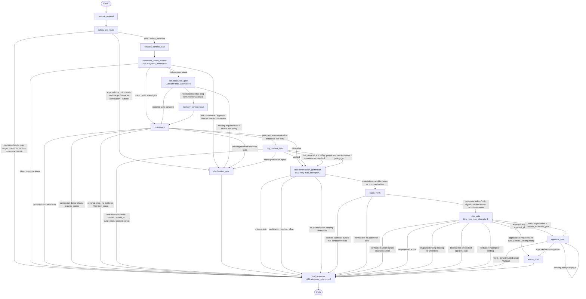

# 当前 LangGraph Graph/Node 架构图

> 本图只根据当前仓库源码绘制，主要依据 `src/agent/graph.py` 的 `build_graph()` 节点/边定义，以及 `src/agent/routing.py` 和 `src/agent/graph.py` 中的条件路由函数。未把 planning 文档、README 描述或测试断言当作已实现事实。
>
> 读法边界：本文件是当前源码快照，不是目标架构草案。目标 canonical runtime graph 以 `docs/target-agent-platform-architecture-plan.md` §6.1、`docs/contract-spec.md` §9 和 Phase 50 SPEC 为当前主要契约参考；当前源码已经收敛为 final 15 canonical registered nodes。旧 graph/node/router 名称只可能出现在历史 trace/read 投影、旧 planning 文档、测试防回归或 classifier artifact 中，不能作为 active graph registration、current route value、current resume route、current eval node 或 current docs authority。

## 源码事实摘要

- Graph 入口是 `START -> receive_request -> safety_pre_route`。
- 当前运行路径是 `receive_request -> safety_pre_route -> session_context_load -> contextual_intent_resolve -> slot_resolution_gate -> route_after_slot_resolution -> memory_context_load -> investigate`（当 route 判断需要 reviewed / long-term memory context 时）。旧 graph/node/router 名称不再是 active registered graph node，也不再是 active route-map destination。
- 当前注册的 graph nodes 是 final 15 canonical nodes：`receive_request`、`safety_pre_route`、`session_context_load`、`contextual_intent_resolve`、`slot_resolution_gate`、`memory_context_load`、`investigate`、`rag_context_build`、`recommendation_generation`、`claim_verify`、`risk_gate`、`clarification_gate`、`approval_gate`、`action_draft`、`final_response`。
- 带 `RetryPolicy(max_attempts=2)` 的 LLM 节点是：`contextual_intent_resolve`、`slot_resolution_gate`、`recommendation_generation`、`risk_gate`、`final_response`。
- `safety_pre_route` 当前不调用 LLM、不读取 memory、不执行 tools、不创建 approval/action authority；它写入 `pre_route_decision` / `safety_flags` / `routing_hints` 并追加 `safety_pre_route` trace step。
- `route_after_safety()` 当前在 safe / `safety_sensitive` 时继续到 `session_context_load`，在 untrusted approval chat、multi-target、requires-clarification、异常或未知 route 时 fail closed 到 `clarification_gate`。Graph route map 仍注册 `final_response`，但当前 router source 没有返回该分支。
- `session_context_load` 只读取 same-thread session context / trusted contextual slot view；它位于 intent LLM 之前，不读取 long-term/case memory，不做 RAG、approval、action 或 business fact authority。
- `contextual_intent_resolve` 是当前 active intent node。它可以产出 intent / operation / required slot expression / current-turn candidate slots，但 route、slot satisfaction、memory evidence、business fact、risk、approval 和 action authority 仍由后续 deterministic gate 或专属节点处理。
- `slot_resolution_gate` 是当前 active slot-resolution node。它消费 current-turn candidate/extracted slots 与 same-thread session slots，输出 `slot_resolution_trace`、`active_slots`、`active_slot_metadata`、`missing_required_slots`，并由 `route_after_slot_resolution` fail closed 到 `clarification_gate` 或进入 `investigate` / `memory_context_load`。
- `memory_context_load` 是当前 active memory context node。它承接 reviewed memory / long-term preference / case precedent / active CWC 读取语义，并把 loaded memory/CWC 作为 contextual-only run state 提供给 `investigate`；历史 `long_term_memory_retrieve` wrapper/import/test 和 helper `reviewed_memory_context_retrieve` 只通过 vocabulary/API projection 映射到该 owner。
- `clarification_gate` 当前只单向进入 `final_response`。
- `approval_gate` 有两个回环/回退路径：
  - `pending accept/approve` 回到 `approval_gate`；
  - `edit + superseded + resume_route == risk_gate` 回到 `risk_gate` 重新评估。
- `risk_gate` 的 `route_after_risk()` 当前不会返回自环；实际会路由到 `approval_gate`、`action_draft` 或 `final_response`。

## 历史读取边界

Phase 58 关闭后，当前主 graph 不再保留 migration-era wrapper/import/test surface、legacy route delegates、active compatibility aliases 或 current eval node。旧名称仍可能出现在以下非权威位置：

| Historical surface | Canonical owner | Boundary after Phase 58 | Validation |
|--------------------|-----------------|-------------------------|------------|
| Persisted historical trace/API/SSE rows using old node names | `contextual_intent_resolve`、`session_context_load`、`slot_resolution_gate`、`memory_context_load`、`recommendation_generation`、`risk_gate` | 只读历史数据可通过 bounded projection 映射到 canonical owner；不重写历史 DB rows，不接受旧名作为 current route 或 resume authority | `tests/agent/test_trace.py`、`tests/test_trace_api.py`、`tests/test_agent_runs_api.py`、strict classifier category `historical_data_read_projection` |
| Persisted historical approval edit retry metadata | `risk_gate` | 只在读取旧 `approval_decided` event metadata 时做 server-side canonicalization；fresh/current resume payload 只允许 `risk_gate` | `tests/test_approval_api.py`、`tests/test_approval_gate.py`、`tests/test_graph_routing.py` |
| Historical docs/planning/test guard text | Corresponding canonical node or router | 仅作为审计、迁移记录或防回归扫描输入；不能定义当前 runtime graph | `scripts/classify_phase58_legacy_hits.py --strict` 要求 `active_runtime_legacy=0`、`current_docs_legacy_authority=0`、`unclassified_rows=0` |

## 关键依据

- `src/agent/graph.py`: `build_graph()` 定义节点、普通边和条件边。
- `src/agent/routing.py`: `route_after_safety()`、`route_after_contextual_intent()`、`route_after_slot_resolution()`、`route_after_investigate()`、`route_after_rag_context()`、`route_after_recommendation()`、`route_after_claim_verify()` 定义主要条件路由；旧 public `route_after_slots()` 已删除，剩余 `_route_after_slots()` 只是私有实现细节，不是 current public route authority。
- `src/agent/graph.py`: `route_after_risk()`、`route_after_approval()` 定义风险和审批后的路由。
- `src/agent/graph_vocabulary.py`: 当前 runtime/compat trace projection 词表。
- `docs/contract-spec.md` §9：目标 graph contract；本文件只描述当前源码事实。
