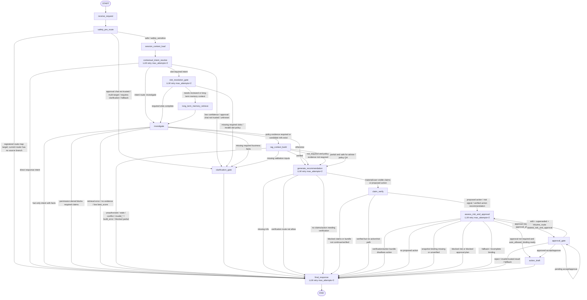

# 当前 LangGraph Graph/Node 架构图

> 本图只根据当前仓库源码绘制，主要依据 `src/agent/graph.py` 的 `build_graph()` 节点/边定义，以及 `src/agent/routing.py` 和 `src/agent/graph.py` 中的条件路由函数。未把 planning 文档、README 描述或测试断言当作已实现事实。
>
> 读法边界：本文件是当前源码快照，不是目标架构。目标 canonical runtime graph 以 `docs/target-agent-platform-architecture-plan.md` §6.1、`docs/contract-spec.md` §9 和 Phase 50 SPEC 为当前主要契约参考；本图中的 `long_term_memory_retrieve`、`generate_recommendation`、`assess_risk_and_approval` 等名称仍属于后续迁移期 legacy alias，不代表目标完成后的 registered node key。`extract_slots` 已不再是 active registered graph node；它只保留为历史 trace / import / test 兼容面。

## 源码事实摘要

- Graph 入口是 `START -> receive_request -> safety_pre_route`。
- 当前 Phase 54 运行路径是 `receive_request -> safety_pre_route -> session_context_load -> contextual_intent_resolve -> slot_resolution_gate -> route_after_slot_resolution`。`classify_intent`、`session_memory_load` 和 `extract_slots` 不再是 active registered graph node，也不再是 active route-map destination。
- 当前注册的 graph nodes 共 15 个：`receive_request`、`safety_pre_route`、`session_context_load`、`contextual_intent_resolve`、`slot_resolution_gate`、`long_term_memory_retrieve`、`investigate`、`rag_context_build`、`generate_recommendation`、`claim_verify`、`assess_risk_and_approval`、`clarification_gate`、`approval_gate`、`action_draft`、`final_response`。
- 带 `RetryPolicy(max_attempts=2)` 的 LLM 节点是：`contextual_intent_resolve`、`slot_resolution_gate`、`generate_recommendation`、`assess_risk_and_approval`、`final_response`。
- `safety_pre_route` 当前不调用 LLM、不读取 memory、不执行 tools、不创建 approval/action authority；它写入 `pre_route_decision` / `safety_flags` / `routing_hints` 并追加 `safety_pre_route` trace step。
- `route_after_safety()` 当前在 safe / `safety_sensitive` 时继续到 `session_context_load`，在 untrusted approval chat、multi-target、requires-clarification、异常或未知 route 时 fail closed 到 `clarification_gate`。Graph route map 仍注册 `final_response`，但当前 router source 没有返回该分支。
- `session_context_load` 只读取 same-thread session context / trusted contextual slot view；它位于 intent LLM 之前，不读取 long-term/case memory，不做 RAG、approval、action 或 business fact authority。
- `contextual_intent_resolve` 是当前 active intent node。它可以产出 intent / operation / required slot expression / current-turn candidate slots，但 route、slot satisfaction、memory evidence、business fact、risk、approval 和 action authority 仍由后续 deterministic gate 或专属节点处理。
- `slot_resolution_gate` 是当前 active slot-resolution node。它消费 current-turn candidate/extracted slots 与 same-thread session slots，输出 `slot_resolution_trace`、`active_slots`、`active_slot_metadata`、`missing_required_slots`，并由 `route_after_slot_resolution` fail closed 到 `clarification_gate` 或进入 `investigate` / Phase 55-owned `long_term_memory_retrieve` compatibility destination。
- `clarification_gate` 当前只单向进入 `final_response`。
- `approval_gate` 有两个回环/回退路径：
  - `pending accept/approve` 回到 `approval_gate`；
  - `edit + superseded + resume_route == assess_risk_and_approval` 回到 `assess_risk_and_approval`。
- `assess_risk_and_approval` 的 graph 映射里注册了自环目标，但当前 `route_after_risk()` 的源码分支没有返回 `assess_risk_and_approval`；实际会路由到 `approval_gate`、`action_draft` 或 `final_response`。

## 当前迁移兼容面

历史 traces 或测试/import surface 中仍可能出现 `classify_intent`、`intent_classification`、`session_memory_load`、`route_after_intent`、`extract_slots`、`route_after_slots`。这些名称只通过 `src/agent/graph_vocabulary.py` 投影到 canonical owner，不能作为 active graph registration、active route destination 或 active policy route value。

| Legacy surface | Canonical owner | Reason | Trace projection | Validation | Delete phase |
|----------------|-----------------|--------|------------------|------------|--------------|
| Active safe-route continuation `safety_pre_route -> classify_intent` and active `classify_intent` graph node | `contextual_intent_resolve` / Phase 53 CAGM-04 | Phase 52 compatibility path closed by Phase 53 graph cutover | Historical `classify_intent` trace steps project to `contextual_intent_resolve`; canonical `contextual_intent_resolve` projects as runtime | Graph/baseline scans show no active `classify_intent` registration or route destination; graph vocabulary and trace tests pass | Closed in Phase 53 |
| Active `session_memory_load` graph node and route destination | `session_context_load` / Phase 53 CAGM-04 | Same-thread session context now loads before intent as canonical runtime node | Historical `session_memory_load` trace steps project to `session_context_load`; canonical `session_context_load` projects as runtime | Graph/baseline scans show no active `session_memory_load` registration or route destination; session context tests pass | Closed in Phase 53 |
| `src/agent/nodes/classify_intent.py` wrapper and `classify_intent` import/test surface | `contextual_intent_resolve` | Import and legacy unit-test compatibility while downstream callers migrate to canonical module | `classify_intent -> contextual_intent_resolve`, status `compatibility_alias`, reason `PHASE_53_COMPATIBILITY_ALIAS` | `tests/agent/test_nodes/test_classify_intent.py`, `tests/agent/test_intent_routing.py`, `tests/agent/test_graph_vocabulary.py` | No later than Phase 58 |
| `llm_outputs["intent_classification"]` reader / adapter mirror | `contextual_intent_resolve` | Historical final-response / adapter compatibility; active node writes canonical `llm_outputs["contextual_intent_resolve"]` | Non-active output mirror; no graph node authority | Artifact scan found reader in `src/agent/nodes/final_response.py` and tests; canonical contextual intent tests cover active owner | No later than Phase 58 |
| `src/agent/nodes/session_memory_load.py` wrapper and direct unit-test surface | `session_context_load` | Import and historical trace compatibility while callers migrate to canonical module | `session_memory_load -> session_context_load`, status `compatibility_alias`, reason `PHASE_53_COMPATIBILITY_ALIAS` | `tests/agent/test_session_memory_load.py`, `tests/agent/test_graph_vocabulary.py`; active graph scans no registration | No later than Phase 58 |
| `route_after_intent` helper | `route_after_contextual_intent` | Router import/test compatibility after active graph cutover | `route_after_intent -> route_after_contextual_intent`, status `compatibility_alias`, reason `PHASE_53_COMPATIBILITY_ALIAS` | `tests/agent/test_intent_routing.py`, `tests/agent/test_graph_vocabulary.py`; active graph uses `route_after_contextual_intent` | No later than Phase 58 |
| Active `extract_slots` graph node and active route destination | `slot_resolution_gate` / Phase 54 CAGM-05 | Phase 54 graph/router cutover closed this active runtime debt | Historical `extract_slots` trace/API rows project to `slot_resolution_gate`, status `compatibility_alias`, with Phase 54 delete-by-58 reason codes | Source scan shows no active `add_node("extract_slots")` or `("extract_slots", "route_after_slots")` edge; graph vocabulary / trace / API projection tests cover historical rows | Closed in Phase 54 |
| `src/agent/nodes/extract_slots.py` wrapper/import/test surface | `slot_resolution_gate` | Backward-compatible imports and legacy unit tests while internal callers migrate | Wrapper/import surface is not registered in active graph; historical traces still project through vocabulary | `tests/agent/test_nodes/test_extract_slots.py` plus Phase 54 final graph scan | No later than Phase 58 |
| `route_after_slots` helper | `route_after_slot_resolution` | Backward-compatible router import/test surface after active router cutover | `route_after_slots -> route_after_slot_resolution`, status `compatibility_alias`, with Phase 54 delete-by-58 reason codes | Active graph uses `route_after_slot_resolution`; helper delegates to canonical router | No later than Phase 58 |
| Historical `extract_slots` API/SSE display label and persisted trace rows | `slot_resolution_gate` | Persisted rows should remain readable without rewriting stored node names | `_sse_event` preserves `node_name="extract_slots"` while adding `target_node_name="slot_resolution_gate"`; canonical runtime `slot_resolution_gate` also projects to itself | `tests/test_agent_runs_api.py` and `tests/agent/test_trace.py` | No later than Phase 58 or when historical display compatibility is no longer needed |
| `long_term_memory_retrieve` active node | `memory_context_load` / Phase 55 CAGM-06 | Memory context load cutover is explicitly Phase 55-owned | `long_term_memory_retrieve -> memory_context_load`, status `compatibility_alias` | Architecture baseline keeps this as active legacy migration row | Phase 55 |
| `generate_recommendation` active node | `recommendation_generation` / Phase 56 CAGM-07 | Recommendation generation naming/claim status alignment is Phase 56-owned | Route maps use `recommendation_generation` route value to current `generate_recommendation` destination | Architecture baseline keeps this as active legacy migration row | Phase 56 |
| `assess_risk_and_approval` active node | `risk_gate` / Phase 57 CAGM-08 | Risk/approval canonicalization is Phase 57-owned | `assess_risk_and_approval -> risk_gate`, status `compatibility_alias` | Architecture baseline keeps this as active legacy migration row | Phase 57 |

## 关键依据

- `src/agent/graph.py`: `build_graph()` 定义节点、普通边和条件边。
- `src/agent/routing.py`: `route_after_safety()`、`route_after_contextual_intent()`、`route_after_slot_resolution()`、`route_after_investigate()`、`route_after_rag_context()`、`route_after_recommendation()`、`route_after_claim_verify()` 定义主要条件路由；`route_after_slots()` 仅是兼容委托。
- `src/agent/graph.py`: `route_after_risk()`、`route_after_approval()` 定义风险和审批后的路由。
- `src/agent/graph_vocabulary.py`: 当前 runtime/compat trace projection 词表。
- `docs/contract-spec.md` §9：目标 graph contract；本文件只描述当前源码事实。
