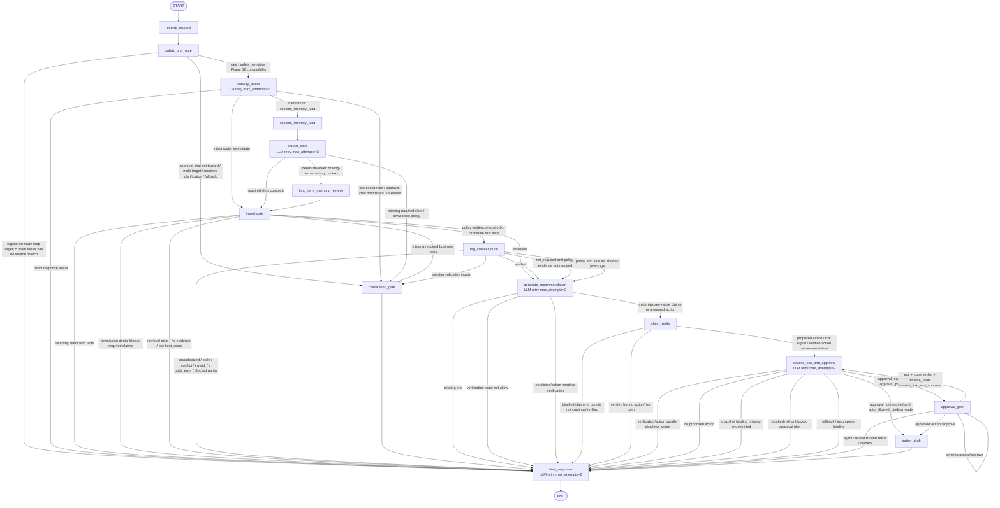

# 当前 LangGraph Graph/Node 架构图

> 本图只根据当前仓库源码绘制，主要依据 `src/agent/graph.py` 的 `build_graph()` 节点/边定义，以及 `src/agent/routing.py` 和 `src/agent/graph.py` 中的条件路由函数。未把 planning 文档、README 描述或测试断言当作已实现事实。
>
> 读法边界：本文件是当前源码快照，不是目标架构。目标 canonical runtime graph 以 `docs/target-agent-platform-architecture-plan.md` §6.1 和 `docs/contract-spec.md` §9 为当前主要契约参考；本图中的 `classify_intent`、`extract_slots`、`long_term_memory_retrieve`、`generate_recommendation`、`assess_risk_and_approval` 等名称属于当前实现/迁移期 legacy alias，不代表目标完成后的 registered node key。

## 源码事实摘要

- Graph 入口是 `START -> receive_request -> safety_pre_route`。
- 当前 Phase 52 过渡路径是 `receive_request -> safety_pre_route -> classify_intent`：`safety_pre_route` 已是当前源码中的显式 runtime graph node，`classify_intent` 仍是 safe-path compatibility surface，不代表最终 canonical graph 已完成。
- 当前注册的 graph nodes 共 15 个：`receive_request`、`safety_pre_route`、`classify_intent`、`session_memory_load`、`extract_slots`、`long_term_memory_retrieve`、`investigate`、`rag_context_build`、`generate_recommendation`、`claim_verify`、`assess_risk_and_approval`、`clarification_gate`、`approval_gate`、`action_draft`、`final_response`。
- 带 `RetryPolicy(max_attempts=2)` 的 LLM 节点是：`classify_intent`、`extract_slots`、`generate_recommendation`、`assess_risk_and_approval`、`final_response`。
- `safety_pre_route` 当前不调用 LLM、不读取 memory、不执行 tools、不创建 approval/action authority；它写入 `pre_route_decision` / `safety_flags` / `routing_hints` 并追加 `safety_pre_route` trace step。
- `route_after_safety()` 当前在 safe / `safety_sensitive` 时继续到 `classify_intent`，在 untrusted approval chat、multi-target、requires-clarification、异常或未知 route 时 fail closed 到 `clarification_gate`。Graph route map 仍注册 `final_response`，但当前 router source 没有返回该分支。
- `clarification_gate` 当前只单向进入 `final_response`。
- `approval_gate` 有两个回环/回退路径：
  - `pending accept/approve` 回到 `approval_gate`；
  - `edit + superseded + resume_route == assess_risk_and_approval` 回到 `assess_risk_and_approval`。
- `assess_risk_and_approval` 的 graph 映射里注册了自环目标，但当前 `route_after_risk()` 的源码分支没有返回 `assess_risk_and_approval`；实际会路由到 `approval_gate`、`action_draft` 或 `final_response`。

## Phase 52 兼容面

| Legacy surface | Canonical owner | Reason | Trace projection | Validation | Delete phase |
|----------------|-----------------|--------|------------------|------------|--------------|
| Safe-route continuation `safety_pre_route -> classify_intent` and `classify_intent` active graph node | `contextual_intent_resolve` / Phase 53 CAGM-04 | Phase 52 only extracts pre-route safety; session context before intent and contextual intent cutover are Phase 53 | `classify_intent` continues to project to `contextual_intent_resolve`; new `safety_pre_route` projects as runtime canonical | Architecture graph baseline + graph tests prove unsafe pre-route cases stop before `classify_intent` and safe cases use compatibility only | Phase 53 |
| `classification_trace.pre_route_decision` inside `classify_intent` | `safety_pre_route` for runtime pre-route ownership; Phase 53 removes classifier-owned duplicate | Safe-path compatibility may still need classifier trace parity until contextual intent cutover | `classify_intent:pre_route` remains a compatibility alias to `safety_pre_route`; `safety_pre_route` itself is runtime | `test_graph_vocabulary.py`, `test_safety_pre_route.py`, and classifier parity tests | Phase 53 |

## 关键依据

- `src/agent/graph.py`: `build_graph()` 定义节点、普通边和条件边。
- `src/agent/graph.py`: `route_after_risk()`、`route_after_approval()` 定义风险和审批后的路由。
- `src/agent/routing.py`: `route_after_intent()`、`route_after_slots()`、`route_after_investigate()`、`route_after_rag_context()`、`route_after_recommendation()`、`route_after_claim_verify()` 定义其余条件路由。
- `src/agent/routing.py`: `route_after_safety()` 定义 Phase 52 safety pre-route 后的 fail-closed 过渡路由。
