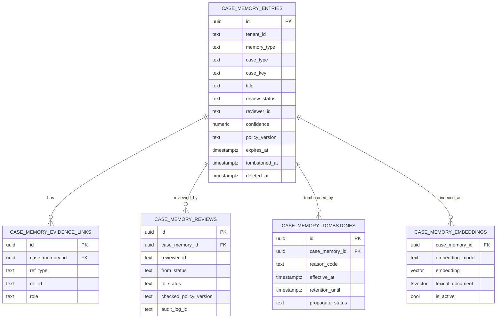
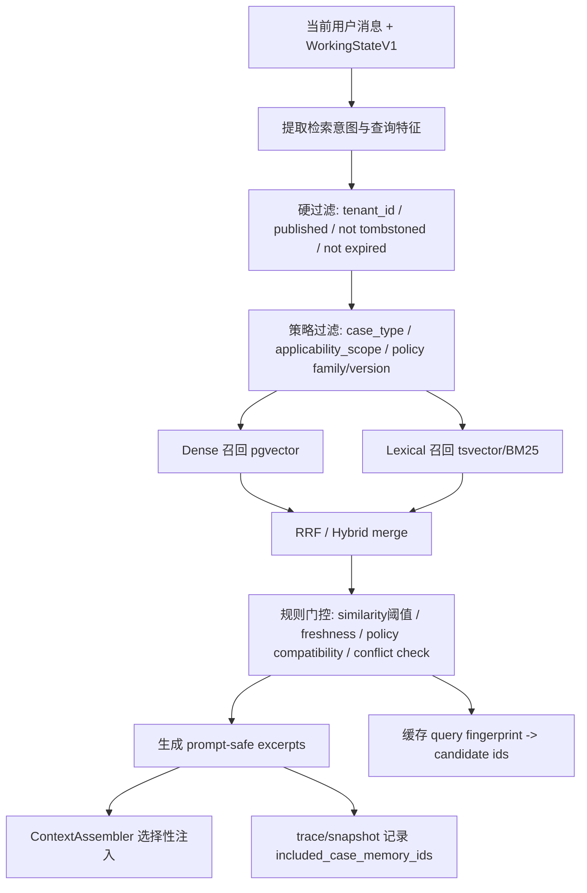

# Phase 16 已审阅案例记忆层与语义化短期记忆设计报告

## 执行摘要

本报告的核心建议是：**Phase 16 不应把现有 `session_memories` 扩展成“长期记忆大杂烩”，而应新增一层“已审阅案例记忆层”**，把它明确定位为**跨 case 的、可审核、可追溯、受策略与版本约束的“先例层”**；与此同时，**Phase 15 的 short-term memory 应升级为“语义化会话理解层”，但仍然保持 thread/session 连续性与当前工作上下文的职责边界**。这意味着：`session_memories` 继续只做线程内短期 slot continuity；`conversation_threads/messages`、`tool_calls/results`、`summaries` 继续作为会话事实与派生摘要基础；新引入的 `reviewed_case_memory` 只承载**经过 review 的案例先例**，不能成为当前业务事实、政策事实、审批事实或审计事实的权威来源。你此前的仓库审阅已经明确了项目更偏业务型 Agent，而不是个人助手；因此，Phase 16 的长期能力应优先做**案例先例、稳定偏好、团队策略模式**这三类“受治理的辅助记忆”，而不是自由写入式长期用户画像。fileciteturn0file0 citeturn6view0turn17view0turn3view8

我建议把 Phase 16 拆成两个并行但边界清楚的子系统。其一是**Reviewed Case Memory**：以“draft → in_review → published → deprecated/tombstoned/deleted”的 lifecycle 管理案例条目，条目必须带 `review_status`、`evidence_refs`、`policy_version`、`outcome`、`reviewer_id`、`confidence`、`expires_at`、`provenance`，并通过 provenance 与 `conversation_message_id`、`tool_result_id`、`agent_run_id`、`audit_log_id` 串起来。其二是**Semantic Conversation Understanding**：在不动 `session_memories` 语义边界的前提下，把现有 `summaries` 升级为更强结构化的 thread/case 语义摘要，增加“confirmed facts、hypotheses、commitments、preference candidates、contradictions、case-link hints”等字段，使系统真正具备跨轮理解、跨 case 候选发现、长期偏好候选生成和策略学习候选生成能力。citeturn17view0turn11view0turn16search1

在检索策略上，本报告明确建议采用**metadata-first、vector-second、hybrid-merge-third** 的业务型检索链路，而不是“纯 embedding 先搜再说”。原因很直接：业务 Agent 的 hard constraints 先于语义相似度。Azure 的官方混合检索文档把 hybrid search 定义为并行使用关键字搜索与向量搜索后再统一排序，且使用 RRF 融合不同排名；Pinecone 官方文档则强调 dense 与 sparse 信号的权重范围不同，必须显式归一化与加权，并指出单索引虽更简单，但双索引更灵活；pgvector 官方文档进一步提醒，近似索引上的过滤是**在索引扫描后**应用的，过滤选择性强时需要 iterative scan、partial index 或 partitioning 才能维持召回。对你的场景，这意味着：先按租户、review 状态、tombstone、过期时间、case type、policy-version compatibility 预过滤，再做 dense/sparse hybrid，再做规则门控，最后只把 **prompt-safe excerpts** 交给 `ContextAssembler`。citeturn3view5turn3view6turn13view2turn13view3turn3view2turn3view0

在治理上，报告建议把 **tombstone** 做成真正的一等对象，而不是简单的 `deleted_at`。Kafka/Confluent 的 tombstone 语义表明：删除标记的价值不只是“隐藏”，更是为了保证下游副本、快照与重建链路在 retention window 内能一致收敛；GDPR Article 17 同时要求对适用条件下的个人数据删除请求进行“无不当延迟”的擦除。这两者结合起来，对你的项目意味着：**tombstone 要立即使条目对检索与 prompt 注入不可见，但仍在有限保留窗口内保留最小化删除标记与传播状态，用于索引撤回、缓存失效、审计留痕与下游同步；之后再做物理硬删除**。citeturn3view7turn3view8

结论上，最推荐的 Phase 16 方案是：**在 Postgres + pgvector 上先做 reviewed case memory 的第一版，不引入第二个长期记忆事实域；把现有 `search_case_memory` 明确降级为 legacy/transitional search，并迁移到新的 reviewed retrieval 管线下；把 short-term memory 升级为语义化会话理解层，但它只产出候选与摘要，不直接自我发布为长期先例**。这样既不会与 `session_memories` 冲突，也能为你想要做好的“跨 case 经验总结、长期用户偏好、相似历史案例、业务策略学习”搭出可治理的骨架。citeturn2view0turn3view2turn18view0turn6view0

## 设计目标与边界

### 目标

Phase 16 的第一目标，不是“记住更多东西”，而是把**可复用经验**从“线程内短期上下文”中剥离出来，形成**跨 case、可审阅、可引用、可废弃**的先例层。经典 CBR 过程强调 retrieve、reuse、revise、retain 四步，但在业务型 Agent 中，“revise 与 retain”不能由模型自动完成，而必须转成 review workflow；否则系统会把偶然成功、策略过时、政策版本不匹配的历史经验误当成稳定规则。也因此，Phase 16 要做的是**reviewed precedent memory**，不是“自动把高相似 conversation 全都写入长期库”。citeturn16search1

Phase 16 的第二目标，是把 Phase 15 的 short-term memory 从“工程可用版”升级为“语义理解版”。这层不应替代 `session_memories`，而应补上 `session_memories` 做不到的内容：用户真实目标的持续追踪、已确认事实与候选假设的区分、承诺/待确认事项管理、冲突事实检测、情绪与沟通偏好候选、case 链接线索、跨轮命题级摘要，以及把这些候选以结构化方式输送给 `WorkingStateV1` 和未来的 reviewed stores。Microsoft 的 chat history 文档明确说明，user/assistant/system/tool 都是会话连续性的组成部分，且 tool result 必须与 function-call id 对齐；这正支持了你把会话理解从纯文本 summary 升级到**结构化会话对象**的方向。citeturn11view0

### 边界

这里最重要的边界是：**case memory 不是当前业务事实源**。它真正能表达的是“在某些前提成立、某个政策版本有效、某类案例曾经如何处理、结果如何、什么证据支撑、谁审核过”，而不是“当前订单状态就是这样”“当前审批已经通过”“当前政策就是这条”。因此，读取优先级必须固定为：当前业务 DB / tool results / policy KB / approvals > reviewed case memory > short-term semantic summary > session slots。换句话说，reviewed case memory 只能提供**先例、候选解释、风险提醒、话术参考与策略建议**，不能覆盖业务数据库与当前政策知识。这个边界与你此前仓库审阅中的业务型 Agent 方向完全一致。fileciteturn0file0

同样重要的是：**长期用户偏好**与**团队策略学习**不应直接塞进 case memory 表里。因为这两类对象的治理维度不同。案例先例通常按 case-type、policy-version、outcome 和 applicability scope 管理；用户偏好更需要 consent/confirmation、主体归属和删除权；团队策略模式则更像 reviewed heuristics / SOP patterns，需要不同的发布与废弃机制。为了满足你希望做好的“跨 case 经验总结、长期用户偏好、相似历史案例、业务策略学习”，最稳妥的路径是：先把 Phase 16 做成**一套统一 contract 下的 reviewed memory family**，其中 `case_memory` 先落地；用户偏好与策略模式在 v2 作为 sibling store 增补，而不是先混入 `session_memories` 或混入 `case_memory`。citeturn6view0turn17view0

### 与当前仓库构件的关系

按你给定的当前仓库前提，`session_memories`、`conversation_threads/messages`、`tool_calls/results`、`summaries`、`WorkingStateV1`、`ContextAssembler`、`AgentState` 已存在且各有基本职责；`search_case_memory` 仍是 transitional，且不是真正的 reviewed case memory。基于这个前提，本报告的总体整合原则是：**不迁移 `session_memories` 的职责，不替换 `summaries` 的基础表，不让 Case Memory 反向污染 WorkingStateV1 的权威性，不让 `search_case_memory` 继续以正式 case memory 的名义对外扩散**。你此前的审阅也已指出 `search_case_memory` 的命名存在误导风险、长期记忆适配器在更早阶段尚为空实现，因此 Phase 16 的关键不是“扩原表”，而是“建立新层”。fileciteturn0file0

## 已审阅案例记忆层

### 推荐数据模型

推荐把 reviewed case memory 拆成**主条目表 + 证据链接表 + review 历史表 + tombstone 表 + 向量/检索支持列或表**。如果你希望尽量少表，可以把 embedding 放进主表；如果你希望多模型并行、便于重建与索引切换，则单独拆 `case_memory_embeddings`。考虑你现在已在仓库中使用 Postgres，并且更早的技术审阅提到过 `pgvector` 已用于政策知识检索，因此最保守、最符合现有架构的方案是：**第一版继续使用 Postgres + pgvector**，不要一开始引入第二个向量数据库事实域。pgvector 官方 README 明确支持 exact/approximate search、HNSW 与 IVFFlat，且允许向量与关系字段同库管理；这非常适合业务型 Agent 需要的“强过滤 + 可审计 + 低架构新复杂度”。citeturn2view0turn3view0turn3view1

下面是推荐的核心表：

| 表名 | 作用 | 是否权威 | 备注 |
|---|---|---:|---|
| `case_memory_entries` | 已审阅案例记忆主记录 | 是，对“已发布先例条目”权威 | 不对当前业务事实权威 |
| `case_memory_evidence_links` | 指向 conversation/tool/run/audit/policy 的证据链 | 是，对 provenance 权威 | 用于可追溯与回放 |
| `case_memory_reviews` | 记录 review 决策与状态迁移 | 是 | 支持 reviewer、reason、policy check |
| `case_memory_tombstones` | 删除/撤回/法务请求的传播与保留 | 是 | 即时屏蔽，延迟物理删除 |
| `case_memory_embeddings` | embedding 与索引支持 | 派生 | 可与主表合并，但建议独立以便重建 |

### 推荐字段

下面给出 `case_memory_entries` 的建议字段。字段设计的原则，是把“经验内容”“治理状态”“版本约束”“可追溯来源”拆清楚，而不是只存一段自然语言 summary。

```sql
CREATE TABLE case_memory_entries (
  id UUID PRIMARY KEY,
  tenant_id TEXT NOT NULL,
  memory_type TEXT NOT NULL DEFAULT 'case',              -- case / preference / strategy（预留）
  case_type TEXT NOT NULL,                               -- refund / dispute / compensation / ...
  case_key TEXT,                                         -- 业务 case_id，可空
  title TEXT NOT NULL,
  problem_statement TEXT NOT NULL,
  context_summary TEXT NOT NULL,
  resolution_summary TEXT NOT NULL,
  outcome JSONB NOT NULL,                                -- 结构化 outcome
  applicability_scope JSONB NOT NULL DEFAULT '{}'::jsonb,
  tags JSONB NOT NULL DEFAULT '[]'::jsonb,

  review_status TEXT NOT NULL,                           -- draft / in_review / published / deprecated / rejected / tombstoned / deleted
  reviewer_id TEXT,
  reviewer_notes TEXT,
  confidence NUMERIC(4,3),                               -- 0.000 - 1.000
  policy_version TEXT,                                   -- 例如 refunds@2026-05-12
  policy_family TEXT,                                    -- 例如 refunds
  evidence_refs JSONB NOT NULL DEFAULT '[]'::jsonb,      -- 轻量 refs；明细去 evidence_links
  provenance JSONB NOT NULL DEFAULT '{}'::jsonb,         -- PROV-inspired
  source_thread_id UUID,
  source_run_id UUID,
  source_summary_id UUID,
  source_agent_version TEXT,

  prompt_excerpt TEXT,                                   -- prompt-safe excerpt
  pii_level TEXT NOT NULL DEFAULT 'unknown',
  redaction_status TEXT NOT NULL DEFAULT 'pending',

  published_at TIMESTAMPTZ,
  deprecated_at TIMESTAMPTZ,
  tombstoned_at TIMESTAMPTZ,
  tombstone_reason TEXT,
  expires_at TIMESTAMPTZ,
  deleted_at TIMESTAMPTZ,

  content_hash TEXT NOT NULL,
  created_by TEXT NOT NULL,
  created_at TIMESTAMPTZ NOT NULL DEFAULT now(),
  updated_at TIMESTAMPTZ NOT NULL DEFAULT now()
);
```

推荐把 `outcome` 设计成结构化对象，而不是单字符串，例如：

```json
{
  "final_disposition": "refund_approved_partial",
  "amount": {"currency": "USD", "value": 25.00},
  "customer_notified": true,
  "human_approval_required": true,
  "human_approval_obtained": true,
  "post_action_risk": "low"
}
```

这种结构能让 case memory 在检索后支持**规则过滤、可解释性展示、统计分析与策略学习**，而不只是被动塞给 LLM。W3C PROV 对 provenance 的定义强调：provenance 是关于“实体、活动、人员如何产出一个数据对象”的信息，并可据此评估其质量、可靠性与可信度；把 `provenance` 放进 case memory 的主结构，能让你后续无缝对齐 `conversation_message_id`、`tool_result_id`、`agent_run_id` 与 reviewer。citeturn17view0

### 证据链与 review 表

```sql
CREATE TABLE case_memory_evidence_links (
  id UUID PRIMARY KEY,
  case_memory_id UUID NOT NULL REFERENCES case_memory_entries(id) ON DELETE CASCADE,
  tenant_id TEXT NOT NULL,
  ref_type TEXT NOT NULL,                                -- conversation_message / tool_result / agent_run / summary / audit_log / policy_chunk / business_record
  ref_id TEXT NOT NULL,
  role TEXT NOT NULL,                                    -- problem_fact / decision_basis / outcome_evidence / counter_evidence / policy_basis
  excerpt TEXT,
  metadata JSONB NOT NULL DEFAULT '{}'::jsonb,
  created_at TIMESTAMPTZ NOT NULL DEFAULT now()
);

CREATE TABLE case_memory_reviews (
  id UUID PRIMARY KEY,
  case_memory_id UUID NOT NULL REFERENCES case_memory_entries(id) ON DELETE CASCADE,
  tenant_id TEXT NOT NULL,
  reviewer_id TEXT NOT NULL,
  from_status TEXT NOT NULL,
  to_status TEXT NOT NULL,
  decision_reason TEXT NOT NULL,
  notes TEXT,
  checked_policy_version TEXT,
  checked_at TIMESTAMPTZ NOT NULL DEFAULT now(),
  audit_log_id TEXT,
  metadata JSONB NOT NULL DEFAULT '{}'::jsonb
);

CREATE TABLE case_memory_tombstones (
  id UUID PRIMARY KEY,
  case_memory_id UUID NOT NULL,
  tenant_id TEXT NOT NULL,
  reason_code TEXT NOT NULL,                             -- gdpr_erasure / policy_obsolete / inaccurate / harmful / tenant_offboard / pii_violation
  requested_by TEXT,
  requested_at TIMESTAMPTZ NOT NULL DEFAULT now(),
  effective_at TIMESTAMPTZ NOT NULL DEFAULT now(),
  retention_until TIMESTAMPTZ,
  propagate_status TEXT NOT NULL DEFAULT 'pending',      -- pending / propagated / hard_deleted
  metadata JSONB NOT NULL DEFAULT '{}'::jsonb
);
```

`case_memory_embeddings` 可以单独做成这样：

```sql
CREATE TABLE case_memory_embeddings (
  case_memory_id UUID NOT NULL REFERENCES case_memory_entries(id) ON DELETE CASCADE,
  tenant_id TEXT NOT NULL,
  embedding_model TEXT NOT NULL,
  embedding vector(1536) NOT NULL,
  lexical_document TSVECTOR,
  is_active BOOLEAN NOT NULL DEFAULT true,
  created_at TIMESTAMPTZ NOT NULL DEFAULT now(),
  PRIMARY KEY (case_memory_id, embedding_model)
);
```

### 索引与示例 SQL

由于 pgvector 官方明确指出：**近似索引上的过滤是在索引扫描后应用的**，过滤条件很强时只依赖 ANN 容易掉召回；因此推荐把“发布状态、tombstone、过期、租户”等 hard filters 先用普通索引压住，再对活跃子集建 partial HNSW/IVFFlat 索引。pgvector 也建议在过滤值较少时用 partial index，过滤值很多时考虑 partitioning。对你的业务型 case memory，我推荐先采用 **partial HNSW + btree/jsonb/tsvector**，而不是一上来按 tenant 大规模分区。citeturn3view2turn3view0turn3view1

```sql
CREATE INDEX idx_case_memory_scope
ON case_memory_entries (tenant_id, review_status, case_type, policy_family, published_at DESC);

CREATE INDEX idx_case_memory_live
ON case_memory_entries (tenant_id, expires_at)
WHERE review_status = 'published' AND tombstoned_at IS NULL AND deleted_at IS NULL;

CREATE INDEX idx_case_memory_policy
ON case_memory_entries (tenant_id, policy_family, policy_version);

CREATE INDEX idx_case_memory_tags_gin
ON case_memory_entries USING GIN (tags jsonb_path_ops);

CREATE INDEX idx_case_memory_applicability_gin
ON case_memory_entries USING GIN (applicability_scope jsonb_path_ops);

CREATE INDEX idx_case_memory_lexical
ON case_memory_embeddings USING GIN (lexical_document);

CREATE INDEX idx_case_memory_embedding_hnsw
ON case_memory_embeddings
USING hnsw (embedding vector_cosine_ops)
WHERE is_active = true;
```

如果 corpus 大到 HNSW build/update 压力明显，再考虑 IVFFlat；pgvector 官方对 HNSW 与 IVFFlat 都提供了参数调优位点，例如 `hnsw.ef_search`、`ivfflat.max_probes` 等。第一版更推荐 HNSW，因为它通常在高召回下更省调参，但要配合 metadata prefilter 与 iterative scan；如果后续发现大量低选择性按 case-type 聚合搜索，可再对某些大 tenant 或大 case-type 子集做 IVFFlat/partial index。citeturn3view0turn3view1turn3view2

### 推荐的语义化短期记忆增强

为了让 Phase 15 升级成更强的“会话理解层”，我建议**不新增一个替代 `session_memories` 的新短期记忆系统**，而是在现有 `summaries` 之上增加结构化字段与新的 `summary_type`。这样你既保留了已有 thread rolling summary 基础，也避免 `session_memories` 职责漂移。可选的 schema 变更是：

```sql
ALTER TABLE summaries
ADD COLUMN semantic_facts_json JSONB DEFAULT '[]'::jsonb,
ADD COLUMN hypotheses_json JSONB DEFAULT '[]'::jsonb,
ADD COLUMN commitments_json JSONB DEFAULT '[]'::jsonb,
ADD COLUMN preference_candidates_json JSONB DEFAULT '[]'::jsonb,
ADD COLUMN contradiction_flags_json JSONB DEFAULT '[]'::jsonb,
ADD COLUMN case_link_hints_json JSONB DEFAULT '[]'::jsonb,
ADD COLUMN salience_score NUMERIC(4,3),
ADD COLUMN summary_schema_version INT NOT NULL DEFAULT 1;
```

推荐新增的 `summary_type` 包括：`thread_semantic`、`case_semantic_current`、`handoff`、`memory_candidate_extract`。这样，Phase 15.2/16 的 short-term layer 就能开始表达“用户已经承诺过什么、当前未决问题是什么、哪些内容可能是长期偏好候选、当前案例与哪些历史 case 有潜在相似性”，而不需要动 `session_memories` 里基于 TTL 的 slot continuity 逻辑。这个增强也天然能为 reviewed case memory 生成 **draft 候选**。citeturn11view0turn17view0

### ER 图



## 生命周期与治理

### 生命周期设计

推荐的生命周期如下：

| 状态 | 含义 | 可检索 | 可进 prompt | 可被新条目覆盖 | 备注 |
|---|---|---:|---:|---:|---|
| `draft` | 从 conversation/summary/tool 生成的候选 | 否 | 否 | 是 | 自动或人工创建 |
| `in_review` | 正在审核 | 否 | 否 | 是 | 需要 reviewer |
| `published` | 已发布先例 | 是 | 是，受 gating | 是 | 仅 prompt-safe excerpt |
| `deprecated` | 仍保留历史，但不推荐复用 | 可选，仅后台 | 否 | 是 | 常因 policy/version 变化 |
| `rejected` | 审核不通过 | 否 | 否 | 是 | 保留 review 证据 |
| `tombstoned` | 逻辑删除并屏蔽传播 | 否 | 否 | 否 | 即时对外不可见 |
| `deleted` | 物理删除完成 | 否 | 否 | 否 | 仅保留最小化审计或无保留 |

推荐的状态迁移规则是：  
`draft -> in_review -> published` 为主线；  
`draft|in_review -> rejected` 为审核失败；  
`published -> deprecated` 为版本过时或被更新先例替代；  
`published|deprecated|rejected -> tombstoned` 为法律/PII/错误/危害性撤回；  
`tombstoned -> deleted` 为 retention window 结束后的物理删除。  
这个 lifecycle 实质上是把经典的 retrieve/reuse/revise/retain 流程改造成**企业可治理的 retain workflow**。citeturn16search1turn3view8turn3view7

### 触发条件

推荐的创建触发器，不是“任何已完成 run 都写 case memory”，而是有限制地从下面几类事件产生 `draft`：

| 触发类型 | 触发条件 | 默认动作 |
|---|---|---|
| `case_closed` | case 进入解决/结束状态且结果明确 | 生成 draft |
| `resolved_with_policy` | 有明确 policy evidence 与 resolution/outcome | 生成 draft |
| `human_approved_action` | 包含高价值审批决策与结果 | 生成 draft |
| `handoff_summary` | 人工交接摘要质量高 | 生成 draft |
| `cross_case_repeat` | 相似问题在一定窗口内重复出现 | 生成 draft 或 strategy candidate |

而以下条件应默认阻止创建：高风险中断、未经确认的 case identity、PII 风险高、政策版本不明确、结果未闭环、reviewer 缺席、证据链缺失。这样做的目的，就是防止“把未闭环 conversation 当经验事实记住”。citeturn3view8turn17view0

### Tombstone 语义

我建议把 tombstone 定义为：**“即刻对任何检索、prompt 注入、候选生成和导出都不可见；在有限窗口内保留最小必要删除标记，以保证缓存、索引、副本和下游任务能感知删除；之后再考虑物理硬删除。”** 这与 Confluent/Kafka 的 tombstone 设计高度一致：tombstone 不是“还活着的记录”，也不是“已经什么都没有了”，而是“删除已经生效，但传播与一致性窗口尚未结束”的状态。Confluent 文档明确指出 tombstone markers 会保留一段时间，以确保消费者能完成状态快照；而 GDPR Article 17 又要求满足条件时应无不当延迟擦除。把两者结合起来，最稳妥的工程语义就是：**业务可见性立即为 0，系统传播延迟可配置，物理删除晚于逻辑删除**。citeturn3view7turn3view8

推荐的 tombstone reason code 至少包括：`gdpr_erasure`、`tenant_offboard`、`pii_violation`、`policy_obsolete`、`inaccurate_precedent`、`harmful_behavior`、`duplicate_superseded`。对于 `gdpr_erasure` 和 `tenant_offboard`，建议 retention window 尽可能短，并在 cache、vector index、全文索引、导出缓存、离线分析副本上发出同步撤回事件。对于 `policy_obsolete`，通常先走 `deprecated`，只有在内容本身不应再被保留时才转 `tombstoned`。citeturn3view7turn3view8

### 审计、trace 与 provenance 对齐

案例记忆如果没有 provenance，就只是漂亮的“长摘要”；一旦出了错，无法回答“为什么你会引用这个先例”。W3C PROV 明确把 provenance 定义为关于实体、活动、人员如何产出数据对象的信息，并强调其与质量、可靠性、可信度评估的关系。Phase 16 最应该借鉴的不是整套 RDF，而是其基本思路：**entry 来自哪些 conversation messages、哪些 tool results、哪个 agent run、哪次 review、由谁发布、基于哪个 policy version**。citeturn17view0

因此，建议每条 `case_memory_entries.provenance` 至少包含以下键：

```json
{
  "source_thread_id": "thread_123",
  "source_run_id": "run_456",
  "source_summary_id": "sum_789",
  "source_message_ids": ["msg_10", "msg_11", "msg_14"],
  "source_tool_result_ids": ["tr_22", "tr_23"],
  "source_policy_chunk_ids": ["pc_7", "pc_8"],
  "review_event_ids": ["rev_3"],
  "audit_log_ids": ["audit_9"],
  "derivation": [
    {"ref_type": "conversation_message", "ref_id": "msg_10", "role": "problem_statement"},
    {"ref_type": "tool_result", "ref_id": "tr_22", "role": "decision_basis"}
  ]
}
```

如果当前仓库中的 `audit_logs` 链路仍未完全稳定，那么 Phase 16 不应把 `audit_log_id` 设成强依赖，而应允许 nullable，并把 `audit_log_id` 作为 evidence/provenance 的可选链接。也就是说，**Phase 16 应与审计系统对齐，但不能等待审计系统“完全成熟”才落地**；只要 `conversation_message_id`、`tool_result_id`、`agent_run_id`、`review_id` 先串起来，之后再把 audit 对齐补齐即可。你此前的仓库审阅也已经把 audit/tool 链未稳定接入识别为独立 hardening 议题，这与本报告建议一致。fileciteturn0file0

### 数据治理

在租户与权限上，建议 `case_memory` 以 `tenant_id` 为硬隔离边界，默认不跨租户检索；如果将来要做全局基准先例库，应另设 `tenant_id='__global__'` 或单独表/命名空间，并通过 allowlist/feature flag 决定哪些 tenant 可继承全局先例。Pinecone 的多租户文档说明了“每租户一命名空间”可以带来清晰隔离、查询约束与低 offboarding 成本；即便你不使用 Pinecone，也应借鉴其**命名空间优先于 metadata 混扫**的设计原则。对你的 Postgres 实现，这对应的是：查询作用域必须始终显式携带 `tenant_id`，而不是期待上层调用永不出错。citeturn18view0

在 PII/GDPR 上，推荐采用“三层最小化”原则。第一层，对 conversation/tool 原始证据做 redaction 后再进入 `prompt_excerpt`；第二层，对 `case_memory_entries` 只存结构化最小事实和可复用解决摘要，不存原始对话大段原文；第三层，对删除请求使用 tombstone -> hard delete 路径，保证索引和缓存同步撤回。Article 17 的删除权并不要求你在一瞬间擦除一切副本，但要求控制者在满足条件时无不当延迟擦除相关个人数据，因此系统上必须准备**可传播的删除状态**，而不是只依赖手工脚本。citeturn3view8turn3view7

## 检索与上下文集成

### 检索原则

对你这个业务型 Agent，我不建议把 reviewed case memory 检索设计成“输入 query -> embedding -> top-k”。正确顺序应是：

1. **metadata-first hard filtering**  
2. **dense + lexical 双路召回**  
3. **RRF / hybrid ranking**  
4. **business gating 与 policy gating**  
5. **生成 prompt-safe excerpt**  
6. **ContextAssembler 选择性注入**

Azure 官方文档明确说明 hybrid search 的价值在于同时利用向量搜索的概念相似性与关键字搜索的精确性，并通过 RRF 合并不同排序结果；Pinecone 官方文档进一步说明 dense/sparse 的分值范围不同，必须显式进行权重归一化，且双索引方案虽然更复杂，但支持独立 rerank。对业务 Agent 来说，这正意味着：语义相似度只决定“像不像”，而**租户隔离、policy 兼容、review 状态、时效、适用范围**决定“能不能用”。citeturn3view5turn3view6turn13view2turn13view3

### Embeddings 与 metadata-first 的取舍

推荐结论很明确：**先做 metadata-first + pgvector；不要一开始把“向量召回”当作主语义真相机。** 原因有三点。第一，pgvector 官方文档提醒了 filtered ANN 的后置过滤问题，这意味着如果你把强过滤完全丢给 ANN 后处理，召回会被过滤稀释。第二，你的场景对 `tenant_id`、`review_status='published'`、`tombstoned_at IS NULL`、`expires_at`、`case_type`、`policy_family`、`policy_version compatibility`、`applicability_scope` 的依赖极强，这些都属于关系型过滤强项。第三，你当前仓库已经采用 Postgres 为主事实域，且更早审阅已经把“再引入一个 generic long-term memory domain”的复杂性识别为风险。fileciteturn0file0 citeturn3view2turn2view0

建议的**第一版向量存储策略**是：

| 方案 | 推荐程度 | 适用阶段 | 理由 |
|---|---:|---|---|
| Postgres + pgvector | 很高 | MVP / v1 | 与现有仓库最一致；强过滤方便；审计与 join 成本低 |
| 外挂向量库单索引 | 中 | v2 以后 | 适合大规模，但增加一致性域 |
| 外挂向量库双索引 dense/sparse | 低到中 | v2 以后 | 灵活，但复杂度更高 |

如果未来 corpus 达到非常大的量级、且不同 tenant/workload 的延迟与成本压力明显不同，再考虑外部分层检索。Pinecone 的文档指出单索引的优势在于数据联结隐式、运维简单，而双索引只有在你需要 sparse-only、独立 rerank 或更灵活的信号控制时才真正值得；这与业务 Agent 的优先级是一致的：**先稳，再灵活。** citeturn13view2turn13view3turn18view0

### 推荐查询管线

下面给出推荐的 query-time pipeline。这里的 hard filters 不能后置。



具体建议如下。  
**硬过滤**：`tenant_id`、`review_status='published'`、`tombstoned_at IS NULL`、`deleted_at IS NULL`、`expires_at IS NULL OR expires_at > now()` 必须先做。  
**策略过滤**：优先匹配 `case_type`、`policy_family`，其次匹配 `policy_version` 或 version range；如果 policy version 不兼容，条目只能作为后台候选，不可自动进 prompt。  
**Dense 召回**：对 `title + problem_statement + context_summary + resolution_summary + outcome summary` 做 embedding。  
**Lexical 召回**：对 case title、关键术语、业务 ID 类型、风险标签、政策标签做 tsvector/BM25。  
**融合**：优先推荐 RRF；因为 Azure 对 hybrid ranking 的官方说明已经给出其作为多排名融合算法的动机与机制。  
**门控**：如果当前 case 的业务状态与历史条目的 outcome 前提冲突，直接丢弃；如果 similarity 不足但 exact lexical 命中强，可以进入“候选但不注入”。citeturn3view6turn3view5turn13view2turn3view2

### 相似度阈值与新鲜度策略

相似度阈值不应被当作唯一标准，而应与 metadata overlap 和 policy compatibility 联合使用。Pinecone 官方文档明确指出没有通用最优 `alpha`，需要基于带标签数据集调参；同样地，绝对 similarity threshold 也不应被视为标准答案，而应作为**校准起点**。citeturn13view2

在没有标注集前，我建议使用下面的**保守初始门限**：

| 条件 | 动作 |
|---|---|
| `dense_sim >= 0.82` 且 `case_type exact match` 且 `policy_family match` | 可进入 top prompt 候选 |
| `0.76 <= dense_sim < 0.82` 且 `dense+lexical` 双命中 且 `policy_version compatible` | 仅注入 1 条简短 excerpt |
| `dense_sim < 0.76` | 默认不注入，只作后台观察 |

同时加上 freshness 与版本规则：  
- `expires_at` 过期的一律不进 prompt；  
- `deprecated` 一律不进 prompt，只能人工台账可见；  
- `policy_version` 与当前 `policy_family` 不兼容的一律不自动注入；  
- 若条目发布时间早于重大 policy migration，则除非 reviewer 明确标为仍适用，否则按不兼容处理。  

这套规则的意义，是把 similarity 当作**召回信号**，而不是**合法性许可**。citeturn3view8turn3view5turn13view2

### 缓存策略

推荐只缓存**候选 ID 集与排序元数据**，而不要缓存完整 prompt-ready excerpt。缓存键可以是：

```text
tenant_id + case_type + policy_family + query_fingerprint + summary_version + retrieval_schema_version
```

缓存 TTL 建议 5–15 分钟；当 `case_memory_entries` 有 `published/deprecated/tombstoned/deleted` 状态变化时失效相关 key。选择只缓存 candidate ids 的原因，是 excerpt 会受 redaction 策略、ContextAssembler budget 和当前 WorkingStateV1 影响，缓存整段 prompt 内容更容易产生状态漂移。若当前 repo 没有 Redis 实际使用落点，这部分可先放在 Postgres/materialized candidate table 或进程内缓存；实现细节可标记为 unspecified。citeturn3view2turn18view0

### 与 ContextAssembler、WorkingStateV1、AgentState 的集成

为了避免与现有 `session_memories` 冲突，建议在命名空间与读取优先级上做硬隔离：

| 层 | 推荐命名/字段 | 读取场景 | 备注 |
|---|---|---|---|
| 线程短期 continuity | `session_memories` | slot 继承 | 不做跨 case 推理 |
| 线程/案例语义摘要 | `summaries.thread_semantic` / `summaries.case_semantic_current` | 短期理解与候选生成 | 派生数据 |
| 已审阅案例先例 | `case_memory_entries` | 跨 case 检索 | 仅 published live |
| 未来用户偏好 | `reviewed_preference_memory` | 沟通偏好/稳定偏好 | 不混入 case 表 |
| 团队策略模式 | `reviewed_strategy_patterns` | SOP/heuristics | 不混入 case 表 |

在 `WorkingStateV1` 中，建议只增加**引用型字段**，而不是把 case memory 正文塞进去，例如：

```json
{
  "retrieved_case_memories": [
    {
      "case_memory_id": "cm_001",
      "title": "已签收 3 天的部分退款先例",
      "why_relevant": "当前 case_type、物流状态与政策族匹配",
      "policy_version": "refunds@2026-05-12",
      "confidence": 0.88,
      "prompt_excerpt": "在物流签收后 3 天内，若货损证据不足但客服工具核验异常成立，可进入部分退款流程；该先例需要人工审批。"
    }
  ]
}
```

`ContextAssembler` 中的注入顺序建议是：

```text
system
+ safety constraints
+ current business ids / state
+ policy verified refs/snippets
+ working state
+ short-term semantic summary
+ recent messages
+ reviewed case memory excerpts
+ current user message
```

这里必须强调：**case memory block 不属于 protected block**。system、current user、safety、current business ids、policy refs 才是 protected；case memory 是可裁剪辅助块，而且每轮最多注入 1–3 条 excerpt。这样才能确保 case memory 永远处于“辅助先例”地位。Azure 与 Pinecone 的 hybrid 检索材料，以及你当前业务型 Agent 的结构，都支持这种“把先例放在政策与事实之后”的组装方式。citeturn3view5turn3view6turn13view2

### Prompt-safe excerpt 与 snapshotting

prompt-safe excerpt 应当是**只包含可复用结论、条件、风险、结果、政策版本与 caveat** 的最小块，而不是 conversation 原文摘抄。推荐结构如下：

```json
{
  "case_memory_id": "cm_001",
  "title": "部分退款先例",
  "applicability": [
    "case_type=refund",
    "delivery_status=signed",
    "evidence_strength=medium"
  ],
  "resolution_summary": "建议进入部分退款流程，但必须触发人工审批。",
  "outcome": "refund_approved_partial",
  "caveats": [
    "不可替代当前政策核验",
    "若出现新政策版本，需重新确认"
  ],
  "policy_version": "refunds@2026-05-12",
  "confidence": 0.88
}
```

同时，建议在 prompt snapshot 或 trace metadata 中记录：`included_case_memory_ids`、`retrieval_query_fingerprint`、`policy_version_checked`、`retrieval_schema_version`。如果当前仓库尚无单独的 `prompt_context_snapshots` 表，则建议最少先把这些信息挂在 `agent_trace_events` 的 metadata 中；若未来要做更强 replay，再上独立 snapshot 表。citeturn17view0turn6view0

## 迁移、验证与实施路线

### 从 `search_case_memory` 迁移到 reviewed case memory

迁移最关键的原则是：**不要把当前 `search_case_memory` 的结果直接当可发布 case memory 复用**。因为你已明确说明它本质上是对 `session_memories` 的 transitional 搜索，而不是 reviewed case store。Phase 16 应采用“rename/quarantine + candidate backfill + reviewed publish”的三段式迁移。fileciteturn0file0

推荐迁移步骤如下：

| 阶段 | 动作 | 说明 |
|---|---|---|
| rename/quarantine | `search_case_memory` 重命名为 `search_session_precedents_legacy` 或加 `legacy_` 包装 | 防止语义误导 |
| backfill candidate | 从 `summaries`、`conversation_messages`、`tool_results`、闭环 case 中生成 `draft` | 不自动发布 |
| review publish | 通过 reviewer 把高价值 candidate 发布到 `case_memory_entries` | 建立第一批可信 corpus |
| reindex | 仅对 published live entries 建 embedding 与 lexical index | 降低脏数据污染 |
| cutover | `ContextAssembler` / retrieval node 只读 reviewed store | legacy path 只保留 fallback/debug |

Backfill 的输入优先级建议是：`case_semantic_current` > `thread_semantic` > `thread_rolling` > raw message/tool evidence。因为 Phase 15 的语义化短期摘要若设计得当，本身就应该是 Phase 16 的最佳 draft 生产器。这样意味着：**short-term memory 的升级不是单独收益，而是 reviewed memory 的原料工程。** citeturn11view0turn17view0

### 测试与验证

建议把测试拆成四类。

**单元测试**：  
- 生命周期迁移合法性：禁止 `draft -> published` 跳过 review。  
- tombstone 屏蔽：一旦 tombstoned，检索结果为 0。  
- policy compatibility：新旧 policy version 不兼容时不注入。  
- prompt-safe excerpt 校验：不得包含 raw message / raw tool result / PII。  

**集成测试**：  
- 从 completed case -> draft -> review -> publish -> retrieve -> ContextAssembler 注入的闭环。  
- `tenant_id` 隔离：A tenant 的 case memory 对 B tenant 完全不可见。  
- `session_memories` 回归：slot continuity 逻辑不因 Phase 16 变化而改变。  
- `search_case_memory` legacy path 被 quarantine 后不再参与正式 prompt。  

**可重放性与可审计性检查**：  
- 每条 published memory 必须能追到至少一个 `conversation_message_id` 或 `tool_result_id`。  
- 每次 prompt 注入必须能追到 `included_case_memory_ids`。  
- 每次 review 决策必须有 reviewer、reason、checked_policy_version。  

**离线相关性评估**：  
- 建一个带标签的 query -> relevant case_memory 集合。  
- 评估 dense-only、lexical-only、hybrid-RRF、不同 alpha/阈值下的 Recall@k、nDCG@k、错误注入率。  
Pinecone 官方文档已经明确建议对 hybrid 的 `alpha` 用自己的 workload relevance set 做评估；这同样适用于你的阈值与融合参数。citeturn13view2turn3view6

### 分阶段实施路线

| 阶段 | 目标 | 交付物 | 相对工作量 |
|---|---|---|---|
| MVP | 建立 reviewed case memory 骨架 | 新表、生命周期、review API、legacy quarantine、基础检索、prompt-safe excerpt、最小 ContextAssembler 接入 | 中 |
| v1 | 做强检索与语义短期理解 | hybrid retrieval、semantic summaries 增强、snapshot metadata、policy/version gating、tombstone传播 | 高 |
| v2 | 做 reviewed memory family | preference memory、strategy patterns、离线评估工具、管理界面/API、自动候选挖掘与更强治理 | 高 |

**MVP 推荐交付物**：  
- `case_memory_entries`、`case_memory_evidence_links`、`case_memory_reviews`、`case_memory_tombstones`、`case_memory_embeddings`  
- `draft/in_review/published/deprecated/tombstoned/deleted` 状态机  
- `search_case_memory` quarantine  
- `long_term_memory_retrieve` 改为 `retrieve_reviewed_case_memory`  
- `ContextAssembler` 接一条 reviewed excerpt block  
- `summaries` 增加结构化语义字段中的最小子集：`semantic_facts_json`、`commitments_json`、`case_link_hints_json`  

**v1 推荐交付物**：  
- Dense + lexical hybrid  
- RRF merge  
- policy compatibility gating  
- prompt snapshots / trace metadata  
- tombstone propagation  
- semantic summaries 增强到 preference candidates / contradiction flags / hypotheses  

**v2 推荐交付物**：  
- `reviewed_preference_memory`  
- `reviewed_strategy_patterns`  
- 管理界面或 reviewer 工具  
- 批量 backfill pipeline  
- relevance evaluation harness 与 replay audit dashboard  

### 建议映射到当前仓库位置

以下映射按你给定的当前路径前提组织；若仓库后续变动，以实际代码为准。

| 路径 | 建议动作 | 说明 |
|---|---|---|
| `src/db/models.py` | 增加 case memory 相关表模型 | 新增 entries/evidence_links/reviews/tombstones/embeddings |
| `src/db/migrations/...` | 新增 Phase 16 migration | 独立 migration，不复用 `session_memories` |
| `src/memory/service.py` | 保持 `session_memories` 语义不变 | 禁止扩成长期记忆 |
| `src/agent/nodes/session_memory_load.py` | 仅继续读取短期 slot continuity | 不读 case memory |
| `src/agent/nodes/memory_write.py` | 继续写 session short-term；可额外发出 candidate event | 不直接写 published case memory |
| `src/memory/thread_summary.py` | 增加语义字段与 summary_type | 生成 `thread_semantic` / `case_semantic_current` |
| `src/conversation/service.py` | 提供 backfill 与 source range 读取 | 为 draft 生成提供素材 |
| `src/agent/working_state.py` | 增加 `retrieved_case_memories` 引用字段 | 只放 excerpt/ref，不放 raw |
| `src/agent/context/assembler.py` | 增加 reviewed case memory block | 放在 policy/business 之后 |
| `src/agent/nodes/long_term_memory_retrieve.py` | 替换为空实现/占位为正式 reviewed retrieval | 成为 Phase 16 入口 |
| `src/memory/search.py` | quarantine/rename legacy `search_case_memory` | 改名防误导 |
| `src/tools/executors/memory.py` | legacy tool 退役或只用于 debug/fallback | 不再作为正式 case memory API |
| `src/agent/state.py` 或同等 AgentState 定义 | 增加 retrieval metadata refs | 不塞正文、不塞 authority |

这些映射与你此前的仓库审阅方向一致：`session_memories` 是短期 continuity，`WorkingStateV1` 是 prompt-safe working view，长期层应单独设计而不是挤进原有短期层。fileciteturn0file0

### 需要决策的关键问题

| 问题 | 为什么重要 |
|---|---|
| review 是否必须 human-in-the-loop，还是允许“规则通过即自动发布” | 决定 `draft -> published` 的速度与风险边界 |
| case memory 是 tenant-only，还是允许全局 reviewed precedent + tenant override | 决定数据隔离、复用效率与治理模型 |
| policy compatibility 要求“同版本”还是“同 family 且未被标记失效” | 决定可复用范围与误用风险 |
| 长期用户偏好与团队策略模式是否在 Phase 16 同步落 sibling store | 决定 schema 是否从一开始支持 `memory_type` 家族 |
| tombstone 的 retention window 与 hard delete SLA 是多少 | 决定 GDPR、审计、缓存与索引撤回策略 |

总体上，我的建议非常明确：**把 Phase 16 定义为“已审阅的长期辅助记忆层”，而不是“自动累积的长期事实层”**；同时，把 Phase 15 升级为**产生高质量候选的语义化会话理解层**。前者解决“相似历史案例、跨 case 经验总结、业务策略学习”；后者解决“更强的会话理解、偏好候选、冲突检测、候选发现”。两者分工明确，才能既不与现有 `session_memory` 冲突，又把你真正想做好的一组能力搭成可持续演进的架构。citeturn17view0turn6view0turn3view8turn13view2