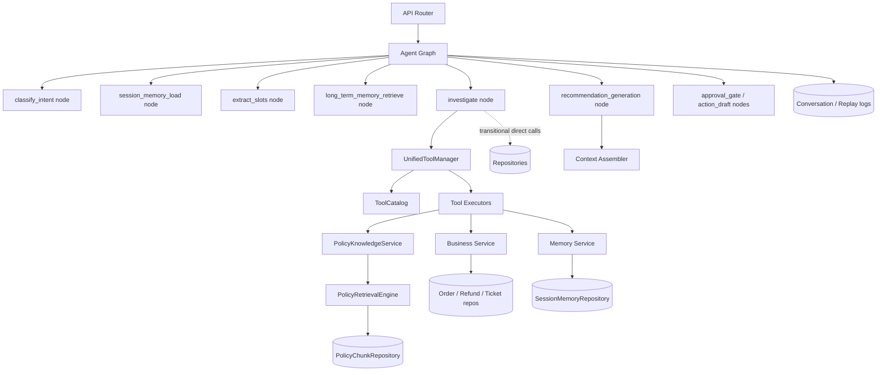
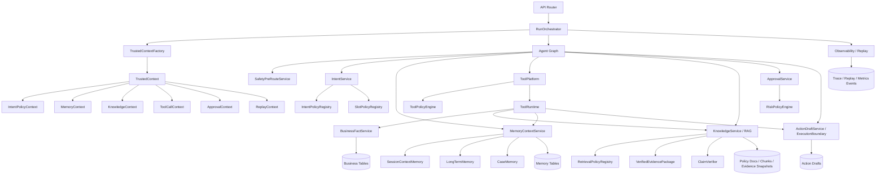
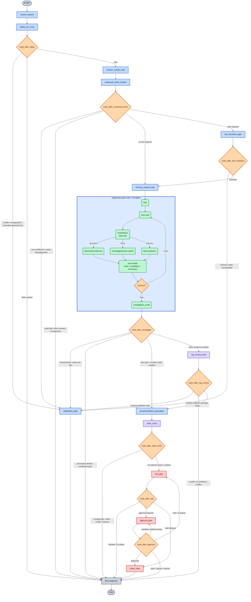
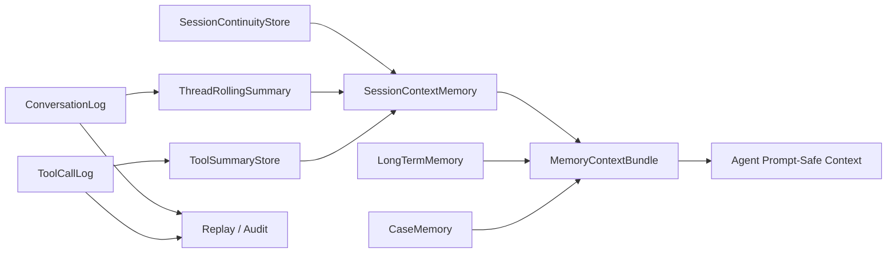
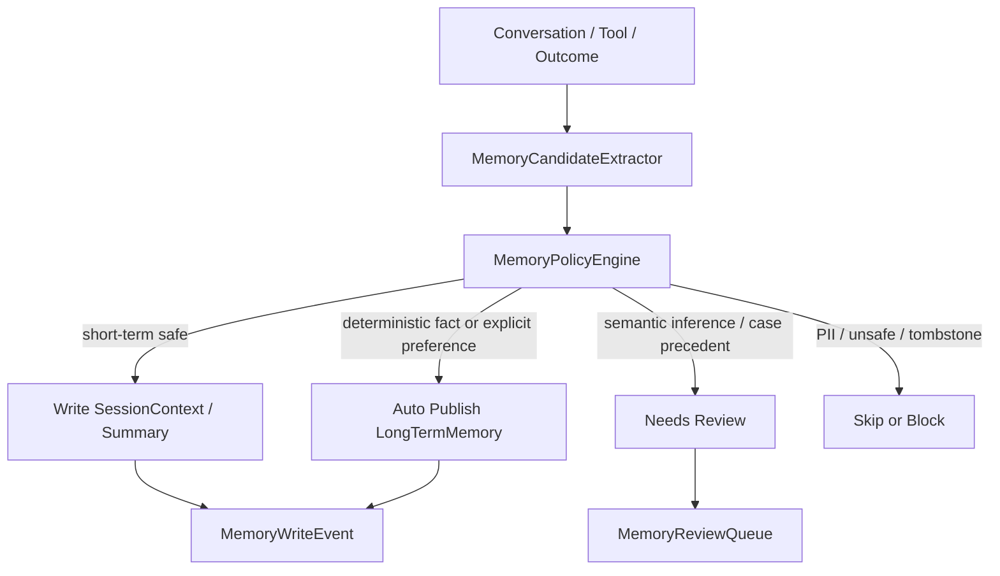
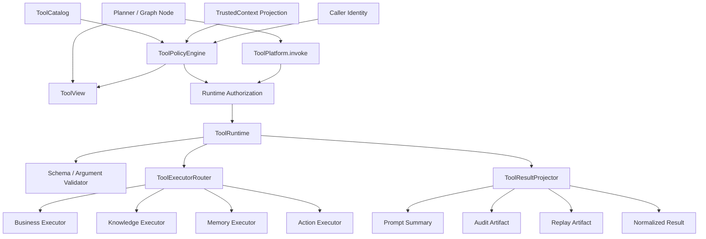
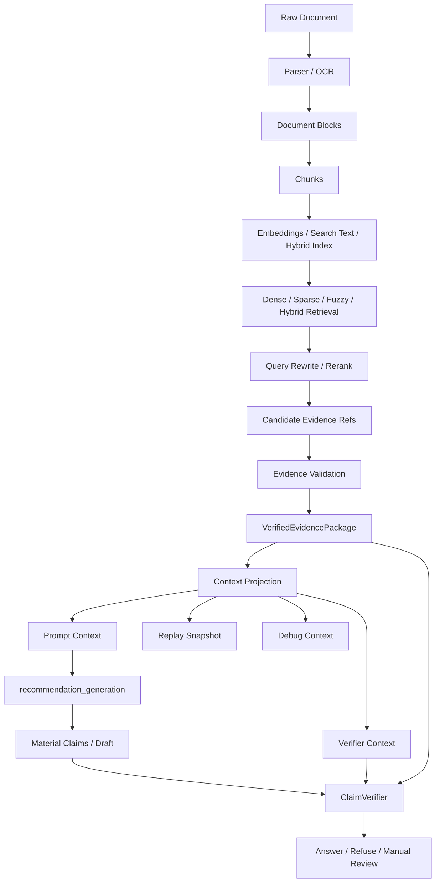

# MOCA Agent Platform 目标架构计划

> 状态：目标架构计划 + Phase 26 spec delta baseline 决策记录，不表示当前已全部实现；核心 graph/RAG/tool/business/event delta 已同步到 `docs/contract-spec.md`，后续实现必须按对应 phase 和 contract tests 落地。
> 日期：2026-06-22
> 语言：中文为主，保留必要英文术语。
> 契约边界：`docs/contract-spec.md` 是 MOCA 当前已接受契约的主要参考源，但不是不可挑战的最终权威。本文用于沉淀本轮讨论形成的目标架构、模块边界和实施顺序；后续进入 phase 实现前，需要把会影响跨模块契约的内容同步到 `docs/contract-spec.md` 或对应 phase 文档。若本文、`contract-spec.md`、当前源码、测试和产品判断发生冲突，phase plan 必须显式提出 spec delta / MVP scope / defer 决策，再进入实现。

## 1. 目标结论

本轮讨论收敛后的目标不是“马上拆微服务”，也不是“按当前代码继续局部补丁式演进”，而是：

```text
先把 MOCA 做成 microservice-ready modular monolith。

也就是：
- 代码、服务、数据访问、契约、trace、eval 都按未来可拆服务的边界设计。
- 当前部署仍可以是一个进程 / 一个应用。
- 是否真的拆成独立服务，是后续部署层和规模层决策。
```

同时，当前阶段明确不做完整 `real execution` 平台。目标是先把 action/approval/execution 的边界留正确：能产生安全的 action draft、approval gate、safety snapshot、trace/replay 事件；真正的 outbox、幂等执行、外部系统 reconciliation、compensation 可以后置。

## 2. 非目标

- 不在当前阶段把所有模块拆成独立微服务。
- 不在当前阶段实现完整生产级 real execution 平台。
- 不把 LLM 输出当作权限、事实、记忆、规则判断或业务状态的权威来源。
- 不把 RAG 检索结果直接等同于可用 evidence；必须经过 identity/scope/version/hash/effective date 等校验。
- 不让 router、graph node、tool executor 随意直接 import repository 或修改同一批表。
- 不把本文件当作当前代码事实；本文描述的是目标态和迁移路线。

## 3. 总体边界原则

目标调用链应该从“到处直接查库和拼状态”收敛为：

```text
router / graph node
  -> domain service 或 platform service 的 public method
    -> 接收 TrustedContext 或它的 projection
    -> 做权限、tenant scope、resource scope、policy version 校验
    -> 调自己拥有的 repository / adapter
    -> 维护自己的状态机或领域不变量
    -> 输出稳定 schema
    -> 产生 trace / replay / metrics event
```

核心原则：

- `router` 只负责 HTTP/API 层输入输出，不承载业务判断。
- `graph node` 只负责编排，不直接拥有领域状态。
- `domain service` 负责领域规则、状态机和 repository 访问。
- `platform service` 负责跨领域能力，例如 tool、memory、intent、knowledge、approval、observability。
- `repository` 不知道 agent、prompt、caller、LLM，也不发 agent trace。
- 所有跨模块调用都通过稳定 schema，不传裸 ORM row、裸 prompt、裸异常或未脱敏 payload。

### 3.1 Normative Sync / Spec Delta

本文包含若干目标态的新命名、新节点和新 schema。Phase 26 spec-delta baseline 已将核心 delta 接纳进 `docs/contract-spec.md`；后续实现仍必须按对应 phase 落地，不得跳过 contract tests。

> 2026-07-06 owner 更新：本节中出现的 Phase 32 / Phase 33 是 v1.9 时代的历史 owner 标签。当前 canonical Agent Graph migration 的执行 owner 是 Phase 51-58，执行顺序以 Phase 50 SPEC、`.planning/ROADMAP.md` 和 `.planning/STATE.md` 为准；旧 owner 只用于追溯，不再作为新 phase planning 的依据。

仍适用的规则：

- 已进入 `contract-spec.md` 的内容默认以 spec 为主要参考；若 phase plan 发现不合理或与源码/测试/产品目标冲突，必须先提出并记录 spec delta。
- phase 实现可以保留 legacy alias，但必须映射到 target canonical contract。
- 未进入 `contract-spec.md` 的新增字段、节点或状态不得静默引入。

Phase 26 delta 状态：

| 目标内容 | Phase 26 状态 | 后续要求 |
| --- | --- | --- |
| runtime graph 中的 `safety_pre_route`、`session_context_load`、`contextual_intent_resolve`、`slot_resolution_gate`、`rag_context_build`、`claim_verify` 等节点 | 已进入 `contract-spec.md` §9 target canonical vocabulary | 当前 owner：Phase 51-58；legacy alias 过渡期必须可映射，Phase 58 前必须清零 |
| `route_after_safety`、`route_after_rag_context`、`route_after_claim_verify` 等 router | 已进入 `contract-spec.md` §9 router contract | 当前 owner：Phase 52-57 分阶段迁移，Phase 58 做 final no-debt / totality guard |
| `TrustedContext` 相关字段 | canonical fields 继续完全遵守 `contract-spec.md` §8.0 | 不得把 request/run/projection-local metadata 加进 canonical `TrustedContext` |
| RAG/claim 输出状态，例如 `verified_evidence_package`、`rag_context_status`、`ClaimVerificationBundle` | 已进入 `contract-spec.md` §8.3 和 §10 AgentState registry | 当前 owner：Phase 56 统一 recommendation / RAG / claim fail-closed 状态与验证 |
| `SessionContextMemory` policy topic hints | 只能是上下文提示，不是 evidence | 不得 assignable to `EvidenceRefV1`，不得满足 approval/action/evidence gate |
| `ToolPolicyDecision`、`BusinessFactResult`、`DecisionEventEnvelopeV1` | 已进入 `contract-spec.md` §12.6 / §8.4 / §17.2 | Phase 28/29/30 实现 schema、reason codes 和 event envelope |

目标 runtime vocabulary 与当前 legacy implementation vocabulary 的临时映射：

| 目标名 | 当前可映射位置 | 备注 |
| --- | --- | --- |
| `safety_pre_route` | legacy `intent_classification` 内的安全预处理 / routing hints | 已进入 spec；当前 owner：Phase 52 注册为独立 node |
| `session_context_load` | `session_memory_load` | 目标上语义扩展为 agent-facing session context projection |
| `contextual_intent_resolve` | `intent_classification` | 目标上拆分为 candidate + policy resolved intent |
| `slot_resolution_gate` | legacy `extract_slots` + `route_after_slots` + slot helper | 已进入 spec；当前 owner：Phase 54 注册/切换为 canonical gate；slot candidate extraction 是内部能力，不作为最终 graph node |
| `memory_context_load` | `long_term_memory_retrieve` | 目标上加载 long-term/case，不参与最早 safety 判断 |
| `rag_context_build` | recommendation 前的受控 evidence validation 子流程 | 已进入 spec；当前源码已注册，Phase 56 继续统一 evidence / claim 状态 |
| `claim_verify` | recommendation 后的 citation/claim validator | 已进入 spec；输入为 `MaterialClaimV1` |
| `risk_gate` | historical `assess_risk_and_approval` alias | 目标语义是 risk + approval plan，不替代 `approval_gate`；Phase 57 后 current runtime 已使用 `risk_gate`，旧名只作历史/兼容引用 |
| `memory_write_pipeline` | `memory_write` / post-response runtime concern | 若需要 checkpoint/retry/eval，再注册 node |

## 4. 当前架构的简化图

下面是基于当前实现形态抽象出来的简化图。它不是完整代码地图，而是为了和目标架构对比。



当前架构已经有不少正确方向：`UnifiedToolManager`、`ToolCatalog`、`PolicyKnowledgeService`、当前业务读取 facade（如 `BusinessToolService` / `BusinessContextV1`）、session memory repository、conversation/replay/event 基础设施都存在或有雏形。主要差距不是“完全没有”，而是边界还没有统一成为平台级硬规则。

## 5. 目标架构总览

目标架构是按平台能力拆边界的 modular monolith。每个边界都应该能未来独立部署，但当前先在同一代码库、同一进程内实现。



### 5.1 目标模块

| 模块 | 职责 | 当前主要差距 |
| --- | --- | --- |
| `RunOrchestrator` | 一次 agent run 的入口、生命周期、graph 调用、trace/replay 串联 | router/graph 仍承担部分编排细节 |
| `TrustedContextFactory` | 生成 canonical trusted identity/scope/context，并派生各模块 projection | `ToolCallContext` 等 context 还不是统一来源 |
| `IntentService` | pre-route、上下文意图解析、slot gate、routing decision、calibration | graph node 逻辑偏厚，session context 辅助不足 |
| `MemoryContextService` | 加载 agent 可用的 session/long-term/case memory bundle | 当前 `SessionMemory` 名义和职责偏窄且容易混淆 |
| `ToolPlatform` | catalog、policy、runtime、executor、result projection、tool events | manager allowlist 和 descriptor/policy/runtime 边界仍不够清楚 |
| `KnowledgeService` | RAG 唯一公共入口，负责 retrieval、evidence validation、context projection、claim verification | 检索和验证能力强但还需要平台化、fail-closed 和规则 verifier |
| `BusinessFactService` | 订单、退款、工单等业务事实的唯一权威读取入口 | 部分代码仍可能直接查 repository 或手动拼业务状态 |
| `ApprovalService` | approval gate、risk policy、human review route | 需要和 action draft/execution boundary 的安全快照更稳定衔接 |
| `ActionDraftService / ExecutionBoundary` | 当前生成 draft，保留未来 execution 平台边界 | 暂不做完整 real execution，但边界要先定好 |
| `Observability / Replay` | trace、replay、metrics、eval artifact、policy version 记录 | 需要每个服务输出可审计 decision event |

### 5.2 Module Ownership Matrix

服务边界必须能落到 ownership，而不只是图上的方框。`docs/contract-spec.md` §0.2 是当前已接受 ownership 契约的主要参考；本表是目标架构镜像，用来解释后续实现为什么要禁止 graph/router/service 直接跨边界 import repository 或绕过 public methods。若本表与 spec 冲突，后续 phase plan 必须显式提出 spec delta、MVP scope 或 defer 决策，不能静默偏离。

| 模块 | Owned schemas/tables/events | Public methods | Allowed downstream dependencies | Forbidden imports/access | Decision events |
| --- | --- | --- | --- | --- | --- |
| `RunOrchestrator` | run entry/lifecycle orchestration refs, graph invocation refs, finalize/schedule refs | `start_run`, `invoke_graph`, `finalize_run`, `schedule_post_response_jobs` | `TrustedContextFactory`, Agent Graph, `RunLifecycleService`, Observability | 直接查 business/memory/RAG repository；承载业务规则 | run lifecycle and orchestration decision events |
| `TrustedContextFactory` | canonical `TrustedContext`, projection schemas | `create_from_request`, `project_to_tool_context`, `project_to_knowledge_context`, `project_to_memory_context`, `project_to_approval_context`, `project_to_replay_context` | trusted auth/session/run metadata sources | 让 LLM/user payload 覆盖 identity/scope；把 projection-local 字段写进 canonical context | trusted context projection decision events |
| `IntentService` | `IntentCandidate`, `ResolvedIntent`, intent policy decision, slot policy decision | `resolve_contextual_intent`, `resolve_required_slots`, `route_after_contextual_intent` adapter | `SessionContextMemory`, `IntentPolicyRegistry`, `SlotPolicyRegistry` | 调 tool/repository；把 model confidence 当授权依据 | intent policy and slot policy decision events |
| `MemoryContextService` | session/long-term/case memory projections, write candidates, review queue refs | `load_session_context_for_intent`, `load_memory_bundle_after_slot_resolution`, `propose_memory_writes` | memory repositories, redaction policy, review queue | 把 memory 当 policy evidence、current business fact、approval/action authority 或 replay truth | memory load/write policy decision events |
| `ToolPlatform` | `ToolDescriptor`, `ToolView`, `ToolPolicyDecision`, runtime auth, tool result projection, tool decision events | `visible_tools`, `invoke` | `ToolPolicyEngine`, domain service public methods, artifact store | graph/investigate 自建 allowlist；把 raw adapter payload 放进 prompt | tool visibility, runtime auth, and result projection decision events |
| `KnowledgeService` | `EvidenceRefV1`, `VerifiedEvidencePackageV1`, `MaterialClaimV1`, `ClaimVerificationBundleV1`, evidence validation, claim verification decisions | `search`, `build_verified_context`, `verify_claims` | policy/chunk repositories, retrieval engine, domain rule verifier plugins | 判断当前业务事实；让 citation membership 代替 semantic support | retrieval, evidence validation, and claim verification decision events |
| `BusinessFactService` | `BusinessFactResultV1`, `BusinessFactRefV1`, `BusinessContextV1`, resource freshness/scope checks | `fetch_context`, `get_order`, `get_refund_case`, `get_ticket` | owned business repositories/adapters | graph/tool 直接访问 repository；用 memory/RAG/LLM 替代当前业务事实 | business fact read, scope, and freshness decision events |
| `ApprovalService` | approval request/revision/interrupt/resume state machine, approval records/events | `create_request`, `record_decision`, `resume_with_trusted_decision`, `request_more_info` | risk/approval policy, snapshot refs, trusted resume adapter | 决定 risk auto/block；接受普通聊天伪造 approval decision | approval request, decision, resume, and lifecycle decision events |
| `ActionDraftService / ExecutionBoundary` | action proposal/draft records, payload hashes, draft safety binding | `create_draft`, `bind_safety_snapshot`, `prepare_execution_boundary` | trusted approval result, risk policy output, snapshot store | v1.9 产生真实外部副作用；绕过 approval/snapshot/action policy | action draft and safety binding decision events |
| `Observability / Replay` | `DecisionEventEnvelopeV1`, minimal event envelope, replay artifacts, redaction policy, eval artifact refs | `emit_decision_event`, `append_trace_event`, `build_replay_view`, `record_eval_artifact_ref` | service decision events, artifact stores, sequence allocator | 重跑 LLM 作为 replay；记录 prompt/raw tool/PII/action raw payload | decision event envelope and replay lifecycle events |

## 6. 目标 Agent Graph

目标 graph 的核心变化是：先安全预路由，再加载同 thread 的 session context，然后做上下文化意图识别。LongTermMemory 和 CaseMemory 不参与最早的 safety/intent 判断，避免历史偏好影响安全边界。

> **信任边界分组（导读，非新契约）：** 下面这条节点链可按「信任边界」读成三段，帮助理解「哪里允许 LLM 自由、哪里必须规则说了算」。这只是对既有节点的分组视角，**已接受契约主要参考 `docs/contract-spec.md`；§9 定义 graph/node/router 骨架，完整 fail-closed 硬约束需联合 §9 + §11 + §12 + §15 解读。本节不定义额外语义；若 phase plan 发现冲突，先提出 spec delta 再实现**。
>
> - **① 入口确定性（a-priori 规则）**：`receive_request → safety_pre_route → session_context_load → contextual_intent_resolve → slot_resolution_gate`。身份、授权、安全 tier、同 thread 短期上下文、意图与 slot 判定先于任何调查循环；`safety_pre_route` / `slot_resolution_gate` 等是 deterministic 节点，`contextual_intent_resolve` 是 LLM structured output + deterministic IntentPolicyEngine 的混合裁决，LLM 不参与鉴权。
> - **② 只读认知环自由（受控 ReAct）**：`investigate` 单节点内部的 bounded tool loop。LLM 在只读 allowlist 内自由决定下一步查什么、可依据上一步结果链式调查、可发现并回流 slot；受 §9.4 bounded-loop 契约的三重资源上限、只读约束、每步独立 trace 约束。这是「流程不受限」的唯一所在，且不改变 `investigate` 对外的 deterministic 单节点契约。
> - **③ 出口确定性（fail-closed，LLM 不可覆盖）**：`rag_context_build → recommendation_generation → claim_verify → risk_gate → approval_gate → action_draft`。证据校验、claim 支持、风险、审批、写动作全部走 deterministic router 与 fail-closed 硬闸；完整硬约束联合 §9 + §11 + §12 + §15，§9 单独只是骨架与 partial coverage。②环内只能产出 `proposed_action` 候选，写动作永不在环内执行。
>
> 实现现状与欠账见 `.planning/DEFERRED-DECISIONS.md` GAD-01、`.planning/AGENTIC-INVESTIGATION-DISCUSSION.md` 与 `.planning/phases/49-investigate-bounded-react-loop-migration/49-04-SUMMARY.md`：§9 已定义骨架契约，但完整 fail-closed 硬约束需联合 §9 + §11 + §12 + §15；当前源码已通过 Phase 49 将 `src/agent/nodes/investigate.py` 迁移为 bounded read-only ReAct planner 主路径，legacy deterministic planner 仅作为 planner failure / invalid step 的安全 fallback；observation→slot 回流已定 loop-local（不入 spec、不改 field registry）。剩余限制包括 graph-level node operation emission 仍有缺口，需在后续 phase 中按 node/service 边界补齐。

### 6.1 Canonical Runtime Graph

本小节是目标 runtime graph 的主图，registered node / router 名称以 `docs/contract-spec.md` §9 的当前已接受契约为主要参考；若本文图或说明与 spec 冲突，后续 phase plan 必须显式提出 spec delta、MVP scope 或 defer 决策，不能静默偏离。`extract_slots`、`generate_recommendation`、`assess_risk_and_approval` 等旧实现名只作为迁移期 legacy alias、历史兼容或旧实现说明出现，不能作为 current registered node key。

本图保留 `investigate` 展开视图，方便理解 bounded read-only ReAct loop；展开框内部 step / service / capability 不是主链 graph node。slot candidate extraction 作为 `contextual_intent_resolve` / `slot_resolution_gate` 的内部能力，不作为独立 registered graph node；真正改变 route、trace/eval/replay 边界的是 `slot_resolution_gate`。

本图当前主链 registered runtime node 共 15 个：`receive_request`、`safety_pre_route`、`session_context_load`、`contextual_intent_resolve`、`slot_resolution_gate`、`memory_context_load`、`investigate`、`rag_context_build`、`recommendation_generation`、`claim_verify`、`risk_gate`、`approval_gate`、`action_draft`、`clarification_gate`、`final_response`。不计入该数量的有：`START` / `END`、`route_after_*` router、`investigate` 展开框内的内部 step / service、以及当前作为 post-response/runtime concern 的 `memory_write_pipeline` / `trace_close`。

本图约定：

- 直角矩形表示 registered graph node。
- 大框表示展开查看的 registered graph node 边界，例如 `investigate`。
- 圆角矩形表示 node 内部 step / service / capability，不是 graph node。
- 菱形表示 deterministic router function。
- 颜色只用于阅读分组，不改变语义：蓝色是普通 graph node，紫色是 RAG / claim verification graph node，红色是 risk/action graph node，灰色是终止/最终回复节点，橙色是 router，绿色是 `investigate` 内部 read capability。不能用“蓝色节点数”代表 registered node 总数。
- `memory_write_pipeline`、`trace_close` 暂按 post-response/runtime concern 处理，不在本图中画成主链节点；如果未来注册成 graph node，再补进 runtime graph。



实现判断：

- `route_after_*` 是 deterministic router，不是 LLM node。
- `ToolPlatform`、`BusinessFactService`、`KnowledgeService`、`MemoryContextService` 是 service，不是主链 registered node。
- RAG 在 runtime 上拆成两段：RAG retrieval / policy search 是 `ToolPlatform` 的 planner-visible read capability，应该和 business facts、memory retrieval 一起进入 `investigate` 的受控 ReAct read loop；`rag_context_build` 在 loop 外把候选升级为 verified evidence package，供生成和 replay 使用。
- `slot_resolution_gate`、`rag_context_build`、`claim_verify` 是显式 registered node，因为它们会改变 route、影响 fail-closed、并且需要 trace/eval/replay。
- `risk_gate` 是 canonical node；Phase 57 后 current runtime 已使用 `risk_gate`，历史 `assess_risk_and_approval` 只能作为 legacy alias 映射到该语义，不表示它会替代 `approval_gate`。
- `claim_verify` 验证的是 `recommendation_generation` 产出的 material claims / proposed action claim，因此应在生成之后；如果只是 generation 前的证据充足性检查，应归入 `rag_context_build` 或 `route_after_rag_context`。
- `memory_write_pipeline` 和 `trace_close` 可以先做 post-response/runtime concern；如果后续需要 checkpoint、retry 或 eval，再注册为 graph node。
- future `action_execution` 不进入当前目标 runtime graph；当前只到 `action_draft`。
- 这张 runtime graph 是当前讨论收敛后的目标 proposal，并已作为 target canonical vocabulary 同步进 `contract-spec.md` §9。后续实现仍应按 phase 拆解和 contract tests 推进；如果实现、eval 或 contract review 发现冲突，应先修订本文、`contract-spec.md` 或对应 phase 文档，再改代码。

`investigate` 是单个 registered graph node。它内部可以有 bounded read-only loop，但这些内部步骤不是主 graph 节点：

```text
investigate internal read loop
  -> ToolPlatform planner-visible read capabilities
    -> business tools / BusinessFactService
    -> RAG retrieval / KnowledgeService.search
    -> memory retrieval tools
  -> write investigation_result to AgentState
```

`investigation_result` 至少应包含：

```text
termination_reason
business_facts
policy_candidate_refs
memory_summaries
missing_facts
safe_errors
tool_trace_refs
```

### 6.2 Graph 节点职责

- `receive_request`：只做请求接收和基础 normalization。
- `safety_pre_route`：在任何 memory 增强前做安全、越权、高风险请求的初筛。
- `session_context_load`：加载同 thread 的短期连续性，用于理解“刚才那个订单”“继续”等上下文追问。
- `contextual_intent_resolve`：结合当前 user message 和 `SessionContextMemory` 解析真实意图。
- `slot_resolution_gate`：消费 `contextual_intent_resolve` 产出的 current-turn candidate slots 和 `session_context_load` 产出的同 thread slot continuity，使用 `SlotPolicyRegistry` 决定哪些 slot 可以继承、哪些必须重问、哪些已过期或和当前 intent 不兼容；legacy `extract_slots` 只能作为该 gate 的迁移期实现细节，不能成为最终 graph node。
- `memory_context_load`：在 intent/slot 初步稳定后，按策略加载 `LongTermMemory` 和 `CaseMemory`。
- `investigate`：通过 `ToolPlatform` 调用 business facts、RAG retrieval / policy search、memory retrieval 等 planner-visible read capabilities，收集业务事实、政策候选证据和记忆检索结果；这里的 RAG 只到 candidate retrieval，不直接产出 prompt evidence。
- `rag_context_build`：将候选检索结果变成经过验证的 evidence context；如果某条路径必须有 verified evidence 但没有拿到，应 fail-closed 或进入人工审核。
- `claim_verify`：对 `recommendation_generation` 产出的 material claims / proposed action claim 做验证；不能让 LLM 覆盖 hard gates。
- `recommendation_generation`：生成回复或建议，但只消费 prompt-safe projection；legacy `generate_recommendation` 必须映射到这个 canonical node。
- `risk_gate`：业务风险、action 风险和是否需要审批的判断，不等同于 intent safety tier，也不替代 `approval_gate`；legacy `assess_risk_and_approval` 必须映射到这个 canonical node。
- `approval_gate`：执行 `risk_gate` 生成的 `approval_plan`，创建或恢复 approval request / interrupt，处理 trusted resume。它不负责决定 auto draft / blocked / approval required，这些仍由 risk/action policy 和 `route_after_risk` 决定。
- `action_draft`：只产生 draft 和安全快照，不在当前阶段执行真实外部副作用。
- `memory_write_pipeline`：post-response/runtime concern；从 conversation/tool/outcome 中提取记忆候选，经 policy 决定写入、review 或跳过。当前目标 runtime graph 不把它放进主链，除非后续需要 checkpoint、retry 或 eval。

### 6.3 `rag_context_build` 与 `route_after_rag_context`

目标上 `rag_context_build` 是 registered graph node，node/router/state contract 已同步到 `docs/contract-spec.md` §9 / §10。它不是 ReAct 步骤，也不负责 planner 自由选择工具。它的功能是把 `investigate` 里 RAG retrieval / policy search 返回的候选 refs，升级成可进入 prompt、verifier、replay 的 verified evidence package。

输入来源：

```text
AgentState
  intent_result
  resolved_slots
  business_facts
  policy_candidate_refs
  investigation_result.termination_reason
  TrustedContext / KnowledgeContext
  evidence_policy / risk tier
```

核心处理：

```text
policy_candidate_refs
  -> re-fetch current chunk/document rows
  -> tenant / RBAC / ACL / merchant scope check
  -> policy_version / effective_date / expiry check
  -> text_hash / content_hash / row version check
  -> doc_type / authority / scope validation
  -> stale / conflict / partial / no-evidence labeling
  -> dedup and token budget selection
  -> build prompt / verifier / replay / debug projections
```

输出写回 `AgentState`：

```text
rag_context_status
verified_evidence_package
evidence_map
citation_map
stale_or_conflicting_refs
rag_context_errors
replay_evidence_snapshot_refs
```

`rag_context_build` 只证明“这些 evidence 可以被使用”，不证明“模型最终生成的 claim 已经被 evidence 支持”。后者由 `recommendation_generation` 之后的 `claim_verify` 完成。

`route_after_rag_context` 是 deterministic router function，不是 graph node。它只读取 `rag_context_build` 写入的状态和 policy，不调用 LLM、tools、repository 或外部 API。

判断依据：

```text
rag_context_status
required_evidence_policy
verified_evidence_count
evidence_authority_level
stale_or_conflicting_refs
unauthorized_or_scope_denied_refs
effective_date_result
hash_or_version_mismatch
retrieval_coverage
risk tier / requested operation
```

典型路由：

```text
verified evidence sufficient
  -> recommendation_generation

evidence required but none / all invalid / unauthorized / stale / hash mismatch
  -> final_response with fail-closed or no-evidence response

evidence conflict / high-risk ambiguous policy
  -> final_response with manual-review handoff, or future dedicated review node

missing slot or business fact blocks evidence validation
  -> clarification_gate
```

简化理解：

```text
investigate: 找候选证据
rag_context_build: 验证候选证据能不能用
route_after_rag_context: 决定能不能进入生成
claim_verify: 生成后验证 claim 有没有被证据支持
```

## 7. TrustedContextFactory

`TrustedContextFactory` 是比当前零散 context 多出来的关键平台能力。它不是业务服务，也不是微服务；它负责把“这次请求到底是谁、在哪个租户、能访问什么、当前 run 的追踪身份是什么”变成所有模块共同承认的可信上下文。

### 7.1 Canonical TrustedContext

Canonical `TrustedContext` 必须和 `docs/contract-spec.md` §8.0 完全一致。它只表达可信 identity/scope/run trace，不承载 request-local、retrieval-local 或 policy decision metadata。

```text
TrustedContext
  schema_version
  tenant_id
  user_id
  role
  permissions
  merchant_scope
  session_id
  thread_id
  run_id
  trace_id
  locale
```

以下字段不属于 canonical `TrustedContext`，只能出现在 projection、run metadata 或 decision event 中：

| 字段 | 归属 | 原因 |
| --- | --- | --- |
| `request_id` | request/run metadata 或 tool-call-local metadata | 单次调用局部字段，不是 identity/scope contract |
| `effective_at` | `KnowledgeContext` run-derived field | 用于检索时效，不是可信身份字段 |
| `channel` | `IntentPolicyContext` / UI context | 影响交互策略，但不应扩展 trusted identity |
| `policy_versions` | decision event / replay / risk/knowledge metadata | 是决策快照信息，不是调用者身份 |

### 7.2 Projection

不同模块不能随意读取整个 trusted context，而应该拿自己的 projection：

| Projection | 消费方 | 包含内容 |
| --- | --- | --- |
| `IntentPolicyContext` | `IntentService` | tenant、role、locale、thread/run identity、安全等级输入；`channel` 可作为 projection-local UI context |
| `MemoryContext` | `MemoryContextService` | tenant、user、thread、run、retention policy、memory scope |
| `KnowledgeContext` | `KnowledgeService` | tenant、RBAC、merchant scope、run-derived `effective_at`、doc ACL、policy version metadata |
| `ToolCallContext` | `ToolPlatform` | caller、permissions、resource scope、idempotency、approval context |
| `ApprovalContext` | `ApprovalService` | actor、scope、risk inputs、evidence/action snapshot refs |
| `ReplayContext` | `Observability` | run、trace、model/tool/policy versions、artifact refs |

这样做的价值是：未来即使把 Knowledge、Tool、Memory 拆成服务，它们也不需要重新发明身份和权限模型。

## 8. Intent 模块设计

当前意图识别方向是对的，但需要从“一个较厚 graph node”演进为可校准、可评估、可审计的平台服务。

### 8.1 目标结构

```text
IntentService
  IntentPreRouter
  IntentClassifier
  IntentPolicyEngine
  IntentRouter
  IntentTraceProjector
  IntentCalibrationService
```

职责拆分：

- `IntentPreRouter`：安全、越权、明显 unsupported、空输入、注入类请求预处理。
- `IntentClassifier`：LLM 或规则产生 candidate intent、candidate operation、candidate slots。
- `IntentPolicyEngine`：用可信 policy 决定哪些 candidate 可接受。
- `IntentRouter`：输出 graph route 和 required gates。
- `IntentTraceProjector`：输出 reason code、raw confidence、calibrated confidence、policy version。
- `IntentCalibrationService`：用 eval 结果校准不同 intent 的阈值和失败策略。

### 8.2 SessionContextMemory 对 Intent 的作用

意图识别必须能理解上下文追问。例如：

```text
用户上一轮：帮我查 order_123 的退款条件。
用户这一轮：那如果超过 7 天呢？
```

当前 turn 里没有完整 slot，但 `SessionContextMemory` 可以提供：

- 上一轮 intent。
- 当前 active order/refund/ticket。
- 当前 policy topic。
- 未解决问题。
- 最近工具摘要。
- thread summary。

因此目标 graph 必须是：

```text
safety_pre_route
  -> session_context_load
  -> contextual_intent_resolve
```

不能反过来先完整 intent，再尝试补上下文。否则中文短句、追问、省略主语、多轮退款场景会一直不稳定。

### 8.3 Policy 与 Slot

`IntentPolicyRegistry` 负责：

- 允许的 `primary_intent`。
- 允许的 `requested_operation`。
- intent 与 operation 的兼容关系。
- 该 intent 是否允许工具调用、RAG、memory、action draft。
- 初始 route。
- 风险等级输入。
- eval admission 规则。

`SlotPolicyRegistry` 负责：

- required slots。
- current turn slots。
- 可继承 session slots。
- freshness / TTL。
- slot 与 intent 的兼容性。
- entity validation。
- 缺失时追问策略。

LLM 可以提候选 slot 和候选 required slots，但不能直接决定 required slot policy。

### 8.4 Confidence Calibration

当前 `0.65 / 0.85` 这类阈值只能作为 MVP conservative gate，不能当作真实生产级校准值。目标上需要区分：

- `raw_confidence`：模型自报或分类器原始分数。
- `calibrated_confidence`：按 intent、语言、上下文场景、风险类别校准后的分数。
- `calibration_status`：`unverified | calibrated | expired | disabled`。

生产级 calibration 需要 eval 集：

- per-intent 正例。
- hard negatives。
- OOD / unsupported 请求。
- 中文短句和省略表达。
- 上下文追问。
- 多 intent / 多 target 请求。
- 高风险 false negative cases。

高风险场景的目标不是追求平均准确率，而是把 false negative 作为 hard gate：宁可澄清或人工审核，也不能错路由到低风险自动处理。

### 8.5 为什么当前 `classify_intent` 会变胖

当前 `classify_intent` 类节点容易膨胀，是因为它天然会被塞入几类不同职责：

- 安全预路由：判断是否是越权、注入、伪造审批、明显 unsupported。
- 语义分类：判断 `primary_intent`、`requested_operation`、候选 slots。
- 上下文补全：理解“刚才那个”“那如果超过 7 天呢”。
- policy 决策：判断这个 intent 是否允许工具、RAG、memory、action。
- slot 决策：判断哪些 slot 必须有、哪些可以继承、哪些过期。
- route 决策：决定下一步去 clarification、investigate、final response。
- trace/debug：记录 confidence、reason codes、prompt raw output。

这些职责如果都放在一个 graph node 里，短期实现快，但后续会出现几个问题：

- 很难证明 LLM 输出和 trusted policy 的边界。
- 很难做 per-intent eval 和 calibration。
- 很难让 `SessionContextMemory` 只辅助上下文理解，而不污染安全判断。
- routing、slot、risk、tool visibility 会互相耦合。
- 出问题时只能看到一个大节点失败，不知道是分类错、slot 继承错还是 policy gate 错。

目标不是把每个小 helper 都注册成 LangGraph node，而是把职责拆成 service 内部组件，并把会改变 route 的 gate 显式化。

### 8.6 IntentService 内部组件契约

目标调用形态：

```text
safety_pre_route graph node
  -> IntentService.pre_route(...)
    -> IntentPreRouter

contextual_intent_resolve graph node
  -> IntentService.resolve_contextual(...)
    -> ContextualIntentBuilder
    -> IntentClassifier
    -> IntentPolicyEngine
    -> IntentRouter
    -> IntentTraceProjector
```

内部组件：

| 组件 | 输入 | 输出 | 关键约束 |
| --- | --- | --- | --- |
| `IntentPreRouter` | raw user message、trusted identity、channel、role | `pre_route_decision` | 在 memory 加载前执行；只做安全/unsupported/伪造 trusted command 初筛。 |
| `ContextualIntentBuilder` | user message、`SessionContextMemory` | prompt-safe contextual input | 只能使用同 thread 短期上下文；不能引入 LongTerm/Case。 |
| `IntentClassifier` | contextual input | LLM/rule candidates | 输出只是 candidate，不是路由事实。 |
| `IntentPolicyEngine` | candidates、`IntentPolicyRegistry`、trusted context | accepted/rejected candidate + reason codes | 决定 candidate 是否符合平台 policy。 |
| `IntentRouter` | accepted intent、slot requirement、policy gates | next route hint | 不调用 LLM、不查库，只读 policy 和 state。 |
| `IntentTraceProjector` | raw output、policy decision、calibration | trace/debug projection | raw LLM output 只进 debug/replay，不直接进 prompt。 |

`IntentClassifier` 的目标输出应拆成“模型候选”和“系统裁决”：

```text
IntentCandidate
  primary_intent_candidate
  requested_operation_candidate
  candidate_slots
  raw_confidence
  model_reason

ResolvedIntent
  primary_intent
  requested_operation
  allowed_operations
  required_slot_policy_ref
  initial_route
  intent_safety_tier
  calibrated_confidence
  reason_codes
  policy_version
```

开发时要避免把 `routing_hints` 当 trusted route。LLM 可以提供 diagnostic hints，但真正 route 必须由 `IntentPolicyEngine` / `IntentRouter` 根据 registry 决定。

### 8.7 Graph node 与 service 的边界

目标 graph registered nodes：

```text
safety_pre_route
session_context_load
contextual_intent_resolve
slot_resolution_gate
```

不建议注册成 graph node 的内部组件：

```text
IntentClassifier
IntentPolicyEngine
IntentPolicyRegistry
SlotPolicyRegistry
IntentCalibrationService
IntentTraceProjector
```

原因：

- graph node 应代表 checkpoint/replay/route 边界。
- registry / policy / calibration 是服务内部决策依赖，不是独立运行步骤。
- 如果把每个 helper 都变成 graph node，会让 graph 噪音变大，实际状态边界反而不清晰。

### 8.8 Slot Resolution 目标细节

`slot_resolution_gate` 不是简单判断“有没有 slot”。它要合并当前 turn slot 和 session slot，并输出可审计结果。

输入：

```text
current_turn_slots
SessionContextMemory.active_slots
SlotPolicyRegistry
ResolvedIntent
business entity validators
```

判断：

- required slots 是否满足。
- inherited slot 是否和当前 intent 兼容。
- inherited slot 是否过期。
- slot 是否来自同 tenant / same thread / allowed merchant scope。
- slot 是否被用户本轮否定或替换。
- slot 值是否能通过 entity validation。

输出：

```text
resolved_slots
slot_resolution_status
slot_sources
missing_slots
stale_slots
incompatible_slots
clarification_question_spec
reason_codes
```

这样做的原因是：多轮客服场景中最常见的错误不是“抽不到 slot”，而是错误继承旧 slot、把上一个订单套到当前问题、或者在用户已经改口后继续使用旧上下文。

## 9. Memory 模块设计

本轮讨论最终收敛为：保留一个 agent-facing 概念 `SessionContextMemory`，但把底层存储命名得更准确，避免“SessionMemory 到底只是 slot 还是完整会话上下文”的混乱。

### 9.1 目标分层



### 9.2 各层定义

| 层 | 语义 | 是否 agent-facing | 审计/回放是否权威 | 业务/政策/action 是否权威 |
| --- | --- | ---: | ---: | ---: |
| `ConversationLog` | 原始用户、assistant、tool 交互记录 | 否，默认不全量进 prompt | 是 | 否 |
| `ToolCallLog` | 原始工具调用、参数摘要、结果引用、错误引用 | 否，默认只投影摘要 | 是 | 否 |
| `WorkflowCheckpoint` | 恢复执行用 checkpoint | 否 | 是，作为运行恢复来源 | 否 |
| `WorkingStateV1` | 当前 run 的 prompt-safe 状态投影 | 是，但不是 memory store | 否，运行态派生 | 否 |
| `SessionContinuityStore` | 同 thread 短期连续性的存储层 | 否，内部存储 | 是，作为短期连续性来源 | 否 |
| `SessionContextMemory` | 同 thread 的完整短期会话上下文投影 | 是 | 派生，受 policy 控制 | 否 |
| `LongTermMemory` | 跨 thread 的 durable profile/preference/pattern/operational constraint | 是，检索后少量进入 | 是，需 policy/review 约束 | 仅对 durable memory 语义权威，不替代当前业务事实、政策证据或 approval evidence |
| `CaseMemory` | reviewed precedent/outcome memory | 是，检索后进入 | 是，通常需 review | 仅对 precedent/outcome 语义权威，不替代当前政策或业务事实 |

### 9.3 SessionContextMemory 内容

`SessionContextMemory` 不是只存 slot。目标内容包括：

```text
SessionContextMemory
  thread_id
  active_slots
  current_intent
  initial_intent
  last_intent
  unresolved_questions
  thread_summary
  recent_conversation_projection
  recent_tool_summaries
  active_business_refs
  policy_topic_hints
  prior_policy_mention_refs
  fallback_reasons
  updated_at
  expires_at
  version
```

其中 `SessionContinuityStore` 是内部存储层，负责持久化 active slots、last intent、unresolved questions、summary refs、business refs、TTL/version 等。Agent 不应该直接消费这个 store，而是消费 `MemoryContextService` 生成的 projection。

`policy_topic_hints` 和 `prior_policy_mention_refs` 只能表达“上一轮可能在讨论哪个政策主题 / 曾展示过哪些引用”。它们不能 assignable to `EvidenceRefV1`，不能进入 `VerifiedEvidencePackage`、`ClaimVerificationBundle`、approval snapshot 或 action snapshot，也不能满足当前轮 policy evidence gate。当前轮政策证据必须重新通过 `investigate -> rag_context_build` 得到。

### 9.4 MemoryContextService

目标公共入口要区分加载阶段，避免 long-term/case 过早进入 safety 或 intent：

```text
MemoryContextService.load_session_context_for_intent(...)
  -> session_context: SessionContextMemory

MemoryContextService.load_memory_bundle_after_slot_resolution(...)
  -> session_context: SessionContextMemory
  -> long_term_memory: LongTermMemory[]
  -> case_memory: CaseMemory[]
```

`load_for_agent(...)` 可以作为后阶段内部组合方法，但不应被 early graph node 一次性加载全部 memory。三类 memory 可以出现在同一个 `MemoryContextBundle`，但语义必须分开：

- `SessionContextMemory`：same thread continuity。
- `LongTermMemory`：cross-thread durable profile/preference/pattern/operational constraint。
- `CaseMemory`：reviewed precedent/outcome memory。

不能把 long-term profile 或 case precedent 混进 session context 里，否则后续 eval、retention、review、隐私策略都会变得不可控。

`LongTermMemory` 里的 durable memory 允许表达：

- `durable_profile_fact`：稳定画像事实。
- `merchant_preference`：商家明确偏好。
- `merchant_pattern`：经 review 的稳定模式。
- `operational_constraint`：稳定运营约束。

明确禁止把当前订单状态、退款状态、工单状态、审批结论、政策规则、单次客服判断或单次工具调用的当前业务状态快照发布成 long-term memory authority。这些内容必须来自当前业务工具、RAG evidence、approval/action binding 或审计日志。

### 9.5 Memory 写入策略

LLM 只能提出 memory candidate，不能直接写 published memory。这不是说每条记忆都需要人工确认，而是说写入必须经过 policy。



写入规则：

- `ConversationLog`、`ToolCallLog`、短期 thread summary 通常可以自动写入，因为它们是审计/运行事实或短期投影。
- 明确用户偏好可以自动进入 long-term，但必须记录 source 和 policy version。
- 确定性工具结果、确认后的业务 outcome、审批状态只有在语义是 durable 且不是当前业务对象状态时，才可以自动进入 long-term；缺失 `source_ref.business_object_type` 或指向 order/refund/refund_case/ticket/logistics/approval/action/coupon/payment 时必须进入 review。
- LLM 推断出的偏好、语义 episode、跨 case pattern 不能直接 published，通常进入 review。
- `CaseMemory` 作为 precedent/outcome memory，默认需要 review 后才能被检索为依据。
- 敏感 PII、违反 retention policy、被 tombstone 覆盖的信息必须 skip/block。

### 9.6 MemoryService 作为唯一公共入口

目标上，graph node 不应该直接读写 memory repository。对 agent 可见的 memory 操作都应收敛到 `MemoryContextService` / `MemoryWriteService`。

目标 API：

```text
MemoryContextService.load_session_context_for_intent(...)
  -> SessionContextMemory

MemoryContextService.load_memory_bundle_after_slot_resolution(...)
  -> MemoryContextBundle

MemoryWriteService.propose_candidates(...)
  -> MemoryCandidate[]

MemoryWriteService.apply_policy_and_write(...)
  -> MemoryWriteResult
```

Repository 职责只做持久化，不做 prompt projection、不做 LLM candidate 判断、不做跨层 policy。

```text
Graph node
  -> MemoryContextService
    -> MemoryPolicyEngine
    -> SessionContinuityStore / LongTermMemoryStore / CaseMemoryStore
```

### 9.7 WorkingStateV1 与 memory 的区别

`WorkingStateV1` 是当前 run 的 prompt-safe 状态投影，不是 memory store。它可以包含：

- 当前 intent。
- resolved slots。
- selected business facts summary。
- verified evidence summary。
- pending question。
- approval/action draft safe summary。

它不应该承担：

- 长期偏好存储。
- reviewed precedent。
- conversation 原文归档。
- workflow checkpoint。

原因是：working state 为当前 run 服务，memory 为跨 turn / cross thread / reviewed precedent 服务。把二者混在一起，会导致 replay、retention、隐私删除和 eval 都无法分层。

### 9.8 Memory 与 graph 的集成顺序

目标 graph 中 memory 分两次进入：

```text
safety_pre_route
  -> session_context_load
  -> contextual_intent_resolve
  -> slot_resolution_gate
  -> memory_context_load
```

含义：

- `session_context_load`：只加载同 thread 的短期上下文，用于 intent 和 slot continuity。
- `memory_context_load`：在 intent/slot 初步稳定后，再按 policy 加载 LongTermMemory / CaseMemory。
- `memory_write_pipeline`：回复后执行，不阻塞主响应。

这样做的原因：

- safety 判断不能被历史偏好或 case precedent 影响。
- intent 需要 same-thread context，否则中文追问不稳定。
- long-term/case memory 只有在知道当前 intent 和 scope 后才知道是否应该加载。
- 写 memory 不应该影响用户本轮回复的完成路径。

## 10. Tool Platform 设计

当前工具系统已经不是 demo 级别，但还不是完全生产级平台。主要问题不是 “manager allowlist 是否存在”，而是 allowlist、descriptor、planner view、runtime authorization 现在还没有完全收敛为单一 policy 决策。

### 10.1 目标结构



### 10.2 ToolCatalog 是单一事实源

每个 tool descriptor 目标字段：

```text
ToolDescriptor
  name
  version
  domain_owner
  operation_kind
  planner_visibility
  allowed_callers
  required_scopes
  resource_scope_policy
  side_effect_level
  approval_policy
  idempotency_policy
  timeout_policy
  retry_policy
  rate_limit_policy
  data_classification
  prompt_projection_policy
  audit_event_family
  input_schema
  output_contract
  executor_ref
```

`ToolCatalog` 保存全量 descriptor，但 planner 只能看到 `ToolPolicyEngine` 派生出的 `ToolView`。因此：

- catalog 不是“全部暴露给模型”。
- allowlist 不应该散落在 manager、investigate node、executor 和 prompt 中。
- node-only、planner-visible、internal tools 可以同处 catalog，但 visibility 和 runtime authorization 必须由 policy 决定。

### 10.3 ToolRuntime 职责

`ToolRuntime` 统一处理：

- 输入 schema 校验。
- caller/runtime authorization。
- timeout。
- retry。
- idempotency key。
- side-effect gate。
- approval requirement。
- result normalization。
- raw artifact persistence。
- safe error projection。
- trace/replay event。

Domain executor 应该保持薄：

```text
ToolRuntime
  -> domain executor
    -> domain service public method
      -> repository / adapter
```

executor 不应该自己决定 planner 是否能看见工具，也不应该绕开 service 直接查库。

### 10.4 与 xiaozhi-esp32-server 的差异

可借鉴：

- 插件化 capability 注册。
- executor/handler 解耦。
- 动态能力发现。
- 未来 MCP 或外部工具接入思路。

不直接照搬：

- 不能让模型直接调用松散 function。
- 不能绕过 MOCA 的 tenant、merchant scope、approval、evidence、replay、PII policy。
- 不能把“能注册工具”等同于“能被 planner 看见或能执行”。

MOCA 的工具平台必须是 descriptor + policy + runtime + executor 的组合。

### 10.5 为什么 manager allowlist 需要收敛

当前 `manager allowlist` 怪的根因不是“有 allowlist 不对”，而是多个位置同时表达工具可见性和可执行性：

- `ToolCatalog` 描述工具。
- `UnifiedToolManager.descriptors(...)` 派生 caller view。
- `investigate` 可能还有自己的 allowlist。
- side-effect / write tool 规则可能散在 manager 或节点里。
- action 节点又需要 node-only capability。

目标上要把这些收敛为两个问题：

```text
planner visibility:
  当前 caller 能不能看见这个 tool？

runtime authorization:
  当前 caller 带着这个 TrustedContext 能不能执行这个 tool？
```

二者都由 `ToolPolicyEngine` 根据 `ToolDescriptor + TrustedContext projection + caller + resource scope` 决定，而不是由多个硬编码列表共同决定。

### 10.6 Planner view 与 runtime auth

`ToolPlatform` 至少要提供两个 public method：

```text
ToolPlatform.visible_tools(caller, context)
  -> ToolView[]

ToolPlatform.invoke(tool_name, args, context)
  -> ToolResultV2
```

`visible_tools` 输出给 planner 的不是完整 descriptor，而是裁剪后的 `ToolView`：

```text
ToolView
  name
  description
  input_schema
  safe_usage_notes
  result_contract_version
```

不能暴露：

- raw adapter。
- internal permission reason。
- raw exception shape。
- hidden side-effect capability。
- prompt-unsafe fields。

`invoke` 必须重新做 runtime auth，不能因为 planner 看见了 tool 就默认能执行。原因是：planner view 是“可考虑”，runtime auth 是“本次调用带着这些 args 和 scope 可执行”。

`ToolPolicyEngine` 的输出不能只是 boolean，必须是可审计、可回放、可 eval 的结构化 decision：

```text
ToolPolicyDecision
  tool_name
  caller
  decision_stage        # visibility | runtime_auth
  decision              # visible | hidden | allowed | denied
  reason_codes[]
  required_scopes[]
  matched_scope
  policy_version
  data_classification
  resource_scope_binding
```

`visible_tools(...)` 和 `invoke(...)` 都必须产生 `ToolPolicyDecision` 或等价 decision event。这样才能解释“为什么 planner 看不到某个 tool”和“为什么 planner 看得到但 runtime 被拒绝”。

### 10.7 ToolResult 投影分层

同一个 tool result 要分成不同投影：

```text
raw artifact
  -> internal audit / replay only

normalized result
  -> graph state / downstream services

prompt summary
  -> LLM prompt

debug projection
  -> developer trace
```

这能避免 raw payload、PII、adapter exception、prompt injection 文本直接进入模型上下文。尤其是 RAG、CRM、订单系统返回的文本，都必须通过 prompt projection policy。

### 10.8 Tool executor 边界

Executor 是 thin adapter，不是业务服务：

```text
ToolRuntime
  -> BusinessToolExecutor
    -> BusinessFactService
      -> repository / integration
```

Executor 可以做：

- 调用正确 domain service。
- 做工具名到 service method 的轻量分发。
- 包装 domain result 为 `ToolResultV2`。

Executor 不应该做：

- agent caller allowlist。
- planner visibility。
- tenant / merchant scope 的最终领域判断。
- 自己绕过 service 直接查 repository。
- LLM prompt 拼接。

## 11. RAG / Knowledge 平台设计

RAG 的目标不是让模型“看更多资料”，而是让每个关键结论都有可追溯、可校验、权限正确、时效正确的 evidence chain。

### 11.1 目标 RAG 流程



### 11.2 KnowledgeService 唯一公共入口

目标上，graph node、tool executor、API router 都不应该直接拼 retrieval engine 或 repository。它们应该调用：

```text
KnowledgeService.search(...)
KnowledgeService.build_verified_context(...)
KnowledgeService.verify_claims(...)
```

`verify_claims(...)` 的边界是 evidence support verification：判断 policy/knowledge evidence 是否支持生成的 material claims，并调用可插拔 domain rule verifier 做金额、时效、否定、条件、例外等 hard checks。它不能替代 `BusinessFactService` 判断订单、退款、工单等当前业务事实；业务事实 claim 只能引用 `BusinessFactRefV1` / `BusinessFactResult`，不得由 RAG 或 memory 重新“证明”。

内部再由 `RetrievalPolicyRegistry` 决定：

- dense/sparse/fuzzy/hybrid 组合。
- query rewrite 是否开启。
- rerank 是否开启。
- token/evidence budget。
- doc_type / authority / freshness ranking。
- tenant、RBAC、merchant scope、document ACL 过滤。
- risk-aware fail-closed 策略。

### 11.3 Evidence Identity 与 Validation

RAG 检索返回的是 candidate，不是最终证据。目标证据必须经过：

```text
tenant_id
doc_key
chunk_id
policy_version
text_hash
effective_date
scope
doc_type
source locator
captured_at
```

`VerifiedEvidencePackage` 应包含：

- `EvidenceRefV1`。
- 验证后的 snippet。
- `text_hash` 和 policy/doc version。
- 权限/scope/effective date 验证结果。
- source locator，例如 page、section、bbox、block id。
- captured_at，用于 historical replay。
- conflict/stale/partial/no evidence 标记。

Context builder 只能消费 verified evidence，不能直接消费 raw search hit。

### 11.4 ClaimVerifier

`ClaimVerifier` 的意思是：对 agent 即将说出的关键业务/政策结论做证据和规则校验。它不是另一个“让 LLM 再看看对不对”的简单步骤。

目标分层：

```text
Level 1: Evidence identity verifier
  - tenant / scope / ACL
  - row current
  - hash/version
  - effective date
  - doc_type / authority

Level 2: DomainRuleVerifier
  - 否定条件
  - 条件分支
  - 金额阈值
  - 时效窗口
  - 例外条款
  - 政策层级冲突

Level 3: Semantic verifier
  - 仅处理 ambiguous / high-risk / action-bound / OCR-table / conflict cases
  - LLM 只能辅助语义匹配
  - hard gates 不被 LLM 覆盖
```

为什么要补 verifier：

- RAG 召回到相关条文，不代表回答中的 claim 被条文支持。
- “不能退款”和“满足条件才可退款”经常被模型误读。
- 金额、日期、时效、例外条款是业务风险核心。
- 高风险 action 前必须 fail-closed，而不是让模型自由解释。

失败策略：

- verifier timeout：高风险场景 fail-closed。
- malformed verifier output：fail-closed。
- evidence stale/conflict：manual review 或 refuse。
- no evidence：不能生成肯定性政策 claim。

### 11.5 Query Planning

RAG query 不应该只等于 raw user query。目标由 `KnowledgeQueryPlanner` 结合以下信息生成：

- contextual intent。
- resolved slots。
- business facts。
- issue type。
- merchant scope。
- policy topic。
- `SessionContextMemory` 中的当前 thread context。

这样才能处理“那超过 7 天呢”“这个订单能不能退”这类上下文化问题。

### 11.6 RAG Eval

目标 eval gate：

- retrieval recall / precision。
- citation membership。
- claim support。
- negation / condition / amount / time window / exception。
- stale/latest policy。
- tenant/scope/doc_type/risk 过滤。
- no-evidence / OOD。
- OCR/table provenance。
- policy doc prompt injection。
- historical replay snapshot。

### 11.7 RAG 在 graph 中的三段职责

RAG 不应该被实现成一个黑盒节点。目标上分三段：

```text
investigate 内部 RAG retrieval
  -> rag_context_build
  -> recommendation_generation
  -> claim_verify
```

三段职责：

| 阶段 | 是否 ReAct | 主要问题 | 输出 |
| --- | ---: | --- | --- |
| `KnowledgeService.search` | 是，作为 `investigate` read tool | “下一步要查什么政策/FAQ/SOP？” | candidate evidence refs |
| `rag_context_build` | 否，deterministic | “这些候选证据当前是否有效、可用、可引用？” | verified evidence package |
| `claim_verify` | 否，rules-first verifier | “生成出来的 claim 是否真的被证据支持？” | allow/block/manual-review route |

原因：

- retrieval 需要 planner 根据调查进展选择 query，所以属于 bounded read loop。
- evidence validation 是确定性安全边界，不能让 ReAct 自由决定。
- claim verification 必须看见生成后的 material claims，所以在 `recommendation_generation` 后。

### 11.8 `VerifiedEvidencePackage` 目标 schema

`rag_context_build` 的输出应当是稳定 schema，而不是散落的 context string：

```text
VerifiedEvidencePackage
  package_id
  status
  evidence_items[]
  citation_map
  prompt_projection
  verifier_projection
  replay_snapshot_refs
  debug_projection
  stale_refs[]
  conflict_refs[]
  rejected_candidate_refs[]
  reason_codes[]
  policy_version
```

`evidence_items[]` 至少包含：

```text
EvidenceItem
  ref: EvidenceRefV1
  snippet
  text_hash
  doc_version
  policy_version
  effective_date_result
  tenant_scope_result
  authority_level
  source_locator
  captured_at
```

这样做的原因：

- prompt 只拿 prompt projection。
- verifier 拿 verifier projection。
- replay 拿 snapshot refs。
- debug 拿 rejected/stale/conflict reason。
- action/approval 拿 evidence refs，而不是上下文字符串。

`VerifiedEvidencePackage`、`rag_context_status`、`citation_map`、`evidence_map` 等字段已进入 `contract-spec.md` §10 AgentState canonical registry，并明确 `rag_context_build` 是唯一 writer。后续实现不能用临时 dict 或同义字段绕过 state lifecycle/reset contract。

### 11.9 `route_after_rag_context` 状态枚举

建议 `rag_context_build` 输出明确状态，而不是只靠布尔值：

```text
rag_context_status:
  not_required
  verified
  partial
  no_evidence
  unauthorized
  stale
  conflict
  invalid_hash
  invalid_scope
  build_error
```

路由规则：

| status | 低风险回答 | 高风险/action-bound |
| --- | --- | --- |
| `not_required` | `recommendation_generation` | 取决于 action 是否需要 evidence |
| `verified` | `recommendation_generation` | `recommendation_generation` |
| `partial` | 可生成保守回答 | manual review 或 fail-closed |
| `no_evidence` | no-evidence response | fail-closed |
| `unauthorized` / `invalid_scope` | refuse / scope-safe final | fail-closed |
| `stale` / `conflict` | 标明无法确认或 review | manual review / fail-closed |
| `invalid_hash` / `build_error` | no-evidence/fallback | fail-closed |

`route_after_rag_context` 不应该调用 LLM，也不应该重新检索。它只是根据状态、risk、intent、requested operation 和 evidence policy 做 deterministic route。

### 11.10 ClaimVerifier 输出与 hard gates

`claim_verify` 不应该靠解析最终自然语言回复来找 claim。`recommendation_generation` 必须同时输出稳定的 material claim contract，供 verifier 消费：

```text
MaterialClaim
  claim_id
  claim_text
  claim_type              # policy | business_fact | action_recommendation
  cited_evidence_ids[]
  business_fact_refs[]
  risk_hints[]
  generated_from_step
```

`claim_verify` 应输出 claim 级别结果和 overall route：

```text
ClaimVerificationBundle
  overall_status
  route
  claim_results[]
  blocked_claims[]
  safe_support_refs[]
  reason_codes[]
  verifier_policy_version
```

`claim_results[]`：

```text
claim_id
claim_text
claim_type
support_status
supporting_evidence_refs
business_fact_refs
rule_checks
semantic_review_status
allows_user_visible_claim
allows_action_recommendation
```

Hard gates：

- unsupported policy claim 不能用户可见。
- unsupported action recommendation 不能进入 approval/action path。
- LLM semantic review 不能覆盖 tenant/scope/hash/effective date/authority gate。
- verifier timeout/malformed 在高风险场景 fail-closed。
- business fact missing 时，不能用 policy evidence 或 memory 代替业务事实。

## 12. BusinessFactService

业务事实必须和 memory/RAG/model knowledge 分开。订单、退款、工单、账户状态等结构化事实只能由 `BusinessFactService` 或对应 domain service 提供。

当前代码里的业务读取入口更接近 `BusinessToolService`。本文使用 `BusinessFactService` 表示目标语义：它不应该只是“tool 的后端实现”，而应该是结构化业务事实的领域公共入口。后续实现可以选择直接重命名，也可以先保留类名、逐步收敛职责。

目标：

```text
Graph / ToolRuntime
  -> BusinessFactService public method
    -> tenant / merchant ownership / resource scope check
    -> domain repository / adapter
    -> stable BusinessFact schema
    -> trace/replay event
```

禁止目标态：

- graph node 直接 import `OrderRepository` / `RefundRepository` / `TicketRepository`。
- LLM 根据记忆或 RAG 猜测具体订单事实。
- memory 中的历史摘要覆盖当前业务表事实。
- tool executor 手动拼一个临时业务状态并绕过 domain service。

### 12.1 BusinessFactService 目标 API

目标上 business fact 不是“工具结果字符串”，而是结构化事实包：

```text
BusinessFactService.fetch_context(...)
  -> BusinessContextV1

BusinessFactService.get_order(...)
  -> BusinessFactResult[OrderFact]

BusinessFactService.get_refund_case(...)
  -> BusinessFactResult[RefundCaseFact]

BusinessFactService.get_ticket(...)
  -> BusinessFactResult[TicketFact]
```

`BusinessFactResult` 至少包含：

```text
status
fact
business_fact_refs
freshness_at
resource_version
source_system
scope_check_result
missing_required_facts
safe_errors
```

`status` 至少要能区分：

```text
ok
partial
not_found
permission_denied
stale
unavailable
invalid_request
```

`business_fact_refs` 只能引用当前业务事实快照或业务对象版本，不能和 `EvidenceRefV1` 混用。`permission_denied` 不得泄露资源是否存在；`stale` / `unavailable` 在 approval/action-bound 场景必须走 fail-closed 或人工审核。

这样后续 `claim_verify` 和 `approval_gate` 可以引用 `business_fact_refs`，而不是引用一段不可验证的工具摘要。

### 12.2 业务事实与 policy evidence 的关系

业务事实和政策证据不能互相替代：

- 订单是否已签收、金额是多少、退款状态是什么，只能来自 BusinessFactService。
- 政策是否允许某类退款，只能来自 verified policy evidence / rule verifier。
- Memory 只能帮助理解上下文或检索 precedent，不能成为订单事实或政策事实。

典型判断应该是：

```text
BusinessFactService:
  order delivered_at = 2026-06-20

RAG / Policy Evidence:
  refund policy allows issue refund within 7 days after delivery

DomainRuleVerifier:
  delivery_to_request_days <= 7
```

不能让 LLM 直接把“用户说刚收到”当作已验证签收事实。

## 13. Approval / Action / ExecutionBoundary

当前目标是强化 approval 和 action draft，不做完整 real execution。

### 13.1 当前阶段应做

- action draft schema 稳定。
- approval gate 和 risk policy 明确。
- 每个 action draft 绑定：
  - requester / tenant / merchant scope。
  - business fact refs。
  - evidence refs。
  - verifier result。
  - risk assessment。
  - safety snapshot。
  - idempotency placeholder。
  - trace/replay refs。
- 高风险或证据不足时 fail-closed。
- LLM 不能覆盖 approval hard gate。

### 13.2 当前阶段不做

- 不接真实外部执行系统。
- 不实现完整 outbox worker。
- 不实现复杂 compensation/reconciliation。
- 不承诺自动退款、自动发券等真实副作用。

### 13.3 未来保留边界

未来 real execution 平台可以在不重构上层 graph 的情况下接入：

```text
ActionDraft
  -> ApprovalDecision
  -> ExecutionRequest
  -> Outbox
  -> External Adapter
  -> Reconciliation
  -> Compensation / Audit
```

因此当前 action draft 和 approval snapshot 的 contract 必须提前设计清楚。

`approval_gate` 只执行 approval plan 和 trusted resume state machine。是否 blocked、是否需要 human approval、是否允许 auto draft，应由 `risk_gate` 和 `route_after_risk` 基于 risk/action policy 决定；legacy `assess_risk_and_approval` 必须映射到 `risk_gate`，`approval_gate` 不重新做这类 policy 分流。

### 13.4 Approval 与 ActionDraft 的最小 contract

`approval_gate` 的输入不应该是 LLM 自由文本，而应该是结构化 action proposal：

```text
ActionProposal
  action_type
  target_type
  target_id
  payload
  business_fact_refs
  evidence_refs
  claim_verification_ref
  risk_assessment
  idempotency_key
```

`approval_gate` 输出：

```text
ApprovalDecision
  status
  decision_type
  approval_id
  actor
  required_levels
  completed_levels
  resume_route
  action_payload_hash
  safety_snapshot_ref
  reason_codes
```

`action_draft` 只在 trusted approval/result 或 auto-draft policy 允许时创建：

```text
ActionDraft
  draft_id
  action_type
  status
  payload
  payload_hash
  safety_snapshot_ref
  business_fact_refs
  evidence_refs
  approval_ref
  idempotency_key
  replay_refs
```

为什么要这样设计：

- 防止普通聊天文本伪造审批结果。
- 防止审批后 payload 被悄悄改掉。
- 确保 draft 能回放“当时基于什么事实和证据创建”。
- 为未来 outbox/real execution 预留稳定输入。

## 14. Observability / Replay / Eval

目标上，每个平台服务都要输出结构化 decision event。`DecisionEventEnvelopeV1` 在本文中只是 `contract-spec.md` §17.2 minimal envelope 的架构镜像，不定义第二套 envelope。Phase 28 必须以 `contract-spec.md` §17.2 为执行契约。

```text
DecisionEventEnvelopeV1
schema_version
event_id
sequence
operation_id
run_id
tenant_id
thread_id
trace_id
event_type
occurred_at
actor
resource_refs
redaction_policy_version
redacted_payload
```

`DecisionEventEnvelopeV1` 是横切基础设施，不应等所有模块完成后再补。各模块可以逐步扩展自己的 service decision payload，但扩展只能进入 `redacted_payload`、`resource_refs` 或后续按 `contract-spec.md` 注册的 domain-specific event schema。`service_name`、`operation_name`、`decision_type`、`input_refs`、`output_refs`、`reason_codes`、`policy_version`、`model_version`、`tool_version`、`evidence_refs`、`memory_refs`、`latency_ms`、`error_code` 等服务级信息不是 Phase 28 required envelope key；Phase 28 只能冻结 minimal envelope、sequence allocator、reason-code convention、version placement 和 redaction 规则。

Replay 需要的不是“重新跑一遍大模型”，而是能还原：

- 当时的 trusted context。
- 当时的 intent route。
- 当时加载了哪些 memory projection。
- 当时 planner 看见了哪些 tools。
- 当时使用了哪些 evidence snapshot。
- 当时 verifier 和 approval 为什么通过或拒绝。
- 当时输出给用户的 prompt-safe 内容是什么。

Eval 需要被当作架构的一部分，而不是事后脚本：

- intent eval。
- memory write/read eval。
- tool policy eval。
- RAG faithfulness eval。
- approval/action safety eval。
- replay determinism eval。

### 14.1 Decision Event 覆盖要求

每个会影响 route、证据、memory、tool、approval、action 的服务都必须产出 decision event 或 trace projection。

最低覆盖：

| 模块 | 必须记录 |
| --- | --- |
| Intent | raw candidate、resolved intent、calibration status、reason codes、policy version |
| Slot | inherited/current slots、source、freshness、missing/stale/incompatible reason |
| Memory | loaded memory ids、projection policy、write candidate policy、review/skip reason |
| Tool | visible tools、invoked tool、authorization result、safe error、artifact refs |
| RAG | candidate refs、verified refs、rejected refs、hash/scope/effective checks |
| ClaimVerifier | claim results、hard gate failures、semantic review status |
| Risk/Approval | risk flags、approval requirement、decision actor、payload/snapshot hash |
| ActionDraft | draft id、payload hash、evidence/business refs、idempotency key |

### 14.2 Eval 作为实现门槛

后续每个 phase 不只看单元测试，还要看对应 eval gate：

- Intent phase：中文短句、上下文追问、hard negative、OOD。
- Memory phase：slot continuity、summary drift、long-term write policy、case review gate。
- Tool phase：planner visibility、runtime auth、side-effect block、safe projection。
- RAG phase：retrieval recall、evidence validation、claim support、prompt injection。
- Approval/action phase：payload hash、snapshot binding、trusted resume、no fake approval chat。

没有 eval 的能力只能作为 MVP guarded path，不能宣称生产级。

## 15. 历史实施顺序（v1.9 Phase 26-35）

下面顺序对应 v1.9 GSD roadmap 的 Phase 26-35，保留用于追溯当时 Agent Platform Foundation 的设计意图。2026-07-06 之后，canonical Agent Graph migration 的当前执行顺序是 Phase 51-58；phase planning 必须以 Phase 50 SPEC、`.planning/ROADMAP.md` 和 `.planning/STATE.md` 为准。本文不再使用早期讨论中的 Phase 0/1b/3/7 等逻辑编号作为执行依据；若旧编号仍出现在历史讨论中，必须映射到当前 roadmap / state 中的 owner。

### Phase 26：Architecture Contract Baseline

- 产出本文、Phase 26 checklist 和 summary。
- 已将核心 delta 同步进 `docs/contract-spec.md`：target graph node/router、AgentState RAG/claim fields、`ToolPolicyDecision`、`BusinessFactResultV1`、`DecisionEventEnvelopeV1`、`MaterialClaimV1`、`ClaimVerificationBundleV1`。
- 新增 `contract-spec.md` §0.2 module ownership boundary registry，并在 architecture/eval 文档中镜像。
- 明确当前不做完整 real execution。
- 明确目标是 microservice-ready modular monolith。

### Phase 27：TrustedContextFactory and Projections

- 引入 canonical `TrustedContext`，字段必须与 `docs/contract-spec.md` §8.0 一致。
- 从它派生 `ToolCallContext`、`KnowledgeContext`、`MemoryContext`、`ApprovalContext`、`ReplayContext`。
- 先不大改业务逻辑，只让后续模块有共同身份来源。
- 冻结 `IntentPolicyRegistry` / `SlotPolicyRegistry` 的 read-only catalog contract，避免 Tool/Memory/RAG 先各做一套临时 policy。
- `RunOrchestrator` 边界已经在 `contract-spec.md` §0.2 定义；若历史 Phase 27/32 或当前 Phase 52-58 需要触碰 run lifecycle/router thinning，必须显式写入对应 phase plan，不能静默扩张范围。

### Phase 28：Decision Event Foundation

- 按 `contract-spec.md` §17.2 已冻结的 `DecisionEventEnvelopeV1` / minimal event envelope 落地 sequence allocator、reason-code convention、policy/model/tool version placement 和 redaction 规则。
- 建立 minimal event emitter，使后续 phase 从一开始就产出可审计 decision event。
- 只做基础 envelope 和 contract tests，不要求此阶段完成 dashboard、全链路 replay 或 CI eval coverage。
- 服务级字段必须进入 `redacted_payload` / `resource_refs` / domain event schema，不能扩展 Phase 28 required envelope key。

### Phase 29：Tool Platform Boundary

- 将 `ToolCatalog` 变为 descriptor 单一事实源。
- 引入 `ToolPolicyEngine`，替代散落 allowlist。
- 按 `contract-spec.md` §12.6 已冻结的 `ToolPolicyDecision` schema 覆盖 planner visibility 与 runtime auth 两类 decision。
- `ToolRuntime` 统一 validation、authorization、timeout、retry、idempotency、safe error、trace。
- 拆出 `ToolPlatform.visible_tools(...)` 和 `ToolPlatform.invoke(...)`。
- 引入 `ToolView`，确保 planner 只能看到 prompt-safe capability view。
- 建立 `ToolResultProjector`，区分 raw artifact、normalized result、prompt summary、debug projection。
- graph/tool executor 逐步停止直连 repository。

### Phase 30：BusinessFactService Boundary

- 让订单、退款、工单事实读取都走 service public method。
- 清理 graph node / executor 中的直接 repository import。
- 业务事实输出稳定 schema 和 trace event。
- 落地 `contract-spec.md` §8.4 已冻结的 `BusinessFactResultV1` / `BusinessFactRefV1`，输出 `business_fact_refs`、freshness、resource version、scope check、safe errors。
- 明确业务事实不能由 memory、RAG 或 LLM 推断替代。

### Phase 31：Memory Platform Boundary

- 将当前窄义 `SessionMemory` 的职责收敛为内部 `SessionContinuityStore`。
- 建立 agent-facing `SessionContextMemory` projection。
- 建立 `MemoryContextService.load_session_context_for_intent(...)` 与 `MemoryContextService.load_memory_bundle_after_slot_resolution(...)`，区分 early intent context 和后阶段 memory bundle。
- 区分 `ConversationLog`、`WorkflowCheckpoint`、`WorkingStateV1`、`LongTermMemory`、`CaseMemory`。
- 引入 `MemoryPolicyEngine` 和 memory candidate 写入管线。
- 明确 `WorkingStateV1` 只是当前 run prompt-safe projection，不作为 memory store。
- 将 `memory_write_pipeline` 放到 post-response/runtime concern，不阻塞主回复。

### Phase 32：Intent Graph Migration

- graph 调整为：

```text
receive_request
  -> safety_pre_route
  -> session_context_load
  -> contextual_intent_resolve
  -> slot_resolution_gate
  -> memory_context_load
  -> investigate
```

- 拆分 `IntentPreRouter`、`IntentClassifier`、`IntentPolicyEngine`、`IntentRouter`。
- 实现 Phase 27 已冻结的 `IntentPolicyRegistry` 和 `SlotPolicyRegistry`。
- 增加 `ContextualIntentBuilder`，明确只使用 `SessionContextMemory`，不使用 LongTerm/Case。
- 将 LLM 输出拆成 `IntentCandidate` 和系统裁决后的 `ResolvedIntent`。
- 实现 `slot_resolution_gate` 的 `resolved_slots`、slot source、freshness、missing/stale/incompatible reason 输出。
- 确保 session context 辅助 intent，但 long-term/case 不参与初始安全判断。
- 区分 raw confidence 和 calibrated confidence，补 per-intent eval、hard negatives、OOD、中文短句、上下文追问、高风险 false negative cases。

### Phase 33：RAG Context Build and Claim Verification

- 收敛到 `KnowledgeService` 唯一公共入口。
- 建立 `RetrievalPolicyRegistry`。
- 明确 `VerifiedEvidencePackage` 和 `EvidenceSnapshot`。
- 按 `contract-spec.md` §9 / §10 已接纳的 `rag_context_build` / `claim_verify` node/router/state contract 落地 writer/readers/reset/persist 规则。
- 建立 `KnowledgeQueryPlanner`。
- 将 RAG 拆成三段：`KnowledgeService.search` 在 `investigate` read loop 内，`rag_context_build` 在 loop 外，`claim_verify` 在生成后。
- 建立 `rag_context_status` 枚举和 `route_after_rag_context` deterministic router。
- 增强 `ClaimVerifier`，补 `DomainRuleVerifier`。
- 明确 `ClaimVerificationBundle` 输出 claim-level 支持状态、hard gate、safe refs。
- 完成 fail-closed 策略和 RAG eval gate。

### Phase 34：Approval and ActionDraft Boundary Hardening

- 稳定 action draft schema。
- action draft 绑定 evidence、business facts、risk、approval、safety snapshot。
- 引入结构化 `ActionProposal`、`ApprovalDecision`、`ActionDraft` 最小 contract。
- 强制 payload hash、safety snapshot、trusted approval resume 校验。
- 保留 execution boundary，不实现完整真实执行。

### Phase 35：Replay and Eval Hardening

- 加固所有平台服务的 decision event 覆盖率；event envelope 不在此阶段首次引入。
- replay artifact 覆盖 trusted context、memory、tools、evidence、approval。
- eval gate 纳入 CI 或 phase 验收。
- 每个 phase 至少补对应 eval gate：intent hard negatives、memory write policy、tool visibility/auth、RAG claim support、approval fake-command 防护。

## 16. 与当前设计目标的一致性检查

| 检查项 | 结论 |
| --- | --- |
| 是否把架构拆成微服务 | 没有。目标是 microservice-ready modular monolith，部署拆分后置。 |
| 是否提前做完整 real execution | 没有。只保留 action/execution boundary 和 safety snapshot。 |
| 是否允许后续拆服务而不返工 | 是。TrustedContext、service public method、stable schema、trace/replay event 都按服务边界设计。 |
| 是否解决 graph node 太厚的问题 | 是。graph 变成编排层，intent/memory/tool/RAG/business/approval 都有平台或领域 service。 |
| 是否解决 manager allowlist 怪的问题 | 是。allowlist 不再散落，统一由 ToolCatalog + ToolPolicyEngine + ToolRuntime 决定。 |
| 是否解决 SessionMemory 命名混乱 | 是。内部存储叫 `SessionContinuityStore`，agent-facing projection 叫 `SessionContextMemory`。 |
| 是否让 SessionContextMemory 辅助 intent | 是。目标 graph 明确 `session_context_load` 在 `contextual_intent_resolve` 前。 |
| 是否避免 long-term memory 影响初始安全判断 | 是。LongTerm/Case 在 `memory_context_load` 阶段加载，位于 intent/slot 初步稳定之后。 |
| 是否避免 LLM 直接写 published memory | 是。LLM 只能产 candidate，写入由 MemoryPolicyEngine 决定。 |
| 是否把 RAG candidate 和 verified evidence 区分开 | 是。Context builder 只能消费 `VerifiedEvidencePackage`。 |
| 是否补 verifier 的原因清楚 | 是。用于校验否定、条件、金额、时效、例外和证据支持关系。 |
| 是否保留当前仓库已有投入 | 是。计划是在现有 Tool/Knowledge/Memory/Graph 基础上收敛边界，不推倒重写。 |

## 17. 当前仓库改动顺序合理性检查

推荐顺序是先上下文和横切事件基础，再平台边界，再 graph，再深度能力。原因：

1. 先做 `TrustedContextFactory`，后续 tool、memory、knowledge、approval 才有统一身份来源。
2. Decision event foundation 前置，后续 service boundary 从一开始就能产出可审计、可 replay 的 decision event。
3. 先收敛 `ToolPlatform`，因为 investigate 是 graph 中最容易越界的节点，也是后续 business/RAG/action 的共同入口。
4. `BusinessFactService` 先于 RAG 和 action 深度加固，避免 RAG/approval 先依赖临时业务事实投影。
5. 再做 `Memory Platform`，为 intent graph 改造提供 `SessionContextMemory`。
6. 然后重构 intent graph，否则 contextual intent 没有可靠 session context 可用；若需要 router thinning 或 `RunOrchestrator` 接入，必须在当前 Phase 52-54 plan 中显式约束范围。
7. RAG 平台化放在 tool/business/memory/intent 之后做，可以使用更稳定的 trusted context、query planner 和 business facts。
8. Action/Approval 最后加固，因为它依赖 intent、tools、business facts、RAG verifier 的输出。
9. Replay/Eval 最后横切加固，但每个 phase 都必须同步输出基本事件，不能最后一次性补。

这个顺序符合本轮设计目标：尽量按未来可拆服务边界推进，同时避免一开始做完整 execution 平台或大规模推倒重写。

## 18. 后续落地前需要同步的契约点

进入具体 phase 前，建议把以下内容同步到 normative 或 phase-level 文档：

- `TrustedContext` canonical fields 和 projection contract。
- `SessionContextMemory` / `SessionContinuityStore` 命名和职责。
- `MemoryContextService.load_session_context_for_intent(...)` 与 `load_memory_bundle_after_slot_resolution(...)` 输出 schema。
- `ToolDescriptor` 新字段、`ToolPolicyDecision` schema 和 `ToolPolicyEngine` 决策边界。
- `ToolView`、`ToolResultProjector`、`ToolRuntime` 的最小 contract。
- `IntentPolicyRegistry` / `SlotPolicyRegistry` 的最小 contract。
- `IntentCandidate` / `ResolvedIntent` / `slot_resolution_gate` 输出 schema。
- `rag_context_build`、`claim_verify` 是否注册为 graph node，以及对应 AgentState registry 字段。
- `VerifiedEvidencePackage` / `EvidenceSnapshot` contract。
- `rag_context_status` / `route_after_rag_context` contract。
- `MaterialClaim` 输出 contract。
- `ClaimVerifier` fail-closed 策略。
- `ClaimVerificationBundle` contract。
- `BusinessFactResult` / `business_fact_refs` contract。
- `ActionDraft` 绑定 evidence/business/risk/approval/safety snapshot 的 contract。
- `ActionProposal` / `ApprovalDecision` / payload hash contract。
- `DecisionEventEnvelopeV1` 与每个 service 的 decision event payload schema。

## 19. 后续 Phase 改进队列（按优先级）

本节记录目标态落到 phase plan 前需要优先收敛的架构改进点。它不是当前已实现事实，也不替代 `docs/contract-spec.md` 的当前已接受契约；进入具体 phase 时，应把对应项拆成 RESEARCH / PLAN / VALIDATION，并按源码、测试和 planning artifact 重新核对。

### P0 — 先修正目标基线，避免后续 plan 基于过期事实

1. **同步 `investigate` 的 Phase 49 后现状。** 当前源码已将 `investigate` 迁移为 bounded read-only ReAct planner 主路径，legacy deterministic planner 仅作为 fallback。后续 phase 计划不得再以“只读环尚未落地”为前提；剩余限制应聚焦 graph-level node operation emission、trace/replay 边界和服务化收敛。

### P1 — 先固定 graph 主链的关键信任边界

2. **硬化 `contextual_intent_resolve` 的输入/输出/禁止事项。** 目标 node 应只负责基于 `user_message`、`session_context`、`active_flow_summary`、`safety_pre_route` 结果和 intent/slot contract 解析当前 turn 的可执行语义；输出 `resolved_intent`、`requested_operation`、`required_slot_policy`、`candidate_slots`、ambiguity/direct-response hints 和 trace。明确禁止它最终裁决 slot 是否满足、加载 long-term/case memory、执行 tool、做 action-level risk/approval 或直接选择 graph route。

3. **明确 `safety_pre_route` 与 `risk_gate` 的职责分界。** `safety_pre_route` 只判断 user turn/request risk（越权、unsafe、unsupported、untrusted approval chat、绕过审批等），发生在 memory/context 增强前；`risk_gate` 只判断已经有 facts/evidence/claim bundle/proposed_action 后的 action risk（blocked、manual review、approval required、draft allowed）。入口 risk 和 action risk 不得混用字段或互相覆盖。

4. **定义 `slot_resolution_gate` 的 provenance contract。** `slot_resolution_gate` 输出至少区分 `explicit_current_turn_slots`、`inherited_session_slots`、`invalidated_slots`、`conflicting_slots`、`stale_slots`、`resolved_slots`、`missing_required_slots` 和 reason codes。目标是让“用户显式替换/否定 slot”“继承上一轮 slot”“slot 过期/不兼容”在 trace、eval、replay 中可见；slot candidate extraction 只作为 `contextual_intent_resolve` / `slot_resolution_gate` 内部能力。

5. **硬化 `approval_gate` 的 pending / interrupt / trusted resume 状态机。** §6.1 已显式表达 `approval_gate -> approval_gate` 的 pending/waiting-human 自环；后续 phase 仍需把 trusted resume、edit/re-assess、reject/expired/invalid、payload hash / safety snapshot 校验落成 contract、router 和 graph regression tests，避免把审批误解成一次同步判断。

### P2 — 统一证据、记忆、失败状态和 LLM 权限边界

6. **为 `memory_context_load` 增加 memory 用途/可信度标记。** 输出应区分 `session_continuity`、`user_preference`、`case_memory_summary`、`similar_case_hint`、`reviewed_memory`、`unreviewed_memory` 等用途，并规定 memory 只能作为上下文或 investigate hint，不能替代 current business fact、policy evidence、approval/action authority 或 replay truth。

7. **统一 `rag_context_build` 与 `claim_verify` 的 fail-closed 状态枚举。** 建议收敛为有限状态，例如 `verified`、`not_required`、`partial_allowed`、`missing_validation_input`、`no_evidence`、`stale`、`conflict`、`unauthorized`、`timeout`、`build_error`、`manual_review_required`。每个状态必须声明是否允许 generate response、material claim、proposed action、action draft、clarification 或 manual review。

8. **补一张 LLM authority matrix。** 明确只有 `investigate` 内部 bounded read loop 允许 planner LLM 在只读 allowlist 内选择 next tool；所有 graph-level route 决策必须 deterministic。禁止 `contextual_intent_resolve` 直接选择下一个 graph node、`recommendation_generation` 跳过 `claim_verify`、`claim_verify` 覆盖 evidence/risk hard gate、`risk_gate` 接受 LLM 自报 low risk、`approval_gate` 接受普通聊天 approval。

9. **明确 `memory_write_pipeline` 升级为 registered graph node 的触发条件。** 若 memory write 会影响当前 turn final response、需要 checkpoint/retry、需要用户确认或 review queue、失败会改变最终回复、必须纳入 replay correctness，或产生重要 decision event，则不能继续只作为 post-response runtime concern。

### P3 — 为后续 phase 规划补齐迁移视图

10. **新增 current-to-target migration matrix。** 表格应列出每个 target node/service 的 current runtime equivalent、status、migration needed 和 validation entry，例如 `safety_pre_route` 当前部分藏在 `classify_intent` / routing 中、`session_context_load` 当前位置在 intent 后、`contextual_intent_resolve` 对应厚 `classify_intent`、`slot_resolution_gate` 对应 helpers + `route_after_slots`、`memory_context_load` 对应 `long_term_memory_retrieve`、`risk_gate` 对应 `assess_risk_and_approval` semantic alias、`investigate` 已由 Phase 49 落地 ReAct 但仍有 trace/operation limitation。
