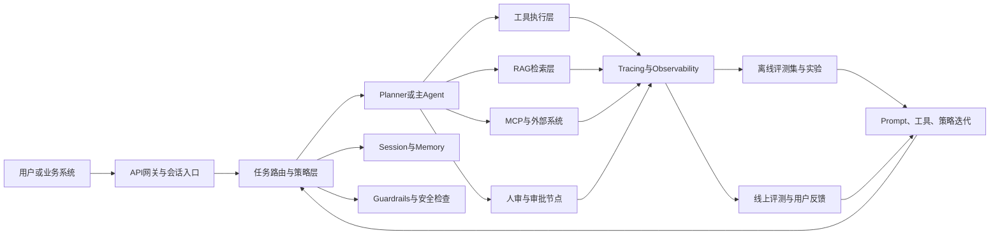
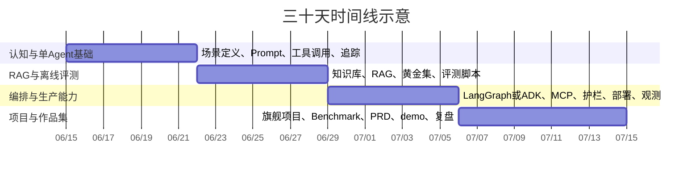

# 从零到具备真实生产环境 AI Agent 产品经理技能的三十天落地计划

## 执行摘要

这份计划不是“再学一遍大模型基础”，而是把你已经具备的工程能力，快速转换成**可定义问题、可设计 Agent、可做评测、可做上线权衡、可写 PRD、可跑 demo、可解释业务价值**的 AI Agent 产品经理能力。你给出的背景假设是：通信工程或通信网络硕士、会 Python、熟悉 PyTorch、LangChain、RAG、Embedding、联邦学习、能搭环境，但产品经验不足；因此，最短路径不是继续深挖模型训练，而是建立**问题定义—方案设计—评测—观测—迭代—上线**这一整条产品化闭环。fileciteturn0file0

从当前主流官方框架与文档看，真实生产中的 Agent 能力已经高度收敛到几件事：**工具调用、状态/会话、编排、护栏、安全、可观测、离线与在线评测、云端部署**。OpenAI Agents SDK 明确把 agents、handoffs、guardrails、sessions、tracing 和 MCP 工具接入放在核心位置；LangGraph 强调 durable execution、persistence、human-in-the-loop 和 production deployment；LangSmith 将评测拆成 dataset、target function、evaluator，并明确区分离线评测与线上评测；Anthropic、MCP、Google ADK、AWS Bedrock Agents 等也都把工具循环、状态管理、评测、部署和安全当作一等公民。换句话说，你要学的不是“一个酷 demo”，而是“一个可持续迭代的产品系统”。citeturn37view2turn9view0turn9view1turn23view6turn8view1turn24view0turn21view0turn22view1

这份计划按 **三十天、每天六小时、总计一百八十小时** 设计，目标是在月底交付一套足够像真实团队产出的作品包：**一个旗舰 Agent 项目、一个离线评测集、一个线上观测方案、一个 PRD、一个实验报告、一个 demo 视频、一个案例复盘**。如果你按表执行，一个月后你未必已经是“资深 PM”，但会具备进入真实 Agent 产品团队最关键的入场券：你能清楚解释为什么这样设计产品、为什么这样做评测、为什么这个指标比另一个更重要、为什么这个模型或云选型更适合当前阶段。citeturn23view6turn26view3turn26view5turn25view0turn37view0

## 起点假设与能力缺口

基于你的简历与提问，最重要的判断不是“你能不能做 Agent”，而是“你能不能把 Agent 当作产品来做”。工程背景候选人通常已经具备编码、调包、环境搭建、基础模型理解与局部实验能力；真正欠缺的，往往是以下五类产品化能力：**问题与场景定义、任务流程设计、评测体系搭建、失败模式复盘、上线后的质量/成本/安全权衡**。这也是为什么这套计划不会把大段时间再投入到 PyTorch 或向量检索基础，而会把大量时间投入到 PRD、评测集、trace、红队、安全、SLA、成本和发布节奏上。fileciteturn0file0

一线框架的设计也在印证这个判断。OpenAI Agents SDK 把“什么时候用 Responses API 直接控 loop、什么时候用 Agents SDK 管理 tools/guardrails/sessions/workspace”写得非常清楚；LangSmith 的评测概念文档强调，离线评测用来做 benchmarking、regression testing、unit testing、backtesting，线上评测则服务于 real-time monitoring、anomaly detection 和 production feedback；OpenAI 的安全最佳实践则明确建议 moderation、human oversight 与 adversarial testing；Anthropic 和 MCP 文档把 tool loop、工具 schema 和开放协议接入描述得非常具体。对想转向 Agent PM 的工程候选人来说，这些就是“产品基本功”的官方版本。citeturn37view2turn23view6turn26view3turn26view5turn8view1turn24view0

建议你把月底能力目标拆成下面这张“能力-证据”表。这样做的好处是：你每天不是在“学知识”，而是在持续累积**可展示证据**。

| 能力维度 | 月底必须能做什么 | 可展示证据 |
|---|---|---|
| 问题定义 | 能把一个 Agent 场景写成用户问题、业务目标、边界、成功指标 | 一页纸场景定义 + 北极星指标 |
| Agent 设计 | 能清楚描述单 Agent、多 Agent、RAG、MCP、工具调用的取舍 | 系统架构图 + 工具清单 + 流程图 |
| 评测能力 | 能同时做离线黄金集与线上 trace 监控 | `evals/` 目录、样本集、grader 脚本、实验报告 |
| 生产意识 | 能解释延迟、成本、安全、回退、人工审批机制 | SLO 表、护栏策略、fallback 方案 |
| 产品表达 | 能写 PRD、实验设计、复盘 memo、发布说明 | PRD、decision memo、上线 checklist |
| 作品呈现 | 能在面试里讲清楚“做了什么、为什么这么做、怎么验证有效” | demo 视频、案例页、STAR 故事脚本 |

## 学习主线与系统架构

这一个月建议按四段推进：先补**单 Agent 与产品化认知**，再补**RAG 与离线评测**，然后过渡到**编排、MCP、会话、观测与部署**，最后做**项目打磨与作品集封装**。这样的顺序符合主流生产框架对能力的组织方式：从 tool use 与 prompt control 起步，再进入 orchestration/runtime，再进入 tracing/evaluation/safety，再进入 deployment 与 continuous improvement。citeturn8view1turn9view0turn23view6turn26view3turn21view0turn22view1

下面这张 Mermaid 图，建议你直接作为整个月的“总心智模型”。它是一个足够接近生产环境、又不至于过度工程化的最小架构：用户请求进入任务路由和会话层，Agent 根据策略去调用工具、知识库或 MCP 外部系统，同时护栏、安全、观测、离线集与线上反馈共同形成迭代闭环。这个心智模型非常重要，因为 PM 的核心不是会把框架连起来，而是知道**哪一层出了问题**。citeturn37view2turn9view0turn24view0turn23view6turn26view3turn26view5



如果以 **2026 年 6 月 15 日** 作为 Day 1，时间线可以这样理解。即便你实际开始日期不同，也建议保持同样的四段结构，因为它和官方文档中“先构建、再评测、再部署、再持续改进”的顺序是对齐的。citeturn23view6turn21view0turn22view1



你会发现，这个架构天然要求 PM 具备两种视角。第一种是**功能视角**：用户为什么需要这个 Agent、任务边界在哪里、哪些步骤必须有人审。第二种是**运行视角**：工具为什么失败、RAG 为什么答非所问、哪个指标先恶化、版本回归怎么被发现。LangSmith 对 offline/online evaluation 的区分、OpenAI 对 tracing/guardrails 的强调、Anthropic 对 clear instructions 和 tool schema 的要求，本质上都在帮助你形成第二种视角。citeturn23view6turn37view2turn28view2turn8view1

## 可直接交给 Codex 的总提示词

下面这条 prompt 适合直接交给 Codex 或 CodeGPT，用来生成**完整三十天计划**，也可以在把 `{day}` 设为某个具体值时，生成某一天的细化日程。它吸收了官方 prompt best practices 里的几个关键原则：**角色明确、指令清晰、步骤顺序化、给出输出格式、给出验收标准、要求测试与复盘、要求引用资源、要求产出可执行工件**。OpenAI 文档强调 agentic tasks 要有清晰 workflow guidance 和 testing/validation；Anthropic 文档强调 clear/direct、few-shot 示例和顺序步骤；Agents SDK 文档强调 tools、guardrails、sessions、tracing 与 evaluation 要成为一体化设计的一部分。citeturn23view0turn28view2turn28view1turn37view2

```text
你是“资深 AI Agent 产品经理训练架构师 + 技术教练 + 面试作品集顾问”。

请为一名工程背景候选人生成一套【从 0 到在真实生产环境具备 AI Agent 产品经理核心技能】的学习与实战计划。

【候选人画像】
- 背景：{background}
- 学历：{education}
- 编程能力：{programming_skills}
- 已会技术：{existing_skills}
- 当前短板：{gaps}
- 目标岗位：{target_role}
- 目标行业或场景：{industry_or_domain}

【计划范围】
- 总周期：{total_days} 天
- 今日模式：{mode} 
  - 若 {mode}=full_plan：输出完整 {total_days} 天计划
  - 若 {mode}=single_day：仅输出第 {day} 天完整日程
- 每日总时长：{hours} 小时
- 每日固定结构：理论 2h + 拆解 2h + 实战 2h
- 开始日期：{start_date}
- 输出语言：{language}
- 工作方式：必须可落地、能当天完成、能在个人电脑或常见云服务上完成
- 假设：未指定模型/云/框架/供应商时，为“无特定限制”；但必须列出可选项、优劣、适用场景与替代方案

【能力目标】
计划结束后，候选人必须至少具备以下能力：
1. 能把 Agent 场景写成用户问题、业务目标、边界与成功指标
2. 能设计单 Agent、多 Agent、RAG、MCP/工具调用的系统方案
3. 能编写 PRD、流程图、指标体系、评测集与实验计划
4. 能搭建最小可行 Agent 原型并进行离线评测、线上观测与失败复盘
5. 能解释模型/工具/云/框架选型的理由
6. 能产出可展示的作品集：项目、PRD、评测报告、demo、复盘

【输出要求】
如果 {mode}=full_plan，请严格按以下结构输出：
A. 执行摘要
B. 能力地图：分为“产品定义 / Agent 设计 / 评测 / 观测 / 安全 / 上线 / 业务表达”
C. 周计划：按周给出主题、周目标、关键交付物、周验收标准
D. 三十天逐日表格，列包含：
   - Day
   - 当日主题
   - 理论 2h 学什么
   - 拆解 2h 拆什么产品/案例/系统
   - 实战 2h 做什么
   - 当日产出物
   - 验收标准
   - 风险与替代方案
E. 三个项目建议：
   - 项目名称
   - 目标用户
   - 用户痛点
   - 核心功能
   - MVP 范围
   - 指标体系
   - 推荐技术栈
   - 推荐 Benchmark / 公开数据集 / 自建评测方法
F. 技术栈与模型/云对比：
   - {provider_options}
   - {framework_options}
   - {cloud_options}
   - 每个选项都写优点、缺点、适用场景、推荐阶段
G. 输出可直接执行的 repo 结构建议：
   - docs/
   - evals/
   - data/
   - src/
   - demos/
   - weekly_reviews/
H. 给出每周复盘模板与月末作品集清单

如果 {mode}=single_day，请严格按以下结构输出：
A. 第 {day} 天目标
B. 今日 6 小时时间块安排（精确到半小时或一小时）
C. 理论 2h：学习目标、阅读顺序、阅读产出
D. 拆解 2h：拆解对象、拆解维度、输出模板
E. 实战 2h：编码/配置/评测/文档任务，必须给出具体文件名或目录名
F. 当日产出物清单
G. 验收标准
H. 若提前完成，追加任务；若卡住，降级方案
I. 与前一日和后一日的依赖关系

【强约束】
- 不要泛泛而谈；每一项任务都要具体到“动作 + 产出 + 验收”
- 所有任务都必须服务于“真实生产环境中的 AI Agent 产品经理能力”
- 不要把重点放在大模型训练本身；重点放在产品化、评测、观测、上线、复盘
- 每周至少有一个可运行 demo
- 从第 1 周开始就建设评测集与复盘文档
- 从第 2 周开始就加入 trace、日志与指标
- 从第 3 周开始就加入 guardrails、回退、人工审批或安全策略
- 月底必须形成完整作品集，而不是零散 demo
- 优先使用官方文档、原始论文、高质量中文资源
- 输出必须体现 PM 视角：目标用户、价值、边界、指标、实验、发布与迭代

【质量标准】
请确保计划同时满足：
- 可执行
- 可评测
- 可展示
- 可复用
- 可面试表达

【可替换变量】
{background}
{education}
{programming_skills}
{existing_skills}
{gaps}
{target_role}
{industry_or_domain}
{total_days}
{day}
{hours}
{language}
{start_date}
{mode}
{provider_options}
{framework_options}
{cloud_options}
{project}
{benchmark}
{repo_name}
{resource_preferences}
```

## 推荐资源清单与技术栈选择

先给结论：对于你这种“技术底子够、产品经验弱”的背景，最值得优先吃透的是**官方文档 + 两三篇 foundational paper + 一套评测文档 + 一套中文可替代栈文档**。原因很简单：Agent PM 的竞争力不在于“知道多少模型名”，而在于你能不能把 tool use、状态、评测、观测、护栏和部署串成一个完整故事。citeturn37view2turn9view0turn23view6turn26view3

| 类型 | 资源 | 说明 | 依据 |
|---|---|---|---|
| 官方文档 | [OpenAI Function Calling](https://platform.openai.com/docs/guides/function-calling) | 学会把“自然语言意图”变成“严格结构化工具调用”，这是 Agent 产品落地的第一步。 | citeturn5view0 |
| 官方文档 | [OpenAI Prompt Engineering](https://developers.openai.com/api/docs/guides/prompt-engineering) | 适合拿来学习如何写清楚角色、流程、测试要求与 agentic workflow 提示。 | citeturn23view0 |
| 官方文档 | [OpenAI Production Best Practices](https://developers.openai.com/api/docs/guides/production-best-practices) | 关注 API key 安全、rate limit、成本与 usage 监控，能帮助你建立“上线视角”。 | citeturn26view1turn26view2 |
| 官方文档 | [OpenAI Safety Best Practices](https://developers.openai.com/api/docs/guides/safety-best-practices) | moderation、human oversight、red-teaming 是你做 PM 时必须会讲的安全底线。 | citeturn26view3turn26view5 |
| 官方文档 | [OpenAI Agents SDK](https://openai.github.io/openai-agents-python/) | 很适合建立“tools / handoffs / sessions / tracing / guardrails”一体化心智模型。 | citeturn37view2turn37view3 |
| 官方文档 | [Anthropic Building Effective Agents](https://www.anthropic.com/engineering/building-effective-agents) | Anthropic 官方关于 Agent 设计与工程权衡的长文，适合养成系统设计直觉。 | citeturn7view0 |
| 官方文档 | [Anthropic Tool Use](https://docs.anthropic.com/en/docs/build-with-claude/tool-use) | 理解 agentic loop、tool schema、strict tool use 与 client/server tools 的好入口。 | citeturn8view1 |
| 官方文档 | [Anthropic Prompting Best Practices](https://platform.claude.com/docs/en/build-with-claude/prompt-engineering/claude-prompting-best-practices) | 对“清晰直接、给例子、用 XML 结构化、按步骤写提示”讲得非常具体。 | citeturn28view2turn28view1turn28view3 |
| 官方标准 | [Model Context Protocol Intro](https://modelcontextprotocol.io/docs/getting-started/intro) | MCP 是当前最值得 PM 学的协议层能力，方便理解“Agent 如何接外部系统”。 | citeturn8view3 |
| 官方标准 | [MCP Architecture](https://modelcontextprotocol.io/docs/learn/architecture) | 学 host/client/server、tools/resources/prompts、transport 层，帮助你画清系统边界。 | citeturn24view0 |
| 官方文档 | [LangGraph Overview](https://docs.langchain.com/oss/python/langgraph/overview) | 想系统学习长流程编排、持久化与 human-in-the-loop，这一页几乎是必读。 | citeturn9view0 |
| 官方文档 | [LangSmith Evaluation Quickstart](https://docs.langchain.com/langsmith/evaluation-quickstart) | 适合第一次搭离线评测：dataset、target function、evaluator 三件套写得很清楚。 | citeturn9view1 |
| 官方文档 | [LangSmith Evaluation Concepts](https://docs.langchain.com/langsmith/evaluation-concepts) | 理解 offline vs online evaluation、dataset version、feedback 回流最有帮助。 | citeturn23view5turn23view6 |
| 官方文档 | [Google ADK](https://adk.dev/) | 如果你想看另一条“多语言 + graph workflow + eval + deploy”路线，ADK 很值得参考。 | citeturn22view5turn21view0 |
| 官方文档 | [Amazon Bedrock Agents](https://docs.aws.amazon.com/bedrock/latest/userguide/agents.html) | 看看托管式企业 Agent 服务如何把 knowledge base、action group、trace、deploy 串起来。 | citeturn22view0turn22view1 |
| 官方文档 | [Azure OpenAI Function Calling](https://learn.microsoft.com/en-us/azure/foundry/openai/how-to/function-calling) | 如果你目标公司在微软生态，这页能快速建立 Azure 上的工具调用与并行调用认知。 | citeturn22view2turn22view3 |
| 中文官方 | [Qwen 中文文档](https://qwen.readthedocs.io/zh-cn/latest/) | 中文友好，且直接列出 Qwen-Agent、函数调用、LangChain、LlamaIndex 等框架入口。 | citeturn33view1turn33view2 |
| 中文官方 | [Qwen3 博客](https://qwenlm.github.io/blog/qwen3/) | 想理解开源中文模型在 thinking / non-thinking 与 agentic capabilities 上的设计，可读这篇。 | citeturn32view0 |
| 中文官方 | [DeepSeek API 文档](https://api-docs.deepseek.com/zh-cn/) | API 与 OpenAI/Anthropic 格式兼容，还给了 Agent 工具接入入口，适合做中文替代栈。 | citeturn35view1turn35view2 |
| 原始论文 | [ReAct](https://arxiv.org/abs/2210.03629) | 理解“推理 + 行动”交替进行的经典范式，很多 Agent 产品都在用它的思想。 | citeturn10view0 |
| 原始论文 | [Toolformer](https://arxiv.org/abs/2302.04761) | 帮你从研究视角理解模型为什么需要学会“何时调用工具、传什么参数、如何利用返回值”。 | citeturn10view1 |

在“无特定限制”的前提下，真正可选的不是某个单一模型名，而是**一整套实现路线**。下面这张表更有实际价值。

| 选项 | 更适合哪个阶段 | 优点 | 代价与局限 |
|---|---|---|---|
| OpenAI Responses API + Agents SDK | 最适合作为前两周主栈 | 同生态里既能自己控 loop，也能在需要时直接上 tools、guardrails、sessions、tracing、sandbox workspace。对建立生产思维最省时间。 citeturn37view2turn37view3 | 商业 API 成本较高；若目标公司偏开源或国产化，需要再补一条兼容栈。 |
| Anthropic Tool Use + MCP | 适合补“工具循环 + 协议接入”视角 | Anthropic 对 clear prompting、tool loop、strict tool use 和 agentic systems 的描述很清晰；MCP 又是开放协议，迁移思维强。 citeturn8view1turn28view2turn24view0 | 你通常仍需自己搭更多编排与观测层。 |
| LangGraph + LangSmith | 最适合第 2-3 周建立“编排 + 评测 + trace”闭环 | 对长流程、持久化、人审、deployment、offline/online evaluation 的覆盖最完整，特别适合做 PM 作品集。 citeturn9view0turn9view1turn23view6 | 学习曲线比直接写脚本高，早期容易过度工程化。 |
| Google ADK + Agent Platform | 适合补充第二条企业级路线 | 多语言支持、graph workflows、evaluation、observability、deploy 都是内建能力，能帮助你理解“企业级 Agent 平台”的组织方式。 citeturn21view0turn22view5 | 生态与使用习惯和 Python-only 开发者有一定迁移成本。 |
| AWS Bedrock Agents | 适合想理解托管式企业 Agent 的候选人 | 托管 memory、monitoring、encryption、permissions、API invocation 与 knowledge base，方便理解企业采购视角。 citeturn22view0turn22view1 | 灵活性相对弱，容易学会“会配置产品”但不理解底层机制。 |
| Azure OpenAI | 适合面向微软生态企业客户 | 企业合规、Azure 生态整合优势明显，并支持单/并行 function calling。 citeturn22view2turn22view3 | 编排能力通常仍要依赖你自己或额外框架来补足。 |
| Qwen / DeepSeek + vLLM / SGLang / 兼容 SDK | 适合第 3-4 周做中文与国产化作品补充 | 中文资源丰富，Qwen 文档直接覆盖 Qwen-Agent / 函数调用 / LangChain；DeepSeek 又兼容 OpenAI/Anthropic API 格式，迁移成本低。 citeturn33view1turn35view1turn32view0 | 你要更多自己承担评测、观测、安全与运维责任。 |

如果只能选一条主线路，我建议你这样走：**第 1-2 周用 OpenAI 或 Anthropic 快速做单 Agent、prompt、tool use 和评测；第 2-3 周用 LangGraph/LangSmith 或 ADK 把编排、trace、评测与部署补齐；第 4 周用 Qwen 或 DeepSeek 再做一层兼容或中文替代方案**。这样你既有“最快进入生产能力的主栈”，又有“更适合中文企业环境的备选栈”。citeturn37view2turn8view1turn9view0turn21view0turn33view1turn35view2

## 每日模块模板与三十天逐日任务概要表

每天六小时，固定切成 **理论两小时、拆解两小时、实战两小时**，是这份计划能够落地的关键。原因不是“平均分配时间更公平”，而是因为 Agent PM 的能力本来就来自三种认知同时增长：一是知道框架与论文里怎么说，二是能从成熟产品看到别人怎么做，三是能自己把东西做出来并留下证据。仅做其中一项，月底都会空心化。citeturn28view2turn28view1turn23view6turn37view2

你可以直接把下面这个模板复用于所有三十天。

| 模块 | 时间 | 要做什么 | 最低产出物 | 最低验收标准 |
|---|---|---|---|---|
| 理论 | 2h | 只读官方文档、原始论文或高质量中文官方资料；把知识压缩成自己的产品语言 | 1 页结构化笔记，回答“这项能力对产品有什么影响” | 不只是摘抄，必须写出“对 Agent PM 的设计启发” |
| 拆解 | 2h | 拆一个现成产品、开源项目或 benchmark：目标用户、任务流、工具、指标、失败模式 | 1 份拆解表或流程图 | 能回答“它为什么这样设计，而不是另一种设计” |
| 实战 | 2h | 用代码或配置把当天主题落地；要求写 trace、文档和评测脚本 | 可运行 demo、脚本、PRD、评测样例中的至少一种 | 当天产物必须能真的运行或被阅读复现 |

为了避免月底只剩下零散脚本，建议你从 Day 1 就使用统一 repo 结构，例如 `docs/`, `evals/`, `data/`, `src/`, `demos/`, `weekly_reviews/`。LangSmith 文档反复强调 dataset、experiment、feedback 与版本管理的重要性；OpenAI Agents SDK 和生产文档也都强调 tracing、guardrails、workspace/state 管理与成本/限速意识。因此，你的学习仓库本身就应该长得像一个轻量生产项目，而不是“学习笔记文件夹”。citeturn23view5turn23view6turn37view2turn25view0

下面是三十天逐日任务概要表。你可以直接按表执行；如果某天卡住，优先保住**产出物**与**验收标准**，而不是执着于某个具体框架。

| Day | 当日主题 | 理论 2h | 拆解 2h | 实战 2h | 当日产出物 | 验收标准 |
|---|---|---|---|---|---|---|
| D1 | 岗位地图与学习仓库初始化 | 读 OpenAI Agents SDK、LangGraph 概览，整理 Agent PM 能力地图 | 拆一个你最熟悉的 AI 产品：用户、任务、工具、指标 | 建立 GitHub 仓库与目录结构，写 README 与学习目标 | `README.md`、能力矩阵、repo 结构 | 仓库可用；能力地图覆盖产品、评测、观测、安全、上线 |
| D2 | 场景选择与问题定义 | 读 prompt best practices 与问题定义方法 | 拆 3 个 Agent 场景，写 JTBD 与边界 | 选定 1 个主项目方向与 2 个备项目方向 | 场景定义文档、一页 JTBD | 能清楚说出“为什么这个场景值得做” |
| D3 | Prompt、角色、流程与工具 schema | 读 OpenAI/Anthropic prompt 文档 | 拆 ChatGPT / Claude / Copilot 一类产品的指令结构 | 为主项目定义 system prompt、tool list、JSON schema | prompt 草稿、工具清单、schema 文档 | schema 清晰，能解释每个工具存在的必要性 |
| D4 | 单 Agent 最小闭环 | 读 function calling / tool use 文档 | 拆一个简单 research agent 或 assistant 的 loop | 做一个能调 2 个 mock 工具的最小 Agent | 可运行 demo、CLI 或 notebook | 用户输入→模型→工具→结果全链跑通 |
| D5 | Tracing 与可观测初步 | 读 Agents SDK tracing 或 LangSmith tracing/eval 文档 | 拆一个 trace，识别每一步的输入输出 | 为 D4 Agent 接 tracing、日志与步骤记录 | trace 截图、日志 schema、故障样例 | 能从 trace 中复盘至少 2 个失败点 |
| D6 | 离线评测集与 grader 基线 | 读 LangSmith evaluation quickstart / concepts | 拆 benchmark 的样例结构 | 为主项目写 30 条黄金样本与基础 grader | `evals/golden_v0.jsonl`、grader 脚本 | 样本可批量跑通并产出汇总结果 |
| D7 | 周复盘与 PRD v0 | 回看本周文档，补齐产品语言 | 拆一个好的 PRD 结构 | 写主项目 PRD v0 + 第一周复盘 | `PRD_v0.md`、复盘 memo | PRD 有目标用户、价值、边界、指标、风险 |
| D8 | RAG 目标与知识库设计 | 读 RAG 与 MultiHop-RAG 相关资料 | 拆一个知识助手：检索、重排、回答、引用 | 为主项目设计 corpus、chunking、metadata | 数据方案文档、索引策略说明 | 能解释为什么这样切分与过滤 |
| D9 | RAG MVP | 读检索链路与引用生成思路 | 拆一个带引用的问答体验 | 为主项目接入向量检索与引用输出 | RAG demo、引用格式规范 | 能回答问题并返回引用来源 |
| D10 | RAG 评测与多跳问题 | 读 HotpotQA、FEVER、MultiHop-RAG | 拆“检索错 / 推理错 / 归因错”三类失败 | 用公开集小样本跑一次 baseline | baseline 报告、误差分类表 | 至少区分 3 类失败并给出改进方向 |
| D11 | 编排框架入门 | 读 LangGraph 或 ADK graph workflow 文档 | 拆一个 planner-router-executor 图 | 将当前 Agent 重构为显式工作流 | 工作流图、状态定义、代码重构 | 不再只有单脚本，而是有清晰节点与状态 |
| D12 | MCP / OpenAPI / 外部系统接入 | 读 MCP intro/architecture 或 API 工具接入资料 | 拆 host/client/server 或 connector 模式 | 接入 1 个 MCP server、OpenAPI 工具或模拟企业 API | 工具接入文档、接入 demo | 能说明“为什么这里用 MCP 而不是硬编码函数” |
| D13 | Guardrails 与红队 | 读 safety best practices 与 adversarial testing | 拆 prompt injection、误调用、越权三类风险 | 写 20 条红队测试并加 1 层保护策略 | 红队集、护栏方案、失败样例 | 至少阻断 1 类明显风险路径 |
| D14 | 周复盘与架构 v1 | 回看 D8-D13，补齐指标与风险 | 对比单 Agent 与工作流版本差异 | 输出系统架构 v1 与 Demo v1 | 架构图、demo 录像、PRD v1 | 已有“可演示 + 可解释 + 可评测”的雏形 |
| D15 | 多 Agent 分工与委派 | 读 handoffs / orchestration 概念 | 拆 planner / researcher / reviewer 的职责边界 | 为主项目设计 2-3 个角色 agent | 多 agent 方案文档、角色 prompt | 每个 agent 的职责不重叠 |
| D16 | Human-in-the-loop 与审批流 | 读 human-in-the-loop 或 approval 模式 | 拆哪些决策需要人审 | 在流程中加入审批、确认或 fallback 节点 | 人审流程图、审批逻辑 demo | 高风险动作前必须能暂停并请求确认 |
| D17 | Session、Memory 与用户状态 | 读 sessions / memory 文档 | 拆短期状态与长期偏好如何区分 | 为主项目加入 session state 或 memory | 状态模型文档、状态持久化代码 | 多轮任务不丢上下文，且状态结构可解释 |
| D18 | 成本、延迟、质量三角 | 读 production docs 与 evaluation concepts | 拆一个“快但差”和“准但贵”的取舍场景 | 为主项目设计 1 张质量/成本/延迟看板 | 指标表、预算表、SLO 草稿 | 能说出当前 MVP 的 p95 延迟和单任务成本估算 |
| D19 | 部署路径 | 读 ADK/Bedrock/Azure 或自托管路线 | 拆“自托管 vs 托管云”差异 | 把主项目部署到本地服务、Cloud Run、Render、Railway 或类似环境 | 部署说明、环境变量模板 | 他人能按 README 启动项目 |
| D20 | 线上观测与报警 | 读线上评测与监控概念 | 拆 trace、latency、error、tool-call 失误指标 | 增加关键事件埋点、错误日志、告警条件 | 事件字典、监控草图 | 出现失败时能定位到哪一层出错 |
| D21 | 小规模用户测试 | 学习用户访谈与可用性反馈整理 | 拆 5 份真实或模拟测试对话 | 组织 5 次用户试用或 20 条模拟会话 | UAT 记录、问题 backlog | 至少收集 10 条可行动问题 |
| D22 | 旗舰项目立项冻结 | 回看全部 backlog，砍需求 | 拆 MVP 与 V1 的边界 | 冻结主项目 scope，确定月底交付范围 | scope 文档、优先级矩阵 | 不再继续加需求，只做关键闭环 |
| D23 | 数据与实验设计 | 读 experiment / compare versions 概念 | 拆 A/B 或版本对比方法 | 设计 v1/v2 对照实验 | 实验设计文档、版本对比表 | 能比较两个版本而不是只看主观感觉 |
| D24 | Benchmark 适配与批量评测 | 读 GAIA、AgentBench、τ-bench、WebArena 等摘要 | 拆哪些 benchmark 适合你的项目 | 选 1-2 个最相关 benchmark 子集运行 | benchmark 报告、适配脚本 | 至少完成 1 次公开集 + 1 次自建集评测 |
| D25 | 失败模式分类与修复循环 | 学习如何写 postmortem | 拆失败案例：检索、工具、逻辑、越权、格式 | 按失败分类做 2-3 轮修复 | postmortem、修复清单、前后对比 | 至少看到 1 个核心指标改善 |
| D26 | PRD 正式版与发布清单 | 回读所有文档，做统一表达 | 拆 launch checklist | 输出 PRD 正式版、发布 checklist、运营说明 | `PRD_final.md`、launch checklist | 面试时可直接展示给招聘方 |
| D27 | Demo 与讲解脚本 | 学 demo 组织方式 | 拆一个好 demo 的叙事结构 | 录 3-5 分钟 demo 视频与讲解稿 | demo 视频、讲解稿 | 视频能讲明场景、流程、指标、价值 |
| D28 | 项目案例页与简历子弹点 | 学作品集包装法 | 拆优秀 case study 页面 | 写案例页与 3-5 条简历 bullet | case study、简历 bullet | 每条 bullet 都包含动作、结果、指标 |
| D29 | 面试故事与反问清单 | 学 STAR / PM 面试答法 | 拆 10 个典型 Agent PM 面试题 | 写 6 个 STAR 故事与 10 个反问 | 面试题库、STAR 文档 | 能完整讲出“从问题到上线”的闭环故事 |
| D30 | 最终发布与复盘 | 回看整月素材，形成方法论 | 拆这个月的关键转折点 | 发布最终版本，写 30 天复盘与下一个 30 天路线图 | 最终仓库、总复盘、下阶段计划 | 作品集完整，且有明确下一阶段迭代方向 |

## 项目建议、评测数据集与 Codex 每日细化示例

先说评测。对于 Agent PM，最不该忽视的一件事就是：**不要先写功能，再临时想怎么评测**。LangSmith 的离线/在线评测概念、OpenAI 的安全与红队建议，都指向同一个结论：你必须同时有**公开 benchmark 的外部参照**和**面向目标场景的自建黄金集**。公开 benchmark 帮你看“方向是否合理”，自建集帮你看“产品是不是真的适合你的用户”。citeturn23view6turn26view3turn26view5

下面这张表按“我建议你优先接触的顺序”来排。

| 优先级 | 数据集或方法 | 主要测什么 | 为什么建议你优先接触 | 依据 |
|---|---|---|---|---|
| 高 | [APIGen](https://arxiv.org/abs/2406.18518) | 函数调用与参数生成 | 不仅能拿来参考数据，还能学会“可验证函数调用数据该怎么造与怎么验”。 | citeturn31view5 |
| 高 | [GAIA](https://arxiv.org/abs/2311.12983) | 通用助理、研究类 Agent、工具使用 | 题目贴近现实，需要 reasoning、multimodality、browsing 与 tool-use，适合做“研究类 Agent”外部标尺。 | citeturn12view0 |
| 高 | [AgentBench](https://arxiv.org/abs/2308.03688) | 多环境下的 agent reasoning 与 decision-making | 它本身就是在评估 LLM 作为 agent 的多维能力，适合建立“Agent 能力不是单指标”的认知。 | citeturn31view0 |
| 高 | [τ-bench](https://arxiv.org/abs/2406.12045) | 用户-模型-工具多轮交互与规则遵循 | 很贴近真实生产，因为它显式关注 domain-specific rules 与多轮交互稳定性，还提出了 pass^k。 | citeturn31view4 |
| 高 | [WebArena](https://arxiv.org/abs/2307.13854) | 浏览器/网页操作 Agent | 如果你以后想做 web task automation，这个 benchmark 非常有代表性。 | citeturn31view3 |
| 中 | [ToolLLM / ToolBench 论文](https://arxiv.org/abs/2307.16789) | 大规模 API 选择与工具学习 | 适合培养“工具很多时，Agent PM 怎么设计工具清单与选择逻辑”的直觉。 | citeturn31view1 |
| 中 | [SWE-bench](https://arxiv.org/abs/2310.06770) | 代码 Agent / issue resolution | 如果你的项目里有“代码助手、研发协作 Agent、issue triage”方向，非常值得用作参考。 | citeturn31view2 |
| 中 | [MultiHop-RAG](https://arxiv.org/abs/2401.15391) | 多跳 RAG 检索与推理 | 对 RAG PM 特别有价值，因为它把知识库、问题、答案和 supporting evidence 一起提供了。 | citeturn30view2 |
| 中 | [HotpotQA](https://arxiv.org/abs/1809.09600) | 多跳问答与 supporting facts | 非常适合练“检索正确但推理错误”和“推理正确但引用错误”的区分。 | citeturn29view0 |
| 中 | [FEVER](https://arxiv.org/abs/1803.05355) | 事实核验与证据引用 | 如果你的 Agent 输出要面向企业知识或研究结论，FEVER 很适合做 groundedness 训练。 | citeturn29view1 |
| 中 | [Natural Questions](https://arxiv.org/abs/1901.08634) | 开放域 QA 与答案抽取 | 适合做检索召回与答案定位的基础底座数据。 | citeturn30view0 |
| 高 | 线上日志转离线集 | 生产回归与真实问题覆盖 | LangSmith 明确建议从负反馈、长延迟、错误样本和线上 traces 中扩充 dataset。 | citeturn23view5turn23view6 |
| 高 | 手工黄金集 + synthetic 扩增 | 低成本构建可靠评测 | LangSmith 建议从少量高质量手工样例出发，再做 synthetic data 扩展。 | citeturn23view5 |

如果你问“一个月内最值得自己造哪种数据”，我的建议是：**五十到一百条目标场景黄金集 + 二十条红队集 + 二十条工具异常/超时集**。黄金集测业务价值，红队集测安全，异常集测生产鲁棒性。这个组合比刷很多泛 benchmark 更像真实 PM 工作。citeturn23view6turn26view3turn26view5

下面是三个适合作为作品集的项目建议。我刻意把它们设计成“既有 PM 味道、又能做出技术样子”的项目。

| 项目 | 目标 | 核心功能 | 最小可行产出 | 建议评测指标 |
|---|---|---|---|---|
| 研究与方案生成 Agent | 面向售前、战略、竞品研究或技术方案撰写场景，帮用户从内部文档 + 外部网页生成带引用结论 | RAG、网页搜索、工具调用、引用输出、结论摘要、人审确认、实验对比 | 一个可上传文档并输出带来源引用的研究报告 demo；配套 PRD、黄金集、实验报告 | 检索 Recall@k、引用覆盖率、grounded answer rate、任务完成率、p95 延迟、单任务成本 |
| 工单分诊与 SOP 执行建议 Agent | 面向客服、运维、流程执行场景，帮用户分类问题、检索 SOP、建议下一步动作 | ticket triage、知识库检索、API/表单工具、审批节点、trace 回放、失败回退 | 一个能处理模拟工单并输出处理建议的 Agent；配套审批流、事件字典、风险清单 | 分类准确率、tool-call argument accuracy、policy compliance、人审通过率、平均处理时长 |
| 研发协作与发布助手 Agent | 面向技术团队，帮助做 issue 总结、任务拆解、版本说明生成与风险检查 | repo 或 issue 检索、代码/文档工具、任务拆解、release note 生成、评测集对比 | 一个能读取 issue/文档并生成任务计划与发布说明的 demo；配套案例页与 benchmark 报告 | issue triage 准确率、摘要正确性、测试通过率、版本回归发现率、用户满意度 |

如果只选一个作为“旗舰项目”，我建议优先做**研究与方案生成 Agent**。原因是它最容易同时展示你对**RAG、tool use、引用、评测、PRD、业务价值、失败复盘**的理解，且和 AI PM 常见工作语境非常接近。GAIA、MultiHop-RAG、HotpotQA、FEVER 与自建黄金集都能自然纳入这个项目。citeturn12view0turn30view2turn29view0turn29view1

最后给你一个**面向 Codex 的“每日细化”提示词示例**。建议你从 Day 8 之后开始每天都用它，让 Codex 自动把“当天目标”扩展成更细的时间块、代码任务、文件名和测试项。它延续了官方 prompt 原则：角色明确、任务可测试、工具使用有边界、要求输出结构化计划与验收。citeturn23view0turn28view2turn37view2

```text
你现在是我的“AI Agent 产品经理训练助教 + 技术实现助教”。

请基于我已经确定的 30 天总计划，细化【第 {day} 天】的执行任务。
今天的主题是：{theme}
项目是：{project}
总时长：{hours} 小时
固定结构：理论 2h + 拆解 2h + 实战 2h

候选人背景：
- 工程基础强，能写 Python，能搭环境
- 已懂基础 LLM / RAG / LangChain
- 当前目标不是刷概念，而是形成“真实生产环境中的 Agent PM 能力”

请严格输出：
1. 今日目标
2. 分时段日程表（按 30min 或 1h 分块）
3. 理论阅读清单（只保留最必要的 2-4 项）
4. 拆解任务（写清楚拆解对象、维度、模板）
5. 实战任务（写到文件级别，例如：
   - docs/prd/day{day}_notes.md
   - evals/day{day}_golden.jsonl
   - src/agent/workflow_day{day}.py
   - demos/day{day}_demo.md）
6. 当日产出物
7. 验收标准
8. 如果卡住的降级方案
9. 如果提前完成的加分项
10. 一段“面试表达提示”：今天这项工作以后在面试里可以怎么讲

附加要求：
- 任务必须具体，不要空泛
- 如涉及代码，给最小可运行版本
- 如涉及评测，给至少 5 条样例的构造思路
- 如涉及产品文档，给模板标题
- 如涉及系统设计，给 Mermaid 草图
- 默认优先官方文档与原始论文
- 默认保留 trace / eval / risk 三件事
```

这套计划真正的价值，不在于你三十天后会不会背很多术语，而在于你会形成一个非常像真实团队成员的工作方式：**先定义问题，再设计任务和工具，再做评测，再接 trace，再做安全，再上线，再复盘，再讲清楚业务价值**。这正是当前所有主流 Agent 官方框架共同在强调的能力结构。citeturn37view2turn9view0turn23view6turn26view3turn21view0